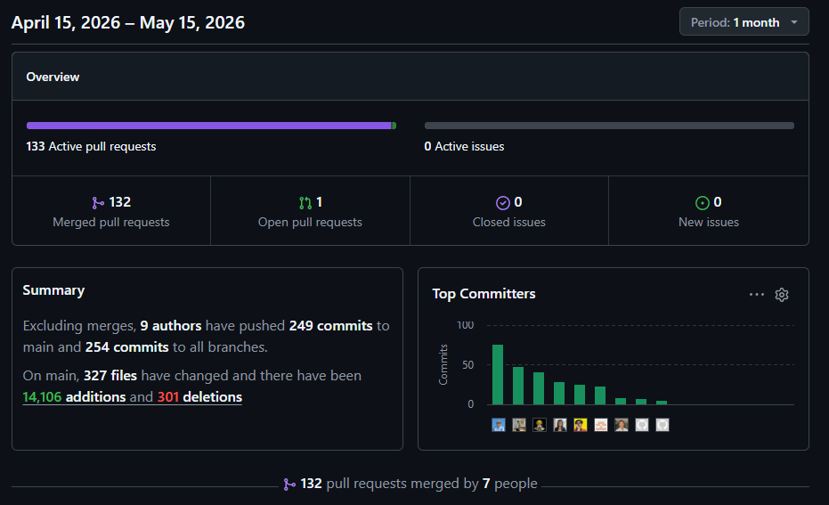
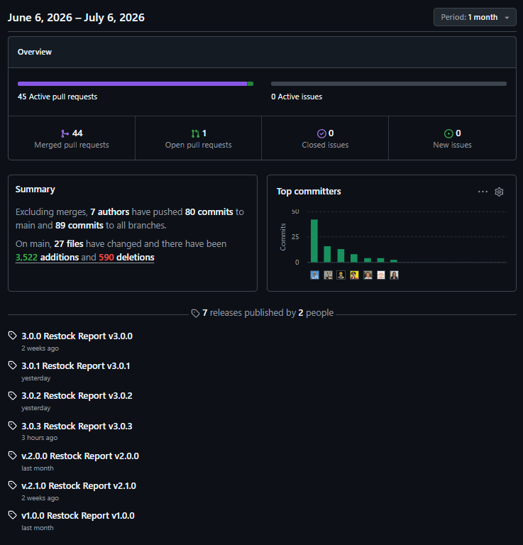

<div class="cover-page" align="center">


<br>
<br>

Universidad Peruana De Ciencias Aplicadas

Carrera de Ingeniería de Software

<br>

<p>
  
<strong> 1ASI0572 </strong>

<strong> <span style="font-size: 100px;"> Desarrollo de Soluciones IoT </span> </strong>

NRC

<strong> 17757 </strong>

<strong> Informe de Trabajo Final </strong>

Docente

<strong> Angel Augusto Velasquez Nuñez </strong>

<br>

Equipo

<strong> UI-Topic </strong>

<br>

Proyecto

<strong> Restock </strong>

<br>

</p>

<strong> Integrantes </strong>


<table style="border-collapse: collapse; border: none; background-color: white; color: black; margin: 8px auto; width: auto;">
  <tr>
    <th style="border: none; text-align: left; background-color: white; color: black; padding: 2px 12px; white-space: nowrap;">Código</th>
    <th style="border: none; text-align: left; background-color: white; color: black; padding: 2px 12px; white-space: nowrap; min-width: 260px;">Apellidos y Nombres</th>
  </tr>
  <tr><td style="border: none; background-color: white; color: black; padding: 2px 12px; white-space: nowrap;">u202021885</td><td style="border: none; background-color: white; color: black; padding: 2px 12px; white-space: nowrap;">Castro Alejos, Julio Daniel</td></tr>
  <tr><td style="border: none; background-color: white; color: black; padding: 2px 12px; white-space: nowrap;">u202312508</td><td style="border: none; background-color: white; color: black; padding: 2px 12px; white-space: nowrap;">Coronel Espinoza, Farid Sebastian</td></tr>
  <tr><td style="border: none; background-color: white; color: black; padding: 2px 12px; white-space: nowrap;">u202311938</td><td style="border: none; background-color: white; color: black; padding: 2px 12px; white-space: nowrap;">Diaz Quispe, Matias Sebastian</td></tr>
  <tr><td style="border: none; background-color: white; color: black; padding: 2px 12px; white-space: nowrap;">u202319831</td><td style="border: none; background-color: white; color: black; padding: 2px 12px; white-space: nowrap;">Guerra Perez, José Jahaziel</td></tr>
  <tr><td style="border: none; background-color: white; color: black; padding: 2px 12px; white-space: nowrap;">u202317483</td><td style="border: none; background-color: white; color: black; padding: 2px 12px; white-space: nowrap;">Juarez Leon, Nicolas Emilio Walter</td></tr>
  <tr><td style="border: none; background-color: white; color: black; padding: 2px 12px; white-space: nowrap;">u202314101</td><td style="border: none; background-color: white; color: black; padding: 2px 12px; white-space: nowrap;">Navarro Chinga, Antonio Jhair</td></tr>
  <tr><td style="border: none; background-color: white; color: black; padding: 2px 12px; white-space: nowrap;">u202319448</td><td style="border: none; background-color: white; color: black; padding: 2px 12px; white-space: nowrap;">Shapiama Rivera, Gabriela Nicole</td></tr>
</table>

&nbsp;

Período 202610
<br>
Julio
</div>

&nbsp;

<div style="page-break-after: always;"></div>

## Registro de Versiones

<table border="1">
  <tr>
    <th> Versión </th>
    <th> Fecha </th>
    <th> Autor </th>
    <th> Descripción de la modificación </th>
  </tr>
  <tr>
    <td> 1.11 </th>
    <td> 02/04/26 </th>
    <td> Julio Castro </th>
    <td> Se agregó la sección relacionada a la descripción de la startup </th>
  </tr>
  <tr>
    <td> 1.12 </th>
    <td> 02/04/26 </th>
    <td> Nicolas Juarez </th>
    <td> Se agregó la sección relacionada con los antecedentes y problematica. </th>
  </tr>
  <tr>
    <td> 1.21 </th>
    <td> 03/04/26 </th>
    <td> Gabriela Shapiama </th>
    <td> Se agregó la seccion relacionada con el Lean UX Problem Statement. </th>
  </tr>
  <tr>
    <td> 1.22 </th>
    <td> 04/04/26 </th>
    <td> Matias Diaz </th>
    <td> Se agregó la seccion relacionada con el Lean UX Assumptions. </th>
  </tr>
  <tr>
    <td> 1.23 </th>
    <td> 04/04/26 </th>
    <td> Antonio Navarro </th>
    <td> Se agregó la seccion relacionada con el Lean UX Hypothesis Statements. </th>
  </tr>
  <tr>
    <td> 1.24 </th>
    <td> 05/04/26 </th>
    <td> Jahaziel Guerra </th>
    <td> Se agregó la seccion relacionada con el Lean UX Canvas. </th>
  </tr>
  <tr>
    <td> 1.25 </th>
    <td> 06/04/26 </th>
    <td> Farid Coronel </th>
    <td> Se agregó la seccion relacionada con los segmentos objetivos. </th>
  </tr>
  <tr>
    <td> 1.31 </th>
    <td> 07/04/26 </th>
    <td> Jahaziel Garcia </th>
    <td> Se agregó la seccion del análisis competitivo </th>
  </tr>
  <tr>
    <td> 1.32 </th>
    <td> 08/04/26 </th>
    <td> Julio Castro </th>
    <td> Se agregó la seccion relacionada el diseño de entrevistas </th>
  </tr>
  <tr>
    <td> 1.33 </th>
    <td> 08/04/26 </th>
    <td> Gabriela Shapiama </th>
    <td> Se agregó la seccion relacionada con el registro de entrevistas para el sector de restaurantes. </th>
  </tr>
  <tr>
    <td> 1.34 </th>
    <td> 08/04/26 </th>
    <td> Farid Coronel </th>
    <td> Se agregó la seccion relacionada con el registro de entrevistas para el sector retail. </th>
  </tr>
  <tr>
    <td> 1.35 </th>
    <td> 10/04/26 </th>
    <td> Nicolas Juarez </th>
    <td> Se agregó la seccion relacionada con el analisis de entrevistas. </th>
  </tr>
  <tr>
    <td> 1.41 </th>
    <td> 11/04/26 </th>
    <td> Matias Diaz </th>
    <td> Se agregó la seccion relacionada con los User Persona. </th>
  </tr>
  <tr>
    <td> 1.42 </th>
    <td> 12/04/26 </th>
    <td> Antonio Navarro </th>
    <td> Se agregó la seccion relacionada con el User Task Matrix. </th>
  </tr>
  <tr>
    <td> 1.43 </th>
    <td> 12/04/26 </th>
    <td> Farid Coronel </th>
    <td> Se agregó la seccion relacionada con el User Journey Mapping. </th>
  </tr>
  <tr>
    <td> 1.44 </th>
    <td> 13/04/26 </th>
    <td> Julio Castro </th>
    <td> Se agregó la seccion relacionada con los User Empathy Maps. </th>
  </tr>
  <tr>
    <td> 1.45 </th>
    <td> 15/04/26 </th>
    <td> Nicolas Juarez </th>
    <td> Se agregó la seccion relacionada con el Big Picture Event Storming. </th>
  </tr>
  <tr>
    <td> 1.46 </th>
    <td> 16/04/26 </th>
    <td> Julio Castro </th>
    <td> Se agregó la seccion relacionada con el Ubiquitous Language. </th>
  </tr>
  <tr>
    <td> 1.51 </th>
    <td> 19/04/26 </th>
    <td> Matias Diaz </th>
    <td> Se agregó la seccion relacionada con los User Stories. </th>
  </tr>
  <tr>
    <td> 1.52 </th>
    <td> 20/04/26 </th>
    <td> Farid Coronel </th>
    <td> Se agregó la seccion relacionada con el Product Backlog. </th>
  </tr>
  <tr>
    <td> 1.61 </th>
    <td> 21/04/26 </th>
    <td> Matias Diaz </th>
    <td> Se agregó la seccion relacionada con el Design-Level Eventstorming. </th>
  </tr>
  <tr>
    <td> 1.62 </th>
    <td> 21/04/26 </th>
    <td> Nicolas Juarez </th>
    <td> Se agregó la seccion relacionada con el Big Picture Event Storming </th>
  </tr>
  <tr>
    <td> 1.63 </th>
    <td> 21/04/26 </th>
    <td> Julio Castro </th>
    <td> Se agregó la seccion relacionada con el Domain Message Flow Modeling. </th>
  </tr>
  <tr>
    <td> 1.64 </th>
    <td> 21/04/26 </th>
    <td> Matias Diaz </th>
    <td> Se agregó la seccion relacionada con el Context Mapping. </th>
  </tr>
  <tr>
    <td> 1.65 </th>
    <td> 21/04/26 </th>
    <td> Gabriela Shapiama </th>
    <td> Se agregó la seccion relacionada con el System Landscape Diagram. </th>
  </tr>
  <tr>
    <td> 1.66 </th>
    <td> 22/04/26 </th>
    <td> Farid Coronel </th>
    <td> Se agregó la seccion relacionada con el Software Architecture Context Level Diagram. </th>
  </tr>
  <tr>
    <td> 1.67 </th>
    <td> 22/04/26 </th>
    <td> Farid Coronel </th>
    <td> Se agregó la seccion relacionada con los Software Architecture Container Level Diagrams. </th>
  </tr>
  <tr>  
  <tr>
    <td> 1.671 </th>
    <td> 22/04/26 </th>
    <td> Matias Diaz </th>
    <td> Se redujo la cantidad de User Stories. </th>
  </tr>
  <tr>
    <td> 1.672 </th>
    <td> 23/04/26 </th>
    <td> Farid Coronel </th>
    <td> Se corrigió la sección del Product Backlog. </th>
  </tr>
  <tr>
    <td> 1.673 </th>
    <td> 23/04/26 </th>
    <td> Nicolas Juarez </th>
    <td> Se corrigió el formato del Big Picture Event Storming. </th>
  </tr>
  <tr>
    <td> 1.71 </th>
    <td> 23/04/2026 </th>
    <td> Jahaziel Guerra </th>
    <td> Se corrigió el Lean UX Canvas. </th>
  </tr>
  <tr>
    <td> 1.72 </th>
    <td> 24/04/2026 </th>
    <td> Antonio Navarro </th>
    <td> Se añadió la sección relacionada a los Mapas de Impacto. </th>
  </tr>
  <tr>
    <td> 1.73 </th>
    <td> 24/04/2026 </th>
    <td> Matias Diaz </th>
    <td> Se corrigió la sección del Design-Level Eventstorming. </th>
  </tr>
  <tr>
    <td> 1.74 </th>
    <td> 24/04/2026 </th>
    <td> Gabriela Shapiama </th>
    <td> Se añadió la sección del Candidate Context Discovery. </th>
  </tr>
  <tr>
    <td> 1.75 </th>
    <td> 24/04/2026 </th>
    <td> Julio Castro </th>
    <td> Se corrigieron los diagramas de Domain Message Flow Modeling. </th>
  </tr>
  <tr>
    <td> 1.76 </th>
    <td> 24/04/2026 </th>
    <td> Nicolas Juarez </th>
    <td> Se añadió la sección de los Bounded Context Canvases. </th>
  </tr>
  <tr>
    <td> 1.77 </th>
    <td> 24/04/2026 </th>
    <td> Gabriela Shapiama </th>
    <td> Se añadió la sección del Software Architecture System Landscape. </th>
  </tr>
  <tr>
    <td> 1.78 </th>
    <td> 24/04/2026 </th>
    <td> Jahaziel Guerra </th>
    <td> Se añadió la sección del Software Architecture Deployment Diagram. </th>
  </tr>
  <tr>
    <td> 1.81 </th>
    <td> 25/04/2026 </th>
    <td> Antonio Navarro </th>
    <td> Se añadió la sección del diseño táctico del contexto IAM. </th>
  </tr>
  <tr>
    <td> 1.82 </th>
    <td> 25/04/2026 </th>
    <td> Jahaziel Guerra </th>
    <td> Se añadió la sección del diseño táctico del contexto Subscriptions and Payments. </th>
  </tr>
  <tr>
    <td> 1.83 </th>
    <td> 25/04/2026 </th>
    <td> Nicolas Juarez </th>
    <td> Se añadió la sección del diseño táctico del contexto Profiles and Preferences. </th>
  </tr>
  <tr>
    <td> 1.84 </th>
    <td> 25/04/2026 </th>
    <td> Julio Castro </th>
    <td> Se añadió la sección del diseño táctico del contexto Asset and Resource Management. </th>
  </tr>
  <tr>
    <td> 1.85 </th>
    <td> 25/04/2026 </th>
    <td> Julio Castro </th>
    <td> Se añadió la sección del diseño táctico del contexto Service Design and Planning. </th>
  </tr>
  <tr>
    <td> 1.86 </th>
    <td> 26/04/2026 </th>
    <td> Farid Coronel </th>
    <td> Se añadió la sección del diseño táctico del contexto Sales Order Management. </th>
  </tr>
  <tr>
    <td> 1.87 </th>
    <td> 26/04/2026 </th>
    <td> Matias Diaz </th>
    <td> Se añadió la sección del diseño táctico del contexto Alerts and Notifications. </th>
  </tr>
  <tr>
    <td> 1.88 </th>
    <td> 26/04/2026 </th>
    <td> Gabriela Shapiama </th>
    <td> Se añadió la sección del diseño táctico del contexto Service Operation and Monitoring. </th>
  </tr>
  <tr>
    <td> 1.91 </th>
    <td> 26/04/2026 </th>
    <td> Antonio Navarro </th>
    <td> Se añadieron las conclusiones sobre el primer avance. </th>
  </tr>
  <tr>
    <td> 1.92 </th>
    <td> 26/04/2026 </th>
    <td> Matias Diaz </th>
    <td> Se añadió la sección de la Bibliografía. </th>
  </tr>
  <tr>
    <td> 1.92 </th>
    <td> 26/04/2026 </th>
    <td> Nicolas Juarez </th>
    <td> Se añadió la sección de los anexos. </th>
  </tr>
  <tr>
    <td> 1.93 </th>
    <td> 26/04/2026 </th>
    <td> Julio Castro </th>
    <td> Se añadió la sección del Collaboration Insights. </th>
  </tr>
  <tr>
    <td> 1.93 </th>
    <td> 26/04/2026 </th>
    <td> Julio Castro </th>
    <td> Se añadió la sección del Collaboration Insights. </th>
  </tr>
  <tr>
    <td> 2.01 </th>
    <td> 06/05/2026 </th>
    <td> Matias Diaz </th>
    <td> Se añadió la sección del General Style Guidelines </th>
  </tr>
  <tr>
    <td> 2.02 </th>
    <td> 06/05/2026 </th>
    <td> Matias Diaz </th>
    <td> Se añadió la sección del Web, Mobile and IoT Style Guidelines. </th>
  </tr>
  <tr>
    <td> 2.03 </th>
    <td> 06/05/2026 </th>
    <td> Farid Coronel </th>
    <td> Se corrigieron las historias de usuario. </th>
  </tr>
  <tr>
    <td> 2.04 </th>
    <td> 06/05/2026 </th>
    <td> Farid Coronel </th>
    <td> Se actualizó el Product Backlog con los cambios aplicados en las historias de usuario </th>
  </tr>
  <tr>
    <td> 2.05 </th>
    <td> 06/05/2026 </th>
    <td> Nicolas Juarez </th>
    <td> Se añadió la sección del Software Development Environment Configuration. </th>
  </tr>
  <tr>
    <td> 2.06 </th>
    <td> 06/05/2026 </th>
    <td> Nicolas Juarez </th>
    <td> Se añadió la sección del Source Code Management. </th>
  </tr>
  <tr>
    <td> 2.07 </th>
    <td> 06/05/2026 </th>
    <td> Matias Diaz </th>
    <td> Se actualizó el event storming agregando detalles de lectura de humedad y temperatura. </th>
  </tr>
  <tr>
    <td> 2.08 </th>
    <td> 06/05/2026 </th>
    <td> Gabriela Shapiama </th>
    <td> Se corregió la sección de Candidate Context Discovery según los cambios efectuados en el event storming. </th>
  </tr>
  <tr>
    <td> 2.09 </th>
    <td> 06/05/2026 </th>
    <td> Nicolas Juarez </th>
    <td> Se corrigió el Context Mapping agregando los contextos de Tracking, Device Management y Analytics. </th>
  </tr>
  <tr>
    <td> 2.091 </th>
    <td> 06/05/2026 </th>
    <td> Nicolas Juarez </th>
    <td> Se diseñaron nuevos Bounded Contexts Canvasses para los nuevos contextos agregados. </th>
  </tr>
  <tr>
    <td> 2.10 </th>
    <td> 07/05/2026 </th>
    <td> Nicolas Juarez </th>
    <td> Se añadió la descripción de los 12 pasos en la sección del IoT Device Design. </th>
  </tr>
  <tr>
    <td> 2.11 </th>
    <td> 09/05/2026 </th>
    <td> Nicolas Juarez </th>
    <td> Se corrigió la sección del Lean UX Assumptions. </th>
  </tr>
  <tr>
    <td> 2.12 </th>
    <td> 09/05/2026 </th>
    <td> Nicolas Juarez </th>
    <td> Se corrigió la sección del Lean UX Hypothesis Statements. </th>
  </tr>
  <tr>
    <td> 2.13 </th>
    <td> 10/05/2026 </th>
    <td> Jahaziel Guerra </th>
    <td> Se corrigió el diagrama C4 de despliegue </th>
  </tr>
  <tr>
    <td> 2.14 </th>
    <td> 11/05/2026 </th>
    <td> Antonio Navarro </th>
    <td> Se añadió la sección de Organization Systems. </th>
  </tr>
  <tr>
    <td> 2.15 </th>
    <td> 11/05/2026 </th>
    <td> Antonio Navarro </th>
    <td> Se añadió la sección de Labeling Systems. </th>
  </tr>
  <tr>
    <td> 2.16 </th>
    <td> 11/05/2026 </th>
    <td> Antonio Navarro </th>
    <td> Se añadió la sección de SEO Tags and Meta Tags. </th>
  </tr>
  <tr>
    <td> 2.17 </th>
    <td> 11/05/2026 </th>
    <td> Antonio Navarro </th>
    <td> Se añadió la sección de Searching Systems. </th>
  </tr>
  <tr>
    <td> 2.18 </th>
    <td> 11/05/2026 </th>
    <td> Jahaziel Guerra </th>
    <td> Se añadió la sección de Navigation Systems. </th>
  </tr>
  <tr>
    <td> 2.20 </th>
    <td> 11/05/2026 </th>
    <td> Julio Castro </th>
    <td> Se añadió la sección de Web and Mobile Applications Wireframes </th>
  </tr>
  <tr>
    <td> 2.21 </th>
    <td> 11/05/2026 </th>
    <td> Farid Coronel </th>
    <td> Se añadió la sección de Wireflow Diagrams. </th>
  </tr>
  <tr>
    <td> 2.22 </th>
    <td> 11/05/2026 </th>
    <td> Julio Castro </th>
    <td> Se añadió la sección de Web and Mobile Applications Mockups </th>
  </tr>
  <tr>
    <td> 2.23 </th>
    <td> 11/05/2026 </th>
    <td> Matias Diaz </th>
    <td> Se añadió la sección de Userflow Diagrams. </th>
  </tr>
  <tr>
    <td> 2.24 </th>
    <td> 11/05/2026 </th>
    <td> Farid Coronel </th>
    <td> Se añadió la sección de Web and Mobile Applications Prototypes. </th>
  </tr>
  <tr>
    <td> 2.30 </th>
    <td> 11/05/2026 </th>
    <td> Gabriela Shapiama </th>
    <td> Se añadió la sección del Source Code Style Guide & Conventions. </th>
  </tr>
  <tr>
    <td> 2.31 </th>
    <td> 11/05/2026 </th>
    <td> Gabriela Shapiama </th>
    <td> Se añadió la sección del Software Deployment Configuration. </th>
  </tr>
  <tr>
    <td> 2.32 </th>
    <td> 11/05/2026 </th>
    <td> Nicolas Juarez </th>
    <td> Se añadió la sección del Sprint Planning 1. </th>
  </tr>
  <tr>
    <td> 2.33 </th>
    <td> 11/05/2026 </th>
    <td> Antonio Navarro </th>
    <td> Se añadió la sección de la matriz de Aspect Leaders & Collaborators. </th>
  </tr>
  <tr>
    <td> 2.34 </th>
    <td> 12/05/2026 </th>
    <td> Matias Diaz </th>
    <td> Se añadió la sección del Sprint Backlog 1. </th>
  </tr>
  <tr>
    <td> 2.41 </th>
    <td> 14/05/2026 </th>
    <td> Farid Coronel </th>
    <td> Se añadió la sección de Development Evidence for Sprint 1. </th>
  </tr>
  <tr>
    <td> 2.42 </th>
    <td> 14/05/2026 </th>
    <td> Farid Coronel </th>
    <td> Se añadió la sección de Execution Evidence for Sprint 1. </th>
  </tr>
  <tr>
    <td> 2.43 </th>
    <td> 14/05/2026 </th>
    <td> Jahaziel Guerra </th>
    <td> Se añadió la sección de Deployment Evidence for Sprint 1. </th>
  </tr>
  <tr>
    <td> 2.44 </th>
    <td> 14/05/2026 </th>
    <td> Nicolas Juarez </th>
    <td> Se añadió la sección de Team Collaboration Insights for Sprint 1 Review. </th>
  </tr>
  <tr>
    <td> 2.50 </th>
    <td> 14/05/2026 </th>
    <td> Farid Coronel </th>
    <td> Se añadieron conclusiones según el segundo avance del proyecto. </th>
  </tr>
  <tr>
    <td> 2.51 </th>
    <td> 14/05/2026 </th>
    <td> Antonio Navarro </th>
    <td> Se añadió nueva Bibliografía complementando lo progresado en el segundo avance. </th>
  </tr>
  <tr>
    <td> 2.52 </th>
    <td> 20/06/2026 </th>
    <td> Farid Coronel </th>
    <td> Se añadió la sección del Sprint Planning 2. </th>
  </tr>
  <tr>
    <td> 2.53 </th>
    <td> 20/06/2026 </th>
    <td> Farid Coronel </th>
    <td> Se añadió la sección de la matriz de Aspect Leaders & Collaborators del sprint 2. </th>
  </tr>
  <tr>
    <td> 2.54 </th>
    <td> 20/06/2026 </th>
    <td> Farid Coronel </th>
    <td> Se añadió la sección del Sprint Backlog 2. </th>
  </tr>
  <tr>
    <td> 2.55 </th>
    <td> 20/06/2026 </th>
    <td> Farid Coronel </th>
    <td> Se añadió la sección de Development Evidence for Sprint 2. </th>
  </tr>
  <tr>
    <td> 2.60 </th>
    <td> 20/06/2026 </th>
    <td> Antonio Navarro </th>
    <td> Se añadió la sección de Execution Evidence for Sprint 2. </th>
  </tr>
  <tr>
    <td> 2.61 </th>
    <td> 21/06/2026 </th>
    <td> Matias Diaz </th>
    <td> Se añadió la sección de Deployment Evidence for Sprint 2. </th>
  </tr>
  <tr>
    <td> 2.70 </th>
    <td> 21/06/2026 </th>
    <td> Matias Diaz </th>
    <td> Se añadió la sección de Team Collaboration Insights for Sprint 2 Review. </th>
  </tr>
  <tr>
    <td> 2.80 </th>
    <td> 21/06/2026 </th>
    <td> Gabriela Shapiama </th>
    <td> Se añadieron evidencia de test del backend. </th>
  </tr>
  <tr>
    <td> 2.90 </th>
    <td> 21/06/2026 </th>
    <td> Farid Coronel </th>
    <td> Se añadió la sección de validation interviews. </th>
  </tr>
  <tr>
    <td> 3.00 </th>
    <td> 21/06/2026 </th>
    <td> Julio Castro </th>
    <td> Se añadió video about the product. </th>
  </tr>
</table>

<div style="page-break-after: always;"></div>

# Project Report Collaboration Insights

Para el desarrollo del **Project Report**, el equipo utiliza un repositorio dentro de la organización en GitHub. A continuación, se presenta la evidencia de colaboración correspondiente y en coherencia con el registro de versiones del informe.

**Repositorio del informe del proyecto:** [https://shortlink.uk/1oqQ5](https://shortlink.uk/1oqQ5)

**Total de commits:** 254

**Autores contribuyentes:**

| Integrante                        | Usuario de GitHub      |
| --------------------------------- | ---------------------- |
| Julio Castro Alejos               | `JulioXC4`           |
| Farid Sebastian Coronel Espinoza  | `Far14z`             |
| Matias Sebastian Diaz Quispe      | `equinox-1092`       |
| José Jahaziel Guerra Perez       | `jahazielgg`         |
| Nicolas Emilio Walter Juarez Leon | `JuarezLn10`         |
| Antonio Jhair Navarro Chinga      | `AntonioNavarro24`   |
| Gabriela Nicole Shapiama Rivera   | `GabrielaShapiama28` |

El equipo adoptó una estrategia de ramas basada en **feature branches** (`feature/<sección>`), donde cada integrante trabajó de forma aislada sobre la sección asignada y luego integró sus cambios a `main` mediante *pull requests* con revisión cruzada. Los mensajes de commit siguen la convención **Conventional Commits**, usando prefijos como `feat:`, `fix:` y `chore:` para mantener un historial claro y trazable en el proyecto.

---

## AV1 – Sprint Review – Semana 4

Durante esta fase, el equipo elaboró el **informe inicial**, abarcando los siguientes entregables:

- **Informe del proyecto** con carátula, registro de versiones y tabla de contenidos.
- **Capítulos I al IV**, cubriendo introducción, elicitación de requisitos, especificación de requisitos y diseño de la solución de software.
- **Student Outcomes**, conclusiones preliminares, bibliografía y anexos.
- **Keynote de exposición** y video de sustentación del avance.

Cada sección fue desarrollada en su propia rama `feature/<sección>` (por ejemplo, `feature/chapter-01`, `feature/chapter-02`) y los commits siguieron la convención establecida, como se muestra a continuación:

```text
feat(chapter-01): add startup profile and problem statement
chore(annexes): add supplementary files and bibliography
fix(chapter-02): correct user persona descriptions
```

**Analíticos de colaboración – GitHub Insights:**


*Figura: Contribuciones por integrante durante el AV1*

---

## TB1 – Stage Review – Semana 7

Durante esta fase, el equipo se enfocó en la mejora de artefactos previos y en la estructuración e implementación de la primera fase de desarrollo de la solución IoT. Los entregables abarcaron:

- **Versión corregida y mejorada** de los Capítulos I al IV, incluyendo actualizaciones en el Lean UX Canvas, diagramas de EventStorming y Tactical-Level Domain-Driven Design.
- **Actualización** del Registro de Versiones, Project Report Collaboration Insights y la sección Student Outcome (corrigiendo las referencias a "AV1").
- **Capítulo V: Solution UI/UX Design**, cubriendo Style Guidelines, Information Architecture, Landing Page UI Design, Applications UX/UI Design y el IoT Device Design.
- **Capítulo VI: Product Implementation, Validation & Deployment**, enfocado en Software Configuration Management y todas las evidencias de planificación, desarrollo, documentación, pruebas y despliegue del Sprint 1.
- **Implementación y despliegue** de la primera versión del Landing Page y Frontend Web Applications.
- **Conclusiones, Bibliografía y Anexos**, ampliados y actualizados según los requisitos de esta entrega.

Al igual que en el avance anterior, cada nueva sección y actualización fue trabajada en ramas `feature/<sección>` (por ejemplo, `feature/chapter-05-ui-ux`, `feature/chapter-06-sprint1`) o ramas `fix/<sección>` para las correcciones de entregas pasadas. Los commits siguieron la convención establecida, reflejando las tareas de diseño, documentación y despliegue asignadas en el tablero Scrum:

```text
feat(chapter-01): add startup profile and problem statement
chore(annexes): add supplementary files and bibliography
fix(chapter-02): correct user persona descriptions
```

**Analíticos de colaboración – GitHub Insights:**


*Figura: Contribuciones por integrante durante el TB1*

---

## AV2 – Sprint Review – Semana 12

Durante esta fase, el equipo se enfocó en la mejora de artefactos previos y en la estructuración e implementación de la primera fase de desarrollo de la solución IoT. Los entregables abarcaron:

- **Monitoreo y configuración de dispositivos**: implementación de la detección de variaciones de peso y ambientales, registro de logs y monitoreo, revisión de la consola en tiempo real, lectura de métricas clave y gestión de asignación/desvinculación de productos en dispositivos.
- **Alertas y notificaciones**: desarrollo del centro de notificaciones y generación automática de alertas por exceso y bajo stock.
- **Manejo de discrepancias y conciliación de inventario**: gestión y generación automática de tareas de conciliación entre el stock físico y el registrado.
- **Control de stock en inventario**: implementación de la consulta de stock por suministro y la transferencia de lotes hacia sucursales.
- **Visualización de datos y gestión de ventas**: análisis de las últimas ventas del negocio, junto con la gestión y consulta de ventas desde la aplicación.
- **Combos de productos retail**: configuración de kits para el sector retail y validación de la disponibilidad operativa de dichos kits en tienda.
- **Gestión de autenticación y comunicación de valor**: implementación de la autenticación de usuarios y mejoras orientadas a aumentar la confianza sobre la plataforma.

Al igual que en el avance anterior, cada nueva sección y actualización fue trabajada en ramas `feature/<sección>` (por ejemplo, `feature/chapter-05-ui-ux`, `feature/chapter-06-sprint1`) o ramas `fix/<sección>` para las correcciones de entregas pasadas. Los commits siguieron la convención establecida, reflejando las tareas de diseño, documentación y despliegue asignadas en el tablero Scrum:

```text
feat(chapter-01): add startup profile and problem statement
chore(annexes): add supplementary files and bibliography
fix(chapter-02): correct user persona descriptions
```

**Analíticos de colaboración – GitHub Insights:**


*Figura: Contribuciones por integrante durante el AV2*


---

## TB2 – Release Review – Semana 15

Durante esta fase final, el equipo se enfocó en el cierre integral del ciclo de vida del proyecto, consolidando la versión final del informe, el despliegue definitivo de las aplicaciones y la documentación completa del último sprint. Los entregables abarcaron:

- **Informe final del proyecto**, incluyendo versión actualizada del Registro de Versiones, el Project Report Collaboration Insights y la sección Student Outcome.
- **Versión corregida y mejorada** de artefactos previamente presentados, tales como el Lenguaje Ubicuo, la Bibliografía, las Conclusiones y recomendaciones, los Sprint Backlogs 1, 2 y 3, los Sprints Planning 1 y 2, las entrevistas y su diseño, las IoT Style Guidelines, el sistema de señalización LED, los 12 pasos IoT, el formato Lean UX, el Big Picture, la carátula, los anexos y el formato general del reporte.
- **Capítulo VI: Product Implementation, Validation & Deployment**, con la sección **6.2.3. Sprint 3**, cubriendo Sprint Planning 3, Aspect Leaders and Collaborators, Development Evidence, Testing Suite Evidence, Execution Evidence, Services Documentation Evidence, Software Deployment Evidence y Team Collaboration Insights for Sprint Review.
- **6.3 Validation Interviews**, con el registro final de entrevistas de validación realizadas a los usuarios.
- **Despliegue de la versión final** de las aplicaciones que forman parte del alcance del proyecto: Web Application, Mobile Application, Web Services, Edge Service y el dispositivo embebido Supplies Keeper.
- **Keynote final de exposición**, Video About-the-Team, Video About-the-Product y el Individual Member Performance Report elaborado por el Team Leader.
- **Archivo .zip complementario**, con videos, proyectos de software y documentos adicionales según lo requerido para el cierre del proyecto.

Al igual que en los avances anteriores, cada nueva sección y actualización fue trabajada en ramas `feature/<sección>` (por ejemplo, `feature/chapter-06-sprint3`, `feature/annexes-final`) o ramas `fix/<sección>` para las correcciones finales de entregas pasadas. Los commits siguieron la convención establecida, reflejando las tareas de desarrollo, documentación, corrección y despliegue asignadas en el tablero Scrum para el cierre del proyecto:

```text
feat(chapter-06): add sprint 3 execution and deployment evidence
chore(annexes): update final version log and bibliography
fix(chapter-05): correct IoT style guidelines and LED signaling
```

**Analíticos de colaboración – GitHub Insights:**



*Figura: Contribuciones por integrante durante el TB2*

<div style="page-break-after: always;"></div>


# Contenido

## Tabla de contenidos

- [Student Outcome](00-cover.md#student-outcome)
- [Capítulo I: Introducción](01-chap1-introduction.md#capítulo-i-introducción)

  - [1.1. Startup Profile](01-chap1-introduction.md#11-startup-profile)
    - [1.1.1. Descripción de la Startup](01-chap1-introduction.md#111-descripción-de-la-startup)
    - [1.1.2. Perfiles de integrantes del equipo](01-chap1-introduction.md#112-perfiles-de-integrantes-del-equipo)
  - [1.2. Solution Profile](01-chap1-introduction.md#12-solution-profile)
    - [1.2.1. Antecedentes y problemática](01-chap1-introduction.md#121-antecedentes-y-problemática)
    - [1.2.2. Lean UX Process](01-chap1-introduction.md#122-lean-ux-process)
      - [1.2.2.1. Lean UX Problem Statements](01-chap1-introduction.md#1221-lean-ux-problem-statements)
      - [1.2.2.2. Lean UX Assumptions](01-chap1-introduction.md#1222-lean-ux-assumptions)
      - [1.2.2.3. Lean UX Hypothesis Statements](01-chap1-introduction.md#1223-lean-ux-hypothesis-statements)
      - [1.2.2.4. Lean UX Canvas](01-chap1-introduction.md#1224-lean-ux-canvas)
  - [1.3. Segmentos objetivo](01-chap1-introduction.md#13-segmentos-objetivo)
- [Capítulo II: Requirements Elicitation &amp; Analysis](02-chap2-requirements-elicitation-and-analysis.md#capítulo-ii-requirements-elicitation--analysis)

  - [2.1. Competidores](02-chap2-requirements-elicitation-and-analysis.md#21-competidores)
    - [2.1.1. Análisis competitivo](02-chap2-requirements-elicitation-and-analysis.md#211-análisis-competitivo)
    - [2.1.2. Estrategias y tácticas frente a competidores](02-chap2-requirements-elicitation-and-analysis.md#212-estrategias-y-tácticas-frente-a-competidores)
  - [2.2. Entrevistas](02-chap2-requirements-elicitation-and-analysis.md#22-entrevistas)
    - [2.2.1. Diseño de entrevistas](02-chap2-requirements-elicitation-and-analysis.md#221-diseño-de-entrevistas)
    - [2.2.2. Registro de entrevistas](02-chap2-requirements-elicitation-and-analysis.md#222-registro-de-entrevistas)
    - [2.2.3. Análisis de entrevistas](02-chap2-requirements-elicitation-and-analysis.md#223-análisis-de-entrevistas)
  - [2.3. Needfinding](02-chap2-requirements-elicitation-and-analysis.md#23-needfinding)
    - [2.3.1. User Personas](02-chap2-requirements-elicitation-and-analysis.md#231-user-personas)
    - [2.3.2. User Task Matrix](02-chap2-requirements-elicitation-and-analysis.md#232-user-task-matrix)
    - [2.3.3. User Journey Mapping](02-chap2-requirements-elicitation-and-analysis.md#233-user-journey-mapping)
    - [2.3.4. Empathy Mapping](02-chap2-requirements-elicitation-and-analysis.md#234-empathy-mapping)
  - [2.4. Big Picture EventStorming](02-chap2-requirements-elicitation-and-analysis.md#24-big-picture-eventstorming)
  - [2.5. Ubiquitous Language](02-chap2-requirements-elicitation-and-analysis.md#25-ubiquitous-language)
- [Capítulo III: Requirements Specification](03-chap3-requirements-specification.md#capítulo-iii-requirements-specification)

  - [3.1. User Stories](03-chap3-requirements-specification.md#31-user-stories)
  - [3.2. Impact Mapping](03-chap3-requirements-specification.md#32-impact-mapping)
  - [3.3. Product Backlog](03-chap3-requirements-specification.md#33-product-backlog)
- [Capítulo IV: Solution Software Design](04-chap4-solution-software-design.md#capítulo-iv-solution-software-design)

  - [4.1. Strategic-Level Domain-Driven Design](04-chap4-solution-software-design.md#41-strategic-level-domain-driven-design)
    - [4.1.1. Design-Level EventStorming](04-chap4-solution-software-design.md#411-design-level-eventstorming)
      - [4.1.1.1. Candidate Context Discovery](04-chap4-solution-software-design.md#4111-candidate-context-discovery)
      - [4.1.1.2. Domain Message Flows Modeling](04-chap4-solution-software-design.md#4112-domain-message-flows-modeling)
      - [4.1.1.3. Bounded Context Canvases](04-chap4-solution-software-design.md#4113-bounded-context-canvases)
    - [4.1.2. Context Mapping](04-chap4-solution-software-design.md#412-context-mapping)
    - [4.1.3. Software Architecture](04-chap4-solution-software-design.md#413-software-architecture)
      - [4.1.3.1. Software Architecture System Landscape Diagram](04-chap4-solution-software-design.md#4131-software-architecture-system-landscape-diagram)
      - [4.1.3.2. Software Architecture Context Level Diagrams](04-chap4-solution-software-design.md#4132-software-architecture-context-level-diagrams)
      - [4.1.3.3. Software Architecture Container Level Diagrams](04-chap4-solution-software-design.md#4133-software-architecture-container-level-diagrams)
      - [4.1.3.4. Software Architecture Deployment Diagrams](04-chap4-solution-software-design.md#4134-software-architecture-deployment-diagrams)
  - [4.2. Tactical-Level Domain-Driven Design](04-chap4-solution-software-design.md#42-tactical-level-domain-driven-design)
    - [4.2.1. Bounded Context: Identity and Access Management](04-chap4-solution-software-design.md#421-bounded-context-identity-and-access-management)

      - [4.2.1.1. Domain Layer](04-chap4-solution-software-design.md#4211-domain-layer)
      - [4.2.1.2. Interface Layer](04-chap4-solution-software-design.md#4212-interface-layer)
      - [4.2.1.3. Application Layer](04-chap4-solution-software-design.md#4213-application-layer)
      - [4.2.1.4. Infrastructure Layer](04-chap4-solution-software-design.md#4214-infrastructure-layer)
      - [4.2.1.5. Bounded Context Software Architecture Component Level Diagrams](04-chap4-solution-software-design.md#4215-bounded-context-software-architecture-component-level-diagrams)
      - [4.2.1.6. Bounded Context Software Architecture Code Level Diagrams](04-chap4-solution-software-design.md#4216-bounded-context-software-architecture-code-level-diagrams)
      - [4.2.1.6.1. Bounded Context Domain Layer Class Diagrams](04-chap4-solution-software-design.md#42161-bounded-context-domain-layer-class-diagrams)
      - [4.2.1.6.2. Bounded Context Database Design Diagram](04-chap4-solution-software-design.md#42162-bounded-context-database-design-diagram)
    - [4.2.2. Bounded Context: Subscriptions and Payments](04-chap4-solution-software-design.md#422-bounded-context-subscriptions-and-payments)

      - [4.2.2.1. Domain Layer](04-chap4-solution-software-design.md#4221-domain-layer)
      - [4.2.2.2. Interface Layer](04-chap4-solution-software-design.md#4222-interface-layer)
      - [4.2.2.3. Application Layer](04-chap4-solution-software-design.md#4223-application-layer)
      - [4.2.2.4. Infrastructure Layer](04-chap4-solution-software-design.md#4224-infrastructure-layer)
      - [4.2.2.5. Bounded Context Software Architecture Component Level Diagrams](04-chap4-solution-software-design.md#4225-bounded-context-software-architecture-component-level-diagrams)
      - [4.2.2.6. Bounded Context Software Architecture Code Level Diagrams](04-chap4-solution-software-design.md#4226-bounded-context-software-architecture-code-level-diagrams)
      - [4.2.2.6.1. Bounded Context Domain Layer Class Diagrams](04-chap4-solution-software-design.md#42261-bounded-context-domain-layer-class-diagrams)
      - [4.2.2.6.2. Bounded Context Database Design Diagram](04-chap4-solution-software-design.md#42262-bounded-context-database-design-diagram)
    - [4.2.3. Bounded Context: Profiles and Preferences](04-chap4-solution-software-design.md#423-bounded-context-profiles-and-preferences)

      - [4.2.3.1. Domain Layer](04-chap4-solution-software-design.md#4231-domain-layer)
      - [4.2.3.2. Interface Layer](04-chap4-solution-software-design.md#4232-interface-layer)
      - [4.2.3.3. Application Layer](04-chap4-solution-software-design.md#4233-application-layer)
      - [4.2.3.4. Infrastructure Layer](04-chap4-solution-software-design.md#4234-infrastructure-layer)
      - [4.2.3.5. Bounded Context Software Architecture Component Level Diagrams](04-chap4-solution-software-design.md#4235-bounded-context-software-architecture-component-level-diagrams)
      - [4.2.3.6. Bounded Context Software Architecture Code Level Diagrams](04-chap4-solution-software-design.md#4236-bounded-context-software-architecture-code-level-diagrams)
      - [4.2.3.6.1. Bounded Context Domain Layer Class Diagrams](04-chap4-solution-software-design.md#42361-bounded-context-domain-layer-class-diagrams)
      - [4.2.3.6.2. Bounded Context Database Design Diagram](04-chap4-solution-software-design.md#42362-bounded-context-database-design-diagram)
    - [4.2.4. Bounded Context: Asset and Resource Management](04-chap4-solution-software-design.md#424-bounded-context-asset-and-resource-management)

      - [4.2.4.1. Domain Layer](04-chap4-solution-software-design.md#4241-domain-layer)
      - [4.2.4.2. Interface Layer](04-chap4-solution-software-design.md#4242-interface-layer)
      - [4.2.4.3. Application Layer](04-chap4-solution-software-design.md#4243-application-layer)
      - [4.2.4.4. Infrastructure Layer](04-chap4-solution-software-design.md#4244-infrastructure-layer)
      - [4.2.4.5. Bounded Context Software Architecture Component Level Diagrams](04-chap4-solution-software-design.md#4245-bounded-context-software-architecture-component-level-diagrams)
      - [4.2.4.6. Bounded Context Software Architecture Code Level Diagrams](04-chap4-solution-software-design.md#4246-bounded-context-software-architecture-code-level-diagrams)
      - [4.2.4.6.1. Bounded Context Domain Layer Class Diagrams](04-chap4-solution-software-design.md#42461-bounded-context-domain-layer-class-diagrams)
      - [4.2.4.6.2. Bounded Context Database Design Diagram](04-chap4-solution-software-design.md#42462-bounded-context-database-design-diagram)
    - [4.2.5. Bounded Context: Service Design and Planning](04-chap4-solution-software-design.md#425-bounded-context-service-design-and-planning)

      - [4.2.5.1. Domain Layer](04-chap4-solution-software-design.md#4251-domain-layer)
      - [4.2.5.2. Interface Layer](04-chap4-solution-software-design.md#4252-interface-layer)
      - [4.2.5.3. Application Layer](04-chap4-solution-software-design.md#4253-application-layer)
      - [4.2.5.4. Infrastructure Layer](04-chap4-solution-software-design.md#4254-infrastructure-layer)
      - [4.2.5.5. Bounded Context Software Architecture Component Level Diagrams](04-chap4-solution-software-design.md#4255-bounded-context-software-architecture-component-level-diagrams)
      - [4.2.5.6. Bounded Context Software Architecture Code Level Diagrams](04-chap4-solution-software-design.md#4256-bounded-context-software-architecture-code-level-diagrams)
      - [4.2.5.6.1. Bounded Context Domain Layer Class Diagrams](04-chap4-solution-software-design.md#42561-bounded-context-domain-layer-class-diagrams)
      - [4.2.5.6.2. Bounded Context Database Design Diagram](04-chap4-solution-software-design.md#42562-bounded-context-database-design-diagram)
    - [4.2.6. Bounded Context: Tracking](04-chap4-solution-software-design.md#426-bounded-context-tracking)

      - [4.2.6.1. Domain Layer](04-chap4-solution-software-design.md#4261-domain-layer)
      - [4.2.6.2. Interface Layer](04-chap4-solution-software-design.md#4262-interface-layer)
      - [4.2.6.3. Application Layer](04-chap4-solution-software-design.md#4263-application-layer)
      - [4.2.6.4. Infrastructure Layer](04-chap4-solution-software-design.md#4264-infrastructure-layer)
      - [4.2.6.5. Bounded Context Software Architecture Component Level Diagrams](04-chap4-solution-software-design.md#4265-bounded-context-software-architecture-component-level-diagrams)
      - [4.2.6.6. Bounded Context Software Architecture Code Level Diagrams](04-chap4-solution-software-design.md#4266-bounded-context-software-architecture-code-level-diagrams)
      - [4.2.6.6.1. Bounded Context Domain Layer Class Diagrams](04-chap4-solution-software-design.md#42661-bounded-context-domain-layer-class-diagrams)
      - [4.2.6.6.2. Bounded Context Database Design Diagram](04-chap4-solution-software-design.md#42662-bounded-context-database-design-diagram)
    - [4.2.7. Bounded Context: Device Management](04-chap4-solution-software-design.md#427-bounded-context-device-management)

      - [4.2.7.1. Domain Layer](04-chap4-solution-software-design.md#4271-domain-layer)
      - [4.2.7.2. Interface Layer](04-chap4-solution-software-design.md#4272-interface-layer)
      - [4.2.7.3. Application Layer](04-chap4-solution-software-design.md#4273-application-layer)
      - [4.2.7.4. Infrastructure Layer](04-chap4-solution-software-design.md#4274-infrastructure-layer)
      - [4.2.7.5. Bounded Context Software Architecture Component Level Diagrams](04-chap4-solution-software-design.md#4275-bounded-context-software-architecture-component-level-diagrams)
      - [4.2.7.6. Bounded Context Software Architecture Code Level Diagrams](04-chap4-solution-software-design.md#4276-bounded-context-software-architecture-code-level-diagrams)
      - [4.2.7.6.1. Bounded Context Domain Layer Class Diagrams](04-chap4-solution-software-design.md#42761-bounded-context-domain-layer-class-diagrams)
      - [4.2.7.6.2. Bounded Context Database Design Diagram](04-chap4-solution-software-design.md#42762-bounded-context-database-design-diagram)
    - [4.2.8. Bounded Context: Sales Order Management](04-chap4-solution-software-design.md#428-bounded-context-sales-order-management)

      - [4.2.8.1. Domain Layer](04-chap4-solution-software-design.md#4281-domain-layer)
      - [4.2.8.2. Interface Layer](04-chap4-solution-software-design.md#4282-interface-layer)
      - [4.2.8.3. Application Layer](04-chap4-solution-software-design.md#4283-application-layer)
      - [4.2.8.4. Infrastructure Layer](04-chap4-solution-software-design.md#4284-infrastructure-layer)
      - [4.2.8.5. Bounded Context Software Architecture Component Level Diagrams](04-chap4-solution-software-design.md#4285-bounded-context-software-architecture-component-level-diagrams)
      - [4.2.8.6. Bounded Context Software Architecture Code Level Diagrams](04-chap4-solution-software-design.md#4286-bounded-context-software-architecture-code-level-diagrams)
      - [4.2.8.6.1. Bounded Context Domain Layer Class Diagrams](04-chap4-solution-software-design.md#42861-bounded-context-domain-layer-class-diagrams)
      - [4.2.8.6.2. Bounded Context Database Design Diagram](04-chap4-solution-software-design.md#42862-bounded-context-database-design-diagram)
    - [4.2.9. Bounded Context: Communication](04-chap4-solution-software-design.md#429-bounded-context-communication)

      - [4.2.9.1. Domain Layer](04-chap4-solution-software-design.md#4291-domain-layer)
      - [4.2.9.2. Interface Layer](04-chap4-solution-software-design.md#4292-interface-layer)
      - [4.2.9.3. Application Layer](04-chap4-solution-software-design.md#4293-application-layer)
      - [4.2.9.4. Infrastructure Layer](04-chap4-solution-software-design.md#4294-infrastructure-layer)
      - [4.2.9.5. Bounded Context Software Architecture Component Level Diagrams](04-chap4-solution-software-design.md#4295-bounded-context-software-architecture-component-level-diagrams)
      - [4.2.9.6. Bounded Context Software Architecture Code Level Diagrams](04-chap4-solution-software-design.md#4296-bounded-context-software-architecture-code-level-diagrams)
      - [4.2.9.6.1. Bounded Context Domain Layer Class Diagrams](04-chap4-solution-software-design.md#42961-bounded-context-domain-layer-class-diagrams)
      - [4.2.9.6.2. Bounded Context Database Design Diagram](04-chap4-solution-software-design.md#42962-bounded-context-database-design-diagram)
    - [4.2.10. Bounded Context: Analytics](04-chap4-solution-software-design.md#4210-bounded-context-analytics)

      - [4.2.10.1. Domain Layer](04-chap4-solution-software-design.md#42101-domain-layer)
      - [4.2.10.2. Interface Layer](04-chap4-solution-software-design.md#42102-interface-layer)
      - [4.2.10.3. Application Layer](04-chap4-solution-software-design.md#42103-application-layer)
      - [4.2.10.4. Infrastructure Layer](04-chap4-solution-software-design.md#42104-infrastructure-layer)
      - [4.2.10.5. Bounded Context Software Architecture Component Level Diagrams](04-chap4-solution-software-design.md#42105-bounded-context-software-architecture-component-level-diagrams)
      - [4.2.10.6. Bounded Context Software Architecture Code Level Diagrams](04-chap4-solution-software-design.md#42106-bounded-context-software-architecture-code-level-diagrams)
      - [4.2.10.6.1. Bounded Context Domain Layer Class Diagrams](04-chap4-solution-software-design.md#421061-bounded-context-domain-layer-class-diagrams)
      - [4.2.10.6.2. Bounded Context Database Design Diagram](04-chap4-solution-software-design.md#421062-bounded-context-database-design-diagram)
- [Capítulo V: Solution UI/UX Design](05-chap5-solution-ui-ux-design.md#capítulo-v-solution-uiux-design)

  - [5.1. Style Guidelines](05-chap5-solution-ui-ux-design.md#51-style-guidelines)
    - [5.1.1. General Style Guidelines](05-chap5-solution-ui-ux-design.md#511-general-style-guidelines)
    - [5.1.2. Web, Mobile and IoT Style Guidelines](05-chap5-solution-ui-ux-design.md#512-web-mobile-and-iot-style-guidelines)
  - [5.2. Information Architecture](05-chap5-solution-ui-ux-design.md#52-information-architecture)
    - [5.2.1. Organization Systems](05-chap5-solution-ui-ux-design.md#521-organization-systems)
    - [5.2.2. Labeling Systems](05-chap5-solution-ui-ux-design.md#522-labeling-systems)
    - [5.2.3. SEO Tags and Meta Tags](05-chap5-solution-ui-ux-design.md#523-seo-tags-and-meta-tags)
    - [5.2.4. Searching Systems](05-chap5-solution-ui-ux-design.md#524-searching-systems)
    - [5.2.5. Navigation Systems](05-chap5-solution-ui-ux-design.md#525-navigation-systems)
  - [5.3. Landing Page UI Design](05-chap5-solution-ui-ux-design.md#53-landing-page-ui-design)
    - [5.3.1. Landing Page Wireframe](05-chap5-solution-ui-ux-design.md#531-landing-page-wireframe)
    - [5.3.2. Landing Page Mock-up](05-chap5-solution-ui-ux-design.md#532-landing-page-mock-up)
  - [5.4. Applications UX/UI Design](05-chap5-solution-ui-ux-design.md#54-applications-uxui-design)
    - [5.4.1. Applications Wireframes](05-chap5-solution-ui-ux-design.md#541-applications-wireframes)
    - [5.4.2. Applications Wireflow Diagrams](05-chap5-solution-ui-ux-design.md#542-applications-wireflow-diagrams)
    - [5.4.3. Applications Mock-ups](05-chap5-solution-ui-ux-design.md#543-applications-mock-ups)
    - [5.4.4. Applications User Flow Diagrams](05-chap5-solution-ui-ux-design.md#544-applications-user-flow-diagrams)
  - [5.5. Applications Prototyping](05-chap5-solution-ui-ux-design.md#55-applications-prototyping)
  - [5.6. IoT Device Design](05-chap5-solution-ui-ux-design.md#56-iot-device-design)
- [Capítulo VI: Product Implementation, Validation &amp; Deployment](06-chap6-product-implementation-validation-and-deployment.md#capítulo-vi-product-implementation-validation--deployment)

  - [6.1. Software Configuration Management](06-chap6-product-implementation-validation-and-deployment.md#61-software-configuration-management)

    - [6.1.1. Software Development Environment Configuration](06-chap6-product-implementation-validation-and-deployment.md#611-software-development-environment-configuration)
    - [6.1.2. Source Code Management](06-chap6-product-implementation-validation-and-deployment.md#612-source-code-management)
    - [6.1.3. Source Code Style Guide &amp; Conventions](06-chap6-product-implementation-validation-and-deployment.md#613-source-code-style-guide--conventions)
    - [6.1.4. Software Deployment Configuration](06-chap6-product-implementation-validation-and-deployment.md#614-software-deployment-configuration)
  - [6.2. Landing Page, Services &amp; Applications Implementation](06-chap6-product-implementation-validation-and-deployment.md#62-landing-page-services--applications-implementation)

    - [6.2.1. Sprint 1](06-chap6-product-implementation-validation-and-deployment.md#621-sprint-1)

      - [6.2.1.1. Sprint Planning 1](06-chap6-product-implementation-validation-and-deployment.md#6211-sprint-planning-1)
      - [6.2.1.2. Aspect Leaders and Collaborators](06-chap6-product-implementation-validation-and-deployment.md#6212-aspect-leaders-and-collaborators)
      - [6.2.1.3. Sprint Backlog 1](06-chap6-product-implementation-validation-and-deployment.md#6213-sprint-backlog-1)
      - [6.2.1.4. Development Evidence for Sprint Review](06-chap6-product-implementation-validation-and-deployment.md#6214-development-evidence-for-sprint-review)
      - [6.2.1.5. Testing Suite Evidence for Sprint Review](06-chap6-product-implementation-validation-and-deployment.md#6215-testing-suite-evidence-for-sprint-review)
      - [6.2.1.6. Execution Evidence for Sprint Review](06-chap6-product-implementation-validation-and-deployment.md#6216-execution-evidence-for-sprint-review)
      - [6.2.1.7. Services Documentation Evidence for Sprint Review](06-chap6-product-implementation-validation-and-deployment.md#6217-services-documentation-evidence-for-sprint-review)
      - [6.2.1.8. Software Deployment Evidence for Sprint Review](06-chap6-product-implementation-validation-and-deployment.md#6218-software-deployment-evidence-for-sprint-review)
      - [6.2.1.9. Team Collaboration Insights during Sprint](06-chap6-product-implementation-validation-and-deployment.md#6219-team-collaboration-insights-during-sprint)
    - [6.2.2. Sprint 2](06-chap6-product-implementation-validation-and-deployment.md#622-sprint-2)

      - [6.2.2.1. Sprint Planning 2](06-chap6-product-implementation-validation-and-deployment.md#6221-sprint-planning-2)
      - [6.2.2.2. Aspect Leaders and Collaborators](06-chap6-product-implementation-validation-and-deployment.md#6222-aspect-leaders-and-collaborators)
      - [6.2.2.3. Sprint Backlog 2](06-chap6-product-implementation-validation-and-deployment.md#6223-sprint-backlog-2)
      - [6.2.2.4. Development Evidence for Sprint Review](06-chap6-product-implementation-validation-and-deployment.md#6224-development-evidence-for-sprint-review)
      - [6.2.2.5. Testing Suite Evidence for Sprint Review](06-chap6-product-implementation-validation-and-deployment.md#6225-testing-suite-evidence-for-sprint-review)
      - [6.2.2.6. Execution Evidence for Sprint Review](06-chap6-product-implementation-validation-and-deployment.md#6226-execution-evidence-for-sprint-review)
      - [6.2.2.7. Services Documentation Evidence for Sprint Review](06-chap6-product-implementation-validation-and-deployment.md#6227-services-documentation-evidence-for-sprint-review)
      - [6.2.2.8. Software Deployment Evidence for Sprint Review](06-chap6-product-implementation-validation-and-deployment.md#6228-software-deployment-evidence-for-sprint-review)
      - [6.2.2.9. Team Collaboration Insights during Sprint](06-chap6-product-implementation-validation-and-deployment.md#6229-team-collaboration-insights-during-sprint)
    - [6.2.3. Sprint 3](06-chap6-product-implementation-validation-and-deployment.md#623-sprint-3)

      - [6.2.3.1. Sprint Planning 3](06-chap6-product-implementation-validation-and-deployment.md#6231-sprint-planning-3)
      - [6.2.3.2. Aspect Leaders and Collaborators](06-chap6-product-implementation-validation-and-deployment.md#6232-aspect-leaders-and-collaborators)
      - [6.2.3.3. Sprint Backlog 3](06-chap6-product-implementation-validation-and-deployment.md#6233-sprint-backlog-3)
      - [6.2.3.4. Development Evidence for Sprint Review](06-chap6-product-implementation-validation-and-deployment.md#6234-development-evidence-for-sprint-review)
      - [6.2.3.5. Testing Suite Evidence for Sprint Review](06-chap6-product-implementation-validation-and-deployment.md#6235-testing-suite-evidence-for-sprint-review)
      - [6.2.3.6. Execution Evidence for Sprint Review](06-chap6-product-implementation-validation-and-deployment.md#6236-execution-evidence-for-sprint-review)
      - [6.2.3.7. Services Documentation Evidence for Sprint Review](06-chap6-product-implementation-validation-and-deployment.md#6237-services-documentation-evidence-for-sprint-review)
      - [6.2.3.8. Software Deployment Evidence for Sprint Review](06-chap6-product-implementation-validation-and-deployment.md#6238-software-deployment-evidence-for-sprint-review)
      - [6.2.3.9. Team Collaboration Insights during Sprint](06-chap6-product-implementation-validation-and-deployment.md#6239-team-collaboration-insights-during-sprint)
    - [6.2.4. Sprint 4](06-chap6-product-implementation-validation-and-deployment.md#624-sprint-4)

      - [6.2.4.1. Sprint Planning 4](06-chap6-product-implementation-validation-and-deployment.md#6241-sprint-planning-4)
      - [6.2.4.2. Aspect Leaders and Collaborators](06-chap6-product-implementation-validation-and-deployment.md#6242-aspect-leaders-and-collaborators)
      - [6.2.4.3. Sprint Backlog 4](06-chap6-product-implementation-validation-and-deployment.md#6243-sprint-backlog-4)
      - [6.2.4.4. Development Evidence for Sprint Review](06-chap6-product-implementation-validation-and-deployment.md#6244-development-evidence-for-sprint-review)
      - [6.2.4.5. Testing Suite Evidence for Sprint Review](06-chap6-product-implementation-validation-and-deployment.md#6245-testing-suite-evidence-for-sprint-review)
      - [6.2.4.6. Execution Evidence for Sprint Review](06-chap6-product-implementation-validation-and-deployment.md#6246-execution-evidence-for-sprint-review)
      - [6.2.4.7. Services Documentation Evidence for Sprint Review](06-chap6-product-implementation-validation-and-deployment.md#6247-services-documentation-evidence-for-sprint-review)
      - [6.2.4.8. Software Deployment Evidence for Sprint Review](06-chap6-product-implementation-validation-and-deployment.md#6248-software-deployment-evidence-for-sprint-review)
      - [6.2.4.9. Team Collaboration Insights during Sprint](06-chap6-product-implementation-validation-and-deployment.md#6249-team-collaboration-insights-during-sprint)
  - [6.3. Validation Interviews](06-chap6-product-implementation-validation-and-deployment.md#63-validation-interviews)

    - [6.3.1. Diseño de Entrevistas](06-chap6-product-implementation-validation-and-deployment.md#631-diseño-de-entrevistas)
    - [6.3.2. Registro de Entrevistas](06-chap6-product-implementation-validation-and-deployment.md#632-registro-de-entrevistas)
    - [6.3.3. Evaluaciones según heurísticas](06-chap6-product-implementation-validation-and-deployment.md#633-evaluaciones-según-heurísticas)
  - [6.4. Video About-the-Product](06-chap6-product-implementation-validation-and-deployment.md#64-video-about-the-product)
- [Conclusiones](07-conclusions.md#conclusiones)

  - [Conclusiones y recomendaciones](07-conclusions.md#conclusiones-y-recomendaciones)
  - [Video About-the-Team](07-conclusions.md#video-about-the-team)
- [Bibliografía](08-bibliography.md#bibliografía)
- [Anexos](09-annexes.md#anexos)


---

<div style="page-break-after: always;"></div>


# Student Outcome

**ABET – EAC - Student Outcome 5**

**Criterio:** La capacidad de funcionar efectivamente en un equipo cuyos miembros
juntos proporcionan liderazgo, crean un entorno de colaboración e inclusivo,
establecen objetivos, planifican tareas y cumplen objetivos.

En el siguiente cuadro se describe las acciones realizadas y enunciados de
conclusiones por parte del grupo, que permiten sustentar el haber alcanzado el logro
del ABET – EAC - Student Outcome 5.

| Criterio específico                                                                                      | Acciones realizadas                                                                                                                                                                                                                                                                                                                                                                                                                                                                                                                                                                                                                                                                                                                                                                                                                                                                                                                                                                                                                                                                                                                                                                                                                                                                                                                                                                                                                                                                                                                                                                                                                                                                                                                                                                                                                                                                                                                                                                                                                                                                                                                                                                                                                                                                                                                                                                                                                                                                                                                                                                                                                                                                                                                                                                                                                                                                                                                                                                                                                                                                                                                                                                                                                                                                                                                                                                                                                                                                                                                                                                                                                                                                                                                                                                                                                                                                                                                                                                                                                                                                                                                                                                                                                                                                                                                                                                                                                                                                                                                                                                                                                                                                                                                                                                                                                                                                                                                                                                                                                                                                                                                                                                                                                                                                                                                                                                                                                                                                                                                                                                                                                                                                                                                                                                                                                                                                                                                                                                                                                                                                                                                                                                                                                                                                                                                                                                                                                                                                                                                                                                                                                                                                                                                                                                                                                                                                                                                                                                                                                                                                                                                                                                                                                                                                                                                                                                                                                                                                                                                                                                                                                                                                                                                                                                                                                                                                                                                                                                                                                                                                                                                                                                                                                                                                                                                                                                                                                                                                                                                                                                                                                                                                                                                                                                                                                                                                                                                                                      | Conclusiones                                                                                                                                                                                                                                                                                                                                                                                                                                                                                                                                                                                                                                                                                                                                                                                                                                                                                                                                                                                                                                                                                                                                                                                                                                                                                                                                                                                                                                                                                                                                                                                                                                                                                                                                                                                                                                                                                                                                                                                                                                                 |
|----------------------------------------------------------------------------------------------------------|--------------------------------------------------------------------------------------------------------------------------------------------------------------------------------------------------------------------------------------------------------------------------------------------------------------------------------------------------------------------------------------------------------------------------------------------------------------------------------------------------------------------------------------------------------------------------------------------------------------------------------------------------------------------------------------------------------------------------------------------------------------------------------------------------------------------------------------------------------------------------------------------------------------------------------------------------------------------------------------------------------------------------------------------------------------------------------------------------------------------------------------------------------------------------------------------------------------------------------------------------------------------------------------------------------------------------------------------------------------------------------------------------------------------------------------------------------------------------------------------------------------------------------------------------------------------------------------------------------------------------------------------------------------------------------------------------------------------------------------------------------------------------------------------------------------------------------------------------------------------------------------------------------------------------------------------------------------------------------------------------------------------------------------------------------------------------------------------------------------------------------------------------------------------------------------------------------------------------------------------------------------------------------------------------------------------------------------------------------------------------------------------------------------------------------------------------------------------------------------------------------------------------------------------------------------------------------------------------------------------------------------------------------------------------------------------------------------------------------------------------------------------------------------------------------------------------------------------------------------------------------------------------------------------------------------------------------------------------------------------------------------------------------------------------------------------------------------------------------------------------------------------------------------------------------------------------------------------------------------------------------------------------------------------------------------------------------------------------------------------------------------------------------------------------------------------------------------------------------------------------------------------------------------------------------------------------------------------------------------------------------------------------------------------------------------------------------------------------------------------------------------------------------------------------------------------------------------------------------------------------------------------------------------------------------------------------------------------------------------------------------------------------------------------------------------------------------------------------------------------------------------------------------------------------------------------------------------------------------------------------------------------------------------------------------------------------------------------------------------------------------------------------------------------------------------------------------------------------------------------------------------------------------------------------------------------------------------------------------------------------------------------------------------------------------------------------------------------------------------------------------------------------------------------------------------------------------------------------------------------------------------------------------------------------------------------------------------------------------------------------------------------------------------------------------------------------------------------------------------------------------------------------------------------------------------------------------------------------------------------------------------------------------------------------------------------------------------------------------------------------------------------------------------------------------------------------------------------------------------------------------------------------------------------------------------------------------------------------------------------------------------------------------------------------------------------------------------------------------------------------------------------------------------------------------------------------------------------------------------------------------------------------------------------------------------------------------------------------------------------------------------------------------------------------------------------------------------------------------------------------------------------------------------------------------------------------------------------------------------------------------------------------------------------------------------------------------------------------------------------------------------------------------------------------------------------------------------------------------------------------------------------------------------------------------------------------------------------------------------------------------------------------------------------------------------------------------------------------------------------------------------------------------------------------------------------------------------------------------------------------------------------------------------------------------------------------------------------------------------------------------------------------------------------------------------------------------------------------------------------------------------------------------------------------------------------------------------------------------------------------------------------------------------------------------------------------------------------------------------------------------------------------------------------------------------------------------------------------------------------------------------------------------------------------------------------------------------------------------------------------------------------------------------------------------------------------------------------------------------------------------------------------------------------------------------------------------------------------------------------------------------------------------------------------------------------------------------------------------------------------------------------------------------------------------------------------------------------------------------------------------------------------------------------------------------------------------------------------------------------------------------------------------------------------------------------------------------------------------------------------------------------------------------------------------------------------------------------------------------------------------------------------------------------------------------------------------------------------------------------------------------------------------------------------------------------------------------------------------------------------------------------------------------------------------------------------------------------------------------------------------------------------------------------------------------------------------------------------|--------------------------------------------------------------------------------------------------------------------------------------------------------------------------------------------------------------------------------------------------------------------------------------------------------------------------------------------------------------------------------------------------------------------------------------------------------------------------------------------------------------------------------------------------------------------------------------------------------------------------------------------------------------------------------------------------------------------------------------------------------------------------------------------------------------------------------------------------------------------------------------------------------------------------------------------------------------------------------------------------------------------------------------------------------------------------------------------------------------------------------------------------------------------------------------------------------------------------------------------------------------------------------------------------------------------------------------------------------------------------------------------------------------------------------------------------------------------------------------------------------------------------------------------------------------------------------------------------------------------------------------------------------------------------------------------------------------------------------------------------------------------------------------------------------------------------------------------------------------------------------------------------------------------------------------------------------------------------------------------------------------------------------------------------------------|
| **5.c.1 Trabaja en equipo para proporcionar liderazgo en forma conjunta**                                | **Castro Alejos, Julio Daniel** <br> AV1 <br> Evidenció liderazgo en la definición de requisitos al diseñar las entrevistas para los segmentos objetivo, guiando la obtención de información clave del usuario que sirvió como base para el análisis de requisitos y la posterior identificación de necesidades del usuario. <br> <br> TB1 <br> Evidenció liderazgo en el diseño visual del producto al conducir la definición de wireframes y mock-ups tanto de la landing page como de las aplicaciones, estableciendo una referencia visual compartida que orientó las decisiones de diseño del equipo. Asimismo, asumió un rol de liderazgo transversal al encargarse de la revisión del informe final y la elaboración del Student Outcome y el Performance Report, asegurando la coherencia y calidad del entregable grupal. <br> <br> AV2 <br> Evidenció liderazgo al asumir la elaboración de la Bibliografía del informe, consolidando las fuentes utilizadas a lo largo del proyecto, y al liderar la producción del Video About-the-Product, dirigiendo la narrativa audiovisual que presenta la solución desarrollada por el equipo. <br> <br> **Coronel Espinoza, Farid Sebastian** <br> AV1 <br> Evidenció liderazgo al proponer la estructura del negocio mediante la identificación de bounded contexts y el diseño del diagrama de contenedores, definiendo cómo interactúan cada aplicación dentro de la arquitectura de la solución IoT y asegurando la coherencia entre el resto de las aplicaciones. <br> <br> TB1 <br> Evidenció liderazgo en la fase de implementación al guiar la elaboración de los wireflow diagrams y el prototipado de las aplicaciones, consolidando la visión de interacción del usuario. Además, lideró la documentación del progreso del sprint al gestionar las evidencias de desarrollo y ejecución, y aportó una visión integradora del proyecto mediante la redacción de las conclusiones y recomendaciones del informe. <br> <br> AV2 <br> Evidenció liderazgo al gestionar los Aspect Leaders and Collaborators del sprint, coordinando la distribución de responsabilidades dentro del equipo, y al conducir la elaboración del Sprint Backlog 2, priorizando las tareas técnicas de la iteración. Asimismo, lideró el registro de entrevistas de validación con los usuarios. <br> <br> **Diaz Quispe, Matias Sebastian** <br> AV1 <br> Evidenció liderazgo en el análisis de usuarios al elaborar los user personas, aportando una visión clara de los perfiles del sistema para orientar las decisiones de diseño. Asimismo, durante el proceso de Context Mapping, participó activamente proponiendo ideas y alternativas sobre la organización y relación entre bounded contexts, contribuyendo a la evaluación de diferentes escenarios. <br> <br> TB1 <br> Evidenció liderazgo en la definición de la identidad visual del producto al establecer las guías de estilo generales y las directrices específicas para web, mobile e IoT, sentando las bases que unificaron el diseño del equipo. Asimismo, condujo la elaboración del Sprint Backlog y los diagramas de flujo de usuario, aportando claridad sobre las tareas priorizadas y los recorridos funcionales del sistema. <br> <br> AV2 <br> Evidenció liderazgo al documentar las evidencias de desarrollo para el Sprint Review y al registrar los insights de colaboración del equipo durante el sprint, evidenciando su dinámica interna. Además, lideró la corrección de las observaciones del Sprint Backlog 1 y aportó en la elaboración del Project Report Collaboration Insights. <br> <br> **Guerra Perez, José Jahaziel** <br> AV1 <br> Evidenció liderazgo en la estructuración del dominio mediante la elaboración del Lean UX Canvas y el lenguaje ubicuo, estableciendo una base común para la comprensión del sistema y facilitando la alineación del equipo respecto al dominio del negocio. <br> <br> TB1 <br> Evidenció liderazgo en la definición de la experiencia de navegación al diseñar los sistemas de navegación y búsqueda de las aplicaciones, orientando al equipo en cómo los usuarios recorrerían el producto. También tomó la iniciativa en la documentación del despliegue de software durante el sprint, asegurando que el proceso de entrega quedara correctamente registrado. <br> <br> AV2 <br> Evidenció liderazgo al documentar las evidencias de los servicios desarrollados para el Sprint Review, garantizando la trazabilidad técnica del backend del sistema. Además, lideró las evaluaciones según heurísticas de usabilidad, aportando una mirada crítica que permitió identificar oportunidades de mejora en la experiencia del producto, y participó activamente en la redacción de las conclusiones del informe. <br> <br> **Juarez Leon, Nicolas Emilio Walter** <br> AV1 <br> Evidenció liderazgo en el análisis del dominio al procesar entrevistas y participar en los procesos de Big Picture Event Storming e EventStorming, identificando eventos de negocio y procesos clave del sistema. Además, propuso criterios de comunicación entre bounded contexts dentro de cada contenedor, fortaleciendo la coherencia del diseño arquitectónico. <br> <br> TB1 <br> Evidenció liderazgo técnico al asumir la configuración del entorno de desarrollo del equipo y liderar el diseño del dispositivo IoT, decisiones que impactaron directamente en la dirección tecnológica del proyecto. Además, tomó la iniciativa en la planificación del sprint al elaborar el Sprint Planning 1, estableciendo los objetivos y compromisos del equipo para la primera iteración. <br> <br> AV2 <br> Evidenció liderazgo al conducir el Sprint Planning 2, estableciendo los objetivos y compromisos del equipo para la nueva iteración, y al gestionar las evidencias de ejecución del sistema para el Sprint Review. Asimismo, lideró la actualización de los Anexos del informe y del Registro de Versiones, asegurando la trazabilidad del progreso del proyecto. <br> <br> **Navarro Chinga, Antonio Jhair** <br> AV1 <br> Evidenció liderazgo en el modelado de requerimientos al desarrollar el Impact Mapping, User Task Matrix y hypothesis statements, alineando objetivos del negocio con necesidades del usuario y permitiendo estructurar de forma clara el alcance de la solución. <br> <br> TB1 <br> Evidenció liderazgo en la estructuración de la arquitectura de información al definir los sistemas de organización, etiquetado y SEO, decisiones que guiaron la coherencia del producto desde la perspectiva del usuario. Asimismo, asumió un rol de coordinación visible al gestionar los Aspect Leaders and Collaborators, facilitando la distribución de responsabilidades dentro del equipo durante el sprint. <br> <br> AV2 <br> Evidenció liderazgo técnico al gestionar las evidencias de despliegue de software para el Sprint Review, asegurando que las aplicaciones quedaran correctamente publicadas y documentadas. Asimismo, condujo el registro de entrevistas y el diseño de las entrevistas de validación, guiando al equipo en la obtención de retroalimentación directa de los usuarios sobre el producto implementado. <br> <br> **Shapiama Rivera, Gabriela Nicole** <br> AV1 <br> Evidenció liderazgo al proponer y organizar reuniones de trabajo que fomentaron la participación activa de todos los miembros del equipo, facilitando la coordinación en el levantamiento de información del dominio. Asimismo, se involucró en el proceso de EventStorming, contribuyendo a la identificación de eventos clave y a la comprensión global del flujo del negocio dentro de la solución. <br> <br> TB1 <br> Evidenció liderazgo en el aseguramiento de la calidad del producto al gestionar las evidencias de testing del sprint y establecer las convenciones de estilo del código fuente, promoviendo estándares compartidos dentro del equipo. También condujo la configuración del despliegue del software y participó activamente en la revisión del informe, velando por la integridad del entregable final. <br> <br> AV2 <br> Evidenció liderazgo al gestionar las evidencias del Testing Suite para el Sprint Review, asegurando la calidad del software entregado. Asimismo, condujo el registro de entrevistas de validación realizadas a dos restaurantes, aportando información directa del segmento de administradores para retroalimentar el desarrollo del producto. <br> <br>                                                                                                                                                                                                                                                                                                                                                                                                                                                                  | AV1 <br> El equipo evidenció un trabajo colaborativo orientado al liderazgo distribuido, donde cada integrante asumió responsabilidades específicas dentro del análisis del problema y el modelado de la solución. Las contribuciones abarcaron desde la definición de usuarios y levantamiento de requisitos hasta la estructuración del dominio mediante técnicas de Context Mapping, EventStorming y arquitectura de software. Este enfoque permitió consolidar una comprensión común del sistema, fortalecer la toma de decisiones en el diseño de la solución IoT y asegurar la coherencia entre los distintos artefactos durante la etapa de análisis. <br> <br> TB1 <br> Durante esta entrega, el equipo consolidó un liderazgo distribuido orientado a la implementación del producto. Cada integrante asumió roles de conducción en áreas específicas: diseño visual, arquitectura de información, prototipado, configuración técnica, planificación del sprint y aseguramiento de la calidad. Este enfoque permitió avanzar de forma organizada hacia la primera versión funcional del sistema, manteniendo la coherencia entre los distintos artefactos producidos y reforzando la capacidad del equipo para tomar decisiones técnicas y de diseño de manera conjunta. <br> <br> AV2 <br> En esta entrega el equipo consolidó un liderazgo distribuido orientado al cierre del ciclo de desarrollo y a la validación del producto con usuarios reales. Cada integrante asumió la conducción de tareas específicas dentro del segundo sprint —planificación, evidencias de desarrollo, testing, ejecución, servicios y despliegue— así como del proceso de validación mediante entrevistas y evaluaciones heurísticas. Asimismo, se lideró el cierre documental del proyecto a través de la actualización de anexos, el registro de versiones, la bibliografía y la producción del video del producto, reforzando la capacidad del equipo para conducir de manera conjunta tanto los aspectos técnicos como los de comunicación del proyecto. <br> |
| **5.c.2 Crea un entorno colaborativo e inclusivo, establece metas, planifica tareas y cumple objetivos** | **Castro Alejos, Julio Daniel** <br> AV1 <br> Se involucró en la organización del trabajo del equipo apoyando la definición de objetivos para el levantamiento de información. Desarrolló el diseño de entrevistas orientadas a los segmentos objetivo, lo que facilitó la obtención de requisitos del sistema y el análisis de necesidades mediante empathy mapping, aportando información clave para la propuesta de solución. <br> <br> TB1 <br> Contribuyó al entorno colaborativo del equipo al asumir la revisión integral del informe final y la elaboración del Student Outcome y el Performance Report, tareas que requirieron coordinación con todos los integrantes para recopilar y articular el trabajo grupal. A través del diseño de wireframes y mock-ups de la landing page y las aplicaciones, materializó metas visuales concretas que orientaron el avance del equipo durante el sprint. <br> <br> AV2 <br> Contribuyó al cumplimiento de los objetivos del informe al elaborar la Bibliografía, consolidando de forma ordenada las fuentes consultadas por el equipo. Asimismo, apoyó la creación de un entendimiento compartido del producto al elaborar el Video About-the-Product, comunicando de forma clara el valor de la solución desarrollada. <br> <br> **Coronel Espinoza, Farid Sebastian** <br> AV1 <br> Participó en la coordinación de actividades del equipo alineando tareas con los objetivos del proyecto mediante el levantamiento y análisis de requisitos, así como la priorización del product backlog. Además, junto al equipo, contribuyó a la identificación de bounded contexts y elaboró el diagrama de contenedores, definiendo la interacción entre los componentes de la arquitectura de la solución. <br> <br> TB1 <br> Apoyó la planificación y cumplimiento de objetivos del sprint al documentar las evidencias de desarrollo y ejecución, garantizando la trazabilidad del trabajo realizado. Contribuyó al entorno colaborativo al asumir la elaboración de las conclusiones y recomendaciones del proyecto, integrando las perspectivas del equipo en un cierre reflexivo y articulado del informe. <br> <br> AV2 <br> Fomentó un entorno colaborativo al gestionar los Aspect Leaders and Collaborators, facilitando la distribución equitativa de tareas dentro del equipo, y al elaborar el Sprint Backlog 2, estableciendo metas claras para la iteración. Asimismo, apoyó el registro de entrevistas de validación con los usuarios. <br> <br> **Diaz Quispe, Matias Sebastian** <br> AV1 <br> Colaboró en la estructuración del trabajo del equipo mediante la definición de perfiles de usuario, contribuyendo a la elaboración de user personas para el sistema. Asimismo, participó en la identificación conjunta de posibles bounded contexts, apoyando la organización inicial del dominio y el cumplimiento de los objetivos del análisis del proyecto. <br> <br> TB1 <br> Apoyó la planificación del sprint al elaborar el Sprint Backlog, facilitando la organización de tareas y el seguimiento de compromisos del equipo. Contribuyó al entorno colaborativo mediante la definición de guías de estilo unificadas y la elaboración de diagramas de flujo de usuario, herramientas que permitieron al equipo compartir una visión común sobre la experiencia del producto. <br> <br> AV2 <br> Apoyó el cumplimiento de los objetivos del sprint al documentar las evidencias de desarrollo y al registrar los insights de colaboración del equipo, promoviendo la mejora continua del trabajo conjunto. Asimismo, contribuyó al entorno colaborativo al corregir las observaciones del Sprint Backlog 1 y apoyar la elaboración del Project Report Collaboration Insights. <br> <br> **Guerra Perez, José Jahaziel** <br> AV1 <br> Se integró a la planificación del equipo aportando a la definición de metas para el análisis de la solución. Elaboró el Lean UX Canvas, organizando supuestos, problemas e hipótesis del proyecto; además, construyó el lenguaje ubicuo para estandarizar la comunicación del dominio. También colaboró en el diseño de los diagramas de despliegue de contenedores, asegurando la representación adecuada de la arquitectura. <br> <br> TB1 <br> Contribuyó al entorno colaborativo al diseñar los sistemas de navegación y búsqueda, elementos que facilitaron la comprensión compartida del flujo del producto entre los miembros del equipo. Cumplió con los objetivos del sprint al documentar el despliegue de software y apoyar correcciones en artefactos de entregas previas, demostrando compromiso con la mejora continua y la calidad del entregable colectivo. <br> <br> AV2 <br> Contribuyó a la organización del equipo al documentar las evidencias de los servicios desarrollados durante el sprint, facilitando el seguimiento del avance técnico. Apoyó el cumplimiento de los objetivos del informe al participar en la redacción de las conclusiones y al conducir las evaluaciones según heurísticas, promoviendo la mejora continua del producto. <br> <br> **Juarez Leon, Nicolas Emilio Walter** <br> AV1 <br> Contribuyó a la organización del equipo participando en la planificación de actividades orientadas al análisis del sistema. Realizó el análisis de entrevistas de los segmentos definidos, permitiendo extraer hallazgos relevantes para los requerimientos. Asimismo, desarrolló el diagrama de componentes por contenedor y participó en el Big Picture EventStorming, apoyando la modelación de procesos del negocio. <br> <br> TB1 <br> Aportó de manera directa a la planificación del equipo al elaborar el Sprint Planning 1, estableciendo metas claras y distribuidas para la primera iteración. Apoyó la creación de un entorno colaborativo estructurado al configurar el entorno de desarrollo compartido y registrar los insights de colaboración del equipo durante el sprint, evidenciando el funcionamiento interno del grupo y el cumplimiento de compromisos. <br> <br> AV2 <br> Aportó a la planificación del equipo al elaborar el Sprint Planning 2, estableciendo metas claras para la nueva iteración, y al gestionar las evidencias de ejecución del sistema. Contribuyó además al cumplimiento de los objetivos del informe al actualizar los Anexos y el Registro de Versiones del proyecto. <br> <br> **Navarro Chinga, Antonio Jhair** <br> AV1 <br> Apoyó la coordinación del equipo en el establecimiento de metas relacionadas al análisis de la solución. Elaboró el Impact Mapping alineando objetivos del negocio con necesidades del usuario, además de construir la User Task Matrix para estructurar actividades del usuario. También definió hypothesis statements dentro del proceso Lean UX, contribuyendo a la validación de supuestos del proyecto. <br> <br> TB1 <br> Fomentó un entorno colaborativo e inclusivo al gestionar los Aspect Leaders and Collaborators, facilitando la identificación de roles y la distribución equitativa de responsabilidades dentro del equipo. Contribuyó al cumplimiento de objetivos del sprint al estructurar los sistemas de información del producto y elaborar la bibliografía del informe, completando los compromisos asignados dentro del plazo establecido. <br> <br> AV2 <br> Apoyó el cumplimiento de los objetivos del sprint al gestionar las evidencias de despliegue de software, asegurando que el equipo contara con un registro claro del estado de las aplicaciones. Contribuyó además al entorno colaborativo al diseñar las entrevistas de validación y registrar los hallazgos obtenidos junto a los usuarios. <br> <br> **Shapiama Rivera, Gabriela Nicole** <br> AV1 <br> Formó parte de la organización del equipo apoyando la planificación del levantamiento de información. Realizó entrevistas al segmento de administradores de restaurantes, obteniendo información relevante para el análisis del sistema. Además, diseñó el system landscape diagram y participó en EventStorming, contribuyendo a la identificación de eventos y procesos del dominio. <br> <br> TB1 <br> Contribuyó activamente al cumplimiento de objetivos del sprint al gestionar la configuración del despliegue del software y las evidencias de testing, asegurando que el producto pudiera ser verificado y entregado según lo planificado. Apoyó el entorno colaborativo mediante la revisión del informe y el establecimiento de convenciones de código compartidas, promoviendo estándares que facilitaron el trabajo conjunto del equipo durante el desarrollo. <br> <br> AV2 <br> Contribuyó al cumplimiento de los objetivos del sprint al gestionar las evidencias del Testing Suite, asegurando la calidad del producto entregado. Apoyó la organización del equipo al conducir el registro de entrevistas de validación con dos restaurantes, aportando hallazgos relevantes para la mejora del producto. <br> <br> | AV1 <br> En esta primera entrega se logró consolidar el análisis del problema y la base de la solución IoT mediante un trabajo colaborativo. Se aplicaron procesos de Lean UX, entrevistas y técnicas de needfinding para identificar necesidades de los usuarios y definir artefactos como user personas, user stories y product backlog. Además, se establecieron elementos iniciales de la arquitectura como bounded contexts y el diagrama de contenedores, permitiendo organizar la solución de forma estructurada. Esto evidencia la coordinación del equipo en la planificación y cumplimiento de objetivos para el desarrollo del proyecto. <br> <br> TB1 <br> En esta entrega el equipo demostró capacidad para establecer metas concretas y cumplirlas de manera coordinada, avanzando desde el diseño hacia la primera implementación funcional del sistema. La planificación del sprint, la distribución de roles, la documentación de evidencias y la revisión conjunta del informe reflejan un entorno de trabajo colaborativo e inclusivo, donde cada integrante asumió compromisos específicos y los cumplió contribuyendo al objetivo común del proyecto. <br> <br> AV2 <br> Durante esta entrega el equipo demostró un entorno colaborativo orientado al cumplimiento de los objetivos del segundo sprint y a la validación del producto. La planificación del sprint, la documentación de las evidencias de desarrollo, testing, ejecución, servicios y despliegue, junto con el diseño y registro de entrevistas de validación y las evaluaciones según heurísticas, reflejan el compromiso conjunto del equipo con la calidad del entregable. Adicionalmente, la actualización de los anexos, el registro de versiones, la bibliografía y el video del producto evidencian la coordinación del equipo para cerrar de forma ordenada e inclusiva esta etapa del proyecto. <br>                                                                                                                                                           |

<div style="page-break-after: always;"></div>

