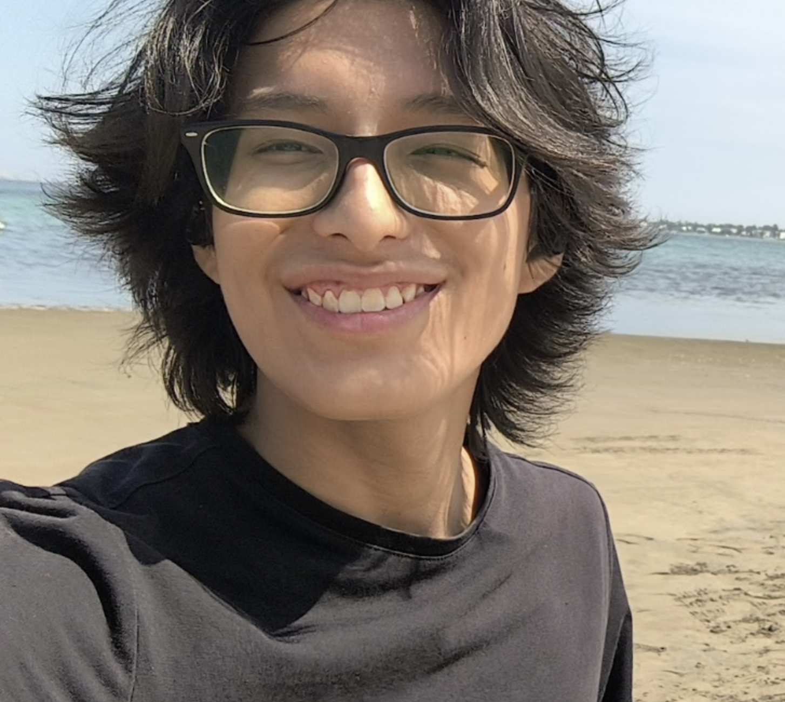

# Capítulo I: Introducción

## 1.1 Startup Profile

### 1.1.1 Descripción de la Startup

aaaaa

##### Misión y Visión

##### Misión

##### Visión

### 1.1.2 Perfiles de integrantes del equipo

[EN ORDEN ALFABETICO POR APELLIDO]

**Farid Sebastian Coronel Espinoza (u202312508)**

  
  

  
 
    Soy estudiante de Ingeniería de Software y me formó de manera autodidacta. Cuento con sólidos conocimientos en desarrollo backend y mobile, aplicando buenas prácticas como Clean Architecture, Domain-Driven Design (DDD) y patrones de diseño. Tengo experiencia construyendo APIs REST, integrando servicios externos y trabajando con bases de datos relacionales y no relacionales.
    Aporto al equipo una visión orientada a la mejora continua, con capacidad para proponer soluciones que optimicen procesos y generen valor de negocio. Me enfoco en entender las necesidades del usuario y traducirlas en soluciones técnicas eficientes.    
  

  
 

 

**Matias Sebastian Diaz Quispe (u202311938)**

   
  

  
 
    Soy estudiante de la carrera de Ingeniería de Software, actualmente cursando el 7mo ciclo. Cuento con conocimientos sólidos en desarrollo backend y móvil. Además, me adapto con facilidad y tengo una fuerte ética de trabajo.
    Por otro lado, poseo conocimientos en Git, TypeScript, React.js, HTML y Tailwind, así como en programación orientada a objetos. También tengo manejo básico de frameworks como Vue y Next.js.
    Contribuyo al equipo aportando soluciones prácticas y orientadas a resultados, buscando siempre optimizar procesos y mejorar la experiencia del usuario final.
  

  
 

 

**Nicolas Emilio Walter Juarez Leon (u202317483)**

  
  

  
 
    Soy estudiante de la carrera de Ingeniería de Software cursando actualmente el 7mo ciclo y soy apasionado por aprender y reforzar mis conocimientos en diseño y desarrollo de software.
    Además, me interesa el trabajo en equipo, la colaboración y la aplicación de conocimientos en entornos de desarrollo.
    Por otro lado, cuento cono conocimientos en diseño de arquitectura, Git, así como tecnologías en desarrollo backend y móvil.
    Finalmente, en mi futuro profesional busco centrarme sólidamente en el desarrollo móvil y el desarrollo backend complementado con tecnologías Cloud, arquitecturas escalables y mantenibles.
  

  
 

 

**Gabriela Nicole Shapiama Rivera (u202319448)**

  
  

  
 Example 
  Example 
  También, he fortalecido mis competencias en el diseño de proyectos de software, acompañado de un liderazgo asertivo. Estoy comprometida con seguir aprendiendo y aportar valor a cada equipo en el que participo. 

  
 

 

**José Jahaziel Guerra Perez (u202319831)**

  
  

  
Soy estudiante de Ingeniería de Software, actualmente en el quinto ciclo de la carrera. Me apasiona el aprendizaje continuo, la planificación detallada y la búsqueda de soluciones eficientes a problemas reales.  
  Mi enfoque profesional está orientado al desarrollo backend, con especial interés en la construcción de sistemas distribuidos, escalables y resilientes, aplicando arquitecturas basadas en microservicios, mensajería asincrónica y herramientas de CI/CD modernas.  
  Actualmente me interesa cómo los modelos de lenguaje (LLM) pueden actuar como agentes autónomos dentro de una arquitectura empresarial, integrándose con servicios como Apache Kafka, Spring Boot y sistemas de orquestación para tomar decisiones, responder eventos o ejecutar tareas de forma inteligente.  
  Mi objetivo a futuro es convertirme en un Full Stack Developer con visión sistémica, capaz de diseñar   soluciones innovadoras que no solo funcionen, sino que mejoren activamente el ecosistema donde se   implementan, aprovechando tecnologías emergentes como inteligencia artificial, automatización y cloud   computing. 

  

 

## 1.2 Solution Profile

### 1.2.1 Antecedentes y Problemática

#### Who (¿Quiénes se ven afectados?)

#### What (¿Qué ocurre?)

#### Where (¿Dónde sucede?)

#### When (¿Desde cuándo y con qué frecuencia?)

#### Why (¿Por qué es un problema?)

#### How (¿Cómo se manifiesta?)

#### How Much (¿Cuál es el impacto cuantitativo?)

### 1.2.2 Lean UX Proccess

#### 1.2.2.1. Lean UX Problem Statements

#### 1.2.2.2 Lean UX Assumptions

##### A. Business Assumptions

##### B. User Assumptions

##### C. User Outcome & Benefit Assumptions

##### D. Business Outcome Assumptions (métricas objetivo)

##### E. Feature Assumptions

#### 1.2.2.3 Lean UX Hypothesis Statements

#### 1.2.2.4 Lean UX Canvas

## 1.3 Segmentos objetivo

**Segmento Objetivo 1: aaa**

**Segmento Objetivo 2: bbb**
