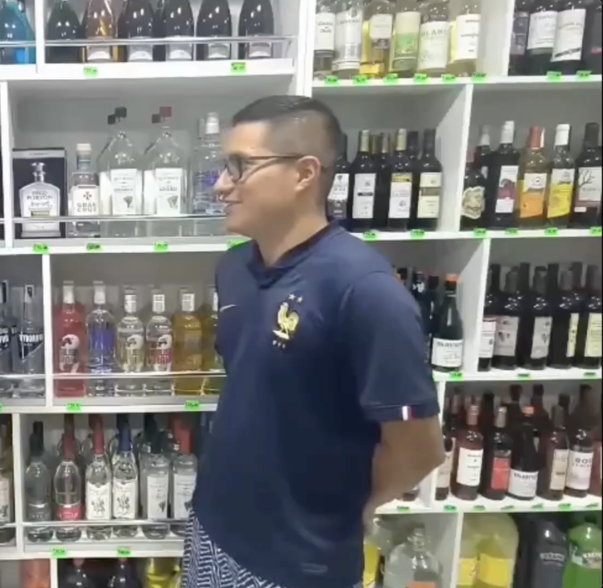
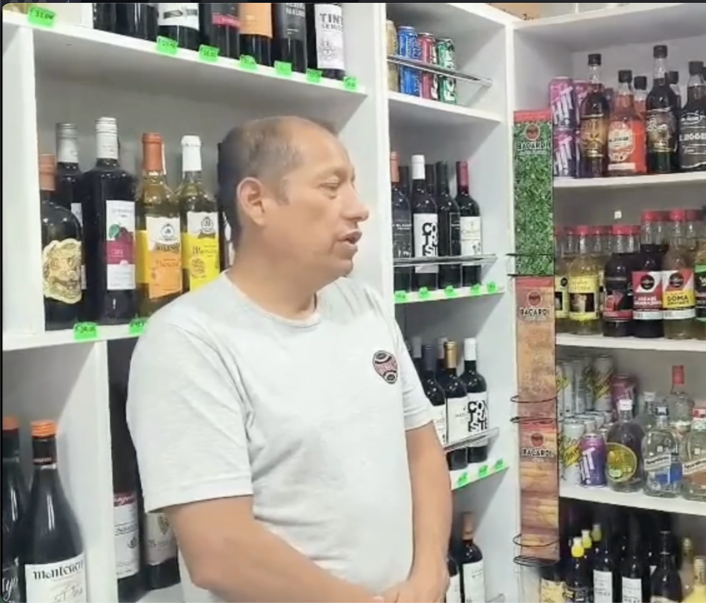

    # Capítulo II: Requirements Elicitation & Analysis

## 2.1 Competidores

- **Oracle Simphony** (competidor directo): Plataforma empresarial desarrollada por Oracle que permite la gestión integral de restaurantes mediante POS, inventario, analítica y operaciones en la nube. Está orientado a grandes cadenas del sector hospitality. Su principal fortaleza es la integración completa del ecosistema, aunque presenta altos costos y complejidad de implementación.

- **RestroWorks** (competidor directo): Solución SaaS enfocada en la gestión operativa de restaurantes, incluyendo inventario, pedidos, cocina y reportes. Se orienta a negocios medianos y cadenas en crecimiento. Destaca por su modularidad, aunque puede volverse costoso dependiendo de los módulos implementados.

- **SoftRestaurant** (competidor directo): Software administrativo con fuerte presencia en Latinoamérica. Permite gestionar inventarios, ventas, personal y facturación en restaurantes pequeños y medianos. Su principal ventaja es su experiencia regional, aunque su arquitectura es más tradicional.

- **Stockagile** (competidor directo): Plataforma de gestión de inventario, pedidos y analítica que, aunque originalmente orientada a retail, puede aplicarse al sector restaurantes en gestión de stock, reposiciones y control operativo. Destaca por su enfoque en automatización y visualización en tiempo real.

---

### 2.1.1 Análisis Competitivo

**¿Por qué llevar a cabo este análisis?**

> El objetivo es identificar brechas en soluciones actuales del sector restaurantes, especialmente en la gestión de inventarios.  
> Se busca construir una solución diferenciada basada en automatización inteligente, integración con IoT y simplicidad operativa.

---

<table>
  <thead>
    <tr>
      <th></th>
      <th><b>UI-Topic (Nuestro producto)</b></th>
      <th><b>Oracle Simphony</b></th>
      <th><b>RestroWorks</b></th>
      <th><b>SoftRestaurant</b></th>
      <th><b>Stockagile</b></th>
    </tr>
    <tr>
      <th></th>
      <th></th>
      <th></th>
      <th></th>
      <th></th>
      <th></th>
    </tr>
  </thead>

  <tbody>

<tr><th><b>Perfil</b></th><td></td><td></td><td></td><td></td><td></td></tr>

<tr>
<td>Overview</td>
<td>Plataforma inteligente con IoT para automatizar inventarios en restaurantes.</td>
<td>Suite empresarial POS + operaciones.</td>
<td>Gestión integral de restaurantes.</td>
<td>Sistema administrativo tradicional.</td>
<td>Gestión de inventario y reposiciones en tiempo real.</td>
</tr>

<tr>
<td>Ventaja competitiva</td>
<td>Automatización física + digital del inventario.</td>
<td>Escalabilidad global.</td>
<td>Modularidad adaptable.</td>
<td>Experiencia en LATAM.</td>
<td>Control centralizado y visualización avanzada.</td>
</tr>

<tr><th><b>Perfil de Marketing</b></th><td></td><td></td><td></td><td></td><td></td></tr>

<tr>
<td>Estrategias</td>
<td>Eficiencia operativa y reducción de errores.</td>
<td>Escalabilidad y confiabilidad.</td>
<td>Crecimiento modular.</td>
<td>Presencia regional.</td>
<td>Optimización del inventario.</td>
</tr>

<tr>
<td>Mercado objetivo</td>
<td>Restaurantes con baja digitalización.</td>
<td>Grandes cadenas.</td>
<td>Restaurantes medianos.</td>
<td>Pequeños y medianos.</td>
<td>Negocios con alta rotación de stock (adaptado a restaurantes).</td>
</tr>

<tr><th><b>Perfil de Producto</b></th><td></td><td></td><td></td><td></td><td></td></tr>

<tr>
<td>Productos</td>
<td>IoT + inventario + alertas.</td>
<td>POS, pedidos, analítica.</td>
<td>Pedidos, cocina, inventario.</td>
<td>Ventas, stock, facturación.</td>
<td>Inventario, pedidos, analítica.</td>
</tr>

<tr>
<td>Precios</td>
<td>Suscripción + hardware.</td>
<td>Alto costo enterprise.</td>
<td>Modelo modular.</td>
<td>Bajo a medio costo.</td>
<td>Planes: Grow €65.83 / Advanced €207.50 / Premium €415.83</td>
</tr>

<tr><th><b>Análisis SWOT</b></th><td></td><td></td><td></td><td></td><td></td></tr>

<tr>
<td>Fortalezas</td>
<td>Automatización real.</td>
<td>Infraestructura robusta.</td>
<td>Adaptabilidad.</td>
<td>Experiencia consolidada.</td>
<td>Automatización y control en tiempo real.</td>
</tr>

<tr>
<td>Debilidades</td>
<td>Dependencia tecnológica.</td>
<td>Complejidad.</td>
<td>Curva de aprendizaje.</td>
<td>Tecnología tradicional.</td>
<td>No especializado 100% en restaurantes.</td>
</tr>

<tr>
<td>Oportunidades</td>
<td>Baja digitalización.</td>
<td>Expansión global.</td>
<td>Cloud kitchens.</td>
<td>Mercados emergentes.</td>
<td>Adaptación al sector food service.</td>
</tr>

<tr>
<td>Amenazas</td>
<td>Resistencia al cambio.</td>
<td>Nuevos SaaS.</td>
<td>Competidores simples.</td>
<td>Innovación externa.</td>
<td>Competidores especializados en restaurantes.</td>
</tr>

  </tbody>
</table>

---

### 2.1.2 Estrategias y tácticas frente a competidores

#### Enfoque Estratégico

UI-Topic se posiciona como una solución de automatización inteligente del inventario en restaurantes, integrando software con sensores IoT para eliminar procesos manuales y mejorar la precisión operativa.

---

#### 1. Frente a Oracle Simphony

- Enfoque en PYMEs
- Implementación rápida
- Menor costo
- UX simple

---

#### 2. Frente a RestroWorks

- Especialización en inventarios
- Eliminación de procesos manuales
- Menor complejidad

---

#### 3. Frente a SoftRestaurant

- Migración a cloud
- UX moderna
- Automatización IoT

---

#### 4. Frente a Stockagile

- Especialización en restaurantes
- Integración con sensores físicos
- Automatización más profunda del inventario

### 2.1.1. Análisis competitivo

### 2.1.2. Estrategias y tácticas frente a competidores

## 2.2. Entrevistas

En esta sección se presenta la investigación realizada a partir de la recolección de información mediante entrevistas a representantes de los segmentos objetivo, con el fin de comprender sus necesidades, características y problemáticas relacionadas con la gestión de inventario y la discrepancia entre el stock físico y el stock registrado en la plataforma.

### 2.2.1. Diseño de entrevistas

#### **Segmento 1: Dueños o administradores de restaurantes**

##### **Preguntas principales:**

1. ¿Cuál es su nombre?
2. ¿Podría indicarnos su edad, estado civil y distrito de residencia actual?
3. ¿Cuál es su cargo dentro del negocio?
4. ¿Cuánto tiempo lleva desempeñando funciones relacionadas con la gestión de inventario?
5. ¿Cómo describiría su trayectoria profesional hasta llegar a su puesto actual?
6. ¿Qué tipo de insumos (perecibles y no perecibles) gestiona con mayor frecuencia en su restaurante?
7. ¿Cómo afecta la rotación de ingredientes y la preparación de recetas al control de inventario?
8. ¿Cuáles son los principales desafíos que enfrenta en el control de insumos frescos o productos no empaquetados?
9. ¿Cómo realiza actualmente el registro y control de stock en cocina o almacén?
10. ¿Qué tipo de errores, pérdidas (por vencimiento, merma o uso en cocina) o discrepancias entre el stock físico y el registrado son más frecuentes?
11. ¿Qué tan importante considera contar con información en tiempo real para evitar quiebres de insumos durante la operación diaria?

##### **Preguntas complementarias:**

1. ¿Qué dispositivos tecnológicos utiliza con mayor frecuencia en su trabajo diario?
2. ¿Qué sistemas o herramientas utiliza para la gestión de pedidos, recetas o inventario?
3. ¿Cómo coordina el inventario entre cocina, almacén y área de compras?
4. ¿Cómo suele recibir alertas sobre faltantes de insumos o productos críticos?
5. ¿Qué canales digitales usa para comunicarse con su equipo de cocina o proveedores?
6. ¿Qué características valoraría más en una solución tecnológica para mejorar la gestión de insumos?
7. ¿Qué dificultades ha tenido al intentar digitalizar procesos dentro del restaurante?
8. ¿Estaría dispuesto(a) a probar una solución que monitoree automáticamente el consumo de insumos mediante sensores?

#### **Segmento 2: Dueños o administradores del sector Retail de consumo masivo**

##### **Preguntas principales:**

1. ¿Cuál es su nombre?
2. ¿Podría indicarnos su edad, estado civil y distrito de residencia actual?
3. ¿Cuál es su cargo dentro del negocio?
4. ¿Cuánto tiempo lleva desempeñando funciones relacionadas con la gestión de inventario?
5. ¿Cómo describiría su trayectoria profesional hasta llegar a su puesto actual?
6. ¿Qué tipo de productos (alta rotación, perecibles o empaquetados) gestiona con mayor frecuencia en su negocio?
7. ¿Cómo gestiona actualmente la rotación de productos en góndolas o almacén?
8. ¿Cuáles son los principales desafíos relacionados con productos próximos a vencer o con baja rotación?
9. ¿Cómo realiza actualmente el registro y control de stock en tienda o almacén?
10. ¿Qué tipo de errores, pérdidas (por vencimiento, devoluciones o mala rotación) o discrepancias entre el stock físico y el registrado son más frecuentes?
11. ¿Qué tan importante considera contar con información en tiempo real para optimizar la reposición de productos?

##### **Preguntas complementarias:**

1. ¿Qué dispositivos tecnológicos utiliza con mayor frecuencia en su trabajo diario?
2. ¿Qué sistemas o herramientas utiliza para la gestión de inventario y ventas?
3. ¿Cómo gestiona la reposición de productos en tienda (manual, por demanda, por sistema)?
4. ¿Cómo suele recibir alertas sobre productos con bajo stock o exceso de inventario?
5. ¿Qué canales digitales usa para comunicarse con proveedores o personal de tienda?
6. ¿Qué características valoraría más en una solución tecnológica para mejorar la reposición y control de stock?
7. ¿Qué dificultades ha tenido al intentar digitalizar sus procesos de inventario?
8. ¿Estaría dispuesto(a) a probar una solución que permita monitorear automáticamente el stock en estanterías o almacén?

### 2.2.2. Registro de entrevistas

#### Segmento 1: Dueños o administradores de Restaurantes

##### Entrevista 1:

**Nombre:** Alex Guardia
**Edad:** 38 años
**Distrito:** Chorrillos
**Timing:** (00:08 - 04:39 min)

 

Ver entrevista (00:08 - 04:39 min): https://bit.ly/41kf54H

**Resumen:**

Alex Guardia tiene 38 años, es casado y vive en el distrito de Chorrillos, Lima. Es una persona analítica, comprometida y orientada a la mejora continua. Cuenta con 5 a 6 años de experiencia como gerente de restaurantes.

Actualmente enfrenta desafíos relacionados con los proveedores y la gestión de inventarios. Realiza controles físicos diarios y verificaciones electrónicas semanales. Además, en ocasiones presenta problemas de discrepancia entre sus insumos físicos y los registrados.

Utiliza dispositivos como un celular Android y una laptop con Windows, y su navegador habitual es Google Chrome. Para comunicarse, recurre frecuentemente a canales como WhatsApp y YouTube. También emplea software de gestión, aunque considera que la mayoría carece de personalización y que el soporte postventa suele ser deficiente. Se inspira en figuras del rubro gastronómico como Gastón Acurio y realiza compras en establecimientos como Makro o PlazaVea. Estaría dispuesto a invertir entre 500 y 800 dólares en una solución tecnológica integral que incluya implementación, capacitación y soporte, siempre que se adapte a sus procesos y contribuya a mejorar la eficiencia del negocio.

##### Entrevista 2:

**Nombre:** Lincoln Chauca Rubio
**Edad:** 36 años
**Distrito:** Breña
**Timing:** (04:40 - 08:24 min)

  

Ver entrevista (04:40 - 08:24 min): https://bit.ly/41kf54H

**Resumen:**

Lincoln Chauca Rubio tiene 36 años, es casado y vive en el distrito de Breña, Lima. Se describe como una persona disciplinada, responsable y dedicada. Es propietario del “Amazonas Restaurant” y lo administra desde hace 5 años, con una participación directa en la gestión operativa del negocio.

Uno de los principales desafíos que enfrenta es la rotación constante del personal, ya que no cuenta con un equipo estable y se ve obligado a contratar nuevos empleados con frecuencia. Este problema afecta la eficiencia del servicio y genera un esfuerzo adicional en capacitación y adaptación. Otro reto significativo es el manejo del inventario, ya que el stock real no siempre coincide con lo mostrado en el software y su personal presenta errores de registro en algunas ocasiones.

En términos tecnológicos, utiliza un celular con sistema operativo Android y una laptop con Windows, y su navegador habitual es Google Chrome. Usa un software llamado Vidal, el cual facilita la gestión del negocio al permitir que los mozos tomen pedidos desde tablets o celulares y se mantenga una base de datos de clientes, aunque reconoce que aún existen oportunidades de mejora. Para comunicarse con su equipo y proveedores emplea canales como WhatsApp y llamadas telefónicas. En cuanto a influencias y marcas, menciona que busca referencias en otros restaurantes reconocidos de cocina regional y realiza compras en proveedores mayoristas como Makro. Actualmente invierte alrededor de 300 soles mensuales en herramientas tecnológicas, pero está dispuesto a incrementar esa inversión hasta 500 soles si la solución mejora sustancialmente la gestión del restaurante.

##### Entrevista 3:

**Nombre:** Amparo Soledad Robles Vásquez
**Edad:** 56 años
**Distrito:** Bellavista
**Timing:** (08:25 - 13:07 min)

 

Ver entrevista (08:25 - 13:07 min): https://bit.ly/41kf54H

**Resumen:**

Amparo Soledad Robles Vásquez tiene 56 años, vive en el distrito de Bellavista y es propietaria del restaurante y cevichería “El 1er Puerto”, el cual gestiona desde hace 20 años. Se describe como una persona perseverante, responsable y amable.

Entre los principales desafíos que enfrenta están la dificultad para encontrar personal adecuado y la falta de conocimientos en marketing digital, lo que limita la promoción de su restaurante. Asimismo, actualmente gestiona el inventario principalmente de manera manual, lo que le toma tiempo y esfuerzo.

Usa un celular con Android y una laptop con Windows, y suele navegar usando Google Chrome. Se informa por canales como WhatsApp y YouTube, y tiene afinidad con marcas como Makro y figuras del sector gastronómico como Gastón Acurio. Reconoce que adaptarse a la tecnología es un reto, pero también una necesidad en el contexto actual. Por ello, tiene la intención de implementar un sistema digital que le permita agilizar los procesos y mejorar la atención al cliente, considerando esto clave para crecer y ofrecer un mejor servicio. Está dispuesta a invertir en un software que automatice su negocio si este se adapta a sus necesidades.

---

#### Segmento 2: Dueños o administradores de negocios del sector retail de consumo masivo

##### Entrevista 4:

**Nombre:** Brayner Coronel
**Edad:** 28 años
**Distrito:** Villa El Salvador
**Timing:** (13:08 - 16:08 min)

Ver entrevista (13:08 - 16:08 min): https://bit.ly/41kf54H

**Resumen:**

Brayner Coronel es un emprendedor de 28 años y uno de los propietarios de una tienda retail llamada “Donde Siempre”. Se caracteriza por ser una persona disciplinada y, sobre todo, perseverante. Actualmente, cuenta con cinco años de experiencia en el rubro y gestiona dos sucursales de alta rotación.

Uno de los principales desafíos que enfrenta está relacionado con la gestión y reposición de sus productos. En ese sentido, comenta que resulta complicado identificar qué productos faltan o en qué cantidades, ya que, antes del cierre, debe contabilizar manualmente cada artículo disponible dentro de la tienda. En consecuencia, debido al crecimiento de su negocio, se le ha hecho cada vez más difícil mantener un control constante y preciso del stock.

Por otro lado, considera que la tecnología es una aliada clave para la eficiencia operativa y el crecimiento sostenible de su emprendimiento. En la actualidad, utiliza navegadores como Google Chrome y Microsoft Edge, además de un celular Android y una computadora con sistema operativo Windows. Asimismo, para la comunicación con su equipo y proveedores, emplea principalmente WhatsApp, lo que le permite una coordinación más ágil. De igual manera, se inspira en referentes del sector retail como la familia Lindley y realiza sus compras a través de aplicaciones como BEES, AC Digital, Merkao y Pepsi Chat. Finalmente, utiliza un software de gestión de inventarios denominado “Vandastic”, el cual le permite registrar de forma detallada cada producto que ingresa y sale; adicionalmente, complementa este control con Excel para el registro de sus almacenes externos. Sin embargo, considera invertir en un software más especializado, con funciones avanzadas que le permitan optimizar la gestión de inventarios y mejorar la eficiencia operativa.

##### Entrevista 5:

**Nombre:** Erick Coronel
**Edad:** 51 años
**Distrito:** Villa María del Triunfo
**Timing:** (16:09 - 19:15 min)

Ver entrevista (16:09 - 19:15 min): https://bit.ly/41kf54H

**Resumen:**

Erick Coronel, de 51 años, es uno de los propietarios de la tienda retail “Donde Siempre”. Decidió dedicarse a este rubro tras haber trabajado en el sector de la construcción durante la pandemia, lo que representó un cambio significativo en su trayectoria profesional. Desde entonces, ha venido adaptando sus procesos con el objetivo de responder mejor a las exigencias del comercio moderno.

Uno de los principales desafíos que enfrenta está relacionado con la gestión interna del personal, debido a la alta rotación de empleados. En ese sentido, comenta que su sistema actual no le permite administrar adecuadamente al equipo, lo que dificulta el control de las operaciones diarias. En consecuencia, esta situación puede generar inconsistencias en el registro del inventario, especialmente durante las actividades rutinarias de la tienda, afectando la precisión del stock.

Por otro lado, considera que la tecnología es un elemento clave para la gestión y crecimiento de su negocio. En la actualidad, utiliza únicamente el navegador Google Chrome, junto con un celular Android y una computadora con sistema operativo Windows. Asimismo, emplea WhatsApp y YouTube como medios de comunicación y apoyo operativo, lo que le permite mantenerse conectado con su equipo y acceder a información de utilidad. Para la gestión de su negocio realiza compras a través de plataformas como BEES, Merkao y tiendas Makro, y se inspira en referentes del sector retail como la familia Lindley. Para el control de inventarios y ventas diarias, emplea el sistema Vandastic; sin embargo, considera que este resulta limitado para sus necesidades actuales, especialmente porque le demanda revisar manualmente qué productos tienen mayor rotación. En este sentido, considera necesario migrar hacia una solución más especializada que le permita optimizar la gestión del inventario, mejorar la eficiencia operativa y, además, le notifique oportunamente cuándo es necesario reponer productos y le brinde recomendaciones sobre su almacenamiento.

##### Entrevista 6:

**Nombre:** Luis Alfonso Jimenez
**Edad:** 55 años
**Distrito:** San Martín de Porres
**Timing:** (19:16 - 29:49 min)

 

Ver entrevista (19:16 - 29:49 min): https://bit.ly/41kf54H

**Resumen:**

Luis Alfonso Jiménez, de 55 años, es administrador de una tienda del sector retail. Se caracteriza por ser una persona honesta, responsable y trabajadora, comprometida con el correcto funcionamiento de su negocio, aunque reconoce que los métodos actuales ya no responden a las exigencias del mercado.

Uno de los principales desafíos que enfrenta está relacionado con la gestión de inventarios, especialmente en el manejo de productos próximos a vencer. En ese sentido, para evitar pérdidas, suele reubicar estos productos en zonas más accesibles para los clientes y colocar los más recientes al fondo de la tienda. Sin embargo, este proceso constante de rotación puede ocasionar daños en los empaques o productos, generando pérdidas innecesarias y dificultando un control eficiente del stock.

Por otro lado, en la actualidad utiliza Google Chrome y Safari como navegadores, junto con un celular iPhone y una laptop con sistema operativo macOS. Asimismo, emplea WhatsApp como medio de comunicación con su equipo y proveedores, lo que facilita la coordinación diaria. Su principal referente en el sector retail es Carlos Rodríguez-Pastor, a quien valora por la organización y eficiencia de sus modelos de gestión. De igual manera, continúa utilizando Excel para el control de inventarios, compras y ventas, aunque reconoce que este método le consume tiempo, puede generar errores y dificulta la identificación oportuna de productos para reposición, lo que en ocasiones lo obliga a verificar físicamente el almacén para confirmar existencias. En este contexto, considera que la tecnología es fundamental para optimizar sus operaciones y está dispuesto a invertir lo que sea necesario en un sistema que le permita mejorar la gestión del negocio.

### 2.2.3. Análisis de entrevistas

#### Segmento 1: Dueños o administradores de Restaurantes

Se analizaron **3 entrevistas** a administradores con amplia experiencia en el manejo de restaurantes. La información obtenida permitió identificar características objetivas y subjetivas clave para construir al arquetipo de dueño de restaurantes.

##### Características

| Característica                                    | Mención  | %     | Evidencia                                                                                     |
| ------------------------------------------------- | -------- | ----- | --------------------------------------------------------------------------------------------- |
| Más de 5 años de experiencia en gestión           | 3/3      | 100%  | Todos los entrevistados mencionan su trayectoria (“5 a 6 años”, “5 años”, “20 años”)          |
| Utilizan software para facturación o pedidos      | 3/3      | 100%  | Uso de software como Dibal, sistemas de caja, o intención de implementarlo pronto             |
| Gestión de inventario parcial o manual            | 2/3      | 66.7% | Uso mixto entre registros físicos y digitales; uno usa solo gestión manual                    |
| Han cambiado de software por deficiencias         | 2/3      | 66.7% | Señalan haber probado varias herramientas antes de una funcional                              |
| Dispuestos a invertir en tecnología               | 3/3      | 100%  | Declaran presupuestos o escalas de disposición al 10                                          |
| Reconocen que la tecnología mejora la eficiencia  | 3/3      | 100%  | Vinculan tecnología con mejora de control, marketing y atención                               |
| Dificultades por complejidad o soporte deficiente | 2/3      | 66.7% | Señalan postventa lenta y sistemas poco intuitivos                                            |
| Necesidad de personalización                      | 3/3      | 100%  | Indican que los sistemas son genéricos y complicados de adaptar                               |
| Valor por facilidad de uso y adaptabilidad        | 3/3      | 100%  | Expresan deseo de una solución autogestionable                                                |
| Canales usados                                    | 3/3      | 100%  | Usan Whatsapp, youtube, facebook                                                              |
| Tecnología usada                                  | 3/3      | 100%  | Utilizan Android y Windows                                                                    |

##### Insights

**1. Alta disposición hacia la digitalización, pero con obstáculos prácticos**
Existe interés por parte de todos los entrevistados en incorporar tecnología para mejorar su gestión. Sin embargo, su adopción ha sido limitada por barreras como sistemas complejos o falta de capacitación. Sugiere que la plataforma debería ser intuitiva y estar diseñada pensando en la realidad operativa del usuario.

**2. Necesidad crítica de herramientas flexibles y adaptables**
La estandarización de los sistemas actuales no responde a las particularidades de cada restaurante. Mencionan la dificultad de modificar configuraciones o adaptarse a actualizaciones frecuentes. Un sistema que permita editar menús, precios o funcionalidades sin asistencia externa sería lo ideal.

**3. El soporte técnico deficiente afecta la confianza y el uso**
Los usuarios se sienten desatendidos cuando enfrentan incidencias en momentos críticos. El soporte técnico lento o ineficaz reduce la confianza en el sistema. Una solución que ofrezca soporte ágil y confiable podría diferenciarse en el mercado.

**4. Inversión justificable si existe retorno tangible**
Todos los entrevistados señalan estar dispuestos a invertir en tecnología si esta genera beneficios claros como control, personalización, eficiencia o mejora de ingresos. Esto valida la viabilidad comercial de una solución enfocada.

#### Segmento 2: Dueños o administradores de Tiendas Retail

Se analizaron **3 entrevistas** a administradores o dueños con amplios conocimientos en el manejo de tiendas retail. La información obtenida permitió identificar características objetivas y subjetivas clave para construir al arquetipo de administrador de tiendas retail.

##### Características

| Característica                                    | Mención  | %     | Evidencia                                                                                                                                                   |
| ------------------------------------------------- | -------- | ----- | ----------------------------------------------------------------------------------------------------------------------------------------------------------- |
| Más de 5 años de experiencia en gestión           | 3/3      | 100%  | Todos los entrevistados mencionan su trayectoria                                                                                                            |
| Uso de software para gestión de inventarios       | 2/3      | 66.7% | Uso de software como Vandastic, un tercero menciona el uso de Excel para las labores                                                                        |
| Gestión de inventario parcial o manual            | 2/3      | 66.7% | Dos usan un software especializado, aunque también manifiestan la contabilización manual de productos, el tercero usa herramientas tradicionales como Excel |
| Dispuestos a invertir en tecnología               | 3/3      | 100%  | Los tres declaran de gran importancia la inclusión de la tecnología para solucionar sus problemas                                                           |
| Reconocen que la tecnología mejora la eficiencia  | 3/3      | 100%  | Vinculan tecnología con mejora de control, marketing y atención                                                                                             |
| Dificultades en el negocio                        | 3/3      | 100%  | Señalan problemas mayores en la gestión interna del negocio como la contabilizacion y la reposición                                                         |
| Necesidad de precisión en el stock                | 3/3      | 100%  | Indican que es un problema en común de diversas fuentes (rotación de personal, reposición de productos próximos a vencer, contabilización de stock)         |
| Valor por facilidad de uso y adaptabilidad        | 3/3      | 100%  | Expresan deseo de una solución que automatice y simplifique sus labores                                                                                     |
| Canales usados                                    | 3/3      | 100%  | Mencion al uso de Whatsapp, pero también se hace una pequeña mención al uso de YouTube                                                                      |
| Tecnología usada                                  | 2/3      | 66.7% | Utilizan Android y Windows, un tercero menciona el uso de iOS y macOS                                                                                       |

##### Insights

**1. Problemas actuales con los programas usados**
Los entrevistados perciben que el programa actual que utilizan para sus operaciones no es suficiente para satisfacer por completo las necesidades de su tienda. Además, limita mucho su crecimiento y complica la optimización de sus procesos clave.  

**2. Contar con herramientas que sean precisas respecto del control de inventarios**
Aunque algunos entrevistados no consideran un problema grave las posibles pérdidas de productos, sí manifiestan un gran interés en contar con una aplicación mucho más precisa con respecto a las actividades de gestión de inventarios. Además, consideran que una herramienta de este tipo les brindaría mayor seguridad, eficiencia operativa y les permitiría tomar mejores decisiones para evitar pérdidas económicas innecesarias.  

**3. Simplificación y automatización de tareas recurrentes**
Los entrevistados requieren una aplicación que les permita llevar un control eficiente del stock de sus productos. Además, les debe ofrecer una variedad de herramientas de gestión que faciliten y hasta automaticen sus tareas diarias de inventariado. Finalmente, esta solución debe estar orientada a facilitar la toma de decisiones, optimizar recursos y fomentar el crecimiento sostenible de sus tiendas.

## 2.3. Needfinding

En esta sección se presentan los artefactos resultantes del proceso de Needfinding, elaborados a partir del análisis de la información recolectada sobre la problemática de la gestión de inventarios en PyMEs de los sectores gastronómico y retail de consumo masivo. Se incluyen herramientas como User Personas, User Task Matrix, User Journey Mapping, Empathy Mapping, Big Picture EventStorming y Ubiquitous Language, las cuales permiten comprender en profundidad las necesidades, motivaciones, frustraciones y comportamientos de los usuarios objetivo.

A través de estos artefactos, se busca representar de manera clara cómo los dueños y administradores de restaurantes y negocios retail gestionan actualmente sus inventarios, evidenciando el uso de procesos manuales, la falta de visibilidad en tiempo real y los errores asociados al control de stock.

### 2.3.1. User Personas

En esta sección se presentan dos User Personas que representan los segmentos clave del proyecto: los dueños o administradores de restaurantes y los dueños o administradores de negocios del sector retail de consumo masivo. Estos perfiles permiten comprender en profundidad las necesidades, motivaciones, frustraciones y comportamientos de los usuarios potenciales del sistema, el cual busca mejorar la gestión de inventarios mediante la digitalización, el monitoreo en tiempo real y la automatización de procesos operativos.

El User Persona **Carolina Rivas** representa a las administradoras y propietarias de restaurantes con experiencia en la gestión de negocios gastronómicos, principalmente ubicados en zonas urbanas. Carolina cuenta con trayectoria en la operación de su restaurante y, aunque ha utilizado herramientas como cuadernos o hojas de cálculo para el control de inventario, estos métodos le han generado errores, pérdidas de insumos y dificultades para planificar la reposición. Su principal motivación es lograr un control preciso del inventario en tiempo real, reducir el desperdicio y optimizar la gestión de sus insumos. Busca una solución tecnológica accesible, intuitiva y fácil de implementar, que le permita digitalizar sus procesos, mejorar la toma de decisiones y aumentar la eficiencia operativa sin afectar la atención al cliente.

  

La información mostrada del User Persona **Carolina Rivas** se observa que valora herramientas simples, visuales y fáciles de implementar, ya que busca optimizar sus procesos sin afectar la atención al cliente ni depender de sistemas complejos. En ese sentido, este perfil sintetiza claramente la oportunidad de diseñar una solución tecnológica orientada a digitalizar la gestión de inventarios, mejorar la eficiencia operativa y apoyar una toma de decisiones más informada dentro del restaurante.

 

Por otro lado, el User Persona **Jorge Torres** representa a los dueños o administradores de negocios del sector retail de consumo masivo, como minimarkets o tiendas de conveniencia. Con varios años de experiencia en la gestión de su negocio, Jorge maneja una alta rotación de productos, lo que hace que el control del inventario sea una tarea crítica en su operación diaria. Actualmente, utiliza métodos manuales apoyados por herramientas como WhatsApp y Excel para registrar el stock, coordinar pedidos y llevar el control de ventas, lo que le genera desorden, errores y falta de visibilidad en tiempo real.

  

La información mostrada del User Persona Jorge Torres permite identificar a un administrador de negocio retail de consumo masivo que enfrenta dificultades en el control de inventario debido a la alta rotación de productos y al uso de métodos manuales. Su perfil evidencia problemas de desorden, falta de precisión en el stock y ausencia de visibilidad en tiempo real, lo que afecta directamente la reposición, la organización del almacén y la rentabilidad del negocio.

Asimismo, se observa que valora soluciones prácticas, visuales y fáciles de usar, siempre que le ayuden a reducir errores y ahorrar tiempo en sus tareas operativas. En ese sentido, este perfil refleja la necesidad de implementar una solución tecnológica que permita controlar el inventario en tiempo real, optimizar la reposición y mejorar la toma de decisiones dentro del negocio retail.

### 2.3.2. User Task Matrix

### 2.3.3. User Journey Mapping

### 2.3.4. Empathy Mapping

## 2.4. Big Picture EventStorming

## 2.5. Ubiquitous Language
