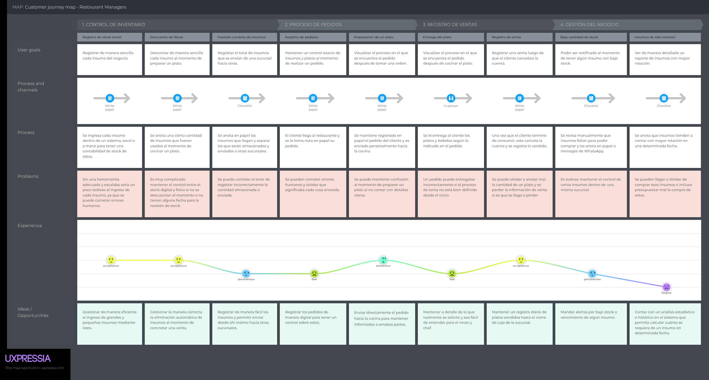
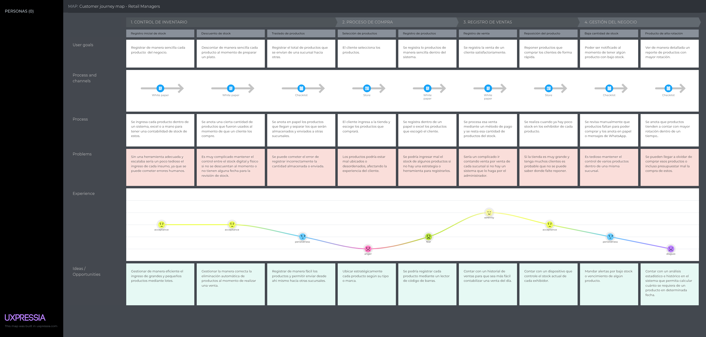

# Capítulo II: Requirements Elicitation & Analysis

## 2.1. Competidores

### 2.1.1. Análisis competitivo

### 2.1.2. Estrategias y tácticas frente a competidores

## 2.2. Entrevistas

INTRODUCCION

### 2.2.1. Diseño de entrevistas

### 2.2.2. Registro de entrevistas

### 2.2.3. Análisis de entrevistas

## 2.3. Needfinding

INTRODUCCION

### 2.3.1. User Personas

### 2.3.2. User Task Matrix

### 2.3.3. User Journey Mapping

En esta sección se presentan los User Journey Maps (As-Is) de los segmentos representados, correspondientes a sus respectivas User Personas. Se ilustra el recorrido actual de los usuarios sin la intervención de la solución UI-Topic, con el fin de identificar sus necesidades, puntos de fricción y oportunidades de mejora. Cada mapa refleja las etapas clave de interacción, acciones realizadas, puntos de contacto, experiencias emocionales, dificultades enfrentadas y posibles mejoras.

#### Carolina Rivas

A continuación se presenta el User Journey Map de Carolina Rivas.

Uno de los problemas más críticos se encuentra en la toma y transmisión de pedidos. Al no existir un sistema estructurado, es común que ocurran errores en la anotación, interpretación o comunicación de los pedidos hacia la cocina. Esto puede generar confusiones, retrasos e incluso la entrega incorrecta de platos a los clientes.

La experiencia del usuario presenta modificaciones importantes, especialmente en las etapas de registro del pedido y preparación, donde se concentran los mayores niveles de incertidumbre y errores. La falta de claridad en el estado del pedido genera descoordinación entre el personal y aumenta la probabilidad de fallas en el servicio.

En conclusión, el proceso del restaurante requiere la implementación de un sistema que permita estructurar la toma de pedidos, mejorar la comunicación entre áreas y automatizar el control de inventario. Esto contribuiría a reducir errores, optimizar tiempos de atención y mejorar significativamente la experiencia tanto del cliente como del personal.

#### Jorge Torres

A continuación se presenta el User Journey Map de Jorge Torres.

Uno de los principales problemas identificados es la falta de control en tiempo real del stock. Al no existir un sistema automatizado, los productos no se actualizan correctamente después de cada venta o reposición, lo que puede generar tanto quiebres de stock como sobreabastecimiento. Esta falta de visibilidad impacta directamente en la toma de decisiones del negocio.

En cuanto a la experiencia del usuario, se identifican puntos de frustración relacionados con la desorganización, el registro manual y la dificultad para acceder a información relevante como productos de alta rotación o niveles críticos de stock. La curva emocional muestra una caída en etapas clave del proceso.

Finalmente, el análisis permite concluir que el proceso de retail requiere una digitalización que permita automatizar el control de inventario, mejorar la precisión en el registro de ventas y proporcionar herramientas de análisis. Esto no solo optimizaría la operación, sino que también permitiría una mejor toma de decisiones estratégicas.

### 2.3.4. Empathy Mapping

## 2.4. Big Picture EventStorming

## 2.5. Ubiquitous Language
