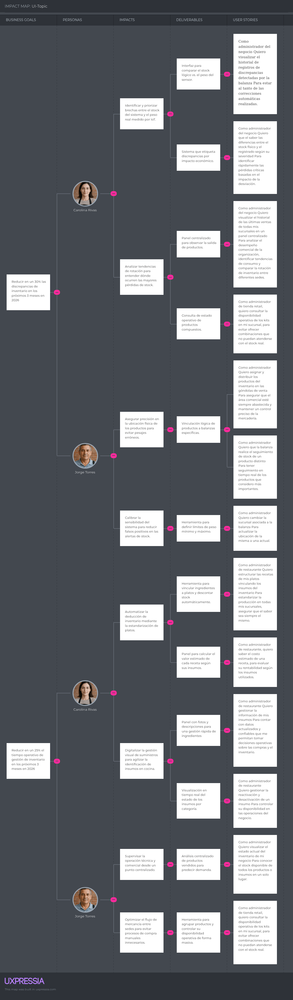

# Capítulo III: Requirements Specification

## 3.1. User Stories

Para el presente proyecto, se definieron los epics a partir de los objetivos funcionales y necesidades estratégicas identificadas durante la fase de análisis. Estas representan agrupaciones de alto nivel que organizan grandes bloques de funcionalidades del sistema, permitiendo estructurar el alcance del producto, establecer prioridades y servir como marco de referencia para la descomposición progresiva de requerimientos más específicos.

| Epic ID | User                                                            | Priority                                                                                                                                                                                                                                                                                           | Title                                                                                                                                                                                                                                                                                                                                                                                                                                                                                                                                                                                                                                                                                                                                                                                                                                                                                                                                                                                                                                                                                                                                                                                                                                                                                                                                                                                                                                                                                                                                                                                                                                                                             | Description |
|---------|-----------------------------------------------------------------|----------------------------------------------------------------------------------------------------------------------------------------------------------------------------------------------------------------------------------------------------------------------------------------------------|-----------------------------------------------------------------------------------------------------------------------------------------------------------------------------------------------------------------------------------------------------------------------------------------------------------------------------------------------------------------------------------------------------------------------------------------------------------------------------------------------------------------------------------------------------------------------------------------------------------------------------------------------------------------------------------------------------------------------------------------------------------------------------------------------------------------------------------------------------------------------------------------------------------------------------------------------------------------------------------------------------------------------------------------------------------------------------------------------------------------------------------------------------------------------------------------------------------------------------------------------------------------------------------------------------------------------------------------------------------------------------------------------------------------------------------------------------------------------------------------------------------------------------------------------------------------------------------------------------------------------------------------------------------------------------------|-------------|
| US-01   | Acceso al sitio web                                             | Como visitante, Quiero acceder fácilmente a las distintas secciones del sitio  Para orientarme y acceder a dichas secciones con facilidad.                                                                                                                                                   | Escenario #1: Visitante accede al sitio web estático.   Dado que el visitante desea conocer la plataforma.  Cuando accede al sitio web.  Entonces puede acceder a las secciones principales.                                                                                                                                                                                                                                                                                                                                                                                                                                                                                                                                                                                                                                                                                                                                                                                                                                                                                                                                                                                                                                                                                                                                                                                                                                                                                                                                                                                                                                                                          | EP-01       |
| US-02   | Conocer el funcionamiento  general de la plataforma          | Como visitante, Quiero ver las etapas de uso de la plataforma, Para comprender rápidamente cómo funciona.                                                                                                                                                                                    | Escenario #1: Visitante conoce el funcionamiento de la solución  Dado que el visitante se encuentre en el sitio web. Cuando revisa la sección de funcionamiento. Entonces ve las etapas del proceso de forma clara y ordenada.                                                                                                                                                                                                                                                                                                                                                                                                                                                                                                                                                                                                                                                                                                                                                                                                                                                                                                                                                                                                                                                                                                                                                                                                                                                                                                                                                                                                                                        | EP-01       |
| US-03   | Acceso a registro o descarga  desde el sitio web             | Como visitante,  Quiero saber cómo acceder o descargar la aplicación  Para empezar a usarla.                                                                                                                                                                                                 | Escenario #1: Visitante accede al sitio web principal.  Dado que el visitante se encuentra en el sitio web.  Cuando accede a registrarse. Entonces es redirigido a la página web principal.   Escenario #2: Visitante accede a la descarga de la aplicación móvil.   Dado que el visitante se encuentra en el sitio web.  Cuando accede a la sección para descargar la aplicación. Entonces es redirigido a la sección para descargar la aplicación móvil.                                                                                                                                                                                                                                                                                                                                                                                                                                                                                                                                                                                                                                                                                                                                                                                                                                                                                                                                                                                                                                                                                                                                                                                          | EP-01       |
| US-04   | Inclusión de videos explicativos  en el sitio web            | Como visitante,  Quiero visualizar videos sobre el producto,  Para entender mejor la propuesta de solución antes de usarla.                                                                                                                                                                  | Escenario #1: Visitante visualiza el video informativo sobre el producto.   Dado que el visitante se encuentra en el sitio web.  Cuando accede a la sección sobre el producto. Entonces puede reproducir un video que explica el funcionamiento del producto.                                                                                                                                                                                                                                                                                                                                                                                                                                                                                                                                                                                                                                                                                                                                                                                                                                                                                                                                                                                                                                                                                                                                                                                                                                                                                                                                                                                                         | EP-01       |
| US-05   | Visualización de beneficios según  perfil de usuario         | Como visitante,  Quiero conocer los beneficios que ofrece la plataforma  Para entender cómo aporta valor a mí y a mi negocio.                                                                                                                                                                | Escenario #1: Visitante conoce los beneficios que ofrece la plataforma.  Dado que el visitante se encuentra en el sitio web.  Cuando accede a la sección de beneficios.  Entonces encuentra los beneficios que le dará a su negocio.                                                                                                                                                                                                                                                                                                                                                                                                                                                                                                                                                                                                                                                                                                                                                                                                                                                                                                                                                                                                                                                                                                                                                                                                                                                                                                                                                                                                                                  | EP-01       |
| US-06   | Comprensión del propósito y  valor del negocio               | Como visitante,  Quiero saber cuál es el propósito y valor de negocio de la plataforma,  Para saber si es útil para mí.                                                                                                                                                                      | Escenario #1: Visitante conoce el propósito de la plataforma.   Dado que el visitante se encuentra en el sitio web.  Cuando accede a la sección principal.  Entonces identifica claramente el propósito de la plataforma.                                                                                                                                                                                                                                                                                                                                                                                                                                                                                                                                                                                                                                                                                                                                                                                                                                                                                                                                                                                                                                                                                                                                                                                                                                                                                                                                                                                                                                             | EP-01       |
| US-07   | Conocimiento del equipo de desarrollo                           | Como visitante, quiero conocer a los integrantes detrás del desarrollo de la plataforma, para confiar más en la solución ofrecida.                                                                                                                                                                 | Escenario #1: Visitante conoce sobre los integrantes de la startup.   Dado que el visitante se encuentra en el sitio web.  Cuando accede a la sección sobre el equipo de desarrollo.  Entonces visualiza la foto de los integrantes, sus nombres y sus roles en el equipo.                                                                                                                                                                                                                                                                                                                                                                                                                                                                                                                                                                                                                                                                                                                                                                                                                                                                                                                                                                                                                                                                                                                                                                                                                                                                                                                                                                                            | EP-01       |
| US-08   | Lectura de testimonios                                          | Como visitante,  Quiero leer testimonios de clientes que utilizaron la plataforma y sus servicios,  Para saber si el negocio es confiable.                                                                                                                                                   | Escenario #1: Visitante lee los testimonios de clientes.   Dado que el visitante se encuentra en el sitio web.  Cuando accede a la sección de testimonios. Entonces puede conocer las experiencias de los clientes con la plataforma y sus servicios.                                                                                                                                                                                                                                                                                                                                                                                                                                                                                                                                                                                                                                                                                                                                                                                                                                                                                                                                                                                                                                                                                                                                                                                                                                                                                                                                                                                                                 | EP-01       |
| US-09   | Optimización para pantallas de dispositivos móviles             | Como visitante,  Quiero visualizar el contenido desde mi dispositivo móvil Para usarlo con facilidad en cualquier pantalla                                                                                                                                                                   | Escenario #1: Visitante accede al sitio web desde un dispositivo móvil.   Dado que el visitante posee un dispositivo móvil.  Cuando accede al sitio web desde su navegador.  Entonces visualiza el contenido del sitio web ajustado a las dimensiones de la  pantalla de su dispositivo.                                                                                                                                                                                                                                                                                                                                                                                                                                                                                                                                                                                                                                                                                                                                                                                                                                                                                                                                                                                                                                                                                                                                                                                                                                                                                                                                                                           | EP-02       |
| US-10   | Navegación accesible para personas  con discapacidad visual  | Como visitante con discapacidad visual,  Quiero usar el lector de pantalla,  Para conocer información sobre la plataforma.                                                                                                                                                                   | Escenario #1: Visitante con discapacidad visual accede al sitio web.   Dado que el visitante posee un lector de pantalla.  Cuando accede al sitio web. Entonces el contenido es interpretado correctamente.                                                                                                                                                                                                                                                                                                                                                                                                                                                                                                                                                                                                                                                                                                                                                                                                                                                                                                                                                                                                                                                                                                                                                                                                                                                                                                                                                                                                                                                           | EP-02       |
| US-11   | Navegación mediante teclado                                     | Como visitante,  Quiero acceder a las secciones del sitio web usando mi teclado,  Para tener distintas formas de acceder a las secciones del sitio web.                                                                                                                                      | Escenario #1: Visitante usa su teclado para acceder a otras secciones.   Dado que el visitante desea usar su teclado para acceder a las secciones del sitio web. Cuando presiona la tecla de tabulación.  Entonces el visitante recorre los elementos en orden lógico.                                                                                                                                                                                                                                                                                                                                                                                                                                                                                                                                                                                                                                                                                                                                                                                                                                                                                                                                                                                                                                                                                                                                                                                                                                                                                                                                                                                                | EP-02       |
| US-12   | Acceso fluido de secciones                                      | Como visitante Quiero distinguir claramente cada sección Para navegar sin confusión.                                                                                                                                                                                                         | Escenario #1: Visitante cambia de sección  Dado que el visitante se encuentra en una sección en el sitio web Cuando cambio a otra sección  Entonces el visitante visualiza la información de la nueva sección.                                                                                                                                                                                                                                                                                                                                                                                                                                                                                                                                                                                                                                                                                                                                                                                                                                                                                                                                                                                                                                                                                                                                                                                                                                                                                                                                                                                                                                                        | EP-02       |
| US-13   | Acceso a documentos legales                                     | Como visitante,  Quiero conocer los términos y condiciones  Para conocer las reglas de uso de la plataforma.                                                                                                                                                                                 | Escenario #1: Visitante accede a la sección de términos y condiciones.   Dado que el visitante se encuentra en el sitio web.  Cuando accede a la sección de términos y condiciones. Entonces puede leer el contrato legal del uso de la plataforma y los servicios.                                                                                                                                                                                                                                                                                                                                                                                                                                                                                                                                                                                                                                                                                                                                                                                                                                                                                                                                                                                                                                                                                                                                                                                                                                                                                                                                                                                                   | EP-01       |
| US-14   | Selección de idioma                                             | Como visitante,  Quiero ver el contenido en el idioma que prefiero Para usar la plataforma en mi idioma nativo.                                                                                                                                                                              | Escenario #1: Visitante elige un nuevo idioma en el sitio web.  Dado que se encuentra en el sitio web.  Cuando elige su idioma nativo Entonces el contenido del sitio web se actualiza al idioma elegido.                                                                                                                                                                                                                                                                                                                                                                                                                                                                                                                                                                                                                                                                                                                                                                                                                                                                                                                                                                                                                                                                                                                                                                                                                                                                                                                                                                                                                                                             | EP-02       |
| US-15   | Registro de usuario                                             | Como visitante Quiero registrarme como administrador de una tienda retail Para acceder a las funcionalidades de la aplicación.                                                                                                                                                                     | Escenario #1: Registro exitoso:   Dado que el visitante no tenga una cuenta  Cuando complete el registro (Nombre del negocio, email, contraseña y rol)  Entonces se crea su cuenta e ingresa como administrador de retail o restaurante.  Escenario #2: Registro fallido:   Dado que el visitante no tenga una cuenta  Cuando ingrese un email con un formato no válido y una contraseña débil Entonces se muestra un mensaje indicando que los datos ingresados no son válidos y no se realiza el registro del visitante.  Escenario #3: Registro con correo existente:  Dado que el visitante no tenga una cuenta cuando ingrese un correo ya asociado a una cuenta entonces se muestra un mensaje indicando que no se pudo completar el registro.                                                                                                                                                                                                                                                                                                                                                                                                                                                                                                                                                                                                                                                                                                                                                                                                                                                                                       | EP-03       |
| US-16   | Solicitar recuperación de acceso                                | Como usuario quiero solicitar la recuperación de mi cuenta para volver a acceder a mi cuenta.                                                                                                                                                                                                      | Escenario #1: Solicitud de recuperación de contraseña mediante el correo:  Dado que el usuario quiera iniciar sesión y no recuerde su contraseña  Cuando solicita la recuperación de su contraseña  Entonces ingresa su correo para procesar con la solicitud.  Escenario #2:  Envío de código de verificación   Dado que el usuario haya solicitado la recuperación de su contraseña  Cuando haya ingresado su correo Entonces le llegará un código de 6 dígitos al correo ingresado.                                                                                                                                                                                                                                                                                                                                                                                                                                                                                                                                                                                                                                                                                                                                                                                                                                                                                                                                                                                                                                                                                                                                                              | EP-04       |
| US-17   | Restablecer contraseña                                          | Cómo usuario quiero restablecer mi contraseña para volver a acceder a mi cuenta                                                                                                                                                                                                                    | Escenario #1:  Ingreso del código de seguridad exitoso  Dado que el usuario haya solicitado la recuperación de la contraseña  Cuando ingresé el código de seguridad que le llegó a su correo  Entonces el sistema valida el código y logra cambiar su contraseña.   Escenario #2: Ingreso inválido del código de seguridad   Dado que el usuario haya solicitado la recuperación de la contraseña  Cuando ingresé un código de seguridad que no le llegó al correo  Entonces no continúa con el procedimiento y no cambia su contraseña.   Escenario #3: Ingreso de una contraseña débil  Dado que el usuario haya ingresado el código de seguridad  Cuando ingresé una contraseña que con cumple con los criterios de seguridad  Entonces no se logra hacer el restablecimiento de su contraseña.   Escenario #4: Ingreso de código expirado  Dado que el usuario haya solicitado la recuperación de su contraseña  Cuando haya ingresado un código de seguridad luego de 15 minutos  Entonces no continúa con el procedimiento y no logra cambiar su contraseña.                                                                                                                                                                                                                                                                                                                                                                                                                                                                                                                                     | EP-04       |
| US-18   | Cierre de sesión                                                | Como usuario Quiero cerrar sesión de mi cuenta en el dispositivo que lo esté usando Para evitar accesos indebidos a mi cuenta.                                                                                                                                                               | Escenario #1: Cierre exitoso de la aplicación  Dado que el usuario esté autenticado en la aplicación Cuando cierre sesión Entonces ya no tendra acceso a su cuenta Y debe volver a iniciar sesión para acceder a la aplicación.                                                                                                                                                                                                                                                                                                                                                                                                                                                                                                                                                                                                                                                                                                                                                                                                                                                                                                                                                                                                                                                                                                                                                                                                                                                                                                                                                                                                                                    | EP-04       |
| US-19   | Visualización de suscripción                                    | Como usuario de la plataforma Quiero visualizar la información de mi suscripción actual Para conocer su estado, beneficios y vigencia.                                                                                                                                                       | Escenario #1: Visualización de suscripción activa  Dado que el usuario está auntenticado en la plataforma, Cuando accede a su perfil  Entonces se muestra el nombre de la suscripción actual, su estado, beneficios incluidos y fechas de inicio y expiración.   Escenario #2: Suscripción expirada  Dado que la suscripción del usuario está cercana a su fecha de expiración Cuando accede a su perfil Entonces se muestra una mensaje indicando que debe renovar su plan.                                                                                                                                                                                                                                                                                                                                                                                                                                                                                                                                                                                                                                                                                                                                                                                                                                                                                                                                                                                                                                                                                                                                                                        | EP-05       |
| US-20   | Inicio de sesión                                                | Como usuario no autenticado quiero iniciar sesión para acceder de forma seguro a mi cuenta.                                                                                                                                                                                                        | Escenario #1: Inicio de sesión exitoso:  Dado que el usuario tenga una cuenta registrada cuando ingrese sus credenciales (correo y contraseña) entonces accede a su cuenta.  Escenario #2: Credenciales incorrectas:  Dado que el usuario no haya iniciado sesión  Cuando ingrese un correo o contraseña incorrectos  Entonces se muestra un mensaje indicando que las credenciales no son válidas y no se le permite el acceso a su cuenta.                                                                                                                                                                                                                                                                                                                                                                                                                                                                                                                                                                                                                                                                                                                                                                                                                                                                                                                                                                                                                                                                                                                                                                                                                    | EP-03       |
| US-21   | Activación de suscripción                                       | Como visitante Quiero registrar mi empresa y contratar un plan de suscripción Para habilitar las herramientas de gestión en mis sucursales y comenzar con la operación del sistema.                                                                                                          | Escenario #1: Contratación exitosa de plan mensual o anual  Dado que el representante ha completado el registro de su perfil de empresa Cuando selecciona la modalidad de pago (mensual o anual) e ingresa un método de pago válido Entonces el sistema procesa el cargo inicial y activa inmediatamente todas las funcionalidades contratadas para la organización.  Escenario #2: Fallo en la transacción inicial  Dado que el representante intenta activar el plan para su negocio Cuando la pasarela de pagos rechaza la transacción (por fondos insuficientes o datos erróneos) Entonces el sistema no habilita las funciones corporativas y muestra un aviso sugiriendo verificar el método de pago para completar el alta.                                                                                                                                                                                                                                                                                                                                                                                                                                                                                                                                                                                                                                                                                                                                                                                                                                                                                                                  | EP-05       |
| US-22   | Gestión de perfil                                               | Como usuario de la plataforma  Quiero gestionar la información de mi perfil Para asegurar que mi información sea la correcta.                                                                                                                                                                | Escenario 1: Consulta de perfil Dado que el usuario está autenticado Cuando accede a su perfil Entonces visualiza su nombre, correo y foto de perfil.  Escenario 2: Edición de datos básicos.  Dado que el usuario se encuentra en la seccion de perfil Cuando actualiza datos como nombre correo electrónico, teléfono, dirección o descripción del negocio Entonces los cambios se visualizan en el perfil.  Escenario 3: Subida de imagen de perfil   Dado que el usuario desea personalizar la imagen de su perfil Cuando selecciona una imagen válida y la carga Entonces los cambios se reflejan en su perfil  Escenario 4: Validación de información obligatoria   Dado que el usuario está editando su perfil  Cuando deja no completa la informacion requerida o introduce datos inválidos Entonces el sistema muestra mensajes de error claros y no permite actulizar los cambios hasta que los datos sean válidos.                                                                                                                                                                                                                                                                                                                                                                                                                                                                                                                                                                                                                                                                                      | EP-06       |
| US-23   | Cancelación de la renovación de una suscripción                 | Como administrador del negocio Quiero desactivar la renovación automática de mi plan Para evitar cobros futuros en mi tarjeta cuando decida dejar de utilizar el servicio al finalizar el periodo contratado.                                                                                | Escenario #1: Cancelación de suscripción activa  Dado que el negocio tiene un plan (mensual o anual) activo y pagado Cuando el administrador solicita la cancelación desde la sección de facturación Entonces se confirma que no se realizarán más cobros automáticos al finalizar el ciclo actual.  Escenario #2: Disponibilidad del servicio post-cancelación  Dado que el administrador ha cancelado la renovación de su plan Cuando intenta acceder a las funciones del sistema antes de que termine el mes o año pagado Entonces el sistema permite el uso normal de la plataforma, indicando claramente la fecha exacta en la que el acceso expirará definitivamente.  Escenario #3: Reactivación de la suscripción  Dado que una suscripción fue cancelada pero aún no ha llegado a su fecha de expiración Cuando el administrador decide dar marcha atrás a la cancelación Entonces el sistema restaura la renovación automática y mantiene las condiciones originales del plan contratado.                                                                                                                                                                                                                                                                                                                                                                                                                                                                                                                                                                                                                               | EP-05       |
| US-24   | Renovación y facturación recurrente                             | Como administrador del negocio Quiero que el sistema gestione automáticamente la renovación de mi plan Para asegurar que mis sucursales y operaciones nunca se detengan por falta de vigencia en la suscripción.                                                                             | Escenario #1: Renovación automática exitosa  Dado que ha llegado la fecha de expiración del plan (mensual o anual) Cuando el sistema procesa el cargo al método de pago registrado Entonces se genera una nueva fecha de vencimiento y se emite el comprobante correspondiente.  Escenario #2: Fallo en el cobro de renovación  Dado que el sistema intenta renovar la suscripción pero el pago es rechazado Cuando se detecta la falta de fondos o tarjeta expirada Entonces el sistema notifica al usuario el inconveniente y otorga un breve periodo de gracia antes de restringir el acceso.                                                                                                                                                                                                                                                                                                                                                                                                                                                                                                                                                                                                                                                                                                                                                                                                                                                                                                                                                                                                                                                    | EP-05       |
| US-25   | Gestión de insumos                                              | Como administrador de restaurante  Quiero gestionar la información de mis insumos Para contar con datos actualizados y confiables que me permitan tomar  decisiones operativas sobre las compras y el inventario.                                                                         | Escenario 1: Modificación exitosa de un insumo  Dado que existe un insumo registrado  Y se quiera cambiar la información de ese insumo  Cuando el administrador de restaurante ingresa datos válidos  Entonces se actualiza la información correctamente.  Escenario 2: Modificación fallida de un insumo  Dado que exista un insumo registrado  Y los datos cambiados son inválidos o incompletos Cuando el administrador de restaurante quiera cambiar la información de ese insumo  Entonces no se actualiza la información  Y se muestra un mensaje indicando que no se pudo realizar los cambios.   Escenario 3: Visualización exitosa de los insumos  Dado que existan insumos registrados  Cuando el administrador de restaurante solicita ver la lista de insumos Entonces se muestra todos los insumos registrados.  Escenario 4: No hay insumos registrados  Dado que no existan insumos registrados Cuando el administrador de restaurante solicita ver la lista de insumos Entonces se muestra una lista vacía de  Y un mensaje indicando que no hay insumos disponibles.  Escenario 5: Visualización exitosa de productos  Dado que existan productos registrados  Cuando el administrador retail solicita ver la lista de productos Entonces se muestra todos los productos registrados.  Escenario 6: No hay productos registrados  Dado que no existan productos registrados Cuando el administrador retail solicita ver la lista de productos Entonces se muestra una lista vacía de  Y un mensaje indicando que no hay productos disponibles. | EP-08       |
| US-26   | Gestión del estado de un insumo                                 | Como administrador de restaurante  Quiero gestionar la reactivación y desactivación de un insumo Para controlar su disponibilidad en las operaciones del negocio.                                                                                                                            | Escenario 1: Desactivación exitosa de un insumo  Dado que exista un insumo registrado  Cuando el administrador de restaurante solicita su desactivación Entonces el insumo es marcado como inactivo Y no puede ser utilizado en operaciones de venta e inventario.  Escenario 2: Reactivación exitosa de un insumo  Dado que exista un insumo inactivo Cuando el administrador de restaurantes solicita su reactivación Entonces el insumo vuelve a estar disponible para operaciones de venta e inventario.                                                                                                                                                                                                                                                                                                                                                                                                                                                                                                                                                                                                                                                                                                                                                                                                                                                                                                                                                                                                                                                                                                                                     | EP-08       |
| US-27   | Gestión del perfil de negocio                                   | Como administrador del negocio Quiero gestionar la información de mi negocio Para garantizar que la identidad y configuración del establecimiento  en la plataforma sean veraces y reflejen el estado actual de la empresa.                                                               | Escenario 1: Subida de imagen de negocio o logo.  Dado que el administrador busca personalizar el perfil de su negocio Cuando carga una imagen Entonces se vincula la imagen al perfil y la muestra como la nueva imagen de presentación.  Escenario 2: Actualización de imagen existente.  Dado que el perfil de negocio ya cuenta con una imagen establecida Cuando el administrador sube un nuevo archivo para el perfil Entonces se sustituye la imagen anterior por la actual de forma inmediata.  Escenario 3: Validación de formato de imagen.  Dado que el administrador  intenta subir un archivo Cuando el archivo no cumple con los formatos permitidos Eentonces el sistema muestra un mensaje de error y no permite la carga.  Escenario 4: Actualización de datos comerciales.  Dado que el usuario accede a la sección de información del negocio Cuando modifica datos como nombre comercial, ubicación o descripción Entonces se actualizan sus datos.  Escenario 5: Visualización del perfil de negocio  Dado que el administrador ya tenga una cuenta registrada Cuando decide consultar los datos principales de su negocio Entonces se muestra un resumen detallado con toda la información actual de su negocio.                                                                                                                                                                                                                                                                                                                                                        | EP-07       |
| US-28   | Control y ajuste de stock por suministro dentro de una sucursal | Como administrador del negocio, quiero registrar los movimientos de entrada y salida de suministros, así como definir sus niveles de reserva para garantizar que el inventario esté siempre actualizado.                                                                                           | Escenario 1: Ingreso de nueva mercadería (Reposición)  Dado que se ha recibido un pedido de suministros Cuando el administrador registra el ingreso indicando la cantidad y la fecha de caducidad Entonces se suma las unidades al inventario y mantiene el registro del nuevo lote disponible.  Escenario 2: Configuración de stock mínimo Dado que el administrador conoce el consumo promedio de un suministro Cuando fija una cantidad mínima de reserva para una sucursal específica Entonces el sistema marca dicho valor como el punto crítico para generar avisos.  Escenario 3: Intento de registro con datos incorrectos Dado que el administrador intenta ingresar valores negativos o dejar campos obligatorios vacíos Cuando intenta confirmar la operación en el inventario Entonces el sistema impide el registro y señala qué datos deben corregirse antes de continuar.                                                                                                                                                                                                                                                                                                                                                                                                                                                                                                                                                                                                                                                                                                                                                | EP-09       |
| US-29   | Transferencia de lotes entre sucursales                         | Como administrador del negocio Quiero transferir stock entre sucursales Para optimizar la distribución de mis recursos y resolver excedentes o faltantes sin necesidad de realizar nuevas compras.                                                                                           | Escenario 1: Transferencia de lote exitosa  Dado que existe un lote con stock disponible en la sucursal origen Y existe una sucursal destino válida Cuando el administrador solicita la transferencia indicando la cantidad Entonces se descuenta la cantidad del lote en la sucursal origen Y se registra el ingreso de stock en la sucursal destino Y se mantiene la trazabilidad de la transferencia.  Escenario 2: Transferencia fallida por falta de stock.  Dado que existe un lote en la sucursal origen Cuando la cantidad a transferir es mayor al stock disponible Entonces no se realiza la transferencia Y se muestra un mensaje de stock insuficiente.  Escenario 3: Transferencia parcial de un lote  Dado que un lote tiene cierta cantidad Cuando se transfiere solo una parte Entonces el lote de origen reduce su cantidad Y se crea un lote en destino con la cantidad transferida.                                                                                                                                                                                                                                                                                                                                                                                                                                                                                                                                                                                                                                                                                                             | EP-09       |
| US-30   | Gestionar productos                                             | Como administrador retail Quiero gestionar la información técnica y comercial de mis productos Para garantizar que la información  sea precisa y refleje las especificaciones vigentes de la mercancía.                                                                                      | Escenario #1: Modificación exitosa de un producto  Dado que existe un producto registrado  Cuando el administrador actualiza sus datos con valores válidos Entonces se guarda los nuevos cambios, asegurando que la información del producto quede actualizada.  Escenario #2: Modificación fallida de un producto  Dado que se intenta editar la información de un producto existente Cuando el administrador omite datos obligatorios o ingresa información inválida Entonces echaza la actualización y notifica los errores detectados para evitar que se guarde un registro erróneo.  Escenario #3: Listado de productos  Dado que existan productos registrados  Cuando el administrador retail solicita ver la lista de productos Entonces se muestra todos los productos registrados.                                                                                                                                                                                                                                                                                                                                                                                                                                                                                                                                                                                                                                                                                                                                                                                                                                      | EP-08       |
| US-31   | Gestión del estado de un producto                               | Como administrador retail  Quiero gestionar la reactivación y desactivación de un producto Para controlar su disponibilidad en las operaciones del negocio.                                                                                                                                  | Escenario 1: Desactivación exitosa de un producto  Dado que exista un producto registrado  Cuando el administrador retail solicita su desactivación Entonces el producto es marcado como inactivo Y no puede ser utilizado en operaciones de venta e inventario.  Escenario 2: Reactivación exitosa de un producto  Dado que exista un producto inactivo Cuando el administrador retail solicita su reactivación Entonces el producto vuelve a estar disponible para operaciones de venta e inventario.                                                                                                                                                                                                                                                                                                                                                                                                                                                                                                                                                                                                                                                                                                                                                                                                                                                                                                                                                                                                                                                                                                                                          | EP-08       |
| US-32   | Consultar stock de un suministro                                | Como administrador del negocio Quiero visualizar el stock disponible de un suministro Para las cantidades que tengo                                                                                                                                                                          | Escenario 1: Consultar stock total  Dado que un administrador quiera conocer el stock total de un suministro Cuando se realiza una consulta al suministro Entonces el sistema calcula el stock total del suministro a partir de todos los lotes Y muestra el stock disponible.  Escenario 2: Consultar stock por lote  Dado que el administrador quiera conocer el detalle de stock de un suministro Cuando realiza una consulta de los lotes asociados de un suministro Entonces el sistema muestra la lista de lotes con la cantidad disponible de stock.                                                                                                                                                                                                                                                                                                                                                                                                                                                                                                                                                                                                                                                                                                                                                                                                                                                                                                                                                                                                                                                                                      | EP-09       |
| US-33   | Administrar balanzas y sus parámetros de abastecimiento         | Como administrador, quiero administrar los dispositivos  y sus limites de reposición, para organizar el stock en tienda y evitar discrepancias de inventario.                                                                                                                                      | Escenario 1: Modificación fallida de una balanza  Dado que exista un dispositivo registrado Y se quiera cambiar la información de esa balanza Cuando no se completan los campos requeridos   Entonces no se actualiza la información  Y se muestra un mensaje indicando que no se pudo realizar los cambios.  Escenario 2: Definición de stock mínimo por balanza Dado que el administrador configura el abastecimiento de una balanza Cuando define un stock mínimo válido para un suministro asociado Entonces el sistema guarda la configuración.  Escenario 3: Baja de balanzas sin dependencias Dado que una balanza no tiene suministros asignados Cuando el administrador solicita retirarla Entonces el sistema elimina la balanza.  Escenario 4: Restricción por dependencias existentes Dado que la balanza aún tiene suministros asociados Cuando el administrador intenta retirarla Entonces el sistema impide la eliminación.                                                                                                                                                                                                                                                                                                                                                                                                                                                                                                                                                                                                                                                                         | EP-10       |
| US-34   | Gestionar asignación de suministros a las balanzas              | Como administrador Quiero asignar y distribuir los productos del inventario en las disposiciones Para asegurar que el área comercial esté siempre abastecida y mantener un control preciso de la mercadería.                                                                                 | Escenario 1: Asignar suministro a una balanza  Dado que el administrador haya registrado una balanza Cuando quiera asociar un suministro a una balanza Entonces se asocia ese suministro a la balanza.  Escenario 2: Desasignar suministro de una balanza  Dado que el administrador haya asignado un suministro a una balanza Cuando quiera desasociar dicho suministro de esa balanza Entonces se desasocia ese suministro de la balanza.                                                                                                                                                                                                                                                                                                                                                                                                                                                                                                                                                                                                                                                                                                                                                                                                                                                                                                                                                                                                                                                                                                                                                                                                         | EP-10       |
| US-35   | Gestión de recetas                                              | Como administrador de restaurante Quiero estructurar las recetas de mis platos vinculando los insumos del inventario Para estandarizar la producción en todas mis sucursales, asegurar que el sabor sea siempre el mismo.                                                                    | Escenario 1: Creación exitosa  Dado que el Administrador de restaurante tiene insumos registrados en el inventario Cuando configura una receta seleccionando los ingredientes del catálogo y especificando las cantidades necesarias para una porción Entonces se vincula los insumos al plato correspondiente y lo habilita para que, con cada venta, se descuente automáticamente el stock proporcional de la cocina.  Escenario 2: Cantidad inválida en insumos  Dado que el Administrador de restaurante intenta crear una receta Cuando intenta guardar la receta omitiendo la cantidad de un insumo o ingresando valores inválidos Entonces se bloquea el registro y señala que todo ingrediente debe tener una cantidad válida para garantizar el cálculo correcto de costos e inventario.  Escenario 3: Edición de insumos  Dado que existe una receta registrada Cuando el Administrador de restaurante modifica los insumos asociados o sus cantidades y guarda los cambios Entonces el sistema actualiza la receta para que las futuras ventas utilicen la nueva formulación en el cálculo de costos y la deducción de inventario.  Escenario 4: Administrador de restaurante introduce valores no válidos  Dado que existe una receta registrada Cuando el Administrador de restaurante modifica los valores requeridos para la preparación a unos que no son soportados Entonces se muestra un mensaje indicando el error introducido.                                                                                                                                                             | EP-12       |
| US-36   | Deshabilitar receta                                             | Como Administrador de restaurante, quiero deshabilitar el uso de una receta en mi negocio Para adpatarme a cambios en el menú                                                                                                                                                                | Escenario 1: Deshabilitar receta  Dado que existe una receta activa Cuando el Administrador de restaurante cambia su estado a inactivo Y confirma su accionar Entonces el sistema oculta la receta del catálogo de ventas sin eliminar su historial de transacciones pasadas.                                                                                                                                                                                                                                                                                                                                                                                                                                                                                                                                                                                                                                                                                                                                                                                                                                                                                                                                                                                                                                                                                                                                                                                                                                                                                                                                                                                      | EP-12       |
| US-37   | Analizar el costo estimado de una receta                        | Como administrador de restaurante, quiero saber el costo estimado de una receta, para evaluar su rentabilidad según los insumos utilizados.                                                                                                                                                        | Escenario 1: Cálculo del costo estimado Dado que la receta tiene insumos asociados Cuando el administrador consulta el detalle de la receta Entonces el sistema muestra el costo total estimado de preparación.  Escenario 2: Receta incompleta Dado que la receta no tiene insumos configurados correctamente Cuando el administrador revisa su costo Entonces el sistema informa que no puede calcularlo de forma completa.                                                                                                                                                                                                                                                                                                                                                                                                                                                                                                                                                                                                                                                                                                                                                                                                                                                                                                                                                                                                                                                                                                                                                                                                                             | EP-12       |
| US-38   | Centro de notificaciones                                        | Como administrador del negocio Quiero acceder a un historial de las últimas notificaciones generadas por el sistema Para tomar medidas según el estado de las notificaciones recibidas.                                                                                                      | Escenario 1: Visualización del historial de notificaciones recientes  Dado que el sistema ha generado alertas automáticas (stock bajo o desconexión de balanza) Cuando el administrador accede al centro de notificaciones Entonces el sistema muestra un listado cronológico de los últimos eventos, mostrando el tipo de alerta, la sucursal de origen y la hora exacta del suceso.  Escenario 2: Bandeja de notificaciones vacia  Dado que no se han generado alertas dentro de un periodo o todas han sido resueltas Cuando el administrador ingresa al centro de notificaciones Entonces se indica que todo esta bajo control y que no existen eventos pendientes que requieran intervención inmediata.                                                                                                                                                                                                                                                                                                                                                                                                                                                                                                                                                                                                                                                                                                                                                                                                                                                                                                                                        | EP-13       |
| US-39   | Análisis de las últimas ventas                                  | Como administrador del negocio Quiero visualizar el historial de las últimas ventas de todas mis sucursales en un panel centralizado Para analizar el desempeño comercial de la organización, identificar tendencias de consumo y comparar la rotación de inventario entre diferentes sedes. | Escenario 1: Visualización global de transacciones recientes  Dado que el negocio tiene operaciones activas en múltiples sucursales Cuando el administrador accede a la sección de análisis de ventas Entonces el sistema muestra un listado cronológico de las últimas transacciones realizadas en toda la red, identificando claramente a qué sucursal pertenece cada venta.                                                                                                                                                                                                                                                                                                                                                                                                                                                                                                                                                                                                                                                                                                                                                                                                                                                                                                                                                                                                                                                                                                                                                                                                                                                                                        | EP-13       |
| US-40   | Monitoreo y alertas de integridad de dispositivos               | Como administrador del negocio Quiero ser avisado ante cualquier anomalía técnica en las balanzas Para intervenir de forma inmediata.                                                                                                                                                        | Escenario 1: Pérdida de conexión  Dado que una balanza se encuentra activa Cuando el sistema deja de recibir señales de conexión del dispositivo por un tiempo determinado Entonces se genera una alerta crítica en el panel de administración señalando la ubicación de la sucursal y el equipo afectado.  Escenario 2: Detección de lecturas inconsistentes  Dado que el dispositivo está transmitiendo datos Cuando el sistema detecta valores fuera de los parámetros lógicos Entonces se notifica el incidente como una falla técnica para que el administrador verifique la integridad del pesaje.                                                                                                                                                                                                                                                                                                                                                                                                                                                                                                                                                                                                                                                                                                                                                                                                                                                                                                                                                                                                                                            | EP-14       |
| US-41   | Recibir alertas por bajo stock                                  | Como administrador del negocio Quiero ser avisado cuando un producto tenga bajo stock Para que puede ser repuesto a tiempo.                                                                                                                                                                  | Escenario 1:  Generación de alerta Dado que un producto alcanza el umbral mínimo Cuando el sistema detecta la condición Entonces se genera una alerta  Escenario 2: Alerta con ubicación Dado que el producto pertenece a una sucursal Cuando se genera la alerta Entonces se muestra la ubicación correspondiente  Escenario 3: Normalización del stock Dado que el stock vuelve a niveles normales Cuando se actualiza el estado Entonces la alerta desaparece                                                                                                                                                                                                                                                                                                                                                                                                                                                                                                                                                                                                                                                                                                                                                                                                                                                                                                                                                                                                                                                                                                                                                                           | EP-14       |
| US-42   | Identificar productos con bajo stock                            | Como administrador Quiero iidentificar rápidamente los productos que han alcanzado sus niveles mínimos de stock Para priorizar las órdenes de compra o traslados entre sucursales, garantizando la continuidad operativa y evitando la pérdida de ventas.                                    | Escenario 1: Visualización de productos en estado crítico  Dado que se han definido umbrales de stock mínimo para los productos del catálogo Cuando el nivel de existencias registrado por la balanza o el inventario manual alcanza o cae por debajo de dicho umbral Entonces el sistema destaca el producto en el dashboard con un indicador visual de "Estado Crítico", mostrando la cantidad faltante para alcanzar el nivel óptimo.  Escenario 2: Listado de reposición por orden de urgencia  Dado que existen múltiples productos con bajo stock en diferentes categorías o sedes Cuando el administrador accede a la sección de reposición Entonces el sistema muestra un listado organizado por el nivel de severidad (proximidad al stock cero) y por el impacto operativo del producto.                                                                                                                                                                                                                                                                                                                                                                                                                                                                                                                                                                                                                                                                                                                                                                                                                                                  | EP-13       |
| US-43   | Consultar la disponibilidad operativa de kits en tienda         | Como administrador de tienda retail, quiero consultar la disponibilidad operativa de los kits en mi sucursal, para evitar ofrecer combinaciones que no puedan atenderse con el stock real.                                                                                                         | Escenario 1: Cálculo de disponibilidad del kit Dado que la sucursal tiene kits configurados y stock asociado Cuando el administrador consulta su disponibilidad Entonces el sistema muestra cuántos kits pueden ofrecerse realmente.  Escenario 2: Restricción por componente faltante Dado que falta stock de uno o más componentes del kit Cuando el administrador consulta su disponibilidad Entonces el sistema refleja la limitación en el número de kits disponibles.                                                                                                                                                                                                                                                                                                                                                                                                                                                                                                                                                                                                                                                                                                                                                                                                                                                                                                                                                                                                                                                                                                                                                                               | EP-15       |
| US-44   | Gestionar y consultar las ventas del negocio                    | Como administrador del negocio, quiero registrar y consultar las ventas de productos o combos, para mantener actualizado el inventario y hacer seguimiento al desempeño comercial.                                                                                                                 | Escenario 1: Registro de venta individual Dado que existe stock disponible de un producto Cuando el administrador registra una venta válida Entonces el sistema guarda la transacción y descuenta el stock correspondiente.  Escenario 2: Registro de venta mediante combo o kit Dado que existe un combo configurado con stock suficiente Cuando el administrador lo utiliza para registrar una venta Entonces el sistema procesa la transacción y actualiza el inventario de sus componentes.  Escenario 3: Consulta de ventas realizadas Dado que existen ventas registradas Cuando el administrador accede al historial comercial Entonces el sistema muestra las ventas del negocio.  Escenario 4: Validación por stock insuficiente Dado que no existe stock suficiente para completar la venta Cuando el administrador intenta registrarla Entonces el sistema impide la operación e informa el motivo.                                                                                                                                                                                                                                                                                                                                                                                                                                                                                                                                                                                                                                                                                                              | EP-17       |
| US-45   | Configurar kits para el sector retail                           | Como administrador de tiendas retail, quiero configurar kits que agrupen productos individuales, para ofrecer kits o combos estandarizados.                                                                                                                                                        | Escenario 1: Registro de kit global Dado que existen productos base definidos en el catálogo de insumos, Cuando el administrador de tiendas retail selecciona los productos y define las reglas del kit, Entonces el sistema crea la nueva unidad de venta y la habilita para que puedan ofrecerla en ventas.  Escenario 2: Configuración de kit con productos sin stock global Dado que el administrador de tiendas retail intenta configurar un kit o combo, Cuando incluye un producto que no tiene stock en ninguna sucursal,  Entonces el sistema permite la creación del kit o combo pero lo marca como no disponible.                                                                                                                                                                                                                                                                                                                                                                                                                                                                                                                                                                                                                                                                                                                                                                                                                                                                                                                                                                                                                                       | EP-15       |
| US-46   | Recibir alertas por exceso de stock                             | Como administrador del negocio Quiero ser avisado cuando el nivel de un producto supere el límite máximo definido Para evitar el desperdicio de insumos o productos perecederos y ajustar las órdenes de compra futuras.                                                                     | Escenario 1: Detección y notificación de excedente crítico  Dado que un producto tiene configurado un umbral de stock máximo en el sistema Cuando se registra una entrada de mercancía o una lectura de balanza que sobrepasa dicho límite Entonces el sistema genera una alerta inmediata en el panel de notificaciones, especificando el nombre del producto, la sucursal afectada.  Escenario 2: Conciliación automática del estado de stock  Dado que existe una alerta activa por sobrestock para un insumo específico Cuando el nivel del producto regresa al rango permitido Entonces el sistema cambia el estado de la alerta a "Resuelta" de forma automática y actualiza el indicador visual del inventario a estado "Óptimo".                                                                                                                                                                                                                                                                                                                                                                                                                                                                                                                                                                                                                                                                                                                                                                                                                                                                                                            | EP-14       |
| US-47   | Visualización de discrepancias detectadas                       | Como administrador del negocio  Quiero visualizar el historial de registros de discrepancias detectadas por la balanza Para estar al tanto de las correcciones automáticas realizadas.                                                                                                       | Escenario 1: Vista completa de discrepancias solucionadas  Dado que el administrador desea saber qué discrepancias detecta la balanza Cuando accede a la sección de discrepancias Entonces visualiza el historial completo de discrepancias detectadas y solucionadas.  Escenario 2: Administrador aplica filtros al historial  Dado que el administrador quiere visualizar las discrepancias según su importancia Cuando aplica filtros como leve, moderada o crítica Entonces el administrador visualiza las discrepancias detectadas acorde a su categoría de importancia.                                                                                                                                                                                                                                                                                                                                                                                                                                                                                                                                                                                                                                                                                                                                                                                                                                                                                                                                                                                                                                                                       | EP-16       |
| US-48   | Clasificación de discrepancias                                  | Como administrador del negocio Quiero que el ssaber las diferencias entre el stock físico y el registrado según su severidad Para identificar rápidamente las pérdidas críticas basadas en el impacto de la desviación.                                                                      | Escenario 1: Categorización por niveles de severidad  Dado que la balanza reporta un peso que no coincide con el stock del inventario Cuando se procesa la diferencia entre ambos valores Entonces el sistema asigna automáticamente una etiqueta de severidad basada en los parámetros de tolerancia definidos para el negocio.                                                                                                                                                                                                                                                                                                                                                                                                                                                                                                                                                                                                                                                                                                                                                                                                                                                                                                                                                                                                                                                                                                                                                                                                                                                                                                                                      | EP-16       |
| US-49   | Administrar las sucursales del negocio                          | Como administrador, quiero administrar las sucursales de mi negocio, para organizar mis operaciones por sede y desactivar aquellas que ya no participen en la operación.                                                                                                                           | Escenario 1: Alta de sucursal Dado que el negocio requiere operar en una nueva sede Cuando el administrador registra los datos necesarios Entonces el sistema crea la sucursal correctamente.  Escenario 2: Baja de sucursal sin dependencias Dado que la sucursal no tiene productos ni lotes asignados Cuando el administrador solicita retirarla Entonces el sistema deja de considerarla en la operación.  Escenario 3: Restricción por dependencias activas Dado que la sucursal tiene información operativa asociada Cuando el administrador intenta retirarla Entonces el sistema impide la acción y explica la causa.  Escenario 4: Subir foto de sucursal  Dado una sucursal registrada Cuando el administrador carga una nueva imagen Entonces se actualiza la imagen y se muestra en la sucursal registrada.  Escenario 5: Actualización de la información de una sucursal  Dado una sucursal registrada Cuando el administrador introduce información actualizada de la sucursal Entonces se muestra la sucursal con la nueva información                                                                                                                                                                                                                                                                                                                                                                                                                                                                                                                                                  | EP-18       |
| US-50   | Gestión de balanzas en sucursales                               | Como administrador, quiero gestionar dispositivos smart-inventory utilizados para el monitoreo de stock, temperatura y humedad en mis sucursales, para mantener el control y configuración de los dispositivos que supervisan mis productos o insumos.                                       | Escenario 1: Registro exitoso de dispositivo  Dado que el administrador quiera registrar un dispositivo Y completa la información requerida del dispositivo Cuando registra un nuevo dispositivo Entonces se debe guardar correctamente el dispositivo Y asociarlo a la sucursal correspondiente.  Escenario 2: Modificación de dispositivo  Dado que existe un dispositivo registrado Cuando el administrador actualiza la información del dispositivo Entonces se debe guardar los cambios correctamente Y reflejar la información actualizada en el sistema.  Escenario 3: Visualización de dispositivos registrados  Dado que existen dispositivos registrados en las sucursales Cuando el administrador consulta el listado de dispositivos Entonces se debe mostrar la información relevante de cada dispositivo.                                                                                                                                                                                                                                                                                                                                                                                                                                                                                                                                                                                                                                                                                                                                                                                                  | EP-10       |
| US-51   | Gestión de estados de una balanza                               | Como administrador Quiero gestionar el estado de activación de las balanzas en mis sucursales Para suspender la recepción de datos de equipos en mantenimiento o desuso.                                                                                                                     | Escenario 1: Desactivación exitosa de un dispositivo  Dado que una balanza se encuentra registrada y operativa en el sistema Cuando el administrador solicita su desactivación Entonces el sistema interrumpe el flujo de datos de ese dispositivo, libera el producto que tenía asignado y marca el equipo como "Inactivo" en el inventario de activos.  Escenario 2: Prevención de pérdida de datos por cancelación  Dado que el administrador ha iniciado el proceso de desactivación Cuando decide cancelar la operación antes de la confirmación final Entonces el sistema mantiene el equipo en su estado actual, garantizando que el monitoreo de stock y la conectividad no se interrumpan.  Escenario 3: Reactivación del dispositivo   Dado que existe una balanza en estado "Inactivo" Cuando el administrador solicita su reactivación Entonces el sistema restablece la comunicación con el dispositivo y solicita la asignación de un producto (o mantiene el anterior si sigue disponible) para reanudar el control de stock.                                                                                                                                                                                                                                                                                                                                                                                                                                                                                                                                                                                      | EP-10       |
| US-52   | Configurar límites de stock para balanza                        | Como administrador Quiero establecer límites mínimos y máximos para los productos pesables Para permitir gestionar la reposición a tiempo y evitar el exceso de inventario en mis sucursales.                                                                                                | Escenario 1: Configuración exitosa de umbrales operativos  Dado que se tiene una balanza vinculada a un peso definido Cuando el administrador define un valor para el stock mínimo y un valor para el stock máximo Entonces el sistema monitorea el peso registrado y genera una alerta cuando el stock caen por debajo del mínimo o superan el máximo establecido.  Escenario 2: Ingreso de valores inválidos  Dado que el administrador intenta configurar los límites de stock de una balanza Cuando ingresa valores negativos, caracteres no numéricos o un stock mínimo que sea mayor al stock máximo Entonces el sistema bloquea el registro y muestra un mensaje de error indicando que los parámetros deben ser coherentes y positivos.                                                                                                                                                                                                                                                                                                                                                                                                                                                                                                                                                                                                                                                                                                                                                                                                                                                                                                     | EP-10       |
| US-53   | Administrar balanzas asociadas a las sucursales                 | Como administrador del negocio, quiero administrar las balanzas asociadas a las sucursales, para controlar los dispositivos activos que soportan la operación del inventario.                                                                                                                      | Escenario 1: Vinculación y despliegue en sucursal  Dado que el administrador posee un dispositivo de balanza Cuando registra la balanza y selecciona la sucursal de destino Entonces se asigna el dispositivo al inventario operativo de dicha sucursal.  Escenario 2: Desvinculación de una sucursal  Dado que una balanza ha sido retirada físicamente o está en desuso permanente Cuando el administrador solicita retirar del inventario un equipo previamente desactivado Entonces se elimina el vínculo con la sucursal.                                                                                                                                                                                                                                                                                                                                                                                                                                                                                                                                                                                                                                                                                                                                                                                                                                                                                                                                                                                                                                                                                                                      | EP-10       |
| US-54   | Digitar ubicación de la balanza registrada                      | Como administrador Quiero vincular cada balanza registrada a una sucursal específica Para garantizar la trazabilidad física del hardware y asegurar que corresponda a la ubicación real de la operación.                                                                                     | Escenario 1: Asignación exitosa  Dado que el administrador cuenta con un dispositivo previamente registrado en su cuenta Cuando selecciona la sucursal de destino desde el catálogo de sedes del negocio Entonces el sistema establece la relación lógica, actualiza el estado del dispositivo como "Asignado" y lo muestra dentro del panel de monitoreo correspondiente a esa sucursal.                                                                                                                                                                                                                                                                                                                                                                                                                                                                                                                                                                                                                                                                                                                                                                                                                                                                                                                                                                                                                                                                                                                                                                                                                                                                             | EP-10       |
| US-55   | Visualizar niveles de temperatura y humedad por sucursal        | Como administrador, quiero visualizar los niveles de temperatura y humedad de cada sucursal, para supervisar las condiciones ambientales de los productos o insumos almacenados en cada ubicación.                                                                                              | Escenario 1: Visualización de datos ambientales por sucursal  Dado que existen sucursales registradas en el sistema Cuando el administrador accede al monitoreo ambiental Entonces se debe mostrar los valores actuales de temperatura y humedad de cada sucursal.  Escenario 2: Actualización de datos ambientales  Dado que los niveles ambientales ya se encuentran visibles Cuando hayan cambios de temperatura y humedad en el entorno Entonces la información mostrada debe actualizarse.                                                                                                                                                                                                                                                                                                                                                                                                                                                                                                                                                                                                                                                                                                                                                                                                                                                                                                                                                                                                                                                                                                                                                     | EP-10       |

Luego se definieron technical stories con el propósito de descomponer los requerimientos funcionales en capacidades técnicas implementables. Estas historias describen los componentes backend, servicios, endpoints, procesos de integración, lógica de negocio y mecanismos técnicos necesarios para soportar las funcionalidades planteadas en las historias de usuario. De esta manera, permiten traducir los requerimientos del negocio en tareas técnicas estructuradas, facilitando la planificación del desarrollo, la trazabilidad y la validación técnica de la solución.

| Technical Story ID | Título                                                                              | Descripción                                                                                                                                                                                                                                                                            | Criterios de Aceptación                                                                                                                                                                                                                                                                                                                                                                                                                                                                                                                                                                                                                                                                                                                                                                                                                                                                                                                                                                                                                                                                                                                                                                                                                                                                                                                                                                                                                                                                                                                                                                                                                                                                                     | Relacionado con (Epic ID) |
|--------------------|-------------------------------------------------------------------------------------|----------------------------------------------------------------------------------------------------------------------------------------------------------------------------------------------------------------------------------------------------------------------------------------|-------------------------------------------------------------------------------------------------------------------------------------------------------------------------------------------------------------------------------------------------------------------------------------------------------------------------------------------------------------------------------------------------------------------------------------------------------------------------------------------------------------------------------------------------------------------------------------------------------------------------------------------------------------------------------------------------------------------------------------------------------------------------------------------------------------------------------------------------------------------------------------------------------------------------------------------------------------------------------------------------------------------------------------------------------------------------------------------------------------------------------------------------------------------------------------------------------------------------------------------------------------------------------------------------------------------------------------------------------------------------------------------------------------------------------------------------------------------------------------------------------------------------------------------------------------------------------------------------------------------------------------------------------------------------------------------------------------|---------------------------|
| TS-01              | Autenticación de usuarios                                                           | Como backend developer quiero autenticar a los usuarios de forma segura para que se permita el acceso al sistema.                                                                                                                                                                      | Escenario #1: Inicio de sesión exitoso:  Dado que el usuario envíe una solicitud al endpoint api/v1/auth/sign-in con el correo y contraseña cuando los datos son válidos entonces el sistema responde con un estado 200 OK y genera un token de acceso.  Escenario #2: Credenciales incorrectas:  Dado que el usuario inicie sesión con credenciales inválidas cuando se verifica el correo y contraseña encriptada en la base de datos entonces el sistema responde con un estado 401 UNAUTHORIZED.                                                                                                                                                                                                                                                                                                                                                                                                                                                                                                                                                                                                                                                                                                                                                                                                                                                                                                                                                                                                                                                                                                                                                                                            | EP-03                     |
| TS-02              | Registro de usuarios                                                                | Como backend developer, quiero gestionar el registro de usuarios de forma segura, para permitir la creación de cuentas en el sistema.                                                                                                                                                  | Escenario #1: Registro exitoso:  Dado que se envíe una solicitud al endpoint api/v1/auth/sign-up con el nombre del negocio, correo, contraseña y rol cuando los datos sean válidos entonces se almacenan la contraseña encriptada en la base de datos y se registra la cuenta y responde con un estado 201 CREATED.  Escenario #2: Correo duplicado:  Dado que el correo se encuentre asociado a un usuario cuando se envía la solicitud al endpoint con dicho correo entonces devuelve un estado 409 CONFLICT y muestra el mensaje de error.  Escenario #3: Datos de registro incompletos:  Dado que la solicitud enviada al endpoint no contiene los campos obligatorios cuando se intente procesar la solicitud entonces responde con un estado 400 BAD REQUEST y muestra un mensaje indicando los campos requeridos.                                                                                                                                                                                                                                                                                                                                                                                                                                                                                                                                                                                                                                                                                                                                                                                                                                                               | EP-03                     |
| TS-03              | Procesamiento de pago mediante integración externa                                  | Como backend developer, quiero procesar los pagos mediante integración con un proveedor externo, para validar la transacción antes de activar la suscripción.                                                                                                                          | Escenario 1: Pago aceptado por el proveedor Dado que el endpoint /api/v1/subscriptions/payments está disponible Y el proveedor externo valida la transacción Cuando el sistema procesa la respuesta Entonces el sistema responde con estado 200 OK Y registra el pago como accepted.  Escenario 2: Pago rechazado por el proveedor Dado que el endpoint /api/v1/subscriptions/payments está disponible Y el proveedor rechaza la transacción Cuando se procesa la respuesta Entonces el sistema responde con estado 400 Bad Request Y registra el pago como failed.                                                                                                                                                                                                                                                                                                                                                                                                                                                                                                                                                                                                                                                                                                                                                                                                                                                                                                                                                                                                                                                                                                     | EP-05                     |
| TS-04              | Recuperar contraseña mediante correo                                                | Como backend developer, quiero gestionar la recuperación de contraseña de forma segura, para permitir a los usuarios restablecer su acceso al sistema.                                                                                                                                 | Escenario #1: Solicitud de recuperación exitosa  Dado que el endpoint api/v1/auth/password-reset esté activo y el correo exista cuando se solicite la recuperación de la contraseña entonces el sistema responde con un estado 200 OK y se envia un token de 6 dígitos al correo del usuario.   Escenario #2: Correo no registrado   Dado que el correo no pertenece a una cuenta cuando se solicite la recuperación de contraseña entonces el sistema responde con un estado 404 NOT FOUND.                                                                                                                                                                                                                                                                                                                                                                                                                                                                                                                                                                                                                                                                                                                                                                                                                                                                                                                                                                                                                                                                                                                                                                                           | EP-04                     |
| TS-05              | Gestión del estado de suscripción                                                   | Como backend developer Quiero habilitar la consulta de la vigencia de su suscripción Para garantizar que la empresa tenga conocimiento sobre su tiempo de acceso a las herramientas de gestión.                                                                                  | Escenario 1: Obtener estado actual de suscripción  Dado que el endpoint /api/v1/subscription/:id/status está disponible Y el usuario está autenticado correctamente Cuando se realiza una solicitud GET Entonces el sistema responde con estado 200 OK Y retorna un objeto JSON con el estado de la suscripción: active, expired, o expiring_soon, incluyendo las fechas de ciclo de facturación y los días restantes para el próximo pago.  Escenario 2: Empresa sin contrato o suscripción activa  Dado que el endpoint /api/v1/subscription/:id/status está disponible Y la empresa no cuenta con un plan de pago mensual registrado o vigente Cuando se realiza una solicitud GET Entonces el sistema responde con estado 200 OK Y retorna el campo de estado como inactive, lo cual permite al sistema restringir las funcionalidades operativas y redirigir al flujo de contratación de planes.                                                                                                                                                                                                                                                                                                                                                                                                                                                                                                                                                                                                                                                                                                                                                             | EP-05                     |
| TS-06              | Gestión de perfil de usuario                                                        | Como backend developer quiero centralizar la creación, consulta, actualización y carga de imagen del perfil de usuario para mantener la información personal del usuario disponible, actualizada y asociada a su cuenta.                                                               | Escenario 1: Creación automática del perfil Dado que el visitante crea una cuenta nueva Cuando ingresa su informacion personal Entonces el sistema crea el perfil automaticamente para el nuevo usuario.  Escenario 2: Consulta del perfil Dado que el endpoint "api/v1/users/:id/profile" está disponible Y que se proporciona un token JWT válido en la solicitud Cuando se realiza una petición GET al endpoint Entonces se recibe una respuesta con código 200 Y el cuerpo de la respuesta incluye el id, nombre, email, rol, URL de imagen y estado del usuario.  Escenario 3: Actualización del perfil Dado que el endpoint "api/v1/users/:id/profile" está disponible Y se recibe una solicitud PUT con nombre y/o email válidos Cuando se procesa la solicitud Entonces el sistema actualiza los datos del perfil Y responde con código 200 OK.  Escenario 4: Carga de imagen de perfil Dado que el endpoint "api/v1/users/:id/profile" está disponible Y que se recibe un archivo de imagen válido (JPG, PNG o WEBP) Cuando se realiza una solicitud POST al endpoint Entonces el sistema sube la imagen a Cloudinary, guarda la URL y la asocia al usuario correspondiente.  Escenario 5: Solicitud inválida o no autorizada Dado que no se proporciona un token válido, faltan datos obligatorios o el archivo no corresponde a un formato soportado Cuando se procesa la solicitud Entonces el sistema responde con el código de error correspondiente (400, 401 o 415).                                                                                                                                    | EP-06                     |
| TS-07              | Gestión de perfil de negocio                                                        | Como backend developer quiero centralizar la creación, consulta, edición y carga de imagen del perfil de negocio para mantener registrada y disponible la información del negocio.                                                                                                     | Escenario 1: Creación automática del perfil de negocio Dado que el visitante crea una cuenta nueva Cuando ingresa informacion acerca de su negocio Entonces el sistema crea un perfil automaticamente para el negocio del nuevo usuario.  Escenario 2: Consulta del perfil de negocio Dado que el endpoint correspondiente está disponible Y el usuario está autenticado correctamente Cuando se realiza la solicitud de consulta Entonces el sistema retorna la información del perfil de negocio con estado 200 OK.  Escenario 3: Edición del perfil de negocio Dado que el endpoint correspondiente está disponible Y se envía información válida del negocio Cuando se procesa la solicitud de actualización Entonces el sistema modifica los datos del perfil de negocio y responde con estado 200 OK.  Escenario 4: Carga de imagen del negocio Dado que se envía una imagen válida asociada al perfil de negocio Cuando se procesa la solicitud Entonces el sistema almacena la imagen y la vincula al perfil del negocio.  Escenario 5: Solicitud inválida o no autorizada Dado que faltan datos, el archivo no es válido o la solicitud no está autorizada Cuando se procesa la operación Entonces el sistema responde con el código de error correspondiente.                                                                                                                                                                                                                                                                                                                                                          | EP-07                     |
| TS-08              | Gestión de suministros                                                              | Como backend developer quiero consolidar el registro, edición, consulta, eliminación lógica y gestión de estado de suministros, para asegurar que la información de los productos sea consistente en todo el sistema y evitar discrepancias de datos entre las diferentes sucursales.  | Escenario 1: Registro de suministro Dado que el endpoint de suministros está disponible Y se envía información válida de un suministro Cuando se procesa la solicitud Entonces el sistema registra el suministro correctamente.  Escenario 2: Consulta de suministros Dado que existen suministros registrados Cuando se solicita el listado o el detalle correspondiente Entonces el sistema retorna la información de suministros con estado 200 OK.  Escenario 3: Edición de suministro Dado que el suministro existe Y se envían cambios válidos Cuando se procesa la actualización Entonces el sistema modifica la información del suministro.  Escenario 4: Gestión de estado o eliminación lógica Dado que el suministro existe Cuando se solicita desactivarlo, eliminarlo lógicamente o cambiar su estado Entonces el sistema actualiza su disponibilidad sin perder trazabilidad.  Escenario 5: Datos inválidos Dado que la solicitud contiene campos faltantes o inválidos Cuando se intenta procesar Entonces el sistema responde con el código de error correspondiente.                                                                                                                                                                                                                                                                                                                                                                                                                                                                                                                                            | EP-08                     |
| TS-09              | Gestión de lotes de suministros                                                     | Como backend developer Quiero habilitar el seguimiento de lotes asociados a los suministros Para permitir la reposición de inventario con trazabilidad total.                                                                                                                    | Escenario 1: Registro de lote exitoso  Dado que el administrador quiera registra un nuevo loteY exista un suministro Y el endpoint POST /api/v1/account/{accountId}/batches está disponibleCuando se envía una solicitud con datos válidos (nombre de suministro, cantidad de stock y fecha de vencimiento)Entonces se crea el lote en la base de datosY retorna un estado 201 Created.  Escenario 2: Retiro de stock exitoso  Dado que la sucursal tiene múltiples lotes registrados para un mismo suministro con diferentes fechas de vencimiento Cuando el administrador registra una salida de stock (por venta, consumo o traslado) Entonces se descuenta automáticamente la cantidad del lote más próximo a vencer (o el más antiguo en ingreso) Y si la cantidad retirada supera el stock de ese lote, el sistema continúa descontando del siguiente lote disponible hasta completar la solicitud.                                                                                                                                                                                                                                                                                                                                                                                                                                                                                                                                                                                                                                                                                                                                                                        | EP-09                     |
| TS-10              | Gestión de dispositivos y stock mínimo por sucursal                                 | Como backend developer Quiero centralizar la administración de dispositivos y sus umbrales de stock mínimo Para asegurar que la ubicación de los suministros.                                                                                                                    | Escenario 1: Registro de dispositivo  Dado que la sucursal con el ID {branchId} está registrada y operativa en el sistema Y el servicio POST /api/v1/branches/{branchId}/devices está disponible Cuando el administrador envía los datos de una nueva dispositivo (nombre, pasillo, capacidad) Entonces el sistema crea el registro de la dispositivo, la vincula permanentemente a la sucursal y retorna un estado 201 Created.  Escenario 2: Consulta o visualización de dispositivo  Dado que existen dispositivos configuradas y vinculadas a una sucursal específica Y se utiliza el servicio GET /api/v1/branches/{branchId}/devices Cuando el administrador solicita la consulta de la infraestructura de la sede Entonces se retorna un listado con el detalle técnico de cada dispositivo y su estado de disponibilidad actual.  Escenario 3: Edición o desactivación de dispositivo  Dado que una dispositivos específica con ID {deviceId} existe en la base de datos Y el servicio PATCH /api/v1/devices/{deviceId} está habilitado Cuando el administrador actualiza su descripción o solicita su inactivación Entonces se persiste los cambios y respondiendo con un 200 OK.  Escenario 4: Asignación de suministros y stock mínimo  Dado que se han identificado los suministros y las dispositivo donde serán ubicados Y el servicio POST /api/v1/inventory/thresholds está operativo Cuando el administrador asigna un suministro a una dispositivos y fija su cantidad de reserva (stock mínimo) Entonces se guarda la configuración operativa que servirá de base para disparar las alertas de reposición. | EP-10                     |
| TS-11              | Consulta de disponibilidad de Suministros                                           | Como backend developer, quiero habilitar la consulta del stock total y del detalle por lotes de un suministro, para exponer la disponibilidad real del inventario.                                                                                                                     | Escenario 1: Consultar stock total de un suministro  Dado que un administrador desea conocer el stock total de un suministro existente Y el suministro tiene uno o más lotes asociados Y el enpoint GET /api/v1/supplies/{supplyId}/stock está disponible Cuando realiza una solicitudEntonces el sistema obtiene los lotes asociados al suministro Y calcula la suma de las cantidades disponibles Y retorna el stock total del suministroY un estado 200 OK.  Escenario 2: Consultar stock por lotes  Dado que un administrador desea conocer el detalle del stock de un suministro Y el suministro tiene lotes registrados Y el endpoint GET /api/v1/supplies/{supplyId}/batches está disponible Cuando realiza una solicitud Entonces el sistema obtiene los lotes asociados al suministroY muestra la lista de lotes con su cantidad disponible                                                                                                                                                                                                                                                                                                                                                                                                                                                                                                                                                                                                                                                                                                                                                                                                              | EP-09                     |
| TS-12              | Transferir lotes hacia sucursales                                                   | Como backend developer, quiero habilitar la transferencia de lotes entre sucursales, para mantener la continuidad operativa y la trazabilidad del stock distribuido.                                                                                                                   | Escenario 1: Transferencia de lote de forma exitosa  Dado que existe un lote disponible en la sucursal de origenY la cantidad a transferir es mayor a 0 y menor o igual al stock disponibleCuando se envíe una solicitud al endpoint POST /api/v1/branches/{branchId}/batch-transfers  Entonces se valida la existencia del lote y las sucursales Y se descuenta la cantidad del lote de la sucursal de origenY crea un lote en la sucursal de destinoY registra la transferencia en la base de datos Y retorna un estado 200 OK.  Escenario 2: Transferencia fallida por falta de stockDado que existe un lote en la sucursal origenY la cantidad a transferir es mayor al stock disponibleCuando el administrador realiza la solicitud de transferenciaEntonces el sistema valida la cantidad disponibleY rechaza la operaciónY no descuenta stock del lote origenY no registra ingreso en la sucursal destinoY retorna un estado 400 Bad RequestY un mensaje indicando stock insuficiente.  Escenario 3: Transferencia parcial de un loteDado que existe un lote con una cantidad disponible en la sucursal origenY la cantidad a transferir es menor al stock disponibleCuando el administrador realiza la solicitud de transferencia al endpoint POST /api/v1/branches/{branchId}/batch-transfersEntonces el sistema descuenta la cantidad transferida del lote origenY mantiene el stock restante en la sucursal origenY crea un nuevo lote en la sucursal destino con la cantidad transferidaY mantiene la relación o trazabilidad con el lote original Y registra la transferencia realizada Y retorna un estado 200 OK.                                                    | EP-09                     |
| TS-13              | Recetas de preparación                                                              | Como desarrollador backend, quiero gestionar la creación, actualización y cambio de estado de recetas, para que el administrador del restaurante pueda definir y estandarizar sus platos.                                                                                              | Escenario 1: Creación de receta   Dado que el administrador envía datos válidos de insumos y cantidades Y el endpoint POST /api/v1/recipes está disponible  Cuando se procesa la solicitud de creación  Entonces el sistema persiste la receta en la base de datos y retorna un código 201 Created.   Escenario 2: Actualización de insumos   Dado que el administrador modifica la formulación de una receta  Y el endpoint PUT /api/v1/recipes/{recipeId} está disponible  Cuando envía el payload con las nuevas cantidades  Entonces el sistema actualiza la entidad y retorna 200 OK.  Escenario 3: Deshabilitación de receta   Dado que el administrador decide inhabilitar una receta Y el endpoint PATCH /api/v1/recipes/{recipeId}/status está disponible  Cuando envía el nuevo estado inactivo  Entonces el sistema realiza un borrado lógico (soft delete) o actualización de estado sin borrar el historial y retorna 200 OK.                                                                                                                                                                                                                                                                                                                                                                                                                                                                                                                                                                                                                                                                                                         | EP-12                     |
| TS-14              | Cálculo dinámico de costo de receta                                                 | Como desarrollador backend, quiero calcular en tiempo real el costo de una receta basado en sus insumos, para que el administrador pueda visualizar información financiera precisa de sus platos.                                                                                      | Escenario 1: Cálculo exitoso de costos Dado que la receta tiene múltiples insumos asociados con sus respectivos costos unitarios actuales Y el endpoint GET /api/v1/recipes/{recipeId}/cost está disponible Cuando el cliente solicita el detalle financiero de la receta Entonces el sistema calcula el costo total (multiplicando cantidad requerida por costo unitario de cada insumo) y lo devuelve en el payload de respuesta con un estado 200 OK.                                                                                                                                                                                                                                                                                                                                                                                                                                                                                                                                                                                                                                                                                                                                                                                                                                                                                                                                                                                                                                                                                                                                                                                                                                                    | EP-12                     |
| TS-15              | Visualización de productos con bajo stock                                           | Como desarrollador backend Quiero visualizar suministros por debajo del limite configurado Para que el administrador visualice en tiempo real qué insumos requieren reposición inmediata y priorice las compras según el nivel de escasez en cada sucursal.                      | Escenario 1: Identificación de productos críticos Dado que existen productos que han alcanzado el umbral mínimo Y  el endpoint GET /api/v1/products/critical-products está disponible Cuando se realiza la consulta Entonces el sistema retorna la lista de productos con bajo stock Y  responde con un código de estado 200 OK  Escenario 2: Orden de prioridad Dado que existen varios productos críticos Y  el endpoint GET /api/v1/products/critical-products está disponible Cuando el sistema genera la respuesta Entonces los productos se muestran ordenados por nivel de criticidad o prioridad de reposición Y  el estado de los productos es crítico responde con un código 200 OK  Escenario 3: Sin productos críticos Dado que no existen productos en estado crítico Cuando el usuario consulta la sección Entonces el sistema retorna una lista vacía o un mensaje informativo Y  responde con un código 200 OK                                                                                                                                                                                                                                                                                                                                                                                                                                                                                                                                                                                                                                                                                                                        | EP-13                     |
| TS-16              | Visualización de discrepancias de inventario                                        | Como desarrollador, quiero identificar discrepancias entre el stock físico y el stock registrado, para que el administrador detecte inconsistencias en el inventario.                                                                                                                  | Escenario 1: Consulta de detalle de discrepancia  Dado que el usuario selecciona un producto con diferencia detectada Y  el endpoint GET /api/v1/products/:productId/stock-discrepancies está disponible Cuando revisa su información Entonces el sistema retorna el detalle del stock físico, stock digital y diferencia calculada  Escenario 2: Sin discrepancias Dado que el stock físico coincide con el stock registrado Y  el endpoint GET /api/v1/products/:productId/stock-discrepancies está disponible Cuando se consulta el dashboard Entonces el sistema muestra estado conciliado o sin inconsistencias Y responde con un código 200 OK                                                                                                                                                                                                                                                                                                                                                                                                                                                                                                                                                                                                                                                                                                                                                                                                                                                                                                                                                                                                                    | EP-13                     |
| TS-17              | Visualización de rotación de productos                                              | Como desarrollador backend Quiero consultar el historial de ventas Para que el administrador visualice el desempeño comercial en tiempo real, identifique tendencias de consumo y compare el movimiento de inventario entre todas las sucursales.                                | Escenario 1: Visualización global de transacciones recientes Dado que existen operaciones de venta activas en múltiples sucursales  Y el servicio GET /api/v1/sales/recent-sales está disponible Cuando el administrador consulta el panel centralizado Entonces el sistema retorna un listado cronológico de las últimas ventas, identificando la sucursal de origen, el monto y los suministros vendidos, respondiendo con un 200 OK.                                                                                                                                                                                                                                                                                                                                                                                                                                                                                                                                                                                                                                                                                                                                                                                                                                                                                                                                                                                                                                                                                                                                                                                                                                                      | EP-13                     |
| TS-18              | Generación de alertas por exceso de stock                                           | Como desarrollador backend, quiero gestionar el monitoreo de sobrestock, para generar alertas cuando un producto supere el límite máximo permitido.                                                                                                                                    | Escenario 1: Alerta por exceso de stock Dado que un producto supera el límite máximo definido Y el servicio de evaluación está activo Y el endpoint POST /api/v1/alerts/stock-thresholds/evaluate está disponible Cuando el sistema revisa el inventario Entonces se genera una alerta de exceso de stock  Escenario 2:: Alertas múltiples Dado que varios productos superan el límite máximo Cuando el sistema ejecuta la verificación Entonces se generan alertas para cada producto afectado  Escenario 3: Estado normal Dado que el producto regresa a un nivel aceptable Cuando el sistema evalúa nuevamente el inventario Entonces la alerta se desactiva                                                                                                                                                                                                                                                                                                                                                                                                                                                                                                                                                                                                                                                                                                                                                                                                                                                                                                                                                                                                | EP-14                     |
| TS-19              | Generación de alertas por bajo stock                                                | Como desarrollador backend, quiero gestionar el monitoreo de stock crítico, para generar alertas cuando un producto alcance un nivel mínimo de existencias.                                                                                                                            | Escenario 1: Alerta por bajo stock  Dado que un producto supera el límite máximo definido Y el servicio de evaluación está activo Y el endpoint POST /api/v1/alerts/stock-thresholds/evaluate está disponible Cuando el sistema revisa el inventario Entonces se genera una alerta de exceso de stock  Escenario 2: Alerta con ubicación del producto  Dado que el producto pertenece a una sucursal o almacén específico Cuando se genera la alerta Entonces el sistema incluye la ubicación correspondiente en el aviso  Escenario 3: Stock normalizado  Dado que el producto vuelve a niveles normales después de la reposición Cuando el sistema vuelve a evaluar el inventario Entonces la alerta deja de mostrarse como crítica                                                                                                                                                                                                                                                                                                                                                                                                                                                                                                                                                                                                                                                                                                                                                                                                                                                                                                                 | EP-14                     |
| TS-20              | Generación de alertas por discrepancias de inventario                               | Como desarrollador backend, quiero detectar discrepancias de inventario, para generar alertas cuando exista diferencia entre el stock físico y el stock registrado.                                                                                                                    | Escenario 1: Discrepancia detectada Dado que el sistema identifica una diferencia entre el stock físico y el stock digital Y el endpoint POST /api/v1/inventory/discrepancies/evaluate está disponible Cuando se ejecuta la comparación Entonces se genera una alerta de discrepancia  Escenario 2: Discrepancia prioritaria Dado que la diferencia supera el margen permitido Cuando se clasifica la alerta Entonces el sistema la marca como prioritaria  Escenario 3: Inventario conciliado Dado que el stock físico y el stock digital coinciden Cuando el sistema realiza la validación Entonces no se genera ninguna alerta                                                                                                                                                                                                                                                                                                                                                                                                                                                                                                                                                                                                                                                                                                                                                                                                                                                                                                                                                                                                                                 | EP-14                     |
| TS-21              | Gestión de kits (combos)                                                            | Como desarrollador backend, quiero crear, editar y eliminar kits (combos), para permitir la configuración del catálogo en la aplicación del administrador retail.                                                                                                                      | Escenario 1: Creación de kit   Dado que el desarrollador autenticado como administrador de tienda retail envía datos de composición válidos,  Y el endpoint POST /api/v1/account/:id/kits está disponible,  Cuando se procesa la solicitud,  Entonces el sistema persiste la estructura del kit y retorna un código 201 Created.  Escenario 2: Actualización de composición del kit  Dado que un kit ya existe en el un Id {kitId} Y se utiliza el método PATCH o PUT hacia el endpoint /api/v1/account/{accountId}/kits Cuando se modifican los suministros integrantes o sus cantidades Entonces el sistema actualiza la definición del kit y responde con un código 200 OK, asegurando que los cálculos de stock futuro consideren la nueva composición.  Escenario 3: Eliminación lógica del kit  Dado que un kit ya no formará parte de la oferta comercial Cuando se solicita su eliminación a través del endpoint /api/v1/account/{accountId}/kits Entonces el sistema realiza una baja lógica (is_active: false) para preservar la integridad de los reportes de ventas históricos, respondiendo con un 204 No Content.                                                                                                                                                                                                                                                                                                                                                                                                                                                                                                                       | EP-15                     |
| TS-22              | Cálculo de disponibilidad limitante de kits                                         | Como desarrollador backend, quiero calcular dinámicamente la disponibilidad máxima de un kit en una sucursal específica, para permitir la visualización de stock disponible en la aplicación del administrador retail.                                                                 | Escenario 1: Consulta de stock derivado por tienda  Dado que un kit está compuesto por múltiples insumos en una sucursal,  Y el endpoint GET /api/v1/accounts/{accountId}/kits/{kitId}/availability está disponible, Cuando el frontend solicita la disponibilidad,  Entonces el sistema identifica el componente limitante en esa sucursal y devuelve la cantidad de kits completos que se pueden armar.                                                                                                                                                                                                                                                                                                                                                                                                                                                                                                                                                                                                                                                                                                                                                                                                                                                                                                                                                                                                                                                                                                                                                                                                                                                                                    | EP-15                     |
| TS-23              | Registro de movimientos no considerados como error                                  | Como desarrollador backend Quiero registrar movimientos operativos válidos fuera del punto monitoreado Para evitar interpretarlos como discrepancias.                                                                                                                            | Escenario 1: Registro de salida con tiempo de espera  Dado que existe un movimiento de insumos fuera de la zona monitoreada Cuando ha transcurrido un tiempo determinado desde el proceso de compra Entonces el sistema lo reporta como discrepancia leve, moderada o crítica según el tiempo transcurrido.  Escenario 2: Clasificación en análisis por tiempo  Dado que existe un movimiento previamente registrado Cuando se calcula la discrepancia y se evalúa el tiempo desde el proceso de compra Entonces dicho movimiento es clasificado como leve, moderada o crítica en lugar de ser excluido del análisis.                                                                                                                                                                                                                                                                                                                                                                                                                                                                                                                                                                                                                                                                                                                                                                                                                                                                                                                                                                                                                                                         | EP-16                     |
| TS-24              | Detección de discrepancia entre stock físico y lógico                               | Como desarrollador backend, quiero identificar diferencias entre el stock físico estimado y el stock registrado, para detectar posibles errores operativos o pérdidas.                                                                                                                 | Escenario 1: Detección de discrepancia en el stock  Dado que existe un registro de stock lógico y un valor de stock físico estimado Cuando la diferencia entre ambos supera un umbral definido Entonces el sistema genera un evento de discrepancia asociado al insumo.  Escenario 2: Sin discrepancia de stock  Dado que el stock físico y lógico se encuentran dentro del rango permitido Cuando se realiza la comparación Entonces no se genera ningún evento de discrepancia.  Escenario 3: Registro de historial  Dado que se detecta una discrepancia Cuando el evento es generado Entonces se almacena en el historial con timestamp, magnitud de diferencia y origen.                                                                                                                                                                                                                                                                                                                                                                                                                                                                                                                                                                                                                                                                                                                                                                                                                                                                                                                                                                               | EP-16                     |
| TS-25              | Gestión de tareas de conciliación                                                   | Como desarrollador backend Quiero que se generen tareas de conciliación ante discrepancias relevantes Para asegurar la corrección del inventario.                                                                                                                                | Escenario 1: Generación automática Dado que una discrepancia es clasificada como crítica Cuando se registra el evento Entonces se genera automáticamente una tarea de conciliación.  Escenario 2: Asociación de datos Dado que se crea una tarea Cuando se consulta la tarea Entonces incluye información del insumo, magnitud y timestamp.  Escenario 3: Cierre de tarea por intervención del administrador Dado que existe una tarea de conciliación activa Cuando el administrador registra una intervención sobre la discrepancia Entonces la tarea se marca como completada.  Escenario 4: Cierre de tarea por resolución de stock Dado que existe una tarea de conciliación activa Cuando el sistema verifica que ya no existe discrepancia de stock Entonces la tarea se marca como completada automáticamente.                                                                                                                                                                                                                                                                                                                                                                                                                                                                                                                                                                                                                                                                                                                                                                                                                                | EP-16                     |
| TS-26              | Generación automática de tareas de conciliación                                     | Como desarrollador backend, quiero generar tareas de conciliación automáticamente cuando se detecten discrepancias críticas, para su seguimiento.                                                                                                                                      | Escenario 1: Generación automática Dado que una discrepancia es clasificada como crítica Cuando se registra el evento Entonces el sistema crea un registro en reconciliation_tasks Y responde con 201 Created.  Escenario 2: Asociación de datos Dado que se crea una tarea Cuando se consulta Entonces incluye deviceId, supplyId, difference, createdAt.                                                                                                                                                                                                                                                                                                                                                                                                                                                                                                                                                                                                                                                                                                                                                                                                                                                                                                                                                                                                                                                                                                                                                                                                                                                                                                                       | EP-16                     |
| TS-27              | Gestión de discrepancias                                                            | Como desarrollador backend, quiero consultar y gestionar discrepancias mediante una API REST, para su análisis y resolución.                                                                                                                                                           | Escenario 1: Obtener lista de discrepancias Dado que el endpoint /api/v1/discrepancies está disponible Cuando se realiza una solicitud GET Entonces se responde con 200 OK Y retorna una lista JSON con supplyId, difference, timestamp, status.   Escenario 2: Filtrado por estado Dado que existen discrepancias con diferentes estados (pending, resolved) Cuando se consulta /api/v1/discrepancies?status=pending Entonces se retorna solo las discrepancias pendientes.                                                                                                                                                                                                                                                                                                                                                                                                                                                                                                                                                                                                                                                                                                                                                                                                                                                                                                                                                                                                                                                                                                                                                                                                  | EP-16                     |
| TS-28              | Detección automática de discrepancias                                               | Como desarrollador backend, quiero detectar discrepancias entre el stock físico estimado y el stock registrado, para generar eventos de anomalía.                                                                                                                                      | Escenario 1: Discrepancia detectada  Dado que existe un valor de stock lógico y uno físico estimado Cuando la diferencia supera el threshold configurado Entonces el sistema genera un evento "STOCK_ANOMALY_DETECTED" Y responde con estado 200 OK Y registra el evento en stock_anomalies.  Escenario 2: Validación dentro del margen de tolerancia  Dado que la diferencia es menor al threshold Cuando se evalúa la discrepancia Entonces no se genera ningún evento Y el sistema responde con 204 No Content.                                                                                                                                                                                                                                                                                                                                                                                                                                                                                                                                                                                                                                                                                                                                                                                                                                                                                                                                                                                                                                                                                                                                                   | EP-16                     |
| TS-29              | Gestión de ventas de productos y combos                                             | Como desarrollador backend quiero consolidar el registro y consulta de ventas de productos y combos, para centralizar el flujo de ingresos y asegurar la trazabilidad de las ventas.                                                                                                   | Escenario 1: Registro de venta de producto Dado que existen productos disponibles Cuando se registra una venta válida de producto Entonces el sistema almacena la transacción y actualiza el stock.  Escenario 2: Registro de venta mediante combo o kit Dado que existen combos o kits configurados Cuando se registra una venta válida mediante combo Entonces el sistema almacena la transacción considerando su composición.  Escenario 3: Consulta o visualización de ventas Dado que existen ventas registradas Cuando se solicita su consulta o visualización Entonces el sistema retorna el historial de ventas correspondiente.  Escenario 4: Solicitud inválida Dado que la solicitud contiene datos incompletos o inconsistentes Cuando se intenta procesar el registro o consulta Entonces el sistema responde con el código de error correspondiente.                                                                                                                                                                                                                                                                                                                                                                                                                                                                                                                                                                                                                                                                                                                                                                                    | EP-17                     |
| TS-30              | Gestión de sucursales de la cuenta                                                  | Como desarrollador backend quiero consolidar la creación inicial, registro, edición y eliminación lógica de sucursales de la cuenta, para administrar su ciclo de vida técnico desde un único bloque funcional.                                                                        | Escenario 1: Registro de sucursal  Dado que la cuenta del administrador está habilitada y el endpoint POST /api/v1/accounts/{id}/branches está disponible Cuando se envía una solicitud con datos válidos (nombre único, dirección y ubicación) Entonces el sistema persiste la nueva sede en la base de datos y retorna un código 201 Created.  Escenario 2: Edición de información de sucursal  Dado que existe una sucursal registrada con un ID válido Cuando se realiza una solicitud PATCH /api/v1/accounts/{id}/branches/{branchId} con nuevos datos de contacto o ubicación Entonces el sistema actualiza únicamente los campos proporcionados y retorna un código 200 OK.  Escenario 3: Eliminación lógica de sucursal  Dado que la sucursal {branchId} existe y tiene historial de ventas asociado Cuando se solicita su eliminación mediante el método DELETE Entonces el sistema cambia su estado a INACTIVE, deshabilita la recepción de telemetría de sus dispositivos vinculados y retorna un código 204 No Content.  Escenario 4: Solicitud inválida  Dado que se intenta registrar o actualizar una sucursal Cuando el nombre de la sucursal ya existe para esa cuenta o faltan campos obligatorios Entonces el sistema rechaza la transacción para evitar duplicidad o datos corruptos y responde con un código 400 Bad Request.                                                                                                                                                                                                                                                                                        | EP-18                     |
| TS-31              | Definir límites de stock para tracking de dispositivo                               | Como desarrollador backend Quiero asociar límites de lectura de stock al device del usuario Para que el device sepa cuando el stock es seguro y cuando necesita reposición.                                                                                                      | Escenario 1: Solicitud válida  Dado que se envía una solicitud con límite de stock mínimo Y límite de stock máximo Y el identificador del dispositivo Cuando el sistema procesa la solicitud Entonces asocia la configuración al dispositivo deseado.  Escenario 2: Valores de límite inválidos  Dado que se envía una solicitud con límite de stock mínimo Y límite de stock máximo Y el identificador del dispositivo Y los valores de límite son negativos o muy grandes Cuando el sistema procesa la solicitud Entonces devuelve un código HTTP 400.  Escenario 3: Identificador de dispositivo inválido  Dado que se envía una solicitud con límite de stock mínimo Y límite de stock máximo Y el identificador de un dispositivo no registrado o inexistente Cuando el sistema procesa la solicitud Entonces devuelve un código HTTP 400.                                                                                                                                                                                                                                                                                                                                                                                                                                                                                                                                                                                                                                                                                                                                                                                        | EP-10                     |
| TS-32              | Gestión de asignación y desvinculación de productos en dispositivos                 | Como backend developer Quiero vincular o remover un producto de una dispositivo específica Para controlar qué suministro está siendo monitoreado y asegurar que el reporte de stock en tiempo real sea preciso.                                                                  | Escenario 1: Asignación exitosa de producto al dispositivo  Dado que se provee un device_id y un product_id válidos Y el endpoint PATCH /api/v1/devices/{deviceId}/product está disponible Cuando se envía la solicitud con el identificador del producto Entonces el sistema actualiza el registro del dispositivo, asocia el nuevo product_id y retorna un código de estado 200 OK.  Escenario 2: Desasignación de producto  Dado que un dispositivo tiene actualmente un producto asignado Cuando se realiza una solicitud enviando el id del al endpoint PATCH /api/v1/devices/{deviceId}/product Entonces el backend elimina la relación, deja el campo del producto vacío Y retorna un 200 OK, cambiando el calculo de stock total para ese dispositivo.                                                                                                                                                                                                                                                                                                                                                                                                                                                                                                                                                                                                                                                                                                                                                                                                                                                                                                          | EP-10                     |
| TS-33              | Registro de dispositivos de pesaje                                                  | Como backend developer Quiero registrar dispositivo en el sistema Para habilitar la identificación única del hardware y permitir su posterior vinculación con productos y sucursales.                                                                                            | Escenario 1: Registro exitoso de hardware  Dado que se envían los datos técnicos obligatorios (ID único de hardware, modelo y cuenta asociada) Y el endpoint POST /api/v1/devices está disponible Cuando el sistema procesa la solicitud de registro Entonces se crea con estado inicial "Pendiente de Vinculación" y retorna un código 201 Created.  Escenario 2: Rechazo por duplicidad de identificador físico  Dado que una balanza con un identificador de hardware (ej: MAC Address o Serial) ya existe en la base de datos Cuando se intenta registrar nuevamente el mismo dispositivo Entonces el sistema bloquea la operación para evitar conflictos de telemetría y responde con un código 409 Conflict.                                                                                                                                                                                                                                                                                                                                                                                                                                                                                                                                                                                                                                                                                                                                                                                                                                                                                                                                                         | EP-10                     |
| TS-34              | Recepción y almacenamiento de métricas y anomalías de monitoreo                     | Como backend developer, quiero recibir y almacenar las métricas de monitoreo y eventos anómalos enviados por el edge service, para validar la información, mantener el historial del inventario y visualizar el estado de los productos e insumos en la plataforma.                    | Escenario 1: Registro de métricas de monitoreo  Dado que el backend recibe una solicitud POST a /api/v1/tracking/metrics Y la solicitud incluye el stock actual, temperatura promedio, humedad promedio y timestamp Cuando el backend valida y persiste la información Entonces responde con estado 201 CREATED Y registra las métricas asociadas al dispositivo.  Escenario 2: Registro de anomalías  Dado que el backend recibe una solicitud POST a /api/v1/tracking/anomalies Y la solicitud incluye valores anómalos de peso, temperatura o humedad Cuando el backend valida y persiste el evento Entonces responde con estado 201 CREATED Y registra la anomalía asociada al dispositivo y shelf correspondiente.  Escenario 3: Registro exitoso de métricas del dispositivo  Dado que el backend recibe una solicitud POST /api/v1/devices/status Y la solicitud incluye métricas de CPU, memoria, voltaje, temperatura del microcontrolador y timestamp Cuando el backend valida y persiste la información recibida Entonces responde con estado 201 CREATED Y registra las métricas asociadas al dispositivo para monitoreo y diagnóstico.                                                                                                                                                                                                                                                                                                                                                                                                                                                                                       | EP-10                     |
| TS-35              | Notificaciones ante fallos del dispositivo                                          | Como backend developer, quiero que el sistema edge envie notificaciones cuando un dispositivo continúe presentando fallos o permanezca desconectado, para asegurar que los administradores sean alertados oportunamente sobre problemas críticos en el monitoreo del inventario. | Escenario 1: Registro de métricas de monitoreo  Dado que el backend recibe una solicitud POST a /api/v1/tracking/metrics Y la solicitud incluye el stock actual, temperatura promedio, humedad promedio y timestamp Cuando el backend valida y persiste la información Entonces responde con estado 201 CREATED Y registra las métricas asociadas al dispositivo.  Escenario 2: Registro de anomalías  Dado que el backend recibe una solicitud POST a /api/v1/tracking/anomalies Y la solicitud incluye valores anómalos de peso, temperatura o humedad Cuando el backend valida y persiste el evento Entonces responde con estado 201 CREATED Y registra la anomalía asociada al dispositivo y shelf correspondiente.  Escenario 3: Registro exitoso de métricas del dispositivo  Dado que el backend recibe una solicitud POST /api/v1/devices/status Y la solicitud incluye métricas de CPU, memoria, voltaje, temperatura del microcontrolador y timestamp Cuando el backend valida y persiste la información recibida Entonces responde con estado 201 CREATED Y registra las métricas asociadas al dispositivo para monitoreo y diagnóstico.                                                                                                                                                                                                                                                                                                                                                                                                                                                                                       | EP-14                     |
| TS-36              | Consumo de datos de dispositivos autenticados                                       | Como smart-inventory device maker, quiero que cada balanza envíe el peso al endpoint de telemetría, para que el servicio valide y registre el stock físico y las condiciones del entorno de forma confiable.                                                                     | Escenario 1: Recepción exitosa de telemetría  Dado que el dispositivo envíe un petición al endpoint POST /api/v1/tracking/weight-records  Y la petición incluya el peso y timestamp Y el dispositivo este autenticado Cuando el servicio valida los datos y los persiste Entonces responde con estado 201 CREATED Y retorna los datos del peso y timestamp.  Escenario 2: Datos incompletos  Dado que el dispositivo envíe una petición y el endpoint POST /api/v1/tracking/weight-records Y la petición no incluya algunos de los datos Y el dispositivo este autenticado Cuando el servicio valida el payload Entonces retorna un estado 400 BAD REQUEST Y un response que indica que valores se estan omitiendo                                                                                                                                                                                                                                                                                                                                                                                                                                                                                                                                                                                                                                                                                                                                                                                                                                                                                                                                          | EP-10                     |
| TS-37              | Autenticación de Dispositivos de Almacén mediante API Key                           | Como smart-inventory device maker, quiero que cada solicitud enviada por los sensores sea autenticada con un API KEY y un identificador único para asegurar que solo los dispositivos registrados en el almacén puedan enviar datos al servicio edge.                                  | Escenario 1: Datos de autenticación faltantes  Dado que un dispositivo envía una solicitud a un endpoint protegido Y la solicitud omite las credenciales obligatorias Cuando el servicio ejecuta el proceso de autenticación IAM. Entonces devuelve una respuesta con estado 401 Unauthorized Y el cuerpo de la respuesta indica explícitamente la ausencia del device_id o de la X-API-Key.  Escenario 2: Dispositivo no reconocido  Dado que un dispositivo envía una solicitud a un endpoint protegido. Y el identificador del dispositivo o la API Key no coinciden con ningún dispositivo registrado en la base de datos local del Edge Service Cuando el servicio valida las credenciales  Entonces el servicio devuelve una respuesta con estado 401 Unauthorized. Y la respuesta indica que el ID del dispositivo o la clave API son inválidos                                                                                                                                                                                                                                                                                                                                                                                                                                                                                                                                                                                                                                                                                                                                                                                                            | EP-10                     |
| TS-38              | Cálculo de stock físico a partir del peso                                           | Como device maker, quiero recibir que el servicio edge calcule el stock fisico de cada dispositivo para obtener la cantidad estimada de unidades disponibles en tiempo real sin realizar conteos manuales.                                                                             | Escenario 1: Cálculo de stock exitoso  Dado que un dispositivo envía una solicitud POST a /api/v1/tracking/stock Cuando el servicio convierte el weight, tare_weight en gramos Y calcula estimated_units = (weight - tare_weight) / unit_weight Entonces responde con estado 200 OK Y envia en la respuesta la cantidad estimada de unidades.  Escenario 2: Calculo de stock vacío  Dado que un dispositivo envía una solicitud POST a /api/v1/tracking/stock Y envía un peso menor o igual a la tare_weight Cuando el servicio convierte el weight, tare_weight en gramos Y calcula estimated_units = (weight - tare_weight) / unit_weight  Entonces la respuesta indica que la cantidad estimada = 0.                                                                                                                                                                                                                                                                                                                                                                                                                                                                                                                                                                                                                                                                                                                                                                                                                                                                                                                                                           | EP-16                     |
| TS-39              | Cálculo de temperatura y humedad del entorno                                        | Como smart-inventory device maker, quiero que el servicio edge calcule el promedio de temperatura y humedad del entorno a partir de múltiples lecturas, para obtener métricas más representativas del ambiente.                                                                        | Escenario 1:  Temperatura y Humedad promedio del entorno  Dado que el dispositivo envie una petición POST /api/v1/tracking/enviroment-records Cuando el servicio recopila múltiples lecturas en un intervalo definido Y calcula el promedio de temperatura y humedad a partir de dichas lecturas Entonces responde con estado 200 OK Y retorna el valor de la humedad y temperatura promedio del entorno.                                                                                                                                                                                                                                                                                                                                                                                                                                                                                                                                                                                                                                                                                                                                                                                                                                                                                                                                                                                                                                                                                                                                                                                                                                                                                 | EP-10                     |
| TS-40              | Timestamp con zona horaria incluida                                                 | Como smart-inventory device maker quiero que el servicio normalice los timestamps enviados por cada dispositivo a UTC, para que la telemetría almacenada sea consistente entre diferentes zonas horarias.                                                                              | Escenario 1: Timestamp con zona horaria incluida  Dado que un dispositivo envía una solicitud POST a /api/v1/tracking/weight-records o /api/v1/tracking/enviroment-records Y el valor de created_at está en formato ISO 8601 válido Cuando el servicio edge parsea el timestamp a través del servicio de dominio Entonces el valor es convertido y almacenado en UTC Y la respuesta incluye el valor created_at normalizado  Escenario 2: Timestamp omitido  Dado que un dispositivo envía una solicitud POST a /api/v1/tracking/weight-records o /api/v1/tracking/enviroment-records  Y la solicitud no incluye created_at Cuando el servicio edge crea el registro a través del servicio de dominio Entonces created_at se establece usando la hora actual en UTC Y el registro se almacena con ese timestamp generado                                                                                                                                                                                                                                                                                                                                                                                                                                                                                                                                                                                                                                                                                                                                                                                                                                          | EP-10                     |
| TS-41              | Persistencia de los datos del dispositivo                                           | Como smart-inventory device maker, quiero quequiero que cada registro de telemetría aceptado sea persistido de forma duradera e identificable, para asegurar un almacenamiento confiable y permitir la trazabilidad de los datos del dispositivo.                                   | Escenario 1: Registro aceptado se vuelve persistente  Dado que el servicio edge tiene una entidad de dominio WeightRecord, TemperatureRecord y HumidityRecord válida sin id Cuando el servicio edge completa la persistencia Entonces el registro se almacena en la persistencia local Y la entidad de dominio retornada incluye el id asignado  Escenario 2: El servicio de aplicación orquesta dominio y persistencia  Dado que un dispositivo envía una solicitud válida y autenticada Y la solicitud contiene valores aceptados de peso, temperatura, humedad y timestamp Cuando el servicio edge ejecuta el caso de uso de creación de registro Entonces valida el dispositivo a través del repositorio IAM Y delega la creación de la entidad al servicio de dominio Y persiste el registro a través del repositorio de Tracking                                                                                                                                                                                                                                                                                                                                                                                                                                                                                                                                                                                                                                                                                                                                                                                                                            | EP-10                     |
| TS-42              | Inicializar base de datos y registrar dispositivo de prueba en la primera solicitud | Como smart-inventory device maker, quiero que el servicio edge prepare su almacenamiento local en la primera solicitud, para que un dispositivo pueda comenzar a enviar registros sin preparación manual de la base de datos.                                                          | Escenario 1: Primera solicitud inicializa almacenamiento  Dado que el servicio edge recibe su primera solicitud HTTP después de iniciar Cuando el servicio ejecuta su hook de inicialización Entonces el almacenamiento local es inicializado Y las estructuras necesarias se crean si no existen Y el dispositivo de prueba por defecto se crea si no existe  Escenario 2: Solicitudes posteriores no repiten inicialización  Dado que el servicio edge ya procesó al menos una solicitud en el proceso actual Cuando se recibe otra solicitud Entonces el servicio no vuelve a ejecutar la inicialización Y el procesamiento continúa sin repetir el bootstrap                                                                                                                                                                                                                                                                                                                                                                                                                                                                                                                                                                                                                                                                                                                                                                                                                                                                                                                                                                                                     | EP-10                     |
| TS-43              | Detección de datos anomalos                                                         | Como smarty-inventory device maker, quiero que el servicio edge detecte datos anómalos enviados por los dispositivos, para evitar registrar lecturas incorrectas que afecten el cálculo de stock y el monitoreo ambiental                                                              | Escenario 1: Detección de peso anómalo  Dado que un dispositivo envía una solicitud POST a /api/v1/tracking/weight-records Y el dispositivo se encuentra autenticado Cuando el servicio detecta que el valor de peso excede el rango permitido o presenta una variación abrupta no válida Entonces el servicio marca la lectura como anómala Y responde con estado 422 UNPROCESSABLE ENTITY Y la respuesta indica que el valor de peso es inválido.  Escenario 2: Detección de temperatura o humedad anómala  Dado que un dispositivo envía una solicitud POST a /api/v1/tracking/enviroment-records Y el dispositivo se encuentra autenticado Cuando el servicio detecta valores de temperatura o humedad fuera de los límites configurados Entonces el servicio marca la lectura como anómala Y responde con estado 422 UNPROCESSABLE ENTITY Y la respuesta indica qué valor ambiental es inválido.                                                                                                                                                                                                                                                                                                                                                                                                                                                                                                                                                                                                                                                                                                                                                       | EP-10                     |
| TS-44              | Registro y asociación de dispositivos IoT                                           | Como edge developer, quiero registrar los dispositivos y asociarlos a shelves junto con el producto o insumo correspondiente, para monitorear el stock físico y las condiciones ambientales de cada elemento almacenado.                                                               | Escenario 1: Registro exitoso de dispositivo  Dado que el backend envía una solicitud POST a /api/v1/devices Y la solicitud incluye el device_id, shelf_id y product_id Cuando el servicio edge valida y registra la información Entonces responde con estado 201 CREATED Y almacena la asociación entre dispositivo, shelf y product.  Escenario 2: Actualización de asociación de dispositivo  Dado que el backend envía una solicitud PUT a /api/v1/devices/{deviceId} Y la solicitud incluye un nuevo shelf_id o product_id Cuando el servicio edge valida la actualización Entonces responde con estado 200 OK Y actualiza la relación del dispositivo con el shelf o producto correspondiente.  Escenario 3: Eliminación de dispositivo registrado  Dado que el backend envía una solicitud DELETE a /api/v1/devices/{deviceId} Cuando el servicio edge valida que el dispositivo existe Entonces responde con estado 200 OK Y elimina el dispositivo y sus asociaciones del sistema local.                                                                                                                                                                                                                                                                                                                                                                                                                                                                                                                                                                                                                                            | EP-10                     |
| TS-45              | Detección y manejo de errores del dispositivo                                       | Como smart-inventory device maker, quiero detectar, registrar y monitorear errores generados por el microcontrolador y los sensores, para diagnosticar fallos del dispositivo y asegurar el funcionamiento continuo del sistema IoT.                                             | Escenario 1: Envío exitoso del estado del dispositivo  Dado que el dispositivo envíe una petición POST /api/v1/devices/status Y la petición incluya métricas de CPU, memoria, temperatura y estado del sistema Y el dispositivo se encuentre autenticado Cuando el servicio valide y procese la información recibida Entonces responde con estado 200 OK Y registra las métricas del dispositivo para monitoreo.  Escenario 2: Detección de métricas anómalas  Dado que el dispositivo envíe una petición POST /api/v1/devices/status Y la petición incluya métricas fuera de los límites configurados Cuando el servicio detecte una condición anómala en CPU, memoria, voltaje o temperatura Entonces el sistema marca el estado del dispositivo como crítico Y responde con estado 422 UNPROCESSABLE ENTITY Y registra el evento de alerta.                                                                                                                                                                                                                                                                                                                                                                                                                                                                                                                                                                                                                                                                                                                                                                                                              | EP-11                     |

Por ultimo se definieron maker stories para especificar los requerimientos asociados al comportamiento, monitoreo y operación de los dispositivos IoT considerados dentro de la solución. Estas historias describen capacidades relacionadas con telemetría, procesamiento en edge, detección de anomalías, diagnóstico y gestión operativa del hardware, complementando las Technical Stories desde la perspectiva del dispositivo. Su definición permite establecer una trazabilidad clara entre los componentes físicos y lógicos del sistema, asegurando una integración coherente entre software y dispositivos inteligentes.

| Maker Story ID | Título                                             | Descripción                                                                                                                                                                                                          | Criterios de Aceptación                                                                                                                                                                                                                                                                                                                                                                                                                                                                                                                                                                                                       | Relacionado con (Epic ID) |
|----------------|----------------------------------------------------|----------------------------------------------------------------------------------------------------------------------------------------------------------------------------------------------------------------------|-------------------------------------------------------------------------------------------------------------------------------------------------------------------------------------------------------------------------------------------------------------------------------------------------------------------------------------------------------------------------------------------------------------------------------------------------------------------------------------------------------------------------------------------------------------------------------------------------------------------------------|---------------------------|
| MS-01          | Detección de variaciones de peso en el dispositivo | Como device maker, quiero detectar variaciones de peso en el dispositivo, para generar eventos confiables que representen cambios físicos en el stock.                                                               | Escenario 1: Detección de variación significativa  Dado que existe una diferencia entre la lectura actual y la última lectura estable,  Cuando la variación supera un umbral mínimo de cambio,  Entonces se genera un evento de variación de peso.  Escenario 2: Envío periódico de datos de peso  Dado que el dispositivo se encuentra conectado al servicio edge, Cuando transcurre el intervalo configurado de envío de datos, Entonces el dispositivo transmite la lectura actual de peso junto con su timestamp al servicio.                                                               | EP-10                     |
| MS-02          | Detección de variaciones ambientales               | Como device maker, quiero integrar un sensor de humedad y temperatura para obtener las condiciones del entorno para monitorear los factores ambientales que puedan afectar a los productos o insumos almacenados  | Escenario 1: Detección de variación significativa  Dado que existe una diferencia entre la lectura actual y la última lectura estable,  Cuando la variación supera un umbral mínimo de cambio,  Entonces se genera un evento de variación de humedad y temperatura.  Escenario 2: Envío periódico de datos ambientales  Dado que el dispositivo se encuentra conectado al servicio edge, Cuando transcurre el intervalo configurado de envío de datos, Entonces el dispositivo transmite las lecturas actuales de temperatura y humedad junto con sus timestamps al servicio.                   | EP-10                     |
| MS-03          | Mostrar la información mediante un LCD             | Como device maker, quiero mostrar la información del dispositivo en una pantalla LCD, para visualizar la cantidad actual de stock y las condiciones del entorno en tiempo real.                                | Escenario 1: Monitoreo de Inventario  Dado que el servicio ha calculado el stock actual tras una transacción o conteo. Cuando se dispara un stock_updated Entonces el LCD debe mostrar de forma clara la cantidad de unidades disponibles.  Escenario 2: Monitoreo de Condiciones Ambientales  Dado que el servicio ha calculado un promedio de temperatura o humedad Cuando se dispara un environmental_data_updated Entonces el LCD debe representar la temperatura en grados Celsius (°C) y la humedad relativa en porcentaje (%) con una precisión de al menos un decimal.                  | EP-10                     |
| MS-04          | Registro de logs y monitoreo                       | Como device maker IoT Quiero registrar logs estructurados desde el Microcontrolador Para diagnosticar fallos sin depender de depuración en tiempo real.                                                           | Escenario 1: Ajustar el nivel de logs del programa  Dado que el maker de dispositivos IoT quiere monitorear el estado de un dispositivo Cuando ajuste el nivel de logs (debug, info, warning, error) del programa Entonces se equilibrar la visibilidad y consumo de recursos.  Escenario 2: Programa almacena logs temporalmente  Dado que el maker de dispositivos IoT quiere monitorear el dispositivo Cuando el programa almacene logs temporalmente en memoria o almacenamiento local Entonces el maker de dispositivos IoT puede revisarlos incluso si el dispositivo pierde conectividad | EP-11                     |
| MS-05          | Revisión de la consola en tiempo real              | Como device maker IoT Quiero acceder a la consola remota del microcontrolador Para ejecutar comandos de diagnóstico sin acceso físico                                                                          | Escenario 1: Maker revisa la salida de la consola  Dado que el maker de dispositivos IoT quiere revisar la consola Cuando observe la salida de la consola en tiempo real Entonces el maker de dispositivos IoT puede entender el comportamiento del firmware durante la ejecución.  Escenario 2: Maker envía comandos a la consola  Dado que el maker de dispositivos IoT quiere revisar la consola Cuando envía comandos personalizados al dispositivo Entonces el maker puede probar funciones o cambiar configuraciones dinámicamente.                                                       | EP-11                     |
| MS-06          | Lectura de métricas clave                          | Como device maker IoT Quiero monitorear métricas clave como CPU, memoria, voltaje y temperatura Para detectar condiciones anómalas antes de que causen fallos en el dispositivo.                               | Escenario 1: Maker recibe alertas de métricas  Dado que el maker de dispositivos IoT quiere estar al tanto de las métricas clave del dispositivo Cuando una métrica supere umbrales definidos Entonces el maker recibe una alerta.  Escenario 2: Maker registra eventos de fallo  Dado que el maker de dispositivos IoT quiere estar al tanto de los dispositivos de sus clientes Cuando se  registren eventos de reinicio o fallos del sistema Entonces el maker recibe una alerta indicando el evento sucedido,                                                                               | EP-11                     |
| DUS-01         | Visualizar stock actual en tiempo real             | Como device user, quiero visualizar el stock actual en tiempo real desde la pantalla del dispositivo, para conocer la cantidad disponible de productos o insumos monitoreados en la sucursal.                  | Escenario 1: Visualización correcta del stock actual  Dado que el dispositivo IoT se encuentra encendido y conectado Cuando el sensor de peso detecta productos o insumos en el almacén Entonces la pantalla LCD debe mostrar el stock actual calculado en tiempo real.  Escenario 2: Actualización automática del stock  Dado que el stock mostrado actualmente está visible en la pantalla Cuando se agregan o retiran productos del almacén Entonces el valor del stock debe actualizarse automáticamente en la pantalla del dispositivo.                                                    | EP-10                     |
| DUS-02         | Visualizar temperatura y humedad del entorno       | Como device user, quiero visualizar los valores actuales de temperatura y humedad del entorno desde el dispositivo, para supervisar las condiciones ambientales donde se almacenan los productos o insumos.    | Escenarion 1: Visualización de temperatura y humedad  Dado que el dispositivo IoT se encuentra encendido y conectado Cuando los sensores ambientales registran datos del entorno Entonces la pantalla LCD debe mostrar los valores actuales de temperatura y humedad.  Escenario 2: Actualización de datos ambientales  Dado que los valores ambientales ya se muestran en pantalla Cuando los sensores detectan cambios en la temperatura o humedad Entonces la información mostrada debe actualizarse automáticamente en tiempo real.                                                         | EP-10                     |

## 3.2. Impact Mapping

A continuación, se muestra el mapa de impacto según las historias de usuario. 

## 3.3. Product Backlog

En esta sección se presenta el Product Backlog de Restock. Para su elaboración, se asignaron puntos de historia de usuario a cada historia según su importancia dentro del contexto del negocio, utilizando la escala Fibonacci (1, 2, 3, 5, 8) como criterio de estimación.

La gestión del Product Backlog se realizó mediante Jira. La tabla está ordenada de mayor a menor prioridad: las historias más relevantes para el negocio aparecen al inicio, mientras que las de menor importancia se ubican al final.

A continuación, se adjunta una imagen del Product Backlog diseñado en Jira, junto con el enlace para acceder a él. [Enlace de acceso](https://acortar.link/ItBSPY)

  

El _Product Backlog_ completo se detalla en la siguiente tabla:

| # Orden | User Story ID | Título                                                                              | Descripción                                                                                                                                                                                                                                                                                        | Story Points |
|--------:|:-------------:|-------------------------------------------------------------------------------------|----------------------------------------------------------------------------------------------------------------------------------------------------------------------------------------------------------------------------------------------------------------------------------------------------|:------------:|
|       1 |     US-01     | Acceso al sitio web                                                                 | Como visitante, Quiero acceder fácilmente a las distintas secciones del sitio  Para orientarme y acceder a dichas secciones con facilidad.                                                                                                                                                   |      1       |
|       2 |     US-02     | Conocer el funcionamiento  general de la plataforma                              | Como visitante, Quiero ver las etapas de uso de la plataforma, Para comprender rápidamente cómo funciona.                                                                                                                                                                                    |      1       |
|       3 |     US-03     | Acceso a registro o descarga  desde el sitio web                                 | Como visitante,  Quiero saber cómo acceder o descargar la aplicación  Para empezar a usarla.                                                                                                                                                                                                 |      1       |
|       4 |     US-04     | Inclusión de videos explicativos  en el sitio web                                | Como visitante,  Quiero visualizar videos sobre el producto,  Para entender mejor la propuesta de solución antes de usarla.                                                                                                                                                                  |      1       |
|       5 |     US-05     | Visualización de beneficios según  perfil de usuario                             | Como visitante,  Quiero conocer los beneficios que ofrece la plataforma  Para entender cómo aporta valor a mí y a mi negocio.                                                                                                                                                                |      1       |
|       6 |     US-06     | Comprensión del propósito y  valor del negocio                                   | Como visitante,  Quiero saber cuál es el propósito y valor de negocio de la plataforma,  Para saber si es útil para mí.                                                                                                                                                                      |      1       |
|       7 |     US-07     | Conocimiento del equipo de desarrollo                                               | Como visitante, quiero conocer a los integrantes detrás del desarrollo de la plataforma, para confiar más en la solución ofrecida.                                                                                                                                                                 |      1       |
|       8 |     US-08     | Lectura de testimonios                                                              | Como visitante,  Quiero leer testimonios de clientes que utilizaron la plataforma y sus servicios,  Para saber si el negocio es confiable.                                                                                                                                                   |      1       |
|       9 |     US-09     | Optimización para pantallas de dispositivos móviles                                 | Como visitante,  Quiero visualizar el contenido desde mi dispositivo móvil Para usarlo con facilidad en cualquier pantalla                                                                                                                                                                   |      1       |
|      10 |     US-10     | Navegación accesible para personas  con discapacidad visual                      | Como visitante con discapacidad visual,  Quiero usar el lector de pantalla,  Para conocer información sobre la plataforma.                                                                                                                                                                   |      1       |
|      11 |     US-11     | Navegación mediante teclado                                                         | Como visitante,  Quiero acceder a las secciones del sitio web usando mi teclado,  Para tener distintas formas de acceder a las secciones del sitio web.                                                                                                                                      |      1       |
|      12 |     US-12     | Acceso fluido de secciones                                                          | Como visitante Quiero distinguir claramente cada sección Para navegar sin confusión.                                                                                                                                                                                                         |      1       |
|      13 |     US-13     | Acceso a documentos legales                                                         | Como visitante,  Quiero conocer los términos y condiciones  Para conocer las reglas de uso de la plataforma.                                                                                                                                                                                 |      1       |
|      14 |     US-14     | Selección de idioma                                                                 | Como visitante,  Quiero ver el contenido en el idioma que prefiero Para usar la plataforma en mi idioma nativo.                                                                                                                                                                              |      1       |
|      15 |     US-25     | Gestión de insumos                                                                  | Como administrador de restaurante  Quiero gestionar la información de mis insumos Para contar con datos actualizados y confiables que me permitan tomar  decisiones operativas sobre las compras y el inventario.                                                                         |      2       |
|      16 |     US-30     | Gestionar productos                                                                 | Como administrador retail Quiero gestionar la información técnica y comercial de mis productos Para garantizar que la información  sea precisa y refleje las especificaciones vigentes de la mercancía.                                                                                      |      2       |
|      17 |     US-49     | Administrar las sucursales del negocio                                              | Como administrador, quiero administrar las sucursales de mi negocio, para organizar mis operaciones por sede y desactivar aquellas que ya no participen en la operación.                                                                                                                           |      2       |
|      18 |     US-28     | Control y ajuste de stock por suministro dentro de una sucursal                     | Como administrador del negocio, quiero registrar los movimientos de entrada y salida de suministros, así como definir sus niveles de reserva para garantizar que el inventario esté siempre actualizado.                                                                                           |      3       |
|      19 |     US-29     | Transferencia de lotes entre sucursales                                             | Como administrador del negocio Quiero transferir stock entre sucursales Para optimizar la distribución de mis recursos y resolver excedentes o faltantes sin necesidad de realizar nuevas compras.                                                                                           |      3       |
|      20 |     US-32     | Consultar stock de un suministro                                                    | Como administrador del negocio Quiero visualizar el stock disponible de un suministro Para las cantidades que tengo                                                                                                                                                                          |      1       |
|      21 |     US-33     | Administrar dispositivos y sus parámetros de abastecimiento                         | Como administrador, quiero administrar los dispositivos y sus limites de reposición, para organizar el stock en tienda y evitar discrepancias de inventario.                                                                                                                                       |      2       |
|      22 |     US-35     | Gestión de recetas                                                                  | Como administrador de restaurante Quiero estructurar las recetas de mis platos vinculando los insumos del inventario Para estandarizar la producción en todas mis sucursales, asegurar que el sabor sea siempre el mismo.                                                                    |      2       |
|      23 |     US-36     | Deshabilitar receta                                                                 | Como Administrador de restaurante, quiero deshabilitar el uso de una receta en mi negocio Para adpatarme a cambios en el menú                                                                                                                                                                |      1       |
|      24 |     US-37     | Analizar el costo estimado de una receta                                            | Como administrador de restaurante, quiero saber el costo estimado de una receta, para evaluar su rentabilidad según los insumos utilizados.                                                                                                                                                        |      2       |
|      25 |     US-44     | Gestionar y consultar las ventas del negocio                                        | Como administrador del negocio, quiero registrar y consultar las ventas de productos o combos, para mantener actualizado el inventario y hacer seguimiento al desempeño comercial.                                                                                                                 |      3       |
|      26 |     US-34     | Gestionar asignación de suministros a las balanzas                                  | Como administrador Quiero asignar y distribuir los productos del inventario en las balanzas Para asegurar que el área comercial esté siempre abastecida y mantener un control preciso de la mercadería.                                                                                      |      3       |
|      27 |     US-53     | Administrar balanzas asociadas a las sucursales                                     | Como administrador del negocio, quiero administrar las balanzas asociadas a las sucursales, para controlar los dispositivos activos que soportan la operación del inventario.                                                                                                                      |      2       |
|      28 |     US-50     | Gestión de balanzas en sucursales                                                   | Como administrador, quiero gestionar dispositivos smart-inventory utilizados para el monitoreo de stock, temperatura y humedad en mis sucursales, para mantener el control y configuración de los dispositivos que supervisan mis productos o insumos.                                       |      2       |
|      29 |     US-51     | Gestión de estados de una balanza                                                   | Como administrador Quiero gestionar el estado de activación de las balanzas en mis sucursales Para suspender la recepción de datos de equipos en mantenimiento o desuso.                                                                                                                     |      2       |
|      30 |     US-54     | Digitar ubicación de la balanza registrada                                          | Como administrador Quiero vincular cada balanza registrada a una sucursal específica Para garantizar la trazabilidad física del hardware y asegurar que corresponda a la ubicación real de la operación.                                                                                     |      2       |
|      31 |     US-26     | Gestión del estado de un insumo                                                     | Como administrador de restaurante  Quiero gestionar la reactivación y desactivación de un insumo Para controlar su disponibilidad en las operaciones del negocio.                                                                                                                            |      1       |
|      32 |     US-31     | Gestión del estado de un producto                                                   | Como administrador retail  Quiero gestionar la reactivación y desactivación de un producto Para controlar su disponibilidad en las operaciones del negocio.                                                                                                                                  |      1       |
|      33 |     US-45     | Configurar kits para el sector retail                                               | Como administrador de tiendas retail, quiero configurar kits que agrupen productos individuales, para ofrecer kits o combos estandarizados.                                                                                                                                                        |      3       |
|      34 |     US-43     | Consultar la disponibilidad operativa de kits en tienda                             | Como administrador de tienda retail, quiero consultar la disponibilidad operativa de los kits en mi sucursal, para evitar ofrecer combinaciones que no puedan atenderse con el stock real.                                                                                                         |      3       |
|      35 |     US-15     | Registro de usuario                                                                 | Como visitante Quiero registrarme como administrador de una tienda retail Para acceder a las funcionalidades de la aplicación.                                                                                                                                                                     |      1       |
|      36 |     US-20     | Inicio de sesión                                                                    | Como usuario no autenticado quiero iniciar sesión para acceder de forma seguro a mi cuenta.                                                                                                                                                                                                        |      1       |
|      37 |     US-52     | Configurar límites de stock para balanzas                                           | Como administrador Quiero establecer límites mínimos y máximos para los productos pesables Para permitir gestionar la reposición a tiempo y evitar el exceso de inventario en mis sucursales.                                                                                                |      2       |
|      38 |     TS-08     | Gestión de suministros                                                              | Como desarrollador backend quiero consolidar el registro, edición, consulta, eliminación lógica y gestión de estado de suministros, para asegurar que la información de los productos sea consistente en todo el sistema y evitar discrepancias de datos entre las diferentes sucursales.          |      2       |
|      39 |     TS-30     | Gestión de sucursales de la cuenta                                                  | Como desarrollador backend quiero consolidar la creación inicial, registro, edición y eliminación lógica de sucursales de la cuenta, para administrar su ciclo de vida técnico desde un único bloque funcional.                                                                                    |      2       |
|      40 |     TS-09     | Gestión de lotes de suministros                                                     | Como desarrollador backend Quiero habilitar el seguimiento de lotes asociados a los suministros Para permitir la reposición de inventario con trazabilidad total.                                                                                                                            |      2       |
|      41 |     TS-01     | Autenticación de usuarios                                                           | Como desarrollador backend quiero autenticar a los usuarios de forma segura para que se permita el acceso al sistema.                                                                                                                                                                              |      1       |
|      42 |     TS-02     | Registro de usuarios                                                                | Como desarrollador backend, quiero gestionar el registro de usuarios de forma segura, para permitir la creación de cuentas en el sistema.                                                                                                                                                          |      1       |
|      43 |     TS-10     | Gestión de dispositivos y stock mínimo por sucursal                                 | Como backend developer Quiero centralizar la administración de dispositivos y sus umbrales de stock mínimo Para asegurar que la ubicación de los suministros.                                                                                                                                |      3       |
|      44 |     TS-11     | Consulta de disponibilidad de Suministros                                           | Como desarrollador backend, quiero habilitar la consulta del stock total y del detalle por lotes de un suministro, para exponer la disponibilidad real del inventario.                                                                                                                             |      2       |
|      45 |     TS-12     | Transferir lotes hacia sucursales                                                   | Como desarrollador backend, quiero habilitar la transferencia de lotes entre sucursales, para mantener la continuidad operativa y la trazabilidad del stock distribuido.                                                                                                                           |      3       |
|      46 |     TS-13     | Recetas de preparación                                                              | Como desarrollador backend, quiero gestionar la creación, actualización y cambio de estado de recetas, para que el administrador del restaurante pueda definir y estandarizar sus platos.                                                                                                          |      2       |
|      47 |     TS-14     | Cálculo dinámico de costo de receta                                                 | Como desarrollador backend, quiero calcular en tiempo real el costo de una receta basado en sus insumos, para que el administrador pueda visualizar información financiera precisa de sus platos.                                                                                                  |      2       |
|      48 |     TS-21     | Gestión de kits (combos)                                                            | Como desarrollador backend, quiero crear, editar y eliminar kits (combos), para permitir la configuración del catálogo en la aplicación del administrador retail.                                                                                                                                  |      3       |
|      49 |     TS-22     | Cálculo de disponibilidad limitante de kits                                         | Como desarrollador backend, quiero calcular dinámicamente la disponibilidad máxima de un kit en una sucursal específica, para permitir la visualización de stock disponible en la aplicación del administrador retail.                                                                             |      2       |
|      50 |     TS-29     | Gestión de ventas de productos y combos                                             | Como desarrollador backend quiero consolidar el registro y consulta de ventas de productos y combos, para centralizar el flujo de ingresos y asegurar la trazabilidad de las ventas.                                                                                                               |      3       |
|      51 |     TS-33     | Registro de dispositivos de pesaje                                                  | Como backend developer Quiero registrar dispositivo en el sistema Para habilitar la identificación única del hardware y permitir su posterior vinculación con productos y sucursales.                                                                                                        |      2       |
|      52 |     TS-31     | Definir límites de stock para tracking de dispositivo                               | Como desarrollador backend Quiero asociar límites de lectura de stock al device del usuario Para que el device sepa cuando el stock es seguro y cuando necesita reposición.                                                                                                                  |      3       |
|      53 |     MS-01     | Detección de variaciones de peso en el dispositivo                                  | Como device maker, quiero detectar variaciones de peso en el dispositivo, para generar eventos confiables que representen cambios físicos en el stock.                                                                                                                                             |      3       |
|      54 |     MS-02     | Detección de variaciones ambientales                                                | Como device maker, quiero integrar un sensor de humedad y temperatura para obtener las condiciones del entorno para monitorear los factores ambientales que puedan afectar a los productos o insumos almacenados                                                                                   |      3       |
|      55 |     MS-04     | Mostrar la información mediante un LCD                                              | Como device maker, quiero mostrar la información del dispositivo en una pantalla LCD, para visualizar la cantidad actual de stock y las condiciones del entorno en tiempo real.                                                                                                              |      3       |
|      56 |     TS-44     | Registro y asociación de dispositivos IoT                                           | Como edge developer, quiero registrar los dispositivos y asociarlos a shelves junto con el producto o insumo correspondiente, para monitorear el stock físico y las condiciones ambientales de cada elemento almacenado.                                                                           |      2       |
|      57 |     TS-37     | Autenticación de Dispositivos de Almacén mediante API Key                           | Como smart-inventory device maker, quiero que cada solicitud enviada por los sensores sea autenticada con un API KEY y un identificador único para asegurar que solo los dispositivos registrados en el almacén puedan enviar datos al servicio edge.                                              |      2       |
|      58 |     TS-36     | Consumo de datos de dispositivos autenticados                                       | Como smart-inventory device maker, quiero que cada balanza envíe el peso, la temperatura y la humedad al endpoint de telemetría, para que el servicio valide y registre el stock físico y las condiciones del entorno de forma confiable.                                                    |      2       |
|      59 |     TS-39     | Cálculo de temperatura y humedad del entorno                                        | Como smart-inventory device maker, quiero que el servicio edge calcule el promedio de temperatura y humedad del entorno a partir de múltiples lecturas, para obtener métricas más representativas del ambiente.                                                                                    |      2       |
|      60 |     TS-38     | Cálculo de stock físico a partir del peso                                           | Como device maker, quiero recibir que el servicio edge calcule el stock fisico de cada dispositivo para obtener la cantidad estimada de unidades disponibles en tiempo real sin realizar conteos manuales.                                                                                         |      2       |
|      61 |     TS-40     | Timestamp con zona horaria incluida                                                 | Como smart-inventory device maker quiero que el servicio normalice los timestamps enviados por cada dispositivo a UTC, para que la telemetría almacenada sea consistente entre diferentes zonas horarias.                                                                                          |      2       |
|      62 |     TS-41     | Persistencia de los datos del dispositivo                                           | Como smart-inventory device maker, quiero quequiero que cada registro de telemetría aceptado sea persistido de forma duradera e identificable, para asegurar un almacenamiento confiable y permitir la trazabilidad de los datos del dispositivo.                                               |      2       |
|      63 |     TS-42     | Inicializar base de datos y registrar dispositivo de prueba en la primera solicitud | Como smart-inventory device maker, quiero que el servicio edge prepare su almacenamiento local en la primera solicitud, para que un dispositivo pueda comenzar a enviar registros sin preparación manual de la base de datos.                                                                      |      2       |
|      64 |     TS-43     | Detección de datos anomalos                                                         | Como smarty-inventory device maker, quiero que el servicio edge detecte datos anómalos enviados por los dispositivos, para evitar registrar lecturas incorrectas que afecten el cálculo de stock y el monitoreo ambiental                                                                          |      3       |
|      65 |     US-42     | Identificar productos con bajo stock                                                | Como administrador Quiero iidentificar rápidamente los productos que han alcanzado sus niveles mínimos de stock Para priorizar las órdenes de compra o traslados entre sucursales, garantizando la continuidad operativa y evitando la pérdida de ventas.                                    |      3       |
|      66 |     US-47     | Visualización de discrepancias detectadas                                           | Como administrador del negocio  Quiero visualizar el historial de registros de discrepancias detectadas por la balanza Para estar al tanto de las correcciones automáticas realizadas.                                                                                                       |      2       |
|      67 |     US-55     | Visualizar niveles de temperatura y humedad por sucursal                            | Como administrador, quiero visualizar los niveles de temperatura y humedad de cada sucursal, para supervisar las condiciones ambientales de los productos o insumos almacenados en cada ubicación.                                                                                              |      2       |
|      68 |     US-48     | Clasificación de discrepancias                                                      | Como administrador del negocio Quiero que el ssaber las diferencias entre el stock físico y el registrado según su severidad Para identificar rápidamente las pérdidas críticas basadas en el impacto de la desviación.                                                                      |      2       |
|      69 |     TS-33     | Registro de dispositivos de pesaje                                                  | Como desarrollador backend Quiero registrar balanzas en el sistema Para habilitar la identificación única del hardware y permitir su posterior vinculación con dispositivos y sucursales.                                                                                                    |      3       |
|      70 |     TS-24     | Detección de discrepancia entre stock físico y lógico                               | Como desarrollador backend, quiero identificar diferencias entre el stock físico estimado y el stock registrado, para detectar posibles errores operativos o pérdidas.                                                                                                                             |      3       |
|      71 |     TS-25     | Generación de tareas de conciliación                                                | Como desarrollador backend Quiero que se generen tareas de conciliación ante discrepancias relevantes Para asegurar la corrección del inventario.                                                                                                                                            |      2       |
|      72 |     TS-26     | Generación automática de tareas de conciliación                                     | Como desarrollador backend, quiero generar tareas de conciliación automáticamente cuando se detecten discrepancias críticas, para su seguimiento.                                                                                                                                                  |      2       |
|      73 |     TS-27     | Gestión de discrepancias                                                            | Como desarrollador backend, quiero consultar y gestionar discrepancias mediante una API REST, para su análisis y resolución.                                                                                                                                                                       |      2       |
|      74 |     TS-28     | Detección automática de discrepancias                                               | Como desarrollador backend, quiero detectar discrepancias entre el stock físico estimado y el stock registrado, para generar eventos de anomalía.                                                                                                                                                  |      2       |
|      75 |     TS-16     | Visualización de discrepancias de inventario                                        | Como desarrollador, quiero identificar discrepancias entre el stock físico y el stock registrado, para que el administrador detecte inconsistencias en el inventario.                                                                                                                              |      2       |
|      76 |     TS-23     | Registro de movimientos no considerados como error                                  | Como desarrollador backend Quiero registrar movimientos operativos válidos fuera del punto monitoreado Para evitar interpretarlos como discrepancias.                                                                                                                                        |      2       |
|      77 |     TS-32     | Gestión de asignación y desvinculación de productos en dispositivos                 | Como backend developer Quiero vincular o remover un producto de una dispositivo específica Para controlar qué suministro está siendo monitoreado y asegurar que el reporte de stock en tiempo real sea preciso.                                                                              |      2       |
|      78 |     TS-34     | Recepción y almacenamiento de métricas y anomalías de monitoreo                     | Como backend developer, quiero recibir y almacenar las métricas de monitoreo y eventos anómalos enviados por el edge service, para validar la información, mantener el historial del inventario y visualizar el estado de los productos e insumos en la plataforma.                                |      2       |
|      79 |     TS-35     | Notificaciones ante fallos del dispositivo                                          | Como backend developer, quiero que el sistema edge envie notificaciones cuando un dispositivo continúe presentando fallos o permanezca desconectado, para asegurar que los administradores sean alertados oportunamente sobre problemas críticos en el monitoreo del inventario.             |      2       |
|      80 |    DUS-02     | Visualizar stock actual en tiempo real                                              | Como device user, quiero visualizar el stock actual en tiempo real desde la pantalla del dispositivo, para conocer la cantidad disponible de productos o insumos monitoreados en la sucursal.                                                                                                |      2       |
|      81 |    DUS-02     | Visualizar temperatura y humedad del entorno                                        | Como device user, quiero visualizar los valores actuales de temperatura y humedad del entorno desde el dispositivo, para supervisar las condiciones ambientales donde se almacenan los productos o insumos.                                                                                  |      2       |
|      82 |     MS-05     | Registro de logs y monitoreo                                                        | Como maker de dispositivos IoT Quiero registrar logs estructurados desde el Microcontrolador Para diagnosticar fallos sin depender de depuración en tiempo real.                                                                                                                                |      2       |
|      83 |     MS-07     | Lectura de métricas clave                                                           | Como maker de dispositivos IoT Quiero monitorear métricas clave como CPU, memoria, voltaje y temperatura Para detectar condiciones anómalas antes de que causen fallos en el dispositivo.                                                                                                    |      2       |
|      84 |     MS-06     | Revisión de la consola en tiempo real                                               | Como maker de dispositivos IoT Quiero acceder a la consola remota del microcontrolador Para ejecutar comandos de diagnóstico sin acceso físico                                                                                                                                               |      2       |
|      85 |     US-41     | Recibir alertas por bajo stock                                                      | Como administrador del negocio Quiero ser avisado cuando un producto tenga bajo stock Para que puede ser repuesto a tiempo.                                                                                                                                                                  |      2       |
|      86 |     US-46     | Recibir alertas por exceso de stock                                                 | Como administrador del negocio Quiero ser avisado cuando el nivel de un producto supere el límite máximo definido Para evitar el desperdicio de insumos o productos perecederos y ajustar las órdenes de compra futuras.                                                                     |      3       |
|      87 |     US-38     | Centro de notificaciones                                                            | Como administrador del negocio Quiero acceder a un historial de las últimas notificaciones generadas por el sistema Para tomar medidas según el estado de las notificaciones recibidas.                                                                                                      |      3       |
|      88 |     TS-18     | Generación de alertas por exceso de stock                                           | Como desarrollador backend, quiero gestionar el monitoreo de sobrestock, para generar alertas cuando un producto supere el límite máximo permitido.                                                                                                                                                |      3       |
|      89 |     TS-19     | Generación de alertas por bajo stock                                                | Como desarrollador backend, quiero gestionar el monitoreo de stock crítico, para generar alertas cuando un producto alcance un nivel mínimo de existencias.                                                                                                                                        |      3       |
|      90 |     TS-20     | Generación de alertas por discrepancias de inventario                               | Como desarrollador backend, quiero detectar discrepancias de inventario, para generar alertas cuando exista diferencia entre el stock físico y el stock registrado.                                                                                                                                |      3       |
|      91 |     US-39     | Análisis de las últimas ventas                                                      | Como administrador del negocio Quiero visualizar el historial de las últimas ventas de todas mis sucursales en un panel centralizado Para analizar el desempeño comercial de la organización, identificar tendencias de consumo y comparar la rotación de inventario entre diferentes sedes. |      2       |
|      92 |     US-40     | Monitoreo y alertas de integridad de dispositivos                                   | Como administrador del negocio Quiero ser avisado ante cualquier anomalía técnica en las balanzas Para intervenir de forma inmediata.                                                                                                                                                        |      2       |
|      93 |     TS-15     | Visualización de productos con bajo stock                                           | Como desarrollador backend Quiero visualizar suministros por debajo del limite configurado Para que el administrador visualice en tiempo real qué insumos requieren reposición inmediata y priorice las compras según el nivel de escasez en cada sucursal.                                  |      2       |
|      94 |     TS-17     | Visualización de rotación de productos                                              | Como desarrollador backend Quiero consultar el historial de ventas Para que el administrador visualice el desempeño comercial en tiempo real, identifique tendencias de consumo y compare el movimiento de inventario entre todas las sucursales.                                            |      2       |
|      95 |     US-22     | Gestión de perfil                                                                   | Como usuario de la plataforma  Quiero gestionar la información de mi perfil Para asegurar que mi información sea la correcta.                                                                                                                                                                |      1       |
|      96 |     US-27     | Gestión del perfil de negocio                                                       | Como administrador del negocio Quiero gestionar la información de mi negocio Para garantizar que la identidad y configuración del establecimiento  en la plataforma sean veraces y reflejen el estado actual de la empresa.                                                               |      1       |
|      97 |     TS-06     | Gestión de perfil de usuario                                                        | Como desarrollador backend quiero centralizar la creación, consulta, actualización y carga de imagen del perfil de usuario para mantener la información personal del usuario disponible, actualizada y asociada a su cuenta.                                                                       |      1       |
|      98 |     TS-07     | Gestión de perfil de negocio                                                        | Como desarrollador backend quiero centralizar la creación, consulta, edición y carga de imagen del perfil de negocio para mantener registrada y disponible la información del negocio.                                                                                                             |      1       |
|      99 |     US-21     | Activación de suscripción                                                           | Como visitante Quiero registrar mi empresa y contratar un plan de suscripción Para habilitar las herramientas de gestión en mis sucursales y comenzar con la operación del sistema.                                                                                                          |      3       |
|     100 |     US-23     | Cancelación de la renovación de una suscripción                                     | Como administrador del negocio Quiero desactivar la renovación automática de mi plan Para evitar cobros futuros en mi tarjeta cuando decida dejar de utilizar el servicio al finalizar el periodo contratado.                                                                                |      3       |
|     101 |     US-24     | Renovación y facturación recurrente                                                 | Como administrador del negocio Quiero que el sistema gestione automáticamente la renovación de mi plan Para asegurar que mis sucursales y operaciones nunca se detengan por falta de vigencia en la suscripción.                                                                             |      3       |
|     102 |     US-19     | Visualización de suscripción                                                        | Como usuario de la plataforma Quiero visualizar la información de mi suscripción actual Para conocer su estado, beneficios y vigencia.                                                                                                                                                       |      2       |
|     103 |     TS-03     | Procesamiento de pago mediante integración externa                                  | Como desarrollador backend, quiero procesar los pagos mediante integración con un proveedor externo, para validar la transacción antes de activar la suscripción.                                                                                                                                  |      3       |
|     104 |     TS-05     | Gestión del estado de suscripción                                                   | Como desarrollador backend Quiero habilitar la consulta de la vigencia de su suscripción Para garantizar que la empresa tenga conocimiento sobre su tiempo de acceso a las herramientas de gestión.                                                                                          |      3       |
|     105 |     US-18     | Cierre de sesión                                                                    | Como usuario Quiero cerrar sesión de mi cuenta en el dispositivo que lo esté usando Para evitar accesos indebidos a mi cuenta.                                                                                                                                                               |      1       |
|     106 |     US-16     | Solicitar recuperación de acceso                                                    | Como usuario quiero solicitar la recuperación de mi cuenta para volver a acceder a mi cuenta.                                                                                                                                                                                                      |      1       |
|     107 |     US-17     | Restablecer contraseña                                                              | Cómo usuario quiero restablecer mi contraseña para volver a acceder a mi cuenta                                                                                                                                                                                                                    |      1       |
|     108 |     TS-04     | Recuperar contraseña mediante correo                                                | Como desarrollador backend, quiero gestionar la recuperación de contraseña de forma segura, para permitir a los usuarios restablecer su acceso al sistema.                                                                                                                                         |      1       |
