# Capítulo IV: Solution Software Design

## 4.1. Strategic-Level Domain-Driven Design

En esta sección se aborda el enfoque de Strategic-Level Domain-Driven Design (DDD), el cual permite definir una visión global del sistema a partir de la identificación y organización de los distintos dominios del negocio. A través de este enfoque, el equipo establece los bounded contexts, delimita responsabilidades y analiza las relaciones entre las diferentes áreas funcionales.

### 4.1.1. Design-Level EventStorming

En esta sección se presenta el Design-Level Event Storming, técnica utilizada para detallar el comportamiento del sistema mediante la identificación de eventos, comandos, actores, políticas, modelos de lectura, sistemas externos y agregados. Este enfoque permite profundizar en los bounded contexts definidos previamente y comprender con mayor precisión las interacciones dentro del dominio.

A partir del Big Picture EventStorming, el equipo identificó los siguientes pain points distribuidos en los distintos flujos del negocio. Estos puntos de fricción representan situaciones sin resolver en la operación actual y constituyeron el punto de partida para el diseño detallado del sistema:

**Flujo de cierre de caja:**

- **"What happens if the count was not done correctly?"**: Existía ambigüedad sobre qué ocurre cuando el conteo físico de caja presenta errores. Este pain point evidenció la necesidad de modelar un flujo de corrección que contemple la detección de diferencias, su resolución y el registro de justificaciones.
- **"What do I do with the missing money?"**: No estaba definido el proceso a seguir cuando se detecta una diferencia de caja no resuelta. Este punto señaló la necesidad de un flujo de escalamiento hacia el manager y generación de reportes de cierre.

**Flujo de gestión de inventario en restaurante:**

- **"How do I reduce the wastage?"**: La operación manual de inventario no disponía de mecanismos para controlar el desperdicio de insumos. Este painpoint motivó el diseño de alertas de stock y seguimiento de mermas en el sistema.
- **"What happens if no provider has the supply needed?"**: El flujo de reabastecimiento no contemplaba el escenario en que ningún proveedor disponga del insumo requerido, dejando al negocio sin alternativa. Este punto evidenció la necesidad de gestionar proveedores alternativos o generar alertas críticas.
- **"What happens if the order is rejected?"**: No estaba modelado qué ocurre cuando el proveedor rechaza la orden de compra, interrumpiendo el flujo de reabastecimiento.

**Flujo de gestión de inventario en tienda retail:**

- **"What happens if no provider has the supply needed?"**: Pain point análogo al del sector restaurante, evidenciando la misma brecha en ambos segmentos objetivo.
- **"What happens if the order is rejected?"**: Igualmente presente en el sector retail, señalando la ausencia de un flujo de contingencia ante rechazos de proveedores.
- **"What happens with the expired products?"**: El proceso de ajuste de stock por diferencias detectadas no contemplaba el tratamiento específico de productos vencidos, generando una brecha en el control de inventario.

**Flujo de organización de góndolas:**

- **"What happens with the products in the back of the gondola?"**: El flujo de reposición en góndola no definía qué hacer con los productos ubicados en la parte trasera, una práctica crítica para el control de vencimientos mediante rotación FIFO.

**Flujo de preparación de platos:**

- **"How much time does the order take to reach the kitchen?"**: No estaba definido el tiempo máximo aceptable ni el mecanismo de seguimiento del estado del pedido entre sala y cocina.
- **"What happens if we prepared the wrong dish?"**: El flujo de preparación no contemplaba el manejo de errores en la elaboración del plato ni la reposición de insumos afectados.

**Flujo de atención al cliente en restaurante:**

- **"How much time does the order take to reach the kitchen?"**: Pain point recurrente también presente en el flujo de atención al cliente, reforzando la necesidad de visibilidad del estado del pedido.
- **"What happens if the calculations are wrong?"**: El cálculo del precio de la orden podía presentar errores sin un mecanismo de corrección definido antes del cobro.
- **"What happens if the system goes down?"**: La dependencia del POS para procesar pagos dejaba al negocio sin alternativa ante una caída del sistema.

**Flujo de atención al cliente en tienda retail:**

- **"What happens if the customer needs a product that I don't have?"**: El flujo de atención no contemplaba cómo gestionar la demanda de productos agotados o no disponibles en tienda.
- **"What happens if the system goes down?"**: Análogo al restaurante, la dependencia del POS presentaba el mismo riesgo operativo.

**Flujo de ideación y registro de ofertas:**

- **"What happens if the offer doesn't work?"**: No estaba definido el proceso de evaluación y retiro de una oferta que no genera el impacto esperado en ventas.

**Flujo de creación y prueba de recetas:**

- **"What happens if I don't calculate the correct price?"**: El cálculo del costo teórico de una receta podía presentar errores sin un mecanismo de validación definido antes de su aprobación.
- **"How do I know the new recipe will work?"**: No estaba definido el criterio de aceptación de una receta nueva, dejando la decisión sin un proceso estructurado de prueba y validación.

**Flujo de cierre de día en restaurante y retail:**

- **"What if the place gets robbed?"**: Presente en ambos sectores, este pain point señalaba la ausencia de un protocolo de seguridad ante incidentes físicos al cierre del establecimiento.

Estos pain points del Big Picture evidenciaron las principales brechas operativas de los negocios objetivo y orientaron las decisiones de diseño del sistema. Aquellos directamente relacionados con la gestión de inventarios, el control de stock, la detección de discrepancias y la trazabilidad de insumos fueron priorizados en el Design-Level EventStorming, ya que constituyen el núcleo de valor de la solución Restock. Los pain points relacionados con operaciones fuera del alcance del sistema (seguridad física, atención al cliente presencial, elaboración de platos) fueron registrados como contexto del problema pero no forman parte del diseño técnico de la plataforma.

A partir de este análisis, el equipo avanzó con la construcción del modelo detallado identificando los siguientes pain points específicos para resolver dentro del Design-Level:

- **"How do I access the services?"**: Resuelto mediante el modelado del flujo de Sign up y Sign in en IAM.
- **"What information does a recipe require?"**: Resuelto estableciendo los eventos de registro de receta en Design and Planning.
- **"What information does a Kit require?"**: Resuelto estableciendo los eventos de registro de kit en Design and Planning.
- **"How do I record a sale?"**: Resuelto con el flujo de venta y sus políticas automáticas en Sales Management.
- **"How do you register a branch?"**: Resuelto con el flujo de alta de sucursal en Asset and Resource Management.
- **"How do you register a custom supply?"**: Resuelto con el flujo de registro de insumo personalizado en Asset and Resource Management.

Con estos pain points identificados y priorizados, el equipo avanzó con la construcción del modelo completo siguiendo los nueve pasos del Design-Level Event Storming.

Con el fin de mantener la consistencia y facilitar la interpretación del modelo, el equipo definió una convención de colores para los post-its utilizados:

  

Con el fin de mantener la consistencia y facilitar la interpretación del modelo, el equipo definió una convención de colores para los post-its utilizados durante la tercera fase del Design-Level Event Storming. Esta convención permitió identificar de manera visual los distintos elementos del dominio, tales como eventos, comandos, actores, políticas, modelos de lectura y sistemas externos, facilitando la comprensión de las relaciones y flujos dentro del sistema.

#### Paso 1: Event

El primer paso consistió en la identificación de los eventos de dominio del sistema. Un evento de dominio representa un hecho relevante que ya ocurrió dentro del negocio y se expresa en tiempo pasado. En esta técnica los eventos se representan con tarjetas de color naranja.

  
  

El equipo identificó los eventos de dominio agrupados por columnas, representando los distintos flujos del sistema. Entre los eventos identificados se encuentran: `User data was saved`, `Payment accepted`, `Plan activated`, `Account created`, `Recipe information entered`, `Supplies selected`, `The quantity of supplies was established`, `Recipe image uploaded`, `Kit description entered`, `Kit saved into the catalog`, `Sale confirmed`, `Branch registered`, `Custom Supply created`, `Batch created`, `Transfer confirmed`, `Weight registered`, `Temperature registered`, `Humidity registered`, `Values checked`, `Physical stock estimated`, `Data anomaly detected`, `Discrepancy detected`, `Stock verified`, `Anomaly detected`, `Notification sent to the center`, entre otros.

Se eliminaron los eventos de captura de campos individuales de formulario dado que no representan cambios de estado significativos en el dominio ni disparan políticas o comandos independientes. Este criterio aplica de forma transversal a todos los bounded contexts: en lugar de modelar `Name entered`, `Category selected`, `Unit price entered` o `Branch name was entered` como eventos separados, se consolidan bajo un único evento que agrupa la captura del formulario completo (por ejemplo, `Custom Supply data entered` o `Branch data entered`). Solo se conservan como eventos aquellos hechos que agrupan información capturada o que representan un cambio de estado observable en el dominio.

Adicionalmente, se incorporaron eventos de lectura en los bounded contexts donde el actor consulta información antes de emitir un comando, siguiendo el principio de que toda interacción relevante con el sistema debe quedar registrada. Los eventos de lectura añadidos son: `Recipe catalog consulted`, `Kit catalog consulted`, `Branch list consulted`, `Inventory consulted`, `Device list consulted`, `Subscription plans consulted`, `Sales history consulted`, `Profile consulted` y `Stock record consulted`.

Los eventos de telemetría incluyen explícitamente el registro de peso, temperatura y humedad como variables ambientales monitoreadas por los dispositivos IoT, dado que el sistema no solo controla la cantidad del insumo sino también sus condiciones de conservación.

#### Paso 2: Timelines

El segundo paso consistió en organizar los eventos de dominio dentro de líneas de tiempo por cada bounded context del sistema. El objetivo fue establecer el orden cronológico natural en que los hechos ocurren dentro de cada flujo.

  
  
  
  
  

El equipo organizó los eventos en secuencias horizontales ordenadas bajo los bounded contexts identificados: Identity and Access Management (IAM), Subscriptions and Payments, Profiles and Preferences, Asset and Resource Management, Design and Planning, Sales Management, Device Management y Tracking.

En **Design and Planning**, el flujo de receta: `Profile consulted` → `Recipe catalog consulted` → `Recipe information entered` → `Supplies selected` → `The quantity of supplies was established` → `Recipe image uploaded` → `Recipe saved`. El flujo de kit: `Kit catalog consulted` → `Kit description entered` → `Supplies selected` → `Quantity of supplies established` → `Recipe image uploaded` → `Kit saved into the catalog`.

En **Asset and Resource Management**, el flujo de sucursal: `Branch list consulted` → `Branch location was selected` → `Branch image was loaded` → `Branch registered`. El flujo de insumo personalizado se consolida en: `Inventory consulted` → `Custom Supply data entered` → `Custom Supply created`.

En **Subscriptions and Payments**, el flujo incorpora: `Subscription plans consulted` → `Plan selected` → `Payment details entered` → `Payment accepted` → `Plan activated`.

En **Sales Management**, el flujo incorpora: `Sales history consulted` → `Sale initialized` → `Branch selected` → `Recipes selected` → `Additional supplies were registered` → `Calculate total price` → `Sale confirmed`.

El bounded context de **Tracking** organiza sus flujos diferenciando las capas donde ocurren los eventos. En la capa **Edge**, los eventos son generados directamente por el dispositivo IoT a partir de sus sensores físicos. En la capa **Backend/Cloud**, los eventos corresponden al procesamiento, comparación y acción correctiva que ocurre en el servidor.

En la capa **Edge**, el flujo de telemetría física: `Weight registered` → `Temperature registered` → `Humidity registered` → `Values checked` → `Approximated supply data processed` → `Physical stock estimated`, con dos derivaciones posibles: `Processed data stored` o `Data anomaly detected`. El flujo de salud del dispositivo: `Voltage registered` → `CPU usage registered` → `Memory usage registered` → `Device temperature registered` → `Data analyzed` / `Anomaly detected`.

En la capa **Backend/Cloud**, el flujo de comparación de stock: `Physical stock received` → `Digital stock received` → `Stock record consulted` → `Difference evaluated` → `Discrepancy detected` / `Stock verified`. El flujo de conciliación: `Stock difference received` → `Stock adjusted` → `Real stock stored`.

#### Paso 3: Paint Point

El tercer paso incorporó la identificación de los pain points dentro de los flujos ya organizados. Los pain points se representan con tarjetas en forma de rombo de color rosa y señalan fricciones, dudas o decisiones de diseño pendientes que el equipo detectó al revisar las líneas de tiempo.

  
  
  
  
  
  

Se identificaron seis pain points distribuidos en los bounded contexts con mayor ambigüedad de diseño. Cada uno fue resuelto en el transcurso del Design-Level EventStorming tal como se describe al inicio de esta sección:

- **"How do I access the services?"** en IAM. Resuelto mediante el modelado del flujo Sign up con sus cuatro eventos (`User entered personal data`, `User entered their password`, `User Role was chosen`, `User data was saved`) y la política automática `Create profile automatically`.
- **"What information does a recipe require?"** en Design and Planning. Resuelto estableciendo los eventos de registro: `Recipe register initialized`, `Recipe information entered`, `Supplies selected`, `The quantity of supplies was established`, `Recipe image uploaded`.
- **"What information does a Kit require?"** en Design and Planning. Resuelto estableciendo los eventos: `Kit register initialized`, `Kit description entered`, `Supplies selected`, `Quantity of supplies established`, `Recipe image uploaded`, `Kit saved into the catalog`.
- **"How do I record a sale?"** en Sales Management. Resuelto mediante el flujo de eventos: `Sale initialized`, `Branch selected`, `Recipes selected`, `Additional supplies were registered`, `Calculate total price`, `Sale confirmed`; con dos políticas automáticas que calculan el total y descuentan el stock.
- **"How do you register a branch?"** en Asset and Resource Management. Resuelto con los eventos: `Branch register was initialized`, `Branch data entered` (agrupando nombre, ubicación e imagen de la sucursal) y `Branch registered`; más la restricción `Cannot delete branch with stock available`.
- **"How do you register a custom supply?"** en Asset and Resource Management. Resuelto consolidando el flujo de registro en tres eventos de dominio significativos: `Custom Supply register initialized`, `Custom Supply data entered` (agrupando nombre, categoría, precio unitario, unidad de medida e imagen) y `Custom Supply created`. Se descartó el modelado evento a evento de cada campo de formulario, dado que ninguno de ellos genera reacciones de dominio ni dispara políticas o comandos de forma independiente.

#### Paso 4: Pivotal Points

El cuarto paso incorporó la identificación de los pivotal points, representados como líneas verticales de separación entre bounded contexts. Estos puntos señalan los momentos de transición más relevantes en el recorrido del sistema, donde el flujo cambia de contexto o de responsabilidad.

  
  
  
  
  
  
  

El equipo reconoció pivotal points en los siguientes momentos:

- En **IAM**, la transición entre el flujo de Sign up y el flujo de Sign in marca el cambio de actor (de Visitant a User) y de intención.
- En **Subscriptions and Payments**, la transición entre la selección del plan y el procesamiento del pago marca el momento en que el sistema externo Stripe toma control del flujo financiero.
- En **Asset and Resource Management**, la transición entre la gestión de sucursales y la gestión de insumos personalizados representa un cambio de objeto de dominio.
- En **Design and Planning**, la transición entre el flujo de recetas y el flujo de kits marca el cambio de actor responsable.
- En **Sales Management**, la transición hacia el cálculo del precio total y la confirmación de la venta representa el momento de mayor impacto operativo, ya que dispara políticas automáticas de descuento de stock.
- En **Tracking**, la transición desde la recepción de telemetría hacia la comparación de stock y la detección de discrepancias marca el punto donde el sistema pasa del monitoreo pasivo a la acción correctiva.

En Communications y Profiles and Preferences no se identificaron pivotal points relevantes, ya que sus flujos mantienen una secuencia continua sin cambios de contexto marcados.

#### Paso 5: Commands

El quinto paso consistió en identificar los comandos del sistema. Un comando representa la intención de un actor de provocar un cambio de estado en el dominio. Los comandos se representan con tarjetas de color azul y se ubican antes del evento de dominio que producen.

  
  
  
  
  
  

El equipo incorporó los comandos en cada línea de tiempo de la siguiente manera:

- En **IAM** se definieron: Sign up, Sign in y Register new user for account.
- En **Profiles and Preferences** se definieron: Change Password, Update personal data, Register new business, Request information about supplies, Request last supplies registered y Request recent alerts.
- En **Subscriptions and Payments** se definieron: Select subscription plan, Update plan limits, Configure plan limits, Register payment, Create account y Associate to account.
- En **Asset and Resource Management** se definieron: Create branch, Edit branch, Delete branch, Register Custom Supply, Edit Custom Supply, Delete Custom Supply, Add supply batch stock, Subtrack supply batch stock y Transfer supply batch stock.
- En **Design and Planning** se definieron: Register recipe, Edit recipe, Delete recipe, Register Kit, Edit Kit y Delete kit.
- En **Sales Management** se definieron: Register sale y Show sales.
- En **Device Management** se definieron: Register new device, Configure a device y Deactivate device.
- En **Tracking** se definieron: Evaluate device state, Register state, Evaluate stock, Perform stock adjustment, Register threshold, Edit threshold y Verify threshold.

#### Paso 6: Policies and Actors

El sexto paso incorporó al modelo los actores y las políticas del sistema. Los actores se representan con tarjetas pequeñas de color amarillo. Las políticas son reglas de negocio automáticas que, ante la ocurrencia de un evento, disparan un nuevo comando sin intervención humana directa, y se representan con tarjetas de color lila.

  
  
  
  

El equipo identificó como actores principales al **Retail Manager** y al **Restaurant Manager**, presentes en la mayoría de los bounded contexts operativos. El actor **Visitant** fue identificado únicamente en IAM para el flujo de Sign up. El actor **User** fue identificado en IAM, Subscriptions and Payments y Profiles and Preferences. El actor **Device** fue identificado en Tracking como emisor autónomo de eventos de telemetría.

Las políticas identificadas por bounded context son las siguientes:

- En **IAM:** Create profile automatically, disparada tras User data was saved, y Access the dashboard when logging in, disparada tras Worker data was saved.
- En **Subscriptions and Payments:** Generate a payment order in Stripe with details, disparada tras Payment details entered; Configures the plan limits for the account, disparada tras New plan chosen; Creates a new account for the business, disparada tras Account created; y Sends the payment summary to the user, disparada tras Summary generated.
- En **Profiles and Preferences** y **Design and Planning:** Upload the photo to the API and get the link, disparada cada vez que se carga o actualiza una imagen de perfil, negocio, receta o kit a través de Cloudinary API.
- En **Sales Management:** Sum all the prices of the recipes and additional supplies, disparada tras Additional supplies were registered para calcular el total; y Subtract automatically the stock of the sold supplies, disparada tras Sale confirmed para actualizar el inventario.
- En **Asset and Resource Management:** Gets the info and sends a message, disparada tras Batch stock added to the inventory; y Verifies the current stock of the warehouse and subtracts it, disparada durante la transferencia de stock entre sucursales.
- En **Device Management:** Gets info of the change and sends a notification, disparada tras Configuration confirmed; y Creates or edits a threshold record for alert handling, disparada tras configuraciones de umbrales en el dispositivo.
- En **Tracking:** Divide the weight received to calculate the physical stock, disparada al procesar los datos de telemetría para estimar el stock físico.

#### 4.1.1.1 Candidate Context Discovery

Luego de identificar los eventos, flujos, comandos y políticas del dominio, el equipo avanzó con la detección de contextos candidatos. Esta fase les permitió organizar los elementos vinculados de acuerdo con su cohesión funcional y las reglas de negocio que compartían, lo que facilitó la definición de los futuros Bounded Contexts. De este modo, el equipo logro modelar el dominio de Restock en contextos con responsabilidades claramente separadas.

#### Paso 7: Read models

El séptimo paso consistió en identificar los modelos de lectura del sistema. Los read models se representan con tarjetas de color verde y corresponden a las vistas que los actores necesitan consultar antes de emitir un comando.

  
  
  
  
  

El equipo incorporó los read models en los siguientes bounded contexts:

- En **IAM:** Sign-up Form, consultada por el Visitant antes de registrarse; y Sign-in Form, consultada por el User antes de autenticarse.
- En **Profiles and Preferences:** Profile settings, consultada al cambiar contraseña o actualizar datos personales; Business Profile, consultada al registrar o actualizar la información del negocio; y Workers Management, consultada al registrar un nuevo usuario para la cuenta.
- En **Subscriptions and Payments:** Subscription plans, consultada por el User antes de seleccionar o actualizar un plan de suscripción.
- En **Design and Planning:** Recipe Catalog, consultada por el Restaurant Manager al registrar, editar o eliminar una receta; y Kit Catalog, consultada por el Retail Manager al registrar, editar o eliminar un kit.
- En **Sales Management:** Sales Management, consultada al registrar una venta o filtrar el historial de ventas.
- En **Asset and Resource Management:** Branch Management, consultada al crear, editar o eliminar sucursales; Custom Supply Management, consultada al registrar, editar o eliminar insumos personalizados; Inventory Management, consultada al añadir o transferir stock; y Batch Management, consultada al registrar un lote.

En **Device Management:** Device Management, consultada al registrar, configurar o desactivar un dispositivo.

#### Paso 8: External Systems

El octavo paso consistió en incorporar al modelo los sistemas externos. Los sistemas externos se representan con tarjetas de color rojo o rosa oscuro y corresponden a servicios fuera del dominio propio que participan en los flujos de negocio.

  
  
  
  
  

El equipo identificó tres sistemas externos:

- **Cloudinary API** presente en Profiles and Preferences (carga de imágenes de perfil y negocio), Asset and Resource Management (carga de imágenes de sucursales e insumos) y Design and Planning (carga de imágenes de recetas y kits). Es activada mediante la política Upload the photo to the API and get the link.
- **Stripe** presente en Subscriptions and Payments, encargado de procesar los pagos de suscripción. Aparece en el flujo entre Payment details entered y Pay subscription plan, activado mediante la política Generate a payment order in Stripe with details.
- **OneSignal API** presente en Communications, responsable de enviar notificaciones push a los usuarios. Es activado mediante la política Gets the info and sends a message, disparada tras el evento Notification sent to the center.

#### Paso 9: Add Aggregates

El noveno paso consistió en identificar los agregados del dominio y agrupar en torno a ellos los comandos, eventos y políticas correspondientes. Los agregados se representan con tarjetas de color amarillo de mayor tamaño y constituyen la unidad de consistencia del dominio.

   
   
   
   
   
   
   
   
   
   
  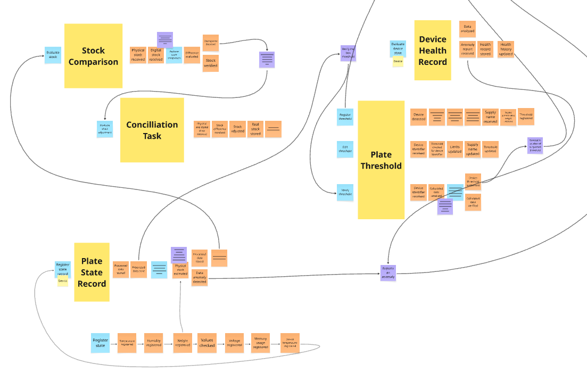 

El equipo identificó los agregados en cada bounded context de la siguiente manera:

- En **IAM** se identificó el agregado **User**, que centraliza los flujos de Sign up, Sign in y Register new user for account, garantizando que la identidad y el acceso de cada actor estén correctamente gestionados.
- En **Subscriptions and Payments** se identificaron tres agregados: **Subscription**, que agrupa los eventos de selección de plan y procesamiento mediante Stripe; **Plan**, que gestiona la detección y configuración de límites del plan contratado; y **Payment**, que agrupa el registro del pago, la recepción del monto y la generación del resumen de facturación.
- En **Profiles and Preferences** se identificaron dos agregados: **Profile**, que centraliza la creación de perfil, el cambio de contraseña, la actualización de datos personales y la carga de imágenes mediante Cloudinary API; y **Business**, que gestiona el registro y actualización de la información comercial del negocio.
- En **Asset and Resource Management** se identificaron cuatro agregados: **Branch**, que gestiona el ciclo de vida completo de las sucursales incluyendo la restricción de eliminación cuando existe stock disponible e integración con Cloudinary API, exponiendo los eventos `Branch location was selected`, `Branch image was loaded`, `Branch registered`, `Branch edited` y `Branch deleted`; **Custom Supply**, que gestiona el catálogo de insumos personalizados consolidando su creación en el evento `Custom Supply created` y exponiendo adicionalmente `Custom Supply edited` y `Custom Supply deleted`; **Inventory**, que centraliza las operaciones de adición y transferencia de stock entre sucursales; y **Batch**, que gestiona los lotes de inventario, incluyendo su creación, transferencia y descuento de stock.
- En **Design and Planning** se identificaron dos agregados: **Recipe**, que centraliza el registro y edición de recetas exponiendo los eventos `Recipe information entered`, `Supplies selected`, `The quantity of supplies was established`, `Recipe image uploaded`, `Recipe saved`, `Recipe edited` y `Recipe deleted`; y **Kit**, que gestiona la composición de kits comerciales para el sector retail exponiendo los eventos `Kit description entered`, `Supplies selected`, `Quantity of supplies established`, `Recipe image uploaded`, `Kit saved into the catalog`, `Kit edited` y `Kit deleted`.
- En **Sales Management** se identificó el agregado **Sales Order**, que centraliza el registro de ventas, el cálculo automático del precio total y el filtrado del historial de ventas.
- En **Communications** se identificó el agregado **Notification**, que gestiona la generación de notificaciones ante eventos del sistema y su despacho mediante OneSignal API.
- En **Device Management** se identificó el agregado **Device**, que centraliza el registro, configuración y desactivación de dispositivos IoT, incluyendo la asignación de sucursal, insumo de seguimiento, umbrales de peso, humedad y temperatura, y programación de encendido y apagado.

En **Tracking** se identificaron cinco agregados principales:

- **Device Health Record**: gestiona el monitoreo técnico del dispositivo a partir de métricas como voltaje, uso de CPU, uso de memoria y temperatura interna. El flujo considera `Voltage registered` → `CPU usage registered` → `Memory usage registered` → `Device temperature registered` → `Data analyzed`, pudiendo derivar en `Anomaly report received`, `Health record stored` y `Health history updated`.
- **Plate State Record**: centraliza la telemetría física del dispositivo. Registra las variables principales `Weight registered`, `Temperature registered` y `Humidity registered`, luego valida los valores con `Values checked` y calcula el stock físico mediante la política `Divide the weight received to calculate the physical stock`. El resultado puede ser `Physical stock estimated`, `Processed data stored`, `Processed data sent` o `Data anomaly detected`.
- **Stock Comparison**: compara el stock físico estimado con el stock digital registrado. El flujo parte de `Physical stock received` y `Digital stock received`, ejecuta `Perform stock comparison` y deriva en `Difference evaluated`, `Discrepancy detected` o `Stock verified`. Si existe discrepancia, se activa la política para crear una tarea de conciliación.
- **Conciliation Task**: gestiona el ajuste de inventario cuando se detecta una diferencia entre stock físico y digital. El flujo sigue: `Physical and digital stock received` → `Stock difference received` → `Stock adjusted` → `Real stock stored`.
- **Plate Threshold**: administra la configuración y verificación de umbrales por dispositivo. Registra límites mínimos y máximos de peso, temperatura y humedad, junto con el insumo asociado. Luego compara los datos calculados contra dichos límites mediante `Compare the data read with the threshold`. Si se supera un umbral, se genera `Device threshold surpassed` y la política `Generates an alert of surpassed threshold`.

A partir del Event Storming actualizado, **Tracking** se enfoca en procesar lecturas del dispositivo, estimar stock físico, comparar inventario, evaluar umbrales, registrar salud operativa y generar alertas o tareas de conciliación. La configuración administrativa del dispositivo, como horarios de encendido o apagado, queda fuera de este bounded context y pertenece a **Device Management**.

A partir del modelo de Event Storming, se llevó a cabo una sesión de Candidate Context Discovery para identificar los bounded contexts de la solución. Se utilizó principalmente la técnica look-for-pivotal-events durante la sesión.

Primero, se buscaron eventos clave que indiquen cambios de estado entre diferentes partes del proceso del negocio:

Luego, se agruparon los eventos de acuerdo a los principales cambios de contexto.

Se trazaron fronteras alrededor de los grupos identificados, estableciendo los límites iniciales de los bounded contexts.

Finalmente, se seleccionaron nombres para los bounded context. Dando como resultado la definición de 8 bounded contexts y la **versión final del Event Storming**:

A continuación, se explicará en qué consiste cada bounded context:

**Identity and Access Management:** También llamado "IAM", este bounded context contiene el proceso de ingreso del usuario a la plataforma, ya sea iniciando sesión o registrandose.

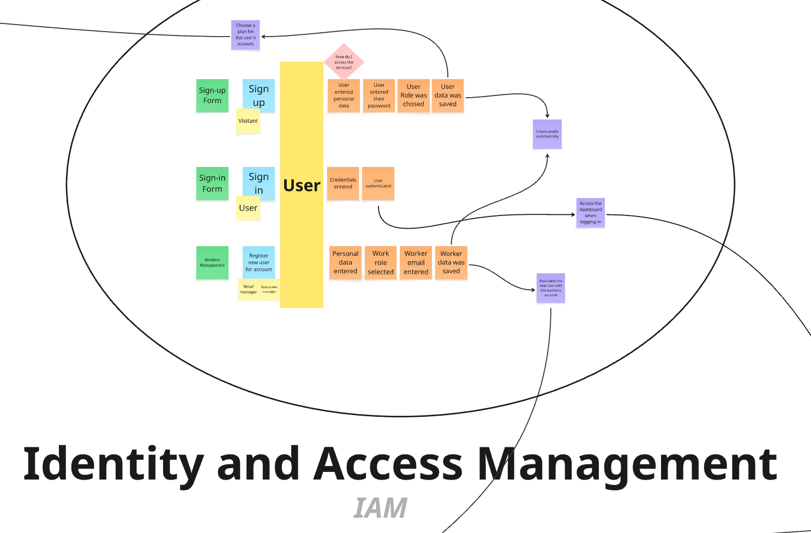

**Subscriptions and Payments:** También llamado "Subscriptions", este bounded context contiene el proceso de selección de planes, configuración de suscripciones, procesamiento de pagos e inicialización de cuentas de negocio, incluyendo la integración con plataformas externas como Stripe.

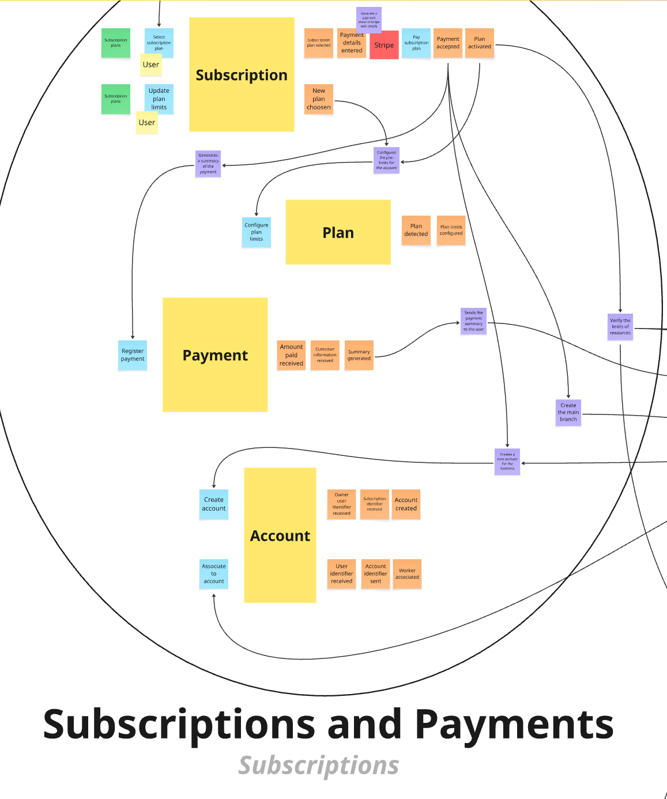

**Profiles and Preferences:** También llamado "Profiles", este bounded context contiene el proceso de gestión de la información personal del usuario, incluyendo la actualización de datos, cambio de contraseña y configuración de preferencias, así como la gestión de información del negocio.

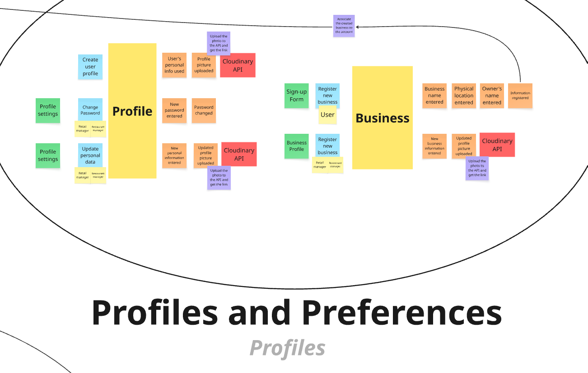

**Communications:** Este bounded context contiene el proceso de generación, envío y recepción de notificaciones dentro de la plataforma, a partir de eventos relevantes del sistema como alertas de stock o incidencias, integrándose con servicios externos como OneSignal para la distribución de mensajes.

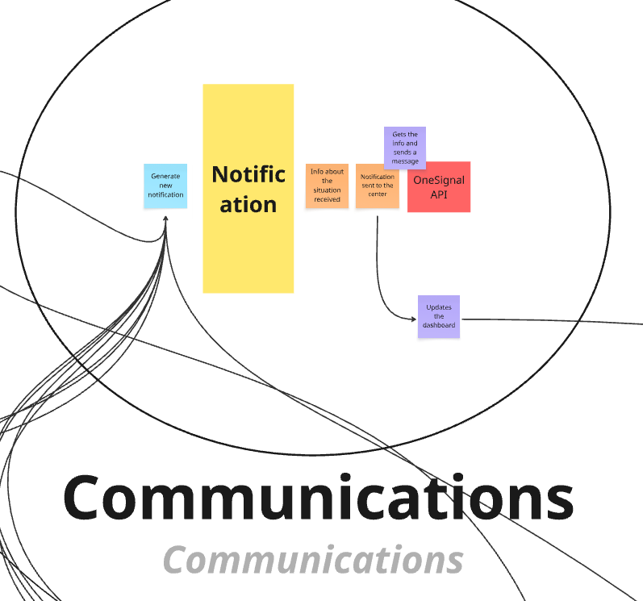

**Asset and Resource Management:** También llamado "Resource", este bounded context contiene el proceso de gestión de inventario, insumos, lotes y sucursales, incluyendo el registro, actualización y control de stock, así como la administración de proveedores y recursos asociados.

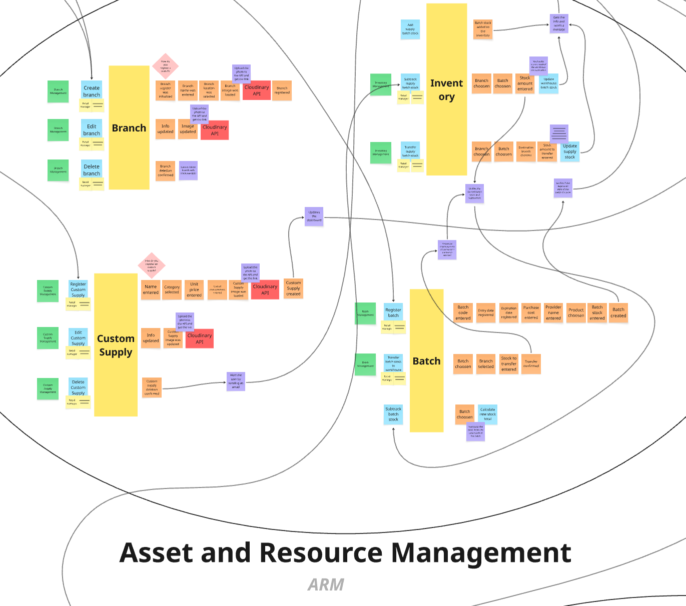

**Service Design and Planning:** También llamado "Planning", este bounded context contiene el proceso de diseño y gestión de recetas y kits, incluyendo la selección de insumos, categorización, actualización de información y almacenamiento de imágenes, permitiendo definir cómo se estructuran los productos dentro del sistema.

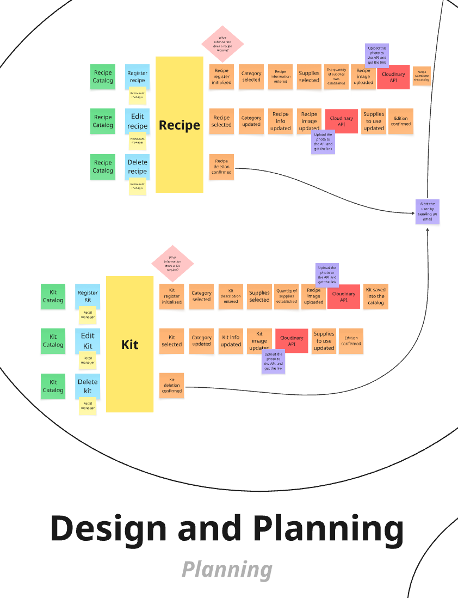

**Sales Order Management:** También llamado "Sales", este bounded context contiene el proceso de registro y gestión de ventas, incluyendo la selección de productos, cálculo del total, confirmación de la venta y actualización automática del stock disponible.

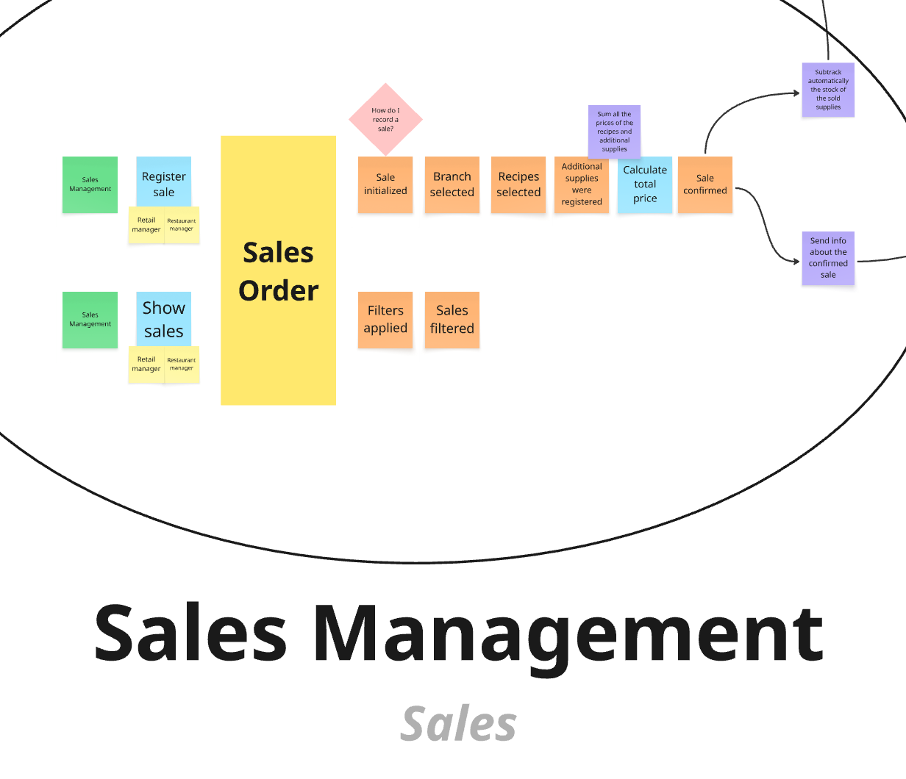

**Device Management:** También llamado "Device", este bounded context contiene el proceso de registro, asignación, configuración y desactivación de dispositivos IoT dentro de la plataforma, incluyendo la asociación del dispositivo a una sucursal, a un insumo personalizado y a sus parámetros básicos de medición.

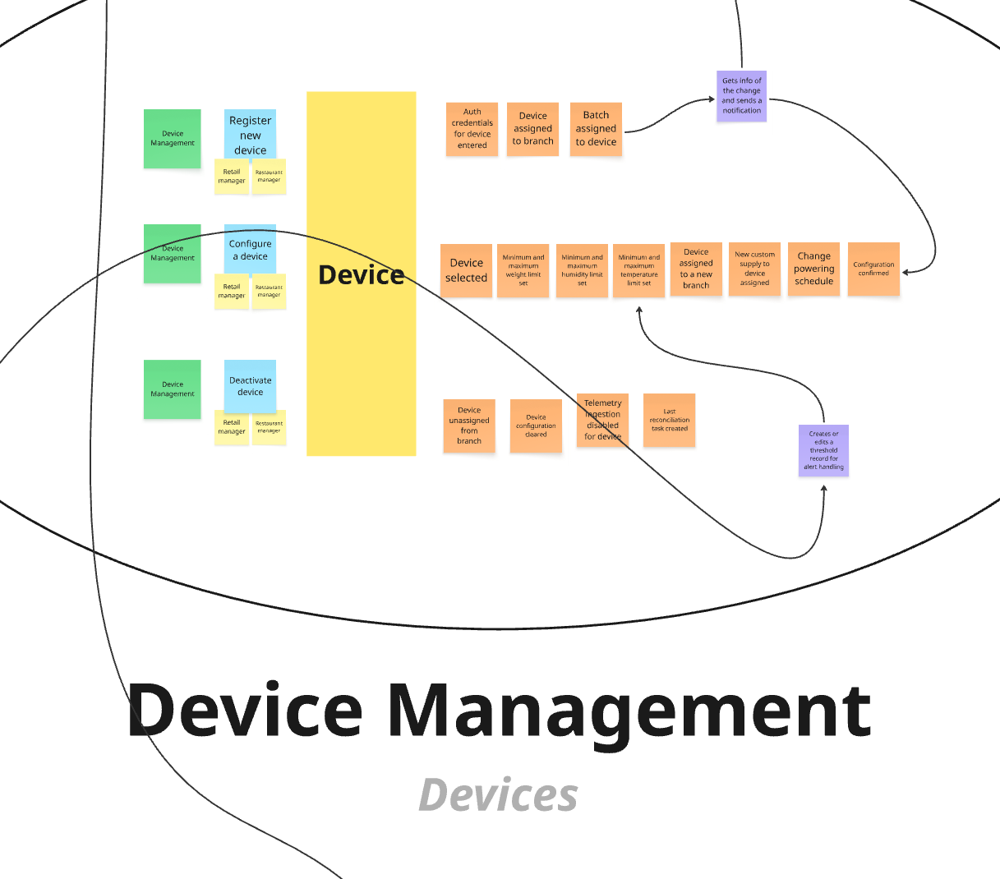

**Tracking:** Este bounded context contiene el proceso de monitoreo del estado del inventario físico y dispositivos, incluyendo la recepción de datos desde sensores, detección de anomalías, gestión de umbrales de stock y generación de tareas de conciliación o alertas ante inconsistencias.

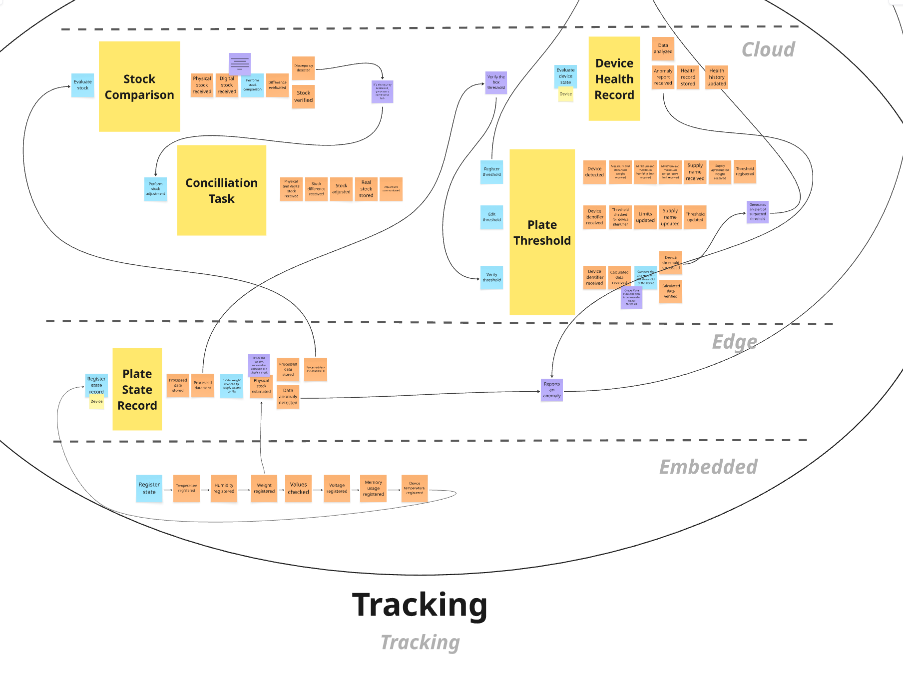

**Analytics:** Este bounded context contiene el proceso de análisis de información operativa del sistema, incluyendo la generación de reportes, métricas, visualizaciones e indicadores sobre inventario, ventas, alertas, discrepancias y comportamiento de los dispositivos, con el fin de apoyar la toma de decisiones del administrador.

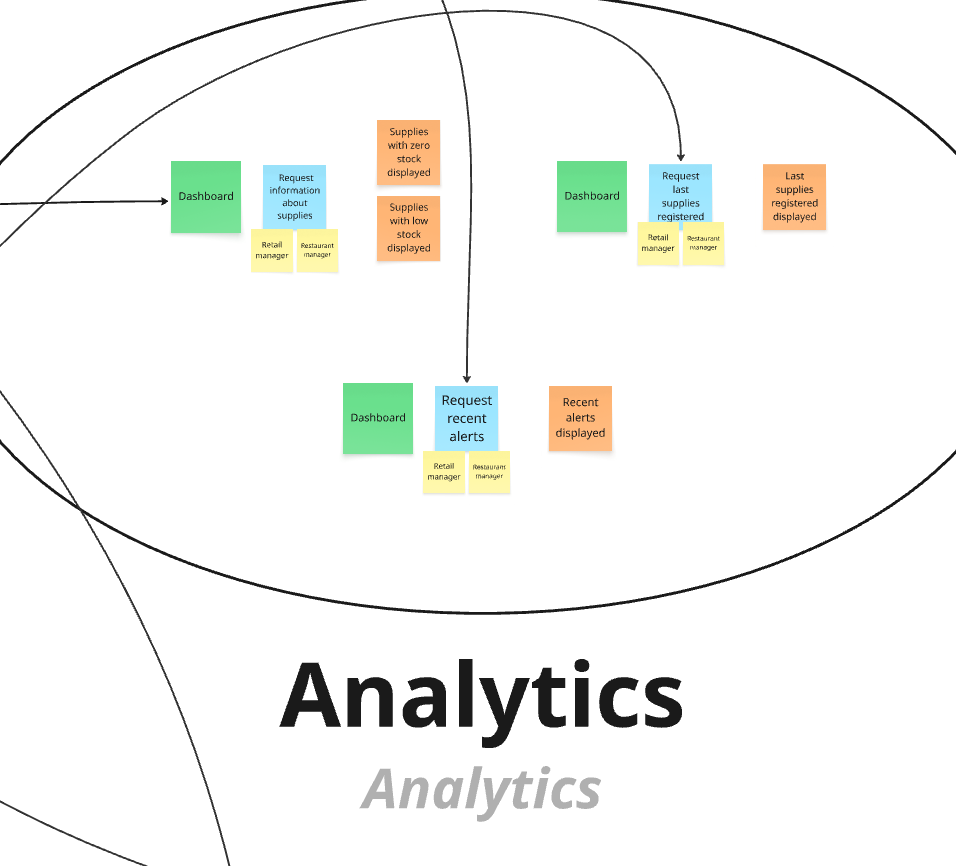

#### 4.1.1.2 Domain Message Flows Modeling

Los Domain Message Flows modelan las interacciones entre los diferentes bounded contexts, mostrando cómo se comunican entre sí mediante comandos, eventos y consultas. A continuación, se muestran los flujos de mensaje para los escenarios clave del negocio:

* **Access to platform:** En este flujo se muestra la interacción entre el bounded context IAM y el bounded context Profiles al momento en que un usuario se registra de forma omnicanal (Web o App) y se crea su perfil correspondiente.

  

* **Delete a recipe:** En este flujo se detalla la interacción iniciada por el Restaurant Manager al eliminar una receta. El bounded context Planning procesa el evento de confirmación y emite comandos hacia los contextos Communications (para el envío de notificaciones vía OneSignal) y Analytics, permitiendo que la aplicación actualice y muestre las alertas recientes.

  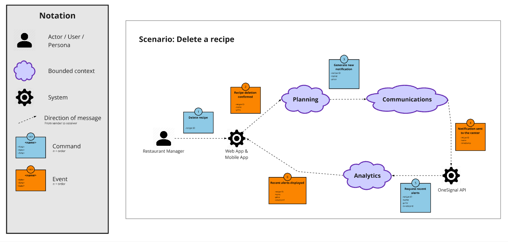

* **Push Notification Dispatch:** En este escenario se detalla cómo el bounded context ARM delega el envío de alertas. Tras el evento de añadir un lote al inventario, se envía un comando al bounded context Communications, el cual utiliza la API de OneSignal para disparar el evento de notificación hacia los dispositivos web y móviles de los usuarios.

  

* **Record a batch in the inventory:** En este flujo, el Manager registra un lote desde la interfaz. El evento de creación es procesado por el bounded context ARM, el cual genera un comando hacia el bounded context Communications para que este emita el evento de notificación enviada y actualice el centro de alertas en la aplicación.

  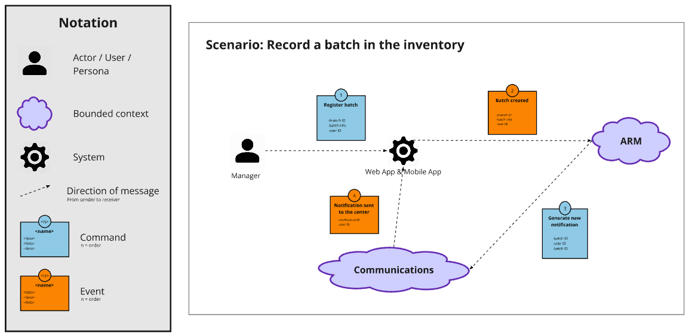

* **Register a retail sale and update inventory:** En este flujo se observa la sincronización automática entre ventas y almacén. Al confirmarse una venta por el Retail Manager, el bounded context Sales emite un comando directo al bounded context ARM para ejecutar la sustracción del stock en el lote de insumos correspondiente.

  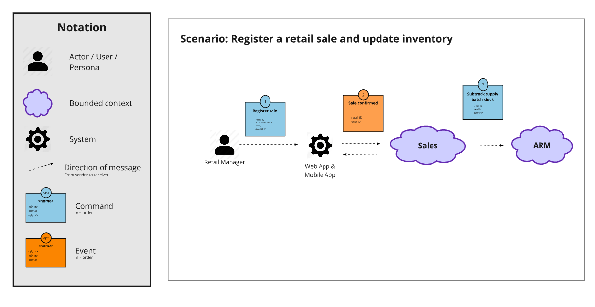

* **Signup and create branch:** En este flujo omnicanal, el proceso inicia en el bounded context IAM con el guardado de datos del usuario. Posteriormente, el flujo pasa al bounded context Subscriptions para la selección y activación de un plan, lo que finalmente desencadena un comando hacia el bounded context ARM para registrar e inicializar la sucursal única del sistema.

  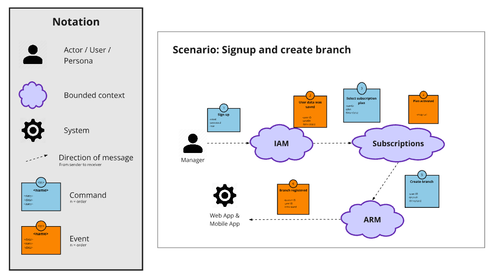

* **Subscribe to a plan:** En este flujo financiero, el usuario interactúa con la aplicación para elegir una suscripción. El bounded context Subscription orquesta el proceso emitiendo el comando de pago a la pasarela externa (Stripe), capturando el evento de éxito para finalmente activar el plan de forma global en la plataforma.

  

* **Tracking and Anomaly Detection:** En este flujo crítico de telemetría, la aplicación embebida (báscula inteligente) detecta que un umbral ha sido superado y emite un evento al bounded context Tracking. Este interactúa con Notification para generar la alerta, fluyendo luego hacia Analytics para que las aplicaciones de usuario final consuman y muestren la alerta reciente en el dashboard.

  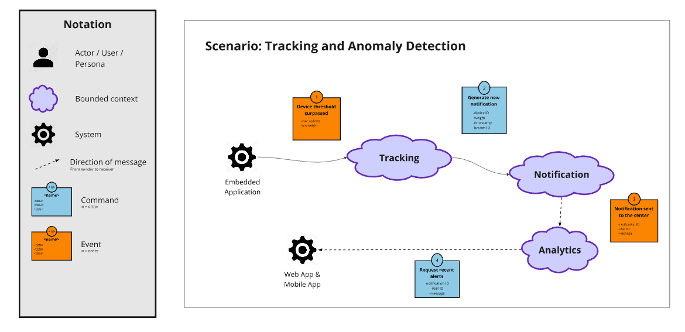

  
#### 4.1.1.3 Bounded Context Canvases

Un Bounded Context Canvas es una herramienta visual que ayuda a documentar lo necesario para un bounded context identificado. A continuación se describe el diseño de cada contexto, incluyendo la definición del contexto, su clasificación, las reglas de negocio, el lenguaje ubicuo utilizado para este context, y la comunicación de este contexto.

##### Asset and Resource Context

Maneja el proceso de gestión de inventarios para restaurantes y tiendas retail, incluyendo el registro y seguimiento de stock de suministros en las distintas sucursales del negocio del usuario, garantizando que cada usuario sepa el flujo del stock de sus suministros. Además, gestiona el registro y configuración de las balanzas inteligentes, permitiendo la personalización del dispositivo acorde a la necesidad del negocio del usuario.

  

El contexto de Asset and Resource representa un Core Domain del negocio, ya que sus funcionalidades son importantes para la diferenciación con otras soluciones y garantizar el éxito de la plataforma. Además, este contexto se encarga, principalmente, del proceso de gestión de inventarios. Por ello, este contexto actúa como ejecutor, siendo el contexto del que dependen otros como Design and Planning, Sales Management y Tracking.

##### Tracking Context

Gestiona las operaciones realizadas por los dispositivos adquiridos por el usuario, incluyendo la lectura de peso real de los suministros almacenados, la conversión a stock exacto y el estado de salud de los dispositivos. Además, controla el hardware de los dispositivos enviando señales cuando es momento de encenderse o apagarse.

  

El contexto de Tracking representa un Core Domain dentro del negocio, ya que sus funcionalidades diferencian a la solución de otras y ayudan a enganchar una mayor cantidad de usuarios. Además, sus funcionalidades incluyen la lectura, transformación e informe de datos reales de peso de los suministros de los usuarios. Es por ello, que este contexto actúa como un contexto de ejecución. También, es importante para el contexto de Asset and Resource donde se realiza una comparación entre stock físico y digital.

##### Devices Context

Maneja los dispositivos de los usuarios, incluyendo el registro de un dispositivo en el sistema y la configuración del mismo. De esta forma, se le permite al usuario personalizar el dispositivo según las necesidades de negocio del usuario.

  

El contexto de Devices Management representa un Core Domain dentro del negocio, puesto que sus funcionalidades son parte de la iniciación del usuario al uso de las placas inteligentes. Además, provee al usuario de personalización para adaptar al dispositivo a lo que necesite.

##### Design and Planning Context

Gestiona el proceso de diseño y planeamiento de recetas para restaurantes y kits de productos para tiendas retail, incluyendo asignación de suministros para registrar recetas o kits y asignación de imágenes referenciales a las recetas o kits, garantizando una mejor operación de ventas para el contexto de ventas al no tener que registrar mano a mano los suministros usados para concretar una venta.

  

El contexto de Design and Planning representa un Supporting Domain enfocado en enganchar usuarios ya que provee de una base para el registro de ventas para el contexto de Sales, además facilita el reconocimiento de platos o kits que utiliza el negocio para sus ventas diarias.

##### Sales Management Context

Gestiona las ventas registradas de un restaurante o tienda retail, incluyendo la asignación de suministros para registrar una venta o utilizar kits o recetas previamente registradas y el cálculo inmediato del precio total a pagar, facilitando el proceso de registro de ventas para los administradores.

  

El contexto de Sales Management representa un Supporting Domain enfocado en atraer y enganchar usuarios a la aplicación ya que provee una herramienta que facilita el proceso de ventas de restaurantes y tiendas retail. Además, ayuda al sistema de ventas mostrando el total de ventas de determinados periodos y qué productos se vendieron para cada transacción realizada.

##### Analytics Context

Se encarga de la toma de datos relevantes del usuario y mostrarlos de forma visual y que permita a los usuarios tomar decisiones informadas sobre sus suministros.

  

El contexto de Analytics representa un Supporting Domain, pues, soporta el sistema de información de la plataforma con gráficos y tablas que permiten a los usuarios visualizar el estado actual de sus suministros.

##### Subscriptions Context

Se encarga de gestionar el ciclo de vida de las suscripciones en plataformas SaaS y el procesamiento de pagos de las mismas, incluyendo la adquisición de una suscripción y la renovación o cancelación de la misma y el procesamiento externo con una integración con la pasarela de pagos de Stripe.

  

El contexto de Subscripciones representa un Supporting Domain con enfoque en generar ingresos, pues es el puente que determina si el usuario puede acceder a todas las herramientas de la plataforma y es la que genera ingresos directamente al brindar una licencia temporal a los usuarios que decidan pagar una y beneficiarse con las herramientas.

##### Profiles Context

Gestiona los perfiles de los usuarios, los cuales incluyen información personal e información relacionada a los negocios de los usuarios, permitiendo actualizar la información requerida y personalización subiendo un avatar con la integración con Cloudinary.

  

El contexto de Profiles representa un Generic Domain enfocado en enganche de usuarios, dado que un perfil personalizado provee de una experiencia más satisfactoria para el usuario. Además, provee de una identidad tanto como para él como para su negocio dentro de la plataforma.

##### IAM Context

Gestiona la autenticación y autorización de los usuarios, incluyendo el registro de cuentas para visitantes, la asignación de roles para diferenciar entre tienda retail y restaurante. Además, este contexto contiene un flujo de procesos que inicia desde la elección y pago de un plan para suscripción, el registro del usuario, registro de información personal y registro de información de negocio.

  

El contexto de IAM representa un Generic Domain enfocado en el cumplimiento de seguridad para las cuentas de los usuarios que deciden confiar en la plataforma para gestionar sus negocios. Además, garantizar la seguridad es algo importante para el negocio, sin embargo, no es algo que diferencie la solución de otras ya existentes.

##### Communications Context

Gestiona la comunicación directa con el usuario, incluyendo alertar y notificar a los usuarios de eventos críticos que ocurran en la plataforma como stock bajo, stock cero o vencimiento próximo, hasta la concialiación entre stock físico y digital.

  

El contexto de Communications representa un Supporting Domain enfocado en enganche de usuarios dadas sus funcionalidades de notificación ante eventos críticos que facilitan el accionar y la toma de decisiones ante estos eventos.

### 4.1.2. Context Mapping

En esta sección se explica el proceso de elaboración del Context Map. Asimismo, se permite visualizar las relaciones estructurales entre los Bounded Contexts, junto con los patrones de relación definidos en Domain-Driven Design (DDD), tales como Anti-Corruption Layer (ACL), Conformist, Customer/Supplier y Shared Kernel.

A continuación, se describen las relaciones y patrones de integración observados entre estos contextos.

#### Análisis de Bounded Contexts

##### **Analytics ↔ Asset and Resource Management**

- **Relación**: Upstream (Asset and Resource Management) / Downstream (Analytics)
- **Patrón**: Conformist — Analytics adopta directamente el modelo definido por Asset and Resource Management sin transformación propia. Asset and Resource Management es la fuente de verdad de los recursos del sistema, y Analytics se conforma a ese modelo para construir sus reportes y métricas.

##### **Design and Planning ↔ Asset and Resource Management**

- **Relación**: Upstream (Asset and Resource Management) / Downstream (Design and Planning)
- **Patrón**: Shared Kernel — Ambos contextos comparten un modelo común vinculado a la planificación y gestión de recursos. Asset and Resource Management actúa como proveedor (SUP) y Design and Planning como cliente (CUST), garantizando que la gestión de activos guíe la planificación sin duplicar el modelo compartido. Design and Planning incorpora además un ACL para proteger su dominio del lenguaje propio de la gestión de recursos.

##### **Asset and Resource Management ↔ Sales Management**

- **Relación**: Upstream (Asset and Resource Management) / Downstream (Sales Management)
- **Patrón**: Shared Kernel — Asset and Resource Management provee información de recursos y activos que Sales Management consume para gestionar correctamente los procesos de venta. La relación SUP → CUST asegura que los datos de recursos sean la fuente autoritativa para el dominio de ventas.

##### **Asset and Resource Management ↔ Device Management**

- **Relación**: Upstream (Asset and Resource Management) / Downstream (Device Management)
- **Patrón**: Customer/Supplier — Device Management consume información de Asset and Resource Management para gestionar los dispositivos asociados a los recursos del sistema. Asset and Resource Management actúa como proveedor (SUP) y Device Management como cliente (CUST).

##### **Asset and Resource Management ↔ Communication**

- **Relación**: Upstream (Asset and Resource Management) / Downstream (Communication)
- **Patrón**: Customer/Supplier — Communication consume datos provenientes de Asset and Resource Management para emitir notificaciones relacionadas con el estado de los recursos y activos, sin acoplarse a la lógica interna del dominio de gestión.

##### **Asset and Resource Management ↔ Tracking**

- **Relación**: Upstream (Asset and Resource Management) / Downstream (Tracking)
- **Patrón**: Anti-Corruption Layer — Tracking consume datos de Asset and Resource Management pero los traduce a su propio modelo de seguimiento a través de un ACL, protegiendo su dominio del lenguaje propio de la gestión de activos y recursos.

##### **Identity and Access Management ↔ Subscriptions and Payments**

- **Relación**: Upstream (Identity and Access Management) / Downstream (Subscriptions and Payments)
- **Patrón**: Anti-Corruption Layer — Subscriptions and Payments depende de Identity and Access Management para validar la identidad del usuario, pero traduce el modelo de identidad a través de un ACL. Esto permite que el dominio de pagos mantenga su propio lenguaje sin acoplarse directamente al modelo de autenticación.
- **Patrón**: Shared Kernel — Identity and Access Management provee al contexto de suscripciones una relación con el usuario dueño de la cuenta y suscripción, compartiendo un núcleo común que evita la duplicación del modelo de usuario.

##### **Identity and Access Management ↔ Profiles and Preferences**

- **Relación**: Upstream (Identity and Access Management) / Downstream (Profiles and Preferences)
- **Patrón**: Anti-Corruption Layer — Profiles and Preferences consume el modelo de identidad de Identity and Access Management pero lo traduce a través de un ACL para construir el perfil del usuario, protegiendo su dominio del lenguaje propio de la autenticación.
- **Patrón**: Shared Kernel — Identity and Access Management provee al contexto de perfiles una relación con el usuario cuya información de negocio y personal es utilizada por dicho contexto, compartiendo un núcleo común que garantiza coherencia sin duplicación.

##### **Communication ↔ Tracking**

- **Relación**: Upstream (Communication) / Downstream (Tracking)
- **Patrón**: Customer/Supplier — Tracking consume eventos generados por Communication para coordinar el seguimiento de operaciones notificadas. Communication actúa como proveedor (SUP) y Tracking como cliente (CUST).

Con base en el análisis, se implementaron los siguientes patrones de relación entre contextos:

- **Conformist** entre Asset and Resource Management → Analytics.
- **Shared Kernel** entre Asset and Resource Management → Sales Management, Asset and Resource Management → Design and Planning, Identity and Access Management → Subscriptions and Payments e Identity and Access Management → Profiles and Preferences.
- **Anti-Corruption Layer** en las relaciones de Tracking, Design and Planning, Subscriptions and Payments y Profiles and Preferences con sus respectivos upstream.
- **Customer/Supplier** entre Asset and Resource Management → Device Management, Asset and Resource Management → Communication y Communication → Tracking.

En la imagen se observa que el contexto Asset and Resource Management actúa como el nodo central del sistema, relacionándose con dominios como Identity and Access Management, Sales Management, Device Management, Design and Planning, Communication y Tracking, lo que evidencia una distribución del sistema en bounded contexts con responsabilidades claramente delimitadas.
Las relaciones upstream/downstream (U/D) reflejan las dependencias direccionales entre contextos. El patrón ACL (Anti-Corruption Layer) aparece en contextos como Communication, Tracking, Profiles and Preferences y Subscriptions and Payments, protegiéndolos de contaminación con modelos ajenos a su dominio. El patrón SK (Shared Kernel) se emplea en las relaciones entre Asset and Resource Management con Sales Management y Design and Planning, así como entre Identity and Access Management con Subscriptions and Payments y Profiles and Preferences, garantizando un modelo compartido sin duplicación. Finalmente, el patrón CF (Conformist) se identifica en Analytics, que adopta directamente el modelo de su upstream sin transformación propia.

### 4.1.3. Software Architecture

En esta sección se presentan los diagramas de arquitectura de software basados en el modelo C4, los cuales permiten describir la estructura del sistema Restock a diferentes niveles de detalle.

#### 4.1.3.1. Software Architecture System Landscape Diagram

En esta sección se presenta una visión general de los principales usuarios, sistemas externos y componentes internos que interactúan con la plataforma.

Para Restock, el diagrama de panorama del sistema incluye los siguientes elementos principales:

**Restaurant Administrator:** Usuario encargado de gestionar el inventario, recetas, ventas y operaciones dentro de un restaurante, interactuando directamente con la plataforma Restock para administrar sus procesos.

**Retail Administrator:** Usuario responsable de gestionar el inventario y las operaciones comerciales en entornos retail, utilizando Restock como herramienta central para el control del stock y la toma de decisiones.

**Back Office Staff:** Personal administrativo y operativo de la organización UI-Topic que se encarga de administrar, supervisar y dar soporte al sistema, asegurando su correcto funcionamiento.

**Support:** Equipo de soporte que asiste a los clientes, gestiona incidencias y monitorea el estado del sistema para garantizar una adecuada experiencia de usuario.

**Maintenance Technician:** Personal técnico responsable de la instalación, mantenimiento y monitoreo de los dispositivos físicos, asegurando la correcta operación del hardware asociado.

**Restock:** Sistema principal de la solución, encargado de la gestión del inventario y de coordinar la comunicación entre los distintos componentes, incluyendo aplicaciones, hardware IoT y servicios externos.

**Restock Hardware:** Subsistema de hardware orientado al monitoreo de stock mediante dispositivos IoT, que recopila datos físicos y los envía a la plataforma para su procesamiento.

**OneSignal API:** Servicio externo utilizado para el envío de notificaciones y alertas a los usuarios del sistema.

**Stripe:** Plataforma externa encargada de procesar pagos y suscripciones dentro de la solución.

**Cloudinary API:** Servicio externo utilizado para el almacenamiento y gestión de archivos multimedia, como imágenes asociadas a productos.

En conjunto, este diagrama muestra cómo Restock actúa como el núcleo del sistema, integrando a los distintos usuarios, componentes internos y servicios externos para ofrecer una solución completa de gestión de inventarios.

#### 4.1.3.2. Software Architecture Context Level Diagrams

El diagrama de contexto en la arquitectura de software proporciona una visión general de alto nivel del sistema dentro de su entorno, mostrando cómo interactúa con los actores externos, sistemas externos y con dispositivos IoT que capturan y envían datos del mundo físico. Este diagrama permite comprender los límites del sistema y las principales interacciones externas.

Para Restock, el diagrama de contexto incluye los siguientes actores, sistemas externos y dispositivos IoT:

**Visitors:** Usuarios anónimos que navegan el contenido público de la plataforma, como información, planes y características, y pueden registrarse o acceder como administradores de restaurante o retail.

**Restaurant Administrators:** Usuarios que gestionan el inventario, recetas, ventas y operaciones de restaurantes mediante la plataforma Restock.

**Retail Administrators:** Usuarios que gestionan el inventario, control de stock y operaciones comerciales en entornos de retail utilizando la plataforma Restock.

**Restock Platform:** Sistema principal que permite la gestión de inventarios, monitoreo de stock en tiempo real y automatización de procesos mediante la integración con aplicaciones web, móviles, servicios externos y dispositivos IoT.

**Stripe:** Sistema externo que gestiona los pagos y suscripciones de los usuarios dentro de la plataforma Restock.

**Cloudinary API:** Servicio externo encargado del almacenamiento, gestión y entrega de imágenes y contenido multimedia utilizado en la plataforma.

**OneSignal API:** Servicio externo utilizado para el envío de notificaciones y alertas en tiempo real a los usuarios de la plataforma.

**Restock Smart Inventory Device:** Dispositivo IoT que captura datos de peso, temperatura y humedad desde el entorno físico mediante sensores y los transmite al sistema para su procesamiento y uso en el control de inventarios.

#### 4.1.3.3. Software Architecture Container Level Diagrams

El diagrama de contenedores de la arquitectura de software proporciona una visión de alto nivel de los principales contenedores del sistema, incluyendo aplicaciones, servicios, bases de datos y componentes IoT, como dispositivos embebidos y aplicaciones edge que interactúan con sensores físicos. Además, muestra cómo estos elementos se comunican entre sí para procesar y transmitir información. Para Restock, el diagrama de contenedores incluye los siguientes contenedores principales:

**Landing Page:** Sitio web estático desarrollado con HTML5, CSS y JavaScript que presenta información pública sobre la plataforma, como funcionalidades, planes y términos de servicio (ToS). Además, guía a los visitantes hacia la aplicación web mediante elementos de navegación y llamados a la acción, interactuando con el contenedor **Web Application** a través de redirecciones. A su vez, redigire a los visitantes de dispositivos móviles a la tienda de aplicaciones para descargar la aplicación móvil.

**Web Server:** Componente que actúa como punto de entrada a la plataforma web de Restock, encargado de entregar la aplicación frontend al navegador del usuario, interactuando con la Restock Platform Web Application.

**Web Application:** Aplicación web desarrollada con TypeScript y Angular que se ejecuta en el navegador del usuario y permite gestionar el inventario, visualizar insumos y platos, y monitorear el stock en tiempo real, interactuando con el Load Balancer mediante solicitudes HTTP que deben llegar hasta el API.

**Mobile Application:** Aplicación móvil multiplataforma desarrollada con Dart y Flutter que permite a los usuarios gestionar inventario, consultar productos y monitorear el stock en tiempo real desde dispositivos móviles, interactuando con Load Balancer mediante HTTP y con la Mobile SQLite Database para almacenamiento local.

**Mobile SQLite Database:** Base de datos local basada en SQLite que almacena información de la aplicación en el dispositivo móvil del usuario para permitir acceso offline y mejorar el rendimiento, interactuando únicamente con la Restock Mobile Application.

**NGINX Load Balancer:** Es el balanceador de carga basado en NGINX que redirige las peticiones HTTP que son para el Cloud REST API hacia una instancia de API Gateway. Ayuda a proteger la entrada directa al servidor central y a reducir saturación en servidores.

**API Gateway:** Es el punto de entrada para acceder al Cloud REST API. Funciona como módulo de seguridad para validar tokens asociadas a las consultas de los clientes (web y móvil).

**Cloud REST API:** REST API en la nube desarrollada con Java y Spring Boot que gestiona la lógica de negocio, procesa datos de inventario, recibe información desde el Edge Application, envía comandos de configuración a los dispositivos y coordina la comunicación entre los distintos componentes del sistema, interactuando con su base de datos centralizada MongoDB Database, base de datos en memoria Redis Cache Server y servicios externos como Stripe, Cloudinary y OneSignal.

**MongoDB Database:** Base de datos central del sistema que almacena información de inventario, usuarios, productos y suscripciones, interactuando con el Cloud REST API.

**Redis Cache Server:** Base de datos en memoria que almacena información que es consultada frecuentemente por los usuarios para reducir latencia y sobrecarga de la base de datos principal MongoDB Database.

**Edge Application:** Edge Gateway desarrollado en Python y Flask que recibe datos de peso, temperatura y humedad desde la aplicación embebida, los procesa y los envía al Cloud REST API, además de recibir comandos de configuración como asignación de suministro desde el API y transmitirlos al dispositivo IoT. Además, se encarga de evaluar el estado de salud de los dispositivos del usuario.

**Edge Local Database:** Base de datos local basada en SQLite que almacena configuración del dispositivo, datos recientes de sensores y eventos pendientes de sincronización para garantizar el funcionamiento offline y la integridad de los datos, interactuando con la Restock Local Station Edge Application.

**MQTT Broker:** Es el servidor que funciona como puente de comunicación entre la nube (Cloud REST API) y el edge gateway (Edge Application). Además, recibe los datos procesados del edge gateway y los enruta hacia el API Gateway para que puedan ser verificados y comparados. También, se encarga de recibir comandos por parte del API en nube para entregarlos al gateway adecuado.

**Embedded Application:** Software embebido desarrollado en C++ que controla el dispositivo físico de medición, captura datos de peso, temperatura y humedad desde los sensores y recibe los datos procesados del gateway para mostrarlos de forma constante en el Display LCD que posee el dispositivo IoT.

#### 4.1.3.4. Software Architecture Deployment Diagrams

A continuación, se muestra el diagrama de despliegue, el cual estructura la distribución física de los componentes del sistema en los distintos entornos de ejecución, incluyendo la infraestructura en la nube, los dispositivos del usuario, los nodos de cómputo en el edge y el hardware embebido.

El diagrama de despliegue muestra la distribución física de los componentes de la plataforma Restock en los distintos entornos de ejecución, incluyendo infraestructura en la nube, dispositivos del usuario, nodos de cómputo en el edge y hardware embebido.

**Landing Page y Web Server:** Ambas aplicaciones se despliegan utilizando Vercel y cada una forma parte de Vercel Edge Network donde el usuario puede acceder a las aplicaciones de forma pública.

**Web Application:** Cuando el usuario accede al Web Server desplegado en Vercel, envía los archivos PWA de la aplicación web al navegador del usuario.

**Mobile Application y Mobile SQLite Database:** La aplicación móvil se despliega mediante Firebase App Distribution y se instala en el dispositivo del usuario creando, a su vez, la base de datos local basada en SQLite.

**API Gateway y Cloud REST API:** Se despliegan en la nube en el servicio ofrecido por Render donde los clientes pueden acceder a los servicios web del API.

**MongoDB Database:** La base de datos del Cloud API se despliega en MongoDB Atlas Cluster, una solución cloud para despliegue de bases de datos MongoDB.

**Redis Cache Server:** La base de datos en memoria se despliega en Redis Cloud, una plataforma cloud para despliegue de bases de datos Redis.

**Edge Application y Edge Local Database:** El Edge Gateway junto con su base de datos son desplegados en manera física en un dispositivo Raspberry Pi en un sistema operativo Linux para una eficiencia en el procesamiento de información.

**MQTT Broker:** El broker de mensajería para telemetría es desplegado en HiveMQ Cloud, una solución en nube para implementación de comunicación MQTT para ecosistemas IoT.

**Embedded Application:** El software embebido se despliega de forma local en el ESP32 del dispositivo IoT.

## 4.2. Tactical-Level Domain-Driven Design

### 4.2.1. Bounded Context: Identity and Access Management

Este Bounded Context se encarga de gestionar el acceso seguro a la aplicación y el proceso de registro de los distintos actores del sistema. Proporciona los mecanismos necesarios para la autenticación y autorización, garantizando la correcta asignación de roles (Visitante, Usuario, Administrador de Retail, Administrador de Restaurante) y la validación de credenciales según las políticas de seguridad del negocio.

#### 4.2.1.1. Domain Layer

La capa de dominio representa el núcleo (core) de la aplicación para el Bounded Context de Identity and Access Management. En esta capa se encapsulan todas las reglas de negocio críticas tales como la creación de usuarios, autenticación, asignación de roles y vinculación con cuentas empresariales.

Esta capa se mantiene agnóstica a la infraestructura o interfaces de usuario, centralizando su lógica en Entidades (Entities), Raíces de Agregación (Aggregate Roots), Objetos de Valor (Value Objects) para garantizar el tipado estricto, Eventos de Dominio (Domain Events).

##### Aggregates & Entities

<em>Tabla de Aggregates en el Domain Layer</em>

<table style="width:100%; border-collapse: collapse; border: 1px solid;">
  <thead>
    <tr>
      <th style="padding: 10px; border: 1px solid; text-align: left;">Nombre de Clase</th>
      <th style="padding: 10px; border: 1px solid; text-align: left;">Categoría</th>
      <th style="padding: 10px; border: 1px solid; text-align: left;">Propósito y Reglas de Negocio</th>
    </tr>
  </thead>
  <tbody>
    <tr>
      <td style="padding: 10px; border: 1px solid;"><strong>User</strong></td>
      <td style="padding: 10px; border: 1px solid;">Aggregate Root</td>
      <td style="padding: 10px; border: 1px solid;">Entidad principal que representa a cualquier actor del sistema. Orquesta la validación de credenciales y asegura que la transición de estados (como el registro de un visitante a un usuario activo) cumpla con las invariantes de seguridad.</td>
    </tr>
    <tr>
      <td style="padding: 10px; border: 1px solid;"><strong>Role</strong></td>
      <td style="padding: 10px; border: 1px solid;">Entity</td>
      <td style="padding: 10px; border: 1px solid;">Define el conjunto de permisos asociados a un usuario. En este contexto, gestiona la distinción entre Visitant, Retail manager y Restaurant manager, permitiendo el acceso granular a las funcionalidades del negocio.</td>
    </tr>
  </tbody>
</table>

##### Value Objects

<em>Tabla de Value Objects en el Domain Layer</em>

<table style="width:100%; border-collapse: collapse; border: 1px solid;">
  <thead>
    <tr>
      <th style="padding: 10px; border: 1px solid; text-align: left;">Nombre de Clase</th>
      <th style="padding: 10px; border: 1px solid; text-align: left;">Categoría</th>
      <th style="padding: 10px; border: 1px solid; text-align: left;">Propósito y Reglas de Negocio</th>
    </tr>
  </thead>
  <tbody>
    <tr>
      <td style="padding: 10px; border: 1px solid;"><strong>Username</strong></td>
      <td style="padding: 10px; border: 1px solid;">Value Object</td>
      <td style="padding: 10px; border: 1px solid;">Encapsula el identificador único de la cuenta. Valida formatos y asegura que no existan duplicidad de identidades durante los procesos de Sign up o registro de trabajadores.</td>
    </tr>
    <tr>
      <td style="padding: 10px; border: 1px solid;"><strong>Password</strong></td>
      <td style="padding: 10px; border: 1px solid;">Value Object</td>
      <td style="padding: 10px; border: 1px solid;">Garantiza la inmutabilidad y seguridad de la clave de acceso. Se encarga de aplicar reglas de complejidad y manejar la lógica de encriptación/hashing antes de la persistencia.</td>
    </tr>
  </tbody>
</table>

##### Commands (Domain Intentions)

<em>Tabla de Commands en el Domain Layer</em>

<table style="width:100%; border-collapse: collapse; border: 1px solid;">
  <thead>
    <tr>
      <th style="padding: 10px; border: 1px solid; text-align: left;">Nombre de Clase</th>
      <th style="padding: 10px; border: 1px solid; text-align: left;">Descripción y Atributos</th>
    </tr>
  </thead>
  <tbody>
    <tr>
      <td style="padding: 10px; border: 1px solid;"><strong>SignUpCommand</strong></td>
      <td style="padding: 10px; border: 1px solid;">Representa la intención de registrar un nuevo usuario. Contiene: username, password, email.</td>
    </tr>
    <tr>
      <td style="padding: 10px; border: 1px solid;"><strong>SignInCommand</strong></td>
      <td style="padding: 10px; border: 1px solid;">Representa la intención de autenticar a un usuario existente. Contiene: username, password.</td>
    </tr>
    <tr>
      <td style="padding: 10px; border: 1px solid;"><strong>UpdateUserRoleCommand</strong></td>
      <td style="padding: 10px; border: 1px solid;">Intención de modificar los privilegios de un usuario. Contiene: userId, roleId.</td>
    </tr>
  </tbody>
</table>

 

##### Queries (Domain Information Requests)

<em>Tabla de Queries en el Domain Layer</em>

<table style="width:100%; border-collapse: collapse; border: 1px solid;">
  <thead>
    <tr>
      <th style="padding: 10px; border: 1px solid; text-align: left;">Nombre de Clase</th>
      <th style="padding: 10px; border: 1px solid; text-align: left;">Descripción y Atributos</th>
    </tr>
  </thead>
  <tbody>
    <tr>
      <td style="padding: 10px; border: 1px solid;"><strong>GetUserByIdQuery</strong></td>
      <td style="padding: 10px; border: 1px solid;">Solicitud de información detallada de un usuario específico. Contiene: userId.</td>
    </tr>
    <tr>
      <td style="padding: 10px; border: 1px solid;"><strong>GetAllRolesQuery</strong></td>
      <td style="padding: 10px; border: 1px solid;">Solicitud para listar todos los roles y permisos disponibles en el sistema.</td>
    </tr>
  </tbody>
</table>

#### 4.2.1.2. Interface Layer

La capa de interfaz expone los puntos de entrada HTTP necesarios para que los clientes interactúen con el sistema de identidad. A través de controladores especializados, gestiona los flujos de autenticación y la administración de personal operativo.

##### AuthenticationController

<em>Tabla de AuthenticationController en el Interface Layer</em>

<table style="width:100%; border-collapse: collapse; border: 1px solid;">
  <thead>
    <tr>
      <th style="padding: 10px; border: 1px solid; text-align: left;">Propiedad</th>
      <th style="padding: 10px; border: 1px solid; text-align: left;">Valor</th>
    </tr>
  </thead>
  <tbody>
    <tr>
      <td style="padding: 10px; border: 1px solid;"><strong>Nombre</strong></td>
      <td style="padding: 10px; border: 1px solid;">AuthenticationController</td>
    </tr>
    <tr>
      <td style="padding: 10px; border: 1px solid;"><strong>Categoría</strong></td>
      <td style="padding: 10px; border: 1px solid;">Controller</td>
    </tr>
    <tr>
      <td style="padding: 10px; border: 1px solid;"><strong>Propósito</strong></td>
      <td style="padding: 10px; border: 1px solid;">Gestionar los procesos de autenticación y registro inicial en la plataforma.</td>
    </tr>
    <tr>
      <td style="padding: 10px; border: 1px solid;"><strong>Ruta Base</strong></td>
      <td style="padding: 10px; border: 1px solid;">/api/v1/authentication</td>
    </tr>
  </tbody>
</table>

 

<em>Tabla de métodos de AuthenticationController en el Interface Layer</em>

<table style="width:100%; border-collapse: collapse; border: 1px solid;">
  <thead>
    <tr>
      <th style="padding: 10px; border: 1px solid;">Nombre</th>
      <th style="padding: 10px; border: 1px solid;">Ruta</th>
      <th style="padding: 10px; border: 1px solid;">Acción</th>
      <th style="padding: 10px; border: 1px solid;">Handle (Command/Query)</th>
    </tr>
  </thead>
  <tbody>
    <tr>
      <td style="padding: 10px; border: 1px solid;">signIn</td>
      <td style="padding: 10px; border: 1px solid;">/sign-in (POST)</td>
      <td style="padding: 10px; border: 1px solid;">Autentica credenciales y genera el recurso de usuario autenticado.</td>
      <td style="padding: 10px; border: 1px solid;">SignInCommand</td>
    </tr>
    <tr>
      <td style="padding: 10px; border: 1px solid;">signUp</td>
      <td style="padding: 10px; border: 1px solid;">/sign-up (POST)</td>
      <td style="padding: 10px; border: 1px solid;">Registra un nuevo usuario en el sistema.</td>
      <td style="padding: 10px; border: 1px solid;">SignUpCommand</td>
    </tr>
  </tbody>
</table>

 

##### RolesController

<em>Tabla de RolesController en el Interface Layer</em>

<table style="width:100%; border-collapse: collapse; border: 1px solid;">
  <thead>
    <tr>
      <th style="padding: 10px; border: 1px solid; text-align: left;">Propiedad</th>
      <th style="padding: 10px; border: 1px solid; text-align: left;">Valor</th>
    </tr>
  </thead>
  <tbody>
    <tr>
      <td style="padding: 10px; border: 1px solid;"><strong>Nombre</strong></td>
      <td style="padding: 10px; border: 1px solid;">RolesController</td>
    </tr>
    <tr>
      <td style="padding: 10px; border: 1px solid;"><strong>Categoría</strong></td>
      <td style="padding: 10px; border: 1px solid;">Controller</td>
    </tr>
    <tr>
      <td style="padding: 10px; border: 1px solid;"><strong>Propósito</strong></td>
      <td style="padding: 10px; border: 1px solid;">Proveer acceso al catálogo de roles disponibles en el sistema.</td>
    </tr>
    <tr>
      <td style="padding: 10px; border: 1px solid;"><strong>Ruta Base</strong></td>
      <td style="padding: 10px; border: 1px solid;">/api/v1/roles</td>
    </tr>
  </tbody>
</table>

 

<em>Tabla de métodos de RolesController en el Interface Layer</em>

<table style="width:100%; border-collapse: collapse; border: 1px solid;">
  <thead>
    <tr>
      <th style="padding: 10px; border: 1px solid;">Nombre</th>
      <th style="padding: 10px; border: 1px solid;">Ruta</th>
      <th style="padding: 10px; border: 1px solid;">Acción</th>
      <th style="padding: 10px; border: 1px solid;">Handle (Command/Query)</th>
    </tr>
  </thead>
  <tbody>
    <tr>
      <td style="padding: 10px; border: 1px solid;">getAllRoles</td>
      <td style="padding: 10px; border: 1px solid;">/ (GET)</td>
      <td style="padding: 10px; border: 1px solid;">Retorna la lista completa de roles definidos.</td>
      <td style="padding: 10px; border: 1px solid;">GetAllRolesQuery</td>
    </tr>
  </tbody>
</table>

 

##### UsersController

<em>Tabla de UsersController en el Interface Layer</em>

<table style="width:100%; border-collapse: collapse; border: 1px solid;">
  <thead>
    <tr>
      <th style="padding: 10px; border: 1px solid; text-align: left;">Propiedad</th>
      <th style="padding: 10px; border: 1px solid; text-align: left;">Valor</th>
    </tr>
  </thead>
  <tbody>
    <tr>
      <td style="padding: 10px; border: 1px solid;"><strong>Nombre</strong></td>
      <td style="padding: 10px; border: 1px solid;">UsersController</td>
    </tr>
    <tr>
      <td style="padding: 10px; border: 1px solid;"><strong>Categoría</strong></td>
      <td style="padding: 10px; border: 1px solid;">Controller</td>
    </tr>
    <tr>
      <td style="padding: 10px; border: 1px solid;"><strong>Propósito</strong></td>
      <td style="padding: 10px; border: 1px solid;">Gestionar la información de los usuarios y sus estados de suscripción.</td>
    </tr>
    <tr>
      <td style="padding: 10px; border: 1px solid;"><strong>Ruta Base</strong></td>
      <td style="padding: 10px; border: 1px solid;">/api/v1/users</td>
    </tr>
  </tbody>
</table>

 

<em>Tabla de métodos de UsersController en el Interface Layer</em>

<table style="width:100%; border-collapse: collapse; border: 1px solid;">
  <thead>
    <tr>
      <th style="padding: 10px; border: 1px solid;">Nombre</th>
      <th style="padding: 10px; border: 1px solid;">Ruta</th>
      <th style="padding: 10px; border: 1px solid;">Acción</th>
      <th style="padding: 10px; border: 1px solid;">Handle (Command/Query)</th>
    </tr>
  </thead>
  <tbody>
    <tr>
      <td style="padding: 10px; border: 1px solid;">getAllUsers</td>
      <td style="padding: 10px; border: 1px solid;">/ (GET)</td>
      <td style="padding: 10px; border: 1px solid;">Lista todos los usuarios registrados.</td>
      <td style="padding: 10px; border: 1px solid;">GetAllUsersQuery</td>
    </tr>
    <tr>
      <td style="padding: 10px; border: 1px solid;">getUserById</td>
      <td style="padding: 10px; border: 1px solid;">/{userId} (GET)</td>
      <td style="padding: 10px; border: 1px solid;">Obtiene los detalles de un usuario específico.</td>
      <td style="padding: 10px; border: 1px solid;">GetUserByIdQuery</td>
    </tr>
    <tr>
      <td style="padding: 10px; border: 1px solid;">updateUserSubscription</td>
      <td style="padding: 10px; border: 1px solid;">/{userId}/subscription (PUT)</td>
      <td style="padding: 10px; border: 1px solid;">Actualiza el tipo de suscripción del usuario.</td>
      <td style="padding: 10px; border: 1px solid;">UpdateUserSubscriptionCommand</td>
    </tr>
  </tbody>
</table>

#### 4.2.1.3. Application Layer

La capa de aplicación para este Bounded Context orquesta los procesos de negocio relacionados con la identidad. Aquí se procesan los comandos para crear usuarios, se aplican las reglas de autenticación y se reacciona a los eventos de dominio para desencadenar acciones automáticas, como la creación de perfiles o la vinculación a cuentas de negocio.

##### SignUpCommandHandler

<em>Tabla de SignUpCommandHandler en el Application Layer</em>

<table style="width:100%; border-collapse: collapse; border: 1px solid;">
  <thead>
    <tr>
      <th style="padding: 10px; border: 1px solid; text-align: left;">Propiedad</th>
      <th style="padding: 10px; border: 1px solid; text-align: left;">Valor</th>
    </tr>
  </thead>
  <tbody>
    <tr>
      <td style="padding: 10px; border: 1px solid;"><strong>Nombre</strong></td>
      <td style="padding: 10px; border: 1px solid;">SignUpCommandHandler</td>
    </tr>
    <tr>
      <td style="padding: 10px; border: 1px solid;"><strong>Categoría</strong></td>
      <td style="padding: 10px; border: 1px solid;">Command Handler</td>
    </tr>
    <tr>
      <td style="padding: 10px; border: 1px solid;"><strong>Propósito</strong></td>
      <td style="padding: 10px; border: 1px solid;">Coordinar el registro de nuevos usuarios en el sistema, gestionando el ingreso de datos personales, aplicando el hashing obligatorio de contraseñas y asignando el rol inicial de "Visitant".</td>
    </tr>
    <tr>
      <td style="padding: 10px; border: 1px solid;"><strong>Comando</strong></td>
      <td style="padding: 10px; border: 1px solid;">SignUpCommand</td>
    </tr>
  </tbody>
</table>

 

##### SignInCommandHandler

<em>Tabla de SignInCommandHandler en el Application Layer</em>

<table style="width:100%; border-collapse: collapse; border: 1px solid;">
  <thead>
    <tr>
      <th style="padding: 10px; border: 1px solid; text-align: left;">Propiedad</th>
      <th style="padding: 10px; border: 1px solid; text-align: left;">Valor</th>
    </tr>
  </thead>
  <tbody>
    <tr>
      <td style="padding: 10px; border: 1px solid;"><strong>Nombre</strong></td>
      <td style="padding: 10px; border: 1px solid;">SignInCommandHandler</td>
    </tr>
    <tr>
      <td style="padding: 10px; border: 1px solid;"><strong>Categoría</strong></td>
      <td style="padding: 10px; border: 1px solid;">Command Handler</td>
    </tr>
    <tr>
      <td style="padding: 10px; border: 1px solid;"><strong>Propósito</strong></td>
      <td style="padding: 10px; border: 1px solid;">Validar las credenciales de acceso ingresadas por el usuario para orquestar el proceso de autenticación y permitir el acceso seguro a los servicios de la aplicación.</td>
    </tr>
    <tr>
      <td style="padding: 10px; border: 1px solid;"><strong>Comando</strong></td>
      <td style="padding: 10px; border: 1px solid;">SignInCommand</td>
    </tr>
  </tbody>
</table>

 

##### UpdateUserSubscriptionCommandHandler

<em>Tabla de UpdateUserSubscriptionCommandHandler en el Application Layer</em>

<table style="width:100%; border-collapse: collapse; border: 1px solid;">
  <thead>
    <tr>
      <th style="padding: 10px; border: 1px solid; text-align: left;">Propiedad</th>
      <th style="padding: 10px; border: 1px solid; text-align: left;">Valor</th>
    </tr>
  </thead>
  <tbody>
    <tr>
      <td style="padding: 10px; border: 1px solid;"><strong>Nombre</strong></td>
      <td style="padding: 10px; border: 1px solid;">UpdateUserSubscriptionCommandHandler</td>
    </tr>
    <tr>
      <td style="padding: 10px; border: 1px solid;"><strong>Categoría</strong></td>
      <td style="padding: 10px; border: 1px solid;">Command Handler</td>
    </tr>
    <tr>
      <td style="padding: 10px; border: 1px solid;"><strong>Propósito</strong></td>
      <td style="padding: 10px; border: 1px solid;">Procesar la actualización del plan de suscripción del usuario, asegurando que el cambio de estado y los beneficios asociados se persistan correctamente en el perfil.</td>
    </tr>
    <tr>
      <td style="padding: 10px; border: 1px solid;"><strong>Comando</strong></td>
      <td style="padding: 10px; border: 1px solid;">UpdateUserSubscriptionCommand</td>
    </tr>
  </tbody>
</table>

 

##### GetUserByIdQueryHandler

<em>Tabla de GetUserByIdQueryHandler en el Application Layer</em>

<table style="width:100%; border-collapse: collapse; border: 1px solid;">
  <thead>
    <tr>
      <th style="padding: 10px; border: 1px solid; text-align: left;">Propiedad</th>
      <th style="padding: 10px; border: 1px solid; text-align: left;">Valor</th>
    </tr>
  </thead>
  <tbody>
    <tr>
      <td style="padding: 10px; border: 1px solid;"><strong>Nombre</strong></td>
      <td style="padding: 10px; border: 1px solid;">GetUserByIdQueryHandler</td>
    </tr>
    <tr>
      <td style="padding: 10px; border: 1px solid;"><strong>Categoría</strong></td>
      <td style="padding: 10px; border: 1px solid;">Query Handler</td>
    </tr>
    <tr>
      <td style="padding: 10px; border: 1px solid;"><strong>Propósito</strong></td>
      <td style="padding: 10px; border: 1px solid;">Recuperar la información detallada de un usuario específico para su visualización o validación de perfil en la interfaz, sin alterar el estado del sistema.</td>
    </tr>
    <tr>
      <td style="padding: 10px; border: 1px solid;"><strong>Query</strong></td>
      <td style="padding: 10px; border: 1px solid;">GetUserByIdQuery</td>
    </tr>
  </tbody>
</table>

#### 4.2.1.4. Infrastructure Layer

La capa de infraestructura en el Bounded Context de IAM provee las implementaciones técnicas de las interfaces definidas en el dominio. Se encarga de la persistencia física de los usuarios y roles en MongoDB, la integración con servicios de seguridad para el cifrado de credenciales y la implementación de los servicios de generación de tokens o secuencias necesarias para el funcionamiento del sistema.

##### UserRepository

<em>Tabla de UserRepository en el Infrastructure Layer</em>

<table style="width:100%; border-collapse: collapse; border: 1px solid;">
  <thead>
    <tr>
      <th style="padding: 10px; border: 1px solid; text-align: left;">Propiedad</th>
      <th style="padding: 10px; border: 1px solid; text-align: left;">Valor</th>
    </tr>
  </thead>
  <tbody>
    <tr>
      <td style="padding: 10px; border: 1px solid;"><strong>Nombre</strong></td>
      <td style="padding: 10px; border: 1px solid;">UserRepository</td>
    </tr>
    <tr>
      <td style="padding: 10px; border: 1px solid;"><strong>Categoría</strong></td>
      <td style="padding: 10px; border: 1px solid;">Repositorio</td>
    </tr>
    <tr>
      <td style="padding: 10px; border: 1px solid;"><strong>Propósito</strong></td>
      <td style="padding: 10px; border: 1px solid;">Implementar la persistencia y consultas en la base de datos MongoDB para gestionar los perfiles de usuario y sus credenciales de acceso.</td>
    </tr>
    <tr>
      <td style="padding: 10px; border: 1px solid;"><strong>Interfaz</strong></td>
      <td style="padding: 10px; border: 1px solid;">IUserRepository</td>
    </tr>
  </tbody>
</table>

 

##### RoleRepository

<em>Tabla de RoleRepository en el Infrastructure Layer</em>

<table style="width:100%; border-collapse: collapse; border: 1px solid;">
  <thead>
    <tr>
      <th style="padding: 10px; border: 1px solid; text-align: left;">Propiedad</th>
      <th style="padding: 10px; border: 1px solid; text-align: left;">Valor</th>
    </tr>
  </thead>
  <tbody>
    <tr>
      <td style="padding: 10px; border: 1px solid;"><strong>Nombre</strong></td>
      <td style="padding: 10px; border: 1px solid;">RoleRepository</td>
    </tr>
    <tr>
      <td style="padding: 10px; border: 1px solid;"><strong>Categoría</strong></td>
      <td style="padding: 10px; border: 1px solid;">Repositorio</td>
    </tr>
    <tr>
      <td style="padding: 10px; border: 1px solid;"><strong>Propósito</strong></td>
      <td style="padding: 10px; border: 1px solid;">Gestionar el almacenamiento y recuperación de los roles y permisos definidos en el sistema para la validación de accesos.</td>
    </tr>
    <tr>
      <td style="padding: 10px; border: 1px solid;"><strong>Interfaz</strong></td>
      <td style="padding: 10px; border: 1px solid;">IRoleRepository</td>
    </tr>
  </tbody>
</table>

 

#### 4.2.1.5. Bounded Context Software Architecture Component Level Diagrams

En esta sección se presentan los diagramas de componentes del Bounded Context de Identity and Access Management (IAM), mostrando su comportamiento y responsabilidades desde tres perspectivas: aplicación web, aplicación móvil y backend. Cada diagrama refleja cómo este Bounded Context gestiona de manera centralizada la seguridad de la plataforma, interactuando con otros contextos para la propagación de identidades o servicios externos únicamente cuando dichas interacciones son necesarias para la validación de credenciales, el control de acceso basado en roles y la gestión de sesiones de usuario.

##### Web Application Component Diagram

El componente de la aplicación web cliente, desarrollado en Angular, se ejecuta en el navegador del usuario para proporcionar una experiencia de gestión de identidad fluida en dispositivos de escritorio. Este componente orquesta la comunicación con el backend mediante un Auth Service que consume los endpoints de autenticación a través de un balanceador NGINX, gestionando de forma segura el ciclo de vida de los tokens JWT en el lado del cliente para asegurar que cada petición de la interfaz esté debidamente autorizada.

<em>Tabla de Componentes de la Web Application para Identity and Access Management (IAM)</em>

<table style="width:100%; border-collapse: collapse; border: 1px solid;">
  <thead>
    <tr>
      <th style="padding: 10px; border: 1px solid; text-align: left;">Componente</th>
      <th style="padding: 10px; border: 1px solid; text-align: left;">Responsabilidad</th>
      <th style="padding: 10px; border: 1px solid; text-align: left;">Tecnología</th>
    </tr>
  </thead>
  <tbody>
    <tr>
      <td style="padding: 10px; border: 1px solid;"><strong>webIdentityAccess</strong></td>
      <td style="padding: 10px; border: 1px solid;">Provee la interfaz de usuario para las operaciones de inicio de sesión (Sign In) y registro (Sign Up). Capta las credenciales e interacciones de los usuarios (Retail/Restaurant Admin) para enviarlas al backend para su autenticación.</td>
      <td style="padding: 10px; border: 1px solid;">TypeScript, Angular</td>
    </tr>
  </tbody>
</table>

 

<em>Tabla de Interacciones del Componente webIdentityAccess</em>

<table style="width:100%; border-collapse: collapse; border: 1px solid;">
  <thead>
    <tr>
      <th style="padding: 10px; border: 1px solid; text-align: left;">Interactúa con</th>
      <th style="padding: 10px; border: 1px solid; text-align: left;">Tipo de Relación</th>
      <th style="padding: 10px; border: 1px solid; text-align: left;">Descripción de la Interacción</th>
    </tr>
  </thead>
  <tbody>
    <tr>
      <td style="padding: 10px; border: 1px solid;"><strong>Restock Cloud Server Side App</strong> (API)</td>
      <td style="padding: 10px; border: 1px solid;">Petición HTTP / REST</td>
      <td style="padding: 10px; border: 1px solid;">Realiza peticiones JSON/HTTPS para autenticar a los usuarios web, enviando credenciales y recibiendo tokens de acceso o confirmaciones de registro.</td>
    </tr>
    <tr>
      <td style="padding: 10px; border: 1px solid;"><strong>Shared</strong> (Módulo Web)</td>
      <td style="padding: 10px; border: 1px solid;">Uso de Librería Interna</td>
      <td style="padding: 10px; border: 1px solid;">Extiende componentes base de la API, utilidades de red y configuraciones de endpoints compartidas por la aplicación Angular.</td>
    </tr>
  </tbody>
</table>

##### Web Application Component Diagram

El componente de gestión de identidad y acceso (IAM) de la aplicación móvil centraliza los procesos de autenticación y autorización mediante un Auth Service dedicado, asegurando que solo los usuarios verificados accedan a sus funciones. Este componente gestiona de forma segura el almacenamiento local del token JWT para permitir sesiones persistentes y se comunica a través de un balanceador NGINX para validar las credenciales contra el backend, garantizando un flujo de identidad robusto y eficiente para los administradores de restaurantes y comercios minoristas.

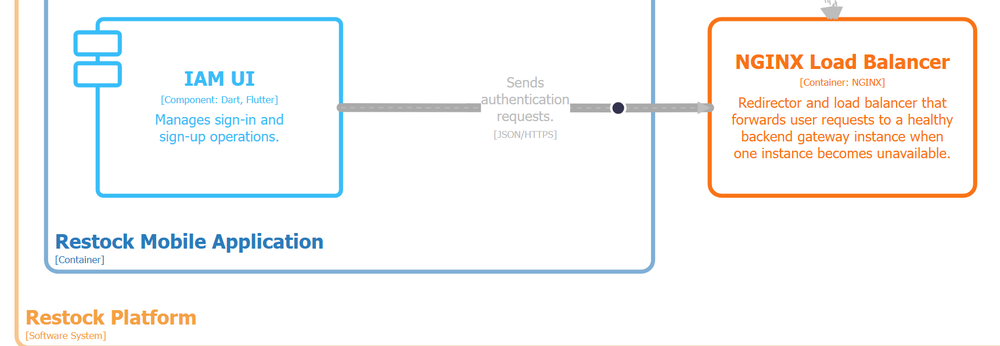

<em>Tabla de Componentes de la Mobile Application para Identity and Access Management</em>

<table style="width:100%; border-collapse: collapse; border: 1px solid;">
  <thead>
    <tr>
      <th style="padding: 10px; border: 1px solid; text-align: left;">Componente</th>
      <th style="padding: 10px; border: 1px solid; text-align: left;">Responsabilidad</th>
      <th style="padding: 10px; border: 1px solid; text-align: left;">Tecnología</th>
    </tr>
  </thead>
  <tbody>
    <tr>
      <td style="padding: 10px; border: 1px solid;"><strong>mobileIAM</strong></td>
      <td style="padding: 10px; border: 1px solid;">Gestiona localmente los flujos de inicio y cierre de sesión de los usuarios de la aplicación móvil. Provee la interfaz y la lógica para que administradores de restaurantes y comercios minoristas se autentiquen de forma segura para usar la aplicación.</td>
      <td style="padding: 10px; border: 1px solid;">Dart, Flutter</td>
    </tr>
  </tbody>
</table>

 

<em>Tabla de Interacciones del Componente mobileIAM</em>

<table style="width:100%; border-collapse: collapse; border: 1px solid;">
  <thead>
    <tr>
      <th style="padding: 10px; border: 1px solid; text-align: left;">Interactúa con</th>
      <th style="padding: 10px; border: 1px solid; text-align: left;">Tipo de Relación</th>
      <th style="padding: 10px; border: 1px solid; text-align: left;">Descripción de la Interacción</th>
    </tr>
  </thead>
  <tbody>
    <tr>
      <td style="padding: 10px; border: 1px solid;"><strong>backendApplication</strong> (API)</td>
      <td style="padding: 10px; border: 1px solid;">Llamada de Servicio (JSON/HTTPS)</td>
      <td style="padding: 10px; border: 1px solid;">Realiza peticiones HTTPS seguras para autenticar las credenciales de los usuarios de la aplicación móvil contra el servidor principal.</td>
    </tr>
    <tr>
      <td style="padding: 10px; border: 1px solid;"><strong>mobileShared</strong></td>
      <td style="padding: 10px; border: 1px solid;">Uso de Librería Interna</td>
      <td style="padding: 10px; border: 1px solid;">Extiende la funcionalidad de utilidades base de API y endpoints compartidas por otros módulos de la aplicación móvil.</td>
    </tr>
    <tr>
      <td style="padding: 10px; border: 1px solid;"><strong>Restaurant Administrator</strong> (Usuario)</td>
      <td style="padding: 10px; border: 1px solid;">Interfaz de Usuario (HTTPS)</td>
      <td style="padding: 10px; border: 1px solid;">Provee los mecanismos para que los administradores de restaurantes se autentiquen para gestionar inventario, recetas y ventas.</td>
    </tr>
    <tr>
      <td style="padding: 10px; border: 1px solid;"><strong>Retail Administrator</strong> (Usuario)</td>
      <td style="padding: 10px; border: 1px solid;">Interfaz de Usuario (HTTPS)</td>
      <td style="padding: 10px; border: 1px solid;">Provee los mecanismos para que los administradores de comercios minoristas se autentiquen para gestionar inventario y stock.</td>
    </tr>
  </tbody>
</table>

##### Backend Application Component Diagram

El componente de gestión de identidad y acceso (IAM) en el backend es el núcleo de seguridad de la plataforma. Se encarga de centralizar la autenticación y autorización mediante un esquema stateless (JWT), optimizando el rendimiento con una capa de caché en Redis y delegando la gestión de recursos multimedia a Cloudinary. Bajo una arquitectura protegida por un balanceador NGINX, asegura que todas las interacciones entre los microservicios y las aplicaciones cliente estén validadas, garantizando la integridad y resiliencia del sistema.

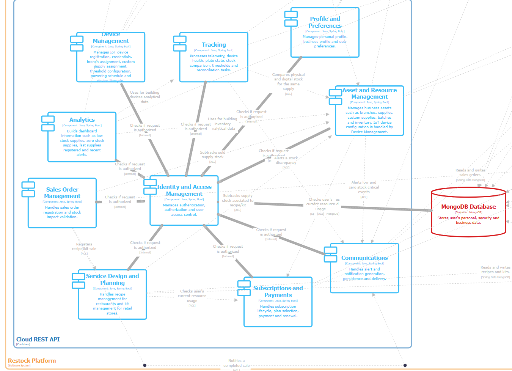

<em>Tabla de Componentes de la Backend Application para Identity and Access Management</em>

<table style="width:100%; border-collapse: collapse; border: 1px solid;">
  <thead>
    <tr>
      <th style="padding: 10px; border: 1px solid; text-align: left;">Componente</th>
      <th style="padding: 10px; border: 1px solid; text-align: left;">Responsabilidad</th>
      <th style="padding: 10px; border: 1px solid; text-align: left;">Tecnología</th>
    </tr>
  </thead>
  <tbody>
    <tr>
      <td style="padding: 10px; border: 1px solid;"><strong>apiIam</strong></td>
      <td style="padding: 10px; border: 1px solid;">Centraliza la lógica de autenticación y autorización para todos los usuarios del sistema. Emite y valida tokens JWT para asegurar las comunicaciones. Gestiona las cuentas de usuario y la creación de perfiles iniciales.</td>
      <td style="padding: 10px; border: 1px solid;">Java, Spring Boot</td>
    </tr>
  </tbody>
</table>

 

<em>Tabla de Interacciones del Componente apiIam</em>

<table style="width:100%; border-collapse: collapse; border: 1px solid;">
  <thead>
    <tr>
      <th style="padding: 10px; border: 1px solid; text-align: left;">Interactúa con</th>
      <th style="padding: 10px; border: 1px solid; text-align: left;">Tipo de Relación</th>
      <th style="padding: 10px; border: 1px solid; text-align: left;">Descripción de la Interacción</th>
    </tr>
  </thead>
  <tbody>
    <tr>
      <td style="padding: 10px; border: 1px solid;"><strong>Restock Mobile Application</strong> / <strong>Restock Platform Web Client App</strong></td>
      <td style="padding: 10px; border: 1px solid;">Solicitud Entrante (JSON/HTTPS)</td>
      <td style="padding: 10px; border: 1px solid;">Recibe y procesa las solicitudes de inicio de sesión (sign-in) y registro (sign-up) desde las aplicaciones cliente.</td>
    </tr>
    <tr>
      <td style="padding: 10px; border: 1px solid;"><strong>Múltiples Componentes Backend</strong> (Sales, Planning, Assets, etc.)</td>
      <td style="padding: 10px; border: 1px solid;">Validación de Seguridad</td>
      <td style="padding: 10px; border: 1px solid;">Actúa como proveedor de validación de tokens JWT para autorizar las operaciones internas de otros módulos.</td>
    </tr>
    <tr>
      <td style="padding: 10px; border: 1px solid;"><strong>Restock Database</strong> (MongoDB)</td>
      <td style="padding: 10px; border: 1px solid;">Persistencia (Escritura/Lectura)</td>
      <td style="padding: 10px; border: 1px solid;">Almacena y recupera datos críticos de usuarios, credenciales y la información de suscripción actual.</td>
    </tr>
    <tr>
      <td style="padding: 10px; border: 1px solid;"><strong>apiProfileAndPreferences</strong></td>
      <td style="padding: 10px; border: 1px solid;">Dependencia Interna</td>
      <td style="padding: 10px; border: 1px solid;">Orquesta la creación automática de un perfil de usuario (ACL) cuando se registra una nueva cuenta.</td>
    </tr>
    <tr>
      <td style="padding: 10px; border: 1px solid;"><strong>apiSubscriptionsAndPayments</strong></td>
      <td style="padding: 10px; border: 1px solid;">Dependencia Interna</td>
      <td style="padding: 10px; border: 1px solid;">Registra la cuenta y la suscripción inicial del usuario al completar el proceso de registro.</td>
    </tr>
    <tr>
      <td style="padding: 10px; border: 1px solid;"><strong>apiShared</strong></td>
      <td style="padding: 10px; border: 1px solid;">Uso de Librería</td>
      <td style="padding: 10px; border: 1px solid;">Utiliza utilidades comunes de infraestructura y objetos de valor compartidos.</td>
    </tr>
  </tbody>
</table>

#### 4.2.1.6. Bounded Context Software Architecture Code Level Diagrams

##### 4.2.1.6.1. Bounded Context Domain Layer Class Diagrams

En esta sección se presenta el Diagrama de Clases UML detallado de la capa de dominio para el Bounded Context de **Identity and Access Management (IAM)**. Este diseño visual consolida la gestión de identidades y la administración de permisos, asegurando un control de acceso centralizado y escalable para todos los servicios que componen la plataforma Restock.

El modelo se caracteriza por ser un **Modelo de Dominio Rico**, donde las raíces de agregación (**User** y **Role**) centralizan la lógica de decisión. En lugar de ser estructuras pasivas de datos, estas entidades exponen métodos con lógica de negocio explícita —tales como `signUp()`, `signIn()`, `updateSubscription()` y `assignRole()`— que validan invariantes de seguridad y políticas de acceso antes de procesar cualquier cambio de estado. 

Asimismo, se destaca el uso de **Value Objects** (`Username`, `Password`, `EmailAddress`) para garantizar el tipado estricto y la integridad de las credenciales desde su instanciación. El diagrama evidencia también la encapsulación mediante modificadores de acceso restrictivos, protegiendo el estado interno del modelo según los principios de Clean Architecture.

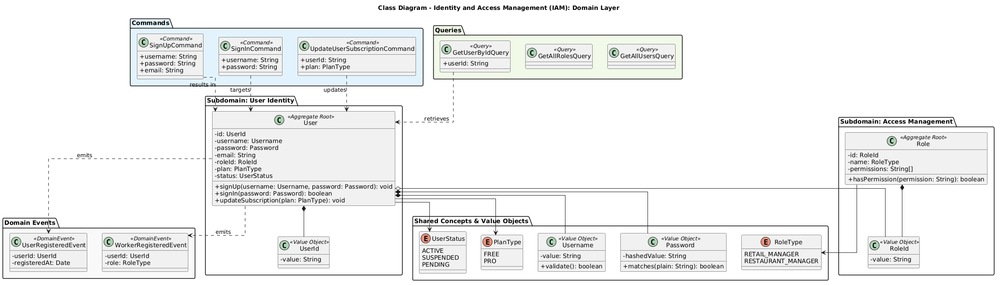

##### 4.2.1.6.2. Bounded Context Database Design Diagram

En esta sección, el equipo presenta el diagrama de Base de Datos detallado para la Domain Layer del Bounded Context de Identity and Access Management.

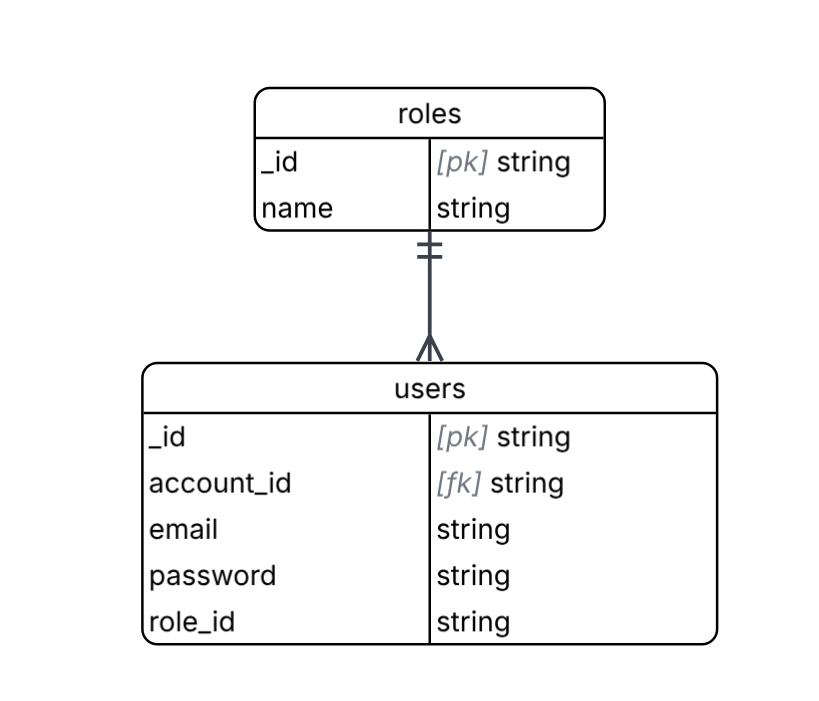

### 4.2.2. Bounded Context: Subscriptions and Payments

#### 4.2.2.1. Domain Layer

La capa de dominio representa el núcleo de negocio del Bounded Context de Subscriptions and Payments. En esta capa se encapsulan las reglas relacionadas con la gestión de planes de suscripción, activación de beneficios, control de límites contratados y procesamiento conceptual de pagos.

Este bounded context funciona como el punto de entrada comercial del sistema, debido a que el usuario selecciona un plan y, posteriormente, se gestiona el flujo de pago y activación de la suscripción. Una vez aceptado el pago, el contexto emite eventos de dominio que permiten a otros bounded contexts reaccionar de forma desacoplada.

Esta capa se mantiene independiente de frameworks, mecanismos de persistencia, servicios externos o detalles de infraestructura. Se compone de Aggregate Roots, Entities, Value Objects y Domain Events.

##### Aggregates & Entities

<em>Tabla de Aggregates en el Domain Layer</em>
 <table style="width:100%; border-collapse: collapse; border: 1px solid;"> <thead> <tr> <th style="padding: 10px; border: 1px solid; text-align: left;">Nombre de Clase</th> <th style="padding: 10px; border: 1px solid; text-align: left;">Categoría</th> <th style="padding: 10px; border: 1px solid; text-align: left;">Propósito y Reglas de Negocio</th> </tr> </thead> <tbody> <tr> <td style="padding: 10px; border: 1px solid;"><strong>Subscription</strong></td> <td style="padding: 10px; border: 1px solid;">Aggregate Root</td> <td style="padding: 10px; border: 1px solid;">Representa la suscripción contratada. Controla el ciclo de vida del plan (activación, expiración, cancelación) y garantiza que solo exista un plan activo por cuenta.</td> </tr> <tr> <td style="padding: 10px; border: 1px solid;"><strong>Plan</strong></td> <td style="padding: 10px; border: 1px solid;">Entity</td> <td style="padding: 10px; border: 1px solid;">Define los beneficios, precios y límites disponibles para una suscripción.</td> </tr> <tr> <td style="padding: 10px; border: 1px solid;"><strong>Payment</strong></td> <td style="padding: 10px; border: 1px solid;">Aggregate Root</td> <td style="padding: 10px; border: 1px solid;">Representa el proceso de pago asociado a una suscripción, incluyendo su estado y validación para activar el plan.</td> </tr> </tbody> </table>

##### Value Objects

<em>Tabla de Value Objects en el Domain Layer</em>
 <table style="width:100%; border-collapse: collapse; border: 1px solid;"> <thead> <tr> <th style="padding: 10px; border: 1px solid; text-align: left;">Nombre de Clase</th> <th style="padding: 10px; border: 1px solid; text-align: left;">Categoría</th> <th style="padding: 10px; border: 1px solid; text-align: left;">Propósito y Reglas de Negocio</th> </tr> </thead> <tbody> <tr> <td style="padding: 10px; border: 1px solid;"><strong>PlanLimits</strong></td> <td style="padding: 10px; border: 1px solid;">Value Object</td> <td style="padding: 10px; border: 1px solid;">Define los límites del plan contratado.</td> </tr> <tr> <td style="padding: 10px; border: 1px solid;"><strong>Money</strong></td> <td style="padding: 10px; border: 1px solid;">Value Object</td> <td style="padding: 10px; border: 1px solid;">Representa montos monetarios con moneda.</td> </tr> <tr> <td style="padding: 10px; border: 1px solid;"><strong>BillingPeriod</strong></td> <td style="padding: 10px; border: 1px solid;">Value Object</td> <td style="padding: 10px; border: 1px solid;">Define el periodo de facturación.</td> </tr> <tr> <td style="padding: 10px; border: 1px solid;"><strong>PaymentStatus</strong></td> <td style="padding: 10px; border: 1px solid;">Value Object</td> <td style="padding: 10px; border: 1px solid;">Estado del pago (pendiente, confirmado, fallido).</td> </tr> <tr> <td style="padding: 10px; border: 1px solid;"><strong>SubscriptionStatus</strong></td> <td style="padding: 10px; border: 1px solid;">Value Object</td> <td style="padding: 10px; border: 1px solid;">Estado de la suscripción.</td> </tr> </tbody> </table>

##### Domain Events

<em>Tabla de Domain Events en el Domain Layer</em>
 <table style="width:100%; border-collapse: collapse; border: 1px solid;"> <thead> <tr> <th style="padding: 10px; border: 1px solid; text-align: left;">Nombre del Evento</th> <th style="padding: 10px; border: 1px solid; text-align: left;">Propósito</th> </tr> </thead> <tbody> <tr> <td style="padding: 10px; border: 1px solid;"><strong>SubscriptionPlanSelectedEvent</strong></td> <td style="padding: 10px; border: 1px solid;">Se emite cuando un usuario selecciona un plan.</td> </tr> <tr> <td style="padding: 10px; border: 1px solid;"><strong>PaymentInitializedEvent</strong></td> <td style="padding: 10px; border: 1px solid;">Se emite cuando se inicia un pago.</td> </tr> <tr> <td style="padding: 10px; border: 1px solid;"><strong>PaymentConfirmedEvent</strong></td> <td style="padding: 10px; border: 1px solid;">Se emite cuando el pago es confirmado.</td> </tr> <tr> <td style="padding: 10px; border: 1px solid;"><strong>SubscriptionActivatedEvent</strong></td> <td style="padding: 10px; border: 1px solid;">Se emite cuando una suscripción se activa.</td> </tr> <tr> <td style="padding: 10px; border: 1px solid;"><strong>SubscriptionUpgradedEvent</strong></td> <td style="padding: 10px; border: 1px solid;">Se emite cuando se realiza un upgrade de plan.</td> </tr> </tbody> </table>

##### Commands & Queries

<em>Tabla de Commands y Queries del Domain Layer</em>
 <table style="width:100%; border-collapse: collapse; border: 1px solid;"> <thead> <tr> <th style="padding: 10px; border: 1px solid;">Nombre</th> <th style="padding: 10px; border: 1px solid;">Tipo</th> <th style="padding: 10px; border: 1px solid;">Propósito</th> </tr> </thead> <tbody> <tr> <td style="padding: 10px; border: 1px solid;">SelectSubscriptionPlan</td> <td style="padding: 10px; border: 1px solid;">Command</td> <td style="padding: 10px; border: 1px solid;">Seleccionar un plan.</td> </tr> <tr> <td style="padding: 10px; border: 1px solid;">InitializePayment</td> <td style="padding: 10px; border: 1px solid;">Command</td> <td style="padding: 10px; border: 1px solid;">Iniciar el pago.</td> </tr> <tr> <td style="padding: 10px; border: 1px solid;">ConfirmPayment</td> <td style="padding: 10px; border: 1px solid;">Command</td> <td style="padding: 10px; border: 1px solid;">Confirmar pago.</td> </tr> <tr> <td style="padding: 10px; border: 1px solid;">ActivateSubscription</td> <td style="padding: 10px; border: 1px solid;">Command</td> <td style="padding: 10px; border: 1px solid;">Activar suscripción.</td> </tr> <tr> <td style="padding: 10px; border: 1px solid;">GetSubscription</td> <td style="padding: 10px; border: 1px solid;">Query</td> <td style="padding: 10px; border: 1px solid;">Consultar suscripción.</td> </tr> </tbody> </table>

#### 4.2.2.2. Interface Layer

En la capa de interfaz del Bounded Context de Subscriptions and Payments se exponen endpoints RESTful alineados a recursos del dominio como planes, suscripciones y pagos. Esta capa transforma las solicitudes entrantes en Commands o Queries y delega su ejecución a la capa de aplicación.

Asimismo, se define la interfaz del Anti-Corruption Layer (ACL) para permitir la comunicación con otros bounded contexts sin acoplar directamente los modelos de dominio.

##### Anti-Corruption Layer Interface

<em>Tabla de ACL Interface en el Interface Layer</em>

<table style="width:100%; border-collapse: collapse; border: 1px solid;">
  <thead>
    <tr>
      <th style="padding: 10px; border: 1px solid;">Nombre</th>
      <th style="padding: 10px; border: 1px solid;">Tipo</th>
      <th style="padding: 10px; border: 1px solid;">Propósito</th>
    </tr>
  </thead>
  <tbody>
    <tr>
      <td style="padding: 10px; border: 1px solid;"><strong>ProfilesACL</strong></td>
      <td style="padding: 10px; border: 1px solid;">Interface</td>
      <td style="padding: 10px; border: 1px solid;">Define la comunicación con el bounded context de Profiles para operaciones como creación de cuentas de negocio y asociación de usuarios.</td>
    </tr>
  </tbody>
</table>

##### PlanController

<em>Tabla de PlanController en el Interface Layer</em>

<table style="width:100%; border-collapse: collapse; border: 1px solid;">
  <thead>
    <tr>
      <th style="padding: 10px; border: 1px solid;">Propiedad</th>
      <th style="padding: 10px; border: 1px solid;">Valor</th>
    </tr>
  </thead>
  <tbody>
    <tr>
      <td style="padding: 10px; border: 1px solid;"><strong>Ruta</strong></td>
      <td style="padding: 10px; border: 1px solid;">/api/v1/plans</td>
    </tr>
  </tbody>
</table>

<em>Métodos</em>

<table style="width:100%; border-collapse: collapse; border: 1px solid;">
  <thead>
    <tr>
      <th>Nombre</th>
      <th>Ruta</th>
      <th>Acción</th>
      <th>Handle</th>
    </tr>
  </thead>
  <tbody>
    <tr>
      <td>GetAll</td>
      <td>GET /</td>
      <td>Listar planes</td>
      <td>GetAvailablePlansQuery</td>
    </tr>
    <tr>
      <td>GetById</td>
      <td>GET /{planId}</td>
      <td>Obtener plan</td>
      <td>GetPlanByIdQuery</td>
    </tr>
  </tbody>
</table>

##### SubscriptionController

<em>Tabla de SubscriptionController en el Interface Layer</em>

<table style="width:100%; border-collapse: collapse; border: 1px solid;">
  <thead>
    <tr>
      <th>Propiedad</th>
      <th>Valor</th>
    </tr>
  </thead>
  <tbody>
    <tr>
      <td><strong>Ruta</strong></td>
      <td>/api/v1/subscriptions</td>
    </tr>
  </tbody>
</table>

<em>Métodos</em>

<table style="width:100%; border-collapse: collapse; border: 1px solid;">
  <thead>
    <tr>
      <th>Nombre</th>
      <th>Ruta</th>
      <th>Acción</th>
      <th>Handle</th>
    </tr>
  </thead>
  <tbody>
    <tr>
      <td>Create</td>
      <td>POST /</td>
      <td>Crear suscripción (selección de plan)</td>
      <td>SelectSubscriptionPlanCommand</td>
    </tr>
    <tr>
      <td>Upgrade</td>
      <td>POST /{subscriptionId}/upgrade</td>
      <td>Actualizar plan</td>
      <td>UpgradeSubscriptionPlanCommand</td>
    </tr>
    <tr>
      <td>ConfigureLimits</td>
      <td>PUT /{subscriptionId}/limits</td>
      <td>Configurar límites</td>
      <td>ConfigurePlanLimitsCommand</td>
    </tr>
  </tbody>
</table>

##### AccountSubscriptionsController

<em>Tabla de AccountSubscriptionsController en el Interface Layer</em>

<table style="width:100%; border-collapse: collapse; border: 1px solid;">
  <thead>
    <tr>
      <th>Propiedad</th>
      <th>Valor</th>
    </tr>
  </thead>
  <tbody>
    <tr>
      <td><strong>Ruta</strong></td>
      <td>/api/v1/accounts/{accountId}/subscriptions</td>
    </tr>
  </tbody>
</table>

<em>Métodos</em>

<table style="width:100%; border-collapse: collapse; border: 1px solid;">
  <thead>
    <tr>
      <th>Nombre</th>
      <th>Ruta</th>
      <th>Acción</th>
      <th>Handle</th>
    </tr>
  </thead>
  <tbody>
    <tr>
      <td>GetCurrent</td>
      <td>GET /current</td>
      <td>Obtener suscripción activa de la cuenta</td>
      <td>GetCurrentSubscriptionQuery</td>
    </tr>
  </tbody>
</table>

##### SubscriptionPaymentsController

<em>Tabla de SubscriptionPaymentsController en el Interface Layer</em>

<table style="width:100%; border-collapse: collapse; border: 1px solid;">
  <thead>
    <tr>
      <th>Propiedad</th>
      <th>Valor</th>
    </tr>
  </thead>
  <tbody>
    <tr>
      <td><strong>Ruta</strong></td>
      <td>/api/v1/subscriptions/{subscriptionId}/payments</td>
    </tr>
  </tbody>
</table>

<em>Métodos</em>

<table style="width:100%; border-collapse: collapse; border: 1px solid;">
  <thead>
    <tr>
      <th>Nombre</th>
      <th>Ruta</th>
      <th>Acción</th>
      <th>Handle</th>
    </tr>
  </thead>
  <tbody>
    <tr>
      <td>CreatePayment</td>
      <td>POST /</td>
      <td>Iniciar proceso de pago</td>
      <td>StartStripeCheckoutCommand</td>
    </tr>
    <tr>
      <td>GetStatus</td>
      <td>GET /{paymentId}</td>
      <td>Consultar estado del pago</td>
      <td>GetPaymentStatusQuery</td>
    </tr>
  </tbody>
</table>

##### StripeWebhookController

<em>Tabla de StripeWebhookController en el Interface Layer</em>

<table style="width:100%; border-collapse: collapse; border: 1px solid;">
  <thead>
    <tr>
      <th>Propiedad</th>
      <th>Valor</th>
    </tr>
  </thead>
  <tbody>
    <tr>
      <td><strong>Ruta</strong></td>
      <td>/api/v1/webhooks/stripe</td>
    </tr>
  </tbody>
</table>

<em>Métodos</em>

<table style="width:100%; border-collapse: collapse; border: 1px solid;">
  <thead>
    <tr>
      <th>Nombre</th>
      <th>Ruta</th>
      <th>Acción</th>
      <th>Handle</th>
    </tr>
  </thead>
  <tbody>
    <tr>
      <td>HandlePayment</td>
      <td>POST /</td>
      <td>Procesar eventos de Stripe</td>
      <td>ConfirmStripePaymentCommand</td>
    </tr>
  </tbody>
</table>

#### 4.2.2.3. Application Layer

La capa de aplicación del Bounded Context de Subscriptions and Payments coordina los casos de uso relacionados con planes, suscripciones y pagos. En esta capa residen los Command Handlers, Query Handlers, Event Handlers y servicios de aplicación encargados de ejecutar los flujos principales del contexto: selección de plan, inicio del proceso de pago, confirmación de pago mediante Stripe, activación de suscripción y actualización de límites cuando el usuario realiza un upgrade de plan.

Esta capa no contiene reglas puras de dominio. Su responsabilidad es orquestar el flujo de trabajo entre la capa de interfaz y el dominio, cargar aggregates desde los mecanismos de persistencia disponibles, invocar métodos del modelo de dominio, persistir cambios y publicar eventos que podrán ser consumidos por otros bounded contexts.

La creación de la cuenta de negocio no pertenece directamente a este bounded context, debido a que el comando CreateBusinessAccount forma parte del contexto de Profiles. Por ello, Subscriptions and Payments se comunica con dicho contexto mediante un Anti-Corruption Layer (ACL), evitando acoplar directamente sus modelos internos.

##### SelectSubscriptionPlanCommandHandler

<em>Tabla de SelectSubscriptionPlanCommandHandler en el Application Layer</em>

<table style="width:100%; border-collapse: collapse; border: 1px solid;">
  <thead>
    <tr>
      <th style="padding: 10px; border: 1px solid; text-align: left;">Propiedad</th>
      <th style="padding: 10px; border: 1px solid; text-align: left;">Valor</th>
    </tr>
  </thead>
  <tbody>
    <tr>
      <td style="padding: 10px; border: 1px solid;"><strong>Nombre</strong></td>
      <td style="padding: 10px; border: 1px solid;">SelectSubscriptionPlanCommandHandler</td>
    </tr>
    <tr>
      <td style="padding: 10px; border: 1px solid;"><strong>Categoría</strong></td>
      <td style="padding: 10px; border: 1px solid;">Command Handler</td>
    </tr>
    <tr>
      <td style="padding: 10px; border: 1px solid;"><strong>Propósito</strong></td>
      <td style="padding: 10px; border: 1px solid;">Orquestar la selección inicial de un plan de suscripción, validando que el plan exista y dejando preparada la suscripción antes del pago.</td>
    </tr>
    <tr>
      <td style="padding: 10px; border: 1px solid;"><strong>Comando</strong></td>
      <td style="padding: 10px; border: 1px solid;">SelectSubscriptionPlanCommand</td>
    </tr>
  </tbody>
</table>

 

##### ConfigurePlanLimitsCommandHandler

<em>Tabla de ConfigurePlanLimitsCommandHandler en el Application Layer</em>

<table style="width:100%; border-collapse: collapse; border: 1px solid;">
  <thead>
    <tr>
      <th style="padding: 10px; border: 1px solid; text-align: left;">Propiedad</th>
      <th style="padding: 10px; border: 1px solid; text-align: left;">Valor</th>
    </tr>
  </thead>
  <tbody>
    <tr>
      <td style="padding: 10px; border: 1px solid;"><strong>Nombre</strong></td>
      <td style="padding: 10px; border: 1px solid;">ConfigurePlanLimitsCommandHandler</td>
    </tr>
    <tr>
      <td style="padding: 10px; border: 1px solid;"><strong>Categoría</strong></td>
      <td style="padding: 10px; border: 1px solid;">Command Handler</td>
    </tr>
    <tr>
      <td style="padding: 10px; border: 1px solid;"><strong>Propósito</strong></td>
      <td style="padding: 10px; border: 1px solid;">Gestionar la configuración de límites asociados al plan seleccionado, como cuotas de recursos, capacidad operativa y restricciones aplicables a la suscripción.</td>
    </tr>
    <tr>
      <td style="padding: 10px; border: 1px solid;"><strong>Comando</strong></td>
      <td style="padding: 10px; border: 1px solid;">ConfigurePlanLimitsCommand</td>
    </tr>
  </tbody>
</table>

 

##### StartStripeCheckoutCommandHandler

<em>Tabla de StartStripeCheckoutCommandHandler en el Application Layer</em>

<table style="width:100%; border-collapse: collapse; border: 1px solid;">
  <thead>
    <tr>
      <th style="padding: 10px; border: 1px solid; text-align: left;">Propiedad</th>
      <th style="padding: 10px; border: 1px solid; text-align: left;">Valor</th>
    </tr>
  </thead>
  <tbody>
    <tr>
      <td style="padding: 10px; border: 1px solid;"><strong>Nombre</strong></td>
      <td style="padding: 10px; border: 1px solid;">StartStripeCheckoutCommandHandler</td>
    </tr>
    <tr>
      <td style="padding: 10px; border: 1px solid;"><strong>Categoría</strong></td>
      <td style="padding: 10px; border: 1px solid;">Command Handler</td>
    </tr>
    <tr>
      <td style="padding: 10px; border: 1px solid;"><strong>Propósito</strong></td>
      <td style="padding: 10px; border: 1px solid;">Orquestar el inicio del proceso de pago asociado a una suscripción, preparando la integración con Stripe y registrando la referencia del pago.</td>
    </tr>
    <tr>
      <td style="padding: 10px; border: 1px solid;"><strong>Comando</strong></td>
      <td style="padding: 10px; border: 1px solid;">StartStripeCheckoutCommand</td>
    </tr>
  </tbody>
</table>

 

##### ConfirmPaymentCommandHandler

<em>Tabla de ConfirmPaymentCommandHandler en el Application Layer</em>

<table style="width:100%; border-collapse: collapse; border: 1px solid;">
  <thead>
    <tr>
      <th style="padding: 10px; border: 1px solid; text-align: left;">Propiedad</th>
      <th style="padding: 10px; border: 1px solid; text-align: left;">Valor</th>
    </tr>
  </thead>
  <tbody>
    <tr>
      <td style="padding: 10px; border: 1px solid;"><strong>Nombre</strong></td>
      <td style="padding: 10px; border: 1px solid;">ConfirmPaymentCommandHandler</td>
    </tr>
    <tr>
      <td style="padding: 10px; border: 1px solid;"><strong>Categoría</strong></td>
      <td style="padding: 10px; border: 1px solid;">Command Handler</td>
    </tr>
    <tr>
      <td style="padding: 10px; border: 1px solid;"><strong>Propósito</strong></td>
      <td style="padding: 10px; border: 1px solid;">Procesar la confirmación del pago recibida desde Stripe, validar la referencia externa y actualizar el estado del pago dentro del contexto.</td>
    </tr>
    <tr>
      <td style="padding: 10px; border: 1px solid;"><strong>Comando</strong></td>
      <td style="padding: 10px; border: 1px solid;">ConfirmPaymentCommand</td>
    </tr>
  </tbody>
</table>

 

##### ActivateSubscriptionCommandHandler

<em>Tabla de ActivateSubscriptionCommandHandler en el Application Layer</em>

<table style="width:100%; border-collapse: collapse; border: 1px solid;">
  <thead>
    <tr>
      <th style="padding: 10px; border: 1px solid; text-align: left;">Propiedad</th>
      <th style="padding: 10px; border: 1px solid; text-align: left;">Valor</th>
    </tr>
  </thead>
  <tbody>
    <tr>
      <td style="padding: 10px; border: 1px solid;"><strong>Nombre</strong></td>
      <td style="padding: 10px; border: 1px solid;">ActivateSubscriptionCommandHandler</td>
    </tr>
    <tr>
      <td style="padding: 10px; border: 1px solid;"><strong>Categoría</strong></td>
      <td style="padding: 10px; border: 1px solid;">Command Handler</td>
    </tr>
    <tr>
      <td style="padding: 10px; border: 1px solid;"><strong>Propósito</strong></td>
      <td style="padding: 10px; border: 1px solid;">Activar la suscripción una vez confirmado el pago, asociando el plan contratado y publicando los eventos necesarios para que otros contextos reaccionen.</td>
    </tr>
    <tr>
      <td style="padding: 10px; border: 1px solid;"><strong>Comando</strong></td>
      <td style="padding: 10px; border: 1px solid;">ActivateSubscriptionCommand</td>
    </tr>
  </tbody>
</table>

 

##### UpgradeSubscriptionResourcesCommandHandler

<em>Tabla de UpgradeSubscriptionResourcesCommandHandler en el Application Layer</em>

<table style="width:100%; border-collapse: collapse; border: 1px solid;">
  <thead>
    <tr>
      <th style="padding: 10px; border: 1px solid; text-align: left;">Propiedad</th>
      <th style="padding: 10px; border: 1px solid; text-align: left;">Valor</th>
    </tr>
  </thead>
  <tbody>
    <tr>
      <td style="padding: 10px; border: 1px solid;"><strong>Nombre</strong></td>
      <td style="padding: 10px; border: 1px solid;">UpgradeSubscriptionResourcesCommandHandler</td>
    </tr>
    <tr>
      <td style="padding: 10px; border: 1px solid;"><strong>Categoría</strong></td>
      <td style="padding: 10px; border: 1px solid;">Command Handler</td>
    </tr>
    <tr>
      <td style="padding: 10px; border: 1px solid;"><strong>Propósito</strong></td>
      <td style="padding: 10px; border: 1px solid;">Orquestar el cambio de plan o incremento de recursos contratados, reemplazando los límites actuales por los límites del nuevo plan y notificando a los contextos correspondientes.</td>
    </tr>
    <tr>
      <td style="padding: 10px; border: 1px solid;"><strong>Comando</strong></td>
      <td style="padding: 10px; border: 1px solid;">UpgradeSubscriptionResourcesCommand</td>
    </tr>
  </tbody>
</table>

 

##### GetSubscriptionStatusQueryHandler

<em>Tabla de GetSubscriptionStatusQueryHandler en el Application Layer</em>

<table style="width:100%; border-collapse: collapse; border: 1px solid;">
  <thead>
    <tr>
      <th style="padding: 10px; border: 1px solid; text-align: left;">Propiedad</th>
      <th style="padding: 10px; border: 1px solid; text-align: left;">Valor</th>
    </tr>
  </thead>
  <tbody>
    <tr>
      <td style="padding: 10px; border: 1px solid;"><strong>Nombre</strong></td>
      <td style="padding: 10px; border: 1px solid;">GetSubscriptionStatusQueryHandler</td>
    </tr>
    <tr>
      <td style="padding: 10px; border: 1px solid;"><strong>Categoría</strong></td>
      <td style="padding: 10px; border: 1px solid;">Query Handler</td>
    </tr>
    <tr>
      <td style="padding: 10px; border: 1px solid;"><strong>Propósito</strong></td>
      <td style="padding: 10px; border: 1px solid;">Consultar el estado actual de una suscripción, incluyendo plan asociado, estado del pago, vigencia y límites configurados.</td>
    </tr>
    <tr>
      <td style="padding: 10px; border: 1px solid;"><strong>Query</strong></td>
      <td style="padding: 10px; border: 1px solid;">GetSubscriptionStatusQuery</td>
    </tr>
  </tbody>
</table>

 

##### GetCurrentSubscriptionQueryHandler

<em>Tabla de GetCurrentSubscriptionQueryHandler en el Application Layer</em>

<table style="width:100%; border-collapse: collapse; border: 1px solid;">
  <thead>
    <tr>
      <th style="padding: 10px; border: 1px solid; text-align: left;">Propiedad</th>
      <th style="padding: 10px; border: 1px solid; text-align: left;">Valor</th>
    </tr>
  </thead>
  <tbody>
    <tr>
      <td style="padding: 10px; border: 1px solid;"><strong>Nombre</strong></td>
      <td style="padding: 10px; border: 1px solid;">GetCurrentSubscriptionQueryHandler</td>
    </tr>
    <tr>
      <td style="padding: 10px; border: 1px solid;"><strong>Categoría</strong></td>
      <td style="padding: 10px; border: 1px solid;">Query Handler</td>
    </tr>
    <tr>
      <td style="padding: 10px; border: 1px solid;"><strong>Propósito</strong></td>
      <td style="padding: 10px; border: 1px solid;">Consultar la suscripción activa vinculada a una cuenta específica, sin exponer detalles técnicos de persistencia.</td>
    </tr>
    <tr>
      <td style="padding: 10px; border: 1px solid;"><strong>Query</strong></td>
      <td style="padding: 10px; border: 1px solid;">GetCurrentSubscriptionQuery</td>
    </tr>
  </tbody>
</table>

 

##### PaymentAcceptedEventHandler

<em>Tabla de PaymentAcceptedEventHandler en el Application Layer</em>

<table style="width:100%; border-collapse: collapse; border: 1px solid;">
  <thead>
    <tr>
      <th style="padding: 10px; border: 1px solid; text-align: left;">Propiedad</th>
      <th style="padding: 10px; border: 1px solid; text-align: left;">Valor</th>
    </tr>
  </thead>
  <tbody>
    <tr>
      <td style="padding: 10px; border: 1px solid;"><strong>Nombre</strong></td>
      <td style="padding: 10px; border: 1px solid;">PaymentAcceptedEventHandler</td>
    </tr>
    <tr>
      <td style="padding: 10px; border: 1px solid;"><strong>Categoría</strong></td>
      <td style="padding: 10px; border: 1px solid;">Event Handler</td>
    </tr>
    <tr>
      <td style="padding: 10px; border: 1px solid;"><strong>Propósito</strong></td>
      <td style="padding: 10px; border: 1px solid;">Reaccionar a la confirmación exitosa del pago para activar el plan contratado y continuar con el flujo de habilitación de la suscripción.</td>
    </tr>
    <tr>
      <td style="padding: 10px; border: 1px solid;"><strong>Evento</strong></td>
      <td style="padding: 10px; border: 1px solid;">PaymentAcceptedEvent</td>
    </tr>
  </tbody>
</table>

 

##### SubscriptionActivatedEventHandler

<em>Tabla de SubscriptionActivatedEventHandler en el Application Layer</em>

<table style="width:100%; border-collapse: collapse; border: 1px solid;">
  <thead>
    <tr>
      <th style="padding: 10px; border: 1px solid; text-align: left;">Propiedad</th>
      <th style="padding: 10px; border: 1px solid; text-align: left;">Valor</th>
    </tr>
  </thead>
  <tbody>
    <tr>
      <td style="padding: 10px; border: 1px solid;"><strong>Nombre</strong></td>
      <td style="padding: 10px; border: 1px solid;">SubscriptionActivatedEventHandler</td>
    </tr>
    <tr>
      <td style="padding: 10px; border: 1px solid;"><strong>Categoría</strong></td>
      <td style="padding: 10px; border: 1px solid;">Event Handler</td>
    </tr>
    <tr>
      <td style="padding: 10px; border: 1px solid;"><strong>Propósito</strong></td>
      <td style="padding: 10px; border: 1px solid;">Reaccionar a la activación de una suscripción y solicitar al contexto de Profiles la creación de la cuenta de negocio mediante el ACL.</td>
    </tr>
    <tr>
      <td style="padding: 10px; border: 1px solid;"><strong>Evento</strong></td>
      <td style="padding: 10px; border: 1px solid;">SubscriptionActivatedEvent</td>
    </tr>
  </tbody>
</table>

 

##### ProfilesACL

<em>Tabla de ProfilesACL en el Application Layer</em>

<table style="width:100%; border-collapse: collapse; border: 1px solid;">
  <thead>
    <tr>
      <th style="padding: 10px; border: 1px solid; text-align: left;">Propiedad</th>
      <th style="padding: 10px; border: 1px solid; text-align: left;">Valor</th>
    </tr>
  </thead>
  <tbody>
    <tr>
      <td style="padding: 10px; border: 1px solid;"><strong>Nombre</strong></td>
      <td style="padding: 10px; border: 1px solid;">ProfilesACL</td>
    </tr>
    <tr>
      <td style="padding: 10px; border: 1px solid;"><strong>Categoría</strong></td>
      <td style="padding: 10px; border: 1px solid;">Anti-Corruption Layer Implementation</td>
    </tr>
    <tr>
      <td style="padding: 10px; border: 1px solid;"><strong>Propósito</strong></td>
      <td style="padding: 10px; border: 1px solid;">Implementar la comunicación entre Subscriptions and Payments y Profiles, traduciendo solicitudes internas del contexto de suscripciones hacia comandos o recursos propios del contexto de perfiles.</td>
    </tr>
    <tr>
      <td style="padding: 10px; border: 1px solid;"><strong>Interfaz</strong></td>
      <td style="padding: 10px; border: 1px solid;">IProfilesACL</td>
    </tr>
  </tbody>
</table>

 

##### RequestBusinessAccountCreationService

<em>Tabla de RequestBusinessAccountCreationService en el Application Layer</em>

<table style="width:100%; border-collapse: collapse; border: 1px solid;">
  <thead>
    <tr>
      <th style="padding: 10px; border: 1px solid; text-align: left;">Propiedad</th>
      <th style="padding: 10px; border: 1px solid; text-align: left;">Valor</th>
    </tr>
  </thead>
  <tbody>
    <tr>
      <td style="padding: 10px; border: 1px solid;"><strong>Nombre</strong></td>
      <td style="padding: 10px; border: 1px solid;">RequestBusinessAccountCreationService</td>
    </tr>
    <tr>
      <td style="padding: 10px; border: 1px solid;"><strong>Categoría</strong></td>
      <td style="padding: 10px; border: 1px solid;">Application Service</td>
    </tr>
    <tr>
      <td style="padding: 10px; border: 1px solid;"><strong>Propósito</strong></td>
      <td style="padding: 10px; border: 1px solid;">Solicitar al contexto de Profiles la creación de una cuenta de negocio después de la activación de una suscripción, sin ejecutar directamente el comando CreateBusinessAccount dentro de este bounded context.</td>
    </tr>
    <tr>
      <td style="padding: 10px; border: 1px solid;"><strong>Dependencia</strong></td>
      <td style="padding: 10px; border: 1px solid;">ProfilesACL</td>
    </tr>
  </tbody>
</table>

### 4.2.2.4. Infrastructure Layer

La capa de infraestructura del Bounded Context de Subscriptions and Payments actúa como el puente entre la lógica central del negocio y los mecanismos técnicos externos necesarios para operar el ciclo de vida comercial del sistema. En esta capa se materializan las interfaces de repositorios definidas en el dominio para persistir entidades como planes, suscripciones, pagos y cuentas de negocio. Asimismo, se integran servicios externos esenciales para el contexto, como Stripe para el procesamiento y confirmación de pagos, y mecanismos de comunicación mediante Message Brokers para publicar eventos hacia otros bounded contexts, como Asset and Resource Management, Profile and Preferences e Identity and Access Management.

Esta capa no contiene reglas de negocio puras. Su responsabilidad principal es resolver detalles técnicos como persistencia, integración con pasarelas de pago, validación de webhooks, publicación de eventos de dominio e implementación de servicios externos requeridos por la capa de aplicación.

##### SubscriptionRepository

<em>Tabla de SubscriptionRepository en el Infrastructure Layer</em>

<table style="width:100%; border-collapse: collapse; border: 1px solid;">
  <thead>
    <tr>
      <th style="padding: 10px; border: 1px solid; text-align: left;">Propiedad</th>
      <th style="padding: 10px; border: 1px solid; text-align: left;">Valor</th>
    </tr>
  </thead>
  <tbody>
    <tr>
      <td style="padding: 10px; border: 1px solid;"><strong>Nombre</strong></td>
      <td style="padding: 10px; border: 1px solid;">SubscriptionRepository</td>
    </tr>
    <tr>
      <td style="padding: 10px; border: 1px solid;"><strong>Categoría</strong></td>
      <td style="padding: 10px; border: 1px solid;">Repositorio</td>
    </tr>
    <tr>
      <td style="padding: 10px; border: 1px solid;"><strong>Propósito</strong></td>
      <td style="padding: 10px; border: 1px solid;">Persistir y consultar suscripciones, incluyendo su estado, plan asociado, vigencia, límites configurados y relación con la cuenta de negocio.</td>
    </tr>
    <tr>
      <td style="padding: 10px; border: 1px solid;"><strong>Interfaz</strong></td>
      <td style="padding: 10px; border: 1px solid;">ISubscriptionRepository</td>
    </tr>
  </tbody>
</table>

 

##### PlanRepository

<em>Tabla de PlanRepository en el Infrastructure Layer</em>

<table style="width:100%; border-collapse: collapse; border: 1px solid;">
  <thead>
    <tr>
      <th style="padding: 10px; border: 1px solid; text-align: left;">Propiedad</th>
      <th style="padding: 10px; border: 1px solid; text-align: left;">Valor</th>
    </tr>
  </thead>
  <tbody>
    <tr>
      <td style="padding: 10px; border: 1px solid;"><strong>Nombre</strong></td>
      <td style="padding: 10px; border: 1px solid;">PlanRepository</td>
    </tr>
    <tr>
      <td style="padding: 10px; border: 1px solid;"><strong>Categoría</strong></td>
      <td style="padding: 10px; border: 1px solid;">Repositorio</td>
    </tr>
    <tr>
      <td style="padding: 10px; border: 1px solid;"><strong>Propósito</strong></td>
      <td style="padding: 10px; border: 1px solid;">Manejar el acceso a datos de los planes disponibles, sus precios, beneficios, límites de recursos y condiciones comerciales aplicables.</td>
    </tr>
    <tr>
      <td style="padding: 10px; border: 1px solid;"><strong>Interfaz</strong></td>
      <td style="padding: 10px; border: 1px solid;">IPlanRepository</td>
    </tr>
  </tbody>
</table>

 

##### PaymentRepository

<em>Tabla de PaymentRepository en el Infrastructure Layer</em>

<table style="width:100%; border-collapse: collapse; border: 1px solid;">
  <thead>
    <tr>
      <th style="padding: 10px; border: 1px solid; text-align: left;">Propiedad</th>
      <th style="padding: 10px; border: 1px solid; text-align: left;">Valor</th>
    </tr>
  </thead>
  <tbody>
    <tr>
      <td style="padding: 10px; border: 1px solid;"><strong>Nombre</strong></td>
      <td style="padding: 10px; border: 1px solid;">PaymentRepository</td>
    </tr>
    <tr>
      <td style="padding: 10px; border: 1px solid;"><strong>Categoría</strong></td>
      <td style="padding: 10px; border: 1px solid;">Repositorio</td>
    </tr>
    <tr>
      <td style="padding: 10px; border: 1px solid;"><strong>Propósito</strong></td>
      <td style="padding: 10px; border: 1px solid;">Persistir órdenes de pago, estados de transacción, referencias externas de Stripe y resultados de confirmación de pagos.</td>
    </tr>
    <tr>
      <td style="padding: 10px; border: 1px solid;"><strong>Interfaz</strong></td>
      <td style="padding: 10px; border: 1px solid;">IPaymentRepository</td>
    </tr>
  </tbody>
</table>

 

##### AccountRepository

<em>Tabla de AccountRepository en el Infrastructure Layer</em>

<table style="width:100%; border-collapse: collapse; border: 1px solid;">
  <thead>
    <tr>
      <th style="padding: 10px; border: 1px solid; text-align: left;">Propiedad</th>
      <th style="padding: 10px; border: 1px solid; text-align: left;">Valor</th>
    </tr>
  </thead>
  <tbody>
    <tr>
      <td style="padding: 10px; border: 1px solid;"><strong>Nombre</strong></td>
      <td style="padding: 10px; border: 1px solid;">AccountRepository</td>
    </tr>
    <tr>
      <td style="padding: 10px; border: 1px solid;"><strong>Categoría</strong></td>
      <td style="padding: 10px; border: 1px solid;">Repositorio</td>
    </tr>
    <tr>
      <td style="padding: 10px; border: 1px solid;"><strong>Propósito</strong></td>
      <td style="padding: 10px; border: 1px solid;">Persistir y consultar cuentas de negocio creadas a partir de una suscripción activa, incluyendo el identificador del propietario, miembros asociados y referencia a la suscripción.</td>
    </tr>
    <tr>
      <td style="padding: 10px; border: 1px solid;"><strong>Interfaz</strong></td>
      <td style="padding: 10px; border: 1px solid;">IAccountRepository</td>
    </tr>
  </tbody>
</table>

 

##### SubscriptionPaymentDbContext

<em>Tabla de SubscriptionPaymentDbContext en el Infrastructure Layer</em>

<table style="width:100%; border-collapse: collapse; border: 1px solid;">
  <thead>
    <tr>
      <th style="padding: 10px; border: 1px solid; text-align: left;">Propiedad</th>
      <th style="padding: 10px; border: 1px solid; text-align: left;">Valor</th>
    </tr>
  </thead>
  <tbody>
    <tr>
      <td style="padding: 10px; border: 1px solid;"><strong>Nombre</strong></td>
      <td style="padding: 10px; border: 1px solid;">SubscriptionPaymentDbContext</td>
    </tr>
    <tr>
      <td style="padding: 10px; border: 1px solid;"><strong>Categoría</strong></td>
      <td style="padding: 10px; border: 1px solid;">ORM Context</td>
    </tr>
    <tr>
      <td style="padding: 10px; border: 1px solid;"><strong>Propósito</strong></td>
      <td style="padding: 10px; border: 1px solid;">Punto central de configuración de Entity Framework para mapear las entidades del Bounded Context a la base de datos, incluyendo Subscription, Plan, Payment y Account.</td>
    </tr>
  </tbody>
</table>

 

##### StripePaymentGateway

<em>Tabla de StripePaymentGateway en el Infrastructure Layer</em>

<table style="width:100%; border-collapse: collapse; border: 1px solid;">
  <thead>
    <tr>
      <th style="padding: 10px; border: 1px solid; text-align: left;">Propiedad</th>
      <th style="padding: 10px; border: 1px solid; text-align: left;">Valor</th>
    </tr>
  </thead>
  <tbody>
    <tr>
      <td style="padding: 10px; border: 1px solid;"><strong>Nombre</strong></td>
      <td style="padding: 10px; border: 1px solid;">StripePaymentGateway</td>
    </tr>
    <tr>
      <td style="padding: 10px; border: 1px solid;"><strong>Categoría</strong></td>
      <td style="padding: 10px; border: 1px solid;">External Service Wrapper</td>
    </tr>
    <tr>
      <td style="padding: 10px; border: 1px solid;"><strong>Propósito</strong></td>
      <td style="padding: 10px; border: 1px solid;">Integrar la API de Stripe para crear sesiones u órdenes de pago, procesar cobros y obtener referencias externas de transacción.</td>
    </tr>
    <tr>
      <td style="padding: 10px; border: 1px solid;"><strong>Interfaz</strong></td>
      <td style="padding: 10px; border: 1px solid;">IPaymentGateway</td>
    </tr>
  </tbody>
</table>

 

##### StripeWebhookHandler

<em>Tabla de StripeWebhookHandler en el Infrastructure Layer</em>

<table style="width:100%; border-collapse: collapse; border: 1px solid;">
  <thead>
    <tr>
      <th style="padding: 10px; border: 1px solid; text-align: left;">Propiedad</th>
      <th style="padding: 10px; border: 1px solid; text-align: left;">Valor</th>
    </tr>
  </thead>
  <tbody>
    <tr>
      <td style="padding: 10px; border: 1px solid;"><strong>Nombre</strong></td>
      <td style="padding: 10px; border: 1px solid;">StripeWebhookHandler</td>
    </tr>
    <tr>
      <td style="padding: 10px; border: 1px solid;"><strong>Categoría</strong></td>
      <td style="padding: 10px; border: 1px solid;">Webhook Handler</td>
    </tr>
    <tr>
      <td style="padding: 10px; border: 1px solid;"><strong>Propósito</strong></td>
      <td style="padding: 10px; border: 1px solid;">Recibir y validar eventos enviados por Stripe, como pagos aceptados, pagos fallidos o actualizaciones de estado, para transformarlos en comandos o eventos internos del sistema.</td>
    </tr>
    <tr>
      <td style="padding: 10px; border: 1px solid;"><strong>Interfaz</strong></td>
      <td style="padding: 10px; border: 1px solid;">IStripeWebhookVerifier</td>
    </tr>
  </tbody>
</table>

 

##### DomainEventPublisher

<em>Tabla de DomainEventPublisher en el Infrastructure Layer</em>

<table style="width:100%; border-collapse: collapse; border: 1px solid;">
  <thead>
    <tr>
      <th style="padding: 10px; border: 1px solid; text-align: left;">Propiedad</th>
      <th style="padding: 10px; border: 1px solid; text-align: left;">Valor</th>
    </tr>
  </thead>
  <tbody>
    <tr>
      <td style="padding: 10px; border: 1px solid;"><strong>Nombre</strong></td>
      <td style="padding: 10px; border: 1px solid;">DomainEventPublisher</td>
    </tr>
    <tr>
      <td style="padding: 10px; border: 1px solid;"><strong>Categoría</strong></td>
      <td style="padding: 10px; border: 1px solid;">Message Broker Publisher</td>
    </tr>
    <tr>
      <td style="padding: 10px; border: 1px solid;"><strong>Propósito</strong></td>
      <td style="padding: 10px; border: 1px solid;">Publicar eventos de dominio generados por este bounded context, como SubscriptionActivatedEvent, AccountCreatedEvent o SubscriptionUpgradedEvent, para que otros contextos puedan reaccionar de forma desacoplada.</td>
    </tr>
    <tr>
      <td style="padding: 10px; border: 1px solid;"><strong>Interfaz</strong></td>
      <td style="padding: 10px; border: 1px solid;">IDomainEventPublisher</td>
    </tr>
  </tbody>
</table>

 

##### ExternalContextEventConsumer

<em>Tabla de ExternalContextEventConsumer en el Infrastructure Layer</em>

<table style="width:100%; border-collapse: collapse; border: 1px solid;">
  <thead>
    <tr>
      <th style="padding: 10px; border: 1px solid; text-align: left;">Propiedad</th>
      <th style="padding: 10px; border: 1px solid; text-align: left;">Valor</th>
    </tr>
  </thead>
  <tbody>
    <tr>
      <td style="padding: 10px; border: 1px solid;"><strong>Nombre</strong></td>
      <td style="padding: 10px; border: 1px solid;">ExternalContextEventConsumer</td>
    </tr>
    <tr>
      <td style="padding: 10px; border: 1px solid;"><strong>Categoría</strong></td>
      <td style="padding: 10px; border: 1px solid;">Message Broker Consumer</td>
    </tr>
    <tr>
      <td style="padding: 10px; border: 1px solid;"><strong>Propósito</strong></td>
      <td style="padding: 10px; border: 1px solid;">Consumir eventos relevantes emitidos por otros bounded contexts cuando se requiera sincronizar información de cuentas, perfiles, recursos o permisos relacionados con una suscripción.</td>
    </tr>
    <tr>
      <td style="padding: 10px; border: 1px solid;"><strong>Interfaz</strong></td>
      <td style="padding: 10px; border: 1px solid;">IIntegrationEventConsumer</td>
    </tr>
  </tbody>
</table>

#### 4.2.2.5. Bounded Context Software Architecture Component Level Diagrams

En esta sección se presentan los diagramas de componentes del bounded context **Subscriptions and Payments**, mostrando su comportamiento y responsabilidades desde tres perspectivas: aplicación web, aplicación móvil y backend. Cada diagrama refleja cómo este bounded context interactúa con otros contextos o servicios únicamente cuando dichas interacciones son necesarias para la gestión del ciclo de vida de suscripciones y pagos.

##### Web Application Component Diagram

Este diagrama muestra el componente **Subscriptions UI** de la aplicación web, desarrollado en TypeScript y Angular, cuya función es permitir a los usuarios consultar los planes de suscripción y ejecutar acciones como elegir, renovar o cancelar una suscripción. Las solicitudes del cliente se envían hacia **Kong Gateway**, que actúa como punto de entrada seguro aplicando validación de tokens, rate limiting y enrutamiento hacia los contextos internos autorizados. Cuando el flujo de pago lo requiere, el componente también redirige al usuario hacia **Stripe** para completar el checkout externo.

##### Mobile Application Component Diagram

Este diagrama muestra el componente **Subscriptions UI** de la aplicación móvil, desarrollado en Dart y Flutter, cuya función es permitir a los usuarios visualizar los beneficios de la suscripción, elegir un plan y renovar su suscripción. El componente envía las solicitudes al **Kong Gateway**, que actúa como punto de entrada seguro aplicando validación de tokens, rate limiting y enrutamiento hacia los contextos internos autorizados. Además, cuando el flujo de pago lo requiere, la aplicación redirige al usuario hacia **Stripe** para completar el checkout externo.

##### Backend Application Component Diagram

Este diagrama muestra la organización del backend como un conjunto de bounded contexts conectados entre sí, donde **Subscriptions and Payments** es el componente encargado de la selección de planes, el ciclo de vida de la suscripción, el inicio de pagos y la renovación de servicios. En la imagen también se observa su relación con otros contextos internos como **Identity and Access Management**, **Design and Planning** y **Asset and Resource Management**, El componente persiste su información en **MongoDB Database** y se integra con **Stripe** para procesar los pagos y suscripciones.

#### 4.2.2.6. Bounded Context Software Architecture Code Level Diagrams

##### 4.2.2.6.1. Bounded Context Domain Layer Class Diagrams

En esta sección, el equipo presenta el Diagrama de Clases detallado para la Domain Layer del Bounded Context de Asset and Subscriptions and Payments.

##### 4.2.2.6.2. Bounded Context Database Design Diagram

En esta sección, el equipo presenta el diagrama de Base de Datos detallado para la Domain Layer del Bounded Context de Subscriptions and Payments.

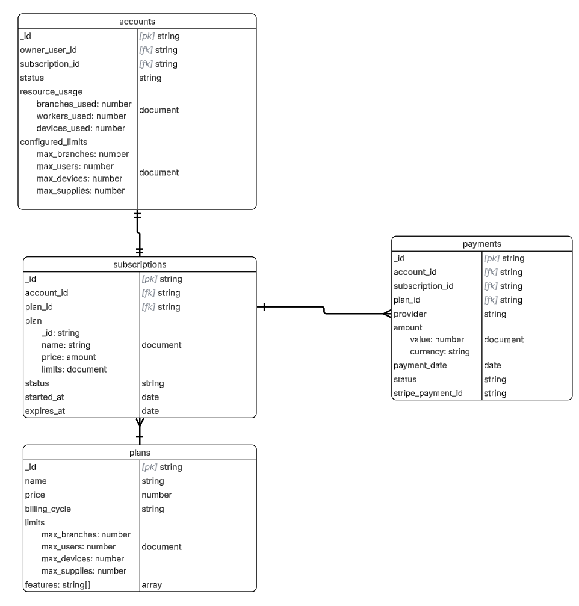</a>

### 4.2.3. Bounded Context: Profiles and Preferences

#### 4.2.3.1. Domain Layer

La capa de dominio concentra el núcleo del Bounded Context Profiles and Preferences. En esta capa se encapsulan las reglas de negocio y la lógica fundamental relacionada con el manejo de información en perfiles de usuario y de negocio para brindar una identidad a cada uno de los usuarios de la plataforma.

Esta capa está completamente aislada de detalles técnicos o bases de datos. Además, está compuesta de Entidades (Entities), Raíces de Agregación (Aggregate Roots) y Objetos de Valor (Value Objects) para garantizar la inmutabilidad de los datos, Eventos de Dominio (Domain Events) y las abstracciones de los repositorios mediante Interfaces.

##### Aggregates

Este tipo de clases representa el pilar transaccional del sistema. Cada Aggregate Root garantiza la consistencia de los datos dentro de su límite.

<table style="width:100%; border-collapse: collapse; border: 1px solid;">
  <thead>
    <tr>
      <th style="padding: 10px; border: 1px solid; text-align: left;">Nombre de Clase</th>
      <th style="padding: 10px; border: 1px solid; text-align: left;">Categoría</th>
      <th style="padding: 10px; border: 1px solid; text-align: left;">Propósito y Reglas de Negocio</th>
    </tr>
  </thead>
  <tbody>
    <tr>
      <td style="padding: 10px; border: 1px solid;"><strong>Profile</strong></td>
      <td style="padding: 10px; border: 1px solid;">Aggregate Root</td>
      <td style="padding: 10px; border: 1px solid;">Representa el perfil visible/administrable del usuario y centraliza sus datos de contacto, ubicación y avatar. Además, encapsula la lógica para editar la información almacenada.</td>
    </tr>
    <tr>
      <td style="padding: 10px; border: 1px solid;"><strong>Business</strong></td>
      <td style="padding: 10px; border: 1px solid;">Aggregate Root</td>
      <td style="padding: 10px; border: 1px solid;">Contiene datos del negocio del usuario integrados al perfil. Además, contiene lógica para editar la información de negocio.</td>
    </tr>
  </tbody>
</table>
 

##### Value Objects

Estas clases modelan características conceptuales del dominio. Son inmutables y ayudan a evitar el uso excesivo de tipos primitivos (Primitive Obsession), asegurando que los datos siempre sean válidos desde su creación.

<em>Tabla de Value Objects en el Domain Layer</em>

<table style="width:100%; border-collapse: collapse; border: 1px solid;">
  <thead>
    <tr>
      <th style="padding: 10px; border: 1px solid; text-align: left;">Nombre de Clase</th>
      <th style="padding: 10px; border: 1px solid; text-align: left;">Categoría</th>
      <th style="padding: 10px; border: 1px solid; text-align: left;">Propósito y Reglas de Negocio</th>
    </tr>
  </thead>
  <tbody>
    <tr>
      <td style="padding: 10px; border: 1px solid;"><strong>PhoneNumber</strong></td>
      <td style="padding: 10px; border: 1px solid;">Value Object</td>
      <td style="padding: 10px; border: 1px solid;">Almacena el número telefónico del usuario. Provee de validaciones especiales para asegurar que el formato ingresado para números telefónicos se siga al detalle.</td>
    </tr>
  </tbody>
</table>
 

##### Commands

Estas clases expresan el querer generar una acción dentro del sistema. Para este contexto, expresa el querer crear o modificar información sobre el usuario y su negocio.

<em>Tabla de Commands en el Domain Layer</em>

<table style="width:100%; border-collapse: collapse; border: 1px solid;">
  <thead>
    <tr>
      <th style="padding: 10px; border: 1px solid; text-align: left;">Nombre de Clase</th>
      <th style="padding: 10px; border: 1px solid; text-align: left;">Categoría</th>
      <th style="padding: 10px; border: 1px solid; text-align: left;">Propósito y Reglas de Negocio</th>
    </tr>
  </thead>
  <tbody>
    <tr>
      <td style="padding: 10px; border: 1px solid;"><strong>CreateProfileCommand</strong></td>
      <td style="padding: 10px; border: 1px solid;">Command</td>
      <td style="padding: 10px; border: 1px solid;">Recibe los parámetros necesarios para crear un perfil como número de teléfono, nombre, apellido, avatar, y, el identificador del usuario</td>
    </tr>
    <tr>
      <td style="padding: 10px; border: 1px solid;"><strong>CreateBusinessCommand</strong></td>
      <td style="padding: 10px; border: 1px solid;">Command</td>
      <td style="padding: 10px; border: 1px solid;">Recibe los parámetros necesarios para crear un perfil de negocio como nombre del negocio, ubicación, razón social e imagen referencial del negocio.</td>
    </tr>
    <tr>
      <td style="padding: 10px; border: 1px solid;"><strong>UpdateProfileByUserIdCommand</strong></td>
      <td style="padding: 10px; border: 1px solid;">Command</td>
      <td style="padding: 10px; border: 1px solid;">Recibe el identificador de usuario para buscar su perfil y modificarlo según la información que se requiera modificar. No todos los campos son obligatorios.</td>
    </tr>
    <tr>
      <td style="padding: 10px; border: 1px solid;"><strong>UpdateBusinessByAccountId</strong></td>
      <td style="padding: 10px; border: 1px solid;">Command</td>
      <td style="padding: 10px; border: 1px solid;">Recibe el identificador de la cuenta y la información que se necesita modificar.</td>
    </tr>
    <tr>
      <td style="padding: 10px; border: 1px solid;"><strong>UpdateProfileAvatarByUserId</strong></td>
      <td style="padding: 10px; border: 1px solid;">Command</td>
      <td style="padding: 10px; border: 1px solid;">Recibe el identificador del usuario y el binario de la nueva imagen subida por parte del usuario.</td>
    </tr>
    <tr>
      <td style="padding: 10px; border: 1px solid;"><strong>UpdateBusinessPictureByAccountId</strong></td>
      <td style="padding: 10px; border: 1px solid;">Command</td>
      <td style="padding: 10px; border: 1px solid;">Recibe el identificador de la cuenta y el binario de la nueva imagen subida por parte del usuario.</td>
    </tr>
  </tbody>
</table>
 

##### Queries

Estas clases representan la intención de solicitar información de manera eficiente, sin alterar el estado de la entidad ni ejecutar reglas de negocio. Para este contexto, expresa el querer obtener la información de perfil y de negocio.

<em>Tabla de Queries en el Domain Layer</em>

<table style="width:100%; border-collapse: collapse; border: 1px solid;">
  <thead>
    <tr>
      <th style="padding: 10px; border: 1px solid; text-align: left;">Nombre de Clase</th>
      <th style="padding: 10px; border: 1px solid; text-align: left;">Categoría</th>
      <th style="padding: 10px; border: 1px solid; text-align: left;">Propósito y Reglas de Negocio</th>
    </tr>
  </thead>
  <tbody>
    <tr>
      <td style="padding: 10px; border: 1px solid;"><strong>GetProfileByUserIdQuery</strong></td>
      <td style="padding: 10px; border: 1px solid;">Query</td>
      <td style="padding: 10px; border: 1px solid;">Recibe el identificador de usuario, el cual debe ser válido y representar a un usuario existente.</td>
    </tr>
    <tr>
      <td style="padding: 10px; border: 1px solid;"><strong>GetBusinessByAccountIdQuery</strong></td>
      <td style="padding: 10px; border: 1px solid;">Query</td>
      <td style="padding: 10px; border: 1px solid;">Recibe el identificador de la cuenta, el cual debe ser válido y representar una cuenta existente.</td>
    </tr>
  </tbody>
</table>
 

#### 4.2.3.2. Interface Layer

En la capa de interfaz del Bounded Context de Profile and Preferences se exponen los endpoints HTTP RESTful necesarios para interactuar con las funcionalidades de la gestión de perfiles personales y de negocio. A través de controladores especializados y ensambladores (Assemblers), esta capa actúa como punto de entrada para solicitudes de clientes (como la Web App de administración o aplicaciones móviles), facilitando la transformación de recursos (Data Transfer Objects) en Comandos o Queries hacia la capa de aplicación. Su diseño garantiza una clara separación de responsabilidades para la orquestación de recursos clave como perfiles y negocios.

##### ProfileContextFacade

<em>Tabla de métodos de ProfileContextFacade en el Interface Layer</em>

<table style="width:100%; border-collapse: collapse; border: 1px solid;">
  <thead>
    <tr>
      <th style="padding: 10px; border: 1px solid;">Nombre</th>
      <th style="padding: 10px; border: 1px solid;">Acción</th>
    </tr>
  </thead>
  <tbody>
    <tr>
      <td style="padding: 10px; border: 1px solid;">createProfile</td>
      <td style="padding: 10px; border: 1px solid;">Expone un método para que se pueda crear un perfil en el proceso de registro</td>
    </tr>
    <tr>
      <td style="padding: 10px; border: 1px solid;">createBusiness</td>
      <td style="padding: 10px; border: 1px solid;">Expone un método para que se pueda crear un perfil de negocio en el proceso de registro</td>
    </tr>
  </tbody>
</table>

##### UserProfilesController

<em>Tabla de UserProfilesController en el Interface Layer</em>

<table style="width:100%; border-collapse: collapse; border: 1px solid;">
  <thead>
    <tr>
      <th style="padding: 10px; border: 1px solid; text-align: left;">Propiedad</th>
      <th style="padding: 10px; border: 1px solid; text-align: left;">Valor</th>
    </tr>
  </thead>
  <tbody>
    <tr>
      <td style="padding: 10px; border: 1px solid;"><strong>Nombre</strong></td>
      <td style="padding: 10px; border: 1px solid;">UserProfilesController</td>
    </tr>
    <tr>
      <td style="padding: 10px; border: 1px solid;"><strong>Categoría</strong></td>
      <td style="padding: 10px; border: 1px solid;">Controller</td>
    </tr>
    <tr>
      <td style="padding: 10px; border: 1px solid;"><strong>Propósito</strong></td>
      <td style="padding: 10px; border: 1px solid;">Encargado de exponer endpoints para la obtención de perfiles personales de los usuarios.</td>
    </tr>
    <tr>
      <td style="padding: 10px; border: 1px solid;"><strong>Ruta</strong></td>
      <td style="padding: 10px; border: 1px solid;">/api/v1/users/{userId}/profiles</td>
    </tr>
  </tbody>
</table>
 

<em>Tabla de métodos de AccountBusinessesController en el Interface Layer</em>

<table style="width:100%; border-collapse: collapse; border: 1px solid;">
  <thead>
    <tr>
      <th style="padding: 10px; border: 1px solid;">Nombre</th>
      <th style="padding: 10px; border: 1px solid;">Ruta</th>
      <th style="padding: 10px; border: 1px solid;">Acción</th>
      <th style="padding: 10px; border: 1px solid;">Handle (Command/Query)</th>
    </tr>
  </thead>
  <tbody>
    <tr>
      <td style="padding: 10px; border: 1px solid;">updateAvatarByUserId</td>
      <td style="padding: 10px; border: 1px solid;">api/v1/users/{userId}/profiles (PATCH)</td>
      <td style="padding: 10px; border: 1px solid;">Actualiza únicamente el avatar del usuario</td>
      <td style="padding: 10px; border: 1px solid;">UpdateProfileAvatarByUserId</td>
    </tr>
    <tr>
      <td style="padding: 10px; border: 1px solid;">updateProfileByUserId</td>
      <td style="padding: 10px; border: 1px solid;">api/v1/users/{userId}/profiles (PUT)</td>
      <td style="padding: 10px; border: 1px solid;">Actualiza la información de un perfil de usuario. No todos los campos son requeridos</td>
      <td style="padding: 10px; border: 1px solid;">UpdateProfileByUserId</td>
    </tr>
    <tr>
      <td style="padding: 10px; border: 1px solid;">getProfileByUserId</td>
      <td style="padding: 10px; border: 1px solid;">api/v1/users/{userId}/profiles (GET)</td>
      <td style="padding: 10px; border: 1px solid;">Obtiene la información personal de un usuario</td>
      <td style="padding: 10px; border: 1px solid;">GetProfileByUserIdQuery</td>
    </tr>
  </tbody>
</table>

##### AccountBusinessesController

<em>Tabla de AccountBusinessesController en el Interface Layer</em>

<table style="width:100%; border-collapse: collapse; border: 1px solid;">
  <thead>
    <tr>
      <th style="padding: 10px; border: 1px solid; text-align: left;">Propiedad</th>
      <th style="padding: 10px; border: 1px solid; text-align: left;">Valor</th>
    </tr>
  </thead>
  <tbody>
    <tr>
      <td style="padding: 10px; border: 1px solid;"><strong>Nombre</strong></td>
      <td style="padding: 10px; border: 1px solid;">AccountBusinessesController</td>
    </tr>
    <tr>
      <td style="padding: 10px; border: 1px solid;"><strong>Categoría</strong></td>
      <td style="padding: 10px; border: 1px solid;">Controller</td>
    </tr>
    <tr>
      <td style="padding: 10px; border: 1px solid;"><strong>Propósito</strong></td>
      <td style="padding: 10px; border: 1px solid;">Encargado de exponer endpoints para la obtención de perfiles de negocio de las cuentas de los usuarios.</td>
    </tr>
    <tr>
      <td style="padding: 10px; border: 1px solid;"><strong>Ruta</strong></td>
      <td style="padding: 10px; border: 1px solid;">/api/v1/accounts/{accountId}/businesses</td>
    </tr>
  </tbody>
</table>

 

<em>Tabla de métodos de AccountBusinessesController en el Interface Layer</em>

<table style="width:100%; border-collapse: collapse; border: 1px solid;">
  <thead>
    <tr>
      <th style="padding: 10px; border: 1px solid;">Nombre</th>
      <th style="padding: 10px; border: 1px solid;">Ruta</th>
      <th style="padding: 10px; border: 1px solid;">Acción</th>
      <th style="padding: 10px; border: 1px solid;">Handle (Command/Query)</th>
    </tr>
  </thead>
  <tbody>
    <tr>
      <td style="padding: 10px; border: 1px solid;">updatePictureById</td>
      <td style="padding: 10px; border: 1px solid;">api/v1/accounts/{accountId}/businesses (PATCH)</td>
      <td style="padding: 10px; border: 1px solid;">Actualiza únicamente la imagen referencial del negocio</td>
      <td style="padding: 10px; border: 1px solid;">UpdateBusinessPictureByAccountId</td>
    </tr>
    <tr>
      <td style="padding: 10px; border: 1px solid;">updateBusinessByAccountId</td>
      <td style="padding: 10px; border: 1px solid;">api/v1/accounts/{accountId}/businesses (PUT)</td>
      <td style="padding: 10px; border: 1px solid;">Actualiza la información de un perfil del negocio. No todos los campos son requeridos</td>
      <td style="padding: 10px; border: 1px solid;">UpdateBusinessByAccountId</td>
    </tr>
    <tr>
      <td style="padding: 10px; border: 1px solid;">getBusinessByAccountId</td>
      <td style="padding: 10px; border: 1px solid;">api/v1/accounts/{accountId}/businesses (GET)</td>
      <td style="padding: 10px; border: 1px solid;">Obtiene la información de negocio de una cuenta</td>
      <td style="padding: 10px; border: 1px solid;">GetBusinessByAccountIdQuery</td>
    </tr>
  </tbody>
</table>

#### 4.2.3.3. Application Layer

La capa de aplicación del Bounded Context de Profiles and Preferences coordina el flujo de trabajo entre la capa de interfaz y el dominio, encapsulando la lógica de orquestación de la información personal y de negocio de los usuarios. En esta capa residen los Command Handlers, Query Handlers, Event Handlers y la implementación del Anticorruption Layer, los cuales son responsables de ejecutar las operaciones de creación y edición de los perfiles. Esta capa asegura que las acciones del negocio se realicen de manera transaccional y coherente, delegando las reglas puras al dominio y la persistencia a la infraestructura.

##### ProfilesContextFacadeImpl

<em>Tabla de ProfilesContextFacadeImpl en el Application Layer</em>

<table style="width:100%; border-collapse: collapse; border: 1px solid;">
  <thead>
    <tr>
      <th style="padding: 10px; border: 1px solid; text-align: left;">Propiedad</th>
      <th style="padding: 10px; border: 1px solid; text-align: left;">Valor</th>
    </tr>
  </thead>
  <tbody>
    <tr>
      <td style="padding: 10px; border: 1px solid;"><strong>Nombre</strong></td>
      <td style="padding: 10px; border: 1px solid;">ProfilesContextFacadeImpl</td>
    </tr>
    <tr>
      <td style="padding: 10px; border: 1px solid;"><strong>Categoría</strong></td>
      <td style="padding: 10px; border: 1px solid;">ACL Implementation</td>
    </tr>
    <tr>
      <td style="padding: 10px; border: 1px solid;"><strong>Propósito</strong></td>
      <td style="padding: 10px; border: 1px solid;">Implementar la interfaz que expone métodos de creación de perfiles de usuario y de negocio.</td>
    </tr>
    <tr>
      <td style="padding: 10px; border: 1px solid;"><strong>Métodos</strong></td>
      <td style="padding: 10px; border: 1px solid;">createProfile y createBusiness</td>
    </tr>
  </tbody>
</table>

##### CreateProfileCommandHandler

<em>Tabla de CreateBranchCommandHandler en el Application Layer</em>

<table style="width:100%; border-collapse: collapse; border: 1px solid;">
  <thead>
    <tr>
      <th style="padding: 10px; border: 1px solid; text-align: left;">Propiedad</th>
      <th style="padding: 10px; border: 1px solid; text-align: left;">Valor</th>
    </tr>
  </thead>
  <tbody>
    <tr>
      <td style="padding: 10px; border: 1px solid;"><strong>Nombre</strong></td>
      <td style="padding: 10px; border: 1px solid;">CreateProfileCommandHandler</td>
    </tr>
    <tr>
      <td style="padding: 10px; border: 1px solid;"><strong>Categoría</strong></td>
      <td style="padding: 10px; border: 1px solid;">Command Handler</td>
    </tr>
    <tr>
      <td style="padding: 10px; border: 1px solid;"><strong>Propósito</strong></td>
      <td style="padding: 10px; border: 1px solid;">Orquestar la creación de un perfil personal de usuario.</td>
    </tr>
    <tr>
      <td style="padding: 10px; border: 1px solid;"><strong>Comando</strong></td>
      <td style="padding: 10px; border: 1px solid;">CreateProfileCommand</td>
    </tr>
  </tbody>
</table>

 

##### CreateBusinessCommandHandler

<em>Tabla de CreateBusinessCommandHandler en el Application Layer</em>

<table style="width:100%; border-collapse: collapse; border: 1px solid;">
  <thead>
    <tr>
      <th style="padding: 10px; border: 1px solid; text-align: left;">Propiedad</th>
      <th style="padding: 10px; border: 1px solid; text-align: left;">Valor</th>
    </tr>
  </thead>
  <tbody>
    <tr>
      <td style="padding: 10px; border: 1px solid;"><strong>Nombre</strong></td>
      <td style="padding: 10px; border: 1px solid;">CreateBusinessCommandHandler</td>
    </tr>
    <tr>
      <td style="padding: 10px; border: 1px solid;"><strong>Categoría</strong></td>
      <td style="padding: 10px; border: 1px solid;">Command Handler</td>
    </tr>
    <tr>
      <td style="padding: 10px; border: 1px solid;"><strong>Propósito</strong></td>
      <td style="padding: 10px; border: 1px solid;">Orquestar la creación de un perfil para el negocio del usuario.</td>
    </tr>
    <tr>
      <td style="padding: 10px; border: 1px solid;"><strong>Comando</strong></td>
      <td style="padding: 10px; border: 1px solid;">CreateBusinessCommand</td>
    </tr>
  </tbody>
</table>

 

##### UpdateProfileCommand

<em>Tabla de UpdateProfileCommand en el Application Layer</em>

<table style="width:100%; border-collapse: collapse; border: 1px solid;">
  <thead>
    <tr>
      <th style="padding: 10px; border: 1px solid; text-align: left;">Propiedad</th>
      <th style="padding: 10px; border: 1px solid; text-align: left;">Valor</th>
    </tr>
  </thead>
  <tbody>
    <tr>
      <td style="padding: 10px; border: 1px solid;"><strong>Nombre</strong></td>
      <td style="padding: 10px; border: 1px solid;">UpdateProfileCommandHandler</td>
    </tr>
    <tr>
      <td style="padding: 10px; border: 1px solid;"><strong>Categoría</strong></td>
      <td style="padding: 10px; border: 1px solid;">Command Handler</td>
    </tr>
    <tr>
      <td style="padding: 10px; border: 1px solid;"><strong>Propósito</strong></td>
      <td style="padding: 10px; border: 1px solid;">Manejar la edición de un perfil de usuario.</td>
    </tr>
    <tr>
      <td style="padding: 10px; border: 1px solid;"><strong>Comando</strong></td>
      <td style="padding: 10px; border: 1px solid;">UpdateProfileCommand</td>
    </tr>
  </tbody>
</table>

 

##### UpdateBusinessCommandHandler

<em>Tabla de UpdateBusinessCommandHandler en el Application Layer</em>

<table style="width:100%; border-collapse: collapse; border: 1px solid;">
  <thead>
    <tr>
      <th style="padding: 10px; border: 1px solid; text-align: left;">Propiedad</th>
      <th style="padding: 10px; border: 1px solid; text-align: left;">Valor</th>
    </tr>
  </thead>
  <tbody>
    <tr>
      <td style="padding: 10px; border: 1px solid;"><strong>Nombre</strong></td>
      <td style="padding: 10px; border: 1px solid;">UpdateBusinessCommandHandler</td>
    </tr>
    <tr>
      <td style="padding: 10px; border: 1px solid;"><strong>Categoría</strong></td>
      <td style="padding: 10px; border: 1px solid;">Command Handler</td>
    </tr>
    <tr>
      <td style="padding: 10px; border: 1px solid;"><strong>Propósito</strong></td>
      <td style="padding: 10px; border: 1px solid;">Gestionar la edición de informacion sobre el negocio de un usuario.</td>
    </tr>
    <tr>
      <td style="padding: 10px; border: 1px solid;"><strong>Comando</strong></td>
      <td style="padding: 10px; border: 1px solid;">UpdateBusinessCommand</td>
    </tr>
  </tbody>
</table>

 

##### UpdateProfileAvatarCommandHandler

<em>Tabla de UpdateProfileAvatarCommandHandler en el Application Layer</em>

<table style="width:100%; border-collapse: collapse; border: 1px solid;">
  <thead>
    <tr>
      <th style="padding: 10px; border: 1px solid; text-align: left;">Propiedad</th>
      <th style="padding: 10px; border: 1px solid; text-align: left;">Valor</th>
    </tr>
  </thead>
  <tbody>
    <tr>
      <td style="padding: 10px; border: 1px solid;"><strong>Nombre</strong></td>
      <td style="padding: 10px; border: 1px solid;">UpdateProfileAvatarCommandHandler</td>
    </tr>
    <tr>
      <td style="padding: 10px; border: 1px solid;"><strong>Categoría</strong></td>
      <td style="padding: 10px; border: 1px solid;">Command Handler</td>
    </tr>
    <tr>
      <td style="padding: 10px; border: 1px solid;"><strong>Propósito</strong></td>
      <td style="padding: 10px; border: 1px solid;">Gestionar el cambio de avatares del usuario, eliminando el anterior de Cloudinary y obteniendo el URL de la nueva imagen.</td>
    </tr>
    <tr>
      <td style="padding: 10px; border: 1px solid;"><strong>Comando</strong></td>
      <td style="padding: 10px; border: 1px solid;">UpdateProfileAvatarCommand</td>
    </tr>
  </tbody>
</table>

 

##### UpdateBusinessPictureCommandHandler

<em>Tabla de UpdateBusinessPictureCommandHandler en el Application Layer</em>

<table style="width:100%; border-collapse: collapse; border: 1px solid;">
  <thead>
    <tr>
      <th style="padding: 10px; border: 1px solid; text-align: left;">Propiedad</th>
      <th style="padding: 10px; border: 1px solid; text-align: left;">Valor</th>
    </tr>
  </thead>
  <tbody>
    <tr>
      <td style="padding: 10px; border: 1px solid;"><strong>Nombre</strong></td>
      <td style="padding: 10px; border: 1px solid;">UpdateBusinessPictureCommandHandler</td>
    </tr>
    <tr>
      <td style="padding: 10px; border: 1px solid;"><strong>Categoría</strong></td>
      <td style="padding: 10px; border: 1px solid;">Command Handler</td>
    </tr>
    <tr>
      <td style="padding: 10px; border: 1px solid;"><strong>Propósito</strong></td>
      <td style="padding: 10px; border: 1px solid;">Gestionar el cambio de imágenes del negocio, eliminando el anterior de Cloudinary y obteniendo el URL de la nueva imagen.</td>
    </tr>
    <tr>
      <td style="padding: 10px; border: 1px solid;"><strong>Comando</strong></td>
      <td style="padding: 10px; border: 1px solid;">UpdateBusinessPictureCommand</td>
    </tr>
  </tbody>
</table>

 

##### GetProfileByUserIdQueryHandler

<em>Tabla de GetProfileByUserIdQueryHandler en el Application Layer</em>

<table style="width:100%; border-collapse: collapse; border: 1px solid;">
  <thead>
    <tr>
      <th style="padding: 10px; border: 1px solid; text-align: left;">Propiedad</th>
      <th style="padding: 10px; border: 1px solid; text-align: left;">Valor</th>
    </tr>
  </thead>
  <tbody>
    <tr>
      <td style="padding: 10px; border: 1px solid;"><strong>Nombre</strong></td>
      <td style="padding: 10px; border: 1px solid;">GetProfileByUserIdQueryHandler</td>
    </tr>
    <tr>
      <td style="padding: 10px; border: 1px solid;"><strong>Categoría</strong></td>
      <td style="padding: 10px; border: 1px solid;">Query Handler</td>
    </tr>
    <tr>
      <td style="padding: 10px; border: 1px solid;"><strong>Propósito</strong></td>
      <td style="padding: 10px; border: 1px solid;">Consultar la información del perfil de un usuario registrado en la plataforma.</td>
    </tr>
    <tr>
      <td style="padding: 10px; border: 1px solid;"><strong>Query</strong></td>
      <td style="padding: 10px; border: 1px solid;">GetProfileByUserIdQuery</td>
    </tr>
  </tbody>
</table>

 

##### GetBusinessByAccountIdQueryHandler

<em>Tabla de GetBusinessByAccountIdQueryHandler en el Application Layer</em>

<table style="width:100%; border-collapse: collapse; border: 1px solid;">
  <thead>
    <tr>
      <th style="padding: 10px; border: 1px solid; text-align: left;">Propiedad</th>
      <th style="padding: 10px; border: 1px solid; text-align: left;">Valor</th>
    </tr>
  </thead>
  <tbody>
    <tr>
      <td style="padding: 10px; border: 1px solid;"><strong>Nombre</strong></td>
      <td style="padding: 10px; border: 1px solid;">GetBusinessByAccountIdQueryHandler</td>
    </tr>
    <tr>
      <td style="padding: 10px; border: 1px solid;"><strong>Categoría</strong></td>
      <td style="padding: 10px; border: 1px solid;">Query Handler</td>
    </tr>
    <tr>
      <td style="padding: 10px; border: 1px solid;"><strong>Propósito</strong></td>
      <td style="padding: 10px; border: 1px solid;">Consultar la información del perfil de negocio de una cuenta suscrita a la plataforma.</td>
    </tr>
    <tr>
      <td style="padding: 10px; border: 1px solid;"><strong>Query</strong></td>
      <td style="padding: 10px; border: 1px solid;">GetBusinessByAccountIdQuery</td>
    </tr>
  </tbody>
</table>

 

#### 4.2.3.4. Infrastructure Layer

La capa de infraestructura del Bounded Context de Profiles and Preferences actúa como el puente entre la lógica central del negocio y los mecanismos técnicos externos. En esta capa se materializan las interfaces de repositorios definidas en el dominio para persistir entidades como perfiles de usuario y de negocio en la base de datos no relacional.

##### ProfileRepository

<em>Tabla de ProfileRepository en el Infrastructure Layer</em>

<table style="width:100%; border-collapse: collapse; border: 1px solid;">
  <thead>
    <tr>
      <th style="padding: 10px; border: 1px solid; text-align: left;">Propiedad</th>
      <th style="padding: 10px; border: 1px solid; text-align: left;">Valor</th>
    </tr>
  </thead>
  <tbody>
    <tr>
      <td style="padding: 10px; border: 1px solid;"><strong>Nombre</strong></td>
      <td style="padding: 10px; border: 1px solid;">ProfileRepository</td>
    </tr>
    <tr>
      <td style="padding: 10px; border: 1px solid;"><strong>Categoría</strong></td>
      <td style="padding: 10px; border: 1px solid;">Command Handler</td>
    </tr>
    <tr>
      <td style="padding: 10px; border: 1px solid;"><strong>Propósito</strong></td>
      <td style="padding: 10px; border: 1px solid;">Persistir y consultar entidades y agregados de perfiles de usuario en la base de datos.</td>
    </tr>
  </tbody>
</table>

 

##### BusinessRepository

<em>Tabla de BusinessRepository en el Infrastructure Layer</em>

<table style="width:100%; border-collapse: collapse; border: 1px solid;">
  <thead>
    <tr>
      <th style="padding: 10px; border: 1px solid; text-align: left;">Propiedad</th>
      <th style="padding: 10px; border: 1px solid; text-align: left;">Valor</th>
    </tr>
  </thead>
  <tbody>
    <tr>
      <td style="padding: 10px; border: 1px solid;"><strong>Nombre</strong></td>
      <td style="padding: 10px; border: 1px solid;">BusinessRepository</td>
    </tr>
    <tr>
      <td style="padding: 10px; border: 1px solid;"><strong>Categoría</strong></td>
      <td style="padding: 10px; border: 1px solid;">Repositorio</td>
    </tr>
    <tr>
      <td style="padding: 10px; border: 1px solid;"><strong>Propósito</strong></td>
      <td style="padding: 10px; border: 1px solid;">Persistir y consultar entidades y agregados de perfiles de negocio en la base de datos.</td>
    </tr>
  </tbody>
</table>

 

##### ProfilesDbContext

<em>Tabla de ProfilesDbContext en el Infrastructure Layer</em>

<table style="width:100%; border-collapse: collapse; border: 1px solid;">
  <thead>
    <tr>
      <th style="padding: 10px; border: 1px solid; text-align: left;">Propiedad</th>
      <th style="padding: 10px; border: 1px solid; text-align: left;">Valor</th>
    </tr>
  </thead>
  <tbody>
    <tr>
      <td style="padding: 10px; border: 1px solid;"><strong>Nombre</strong></td>
      <td style="padding: 10px; border: 1px solid;">ProfilesDbContext</td>
    </tr>
    <tr>
      <td style="padding: 10px; border: 1px solid;"><strong>Categoría</strong></td>
      <td style="padding: 10px; border: 1px solid;">ORM Context</td>
    </tr>
    <tr>
      <td style="padding: 10px; border: 1px solid;"><strong>Propósito</strong></td>
      <td style="padding: 10px; border: 1px solid;">Punto central de configuración de Entity Framework para mapear las entidades del Bounded Context a la base de datos.</td>
    </tr>
  </tbody>
</table>

 

#### 4.2.3.5. Bounded Context Software Architecture Component Level Diagrams

Esta sección presenta el diagrama de componentes del backend para el bounded context Profile and Preferences. Se ilustra su interacción con los bounded contexts directamente relacionados dentro de la arquitectura del sistema.

##### Web Application Component Diagram

El componente de la aplicación web cliente se ejecuta en el navegador del usuario y presenta las interfaces gráficas (UI) para la visualización y edición de perfiles en pantallas de escritorio o laptops.

<em>Tabla de Componentes de la Web Application para Profiles and Preferences</em>

<table style="width:100%; border-collapse: collapse; border: 1px solid;">
  <thead>
    <tr>
      <th style="padding: 10px; border: 1px solid; text-align: left;">Componente</th>
      <th style="padding: 10px; border: 1px solid; text-align: left;">Responsabilidad</th>
      <th style="padding: 10px; border: 1px solid; text-align: left;">Tecnología</th>
    </tr>
  </thead>
  <tbody>
    <tr>
      <td style="padding: 10px; border: 1px solid;"><strong>webProfile</strong></td>
      <td style="padding: 10px; border: 1px solid;">Provee la interfaz de usuario para la visualización y edición de información de perfiles de usuario y negocio. Además, capta las interacciones del administrador para enviarlas al servidor.</td>
      <td style="padding: 10px; border: 1px solid;">TypeScript, Angular</td>
    </tr>
  </tbody>
</table>

 

<em>Tabla de Interacciones del Componente webProfile</em>

<table style="width:100%; border-collapse: collapse; border: 1px solid;">
  <thead>
    <tr>
      <th style="padding: 10px; border: 1px solid; text-align: left;">Interactúa con</th>
      <th style="padding: 10px; border: 1px solid; text-align: left;">Tipo de Relación</th>
      <th style="padding: 10px; border: 1px solid; text-align: left;">Descripción de la Interacción</th>
    </tr>
  </thead>
  <tbody>
    <tr>
      <td style="padding: 10px; border: 1px solid;"><strong>Nginx Load Balancer</strong></td>
      <td style="padding: 10px; border: 1px solid;">Petición HTTP / REST</td>
      <td style="padding: 10px; border: 1px solid;">Realiza peticiones JSON/HTTPS para recuperar y actualizar los perfiles de usuario y negocio en el servidor central.</td>
    </tr>
  </tbody>
</table>

##### Mobile Application Component Diagram

El componente de la aplicación móvil provee acceso en dispositivos iOS y Android, permitiendo a los administradores gestionar sus perfiles de usuario y negocio, adaptando la experiencia de usuario (UX) para pantallas táctiles.

<em>Tabla de Componentes de la Mobile Application para Profiles and Preferences</em>

<table style="width:100%; border-collapse: collapse; border: 1px solid;">
  <thead>
    <tr>
      <th style="padding: 10px; border: 1px solid; text-align: left;">Componente</th>
      <th style="padding: 10px; border: 1px solid; text-align: left;">Responsabilidad</th>
      <th style="padding: 10px; border: 1px solid; text-align: left;">Tecnología</th>
    </tr>
  </thead>
  <tbody>
    <tr>
      <td style="padding: 10px; border: 1px solid;"><strong>mobileProfile</strong></td>
      <td style="padding: 10px; border: 1px solid;">Provee las pantallas y lógica local móvil para gestionar información de perfiles de usuario y negocio desde dispositivos portátiles.</td>
      <td style="padding: 10px; border: 1px solid;">Dart, Flutter</td>
    </tr>
  </tbody>
</table>

 

<em>Tabla de Interacciones del Componente mobileProfile</em>

<table style="width:100%; border-collapse: collapse; border: 1px solid;">
  <thead>
    <tr>
      <th style="padding: 10px; border: 1px solid; text-align: left;">Interactúa con</th>
      <th style="padding: 10px; border: 1px solid; text-align: left;">Tipo de Relación</th>
      <th style="padding: 10px; border: 1px solid; text-align: left;">Descripción de la Interacción</th>
    </tr>
  </thead>
  <tbody>
    <tr>
      <td style="padding: 10px; border: 1px solid;"><strong>Nginx Load Balancer</strong> (API)</td>
      <td style="padding: 10px; border: 1px solid;">Petición HTTP / REST</td>
      <td style="padding: 10px; border: 1px solid;">Realiza llamadas JSON/HTTPS que son redirigidas al API para recuperar y actualizar los perfiles de usuario y negocio desde la aplicación móvil.</td>
    </tr>
  </tbody>
</table>

##### Backend Application Component Diagram

El componente principal del lado del servidor maneja la lógica de negocio central, la persistencia en base de datos y la integración con servicios externos para la validación de insumos y estructuración comercial.

<em>Tabla de Componentes de la Backend Application para Profiles and Preferences</em>

<table style="width:100%; border-collapse: collapse; border: 1px solid;">
  <thead>
    <tr>
      <th style="padding: 10px; border: 1px solid; text-align: left;">Componente</th>
      <th style="padding: 10px; border: 1px solid; text-align: left;">Responsabilidad</th>
      <th style="padding: 10px; border: 1px solid; text-align: left;">Tecnología</th>
    </tr>
  </thead>
  <tbody>
    <tr>
      <td style="padding: 10px; border: 1px solid;"><strong>apiProfile</strong></td>
      <td style="padding: 10px; border: 1px solid;">Maneja la gestión de información en perfiles de usuario y negocio.</td>
      <td style="padding: 10px; border: 1px solid;">Java, Spring Boot</td>
    </tr>
  </tbody>
</table>

 

<em>Tabla de Interacciones del Componente apiProfiles</em>

<table style="width:100%; border-collapse: collapse; border: 1px solid;">
  <thead>
    <tr>
      <th style="padding: 10px; border: 1px solid; text-align: left;">Interactúa con</th>
      <th style="padding: 10px; border: 1px solid; text-align: left;">Tipo de Relación</th>
      <th style="padding: 10px; border: 1px solid; text-align: left;">Descripción de la Interacción</th>
    </tr>
  </thead>
  <tbody>
    <tr>
      <td style="padding: 10px; border: 1px solid;"><strong>databaseNoSql</strong> (MongoDB)</td>
      <td style="padding: 10px; border: 1px solid;">Escritura / Lectura</td>
      <td style="padding: 10px; border: 1px solid;">Almacena de forma persistente la información del perfil de usuario y de negocio.</td>
    </tr>
    <tr>
      <td style="padding: 10px; border: 1px solid;"><strong>apiIam</strong></td>
      <td style="padding: 10px; border: 1px solid;">Dependencia Interna</td>
      <td style="padding: 10px; border: 1px solid;">Valida los tokens JWT para autorizar la edición de perfiles.</td>
    </tr>
    <tr>
      <td style="padding: 10px; border: 1px solid;"><strong>cloudinary</strong> / <strong>Servicio externo para subir avatares</strong></td>
      <td style="padding: 10px; border: 1px solid;">Servicio externo</td>
      <td style="padding: 10px; border: 1px solid;">Utiliza el API de Cloudinary para subir avatares de usuario y obtener de regreso el URL de la imagen almacenada.</td>
    </tr>
  </tbody>
</table>

#### 4.2.3.6. Bounded Context Software Architecture Code Level Diagrams

##### 4.2.3.6.1. Bounded Context Domain Layer Class Diagrams

En esta sección, el equipo presenta el Diagrama de Clases detallado para la Domain Layer del Bounded Context de Profile and Preferences. Este diagrama no solo detalla la estructura estática, sino que evidencia un Modelo de Dominio Rico, donde la lógica de negocio reside dentro de los métodos de los Agregados, garantizando la encapsulación y las invariantes del sistema.

##### 4.2.3.6.2. Bounded Context Database Design Diagram

En esta sección, el equipo presenta el Diagrama de Base de Datos diseñado bajo un enfoque No Relacional (NoSQL), del tipo orientado a documentos, para el Bounded Context de Profiles and Preferences. Este modelo de persistencia ha sido seleccionado para gestionar eficientemente la información personal de los usuarios y la comercial de sus negocios.

El diseño se fundamenta en principios clave de bases de datos documentales (como MongoDB). Además, destaca el uso estratégico de la desnormalización.

### 4.2.4. Bounded Context: Asset and Resource Management

#### 4.2.4.1. Domain Layer

La capa de dominio representa el núcleo (core) de la aplicación para el Bounded Context de Asset and Resource Management. En esta capa se encapsulan todas las reglas de negocio, invariantes y la lógica fundamental relacionada con la gestión del catálogo de insumos, el control transaccional del inventario físico, el ciclo de vida de las sucursales y la administración del hardware IoT.

Esta capa está completamente aislada de detalles técnicos, bases de datos o frameworks de presentación. Se compone de Entidades (Entities), Raíces de Agregación (Aggregate Roots), Objetos de Valor (Value Objects) para garantizar la inmutabilidad de los datos, Comandos (Commands), Consultas (Queries) y Eventos de Dominio (Domain Events).

##### Aggregates & Entities

Estas clases representan los pilares transaccionales del sistema. Cada Aggregate Root garantiza la consistencia de los datos dentro de su límite de transacción.

<em>Tabla de Aggregates en el Domain Layer</em>

<table style="width:100%; border-collapse: collapse; border: 1px solid;">
  <thead>
    <tr>
      <th style="padding: 10px; border: 1px solid; text-align: left;">Nombre de Clase</th>
      <th style="padding: 10px; border: 1px solid; text-align: left;">Categoría</th>
      <th style="padding: 10px; border: 1px solid; text-align: left;">Propósito y Reglas de Negocio</th>
    </tr>
  </thead>
  <tbody>
    <tr>
      <td style="padding: 10px; border: 1px solid;"><strong>Branch</strong></td>
      <td style="padding: 10px; border: 1px solid;">Aggregate Root</td>
      <td style="padding: 10px; border: 1px solid;">Representa una sucursal física. Encapsula la lógica para activar, desactivar y actualizar la información operativa del local.</td>
    </tr>
    <tr>
      <td style="padding: 10px; border: 1px solid;"><strong>CustomSupply</strong></td>
      <td style="padding: 10px; border: 1px solid;">Aggregate Root</td>
      <td style="padding: 10px; border: 1px solid;">Representa el catálogo maestro de un insumo o producto. Contiene lógica para determinar alertas de stock bajo y estructurar precios.</td>
    </tr>
    <tr>
      <td style="padding: 10px; border: 1px solid;"><strong>Batch</strong></td>
      <td style="padding: 10px; border: 1px solid;">Aggregate Root</td>
      <td style="padding: 10px; border: 1px solid;">Representa un lote físico de inventario. Contiene las invariantes más críticas: deducción matemática de stock, cálculo de costos remanentes y validación de fechas de caducidad.</td>
    </tr>
    <tr>
      <td style="padding: 10px; border: 1px solid;"><strong>Device</strong></td>
      <td style="padding: 10px; border: 1px solid;">Aggregate Root</td>
      <td style="padding: 10px; border: 1px solid;">Representa un sensor o hardware IoT. Valida las reglas para su vinculación a una sucursal y el registro de telemetría o anomalías.</td>
    </tr>
  </tbody>
</table>

 

##### Value Objects

Estas clases modelan características conceptuales del dominio. Son inmutables y ayudan a evitar el uso excesivo de tipos primitivos (Primitive Obsession), asegurando que los datos siempre sean válidos desde su creación.

<em>Tabla de Value Objects en el Domain Layer</em>

<table style="width:100%; border-collapse: collapse; border: 1px solid;">
  <thead>
    <tr>
      <th style="padding: 10px; border: 1px solid; text-align: left;">Nombre de Clase</th>
      <th style="padding: 10px; border: 1px solid; text-align: left;">Categoría</th>
      <th style="padding: 10px; border: 1px solid; text-align: left;">Propósito y Reglas de Negocio</th>
    </tr>
  </thead>
  <tbody>
    <tr>
      <td style="padding: 10px; border: 1px solid;"><strong>StockQuantity</strong></td>
      <td style="padding: 10px; border: 1px solid;">Value Object</td>
      <td style="padding: 10px; border: 1px solid;">Encapsula la cantidad y unidad de medida. Previene cantidades negativas mediante lógica matemática interna en sus métodos add() y subtract().</td>
    </tr>
    <tr>
      <td style="padding: 10px; border: 1px solid;"><strong>Location</strong></td>
      <td style="padding: 10px; border: 1px solid;">Value Object</td>
      <td style="padding: 10px; border: 1px solid;">Agrupa la dirección física, ciudad y coordenadas geográficas de una sucursal en un solo concepto inmutable.</td>
    </tr>
    <tr>
      <td style="padding: 10px; border: 1px solid;"><strong>HardwareSpecs</strong></td>
      <td style="padding: 10px; border: 1px solid;">Value Object</td>
      <td style="padding: 10px; border: 1px solid;">Define las especificaciones técnicas de un dispositivo IoT (dirección MAC, fabricante, firmware).</td>
    </tr>
    <tr>
      <td style="padding: 10px; border: 1px solid;"><strong>BranchId, SupplyId, etc.</strong></td>
      <td style="padding: 10px; border: 1px solid;">Value Object</td>
      <td style="padding: 10px; border: 1px solid;">Identificadores fuertemente tipados para garantizar que no se confundan IDs de diferentes entidades durante las operaciones.</td>
    </tr>
  </tbody>
</table>

 

##### Commands

<em>Tabla de Commands en el Domain Layer</em>

<table style="width:100%; border-collapse: collapse; border: 1px solid;">
  <thead>
    <tr>
      <th style="padding: 10px; border: 1px solid; text-align: left;">Nombre del Command</th>
      <th style="padding: 10px; border: 1px solid; text-align: left;">Propósito</th>
    </tr>
  </thead>
  <tbody>
    <tr>
      <td style="padding: 10px; border: 1px solid;"><strong>CreateBranchCommand</strong></td>
      <td style="padding: 10px; border: 1px solid;">Encapsula la intención de crear una nueva sucursal con sus datos base.</td>
    </tr>
    <tr>
      <td style="padding: 10px; border: 1px solid;"><strong>RegisterBatchCommand</strong></td>
      <td style="padding: 10px; border: 1px solid;">Encapsula los datos necesarios para ingresar un nuevo lote de inventario al sistema.</td>
    </tr>
    <tr>
      <td style="padding: 10px; border: 1px solid;"><strong>SubtractSupplyStockCommand</strong></td>
      <td style="padding: 10px; border: 1px solid;">Representa la acción de deducir cantidades físicas de un insumo en una sucursal.</td>
    </tr>
    <tr>
      <td style="padding: 10px; border: 1px solid;"><strong>AssignDeviceToBranchCommand</strong></td>
      <td style="padding: 10px; border: 1px solid;">Solicita la vinculación de un dispositivo IoT específico a una sucursal.</td>
    </tr>
  </tbody>
</table>

 

##### Queries

<em>Tabla de Queries en el Domain Layer</em>

<table style="width:100%; border-collapse: collapse; border: 1px solid;">
  <thead>
    <tr>
      <th style="padding: 10px; border: 1px solid; text-align: left;">Nombre del Query</th>
      <th style="padding: 10px; border: 1px solid; text-align: left;">Propósito</th>
    </tr>
  </thead>
  <tbody>
    <tr>
      <td style="padding: 10px; border: 1px solid;"><strong>GetInventoryByBranchQuery</strong></td>
      <td style="padding: 10px; border: 1px solid;">Solicita la consulta del inventario actual disponible en una sucursal determinada.</td>
    </tr>
    <tr>
      <td style="padding: 10px; border: 1px solid;"><strong>GetBranchByIdQuery</strong></td>
      <td style="padding: 10px; border: 1px solid;">Solicita la obtención de los detalles operativos y de ubicación de una sucursal.</td>
    </tr>
  </tbody>
</table>

 

##### Domain Events

<em>Tabla de Domain Events en el Domain Layer</em>

<table style="width:100%; border-collapse: collapse; border: 1px solid;">
  <thead>
    <tr>
      <th style="padding: 10px; border: 1px solid; text-align: left;">Nombre del Evento</th>
      <th style="padding: 10px; border: 1px solid; text-align: left;">Propósito</th>
    </tr>
  </thead>
  <tbody>
    <tr>
      <td style="padding: 10px; border: 1px solid;"><strong>StockSubtractedEvent</strong></td>
      <td style="padding: 10px; border: 1px solid;">Evento emitido en el dominio cuando el nivel de stock ha disminuido exitosamente, notificando a otros componentes (ej. alertas).</td>
    </tr>
    <tr>
      <td style="padding: 10px; border: 1px solid;"><strong>DeviceAssignedToBranchEvent</strong></td>
      <td style="padding: 10px; border: 1px solid;">Evento que confirma la asignación del hardware a una sucursal para iniciar el monitoreo.</td>
    </tr>
  </tbody>
</table>

#### 4.2.4.2. Interface Layer

En la capa de interfaz del Bounded Context de Asset and Resource Management se exponen los endpoints HTTP RESTful necesarios para interactuar con las funcionalidades core de la gestión física y lógica del negocio. A través de controladores especializados, ensambladores (Assemblers) y la interfaz de la capa Anti-Corrupción (ACL), esta capa actúa como punto de entrada para solicitudes de clientes y otros Bounded Contexts.

##### BranchController

<em>Tabla de BranchController en el Interface Layer</em>

<table style="width:100%; border-collapse: collapse; border: 1px solid;">
  <thead>
    <tr>
      <th style="padding: 10px; border: 1px solid; text-align: left;">Propiedad</th>
      <th style="padding: 10px; border: 1px solid; text-align: left;">Valor</th>
    </tr>
  </thead>
  <tbody>
    <tr>
      <td style="padding: 10px; border: 1px solid;"><strong>Nombre</strong></td>
      <td style="padding: 10px; border: 1px solid;">BranchController</td>
    </tr>
    <tr>
      <td style="padding: 10px; border: 1px solid;"><strong>Categoría</strong></td>
      <td style="padding: 10px; border: 1px solid;">Controller</td>
    </tr>
    <tr>
      <td style="padding: 10px; border: 1px solid;"><strong>Propósito</strong></td>
      <td style="padding: 10px; border: 1px solid;">Encargado de exponer endpoints para la gestión de la información y configuración de las sucursales físicas.</td>
    </tr>
    <tr>
      <td style="padding: 10px; border: 1px solid;"><strong>Ruta</strong></td>
      <td style="padding: 10px; border: 1px solid;">/api/v1/branches</td>
    </tr>
  </tbody>
</table>

 

<em>Tabla de métodos de BranchController en el Interface Layer</em>

<table style="width:100%; border-collapse: collapse; border: 1px solid;">
  <thead>
    <tr>
      <th style="padding: 10px; border: 1px solid;">Nombre</th>
      <th style="padding: 10px; border: 1px solid;">Ruta</th>
      <th style="padding: 10px; border: 1px solid;">Acción</th>
      <th style="padding: 10px; border: 1px solid;">Handle (Command/Query)</th>
    </tr>
  </thead>
  <tbody>
    <tr>
      <td style="padding: 10px; border: 1px solid;">Create</td>
      <td style="padding: 10px; border: 1px solid;">/ (POST)</td>
      <td style="padding: 10px; border: 1px solid;">Crea una nueva sucursal</td>
      <td style="padding: 10px; border: 1px solid;">CreateBranchCommand</td>
    </tr>
    <tr>
      <td style="padding: 10px; border: 1px solid;">GetById</td>
      <td style="padding: 10px; border: 1px solid;">/{branchId} (GET)</td>
      <td style="padding: 10px; border: 1px solid;">Obtiene los datos de una sucursal</td>
      <td style="padding: 10px; border: 1px solid;">GetBranchByIdQuery</td>
    </tr>
    <tr>
      <td style="padding: 10px; border: 1px solid;">UpdateInfo</td>
      <td style="padding: 10px; border: 1px solid;">/{branchId}/info (PUT)</td>
      <td style="padding: 10px; border: 1px solid;">Actualiza la información básica</td>
      <td style="padding: 10px; border: 1px solid;">UpdateBranchInfoCommand</td>
    </tr>
    <tr>
      <td style="padding: 10px; border: 1px solid;">UpdateImage</td>
      <td style="padding: 10px; border: 1px solid;">/{branchId}/image (PATCH)</td>
      <td style="padding: 10px; border: 1px solid;">Actualiza la fotografía</td>
      <td style="padding: 10px; border: 1px solid;">UpdateBranchImageCommand</td>
    </tr>
    <tr>
      <td style="padding: 10px; border: 1px solid;">Delete</td>
      <td style="padding: 10px; border: 1px solid;">/{branchId} (DELETE)</td>
      <td style="padding: 10px; border: 1px solid;">Elimina o desactiva una sucursal</td>
      <td style="padding: 10px; border: 1px solid;">DeleteBranchCommand</td>
    </tr>
  </tbody>
</table>

##### BranchInventoriesController

<em>Tabla de BranchInventoriesController en el Interface Layer</em>

<table style="width:100%; border-collapse: collapse; border: 1px solid;">
  <thead>
    <tr>
      <th style="padding: 10px; border: 1px solid; text-align: left;">Propiedad</th>
      <th style="padding: 10px; border: 1px solid; text-align: left;">Valor</th>
    </tr>
  </thead>
  <tbody>
    <tr>
      <td style="padding: 10px; border: 1px solid;"><strong>Nombre</strong></td>
      <td style="padding: 10px; border: 1px solid;">BranchInventoriesController</td>
    </tr>
    <tr>
      <td style="padding: 10px; border: 1px solid;"><strong>Categoría</strong></td>
      <td style="padding: 10px; border: 1px solid;">Controller</td>
    </tr>
    <tr>
      <td style="padding: 10px; border: 1px solid;"><strong>Propósito</strong></td>
      <td style="padding: 10px; border: 1px solid;">Exponer sub-rutas RESTful de lectura de inventarios asociados a una sucursal específica.</td>
    </tr>
    <tr>
      <td style="padding: 10px; border: 1px solid;"><strong>Ruta</strong></td>
      <td style="padding: 10px; border: 1px solid;">/api/v1/branches</td>
    </tr>
  </tbody>
</table>

 

<em>Tabla de métodos de BranchInventoriesController en el Interface Layer</em>

<table style="width:100%; border-collapse: collapse; border: 1px solid;">
  <thead>
    <tr>
      <th style="padding: 10px; border: 1px solid;">Nombre</th>
      <th style="padding: 10px; border: 1px solid;">Ruta</th>
      <th style="padding: 10px; border: 1px solid;">Acción</th>
      <th style="padding: 10px; border: 1px solid;">Handle (Command/Query)</th>
    </tr>
  </thead>
  <tbody>
    <tr>
      <td style="padding: 10px; border: 1px solid;">GetStock</td>
      <td style="padding: 10px; border: 1px solid;">/{branchId}/inventories (GET)</td>
      <td style="padding: 10px; border: 1px solid;">Consulta stock disponible</td>
      <td style="padding: 10px; border: 1px solid;">GetInventoryByBranchQuery</td>
    </tr>
  </tbody>
</table>

##### CustomSupplyController

<em>Tabla de CustomSupplyController en el Interface Layer</em>

<table style="width:100%; border-collapse: collapse; border: 1px solid;">
  <thead>
    <tr>
      <th style="padding: 10px; border: 1px solid; text-align: left;">Propiedad</th>
      <th style="padding: 10px; border: 1px solid; text-align: left;">Valor</th>
    </tr>
  </thead>
  <tbody>
    <tr>
      <td style="padding: 10px; border: 1px solid;"><strong>Nombre</strong></td>
      <td style="padding: 10px; border: 1px solid;">CustomSupplyController</td>
    </tr>
    <tr>
      <td style="padding: 10px; border: 1px solid;"><strong>Categoría</strong></td>
      <td style="padding: 10px; border: 1px solid;">Controller</td>
    </tr>
    <tr>
      <td style="padding: 10px; border: 1px solid;"><strong>Propósito</strong></td>
      <td style="padding: 10px; border: 1px solid;">Exponer endpoints para el registro y mantenimiento del catálogo de insumos y productos.</td>
    </tr>
    <tr>
      <td style="padding: 10px; border: 1px solid;"><strong>Ruta</strong></td>
      <td style="padding: 10px; border: 1px solid;">/api/v1/supplies</td>
    </tr>
  </tbody>
</table>

 

<em>Tabla de métodos de CustomSupplyController en el Interface Layer</em>

<table style="width:100%; border-collapse: collapse; border: 1px solid;">
  <thead>
    <tr>
      <th style="padding: 10px; border: 1px solid;">Nombre</th>
      <th style="padding: 10px; border: 1px solid;">Ruta</th>
      <th style="padding: 10px; border: 1px solid;">Acción</th>
      <th style="padding: 10px; border: 1px solid;">Handle (Command/Query)</th>
    </tr>
  </thead>
  <tbody>
    <tr>
      <td style="padding: 10px; border: 1px solid;">Register</td>
      <td style="padding: 10px; border: 1px solid;">/ (POST)</td>
      <td style="padding: 10px; border: 1px solid;">Registra un nuevo insumo</td>
      <td style="padding: 10px; border: 1px solid;">RegisterCustomSupplyCommand</td>
    </tr>
    <tr>
      <td style="padding: 10px; border: 1px solid;">GetById</td>
      <td style="padding: 10px; border: 1px solid;">/{supplyId} (GET)</td>
      <td style="padding: 10px; border: 1px solid;">Obtiene el detalle de un insumo</td>
      <td style="padding: 10px; border: 1px solid;">GetCustomSupplyByIdQuery</td>
    </tr>
    <tr>
      <td style="padding: 10px; border: 1px solid;">Update</td>
      <td style="padding: 10px; border: 1px solid;">/{supplyId} (PUT)</td>
      <td style="padding: 10px; border: 1px solid;">Modifica datos del insumo</td>
      <td style="padding: 10px; border: 1px solid;">EditCustomSupplyCommand</td>
    </tr>
    <tr>
      <td style="padding: 10px; border: 1px solid;">Delete</td>
      <td style="padding: 10px; border: 1px solid;">/{supplyId} (DELETE)</td>
      <td style="padding: 10px; border: 1px solid;">Elimina un insumo del catálogo</td>
      <td style="padding: 10px; border: 1px solid;">DeleteCustomSupplyCommand</td>
    </tr>
  </tbody>
</table>

##### InventoryController

<em>Tabla de InventoryController en el Interface Layer</em>

<table style="width:100%; border-collapse: collapse; border: 1px solid;">
  <thead>
    <tr>
      <th style="padding: 10px; border: 1px solid; text-align: left;">Propiedad</th>
      <th style="padding: 10px; border: 1px solid; text-align: left;">Valor</th>
    </tr>
  </thead>
  <tbody>
    <tr>
      <td style="padding: 10px; border: 1px solid;"><strong>Nombre</strong></td>
      <td style="padding: 10px; border: 1px solid;">InventoryController</td>
    </tr>
    <tr>
      <td style="padding: 10px; border: 1px solid;"><strong>Categoría</strong></td>
      <td style="padding: 10px; border: 1px solid;">Controller</td>
    </tr>
    <tr>
      <td style="padding: 10px; border: 1px solid;"><strong>Propósito</strong></td>
      <td style="padding: 10px; border: 1px solid;">Maneja las operaciones transaccionales de stock, lotes (batches) y transferencias.</td>
    </tr>
    <tr>
      <td style="padding: 10px; border: 1px solid;"><strong>Ruta</strong></td>
      <td style="padding: 10px; border: 1px solid;">/api/v1/inventory</td>
    </tr>
  </tbody>
</table>

 

<em>Tabla de métodos de InventoryController en el Interface Layer</em>

<table style="width:100%; border-collapse: collapse; border: 1px solid;">
  <thead>
    <tr>
      <th style="padding: 10px; border: 1px solid;">Nombre</th>
      <th style="padding: 10px; border: 1px solid;">Ruta</th>
      <th style="padding: 10px; border: 1px solid;">Acción</th>
      <th style="padding: 10px; border: 1px solid;">Handle (Command/Query)</th>
    </tr>
  </thead>
  <tbody>
    <tr>
      <td style="padding: 10px; border: 1px solid;">RegisterBatch</td>
      <td style="padding: 10px; border: 1px solid;">/batches (POST)</td>
      <td style="padding: 10px; border: 1px solid;">Ingresa un nuevo lote de stock</td>
      <td style="padding: 10px; border: 1px solid;">RegisterBatchCommand</td>
    </tr>
    <tr>
      <td style="padding: 10px; border: 1px solid;">TransferStock</td>
      <td style="padding: 10px; border: 1px solid;">/transfer (POST)</td>
      <td style="padding: 10px; border: 1px solid;">Transfiere stock entre almacenes</td>
      <td style="padding: 10px; border: 1px solid;">TransferSupplyStockCommand</td>
    </tr>
    <tr>
      <td style="padding: 10px; border: 1px solid;">SubtractStock</td>
      <td style="padding: 10px; border: 1px solid;">/subtract (POST)</td>
      <td style="padding: 10px; border: 1px solid;">Deduce existencias por mermas</td>
      <td style="padding: 10px; border: 1px solid;">SubtractSupplyStockCommand</td>
    </tr>
  </tbody>
</table>

##### DeviceController

<em>Tabla de DeviceController en el Interface Layer</em>

<table style="width:100%; border-collapse: collapse; border: 1px solid;">
  <thead>
    <tr>
      <th style="padding: 10px; border: 1px solid; text-align: left;">Propiedad</th>
      <th style="padding: 10px; border: 1px solid; text-align: left;">Valor</th>
    </tr>
  </thead>
  <tbody>
    <tr>
      <td style="padding: 10px; border: 1px solid;"><strong>Nombre</strong></td>
      <td style="padding: 10px; border: 1px solid;">DeviceController</td>
    </tr>
    <tr>
      <td style="padding: 10px; border: 1px solid;"><strong>Categoría</strong></td>
      <td style="padding: 10px; border: 1px solid;">Controller</td>
    </tr>
    <tr>
      <td style="padding: 10px; border: 1px solid;"><strong>Propósito</strong></td>
      <td style="padding: 10px; border: 1px solid;">Gestiona el registro y asignación del hardware IoT.</td>
    </tr>
    <tr>
      <td style="padding: 10px; border: 1px solid;"><strong>Ruta</strong></td>
      <td style="padding: 10px; border: 1px solid;">/api/v1/devices</td>
    </tr>
  </tbody>
</table>

 

<em>Tabla de métodos de DeviceController en el Interface Layer</em>

<table style="width:100%; border-collapse: collapse; border: 1px solid;">
  <thead>
    <tr>
      <th style="padding: 10px; border: 1px solid;">Nombre</th>
      <th style="padding: 10px; border: 1px solid;">Ruta</th>
      <th style="padding: 10px; border: 1px solid;">Acción</th>
      <th style="padding: 10px; border: 1px solid;">Handle (Command/Query)</th>
    </tr>
  </thead>
  <tbody>
    <tr>
      <td style="padding: 10px; border: 1px solid;">Register</td>
      <td style="padding: 10px; border: 1px solid;">/ (POST)</td>
      <td style="padding: 10px; border: 1px solid;">Registra un nuevo sensor IoT</td>
      <td style="padding: 10px; border: 1px solid;">RegisterNewDeviceCommand</td>
    </tr>
    <tr>
      <td style="padding: 10px; border: 1px solid;">Configure</td>
      <td style="padding: 10px; border: 1px solid;">/{deviceId}/configure (PUT)</td>
      <td style="padding: 10px; border: 1px solid;">Modifica parámetros técnicos</td>
      <td style="padding: 10px; border: 1px solid;">ConfigureDeviceCommand</td>
    </tr>
    <tr>
      <td style="padding: 10px; border: 1px solid;">Assign</td>
      <td style="padding: 10px; border: 1px solid;">/{deviceId}/assign (POST)</td>
      <td style="padding: 10px; border: 1px solid;">Vincula el hardware a una sucursal</td>
      <td style="padding: 10px; border: 1px solid;">AssignDeviceToBranchCommand</td>
    </tr>
  </tbody>
</table>

##### Anti-Corruption Layer (ACL) Interfaces

<em>Tabla de Interfaces ACL en el Interface Layer</em>

<table style="width:100%; border-collapse: collapse; border: 1px solid;">
  <thead>
    <tr>
      <th style="padding: 10px; border: 1px solid; text-align: left;">Nombre de Interfaz</th>
      <th style="padding: 10px; border: 1px solid; text-align: left;">Categoría</th>
      <th style="padding: 10px; border: 1px solid; text-align: left;">Propósito</th>
    </tr>
  </thead>
  <tbody>
    <tr>
      <td style="padding: 10px; border: 1px solid;"><strong>IAssetResourceAcl</strong></td>
      <td style="padding: 10px; border: 1px solid;">ACL Interface</td>
      <td style="padding: 10px; border: 1px solid;">Expone métodos seguros para que otros contextos (como Service Design y Sales Order) soliciten la reducción de stock de los suministros vendidos sin acoplarse a la lógica interna de Asset and Resource Management.</td>
    </tr>
  </tbody>
</table>

#### 4.2.4.3. Application Layer

La capa de aplicación del Bounded Context de Asset and Resource Management coordina el flujo de trabajo entre la capa de interfaz y el dominio, encapsulando la lógica de orquestación de los recursos físicos y lógicos de la empresa. En esta capa residen los Command Handlers, Query Handlers y Event Handlers, los cuales son responsables de ejecutar las operaciones críticas como el registro de sucursales, la administración del catálogo de insumos, los movimientos de inventario (ingreso de lotes, transferencias, deducciones) y la asignación de hardware IoT. Además, aloja la implementación de la capa anti-corrupción (ACL) para blindar al contexto de influencias externas.

##### CreateBranchCommandHandler

<em>Tabla de CreateBranchCommandHandler en el Application Layer</em>

<table style="width:100%; border-collapse: collapse; border: 1px solid;">
  <thead>
    <tr>
      <th style="padding: 10px; border: 1px solid; text-align: left;">Propiedad</th>
      <th style="padding: 10px; border: 1px solid; text-align: left;">Valor</th>
    </tr>
  </thead>
  <tbody>
    <tr>
      <td style="padding: 10px; border: 1px solid;"><strong>Nombre</strong></td>
      <td style="padding: 10px; border: 1px solid;">CreateBranchCommandHandler</td>
    </tr>
    <tr>
      <td style="padding: 10px; border: 1px solid;"><strong>Categoría</strong></td>
      <td style="padding: 10px; border: 1px solid;">Command Handler</td>
    </tr>
    <tr>
      <td style="padding: 10px; border: 1px solid;"><strong>Propósito</strong></td>
      <td style="padding: 10px; border: 1px solid;">Orquestar la creación y registro de una nueva sucursal física en el sistema.</td>
    </tr>
    <tr>
      <td style="padding: 10px; border: 1px solid;"><strong>Comando</strong></td>
      <td style="padding: 10px; border: 1px solid;">CreateBranchCommand</td>
    </tr>
  </tbody>
</table>

 

##### RegisterBatchCommandHandler

<em>Tabla de RegisterBatchCommandHandler en el Application Layer</em>

<table style="width:100%; border-collapse: collapse; border: 1px solid;">
  <thead>
    <tr>
      <th style="padding: 10px; border: 1px solid; text-align: left;">Propiedad</th>
      <th style="padding: 10px; border: 1px solid; text-align: left;">Valor</th>
    </tr>
  </thead>
  <tbody>
    <tr>
      <td style="padding: 10px; border: 1px solid;"><strong>Nombre</strong></td>
      <td style="padding: 10px; border: 1px solid;">RegisterBatchCommandHandler</td>
    </tr>
    <tr>
      <td style="padding: 10px; border: 1px solid;"><strong>Categoría</strong></td>
      <td style="padding: 10px; border: 1px solid;">Command Handler</td>
    </tr>
    <tr>
      <td style="padding: 10px; border: 1px solid;"><strong>Propósito</strong></td>
      <td style="padding: 10px; border: 1px solid;">Gestionar el ingreso de un nuevo lote de stock de un insumo al inventario.</td>
    </tr>
    <tr>
      <td style="padding: 10px; border: 1px solid;"><strong>Comando</strong></td>
      <td style="padding: 10px; border: 1px solid;">RegisterBatchCommand</td>
    </tr>
  </tbody>
</table>

 

##### GetInventoryByBranchQueryHandler

<em>Tabla de GetInventoryByBranchQueryHandler en el Application Layer</em>

<table style="width:100%; border-collapse: collapse; border: 1px solid;">
  <thead>
    <tr>
      <th style="padding: 10px; border: 1px solid; text-align: left;">Propiedad</th>
      <th style="padding: 10px; border: 1px solid; text-align: left;">Valor</th>
    </tr>
  </thead>
  <tbody>
    <tr>
      <td style="padding: 10px; border: 1px solid;"><strong>Nombre</strong></td>
      <td style="padding: 10px; border: 1px solid;">GetInventoryByBranchQueryHandler</td>
    </tr>
    <tr>
      <td style="padding: 10px; border: 1px solid;"><strong>Categoría</strong></td>
      <td style="padding: 10px; border: 1px solid;">Query Handler</td>
    </tr>
    <tr>
      <td style="padding: 10px; border: 1px solid;"><strong>Propósito</strong></td>
      <td style="padding: 10px; border: 1px solid;">Consultar y consolidar el nivel de stock actual de los insumos en una sucursal específica.</td>
    </tr>
    <tr>
      <td style="padding: 10px; border: 1px solid;"><strong>Query</strong></td>
      <td style="padding: 10px; border: 1px solid;">GetInventoryByBranchQuery</td>
    </tr>
  </tbody>
</table>

 

##### StockSubtractedEventHandler

<em>Tabla de StockSubtractedEventHandler en el Application Layer</em>

<table style="width:100%; border-collapse: collapse; border: 1px solid;">
  <thead>
    <tr>
      <th style="padding: 10px; border: 1px solid; text-align: left;">Propiedad</th>
      <th style="padding: 10px; border: 1px solid; text-align: left;">Valor</th>
    </tr>
  </thead>
  <tbody>
    <tr>
      <td style="padding: 10px; border: 1px solid;"><strong>Nombre</strong></td>
      <td style="padding: 10px; border: 1px solid;">StockSubtractedEventHandler</td>
    </tr>
    <tr>
      <td style="padding: 10px; border: 1px solid;"><strong>Categoría</strong></td>
      <td style="padding: 10px; border: 1px solid;">Event Handler</td>
    </tr>
    <tr>
      <td style="padding: 10px; border: 1px solid;"><strong>Propósito</strong></td>
      <td style="padding: 10px; border: 1px solid;">Reaccionar a la reducción de stock para verificar si se ha alcanzado el umbral mínimo y emitir alertas si es necesario.</td>
    </tr>
    <tr>
      <td style="padding: 10px; border: 1px solid;"><strong>Evento</strong></td>
      <td style="padding: 10px; border: 1px solid;">StockSubtractedEvent</td>
    </tr>
  </tbody>
</table>

 

##### DeviceAssignedEventHandler

<em>Tabla de DeviceAssignedEventHandler en el Application Layer</em>

<table style="width:100%; border-collapse: collapse; border: 1px solid;">
  <thead>
    <tr>
      <th style="padding: 10px; border: 1px solid; text-align: left;">Propiedad</th>
      <th style="padding: 10px; border: 1px solid; text-align: left;">Valor</th>
    </tr>
  </thead>
  <tbody>
    <tr>
      <td style="padding: 10px; border: 1px solid;"><strong>Nombre</strong></td>
      <td style="padding: 10px; border: 1px solid;">DeviceAssignedEventHandler</td>
    </tr>
    <tr>
      <td style="padding: 10px; border: 1px solid;"><strong>Categoría</strong></td>
      <td style="padding: 10px; border: 1px solid;">Event Handler</td>
    </tr>
    <tr>
      <td style="padding: 10px; border: 1px solid;"><strong>Propósito</strong></td>
      <td style="padding: 10px; border: 1px solid;">Gestionar los procesos posteriores a la vinculación de un sensor IoT a una sucursal, como iniciar la telemetría.</td>
    </tr>
    <tr>
      <td style="padding: 10px; border: 1px solid;"><strong>Evento</strong></td>
      <td style="padding: 10px; border: 1px solid;">DeviceAssignedToBranchEvent</td>
    </tr>
  </tbody>
</table>

 

##### Anti-Corruption Layer (ACL) Implementation

<em>Tabla de Implementación ACL en el Application Layer</em>

<table style="width:100%; border-collapse: collapse; border: 1px solid;">
  <thead>
    <tr>
      <th style="padding: 10px; border: 1px solid; text-align: left;">Propiedad</th>
      <th style="padding: 10px; border: 1px solid; text-align: left;">Valor</th>
    </tr>
  </thead>
  <tbody>
    <tr>
      <td style="padding: 10px; border: 1px solid;"><strong>Nombre</strong></td>
      <td style="padding: 10px; border: 1px solid;">AssetResourceAcl</td>
    </tr>
    <tr>
      <td style="padding: 10px; border: 1px solid;"><strong>Categoría</strong></td>
      <td style="padding: 10px; border: 1px solid;">ACL Implementation</td>
    </tr>
    <tr>
      <td style="padding: 10px; border: 1px solid;"><strong>Propósito</strong></td>
      <td style="padding: 10px; border: 1px solid;">Implementar la interfaz IAssetResourceAcl, orquestando los comandos internos (como SubtractSupplyStockCommand) para reducir el inventario cuando los contextos de ventas y diseño de servicios lo requieran, manteniendo la integridad y el aislamiento.</td>
    </tr>
  </tbody>
</table>

#### 4.2.4.4. Infrastructure Layer

La capa de infraestructura del Bounded Context de Asset and Resource Management actúa como el puente entre la lógica central del negocio y los mecanismos técnicos externos. En esta capa se materializan las interfaces de repositorios definidas en el dominio para persistir agregados y entidades como sucursales, insumos y hardware IoT en la base de datos no relacional orientada a documentos (MongoDB). Asimismo, integra la configuración de comunicación mediante Message Brokers para publicar eventos de dominio (como cambios críticos de stock) hacia otros contextos del sistema.

##### InventoryRepository

<em>Tabla de InventoryRepository en el Infrastructure Layer</em>

<table style="width:100%; border-collapse: collapse; border: 1px solid;">
  <thead>
    <tr>
      <th style="padding: 10px; border: 1px solid; text-align: left;">Propiedad</th>
      <th style="padding: 10px; border: 1px solid; text-align: left;">Valor</th>
    </tr>
  </thead>
  <tbody>
    <tr>
      <td style="padding: 10px; border: 1px solid;"><strong>Nombre</strong></td>
      <td style="padding: 10px; border: 1px solid;">InventoryRepository</td>
    </tr>
    <tr>
      <td style="padding: 10px; border: 1px solid;"><strong>Categoría</strong></td>
      <td style="padding: 10px; border: 1px solid;">Repositorio Documental</td>
    </tr>
    <tr>
      <td style="padding: 10px; border: 1px solid;"><strong>Propósito</strong></td>
      <td style="padding: 10px; border: 1px solid;">Persistir y consultar entidades y agregados de inventario (Lotes y Stock) en formato de documentos JSON dentro de la base de datos.</td>
    </tr>
    <tr>
      <td style="padding: 10px; border: 1px solid;"><strong>Interfaz</strong></td>
      <td style="padding: 10px; border: 1px solid;">IInventoryRepository</td>
    </tr>
  </tbody>
</table>

 

##### BranchRepository

<em>Tabla de BranchRepository en el Infrastructure Layer</em>

<table style="width:100%; border-collapse: collapse; border: 1px solid;">
  <thead>
    <tr>
      <th style="padding: 10px; border: 1px solid; text-align: left;">Propiedad</th>
      <th style="padding: 10px; border: 1px solid; text-align: left;">Valor</th>
    </tr>
  </thead>
  <tbody>
    <tr>
      <td style="padding: 10px; border: 1px solid;"><strong>Nombre</strong></td>
      <td style="padding: 10px; border: 1px solid;">BranchRepository</td>
    </tr>
    <tr>
      <td style="padding: 10px; border: 1px solid;"><strong>Categoría</strong></td>
      <td style="padding: 10px; border: 1px solid;">Repositorio Documental</td>
    </tr>
    <tr>
      <td style="padding: 10px; border: 1px solid;"><strong>Propósito</strong></td>
      <td style="padding: 10px; border: 1px solid;">Manejar el acceso a datos para la configuración, detalles y geolocalización de las sucursales directamente en las colecciones de MongoDB.</td>
    </tr>
    <tr>
      <td style="padding: 10px; border: 1px solid;"><strong>Interfaz</strong></td>
      <td style="padding: 10px; border: 1px solid;">IBranchRepository</td>
    </tr>
  </tbody>
</table>

 

##### AssetMongoConfiguration

<em>Tabla de AssetMongoConfiguration en el Infrastructure Layer</em>

<table style="width:100%; border-collapse: collapse; border: 1px solid;">
  <thead>
    <tr>
      <th style="padding: 10px; border: 1px solid; text-align: left;">Propiedad</th>
      <th style="padding: 10px; border: 1px solid; text-align: left;">Valor</th>
    </tr>
  </thead>
  <tbody>
    <tr>
      <td style="padding: 10px; border: 1px solid;"><strong>Nombre</strong></td>
      <td style="padding: 10px; border: 1px solid;">AssetMongoConfiguration</td>
    </tr>
    <tr>
      <td style="padding: 10px; border: 1px solid;"><strong>Categoría</strong></td>
      <td style="padding: 10px; border: 1px solid;">ODM / Spring Data MongoDB</td>
    </tr>
    <tr>
      <td style="padding: 10px; border: 1px solid;"><strong>Propósito</strong></td>
      <td style="padding: 10px; border: 1px solid;">Punto central de configuración de Spring Data MongoDB para realizar el mapeo objeto-documento (ODM) entre las clases del Bounded Context y las colecciones de la base de datos NoSQL.</td>
    </tr>
  </tbody>
</table>

#### 4.2.4.5. Bounded Context Software Architecture Component Level Diagrams

En esta sección se presentan los diagramas de componentes del bounded context Asset and Resource Management, mostrando su comportamiento y responsabilidades desde tres perspectivas: aplicación web, aplicación móvil y backend. Cada diagrama refleja cómo este bounded context interactúa con otros contextos, servicios externos (como Cloudinary) y bounded context, únicamente cuando dichas interacciones son necesarias para la gestión de inventarios físicos, sucursales y la red de cabinas inteligentes IoT.

##### Web Application Component Diagram

El componente de la aplicación web cliente se ejecuta en el navegador del usuario y presenta las interfaces gráficas (UI) para la manipulación de inventarios, creación de sucursales y configuración de cabinas inteligentes en pantallas de escritorio o laptops. Se comunica con el backend a través de un NGNIX Load Balancer.

<em>Tabla de Componentes de la Web Application para Asset and Resource Management</em>

<table style="width:100%; border-collapse: collapse; border: 1px solid;">
  <thead>
    <tr>
      <th style="padding: 10px; border: 1px solid; text-align: left;">Componente</th>
      <th style="padding: 10px; border: 1px solid; text-align: left;">Responsabilidad</th>
      <th style="padding: 10px; border: 1px solid; text-align: left;">Tecnología</th>
    </tr>
  </thead>
  <tbody>
    <tr>
      <td style="padding: 10px; border: 1px solid;"><strong>webAssetAndResource</strong></td>
      <td style="padding: 10px; border: 1px solid;">Provee la interfaz de usuario para la administración de inventarios de la cuenta, sucursales, lotes y el registro de dispositivos IoT. Capta las interacciones del administrador para enviarlas al servidor.</td>
      <td style="padding: 10px; border: 1px solid;">TypeScript, Angular</td>
    </tr>
  </tbody>
</table>

 

<em>Tabla de Interacciones del Componente webAssetAndResource</em>

<table style="width:100%; border-collapse: collapse; border: 1px solid;">
  <thead>
    <tr>
      <th style="padding: 10px; border: 1px solid; text-align: left;">Interactúa con</th>
      <th style="padding: 10px; border: 1px solid; text-align: left;">Tipo de Relación</th>
      <th style="padding: 10px; border: 1px solid; text-align: left;">Descripción de la Interacción</th>
    </tr>
  </thead>
  <tbody>
    <tr>
      <td style="padding: 10px; border: 1px solid;"><strong>NGINX Load Balancer</strong></td>
      <td style="padding: 10px; border: 1px solid;">Petición HTTP / REST</td>
      <td style="padding: 10px; border: 1px solid;">Realiza peticiones JSON/HTTPS para sincronizar y actualizar la información de activos, inventarios y dispositivos IoT en el backend a través de Kong Gateway.</td>
    </tr>
  </tbody>
</table>

##### Mobile Application Component Diagram

El componente de la aplicación móvil provee acceso en dispositivos iOS y Android, permitiendo a los administradores gestionar sus activos físicos e inventarios de manera remota y ágil, adaptando la experiencia de usuario (UX) para pantallas táctiles y habilitando el almacenamiento en caché local.

<em>Tabla de Componentes de la Mobile Application para Asset and Resource Management</em>

<table style="width:100%; border-collapse: collapse; border: 1px solid;">
  <thead>
    <tr>
      <th style="padding: 10px; border: 1px solid; text-align: left;">Componente</th>
      <th style="padding: 10px; border: 1px solid; text-align: left;">Responsabilidad</th>
      <th style="padding: 10px; border: 1px solid; text-align: left;">Tecnología</th>
    </tr>
  </thead>
  <tbody>
    <tr>
      <td style="padding: 10px; border: 1px solid;"><strong>mobileAssetAndResource</strong></td>
      <td style="padding: 10px; border: 1px solid;">Provee las pantallas y lógica local móvil para gestionar inventarios, sucursales y dispositivos desde smartphones o tablets.</td>
      <td style="padding: 10px; border: 1px solid;">Dart, Flutter</td>
    </tr>
  </tbody>
</table>

 

<em>Tabla de Interacciones del Componente mobileAssetAndResource</em>

<table style="width:100%; border-collapse: collapse; border: 1px solid;">
  <thead>
    <tr>
      <th style="padding: 10px; border: 1px solid; text-align: left;">Interactúa con</th>
      <th style="padding: 10px; border: 1px solid; text-align: left;">Tipo de Relación</th>
      <th style="padding: 10px; border: 1px solid; text-align: left;">Descripción de la Interacción</th>
    </tr>
  </thead>
  <tbody>
  <tbody>
    <tr>
      <td style="padding: 10px; border: 1px solid;"><strong>NGINX Load Balancer</strong></td>
      <td style="padding: 10px; border: 1px solid;">Petición HTTP / REST</td>
      <td style="padding: 10px; border: 1px solid;">Realiza peticiones JSON/HTTPS para sincronizar y actualizar la información de activos, inventarios y dispositivos IoT en el backend a través de Kong Gateway.</td>
    </tr>
    <tr>
      <td style="padding: 10px; border: 1px solid;"><strong>mobileLocalDatabase</strong> (SQLite)</td>
      <td style="padding: 10px; border: 1px solid;">Escritura / Lectura Local</td>
      <td style="padding: 10px; border: 1px solid;">Guarda en caché la información de los activos e inventario para agilizar los tiempos de carga en la aplicación móvil y reducir llamadas de red.</td>
    </tr>
  </tbody>
</table>

##### Backend Application Component Diagram

El componente principal del lado del servidor maneja la lógica de negocio central, la persistencia en base de datos y coordinación con bounded context internos para mantener actualizados los niveles de stock físico reportados por el hardware.

<em>Tabla de Componentes de la Backend Application para Asset and Resource Management</em>

<table style="width:100%; border-collapse: collapse; border: 1px solid;">
  <thead>
    <tr>
      <th style="padding: 10px; border: 1px solid; text-align: left;">Componente</th>
      <th style="padding: 10px; border: 1px solid; text-align: left;">Responsabilidad</th>
      <th style="padding: 10px; border: 1px solid; text-align: left;">Tecnología</th>
    </tr>
  </thead>
  <tbody>
    <tr>
      <td style="padding: 10px; border: 1px solid;"><strong>apiAssetAndResource</strong></td>
      <td style="padding: 10px; border: 1px solid;">Centraliza la lógica de control de inventario, deducción de lotes y gestión de sucursales. Actúa como el puente de comunicación y configuración hacia la capa Edge de las cabinas inteligentes.</td>
      <td style="padding: 10px; border: 1px solid;">Java, Spring Boot</td>
    </tr>
  </tbody>
</table>

 

<em>Tabla de Interacciones del Componente apiAssetAndResource</em>

<table style="width:100%; border-collapse: collapse; border: 1px solid;">
  <thead>
    <tr>
      <th style="padding: 10px; border: 1px solid; text-align: left;">Interactúa con</th>
      <th style="padding: 10px; border: 1px solid; text-align: left;">Tipo de Relación</th>
      <th style="padding: 10px; border: 1px solid; text-align: left;">Descripción de la Interacción</th>
    </tr>
  </thead>
  <tbody>
    <tr>
      <td style="padding: 10px; border: 1px solid;"><strong>databaseNoSql</strong> (MongoDB)</td>
      <td style="padding: 10px; border: 1px solid;">Escritura / Lectura</td>
      <td style="padding: 10px; border: 1px solid;">Almacena y recupera los documentos relacionados a insumos, sucursales, lotes de inventario y dispositivos registrados.</td>
    </tr>
    <tr>
      <td style="padding: 10px; border: 1px solid;"><strong>redisCacheServer</strong></td>
      <td style="padding: 10px; border: 1px solid;">Escribe / Lectura</td>
      <td style="padding: 10px; border: 1px solid;">Utiliza Redis para almacenar en caché los niveles de stock críticos y acelerar las consultas frecuentes sobre el inventario.</td>
    </tr>
    <tr>
      <td style="padding: 10px; border: 1px solid;"><strong>apiCommunications</strong></td>
      <td style="padding: 10px; border: 1px solid;">Dependencia Interna</td>
      <td style="padding: 10px; border: 1px solid;">Solicita la generación de alertas y notificaciones al sistema cuando se detectan niveles críticos de stock u operaciones inusuales.</td>
    </tr>
    <tr>
      <td style="padding: 10px; border: 1px solid;"><strong>apiIam</strong></td>
      <td style="padding: 10px; border: 1px solid;">Dependencia Interna</td>
      <td style="padding: 10px; border: 1px solid;">Valida los tokens JWT para autorizar el acceso y modificación de los recursos físicos del negocio.</td>
    </tr>
    <tr>
      <td style="padding: 10px; border: 1px solid;"><strong>apiDevice</strong></td>
      <td style="padding: 10px; border: 1px solid;">Dependencia Interna</td>
      <td style="padding: 10px; border: 1px solid;">Orquesta la configuración y actualización de los dispositivos IoT vinculados a las sucursales para mantener la telemetría y el monitoreo en tiempo real.</td>
    </tr>
    <tr>
      <td style="padding: 10px; border: 1px solid;"><strong>apiTracking</strong></td>
      <td style="padding: 10px; border: 1px solid;">Dependencia Interna</td>
      <td style="padding: 10px; border: 1px solid;">Registra eventos de inventario, movimientos de stock y cambios en la configuración de sucursales para auditoría y análisis histórico.</td>
    </tr>
    <tr>
      <td style="padding: 10px; border: 1px solid;"><strong>apiShared</strong> / <strong>Cloudinary API</strong></td>
      <td style="padding: 10px; border: 1px solid;">Integración Externa</td>
      <td style="padding: 10px; border: 1px solid;">Utiliza utilidades compartidas para subir y recuperar imágenes referenciales de los insumos o catálogos a través de Cloudinary.</td>
    </tr>
  </tbody>
</table>

#### 4.2.4.6. Bounded Context Software Architecture Code Level Diagrams

##### 4.2.4.6.1. Bounded Context Domain Layer Class Diagrams

En esta sección, el equipo presenta el Diagrama de Clases detallado para la Domain Layer del Bounded Context de Asset and Resource Management. Este diagrama no solo detalla la estructura estática, sino que evidencia un Modelo de Dominio Rico, donde la lógica de negocio reside dentro de los métodos de los Agregados, garantizando la encapsulación y las invariantes del sistema.

Para garantizar el orden y la legibilidad dada la complejidad del contexto, el diagrama se ha organizado visualmente en cuatro sub-paquetes lógicos:

Branch & IoT Operations: Agrupa la gestión de sucursales (Branch) y la asignación/configuración de hardware IoT (Device).

Supply Catalog: Define el catálogo maestro de insumos y productos (CustomSupply) con sus reglas de costeo.

Inventory & Stock Tracking: Maneja la complejidad transaccional de los lotes física (Batch), deducciones y transferencias.

Domain Events: Mapea los eventos clave que se emiten para la comunicación asíncrona con otros contextos (como Ventas o Notificaciones).

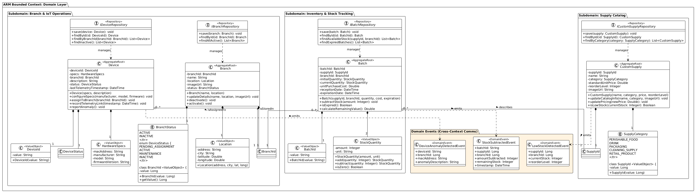

##### 4.2.4.6.2. Bounded Context Database Design Diagram

En esta sección, el equipo presenta el Diagrama de Base de Datos diseñado bajo un enfoque No Relacional (NoSQL), del tipo orientado a documentos, para el Bounded Context de Asset and Resource Management. Este modelo de persistencia ha sido seleccionado para gestionar eficientemente los grandes volúmenes de telemetría IoT y la flexibilidad del catálogo de recursos.

El diseño se fundamenta en principios clave de bases de datos documentales (como MongoDB). Destaca el uso estratégico de la des normalización y el patrón de documentos embebidos (Embedded Documents) para optimizar el rendimiento de las consultas. Por ejemplo, los atributos de ubicación (location) se anidan directamente dentro de la colección de sucursales (branches), y las especificaciones de hardware (specifications) se embeben en los dispositivos (devices), asegurando que "los datos que se consultan juntos, se almacenen juntos".

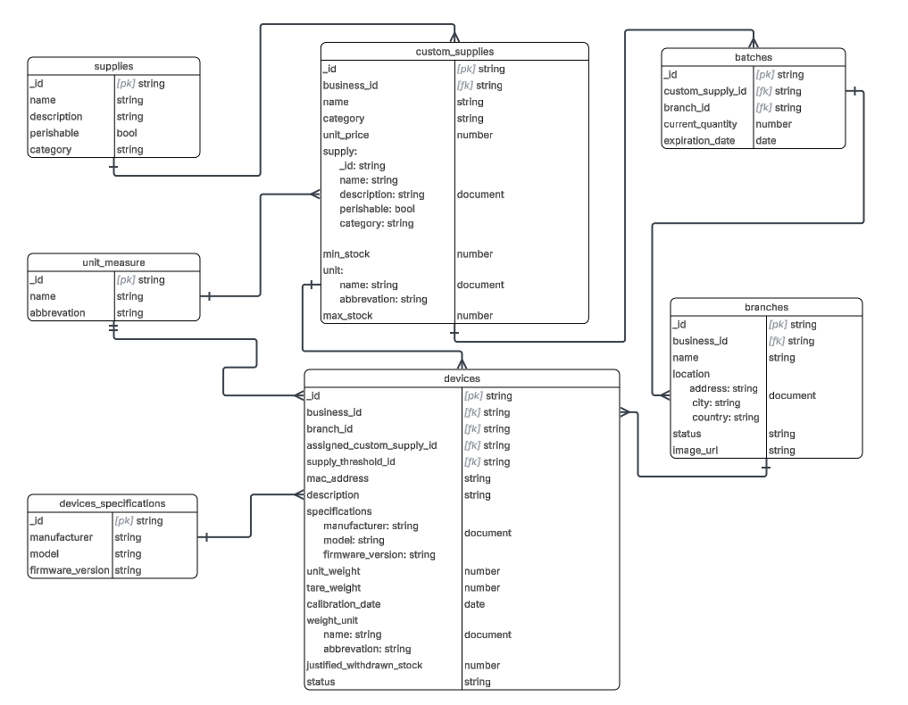

### 4.2.5. Bounded Context: Design and Planning

Este Bounded Context se encarga de la formulación y empaquetamiento comercial de los recursos. Proporciona las herramientas para que los administradores de restaurantes diseñen sus recetas (vinculando insumos y cantidades) y para que los administradores de tiendas retail estructuren kits o combos comerciales destinados a sus clientes.

#### 4.2.5.1. Domain Layer

La capa de dominio representa el núcleo (core) de la aplicación para el Bounded Context de Design and Planning. En esta capa se encapsulan todas las reglas de negocio, invariantes y la lógica fundamental relacionada con la estructuración de recetas gastronómicas y la composición de kits comerciales.

Esta capa está aislada de detalles técnicos o de infraestructura. Se compone de Entidades (Entities), Raíces de Agregación (Aggregate Roots), Objetos de Valor (Value Objects) para garantizar la inmutabilidad de las composiciones, Comandos (Commands), Consultas (Queries) y Eventos de Dominio (Domain Events).

##### Aggregates & Entities

<em>Tabla de Aggregates en el Domain Layer</em>

<table style="width:100%; border-collapse: collapse; border: 1px solid;">
  <thead>
    <tr>
      <th style="padding: 10px; border: 1px solid; text-align: left;">Nombre de Clase</th>
      <th style="padding: 10px; border: 1px solid; text-align: left;">Categoría</th>
      <th style="padding: 10px; border: 1px solid; text-align: left;">Propósito y Reglas de Negocio</th>
    </tr>
  </thead>
  <tbody>
    <tr>
      <td style="padding: 10px; border: 1px solid;"><strong>Recipe</strong></td>
      <td style="padding: 10px; border: 1px solid;">Aggregate Root</td>
      <td style="padding: 10px; border: 1px solid;">Representa una receta gastronómica. Encapsula la lógica para validar que la formulación contenga insumos válidos, cantidades mayores a cero y permite actualizar su información e imagen.</td>
    </tr>
    <tr>
      <td style="padding: 10px; border: 1px solid;"><strong>Kit</strong></td>
      <td style="padding: 10px; border: 1px solid;">Aggregate Root</td>
      <td style="padding: 10px; border: 1px solid;">Representa un combo comercial diseñado por la tienda retail. Contiene la lógica para agrupar productos individuales y establecer un precio de conjunto válido.</td>
    </tr>
  </tbody>
</table>

 

##### Value Objects

<em>Tabla de Value Objects en el Domain Layer</em>

<table style="width:100%; border-collapse: collapse; border: 1px solid;">
  <thead>
    <tr>
      <th style="padding: 10px; border: 1px solid; text-align: left;">Nombre de Clase</th>
      <th style="padding: 10px; border: 1px solid; text-align: left;">Categoría</th>
      <th style="padding: 10px; border: 1px solid; text-align: left;">Propósito y Reglas de Negocio</th>
    </tr>
  </thead>
  <tbody>
    <tr>
      <td style="padding: 10px; border: 1px solid;"><strong>SupplyRequirement</strong></td>
      <td style="padding: 10px; border: 1px solid;">Value Object</td>
      <td style="padding: 10px; border: 1px solid;">Encapsula la relación entre un insumo (SupplyId) y la cantidad requerida para una receta o kit, garantizando que la cantidad siempre sea positiva.</td>
    </tr>
    <tr>
      <td style="padding: 10px; border: 1px solid;"><strong>Category</strong></td>
      <td style="padding: 10px; border: 1px solid;">Value Object</td>
      <td style="padding: 10px; border: 1px solid;">Clasificación fuertemente tipada para las recetas y kits, evitando errores de tipografía en agrupaciones.</td>
    </tr>
    <tr>
      <td style="padding: 10px; border: 1px solid;"><strong>RecipeId, KitId</strong></td>
      <td style="padding: 10px; border: 1px solid;">Value Object</td>
      <td style="padding: 10px; border: 1px solid;">Identificadores inmutables para garantizar el tipado estricto en las relaciones y búsquedas.</td>
    </tr>
  </tbody>
</table>

 

##### Commands

<em>Tabla de Commands en el Domain Layer</em>

<table style="width:100%; border-collapse: collapse; border: 1px solid;">
  <thead>
    <tr>
      <th style="padding: 10px; border: 1px solid; text-align: left;">Nombre del Command</th>
      <th style="padding: 10px; border: 1px solid; text-align: left;">Propósito</th>
    </tr>
  </thead>
  <tbody>
    <tr>
      <td style="padding: 10px; border: 1px solid;"><strong>RegisterRecipeCommand</strong></td>
      <td style="padding: 10px; border: 1px solid;">Encapsula la intención de registrar una nueva receta junto con su lista de insumos requeridos.</td>
    </tr>
    <tr>
      <td style="padding: 10px; border: 1px solid;"><strong>RegisterKitCommand</strong></td>
      <td style="padding: 10px; border: 1px solid;">Provee los datos necesarios para agrupar productos individuales en un nuevo kit comercial.</td>
    </tr>
    <tr>
      <td style="padding: 10px; border: 1px solid;"><strong>EditRecipeCommand</strong></td>
      <td style="padding: 10px; border: 1px solid;">Representa la acción de modificar la información base o las cantidades de los insumos de una receta existente.</td>
    </tr>
    <tr>
      <td style="padding: 10px; border: 1px solid;"><strong>DeleteRecipeCommand</strong></td>
      <td style="padding: 10px; border: 1px solid;">Solicita la eliminación lógica o desactivación de una receta del catálogo.</td>
    </tr>
  </tbody>
</table>

 

##### Queries

<em>Tabla de Queries en el Domain Layer</em>

<table style="width:100%; border-collapse: collapse; border: 1px solid;">
  <thead>
    <tr>
      <th style="padding: 10px; border: 1px solid; text-align: left;">Nombre del Query</th>
      <th style="padding: 10px; border: 1px solid; text-align: left;">Propósito</th>
    </tr>
  </thead>
  <tbody>
    <tr>
      <td style="padding: 10px; border: 1px solid;"><strong>GetRecipeByIdQuery</strong></td>
      <td style="padding: 10px; border: 1px solid;">Solicita la obtención detallada de una receta, incluyendo su formulación de insumos.</td>
    </tr>
    <tr>
      <td style="padding: 10px; border: 1px solid;"><strong>GetKitByIdQuery</strong></td>
      <td style="padding: 10px; border: 1px solid;">Consulta la composición completa y el precio combinado de un kit comercial.</td>
    </tr>
  </tbody>
</table>

 

##### Domain Events

<em>Tabla de Domain Events en el Domain Layer</em>

<table style="width:100%; border-collapse: collapse; border: 1px solid;">
  <thead>
    <tr>
      <th style="padding: 10px; border: 1px solid; text-align: left;">Nombre del Evento</th>
      <th style="padding: 10px; border: 1px solid; text-align: left;">Propósito</th>
    </tr>
  </thead>
  <tbody>
    <tr>
      <td style="padding: 10px; border: 1px solid;"><strong>RecipeDeletedEvent</strong></td>
      <td style="padding: 10px; border: 1px solid;">Evento emitido en el dominio cuando una receta es eliminada, útil para desencadenar notificaciones o auditorías.</td>
    </tr>
    <tr>
      <td style="padding: 10px; border: 1px solid;"><strong>KitRegisteredEvent</strong></td>
      <td style="padding: 10px; border: 1px solid;">Confirma la creación exitosa de un combo comercial en el sistema.</td>
    </tr>
  </tbody>
</table>

#### 4.2.5.2. Interface Layer

En la capa de interfaz se exponen los endpoints HTTP RESTful necesarios para interactuar con las funcionalidades de diseño de servicios. A través de controladores especializados y la capa anti-corrupción (ACL), esta capa actúa como punto de entrada para que las aplicaciones cliente envíen comandos de creación de recetas, y para que otros Bounded Contexts interactúen de forma segura.

##### RecipeController

<em>Tabla de RecipeController en el Interface Layer</em>

<table style="width:100%; border-collapse: collapse; border: 1px solid;">
  <thead>
    <tr>
      <th style="padding: 10px; border: 1px solid; text-align: left;">Propiedad</th>
      <th style="padding: 10px; border: 1px solid; text-align: left;">Valor</th>
    </tr>
  </thead>
  <tbody>
    <tr>
      <td style="padding: 10px; border: 1px solid;"><strong>Nombre</strong></td>
      <td style="padding: 10px; border: 1px solid;">RecipeController</td>
    </tr>
    <tr>
      <td style="padding: 10px; border: 1px solid;"><strong>Categoría</strong></td>
      <td style="padding: 10px; border: 1px solid;">Controller</td>
    </tr>
    <tr>
      <td style="padding: 10px; border: 1px solid;"><strong>Propósito</strong></td>
      <td style="padding: 10px; border: 1px solid;">Encargado de exponer endpoints para la gestión del catálogo de recetas y su formulación por parte del administrador de restaurante.</td>
    </tr>
    <tr>
      <td style="padding: 10px; border: 1px solid;"><strong>Ruta</strong></td>
      <td style="padding: 10px; border: 1px solid;">/api/v1/recipes</td>
    </tr>
  </tbody>
</table>

 

<em>Tabla de métodos de RecipeController en el Interface Layer</em>

<table style="width:100%; border-collapse: collapse; border: 1px solid;">
  <thead>
    <tr>
      <th style="padding: 10px; border: 1px solid;">Nombre</th>
      <th style="padding: 10px; border: 1px solid;">Ruta</th>
      <th style="padding: 10px; border: 1px solid;">Acción</th>
      <th style="padding: 10px; border: 1px solid;">Handle (Command/Query)</th>
    </tr>
  </thead>
  <tbody>
    <tr>
      <td style="padding: 10px; border: 1px solid;">Register</td>
      <td style="padding: 10px; border: 1px solid;">/ (POST)</td>
      <td style="padding: 10px; border: 1px solid;">Crea y registra una nueva receta</td>
      <td style="padding: 10px; border: 1px solid;">RegisterRecipeCommand</td>
    </tr>
    <tr>
      <td style="padding: 10px; border: 1px solid;">GetById</td>
      <td style="padding: 10px; border: 1px solid;">/{recipeId} (GET)</td>
      <td style="padding: 10px; border: 1px solid;">Obtiene los detalles de una receta</td>
      <td style="padding: 10px; border: 1px solid;">GetRecipeByIdQuery</td>
    </tr>
    <tr>
      <td style="padding: 10px; border: 1px solid;">Edit</td>
      <td style="padding: 10px; border: 1px solid;">/{recipeId} (PUT)</td>
      <td style="padding: 10px; border: 1px solid;">Modifica la información e insumos</td>
      <td style="padding: 10px; border: 1px solid;">EditRecipeCommand</td>
    </tr>
    <tr>
      <td style="padding: 10px; border: 1px solid;">Delete</td>
      <td style="padding: 10px; border: 1px solid;">/{recipeId} (DELETE)</td>
      <td style="padding: 10px; border: 1px solid;">Elimina lógicamente una receta</td>
      <td style="padding: 10px; border: 1px solid;">DeleteRecipeCommand</td>
    </tr>
  </tbody>
</table>

##### KitController

<em>Tabla de KitController en el Interface Layer</em>

<table style="width:100%; border-collapse: collapse; border: 1px solid;">
  <thead>
    <tr>
      <th style="padding: 10px; border: 1px solid; text-align: left;">Propiedad</th>
      <th style="padding: 10px; border: 1px solid; text-align: left;">Valor</th>
    </tr>
  </thead>
  <tbody>
    <tr>
      <td style="padding: 10px; border: 1px solid;"><strong>Nombre</strong></td>
      <td style="padding: 10px; border: 1px solid;">KitController</td>
    </tr>
    <tr>
      <td style="padding: 10px; border: 1px solid;"><strong>Categoría</strong></td>
      <td style="padding: 10px; border: 1px solid;">Controller</td>
    </tr>
    <tr>
      <td style="padding: 10px; border: 1px solid;"><strong>Propósito</strong></td>
      <td style="padding: 10px; border: 1px solid;">Exponer endpoints para que los administradores de tiendas retail agrupen productos en combos comerciales.</td>
    </tr>
    <tr>
      <td style="padding: 10px; border: 1px solid;"><strong>Ruta</strong></td>
      <td style="padding: 10px; border: 1px solid;">/api/v1/kits</td>
    </tr>
  </tbody>
</table>

 

<em>Tabla de métodos de KitController en el Interface Layer</em>

<table style="width:100%; border-collapse: collapse; border: 1px solid;">
  <thead>
    <tr>
      <th style="padding: 10px; border: 1px solid;">Nombre</th>
      <th style="padding: 10px; border: 1px solid;">Ruta</th>
      <th style="padding: 10px; border: 1px solid;">Acción</th>
      <th style="padding: 10px; border: 1px solid;">Handle (Command/Query)</th>
    </tr>
  </thead>
  <tbody>
    <tr>
      <td style="padding: 10px; border: 1px solid;">Register</td>
      <td style="padding: 10px; border: 1px solid;">/ (POST)</td>
      <td style="padding: 10px; border: 1px solid;">Registra un nuevo kit comercial</td>
      <td style="padding: 10px; border: 1px solid;">RegisterKitCommand</td>
    </tr>
    <tr>
      <td style="padding: 10px; border: 1px solid;">Edit</td>
      <td style="padding: 10px; border: 1px solid;">/{kitId} (PUT)</td>
      <td style="padding: 10px; border: 1px solid;">Edita la composición del kit</td>
      <td style="padding: 10px; border: 1px solid;">EditKitCommand</td>
    </tr>
    <tr>
      <td style="padding: 10px; border: 1px solid;">Delete</td>
      <td style="padding: 10px; border: 1px solid;">/{kitId} (DELETE)</td>
      <td style="padding: 10px; border: 1px solid;">Deshabilita el kit del catálogo</td>
      <td style="padding: 10px; border: 1px solid;">DeleteKitCommand</td>
    </tr>
  </tbody>
</table>

##### Anti-Corruption Layer (ACL) Interfaces

<em>Tabla de Interfaces ACL en el Interface Layer</em>

<table style="width:100%; border-collapse: collapse; border: 1px solid;">
  <thead>
    <tr>
      <th style="padding: 10px; border: 1px solid; text-align: left;">Nombre de Interfaz</th>
      <th style="padding: 10px; border: 1px solid; text-align: left;">Categoría</th>
      <th style="padding: 10px; border: 1px solid; text-align: left;">Propósito</th>
    </tr>
  </thead>
  <tbody>
    <tr>
      <td style="padding: 10px; border: 1px solid;"><strong>IServiceDesignAcl</strong></td>
      <td style="padding: 10px; border: 1px solid;">ACL Interface</td>
      <td style="padding: 10px; border: 1px solid;">Expone métodos estructurados para que otros Bounded Contexts (como Sales Order Management) puedan consultar la composición interna de recetas y kits, aislando los detalles de implementación del catálogo.</td>
    </tr>
  </tbody>
</table>

#### 4.2.5.3. Application Layer

La capa de aplicación de este Bounded Context orquesta los flujos de trabajo dictados por los usuarios al diseñar sus servicios. Aquí residen los Command Handlers y Query Handlers encargados de procesar la creación y edición de catálogos, asegurando que las listas de insumos se estructuren correctamente antes de delegar la persistencia al dominio. También aloja la implementación de la capa anti-corrupción (ACL) que facilita la entrega segura de información de recetas hacia otros módulos.

##### RegisterRecipeCommandHandler

<em>Tabla de RegisterRecipeCommandHandler en el Application Layer</em>

<table style="width:100%; border-collapse: collapse; border: 1px solid;">
  <thead>
    <tr>
      <th style="padding: 10px; border: 1px solid; text-align: left;">Propiedad</th>
      <th style="padding: 10px; border: 1px solid; text-align: left;">Valor</th>
    </tr>
  </thead>
  <tbody>
    <tr>
      <td style="padding: 10px; border: 1px solid;"><strong>Nombre</strong></td>
      <td style="padding: 10px; border: 1px solid;">RegisterRecipeCommandHandler</td>
    </tr>
    <tr>
      <td style="padding: 10px; border: 1px solid;"><strong>Categoría</strong></td>
      <td style="padding: 10px; border: 1px solid;">Command Handler</td>
    </tr>
    <tr>
      <td style="padding: 10px; border: 1px solid;"><strong>Propósito</strong></td>
      <td style="padding: 10px; border: 1px solid;">Validar la lista de insumos, coordinar la subida de imágenes y orquestar la creación de una nueva receta.</td>
    </tr>
    <tr>
      <td style="padding: 10px; border: 1px solid;"><strong>Comando</strong></td>
      <td style="padding: 10px; border: 1px solid;">RegisterRecipeCommand</td>
    </tr>
  </tbody>
</table>

 

##### RegisterKitCommandHandler

<em>Tabla de RegisterKitCommandHandler en el Application Layer</em>

<table style="width:100%; border-collapse: collapse; border: 1px solid;">
  <thead>
    <tr>
      <th style="padding: 10px; border: 1px solid; text-align: left;">Propiedad</th>
      <th style="padding: 10px; border: 1px solid; text-align: left;">Valor</th>
    </tr>
  </thead>
  <tbody>
    <tr>
      <td style="padding: 10px; border: 1px solid;"><strong>Nombre</strong></td>
      <td style="padding: 10px; border: 1px solid;">RegisterKitCommandHandler</td>
    </tr>
    <tr>
      <td style="padding: 10px; border: 1px solid;"><strong>Categoría</strong></td>
      <td style="padding: 10px; border: 1px solid;">Command Handler</td>
    </tr>
    <tr>
      <td style="padding: 10px; border: 1px solid;"><strong>Propósito</strong></td>
      <td style="padding: 10px; border: 1px solid;">Procesar la agrupación de productos solicitada por el administrador retail y registrar el nuevo combo en el sistema.</td>
    </tr>
    <tr>
      <td style="padding: 10px; border: 1px solid;"><strong>Comando</strong></td>
      <td style="padding: 10px; border: 1px solid;">RegisterKitCommand</td>
    </tr>
  </tbody>
</table>

 

##### RecipeDeletedEventHandler

<em>Tabla de RecipeDeletedEventHandler en el Application Layer</em>

<table style="width:100%; border-collapse: collapse; border: 1px solid;">
  <thead>
    <tr>
      <th style="padding: 10px; border: 1px solid; text-align: left;">Propiedad</th>
      <th style="padding: 10px; border: 1px solid; text-align: left;">Valor</th>
    </tr>
  </thead>
  <tbody>
    <tr>
      <td style="padding: 10px; border: 1px solid;"><strong>Nombre</strong></td>
      <td style="padding: 10px; border: 1px solid;">RecipeDeletedEventHandler</td>
    </tr>
    <tr>
      <td style="padding: 10px; border: 1px solid;"><strong>Categoría</strong></td>
      <td style="padding: 10px; border: 1px solid;">Event Handler</td>
    </tr>
    <tr>
      <td style="padding: 10px; border: 1px solid;"><strong>Propósito</strong></td>
      <td style="padding: 10px; border: 1px solid;">Escuchar el evento de eliminación de una receta para coordinar el envío automático de un correo electrónico de alerta al administrador.</td>
    </tr>
    <tr>
      <td style="padding: 10px; border: 1px solid;"><strong>Evento</strong></td>
      <td style="padding: 10px; border: 1px solid;">RecipeDeletedEvent</td>
    </tr>
  </tbody>
</table>

 

##### Anti-Corruption Layer (ACL) Implementation

<em>Tabla de Implementación ACL en el Application Layer</em>

<table style="width:100%; border-collapse: collapse; border: 1px solid;">
  <thead>
    <tr>
      <th style="padding: 10px; border: 1px solid; text-align: left;">Propiedad</th>
      <th style="padding: 10px; border: 1px solid; text-align: left;">Valor</th>
    </tr>
  </thead>
  <tbody>
    <tr>
      <td style="padding: 10px; border: 1px solid;"><strong>Nombre</strong></td>
      <td style="padding: 10px; border: 1px solid;">ServiceDesignAcl</td>
    </tr>
    <tr>
      <td style="padding: 10px; border: 1px solid;"><strong>Categoría</strong></td>
      <td style="padding: 10px; border: 1px solid;">ACL Implementation</td>
    </tr>
    <tr>
      <td style="padding: 10px; border: 1px solid;"><strong>Propósito</strong></td>
      <td style="padding: 10px; border: 1px solid;">Implementar la interfaz IServiceDesignAcl, orquestando las consultas para obtener de manera segura la lista de insumos que componen una receta específica (utilizado por Ventas para solicitar la deducción de inventario).</td>
    </tr>
  </tbody>
</table>

#### 4.2.5.4. Infrastructure Layer

La capa de infraestructura de Service Design and Planning materializa los repositorios necesarios para almacenar los modelos de recetas y kits en la base de datos. Además, es el punto donde se implementan los adaptadores para servicios de terceros que son vitales en este contexto, como el servicio de notificaciones transaccionales a los administradores.

##### RecipeRepository

<em>Tabla de RecipeRepository en el Infrastructure Layer</em>

<table style="width:100%; border-collapse: collapse; border: 1px solid;">
  <thead>
    <tr>
      <th style="padding: 10px; border: 1px solid; text-align: left;">Propiedad</th>
      <th style="padding: 10px; border: 1px solid; text-align: left;">Valor</th>
    </tr>
  </thead>
  <tbody>
    <tr>
      <td style="padding: 10px; border: 1px solid;"><strong>Nombre</strong></td>
      <td style="padding: 10px; border: 1px solid;">RecipeRepository</td>
    </tr>
    <tr>
      <td style="padding: 10px; border: 1px solid;"><strong>Categoría</strong></td>
      <td style="padding: 10px; border: 1px solid;">Repositorio</td>
    </tr>
    <tr>
      <td style="padding: 10px; border: 1px solid;"><strong>Propósito</strong></td>
      <td style="padding: 10px; border: 1px solid;">Implementar las consultas a la base de datos para guardar, editar y buscar recetas gastronómicas.</td>
    </tr>
    <tr>
      <td style="padding: 10px; border: 1px solid;"><strong>Interfaz</strong></td>
      <td style="padding: 10px; border: 1px solid;">IRecipeRepository</td>
    </tr>
  </tbody>
</table>

 

##### KitRepository

<em>Tabla de KitRepository en el Infrastructure Layer</em>

<table style="width:100%; border-collapse: collapse; border: 1px solid;">
  <thead>
    <tr>
      <th style="padding: 10px; border: 1px solid; text-align: left;">Propiedad</th>
      <th style="padding: 10px; border: 1px solid; text-align: left;">Valor</th>
    </tr>
  </thead>
  <tbody>
    <tr>
      <td style="padding: 10px; border: 1px solid;"><strong>Nombre</strong></td>
      <td style="padding: 10px; border: 1px solid;">KitRepository</td>
    </tr>
    <tr>
      <td style="padding: 10px; border: 1px solid;"><strong>Categoría</strong></td>
      <td style="padding: 10px; border: 1px solid;">Repositorio</td>
    </tr>
    <tr>
      <td style="padding: 10px; border: 1px solid;"><strong>Propósito</strong></td>
      <td style="padding: 10px; border: 1px solid;">Gestionar la persistencia de los combos comerciales diseñados por los administradores de tiendas retail.</td>
    </tr>
    <tr>
      <td style="padding: 10px; border: 1px solid;"><strong>Interfaz</strong></td>
      <td style="padding: 10px; border: 1px solid;">IKitRepository</td>
    </tr>
  </tbody>
</table>

 

##### External Services Integrations

<table style="width:100%; border-collapse: collapse; border: 1px solid;">
  <thead>
    <tr>
      <th style="padding: 10px; border: 1px solid; text-align: left;">Propiedad</th>
      <th style="padding: 10px; border: 1px solid; text-align: left;">Valor</th>
    </tr>
  </thead>
  <tbody>
    <tr>
      <td style="padding: 10px; border: 1px solid;"><strong>Nombre</strong></td>
      <td style="padding: 10px; border: 1px solid;">EmailNotificationAdapter</td>
    </tr>
    <tr>
      <td style="padding: 10px; border: 1px solid;"><strong>Categoría</strong></td>
      <td style="padding: 10px; border: 1px solid;">External Service Wrapper</td>
    </tr>
    <tr>
      <td style="padding: 10px; border: 1px solid;"><strong>Propósito</strong></td>
      <td style="padding: 10px; border: 1px solid;">Conectar con un proveedor SMTP (ej. SendGrid o AWS SES) para enviar los correos de alerta cuando se elimina una receta o kit.</td>
    </tr>
  </tbody>
</table>

#### 4.2.5.5. Bounded Context Software Architecture Component Level Diagrams

En esta sección se presentan los diagramas de componentes del bounded context Service Design and Planning, mostrando su comportamiento y responsabilidades desde tres perspectivas: aplicación web, aplicación móvil y backend. Cada diagrama refleja cómo este bounded context interactúa con otros contextos o servicios externos únicamente cuando dichas interacciones son necesarias para la gestión de recetas gastronómicas y la configuración de kits comerciales.

##### Web Application Component Diagram

El componente de la aplicación web cliente se ejecuta en el navegador del usuario y presenta las interfaces gráficas (UI) para la manipulación de los catálogos en pantallas de escritorio o laptops.

<em>Tabla de Componentes de la Web Application para Service Design and Planning</em>

<table style="width:100%; border-collapse: collapse; border: 1px solid;">
  <thead>
    <tr>
      <th style="padding: 10px; border: 1px solid; text-align: left;">Componente</th>
      <th style="padding: 10px; border: 1px solid; text-align: left;">Responsabilidad</th>
      <th style="padding: 10px; border: 1px solid; text-align: left;">Tecnología</th>
    </tr>
  </thead>
  <tbody>
    <tr>
      <td style="padding: 10px; border: 1px solid;"><strong>webServiceDesign</strong></td>
      <td style="padding: 10px; border: 1px solid;">Provee la interfaz de usuario para la configuración de recetas para restaurantes y ensamblaje de kits para tiendas retail. Capta las interacciones del administrador para enviarlas al servidor.</td>
      <td style="padding: 10px; border: 1px solid;">TypeScript, Angular</td>
    </tr>
  </tbody>
</table>

 

<em>Tabla de Interacciones del Componente webServiceDesign</em>

<table style="width:100%; border-collapse: collapse; border: 1px solid;">
  <thead>
    <tr>
      <th style="padding: 10px; border: 1px solid; text-align: left;">Interactúa con</th>
      <th style="padding: 10px; border: 1px solid; text-align: left;">Tipo de Relación</th>
      <th style="padding: 10px; border: 1px solid; text-align: left;">Descripción de la Interacción</th>
    </tr>
  </thead>
  <tbody>
    <tr>
      <td style="padding: 10px; border: 1px solid;"><strong>backendApplication</strong> (API)</td>
      <td style="padding: 10px; border: 1px solid;">Petición HTTP / REST</td>
      <td style="padding: 10px; border: 1px solid;">Realiza peticiones JSON/HTTPS para recuperar y actualizar las formulaciones de recetas y kits en el servidor central.</td>
    </tr>
    <tr>
      <td style="padding: 10px; border: 1px solid;"><strong>webShared</strong></td>
      <td style="padding: 10px; border: 1px solid;">Uso de Librería Interna</td>
      <td style="padding: 10px; border: 1px solid;">Extiende componentes base de UI, utilidades de red y configuraciones de endpoints compartidas por la aplicación Angular.</td>
    </tr>
  </tbody>
</table>

 

##### Backend Application Component Diagram

El componente principal del lado del servidor maneja la lógica de negocio central, la persistencia en base de datos y la integración con servicios externos para la validación de insumos y estructuración comercial.

<em>Tabla de Componentes de la Backend Application para Service Design and Planning</em>

<table style="width:100%; border-collapse: collapse; border: 1px solid;">
  <thead>
    <tr>
      <th style="padding: 10px; border: 1px solid; text-align: left;">Componente</th>
      <th style="padding: 10px; border: 1px solid; text-align: left;">Responsabilidad</th>
      <th style="padding: 10px; border: 1px solid; text-align: left;">Tecnología</th>
    </tr>
  </thead>
  <tbody>
    <tr>
      <td style="padding: 10px; border: 1px solid;"><strong>apiServiceDesign</strong></td>
      <td style="padding: 10px; border: 1px solid;">Maneja la gestión de recetas para restaurantes y la gestión de kits para tiendas retail. Centraliza la lógica de validación de insumos y estructuración comercial.</td>
      <td style="padding: 10px; border: 1px solid;">Java, Spring Boot</td>
    </tr>
  </tbody>
</table>

 

<em>Tabla de Interacciones del Componente apiServiceDesign</em>

<table style="width:100%; border-collapse: collapse; border: 1px solid;">
  <thead>
    <tr>
      <th style="padding: 10px; border: 1px solid; text-align: left;">Interactúa con</th>
      <th style="padding: 10px; border: 1px solid; text-align: left;">Tipo de Relación</th>
      <th style="padding: 10px; border: 1px solid; text-align: left;">Descripción de la Interacción</th>
    </tr>
  </thead>
  <tbody>
    <tr>
      <td style="padding: 10px; border: 1px solid;"><strong>databaseNoSql</strong> (MongoDB)</td>
      <td style="padding: 10px; border: 1px solid;">Escritura / Lectura</td>
      <td style="padding: 10px; border: 1px solid;">Almacena de forma persistente la composición de los kits y las recetas diseñadas por los administradores.</td>
    </tr>
    <tr>
      <td style="padding: 10px; border: 1px solid;"><strong>apiAssetAndResource</strong></td>
      <td style="padding: 10px; border: 1px solid;">Dependencia Interna</td>
      <td style="padding: 10px; border: 1px solid;">Actualiza el stock de los insumos asociados cuando una receta o kit es vendido, garantizando la consistencia del inventario.</td>
    </tr>
    <tr>
      <td style="padding: 10px; border: 1px solid;"><strong>apiIam</strong></td>
      <td style="padding: 10px; border: 1px solid;">Dependencia Interna</td>
      <td style="padding: 10px; border: 1px solid;">Valida los tokens JWT para autorizar la creación, edición o eliminación de elementos del catálogo.</td>
    </tr>
    <tr>
      <td style="padding: 10px; border: 1px solid;"><strong>apiShared</strong></td>
      <td style="padding: 10px; border: 1px solid;">Integración Interna</td>
      <td style="padding: 10px; border: 1px solid;">Utiliza utilidades compartidas para integrar la carga y recuperación de imágenes multimedia asociadas a los combos o platos mediante Cloudinary.</td>
    </tr>
    <tr>
      <td style="padding: 10px; border: 1px solid;"><strong>apiSalesManagement</strong></td>
      <td style="padding: 10px; border: 1px solid;">Solicitud Entrante</td>
      <td style="padding: 10px; border: 1px solid;">Recibe peticiones del módulo de ventas para contabilizar las cantidades vendidas de recetas o kits registrados a través del ACL.</td>
    </tr>
  </tbody>
</table>

#### 4.2.5.6. Bounded Context Software Architecture Code Level Diagrams

##### 4.2.5.6.1. Bounded Context Domain Layer Class Diagrams

En esta sección se presenta el Diagrama de Clases UML correspondiente a la capa de dominio del Bounded Context de Service Design and Planning. El diseño visual refleja la separación de responsabilidades entre la gestión de recetas para restaurantes y la configuración de kits comerciales para tiendas retail, compartiendo conceptos de valor inmutables.

El modelo destaca por ser un Modelo de Dominio Rico. Las entidades raíz (Recipe y Kit) no son simples contenedores de datos, sino que exponen métodos con lógica de negocio clara (como updateFormulation, updateComposition o updatePricing) que validan las reglas internas antes de cualquier cambio de estado. Además, se evidencia la encapsulación mediante el uso de modificadores de acceso restrictivos (- para atributos) y el uso extensivo de Value Objects (como SupplyRequirement y ServiceCategory) para garantizar la integridad de las agrupaciones desde el momento de su instanciación.

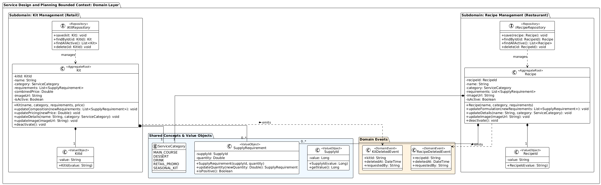

##### 4.2.5.6.2. Bounded Context Database Design Diagram

En esta sección, el equipo presenta el Diagrama de Base de Datos diseñado para el Bounded Context de Service Design and Planning. Este diagrama detalla el esquema que permite la persistencia de las entidades core: las recetas de los restaurantes y los kits comerciales de las tiendas retail.

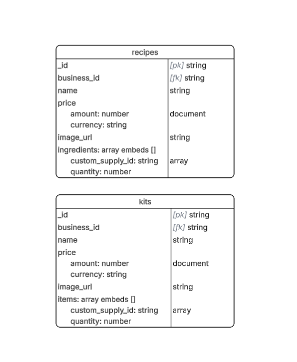

### 4.2.6. Bounded Context: Tracking

### 4.2.6.1. Domain Layer

La capa de dominio representa el núcleo de la aplicación para el Bounded Context de **Tracking**. En esta capa se encapsulan las reglas de negocio relacionadas con el monitoreo de telemetría IoT, estimación de stock físico, detección de anomalías, validación de umbrales mínimos y generación de tareas de conciliación.

Está compuesta por Aggregates, Value Objects, Domain Events y abstracciones de repositorios, permitiendo representar el comportamiento central del monitoreo operativo del sistema.

#### Aggregates & Entities

| Nombre de Clase    | Categoría     | Propósito y Reglas de Negocio                                                                                                                                                                      |
| ------------------ | -------------- | --------------------------------------------------------------------------------------------------------------------------------------------------------------------------------------------------- |
| TelemetryReading   | Aggregate Root | Representa una lectura recibida desde un dispositivo IoT. Encapsula datos como peso bruto, peso estable y cantidad estimada. Permite calcular estimaciones físicas y detectar variaciones de peso. |
| StockRecord        | Aggregate Root | Representa el registro consolidado del stock físico estimado. Calcula diferencias entre cantidades previas y nuevas, identifica anomalías y actualiza la estimación física del inventario.      |
| SupplyThreshold    | Aggregate Root | Representa los umbrales configurados para un insumo en una sucursal. Valida si el stock actual está en estado normal, advertencia o crítico.                                                      |
| DeviceHealthReport | Aggregate Root | Representa el estado operativo de un dispositivo IoT. Registra problemas como batería baja, señal débil, retraso de telemetría o mal funcionamiento.                                            |
| ReconciliationTask | Aggregate Root | Representa una tarea generada cuando existe una discrepancia entre el stock físico estimado y el stock digital. Permite gestionar su estado hasta su resolución.                                  |

#### Value Objects

| Nombre de Clase                                         | Categoría   | Propósito y Reglas de Negocio                                                                                      |
| ------------------------------------------------------- | ------------ | ------------------------------------------------------------------------------------------------------------------- |
| StockRecordId                                           | Value Object | Identificador único del registro de stock físico.                                                                 |
| TelemetryReadingId                                      | Value Object | Identificador único de una lectura de telemetría.                                                                 |
| SupplyThresholdId                                       | Value Object | Identificador único de la configuración de umbral de un insumo.                                                   |
| DeviceHealthReportId                                    | Value Object | Identificador único de un reporte de salud del dispositivo.                                                        |
| ReconciliationTaskId                                    | Value Object | Identificador único de una tarea de conciliación.                                                                 |
| StockQuantity                                           | Value Object | Encapsula cantidades de stock y operaciones de comparación o resta, evitando cantidades inconsistentes.            |
| Weight                                                  | Value Object | Representa valores de peso capturados por dispositivos IoT, permitiendo calcular diferencias y validar estabilidad. |
| Percentage                                              | Value Object | Representa valores porcentuales como batería o intensidad de señal del dispositivo.                               |
| BusinessId, BranchId, DeviceId, CustomSupplyId, BatchId | Value Object | Identificadores fuertemente tipados para evitar confusión entre entidades de distintos contextos.                  |

#### Domain Events

| Nombre de Evento               | Categoría   | Propósito                                                                                               |
| ------------------------------ | ------------ | -------------------------------------------------------------------------------------------------------- |
| TelemetryReceivedEvent         | Domain Event | Se emite cuando el sistema recibe una lectura válida desde un dispositivo IoT.                          |
| PhysicalStockEstimatedEvent    | Domain Event | Se emite cuando se calcula una nueva estimación de stock físico.                                       |
| StockAnomalyDetectedEvent      | Domain Event | Se emite cuando se detecta una diferencia relevante entre el stock físico estimado y el stock esperado. |
| LowStockDetectedEvent          | Domain Event | Se emite cuando el stock físico estimado cae por debajo del umbral configurado.                         |
| DeviceMalfunctionDetectedEvent | Domain Event | Se emite cuando se identifica un problema operativo en un dispositivo IoT.                               |
| ReconciliationCompletedEvent   | Domain Event | Se emite cuando una tarea de conciliación es completada.                                                |

### 4.2.6.2. Interface Layer

En la capa de interfaz del Bounded Context de **Tracking** se exponen los endpoints RESTful necesarios para consultar y administrar la información generada por el monitoreo operativo. Esta capa funciona como punto de entrada para la Web App de administración, permitiendo visualizar lecturas de telemetría, stock físico estimado, alertas, reportes de salud de dispositivos y tareas de conciliación.

#### TelemetryController

| Propiedad  | Valor                                                                                              |
| ---------- | -------------------------------------------------------------------------------------------------- |
| Nombre     | TelemetryController                                                                                |
| Categoría | Controller                                                                                         |
| Propósito | Exponer endpoints para recibir y consultar lecturas de telemetría generadas por dispositivos IoT. |
| Ruta       | /api/v1/monitoring/telemetry                                                                       |

| Nombre            | Ruta                               | Acción                                                   | Handle                            |
| ----------------- | ---------------------------------- | --------------------------------------------------------- | --------------------------------- |
| RegisterReading   | /readings (POST)                   | Registra una nueva lectura de telemetría.                | RegisterTelemetryReadingCommand   |
| GetByDevice       | /devices/{deviceId}/readings (GET) | Consulta lecturas asociadas a un dispositivo.             | GetTelemetryReadingsByDeviceQuery |
| GetLatestByDevice | /devices/{deviceId}/latest (GET)   | Obtiene la última lectura registrada por un dispositivo. | GetLatestTelemetryByDeviceQuery   |

#### StockMonitoringController

| Propiedad  | Valor                                                                             |
| ---------- | --------------------------------------------------------------------------------- |
| Nombre     | StockMonitoringController                                                         |
| Categoría | Controller                                                                        |
| Propósito | Consultar el stock físico estimado y sus variaciones detectadas por telemetría. |
| Ruta       | /api/v1/monitoring/stock-records                                                  |

| Nombre                    | Ruta                                                        | Acción                                                           | Handle                            |
| ------------------------- | ----------------------------------------------------------- | ----------------------------------------------------------------- | --------------------------------- |
| GetStockRecordsByBranch   | /branches/{branchId} (GET)                                  | Consulta registros de stock físico por sucursal.                 | GetStockRecordsByBranchQuery      |
| GetLatestStockBySupply    | /branches/{branchId}/supplies/{customSupplyId}/latest (GET) | Obtiene la última estimación de stock físico de un insumo.     | GetLatestStockRecordBySupplyQuery |
| RecomputePhysicalEstimate | /{stockRecordId}/recompute (POST)                           | Recalcula la estimación física a partir de una lectura válida. | RecomputePhysicalStockCommand     |

#### SupplyThresholdController

| Propiedad  | Valor                                                                        |
| ---------- | ---------------------------------------------------------------------------- |
| Nombre     | SupplyThresholdController                                                    |
| Categoría | Controller                                                                   |
| Propósito | Gestionar los umbrales mínimos y de advertencia para el monitoreo de stock. |
| Ruta       | /api/v1/monitoring/supply-thresholds                                         |

| Nombre            | Ruta                                                 | Acción                                           | Handle                          |
| ----------------- | ---------------------------------------------------- | ------------------------------------------------- | ------------------------------- |
| RegisterThreshold | / (POST)                                             | Registra umbrales para un insumo en una sucursal. | RegisterSupplyThresholdCommand  |
| UpdateThreshold   | /{thresholdId} (PUT)                                 | Actualiza los valores mínimo y de advertencia.   | UpdateSupplyThresholdCommand    |
| GetBySupply       | /branches/{branchId}/supplies/{customSupplyId} (GET) | Consulta el umbral configurado para un insumo.    | GetSupplyThresholdBySupplyQuery |

#### DeviceHealthController

| Propiedad  | Valor                                                                    |
| ---------- | ------------------------------------------------------------------------ |
| Nombre     | DeviceHealthController                                                   |
| Categoría | Controller                                                               |
| Propósito | Consultar y administrar reportes de salud operativa de dispositivos IoT. |
| Ruta       | /api/v1/monitoring/device-health                                         |

| Nombre               | Ruta                                | Acción                                     | Handle                                |
| -------------------- | ----------------------------------- | ------------------------------------------- | ------------------------------------- |
| GetReportsByDevice   | /devices/{deviceId}/reports (GET)   | Consulta reportes de salud por dispositivo. | GetDeviceHealthReportsByDeviceQuery   |
| GetUnresolvedReports | /reports/unresolved (GET)           | Lista reportes pendientes de atención.     | GetUnresolvedDeviceHealthReportsQuery |
| ResolveReport        | /reports/{reportId}/resolve (PATCH) | Marca un reporte como resuelto.             | ResolveDeviceHealthReportCommand      |

#### ReconciliationTaskController

| Propiedad  | Valor                                                                                        |
| ---------- | -------------------------------------------------------------------------------------------- |
| Nombre     | ReconciliationTaskController                                                                 |
| Categoría | Controller                                                                                   |
| Propósito | Gestionar tareas de conciliación generadas por discrepancias entre stock físico y digital. |
| Ruta       | /api/v1/monitoring/reconciliation-tasks                                                      |

| Nombre             | Ruta                               | Acción                                                   | Handle                             |
| ------------------ | ---------------------------------- | --------------------------------------------------------- | ---------------------------------- |
| GetPendingByBranch | /branches/{branchId}/pending (GET) | Consulta tareas de conciliación pendientes por sucursal. | GetPendingReconciliationTasksQuery |
| CompleteTask       | /{taskId}/complete (PATCH)         | Marca una tarea de conciliación como completada.         | CompleteReconciliationTaskCommand  |
| CancelTask         | /{taskId}/cancel (PATCH)           | Cancela una tarea de conciliación.                       | CancelReconciliationTaskCommand    |

### 4.2.6.3. Application Layer

La capa de aplicación del Bounded Context de **Tracking** coordina los flujos de negocio relacionados con el procesamiento de telemetría, estimación de stock físico, validación de umbrales, detección de anomalías y generación de tareas de conciliación. En esta capa se ubican Command Handlers, Query Handlers y Event Handlers que orquestan el uso de los aggregates del dominio y delegan la persistencia a los repositorios.

#### Command Handlers

| Nombre                                   | Categoría      | Propósito                                                                                | Comando                           |
| ---------------------------------------- | --------------- | ----------------------------------------------------------------------------------------- | --------------------------------- |
| RegisterTelemetryReadingCommandHandler   | Command Handler | Orquesta el registro de una lectura de telemetría recibida desde un dispositivo IoT.     | RegisterTelemetryReadingCommand   |
| RecomputePhysicalStockCommandHandler     | Command Handler | Recalcula la cantidad física estimada de un insumo a partir del peso estable registrado. | RecomputePhysicalStockCommand     |
| RegisterSupplyThresholdCommandHandler    | Command Handler | Registra los umbrales mínimo y de advertencia para un insumo en una sucursal.            | RegisterSupplyThresholdCommand    |
| UpdateSupplyThresholdCommandHandler      | Command Handler | Actualiza la configuración de umbrales de monitoreo.                                     | UpdateSupplyThresholdCommand      |
| ResolveDeviceHealthReportCommandHandler  | Command Handler | Marca un reporte de salud de dispositivo como resuelto.                                   | ResolveDeviceHealthReportCommand  |
| CompleteReconciliationTaskCommandHandler | Command Handler | Completa una tarea de conciliación luego de corregir o validar la diferencia de stock.   | CompleteReconciliationTaskCommand |
| CancelReconciliationTaskCommandHandler   | Command Handler | Cancela una tarea de conciliación cuando ya no requiere atención.                       | CancelReconciliationTaskCommand   |

#### Query Handlers

| Nombre                                       | Categoría    | Propósito                                                            | Query                                 |
| -------------------------------------------- | ------------- | --------------------------------------------------------------------- | ------------------------------------- |
| GetTelemetryReadingsByDeviceQueryHandler     | Query Handler | Consulta las lecturas registradas por un dispositivo específico.     | GetTelemetryReadingsByDeviceQuery     |
| GetLatestTelemetryByDeviceQueryHandler       | Query Handler | Obtiene la lectura más reciente generada por un dispositivo IoT.     | GetLatestTelemetryByDeviceQuery       |
| GetStockRecordsByBranchQueryHandler          | Query Handler | Lista los registros de stock físico estimado por sucursal.           | GetStockRecordsByBranchQuery          |
| GetLatestStockRecordBySupplyQueryHandler     | Query Handler | Consulta la última estimación física de un insumo en una sucursal. | GetLatestStockRecordBySupplyQuery     |
| GetSupplyThresholdBySupplyQueryHandler       | Query Handler | Obtiene los umbrales configurados para un insumo específico.         | GetSupplyThresholdBySupplyQuery       |
| GetDeviceHealthReportsByDeviceQueryHandler   | Query Handler | Consulta el historial de reportes de salud de un dispositivo.         | GetDeviceHealthReportsByDeviceQuery   |
| GetUnresolvedDeviceHealthReportsQueryHandler | Query Handler | Lista los reportes de salud pendientes de resolución.                | GetUnresolvedDeviceHealthReportsQuery |
| GetPendingReconciliationTasksQueryHandler    | Query Handler | Consulta tareas de conciliación pendientes por sucursal.             | GetPendingReconciliationTasksQuery    |

#### Event Handlers

| Nombre                                | Categoría    | Propósito                                                                                          | Evento                         |
| ------------------------------------- | ------------- | --------------------------------------------------------------------------------------------------- | ------------------------------ |
| TelemetryReceivedEventHandler         | Event Handler | Procesa una lectura de telemetría recibida y genera una estimación de stock físico.              | TelemetryReceivedEvent         |
| PhysicalStockEstimatedEventHandler    | Event Handler | Registra el nuevo estado físico del stock y valida si existe una diferencia significativa.         | PhysicalStockEstimatedEvent    |
| StockAnomalyDetectedEventHandler      | Event Handler | Genera una tarea de conciliación cuando se detecta una discrepancia de stock.                      | StockAnomalyDetectedEvent      |
| LowStockDetectedEventHandler          | Event Handler | Gestiona la alerta de bajo stock cuando el stock estimado cae por debajo del umbral.                | LowStockDetectedEvent          |
| DeviceMalfunctionDetectedEventHandler | Event Handler | Registra un reporte de salud del dispositivo cuando se detecta una falla o comportamiento anómalo. | DeviceMalfunctionDetectedEvent |
| ReconciliationCompletedEventHandler   | Event Handler | Actualiza el estado operativo luego de resolver una discrepancia de stock.                          | ReconciliationCompletedEvent   |

### 4.2.6.4. Infrastructure Layer

La capa de infraestructura del Bounded Context de **Service Operation and Monitoring** implementa los mecanismos técnicos necesarios para persistir datos, recibir telemetría desde dispositivos IoT y publicar eventos hacia otros bounded contexts. En esta capa se ubican las implementaciones concretas de los repositorios definidos en el dominio, el contexto de base de datos, adaptadores de mensajería y servicios externos necesarios para operar el monitoreo.

#### Repositories

| Nombre                       | Categoría  | Propósito                                                                                | Interfaz                      |
| ---------------------------- | ----------- | ----------------------------------------------------------------------------------------- | ----------------------------- |
| TelemetryReadingRepository   | Repositorio | Persiste y consulta lecturas de telemetría recibidas desde dispositivos IoT.             | ITelemetryReadingRepository   |
| StockRecordRepository        | Repositorio | Persiste y consulta registros de stock físico estimado.                                  | IStockRecordRepository        |
| SupplyThresholdRepository    | Repositorio | Gestiona la persistencia de los umbrales mínimos y de advertencia por insumo y sucursal. | ISupplyThresholdRepository    |
| DeviceHealthReportRepository | Repositorio | Persiste reportes de salud operativa de dispositivos.                                     | IDeviceHealthReportRepository |
| ReconciliationTaskRepository | Repositorio | Almacena y consulta tareas de conciliación generadas por discrepancias de stock.         | IReconciliationTaskRepository |

#### Persistence and External Services

| Nombre                           | Categoría               | Propósito                                                                                                                                                                               |
| -------------------------------- | ------------------------ | ---------------------------------------------------------------------------------------------------------------------------------------------------------------------------------------- |
| MonitoringDbContext              | ORM Context              | Configura el mapeo entre las entidades del bounded context y las tablas de base de datos relacionadas con telemetría, stock records, thresholds, health reports y reconciliation tasks. |
| TelemetryConsumer                | Message Consumer         | Recibe mensajes de telemetría publicados por dispositivos IoT o gateways externos.                                                                                                      |
| DomainEventPublisher             | Message Broker Adapter   | Publica eventos de dominio relevantes hacia otros bounded contexts, como alertas de bajo stock o anomalías detectadas.                                                                  |
| DeviceGatewayAdapter             | External Service Adapter | Adapta la comunicación con gateways o servicios externos que envían datos de sensores.                                                                                                 |
| NotificationIntegrationPublisher | Integration Publisher    | Envía eventos de alerta hacia el contexto encargado de notificaciones o dashboards operativos.                                                                                          |

#### Database Tables

| Tabla                 | Propósito                                                                                  |
| --------------------- | ------------------------------------------------------------------------------------------- |
| telemetry_readings    | Almacena lecturas de peso, cantidad estimada y fecha de recepción de los dispositivos IoT. |
| stock_records         | Almacena el histórico de estimaciones físicas de stock y diferencias detectadas.          |
| supply_thresholds     | Guarda los umbrales mínimos y de advertencia configurados por insumo y sucursal.           |
| device_health_reports | Registra eventos de salud operativa de los dispositivos, como batería, señal y fallas.    |
| reconciliation_tasks  | Almacena tareas de conciliación generadas por diferencias entre stock físico y digital.   |

#### 4.2.6.5. Bounded Context Software Architecture Component Level Diagrams

##### Web Application Component Diagram

Este diagrama muestra el componente **Tracking UI** de la aplicación web, desarrollado en TypeScript y Angular, cuya función es permitir a los usuarios visualizar la información en tiempo real que leen los dispositivos IoT.
Las solicitudes del cliente se envían hacia **NGINX Load Balancer**, que actúa como punto de entrada, balanceador, rate limiting y enrutamiento hacia los contextos internos autorizados.

<em>Tabla de Componentes de la Web Application para Tracking</em>

<table style="width:100%; border-collapse: collapse; border: 1px solid;">
  <thead>
    <tr>
      <th style="padding: 10px; border: 1px solid; text-align: left;">Componente</th>
      <th style="padding: 10px; border: 1px solid; text-align: left;">Responsabilidad</th>
      <th style="padding: 10px; border: 1px solid; text-align: left;">Tecnología</th>
    </tr>
  </thead>
  <tbody>
    <tr>
      <td style="padding: 10px; border: 1px solid;"><strong>webTracking</strong></td>
      <td style="padding: 10px; border: 1px solid;">Provee la interfaz de usuario para la visualización de datos de stock, temperatura y humedad en tiempo real.</td>
      <td style="padding: 10px; border: 1px solid;">TypeScript, Angular</td>
    </tr>
  </tbody>
</table>

 

<em>Tabla de Interacciones del Componente web de Tracking</em>

<table style="width:100%; border-collapse: collapse; border: 1px solid;">
  <thead>
    <tr>
      <th style="padding: 10px; border: 1px solid; text-align: left;">Interactúa con</th>
      <th style="padding: 10px; border: 1px solid; text-align: left;">Tipo de Relación</th>
      <th style="padding: 10px; border: 1px solid; text-align: left;">Descripción de la Interacción</th>
    </tr>
  </thead>
  <tbody>
    <tr>
      <td style="padding: 10px; border: 1px solid;"><strong>Nginx Load Balancer</strong></td>
      <td style="padding: 10px; border: 1px solid;">Petición HTTP / REST</td>
      <td style="padding: 10px; border: 1px solid;">Realiza peticiones JSON/HTTPS para recuperar y actualizar la información de los dispositivos IoT en tiempo real en el servidor central.</td>
    </tr>
  </tbody>
</table>

##### Mobile Application Component Diagram

El componente de la aplicación móvil provee acceso en dispositivos iOS y Android, permitiendo a los administradores gestionar sus perfiles de usuario y negocio, adaptando la experiencia de usuario (UX) para pantallas táctiles sobre la vista de información de los dispositivos.

<em>Tabla de Componentes de la Mobile Application para Tracking</em>

<table style="width:100%; border-collapse: collapse; border: 1px solid;">
  <thead>
    <tr>
      <th style="padding: 10px; border: 1px solid; text-align: left;">Componente</th>
      <th style="padding: 10px; border: 1px solid; text-align: left;">Responsabilidad</th>
      <th style="padding: 10px; border: 1px solid; text-align: left;">Tecnología</th>
    </tr>
  </thead>
  <tbody>
    <tr>
      <td style="padding: 10px; border: 1px solid;"><strong>mobileTracking</strong></td>
      <td style="padding: 10px; border: 1px solid;">Provee las pantallas para dispositivos móviles para monitorear información en tiempo real de stock, temperatura y humedad de suministros.</td>
      <td style="padding: 10px; border: 1px solid;">Dart, Flutter</td>
    </tr>
  </tbody>
</table>

 

<em>Tabla de Interacciones del Componente móvil de Tracking</em>

<table style="width:100%; border-collapse: collapse; border: 1px solid;">
  <thead>
    <tr>
      <th style="padding: 10px; border: 1px solid; text-align: left;">Interactúa con</th>
      <th style="padding: 10px; border: 1px solid; text-align: left;">Tipo de Relación</th>
      <th style="padding: 10px; border: 1px solid; text-align: left;">Descripción de la Interacción</th>
    </tr>
  </thead>
  <tbody>
    <tr>
      <td style="padding: 10px; border: 1px solid;"><strong>Nginx Load Balancer</strong> (API)</td>
      <td style="padding: 10px; border: 1px solid;">Petición HTTP / REST</td>
      <td style="padding: 10px; border: 1px solid;">Realiza peticiones JSON/HTTPS para recuperar y actualizar la información de los dispositivos IoT en tiempo real en el servidor central.</td>
    </tr>
  </tbody>
</table>

##### Backend Application Component Diagram

El componente principal del lado del servidor maneja la lógica de negocio central, la persistencia en base de datos y la integración con servicios externos para la validación entre stock físico y digital y el envío de los datos a los clientes web y móvil.

<em>Tabla de Componentes de la Backend Application para Tracking</em>

<table style="width:100%; border-collapse: collapse; border: 1px solid;">
  <thead>
    <tr>
      <th style="padding: 10px; border: 1px solid; text-align: left;">Componente</th>
      <th style="padding: 10px; border: 1px solid; text-align: left;">Responsabilidad</th>
      <th style="padding: 10px; border: 1px solid; text-align: left;">Tecnología</th>
    </tr>
  </thead>
  <tbody>
    <tr>
      <td style="padding: 10px; border: 1px solid;"><strong>apiTracking</strong></td>
      <td style="padding: 10px; border: 1px solid;">Maneja la gestión de información en tiempo real de stock, humedad y temperatura de suministros.</td>
      <td style="padding: 10px; border: 1px solid;">Java, Spring Boot</td>
    </tr>
  </tbody>
</table>

 

<em>Tabla de Interacciones del Componente API de Tracking</em>

<table style="width:100%; border-collapse: collapse; border: 1px solid;">
  <thead>
    <tr>
      <th style="padding: 10px; border: 1px solid; text-align: left;">Interactúa con</th>
      <th style="padding: 10px; border: 1px solid; text-align: left;">Tipo de Relación</th>
      <th style="padding: 10px; border: 1px solid; text-align: left;">Descripción de la Interacción</th>
    </tr>
  </thead>
  <tbody>
    <tr>
      <td style="padding: 10px; border: 1px solid;"><strong>databaseNoSql</strong> (MongoDB)</td>
      <td style="padding: 10px; border: 1px solid;">Escritura / Lectura</td>
      <td style="padding: 10px; border: 1px solid;">Almacena de forma persistente la  información de tareas de conciliación.</td>
    </tr>
    <tr>
      <td style="padding: 10px; border: 1px solid;"><strong>redisDatabase</strong></td>
      <td style="padding: 10px; border: 1px solid;">Escritura / Lectura</td>
      <td style="padding: 10px; border: 1px solid;">Almacena en caché de memoria la información más recurrente solicitada sobre datos de stock, temperatura y humedad en tiempo real.</td>
    </tr>
    <tr>
      <td style="padding: 10px; border: 1px solid;"><strong>apiIam</strong></td>
      <td style="padding: 10px; border: 1px solid;">Dependencia Interna</td>
      <td style="padding: 10px; border: 1px solid;">Valida los tokens JWT para autorizar la lectura de datos en tiempo real.</td>
    </tr>
    <tr>
      <td style="padding: 10px; border: 1px solid;"><strong>apiAnalytics</strong></td>
      <td style="padding: 10px; border: 1px solid;">Dependencia Interna</td>
      <td style="padding: 10px; border: 1px solid;">Entrega los datos recolectados para procesarlos y convertirlos en métricas.</td>
    </tr>
    <tr>
      <td style="padding: 10px; border: 1px solid;"><strong>apiCommunication</strong></td>
      <td style="padding: 10px; border: 1px solid;">Dependencia Interna</td>
      <td style="padding: 10px; border: 1px solid;">Utiliza para gestionar alertas sobre desnivel entre stock físico y digital, entre otros eventos críticos de inventario.</td>
    </tr>
    <tr>
      <td style="padding: 10px; border: 1px solid;"><strong>apiArm</strong></td>
      <td style="padding: 10px; border: 1px solid;">Dependencia Interna</td>
      <td style="padding: 10px; border: 1px solid;">Solicita el stock digital del suministro del cual se tiene su stock físico para realizar una comparación.</td>
    </tr>
  </tbody>
</table>

#### 4.2.6.6. Bounded Context Software Architecture Code Level Diagrams

##### 4.2.6.6.1. Bounded Context Domain Layer Class Diagrams

En esta sección, el equipo presenta el Diagrama de Clases detallado para la Domain Layer del Bounded Context de Tracking. Este diagrama evidencia cómo el contexto organiza la lógica de monitoreo operativo, procesamiento de telemetría, estimación de stock físico, detección de anomalías y generación de tareas de conciliación.

Para mantener la claridad del modelo, el diagrama se ha organizado visualmente en los siguientes sub-paquetes lógicos:

Telemetry Processing: Agrupa la recepción y procesamiento de lecturas enviadas por los dispositivos IoT.

Physical Stock Monitoring: Representa el cálculo y registro del stock físico estimado a partir de la telemetría recibida.

Supply Threshold Monitoring: Define los umbrales mínimos y de advertencia para detectar posibles situaciones de bajo stock.

Device Health Monitoring: Gestiona el estado operativo de los dispositivos, incluyendo fallas, batería, señal y retrasos de telemetría.

Stock Reconciliation: Modela las tareas de conciliación generadas ante discrepancias entre el stock físico estimado y el stock digital.

Domain Events: Mapea los eventos emitidos para comunicar situaciones relevantes como telemetría recibida, anomalías, bajo stock o fallas de dispositivos.

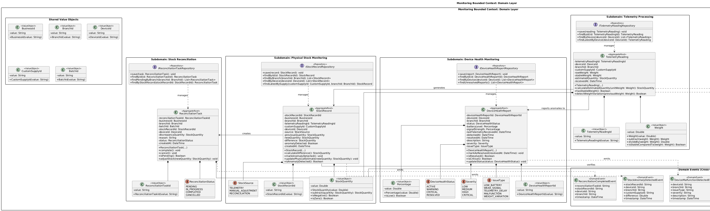

##### 4.2.6.6.2. Bounded Context Database Design Diagram

En esta sección, se presenta el diagrama de Base de Datos diseñado bajo un enfoque No Relacional (NoSQL), del tipo orientado a documentos, para el Bounded Context de Tracking. Este modelo de persistencia ha sido seleccionado para gestionar eficientemente los grandes volúmenes de telemetría IoT y la flexibilidad del catálogo de recursos.

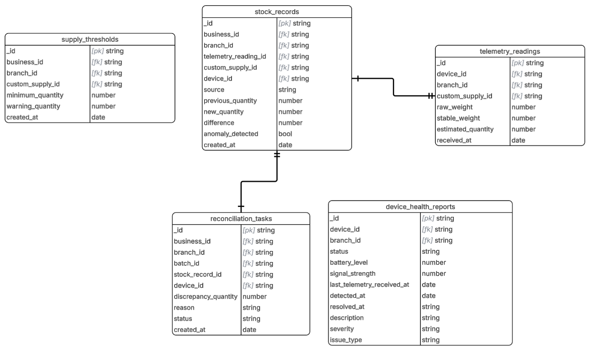

### 4.2.7. Bounded Context: Sales Management

#### 4.2.7.1. Domain Layer

La capa de dominio representa el núcleo de la aplicación para el Bounded Context **Sales Management**. En esta capa se encapsulan todas las reglas de negocio, invariantes y la lógica fundamental relacionada con la gestión de órdenes de venta, desde su creación hasta su cierre.

Esta capa está aislada de detalles de la capa de infraestructura. Se compone de Entities, Aggregate Roots, Value Objects para garantizar la inmutabilidad de las composiciones, Domain Events y las abstracciones de los repositorios mediante Interfaces.

##### Aggregates & Entities

Estas clases representan los pilares transaccionales del sistema. Cada Aggregate Root garantiza la consistencia de los datos dentro de su límite de transacción.

<em>Tabla de Aggregates en el Domain Layer</em>

<table style="width:100%; border-collapse: collapse; border: 1px solid;">
  <thead>
    <tr>
      <th style="padding: 10px; border: 1px solid; text-align: left;">Nombre de Clase</th>
      <th style="padding: 10px; border: 1px solid; text-align: left;">Categoría</th>
      <th style="padding: 10px; border: 1px solid; text-align: left;">Propósito y Reglas de Negocio</th>
    </tr>
  </thead>
  <tbody>
    <tr>
      <td style="padding: 10px; border: 1px solid;"><strong>Sales</strong></td>
      <td style="padding: 10px; border: 1px solid;">Aggregate Root</td>
      <td style="padding: 10px; border: 1px solid;">Representa una orden de venta. Encapsula la lógica para validar que la orden contenga al menos un producto, que el total sea mayor a cero y permite actualizar su estado.</td>
    </tr>
    <tr>
      <td style="padding: 10px; border: 1px solid;"><strong>SalesItem</strong></td>
      <td style="padding: 10px; border: 1px solid;">Entity</td>
      <td style="padding: 10px; border: 1px solid;">Representa un ítem dentro de la orden de venta. Se asegura de que la cantidad sea mayor que cero, que el precio unitario también sea mayor que cero y que el total de la línea sea el resultado de multiplicar el precio unitario por la cantidad.</td>
    </tr>
    <tr>
      <td style="padding: 10px; border: 1px solid;"><strong>AdditionalSupply</strong></td>
      <td style="padding: 10px; border: 1px solid;">Entity</td>
      <td style="padding: 10px; border: 1px solid;">Representa una línea de producto dentro de la orden. Garantiza que la cantidad sea mayor a cero y que el id del lote referenciado sea válido.</td>
    </tr>
  </tbody>
</table>

 

##### Value Objects

Estas clases modelan características conceptuales del dominio. Son inmutables y ayudan a evitar el uso excesivo de tipos primitivos, asegurando que los datos siempre sean válidos desde su creación.

<em>Tabla de Value Objects en el Domain Layer</em>

<table style="width:100%; border-collapse: collapse; border: 1px solid;">
  <thead>
    <tr>
      <th style="padding: 10px; border: 1px solid; text-align: left;">Nombre de Clase</th>
      <th style="padding: 10px; border: 1px solid; text-align: left;">Categoría</th>
      <th style="padding: 10px; border: 1px solid; text-align: left;">Propósito y Reglas de Negocio</th>
    </tr>
  </thead>
  <tbody>
    <tr>
      <td style="padding: 10px; border: 1px solid;"><strong>SalesTotals</strong></td>
      <td style="padding: 10px; border: 1px solid;">Value Object</td>
      <td style="padding: 10px; border: 1px solid;">Encapsula los valores de subtotal, impuesto y total. Garantiza que estos valores no puedan modificarse una vez creados, que ninguno sea negativo y que el total sea siempre la suma del subtotal y el impuesto.</td>
    </tr>
    <tr>
      <td style="padding: 10px; border: 1px solid;"><strong>CustomerName</strong></td>
      <td style="padding: 10px; border: 1px solid;">Value Object</td>
      <td style="padding: 10px; border: 1px solid;">Encapsula el nombre del cliente. Valida que no sea una cadena vacía ni supere el límite de caracteres permitido.</td>
    </tr>
    <tr>
      <td style="padding: 10px; border: 1px solid;"><strong>SalesStatus</strong></td>
      <td style="padding: 10px; border: 1px solid;">Value Object</td>
      <td style="padding: 10px; border: 1px solid;">Encapsula el estado de la orden, como pendiente, completado o cancelado. Se asegura de que solo se utilicen valores definidos dentro del conjunto permitido y que los cambios de estado se realicen únicamente siguiendo transiciones válidas.</td>
    </tr>  
  </tbody>
</table>

##### Commands

Los Commands representan las intenciones de los usuarios al interactuar con el sistema. Cada Command encapsula los datos necesarios para ejecutar una acción específica, como crear o actualizar una orden de venta, y se valida antes de ser procesado por su correspondiente Command Handler.

<em>Tabla de Commands en el Domain Layer</em>

<table style="width:100%; border-collapse: collapse; border: 1px solid;">
  <thead>
    <tr>
      <th style="padding: 10px; border: 1px solid; text-align: left;">Nombre de Clase</th>
      <th style="padding: 10px; border: 1px solid; text-align: left;">Categoría</th>
      <th style="padding: 10px; border: 1px solid; text-align: left;">Propósito y Reglas de Negocio</th>
    </tr>
  </thead>
  <tbody>
    <tr>
      <td style="padding: 10px; border: 1px solid;"><strong>CreateSaleCommand</strong></td>
      <td style="padding: 10px; border: 1px solid;">Command</td>
      <td style="padding: 10px; border: 1px solid;">Define los datos necesarios para crear una nueva orden de venta, incluyendo la lista de ítems, insumos adicionales y el monto total. Valida que la información proporcionada cumpla con las reglas de negocio antes de ser procesada por el Command Handler.</td>
    </tr>
    <tr>
      <td style="padding: 10px; border: 1px solid;"><strong>CancelSaleCommand</strong></td>
      <td style="padding: 10px; border: 1px solid;">Command</td>
      <td style="padding: 10px; border: 1px solid;">Define los datos necesarios para cancelar una orden de venta existente. Valida que la orden esté en un estado que permita su cancelación y que se proporcione una razón válida para la cancelación.</td>
    </tr>
    <tr>
      <td style="padding: 10px; border: 1px solid;"><strong>UpdateSaleCommand</strong></td>
      <td style="padding: 10px; border: 1px solid;">Command</td>
      <td style="padding: 10px; border: 1px solid;">Define los datos necesarios para actualizar el estado de una orden de venta. Valida que la transición de estado sea válida según las reglas de negocio y que se proporcione la información necesaria para realizar la actualización.</td>
    </tr>
  </tbody>
</table>

##### Queries

Los Queries representan las solicitudes de información que los usuarios hacen al sistema. Cada Query encapsula los parámetros necesarios para recuperar datos específicos, como el detalle de una orden de venta o la lista de órdenes asociadas a una sucursal, y se valida antes de ser procesada por su correspondiente Query Handler.

<em>Tabla de Queries en el Domain Layer</em>

<table style="width:100%; border-collapse: collapse; border: 1px solid;">
  <thead>
    <tr>
      <th style="padding: 10px; border: 1px solid; text-align: left;">Nombre de Clase</th>
      <th style="padding: 10px; border: 1px solid; text-align: left;">Categoría</th>
      <th style="padding: 10px; border: 1px solid; text-align: left;">Propósito y Reglas de Negocio</th>
    </tr>
  </thead>
  <tbody>
    <tr>
      <td style="padding: 10px; border: 1px solid;"><strong>GetSalesByBranchIdQuery</strong></td>
      <td style="padding: 10px; border: 1px solid;">Query</td>
      <td style="padding: 10px; border: 1px solid;">Define los parámetros necesarios para recuperar todas las órdenes de venta asociadas a una sucursal específica. Valida que el ID de la sucursal sea válido y que el usuario tenga permisos para acceder a esa información.</td>
    </tr>
    <tr>
      <td style="padding: 10px; border: 1px solid;"><strong>GetSaleByIdQuery</strong></td>
      <td style="padding: 10px; border: 1px solid;">Query</td>
      <td style="padding: 10px; border: 1px solid;">Define los parámetros necesarios para recuperar el detalle completo de una orden de venta por su ID. Valida que el ID de la orden sea válido y que el usuario tenga permisos para acceder a esa información.</td>
    </tr>
  </tbody>
</table>

#### 4.2.7.2. Interface Layer

En la capa de interfaz del Bounded Context de Sales Management se exponen los endpoints RESTful necesarios para interactuar con las funcionalidades de gestión de órdenes de venta. A través de controladores especializados, esta capa actúa como punto de entrada para que las aplicaciones cliente (Web o Móvil) envíen los comandos de creación, actualización o cierre de órdenes, facilitando la consulta del estado y el historial de ventas.

##### SalesController

<em>Tabla de SalesController en el Interface Layer</em>

<table style="width:100%; border-collapse: collapse; border: 1px solid;">
  <thead>
    <tr>
      <th style="padding: 10px; border: 1px solid; text-align: left;">Propiedad</th>
      <th style="padding: 10px; border: 1px solid; text-align: left;">Valor</th>
    </tr>
  </thead>
  <tbody>
    <tr>
      <td style="padding: 10px; border: 1px solid;"><strong>Nombre</strong></td>
      <td style="padding: 10px; border: 1px solid;">SalesController</td>
    </tr>
    <tr>
      <td style="padding: 10px; border: 1px solid;"><strong>Categoría</strong></td>
      <td style="padding: 10px; border: 1px solid;">Controller</td>
    </tr>
    <tr>
      <td style="padding: 10px; border: 1px solid;"><strong>Propósito</strong></td>
      <td style="padding: 10px; border: 1px solid;">Exponer los endpoints para la creación, consulta, actualización y cierre de órdenes de venta de tiendas retail y restaurantes.</td>
    </tr>
    <tr>
      <td style="padding: 10px; border: 1px solid;"><strong>Ruta</strong></td>
      <td style="padding: 10px; border: 1px solid;">/api/v1/sales</td>
    </tr>
  </tbody>
</table>

 

<em>Tabla de métodos de SalesController en el Interface Layer</em>

<table style="width:100%; border-collapse: collapse; border: 1px solid;">
  <thead>
    <tr>
      <th style="padding: 10px; border: 1px solid;">Nombre</th>
      <th style="padding: 10px; border: 1px solid;">Ruta</th>
      <th style="padding: 10px; border: 1px solid;">Acción</th>
      <th style="padding: 10px; border: 1px solid;">Handle (Command/Query)</th>
    </tr>
  </thead>
  <tbody>
    <tr>
      <td style="padding: 10px; border: 1px solid;">Register</td>
      <td style="padding: 10px; border: 1px solid;">/ (POST)</td>
      <td style="padding: 10px; border: 1px solid;">Crea una nueva orden de venta con sus ítems, insumos adicionales y monto total.</td>
      <td style="padding: 10px; border: 1px solid;">CreateSaleCommand</td>
    </tr>
    <tr>
      <td style="padding: 10px; border: 1px solid;">GetById</td>
      <td style="padding: 10px; border: 1px solid;">/{saleId} (GET)</td>
      <td style="padding: 10px; border: 1px solid;">Retorna el detalle completo de una orden de venta por su ID.</td>
      <td style="padding: 10px; border: 1px solid;">GetSaleByIdQuery</td>
    </tr>
    <tr>
      <td style="padding: 10px; border: 1px solid;">GetSalesByBranch</td>
      <td style="padding: 10px; border: 1px solid;">/branches/{branchId}/sales/{saleId} (GET)</td>
      <td style="padding: 10px; border: 1px solid;">Retorna todas las órdenes de venta asociadas a una sucursal específica.</td>
      <td style="padding: 10px; border: 1px solid;">GetSalesByBranchIdQuery</td>
    </tr>  
    <tr>
      <td style="padding: 10px; border: 1px solid;">Edit</td>
      <td style="padding: 10px; border: 1px solid;">/{saleId}/status (PATCH)</td>
      <td style="padding: 10px; border: 1px solid;">Actualiza el estado de una orden de venta </td>
      <td style="padding: 10px; border: 1px solid;">UpdateSaleStatusCommand</td>
    </tr>
    <tr>
      <td style="padding: 10px; border: 1px solid;">Delete</td>
      <td style="padding: 10px; border: 1px solid;">/{saleId} (DELETE)</td>
      <td style="padding: 10px; border: 1px solid;">Cancela una orden de venta marcándola con estado cancelado</td>
      <td style="padding: 10px; border: 1px solid;">CancelSaleCommand</td>
    </tr>
  </tbody>
</table>

<em>Tabla de BranchSalesController en el Interface Layer</em>

<table style="width:100%; border-collapse: collapse; border: 1px solid;">
  <thead>
    <tr>
      <th style="padding: 10px; border: 1px solid; text-align: left;">Propiedad</th>
      <th style="padding: 10px; border: 1px solid; text-align: left;">Valor</th>
    </tr>
  </thead>
  <tbody>
    <tr>
      <td style="padding: 10px; border: 1px solid;"><strong>Nombre</strong></td>
      <td style="padding: 10px; border: 1px solid;">BranchSalesController</td>
    </tr>
    <tr>
      <td style="padding: 10px; border: 1px solid;"><strong>Categoría</strong></td>
      <td style="padding: 10px; border: 1px solid;">Controller</td>
    </tr>
    <tr>
      <td style="padding: 10px; border: 1px solid;"><strong>Propósito</strong></td>
      <td style="padding: 10px; border: 1px solid;">Exponer los endpoints para la consulta de órdenes de venta asociadas a una sucursal específica.</td>
    </tr>
    <tr>
      <td style="padding: 10px; border: 1px solid;"><strong>Ruta</strong></td>
      <td style="padding: 10px; border: 1px solid;">/api/v1/branches/{branchId}/sales</td>
    </tr>
  </tbody>
</table>

 

<em>Tabla de métodos de BranchSalesController en el Interface Layer</em>

<table style="width:100%; border-collapse: collapse; border: 1px solid;">
  <thead>
    <tr>
      <th style="padding: 10px; border: 1px solid;">Nombre</th>
      <th style="padding: 10px; border: 1px solid;">Ruta</th>
      <th style="padding: 10px; border: 1px solid;">Acción</th>
      <th style="padding: 10px; border: 1px solid;">Handle (Query)</th>
    </tr>
  </thead>
  <tbody>
    <tr>
      <td style="padding: 10px; border: 1px solid;">Get</td>
      <td style="padding: 10px; border: 1px solid;">/ (Get)</td>
      <td style="padding: 10px; border: 1px solid;">Retorna todas las órdenes de venta asociadas a una sucursal específica.</td>
      <td style="padding: 10px; border: 1px solid;">GetSalesByBranchId</td>
    </tr>
</table>

#### 4.2.7.3. Application Layer

La capa de aplicación del Bounded Context de Sales Management orquesta los flujos de trabajo dictados por los usuarios al gestionar sus órdenes de venta. Aquí residen los Command Handlers encargados de procesar la creación, actualización o cierre de órdenes, asegurando que se cumplan las reglas de negocio antes de delegar la persistencia al dominio.

##### SalesCommandHandler

<em>Tabla de CreateSaleCommandHandler en el Application Layer</em>

<table style="width:100%; border-collapse: collapse; border: 1px solid;">
  <thead>
    <tr>
      <th style="padding: 10px; border: 1px solid; text-align: left;">Propiedad</th>
      <th style="padding: 10px; border: 1px solid; text-align: left;">Valor</th>
    </tr>
  </thead>
  <tbody>
    <tr>
      <td style="padding: 10px; border: 1px solid;"><strong>Nombre</strong></td>
      <td style="padding: 10px; border: 1px solid;">CreateSaleCommandHandler</td>
    </tr>
    <tr>
      <td style="padding: 10px; border: 1px solid;"><strong>Categoría</strong></td>
      <td style="padding: 10px; border: 1px solid;">Command Handler</td>
    </tr>
    <tr>
      <td style="padding: 10px; border: 1px solid;"><strong>Propósito</strong></td>
      <td style="padding: 10px; border: 1px solid;">Orquesta la creación de una nueva orden de venta, validando que contenga al menos un ítem, que el monto total sea correcto y que se asocie a la sucursal correspondiente antes de persistirla a través del dominio.</td>
    </tr>
    <tr>
      <td style="padding: 10px; border: 1px solid;"><strong>Comando</strong></td>
      <td style="padding: 10px; border: 1px solid;">CreateSaleCommand</td>
    </tr>
  </tbody>
</table>

 

##### UpdateSaleStatusCommandHandler

<em>Tabla de UpdateSaleStatusCommandHandler en el Application Layer</em>

<table style="width:100%; border-collapse: collapse; border: 1px solid;">
  <thead>
    <tr>
      <th style="padding: 10px; border: 1px solid; text-align: left;">Propiedad</th>
      <th style="padding: 10px; border: 1px solid; text-align: left;">Valor</th>
    </tr>
  </thead>
  <tbody>
    <tr>
      <td style="padding: 10px; border: 1px solid;"><strong>Nombre</strong></td>
      <td style="padding: 10px; border: 1px solid;">UpdateSaleStatusCommandHandler</td>
    </tr>
    <tr>
      <td style="padding: 10px; border: 1px solid;"><strong>Categoría</strong></td>
      <td style="padding: 10px; border: 1px solid;">Command Handler</td>
    </tr>
    <tr>
      <td style="padding: 10px; border: 1px solid;"><strong>Propósito</strong></td>
      <td style="padding: 10px; border: 1px solid;">Orquesta la actualización del estado de una orden de venta, validando que la transición de estado sea válida y que se realice dentro de un marco temporal permitido antes de persistir el cambio a través del dominio.</td>
    </tr>
    <tr>
      <td style="padding: 10px; border: 1px solid;"><strong>Comando</strong></td>
      <td style="padding: 10px; border: 1px solid;">UpdateSaleStatusCommand</td>
    </tr>
  </tbody>
</table>

 

##### CancelSaleCommandHandler

<em>Tabla de CancelSaleCommandHandler en el Application Layer</em>

<table style="width:100%; border-collapse: collapse; border: 1px solid;">
  <thead>
    <tr>
      <th style="padding: 10px; border: 1px solid; text-align: left;">Propiedad</th>
      <th style="padding: 10px; border: 1px solid; text-align: left;">Valor</th>
    </tr>
  </thead>
  <tbody>
    <tr>
      <td style="padding: 10px; border: 1px solid;"><strong>Nombre</strong></td>
      <td style="padding: 10px; border: 1px solid;">CancelSaleCommandHandler</td>
    </tr>
    <tr>
      <td style="padding: 10px; border: 1px solid;"><strong>Categoría</strong></td>
      <td style="padding: 10px; border: 1px solid;">Command Handler</td>
    </tr>
    <tr>
      <td style="padding: 10px; border: 1px solid;"><strong>Propósito</strong></td>
      <td style="padding: 10px; border: 1px solid;">Orquesta la cancelación de una orden de venta, validando que la orden exista, que su estado actual permita la cancelación y que se realice dentro de un marco temporal permitido antes de persistir el cambio a través del dominio.</td>
    </tr>
    <tr>
      <td style="padding: 10px; border: 1px solid;"><strong>Comando</strong></td>
      <td style="padding: 10px; border: 1px solid;">CancelSaleCommand</td>
    </tr>
  </tbody>
</table>

 

##### GetSaleByIdQueryHandler

<em>Tabla de GetSaleByIdQueryHandler en el Application Layer</em>

<table style="width:100%; border-collapse: collapse; border: 1px solid;">
  <thead>
    <tr>
      <th style="padding: 10px; border: 1px solid; text-align: left;">Propiedad</th>
      <th style="padding: 10px; border: 1px solid; text-align: left;">Valor</th>
    </tr>
  </thead>
  <tbody>
    <tr>
      <td style="padding: 10px; border: 1px solid;"><strong>Nombre</strong></td>
      <td style="padding: 10px; border: 1px solid;">GetSaleByIdQueryHandler</td>
    </tr>
    <tr>
      <td style="padding: 10px; border: 1px solid;"><strong>Categoría</strong></td>
      <td style="padding: 10px; border: 1px solid;">Query Handler</td>
    </tr>
    <tr>
      <td style="padding: 10px; border: 1px solid;"><strong>Propósito</strong></td>
      <td style="padding: 10px; border: 1px solid;">Orquesta la consulta de una orden de venta por su ID, validando que la orden exista y que el usuario tenga permisos para acceder a esa información antes de retornar el detalle completo de la orden.</td>
    </tr>
    <tr>
      <td style="padding: 10px; border: 1px solid;"><strong>Comando</strong></td>
      <td style="padding: 10px; border: 1px solid;">GetSaleByIdQuery</td>
    </tr>
  </tbody>
</table>

 

##### GetSalesByBranchIdQueryHandler

<em>Tabla de GetSalesByBranchIdQueryHandler en el Application Layer</em>

<table style="width:100%; border-collapse: collapse; border: 1px solid;">
  <thead>
    <tr>
      <th style="padding: 10px; border: 1px solid; text-align: left;">Propiedad</th>
      <th style="padding: 10px; border: 1px solid; text-align: left;">Valor</th>
    </tr>
  </thead>
  <tbody>
    <tr>
      <td style="padding: 10px; border: 1px solid;"><strong>Nombre</strong></td>
      <td style="padding: 10px; border: 1px solid;">GetSalesByBranchIdQueryHandler</td>
    </tr>
    <tr>
      <td style="padding: 10px; border: 1px solid;"><strong>Categoría</strong></td>
      <td style="padding: 10px; border: 1px solid;">Query Handler</td>
    </tr>
    <tr>
      <td style="padding: 10px; border: 1px solid;"><strong>Propósito</strong></td>
      <td style="padding: 10px; border: 1px solid;">Orquesta la consulta de todas las órdenes de venta asociadas a una sucursal específica, validando que la sucursal exista y que el usuario tenga permisos para acceder a esa información antes de retornar el listado completo de órdenes.</td>
    </tr>
    <tr>
      <td style="padding: 10px; border: 1px solid;"><strong>Comando</strong></td>
      <td style="padding: 10px; border: 1px solid;">GetSalesByBranchIdQuery</td>
    </tr>
  </tbody>
</table>

 

#### 4.2.7.4. Infrastructure Layer

La capa de infrastructure de Sales Management materializa los repositorios necesarios para almacenar las órdenes de venta. Además, es el punto donde se implementan los adaptadores para servicios de terceros, como sistemas de pago o plataformas de envío, que son vitales para completar el ciclo de vida de una orden.

##### SalesRepository

<em>Tabla de SalesRepository en el Infrastructure Layer</em>

<table style="width:100%; border-collapse: collapse; border: 1px solid;">
  <thead>
    <tr>
      <th style="padding: 10px; border: 1px solid; text-align: left;">Propiedad</th>
      <th style="padding: 10px; border: 1px solid; text-align: left;">Valor</th>
    </tr>
  </thead>
  <tbody>
    <tr>
      <td style="padding: 10px; border: 1px solid;"><strong>Nombre</strong></td>
      <td style="padding: 10px; border: 1px solid;">SalesRepository</td>
    </tr>
    <tr>
      <td style="padding: 10px; border: 1px solid;"><strong>Categoría</strong></td>
      <td style="padding: 10px; border: 1px solid;">Repositorio</td>
    </tr>
    <tr>
      <td style="padding: 10px; border: 1px solid;"><strong>Propósito</strong></td>
      <td style="padding: 10px; border: 1px solid;">Persistir las órdenes de venta, permitiendo su creación, actualización y consulta a través de la implementación de las operaciones definidas en el dominio.</td>
    </tr>
    <tr>
      <td style="padding: 10px; border: 1px solid;"><strong>Interfaz</strong></td>
      <td style="padding: 10px; border: 1px solid;">ISalesRepository</td>
    </tr>
  </tbody>
</table>

#### 4.2.7.5. Bounded Context Software Architecture Component Level Diagrams

En esta sección se presentan los diagramas de componentes del bounded context de **Sales Management** mostrando su comportamiento y responsabilidades desde tres perspectivas: aplicación web, aplicación móvil y backend. Cada diagrama refleja cómo este bounded context interactúa con otros componentes o servicios.

##### Web Application Component Diagram

El diagrama representa la implementación del bounded context de Sales Order Management en la aplicación web, se implementa como un componente Angular/TypeScript dentro del Restock Platform Web Client App, encargado de gestionar y mostrar las órdenes de venta de cada sucursal. Se comunica vía Kong Gateway para poder comunicarse con el Backend.

<em>Tabla de Componentes de la Web Application para Sales Management</em>

<table style="width:100%; border-collapse: collapse; border: 1px solid;">
  <thead>
    <tr>
      <th style="padding: 10px; border: 1px solid; text-align: left;">Componente</th>
      <th style="padding: 10px; border: 1px solid; text-align: left;">Responsabilidad</th>
      <th style="padding: 10px; border: 1px solid; text-align: left;">Tecnología</th>
    </tr>
  </thead>
  <tbody>
    <tr>
      <td style="padding: 10px; border: 1px solid;"><strong>webSales</strong></td>
      <td style="padding: 10px; border: 1px solid;">Provee la interfaz de usuario para visualizar y gestionar las venta, permitiendo a los usuarios consultar el estado de sus ventas, detalles de cada orden y realizar acciones como actualizar o cancelarlas.</td>
      <td style="padding: 10px; border: 1px solid;">TypeScript, Angular</td>
    </tr>
  </tbody>
</table>

 

<em>Tabla de Interacciones del Componente webAssetAndResource</em>

<table style="width:100%; border-collapse: collapse; border: 1px solid;">
  <thead>
    <tr>
      <th style="padding: 10px; border: 1px solid; text-align: left;">Interactúa con</th>
      <th style="padding: 10px; border: 1px solid; text-align: left;">Tipo de Relación</th>
      <th style="padding: 10px; border: 1px solid; text-align: left;">Descripción de la Interacción</th>
    </tr>
  </thead>
  <tbody>
    <tr>
      <td style="padding: 10px; border: 1px solid;"><strong>NGINX Load Balancer</strong></td>
      <td style="padding: 10px; border: 1px solid;">Petición HTTP / REST</td>
      <td style="padding: 10px; border: 1px solid;">Realiza peticiones JSON/HTTPS para sincronizar y actualizar la información de activos, inventarios y dispositivos IoT en el backend a través de Kong Gateway.</td>
    </tr>
  </tbody>
</table>

##### Backend Application Component Diagram

El diagrama representa la implementación del bounded context de Sales Order Management, se implementa como un componente Java/Spring Boot dentro del Restock Cloud Server Side App, actúa como el núcleo del procesamiento: recibe solicitudes del Kong Gateway y valida tokens JWT con Identity and Access Management, persiste las ventas en la Restock Database, actualiza el stock en Asset and Resource Management, descuenta cantidades en Service Design and Planning, y dispara notificaciones a través del componente Communications.

<em>Tabla de Componentes de la Backend Application para Asset and Resource Management</em>

<table style="width:100%; border-collapse: collapse; border: 1px solid;">
  <thead>
    <tr>
      <th style="padding: 10px; border: 1px solid; text-align: left;">Componente</th>
      <th style="padding: 10px; border: 1px solid; text-align: left;">Responsabilidad</th>
      <th style="padding: 10px; border: 1px solid; text-align: left;">Tecnología</th>
    </tr>
  </thead>
  <tbody>
    <tr>
      <td style="padding: 10px; border: 1px solid;"><strong>apiSalesManagement</strong></td>
      <td style="padding: 10px; border: 1px solid;">Centraliza la lógica de control de ventas, gestionando la creación, actualización y consulta de órdenes de venta, y orquestando las interacciones con otros componentes para mantener la coherencia del sistema.</td>
      <td style="padding: 10px; border: 1px solid;">Java, Spring Boot</td>
    </tr>
  </tbody>
</table>

 

<em>Tabla de Interacciones del Componente apiAssetAndResource</em>

<table style="width:100%; border-collapse: collapse; border: 1px solid;">
  <thead>
    <tr>
      <th style="padding: 10px; border: 1px solid; text-align: left;">Interactúa con</th>
      <th style="padding: 10px; border: 1px solid; text-align: left;">Tipo de Relación</th>
      <th style="padding: 10px; border: 1px solid; text-align: left;">Descripción de la Interacción</th>
    </tr>
  </thead>
  <tbody>
    <tr>
      <td style="padding: 10px; border: 1px solid;"><strong>databaseNoSql</strong> (MongoDB)</td>
      <td style="padding: 10px; border: 1px solid;">Escritura / Lectura</td>
      <td style="padding: 10px; border: 1px solid;">Almacena y recupera los documentos relacionados a insumos, sucursales, lotes de inventario y dispositivos registrados.</td>
    </tr>
    <tr>
      <td style="padding: 10px; border: 1px solid;"><strong>apiServiceDesignAndPlanning</strong></td>
      <td style="padding: 10px; border: 1px solid;">Dependencia interna</td>
      <td style="padding: 10px; border: 1px solid;">Solicita la verificación de cantidades de recetas o kits en stock cada vez que se registra una nueva orden de venta, para mantener la coherencia entre las ventas y el inventario disponible.</td>
    </tr>
    <tr>
      <td style="padding: 10px; border: 1px solid;"><strong>apiAssetAndResourceManagement</strong></td>
      <td style="padding: 10px; border: 1px solid;">Dependencia interna</td>
      <td style="padding: 10px; border: 1px solid;">Solicita la actualización de cantidades de insumos en stock cada vez que se registra una nueva orden de venta, para mantener la coherencia entre las ventas y el inventario disponible.</td>
    </tr>
  </tbody>
</table>

#### 4.2.7.6. Bounded Context Software Architecture Code Level Diagrams

##### 4.2.7.6.1. Bounded Context Domain Layer Class Diagrams

En esta sección se presenta el Diagrama de Clases detallado para el Bounded Context de Sales Management. Que ilustra la estructura del dominio, destacando entities, aggregate roots, value objects y las interfaces de repositorio que conforman el núcleo de la lógica de negocio para la gestión de órdenes de venta del negocio.

En el dominio, el Aggregate Root Sales centraliza la lógica de una orden de venta, agrupando entidades como SaleItem y AdditionalSupply, y apoyándose en Value Objects como SaleTotals, CustomerName y el enum SaleStatus para garantizar la validez de los datos. Además, se define los command y query service interfaces que orquestan las operaciones de creación y consulta de ventas, manteniendo una clara separación de responsabilidades.

##### 4.2.7.6.2. Bounded Context Database Design Diagram

En esta sección, el equipo presenta el Diagrama de Base de Datos diseñado bajo un enfoque No Relacional (NoSQL), del tipo orientado a documentos, para el Bounded Context de Sales Management.

## 4.2.8. Bounded Context: Communication

#### 4.2.8.1. Domain Layer

La capa de dominio del Bounded Context de Communication encapsula las reglas de negocio relacionadas con la generación, clasificación y envío de notificaciones dentro de la plataforma. Este contexto actúa como receptor de eventos críticos provenientes de otros bounded contexts como Tracking, Asset and Resource Management y Sales Order Management, así como de eventos físicos generados por los dispositivos IoT a través de la Edge Application, para transformarlos en notificaciones dirigidas a los actores correspondientes (Retail Manager, Restaurant Manager). La responsabilidad principal de este contexto es garantizar que cada evento relevante del sistema derive en una notificación correctamente tipificada, priorizada y enviada al destinatario correcto a través de OneSignal API. La capa de dominio no depende de frameworks, mecanismos de persistencia ni servicios externos.

#### Aggregates & Entities

Estas clases representan los pilares transaccionales del sistema. El Aggregate Root garantiza la consistencia de los datos dentro de su límite de transacción.

<em>Tabla de Aggregates en el Domain Layer</em>

<table style="width:100%; border-collapse: collapse; border: 1px solid;">
  <thead>
    <tr>
      <th style="padding: 10px; border: 1px solid; text-align: left;">Nombre de Clase</th>
      <th style="padding: 10px; border: 1px solid; text-align: left;">Categoría</th>
      <th style="padding: 10px; border: 1px solid; text-align: left;">Propósito y Reglas de Negocio</th>
    </tr>
  </thead>
  <tbody>
    <tr>
      <td style="padding: 10px; border: 1px solid;"><strong>Notification</strong></td>
      <td style="padding: 10px; border: 1px solid;">Aggregate Root</td>
      <td style="padding: 10px; border: 1px solid;">Representa una notificación generada por el sistema ante un evento crítico, como bajo stock, exceso de inventario, discrepancia detectada o falla de dispositivo. Controla su ciclo de vida: creación, envío y lectura. Incluye el contenido del mensaje, el tipo de evento que la originó, la prioridad asignada, el usuario destinatario (<code>userId</code>), la cuenta del negocio (<code>businessId</code>), la sucursal de origen (<code>branchId</code>) y el estado de lectura. Garantiza que una notificación no pueda marcarse como leída sin haber sido previamente enviada.</td>
    </tr>
  </tbody>
</table>
 

#### Value Objects

Estas clases modelan conceptos propios del dominio y permiten evitar el uso indiscriminado de tipos primitivos. Son inmutables y aseguran que la información crítica del dominio sea válida desde su creación.

<em>Tabla de Value Objects en el Domain Layer</em>

<table style="width:100%; border-collapse: collapse; border: 1px solid;">
  <thead>
    <tr>
      <th style="padding: 10px; border: 1px solid; text-align: left;">Nombre de Clase</th>
      <th style="padding: 10px; border: 1px solid; text-align: left;">Categoría</th>
      <th style="padding: 10px; border: 1px solid; text-align: left;">Propósito y Reglas de Negocio</th>
    </tr>
  </thead>
  <tbody>
    <tr>
      <td style="padding: 10px; border: 1px solid;"><strong>NotificationType</strong></td>
      <td style="padding: 10px; border: 1px solid;">Value Object (enum)</td>
      <td style="padding: 10px; border: 1px solid;">Clasifica el tipo de notificación generada: LOW_STOCK, OVERSTOCK, STOCK_DISCREPANCY, DEVICE_FAILURE o DEVICE_ANOMALY. Permite que el sistema aplique filtros y determine el mensaje apropiado para cada situación.</td>
    </tr>
    <tr>
      <td style="padding: 10px; border: 1px solid;"><strong>NotificationPriority</strong></td>
      <td style="padding: 10px; border: 1px solid;">Value Object (enum)</td>
      <td style="padding: 10px; border: 1px solid;">Representa el nivel de prioridad de una notificación: LOW, MEDIUM o HIGH. Condiciona el orden de presentación en el centro de notificaciones y el comportamiento del canal de entrega push.</td>
    </tr>
    <tr>
      <td style="padding: 10px; border: 1px solid;"><strong>NotificationStatus</strong></td>
      <td style="padding: 10px; border: 1px solid;">Value Object (enum)</td>
      <td style="padding: 10px; border: 1px solid;">Representa el estado de entrega de una notificación: PENDING, SENT o FAILED. Permite rastrear si el mensaje fue correctamente despachado a través del proveedor externo y actualizar el campo <code>sentAt</code> cuando el envío se confirma.</td>
    </tr>
    <tr>
      <td style="padding: 10px; border: 1px solid;"><strong>SituationData</strong></td>
      <td style="padding: 10px; border: 1px solid;">Value Object</td>
      <td style="padding: 10px; border: 1px solid;">Encapsula el contexto informativo recibido desde otros bounded contexts al generar una notificación: identificador del recurso afectado, identificador de la sucursal de origen (<code>branchId</code>), identificador del negocio (<code>businessId</code>), identificador del usuario destinatario (<code>userId</code>), tipo de evento y timestamp. Permite que la notificación sea trazable hasta su origen.</td>
    </tr>
    <tr>
      <td style="padding: 10px; border: 1px solid;"><strong>NotificationId, BusinessId, BranchId, UserId</strong></td>
      <td style="padding: 10px; border: 1px solid;">Value Object</td>
      <td style="padding: 10px; border: 1px solid;">Identificadores fuertemente tipados para prevenir confusiones entre entidades del mismo bounded context o referencias externas provenientes de otros contextos, alineados con los campos <code>_id</code>, <code>business_id</code>, <code>branch_id</code> y <code>user_id</code> de la colección <code>notifications</code>.</td>
    </tr>
  </tbody>
</table>
 

#### Commands

Los commands representan intenciones de cambio de estado dentro del dominio. Son objetos inmutables que encapsulan los datos necesarios para ejecutar una operación.

<em>Tabla de Commands en el Domain Layer</em>

<table style="width:100%; border-collapse: collapse; border: 1px solid;">
  <thead>
    <tr>
      <th style="padding: 10px; border: 1px solid; text-align: left;">Nombre de Clase</th>
      <th style="padding: 10px; border: 1px solid; text-align: left;">Categoría</th>
      <th style="padding: 10px; border: 1px solid; text-align: left;">Propósito</th>
    </tr>
  </thead>
  <tbody>
    <tr>
      <td style="padding: 10px; border: 1px solid;"><strong>GenerateNotificationCommand</strong></td>
      <td style="padding: 10px; border: 1px solid;">Command</td>
      <td style="padding: 10px; border: 1px solid;">Encapsula los datos necesarios para crear una nueva notificación: businessId, branchId, userId, tipo, prioridad y datos de situación. Es invocado por el ACL cuando llega un evento externo desde Asset and Resource Management, Tracking, Sales Order Management o la Edge Application.</td>
    </tr>
    <tr>
      <td style="padding: 10px; border: 1px solid;"><strong>MarkNotificationAsReadCommand</strong></td>
      <td style="padding: 10px; border: 1px solid;">Command</td>
      <td style="padding: 10px; border: 1px solid;">Encapsula el identificador de la notificación y el userId para marcar una notificación como leída dentro del aggregate.</td>
    </tr>
    <tr>
      <td style="padding: 10px; border: 1px solid;"><strong>DispatchNotificationCommand</strong></td>
      <td style="padding: 10px; border: 1px solid;">Command</td>
      <td style="padding: 10px; border: 1px solid;">Encapsula el identificador de la notificación y el userId para iniciar su despacho hacia el canal push externo a través de la capa de infraestructura.</td>
    </tr>
  </tbody>
</table>
 

#### Queries

Las queries representan intenciones de consulta de información sin modificar el estado del dominio.

<em>Tabla de Queries en el Domain Layer</em>

<table style="width:100%; border-collapse: collapse; border: 1px solid;">
  <thead>
    <tr>
      <th style="padding: 10px; border: 1px solid; text-align: left;">Nombre de Clase</th>
      <th style="padding: 10px; border: 1px solid; text-align: left;">Categoría</th>
      <th style="padding: 10px; border: 1px solid; text-align: left;">Propósito</th>
    </tr>
  </thead>
  <tbody>
    <tr>
      <td style="padding: 10px; border: 1px solid;"><strong>GetRecentNotificationsQuery</strong></td>
      <td style="padding: 10px; border: 1px solid;">Query</td>
      <td style="padding: 10px; border: 1px solid;">Encapsula los criterios de consulta para recuperar las últimas notificaciones de un usuario autenticado, con soporte de filtros por branchId, tipo y prioridad.</td>
    </tr>
    <tr>
      <td style="padding: 10px; border: 1px solid;"><strong>GetNotificationByIdQuery</strong></td>
      <td style="padding: 10px; border: 1px solid;">Query</td>
      <td style="padding: 10px; border: 1px solid;">Encapsula el identificador de una notificación y el userId para recuperar su detalle completo desde la capa de infraestructura.</td>
    </tr>
  </tbody>
</table>
 

#### Domain Events

Los domain events representan hechos relevantes que ocurrieron dentro del dominio y permiten la comunicación desacoplada entre bounded contexts.

<em>Tabla de Domain Events en el Domain Layer</em>

<table style="width:100%; border-collapse: collapse; border: 1px solid;">
  <thead>
    <tr>
      <th style="padding: 10px; border: 1px solid; text-align: left;">Nombre de Clase</th>
      <th style="padding: 10px; border: 1px solid; text-align: left;">Categoría</th>
      <th style="padding: 10px; border: 1px solid; text-align: left;">Propósito</th>
    </tr>
  </thead>
  <tbody>
    <tr>
      <td style="padding: 10px; border: 1px solid;"><strong>NotificationGeneratedEvent</strong></td>
      <td style="padding: 10px; border: 1px solid;">Domain Event</td>
      <td style="padding: 10px; border: 1px solid;">Emitido por el aggregate Notification al ser creado exitosamente. Permite que otros componentes del contexto, como el DispatchNotificationCommandHandler, reaccionen automáticamente para iniciar el envío. También es consumido por Analytics para actualizar el dashboard con las alertas recientes.</td>
    </tr>
    <tr>
      <td style="padding: 10px; border: 1px solid;"><strong>NotificationSentEvent</strong></td>
      <td style="padding: 10px; border: 1px solid;">Domain Event</td>
      <td style="padding: 10px; border: 1px solid;">Emitido por el aggregate Notification al confirmar el despacho exitoso del mensaje push, actualizando el campo <code>sentAt</code> y el estado a SENT.</td>
    </tr>
    <tr>
      <td style="padding: 10px; border: 1px solid;"><strong>StockAnomalyDetectedEvent</strong></td>
      <td style="padding: 10px; border: 1px solid;">Domain Event (entrante)</td>
      <td style="padding: 10px; border: 1px solid;">Evento de integración proveniente del bounded context Tracking o de la Edge Application que notifica una discrepancia de stock. Dispara la creación de una notificación dentro de este contexto a través del ACL.</td>
    </tr>
    <tr>
      <td style="padding: 10px; border: 1px solid;"><strong>DeviceFailureDetectedEvent</strong></td>
      <td style="padding: 10px; border: 1px solid;">Domain Event (entrante)</td>
      <td style="padding: 10px; border: 1px solid;">Evento de integración proveniente del bounded context Tracking o de la Edge Application que notifica una falla o anomalía técnica en un dispositivo IoT. Dispara la creación de una notificación de tipo DEVICE_FAILURE con prioridad HIGH a través del ACL.</td>
    </tr>
    <tr>
      <td style="padding: 10px; border: 1px solid;"><strong>LowStockDetectedEvent</strong></td>
      <td style="padding: 10px; border: 1px solid;">Domain Event (entrante)</td>
      <td style="padding: 10px; border: 1px solid;">Evento de integración proveniente del bounded context Asset and Resource Management que notifica que un insumo ha alcanzado su umbral mínimo de stock. Dispara la creación de una notificación de tipo LOW_STOCK a través del ACL.</td>
    </tr>
    <tr>
      <td style="padding: 10px; border: 1px solid;"><strong>SaleCompletedEvent</strong></td>
      <td style="padding: 10px; border: 1px solid;">Domain Event (entrante)</td>
      <td style="padding: 10px; border: 1px solid;">Evento de integración proveniente del bounded context Sales Order Management que notifica el registro exitoso de una venta. Dispara la creación de una notificación informativa dentro del contexto a través del ACL.</td>
    </tr>
  </tbody>
</table>
 

#### 4.2.8.2. Interface Layer

La capa de interfaz del Bounded Context de Communication expone los endpoints RESTful necesarios para que los actores del sistema puedan consultar el historial de notificaciones y gestionar su estado de lectura. Esta capa recibe solicitudes desde la Web App o la Mobile App, las transforma en queries o comandos y delega su ejecución a la capa de aplicación. Adicionalmente, aloja la implementación del ACL (NotificationContextFacade), que actúa como punto de entrada para que otros bounded contexts —Asset and Resource Management, Tracking, Sales Order Management y la Edge Application— generen notificaciones sin acoplarse al modelo interno de este contexto.

#### NotificationController

<em>Tabla de NotificationController en el Interface Layer</em>

<table style="width:100%; border-collapse: collapse; border: 1px solid;">
  <thead>
    <tr>
      <th style="padding: 10px; border: 1px solid; text-align: left;">Propiedad</th>
      <th style="padding: 10px; border: 1px solid; text-align: left;">Valor</th>
    </tr>
  </thead>
  <tbody>
    <tr>
      <td style="padding: 10px; border: 1px solid;"><strong>Nombre</strong></td>
      <td style="padding: 10px; border: 1px solid;">NotificationController</td>
    </tr>
    <tr>
      <td style="padding: 10px; border: 1px solid;"><strong>Categoría</strong></td>
      <td style="padding: 10px; border: 1px solid;">Controller</td>
    </tr>
    <tr>
      <td style="padding: 10px; border: 1px solid;"><strong>Propósito</strong></td>
      <td style="padding: 10px; border: 1px solid;">Exponer endpoints para consultar el historial de notificaciones de un usuario autenticado, filtrarlas por tipo o prioridad y gestionar su estado de lectura.</td>
    </tr>
    <tr>
      <td style="padding: 10px; border: 1px solid;"><strong>Ruta</strong></td>
      <td style="padding: 10px; border: 1px solid;">/api/v1/notifications</td>
    </tr>
  </tbody>
</table>
 

<em>Tabla de métodos de NotificationController en el Interface Layer</em>

<table style="width:100%; border-collapse: collapse; border: 1px solid;">
  <thead>
    <tr>
      <th style="padding: 10px; border: 1px solid;">Nombre</th>
      <th style="padding: 10px; border: 1px solid;">Ruta</th>
      <th style="padding: 10px; border: 1px solid;">Acción</th>
      <th style="padding: 10px; border: 1px solid;">Handle (Command/Query)</th>
    </tr>
  </thead>
  <tbody>
    <tr>
      <td style="padding: 10px; border: 1px solid;">GetRecent</td>
      <td style="padding: 10px; border: 1px solid;">/ (GET)</td>
      <td style="padding: 10px; border: 1px solid;">Lista las últimas notificaciones del usuario autenticado en orden cronológico, con soporte de filtros por tipo y prioridad.</td>
      <td style="padding: 10px; border: 1px solid;">GetRecentNotificationsQuery</td>
    </tr>
    <tr>
      <td style="padding: 10px; border: 1px solid;">GetById</td>
      <td style="padding: 10px; border: 1px solid;">/{notificationId} (GET)</td>
      <td style="padding: 10px; border: 1px solid;">Obtiene el detalle de una notificación específica.</td>
      <td style="padding: 10px; border: 1px solid;">GetNotificationByIdQuery</td>
    </tr>
    <tr>
      <td style="padding: 10px; border: 1px solid;">MarkAsRead</td>
      <td style="padding: 10px; border: 1px solid;">/{notificationId}/read (PATCH)</td>
      <td style="padding: 10px; border: 1px solid;">Marca una notificación como leída, actualizando el campo <code>read</code>.</td>
      <td style="padding: 10px; border: 1px solid;">MarkNotificationAsReadCommand</td>
    </tr>
  </tbody>
</table>
 

#### ACL (Anti-Corruption Layer)

La interfaz del ACL se expone desde la capa de interfaz del Bounded Context de Communication para permitir que otros bounded contexts soliciten la generación de alertas sin depender del modelo interno del dominio. Esta interfaz actúa como contrato de entrada hacia la implementación ubicada en la capa de aplicación.

<em>Tabla de ACL en el Interface Layer</em>

<table style="width:100%; border-collapse: collapse; border: 1px solid;">
  <thead>
    <tr>
      <th style="padding: 10px; border: 1px solid; text-align: left;">Nombre de Interfaz</th>
      <th style="padding: 10px; border: 1px solid; text-align: left;">Categoría</th>
      <th style="padding: 10px; border: 1px solid; text-align: left;">Propósito</th>
    </tr>
  </thead>
  <tbody>
    <tr>
      <td style="padding: 10px; border: 1px solid;"><strong>INotificationContextFacade</strong></td>
      <td style="padding: 10px; border: 1px solid;">ACL Interface</td>
      <td style="padding: 10px; border: 1px solid;">Contrato que expone los métodos <code>generateStockAlert</code>, <code>generateDeviceAlert</code>, <code>generateLowStockAlert</code> y <code>generateSaleNotification</code> para que otros bounded contexts —Asset and Resource Management, Tracking, Sales Order Management y la Edge Application— puedan solicitar la generación de notificaciones sin conocer los detalles internos del dominio de Communication. Su implementación reside en la capa de aplicación.</td>
    </tr>
  </tbody>
</table>
 

#### 4.2.8.3. Application Layer

La capa de aplicación del Bounded Context de Communication orquesta los casos de uso relacionados con la generación, filtrado y despacho de notificaciones. En esta capa residen los Command Handlers, Query Handlers y Event Handlers que coordinan el flujo entre la capa de interfaz, el dominio y la infraestructura. También aloja la implementación del ACL (NotificationContextFacade), que implementa la interfaz INotificationContextFacade definida en la Interface Layer. Esta capa no contiene reglas puras de dominio. Su responsabilidad es reaccionar a eventos externos provenientes de Asset and Resource Management, Tracking, Sales Order Management y la Edge Application, crear notificaciones correctamente tipificadas y priorizadas, delegar el envío de mensajes push al servicio externo de OneSignal a través de la capa de infraestructura y notificar al bounded context Analytics cuando una nueva alerta es generada para mantener el dashboard actualizado.

#### NotificationContextFacade

<em>Tabla de NotificationContextFacade en el Application Layer</em>

<table style="width:100%; border-collapse: collapse; border: 1px solid;">
  <thead>
    <tr>
      <th style="padding: 10px; border: 1px solid; text-align: left;">Propiedad</th>
      <th style="padding: 10px; border: 1px solid; text-align: left;">Valor</th>
    </tr>
  </thead>
  <tbody>
    <tr>
      <td style="padding: 10px; border: 1px solid;"><strong>Nombre</strong></td>
      <td style="padding: 10px; border: 1px solid;">NotificationContextFacade</td>
    </tr>
    <tr>
      <td style="padding: 10px; border: 1px solid;"><strong>Categoría</strong></td>
      <td style="padding: 10px; border: 1px solid;">ACL Implementation</td>
    </tr>
    <tr>
      <td style="padding: 10px; border: 1px solid;"><strong>Propósito</strong></td>
      <td style="padding: 10px; border: 1px solid;">Implementa la interfaz <code>INotificationContextFacade</code> traduciendo las solicitudes externas provenientes de Asset and Resource Management, Tracking, Sales Order Management y la Edge Application en comandos internos (<code>GenerateNotificationCommand</code>) que disparan la creación y despacho de notificaciones dentro del contexto.</td>
    </tr>
    <tr>
      <td style="padding: 10px; border: 1px solid;"><strong>Interfaz</strong></td>
      <td style="padding: 10px; border: 1px solid;">INotificationContextFacade</td>
    </tr>
  </tbody>
</table>
 

#### GenerateNotificationCommandHandler

<em>Tabla de GenerateNotificationCommandHandler en el Application Layer</em>

<table style="width:100%; border-collapse: collapse; border: 1px solid;">
  <thead>
    <tr>
      <th style="padding: 10px; border: 1px solid; text-align: left;">Propiedad</th>
      <th style="padding: 10px; border: 1px solid; text-align: left;">Valor</th>
    </tr>
  </thead>
  <tbody>
    <tr>
      <td style="padding: 10px; border: 1px solid;"><strong>Nombre</strong></td>
      <td style="padding: 10px; border: 1px solid;">GenerateNotificationCommandHandler</td>
    </tr>
    <tr>
      <td style="padding: 10px; border: 1px solid;"><strong>Categoría</strong></td>
      <td style="padding: 10px; border: 1px solid;">Command Handler</td>
    </tr>
    <tr>
      <td style="padding: 10px; border: 1px solid;"><strong>Propósito</strong></td>
      <td style="padding: 10px; border: 1px solid;">Orquestar la creación de una nueva notificación a partir de la información de situación recibida, clasificarla por tipo y prioridad, persistirla en la colección <code>notifications</code>, desencadenar su despacho a través de OneSignal y emitir el evento <code>NotificationGeneratedEvent</code> para que Analytics actualice el dashboard.</td>
    </tr>
    <tr>
      <td style="padding: 10px; border: 1px solid;"><strong>Comando</strong></td>
      <td style="padding: 10px; border: 1px solid;">GenerateNotificationCommand</td>
    </tr>
  </tbody>
</table>
 

#### MarkNotificationAsReadCommandHandler

<em>Tabla de MarkNotificationAsReadCommandHandler en el Application Layer</em>

<table style="width:100%; border-collapse: collapse; border: 1px solid;">
  <thead>
    <tr>
      <th style="padding: 10px; border: 1px solid; text-align: left;">Propiedad</th>
      <th style="padding: 10px; border: 1px solid; text-align: left;">Valor</th>
    </tr>
  </thead>
  <tbody>
    <tr>
      <td style="padding: 10px; border: 1px solid;"><strong>Nombre</strong></td>
      <td style="padding: 10px; border: 1px solid;">MarkNotificationAsReadCommandHandler</td>
    </tr>
    <tr>
      <td style="padding: 10px; border: 1px solid;"><strong>Categoría</strong></td>
      <td style="padding: 10px; border: 1px solid;">Command Handler</td>
    </tr>
    <tr>
      <td style="padding: 10px; border: 1px solid;"><strong>Propósito</strong></td>
      <td style="padding: 10px; border: 1px solid;">Gestionar el marcado de una notificación como leída, validando que exista y actualizando el campo <code>read</code> a <code>true</code> dentro del aggregate.</td>
    </tr>
    <tr>
      <td style="padding: 10px; border: 1px solid;"><strong>Comando</strong></td>
      <td style="padding: 10px; border: 1px solid;">MarkNotificationAsReadCommand</td>
    </tr>
  </tbody>
</table>
 

#### DispatchNotificationCommandHandler

<em>Tabla de DispatchNotificationCommandHandler en el Application Layer</em>

<table style="width:100%; border-collapse: collapse; border: 1px solid;">
  <thead>
    <tr>
      <th style="padding: 10px; border: 1px solid; text-align: left;">Propiedad</th>
      <th style="padding: 10px; border: 1px solid; text-align: left;">Valor</th>
    </tr>
  </thead>
  <tbody>
    <tr>
      <td style="padding: 10px; border: 1px solid;"><strong>Nombre</strong></td>
      <td style="padding: 10px; border: 1px solid;">DispatchNotificationCommandHandler</td>
    </tr>
    <tr>
      <td style="padding: 10px; border: 1px solid;"><strong>Categoría</strong></td>
      <td style="padding: 10px; border: 1px solid;">Command Handler</td>
    </tr>
    <tr>
      <td style="padding: 10px; border: 1px solid;"><strong>Propósito</strong></td>
      <td style="padding: 10px; border: 1px solid;">Orquestar el envío de una notificación delegando la entrega push a OneSignal a través de la capa de infraestructura y actualizando el campo <code>sentAt</code> y el estado de entrega según el resultado obtenido.</td>
    </tr>
    <tr>
      <td style="padding: 10px; border: 1px solid;"><strong>Comando</strong></td>
      <td style="padding: 10px; border: 1px solid;">DispatchNotificationCommand</td>
    </tr>
  </tbody>
</table>
 

#### GetRecentNotificationsQueryHandler

<em>Tabla de GetRecentNotificationsQueryHandler en el Application Layer</em>

<table style="width:100%; border-collapse: collapse; border: 1px solid;">
  <thead>
    <tr>
      <th style="padding: 10px; border: 1px solid; text-align: left;">Propiedad</th>
      <th style="padding: 10px; border: 1px solid; text-align: left;">Valor</th>
    </tr>
  </thead>
  <tbody>
    <tr>
      <td style="padding: 10px; border: 1px solid;"><strong>Nombre</strong></td>
      <td style="padding: 10px; border: 1px solid;">GetRecentNotificationsQueryHandler</td>
    </tr>
    <tr>
      <td style="padding: 10px; border: 1px solid;"><strong>Categoría</strong></td>
      <td style="padding: 10px; border: 1px solid;">Query Handler</td>
    </tr>
    <tr>
      <td style="padding: 10px; border: 1px solid;"><strong>Propósito</strong></td>
      <td style="padding: 10px; border: 1px solid;">Consultar las últimas notificaciones del usuario autenticado filtrando por <code>userId</code>, con soporte adicional de filtros por <code>branchId</code>, tipo y prioridad, incluyendo sucursal de origen, hora exacta del evento y estado de lectura, para ser mostradas en el centro de notificaciones.</td>
    </tr>
    <tr>
      <td style="padding: 10px; border: 1px solid;"><strong>Query</strong></td>
      <td style="padding: 10px; border: 1px solid;">GetRecentNotificationsQuery</td>
    </tr>
  </tbody>
</table>
 

#### GetNotificationByIdQueryHandler

<em>Tabla de GetNotificationByIdQueryHandler en el Application Layer</em>

<table style="width:100%; border-collapse: collapse; border: 1px solid;">
  <thead>
    <tr>
      <th style="padding: 10px; border: 1px solid; text-align: left;">Propiedad</th>
      <th style="padding: 10px; border: 1px solid; text-align: left;">Valor</th>
    </tr>
  </thead>
  <tbody>
    <tr>
      <td style="padding: 10px; border: 1px solid;"><strong>Nombre</strong></td>
      <td style="padding: 10px; border: 1px solid;">GetNotificationByIdQueryHandler</td>
    </tr>
    <tr>
      <td style="padding: 10px; border: 1px solid;"><strong>Categoría</strong></td>
      <td style="padding: 10px; border: 1px solid;">Query Handler</td>
    </tr>
    <tr>
      <td style="padding: 10px; border: 1px solid;"><strong>Propósito</strong></td>
      <td style="padding: 10px; border: 1px solid;">Obtener el detalle completo de una notificación específica por su identificador y userId, exponiendo todos los campos de la colección al cliente solicitante.</td>
    </tr>
    <tr>
      <td style="padding: 10px; border: 1px solid;"><strong>Query</strong></td>
      <td style="padding: 10px; border: 1px solid;">GetNotificationByIdQuery</td>
    </tr>
  </tbody>
</table>
 

#### StockAnomalyDetectedEventHandler

<em>Tabla de StockAnomalyDetectedEventHandler en el Application Layer</em>

<table style="width:100%; border-collapse: collapse; border: 1px solid;">
  <thead>
    <tr>
      <th style="padding: 10px; border: 1px solid; text-align: left;">Propiedad</th>
      <th style="padding: 10px; border: 1px solid; text-align: left;">Valor</th>
    </tr>
  </thead>
  <tbody>
    <tr>
      <td style="padding: 10px; border: 1px solid;"><strong>Nombre</strong></td>
      <td style="padding: 10px; border: 1px solid;">StockAnomalyDetectedEventHandler</td>
    </tr>
    <tr>
      <td style="padding: 10px; border: 1px solid;"><strong>Categoría</strong></td>
      <td style="padding: 10px; border: 1px solid;">Event Handler</td>
    </tr>
    <tr>
      <td style="padding: 10px; border: 1px solid;"><strong>Propósito</strong></td>
      <td style="padding: 10px; border: 1px solid;">Reaccionar al evento emitido por Tracking o la Edge Application cuando se detecta una anomalía de stock, invocando el ACL para crear la notificación correspondiente con el tipo y prioridad adecuados e iniciando su despacho al administrador afectado.</td>
    </tr>
    <tr>
      <td style="padding: 10px; border: 1px solid;"><strong>Evento</strong></td>
      <td style="padding: 10px; border: 1px solid;">StockAnomalyDetectedEvent</td>
    </tr>
  </tbody>
</table>
 

#### DeviceFailureDetectedEventHandler

<em>Tabla de DeviceFailureDetectedEventHandler en el Application Layer</em>

<table style="width:100%; border-collapse: collapse; border: 1px solid;">
  <thead>
    <tr>
      <th style="padding: 10px; border: 1px solid; text-align: left;">Propiedad</th>
      <th style="padding: 10px; border: 1px solid; text-align: left;">Valor</th>
    </tr>
  </thead>
  <tbody>
    <tr>
      <td style="padding: 10px; border: 1px solid;"><strong>Nombre</strong></td>
      <td style="padding: 10px; border: 1px solid;">DeviceFailureDetectedEventHandler</td>
    </tr>
    <tr>
      <td style="padding: 10px; border: 1px solid;"><strong>Categoría</strong></td>
      <td style="padding: 10px; border: 1px solid;">Event Handler</td>
    </tr>
    <tr>
      <td style="padding: 10px; border: 1px solid;"><strong>Propósito</strong></td>
      <td style="padding: 10px; border: 1px solid;">Reaccionar al evento de falla o anomalía técnica de un dispositivo IoT emitido por Tracking o la Edge Application, invocando el ACL para generar una notificación de tipo DEVICE_FAILURE con prioridad HIGH y despachándola al administrador de la cuenta afectada.</td>
    </tr>
    <tr>
      <td style="padding: 10px; border: 1px solid;"><strong>Evento</strong></td>
      <td style="padding: 10px; border: 1px solid;">DeviceFailureDetectedEvent</td>
    </tr>
  </tbody>
</table>
 

#### LowStockDetectedEventHandler

<em>Tabla de LowStockDetectedEventHandler en el Application Layer</em>

<table style="width:100%; border-collapse: collapse; border: 1px solid;">
  <thead>
    <tr>
      <th style="padding: 10px; border: 1px solid; text-align: left;">Propiedad</th>
      <th style="padding: 10px; border: 1px solid; text-align: left;">Valor</th>
    </tr>
  </thead>
  <tbody>
    <tr>
      <td style="padding: 10px; border: 1px solid;"><strong>Nombre</strong></td>
      <td style="padding: 10px; border: 1px solid;">LowStockDetectedEventHandler</td>
    </tr>
    <tr>
      <td style="padding: 10px; border: 1px solid;"><strong>Categoría</strong></td>
      <td style="padding: 10px; border: 1px solid;">Event Handler</td>
    </tr>
    <tr>
      <td style="padding: 10px; border: 1px solid;"><strong>Propósito</strong></td>
      <td style="padding: 10px; border: 1px solid;">Reaccionar al evento emitido por Asset and Resource Management cuando un insumo alcanza su umbral mínimo de stock, invocando el ACL para crear una notificación de tipo LOW_STOCK con la prioridad correspondiente e iniciando su despacho al administrador afectado.</td>
    </tr>
    <tr>
      <td style="padding: 10px; border: 1px solid;"><strong>Evento</strong></td>
      <td style="padding: 10px; border: 1px solid;">LowStockDetectedEvent</td>
    </tr>
  </tbody>
</table>
 

#### SaleCompletedEventHandler

<em>Tabla de SaleCompletedEventHandler en el Application Layer</em>

<table style="width:100%; border-collapse: collapse; border: 1px solid;">
  <thead>
    <tr>
      <th style="padding: 10px; border: 1px solid; text-align: left;">Propiedad</th>
      <th style="padding: 10px; border: 1px solid; text-align: left;">Valor</th>
    </tr>
  </thead>
  <tbody>
    <tr>
      <td style="padding: 10px; border: 1px solid;"><strong>Nombre</strong></td>
      <td style="padding: 10px; border: 1px solid;">SaleCompletedEventHandler</td>
    </tr>
    <tr>
      <td style="padding: 10px; border: 1px solid;"><strong>Categoría</strong></td>
      <td style="padding: 10px; border: 1px solid;">Event Handler</td>
    </tr>
    <tr>
      <td style="padding: 10px; border: 1px solid;"><strong>Propósito</strong></td>
      <td style="padding: 10px; border: 1px solid;">Reaccionar al evento emitido por Sales Order Management al registrar una venta completada, invocando el ACL para generar una notificación informativa y despachándola al administrador de la cuenta correspondiente.</td>
    </tr>
    <tr>
      <td style="padding: 10px; border: 1px solid;"><strong>Evento</strong></td>
      <td style="padding: 10px; border: 1px solid;">SaleCompletedEvent</td>
    </tr>
  </tbody>
</table>
 

#### NotificationGeneratedEventHandler

<em>Tabla de NotificationGeneratedEventHandler en el Application Layer</em>

<table style="width:100%; border-collapse: collapse; border: 1px solid;">
  <thead>
    <tr>
      <th style="padding: 10px; border: 1px solid; text-align: left;">Propiedad</th>
      <th style="padding: 10px; border: 1px solid; text-align: left;">Valor</th>
    </tr>
  </thead>
  <tbody>
    <tr>
      <td style="padding: 10px; border: 1px solid;"><strong>Nombre</strong></td>
      <td style="padding: 10px; border: 1px solid;">NotificationGeneratedEventHandler</td>
    </tr>
    <tr>
      <td style="padding: 10px; border: 1px solid;"><strong>Categoría</strong></td>
      <td style="padding: 10px; border: 1px solid;">Event Handler</td>
    </tr>
    <tr>
      <td style="padding: 10px; border: 1px solid;"><strong>Propósito</strong></td>
      <td style="padding: 10px; border: 1px solid;">Reaccionar a la creación exitosa de una notificación dentro del propio contexto para iniciar automáticamente el proceso de despacho, invocando el <code>DispatchNotificationCommand</code>, actualizando el campo <code>sentAt</code> al confirmar el envío y notificando a Analytics mediante el evento para actualizar el dashboard con las alertas recientes.</td>
    </tr>
    <tr>
      <td style="padding: 10px; border: 1px solid;"><strong>Evento</strong></td>
      <td style="padding: 10px; border: 1px solid;">NotificationGeneratedEvent</td>
    </tr>
  </tbody>
</table>
 

#### 4.2.8.4. Infrastructure Layer

La capa de infraestructura del Bounded Context de Communication resuelve los detalles técnicos necesarios para materializar las abstracciones definidas en el dominio. En esta capa se implementa el repositorio de notificaciones, se integra OneSignal como proveedor externo de despacho de mensajes push, se configura el contexto de base de datos MongoDB y se gestiona la comunicación mediante Message Brokers para consumir eventos provenientes de Asset and Resource Management, Tracking, Sales Order Management y la Edge Application, así como para publicar eventos de dominio hacia Analytics. Esta capa no contiene reglas de negocio puras. Su responsabilidad es resolver persistencia, integración con servicios externos, consumo de eventos de integración y publicación de eventos de dominio generados por este bounded context.

#### NotificationRepository

<em>Tabla de NotificationRepository en el Infrastructure Layer</em>

<table style="width:100%; border-collapse: collapse; border: 1px solid;">
  <thead>
    <tr>
      <th style="padding: 10px; border: 1px solid; text-align: left;">Propiedad</th>
      <th style="padding: 10px; border: 1px solid; text-align: left;">Valor</th>
    </tr>
  </thead>
  <tbody>
    <tr>
      <td style="padding: 10px; border: 1px solid;"><strong>Nombre</strong></td>
      <td style="padding: 10px; border: 1px solid;">NotificationRepository</td>
    </tr>
    <tr>
      <td style="padding: 10px; border: 1px solid;"><strong>Categoría</strong></td>
      <td style="padding: 10px; border: 1px solid;">Repositorio</td>
    </tr>
    <tr>
      <td style="padding: 10px; border: 1px solid;"><strong>Propósito</strong></td>
      <td style="padding: 10px; border: 1px solid;">Persistir y consultar notificaciones sobre la colección <code>notifications</code> de MongoDB, incluyendo los campos <code>business_id</code>, <code>branch_id</code>, <code>user_id</code>, <code>type</code>, <code>title</code>, <code>message</code>, <code>priority</code>, <code>sent_at</code> y <code>read</code>. Soporta consulta cronológica del historial de mensajes por <code>user_id</code>, así como filtros por tipo y prioridad.</td>
    </tr>
    <tr>
      <td style="padding: 10px; border: 1px solid;"><strong>Interfaz</strong></td>
      <td style="padding: 10px; border: 1px solid;">INotificationRepository</td>
    </tr>
  </tbody>
</table>
 

#### CommunicationDbContext

<em>Tabla de CommunicationDbContext en el Infrastructure Layer</em>

<table style="width:100%; border-collapse: collapse; border: 1px solid;">
  <thead>
    <tr>
      <th style="padding: 10px; border: 1px solid; text-align: left;">Propiedad</th>
      <th style="padding: 10px; border: 1px solid; text-align: left;">Valor</th>
    </tr>
  </thead>
  <tbody>
    <tr>
      <td style="padding: 10px; border: 1px solid;"><strong>Nombre</strong></td>
      <td style="padding: 10px; border: 1px solid;">CommunicationDbContext</td>
    </tr>
    <tr>
      <td style="padding: 10px; border: 1px solid;"><strong>Categoría</strong></td>
      <td style="padding: 10px; border: 1px solid;">ORM Context</td>
    </tr>
    <tr>
      <td style="padding: 10px; border: 1px solid;"><strong>Propósito</strong></td>
      <td style="padding: 10px; border: 1px solid;">Punto central de configuración de mapeo ORM para el aggregate <code>Notification</code> hacia la colección <code>notifications</code> de la base de datos MongoDB del sistema, incluyendo el mapeo de los campos <code>business_id</code>, <code>branch_id</code> y <code>user_id</code> como referencias externas.</td>
    </tr>
  </tbody>
</table>
 

#### OneSignalNotificationGateway

<em>Tabla de OneSignalNotificationGateway en el Infrastructure Layer</em>

<table style="width:100%; border-collapse: collapse; border: 1px solid;">
  <thead>
    <tr>
      <th style="padding: 10px; border: 1px solid; text-align: left;">Propiedad</th>
      <th style="padding: 10px; border: 1px solid; text-align: left;">Valor</th>
    </tr>
  </thead>
  <tbody>
    <tr>
      <td style="padding: 10px; border: 1px solid;"><strong>Nombre</strong></td>
      <td style="padding: 10px; border: 1px solid;">OneSignalNotificationGateway</td>
    </tr>
    <tr>
      <td style="padding: 10px; border: 1px solid;"><strong>Categoría</strong></td>
      <td style="padding: 10px; border: 1px solid;">External Service Wrapper</td>
    </tr>
    <tr>
      <td style="padding: 10px; border: 1px solid;"><strong>Propósito</strong></td>
      <td style="padding: 10px; border: 1px solid;">Integrar la API de OneSignal para construir y enviar notificaciones push a los dispositivos de los usuarios registrados. Traduce el modelo interno de notificación al formato esperado por OneSignal, retorna la referencia externa del mensaje despachado y provee el timestamp que se almacena en el campo <code>sent_at</code>.</td>
    </tr>
    <tr>
      <td style="padding: 10px; border: 1px solid;"><strong>Interfaz</strong></td>
      <td style="padding: 10px; border: 1px solid;">INotificationGateway</td>
    </tr>
  </tbody>
</table>
 

#### IntegrationEventConsumer

<em>Tabla de IntegrationEventConsumer en el Infrastructure Layer</em>

<table style="width:100%; border-collapse: collapse; border: 1px solid;">
  <thead>
    <tr>
      <th style="padding: 10px; border: 1px solid; text-align: left;">Propiedad</th>
      <th style="padding: 10px; border: 1px solid; text-align: left;">Valor</th>
    </tr>
  </thead>
  <tbody>
    <tr>
      <td style="padding: 10px; border: 1px solid;"><strong>Nombre</strong></td>
      <td style="padding: 10px; border: 1px solid;">IntegrationEventConsumer</td>
    </tr>
    <tr>
      <td style="padding: 10px; border: 1px solid;"><strong>Categoría</strong></td>
      <td style="padding: 10px; border: 1px solid;">Message Broker Consumer</td>
    </tr>
    <tr>
      <td style="padding: 10px; border: 1px solid;"><strong>Propósito</strong></td>
      <td style="padding: 10px; border: 1px solid;">Consumir eventos de integración emitidos por Asset and Resource Management (<code>LowStockDetectedEvent</code>), Tracking (<code>StockAnomalyDetectedEvent</code>, <code>DeviceFailureDetectedEvent</code>), Sales Order Management (<code>SaleCompletedEvent</code>) y la Edge Application, transformándolos en comandos internos que disparan la generación de notificaciones dentro del contexto.</td>
    </tr>
    <tr>
      <td style="padding: 10px; border: 1px solid;"><strong>Interfaz</strong></td>
      <td style="padding: 10px; border: 1px solid;">IIntegrationEventConsumer</td>
    </tr>
  </tbody>
</table>
 

#### DomainEventPublisher

<em>Tabla de DomainEventPublisher en el Infrastructure Layer</em>

<table style="width:100%; border-collapse: collapse; border: 1px solid;">
  <thead>
    <tr>
      <th style="padding: 10px; border: 1px solid; text-align: left;">Propiedad</th>
      <th style="padding: 10px; border: 1px solid; text-align: left;">Valor</th>
    </tr>
  </thead>
  <tbody>
    <tr>
      <td style="padding: 10px; border: 1px solid;"><strong>Nombre</strong></td>
      <td style="padding: 10px; border: 1px solid;">DomainEventPublisher</td>
    </tr>
    <tr>
      <td style="padding: 10px; border: 1px solid;"><strong>Categoría</strong></td>
      <td style="padding: 10px; border: 1px solid;">Message Broker Publisher</td>
    </tr>
    <tr>
      <td style="padding: 10px; border: 1px solid;"><strong>Propósito</strong></td>
      <td style="padding: 10px; border: 1px solid;">Publicar eventos de dominio generados por este bounded context, como <code>NotificationGeneratedEvent</code> y <code>NotificationSentEvent</code>, hacia Analytics para que actualice el dashboard con las alertas recientes, y hacia otros contextos interesados que puedan reaccionar de forma desacoplada.</td>
    </tr>
    <tr>
      <td style="padding: 10px; border: 1px solid;"><strong>Interfaz</strong></td>
      <td style="padding: 10px; border: 1px solid;">IDomainEventPublisher</td>
    </tr>
  </tbody>
</table>
 

#### 4.2.8.5. Bounded Context Software Architecture Component Level Diagrams

En esta sección se presentan los diagramas de componentes del Bounded Context Communication, mostrando su comportamiento y responsabilidades desde tres perspectivas: aplicación web, aplicación móvil y backend. Cada diagrama refleja cómo este bounded context interactúa con otros contextos o servicios únicamente cuando dichas interacciones son necesarias para la gestión del ciclo de vida de alertas y notificaciones.

##### Web Application Component Diagram

El componente Communications dentro de la Restock Web Application actúa como punto de entrada para que los administradores de restaurante y retail consulten el historial de alertas y notificaciones desde el navegador. Este componente extiende las utilidades base del componente Shared para la gestión de endpoints y realiza solicitudes REST al backend para recuperar las alertas generadas por el sistema.

El diagrama evidencia que el componente Communications posee una responsabilidad acotada y bien definida dentro de la capa cliente web. Su única interacción externa consiste en realizar solicitudes REST hacia el Cloud REST API mediante JSON/HTTPS para recuperar las alertas generadas por el sistema, extendiendo las utilidades base del componente Shared para la configuración de cabeceras HTTP y endpoints. Este diseño refleja el principio de responsabilidad única aplicado al frontend: el componente web no genera alertas, no las clasifica ni las envía; únicamente las consume y las presenta al usuario, mientras la lógica de negocio permanece en el backend.

##### Mobile Application Component Diagram

El componente Communications dentro de la Restock Mobile Application replica el comportamiento del componente web, adaptado al contexto de la aplicación móvil desarrollada en Dart y Flutter. Al igual que en la versión web, realiza solicitudes al backend para recuperar el historial de alertas y notificaciones, permitiendo que los administradores consulten en tiempo real el estado de sus alertas desde sus dispositivos móviles.

El diagrama muestra que el componente Communications de la aplicación móvil replica estructuralmente el comportamiento del componente web, pero adaptado al contexto de Flutter y Dart. Esta simetría entre ambas implementaciones cliente refleja una decisión de diseño deliberada: ambos canales exponen la misma funcionalidad de consulta al usuario, independientemente del dispositivo utilizado, garantizando una experiencia consistente. Cabe destacar que el componente móvil tampoco interactúa directamente con OneSignal, dado que la recepción de notificaciones push en el dispositivo se gestiona a nivel del sistema operativo móvil mediante el SDK de OneSignal, sin requerir lógica adicional en la capa de componentes de la aplicación.

##### Backend Application Component Diagram

El componente Communications dentro del Cloud REST API concentra toda la lógica de generación, clasificación y despacho de alertas y notificaciones del sistema. Este componente actúa como receptor de eventos críticos provenientes de otros bounded contexts, valida la identidad del usuario mediante JWT a través del componente Identity and Access Management, persiste las alertas en la base de datos MongoDB y delega el envío de notificaciones push al servicio externo OneSignal API.

El diagrama es el más representativo del Bounded Context Communication, ya que concentra la totalidad de la lógica de negocio relacionada con la generación, clasificación y despacho de alertas y notificaciones. El componente Communications funciona como nodo central de un conjunto de interacciones entrantes y salientes claramente diferenciadas. Por el lado de las entradas, recibe eventos críticos desde tres orígenes distintos: el componente Asset and Resource Management le notifica eventos de stock crítico como bajo stock, sobrestock o discrepancias detectadas; el componente Sales Order Management le comunica el registro de nuevas órdenes de venta; y la Restock Edge Application le envía alertas físicas de stock generadas por los dispositivos IoT instalados en las sucursales. Por el lado de las salidas, el componente valida la identidad del usuario a través de Identity and Access Management mediante JWT, persiste las alertas generadas en la base de datos MongoDB y delega el envío de notificaciones push a OneSignal API. Este diseño garantiza que Communications sea el único punto de salida hacia OneSignal dentro del sistema, centralizando el control de notificaciones y manteniendo un acoplamiento mínimo con los demás bounded contexts, los cuales únicamente publican eventos sin conocer los detalles del canal de entrega final.

#### 4.2.8.6. Bounded Context Software Architecture Code Level Diagrams

##### 4.2.8.6.1. Bounded Context Domain Layer Class Diagrams

El diagrama de clases de la capa de dominio del Bounded Context de Communication modela las responsabilidades estructurales del sistema de notificaciones. Su diseño refleja cómo el dominio encapsula el ciclo de vida de una notificación, desde su generación ante un evento crítico externo hasta su despacho al destinatario correcto, sin depender de ningún framework, mecanismo de persistencia ni servicio externo. El modelo se organiza en dos paquetes principales: model, que agrupa los aggregates y value objects que definen la estructura y las reglas del dominio, y services, que contiene los commands, queries, domain events y la interfaz del ACL que permiten la comunicación desacoplada tanto hacia el interior del contexto como hacia otros bounded contexts.

El diagrama de clases del Bounded Context de Communication se centra en un único Aggregate Root, Notification, que actúa como la unidad principal de consistencia. Toda la lógica del ciclo de vida de una notificación —generación, envío y marcado como leída— se gestiona únicamente a través de sus métodos de dominio, evitando cambios de estado fuera del aggregate. El modelo representa un dominio con comportamiento, donde Notification encapsula reglas de negocio mediante operaciones como `send()`, `markAsRead()` y `markAsFailed()`, en lugar de ser una simple estructura de datos. La consistencia se refuerza con el uso de Value Objects (NotificationId, BusinessId, BranchId, UserId y SituationData) y enumeraciones (NotificationType, NotificationPriority, NotificationStatus), todos agrupados dentro del paquete valueobjects bajo model, que definen un lenguaje ubicuo claro y restringen los valores válidos del dominio. El paquete services agrupa los commands (GenerateNotificationCommand, MarkNotificationAsReadCommand, DispatchNotificationCommand), las queries (GetRecentNotificationsQuery, GetNotificationByIdQuery), los domain events (NotificationGeneratedEvent, NotificationSentEvent, StockAnomalyDetectedEvent, DeviceFailureDetectedEvent, LowStockDetectedEvent, SaleCompletedEvent) y la interfaz del ACL (INotificationContextFacade), que expone los métodos `generateStockAlert`, `generateDeviceAlert`, `generateLowStockAlert` y `generateSaleNotification` para que otros bounded contexts soliciten la generación de notificaciones sin acoplarse al modelo interno. Todos los tipos utilizados corresponden a tipos nativos de Java Spring Boot, como LocalDateTime, int y boolean, manteniendo una implementación coherente con la tecnología del proyecto.

##### 4.2.8.6.2. Bounded Context Database Design Diagram

El diagrama de diseño de base de datos del Bounded Context Communication muestra la estructura física que soporta el almacenamiento de notificaciones. Este esquema organiza la colección principal, sus atributos y las referencias externas hacia otros bounded contexts, asegurando la persistencia coherente de la información del dominio sobre la base de datos MongoDB del sistema.

El diagrama evidencia una estructura centrada en la colección notifications, que actúa como entidad principal del bounded context. Esta colección almacena directamente toda la información relevante de cada notificación generada por el sistema: el negocio de origen (`business_id` como FK), la sucursal asociada (`branch_id` como FK), el usuario destinatario (`user_id` como FK), el tipo de evento que la originó (`type`), el título y cuerpo del mensaje (`title`, `message`), la prioridad asignada (`priority`), la fecha y hora de envío (`sent_at`) y el estado de lectura (`read`). Los campos `business_id`, `branch_id` y `user_id` actúan como referencias externas hacia los bounded contexts de Profiles and Preferences e Identity and Access Management, respectivamente, sin establecer joins físicos dado el modelo documental de MongoDB. A diferencia de un modelo relacional con tablas separadas, este diseño consolida en un único documento toda la información necesaria para representar el ciclo de vida de una notificación, eliminando joins y favoreciendo consultas eficientes por `user_id`, `business_id` o `type`. En conjunto, este diseño refleja una persistencia alineada con el Aggregate Root del dominio, donde Notification concentra toda la responsabilidad del contexto sin dependencias hacia colecciones adicionales.

## 4.2.9. Bounded Context: Device Management

### 4.2.9.1. Domain Layer

La capa de dominio representa el núcleo del Bounded Context **Device Management**. En esta capa se modelan las reglas de negocio relacionadas con el registro, asignación, configuración y desactivación administrativa de dispositivos IoT.

El dominio se mantiene independiente de frameworks, controladores, servicios externos y detalles de persistencia. Las reglas principales se concentran en el agregado `Device`, el cual controla el estado del dispositivo y valida que este cuente con los datos mínimos necesarios antes de ser considerado configurado.

#### Aggregates & Entities

| Nombre de Clase                    | Categoría                 | Propósito y Reglas de Negocio                                                                                                                                                                                                                                                                                                                                                                                       |
| ---------------------------------- | -------------------------- | -------------------------------------------------------------------------------------------------------------------------------------------------------------------------------------------------------------------------------------------------------------------------------------------------------------------------------------------------------------------------------------------------------------------- |
| `Device`                         | Aggregate Root             | Representa un dispositivo IoT registrado en Restock. Controla su ciclo de vida administrativo, incluyendo registro, asignación a sucursal, asociación con un insumo personalizado, configuración de peso, calibración y desactivación. Garantiza que un dispositivo no pueda quedar activo si no cuenta con negocio, sucursal, insumo asignado, especificaciones técnicas y parámetros de medición válidos. |
| `DeviceSpecification`            | Entity / Embedded Document | Representa las especificaciones técnicas básicas del dispositivo, como fabricante, modelo y versión de firmware. Permite describir las características del hardware sin mezclar estos datos con la configuración operativa del inventario.                                                                                                                                                                      |
| `DeviceMeasurementConfiguration` | Value Object               | Agrupa los parámetros de medición del dispositivo, como peso unitario, peso tara, fecha de calibración, unidad de peso y stock retirado justificado. Estos valores permiten que otros bounded contexts interpreten correctamente las lecturas físicas del dispositivo.                                                                                                                                           |

#### Value Objects

| Nombre de Clase            | Categoría   | Propósito y Reglas de Negocio                                                                                                           |
| -------------------------- | ------------ | ---------------------------------------------------------------------------------------------------------------------------------------- |
| `DeviceId`               | Value Object | Identificador único del dispositivo dentro del bounded context.                                                                         |
| `BusinessId`             | Value Object | Identificador externo del negocio propietario del dispositivo.                                                                           |
| `BranchId`               | Value Object | Identificador externo de la sucursal a la que se asigna el dispositivo.                                                                  |
| `CustomSupplyId`         | Value Object | Identificador externo del insumo personalizado asignado al dispositivo.                                                                  |
| `SupplyThresholdId`      | Value Object | Identificador externo del umbral gestionado por Tracking / Service Operation and Monitoring.                                             |
| `MacAddress`             | Value Object | Dirección MAC del dispositivo. Debe ser única y cumplir un formato válido.                                                            |
| `DeviceDescription`      | Value Object | Descripción administrativa del dispositivo para facilitar su identificación.                                                           |
| `UnitWeight`             | Value Object | Peso unitario del insumo medido por el dispositivo. Debe ser mayor a cero.                                                               |
| `TareWeight`             | Value Object | Peso base o tara del contenedor/plataforma. Debe ser mayor o igual a cero.                                                               |
| `CalibrationDate`        | Value Object | Fecha en la que el dispositivo fue calibrado.                                                                                            |
| `WeightUnit`             | Value Object | Unidad de peso configurada para el dispositivo, compuesta por nombre y abreviatura.                                                      |
| `JustifiedWithdrawStock` | Value Object | Cantidad retirada físicamente del dispositivo pero justificada por operación del negocio, por ejemplo productos movidos a exhibición. |
| `DeviceStatus`           | Enum         | Define el estado administrativo del dispositivo:`REGISTERED`, `ASSIGNED`, `CONFIGURED`, `ACTIVE`, `INACTIVE`, `DEACTIVATED`. |

#### Repository Interfaces

| Nombre de Interfaz                | Categoría           | Propósito                                                                      |
| --------------------------------- | -------------------- | ------------------------------------------------------------------------------- |
| `DeviceRepository`              | Repository Interface | Contrato para registrar, actualizar, consultar y desactivar dispositivos IoT.   |
| `DeviceSpecificationRepository` | Repository Interface | Contrato para registrar y consultar especificaciones técnicas de dispositivos. |

#### Commands

| Nombre del Command                              | Propósito                                                                                                    |
| ----------------------------------------------- | ------------------------------------------------------------------------------------------------------------- |
| `RegisterDeviceCommand`                       | Encapsula la intención de registrar un nuevo dispositivo IoT en el sistema.                                  |
| `RegisterDeviceSpecificationCommand`          | Registra las especificaciones técnicas del dispositivo, como fabricante, modelo y versión de firmware.      |
| `AssignDeviceToBranchCommand`                 | Asigna un dispositivo a una sucursal específica del negocio.                                                 |
| `AssignCustomSupplyToDeviceCommand`           | Asocia un insumo personalizado al dispositivo para que sus mediciones correspondan a un producto específico. |
| `LinkSupplyThresholdToDeviceCommand`          | Asocia al dispositivo un umbral de monitoreo gestionado por Tracking.                                         |
| `ConfigureDeviceMeasurementCommand`           | Configura peso unitario, peso tara, fecha de calibración, unidad de peso y stock retirado justificado.       |
| `UpdateDeviceMeasurementConfigurationCommand` | Actualiza los parámetros de medición del dispositivo.                                                       |
| `UpdateJustifiedWithdrawStockCommand`         | Actualiza la cantidad retirada justificadamente del dispositivo.                                              |
| `ConfirmDeviceConfigurationCommand`           | Confirma que el dispositivo cuenta con los datos administrativos mínimos para operar.                        |
| `DeactivateDeviceCommand`                     | Desactiva administrativamente un dispositivo y evita que siga siendo considerado activo para nuevos procesos. |
| `ClearDeviceAssignmentCommand`                | Limpia la asignación actual del dispositivo cuando se retira de una sucursal o insumo.                       |

#### Queries

| Nombre del Query                  | Propósito                                                                                    |
| --------------------------------- | --------------------------------------------------------------------------------------------- |
| `GetDeviceByIdQuery`            | Obtiene el detalle de un dispositivo registrado.                                              |
| `GetDevicesByBusinessQuery`     | Lista los dispositivos pertenecientes a un negocio.                                           |
| `GetDevicesByBranchQuery`       | Lista los dispositivos asignados a una sucursal específica.                                  |
| `GetDevicesByCustomSupplyQuery` | Lista los dispositivos asociados a un insumo personalizado.                                   |
| `GetDevicesByStatusQuery`       | Lista dispositivos según su estado administrativo.                                           |
| `GetDeviceSpecificationQuery`   | Obtiene las especificaciones técnicas de un dispositivo.                                     |
| `GetAvailableDevicesQuery`      | Obtiene dispositivos registrados que aún no han sido asignados o configurados completamente. |

#### Domain Events

| Nombre del Evento                              | Propósito                                                                                        |
| ---------------------------------------------- | ------------------------------------------------------------------------------------------------- |
| `DeviceRegisteredEvent`                      | Se emite cuando un nuevo dispositivo IoT es registrado en el sistema.                             |
| `DeviceSpecificationRegisteredEvent`         | Se emite cuando las especificaciones técnicas del dispositivo son registradas.                   |
| `DeviceAssignedToBranchEvent`                | Se emite cuando un dispositivo es asignado a una sucursal.                                        |
| `CustomSupplyAssignedToDeviceEvent`          | Se emite cuando un insumo personalizado queda asociado al dispositivo.                            |
| `SupplyThresholdLinkedToDeviceEvent`         | Se emite cuando el dispositivo queda vinculado a un umbral gestionado por Tracking.               |
| `DeviceMeasurementConfigurationUpdatedEvent` | Se emite cuando se actualizan parámetros de medición como peso unitario, tara o unidad de peso. |
| `JustifiedWithdrawStockUpdatedEvent`         | Se emite cuando se actualiza el stock retirado justificadamente.                                  |
| `DeviceConfigurationConfirmedEvent`          | Se emite cuando la configuración administrativa del dispositivo queda confirmada.                |
| `DeviceAssignmentClearedEvent`               | Se emite cuando se elimina la asignación vigente del dispositivo.                                |
| `DeviceDeactivatedEvent`                     | Se emite cuando un dispositivo queda desactivado administrativamente.                             |

---

### 4.2.9.2. Interface Layer

La capa de interfaz del Bounded Context **Device Management** expone endpoints RESTful que permiten a los administradores registrar, consultar, asignar, configurar y desactivar dispositivos IoT.

Esta capa recibe solicitudes desde la Web Application y la Mobile Application, transforma los datos recibidos en comandos o queries y delega la ejecución de los casos de uso a la capa de aplicación.

#### DeviceController

 `DeviceController` en el Interface Layer:

| Propiedad  | Valor                                                                                                        |
| ---------- | ------------------------------------------------------------------------------------------------------------ |
| Nombre     | `DeviceController`                                                                                         |
| Categoría | Controller                                                                                                   |
| Propósito | Exponer endpoints para el registro, consulta, actualización de estado y desactivación de dispositivos IoT. |
| Ruta       | `/api/v1/devices`                                                                                          |

Métodos de `DeviceController` en el Interface Layer:

| Nombre            | Ruta                                 | Acción                                          | Handle                        |
| ----------------- | ------------------------------------ | ------------------------------------------------ | ----------------------------- |
| `Register`      | `/` `POST`                       | Registra un nuevo dispositivo IoT.               | `RegisterDeviceCommand`     |
| `GetById`       | `/{deviceId}` `GET`              | Obtiene el detalle de un dispositivo.            | `GetDeviceByIdQuery`        |
| `GetByBusiness` | `/businesses/{businessId}` `GET` | Lista dispositivos por negocio.                  | `GetDevicesByBusinessQuery` |
| `GetByBranch`   | `/branches/{branchId}` `GET`     | Lista dispositivos por sucursal.                 | `GetDevicesByBranchQuery`   |
| `GetByStatus`   | `/status/{status}` `GET`         | Lista dispositivos según estado.                | `GetDevicesByStatusQuery`   |
| `GetAvailable`  | `/available` `GET`               | Lista dispositivos disponibles para asignación. | `GetAvailableDevicesQuery`  |
| `Deactivate`    | `/{deviceId}/deactivate` `PATCH` | Desactiva administrativamente un dispositivo.    | `DeactivateDeviceCommand`   |

#### DeviceSpecificationsController

 `DeviceSpecificationsController` en el Interface Layer:

| Propiedad  | Valor                                                                      |
| ---------- | -------------------------------------------------------------------------- |
| Nombre     | `DeviceSpecificationsController`                                         |
| Categoría | Controller                                                                 |
| Propósito | Gestionar las especificaciones técnicas básicas de los dispositivos IoT. |
| Ruta       | `/api/v1/device-specifications`                                          |

Métodos de `DeviceSpecificationsController` en el Interface Layer:

| Nombre                    | Ruta                           | Acción                                               | Handle                                 |
| ------------------------- | ------------------------------ | ----------------------------------------------------- | -------------------------------------- |
| `RegisterSpecification` | `/` `POST`                 | Registra una especificación técnica de dispositivo. | `RegisterDeviceSpecificationCommand` |
| `GetSpecificationById`  | `/{specificationId}` `GET` | Consulta una especificación técnica.                | `GetDeviceSpecificationQuery`        |
| `UpdateSpecification`   | `/{specificationId}` `PUT` | Actualiza fabricante, modelo o versión de firmware.  | `UpdateDeviceSpecificationCommand`   |

#### DeviceConfigurationController

Tabla de `DeviceConfigurationController` en el Interface Layer

| Propiedad  | Valor                                                                                                     |
| ---------- | --------------------------------------------------------------------------------------------------------- |
| Nombre     | `DeviceConfigurationController`                                                                         |
| Categoría | Controller                                                                                                |
| Propósito | Exponer endpoints para configurar asignación, insumo, umbral y parámetros de medición del dispositivo. |
| Ruta       | `/api/v1/devices/{deviceId}/configuration`                                                              |

Tabla de métodos de `DeviceConfigurationController` en el Interface Layer

| Nombre                           | Ruta                                    | Acción                                                        | Handle                                  |
| -------------------------------- | --------------------------------------- | -------------------------------------------------------------- | --------------------------------------- |
| `AssignToBranch`               | `/branch` `PUT`                     | Asigna el dispositivo a una sucursal.                          | `AssignDeviceToBranchCommand`         |
| `AssignCustomSupply`           | `/custom-supply` `PUT`              | Asocia un custom supply al dispositivo.                        | `AssignCustomSupplyToDeviceCommand`   |
| `LinkSupplyThreshold`          | `/supply-threshold` `PUT`           | Asocia un umbral de Tracking al dispositivo.                   | `LinkSupplyThresholdToDeviceCommand`  |
| `ConfigureMeasurement`         | `/measurement` `PUT`                | Configura peso unitario, tara, unidad y fecha de calibración. | `ConfigureDeviceMeasurementCommand`   |
| `UpdateJustifiedWithdrawStock` | `/justified-withdraw-stock` `PATCH` | Actualiza el stock retirado justificadamente.                  | `UpdateJustifiedWithdrawStockCommand` |
| `ConfirmConfiguration`         | `/confirm` `PATCH`                  | Confirma que la configuración del dispositivo está completa. | `ConfirmDeviceConfigurationCommand`   |
| `ClearAssignment`              | `/assignment` `DELETE`              | Limpia la asignación actual del dispositivo.                  | `ClearDeviceAssignmentCommand`        |

#### Anti-Corruption Layer Interfaces

| Nombre                            | Propósito                                                                                                                                                                             |
| --------------------------------- | -------------------------------------------------------------------------------------------------------------------------------------------------------------------------------------- |
| `AssetAndResourceContextFacade` | Permite validar que la sucursal y el custom supply existan y pertenezcan al negocio correspondiente, sin acoplar Device Management al modelo interno de Asset and Resource Management. |
| `TrackingContextFacade`         | Permite validar o vincular el `supplyThresholdId` gestionado por Tracking / Service Operation and Monitoring.                                                                        |
| `CommunicationContextFacade`    | Permite solicitar notificaciones cuando un dispositivo es configurado, reasignado o desactivado.                                                                                       |

### 4.2.9.3. Application Layer

La capa de aplicación coordina los flujos de negocio del Bounded Context **Device Management**. En esta capa se implementan los casos de uso mediante command handlers, query handlers y event handlers.

Su función es orquestar el dominio, validar referencias externas mediante ACL, invocar repositorios y publicar eventos de dominio o integración cuando cambia el estado administrativo del dispositivo.

#### Command Handlers

| Nombre de Clase                                        | Categoría      | Propósito                                                                                                                                                          |
| ------------------------------------------------------ | --------------- | ------------------------------------------------------------------------------------------------------------------------------------------------------------------- |
| `RegisterDeviceCommandHandler`                       | Command Handler | Procesa el registro de un nuevo dispositivo IoT. Valida que la dirección MAC no esté duplicada antes de crear el agregado `Device`.                             |
| `RegisterDeviceSpecificationCommandHandler`          | Command Handler | Registra las especificaciones técnicas del dispositivo, incluyendo fabricante, modelo y versión de firmware.                                                      |
| `AssignDeviceToBranchCommandHandler`                 | Command Handler | Valida mediante ACL que la sucursal exista y asigna el dispositivo a dicha sucursal.                                                                                |
| `AssignCustomSupplyToDeviceCommandHandler`           | Command Handler | Valida mediante ACL que el custom supply exista y lo asocia al dispositivo.                                                                                         |
| `LinkSupplyThresholdToDeviceCommandHandler`          | Command Handler | Vincula el dispositivo con un threshold previamente gestionado por Tracking.                                                                                        |
| `ConfigureDeviceMeasurementCommandHandler`           | Command Handler | Configura peso unitario, peso tara, fecha de calibración, unidad de peso y stock retirado justificado.                                                             |
| `UpdateDeviceMeasurementConfigurationCommandHandler` | Command Handler | Actualiza la configuración de medición del dispositivo cuando se recalibra o cambia el producto asociado.                                                         |
| `UpdateJustifiedWithdrawStockCommandHandler`         | Command Handler | Actualiza la cantidad de stock retirada físicamente del dispositivo pero justificada por operación del negocio.                                                   |
| `ConfirmDeviceConfigurationCommandHandler`           | Command Handler | Verifica que el dispositivo tenga negocio, sucursal, custom supply, especificaciones, unidad de peso y parámetros de medición antes de marcarlo como configurado. |
| `DeactivateDeviceCommandHandler`                     | Command Handler | Cambia el estado del dispositivo a `DEACTIVATED` y publica un evento para que otros bounded contexts dejen de considerarlo operativo.                             |
| `ClearDeviceAssignmentCommandHandler`                | Command Handler | Elimina la asignación actual de sucursal, custom supply y threshold del dispositivo.                                                                               |

#### Query Handlers

| Nombre de Clase                          | Categoría    | Propósito                                                              |
| ---------------------------------------- | ------------- | ----------------------------------------------------------------------- |
| `GetDeviceByIdQueryHandler`            | Query Handler | Obtiene la información detallada de un dispositivo registrado.         |
| `GetDevicesByBusinessQueryHandler`     | Query Handler | Lista los dispositivos asociados a un negocio.                          |
| `GetDevicesByBranchQueryHandler`       | Query Handler | Lista los dispositivos asignados a una sucursal.                        |
| `GetDevicesByCustomSupplyQueryHandler` | Query Handler | Lista los dispositivos asociados a un custom supply.                    |
| `GetDevicesByStatusQueryHandler`       | Query Handler | Lista dispositivos por estado administrativo.                           |
| `GetAvailableDevicesQueryHandler`      | Query Handler | Lista dispositivos registrados que aún no tienen asignación completa. |
| `GetDeviceSpecificationQueryHandler`   | Query Handler | Obtiene las especificaciones técnicas de un dispositivo.               |

#### Event Handlers

| Nombre de Clase                                       | Categoría    | Evento que Maneja                              | Propósito                                                                                        |
| ----------------------------------------------------- | ------------- | ---------------------------------------------- | ------------------------------------------------------------------------------------------------- |
| `DeviceRegisteredEventHandler`                      | Event Handler | `DeviceRegisteredEvent`                      | Registra la disponibilidad inicial del dispositivo para ser configurado.                          |
| `DeviceAssignedToBranchEventHandler`                | Event Handler | `DeviceAssignedToBranchEvent`                | Notifica que el dispositivo fue asignado a una sucursal.                                          |
| `CustomSupplyAssignedToDeviceEventHandler`          | Event Handler | `CustomSupplyAssignedToDeviceEvent`          | Notifica que el dispositivo ya mide un custom supply específico.                                 |
| `SupplyThresholdLinkedToDeviceEventHandler`         | Event Handler | `SupplyThresholdLinkedToDeviceEvent`         | Informa a Tracking que el dispositivo tiene un threshold asociado para monitoreo.                 |
| `DeviceMeasurementConfigurationUpdatedEventHandler` | Event Handler | `DeviceMeasurementConfigurationUpdatedEvent` | Publica los nuevos parámetros de medición para que Tracking pueda interpretar las lecturas.     |
| `DeviceConfigurationConfirmedEventHandler`          | Event Handler | `DeviceConfigurationConfirmedEvent`          | Solicita una notificación de configuración exitosa y deja el dispositivo listo para operación. |
| `DeviceDeactivatedEventHandler`                     | Event Handler | `DeviceDeactivatedEvent`                     | Notifica a Tracking que el dispositivo ya no debe considerarse activo para nuevas lecturas.       |

#### Anti-Corruption Layer Implementation

| Nombre de Clase                       | Categoría         | Propósito                                                                                                             |
| ------------------------------------- | ------------------ | ---------------------------------------------------------------------------------------------------------------------- |
| `AssetAndResourceContextFacadeImpl` | ACL Implementation | Implementa la validación de sucursales y custom supplies consultando Asset and Resource Management.                   |
| `TrackingContextFacadeImpl`         | ACL Implementation | Implementa la comunicación con Tracking para validar thresholds y publicar cambios de configuración del dispositivo. |
| `CommunicationContextFacadeImpl`    | ACL Implementation | Implementa la solicitud de notificaciones relacionadas con cambios relevantes del dispositivo.                         |

### 4.2.9.4. Infrastructure Layer

La capa de infraestructura contiene las implementaciones técnicas necesarias para persistir dispositivos, almacenar especificaciones, comunicarse con otros bounded contexts y publicar eventos de integración.

En esta capa se implementan los repositorios definidos en Domain Layer. Asimismo, se ubican los adapters necesarios para validar referencias externas como `branchId`, `assignedCustomSupplyId` y `supplyThresholdId`.

#### Repositories

| Nombre de Clase                       | Interfaz que Implementa           | Propósito                                                                                  |
| ------------------------------------- | --------------------------------- | ------------------------------------------------------------------------------------------- |
| `DeviceRepositoryImpl`              | `DeviceRepository`              | Implementa la persistencia del agregado `Device` en la tabla o colección `devices`.    |
| `DeviceSpecificationRepositoryImpl` | `DeviceSpecificationRepository` | Implementa la persistencia de las especificaciones técnicas en `devices_specifications`. |

#### Persistence and External Services

| Nombre de Clase                  | Categoría                | Propósito                                                                                                             |
| -------------------------------- | ------------------------- | ---------------------------------------------------------------------------------------------------------------------- |
| `DeviceManagementDbContext`    | Persistence Configuration | Configura el mapeo de los objetos `devices` y `devices_specifications`.                                            |
| `AssetAndResourceRestClient`   | External Client           | Cliente HTTP para validar negocio, sucursal y custom supply.                                                           |
| `TrackingRestClient`           | External Client           | Cliente HTTP para validar o consultar el `supplyThresholdId` gestionado por Tracking.                                |
| `DomainEventPublisher`         | Messaging Adapter         | Publica eventos de dominio e integración relacionados con cambios administrativos del dispositivo.                    |
| `IntegrationEventConsumer`     | Messaging Adapter         | Consume eventos externos relevantes, por ejemplo eliminación de una sucursal o cambio de estado de un custom supply.  |
| `DeviceConfigurationPublisher` | Messaging Adapter         | Publica la configuración administrativa del dispositivo para que Tracking pueda utilizarla en sus procesos técnicos. |

#### Database Tables

| Tabla / Colección         | Propósito                                                                                                                        |
| -------------------------- | --------------------------------------------------------------------------------------------------------------------------------- |
| `devices`                | Almacena los dispositivos registrados, su asignación administrativa, configuración de medición, estado y referencias externas. |
| `devices_specifications` | Almacena las especificaciones técnicas básicas del dispositivo: fabricante, modelo y versión de firmware.                      |

#### Objetos excluidos de este bounded context

| Objeto                    | Bounded Context responsable                 | Justificación                                                                                     |
| ------------------------- | ------------------------------------------- | -------------------------------------------------------------------------------------------------- |
| `telemetry_readings`    | Tracking / Service Operation and Monitoring | Las lecturas de sensores pertenecen al monitoreo operativo, no a la configuración administrativa. |
| `stock_records`         | Tracking / Service Operation and Monitoring | Los registros de stock físico estimado son resultado del procesamiento de telemetría.            |
| `supply_thresholds`     | Tracking / Service Operation and Monitoring | Los umbrales de alerta se gestionan donde se evalúa el stock físico y las alertas de monitoreo.  |
| `reconciliation_tasks`  | Tracking / Service Operation and Monitoring | Las tareas de conciliación surgen por discrepancias entre stock físico y stock registrado.       |
| `device_health_reports` | Tracking / Service Operation and Monitoring | Los reportes de salud corresponden al comportamiento técnico del dispositivo en operación.       |

### 4.2.9.5. Bounded Context Software Architecture Component Level Diagrams

En esta sección, el equipo presenta los diagramas de componentes del Bounded Context **Device Management** siguiendo el modelo C4. Estos diagramas muestran la descomposición de los contenedores que participan en la gestión de dispositivos IoT, considerando la Web Application, Mobile Application, Backend Application y la interacción con el ecosistema IoT.

#### Web Application Component Diagram

La Web Application permite a los administradores registrar dispositivos, revisar su estado, asignarlos a sucursales, asociarlos a insumos personalizados, configurar límites operativos y confirmar la configuración final.

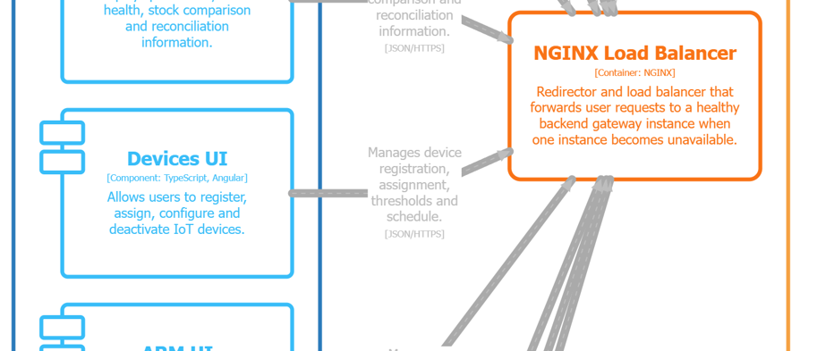

#### Mobile Application Component Diagram

La Mobile Application permite que un administrador o encargado operativo realice tareas de consulta y configuración rápida del dispositivo desde el local físico.

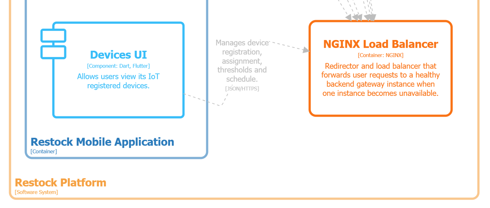

#### Backend Application Component Diagram

El Backend Application contiene la lógica principal del bounded context. Expone controladores REST, ejecuta command handlers y query handlers, aplica reglas de dominio, persiste información en MongoDB y publica eventos hacia Assets and Resource Management.

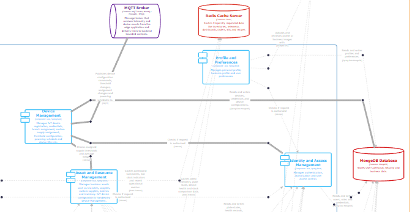

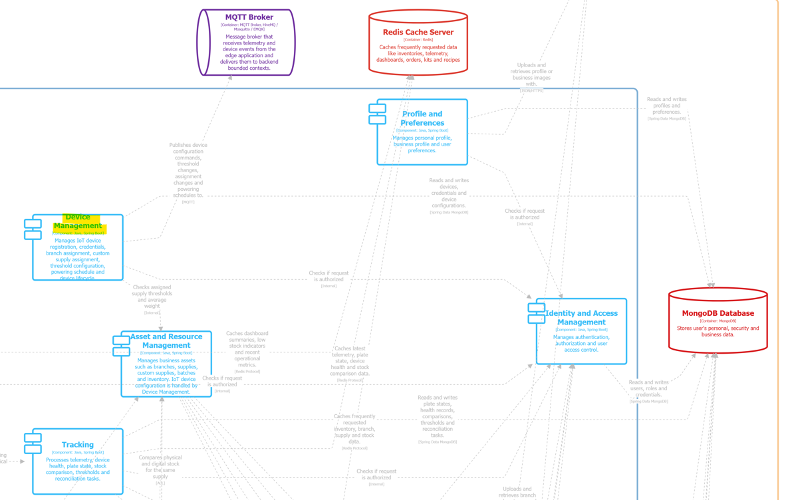

#### 4.2.9.6. Bounded Context Software Architecture Code Level Diagrams

En esta sección, el equipo presenta los diagramas de mayor detalle para la implementación del Bounded Context Device Management. Se incluyen el diagrama de clases de la capa de dominio y el diagrama de diseño de base de datos.

##### 4.2.9.6.1. Bounded Context Domain Layer Class Diagrams

En esta sección, el equipo presenta el diagrama de clases UML correspondiente a la capa de dominio del Bounded Context Device Management.

El modelo evidencia que Device es el Aggregate Root principal. Este agregado contiene las reglas relacionadas con registro, asignación, configuración de medición, confirmación y desactivación. La clase DeviceSpecification representa los datos técnicos básicos del hardware, mientras que DeviceMeasurementConfiguration encapsula los valores necesarios para interpretar mediciones de peso.

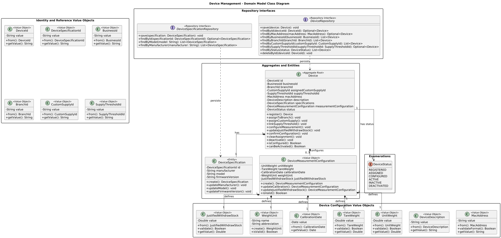

##### 4.2.9.6.2. Bounded Context Database Design Diagram

En esta sección, el equipo presenta el Database Diagram correspondiente al Bounded Context Device Management. Este diseño considera únicamente los objetos de persistencia que pertenecen a este contexto: devices y devices_specifications.

La tabla o colección devices almacena la información administrativa del dispositivo, su asignación actual y los parámetros necesarios para su configuración. La tabla o colección devices_specifications almacena los datos técnicos básicos del hardware.

Los campos business_id, branch_id, assigned_batch_id y supply_threshold_id son referencias externas. Esto significa que Device Management no administra directamente negocios, sucursales, insumos personalizados ni thresholds. Estos elementos pertenecen a otros bounded contexts y se validan mediante ACL.

De esta forma, el diseño de base de datos mantiene una separación clara de responsabilidades. Device Management administra la configuración base del dispositivo, mientras que el bounded context Tracking utiliza dicha configuración para procesar lecturas, calcular stock físico, evaluar thresholds, detectar anomalías y generar tareas de conciliación.

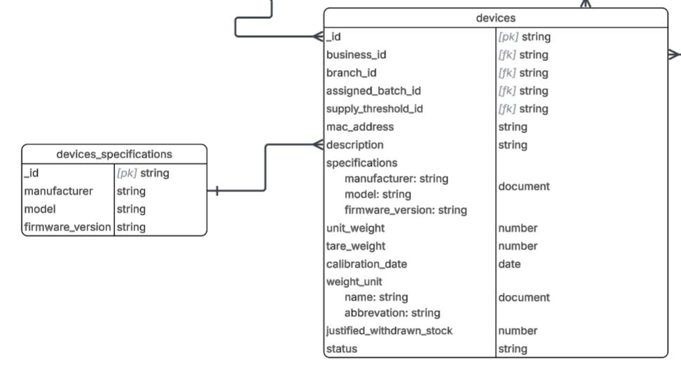

## 4.2.10. Bounded Context: Analytics

#### 4.2.10.1. Domain Layer

La capa de dominio del Bounded Context de Analytics encapsula las reglas de negocio relacionadas con la construcción, consulta y presentación de indicadores operativos del inventario. Este contexto actúa como agregador de información proveniente de otros bounded contexts como Tracking, Asset and Resource Management y Communication, para transformarla en métricas accionables dirigidas a los actores correspondientes (Retail Manager, Restaurant Manager). La responsabilidad principal de este contexto es garantizar que el dashboard refleje en todo momento el estado real del negocio: insumos con stock cero, insumos con bajo stock, últimos insumos registrados y alertas recientes. La capa de dominio no depende de frameworks, mecanismos de persistencia ni servicios externos.

#### Aggregates & Entities

Estas clases representan los pilares transaccionales del sistema. El Aggregate Root garantiza la consistencia de los datos dentro de su límite de transacción.

*Tabla de Aggregates en el Domain Layer*

| Nombre de Clase  | Categoría     | Propósito y Reglas de Negocio                                                                                                                                                                                                                                                                                                                                                                                                                                                                            |
| ---------------- | -------------- | --------------------------------------------------------------------------------------------------------------------------------------------------------------------------------------------------------------------------------------------------------------------------------------------------------------------------------------------------------------------------------------------------------------------------------------------------------------------------------------------------------- |
| **Metric** | Aggregate Root | Representa el estado consolidado del dashboard para una cuenta de negocio en un momento dado. Agrupa los indicadores operativos clave: insumos con stock cero, insumos con bajo stock, últimos insumos registrados y alertas recientes. Controla su ciclo de vida: construcción, actualización ante eventos de inventario o alerta, y consulta por parte de los administradores. Garantiza que los indicadores presentados correspondan siempre a la sucursal o cuenta activa del usuario autenticado. |

#### Value Objects

Estas clases modelan conceptos propios del dominio y permiten evitar el uso indiscriminado de tipos primitivos. Son inmutables y aseguran que la información crítica del dominio sea válida desde su creación.

*Tabla de Value Objects en el Domain Layer*

| Nombre de Clase                                    | Categoría   | Propósito y Reglas de Negocio                                                                                                                                                                                                                                                             |
| -------------------------------------------------- | ------------ | ------------------------------------------------------------------------------------------------------------------------------------------------------------------------------------------------------------------------------------------------------------------------------------------ |
| **StockIndicator**                           | Value Object | Encapsula la información de un insumo en estado crítico: identificador del insumo, nombre, cantidad actual, umbral mínimo y sucursal de origen. Permite clasificar el insumo como zero_stock o low_stock según la comparación entre la cantidad actual y el umbral configurado.       |
| **RecentSupplyEntry**                        | Value Object | Encapsula los datos de un insumo registrado recientemente en el sistema: identificador, nombre, categoría, fecha de registro y sucursal de origen. Permite presentar al administrador los últimos insumos incorporados al inventario sin exponer el modelo completo del insumo.          |
| **RecentAlertEntry**                         | Value Object | Encapsula los datos de una alerta reciente generada por el sistema: identificador, tipo de alerta, mensaje, prioridad, sucursal de origen y timestamp. Permite al dashboard presentar las últimas alertas sin depender directamente del modelo interno del Bounded Context Communication. |
| **DashboardSummaryId, BusinessId, BranchId** | Value Object | Identificadores fuertemente tipados para prevenir confusiones entre entidades del mismo bounded context o referencias externas provenientes de otros contextos, alineados con los campos de identificación del negocio y la sucursal activa del usuario autenticado.                      |

#### Commands

Los commands representan intenciones de cambio de estado dentro del dominio. Son objetos inmutables que encapsulan los datos necesarios para ejecutar una operación.

*Tabla de Commands en el Domain Layer*

| Nombre de Clase                          | Categoría | Propósito                                                                                                                                                                                                                                                                                          |
| ---------------------------------------- | ---------- | --------------------------------------------------------------------------------------------------------------------------------------------------------------------------------------------------------------------------------------------------------------------------------------------------- |
| **RefreshDashboardSummaryCommand** | Command    | Encapsula los datos necesarios para reconstruir el resumen del dashboard de una cuenta: businessId, branchId opcional y timestamp de actualización. Es invocado por los Event Handlers cuando llegan eventos de inventario o alerta desde Asset and Resource Management, Tracking o Communication. |

#### Queries

Las queries representan intenciones de consulta de información sin modificar el estado del dominio.

*Tabla de Queries en el Domain Layer*

| Nombre de Clase                     | Categoría | Propósito                                                                                                                                                                                                                                  |
| ----------------------------------- | ---------- | ------------------------------------------------------------------------------------------------------------------------------------------------------------------------------------------------------------------------------------------- |
| **GetDashboardSummaryQuery**  | Query      | Encapsula los criterios de consulta para recuperar el resumen del dashboard de una cuenta autenticada: businessId y branchId opcional. Retorna los indicadores de stock cero, bajo stock, últimos insumos registrados y alertas recientes. |
| **GetZeroStockSuppliesQuery** | Query      | Encapsula los criterios para recuperar el listado de insumos con stock igual a cero para una cuenta y sucursal determinadas.                                                                                                                |
| **GetLowStockSuppliesQuery**  | Query      | Encapsula los criterios para recuperar el listado de insumos cuya cantidad actual se encuentra por debajo del umbral mínimo configurado, ordenados por nivel de criticidad.                                                                |
| **GetRecentSuppliesQuery**    | Query      | Encapsula los criterios para recuperar los últimos insumos registrados en el inventario de una cuenta, con soporte de filtro por sucursal y límite de resultados.                                                                         |
| **GetRecentAlertsQuery**      | Query      | Encapsula los criterios para recuperar las últimas alertas generadas por el sistema para una cuenta, con soporte de filtro por tipo de alerta y sucursal de origen.                                                                        |

#### Domain Events

Los domain events representan hechos relevantes que ocurrieron dentro del dominio y permiten la comunicación desacoplada entre bounded contexts.

*Tabla de Domain Events en el Domain Layer*

| Nombre de Clase                          | Categoría              | Propósito                                                                                                                                                                                                                                 |
| ---------------------------------------- | ----------------------- | ------------------------------------------------------------------------------------------------------------------------------------------------------------------------------------------------------------------------------------------ |
| **DashboardSummaryRefreshedEvent** | Domain Event            | Emitido por el aggregate Metric al completar su actualización exitosamente. Permite que otros componentes del contexto reaccionen para invalidar cachés o notificar a clientes conectados mediante WebSocket.                            |
| **StockLevelChangedEvent**         | Domain Event (entrante) | Evento de integración proveniente del bounded context Asset and Resource Management que notifica un cambio en el nivel de stock de un insumo. Dispara la actualización de los indicadores de stock cero y bajo stock en el dashboard.    |
| **SupplyRegisteredEvent**          | Domain Event (entrante) | Evento de integración proveniente del bounded context Asset and Resource Management que notifica el registro de un nuevo insumo en el catálogo. Dispara la actualización del indicador de últimos insumos registrados en el dashboard. |
| **NotificationGeneratedEvent**     | Domain Event (entrante) | Evento de integración proveniente del bounded context Communication que notifica la generación de una nueva alerta. Dispara la actualización del indicador de alertas recientes en el dashboard.                                        |

#### 4.2.10.2. Interface Layer

La capa de interfaz del Bounded Context de Analytics expone los endpoints RESTful necesarios para que los actores del sistema puedan consultar los indicadores del dashboard desde la aplicación web y móvil. Esta capa recibe solicitudes desde la Web App o la Mobile App, las transforma en queries y delega su ejecución a la capa de aplicación. Los datos consultados se sirven desde la caché Redis cuando están disponibles, garantizando tiempos de respuesta bajos para las vistas de mayor frecuencia de acceso.

#### AnalyticsController

*Tabla de AnalyticsController en el Interface Layer*

| Propiedad            | Valor                                                                                                                                                                                                  |
| -------------------- | ------------------------------------------------------------------------------------------------------------------------------------------------------------------------------------------------------ |
| **Nombre**     | AnalyticsController                                                                                                                                                                                    |
| **Categoría** | Controller                                                                                                                                                                                             |
| **Propósito** | Exponer endpoints para consultar el resumen del dashboard, los insumos con stock cero, los insumos con bajo stock, los últimos insumos registrados y las alertas recientes de una cuenta autenticada. |
| **Ruta**       | /api/v1/analytics                                                                                                                                                                                      |

*Tabla de métodos de AnalyticsController en el Interface Layer*

| Nombre               | Ruta                       | Acción                                                                                                       | Handle (Command/Query)    |
| -------------------- | -------------------------- | ------------------------------------------------------------------------------------------------------------- | ------------------------- |
| GetDashboardSummary  | /dashboard (GET)           | Retorna el resumen consolidado del dashboard con todos los indicadores operativos para la cuenta autenticada. | GetDashboardSummaryQuery  |
| GetZeroStockSupplies | /supplies/zero-stock (GET) | Retorna el listado de insumos con stock igual a cero para la cuenta y sucursal activa.                        | GetZeroStockSuppliesQuery |
| GetLowStockSupplies  | /supplies/low-stock (GET)  | Retorna el listado de insumos con stock por debajo del umbral mínimo, ordenados por nivel de criticidad.     | GetLowStockSuppliesQuery  |
| GetRecentSupplies    | /supplies/recent (GET)     | Retorna los últimos insumos registrados en el inventario de la cuenta autenticada.                           | GetRecentSuppliesQuery    |
| GetRecentAlerts      | /alerts/recent (GET)       | Retorna las últimas alertas generadas por el sistema para la cuenta autenticada.                             | GetRecentAlertsQuery      |

#### 4.2.10.3. Application Layer

La capa de aplicación del Bounded Context de Analytics orquesta los casos de uso relacionados con la construcción y consulta de indicadores del dashboard. En esta capa residen los Command Handlers, Query Handlers y Event Handlers que coordinan el flujo entre la capa de interfaz, el dominio y la infraestructura. Esta capa no contiene reglas puras de dominio. Su responsabilidad es reaccionar a eventos externos provenientes de Asset and Resource Management, Tracking y Communication, reconstruir los indicadores del dashboard, almacenarlos en la caché Redis para optimizar las consultas frecuentes y exponerlos a los clientes a través de la capa de interfaz.

#### RefreshDashboardSummaryCommandHandler

*Tabla de RefreshDashboardSummaryCommandHandler en el Application Layer*

| Propiedad            | Valor                                                                                                                                                                                                                                                                                                  |
| -------------------- | ------------------------------------------------------------------------------------------------------------------------------------------------------------------------------------------------------------------------------------------------------------------------------------------------------ |
| **Nombre**     | RefreshDashboardSummaryCommandHandler                                                                                                                                                                                                                                                                  |
| **Categoría** | Command Handler                                                                                                                                                                                                                                                                                        |
| **Propósito** | Orquestar la reconstrucción del resumen del dashboard consultando los datos actualizados de inventario desde Asset and Resource Management y las alertas recientes desde Communication, persistiendo el resultado en la caché Redis e invalidando los datos anteriores para garantizar consistencia. |
| **Comando**    | RefreshDashboardSummaryCommand                                                                                                                                                                                                                                                                         |

#### GetDashboardSummaryQueryHandler

*Tabla de GetDashboardSummaryQueryHandler en el Application Layer*

| Propiedad            | Valor                                                                                                                                                                                                                                                        |
| -------------------- | ------------------------------------------------------------------------------------------------------------------------------------------------------------------------------------------------------------------------------------------------------------ |
| **Nombre**     | GetDashboardSummaryQueryHandler                                                                                                                                                                                                                              |
| **Categoría** | Query Handler                                                                                                                                                                                                                                                |
| **Propósito** | Consultar el resumen consolidado del dashboard desde la caché Redis para la cuenta autenticada. Si los datos no están disponibles en caché, delega la reconstrucción al RefreshDashboardSummaryCommandHandler antes de retornar la respuesta al cliente. |
| **Query**      | GetDashboardSummaryQuery                                                                                                                                                                                                                                     |

#### GetZeroStockSuppliesQueryHandler

*Tabla de GetZeroStockSuppliesQueryHandler en el Application Layer*

| Propiedad            | Valor                                                                                                                                                                                                                  |
| -------------------- | ---------------------------------------------------------------------------------------------------------------------------------------------------------------------------------------------------------------------- |
| **Nombre**     | GetZeroStockSuppliesQueryHandler                                                                                                                                                                                       |
| **Categoría** | Query Handler                                                                                                                                                                                                          |
| **Propósito** | Consultar el listado de insumos con stock igual a cero para la cuenta y sucursal activa, recuperando los datos desde la caché Redis o delegando la consulta al repositorio de inventario si la caché está expirada. |
| **Query**      | GetZeroStockSuppliesQuery                                                                                                                                                                                              |

#### GetLowStockSuppliesQueryHandler

*Tabla de GetLowStockSuppliesQueryHandler en el Application Layer*

| Propiedad            | Valor                                                                                                                                                                                            |
| -------------------- | ------------------------------------------------------------------------------------------------------------------------------------------------------------------------------------------------ |
| **Nombre**     | GetLowStockSuppliesQueryHandler                                                                                                                                                                  |
| **Categoría** | Query Handler                                                                                                                                                                                    |
| **Propósito** | Consultar el listado de insumos con stock por debajo del umbral mínimo, ordenados por nivel de criticidad, desde la caché Redis o delegando al repositorio de inventario cuando sea necesario. |
| **Query**      | GetLowStockSuppliesQuery                                                                                                                                                                         |

#### GetRecentSuppliesQueryHandler

*Tabla de GetRecentSuppliesQueryHandler en el Application Layer*

| Propiedad            | Valor                                                                                                                                                                                                                                          |
| -------------------- | ---------------------------------------------------------------------------------------------------------------------------------------------------------------------------------------------------------------------------------------------- |
| **Nombre**     | GetRecentSuppliesQueryHandler                                                                                                                                                                                                                  |
| **Categoría** | Query Handler                                                                                                                                                                                                                                  |
| **Propósito** | Consultar los últimos insumos registrados en el inventario de la cuenta autenticada, con soporte de filtro por sucursal y límite de resultados, recuperando los datos desde la caché Redis o delegando al repositorio cuando sea necesario. |
| **Query**      | GetRecentSuppliesQuery                                                                                                                                                                                                                         |

#### GetRecentAlertsQueryHandler

*Tabla de GetRecentAlertsQueryHandler en el Application Layer*

| Propiedad            | Valor                                                                                                                                                                                                                                            |
| -------------------- | ------------------------------------------------------------------------------------------------------------------------------------------------------------------------------------------------------------------------------------------------ |
| **Nombre**     | GetRecentAlertsQueryHandler                                                                                                                                                                                                                      |
| **Categoría** | Query Handler                                                                                                                                                                                                                                    |
| **Propósito** | Consultar las últimas alertas generadas por el sistema para la cuenta autenticada, con soporte de filtro por tipo de alerta y sucursal, recuperando los datos desde la caché Redis o delegando al repositorio de alertas cuando sea necesario. |
| **Query**      | GetRecentAlertsQuery                                                                                                                                                                                                                             |

#### StockLevelChangedEventHandler

*Tabla de StockLevelChangedEventHandler en el Application Layer*

| Propiedad            | Valor                                                                                                                                                                                                                                |
| -------------------- | ------------------------------------------------------------------------------------------------------------------------------------------------------------------------------------------------------------------------------------ |
| **Nombre**     | StockLevelChangedEventHandler                                                                                                                                                                                                        |
| **Categoría** | Event Handler                                                                                                                                                                                                                        |
| **Propósito** | Reaccionar al evento emitido por Asset and Resource Management cuando cambia el nivel de stock de un insumo, invocando el RefreshDashboardSummaryCommand para actualizar los indicadores de stock cero y bajo stock en el dashboard. |
| **Evento**     | StockLevelChangedEvent                                                                                                                                                                                                               |

#### SupplyRegisteredEventHandler

*Tabla de SupplyRegisteredEventHandler en el Application Layer*

| Propiedad            | Valor                                                                                                                                                                                                                                        |
| -------------------- | -------------------------------------------------------------------------------------------------------------------------------------------------------------------------------------------------------------------------------------------- |
| **Nombre**     | SupplyRegisteredEventHandler                                                                                                                                                                                                                 |
| **Categoría** | Event Handler                                                                                                                                                                                                                                |
| **Propósito** | Reaccionar al evento emitido por Asset and Resource Management cuando se registra un nuevo insumo en el catálogo, invocando el RefreshDashboardSummaryCommand para actualizar el indicador de últimos insumos registrados en el dashboard. |
| **Evento**     | SupplyRegisteredEvent                                                                                                                                                                                                                        |

#### NotificationGeneratedEventHandler

*Tabla de NotificationGeneratedEventHandler en el Application Layer*

| Propiedad            | Valor                                                                                                                                                                                                          |
| -------------------- | -------------------------------------------------------------------------------------------------------------------------------------------------------------------------------------------------------------- |
| **Nombre**     | NotificationGeneratedEventHandler                                                                                                                                                                              |
| **Categoría** | Event Handler                                                                                                                                                                                                  |
| **Propósito** | Reaccionar al evento emitido por Communication cuando se genera una nueva alerta en el sistema, invocando el RefreshDashboardSummaryCommand para actualizar el indicador de alertas recientes en el dashboard. |
| **Evento**     | NotificationGeneratedEvent                                                                                                                                                                                     |

#### 4.2.10.4. Infrastructure Layer

La capa de infraestructura del Bounded Context de Analytics resuelve los detalles técnicos necesarios para materializar las abstracciones definidas en el dominio. En esta capa se implementa el repositorio de resúmenes del dashboard, se configura la integración con la caché Redis para optimizar las consultas frecuentes, se gestiona la comunicación mediante Message Brokers para consumir eventos provenientes de Asset and Resource Management, Tracking y Communication, y se configuran las consultas de lectura sobre MongoDB para los indicadores que no están en caché. Esta capa no contiene reglas de negocio puras. Su responsabilidad es resolver persistencia en caché, consultas de lectura sobre las colecciones de otros bounded contexts y consumo de eventos de integración.

#### AnalyticsCacheRepository

*Tabla de AnalyticsCacheRepository en el Infrastructure Layer*

| Propiedad            | Valor                                                                                                                                                                                                                                                                                          |
| -------------------- | ---------------------------------------------------------------------------------------------------------------------------------------------------------------------------------------------------------------------------------------------------------------------------------------------- |
| **Nombre**     | AnalyticsCacheRepository                                                                                                                                                                                                                                                                       |
| **Categoría** | Cache Repository                                                                                                                                                                                                                                                                               |
| **Propósito** | Persistir y recuperar los resúmenes del dashboard, los indicadores de stock crítico, los últimos insumos registrados y las alertas recientes desde la caché Redis, aplicando políticas de expiración configurables para garantizar la frescura de los datos presentados en el dashboard. |
| **Interfaz**   | IAnalyticsCacheRepository                                                                                                                                                                                                                                                                      |

#### AnalyticsReadRepository

*Tabla de AnalyticsReadRepository en el Infrastructure Layer*

| Propiedad            | Valor                                                                                                                                                                                                            |
| -------------------- | ---------------------------------------------------------------------------------------------------------------------------------------------------------------------------------------------------------------- |
| **Nombre**     | AnalyticsReadRepository                                                                                                                                                                                          |
| **Categoría** | Read Repository                                                                                                                                                                                                  |
| **Propósito** | Ejecutar consultas de solo lectura sobre la colección `notifications` de MongoDB de Communication para construir el indicador de alertas recientes cuando los datos no están disponibles en la caché Redis. |
| **Interfaz**   | IAnalyticsReadRepository                                                                                                                                                                                         |

#### IntegrationEventConsumer

*Tabla de IntegrationEventConsumer en el Infrastructure Layer*

| Propiedad            | Valor                                                                                                                                                                                                                                                                                                             |
| -------------------- | ----------------------------------------------------------------------------------------------------------------------------------------------------------------------------------------------------------------------------------------------------------------------------------------------------------------- |
| **Nombre**     | IntegrationEventConsumer                                                                                                                                                                                                                                                                                          |
| **Categoría** | Message Broker Consumer                                                                                                                                                                                                                                                                                           |
| **Propósito** | Consumir eventos de integración emitidos por Asset and Resource Management (`StockLevelChangedEvent`, `SupplyRegisteredEvent`) y Communication (`NotificationGeneratedEvent`), transformándolos en comandos internos que disparan la actualización de los indicadores del dashboard dentro del contexto. |
| **Interfaz**   | IIntegrationEventConsumer                                                                                                                                                                                                                                                                                         |

#### 4.2.10.5. Bounded Context Software Architecture Component Level Diagrams

En esta sección se presentan los diagramas de componentes del Bounded Context Analytics, mostrando su comportamiento y responsabilidades desde tres perspectivas: aplicación web, aplicación móvil y backend. Cada diagrama refleja cómo este bounded context interactúa con otros contextos o servicios únicamente cuando dichas interacciones son necesarias para la construcción y presentación de los indicadores del dashboard.

##### Web Application Component Diagram

El componente Analytics dentro de la Restock Web Application actúa como punto de entrada para que los administradores de restaurante y retail consulten los indicadores operativos del inventario desde el navegador. Este componente extiende las utilidades base del componente Shared para la gestión de endpoints y realiza solicitudes REST al backend para recuperar los datos del dashboard, los insumos con stock crítico, los últimos insumos registrados y las alertas recientes.

El diagrama evidencia que el componente Analytics posee una responsabilidad acotada dentro de la capa cliente web. Su única interacción externa consiste en realizar solicitudes REST hacia el Cloud REST API mediante JSON/HTTPS para recuperar los indicadores operativos, extendiendo las utilidades base del componente Shared para la configuración de cabeceras HTTP y endpoints. Este diseño refleja el principio de responsabilidad única aplicado al frontend: el componente web no construye indicadores ni accede directamente a las fuentes de datos; únicamente consume los datos ya procesados por el backend y los presenta al usuario.

##### Mobile Application Component Diagram

El componente Analytics dentro de la Restock Mobile Application replica el comportamiento del componente web, adaptado al contexto de la aplicación móvil desarrollada en Dart y Flutter. Al igual que en la versión web, extiende las utilidades base del componente Shared y realiza solicitudes al backend para recuperar los indicadores del dashboard y los resúmenes de stock, permitiendo que los administradores consulten el estado operativo de su negocio desde sus dispositivos móviles.

El diagrama muestra que el componente Analytics de la aplicación móvil replica estructuralmente el comportamiento del componente web, adaptado al contexto de Flutter y Dart. Esta simetría entre ambas implementaciones cliente garantiza una experiencia consistente independientemente del dispositivo utilizado.

##### Backend Application Component Diagram

El componente Analytics dentro del Cloud REST API concentra toda la lógica de construcción, actualización y consulta de los indicadores del dashboard. Este componente actúa como agregador de información proveniente de otros bounded contexts, valida la identidad del usuario mediante JWT a través del componente Identity and Access Management, consulta los datos desde la caché Redis o desde MongoDB cuando la caché está expirada, y retorna los indicadores consolidados al cliente solicitante.

El diagrama es el más representativo del Bounded Context Analytics, ya que concentra la lógica de agregación de indicadores operativos. El componente Analytics funciona como nodo central de consulta: recibe eventos de cambio de stock e inventario desde Asset and Resource Management y Tracking, recibe eventos de nuevas alertas desde Communications, reconstruye los indicadores del dashboard y los almacena en Redis. Ante las consultas de los clientes web y móvil, sirve los datos desde la caché cuando están disponibles, garantizando tiempos de respuesta bajos. Valida la identidad del usuario a través de Identity and Access Management mediante JWT antes de retornar cualquier dato operativo.

#### 4.2.10.6. Bounded Context Software Architecture Code Level Diagrams

##### 4.2.10.6.1. Bounded Context Domain Layer Class Diagrams

El diagrama de clases de la capa de dominio del Bounded Context de Analytics modela las responsabilidades estructurales del sistema de indicadores operativos del inventario. Su diseño refleja cómo el dominio encapsula el ciclo de vida de un resumen del dashboard, desde su construcción ante un evento de inventario o alerta externo hasta su consulta por parte de los administradores, sin depender de ningún framework, mecanismo de persistencia ni servicio externo. El modelo se organiza en dos paquetes principales: model, que agrupa los aggregates, value objects y domain events que definen la estructura y las reglas del dominio, y services, que contiene los commands y queries que permiten la comunicación desacoplada tanto hacia el interior del contexto como hacia otros bounded contexts.

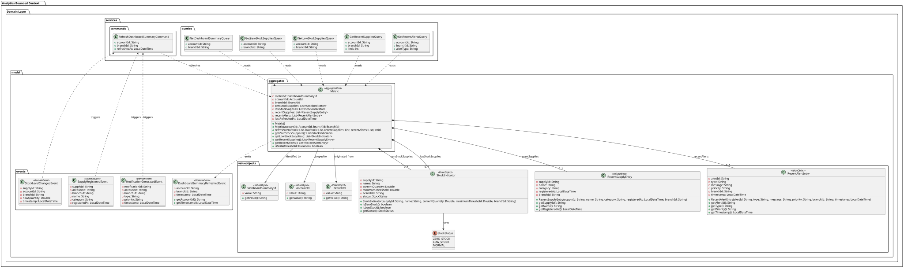

El diagrama de clases del Bounded Context de Analytics se centra en un único Aggregate Root, Metric, que actúa como la unidad principal de consistencia del dashboard. Toda la lógica de actualización de indicadores se gestiona únicamente a través de su método `refresh()`, evitando cambios de estado fuera del aggregate. El modelo representa un dominio orientado a la agregación de datos, donde Metric consolida cuatro colecciones de Value Objects: `zeroStockSupplies` y `lowStockSupplies`, ambas compuestas por instancias de StockIndicator que encapsulan el estado crítico de cada insumo y exponen los métodos `isZeroStock()` e `isLowStock()` para clasificar automáticamente el nivel de criticidad; `recentSupplies`, compuesta por instancias de RecentSupplyEntry que representan los últimos insumos incorporados al catálogo; y `recentAlerts`, compuesta por instancias de RecentAlertEntry que presentan las últimas alertas generadas por el sistema sin depender del modelo interno del Bounded Context Communication. La consistencia se refuerza además con el uso de identificadores fuertemente tipados como DashboardSummaryId, BusinessId y BranchId, agrupados dentro del paquete valueobjects bajo model. El enum StockStatus, que restringe los valores válidos del estado de stock a `ZERO_STOCK`, `LOW_STOCK` y `NORMAL`, se define en el Bounded Context Shared dado que es utilizado tanto por Analytics como por Asset and Resource Management. El paquete services agrupa el command RefreshDashboardSummaryCommand, invocado por los event handlers ante eventos entrantes de inventario o alerta, y las queries GetDashboardSummaryQuery, GetZeroStockSuppliesQuery, GetLowStockSuppliesQuery, GetRecentSuppliesQuery y GetRecentAlertsQuery, que permiten consultar los indicadores del dashboard sin modificar el estado del dominio. Los domain events del paquete events incluyen DashboardSummaryRefreshedEvent, emitido por el aggregate al completar su actualización, y los eventos entrantes StockLevelChangedEvent, SupplyRegisteredEvent y NotificationGeneratedEvent, que actúan como disparadores del proceso de refresh. Todos los tipos utilizados corresponden a tipos nativos de Java Spring Boot, como `LocalDateTime`, `Double`, `int` y `boolean`, manteniendo una implementación coherente con la tecnología del proyecto.

##### 4.2.10.6.2. Bounded Context Database Design Diagram

El diagrama de diseño de base de datos del Bounded Context Analytics muestra la estructura de almacenamiento que soporta los indicadores del dashboard. Analytics no posee colecciones transaccionales propias en MongoDB: opera como un contexto de solo lectura que consolida información proveniente de Asset and Resource Management y Communication, y persiste los resultados procesados en la caché Redis para optimizar las consultas frecuentes del dashboard.

El diagrama evidencia que Analytics no gestiona colecciones propias en MongoDB. Su modelo de persistencia se basa en dos mecanismos complementarios: consultas de solo lectura sobre la colección `notifications` de Communication para construir el indicador de alertas recientes; y almacenamiento en Redis de los resúmenes consolidados del dashboard, aplicando políticas de expiración configurables para garantizar la frescura de los datos presentados.

La única estructura de persistencia propia del contexto es la entrada **`dashboard_snapshot`** en Redis, que almacena el estado más reciente del resumen del dashboard por cuenta y sucursal activa. Cada entrada agrupa los cuatro indicadores operativos —insumos con stock cero, insumos con bajo stock, últimos insumos registrados y alertas recientes— como un documento serializado con TTL configurable. Este diseño refleja una decisión arquitectónica deliberada: Analytics es un contexto de agregación y presentación, no de escritura, lo que elimina la necesidad de colecciones transaccionales propias y reduce la duplicación de datos en el sistema
