# Capítulo IV: Solution Software Design

## 4.1. Strategic-Level Domain-Driven Design

### 4.1.1. Design-Level EventStorming

#### 4.1.1.1 Candidate Context Discovery

A partir del modelo de Event Storming, se llevó a cabo una sesión de Candidate Context Discovery para identificar los bounded contexts de la solución. Se utilizó principalmente la técnica look-for-pivotal-events durante la sesión.

Primero, se buscaron eventos clave que indiquen cambios de estado entre diferentes partes del proceso del negocio:

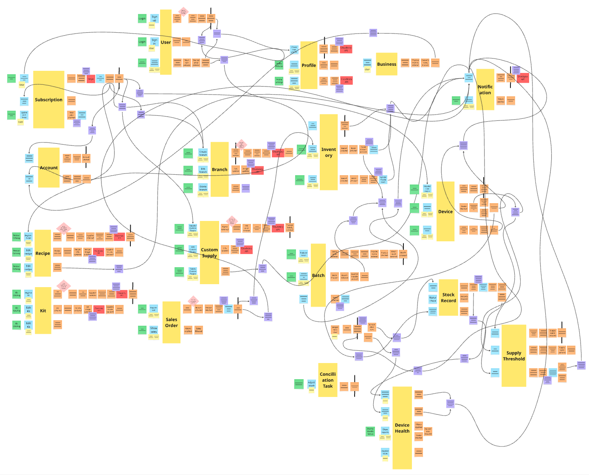

Luego, se agruparon los eventos de acuerdo a los principales cambios de contexto.

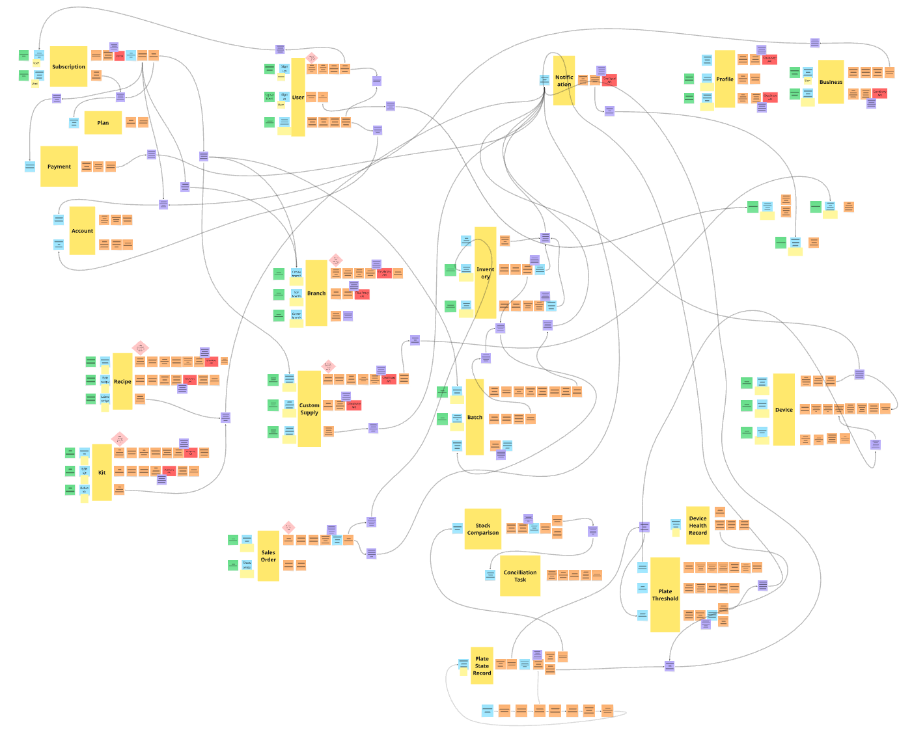

Se trazaron fronteras alrededor de los grupos identificados, estableciendo los límites iniciales de los bounded contexts.

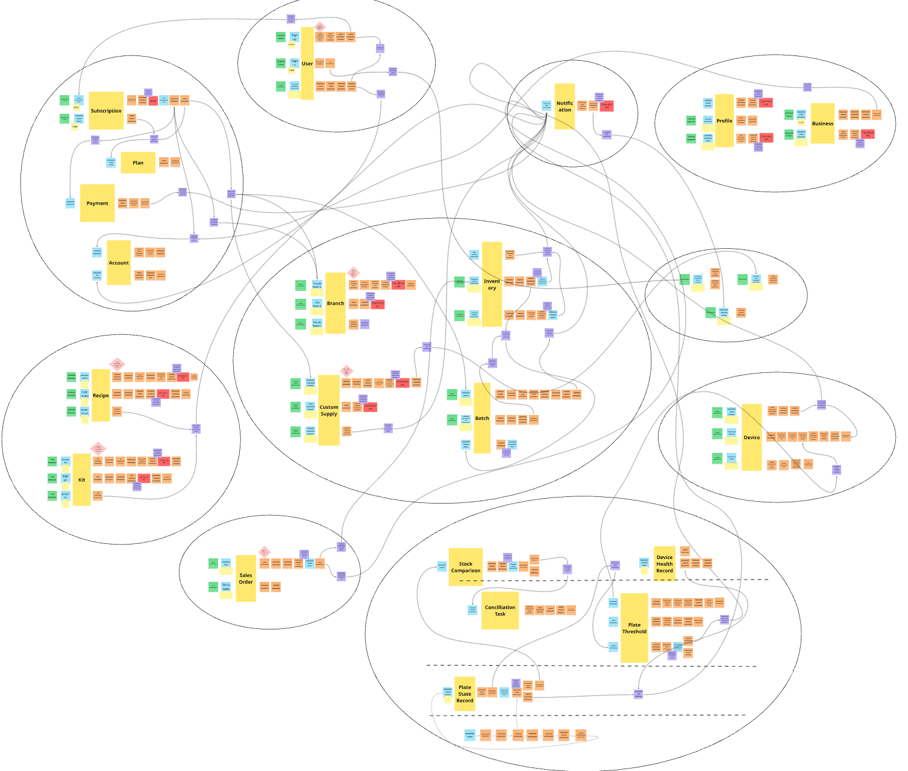

Finalmente, se seleccionaron nombres para los bounded context. Dando como resultado la definición de 8 bounded contexts y la **versión final del Event Storming**:

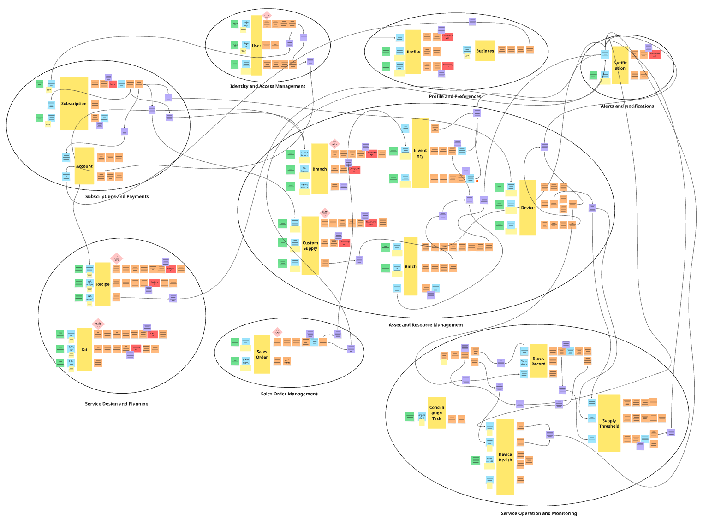

A continuación, se explicará en qué consiste cada bounded context:

**Identity and Access Management:** También llamado "IAM", este bounded context contiene el proceso de ingreso del usuario a la plataforma, ya sea iniciando sesión o registrandose.

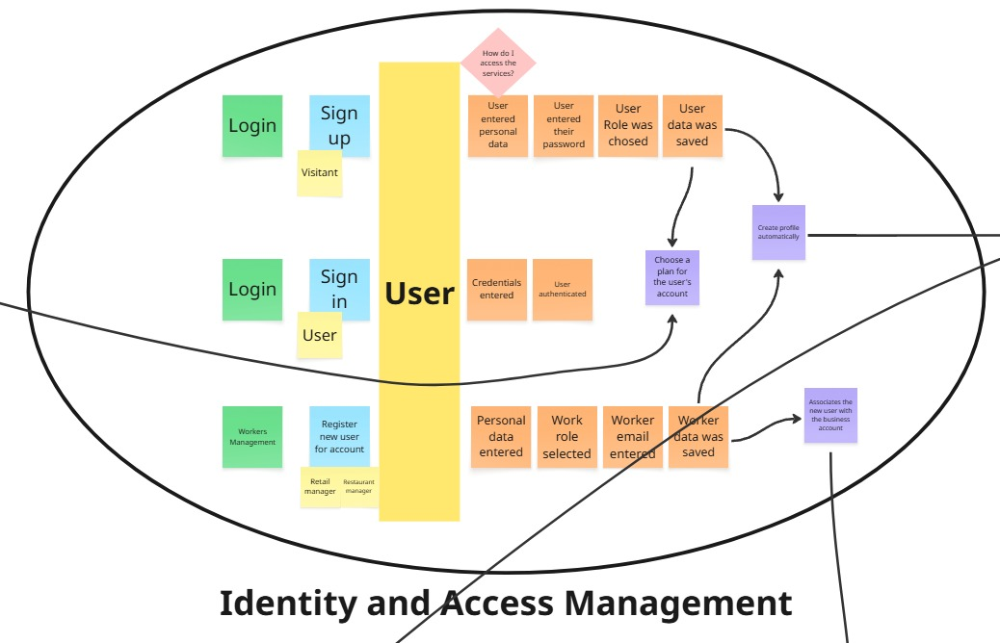

**Subscriptions and Payments:** También llamado "Subscriptions", este bounded context contiene el proceso de selección de planes, configuración de suscripciones, procesamiento de pagos e inicialización de cuentas de negocio, incluyendo la integración con plataformas externas como Stripe.

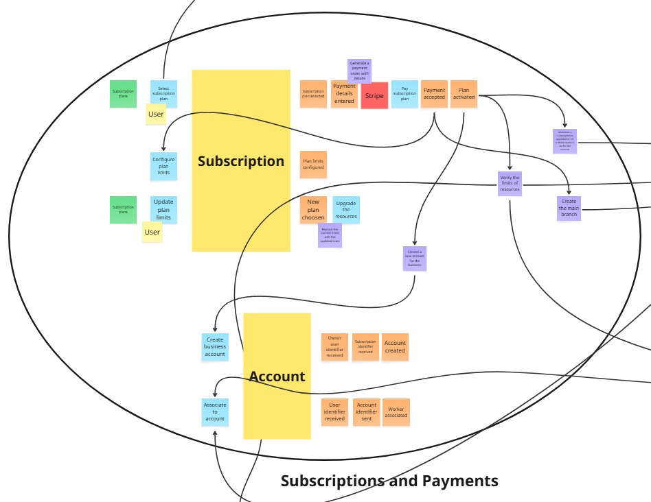

**Profiles and Preferences:** También llamado "Profile", este bounded context contiene el proceso de gestión de la información personal del usuario, incluyendo la actualización de datos, cambio de contraseña y configuración de preferencias, así como la gestión de información del negocio.

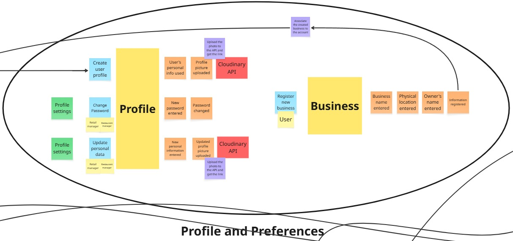

**Alerts and Notifications:** También llamado "Notifications", este bounded context contiene el proceso de generación, envío y recepción de notificaciones dentro de la plataforma, a partir de eventos relevantes del sistema como alertas de stock o incidencias, integrándose con servicios externos como OneSignal para la distribución de mensajes.

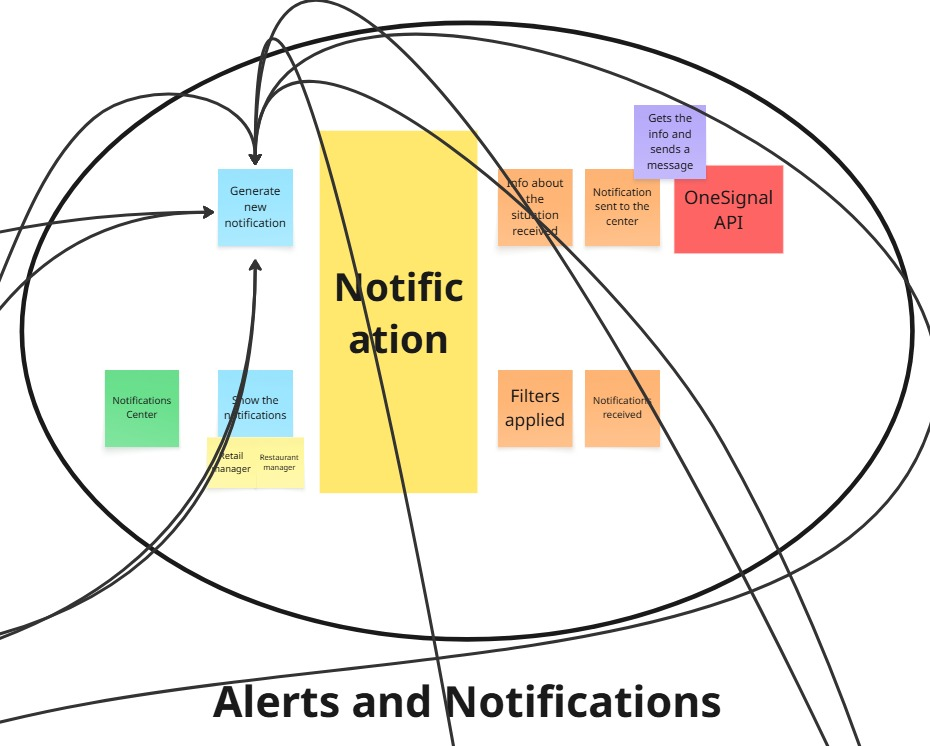

**Asset and Resource Management:** También llamado "Resource", este bounded context contiene el proceso de gestión de inventario, insumos, lotes y sucursales, incluyendo el registro, actualización y control de stock, así como la administración de proveedores y recursos asociados.

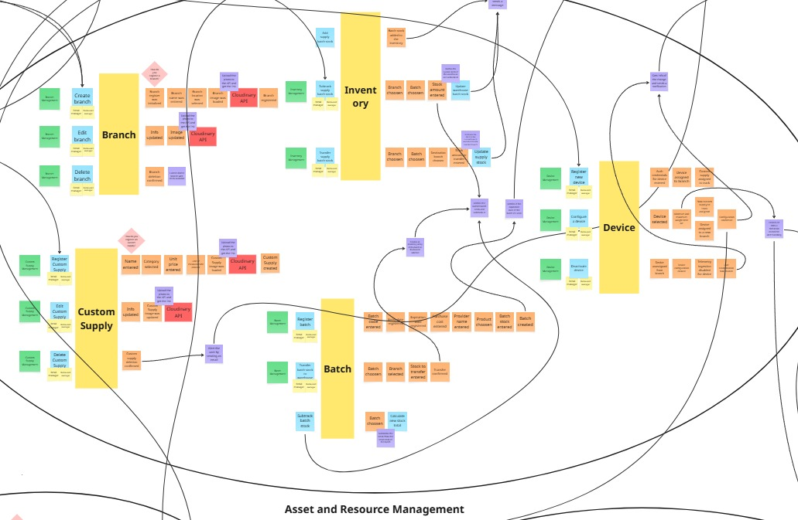

**Service Design and Planning:** También llamado "Planning", este bounded context contiene el proceso de diseño y gestión de recetas y kits, incluyendo la selección de insumos, categorización, actualización de información y almacenamiento de imágenes, permitiendo definir cómo se estructuran los productos dentro del sistema.

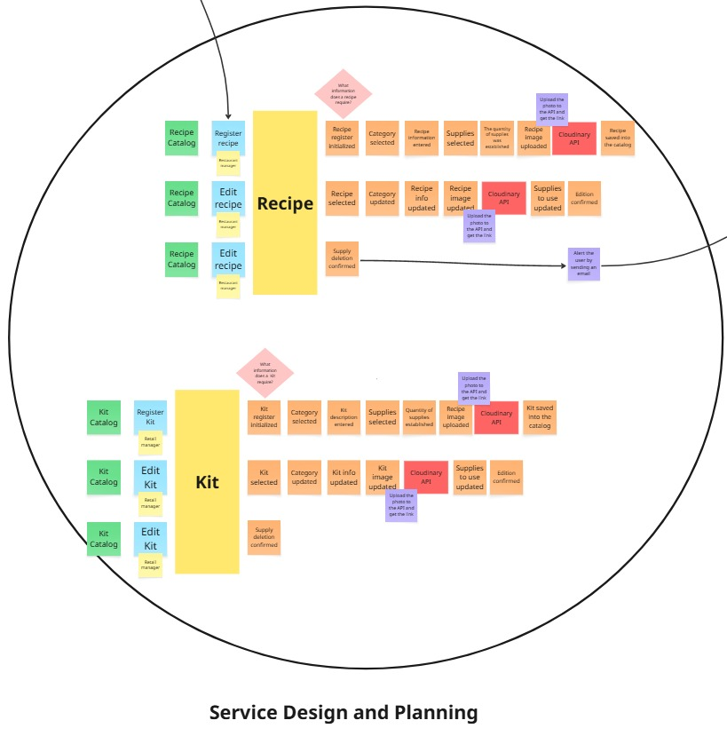

**Sales Order Management:** También llamado "Sales", este bounded context contiene el proceso de registro y gestión de ventas, incluyendo la selección de productos, cálculo del total, confirmación de la venta y actualización automática del stock disponible.

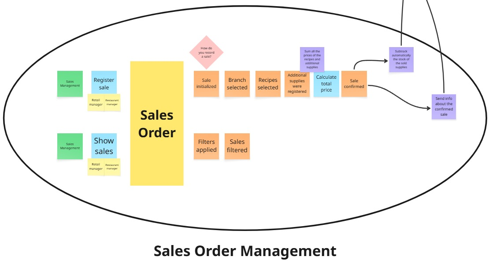

**Service Operation and Monitoring:** También llamado "Monitoring", este bounded context contiene el proceso de monitoreo del estado del inventario físico y dispositivos, incluyendo la recepción de datos desde sensores, detección de anomalías, gestión de umbrales de stock y generación de tareas de conciliación o alertas ante inconsistencias.

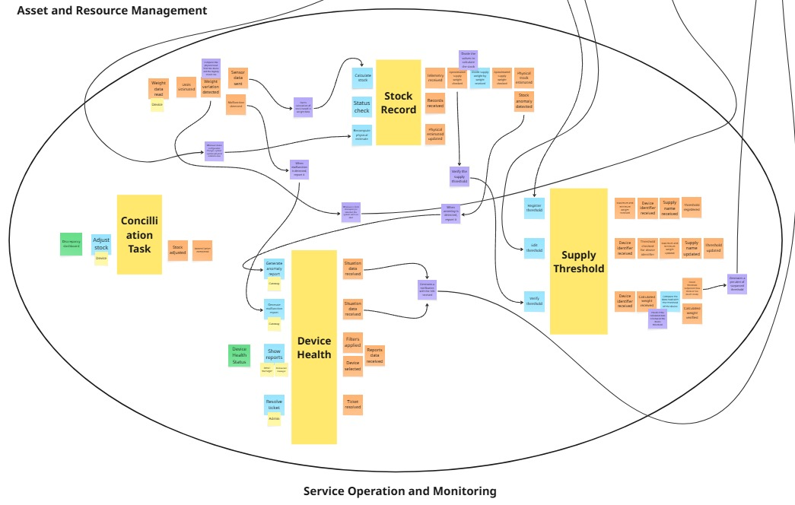

#### 4.1.1.2 Domain Message Flows Modeling

Los Domain Message Flows modelan las interacciones entre los diferentes bounded contexts, mostrando cómo se comunican entre sí mediante comandos, eventos y consultas. A continuación, se muestran los flujos de mensaje para los escenarios clave del negocio:

* **Access to platform:** En este flujo se muestra la interacción entre el bounded context IAM y el bounded context Profiles al momento en que un usuario se registra de forma omnicanal (Web o App) y se crea su perfil correspondiente.

  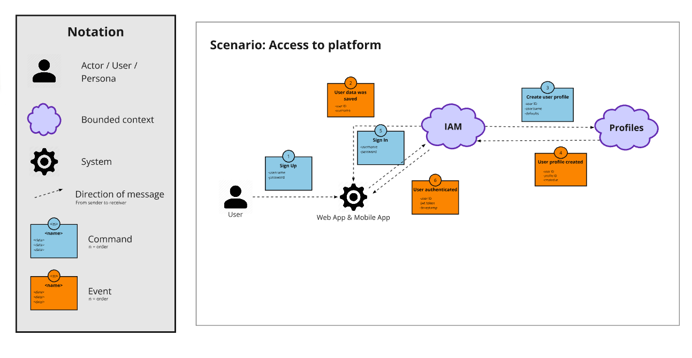

* **Record a recipe:** En este flujo se muestra la interacción entre el bounded context Planning y el bounded context Resource al momento en que un administrador diseña y registra una nueva receta, vinculando los insumos necesarios del almacén.

  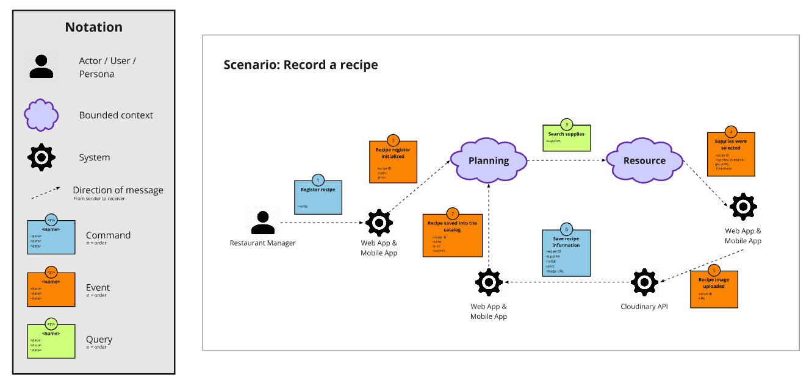

* **Register a restaurant sale and update inventory:** En este flujo se modela la complejidad de una venta en restaurante, donde el sistema interactúa con las recetas para deducir de Resource las cantidades exactas de insumos utilizados tras confirmar el ticket.

  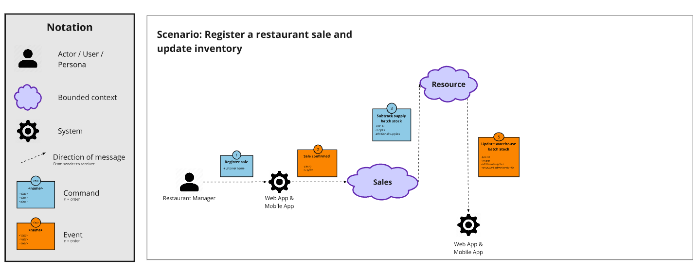

* **IoT Monitoring and Anomaly Detection:** En este escenario crítico se muestra la interacción entre Monitoring (Service Operation) y Resource. La telemetría capturada por el hardware solicita el stock teórico, detecta discrepancias físicas y genera tareas de conciliación para el administrador.

  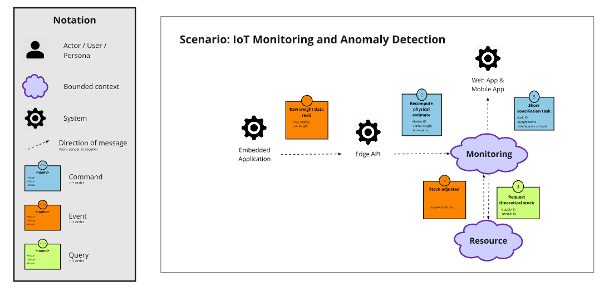

* **Push Notification Dispatch:** En este flujo se detalla cómo el bounded context de Notifications reacciona a eventos anómalos del sistema, filtrando destinatarios y delegando el envío de alertas a dispositivos móviles mediante una integración con una API externa (OneSignal).

  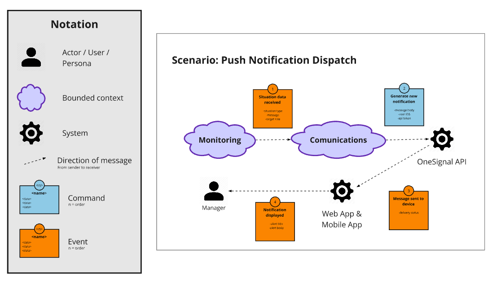

Adicionalmente, se presentan flujos de escenarios relevantes para el core del negocio, pero que por su alta cohesión resuelven sus procesos sin requerir interacción con otros bounded contexts externos:

* **Subscribe to a plan:** En este flujo se muestra el proceso de onboarding comercial, donde el registro empresarial y la confirmación de pago se orquestan internamente dentro del bounded context de Subscription.

  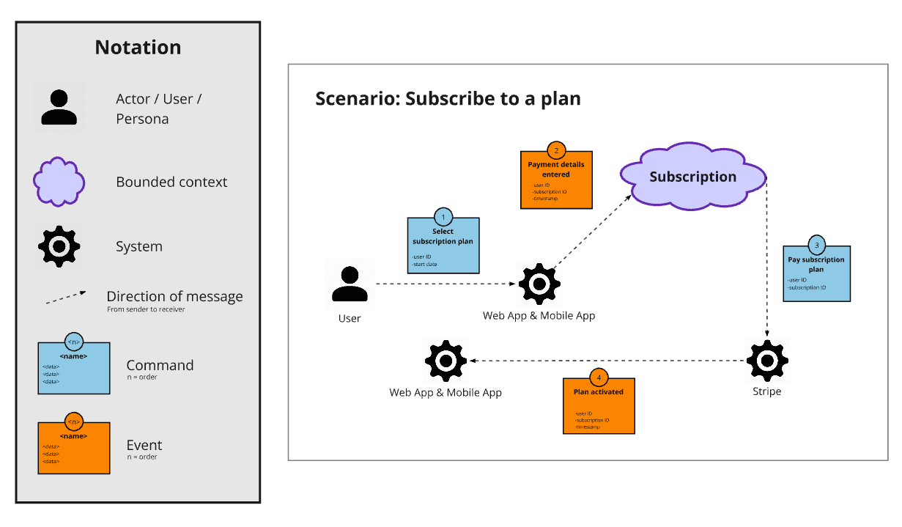

* **Record a supply in the inventory:** En este flujo se modela el ingreso manual o la actualización de existencias de un insumo, el cual es procesado exclusivamente dentro del bounded context Resource.

  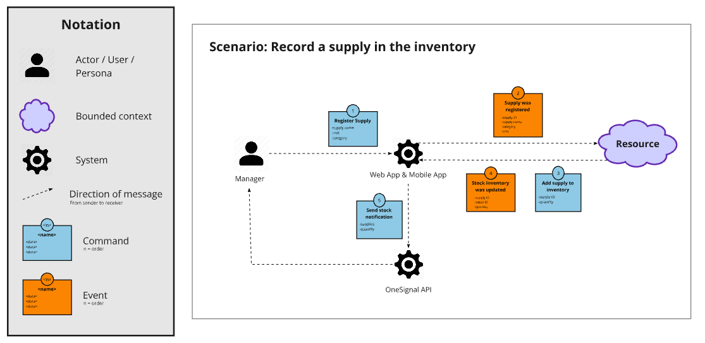

* **Register a physical branch and assign IoT devices:** En este flujo se evidencia el proceso de digitalización de una nueva sucursal y la vinculación de sus sensores físicos, consolidando entidades fuertemente acopladas dentro del bounded context Resource (Asset and Resource Management) y utilizando una API externa para la gestión de imágenes.

  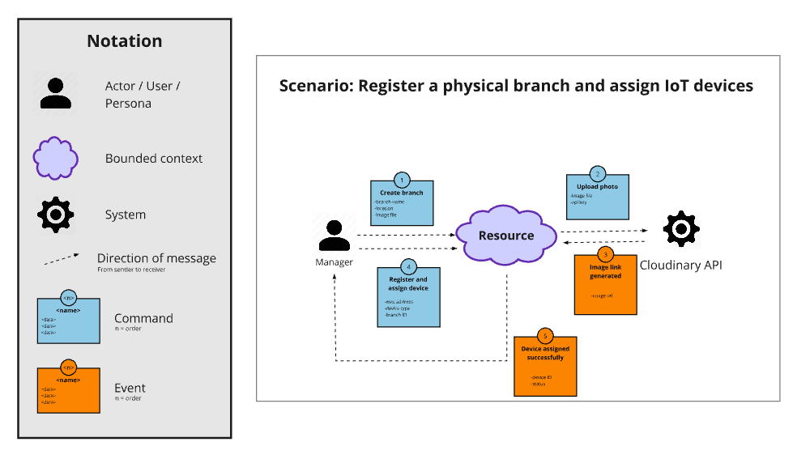
  
#### 4.1.1.3 Bounded Context Canvases

### 4.1.2. Context Mapping

En esta sección se explica el proceso de elaboración del Context Map. Asimismo, se permite visualizar las relaciones estructurales entre los Bounded Contexts, junto con los patrones de relación definidos en Domain-Driven Design (DDD), tales como Anti-Corruption Layer (ACL), Conformist, Customer/Supplier y Shared Kernel.

A continuación, se describen las relaciones y patrones de integración observados entre estos contextos.

#### Análisis de Bounded Contexts

##### Analytics ↔ Asset and Resource Management
- **Relación:** Upstream (Asset and Resource Management) / Downstream (Analytics)
- **Patrón:** Conformist — Analytics adopta directamente el modelo definido por Asset and Resource Management sin transformación propia. Asset and Resource Management es la fuente de verdad de los recursos del sistema, y Analytics se conforma a ese modelo para construir sus reportes y métricas.

##### Service Design and Planning ↔ Asset and Resource Management
- **Relación:** Upstream (Service Design and Planning) / Downstream (Asset and Resource Management)
- **Patrón:** Shared Kernel — Ambos contextos comparten un modelo común de diseño de servicios. Service Design and Planning actúa como proveedor (SUP) y Asset and Resource Management como cliente (CUST), garantizando que la planificación de servicios guíe la gestión de recursos sin duplicar el modelo compartido.

##### Asset and Resource Management ↔ Sales Order Management
- **Relación:** Upstream (Asset and Resource Management) / Downstream (Sales Order Management)
- **Patrón:** Shared Kernel — Asset and Resource Management provee información de recursos y activos que Sales Order Management consume para generar órdenes de venta correctamente asociadas. La relación SUP → CUST asegura que los datos de recursos sean la fuente autoritativa para los procesos de venta.

##### Asset and Resource Management ↔ Service Operation and Monitoring
- **Relación:** Upstream (Asset and Resource Management) / Downstream (Service Operation and Monitoring)
- **Patrón:** Anti-Corruption Layer — Service Operation and Monitoring consume datos de Asset and Resource Management, pero los traduce a su propio modelo operativo a través de un ACL. Esto protege al dominio operativo de ser contaminado con el lenguaje propio de la gestión de activos y recursos.

##### IAM ↔ Subscriptions and Payments
- **Relación:** Upstream (IAM) / Downstream (Subscriptions and Payments)
- **Patrón:** Anti-Corruption Layer — Subscriptions and Payments depende de IAM para validar la identidad del usuario, pero traduce el modelo de identidad a través de un ACL. Esto permite que el dominio de pagos mantenga su propio lenguaje sin acoplarse directamente al modelo de autenticación de IAM.

##### IAM ↔ Profile and Preferences
- **Relación:** Upstream (IAM) / Downstream (Profile and Preferences)
- **Patrón:** Anti-Corruption Layer — Profile and Preferences consume el modelo de identidad de IAM pero lo traduce a través de un ACL para construir el perfil del usuario. Esto protege al dominio de preferencias de ser contaminado con el lenguaje propio de la autenticación.

##### Service Operation and Monitoring ↔ Communication
- **Relación:** Upstream (Service Operation and Monitoring) / Downstream (Communication)
- **Patrón:** Customer/Supplier — Communication consume eventos operativos generados por Service Operation and Monitoring para notificar al personal o a los usuarios relevantes. Service Operation and Monitoring actúa como proveedor del contexto operativo que Communication necesita para ejecutar sus notificaciones.

##### Sales Order Management ↔ Communication
- **Relación:** Upstream (Sales Order Management) / Downstream (Communication)
- **Patrón:** Customer/Supplier — Communication consume información de órdenes de venta de Sales Order Management para emitir confirmaciones, alertas o notificaciones relacionadas con el ciclo de vida de las órdenes, sin conocer la lógica interna del dominio de ventas.

Con base en el análisis, se implementaron los siguientes patrones de relación entre contextos:

- **Conformist** entre Asset and Resource Management → Analytics.
- **Shared Kernel** entre Service Design and Planning → Asset and Resource Management y Asset and Resource Management → Sales Order Management.
- **Anti-Corruption Layer** en las relaciones de Service Operation and Monitoring, Subscriptions and Payments y Profile and Preferences con sus respectivos upstream.
- **Customer/Supplier** entre Service Operation and Monitoring → Communication y Sales Order Management → Communication.

En la imagen se observa que el contexto Asset and Resource Management actúa como el contexto central, relacionándose con dominios como Identity and Access Management, Sales Order Management, Service Design and Planning y Communication, lo que evidencia una distribución del sistema en bounded contexts con responsabilidades específicas.

Asimismo, las relaciones upstream/downstream (U/D) reflejan dependencias entre contextos, mientras que patrones como ACL (Anti-Corruption Layer) y SK (Shared Kernel) muestran mecanismos para integrar módulos, proteger el dominio y compartir elementos comunes cuando es necesario.

### 4.1.3. Software Architecture

En esta sección se presentan los diagramas de arquitectura de software basados en el modelo C4, los cuales permiten describir la estructura del sistema Restock a diferentes niveles de detalle.

#### 4.1.3.1. Software Architecture System Landscape Diagram

En esta sección se presenta una visión general de los principales usuarios, sistemas externos y componentes internos que interactúan con la plataforma.

Para Restock, el diagrama de panorama del sistema incluye los siguientes elementos principales:

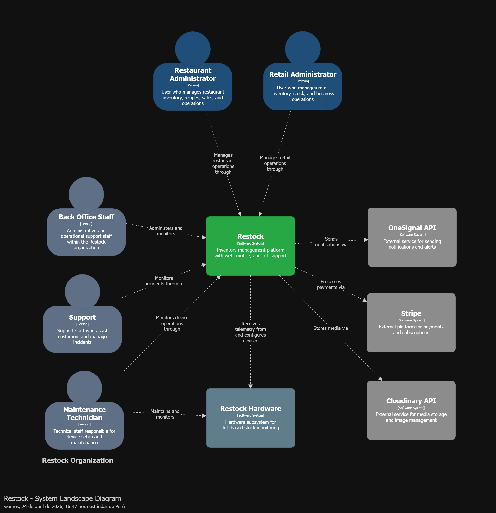

**Restaurant Administrator:** Usuario encargado de gestionar el inventario, recetas, ventas y operaciones dentro de un restaurante, interactuando directamente con la plataforma Restock para administrar sus procesos.

**Retail Administrator:** Usuario responsable de gestionar el inventario y las operaciones comerciales en entornos retail, utilizando Restock como herramienta central para el control del stock y la toma de decisiones.

**Back Office Staff:** Personal administrativo y operativo de la organización UI-Topic que se encarga de administrar, supervisar y dar soporte al sistema, asegurando su correcto funcionamiento.

**Support:** Equipo de soporte que asiste a los clientes, gestiona incidencias y monitorea el estado del sistema para garantizar una adecuada experiencia de usuario.

**Maintenance Technician:** Personal técnico responsable de la instalación, mantenimiento y monitoreo de los dispositivos físicos, asegurando la correcta operación del hardware asociado.

**Restock:** Sistema principal de la solución, encargado de la gestión del inventario y de coordinar la comunicación entre los distintos componentes, incluyendo aplicaciones, hardware IoT y servicios externos.

**Restock Hardware:** Subsistema de hardware orientado al monitoreo de stock mediante dispositivos IoT, que recopila datos físicos y los envía a la plataforma para su procesamiento.

**OneSignal API:** Servicio externo utilizado para el envío de notificaciones y alertas a los usuarios del sistema.

**Stripe:** Plataforma externa encargada de procesar pagos y suscripciones dentro de la solución.

**Cloudinary API:** Servicio externo utilizado para el almacenamiento y gestión de archivos multimedia, como imágenes asociadas a productos.

En conjunto, este diagrama muestra cómo Restock actúa como el núcleo del sistema, integrando a los distintos usuarios, componentes internos y servicios externos para ofrecer una solución completa de gestión de inventarios.

#### 4.1.3.2. Software Architecture Context Level Diagrams

El diagrama de contexto en la arquitectura de software proporciona una visión general de alto nivel del sistema dentro de su entorno, mostrando cómo interactúa con los actores externos, sistemas externos y con dispositivos IoT que capturan y envían datos del mundo físico. Este diagrama permite comprender los límites del sistema y las principales interacciones externas.

Para Restock, el diagrama de contexto incluye los siguientes actores, sistemas externos y dispositivos IoT:

**Visitors:** Usuarios anónimos que navegan el contenido público de la plataforma, como información, planes y características, y pueden registrarse o acceder como administradores de restaurante o retail.

**Restaurant Administrators:** Usuarios que gestionan el inventario, recetas, ventas y operaciones de restaurantes mediante la plataforma Restock.

**Retail Administrators:** Usuarios que gestionan el inventario, control de stock y operaciones comerciales en entornos de retail utilizando la plataforma Restock.

**Restock:** Sistema principal que permite la gestión de inventarios, monitoreo de stock en tiempo real y automatización de procesos mediante la integración con aplicaciones web, móviles, servicios externos y dispositivos IoT.

**Stripe:** Sistema externo que gestiona los pagos y suscripciones de los usuarios dentro de la plataforma Restock.

**Cloudinary API:** Servicio externo encargado del almacenamiento, gestión y entrega de imágenes y contenido multimedia utilizado en la plataforma.

**OneSignal API:** Servicio externo utilizado para el envío de notificaciones y alertas en tiempo real a los usuarios de la plataforma.

**Restock Smart Scale:** Dispositivo IoT que captura datos de peso desde el entorno físico mediante sensores y los transmite al sistema para su procesamiento y uso en el control de inventarios.

#### 4.1.3.2. Software Architecture Container Level Diagrams

El diagrama de contenedores de la arquitectura de software proporciona una visión de alto nivel de los principales contenedores del sistema, incluyendo aplicaciones, servicios, bases de datos y componentes IoT, como dispositivos embebidos y aplicaciones edge que interactúan con sensores físicos. Además, muestra cómo estos elementos se comunican entre sí para procesar y transmitir información.

Para Restock, el diagrama de contenedores incluye los siguientes contenedores principales:

**Landing Page:** Aplicación web estática desarrollada con HTML, CSS y JavaScript que presenta información pública sobre Restock, como funcionalidades, planes y términos, y guía a los usuarios hacia la aplicación web mediante elementos de navegación y llamados a la acción, interactuando con la Web Application a través de redirecciones.

**Web Application:** Componente que actúa como punto de entrada a la plataforma web de Restock, encargado de entregar la aplicación frontend al navegador del usuario, interactuando con la Restock Platform Web Application.

**Restock Platform Web Application:** Aplicación frontend desarrollada con TypeScript y Angular que se ejecuta en el navegador del usuario y permite gestionar el inventario, visualizar insumos y platos, y monitorear el stock en tiempo real, interactuando con la Restock Server Side Application mediante solicitudes API.

**Restock Mobile Application:** Aplicación móvil multiplataforma desarrollada con Dart y Flutter que permite a los usuarios gestionar inventario, consultar productos y monitorear el stock en tiempo real desde dispositivos móviles, interactuando con la Restock Server Side Application mediante API y con la Mobile SQLite Database para almacenamiento local.

**Mobile SQLite Database:** Base de datos local basada en SQLite que almacena información de la aplicación en el dispositivo móvil para permitir acceso offline y mejorar el rendimiento, interactuando únicamente con la Restock Mobile Application.

**Restock Local Station Edge Application:** Aplicación intermedia desarrollada en Python con Flask que recibe datos de peso desde la aplicación embebida, los procesa y los envía al backend, además de recibir comandos de configuración como encendido, apagado y asignación de producto desde el backend y transmitirlos al embedded, interactuando con la Restock Server Side Application, la Restock Embedded Application y la Edge Local Database.

**Edge Local Database:** Base de datos local basada en SQLite que almacena configuración del dispositivo, datos recientes de sensores y eventos pendientes de sincronización para garantizar el funcionamiento offline y la integridad de los datos, interactuando con la Restock Local Station Edge Application.

**Restock Embedded Application:** Software embebido desarrollado en C++ que controla el dispositivo físico de medición (balanza), captura datos de peso desde el sensor y ejecuta comandos recibidos como encendido, apagado o cambio de producto a monitorear, interactuando con la Restock Local Station Edge Application y el dispositivo Restock Smart Scale.

**Restock Server Side Application:** Aplicación backend desarrollada en Java con Spring Boot que gestiona la lógica de negocio, procesa datos de inventario, recibe información desde el edge, envía comandos de configuración a los dispositivos y coordina la comunicación entre los distintos componentes del sistema, interactuando con la Restock Database, la Restock Platform Web Application, la Restock Mobile Application, la Restock Local Station Edge Application y servicios externos como Stripe, Cloudinary y OneSignal.

**Restock Database:** Base de datos principal del sistema que almacena información de inventario, usuarios, productos y suscripciones, interactuando con la Restock Server Side Application.

#### 4.1.3.3. Software Architecture Deployment Diagrams

El siguiente diagrama de despliegue muestra la distribución física de los componentes de la plataforma Restock en los distintos entornos de ejecución, incluyendo infraestructura en la nube, dispositivos del usuario, nodos de cómputo en el edge y hardware embebido.

## 4.2. Tactical-Level Domain-Driven Design

### 4.2.1. Bounded Context: Identity and Access Management

#### 4.2.1.1. Domain Layer

#### 4.2.1.2. Interface Layer

#### 4.2.1.3. Application Layer

#### 4.2.1.4. Infrastructure Layer

#### 4.2.1.5. Bounded Context Software Architecture Component Level Diagrams

#### 4.2.1.6. Bounded Context Software Architecture Code Level Diagrams

##### 4.2.1.6.1. Bounded Context Domain Layer Class Diagrams

##### 4.2.1.6.2. Bounded Context Database Design Diagram

### 4.2.2. Bounded Context: Subscriptions and Payments

#### 4.2.2.1. Domain Layer

#### 4.2.2.2. Interface Layer

#### 4.2.2.3. Application Layer

#### 4.2.2.4. Infrastructure Layer

#### 4.2.2.5. Bounded Context Software Architecture Component Level Diagrams

#### 4.2.2.6. Bounded Context Software Architecture Code Level Diagrams

##### 4.2.2.6.1. Bounded Context Domain Layer Class Diagrams

##### 4.2.2.6.2. Bounded Context Database Design Diagram

### 4.2.3. Bounded Context: Profiles and Preferences

#### 4.2.3.1. Domain Layer

#### 4.2.3.2. Interface Layer

#### 4.2.3.3. Application Layer

#### 4.2.3.4. Infrastructure Layer

#### 4.2.3.5. Bounded Context Software Architecture Component Level Diagrams

#### 4.2.3.6. Bounded Context Software Architecture Code Level Diagrams

##### 4.2.3.6.1. Bounded Context Domain Layer Class Diagrams

##### 4.2.3.6.2. Bounded Context Database Design Diagram

### 4.2.4. Bounded Context: Asset and Resource Management

#### 4.2.4.1. Domain Layer

#### 4.2.4.2. Interface Layer

#### 4.2.4.3. Application Layer

#### 4.2.4.4. Infrastructure Layer

#### 4.2.4.5. Bounded Context Software Architecture Component Level Diagrams

#### 4.2.4.6. Bounded Context Software Architecture Code Level Diagrams

##### 4.2.4.6.1. Bounded Context Domain Layer Class Diagrams

##### 4.2.4.6.2. Bounded Context Database Design Diagram

### 4.2.5. Bounded Context: Service Design and Planning

#### 4.2.5.1. Domain Layer

#### 4.2.5.2. Interface Layer

#### 4.2.5.3. Application Layer

#### 4.2.5.4. Infrastructure Layer

#### 4.2.5.5. Bounded Context Software Architecture Component Level Diagrams

#### 4.2.5.6. Bounded Context Software Architecture Code Level Diagrams

##### 4.2.5.6.1. Bounded Context Domain Layer Class Diagrams

##### 4.2.5.6.2. Bounded Context Database Design Diagram

### 4.2.6. Bounded Context: Service Operation and Monitoring

#### 4.2.6.1. Domain Layer

#### 4.2.6.2. Interface Layer

#### 4.2.6.3. Application Layer

#### 4.2.6.4. Infrastructure Layer

#### 4.2.6.5. Bounded Context Software Architecture Component Level Diagrams

#### 4.2.6.6. Bounded Context Software Architecture Code Level Diagrams

##### 4.2.6.6.1. Bounded Context Domain Layer Class Diagrams

##### 4.2.6.6.2. Bounded Context Database Design Diagram
