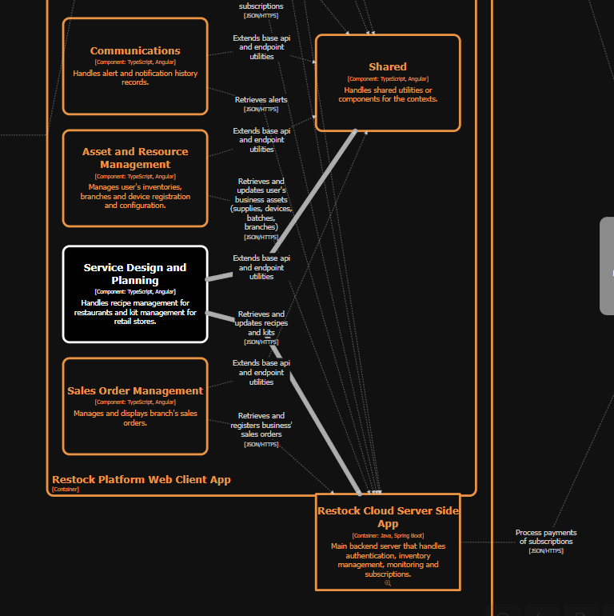
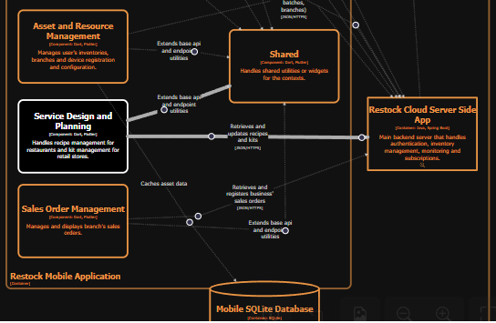
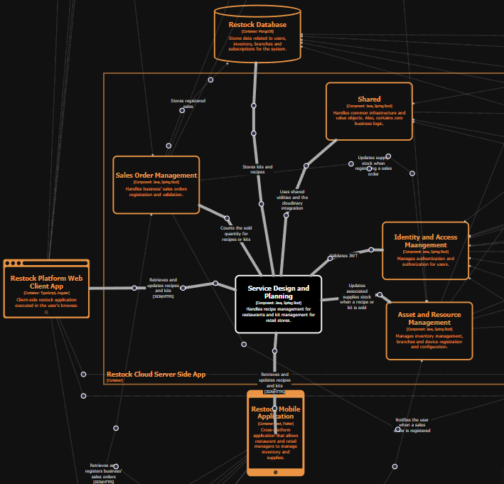

# Capítulo IV: Solution Software Design

## 4.1. Strategic-Level Domain-Driven Design

### 4.1.1. Design-Level EventStorming

#### 4.1.1.1 Candidate Context Discovery

A partir del modelo de Event Storming, se llevó a cabo una sesión de Candidate Context Discovery para identificar los bounded contexts de la solución. Se utilizó principalmente la técnica look-for-pivotal-events durante la sesión.

Primero, se buscaron eventos clave que indiquen cambios de estado entre diferentes partes del proceso del negocio:

Luego, se agruparon los eventos de acuerdo a los principales cambios de contexto.

Se trazaron fronteras alrededor de los grupos identificados, estableciendo los límites iniciales de los bounded contexts.

Finalmente, se seleccionaron nombres para los bounded context. Dando como resultado la definición de 8 bounded contexts y la **versión final del Event Storming**:

A continuación, se explicará en qué consiste cada bounded context:

**Identity and Access Management:** También llamado "IAM", este bounded context contiene el proceso de ingreso del usuario a la plataforma, ya sea iniciando sesión o registrandose.

**Subscriptions and Payments:** También llamado "Subscriptions", este bounded context contiene el proceso de selección de planes, configuración de suscripciones, procesamiento de pagos e inicialización de cuentas de negocio, incluyendo la integración con plataformas externas como Stripe.

**Profiles and Preferences:** También llamado "Profile", este bounded context contiene el proceso de gestión de la información personal del usuario, incluyendo la actualización de datos, cambio de contraseña y configuración de preferencias, así como la gestión de información del negocio.

**Alerts and Notifications:** También llamado "Notifications", este bounded context contiene el proceso de generación, envío y recepción de notificaciones dentro de la plataforma, a partir de eventos relevantes del sistema como alertas de stock o incidencias, integrándose con servicios externos como OneSignal para la distribución de mensajes.

**Asset and Resource Management:** También llamado "Resource", este bounded context contiene el proceso de gestión de inventario, insumos, lotes y sucursales, incluyendo el registro, actualización y control de stock, así como la administración de proveedores y recursos asociados.

**Service Design and Planning:** También llamado "Planning", este bounded context contiene el proceso de diseño y gestión de recetas y kits, incluyendo la selección de insumos, categorización, actualización de información y almacenamiento de imágenes, permitiendo definir cómo se estructuran los productos dentro del sistema.

**Sales Order Management:** También llamado "Sales", este bounded context contiene el proceso de registro y gestión de ventas, incluyendo la selección de productos, cálculo del total, confirmación de la venta y actualización automática del stock disponible.

**Service Operation and Monitoring:** También llamado "Monitoring", este bounded context contiene el proceso de monitoreo del estado del inventario físico y dispositivos, incluyendo la recepción de datos desde sensores, detección de anomalías, gestión de umbrales de stock y generación de tareas de conciliación o alertas ante inconsistencias.

#### 4.1.1.2 Domain Message Flows Modeling

#### 4.1.1.3 Bounded Context Canvases

### 4.1.2. Context Mapping

En esta sección se explica el proceso de elaboración del Context Map. Asimismo, se permite visualizar las relaciones estructurales entre los Bounded Contexts, junto con los patrones de relación definidos en Domain-Driven Design (DDD), tales como Anti-Corruption Layer (ACL), Conformist, Customer/Supplier y Shared Kernel.

A continuación, se describen las relaciones y patrones de integración observados entre estos contextos.

#### Análisis de Bounded Contexts

##### Analytics ↔ Asset and Resource Management
- **Relación:** Upstream (Asset and Resource Management) / Downstream (Analytics)
- **Patrón:** Conformist — Analytics adopta directamente el modelo definido por Asset and Resource Management sin transformación propia. Asset and Resource Management es la fuente de verdad de los recursos del sistema, y Analytics se conforma a ese modelo para construir sus reportes y métricas.

##### Service Design and Planning ↔ Asset and Resource Management
- **Relación:** Upstream (Service Design and Planning) / Downstream (Asset and Resource Management)
- **Patrón:** Shared Kernel — Ambos contextos comparten un modelo común de diseño de servicios. Service Design and Planning actúa como proveedor (SUP) y Asset and Resource Management como cliente (CUST), garantizando que la planificación de servicios guíe la gestión de recursos sin duplicar el modelo compartido.

##### Asset and Resource Management ↔ Sales Order Management
- **Relación:** Upstream (Asset and Resource Management) / Downstream (Sales Order Management)
- **Patrón:** Shared Kernel — Asset and Resource Management provee información de recursos y activos que Sales Order Management consume para generar órdenes de venta correctamente asociadas. La relación SUP → CUST asegura que los datos de recursos sean la fuente autoritativa para los procesos de venta.

##### Asset and Resource Management ↔ Service Operation and Monitoring
- **Relación:** Upstream (Asset and Resource Management) / Downstream (Service Operation and Monitoring)
- **Patrón:** Anti-Corruption Layer — Service Operation and Monitoring consume datos de Asset and Resource Management, pero los traduce a su propio modelo operativo a través de un ACL. Esto protege al dominio operativo de ser contaminado con el lenguaje propio de la gestión de activos y recursos.

##### IAM ↔ Subscriptions and Payments
- **Relación:** Upstream (IAM) / Downstream (Subscriptions and Payments)
- **Patrón:** Anti-Corruption Layer — Subscriptions and Payments depende de IAM para validar la identidad del usuario, pero traduce el modelo de identidad a través de un ACL. Esto permite que el dominio de pagos mantenga su propio lenguaje sin acoplarse directamente al modelo de autenticación de IAM.

##### IAM ↔ Profile and Preferences
- **Relación:** Upstream (IAM) / Downstream (Profile and Preferences)
- **Patrón:** Anti-Corruption Layer — Profile and Preferences consume el modelo de identidad de IAM pero lo traduce a través de un ACL para construir el perfil del usuario. Esto protege al dominio de preferencias de ser contaminado con el lenguaje propio de la autenticación.

##### Service Operation and Monitoring ↔ Communication
- **Relación:** Upstream (Service Operation and Monitoring) / Downstream (Communication)
- **Patrón:** Customer/Supplier — Communication consume eventos operativos generados por Service Operation and Monitoring para notificar al personal o a los usuarios relevantes. Service Operation and Monitoring actúa como proveedor del contexto operativo que Communication necesita para ejecutar sus notificaciones.

##### Sales Order Management ↔ Communication
- **Relación:** Upstream (Sales Order Management) / Downstream (Communication)
- **Patrón:** Customer/Supplier — Communication consume información de órdenes de venta de Sales Order Management para emitir confirmaciones, alertas o notificaciones relacionadas con el ciclo de vida de las órdenes, sin conocer la lógica interna del dominio de ventas.

Con base en el análisis, se implementaron los siguientes patrones de relación entre contextos:

- **Conformist** entre Asset and Resource Management → Analytics.
- **Shared Kernel** entre Service Design and Planning → Asset and Resource Management y Asset and Resource Management → Sales Order Management.
- **Anti-Corruption Layer** en las relaciones de Service Operation and Monitoring, Subscriptions and Payments y Profile and Preferences con sus respectivos upstream.
- **Customer/Supplier** entre Service Operation and Monitoring → Communication y Sales Order Management → Communication.

En la imagen se observa que el contexto Asset and Resource Management actúa como el contexto central, relacionándose con dominios como Identity and Access Management, Sales Order Management, Service Design and Planning y Communication, lo que evidencia una distribución del sistema en bounded contexts con responsabilidades específicas.

Asimismo, las relaciones upstream/downstream (U/D) reflejan dependencias entre contextos, mientras que patrones como ACL (Anti-Corruption Layer) y SK (Shared Kernel) muestran mecanismos para integrar módulos, proteger el dominio y compartir elementos comunes cuando es necesario.

### 4.1.3. Software Architecture

En esta sección se presentan los diagramas de arquitectura de software basados en el modelo C4, los cuales permiten describir la estructura del sistema Restock a diferentes niveles de detalle.

#### 4.1.3.1. Software Architecture System Landscape Diagram

En esta sección se presenta una visión general de los principales usuarios, sistemas externos y componentes internos que interactúan con la plataforma.

Para Restock, el diagrama de panorama del sistema incluye los siguientes elementos principales:

**Restaurant Administrator:** Usuario encargado de gestionar el inventario, recetas, ventas y operaciones dentro de un restaurante, interactuando directamente con la plataforma Restock para administrar sus procesos.

**Retail Administrator:** Usuario responsable de gestionar el inventario y las operaciones comerciales en entornos retail, utilizando Restock como herramienta central para el control del stock y la toma de decisiones.

**Back Office Staff:** Personal administrativo y operativo de la organización UI-Topic que se encarga de administrar, supervisar y dar soporte al sistema, asegurando su correcto funcionamiento.

**Support:** Equipo de soporte que asiste a los clientes, gestiona incidencias y monitorea el estado del sistema para garantizar una adecuada experiencia de usuario.

**Maintenance Technician:** Personal técnico responsable de la instalación, mantenimiento y monitoreo de los dispositivos físicos, asegurando la correcta operación del hardware asociado.

**Restock:** Sistema principal de la solución, encargado de la gestión del inventario y de coordinar la comunicación entre los distintos componentes, incluyendo aplicaciones, hardware IoT y servicios externos.

**Restock Hardware:** Subsistema de hardware orientado al monitoreo de stock mediante dispositivos IoT, que recopila datos físicos y los envía a la plataforma para su procesamiento.

**OneSignal API:** Servicio externo utilizado para el envío de notificaciones y alertas a los usuarios del sistema.

**Stripe:** Plataforma externa encargada de procesar pagos y suscripciones dentro de la solución.

**Cloudinary API:** Servicio externo utilizado para el almacenamiento y gestión de archivos multimedia, como imágenes asociadas a productos.

En conjunto, este diagrama muestra cómo Restock actúa como el núcleo del sistema, integrando a los distintos usuarios, componentes internos y servicios externos para ofrecer una solución completa de gestión de inventarios.

#### 4.1.3.2. Software Architecture Context Level Diagrams

El diagrama de contexto en la arquitectura de software proporciona una visión general de alto nivel del sistema dentro de su entorno, mostrando cómo interactúa con los actores externos, sistemas externos y con dispositivos IoT que capturan y envían datos del mundo físico. Este diagrama permite comprender los límites del sistema y las principales interacciones externas.

Para Restock, el diagrama de contexto incluye los siguientes actores, sistemas externos y dispositivos IoT:

**Visitors:** Usuarios anónimos que navegan el contenido público de la plataforma, como información, planes y características, y pueden registrarse o acceder como administradores de restaurante o retail.

**Restaurant Administrators:** Usuarios que gestionan el inventario, recetas, ventas y operaciones de restaurantes mediante la plataforma Restock.

**Retail Administrators:** Usuarios que gestionan el inventario, control de stock y operaciones comerciales en entornos de retail utilizando la plataforma Restock.

**Restock:** Sistema principal que permite la gestión de inventarios, monitoreo de stock en tiempo real y automatización de procesos mediante la integración con aplicaciones web, móviles, servicios externos y dispositivos IoT.

**Stripe:** Sistema externo que gestiona los pagos y suscripciones de los usuarios dentro de la plataforma Restock.

**Cloudinary API:** Servicio externo encargado del almacenamiento, gestión y entrega de imágenes y contenido multimedia utilizado en la plataforma.

**OneSignal API:** Servicio externo utilizado para el envío de notificaciones y alertas en tiempo real a los usuarios de la plataforma.

**Restock Smart Scale:** Dispositivo IoT que captura datos de peso desde el entorno físico mediante sensores y los transmite al sistema para su procesamiento y uso en el control de inventarios.

#### 4.1.3.2. Software Architecture Container Level Diagrams

El diagrama de contenedores de la arquitectura de software proporciona una visión de alto nivel de los principales contenedores del sistema, incluyendo aplicaciones, servicios, bases de datos y componentes IoT, como dispositivos embebidos y aplicaciones edge que interactúan con sensores físicos. Además, muestra cómo estos elementos se comunican entre sí para procesar y transmitir información.

Para Restock, el diagrama de contenedores incluye los siguientes contenedores principales:

**Landing Page:** Aplicación web estática desarrollada con HTML, CSS y JavaScript que presenta información pública sobre Restock, como funcionalidades, planes y términos, y guía a los usuarios hacia la aplicación web mediante elementos de navegación y llamados a la acción, interactuando con la Web Application a través de redirecciones.

**Web Application:** Componente que actúa como punto de entrada a la plataforma web de Restock, encargado de entregar la aplicación frontend al navegador del usuario, interactuando con la Restock Platform Web Application.

**Restock Platform Web Application:** Aplicación frontend desarrollada con TypeScript y Angular que se ejecuta en el navegador del usuario y permite gestionar el inventario, visualizar insumos y platos, y monitorear el stock en tiempo real, interactuando con la Restock Server Side Application mediante solicitudes API.

**Restock Mobile Application:** Aplicación móvil multiplataforma desarrollada con Dart y Flutter que permite a los usuarios gestionar inventario, consultar productos y monitorear el stock en tiempo real desde dispositivos móviles, interactuando con la Restock Server Side Application mediante API y con la Mobile SQLite Database para almacenamiento local.

**Mobile SQLite Database:** Base de datos local basada en SQLite que almacena información de la aplicación en el dispositivo móvil para permitir acceso offline y mejorar el rendimiento, interactuando únicamente con la Restock Mobile Application.

**Restock Local Station Edge Application:** Aplicación intermedia desarrollada en Python con Flask que recibe datos de peso desde la aplicación embebida, los procesa y los envía al backend, además de recibir comandos de configuración como encendido, apagado y asignación de producto desde el backend y transmitirlos al embedded, interactuando con la Restock Server Side Application, la Restock Embedded Application y la Edge Local Database.

**Edge Local Database:** Base de datos local basada en SQLite que almacena configuración del dispositivo, datos recientes de sensores y eventos pendientes de sincronización para garantizar el funcionamiento offline y la integridad de los datos, interactuando con la Restock Local Station Edge Application.

**Restock Embedded Application:** Software embebido desarrollado en C++ que controla el dispositivo físico de medición (balanza), captura datos de peso desde el sensor y ejecuta comandos recibidos como encendido, apagado o cambio de producto a monitorear, interactuando con la Restock Local Station Edge Application y el dispositivo Restock Smart Scale.

**Restock Server Side Application:** Aplicación backend desarrollada en Java con Spring Boot que gestiona la lógica de negocio, procesa datos de inventario, recibe información desde el edge, envía comandos de configuración a los dispositivos y coordina la comunicación entre los distintos componentes del sistema, interactuando con la Restock Database, la Restock Platform Web Application, la Restock Mobile Application, la Restock Local Station Edge Application y servicios externos como Stripe, Cloudinary y OneSignal.

**Restock Database:** Base de datos principal del sistema que almacena información de inventario, usuarios, productos y suscripciones, interactuando con la Restock Server Side Application.

#### 4.1.3.3. Software Architecture Deployment Diagrams

El siguiente diagrama de despliegue muestra la distribución física de los componentes de la plataforma Restock en los distintos entornos de ejecución, incluyendo infraestructura en la nube, dispositivos del usuario, nodos de cómputo en el edge y hardware embebido.

## 4.2. Tactical-Level Domain-Driven Design

### 4.2.1. Bounded Context: Identity and Access Management

#### 4.2.1.1. Domain Layer

#### 4.2.1.2. Interface Layer

#### 4.2.1.3. Application Layer

#### 4.2.1.4. Infrastructure Layer

#### 4.2.1.5. Bounded Context Software Architecture Component Level Diagrams

#### 4.2.1.6. Bounded Context Software Architecture Code Level Diagrams

##### 4.2.1.6.1. Bounded Context Domain Layer Class Diagrams

##### 4.2.1.6.2. Bounded Context Database Design Diagram

### 4.2.2. Bounded Context: Subscriptions and Payments

#### 4.2.2.1. Domain Layer

#### 4.2.2.2. Interface Layer

#### 4.2.2.3. Application Layer

#### 4.2.2.4. Infrastructure Layer

#### 4.2.2.5. Bounded Context Software Architecture Component Level Diagrams

#### 4.2.2.6. Bounded Context Software Architecture Code Level Diagrams

##### 4.2.2.6.1. Bounded Context Domain Layer Class Diagrams

##### 4.2.2.6.2. Bounded Context Database Design Diagram

### 4.2.3. Bounded Context: Profiles and Preferences

#### 4.2.3.1. Domain Layer

#### 4.2.3.2. Interface Layer

#### 4.2.3.3. Application Layer

#### 4.2.3.4. Infrastructure Layer

#### 4.2.3.5. Bounded Context Software Architecture Component Level Diagrams

#### 4.2.3.6. Bounded Context Software Architecture Code Level Diagrams

##### 4.2.3.6.1. Bounded Context Domain Layer Class Diagrams

##### 4.2.3.6.2. Bounded Context Database Design Diagram

### 4.2.4. Bounded Context: Asset and Resource Management

#### 4.2.4.1. Domain Layer

#### 4.2.4.2. Interface Layer

#### 4.2.4.3. Application Layer

#### 4.2.4.4. Infrastructure Layer

#### 4.2.4.5. Bounded Context Software Architecture Component Level Diagrams

#### 4.2.4.6. Bounded Context Software Architecture Code Level Diagrams

##### 4.2.4.6.1. Bounded Context Domain Layer Class Diagrams

##### 4.2.4.6.2. Bounded Context Database Design Diagram

### 4.2.5. Bounded Context: Service Design and Planning

Este Bounded Context se encarga de la formulación y empaquetamiento comercial de los recursos. Proporciona las herramientas para que los administradores de restaurantes diseñen sus recetas (vinculando insumos y cantidades) y para que los administradores de tiendas retail estructuren kits o combos comerciales destinados a sus clientes.

#### 4.2.5.1. Domain Layer

La capa de dominio representa el núcleo (core) de la aplicación para el Bounded Context de Service Design and Planning. En esta capa se encapsulan todas las reglas de negocio, invariantes y la lógica fundamental relacionada con la estructuración de recetas gastronómicas y la composición de kits comerciales.

Esta capa está aislada de detalles técnicos o de infraestructura. Se compone de Entidades (Entities), Raíces de Agregación (Aggregate Roots), Objetos de Valor (Value Objects) para garantizar la inmutabilidad de las composiciones, Eventos de Dominio (Domain Events) y las abstracciones de los repositorios mediante Interfaces.

##### Aggregates & Entities

<em>Tabla de Aggregates en el Domain Layer</em>

<table style="width:100%; border-collapse: collapse; border: 1px solid;">
  <thead>
    <tr>
      <th style="padding: 10px; border: 1px solid; text-align: left;">Nombre de Clase</th>
      <th style="padding: 10px; border: 1px solid; text-align: left;">Categoría</th>
      <th style="padding: 10px; border: 1px solid; text-align: left;">Propósito y Reglas de Negocio</th>
    </tr>
  </thead>
  <tbody>
    <tr>
      <td style="padding: 10px; border: 1px solid;"><strong>Recipe</strong></td>
      <td style="padding: 10px; border: 1px solid;">Aggregate Root</td>
      <td style="padding: 10px; border: 1px solid;">Representa una receta gastronómica. Encapsula la lógica para validar que la formulación contenga insumos válidos, cantidades mayores a cero y permite actualizar su información e imagen.</td>
    </tr>
    <tr>
      <td style="padding: 10px; border: 1px solid;"><strong>Kit</strong></td>
      <td style="padding: 10px; border: 1px solid;">Aggregate Root</td>
      <td style="padding: 10px; border: 1px solid;">Representa un combo comercial diseñado por la tienda retail. Contiene la lógica para agrupar productos individuales y establecer un precio de conjunto válido.</td>
    </tr>
  </tbody>
</table>

 

##### Value Objects

<em>Tabla de Value Objects en el Domain Layer</em>

<table style="width:100%; border-collapse: collapse; border: 1px solid;">
  <thead>
    <tr>
      <th style="padding: 10px; border: 1px solid; text-align: left;">Nombre de Clase</th>
      <th style="padding: 10px; border: 1px solid; text-align: left;">Categoría</th>
      <th style="padding: 10px; border: 1px solid; text-align: left;">Propósito y Reglas de Negocio</th>
    </tr>
  </thead>
  <tbody>
    <tr>
      <td style="padding: 10px; border: 1px solid;"><strong>SupplyRequirement</strong></td>
      <td style="padding: 10px; border: 1px solid;">Value Object</td>
      <td style="padding: 10px; border: 1px solid;">Encapsula la relación entre un insumo (SupplyId) y la cantidad requerida para una receta o kit, garantizando que la cantidad siempre sea positiva.</td>
    </tr>
    <tr>
      <td style="padding: 10px; border: 1px solid;"><strong>Category</strong></td>
      <td style="padding: 10px; border: 1px solid;">Value Object</td>
      <td style="padding: 10px; border: 1px solid;">Clasificación fuertemente tipada para las recetas y kits, evitando errores de tipografía en agrupaciones.</td>
    </tr>
    <tr>
      <td style="padding: 10px; border: 1px solid;"><strong>RecipeId, KitId</strong></td>
      <td style="padding: 10px; border: 1px solid;">Value Object</td>
      <td style="padding: 10px; border: 1px solid;">Identificadores inmutables para garantizar el tipado estricto en las relaciones y búsquedas.</td>
    </tr>
  </tbody>
</table>

 

##### Repository Interfaces

<em>Tabla de Abstracciones de Repositorio en el Domain Layer</em>

<table style="width:100%; border-collapse: collapse; border: 1px solid;">
  <thead>
    <tr>
      <th style="padding: 10px; border: 1px solid; text-align: left;">Nombre de Interfaz</th>
      <th style="padding: 10px; border: 1px solid; text-align: left;">Categoría</th>
      <th style="padding: 10px; border: 1px solid; text-align: left;">Propósito</th>
    </tr>
  </thead>
  <tbody>
    <tr>
      <td style="padding: 10px; border: 1px solid;"><strong>IRecipeRepository</strong></td>
      <td style="padding: 10px; border: 1px solid;">Repository Interface</td>
      <td style="padding: 10px; border: 1px solid;">Contrato para la persistencia, búsqueda y filtrado de recetas en el catálogo del restaurante.</td>
    </tr>
    <tr>
      <td style="padding: 10px; border: 1px solid;"><strong>IKitRepository</strong></td>
      <td style="padding: 10px; border: 1px solid;">Repository Interface</td>
      <td style="padding: 10px; border: 1px solid;">Contrato para almacenar y recuperar los combos configurados localmente por la tienda retail.</td>
    </tr>
  </tbody>
</table>

#### 4.2.5.2. Interface Layer

En la capa de interfaz se exponen los endpoints HTTP RESTful necesarios para interactuar con las funcionalidades de diseño de servicios. A través de controladores especializados, esta capa actúa como punto de entrada para que las aplicaciones cliente (Web o Móvil) envíen los comandos de creación o edición de recetas y kits, facilitando la subida de imágenes y la definición de formulaciones.

##### RecipeController

<em>Tabla de RecipeController en el Interface Layer</em>

<table style="width:100%; border-collapse: collapse; border: 1px solid;">
  <thead>
    <tr>
      <th style="padding: 10px; border: 1px solid; text-align: left;">Propiedad</th>
      <th style="padding: 10px; border: 1px solid; text-align: left;">Valor</th>
    </tr>
  </thead>
  <tbody>
    <tr>
      <td style="padding: 10px; border: 1px solid;"><strong>Nombre</strong></td>
      <td style="padding: 10px; border: 1px solid;">RecipeController</td>
    </tr>
    <tr>
      <td style="padding: 10px; border: 1px solid;"><strong>Categoría</strong></td>
      <td style="padding: 10px; border: 1px solid;">Controller</td>
    </tr>
    <tr>
      <td style="padding: 10px; border: 1px solid;"><strong>Propósito</strong></td>
      <td style="padding: 10px; border: 1px solid;">Encargado de exponer endpoints para la gestión del catálogo de recetas y su formulación por parte del administrador de restaurante.</td>
    </tr>
    <tr>
      <td style="padding: 10px; border: 1px solid;"><strong>Ruta</strong></td>
      <td style="padding: 10px; border: 1px solid;">/api/v1/recipes</td>
    </tr>
  </tbody>
</table>

 

<em>Tabla de métodos de RecipeController en el Interface Layer</em>

<table style="width:100%; border-collapse: collapse; border: 1px solid;">
  <thead>
    <tr>
      <th style="padding: 10px; border: 1px solid;">Nombre</th>
      <th style="padding: 10px; border: 1px solid;">Ruta</th>
      <th style="padding: 10px; border: 1px solid;">Acción</th>
      <th style="padding: 10px; border: 1px solid;">Handle (Command/Query)</th>
    </tr>
  </thead>
  <tbody>
    <tr>
      <td style="padding: 10px; border: 1px solid;">Register</td>
      <td style="padding: 10px; border: 1px solid;">/ (POST)</td>
      <td style="padding: 10px; border: 1px solid;">Crea y registra una nueva receta</td>
      <td style="padding: 10px; border: 1px solid;">RegisterRecipeCommand</td>
    </tr>
    <tr>
      <td style="padding: 10px; border: 1px solid;">GetById</td>
      <td style="padding: 10px; border: 1px solid;">/{recipeId} (GET)</td>
      <td style="padding: 10px; border: 1px solid;">Obtiene los detalles de una receta</td>
      <td style="padding: 10px; border: 1px solid;">GetRecipeByIdQuery</td>
    </tr>
    <tr>
      <td style="padding: 10px; border: 1px solid;">Edit</td>
      <td style="padding: 10px; border: 1px solid;">/{recipeId} (PUT)</td>
      <td style="padding: 10px; border: 1px solid;">Modifica la información e insumos</td>
      <td style="padding: 10px; border: 1px solid;">EditRecipeCommand</td>
    </tr>
    <tr>
      <td style="padding: 10px; border: 1px solid;">Delete</td>
      <td style="padding: 10px; border: 1px solid;">/{recipeId} (DELETE)</td>
      <td style="padding: 10px; border: 1px solid;">Elimina lógicamente una receta</td>
      <td style="padding: 10px; border: 1px solid;">DeleteRecipeCommand</td>
    </tr>
  </tbody>
</table>

##### KitController

<em>Tabla de KitController en el Interface Layer</em>

<table style="width:100%; border-collapse: collapse; border: 1px solid;">
  <thead>
    <tr>
      <th style="padding: 10px; border: 1px solid; text-align: left;">Propiedad</th>
      <th style="padding: 10px; border: 1px solid; text-align: left;">Valor</th>
    </tr>
  </thead>
  <tbody>
    <tr>
      <td style="padding: 10px; border: 1px solid;"><strong>Nombre</strong></td>
      <td style="padding: 10px; border: 1px solid;">KitController</td>
    </tr>
    <tr>
      <td style="padding: 10px; border: 1px solid;"><strong>Categoría</strong></td>
      <td style="padding: 10px; border: 1px solid;">Controller</td>
    </tr>
    <tr>
      <td style="padding: 10px; border: 1px solid;"><strong>Propósito</strong></td>
      <td style="padding: 10px; border: 1px solid;">Exponer endpoints para que los administradores de tiendas retail agrupen productos en combos comerciales.</td>
    </tr>
    <tr>
      <td style="padding: 10px; border: 1px solid;"><strong>Ruta</strong></td>
      <td style="padding: 10px; border: 1px solid;">/api/v1/kits</td>
    </tr>
  </tbody>
</table>

 

<em>Tabla de métodos de KitController en el Interface Layer</em>

<table style="width:100%; border-collapse: collapse; border: 1px solid;">
  <thead>
    <tr>
      <th style="padding: 10px; border: 1px solid;">Nombre</th>
      <th style="padding: 10px; border: 1px solid;">Ruta</th>
      <th style="padding: 10px; border: 1px solid;">Acción</th>
      <th style="padding: 10px; border: 1px solid;">Handle (Command/Query)</th>
    </tr>
  </thead>
  <tbody>
    <tr>
      <td style="padding: 10px; border: 1px solid;">Register</td>
      <td style="padding: 10px; border: 1px solid;">/ (POST)</td>
      <td style="padding: 10px; border: 1px solid;">Registra un nuevo kit comercial</td>
      <td style="padding: 10px; border: 1px solid;">RegisterKitCommand</td>
    </tr>
    <tr>
      <td style="padding: 10px; border: 1px solid;">Edit</td>
      <td style="padding: 10px; border: 1px solid;">/{kitId} (PUT)</td>
      <td style="padding: 10px; border: 1px solid;">Edita la composición del kit</td>
      <td style="padding: 10px; border: 1px solid;">EditKitCommand</td>
    </tr>
    <tr>
      <td style="padding: 10px; border: 1px solid;">Delete</td>
      <td style="padding: 10px; border: 1px solid;">/{kitId} (DELETE)</td>
      <td style="padding: 10px; border: 1px solid;">Deshabilita el kit del catálogo</td>
      <td style="padding: 10px; border: 1px solid;">DeleteKitCommand</td>
    </tr>
  </tbody>
</table>

#### 4.2.5.3. Application Layer

La capa de aplicación de este Bounded Context orquesta los flujos de trabajo dictados por los usuarios al diseñar sus servicios. Aquí residen los Command Handlers encargados de procesar la creación y edición de catálogos, asegurando que las listas de insumos se estructuren correctamente antes de delegar la persistencia al dominio. También aloja Event Handlers que reaccionan a acciones críticas, como notificar a los usuarios cuando un diseño es eliminado.

##### RegisterRecipeCommandHandler

<em>Tabla de RegisterRecipeCommandHandler en el Application Layer</em>

<table style="width:100%; border-collapse: collapse; border: 1px solid;">
  <thead>
    <tr>
      <th style="padding: 10px; border: 1px solid; text-align: left;">Propiedad</th>
      <th style="padding: 10px; border: 1px solid; text-align: left;">Valor</th>
    </tr>
  </thead>
  <tbody>
    <tr>
      <td style="padding: 10px; border: 1px solid;"><strong>Nombre</strong></td>
      <td style="padding: 10px; border: 1px solid;">RegisterRecipeCommandHandler</td>
    </tr>
    <tr>
      <td style="padding: 10px; border: 1px solid;"><strong>Categoría</strong></td>
      <td style="padding: 10px; border: 1px solid;">Command Handler</td>
    </tr>
    <tr>
      <td style="padding: 10px; border: 1px solid;"><strong>Propósito</strong></td>
      <td style="padding: 10px; border: 1px solid;">Validar la lista de insumos, coordinar la subida de imágenes y orquestar la creación de una nueva receta.</td>
    </tr>
    <tr>
      <td style="padding: 10px; border: 1px solid;"><strong>Comando</strong></td>
      <td style="padding: 10px; border: 1px solid;">RegisterRecipeCommand</td>
    </tr>
  </tbody>
</table>

 

##### RegisterKitCommandHandler

<em>Tabla de RegisterKitCommandHandler en el Application Layer</em>

<table style="width:100%; border-collapse: collapse; border: 1px solid;">
  <thead>
    <tr>
      <th style="padding: 10px; border: 1px solid; text-align: left;">Propiedad</th>
      <th style="padding: 10px; border: 1px solid; text-align: left;">Valor</th>
    </tr>
  </thead>
  <tbody>
    <tr>
      <td style="padding: 10px; border: 1px solid;"><strong>Nombre</strong></td>
      <td style="padding: 10px; border: 1px solid;">RegisterKitCommandHandler</td>
    </tr>
    <tr>
      <td style="padding: 10px; border: 1px solid;"><strong>Categoría</strong></td>
      <td style="padding: 10px; border: 1px solid;">Command Handler</td>
    </tr>
    <tr>
      <td style="padding: 10px; border: 1px solid;"><strong>Propósito</strong></td>
      <td style="padding: 10px; border: 1px solid;">Procesar la agrupación de productos solicitada por el administrador retail y registrar el nuevo combo en el sistema.</td>
    </tr>
    <tr>
      <td style="padding: 10px; border: 1px solid;"><strong>Comando</strong></td>
      <td style="padding: 10px; border: 1px solid;">RegisterKitCommand</td>
    </tr>
  </tbody>
</table>

 

##### RecipeDeletedEventHandler

<em>Tabla de RecipeDeletedEventHandler en el Application Layer</em>

<table style="width:100%; border-collapse: collapse; border: 1px solid;">
  <thead>
    <tr>
      <th style="padding: 10px; border: 1px solid; text-align: left;">Propiedad</th>
      <th style="padding: 10px; border: 1px solid; text-align: left;">Valor</th>
    </tr>
  </thead>
  <tbody>
    <tr>
      <td style="padding: 10px; border: 1px solid;"><strong>Nombre</strong></td>
      <td style="padding: 10px; border: 1px solid;">RecipeDeletedEventHandler</td>
    </tr>
    <tr>
      <td style="padding: 10px; border: 1px solid;"><strong>Categoría</strong></td>
      <td style="padding: 10px; border: 1px solid;">Event Handler</td>
    </tr>
    <tr>
      <td style="padding: 10px; border: 1px solid;"><strong>Propósito</strong></td>
      <td style="padding: 10px; border: 1px solid;">Escuchar el evento de eliminación de una receta para coordinar el envío automático de un correo electrónico de alerta al administrador.</td>
    </tr>
    <tr>
      <td style="padding: 10px; border: 1px solid;"><strong>Evento</strong></td>
      <td style="padding: 10px; border: 1px solid;">RecipeDeletedEvent</td>
    </tr>
  </tbody>
</table>

#### 4.2.5.4. Infrastructure Layer

La capa de infraestructura de Service Design and Planning materializa los repositorios necesarios para almacenar los modelos de recetas y kits. Además, es el punto donde se implementan los adaptadores para servicios de terceros, los cuales son vitales en este contexto, específicamente para el manejo de archivos multimedia (imágenes de platos o combos) y el servicio de notificaciones transaccionales a los administradores.

##### RecipeRepository

<em>Tabla de RecipeRepository en el Infrastructure Layer</em>

<table style="width:100%; border-collapse: collapse; border: 1px solid;">
  <thead>
    <tr>
      <th style="padding: 10px; border: 1px solid; text-align: left;">Propiedad</th>
      <th style="padding: 10px; border: 1px solid; text-align: left;">Valor</th>
    </tr>
  </thead>
  <tbody>
    <tr>
      <td style="padding: 10px; border: 1px solid;"><strong>Nombre</strong></td>
      <td style="padding: 10px; border: 1px solid;">RecipeRepository</td>
    </tr>
    <tr>
      <td style="padding: 10px; border: 1px solid;"><strong>Categoría</strong></td>
      <td style="padding: 10px; border: 1px solid;">Repositorio</td>
    </tr>
    <tr>
      <td style="padding: 10px; border: 1px solid;"><strong>Propósito</strong></td>
      <td style="padding: 10px; border: 1px solid;">Implementar las consultas a la base de datos para guardar, editar y buscar recetas gastronómicas.</td>
    </tr>
    <tr>
      <td style="padding: 10px; border: 1px solid;"><strong>Interfaz</strong></td>
      <td style="padding: 10px; border: 1px solid;">IRecipeRepository</td>
    </tr>
  </tbody>
</table>

 

##### KitRepository

<em>Tabla de KitRepository en el Infrastructure Layer</em>

<table style="width:100%; border-collapse: collapse; border: 1px solid;">
  <thead>
    <tr>
      <th style="padding: 10px; border: 1px solid; text-align: left;">Propiedad</th>
      <th style="padding: 10px; border: 1px solid; text-align: left;">Valor</th>
    </tr>
  </thead>
  <tbody>
    <tr>
      <td style="padding: 10px; border: 1px solid;"><strong>Nombre</strong></td>
      <td style="padding: 10px; border: 1px solid;">KitRepository</td>
    </tr>
    <tr>
      <td style="padding: 10px; border: 1px solid;"><strong>Categoría</strong></td>
      <td style="padding: 10px; border: 1px solid;">Repositorio</td>
    </tr>
    <tr>
      <td style="padding: 10px; border: 1px solid;"><strong>Propósito</strong></td>
      <td style="padding: 10px; border: 1px solid;">Gestionar la persistencia de los combos comerciales diseñados por los administradores de tiendas retail.</td>
    </tr>
    <tr>
      <td style="padding: 10px; border: 1px solid;"><strong>Interfaz</strong></td>
      <td style="padding: 10px; border: 1px solid;">IKitRepository</td>
    </tr>
  </tbody>
</table>

 

##### External Services Integrations

<em>Tabla de Servicios Externos en el Infrastructure Layer</em>

<table style="width:100%; border-collapse: collapse; border: 1px solid;">
  <thead>
    <tr>
      <th style="padding: 10px; border: 1px solid; text-align: left;">Propiedad</th>
      <th style="padding: 10px; border: 1px solid; text-align: left;">Valor</th>
    </tr>
  </thead>
  <tbody>
    <tr>
      <td style="padding: 10px; border: 1px solid;"><strong>Nombre</strong></td>
      <td style="padding: 10px; border: 1px solid;">CloudinaryImageAdapter</td>
    </tr>
    <tr>
      <td style="padding: 10px; border: 1px solid;"><strong>Categoría</strong></td>
      <td style="padding: 10px; border: 1px solid;">External Service Wrapper</td>
    </tr>
    <tr>
      <td style="padding: 10px; border: 1px solid;"><strong>Propósito</strong></td>
      <td style="padding: 10px; border: 1px solid;">Integrarse con la API de Cloudinary para procesar la subida y almacenamiento de imágenes de recetas y kits.</td>
    </tr>
  </tbody>
</table>

 

<table style="width:100%; border-collapse: collapse; border: 1px solid;">
  <thead>
    <tr>
      <th style="padding: 10px; border: 1px solid; text-align: left;">Propiedad</th>
      <th style="padding: 10px; border: 1px solid; text-align: left;">Valor</th>
    </tr>
  </thead>
  <tbody>
    <tr>
      <td style="padding: 10px; border: 1px solid;"><strong>Nombre</strong></td>
      <td style="padding: 10px; border: 1px solid;">EmailNotificationAdapter</td>
    </tr>
    <tr>
      <td style="padding: 10px; border: 1px solid;"><strong>Categoría</strong></td>
      <td style="padding: 10px; border: 1px solid;">External Service Wrapper</td>
    </tr>
    <tr>
      <td style="padding: 10px; border: 1px solid;"><strong>Propósito</strong></td>
      <td style="padding: 10px; border: 1px solid;">Conectar con un proveedor SMTP (ej. SendGrid o AWS SES) para enviar los correos de alerta cuando se elimina una receta o kit.</td>
    </tr>
  </tbody>
</table>

#### 4.2.5.5. Bounded Context Software Architecture Component Level Diagrams

En esta sección se presentan los diagramas de componentes del bounded context Service Design and Planning, mostrando su comportamiento y responsabilidades desde tres perspectivas: aplicación web, aplicación móvil y backend. Cada diagrama refleja cómo este bounded context interactúa con otros contextos o servicios externos (como Cloudinary) únicamente cuando dichas interacciones son necesarias para la gestión de recetas gastronómicas y la configuración de kits comerciales.

##### Web Application Component Diagram

El componente de la aplicación web cliente se ejecuta en el navegador del usuario y presenta las interfaces gráficas (UI) para la manipulación de los catálogos en pantallas de escritorio o laptops.

<em>Tabla de Componentes de la Web Application para Service Design and Planning</em>

<table style="width:100%; border-collapse: collapse; border: 1px solid;">
  <thead>
    <tr>
      <th style="padding: 10px; border: 1px solid; text-align: left;">Componente</th>
      <th style="padding: 10px; border: 1px solid; text-align: left;">Responsabilidad</th>
      <th style="padding: 10px; border: 1px solid; text-align: left;">Tecnología</th>
    </tr>
  </thead>
  <tbody>
    <tr>
      <td style="padding: 10px; border: 1px solid;"><strong>webServiceDesign</strong></td>
      <td style="padding: 10px; border: 1px solid;">Provee la interfaz de usuario para la configuración de recetas para restaurantes y ensamblaje de kits para tiendas retail. Capta las interacciones del administrador para enviarlas al servidor.</td>
      <td style="padding: 10px; border: 1px solid;">TypeScript, Angular</td>
    </tr>
  </tbody>
</table>

 

<em>Tabla de Interacciones del Componente webServiceDesign</em>

<table style="width:100%; border-collapse: collapse; border: 1px solid;">
  <thead>
    <tr>
      <th style="padding: 10px; border: 1px solid; text-align: left;">Interactúa con</th>
      <th style="padding: 10px; border: 1px solid; text-align: left;">Tipo de Relación</th>
      <th style="padding: 10px; border: 1px solid; text-align: left;">Descripción de la Interacción</th>
    </tr>
  </thead>
  <tbody>
    <tr>
      <td style="padding: 10px; border: 1px solid;"><strong>backendApplication</strong> (API)</td>
      <td style="padding: 10px; border: 1px solid;">Petición HTTP / REST</td>
      <td style="padding: 10px; border: 1px solid;">Realiza peticiones JSON/HTTPS para recuperar y actualizar las formulaciones de recetas y kits en el servidor central.</td>
    </tr>
    <tr>
      <td style="padding: 10px; border: 1px solid;"><strong>webShared</strong></td>
      <td style="padding: 10px; border: 1px solid;">Uso de Librería Interna</td>
      <td style="padding: 10px; border: 1px solid;">Extiende componentes base de UI, utilidades de red y configuraciones de endpoints compartidas por la aplicación Angular.</td>
    </tr>
  </tbody>
</table>

##### Mobile Application Component Diagram

El componente de la aplicación móvil provee acceso en dispositivos iOS y Android, permitiendo a los administradores gestionar la composición de sus servicios de manera remota y ágil, adaptando la experiencia de usuario (UX) para pantallas táctiles.

<em>Tabla de Componentes de la Mobile Application para Service Design and Planning</em>

<table style="width:100%; border-collapse: collapse; border: 1px solid;">
  <thead>
    <tr>
      <th style="padding: 10px; border: 1px solid; text-align: left;">Componente</th>
      <th style="padding: 10px; border: 1px solid; text-align: left;">Responsabilidad</th>
      <th style="padding: 10px; border: 1px solid; text-align: left;">Tecnología</th>
    </tr>
  </thead>
  <tbody>
    <tr>
      <td style="padding: 10px; border: 1px solid;"><strong>mobileServiceDesign</strong></td>
      <td style="padding: 10px; border: 1px solid;">Provee las pantallas y lógica local móvil para gestionar recetas y kits desde dispositivos portátiles.</td>
      <td style="padding: 10px; border: 1px solid;">Dart, Flutter</td>
    </tr>
  </tbody>
</table>

 

<em>Tabla de Interacciones del Componente mobileServiceDesign</em>

<table style="width:100%; border-collapse: collapse; border: 1px solid;">
  <thead>
    <tr>
      <th style="padding: 10px; border: 1px solid; text-align: left;">Interactúa con</th>
      <th style="padding: 10px; border: 1px solid; text-align: left;">Tipo de Relación</th>
      <th style="padding: 10px; border: 1px solid; text-align: left;">Descripción de la Interacción</th>
    </tr>
  </thead>
  <tbody>
    <tr>
      <td style="padding: 10px; border: 1px solid;"><strong>backendApplication</strong> (API)</td>
      <td style="padding: 10px; border: 1px solid;">Petición HTTP / REST</td>
      <td style="padding: 10px; border: 1px solid;">Realiza llamadas JSON/HTTPS al backend para recuperar y actualizar el catálogo de recetas y kits desde la red móvil o Wi-Fi.</td>
    </tr>
    <tr>
      <td style="padding: 10px; border: 1px solid;"><strong>mobileShared</strong></td>
      <td style="padding: 10px; border: 1px solid;">Uso de Librería Interna</td>
      <td style="padding: 10px; border: 1px solid;">Utiliza widgets de Flutter reutilizables y utilidades de consumo de endpoints compartidas por el resto de la aplicación móvil.</td>
    </tr>
  </tbody>
</table>

##### Backend Application Component Diagram

El componente principal del lado del servidor maneja la lógica de negocio central, la persistencia en base de datos y la integración con servicios externos para la validación de insumos y estructuración comercial.

<em>Tabla de Componentes de la Backend Application para Service Design and Planning</em>

<table style="width:100%; border-collapse: collapse; border: 1px solid;">
  <thead>
    <tr>
      <th style="padding: 10px; border: 1px solid; text-align: left;">Componente</th>
      <th style="padding: 10px; border: 1px solid; text-align: left;">Responsabilidad</th>
      <th style="padding: 10px; border: 1px solid; text-align: left;">Tecnología</th>
    </tr>
  </thead>
  <tbody>
    <tr>
      <td style="padding: 10px; border: 1px solid;"><strong>apiServiceDesign</strong></td>
      <td style="padding: 10px; border: 1px solid;">Maneja la gestión de recetas para restaurantes y la gestión de kits para tiendas retail. Centraliza la lógica de validación de insumos y estructuración comercial.</td>
      <td style="padding: 10px; border: 1px solid;">Java, Spring Boot</td>
    </tr>
  </tbody>
</table>

 

<em>Tabla de Interacciones del Componente apiServiceDesign</em>

<table style="width:100%; border-collapse: collapse; border: 1px solid;">
  <thead>
    <tr>
      <th style="padding: 10px; border: 1px solid; text-align: left;">Interactúa con</th>
      <th style="padding: 10px; border: 1px solid; text-align: left;">Tipo de Relación</th>
      <th style="padding: 10px; border: 1px solid; text-align: left;">Descripción de la Interacción</th>
    </tr>
  </thead>
  <tbody>
    <tr>
      <td style="padding: 10px; border: 1px solid;"><strong>databaseNoSql</strong> (MongoDB)</td>
      <td style="padding: 10px; border: 1px solid;">Escritura / Lectura</td>
      <td style="padding: 10px; border: 1px solid;">Almacena de forma persistente la composición de los kits y las recetas diseñadas por los administradores.</td>
    </tr>
    <tr>
      <td style="padding: 10px; border: 1px solid;"><strong>apiAssetAndResource</strong></td>
      <td style="padding: 10px; border: 1px solid;">Dependencia Interna</td>
      <td style="padding: 10px; border: 1px solid;">Actualiza el stock de los insumos asociados cuando una receta o kit es vendido, garantizando la consistencia del inventario.</td>
    </tr>
    <tr>
      <td style="padding: 10px; border: 1px solid;"><strong>apiIam</strong></td>
      <td style="padding: 10px; border: 1px solid;">Dependencia Interna</td>
      <td style="padding: 10px; border: 1px solid;">Valida los tokens JWT para autorizar la creación, edición o eliminación de elementos del catálogo.</td>
    </tr>
    <tr>
      <td style="padding: 10px; border: 1px solid;"><strong>apiShared</strong> / <strong>Cloudinary API</strong></td>
      <td style="padding: 10px; border: 1px solid;">Integración Externa</td>
      <td style="padding: 10px; border: 1px solid;">Utiliza utilidades compartidas para integrar la carga y recuperación de imágenes multimedia asociadas a los combos o platos mediante Cloudinary.</td>
    </tr>
    <tr>
      <td style="padding: 10px; border: 1px solid;"><strong>apiSalesManagement</strong></td>
      <td style="padding: 10px; border: 1px solid;">Solicitud Entrante</td>
      <td style="padding: 10px; border: 1px solid;">Recibe peticiones del módulo de ventas para contabilizar las cantidades vendidas de recetas o kits registrados.</td>
    </tr>
  </tbody>
</table>

#### 4.2.5.6. Bounded Context Software Architecture Code Level Diagrams

##### 4.2.5.6.1. Bounded Context Domain Layer Class Diagrams

En esta sección se presenta el Diagrama de Clases UML correspondiente a la capa de dominio del Bounded Context de Service Design and Planning. El diseño visual refleja la separación de responsabilidades entre la gestión de recetas para restaurantes y la configuración de kits comerciales para tiendas retail, compartiendo conceptos de valor inmutables.

El modelo destaca por ser un Modelo de Dominio Rico. Las entidades raíz (Recipe y Kit) no son simples contenedores de datos, sino que exponen métodos con lógica de negocio clara (como updateFormulation, updateComposition o updatePricing) que validan las reglas internas antes de cualquier cambio de estado. Además, se evidencia la encapsulación mediante el uso de modificadores de acceso restrictivos (- para atributos) y el uso extensivo de Value Objects (como SupplyRequirement y ServiceCategory) para garantizar la integridad de las agrupaciones desde el momento de su instanciación.

##### 4.2.5.6.2. Bounded Context Database Design Diagram

En esta sección, el equipo presenta el Diagrama de Base de Datos diseñado para el Bounded Context de Service Design and Planning. Este diagrama detalla el esquema que permite la persistencia de las entidades core: las recetas de los restaurantes y los kits comerciales de las tiendas retail.

### 4.2.6. Bounded Context: Service Operation and Monitoring

#### 4.2.6.1. Domain Layer

#### 4.2.6.2. Interface Layer

#### 4.2.6.3. Application Layer

#### 4.2.6.4. Infrastructure Layer

#### 4.2.6.5. Bounded Context Software Architecture Component Level Diagrams

#### 4.2.6.6. Bounded Context Software Architecture Code Level Diagrams

##### 4.2.6.6.1. Bounded Context Domain Layer Class Diagrams

##### 4.2.6.6.2. Bounded Context Database Design Diagram
