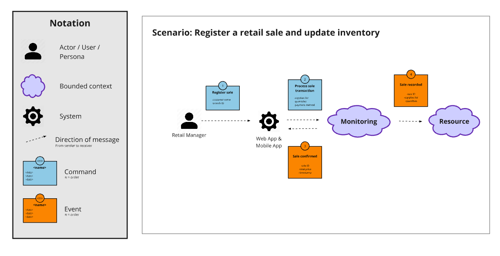

# Capítulo IV: Solution Software Design
## 4.1. Strategic-Level Domain-Driven Design
### 4.1.1. Design-Level EventStorming
#### 4.1.1.1 Candidate Context Discovery
#### 4.1.1.2 Domain Message Flows Modeling

#### 4.1.1.2 Domain Message Flows Modeling

Los Domain Message Flows modelan las interacciones entre los diferentes bounded contexts, mostrando cómo se comunican entre sí mediante comandos, eventos y consultas. A continuación, se muestran los flujos de mensaje para los escenarios clave del negocio:

* **Access to platform:** En este flujo se muestra la interacción entre el bounded context IAM y el bounded context Profiles al momento en que un usuario se registra de forma omnicanal (Web o App) y se crea su perfil correspondiente.

  

* **Record a recipe:** En este flujo se muestra la interacción entre el bounded context Planning y el bounded context Resource al momento en que un administrador diseña y registra una nueva receta, vinculando los insumos necesarios del almacén.

  

* **Register a retail sale and update inventory:** En este flujo se muestra la colaboración entre los contextos de Ventas (Monitoring / Sales) y Resource. Ilustra cómo la venta directa de un producto desde el frontend emite un evento que descuenta el stock de manera automática en el inventario.

  

* **Register a restaurant sale and update inventory:** En este flujo se modela la complejidad de una venta en restaurante, donde el sistema interactúa con las recetas para deducir de Resource las cantidades exactas de insumos utilizados tras confirmar el ticket.

  

* **IoT Monitoring and Anomaly Detection:** En este escenario crítico se muestra la interacción entre Monitoring (Service Operation) y Resource. La telemetría capturada por el hardware solicita el stock teórico, detecta discrepancias físicas y genera tareas de conciliación para el administrador.

  

* **Push Notification Dispatch:** En este flujo se detalla cómo el bounded context de Notifications reacciona a eventos anómalos del sistema, filtrando destinatarios y delegando el envío de alertas a dispositivos móviles mediante una integración con una API externa (OneSignal).

  

Adicionalmente, se presentan flujos de escenarios relevantes para el core del negocio, pero que por su alta cohesión resuelven sus procesos sin requerir interacción con otros bounded contexts externos:

* **Subscribe to a plan:** En este flujo se muestra el proceso de onboarding comercial, donde el registro empresarial y la confirmación de pago se orquestan internamente dentro del bounded context de Subscription.

  

* **Record a supply in the inventory:** En este flujo se modela el ingreso manual o la actualización de existencias de un insumo, el cual es procesado exclusivamente dentro del bounded context Resource.

  

* **Register a physical branch and assign IoT devices:** En este flujo se evidencia el proceso de digitalización de una nueva sucursal y la vinculación de sus sensores físicos, consolidando entidades fuertemente acopladas dentro del bounded context Resource (Asset and Resource Management) y utilizando una API externa para la gestión de imágenes.

  
  
#### 4.1.1.3 Bounded Context Canvases
### 4.1.2. Context Mapping
### 4.1.3. Software Architecture
#### 4.1.3.1. Software Architecture System Landscape Diagram
#### 4.1.3.2. Software Architecture Context Level Diagrams
#### 4.1.3.2. Software Architecture Container Level Diagrams

#### 4.1.3.3. Software Architecture Deployment Diagrams

## 4.2. Tactical-Level Domain-Driven Design

### 4.2.1. Bounded Context: Identity and Access Management
#### 4.2.1.1. Domain Layer
#### 4.2.1.2. Interface Layer
#### 4.2.1.3. Application Layer
#### 4.2.1.4. Infrastructure Layer
#### 4.2.1.5. Bounded Context Software Architecture Component Level Diagrams
#### 4.2.1.6. Bounded Context Software Architecture Code Level Diagrams
##### 4.2.1.6.1. Bounded Context Domain Layer Class Diagrams
##### 4.2.1.6.2. Bounded Context Database Design Diagram

### 4.2.2. Bounded Context: Subscriptions and Payments
#### 4.2.2.1. Domain Layer
#### 4.2.2.2. Interface Layer
#### 4.2.2.3. Application Layer
#### 4.2.2.4. Infrastructure Layer
#### 4.2.2.5. Bounded Context Software Architecture Component Level Diagrams
#### 4.2.2.6. Bounded Context Software Architecture Code Level Diagrams
##### 4.2.2.6.1. Bounded Context Domain Layer Class Diagrams
##### 4.2.2.6.2. Bounded Context Database Design Diagram

### 4.2.3. Bounded Context: Profiles and Preferences
#### 4.2.3.1. Domain Layer
#### 4.2.3.2. Interface Layer
#### 4.2.3.3. Application Layer
#### 4.2.3.4. Infrastructure Layer
#### 4.2.3.5. Bounded Context Software Architecture Component Level Diagrams
#### 4.2.3.6. Bounded Context Software Architecture Code Level Diagrams
##### 4.2.3.6.1. Bounded Context Domain Layer Class Diagrams
##### 4.2.3.6.2. Bounded Context Database Design Diagram

### 4.2.4. Bounded Context: Asset and Resource Management
#### 4.2.4.1. Domain Layer
#### 4.2.4.2. Interface Layer
#### 4.2.4.3. Application Layer
#### 4.2.4.4. Infrastructure Layer
#### 4.2.4.5. Bounded Context Software Architecture Component Level Diagrams
#### 4.2.4.6. Bounded Context Software Architecture Code Level Diagrams
##### 4.2.4.6.1. Bounded Context Domain Layer Class Diagrams
##### 4.2.4.6.2. Bounded Context Database Design Diagram

### 4.2.5. Bounded Context: Service Design and Planning
#### 4.2.5.1. Domain Layer
#### 4.2.5.2. Interface Layer
#### 4.2.5.3. Application Layer
#### 4.2.5.4. Infrastructure Layer
#### 4.2.5.5. Bounded Context Software Architecture Component Level Diagrams
#### 4.2.5.6. Bounded Context Software Architecture Code Level Diagrams
##### 4.2.5.6.1. Bounded Context Domain Layer Class Diagrams
##### 4.2.5.6.2. Bounded Context Database Design Diagram

### 4.2.6. Bounded Context: Service Operation and Monitoring
#### 4.2.6.1. Domain Layer
#### 4.2.6.2. Interface Layer
#### 4.2.6.3. Application Layer
#### 4.2.6.4. Infrastructure Layer
#### 4.2.6.5. Bounded Context Software Architecture Component Level Diagrams
#### 4.2.6.6. Bounded Context Software Architecture Code Level Diagrams
##### 4.2.6.6.1. Bounded Context Domain Layer Class Diagrams
##### 4.2.6.6.2. Bounded Context Database Design Diagram