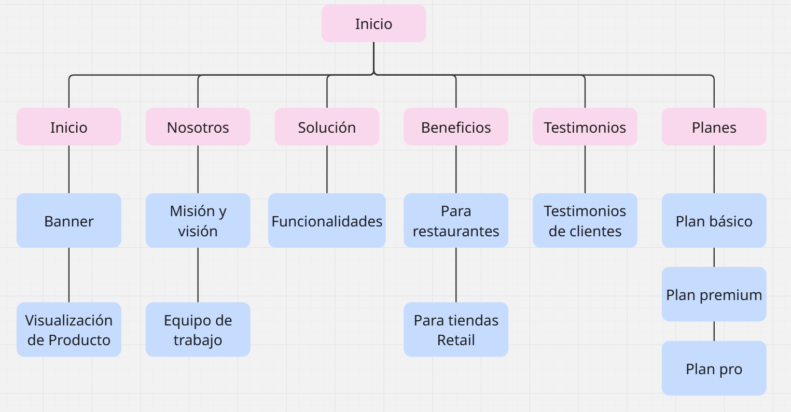
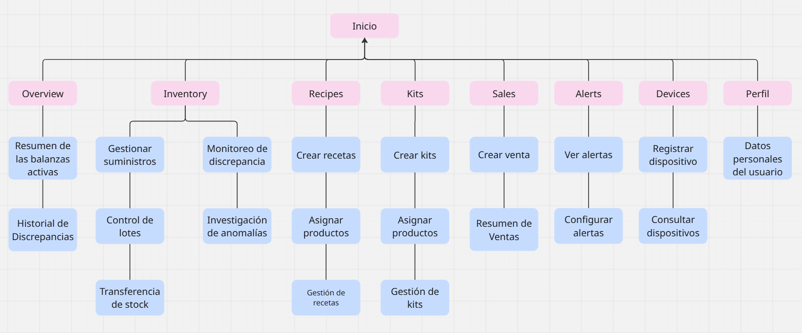

# Capítulo V: Solution UI/UX Design

## 5.1. Style Guidelines

En esta sección se presentan las Style Guidelines, entendidas como un conjunto de principios y criterios que orientan la creación de productos digitales de manera coherente, funcional y visualmente consistente. Su propósito es asegurar que cada elemento de la interfaz mantenga uniformidad en la experiencia del usuario, facilitando la legibilidad, la accesibilidad y el reconocimiento de la identidad del producto. A través de estas pautas, se establecen reglas sobre tipografía, colores, espaciado, componentes e interacciones, promoviendo una comunicación clara y una experiencia ordenada, intuitiva y profesional.

### 5.1.1. General Style Guidelines

El equipo de UI-Topic ha definido un sistema integral de Style Guidelines que establece las bases visuales y comunicacionales de Restock en todas sus plataformas: aplicación web, aplicación móvil y dispositivos IoT. Estas directrices garantizan coherencia, accesibilidad y alineación con la identidad de marca en cada punto de contacto, reduciendo la carga cognitiva del usuario y fortaleciendo la confianza en el sistema.

El diseño se sustenta en principios de usabilidad, accesibilidad y diseño centrado en el usuario. La correcta aplicación de estas guías permite que los equipos de diseño y desarrollo colaboren bajo un lenguaje visual unificado, facilitando la escalabilidad del producto y asegurando una experiencia profesional y técnicamente robusta. Como señala Zeldman (2024), una guía de estilos bien estructurada agiliza la evolución del producto y asegura una experiencia consistente en todos los entornos de uso.

#### 5.1.1.1. Colores

El color constituye uno de los recursos comunicacionales más poderosos en el diseño de interfaces. Su correcta aplicación no solo define la identidad visual de una marca, sino que también guía la atención del usuario, comunica estados del sistema y refuerza la jerarquía de la información. La paleta cromática de Restock fue definida a partir del sistema visual del proyecto, el cual establece cuatro familias de color: Primary (`#10B981`), Secondary (`#111827`), Tertiary (`#DC2626`) y Neutral (`#F4F7F6`).

Investigaciones recientes señalan que las interfaces que emplean paletas cromáticas estructuradas y semánticamente coherentes reducen los errores de navegación y mejoran la retención de información por parte del usuario (Westland & Maggio, 2023). Bajo este marco, cada color de Restock cumple un rol funcional específico dentro del sistema de diseño.

**Color primario:**

<div style="display: flex; align-items: center;">
  
</div>

El verde esmeralda (`#10B981`) y sus variantes constituyen el color principal del sistema. Esta elección responde a su asociación semántica con crecimiento, eficiencia y control, conceptos directamente alineados con la propuesta de valor de Restock como plataforma de gestión de inventarios. A nivel perceptivo, los tonos verdes de media saturación favorecen la concentración y reducen la fatiga visual en sesiones de uso prolongado, lo que resulta especialmente relevante para administradores que interactúan con dashboards y métricas durante largas jornadas operativas.

| Nombre          | Hex         | Uso principal                                                                 | Justificación                                                      |
| --------------- | ----------- | ----------------------------------------------------------------------------- | ------------------------------------------------------------------- |
| Verde Esmeralda | `#10B981` | Botones primarios, barras de navegación, estados activos, íconos de acción | Color de marca principal; contraste mínimo 4.5:1 sobre blanco      |
| Verde Profundo  | `#065F46` | Encabezados, textos sobre fondo claro, estados hover en elementos primarios   | Mayor oscuridad para jerarquía tipográfica y contraste AAA        |
| Verde Medio     | `#059669` | Confirmaciones, indicadores de éxito, badges de estado activo                | Variante funcional para señalización positiva del sistema         |
| Verde Claro     | `#6EE7B7` | Fondos de sección destacada, chips informativos, estados seleccionados       | Variante de baja saturación para fondos y contenedores secundarios |
| Verde Menta     | `#D1FAE5` | Fondos sutiles, zonas de descanso visual, tarjetas informativas               | Proporciona respiro visual sin competir con elementos interactivos  |

- **Jerarquía visual:** El tono más oscuro ancla la estructura de navegación, mientras los tonos más claros señalizan niveles de interacción progresivos, reduciendo la carga cognitiva al distinguir zonas estáticas de dinámicas.
- **Consistencia de marca:** Los tres verdes principales comparten la misma temperatura de color, evitando derivaciones que puedan confundir al usuario respecto a la identidad de la plataforma (Wheeler & Meyerson, 2024).
- **Accesibilidad:** Todos los contrastes han sido validados según WCAG 2.1 para asegurar cumplimiento AA/AAA en texto y elementos interactivos, protegiendo a usuarios con deficiencias visuales (World Wide Web Consortium, 2025).

**Color secundario:**

<div style="display: flex; align-items: center;">
  
</div>

El azul marino oscuro (`#111827`) actúa como color de soporte estructural del sistema. Su alta oscuridad y neutralidad cromática lo convierten en el soporte ideal para textos principales, fondos de paneles laterales y encabezados de sección, generando un contraste sólido con los elementos primarios verdes.

| Nombre          | Hex         | Uso principal                                                       | Justificación                                                         |
| --------------- | ----------- | ------------------------------------------------------------------- | ---------------------------------------------------------------------- |
| Azul Marino     | `#111827` | Textos principales, barras laterales, fondos de modo oscuro         | Contraste superior a 15:1 con blanco; cumple WCAG AAA para tipografía |
| Gris Medianoche | `#1F2937` | Paneles secundarios, encabezados de tabla, fondos de tarjeta oscura | Variante ligeramente más clara para crear profundidad en capas        |
| Gris Acero      | `#374151` | Labels de formularios, bordes de componentes, íconos inactivos     | Tono intermedio que establece límites sin saturar visualmente         |
| Gris Suave      | `#6B7280` | Textos de ayuda contextual, placeholders, metadatos                 | Legibilidad confortable para información de menor jerarquía          |
| Gris Perla      | `#9CA3AF` | Texto desactivado, elementos inactivos                              | Señaliza estados no interactivos manteniendo contraste mínimo 3:1    |

- **Jerarquía visual:** Los tonos secundarios crean la estructura invisible de la interfaz, diferenciando zonas de navegación, contenido y datos sin competir con los elementos primarios.
- **Consistencia:** Todos los tonos comparten la misma temperatura de color fría, garantizando transiciones fluidas entre secciones de la plataforma.
- **Accesibilidad:** Cada token ha sido validado contra WCAG 2.1 para asegurar lectura cómoda y correcta separación de componentes interactivos (World Wide Web Consortium, 2025).

**Color terciario:**

<div style="display: flex; align-items: center;">
  
</div>

El rojo coral intenso (`#DC2626`) se reserva para comunicar urgencia, errores críticos y alertas de alta prioridad. Su uso estratégico garantiza que el usuario identifique de inmediato situaciones que requieren intervención, como quiebres de stock, discrepancias críticas de inventario o fallas en dispositivos IoT. Este color no debe emplearse de manera decorativa ni en elementos de navegación habitual, ya que su impacto semántico perdería efectividad.

| Nombre       | Hex         | Uso principal                                                    | Justificación                                                                   |
| ------------ | ----------- | ---------------------------------------------------------------- | -------------------------------------------------------------------------------- |
| Rojo Alerta  | `#DC2626` | Alertas críticas, botones de cancelación, indicadores de error | Semántica de peligro universalmente reconocida; contraste AAA con blanco        |
| Rojo Oscuro  | `#991B1B` | Estados hover en alertas, bordes de campos con error             | Variante oscura para estados activos en contextos de alerta                      |
| Rojo Claro   | `#FCA5A5` | Fondos de mensajes de error, chips de alerta                     | Variante suave para contenedores de advertencia sin saturar la vista             |
| Rojo Mínimo | `#FEE2E2` | Fondos de sección con notificación crítica                    | Fondo de alerta de muy baja saturación para no distraer del contenido principal |

- **Jerarquía visual:** El uso restringido del rojo garantiza que su aparición en pantalla sea siempre significativa, evitando la normalización que reduciría su efectividad como señal de alerta.
- **Consistencia:** Los cuatro tonos comparten la misma temperatura cálida, manteniendo una señalización coherente en todos los estados de error y alerta del sistema.
- **Accesibilidad:** Todos los tonos han sido validados contra WCAG 2.1, asegurando contraste suficiente tanto en texto como en elementos no textuales (World Wide Web Consortium, 2025).

**Color neutral:**

<div style="display: flex; align-items: center;">
  
</div>

El blanco grisáceo (`#F4F7F6`) y su familia de neutros constituyen el lienzo sobre el cual se despliegan todos los elementos de la interfaz. Su función es proporcionar descanso visual, mejorar el contraste con los colores funcionales y mantener una sensación de orden y limpieza en las vistas de gestión de inventario.

| Nombre           | Hex         | Uso principal                                                 | Justificación                                                 |
| ---------------- | ----------- | ------------------------------------------------------------- | -------------------------------------------------------------- |
| Blanco Grisáceo | `#F4F7F6` | Fondo general de la aplicación, fondos de página            | Lienzo principal; reduce el contraste agresivo del blanco puro |
| Blanco Puro      | `#FFFFFF` | Tarjetas, modales, paneles flotantes                          | Máximo contraste para contenedores de información crítica   |
| Gris Borde       | `#E5E7EB` | Líneas divisorias, bordes de inputs, separadores de sección | Define límites de componentes sin generar ruido visual        |

- **Jerarquía visual:** La escala neutral define los niveles de importancia del contenido sin recurrir a color saturado, permitiendo que el sistema de color semántico (primario, terciario) conserve su impacto.
- **Consistencia:** Todos los tonos neutros comparten la misma temperatura ligeramente fría, armonizando con el secundario y generando una interfaz visualmente cohesiva.
- **Accesibilidad:** Cada tono ha sido validado para garantizar contraste suficiente en texto y componentes no textuales conforme a WCAG 2.1 (World Wide Web Consortium, 2025).

#### 5.1.1.2. Tipografía

La tipografía es un vehículo fundamental de comunicación y un componente decisivo en la percepción de la marca. La elección tipográfica genera una respuesta psicológica directa en el usuario, influenciando su percepción de confiabilidad y modernidad antes incluso de procesar el contenido (Jay & Lupton, 2024). En Restock, la selección tipográfica responde tanto a criterios funcionales de legibilidad como a la necesidad de proyectar una identidad profesional, accesible y tecnológicamente actualizada.

A partir de la imagen de referencia del sistema visual del proyecto, el equipo confirma el uso de **Inter** como tipografía principal, aplicada consistentemente en los niveles de Headline, Body y Label de la interfaz.

<div style="display: flex; align-items: center;">
  
</div>

*Modelo tipográfico Inter Headline, Body y Label para Restock*

Las fuentes sans-serif presentan una geometría que se rasteriza de forma eficiente, permitiendo una presentación consistente y legible tanto en pantallas de baja resolución como en dispositivos de gama alta (González-Rodríguez et al., 2024). Inter, en particular, fue concebida para optimizar la lectura en monitores y dispositivos móviles, con métricas que garantizan claridad desde 12 px hasta tamaños de display, lo que la convierte en la elección más adecuada para una plataforma de gestión de inventarios donde la precisión en la lectura de datos es crítica.

*Escala tipográfica y usos de la familia Inter en la interfaz de Restock*

| Rol      | Familia | Peso          | Tamaño   | Altura de línea | Uso principal                                                                       |
| -------- | ------- | ------------- | --------- | ---------------- | ----------------------------------------------------------------------------------- |
| Headline | Inter   | 500 (Medium)  | 28–36 px | 1.25×           | Títulos de sección, encabezados de página y elementos de alto impacto visual     |
| Body     | Inter   | 400 (Regular) | 14–16 px | 1.5×            | Cuerpo de texto, descripciones, datos de inventario y contenido informativo general |
| Label    | Inter   | 400–500      | 12–13 px | 1.4×            | Etiquetas de componentes, metadatos, campos de formulario y elementos secundarios   |

La elección de Inter responde a cuatro criterios técnicos fundamentales:

**1. Legibilidad optimizada en pantallas de distintas densidades**

Inter fue diseñada con hinting específico para pantallas digitales, lo que garantiza que sus contornos se mantengan nítidos tanto en displays de baja resolución como en dispositivos Retina o 4K. Esto resulta especialmente relevante para Restock, donde datos numéricos como cantidades de stock, precios y alertas deben ser legibles de forma inmediata (González-Rodríguez et al., 2024).

**2. Geometría funcional sin ornamentos**

Su estructura sans-serif con proporciones abiertas asegura que los caracteres sean distinguibles incluso a 12 px, evitando confusiones entre glifos similares como "1", "l" e "I", frecuentes en tipografías de menor calidad para pantalla.

**3. Compatibilidad multiplataforma**

Inter está disponible en Google Fonts con carga optimizada desde CDN, ofrece amplia compatibilidad entre navegadores y sistemas operativos, y puede implementarse en frameworks como Angular (web) y Flutter (móvil) sin pérdida de consistencia visual entre plataformas (Bhanarkar et al., 2023).

**4. Coherencia con la identidad de Restock**

Su estética moderna, neutral y funcional se alinea con los valores de la plataforma: precisión, eficiencia y profesionalismo. A diferencia de opciones más decorativas, Inter refuerza la percepción de herramienta confiable sin añadir ruido visual a interfaces densas en datos.

**Principios de aplicación tipográfica:**

- **Contraste de peso:** Se utilizan únicamente dos pesos (400 regular y 500 medium) para establecer jerarquía sin sobrecargar visualmente la interfaz.
- **Escala jerárquica:** Los títulos (Headline) captan la atención en puntos clave de navegación; los cuerpos (Body) garantizan lectura cómoda; las etiquetas (Label) organizan la información de menor jerarquía sin competir con el contenido principal.
- **Espaciado entre letras:** Se aplica espaciado negativo ligero (–0.3 a –0.5 px) en los Headline para mejorar la cohesión visual de los bloques de título en tamaños grandes.
- **Longitud de línea:** Se recomienda un máximo de 65–75 caracteres por línea en Body para garantizar legibilidad óptima en pantallas de escritorio, reduciendo a 45–55 caracteres en dispositivos móviles.

#### 5.1.1.3. Espaciado

El espaciado es un pilar fundamental para garantizar legibilidad, jerarquía visual y una experiencia de uso fluida en todas las plataformas de Restock. El sistema de espaciado se basa en una unidad base de 8 px y sus múltiplos (4 px, 8 px, 12 px, 16 px, 24 px, 32 px), siguiendo las recomendaciones de sistemas modulares de diseño contemporáneo.

Este enfoque ofrece ventajas técnicas y de usabilidad concretas: garantiza consistencia de diseño al eliminar valores arbitrarios, facilita la implementación mediante design tokens o variables CSS, permite escalar los espaciados de forma predecible en breakpoints responsivos y reduce la carga cognitiva del usuario al crear ritmos visuales coherentes (Wang et al., 2025).

*Escala de espaciado del sistema de diseño de Restock*

| Token     | Valor | Uso principal                                                                         |
| --------- | ----- | ------------------------------------------------------------------------------------- |
| spacing-1 | 4 px  | Separación mínima entre íconos y etiquetas, espaciado interno de badges y chips    |
| spacing-2 | 8 px  | Separación entre elementos funcionalmente relacionados, padding de botones pequeños |
| spacing-3 | 12 px | Padding vertical de inputs, separación entre campos de formulario                    |
| spacing-4 | 16 px | Padding interno de tarjetas, separación estándar entre componentes de lista         |
| spacing-6 | 24 px | Separación entre secciones dentro de una vista, márgenes de paneles                 |
| spacing-8 | 32 px | Separación entre bloques de contenido independientes, márgenes de página           |

*Directrices de espaciado para elementos de texto en Restock*

| Elemento    | Tamaño   | Altura de línea | Margen inferior |
| ----------- | --------- | ---------------- | --------------- |
| Headline H1 | 36 px     | 44 px (1.22×)   | 32 px           |
| Headline H2 | 28 px     | 36 px (1.28×)   | 24 px           |
| Body        | 16 px     | 24 px (1.5×)    | 16 px           |
| Body small  | 14 px     | 20 px (1.43×)   | 12 px           |
| Label       | 12–13 px | 18 px (1.4×)    | 8 px            |

*Directrices de padding y margen para los componentes principales de Restock*

| Componente                  | Padding interno                        | Margen externo | Gutter |
| --------------------------- | -------------------------------------- | -------------- | ------ |
| Botón primario             | 10 px (vertical) × 20 px (horizontal) | 8 px           | —     |
| Input / Campo de formulario | 10 px (vertical) × 14 px (horizontal) | 12 px          | —     |
| Tarjeta (Card)              | 16 px                                  | 16 px          | 16 px  |
| Navbar / Sidebar            | 20 px                                  | —             | —     |
| Grid de contenido           | —                                     | —             | 16 px  |

**Principios de agrupamiento y alineación:**

- **Agrupamiento semántico:** Los elementos funcionalmente relacionados (ícono con etiqueta, input con helper text) se agrupan con márgenes internos de 4–8 px; las secciones independientes se separan con 24–32 px, aplicando el principio de proximidad de la Gestalt para reducir la carga cognitiva (Zeldman, 2024).
- **Alineación consistente:** Todos los elementos siguen la cuadrícula modular de 8 px en ambos ejes, garantizando una distribución homogénea de la interfaz y facilitando la implementación en CSS Grid.
- **Escalado responsivo:** En dispositivos móviles (menor a 768 px) se conservan los primeros múltiplos (4, 8, 16 px); en tablet y escritorio (mayor a 768 px) se incorporan múltiplos superiores (24, 32 px) para aprovechar el espacio adicional sin generar distribuciones desequilibradas.

#### 5.1.1.4. Branding

El branding de Restock ha sido diseñado para reflejar simplicidad, confianza y profesionalismo. El logotipo y los íconos adoptan un enfoque minimalista, con líneas claras y formas simples que comunican el propósito de la plataforma de forma inmediata. El diseño incorpora la inicial del nombre del producto representada de manera que simboliza gestión y orden, con una apariencia limpia fácilmente reconocible tanto en entornos web como móviles.

Los íconos de la plataforma provienen de la biblioteca **Tabler Icons** en su variante outline, seleccionada por su estilo limpio, trazos uniformes de 2 px y amplia cobertura de conceptos relacionados con inventario, logística y gestión operativa. Su geometría modular armoniza con la tipografía Inter y con la paleta cromática del sistema, reforzando la coherencia visual en todos los puntos de contacto.


#### 5.1.1.5. Tono de Comunicación y Lenguaje Aplicado

De acuerdo con Smith y Zook (2024), el tono de comunicación es un componente esencial en el diseño de interfaces. No solo moldea la percepción emocional de los usuarios, sino que también contribuye a forjar una identidad de marca coherente y memorable. Un tono bien calibrado genera sensaciones de cercanía y confianza, mientras que un lenguaje claro y directo facilita la toma de decisiones en entornos operativos exigentes.

En Restock, el tono de comunicación fue definido considerando el perfil de sus usuarios principales: administradores de restaurantes y tiendas retail que gestionan operaciones críticas de inventario en su día a día. La plataforma se comunica con claridad, sin tecnicismos innecesarios, pero con el rigor suficiente para transmitir confiabilidad.

El tono de Restock se define en las siguientes dimensiones:

*Dimensiones del tono de comunicación de Restock*

| Dimensión               | Posición                          | Justificación                                                                                                                                                  |
| ------------------------ | ---------------------------------- | --------------------------------------------------------------------------------------------------------------------------------------------------------------- |
| Divertido / Serio        | Inclinado hacia serio              | La plataforma gestiona operaciones críticas de negocio. La comunicación prioriza claridad y precisión sobre el humor, sin resultar fría ni distante         |
| Formal / Casual          | Punto intermedio, levemente casual | Se evita el lenguaje corporativo excesivo. Las instrucciones son directas y comprensibles para administradores de distintos niveles de experiencia tecnológica |
| Respetuoso / Irreverente | Marcadamente respetuoso            | El lenguaje mantiene en todo momento un tono empático y profesional, reconociendo la exigencia del contexto operativo del usuario                              |
| Entusiasta / Sereno      | Levemente entusiasta               | La plataforma motiva la acción sin generar ansiedad. Los mensajes de alerta son informativos, no alarmistas; las confirmaciones son afirmativas sin exagerar   |

**Principios de comunicación aplicados:**

- **Claro y conciso:** Se emplean oraciones breves y directas, con un máximo de 25–30 palabras en mensajes operativos. Los términos técnicos se introducen únicamente cuando son necesarios, acompañados de una explicación breve en su primer uso.
- **Orientado a la acción:** Los mensajes priorizan la información que permite al usuario resolver tareas o tomar decisiones. Los llamados a la acción son específicos y concretos: "Registrar lote", "Ver discrepancias", "Configurar alerta".
- **Empático y contextual:** El sistema reconoce el impacto de los eventos en la operación del negocio. Una alerta de stock crítico no solo informa, sino que orienta al usuario hacia la acción correcta sin generar alarma innecesaria.
- **Consistente y reconocible:** El estilo de redacción (voz activa, vocabulario operativo, estructura de mensajes) se mantiene uniforme en toda la plataforma, reforzando la identidad de la herramienta.

*Patrones de tono aplicados según el contexto de interacción en Restock*

| Contexto                      | Tono                           | Ejemplo                                                                                                          |
| ----------------------------- | ------------------------------ | ---------------------------------------------------------------------------------------------------------------- |
| Confirmación de acción      | Afirmativo y directo           | "Lote registrado correctamente."                                                                                 |
| Alerta de stock bajo          | Claro y orientado a la acción | "El insumo Harina de trigo ha alcanzado su nivel mínimo. Se recomienda reponer el stock."                       |
| Error del sistema             | Sobrio y tranquilizador        | "No fue posible completar la operación. Verifique su conexión e intente nuevamente."                           |
| Mensaje de bienvenida         | Cercano y profesional          | "Bienvenido a Restock. Comience registrando su primera sucursal."                                                |
| Notificación de discrepancia | Informativo y preciso          | "Se detectó una diferencia entre el stock físico y el registrado en Aceite de oliva. Revise la conciliación." |

**Vocabulario preferido:**

El vocabulario empleado en la interfaz se alinea con el Ubiquitous Language definido en el modelo de dominio del sistema (véase Capítulo 2), garantizando coherencia entre la terminología de la interfaz y los conceptos del negocio. Términos como "insumo", "lote", "sucursal", "stock físico", "stock registrado" y "discrepancia" se emplean de forma consistente en todos los mensajes, etiquetas y notificaciones de la plataforma.

Se evitan anglicismos innecesarios, jerga técnica no definida y expresiones ambiguas. Cuando se introduce un término especializado, este se acompaña de una descripción breve en el contexto de su primer uso, asegurando que usuarios de distintos niveles de experiencia tecnológica puedan operar la plataforma con eficiencia.

### 5.1.2. Web, Mobile and IoT Style Guidelines

En esta seccion se presentara el diseño visual y de interacción para las tres plataformas que conforman la solución Restock: la aplicación web responsiva, la aplicación móvil y los dispositivos IoT de monitoreo de inventario. Estas guías aseguran que la experiencia del usuario sea coherente, funcional y alineada con la identidad de marca en cada punto de contacto, independientemente del canal utilizado.

Cada subapartado aborda los estándares visuales e interactivos propios de su plataforma, considerando las particularidades técnicas y operativas de cada entorno. En el caso de los dispositivos IoT, se incluyen además los estándares de interacción con la interfaz física del hardware, abarcando el display LCD, los LEDs de señalización y el botón de control incorporado en la balanza inteligente de Restock.

#### 5.1.2.1. Web Style Guidelines

La interfaz web de Restock está desarrollada con TypeScript y Angular, y está orientada a administradores de restaurantes y tiendas retail que acceden a la plataforma desde computadoras de escritorio o laptops para gestionar inventarios, sucursales, ventas y alertas. Las decisiones de estilo para esta plataforma priorizan la claridad de los datos, la jerarquía visual y la adaptabilidad a distintos tamaños de pantalla.

##### 5.1.2.1.1. Sistema de cuadrícula y espaciado

La cuadrícula de Restock Web se basa en una estructura modular que organiza el contenido de manera consistente. El contenedor principal tiene un ancho máximo que evita la dispersión del contenido en pantallas muy anchas. Los márgenes laterales y los espacios entre columnas siguen la escala de espaciado de 8 px definida en las General Style Guidelines (`spacing-1` a `spacing-8`), aplicada como design tokens en CSS para garantizar coherencia global.

La estructura de columnas se adapta según el dispositivo:

- En **escritorio** (pantallas amplias): se emplea una distribución multicolumna que permite mostrar el dashboard, el sidebar de navegación y los paneles de datos de inventario de forma simultánea. El sidebar ocupa una fracción del ancho total y el contenido principal ocupa el resto, separados por un gutter de 24 px. Los márgenes laterales del contenedor son de 32 px.
- En **tableta** (pantallas medianas): el sidebar de navegación se colapsa o reduce, y el contenido principal se reorganiza en menos columnas. Los márgenes laterales se reducen a 24 px y el gutter entre columnas a 16 px.
- En **móvil** (pantallas pequeñas): el contenido adopta una disposición de columna única. El sidebar se convierte en un menú desplegable, las tarjetas de inventario se apilan verticalmente y los márgenes laterales se reducen a 16 px.

El espaciado interno de los componentes sigue la escala establecida: los botones primarios emplean 10 px de padding vertical y 20 px horizontal; los inputs usan 10 px vertical y 14 px horizontal; las tarjetas tienen 16 px de padding interno y 16 px de margen externo entre ellas. La separación entre secciones independientes del dashboard es de 24 px, y entre bloques de contenido mayor de 32 px.

##### 5.1.2.1.2. Responsividad y Adaptabilidad

La plataforma web de Restock adopta una estrategia de diseño responsivo que garantiza la funcionalidad en distintos tamaños de pantalla, priorizando la legibilidad de datos numéricos de stock, alertas y métricas operativas.

**Comportamiento de los componentes clave según el dispositivo:**

- Las **tablas de inventario**, componente central de la plataforma, adaptan su presentación según el ancho disponible. En escritorio muestran todas las columnas (nombre del insumo, stock físico, stock registrado, umbral, estado y acciones). En tableta se priorizan las columnas de mayor relevancia operativa y se habilita scroll horizontal para las restantes. En móvil se presenta una vista de tarjeta por insumo en lugar de tabla, conservando los datos esenciales.
- El **dashboard** con métricas de stock y ventas emplea una distribución de widgets en cuadrícula en escritorio. En tableta los widgets se reorganizan en dos columnas. En móvil se apilan en una sola columna con scroll vertical, manteniendo los indicadores de alerta crítica visibles en la parte superior de la vista.
- El **sidebar de navegación** permanece visible y expandido en escritorio. En tableta se colapsa a un sidebar de íconos sin etiquetas de texto. En móvil se convierte en un menú desplegable accesible desde un botón de navegación en el encabezado, empleando íconos Tabler Icons en variante outline de 24 px.
- Los **formularios** de registro de insumos, sucursales y configuración de balanzas adaptan sus campos al ancho disponible. En escritorio los campos se disponen en dos columnas. En tableta y móvil adoptan disposición de columna única con campos a ancho completo. Los labels emplean la fuente Inter 400 Regular en 12–13 px (color `#374151`, Gris Acero), y los inputs aplican el padding definido en la escala de espaciado.

##### 5.1.2.1.3. Tipografía en la interfaz web

La plataforma web aplica la familia **Inter** en todos sus niveles tipográficos, conforme a la decisión establecida en las General Style Guidelines. La jerarquía tipográfica en la interfaz web se implementa de la siguiente manera:

- Los **encabezados de sección y títulos de página** (Headline) emplean Inter Medium 500 en tamaños entre 28 y 36 px, con altura de línea de 1.25×. Se aplican en tonos del color secundario (`#111827` Azul Marino o `#065F46` Verde Profundo) para establecer jerarquía visual sobre el fondo neutro (`#F4F7F6`).
- El **cuerpo de texto** de descripciones, datos de inventario y contenido informativo emplea Inter Regular 400 en 14–16 px con altura de línea de 1.5×. El color principal para cuerpo de texto es `#111827` sobre fondos claros, garantizando un contraste superior a 15:1 conforme a WCAG AAA.
- Las **etiquetas de componentes**, metadatos de tabla, placeholders de inputs y textos secundarios emplean Inter Regular 400 o Medium 500 en 12–13 px con altura de línea de 1.4×. Los placeholders y textos de ayuda contextual usan `#6B7280` (Gris Suave); los textos desactivados usan `#9CA3AF` (Gris Perla).
- Los **valores numéricos** de stock, cantidades, precios y métricas del dashboard emplean Inter Medium 500 en tamaños de 16–28 px según su nivel de jerarquía, asegurando la distinción inmediata de cifras críticas como niveles de stock bajo o discrepancias detectadas.

##### 5.1.2.1.4. Accesibilidad en la interfaz web

La plataforma web de Restock aplica los estándares WCAG 2.1 de nivel AA/AAA, validados para toda la paleta cromática del sistema. Los criterios de accesibilidad aplicados son:

- En cuanto al **contraste cromático**, todos los textos de cuerpo sobre fondos claros superan el ratio de 4.5:1. Los encabezados grandes superan el ratio de 3:1. Los íconos funcionales y bordes de componentes cumplen el ratio mínimo de 3:1 sobre el fondo.
- Para la **navegación con teclado**, todos los elementos interactivos de la interfaz botones de acción, inputs, selectores de sucursal, controles del dashboard— son accesibles mediante la tecla Tab en un orden lógico que sigue el flujo de lectura de la pantalla. Los elementos decorativos quedan excluidos del tabulado. El indicador de foco visible emplea el color primario Verde Esmeralda (`#10B981`) con borde de 3 px para garantizar su visibilidad.
- El **etiquetado semántico** de los componentes sigue las convenciones ARIA: los íconos Tabler Icons que comunican información de estado llevan `aria-label` descriptivo; las tablas de inventario emplean encabezados con `role="columnheader"`; las alertas de stock crítico emplean `role="alert"` para anunciarse automáticamente a lectores de pantalla; los modales de confirmación emplean `role="dialog"` con `aria-labelledby` y `aria-modal="true"`.

##### 5.1.2.1.5. Patrón Z en la interfaz web

El patrón Z es un principio de diseño visual que describe la trayectoria natural del ojo humano al escanear una interfaz. El usuario inicia la lectura en la esquina superior izquierda, se desplaza horizontalmente hacia la esquina superior derecha, realiza un movimiento diagonal hacia la esquina inferior izquierda y concluye en la esquina inferior derecha. Esta trayectoria en forma de "Z" se repite de forma instintiva en interfaces con estructura horizontal, como dashboards, landing pages y vistas de gestión de datos (Zeldman, 2024).

En Restock Web, el patrón Z se aplica de la siguiente manera:

| Zona     | Posición          | Contenido asignado                                                                                 | Justificación                                                                                                           |
| -------- | ------------------ | -------------------------------------------------------------------------------------------------- | ------------------------------------------------------------------------------------------------------------------------ |
| Punto 1  | Superior izquierda | Logo de Restock y nombre de la sucursal activa                                                     | Ancla la identidad de marca y el contexto operativo del usuario                                                          |
| Punto 2  | Superior derecha   | Ícono de notificaciones, perfil de usuario y acceso rápido a alertas                             | Concentra los controles de mayor frecuencia de uso en sesión activa                                                     |
| Diagonal | Centro             | Contenido principal del dashboard: métricas de stock, widgets de alertas y gráficos de rotación | La zona de mayor densidad informativa aprovecha el tránsito visual natural entre los dos puntos superiores e inferiores |
| Punto 3  | Inferior izquierda | Sidebar de navegación con accesos a módulos: Inventario, Sucursales, Dispositivos, Ventas        | Organiza la navegación secundaria en la zona de llegada natural del primer movimiento diagonal                          |
| Punto 4  | Inferior derecha   | Botón de acción primaria (registro de lote, nueva venta) o resumen de estado del sistema         | Ubica la acción principal en el punto de conclusión del recorrido visual                                               |

**Principios de aplicación del patrón Z en Restock Web:**

- Los elementos de mayor jerarquía visual (logo, alertas críticas, métricas de stock) se posicionan en los extremos del eje horizontal superior, aprovechando que son los primeros puntos que el usuario fija al iniciar la sesión.
- El contenido informativo de mayor densidad, como las tablas de inventario y los dashboards de métricas, se ubica en la zona central de la diagonal, donde el ojo transita de forma natural sin requerir esfuerzo adicional de búsqueda.
- Los botones de acción primaria se posicionan en la esquina inferior derecha, coincidiendo con el punto de conclusión del recorrido Z, lo que reduce la distancia cognitiva entre la lectura de la información y la ejecución de la acción correspondiente.
- En vistas de listado de insumos y tablas de stock, el patrón Z se aplica a nivel de componente: el nombre del insumo y su estado de stock ocupan los extremos superiores de cada fila, mientras las acciones de edición o reposición se ubican en el extremo derecho inferior de la tarjeta o fila.

#### 5.1.2.2. Mobile Style Guidelines

La aplicación móvil de Restock está desarrollada con Dart y Flutter, orientada a los mismos segmentos de usuarios que la plataforma web: administradores de restaurantes y tiendas retail que necesitan consultar el estado del inventario, registrar movimientos de stock y recibir alertas en tiempo real desde sus dispositivos móviles. Las decisiones de diseño móvil priorizan la simplicidad de la interacción táctil y la legibilidad de datos operativos en contextos de uso dinámico como cocinas o almacenes.

##### 5.1.2.2.1. Paleta cromática y tipografía en móvil

La aplicación móvil aplica la misma paleta definida en las General Style Guidelines de Restock, garantizando coherencia visual entre la plataforma web y la aplicación móvil. El color primario Verde Esmeralda (`#10B981`) se emplea en los elementos de navegación activos, botones principales y badges de estado normal. El color terciario Rojo Alerta (`#DC2626`) identifica alertas críticas, errores y acciones destructivas. Los fondos de pantalla emplean el Blanco Grisáceo (`#F4F7F6`) y el Blanco Puro (`#FFFFFF`) para los paneles flotantes y tarjetas de datos.

La tipografía **Inter** se integra como fuente personalizada en el bundle de la aplicación Flutter, aplicando los mismos pesos y tamaños definidos en las General Style Guidelines:

- Inter Medium 500 para títulos de pantalla y etiquetas denavegación activa, Inter Regular 400 para cuerpos de texto y datos de inventario.
- El escalado de tipografía respeta la configuración de accesibilidad del sistema operativo del usuario, permitiendo que la fuente escale con Dynamic Type en iOS o con el ajuste de tamaño de fuente en Android sin romper el layout.

##### 5.1.2.2.2. Navegación y jerarquía visual

La navegación principal de la aplicación móvil de Restock emplea una **barra de navegación inferior** que concentra los accesos a las secciones de mayor frecuencia de uso: Dashboard, Inventario, Alertas, Ventas y Perfil. Esta ubicación responde a la necesidad de los administradores de acceder rápidamente a estas secciones durante la operación diaria del negocio, en contextos donde el uso con una sola mano es frecuente.

El ícono activo de la barra inferior se presenta en Verde Esmeralda (`#10B981`) con etiqueta de texto en Inter Medium 500 de 12 px. Los íconos inactivos emplean Gris Suave (`#6B7280`) con etiqueta en Inter Regular 400. Todos los íconos corresponden a la librería Tabler Icons en variante outline con trazo de 2 px, manteniendo coherencia con el sistema iconográfico de la plataforma web.

Para accesos secundarios de menor frecuencia, como configuración avanzada de balanzas, gestión de sucursales adicionales o consulta de términos, se emplea un **menú lateral deslizante** accesible desde el encabezado de la pantalla. Este menú presenta las opciones en Inter Regular 400 de 14 px con íconos Tabler Icons alineados a la izquierda, sobre fondo Blanco Puro (`#FFFFFF`) con separadores en Gris Borde (`#E5E7EB`).

El **botón de acción flotante (FAB)** representa la acción primaria de cada pantalla operativa. En la vista de inventario corresponde a "Registrar lote"; en la vista de ventas a "Nueva venta"; en la vista de sucursales a "Agregar sucursal". El FAB emplea el color primario Verde Esmeralda (`#10B981`) con ícono Tabler en blanco (`#FFFFFF`), posicionado en la esquina inferior derecha de la pantalla para facilitar su acceso con el pulgar.

El **encabezado de pantalla** presenta el título de la sección en Inter Medium 500 de 16–18 px en color Azul Marino (`#111827`), sobre fondo Blanco Puro (`#FFFFFF`). El encabezado incluye acceso al centro de notificaciones mediante un ícono Tabler de campana con badge numérico en Rojo Alerta (`#DC2626`) cuando existen alertas sin leer. Al hacer scroll hacia abajo en listas largas de inventario, el encabezado se contrae reduciendo su altura para maximizar el área de contenido visible.

##### 5.1.2.2.3. Interacciones táctiles y gestos

Las interacciones táctiles de la aplicación móvil de Restock responden a las acciones operativas más frecuentes de los administradores de inventario:

- El **tap** activa la selección de un insumo, la apertura del detalle de un lote o la confirmación de una acción. La respuesta visual se produce mediante un efecto de tinta en el color primario con opacidad reducida, confirmando al usuario que la pulsación fue registrada.
- El **deslizamiento vertical** en listas de inventario y tablas de stock activa la actualización de datos con la acción pull-to-refresh, mostrando un indicador de carga en Verde Esmeralda (`#10B981`) mientras el sistema consulta el estado actualizado del inventario desde el servidor.
- El **deslizamiento horizontal** sobre una tarjeta de insumo o un ítem de la lista de alertas revela opciones contextuales de acción rápida como editar, desactivar o marcar como revisado, reduciendo la cantidad de pasos necesarios para ejecutar operaciones frecuentes.
- La **pulsación prolongada** sobre un insumo o una sucursal en modo listado activa un menú contextual con opciones adicionales. Este gesto se emplea de forma selectiva para acciones que requieren confirmación explícita, como la transferencia de lotes entre sucursales o la desactivación de un dispositivo IoT.
- Las transiciones entre pantallas emplean deslizamiento horizontal consistente con las convenciones nativas del sistema operativo, completándose en tiempos que garantizan fluidez sin generar sensación de lentitud.

##### 5.1.2.2.4. Componentes visuales en móvil

Las **tarjetas de insumo** son el componente visual principal del módulo de inventario. Presentan el nombre del insumo en Inter Medium 500 de 14 px, el nivel de stock actual con su unidad de medida, y un badge de estado que emplea Verde Medio (`#059669`) para stock normal, Verde Claro (`#6EE7B7`) para stock en advertencia y Rojo Alerta (`#DC2626`) para stock crítico. El fondo de la tarjeta es Blanco Puro (`#FFFFFF`) con borde sutil en Gris Borde (`#E5E7EB`) y esquinas con radio de 12 px.

Las **notificaciones de alerta** en la bandeja de notificaciones se presentan con un borde izquierdo de 4 px en el color correspondiente al tipo de alerta: Rojo Alerta para stock en cero o discrepancia crítica, Rojo Claro (`#FCA5A5`) para alertas de advertencia. El título emplea Inter Medium 500 de 14 px y la descripción Inter Regular 400 de 13 px en Gris Suave (`#6B7280`), con la hora del evento en 12 px.

Los **modales de confirmación** se presentan centrados con fondo semitransparente sobre la vista activa. Emplean Blanco Puro (`#FFFFFF`) como fondo del modal, título en Inter Medium 500 de 16 px, descripción en Inter Regular 400 de 14 px, y botones de acción que distinguen visualmente entre confirmar (Verde Esmeralda `#10B981`) y cancelar (Gris Acero `#374151`).

#### 5.1.2.3. IoT Style Guidelines

Los dispositivos IoT de Restock constituyen la balanza inteligente que permite el monitoreo físico del inventario en tiempo real. Cada dispositivo está compuesto por un **ESP32 DevKitV1** como unidad de procesamiento central, cuatro **sensores de celda de carga WSS-5KG** con conversor **HX711** de 24 bits para la medición de peso, un **sensor DHT22** para temperatura y humedad, y un **display LCD 1602A** de 2 líneas × 16 caracteres con módulo I2C como interfaz visual principal. El kit básico de componentes incluye además LEDs de señalización.

La interfaz de usuario del dispositivo IoT es completamente física y autónoma: no requiere conexión a una pantalla externa ni acceso a las aplicaciones web o móvil para comunicar el estado del inventario al operario presente en la sucursal.

##### 5.1.2.3.1. Display LCD 1602A — Interfaz visual del dispositivo

El display alfanumérico LCD de 2 líneas × 16 caracteres, controlado mediante el módulo I2C PCF8574 por el ESP32, es el canal de comunicación visual principal del dispositivo con el usuario en campo. Su diseño de contenido responde a los principios de claridad y concisión definidos en el tono de comunicación de Restock: cada pantalla comunica un único dato con vocabulario extraído directamente del Ubiquitous Language del sistema.

**Principios de diseño de contenido para el display LCD:**

Cada mensaje ocupa las dos líneas disponibles de forma complementaria: la línea superior presenta el nombre del insumo monitoreado y la línea inferior presenta el valor medido. Ninguna línea contiene información redundante de la otra. Los nombres de insumos que superan los 16 caracteres disponibles por línea se truncan en la posición 14 con puntos suspensivos para indicar que el nombre continúa. Los valores numéricos siempre incluyen su unidad de medida (`kg`, `g`, `L`, `u`).

**Pantallas consideradas en el alcance del sistema:**

El display contempla únicamente dos vistas en rotación: la vista de stock del insumo asignado y la vista de condiciones ambientales capturadas por el sensor DHT22. La rotación entre ambas vistas es periódica y automática, controlada por el firmware del ESP32.

Cuando el dispositivo opera con un insumo asignado y peso estable, el display muestra:

```
[Nombre del insumo]
Stock: [XX.X] [unidad]
```

Por ejemplo:

```
Harina de trigo

Stock: 4.2 kg
```

La vista de condiciones ambientales se presenta durante un intervalo breve antes de volver a la vista de stock principal:

```
Temp: [XX.X] C
Hum:  [XX.X] %
```

Cuando el dispositivo está operativo pero no tiene un insumo asignado desde la plataforma, el display muestra:

```
Restock Balanza
Sin asignar
```

El display permanece activo de forma continua mientras el dispositivo esté encendido, ya que el sistema opera sin restricciones de horario.

##### 5.1.2.3.2. Estándares generales de interacción con la interfaz física

El diseño de la interfaz física del dispositivo IoT de Restock responde a los mismos valores de claridad y empatía con el usuario operativo que definen el tono de comunicación de la plataforma.

**Legibilidad en contextos operativos.** El display LCD 1602A con retroiluminación garantiza legibilidad en entornos con variaciones de iluminación propias de cocinas, almacenes y áreas de exhibición retail. El ángulo de visión recomendado para una lectura cómoda del display es de hasta 45° desde el eje frontal del dispositivo. La posición de montaje de la cabina debe considerar este ángulo para que el display sea legible desde la posición habitual del operario durante la reposición de insumos.

**Vocabulario del display alineado con la plataforma.** Todos los textos del display LCD emplean términos del Ubiquitous Language de Restock: "Stock", "Temp", "Hum". Esta coherencia terminológica garantiza que el operario reconozca los mismos conceptos que emplea en la aplicación web o móvil, reduciendo la carga cognitiva y los errores de interpretación en el campo.

**Retroalimentación inmediata.** Ante la detección de un nuevo peso estable o la recepción de un comando de configuración desde la plataforma, el display actualiza su contenido en menos de 200 ms, garantizando que el operario perciba el estado actual del insumo sin demora perceptible.

**Filtrado de lecturas inestables.** El firmware del ESP32 aplica validación de las lecturas del HX711 antes de actualizar el display o activar cualquier señal LED. Las lecturas que fluctúan por encima de un umbral de variación o que se encuentran fuera del rango físico esperado para la celda de carga se descartan sin modificar la vista mostrada, protegiendo la confianza del operario en los datos presentados por el dispositivo.

**Comportamiento ante pérdida de conectividad WiFi.** Cuando el dispositivo pierde la conexión con el edge local o con la plataforma en la nube, el display continúa mostrando el estado actual del peso medido y el LED mantiene su señalización de estado. Los datos de telemetría generados durante el período sin conectividad se almacenan localmente en el edge para ser enviados al sistema central cuando la conexión se restablezca, garantizando la trazabilidad del inventario sin pérdida de registros.

## 5.2. Information Architecture

En esta sección el equipo de Restock presenta las decisiones y fundamentos relacionados con la organización del contenido dentro de las experiencias web y móvil, incluyendo el Landing Page y las aplicaciones del sistema. El objetivo es garantizar que los usuarios puedan interactuar de manera intuitiva con la plataforma, facilitando el acceso a las funcionalidades, información y recursos necesarios de forma rápida y sencilla. Asimismo, se detallan las decisiones tomadas respecto a los Organization Systems, Labeling Systems, Navigation Systems y Searching Systems, con el propósito de mejorar la experiencia de usuario y optimizar la usabilidad del producto.

### 5.2.1. Organization Systems

Restock utiliza un esquema de organización visual que combina tres tipos principales de ordenamiento: jerárquico, secuencial y categórico. Cada uno responde a una necesidad distinta del usuario y permite presentar la información de forma clara, eficiente y alineada con los roles de las diferentes audiencias.

#### Organización visual jerárquica

En el sistema Restock, la organización jerárquica prioriza visualmente la información crítica capturada por los sensores IoT, como los niveles de stock bajo mínimos y las alertas de productos próximos a vencer. Esta jerarquía visual garantiza que el usuario identifique de inmediato las anomalías en el peso o cantidad de los insumos antes de revisar métricas secundarias, facilitando una toma de decisiones rápida basada en datos en tiempo real.

Representación de la Arquitectura jerárquica:

<p align="center">Organización en el landing page</p>



Este diagrama representa la jerarquía informativa orientada al usuario externo. Estructura el flujo desde el inicio (propuesta de valor), pasando por los beneficios específicos para restaurantes y retail, hasta culminar en la conversión mediante la visualización de planes de suscripción.

<p align="center">Organización de la aplicación</p>



Este esquema detalla la arquitectura interna del software de gestión. La organización jerárquica parte de un Dashboard central (Overview) que ramifica el acceso hacia los módulos operativos clave como el inventario, las recetas (Recipes), los kits, y la gestión de dispositivos IoT.

Casos de aplicación:

- Dashboards donde los indicadores de stock crítico, discrepancias y alertas aparecen en la parte superior o en paneles destacados.
- Vistas de inventario en las que los colores, badges y tipografías jerarquizan el estado de cada insumo.
- Páginas de resumen donde los totales y los mensajes de alerta se distinguen claramente del resto del contenido.

#### Organización secuencial

El sistema también aplica una organización secuencial en procesos operativos que requieren una progresión lógica y una guía paso a paso. Esto es especialmente relevante en flujos de configuración y en tareas donde el orden de las acciones impacta directamente en la precisión del sistema.

Casos de aplicación:

- Vinculación de insumos específicos a sensores de peso, donde el usuario primero selecciona el insumo, luego ajusta el sensor y finalmente confirma la asignación.
- Configuración de umbrales de alerta, que sigue pasos de definición de stock mínimo, stock máximo y reglas de notificación.
- Onboarding de nuevos dispositivos IoT y de nuevas sucursales, donde el proceso se descompone en etapas claras de verificación, configuración y validación.

Al agrupar estos casos bajo el concepto de organización secuencial, se refuerza la idea de que el sistema debe guiar al usuario sin saltos ni confusiones, con instrucciones y estados intermedios visibles en cada paso.

#### Esquemas de categorización de contenido

Para gestionar el volumen de información y facilitar el acceso rápido a los datos relevantes, Restock implementa esquemas de categorización que combinan criterios cronológicos, temáticos y por audiencia.

- Organización cronológica: se utiliza para el historial de telemetría de los sensores, los registros de ventas y el seguimiento de las compras realizadas, presentando siempre los eventos más recientes en primer plano.
- Organización por tópicos: agrupa los insumos según su naturaleza, como lácteos, carnes, abarrotes, o según su estado de almacenamiento (fresco, refrigerado, seco).
- Organización por audiencia: separa las vistas y funciones según los dos perfiles reales del sistema: administradores de restaurantes y usuarios de retail.

Esta categorización por audiencias permite que cada perfil vea información relevante para su rol:

- Administradores de restaurante: vista de recetas, costos, mermas y reabastecimiento.
- Retail: vista de kits y paquetes de insumos, enfocada en pedidos y gestión de surtido.

De esta manera, el sistema organiza la información por su contenido y por el contexto de uso de los dos perfiles reales del producto.

#### Segmentación por roles y audiencias

Además de los criterios anteriores, Restock distingue claramente entre los dos perfiles disponibles en la plataforma. La segmentación por audiencias refuerza que:

- los administradores visualizan herramientas de gestión de mermas, control de stock y análisis de ventas;
- los usuarios de retail tienen acceso a vistas centradas en kits de productos, paquetes y opciones de surtido.

Con este enfoque, cada perfil obtiene una experiencia personalizada según su rol, reduciendo la complejidad y mejorando la eficacia en la toma de decisiones.

### 5.2.2. Labeling Systems

En esta sección se presenta el sistema de etiquetado (labeling system) para la plataforma de Restock. Este sistema prioriza la claridad y la sencillez visual. Usamos términos familiares para que el sistema sea fácil de usar, manteniendo siempre la estética definida en nuestros estándares de diseño.

Se ha priorizado la claridad semántica y la coherencia con el lenguaje visual del producto, especialmente con el tono de comunicación cercano y profesional.

#### A. Landing Page

El etiquetado en el sitio público utiliza un lenguaje persuasivo, directo y coherente con la propuesta de valor de Restock.

- **Secciones de Navegación:**

  - **Inicio:** Sección de bienvenida con la propuesta de valor principal.
  - **Beneficios:** Ventajas segmentadas para restaurantes y tiendas retail.
  - **Testimonios:** Validación social mediante comentarios de usuarios reales.
  - **Preguntas Frecuentes:** Resolución de dudas comunes de forma clara.
- **Botones de llamada a la acción (CTA):**

  - **"Prueba Gratis":** Invita al usuario a iniciar una prueba sin costo inicial.
  - **"Contáctanos":** Facilita el contacto rápido con el equipo de ventas.
  - **"Iniciar Sesión":** Acceso a la plataforma para usuarios registrados.
  - **"Solicitar Demo":** Alternativa para usuarios que prefieren ver la plataforma antes de probarla.

#### B. Aplicación Web

El etiquetado se adapta según el perfil del usuario para optimizar su flujo de trabajo específico:

- **Administradores de Restaurantes:**
  - **Overview:** Monitoreo de métricas críticas y comparación de inventario real vs. esperado.
  - **Inventario:** Gestión de lotes, control de mermas y conciliación de discrepancias.
  - **Recetas:** Registro de platos vinculados a insumos para optimizar compras y consumo.
  - **Ventas:** Control de transacciones, historial de tickets y rendimiento mensual.
  - **Alertas:** Notificaciones sobre stock bajo, fallos de conexión o movimientos manuales.
  - **Dispositivos:** Gestión de salud y estado de conexión de las balanzas IoT.
- **Administradores del Sector Retail:**
  - **Kits:** Esta etiqueta reemplaza a "Recetas" en este perfil, consistiendo en un catálogo de productos combinados para la gestión de ofertas comerciales.

*Nota de consistencia:* El resto de etiquetas (**Overview, Inventario, Ventas, Alertas y Dispositivos**) se mantiene idéntico entre los perfiles para asegurar la estandarización operativa del sistema.

#### C. Aplicación Móvil

Diseñada para la supervisión rápida en movimiento, la app móvil usa etiquetas claras y orientadas a la acción:

- **Overview:** Resumen ejecutivo de las balanzas activas y el estado general del local.
- **Inventory:** Consulta rápida de niveles de stock y estados actuales de los insumos.
- **Alertas:** Centro de notificaciones críticas que requieren atención inmediata.
- **Device:** Monitoreo del estado de conexión y batería de los sensores IoT.
- **Settings:** Configuración de preferencias de usuario y parámetros de la cuenta.

#### D. Etiquetas en Formularios y Botones Operativos

Se definen etiquetas estándar para campos de entrada y acciones frecuentes, con la intención de reducir la carga cognitiva en todas las plataformas.

- **Campos de Formulario:**

  - **"Nombre del Insumo":** Identificador del producto vinculado al sensor.
  - **"Umbral Mínimo (kg)":** Límite para disparar alertas automáticas de reabastecimiento.
  - **"Correo Electrónico":** Entrada para credenciales o contacto.
  - **"Contraseña":** Campo seguro para acceso de usuario.
  - **"Nombre del negocio":** Nombre del restaurante o tienda retail.
  - **"Mensaje":** Texto libre para descripciones o solicitudes.
- **Botones de Acción:**

  - **"Guardar Cambios":** Confirma la edición de configuraciones o perfiles.
  - **"Vincular Dispositivo":** Inicia la sincronización de un nuevo sensor IoT.
  - **"Registrar Salida":** Acción manual para descontar stock fuera del flujo de venta automática.
  - **"Enviar consulta":** Envía un formulario de contacto o solicitud.
  - **"Solicitar demo":** Pide una demostración personalizada del sistema.
  - **"Suscribirme":** Registra el correo para recibir actualizaciones.

### 5.2.3. SEO Tags and Meta Tags

Con el objetivo de mejorar la posicionamiento orgánico de **Restock** en los motores de búsqueda y facilitar que dueños de restaurantes y administradores de retail encuentren una solución automatizada a sus problemas de inventario, se ha definido la siguiente estrategia de etiquetado HTML.

**Landing Page**

- **Title:**
  `<title>Restock | Gestión de Inventario Inteligente con Sensores IoT</title>`

  - **Propósito:** Incluye el nombre de la marca y las palabras clave de mayor volumen de búsqueda como "gestión de inventario" e "IoT", posicionando el diferencial tecnológico de inmediato.
- **Meta Description:**
  `<meta name="description" content="Restock automatiza el control de tus insumos mediante sensores de peso IoT. Evita mermas, recibe alertas de stock bajo en tiempo real y optimiza tus recetas. La solución definitiva para restaurantes y retail inteligente.">`

  - **Propósito:** Explica el funcionamiento (sensores de peso) y los beneficios (evitar mermas, alertas en tiempo real), incitando al clic mediante una propuesta de valor clara.
- **Meta Keywords:**
  `<meta name="keywords" content="Restock, inventario IoT, control de insumos, sensores de peso, gestión de mermas, stock restaurantes, automatización de inventario, retail inteligente, pesaje digital">`

  - **Propósito:** Agrupa términos técnicos y de negocio que los clientes potenciales utilizan para buscar soluciones de modernización de almacenes.
- **Meta Author:**
  `<meta name="author" content="Equipo Restock – Innovación en IoT y Experiencia de Usuario">`

---

**Web Application – Dashboard Principal**

- **Title:**
  `<title>Dashboard Operativo – Restock | Monitoreo de Insumos en Tiempo Real</title>`

  - **Propósito:** Enfocado en la utilidad de la herramienta. El uso de "Monitoreo en Tiempo Real" refuerza que la aplicación web es una consola de control activa.
- **Meta Description:**
  `<meta name="description" content="Accede a tu panel de control de Restock. Visualiza el peso exacto de tus insumos, gestiona alertas críticas de stock y monitorea la salud de tus dispositivos IoT desde cualquier lugar.">`

  - **Propósito:** Resume las funciones principales del dashboard (visualizar peso, alertas, salud de dispositivos) para usuarios que ya conocen la plataforma o buscan herramientas de monitoreo.
- **Meta Keywords:**
  `<meta name="keywords" content="panel de control IoT, telemetría de sensores, monitoreo de stock, gestión de recetas, dashboard administrativo, alertas de peso, control de dispositivos IoT">`

  - **Propósito:** Palabras clave específicas para el entorno de trabajo (telemetría, dashboard, dispositivos) que ayudan a la indexación de la herramienta interna.
- **Meta Author:**
  `<meta name="author" content="Equipo de Desarrollo Restock, 2026">`

  - **Propósito:** Refuerza la vigencia tecnológica del sistema al incluir el año actual de implementación.

---

**Mobile Application – Vista de Monitoreo**

- **Title:**
    `<title>Restock Mobile | Estado de Inventario y Alertas en tu Bolsillo</title>`
    - **Propósito:** Resalta la portabilidad y la inmediatez. El uso de "en tu bolsillo" refuerza la naturaleza móvil de la herramienta frente a la versión de escritorio.

- **Meta Description:**
    `<meta name="description" content="Lleva el control de tu almacén a donde vayas. Revisa niveles de stock mediante sensores IoT, recibe notificaciones push de suministros críticos y verifica el estado de tus dispositivos en tiempo real desde tu smartphone.">`
    - **Propósito:** Se enfoca en las capacidades exclusivas del móvil, como las "notificaciones push" y la movilidad, factores clave para un administrador que no siempre está frente a una PC.

- **Meta Keywords:**
    `<meta name="keywords" content="app de inventario, monitoreo móvil IoT, notificaciones de stock, control de suministros smartphone, gestión de almacén remota, alertas push Restock">`
    - **Propósito:** Atrae a usuarios que buscan soluciones de gestión remota y aplicaciones móviles para control de stock.

- **Meta Author:**
    `<meta name="author" content="Equipo de Desarrollo Mobile – Restock, 2026">`

### 5.2.4. Searching Systems

En Restock, los sistemas de búsqueda se definen de acuerdo con las funcionalidades establecidas en las User Stories del Capítulo 3, especialmente en los flujos de gestión de suministros, recetas, kits, lotes, discrepancias, dispositivos y sucursales. Por ello, la propuesta se centra en mecanismos de búsqueda simples y filtros operativos concretos, evitando funcionalidades avanzadas no contempladas en el alcance del producto.

El objetivo principal es que el usuario encuentre rápidamente registros existentes para ejecutar sus tareas (consultar, editar, resolver o transferir), sin sentirse perdido frente al volumen de información.

#### 5.2.4.1. Medios de ayuda para la búsqueda

Para apoyar al usuario durante la consulta de datos, la interfaz incorpora ayudas directas:

- **Campo de búsqueda visible por módulo:** ubicado en la parte superior de listas o tablas con textos guía como "Buscar insumo", "Buscar lote" o "Buscar sucursal".
- **Filtros básicos de contexto:** controles de selección por estado, sucursal o fecha, según el módulo.
- **Indicador de resultados:** mensaje de apoyo como "Mostrando X resultados" para confirmar que la búsqueda fue aplicada.
- **Acción "Limpiar":** permite quitar el texto y filtros seleccionados para volver al listado completo.
- **Estado sin resultados:** mensaje claro cuando no hay coincidencias, invitando a cambiar el término ingresado o ajustar filtros.

Estas ayudas siguen el tono de comunicación definido en Restock: claro, directo y orientado a la acción.

#### 5.2.4.2. Opciones de búsqueda por aplicación

| Plataforma         | Tipo de búsqueda                                      | Alcance                                                                                                            |
| ------------------ | ------------------------------------------------------ | ------------------------------------------------------------------------------------------------------------------ |
| Landing Page       | Navegación por secciones (anclas y menú)             | Permite ubicar contenido informativo (beneficios, funcionalidades, planes, FAQ) sin un motor de búsqueda dedicado |
| Aplicación web    | Búsqueda textual por módulo + filtros básicos       | Permite localizar registros en tablas/listas de trabajo según las tareas de administración                       |
| Aplicación móvil | Búsqueda textual por pantalla + filtros simplificados | Permite consultar los mismos datos clave de la web con interacción táctil                                        |
| Dispositivo IoT    | No aplica búsqueda textual                            | El dispositivo muestra estado operativo y lectura actual en el display, sin flujo de búsqueda manual              |

#### 5.2.4.3. Filtros definidos por módulo (alineados a User Stories)

| Módulo                                        | Búsqueda textual                      | Filtros disponibles                                     |
| ---------------------------------------------- | -------------------------------------- | ------------------------------------------------------- |
| Suministros / Inventario (US-14, US-15, US-19) | Nombre de insumo o producto            | Estado (activo/inactivo), categoría, sucursal          |
| Lotes (Task/User Flow 6)                       | Código o nombre de lote/insumo        | Sucursal, estado del lote, rango de vencimiento         |
| Discrepancias (Task/User Flow 7)               | Insumo o identificador de discrepancia | Estado (pendiente/resuelta), criticidad, rango de fecha |
| Dispositivos (Task/User Flow 8)                | Alias o identificador del dispositivo  | Estado (online/offline), sucursal                       |
| Recetas (Task/User Flow 4)                     | Nombre de receta                       | Categoría de receta, estado (activa/inactiva)          |
| Kits/Combos (Task/User Flow 5)                 | Nombre de kit/combo                    | Estado (activo/inactivo), disponibilidad                |
| Sucursales (Task/User Flow 9)                  | Nombre de sucursal o ubicación        | Estado (activa/inactiva), ciudad                        |

#### 5.2.4.4. Visualización de resultados después de la búsqueda

Después de aplicar búsqueda o filtros, los datos se muestran manteniendo el mismo formato base de cada módulo:

- **Web:** tablas o listas con columnas clave (nombre, estado, sucursal, fecha o stock según el caso).
- **Móvil:** tarjetas o listas resumidas con los datos críticos del registro y acceso al detalle.
- **Consistencia de estado:** siempre se muestra si la búsqueda devolvió resultados, si no hubo coincidencias o si se debe limpiar/ajustar filtros.

Comportamientos esperados:

- **Con resultados:** se visualiza el subconjunto filtrado y el contador de coincidencias.
- **Sin resultados:** se muestra estado vacío con mensaje orientativo.
- **Al limpiar filtros:** se restaura el listado completo del módulo.

#### 5.2.4.5. Criterio de alcance funcional

El sistema de búsqueda propuesto no introduce funcionalidades complejas adicionales (por ejemplo, búsqueda semántica, recomendaciones inteligentes o consultas predictivas), ya que no forman parte de los requerimientos funcionales priorizados en el Capítulo 3. De esta manera, la sección se mantiene consistente con el backlog del producto y con los flujos de uso definidos para la versión actual de Restock.

### 5.2.5. Navigation Systems

En esta sección se describen las acciones y técnicas que guiarán a los usuarios a través del Landing Page y las aplicaciones (web, móvil e IoT), permitiéndoles cumplir sus metas e interactuar de forma satisfactoria con el producto. Se incluyen los recorridos principales, los patrones de interacción y las tácticas UX que facilitan la navegación y la conversión hacia tareas de valor.

El sistema de navegación de Restock se estructura en tres niveles complementarios:

- **Navegación global:** permite desplazarse entre las secciones principales del Landing Page y entre los módulos de las aplicaciones web y móvil. En el Landing Page se implementa mediante el menú superior y los CTA principales; en la aplicación web, mediante la sidebar o barra superior que conduce a Dashboard, Inventario, Sucursales, Alertas y Configuración; y en la aplicación móvil, mediante la barra de navegación inferior y accesos al menú lateral.
- **Navegación local:** facilita el acceso a subniveles dentro de una sección o pantalla. Incluye tabs internos, filtros y acciones contextuales para pasar de una vista general a otra más específica, por ejemplo, ingresar al inventario de una sucursal desde su card, abrir el detalle de un insumo desde una tabla o cambiar entre vistas relacionadas dentro de un mismo módulo.
- **Sistemas de orientación:** ayudan al usuario a entender dónde está y cómo volver. Se aplican botones de retorno, breadcrumbs en la web cuando el flujo lo requiere y patrones de cierre o retorno en móvil. En la aplicación web y móvil sí se implementan rutas de regreso claras desde pantallas de detalle, modales y formularios; en el Landing Page no se prioriza un botón de retorno interno porque la navegación se resuelve por scroll, anclas y acceso directo a secciones.

Principios y técnicas clave:

- **Camino claro hacia la acción:** el Landing Page presenta un "hero" con un CTA principal (ej. "Registrarse", "Solicitar demo", "Descargar app") visible above‑the‑fold para reducir fricción y dirigir al usuario al flujo objetivo.
- **Estructura de anclas y scroll lineal:** el contenido se organiza en secciones con anclas (beneficios, funcionalidades, precios, testimonios) para permitir navegación rápida y enlaces profundos desde menús y emails.
- **Onboarding guiado y checklist:** al registrarse, un asistente guía los pasos esenciales (crear cuenta, añadir sucursal, registrar balanza, asignar insumo) con tooltips y checklist para lograr "primer valor" cuanto antes.
- **Observabilidad y optimización:** eventos de navegación y conversiones se miden (KPIs) para reordenar y optimizar las rutas críticas.

En el caso de la aplicación web, la navegación global se apoya en una estructura persistente de módulos, mientras que la navegación local se concentra en tabs, cards y accesos directos para reducir la profundidad de clics. En la aplicación móvil, la navegación global prioriza la barra inferior y la navegación local se resuelve con tarjetas, listas y acciones por gesto. En ambos casos, los botones de retorno y cierre se reservan para flujos de detalle, edición y confirmación, reforzando la orientación del usuario sin duplicar controles innecesarios.

Ejemplos de recorridos de usuario:

- **Visitante → Hero CTA → Beneficios → Registro rápido → Onboarding → Dashboard inicial.**
- **Administrador → Login → Dashboard → Lista de insumos críticos → Detalle de insumo → Ajustar stock / Generar tarea de conciliación.**
- **Operario móvil → Barra inferior → Inventario → Seleccionar tarjeta → Swipe para acción rápida → Confirmación.**

Con estas decisiones de navegación, Restock orienta a los usuarios paso a paso —desde el primer contacto en el Landing Page hasta las tareas operativas diarias— reduciendo esfuerzo y mejorando la satisfacción y eficacia en la gestión del inventario.

## 5.3. Landing Page UI Design

En esta sección se detalla el diseño de la interfaz de usuario para la Landing Page del proyecto Restock. El objetivo de este diseño es establecer una primera interacción efectiva con los potenciales clientes, comunicando de manera clara la propuesta de valor de la plataforma y facilitando la conversión mediante una arquitectura orientada al usuario.

### 5.3.1. Landing Page Wireframe

Se presentan los esquemas de baja fidelidad que definen la estructura base de la Landing Page. Estos wireframes se centran en la disposición de los bloques de contenido, la jerarquía de la información y la ubicación de los llamados a la acción (CTA), asegurando que la navegación sea intuitiva antes de integrar elementos estéticos definitivos.

**Sección Principal**

**Descripción:** Disposición estructural inicial con menú de navegación superior, área central para propuesta de valor y esquema de previsualización del dashboard.

<div align="center">
  
</div>

**Sobre Nosotros**

**Descripción:** Layout de tres columnas diseñado para presentar los pilares del servicio, utilizando contenedores para íconos representativos y bloques de texto jerarquizados.

<div align="center">
  
</div>

**Conoce al Equipo**

**Descripción:** Estructura de contenido dividida en un contenedor multimedia superior y una grilla inferior de avatares circulares para presentar a los miembros del proyecto.

<div align="center">
  
</div>

**Visión General de la Plataforma**

**Descripción:** Arquitectura de información asimétrica con contenedor gráfico principal, lista de características y una cuadrícula inferior para detallar funciones de las básculas.

<div align="center">
  
</div>

**Beneficios del Sistema**

**Descripción:** Grilla estructurada de múltiples tarjetas para enumerar las ventajas operativas, manteniendo un esquema de título, espacio para ícono y descripción breve.

<div align="center">
  
</div>

**Testimonios y Preguntas Frecuentes**

**Descripción:** Disposición mixta que incluye tarjetas de reseñas de clientes en la sección superior y un componente de tipo acordeón para organizar consultas técnicas comunes.

<div align="center">
  
</div>

**Cómo Funciona**

**Descripción:** Esquema de flujo funcional que ilustra la implementación del monitoreo de inventario mediante una línea de tiempo secuencial y gráfica de plataforma superior.

<div align="center">
  
</div>

**Planes de Suscripción**

**Descripción:** Estructura comparativa de tres columnas para los modelos de precios, destacando visualmente la opción central mediante variaciones de tamaño en el contenedor.

<div align="center">
  
</div>

**Llamado a la Acción**

**Descripción:** Sección orientada a la conversión con disposición minimalista, priorizando elementos interactivos centrales (botones) y espacios reservados para logotipos corporativos.

<div align="center">
  
</div>

**Aplicación Móvil y Pie de Página**

**Descripción:** Esquema promocional de la versión móvil acompañado de un wireframe de dispositivo, finalizando con un layout de cuatro columnas para la navegación de pie de página.

<div align="center">
  
</div>

### 5.3.2. Landing Page Mock-up

Esta sección muestra el diseño de alta fidelidad de la Landing Page, donde se aplica la identidad visual de Restock. En este nivel de diseño se integran la paleta de colores corporativa, la tipografía final y los recursos gráficos detallados, proporcionando la representación visual exacta de la interfaz tal como será percibida por el usuario final.

**Sección Principal**

**Descripción:** Interfaz de alta fidelidad con la paleta de colores corporativa (negro y verde neón), destacando la propuesta de valor y una previsualización realista del dashboard.

<div align="center">
  
</div>

**Sobre Nosotros**

**Descripción:** Diseño final de tres columnas con tipografía corporativa y bordes estilizados en verde, presentando la misión, visión y propuesta de valor de la plataforma.

<div align="center">
  
</div>

**Conoce al Equipo**

**Descripción:** Sección renderizada con fotografías reales del equipo de desarrollo, empleando avatares circulares con acentos visuales y jerarquía tipográfica clara para los roles y un video del equipo.

<div align="center">
  
</div>

**Visión General de la Plataforma**

**Descripción:** Composición visual que integra capturas reales de la interfaz del sistema junto con tarjetas descriptivas de los sensores, aplicando iconografía personalizada.

<div align="center">
  
</div>

**Beneficios del Sistema**

**Descripción:** Grilla de tarjetas en modo oscuro con iconografía minimalista en verde corporativo, detallando ventajas específicas para restaurantes y tiendas minoristas.

<div align="center">
  
</div>

**Testimonios y Preguntas Frecuentes**

**Descripción:** Interfaz pulida con reseñas de usuarios destacadas mediante sombras suaves y un componente de acordeón interactivo para resolver consultas operativas.

<div align="center">
  
</div>

**Cómo Funciona**

**Descripción:** Línea de tiempo visual interactiva con efecto de resplandor neón, mostrando los tres pasos fundamentales para implementar el sistema mediante gráficos de alta calidad y un video tutorial.

<div align="center">
  
</div>

**Planes de Suscripción**

**Descripción:** Tablas de precios de alta fidelidad que utilizan jerarquía visual y acentos de color para resaltar el plan Premium, integrando botones de acción claros.

<div align="center">
  
</div>

**Llamado a la Acción**

**Descripción:** Diseño minimalista de cierre orientado a la conversión, empleando el contraste del fondo oscuro con botones brillantes en verde para incentivar el registro.

<div align="center">
  
</div>

**Aplicación Móvil y Pie de Página**

**Descripción:** Presentación visual de la interfaz móvil en perspectiva isométrica, acompañada de insignias de tiendas de aplicaciones y un pie de página corporativo estructurado.

<div align="center">
  
</div>

## 5.4. Applications UX/UI Design

Esta sección detalla el diseño de las interfaces operativas de la plataforma Restock, abarcando tanto la aplicación web de gestión como la aplicación móvil de monitoreo. El diseño UX/UI se ha centrado en la eficiencia operativa, buscando que el flujo de información entre las básculas inteligentes y el usuario final sea directo, minimizando errores en la interpretación de datos de inventario.

### 5.4.1. Applications Wireframes

Se presentan los esquemas estructurales de las aplicaciones, los cuales definen la lógica de navegación y la distribución de los componentes funcionales. Estos wireframes de media fidelidad sirven para validar la usabilidad del sistema, permitiendo organizar los módulos de visualización de peso, alertas de temperatura y gestión de reportes de manera coherente, antes de proceder con la implementación de estilos visuales.

### Web Application

En esta sección se presentan los wireframes de la aplicación, los cuales consisten en esquemas de baja y media fidelidad que definen la arquitectura de la información y la disposición estructural de los elementos clave. Estos diagramas establecen la jerarquía visual y el flujo de navegación de la solución sin elementos distractores de diseño, sirviendo como la base técnica sobre la cual se desarrollaron posteriormente los mockups de alta fidelidad.

**Vista inicial de registro**

**Descripción:** Esquema estructural de la interfaz de registro para nuevos usuarios que define la disposición de campos de credenciales básicas bajo la identidad visual de la plataforma.

<div align="center">
  
</div>

**Estado de error en inicio de sesión**

**Descripción:** Esquema de la pantalla de autenticación que representa la disposición de elementos de validación negativa ante el ingreso de credenciales incorrectas.

<div align="center">
  
</div>

**Vista estándar de inicio de sesión**

**Descripción:** Esquema del formulario de acceso convencional que define la estructura de opciones para inicio de sesión empresarial (SSO) y recuperación de cuenta.

<div align="center">
  
</div>

**Bienvenida de usuario recurrente**

**Descripción:** Esquema de la pantalla de acceso optimizada para usuarios con cuentas existentes, definiendo la jerarquía de elementos para simplificar el ingreso al panel de control.

<div align="center">
  
</div>

**Solicitud de restablecimiento de contraseña**

**Descripción:** Esquema del módulo de seguridad para la recuperación de acceso, representando la disposición estructural del flujo de envío de código al correo institucional.

<div align="center">
  
</div>

**Verificación de código de seguridad**

**Descripción:** Esquema de la interfaz de validación de identidad con la distribución estructural de campos segmentados para la introducción del código numérico de seis dígitos.

<div align="center">
  
</div>

**Creación de nueva contraseña**

**Descripción:** Esquema del formulario final para el establecimiento de nuevas credenciales de acceso, representando la estructura de validación doble de seguridad.

<div align="center">
  
</div>

**Selección de entorno operativo**

**Descripción:** Esquema de la pantalla de segmentación operativa que define la disposición de elementos para que el usuario elija el tipo de industria y personalice los sensores de medición.

<div align="center">
  
</div>

**Detalles de perfil personal**

**Descripción:** Esquema estructural de la pantalla de recopilación de metadatos del administrador y datos de ubicación para la configuración regional de los dispositivos de pesado.

<div align="center">
  
</div>

**Información de perfil empresarial**

**Descripción:** Esquema del formulario de registro detallado de la organización y categorías de inventario para el despliegue del sistema de monitoreo en tiempo real.

<div align="center">
  
</div>

**Comparativa de planes de suscripción**

**Descripción:** Esquema estructural de la visualización de niveles de servicio y beneficios comerciales adaptados a la escala de la operación logística del cliente.

<div align="center">
  
</div>

**Pasarela de pago y suscripción**

**Descripción:** Esquema de la interfaz de checkout que define la disposición del resumen de costos, impuestos aplicables y formulario de pago encriptado.

<div align="center">
  
</div>

**Inventory batches overview**

**Descripción:** Esquema de la vista principal de la tabla de lotes activos con la disposición estructural de indicadores de productos próximos a expirar y niveles de stock por categoría.

<div align="center">
  
</div>

**Custom supplies catalog**

**Descripción:** Esquema de la galería visual de la lista maestra de suministros, representando la estructura de elementos para edición y auditoría de artículos perecederos.

<div align="center">
  
</div>

**Create custom supply modal**

**Descripción:** Esquema del formulario flotante para la creación de nuevos ítems, definiendo la estructura de campos para unidades de medida, capacidades mínimas y alertas de perecederos.

<div align="center">
  
</div>

**Edit custom supply modal**

**Descripción:** Esquema de la interfaz de edición de atributos para suministros existentes, representando la disposición de campos para descripción técnica y umbrales de capacidad.

<div align="center">
  
</div>

**Batch details view**

**Descripción:** Esquema del modal informativo que define la disposición de elementos para mostrar el stock actual, fecha de expiración y unidad de medida de un lote específico.

<div align="center">
  
</div>

**Add new batch modal**

**Descripción:** Esquema del formulario para el ingreso de nuevos lotes al sistema, representando la estructura de vinculación de suministros con su stock inicial y fecha de caducidad.

<div align="center">
  
</div>

**Edit existing batch modal**

**Descripción:** Esquema de la ventana de diálogo para la actualización de datos operativos en lotes activos, representando los campos de correcciones de stock y ajustes de expiración.

<div align="center">
  
</div>

**Inter branch transfer sidebar**

**Descripción:** Esquema del panel lateral para la gestión de logística interna, definiendo la disposición estructural de elementos para el traslado de stock entre sucursales con vista previa de criticidad.

<div align="center">
  
</div>

**Empty inventory state**

**Descripción:** Esquema de la pantalla de estado vacío que define la disposición de elementos orientativos para iniciar el rastreo de telemetría mediante la creación del primer suministro.

<div align="center">
  
</div>

**Catálogo general de recetas**

**Descripción:** Esquema del panel principal que representa la disposición estructural de la galería de platos con indicadores de fluctuación de costos, alertas de inventario bajo y estado de actividad.

<div align="center">
  
</div>

**Detalle de costo de receta**

**Descripción:** Esquema del desglose técnico de ingredientes vinculados, representando la estructura de campos para peso exacto, costo unitario y costo total estimado por ración.

<div align="center">
  
</div>

**Modal de creación de nueva receta**

**Descripción:** Esquema de la interfaz de construcción de recetas que define la disposición de zonas para carga de imágenes y ensamblado de ingredientes mediante un buscador dinámico de suministros.

<div align="center">
  
</div>

**Modal de edición de receta**

**Descripción:** Esquema de la ventana de ajuste para recetas existentes, representando la estructura de campos para actualizar cantidades y recalcular el precio total estimado de producción.

<div align="center">
  
</div>

**Confirmación de eliminación de receta**

**Descripción:** Esquema del diálogo de seguridad de alta criticidad que define la disposición de elementos para evitar el borrado accidental de fórmulas de producción y datos de costos históricos.

<div align="center">
  
</div>

**Resumen general de ventas**

**Descripción:** Esquema del panel de control de ventas que representa la disposición estructural de métricas de ingresos mensuales, conteo de transacciones y estado operativo de las terminales activas.

<div align="center">
  
</div>

**Detalle de transaccion registrada**

**Descripción:** Esquema del desglose de una transacción específica, representando la disposición de campos para artículos vendidos y el registro de deducción automática de insumos en las básculas.

<div align="center">
  
</div>

**Terminal de punto de venta**

**Descripción:** Esquema de la interfaz de usuario para la toma de pedidos, definiendo la disposición estructural del menú de platos y el ticket de orden con cálculo de impuestos en tiempo real.

<div align="center">
  
</div>

**Confirmacion de venta exitosa**

**Descripción:** Esquema del mensaje de confirmación tras procesar una venta, representando la estructura del aviso de actualización automática de los componentes del inventario en el sistema.

<div align="center">
  
</div>

**Estado de alerta por inventario critico**

**Descripción:** Esquema del indicador visual en la terminal de ventas que define la disposición de elementos para resaltar artículos con stock insuficiente para cumplir con una ración completa.

<div align="center">
  
</div>

**Bloqueo por inventario insuficiente**

**Descripción:** Esquema de la alerta de sistema de alta prioridad que representa la disposición estructural del bloqueo de transacción por falta de insumos físicos detectada por los sensores.

<div align="center">
  
</div>

**General telemetry dashboard**

**Descripción:** Esquema del panel de supervisión integral que define la disposición estructural de elementos para el estado de conexión de las básculas, métricas de red y el registro de discrepancias detectadas.

<div align="center">
  
</div>

**Catalogo de kits y combos**

**Descripción:** Esquema del panel principal que representa la disposición estructural de combinaciones de productos para retail con indicadores de kits activos y alertas de stock bajo.

<div align="center">
  
</div>

**Detalle de kit artesanal**

**Descripción:** Esquema de la vista detallada de un kit específico, representando la disposición de campos para demanda semanal, disponibilidad de venta y la lista de ingredientes incluidos.

<div align="center">
  
</div>

**Modal de creacion de nuevo kit**

**Descripción:** Esquema de la interfaz de configuración para nuevos paquetes de productos, definiendo la estructura de campos para establecer precios sugeridos basados en el costo de los componentes.

<div align="center">
  
</div>

**Modal de edicion de kit**

**Descripción:** Esquema de la ventana de ajuste para la configuración de componentes de un kit, representando su vinculación estructural al monitoreo activo de dispositivos de pesado.

<div align="center">
  
</div>

**Confirmacion de eliminacion de kit**

**Descripción:** Esquema del diálogo de advertencia para la eliminación de kits del catálogo, definiendo la disposición de elementos que especifican que los productos individuales permanecerán en el inventario.

<div align="center">
  
</div>

**Resumen de ventas retail**

**Descripción:** Esquema del dashboard analítico que representa la disposición estructural de elementos para el total de ventas, tasa de errores de sincronización y el historial de transacciones procesadas.

<div align="center">
  
</div>

**Detalle de transaccion retail**

**Descripción:** Esquema del desglose lateral de una venta específica, representando la estructura del panel que confirma la deducción automática de unidades desde las básculas asignadas a cada producto.

<div align="center">
  
</div>

**Terminal de punto de venta retail**

**Descripción:** Esquema de la interfaz de selección de kits y productos para el segmento retail, definiendo la disposición de elementos para la actualización dinámica del ticket de compra y subtotal.

<div align="center">
  
</div>

**Confirmacion de venta retail exitosa**

**Descripción:** Esquema de la notificación modal de éxito tras el registro de la venta, representando la estructura del aviso de descuento correcto de los componentes del inventario.

<div align="center">
  
</div>

**Alerta de stock insuficiente en retail**

**Descripción:** Esquema del indicador visual de advertencia en la terminal de venta, representando la disposición estructural de elementos que resaltan productos con disponibilidad nula según los sensores de peso.

<div align="center">
  
</div>

**Bloqueo por falta de componentes retail**

**Descripción:** Esquema de la interfaz de error que define la disposición de elementos que impiden finalizar la transacción cuando el peso detectado no cumple con el mínimo requerido para el producto.

<div align="center">
  
</div>

**Conciliation tasks overview**

**Descripción:** Esquema del panel principal de tareas pendientes que representa la disposición estructural de la lista de discrepancias activas detectadas por los sensores para iniciar investigaciones inmediatas.

<div align="center">
  
</div>

**Discrepancy technical detail**

**Descripción:** Esquema de la vista profunda de una anomalía, representando la disposición estructural de la comparación entre registro digital y lectura física, con telemetría del dispositivo y gráficos temporales.

<div align="center">
  
</div>

**Discrepancy resolution modal**

**Descripción:** Esquema de la interfaz para justificar diferencias de stock, definiendo la disposición de campos para asignar causas como mermas o desperdicios y adjuntar evidencia para auditoría.

<div align="center">
  
</div>

**Scale recalibration modal**

**Descripción:** Esquema del módulo de mantenimiento preventivo que representa la disposición estructural de opciones para forzar el reinicio de tara o programar visitas técnicas ante errores en los sensores físicos.

<div align="center">
  
</div>

**Resolution history logs**

**Descripción:** Esquema del registro histórico de discrepancias resueltas, representando la disposición estructural de la analítica sobre motivos principales de desviación y el desempeño del inventario.

<div align="center">
  
</div>

**Directorio de dispositivos activos**

**Descripción:** Esquema del panel central de administración de hardware que define la disposición estructural de elementos para el estado de red, salud de sensores y dirección MAC de las básculas en línea.

<div align="center">
  
</div>

**Modal de registro de dispositivo**

**Descripción:** Esquema de la interfaz para el alta de nuevas unidades, representando la disposición de campos para la introducción de la dirección MAC física y la asignación de un alias identificador.

<div align="center">
  
</div>

**Configuracion de dispositivo pendiente**

**Descripción:** Esquema de la vista de espera para hardware recién registrado, representando la disposición estructural de alertas bloqueadas hasta que se asigne un lote de insumos específico.

<div align="center">
  
</div>

**Modal de asignacion de lote**

**Descripción:** Esquema del formulario de calibración inicial que representa la disposición de campos para definir el peso unitario y la tara al establecer el punto de referencia cero en la báscula.

<div align="center">
  
</div>

**Modal de edicion de informacion del dispositivo**

**Descripción:** Esquema de la ventana de actualización para modificar metadatos técnicos, representando la disposición estructural de campos para asegurar la correcta jerarquía en el mapa de calor del inventario.

<div align="center">
  
</div>

**Modal de edicion de umbrales de alerta**

**Descripción:** Esquema del panel de configuración de límites críticos que representa la disposición de campos para el control de stock y variables ambientales de temperatura y humedad permitidas.

<div align="center">
  
</div>

**Detalle de configuracion de dispositivo online**

**Descripción:** Esquema de la vista integral de telemetría en tiempo real que define la disposición estructural de indicadores de fuerza de señal inalámbrica y estado operativo del hardware configurado.

<div align="center">
  
</div>

**Confirmacion de desvinculacion de dispositivo**

**Descripción:** Esquema del diálogo de seguridad para la desconexión de hardware, representando la disposición de elementos de advertencia sobre el cese del monitoreo en tiempo real de los insumos asociados.

<div align="center">
  
</div>

**Lista general de alertas y notificaciones**

**Descripción:** Esquema del panel principal que representa la disposición estructural de avisos sobre desajustes de datos, fallos de conexión en terminales y transferencias de stock pendientes.

<div align="center">
  
</div>

**Confirmacion de transferencia de stock manual**

**Descripción:** Esquema de la interfaz para validar extracciones físicas detectadas por las básculas, representando la disposición de campos para sincronizar la reducción de unidades con el inventario digital.

<div align="center">
  
</div>

**Alerta de discrepancia por desajuste de datos**

**Descripción:** Esquema del modal de advertencia crítica que define la disposición de elementos para mostrar la brecha entre el registro digital y la lectura física de los sensores en tiempo real.

<div align="center">
  
</div>

**Notificacion de perdida de conexion en hardware**

**Descripción:** Esquema de la alerta de tiempo de espera agotado en la comunicación con el hub de básculas, representando la disposición del último registro de telemetría capturado.

<div align="center">
  
</div>

**Panel de incidentes criticos del sistema**

**Descripción:** Esquema de la vista de alta urgencia que define la disposición estructural de agrupación de eventos de impacto sistémico como fallos en gateways o brechas de temperatura en almacenamiento frío.

<div align="center">
  
</div>

**Detalle lateral de alerta por brecha de temperatura**

**Descripción:** Esquema del desglose lateral de incidentes térmicos, representando la disposición estructural de elementos para identificar lotes perecederos en riesgo y el despacho inmediato de mantenimiento.

<div align="center">
  
</div>

**Preferencias generales del sistema**

**Descripción:** Esquema del panel de configuración regional que define la disposición estructural de campos para establecer la zona horaria, moneda y lenguaje predeterminado para la sincronización de datos.

<div align="center">
  
</div>

**Informacion del perfil de usuario**

**Descripción:** Esquema de la interfaz de gestión de credenciales personales y datos de contacto del administrador, representando la disposición de la visualización de sucursales asignadas.

<div align="center">
  
</div>

**Detalles del perfil empresarial**

**Descripción:** Esquema del formulario de registro corporativo que define la disposición de campos para gestionar la identidad de la organización, descripción del negocio y categorías operativas.

<div align="center">
  
</div>

**Gestion de suscripcion y facturacion**

**Descripción:** Esquema del módulo de control de pagos que representa la disposición estructural de campos para el plan activo, capacidad de nodos utilizados y el historial de facturación descargable.

<div align="center">
  
</div>

**Panel de administracion de sucursales**

**Descripción:** Esquema del dashboard multisede que define la disposición estructural de elementos para supervisar el estado operativo, cantidad de dispositivos y alertas activas en cada centro logístico.

<div align="center">
  
</div>

**Modal de creacion de sucursal**

**Descripción:** Esquema del formulario para la expansión de la red de suministro que representa la disposición de campos para definir parámetros geográficos y estado inicial de la nueva sede.

<div align="center">
  
</div>

**Modal de edicion de sucursal**

**Descripción:** Esquema de la interfaz de actualización de datos para instalaciones existentes, representando la disposición de campos para la gestión de imágenes de planta y estados operativos.

<div align="center">
  
</div>

**Alerta de bloqueo por sucursal activa**

**Descripción:** Esquema del mensaje preventivo que define la disposición de elementos que impiden la eliminación de una sucursal mientras esta se encuentre recibiendo telemetría en tiempo real.

<div align="center">
  
</div>

**Confirmacion de eliminacion permanente de sucursal**

**Descripción:** Esquema del diálogo crítico de confirmación para el borrado definitivo de una sede, representando la disposición de elementos que advierten sobre la desvinculación total de dispositivos y datos históricos.

<div align="center">
  
</div>

### Mobile Application

En esta sección se presentan los esquemas de media fidelidad diseñados específicamente para dispositivos móviles. El enfoque principal de estos wireframes es la optimización de la experiencia de usuario (UX) en pantallas reducidas, priorizando la visualización rápida de alertas de stock y el estado de las básculas inteligentes. La arquitectura de información aquí expuesta busca minimizar la carga cognitiva del personal operativo, permitiendo una gestión de inventario eficiente y ágil mediante una navegación simplificada.

**Inicio de Sesión**

**Descripción:** Esquema estructural de la pantalla principal de inicio de sesión que define la disposición de campos para acceso estándar mediante credenciales o inicio de sesión único (SSO) corporativo.

<div align="center">
  
</div>

**Error de Inicio de Sesión**

**Descripción:** Esquema de la pantalla de autenticación que representa la disposición de elementos de alerta ante credenciales incorrectas, indicando al administrador que debe reintentar el acceso.

<div align="center">
  
</div>

**Registro de Usuario**

**Descripción:** Esquema estructural de la pantalla de registro de nuevos usuarios, definiendo la disposición de campos para la creación de credenciales mediante correo o proveedores de terceros.

<div align="center">
  
</div>

**Recuperación de Contraseña**

**Descripción:** Esquema de la interfaz para iniciar la recuperación de contraseña, representando la disposición del campo de correo electrónico para el envío del código de verificación.

<div align="center">
  
</div>

**Verificación de Código**

**Descripción:** Esquema de la pantalla de validación que define la disposición de campos segmentados para el ingreso del código numérico de seis dígitos requerido para continuar con la recuperación de credenciales.

<div align="center">
  
</div>

**Nueva Contraseña**

**Descripción:** Esquema del formulario para definir y confirmar una nueva contraseña, representando la disposición estructural de los campos que culminan el flujo de restablecimiento de acceso.

<div align="center">
  
</div>

**Selección de Rol**

**Descripción:** Esquema de la interfaz de configuración que define la disposición de opciones para que el usuario seleccione su entorno operativo y adapte las métricas del sistema.

<div align="center">
  
</div>

**Datos Personales**

**Descripción:** Esquema del primer paso del proceso de configuración de cuenta, representando la disposición estructural de campos para el ingreso de datos personales y de contacto del perfil administrativo.

<div align="center">
  
</div>

**Detalles del Negocio**

**Descripción:** Esquema del formulario para registrar la información operativa de la organización, definiendo la disposición de campos para rubro y ubicación que estructuran la red de monitoreo de stock.

<div align="center">
  
</div>

**Selección de Plan**

**Descripción:** Esquema de la pantalla de selección de planes de servicio, representando la disposición estructural de los límites de básculas conectadas, soporte y características disponibles según el nivel.

<div align="center">
  
</div>

**Detalles de Pago**

**Descripción:** Esquema del formulario de pago para procesar la suscripción al sistema, definiendo la disposición de campos para datos de facturación y tarjeta de crédito.

<div align="center">
  
</div>

**Dashboard de Monitoreo General**

**Descripción:** Esquema de la pantalla principal que define la disposición estructural de indicadores de estado de red de básculas, métricas ambientales en tiempo real y últimas discrepancias de inventario detectadas.

<div align="center">
  
</div>

**Estado de Inventario Vacío**

**Descripción:** Esquema de la pantalla de bienvenida al módulo de inventarios que representa la disposición de elementos orientativos cuando no existen registros previos, guiando la creación del primer suministro.

<div align="center">
  
</div>

**Panel de Inventario**

**Descripción:** Esquema del panel principal de gestión de lotes que define la disposición estructural de métricas de salud de stock, valorización total y lista de suministros críticos filtrables por categoría.

<div align="center">
  
</div>

**Agregar Nuevo Lote**

**Descripción:** Esquema del formulario modal para el registro de un nuevo lote de suministros, representando la disposición de campos para cantidad inicial y fecha de vencimiento.

<div align="center">
  
</div>

**Detalle de Lote**

**Descripción:** Esquema de la pantalla de detalle de un lote específico que define la disposición estructural de métricas de telemetría en tiempo real, niveles de stock y estado de salud ambiental.

<div align="center">
  
</div>

**Editar Lote**

**Descripción:** Esquema de la interfaz de edición de lotes que representa la disposición de campos para modificar parámetros de stock y fechas de expiración con el fin de corregir discrepancias manuales.

<div align="center">
  
</div>

**Lista de Suministros Personalizados**

**Descripción:** Esquema de la galería de suministros personalizados que define la disposición estructural para diferenciar entre productos perecederos y no perecederos con sus respectivos identificadores únicos.

<div align="center">
  
</div>

**Crear Suministro Personalizado**

**Descripción:** Esquema del formulario de configuración de nuevos tipos de suministros, representando la disposición de campos para unidades de medida, capacidades y políticas de rastreo de caducidad.

<div align="center">
  
</div>

**Editar Suministro Personalizado**

**Descripción:** Esquema de la vista de actualización para suministros registrados, definiendo la disposición de campos para el ajuste de umbrales de capacidad y metadatos técnicos del producto.

<div align="center">
  
</div>

**Transferencia de Stock entre Lotes**

**Descripción:** Esquema de la interfaz para el traslado de mercancía entre zonas del establecimiento, representando la disposición estructural de campos para la actualización del libro mayor de existencias en tiempo real.

<div align="center">
  
</div>

**Directorio de Dispositivos**

**Descripción:** Esquema del directorio principal de dispositivos que define la disposición estructural de tarjetas informativas con estado de básculas, alertas de inventario y condiciones ambientales.

<div align="center">
  
</div>

**Registro de Dispositivo**

**Descripción:** Esquema de la interfaz de registro para nuevos dispositivos, representando la disposición de campos para capturar el alias de la báscula y su dirección MAC única.

<div align="center">
  
</div>

**Dispositivo sin Asignar**

**Descripción:** Esquema de la vista detallada de una báscula recién registrada en estado de espera, definiendo la disposición de elementos que indican la necesidad de asignar un lote para iniciar el monitoreo.

<div align="center">
  
</div>

**Asignación de Lote a Dispositivo**

**Descripción:** Esquema del modal de configuración de pesaje que representa la disposición de campos para seleccionar el producto y definir los parámetros de peso unitario y tara para la calibración del sensor.

<div align="center">
  
</div>

**Editar Información del Dispositivo**

**Descripción:** Esquema de la ventana de edición para modificar la información de identificación del dispositivo, representando la disposición de campos para actualizar el alias y verificar la dirección MAC asignada.

<div align="center">
  
</div>

**Editar Umbrales de Alerta**

**Descripción:** Esquema del panel de configuración de umbrales críticos que define la disposición de campos para control de inventario y límites ambientales de temperatura y humedad, con advertencia de impacto en reportes históricos.

<div align="center">
  
</div>

**Confirmación de Desvinculación de Dispositivo**

**Descripción:** Esquema de la pantalla de confirmación de seguridad para la desvinculación de dispositivos, representando la disposición de campos de validación para detener el rastreo y borrar datos de calibración.

<div align="center">
  
</div>

**Detalle de Dispositivo Activo**

**Descripción:** Esquema de la vista de monitoreo activo de una báscula en funcionamiento, definiendo la disposición estructural de indicadores de señal, tiempo desde la última actualización y resumen de umbrales configurados.

<div align="center">
  
</div>

**Centro de Alertas y Notificaciones**

**Descripción:** Esquema de la pantalla principal del centro de notificaciones que representa la disposición estructural de categorías de alertas de inventario, estado de dispositivos y discrepancias de datos para la gestión operativa.

<div align="center">
  
</div>

**Confirmación de Transferencia de Stock**

**Descripción:** Esquema del modal de confirmación para transferencias manuales de stock, representando la disposición de campos que detallan la diferencia de peso detectada por la báscula y la sincronización con el ERP.

<div align="center">
  
</div>

**Detalle de Discrepancia de Datos**

**Descripción:** Esquema de la interfaz de resolución para discrepancias críticas de datos, definiendo la disposición estructural de la comparación entre registros digitales y lecturas físicas de la báscula.

<div align="center">
  
</div>

**Diagnóstico de Hardware sin Conexión**

**Descripción:** Esquema de la vista detallada de fallo de conexión de hardware, representando la disposición de elementos para mostrar la última telemetría registrada y los pasos de diagnóstico para recuperar la conectividad.

<div align="center">
  
</div>

**Configuración General del Sistema**

**Descripción:** Esquema del panel de configuración regional y de comunicación que define la disposición de campos para ajustar zona horaria, moneda, idioma y preferencias de notificaciones críticas.

<div align="center">
  
</div>

**Información Personal del Perfil**

**Descripción:** Esquema de la interfaz de gestión de perfil de usuario que representa la disposición de campos para actualizar información personal, fotografía y verificar el estado de seguridad de la cuenta.

<div align="center">
  
</div>

**Información Empresarial del Perfil**

**Descripción:** Esquema del formulario de información corporativa que define la disposición de campos para la actividad comercial, dirección física y categorías de productos gestionados.

<div align="center">
  
</div>

**Gestión de Suscripción y Facturación**

**Descripción:** Esquema del módulo de gestión de planes de suscripción que representa la disposición estructural de métricas de uso por dispositivos conectados e historial de facturación descargable.

<div align="center">
  
</div>

**Directorio de Sucursales**

**Descripción:** Esquema del directorio centralizado de sucursales y centros logísticos que define la disposición estructural de indicadores de estado operativo, cantidad de personal y alertas activas.

<div align="center">
  
</div>

**Crear Nueva Sucursal**

**Descripción:** Esquema del modal para la creación de nuevas sedes operativas, representando la disposición de campos para datos de contacto, ubicación geográfica y estado de visibilidad inicial.

<div align="center">
  
</div>

**Editar Sucursal**

**Descripción:** Esquema del formulario de edición para sucursales existentes que define la disposición de campos para actualizar información de contacto, imágenes de la instalación y estatus operativo.

<div align="center">
  
</div>

**Advertencia de Eliminación de Sucursal Activa**

**Descripción:** Esquema de la notificación de restricción de borrado para sucursales con telemetría activa, representando la disposición de elementos que exigen la desactivación previa de operaciones para mantener la integridad de datos.

<div align="center">
  
</div>

**Confirmación de Eliminación Permanente de Sucursal**

**Descripción:** Esquema del modal de confirmación crítica para la eliminación permanente de una sucursal, definiendo la disposición de elementos de advertencia sobre pérdida de datos históricos y desvinculación de dispositivos.

<div align="center">
  
</div>

### 5.4.2. Applications Wireflow Diagrams

Un wireflow o flujo de pantalla es un diagrama donde se reúnen distintos wireframes realizados cuya finalidad es contar las metas del usuario (User Goal) con la aplicación y cómo las consiguen.

**- Task Flow 1**: Registro de un nuevo usuario y activación de su suscripción

<p align="center">
  
</p>

#### Pasos del Task Flow 1:

1. El visitante ingresa a la aplicación web
2. El visitante va a la sección de registro
3. El Visitante elige su rol de negocio
4. El Visitante completa su correo y contraseña
5. El Visitante completa sus datos de perfil
6. El Visitante completa sus datos de negocio
7. El Visitante completa los datos del negocio
8. El Visitante elige un plan de suscripción y paga
9. Va a la sección de Inicio

**- User Goal 1**: Como visitante, quiero registrarme en la plataforma y activar mi suscripción para comenzar a gestionar mi inventario.

<p align="center">
  
</p>

<p align="center">
  
</p>

El visitante ingresa a la web app y se registra eligiendo su rol (administrador de restaurnate o retail); luego completa sus datos personales y de negocio, selecciona un plan y realiza el pago para activar su suscripción. Al finalizar el proceso, accede al dashboard principal de la plataforma y puede comenzar a gestionar su inventario.

**- Task Flow 2**: Inicio de sesión y recuperación de contraseña

<p align="center">
  
</p>

#### Pasos del Task Flow 2:

1. El usuario ingresa a la aplicación web
2. El visitante va a la seccion de "Olvidaste tu contraseña"
3. El usuario ingresa su correo
4. El usuario ingresa el código de 6 dígitos
5. El usuario restablece su contraseña
6. El usuario ingresa su correo y nueva contraseña
7. El usuario ingresa a Inicio

**- User Goal 2**: Como usuario registrado, quiero iniciar sesión con mis credenciales o recuperar mi contraseña en caso de olvidarla, para acceder de forma segura a mi cuenta.

<p align="center">
  
</p>

<p align="center">
  
</p>

El usuario registrado accede a la web app y puede iniciar sesión directamente con sus credenciales. Si olvidó su contraseña, inicia el flujo de recuperación ingresando su correo, recibiendo y validando un código de 6 dígitos, y estableciendo una nueva contraseña, para finalmente iniciar sesión y acceder a su cuenta.

**- Task Flow 3**: Gestión de suministros

<p align="center">
  
</p>

#### Pasos del Task Flow 3:

1. El administrador ingresa a la sección de inventario
2. El administrador selecciona "Agregar un suministro"
3. El administrador completa el formulario de registro
4. El administrador visualiza su nuevo suministro en su catálogo
5. El administrador selecciona el suministro creado
6. El administrador visualiza los detalles de ese suministro creado

**- User Goal 3**: Como administrador, quiero registrar y gestionar los insumos de mi catálogo para mantener información actualizada y confiable que me permita tomar decisiones operativas sobre el inventario.

<p align="center">
  
</p>

<p align="center">
  
</p>

El administrador navega a la sección de inventario y, si aún no tiene insumos, usa la opción de agregar el primero; si ya tiene insumos registrados, puede crear uno nuevo. En ambos casos completa el formulario de creación del insumo y, al guardarlo, el nuevo producto queda disponible en el catálogo con su información.

**- Task Flow 4**: Gestión de Recetas

<p align="center">
  
</p>

#### Pasos del Task Flow 4:

1. El administrador de restaurante ingresa a la sección de recetas
2. El administrador de restaurante selecciona "Agregar receta"
3. El administrador completa el formulario de registro de receta
4. El administrador visualiza su nueva receta en su catálogo
5. El administrador selecciona la receta creado
6. El administrador visualiza los detalles de esa receta creado

**- User Goal 4**: Como administrador de restaurante, quiero crear y gestionar recetas vinculando insumos del inventario para controlar el consumo por plato y calcular el costo estimado de preparación.

<p align="center">
  
</p>

El administrador de restaurante accede a la sección de recetas y selecciona la opción de crear una receta nueva; completa el formulario con nombre, imagen y los ingredientes que lo componen junto a sus cantidades. Una vez guardado, puede ingresar al detalle de la receta creada y verificar su disponibilidad.

**- Task Flow 5**: Gestión de Kits / Combos

<p align="center">
  
</p>

#### Pasos del Task Flow 5:

1. El administrador retail ingresa a la sección de kits (combos)
2. El administrador retail selecciona "Agregar combo"
3. El administrador completa el formulario de registro del combo
4. El administrador visualiza su nuevo combo en su catálogo
5. El administrador selecciona el combo creado
6. El administrador visualiza los detalles de ese combo creado

**- User Goal 5**: Como administrador retail, quiero configurar kits que agrupen productos individuales para ofrecer combos estandarizados y consultar su disponibilidad.

<p align="center">
  
</p>

El administrador retail accede a la sección de kits y selecciona la opción de crear un kit nuevo; completa el formulario con nombre, imagen y los productos que lo componen junto a sus cantidades. Una vez guardado, puede ingresar al detalle del kit creado y verificar su disponibilidad operacional basada en el stock real de cada componente.

**- Task Flow 6**: Gestión de Lotes (Batches) y Transferencia de Stock

<p align="center">
  
</p>

#### Pasos del Task Flow 6:

1. El administrador ingresa a la sección de inventario
2. El administrador retail selecciona "Agregar un lote"
3. El administrador completa selecciona una suministro y su cantidad de stock
4. El administrador visualiza el nuevo lote en el inventario
5. El administrador selecciona "Transferir lote"
6. El administrador ingresa el lote y la sucursal de origen y de destino
7. El lote se elimina de la sucursal de origen y pasa a visualizarse en la sucursal de destino

**- User Goal 6**: Como administrador, quiero registrar lotes de insumos y transferir stock entre sucursales para optimizar la distribución de recursos y garantizar que el inventario esté siempre actualizado.

<p align="center">
  
</p>

<p align="center">
  
</p>

El administrador entra a la sección de inventario e ingresa un nuevo lote completando su formulario de creación; luego selecciona el lote que desea transferir e indica las sucursales de origen y destino para mover el stock. El flujo permite mantener el inventario actualizado en tiempo real y optimizar la distribución de recursos entre las distintas sucursales.

**- Task Flow 7**: Conciliación de discrepancias de inventario

<p align="center">
  
</p>

#### Pasos del Task Flow 7:

1. El administrador ingresa a la sección de discrepancias de inventario
2. El administrador selecciona una discrepancia
3. El administrador resuelve la discrepancia de stock
4. El administrador ya no visualiza la discrepancia resuelta

**- User Goal 7**: Como administrador, quiero revisar, justificar y resolver las discrepancias detectadas entre el stock físico y el stock digital, para mantener la trazabilidad del inventario y tomar acciones correctivas documentadas.

<p align="center">
  
</p>

El administrador accede a la sección de discrepancias de inventario y selecciona una discrepancia específica para ver su detalle, donde puede revisar las diferencias entre el stock físico y el digital junto a su historial. Desde esa vista, elige la opción de resolver la discrepancia, completa el formulario de justificación con los datos correspondientes y confirma la acción para registrar la corrección.

**- Task Flow 8**: Gestión de dispositivos

<p align="center">
  
</p>

#### Pasos del Task Flow 8:

1. El administrador ingresa a la sección de dispositivos
2. El administrador selecciona "Agregar dispositivo"
3. El administrador completa el formulario de registro de un dispositivo
4. El administrador visualiza el dispositivo en la sección de dispositivos
5. El administrador selecciona el dispositivo creado
6. El administrador asigna un suministro a ese dispositivo
7. El administrador configura el peso, temperatura y humedad limites que debe validar el dispositivo

**- User Goal 8**: Como administrador, quiero revisar, justificar y resolver las discrepancias detectadas entre el stock físico y el stock digital, para mantener la trazabilidad del inventario y tomar acciones correctivas documentadas.

<p align="center">
  
</p>

<p align="center">
  
</p>

El administrador ingresa a la sección de dispositivos y registra un nuevo inventario inteligente completando su formulario; una vez creado, accede al detalle del dispositivo para asignarle un insumo del catálogo. Luego completa el formulario de asignación y configura los límites de peso, temperatura y humedad que activarán alertas automáticas, permitiendo así automatizar el seguimiento del stock en tiempo real.

**- Task Flow 9**:

<p align="center">
  
</p>

#### Pasos del Task Flow 9:

1. El administrador ingresa a la configuración de la cuenta
2. El administrador ingresa a la sección de sucursales
3. El administrador selecciona "Agregar sucursal"
4. El administrador completa el formulario de registro de una sucursal
5. Se actualiza la seccion de sucursales con la nueva creada anteriormente

**- User Goal 9**: Como administrador, quiero gestionar las sucursales de mi negocio, para organizar mis operaciones por sede y mantener actualizada la información de cada ubicación.

<p align="center">
  
</p>

<p align="center">
  
</p>

El administrador accede a la configuración de cuenta y navega a la sección de sucursales, donde puede ver las ubicaciones ya registradas. Desde allí selecciona la opción de agregar una nueva sucursal, completa el formulario con nombre, teléfono, dirección y demás datos de la ubicación, y al guardar la nueva sucursal queda visible en el listado para organizar las operaciones por local.

### 5.4.2. Applications Mock-ups

En esta sección se presentarán los mockups de las aplicaciones, los cuales fueron diseñas en Figma.

### Web Application

En esta sección se presentan los mockups de alta fidelidad de la aplicación web, los cuales representan el diseño visual definitivo y la interfaz de usuario de nuestra solución. Estos modelos integran la identidad corporativa de Restock y detallan la estética final de las funcionalidades principales, habiéndose desarrollado a partir de la validación estructural de los wireframes previos.

**Vista inicial de registro**

**Descripción:** Interfaz de registro para nuevos usuarios que captura credenciales básicas bajo la identidad visual de la plataforma.

<div align="center">
  
</div>

**Estado de error en inicio de sesión**

**Descripción:** Pantalla de autenticación que muestra la validación negativa del sistema ante el ingreso de credenciales incorrectas.

<div align="center">
  
</div>

**Vista estándar de inicio de sesión**

**Descripción:** Formulario de acceso convencional que integra opciones para inicio de sesión empresarial (SSO) y recuperación de cuenta.

<div align="center">
  
</div>

**Bienvenida de usuario recurrente**

**Descripción:** Pantalla de acceso optimizada para usuarios con cuentas existentes, simplificando los pasos para ingresar al panel de control.

<div align="center">
  
</div>

**Solicitud de restablecimiento de contraseña**

**Descripción:** Módulo de seguridad para la recuperación de acceso mediante el envío de un código de verificación al correo institucional.

<div align="center">
  
</div>

**Verificación de código de seguridad**

**Descripción:** Interfaz de validación de identidad con campos segmentados para la introducción del código numérico de seis dígitos recibido.

<div align="center">
  
</div>

**Creación de nueva contraseña**

**Descripción:** Formulario final para el establecimiento de nuevas credenciales de acceso con validación doble de seguridad.

<div align="center">
  
</div>

**Selección de entorno operativo**

**Descripción:** Pantalla de segmentación operativa donde el usuario elige el tipo de industria para personalizar los sensores de medición.

<div align="center">
  
</div>

**Detalles de perfil personal**

**Descripción:** Recopilación de metadatos del administrador y datos de ubicación para la configuración regional de los dispositivos de pesado.

<div align="center">
  
</div>

**Información de perfil empresarial**

**Descripción:** Registro detallado de la organización y categorías de inventario para el despliegue del sistema de monitoreo en tiempo real.

<div align="center">
  
</div>

**Comparativa de planes de suscripción**

**Descripción:** Visualización de los niveles de servicio y beneficios comerciales adaptados a la escala de la operación logística del cliente.

<div align="center">
  
</div>

**Pasarela de pago y suscripción**

**Descripción:** Interfaz de checkout seguro que detalla el resumen de costos, impuestos aplicables y formulario de pago encriptado.

<div align="center">
  
</div>

**Inventory batches overview**

**Descripción:** Vista principal de la tabla de lotes activos con indicadores de productos próximos a expirar y niveles de stock por categoría.

<div align="center">
  
</div>

**Custom supplies catalog**

**Descripción:** Galería visual de la lista maestra de suministros de la organización, permitiendo la edición y auditoría de artículos perecederos.

<div align="center">
  
</div>

**Create custom supply modal**

**Descripción:** Formulario flotante para la creación de nuevos ítems, configurando unidades de medida, capacidades mínimas y alertas de perecederos.

<div align="center">
  
</div>

**Edit custom supply modal**

**Descripción:** Interfaz de edición de atributos para suministros existentes, incluyendo ajustes en la descripción técnica y umbrales de capacidad.

<div align="center">
  
</div>

**Batch details view**

**Descripción:** Modal informativo que muestra el stock actual, fecha de expiración y unidad de medida de un lote específico seleccionado.

<div align="center">
  
</div>

**Add new batch modal**

**Descripción:** Formulario para el ingreso de nuevos lotes al sistema, vinculando suministros existentes con su stock inicial y fecha de caducidad.

<div align="center">
  
</div>

**Edit existing batch modal**

**Descripción:** Ventana de diálogo para la actualización de datos operativos en lotes activos, como correcciones de stock o ajustes de expiración.

<div align="center">
  
</div>

**Inter branch transfer sidebar**

**Descripción:** Panel lateral para la gestión de logística interna, permitiendo el traslado de stock entre sucursales con vista previa de criticidad.

<div align="center">
  
</div>

**Empty inventory state**

**Descripción:** Pantalla de estado vacío que orienta al usuario para iniciar el rastreo de telemetría mediante la creación de su primer suministro.

<div align="center">
  
</div>

**Catálogo general de recetas**

**Descripción:** Panel principal que muestra la galería de platos con indicadores de fluctuación de costos, alertas de inventario bajo y estado de actividad.

<div align="center">
  
</div>

**Detalle de costo de receta**

**Descripción:** Desglose técnico de ingredientes vinculados que muestra el peso exacto, costo unitario y costo total estimado por ración de servicio.

<div align="center">
  
</div>

**Modal de creación de nueva receta**

**Descripción:** Interfaz de construcción de recetas que permite cargar imágenes y ensamblar ingredientes mediante un buscador dinámico de suministros.

<div align="center">
  
</div>

**Modal de edición de receta**

**Descripción:** Ventana de ajuste para recetas existentes donde se pueden actualizar cantidades y recalcular el precio total estimado de producción.

<div align="center">
  
</div>

**Confirmación de eliminación de receta**

**Descripción:** Diálogo de seguridad de alta criticidad para evitar el borrado accidental de fórmulas de producción y datos de costos históricos.

<div align="center">
  
</div>

**Resumen general de ventas**

**Descripción:** Panel de control de ventas con métricas de ingresos mensuales, conteo de transacciones y estado operativo de las terminales activas.

<div align="center">
  
</div>

**Detalle de transaccion registrada**

**Descripción:** Desglose de una transacción específica que muestra los artículos vendidos y el registro de deducción automática de insumos en las básculas.

<div align="center">
  
</div>

**Terminal de punto de venta**

**Descripción:** Interfaz de usuario para la toma de pedidos que muestra el menú de platos y el ticket de orden con cálculo de impuestos en tiempo real.

<div align="center">
  
</div>

**Confirmacion de venta exitosa**

**Descripción:** Mensaje de confirmación tras procesar una venta, notificando la actualización automática de los componentes del inventario en el sistema.

<div align="center">
  
</div>

**Estado de alerta por inventario critico**

**Descripción:** Indicador visual en la terminal de ventas que resalta artículos con stock insuficiente para cumplir con una ración completa.

<div align="center">
  
</div>

**Bloqueo por inventario insuficiente**

**Descripción:** Alerta de sistema de alta prioridad que bloquea la transacción debido a la falta de insumos físicos detectada por los sensores.

<div align="center">
  
</div>

**General telemetry dashboard**

**Descripción:** Panel de supervisión integral que muestra el estado de conexión de las básculas, métricas de red y el registro de discrepancias detectadas.

<div align="center">
  
</div>

**Catalogo de kits y combos**

**Descripción:** Panel principal que muestra las combinaciones de productos para retail con indicadores de kits activos y alertas de stock bajo.

<div align="center">
  
</div>

**Detalle de kit artesanal**

**Descripción:** Vista detallada de un kit específico que muestra la demanda semanal, disponibilidad de venta y la lista de ingredientes incluidos.

<div align="center">
  
</div>

**Modal de creacion de nuevo kit**

**Descripción:** Interfaz de configuración para nuevos paquetes de productos que permite establecer precios sugeridos basados en el costo de los componentes.

<div align="center">
  
</div>

**Modal de edicion de kit**

**Descripción:** Ventana de ajuste para la configuración de componentes de un kit, vinculada directamente al monitoreo activo de dispositivos de pesado.

<div align="center">
  
</div>

**Confirmacion de eliminacion de kit**

**Descripción:** Diálogo de advertencia para la eliminación de kits del catálogo, especificando que los productos individuales permanecerán en el inventario.

<div align="center">
  
</div>

**Resumen de ventas retail**

**Descripción:** Dashboard analítico que muestra el total de ventas, tasa de errores de sincronización y el historial de transacciones procesadas por las terminales.

<div align="center">
  
</div>

**Detalle de transaccion retail**

**Descripción:** Desglose lateral de una venta específica que confirma la deducción automática de unidades desde las básculas asignadas a cada producto.

<div align="center">
  
</div>

**Terminal de punto de venta retail**

**Descripción:** Interfaz de selección de kits y productos para el segmento retail, con actualización dinámica del ticket de compra y subtotal.

<div align="center">
  
</div>

**Confirmacion de venta retail exitosa**

**Descripción:** Notificación modal de éxito tras el registro de la venta, indicando que los componentes del inventario han sido descontados correctamente.

<div align="center">
  
</div>

**Alerta de stock insuficiente en retail**

**Descripción:** Indicador visual de advertencia en la terminal de venta que resalta productos con disponibilidad nula según los sensores de peso.

<div align="center">
  
</div>

**Bloqueo por falta de componentes retail**

**Descripción:** Interfaz de error que impide finalizar la transacción cuando el peso detectado no cumple con el mínimo requerido para el producto.

<div align="center">
  
</div>

**Conciliation tasks overview**

**Descripción:** Panel principal de tareas pendientes que lista las discrepancias activas detectadas por los sensores, permitiendo iniciar investigaciones inmediatas.

<div align="center">
  
</div>

**Discrepancy technical detail**

**Descripción:** Vista profunda de una anomalía que compara el registro digital versus la lectura física, incluyendo telemetría de salud del dispositivo y gráficos temporales.

<div align="center">
  
</div>

**Discrepancy resolution modal**

**Descripción:** Interfaz para justificar diferencias de stock, permitiendo al usuario asignar causas como mermas o desperdicios y adjuntar evidencia para auditoría.

<div align="center">
  
</div>

**Scale recalibration modal**

**Descripción:** Módulo de mantenimiento preventivo para forzar el reinicio de tara o programar visitas técnicas cuando se sospecha de errores en los sensores físicos.

<div align="center">
  
</div>

**Resolution history logs**

**Descripción:** Registro histórico de discrepancias resueltas con analítica sobre los motivos principales de desviación y el desempeño del inventario.

<div align="center">
  
</div>

**Directorio de dispositivos activos**

**Descripción:** Panel central de administración de hardware que muestra el estado de red, salud de sensores y dirección MAC de las básculas en línea.

<div align="center">
  
</div>

**Modal de registro de dispositivo**

**Descripción:** Interfaz para el alta de nuevas unidades mediante la introducción de la dirección MAC física y la asignación de un alias identificador.

<div align="center">
  
</div>

**Configuracion de dispositivo pendiente**

**Descripción:** Vista de espera para hardware recién registrado donde las alertas permanecen bloqueadas hasta que se asigne un lote de insumos específico.

<div align="center">
  
</div>

**Modal de asignacion de lote**

**Descripción:** Formulario de calibración inicial donde se define el peso unitario y la tara para establecer el punto de referencia cero en la báscula.

<div align="center">
  
</div>

**Modal de edicion de informacion del dispositivo**

**Descripción:** Ventana de actualización para modificar metadatos técnicos y asegurar la correcta jerarquía en el mapa de calor del inventario.

<div align="center">
  
</div>

**Modal de edicion de umbrales de alerta**

**Descripción:** Panel de configuración de límites críticos para el control de stock y variables ambientales de temperatura y humedad permitidas.

<div align="center">
  
</div>

**Detalle de configuracion de dispositivo online**

**Descripción:** Vista integral de telemetría en tiempo real que muestra la fuerza de señal inalámbrica y el estado operativo del hardware configurado.

<div align="center">
  
</div>

**Confirmacion de desvinculacion de dispositivo**

**Descripción:** Diálogo de seguridad para la desconexión de hardware, advirtiendo sobre el cese del monitoreo en tiempo real de los insumos asociados.

<div align="center">
  
</div>

**Lista general de alertas y notificaciones**

**Descripción:** Panel principal que centraliza avisos sobre desajustes de datos, fallos de conexión en terminales y transferencias de stock pendientes.

<div align="center">
  
</div>

**Confirmacion de transferencia de stock manual**

**Descripción:** Interfaz para validar extracciones físicas detectadas por las básculas, permitiendo sincronizar la reducción de unidades con el inventario digital.

<div align="center">
  
</div>

**Alerta de discrepancia por desajuste de datos**

**Descripción:** Modal de advertencia crítica que muestra la brecha entre el registro digital y la lectura física de los sensores en tiempo real.

<div align="center">
  
</div>

**Notificacion de perdida de conexion en hardware**

**Descripción:** Alerta de tiempo de espera agotado en la comunicación con el hub de básculas, indicando el último registro de telemetría capturado.

<div align="center">
  
</div>

**Panel de incidentes criticos del sistema**

**Descripción:** Vista de alta urgencia que agrupa eventos de impacto sistémico como fallos en gateways o brechas de temperatura en almacenamiento frío.

<div align="center">
  
</div>

**Detalle lateral de alerta por brecha de temperatura**

**Descripción:** Desglose lateral de incidentes térmicos que identifica los lotes perecederos en riesgo y permite el despacho inmediato de mantenimiento.

<div align="center">
  
</div>

**Preferencias generales del sistema**

**Descripción:** Panel de configuración regional que permite establecer la zona horaria, moneda y lenguaje predeterminado para la sincronización de datos.

<div align="center">
  
</div>

**Informacion del perfil de usuario**

**Descripción:** Interfaz de gestión de credenciales personales y datos de contacto del administrador, con visualización de las sucursales asignadas.

<div align="center">
  
</div>

**Detalles del perfil empresarial**

**Descripción:** Formulario de registro corporativo para gestionar la identidad de la organización, descripción del negocio y categorías operativas.

<div align="center">
  
</div>

**Gestion de suscripcion y facturacion**

**Descripción:** Módulo de control de pagos que muestra el plan activo, capacidad de nodos utilizados y el historial de facturación descargable.

<div align="center">
  
</div>

**Panel de administracion de sucursales**

**Descripción:** Dashboard multisede que permite supervisar el estado operativo, cantidad de dispositivos y alertas activas en cada centro logístico.

<div align="center">
  
</div>

**Modal de creacion de sucursal**

**Descripción:** Formulario para la expansión de la red de suministro que permite definir parámetros geográficos y estado inicial de la nueva sede.

<div align="center">
  
</div>

**Modal de edicion de sucursal**

**Descripción:** Interfaz de actualización de datos para instalaciones existentes, permitiendo la gestión de imágenes de planta y estados operativos.

<div align="center">
  
</div>

**Alerta de bloqueo por sucursal activa**

**Descripción:** Mensaje preventivo que impide la eliminación de una sucursal mientras esta se encuentre recibiendo telemetría en tiempo real.

<div align="center">
  
</div>

**Confirmacion de eliminacion permanente de sucursal**

**Descripción:** Diálogo crítico de confirmación para el borrado definitivo de una sede, implicando la desvinculación total de dispositivos y datos históricos.

<div align="center">
  
</div>

### Mobile Application

En esta sección se presentarán los mockups de la aplicación móvil, los cuales son bosquejos de media o alta fidelidad sobre las funcionalidades principales de nuestra solución. Para el diseño de los mockups, se partió de los wireframes realizados previamente.

### Mobile Application

En esta sección se presentarán los mockups de la aplicación móvil, los cuales son bosquejos de media o alta fidelidad sobre las funcionalidades principales de nuestra solución. Para el diseño de los mockups, se partió de los wireframes realizados previamente.

**Inicio de Sesión**

**Descripción:** Interfaz principal de inicio de sesión que permite el acceso estándar mediante credenciales o inicio de sesión único (SSO) corporativo.

<div align="center">
  
</div>

**Error de Inicio de Sesión**

**Descripción:** Pantalla de autenticación mostrando una alerta de error por credenciales incorrectas, solicitando al administrador reintentar el acceso a sus métricas.

<div align="center">
  
</div>

**Registro de Usuario**

**Descripción:** Pantalla de registro de nuevos usuarios para el sistema Restock, permitiendo la creación de credenciales mediante correo o proveedores de terceros.

<div align="center">
  
</div>

**Recuperación de Contraseña**

**Descripción:** Interfaz para iniciar la recuperación de contraseña, solicitando el correo electrónico asociado a la cuenta para enviar un código de verificación.

<div align="center">
  
</div>

**Verificación de Código**

**Descripción:** Pantalla de validación que requiere un código numérico de seis dígitos enviado al usuario para continuar con la recuperación de credenciales.

<div align="center">
  
</div>

**Nueva Contraseña**

**Descripción:** Formulario seguro para definir y confirmar una nueva contraseña, culminando el flujo de restablecimiento de acceso a la plataforma.

<div align="center">
  
</div>

**Selección de Rol**

**Descripción:** Interfaz de configuración donde el usuario selecciona su entorno operativo (administrador de restaurante o retail) para adaptar las métricas del sistema.

<div align="center">
  
</div>

**Datos Personales**

**Descripción:** Primer paso del proceso de configuración de cuenta para ingresar los datos personales y de contacto del perfil administrativo.

<div align="center">
  
</div>

**Detalles del Negocio**

**Descripción:** Formulario para registrar la información operativa de la organización, incluyendo rubro y ubicación, estructurando así la red de monitoreo de stock.

<div align="center">
  
</div>

**Selección de Plan**

**Descripción:** Pantalla de selección de planes de servicio, detallando límites de básculas conectadas, soporte y características de la API según el nivel.

<div align="center">
  
</div>

**Detalles de Pago**

**Descripción:** Formulario de pago seguro para procesar la suscripción al sistema Restock, permitiendo al administrador ingresar los datos de facturación y tarjeta de crédito.

<div align="center">
  
</div>

**Dashboard de Monitoreo General**

**Descripción:** Pantalla principal que visualiza el estado de red de las básculas inteligentes, sus métricas ambientales en tiempo real y las últimas discrepancias de inventario detectadas por el sistema Restock.

<div align="center">
  
</div>

**Estado de Inventario Vacío**

**Descripción:** Interfaz de bienvenida al módulo de inventarios que se muestra cuando no existen registros previos, permitiendo la creación del primer suministro del sistema.

<div align="center">
  
</div>

**Panel de Inventario**

**Descripción:** Panel principal de gestión de lotes con métricas de salud de stock, valorización total y lista de suministros críticos filtrables por categoría.

<div align="center">
  
</div>

**Agregar Nuevo Lote**

**Descripción:** Formulario modal para el registro de un nuevo lote de suministros, solicitando cantidad inicial y fecha de vencimiento para el seguimiento del producto.

<div align="center">
  
</div>

**Detalle de Lote**

**Descripción:** Pantalla de detalle de un lote específico que muestra métricas de telemetría en tiempo real, niveles de stock y estado de salud ambiental.

<div align="center">
  
</div>

**Editar Lote**

**Descripción:** Interfaz de edición para modificar parámetros de stock y fechas de expiración de lotes existentes con el fin de corregir discrepancias manuales.

<div align="center">
  
</div>

**Lista de Suministros Personalizados**

**Descripción:** Galería de suministros personalizados configurados en el sistema, diferenciando entre productos perecederos y no perecederos con sus respectivos identificadores únicos.

<div align="center">
  
</div>

**Crear Suministro Personalizado**

**Descripción:** Formulario de configuración de nuevos tipos de suministros, definiendo unidades de medida, capacidades máximas/mínimas y políticas de rastreo de caducidad.

<div align="center">
  
</div>

**Editar Suministro Personalizado**

**Descripción:** Vista de actualización para suministros registrados, permitiendo el ajuste de umbrales de capacidad y metadatos técnicos del producto.

<div align="center">
  
</div>

**Transferencia de Stock entre Lotes**

**Descripción:** Interfaz para el traslado de mercancía entre zonas del establecimiento, actualizando automáticamente el libro mayor de existencias en tiempo real.

<div align="center">
  
</div>

**Directorio de Dispositivos**

**Descripción:** Directorio principal de dispositivos que muestra el estado general de las básculas, alertas de inventario y condiciones ambientales mediante tarjetas informativas y una lista detallada.

<div align="center">
  
</div>

**Registro de Dispositivo**

**Descripción:** Interfaz de registro para nuevos dispositivos que permite capturar el alias de la báscula y su dirección MAC única para la integración en la red del establecimiento.

<div align="center">
  
</div>

**Dispositivo sin Asignar**

**Descripción:** Vista detallada de una báscula recién registrada en estado de espera, indicando que el hardware requiere la asignación de un lote de inventario para iniciar el monitoreo.

<div align="center">
  
</div>

**Asignación de Lote a Dispositivo**

**Descripción:** Modal de configuración de pesaje donde se selecciona el producto (lote) y se definen los parámetros de peso unitario y tara para la calibración del sensor.

<div align="center">
  
</div>

**Editar Información del Dispositivo**

**Descripción:** Ventana de edición para modificar la información de identificación del dispositivo, permitiendo actualizar el alias y verificar la dirección MAC asignada.

<div align="center">
  
</div>

**Editar Umbrales de Alerta**

**Descripción:** Panel de configuración de umbrales críticos para el control de inventario y límites ambientales de temperatura y humedad, con advertencia de impacto en reportes históricos.

<div align="center">
  
</div>

**Confirmación de Desvinculación de Dispositivo**

**Descripción:** Pantalla de confirmación de seguridad para la desvinculación de dispositivos, requiriendo validación del ID para detener el rastreo de inventario y borrar datos de calibración.

<div align="center">
  
</div>

**Detalle de Dispositivo Activo**

**Descripción:** Vista de monitoreo activo de una báscula en funcionamiento, mostrando la fuerza de la señal, el tiempo desde la última actualización y el resumen de umbrales configurados.

<div align="center">
   
</div>

**Centro de Alertas y Notificaciones**

**Descripción:** Pantalla principal del centro de notificaciones que categoriza alertas de inventario, estado de dispositivos y discrepancias de datos para la gestión operativa.

<div align="center">
  
</div>

**Confirmación de Transferencia de Stock**

**Descripción:** Modal de confirmación para transferencias manuales de stock, detallando la diferencia de peso detectada por la báscula y la sincronización con el ERP.

<div align="center">
  
</div>

**Detalle de Discrepancia de Datos**

**Descripción:** Interfaz de resolución para discrepancias críticas de datos, comparando registros digitales contra lecturas físicas de la báscula y estado del sensor.

<div align="center">
  
</div>

**Diagnóstico de Hardware sin Conexión**

**Descripción:** Vista detallada de fallo de conexión de hardware, mostrando última telemetría registrada y pasos de diagnóstico para recuperar la conectividad del dispositivo.

<div align="center">
  
</div>

**Configuración General del Sistema**

**Descripción:** Panel de configuración regional y de comunicación para ajustar zona horaria, moneda, idioma y preferencias de notificaciones críticas.

<div align="center">
  
</div>

**Información Personal del Perfil**

**Descripción:** Interfaz de gestión de perfil de usuario para actualizar información personal, fotografía y verificar el estado de seguridad de la cuenta.

<div align="center">
  
</div>

**Información Empresarial del Perfil**

**Descripción:** Formulario de información corporativa que permite definir la actividad comercial, dirección física y categorías de productos gestionados.

<div align="center">
  
</div>

**Gestión de Suscripción y Facturación**

**Descripción:** Gestión de planes de suscripción, métricas de uso del sistema por dispositivos conectados e historial de facturación con descarga de facturas.

<div align="center">
  
</div>

**Directorio de Sucursales**

**Descripción:** Directorio centralizado de sucursales y centros logísticos con indicadores de estado operativo, cantidad de personal y alertas activas.

<div align="center">
  
</div>

**Crear Nueva Sucursal**

**Descripción:** Modal para la creación de nuevas sedes operativas, solicitando datos de contacto, ubicación geográfica y estado de visibilidad inicial.

<div align="center">
  
</div>

**Editar Sucursal**

**Descripción:** Formulario de edición para sucursales existentes que permite actualizar la información de contacto, imágenes de la instalación y estatus operativo.

<div align="center">
  
</div>

**Advertencia de Eliminación de Sucursal Activa**

**Descripción:** Notificación de restricción de borrado para sucursales con telemetría activa, exigiendo la desactivación previa de las operaciones para mantener la integridad de datos.

<div align="center">
  
</div>

**Confirmación de Eliminación Permanente de Sucursal**

**Descripción:** Modal de confirmación crítica para la eliminación permanente de una sucursal, advirtiendo sobre la pérdida de datos históricos y desvinculación de dispositivos.

<div align="center">
  
</div>

### 5.4.3. Applications User Flow Diagrams

#### User Flow 1: Registro y Onboarding

**User Goal:** Como visitante, quiero registrarme en la plataforma y activar mi suscripción para comenzar a gestionar mi inventario.

##### Happy Path

El visitante accede a la pantalla de Login y hace clic en "Sign up". Es redirigido a la pantalla Register donde ingresa su email, contraseña y confirma la contraseña. Hace clic en "Create Account" y avanza a "How will you use Restock?" donde selecciona su rol (Restaurant Administrator o Retail Administrator). Hace clic en "Continue" y completa el formulario "Create your Account" con nombre, apellido, teléfono, ubicación y avatar. Hace clic en "Next: Business Details" y completa el "Registration - Business Profile" con nombre comercial, descripción, categorías y dirección. Hace clic en "Create Account" y es redirigido a "Subscription Plans" donde selecciona el plan Premium. Hace clic en "Select Plan" y es redirigido al "Payment Gateway" donde ingresa sus datos de tarjeta. El pago es procesado exitosamente y el usuario accede al Dashboard.


##### Unhappy Path

El visitante intenta registrarse con un correo ya existente o deja campos obligatorios vacíos. El sistema muestra mensajes de error en los campos correspondientes y bloquea el avance hasta que los datos sean corregidos. Si en el Payment Gateway los datos de tarjeta son inválidos, el sistema muestra un aviso de fallo en la transacción y bloquea el pago hasta que el usuario corrija la información.


#### User Flow 2: Inicio de Sesión y Recuperación de Contraseña

**User Goal:** Como usuario registrado, quiero iniciar sesión con mis credenciales o recuperar mi contraseña en caso de olvidarla, para acceder de forma segura a mi cuenta en Intiva.

##### Happy Path

El usuario accede a la pantalla Login, ingresa su email y contraseña correctos y hace clic en "Login". El sistema valida las credenciales y redirige al Dashboard principal.


##### Unhappy Path

El usuario ingresa credenciales incorrectas y el sistema muestra el Login con el mensaje "Incorrect credentials. Please try again." El usuario hace clic en "Forgot your password?" y es redirigido a Reset Password donde ingresa su email y hace clic en "Send recovery code". Recibe un código de 6 dígitos en su correo, lo ingresa en la pantalla de verificación y establece una nueva contraseña válida para recuperar el acceso.


#### User Flow 3: Gestión de Insumos / Custom Supplies

**User Goal:** Como administrador, quiero registrar y gestionar los insumos de mi catálogo para mantener información actualizada y confiable que me permita tomar decisiones operativas sobre el inventario.

##### Happy Path

El administrador navega desde el Dashboard al módulo Inventory y accede a la sección Custom Supplies. Visualiza el catálogo con los insumos existentes. Hace clic en "+ Add Supply", se abre el modal "Create Custom Supply" donde selecciona la categoría, ingresa el nombre del insumo, la unidad de medida, capacidad mínima, máxima y marca si es perecible. Guarda los cambios y el nuevo insumo aparece en el catálogo. Para editar, hace clic en "Edit" sobre un insumo existente, se abre el modal "Edit Custom Supply" con los datos precargados, realiza los cambios y hace clic en "Update Supply".


##### Unhappy Path

El administrador deja campos obligatorios vacíos o ingresa valores inválidos en el modal "Create Custom Supply". El sistema bloquea el guardado y muestra mensajes de error en los campos correspondientes hasta que los datos sean corregidos.


#### User Flow 4: Gestión de Recetas

**User Goal:** Como administrador de restaurante, quiero crear y gestionar recetas vinculando insumos del inventario para controlar el consumo por plato y calcular el costo estimado de preparación.

##### Happy Path

El administrador accede al módulo Recipes desde el sidebar. Visualiza el Recipe Catalog con las recetas activas organizadas en Main Courses, Starters y Beverages. Hace clic en "+ Add Recipe", se abre el modal "Create New Recipe" donde ingresa el nombre, precio estimado y agrega ingredientes desde el inventario con sus cantidades. Hace clic en "Save Recipe" y la receta aparece en el catálogo. Al hacer clic en una receta accede al "Recipe Detail Builder" donde visualiza el costo estimado, precio de venta e ingredientes vinculados. Para editar, hace clic en "Edit Recipe", se abre el modal con los datos precargados, modifica los ingredientes o cantidades y hace clic en "Update Recipe".


##### Unhappy Path

El administrador intenta guardar una receta sin ingredientes o con cantidades inválidas. El sistema bloquea el guardado y muestra el mensaje de error correspondiente. Si decide eliminar una receta, aparece el modal "Delete Recipe?" con advertencia de que la acción es permanente. Si confirma haciendo clic en "Yes, delete recipe", la receta es eliminada del catálogo.


#### User Flow 5: Gestión de Kits / Combos

**User Goal:** Como administrador retail, quiero configurar kits que agrupen productos individuales para ofrecer combos estandarizados y consultar su disponibilidad operativa según el stock real.

##### Happy Path

El administrador retail accede al módulo Kits desde el sidebar. Visualiza el Kits & Combos Catalog con los combos existentes. Hace clic en "+ Create Kit", se abre el modal "Create New Kit" donde sube una imagen, ingresa el nombre del kit, selecciona los productos desde el inventario con sus cantidades y hace clic en "Add Kit". El kit aparece en el catálogo. Al acceder al detalle del kit visualiza la disponibilidad operativa calculada según el stock de los componentes. Para editar, hace clic en "Edit Kit", modifica los componentes y hace clic en "Update Kit". Desde el módulo Sales, el administrador agrega el kit al Order Ticket, hace clic en "Log Sale & Update Stock" y el sistema registra la venta mostrando el modal "Sale Registered Successfully".


##### Unhappy Path

El administrador intenta registrar una venta con un kit cuyos componentes no tienen stock físico suficiente. El sistema muestra el modal "Action Blocked: Insufficient Physical Inventory" indicando el componente faltante con el stock disponible vs el requerido. El administrador debe hacer clic en "Go to Restock from Stock" para ir al inventario y reponer el componente antes de poder completar la venta.


#### User Flow 6: Gestión de Lotes (Batches) y Transferencia de Stock

**User Goal:** Como administrador, quiero registrar lotes de insumos y transferir stock entre sucursales para optimizar la distribución de recursos y garantizar que el inventario esté siempre actualizado.

##### Happy Path

El administrador accede al módulo Inventory y visualiza la vista de Batches con la lista de lotes activos, stock total, fechas de vencimiento y alertas. Hace clic en "+ Add Batch", se abre el modal "Add New Batch" donde selecciona el insumo, ingresa el stock inicial y la fecha de vencimiento y hace clic en "Add Batch". Para ver el detalle de un lote hace clic sobre él y se abre el modal "Batch Detail". Para editar hace clic en "Update Batch", modifica los campos en el modal "Edit Batch" y confirma los cambios. Para transferir stock hace clic en "Transfer Batch Stock", se abre el drawer "Stock Transfer" donde selecciona la sucursal origen, destino, el lote y la cantidad, y confirma la transferencia actualizando el stock de ambas sucursales.


##### Unhappy Path

Si el administrador accede al inventario por primera vez sin insumos registrados, el sistema muestra la pantalla "Empty Inventory" con el mensaje "Your inventory is empty" y la opción de agregar el primer insumo haciendo clic en "+ Add First Supply". Si en el drawer de transferencia ingresa una cantidad mayor al stock disponible del lote, el sistema muestra el indicador en rojo y bloquea la confirmación hasta que se corrija la cantidad.


#### User Flow 7: Conciliación de Discrepancias de Inventario

**User Goal:** Como administrador del negocio, quiero revisar, justificar y resolver las discrepancias detectadas entre el stock físico y el stock digital, para mantener la trazabilidad del inventario y tomar acciones correctivas documentadas.

##### Happy Path

El administrador accede al módulo Inventory y selecciona la sección "Conciliation Tasks". Visualiza la lista de discrepancias activas con su nivel de criticidad. Hace clic en una discrepancia activa para acceder al "Discrepancy Detail" donde visualiza el stock digital, la lectura del smart scale y la gráfica de peso vs tiempo. Selecciona la causa de la discrepancia desde el dropdown, ingresa la justificación y hace clic en "Confirm & Apply Action". El sistema actualiza el inventario digital, cierra la tarea y registra el evento en el "Resolution History".


##### Unhappy Path

El administrador detecta que el smart scale reporta lecturas inconsistentes y hace clic en "Recalibrate Scale". Se abre el modal "Recalibrate Scale" con las opciones "Force Reset (Stay Calibrated)" o "Schedule On-site Visit Maintenance". Si el dispositivo no responde al reset, el sistema bloquea la confirmación y muestra error de conectividad. El administrador puede registrar la discrepancia como "Unresolved" con comentario o programar visita técnica mediante "Recalibrate & Create Discrepancy".


#### User Flow 8: Gestión de Dispositivos (Smart Scales)

**User Goal:** Como administrador, quiero registrar y configurar los dispositivos de monitoreo de inventario en mis sucursales, para automatizar el seguimiento de stock y recibir alertas oportunas según los umbrales definidos.

##### Happy Path

El administrador accede al módulo Devices desde el sidebar. Visualiza el Device Management con el listado de balanzas registradas y su estado (Online / Offline / Critical). Hace clic en "+ Register Device", ingresa la MAC address y el alias en el modal y confirma. El dispositivo aparece en el directorio. Accede al detalle del dispositivo en Scale Configuration, hace clic en "Assign a Start Setup" y completa el modal "Assign Batch to Scale" ingresando el batch, alert weight y unit weight. Guarda la asignación y el dispositivo queda operativo. Desde el Device Detail puede configurar los umbrales haciendo clic en "Edit Alert Thresholds", ingresa los valores de stock, temperatura y humedad y guarda con "Save Thresholds".


##### Unhappy Path — Desvinculación de dispositivo activo

El administrador decide desvincular un dispositivo activo haciendo clic en "Unlink Scale". El sistema muestra el modal de confirmación advirtiendo que se detendrá el monitoreo del dispositivo. Si cancela, el dispositivo permanece activo. Si confirma, el dispositivo queda desvinculado y sus datos dejan de actualizarse en el sistema.


#### User Flow 9: Gestión de Sucursales

**User Goal:** Como administrador, quiero gestionar las sucursales de mi negocio, para organizar mis operaciones por sede y mantener actualizada la información de cada ubicación.

##### Happy Path

El administrador accede a Settings, Branch Management desde el sidebar. Visualiza las tarjetas de las sucursales activas con sus métricas de devices, staff y alerts. Hace clic en "+ Add New Branch" y se abre el drawer "Create New Branch" donde sube la foto de la instalación, ingresa el nombre, número de teléfono, dirección, ciudad, zip code y activa el Branch Status. Hace clic en "Save Branch" y la nueva sucursal aparece en el panel. Para editar, hace clic en "Manage Branch" de una sucursal existente, se abre el drawer "Edit Branch" con los datos precargados, realiza los cambios y hace clic en "Update Branch".


##### Unhappy Path

El administrador intenta guardar una nueva sucursal dejando campos obligatorios vacíos o con datos inválidos. El sistema bloquea el guardado en el drawer "Create New Branch" y muestra mensajes de error en los campos correspondientes hasta que la información sea corregida y completada.


## 5.5. Applications Prototyping

En esta sección, se evidencian pruebas de uso del prototipo de la aplicación web y móvil. Además, se adjunta un video donde se usa el prototipo y las interacciones con el prototipo se basan en los User Flows descritos previamente.

#### Prototipo de la aplicación web

<p align="center">
  

Video demostrativo de la aplicación web: https://acortar.link/tcLixm

#### Prototipo de la aplicación móvil

<p align="center">
  

Video demostrativo de la aplicación móvil: https://acortar.link/uvTr3x

## 5.6. IoT Device Design

### Diseño del dispositivo IoT

Además del diseño de experiencia e interfaces de las aplicaciones convencionales, también es necesario detallar el diseño del dispositivo IoT del proyecto, el cual se encarga de tomar medidas de peso, temperatura y humedad del suministro que se encuentre almacenado.
Por un lado, se utiliza la propuesta de 12 pasos para el diseño de dispositivos IoT hecha por Eulalia Balestrieri, Luca De Vito, Francesco Lamonaca, Francesco Picariello, Sergio Rapuano y Ioan Tudosa, la cual se basa en capacidades de suministro de energía y restricciones de retraso de tiempo (time-delay) que deba poseer el dispositivo.

<div align="center">
  
</div>

#### Paso 1: Definición de los requisitos del sistema

En este paso se toma en consideración los requisitos en general del sistema. Para que sean específicos y no redunden con pasos siguientes, se definen requisitos basados en la capacidad de suministro de energía del dispositivo y las restricciones de retraso de tiempo.

<table>
  <tr>
    <th> Criterios </th>
    <th> Especificación </th>
  </tr>
  <tr>
    <td rowspan="3"> <strong> Capacidades de suministro de energía </strong> </td>
    <td> <strong> Centro de operación: </strong> El sistema operará en entornos cerrados (más específicamente, en almacenes) de las tiendas retail y restaurantes donde se dispone de acceso constante a la red eléctrica comercial.  </td>
  </tr>
  <tr>
    <td> <strong> Entrada de alimentación: </strong> Se requiere una entrada de alimentación estándar (enchufe) que proporcione <strong> 5V DC </strong> con una capacidad de corriente mínima de <strong> 2 A </strong> para cubrir el consumo del microcontrolador y los sensores periféricos. </td>
  </tr>
  <tr>
    <td> <strong> Limitaciones: </strong> No se contempla el uso de baterías ni sistemas de recolección de energía (harvesting). </td>
  </tr>
  <tr>
    <td rowspan="4"> <strong> Restricciones de time-delay </strong> </td>
    <td> <strong> Sistema basado en eventos: </strong> El sistema operará bajo un modelo de programación reactiva (event-driven) para optimizar la eficiencia del procesamiento en el borde (Edge Analytics).  </td>
  </tr>
  <tr>
    <td> <strong> Reacción ante cambios físicos: </strong> La detección de cambios físicos (cambios de peso ≥ 5–10 g) deberá activar una notificación inmediata con un tiempo de respuesta en el nodo no mayor a 300 ms. </td>
  </tr>
  <tr>
    <td> <strong> Lectura de estado de salud: </strong> Para garantizar la calidad de servicio (QoS) y la detección de fallos de red, el sistema enviará un mensaje de estado ("heartbeat") cada 60 segundos en ausencia de eventos. </td>
  </tr>
  <tr>
    <td> <strong> Reacción ante eventos críticos: </strong> Ante un evento crítico (discrepancia detectada o temperatura fuera de rango), el sistema priorizará este paquete sobre el tráfico normal, garantizando una latencia end-to-end (sensor a nube) menor a 2 segundos para permitir una toma de decisiones en tiempo casi real por parte del administrador </td>
  </tr>
</table>

#### Paso 2: Elección de la tipología de sistema IoT

A continuación, se identifica la tipología adecuada para nuesto sistema IoT basándonos en las mismas características que el paso anterior (capacidad de suministro de energía y restricciones de time-delay).
Esto significa, escoger una unión de estructuras definidas entre los dos parámetros mencionados (alimentado por red o batería y en tiempo real o con retraso), lo cual ayuda a enfocar mejor las decisiones de diseño en los próximos pasos.

<table>
  <tr>
    <th> Parámetro de clasificación </th>
    <th> Estructura definida </th>
    <th> Justificación técnica </th>
  </tr>
  <tr>
    <td> <strong> Capacidades de suministro de energía </strong> </td>
    <td> Alimentado por red (Network-powered) </td>
    <td> Los dispositivos se instalarán en espacios cerrados (almacenes) con acceso a la red eléctrica comercial de la tienda o restaurante. </td>
  </tr>
  <tr>
    <td> <strong> Restricción de retardo (time-delay) </strong> </td>
    <td> High Delay (No Real-Time) </td>
    <td> La aplicación permite latencias de segundos para la actualización de stock físico, no siendo una aplicación de seguridad crítica. </td>
  </tr>
  <tr>
    <td> <strong> Tipología Final </strong> </td>
    <td> Network-powered IoT system </td>
    <td> Clasificación estándar para sistemas alimentados por red sin restricciones críticas de tiempo. </td>
  </tr>
</table>

#### Paso 3: Definición de requisitos para la capa física

Luego, se definen los nodos, sensores y actuadores necesarios para el dispositivo. En este paso, no se entra en detalle de modelos de sensores o actuadores, sino que se detalla lo relacionado a la lectura de datos que realizan los sensores y la precisión de los actuadores.

<table>
  <tr>
    <th> Parámetro </th>
    <th> Definición </th>
  </tr>
  <tr>
    <td> <strong> Número y tipos de nodos, sensores y actuators  </strong> </td>
    <td>  
- Se requiere 1 nodo IoT integral para el dispositivo (Smart Inventory Device). <br>
- Sensores: 4 celdas de carga, 1 sensor digital de temperatura y 1 de humedad. <br>
- Actuadores: 1 Display de tipo LCD para retroalimentación local al usuario </td>
  </tr>
  <tr>
    <td> <strong> Target uncertainty, relacionada con las cantidades físicas medidas por cada sensor </strong> </td>
    <td> 
- El sensor de celda de carga debe tener una precisión máxima de ±0.05% F.S. (Full Scale). <br>
- El sensor de temperatura debe tener una precisión máxima de ±0.5 °C (grados celsius). <br>
- El sensor de humedad debe tener una precisión máxima de ±2% HR (humedad relativa) para detección de ambientes propensos a descomposición.
    </td>
  </tr>
  <tr>
    <td> <strong> Target accuracy and precision de los actuadores </strong> </td>
    <td> LCD: Garantizar una tasa de refresco de datos procesados (Edge) cada 1 segundo con integridad de caracteres del 100%, asegurando que la lectura física coincida con la telemetría enviada. </td>
  </tr>
  <tr>
    <td> <strong> Processing Power para los algoritmos de procesamiento de datos que se implementarán en el nodo </strong> </td>
    <td>  
- Se requiere una memoria RAM de al menos 256 KB para manejar el stack de WiFi y el buffer de datos. <br>
- Algoritmos: Implementación de Edge Analytics mediante: <br>
  1) Filtro de promedio móvil para estabilizar el peso. <br>
  2) Algoritmo de compensación térmica y tara automática basada en memoria no volátil (NVS).
  </tr>
</table>

#### Paso 4: Definición de requisitos para la capa de intercambio de datos

Continuando con el cuarto paso, aquí se define la forma en la que los datos son transportados, es decir, cómo viajan desde el dispositivo al gateway. Es por eso que, se definen restricciones de tiempo para el transporte, protocolos de comunicación y de red, la distancia entre nodos y gateway y qué tipo de seguridad se aplica a los datos para un traslado seguro.

<table>
  <tr>
    <th> Parámetro </th>
    <th> Definición </th>
  </tr>
  <tr>
    <td> <strong> Máximo time-delay permitido </strong> </td>
    <td> El retardo en la transmisión del paquete desde el nodo hasta el gateway no debe exceder los 500 ms para asegurar que la latencia end-to-end total se mantenga bajo los 2 segundos definidos en el Paso 1. </td>
  </tr>
  <tr>
    <td> <strong> Tipología de comunicación </strong> </td>
    <td> Se requiere una comunicación inalámbrica (wireless) debido a la necesidad de moLilidad y facilidad de instalación en góndolas en tiendas retail y almacenes de restaurantes y tiendas retail, evitando el cableado estructurado costoso. </td>
  </tr>
  <tr>
    <td> <strong> Tipología de la red </strong> </td>
    <td> Topología de estrella, donde cada dispositivo se comunica directamente con un punto de acceso (Access Point/Router) central. </td>
  </tr>
  <tr>
    <td> <strong> Distancias de comunicación </strong> </td>
    <td> Red local: el gateway y los dispositivos se encuentran en el mismo espacio físico. El sistema debe operar en un rango de 30 a 50 metros en interiores, considerando la penetración de obstáculos como estanterías metálicas o paredes de cocina. </td>
  </tr>
  <tr>
    <td> <strong> Consumo de potencia máximo </strong> </td>
    <td> 
Se establece un límite de consumo máximo de 300 mA para la etapa de radio durante ráfagas de transmisión activa (Tx/Rx). Dado que el sistema es alimentado por red (network-powered), el objetivo de este límite es independiente del ahorro energético, centrándose exclusivamente en garantizar la estabilidad del bus de sensores y evitar caídas de tensión (brownouts). Este valor se mantiene dentro del Power Budget de 2000 mA definido en el Paso 1, permitiendo un margen de maniobra suficiente para el funcionamiento simultáneo de la lógica de control, los sensores de alta precisión y el actuador visual (LCD). </td>
  </tr>
  <tr>
    <td> <strong> Tipo de criptografía de datos </strong> </td>
    <td> 
Se requiere el uso de TLS 1.2/1.3 para la comunicación nodo-nube y soporte para cifrado AES-256. El dispositivo debe ser compatible con protocolos de seguridad WPA2/WPA3 para su integración en la infraestructura WiFi del cliente. Esto garantiza la integridad de los datos de inventario y evita interceptaciones en la red del restaurante. </td>
  </tr>
</table>

#### Paso 5: Definición de requisitos para la capa de información

En el quinto paso, empezamos a definir quienes serán los usuarios finales que usarán el dispositivo. Además, se inicia la detección de posibles servicios que cada usuario requiere para el ecosistema IoT de Restock. Por otro lado, se asocia cada servicio identificado con la información necesaria para satisfacer el servicio propuesto.

<table>
  <tr>
    <th> Criterios </th>
    <th> Especificación </th>
  </tr>
  <tr>
    <td rowspan="2"> <strong> Definición de usuarios finales </strong> </td>
    <td> <strong> Operador del sistema: </strong> son los encargados del mantenimiento de dispositivos y de su estado.  </td>
  </tr>
  <tr>
    <td> <strong> Administrador de tienda retail o restaurante: </strong> usuarios que gestionan el inventario de sus productos y su bienestar para evitar pérdidas y tener un control de las operaciones del inventario.  </td>
  </tr>
  <tr>
    <td rowspan="2"> <strong> Servicios por usuario final identificado </strong> </td>
    <td> <strong> Operador del sistema: </strong> supervisión del estado del dispositivo/nodo (uptime, conectividad).  </td>
  </tr>
  <tr>
    <td> 
<strong> Administrador de tienda retail o restaurante: </strong> configuración de producto asignado al dispositivo, monitoreo del estado de un producto (frescura ambiental), recibir alertas por estado crítico del producto (quiebre de stock o degradación ambienta), monitoreo de desfase entre stock físico y digital. </td>
  </tr>
  <tr>
    <td rowspan="5"> <strong> Necesidades de información para satisfacer cada servicio identificado </strong> </td>
    <td> <strong> Supervisión del estado del dispositivo: </strong> se necesitan datos de salud que envían los dispositivos como temperatura de CPU, voltaje actual (reporte de uptime y estabilidad de voltaje del nodo). </td>
  </tr>
  <tr>
    <td> <strong> Configuración de asignación de producto al dispositivo: </strong> se necesitan los datos del producto asignado como peso aproximado por producto, límites de stock y nombre. </td>
  </tr>
  <tr>
    <td> <strong> Monitoreo del estado de productos: </strong> se necesita el peso leído por las celdas de carga y el peso aproximado del producto configurado y los datos leídos por los sensores de temperatura y humedad. </td>
  </tr>
  <tr>
    <td> <strong> Generación de alertas por eventos críticos detectados: </strong> se necesitan los límites de stock, temperatura y humedad configurados por el usuario para evaluar el dato leído del dispositivo. </td>
  </tr>
  <tr>
    <td> <strong> Supervisión de desafe entre stock físico y digital: </strong> se necesita el valor convertido de kilogramos a "unidades de producto" tras aplicar el factor de peso unitario y el dato del stock digital almacenado en la nube. </td>
  </tr>
  <tr>
    <td rowspan="2"> <strong> Arquitectura de procesamiento (Nodo vs. Nube) </strong> </td>
    <td> <strong> En el Gateway: </strong> Filtrado de ruido (promedio móvil), detección de eventos de cambio de peso asíncronos y evaluación del estado de salud de los dispositivos. </td>
  </tr>
  <tr>
    <td> <strong> En Cloud: </strong> Comparación del stock físico recibido con la base de datos de inventario digital y gestión de logs históricos </td>
  </tr>
  <tr>
    <td rowspan="2"> <strong> Evaluación de complejidad computacional </strong> </td>
    <td> <strong> Gateway: </strong> Baja complejidad (algoritmos lineales de filtrado y comparación de umbrales), ideal para el microcontrolador a seleccionar. </td>
  </tr>
  <tr>
    <td> <strong> Nube: </strong> Complejidad media (consultas a base de datos en tiempo real y orquestación de notificaciones push/correo). </td>
  </tr>
  <tr>
    <td rowspan="2"> <strong> Tiempo de procesamiento requerido </strong> </td>
    <td> <strong> Información de stock: </strong> Generación del dato integrado en menos de 700 ms tras recibir el evento del nodo.  </td>
  </tr>
  <tr>
    <td> <strong> Alertas por eventos críticos: </strong> Disparo de notificación en menos de 1 segundo tras la detección de la anomalía. </td>
  </tr>
</table>

#### Paso 6: Definición de requisitos para la capa de servicios de aplicación

Ya habiendo definido los servicios en el anterior paso y la información necesaria para cumplir con estos servicios, en este paso se definen los requisitos para dichos servicios.
Estos requisitos incluyen un resumen de la interfaz o interfaces que se requieren para dicho servicio. Además, se determina la complejidad de los algoritmos asociados con los servicios identificados.

<table>
  <tr>
    <th> Requisitos </th>
    <th> Especificación de requisitos asociados </th>
    <th> Complejidad de Algoritmos en Disp. Usuario </th>
  </tr>
  <tr>
    <td> <strong> Servicio de monitoreo de estado de un producto </strong> </td>
    <td>  
- Uso del Display LCD en el dispositivo para mostrar el stock de un producto asociado. <br>
- Uso del Display LCD en el dispositivo para mostrar la temperatura y humedad actual del producto asociado. <br>
- Interfaz gráfica en las aplicaciones web y móvil para visualizar el producto y su información de estado actual.
    </td>
    <td> Baja: Renderizado de datos en tiempo real recibidos desde el middleware. </td>
  </tr>
  <tr>
    <td> <strong> Servicio de resumen de información recolectada </strong> </td>
    <td>  
- Interfaz gráfica en las aplicaciones web y móvil donde se visualizan las alertas generadas recientemente. <br>
- Gráficos que muestren la información de estado de un producto (variación de stock, temperatura y humedad).
    </td>
    <td> Media: Procesamiento de datos históricos y renderizado de bibliotecas gráficas. </td>
  </tr>
  <tr>
    <td> <strong> Servicio de configuración de dispositivos </strong> </td>
    <td>  
- Interfaz gráfica en la aplicación web donde el usuario registra un dispositivo a su nombre con el uso de un código especial asignado a dicho dispositivo. <br>
- Interfaz gráfica en la aplicación web donde el usuario configura el dispositivo asignándole un producto registrado.
    </td>
    <td> Baja: Gestión de formularios estándar y envío de comandos CRUD. </td>
  </tr>
  <tr>
    <td> <strong> Servicio de configuración de información sobre productos </strong> </td>
    <td>  
- Interfaz gráfica en las aplicaciones web y móvil donde el usuario puede configurar información del producto como nombre y peso promedio. <br>
- Opción de asignar límites de stock a un producto. <br>
- Opción de definir una temperatura y humedad adecuada para el producto registrado.
    </td>
    <td> Baja: Interfaz de entrada de datos y actualización de parámetros en la nube. </td>
  </tr>
  <tr>
    <td> <strong> Servicio de mantenimiento de dispositivos </strong> </td>
    <td>  
- Envío automático de alertas ante anomalías técnicas detectadas (caídas de voltaje o pérdida de conexión). <br>
- Módulo de Reporte: Formulario simple en el dashboard para que el administrador registre o reporte fallas manuales del nodo en la aplicación Web.
    </td>
    <td> Baja: Lógica de activación de disparadores (triggers) de eventos y manejo de formularios. </td>
  </tr>
  <tr>
    <td> <strong> Servicio de alertas por estado de productos </strong> </td>
    <td>  
- Panel donde se reunen las alertas generadas por el sistema en las aplicaciones Web y Móvil. <br>
- Cuando algún dato leído por el dispositivo esté fuera de los límites definidos, se alerta al usuario.
    </td>
    <td> Baja: Lógica de recepción y visualización de notificaciones push. </td>
  </tr>
</table>

#### Paso 7: Elección de la arquitectura de las capas de intercambio de datos y de información

Con los requisitos más claros, se elige la arquitectura final para las capas de intercambio de datos e integración de información. Además, se analizan las restricciones de tiempo de los pasos anteriores para evaluar la arquitectura elegida.

**Selección de arquitectura**

<table>
  <tr>
    <th> Capa </th>
    <th> Arquitectura seleccionada </th>
    <th> Justificación técnica </th>
  </tr>
  <tr>
    <td> <strong> Intercambio de Datos </strong> </td>
    <td> Arquitectura basada en Nodo Concentrador (SBC) </td>
    <td> 
Se selecciona un concentrador basado en una Single Board Computer (SBC) para centralizar la recepción de datos provenientes de los nodos sensores IoT. Este concentrador actúa como capa Edge, recibiendo lecturas de peso, temperatura, humedad y estado del dispositivo, para luego validarlas, procesarlas y publicar la telemetría procesada hacia la nube mediante MQTT sobre WiFi. Esto permite una gestión local más robusta, desacopla los nodos sensores del backend y facilita la comunicación segura mediante TLS/SSL planteada en el Paso 4.
    </td>
  </tr>
  <tr>
    <td> <strong> Integración de Información </strong> </td>
    <td> Arquitectura Monolítica en la Nube </td>
    <td>
Para los servicios definidos en el Paso 5, se opta por un monolito desarrollado en Spring Boot con MongoDB. Según la fuente, esta capa debe asegurar la interoperabilidad y protección de datos. Un monolito centraliza el procesamiento de inventario y la lógica de negocio, facilitando el mantenimiento y despliegue inicial del sistema Restock.
    </td>
  </tr>
</table>

**Análisis de retardo en la comunicación en la arquitectura**

<table>
  <tr>
    <th> Segmento del flujo de datos </th>
    <th> Acción técnica </th>
    <th> Retardo estimado (ms) </th>
    <th> Justificación </th>
  </tr>
  <tr>
    <td> <strong> Nodo → Concentrador (Edge) </strong> </td>
    <td> Comunicación Local (WiFi Direct/Serial) </td>
    <td> 200 ms </td>
    <td> Los nodos sensores envían los datos de telemetría al concentrador local para su procesamiento inicial. </td>
  </tr>
  <tr>
    <td> <strong> Nodo Concentrador (Edge) → Broker MQTT </strong> </td>
    <td> Publicación vía MQTT/TLS </td>
    <td> 400 ms </td>
    <td> El Edge procesa el dato y lo publica en el broker bajo cifrado para asegurar la privacidad. </td>
  </tr>
  <tr>
    <td> <strong> Broker MQTT → Cloud </strong> </td>
    <td> Suscripción y Procesamiento </td>
    <td> 300 ms </td>
    <td> El servidor recibe el mensaje y actualiza el estado del stock en la base de datos. </td>
  </tr>
  <tr>
    <td> <strong> Cloud  → Aplicación </strong> </td>
    <td> Comunicación via API/HTTPS </td>
    <td> 200 ms </td>
    <td> El usuario consulta el estado vía API HTTPS o recibe la alerta de inventario crítico. </td>
  </tr>
  <tr>
    <td> <strong> Total Estimado (End-to-End) </strong> </td>
    <td> Latencia total de transporte </td>
    <td> 1500 ms (1.5s) </td>
    <td> El tiempo acumulado es menor al límite de 2.00 s definido en la QoS del Paso 1. </td>
  </tr>
</table>

#### Paso 8: Elección de sensores y actuadores

Al tener definida la arquitectura y la comunicación entre nodos y gateway, es momento de elegir los sensores y actuadores necesarios que cumplan con los requisitos identificados. Estos requisitos se centran en incertidumbre máxima, dato a leer y capacidad de suministro de energía.

<table>
  <tr>
    <th> Sensor o actuador identificado </th>
    <th> Modelo elegido </th>
    <th> Justificación técnica </th>
  </tr>
  <tr>
    <td> <strong> Medición de peso </strong> </td>
    <td> Celda de carga WSS-5KG + Módulo HX711 </td>
    <td> 
La celda de carga permite un rango de hasta 5kg, ideal para productos de restaurante. El HX711 actúa como un convertidor analógico-digital (ADC) de 24 bits, lo que garantiza una alta resolución metrológica para detectar variaciones mínimas de stock. Eléctricamente, opera entre 2.6V y 5.5V, siendo compatible con los niveles lógicos del nodo.
    </td>
  </tr>
  <tr>
    <td> <strong> Medición de Temperatura y Humedad </strong> </td>
    <td> Sensor Digital DHT22 (AM2302) </td>
    <td>
Se elige sobre el DHT11 por su mayor precisión (±0.5°C frente a ±2°C) y un rango de humedad más amplio (0-100%). Proporciona una señal digital mediante un bus de un solo cable, lo que facilita la integración y reduce el ruido eléctrico en la medición. Además, es más preciso que su versión anterior el DHT11 para estas mediciones.
    </td>
  </tr>
  <tr>
    <td> <strong> Interfaz Visual Local (Actuador) </strong> </td>
    <td> Display LCD 1602A con Módulo I2C (PCF8574) </td>
    <td>
Este actuador de información permite visualizar el estado del stock "in situ" sin necesidad de la app. El uso del protocolo I2C es una decisión eléctrica clave, ya que reduce el uso de pines GPIO de 6 a solo 2 (SDA/SCL), optimizando los recursos del microcontrolador.
    </td>
  </tr>
</table>

#### Paso 9: Elección del microcontrolador y transceptores de radio del dispositivo

Previamente se definieron los sensores y actuadores que se encargan de actuar ante eventos del entorno y ante comandos, respectivamente. Sin embargo, ahora es momento de definir cómo es que estos datos van a ser comunicados hacia el gateway.
Es por ello, que, se define, a su vez, el modelo del 'cerebro' del dispositivo y el gateway.

<table>
  <tr>
    <th> Nodo asignado </th>
    <th> Modelo seleccionado </th>
    <th> Transceptor de radio </th>
    <th> Justificación </th>
  </tr>
  <tr>
    <td> <strong> Nodo Sensor (Dispositivo) </strong> </td>
    <td> ESP32 DevKitV1 </td>
    <td> Wi-Fi 802.11 b/g/n (Integrado) </td>
    <td> 
Se selecciona este System-on-a-Chip (SoC) por su bajo consumo en modos de suspensión y su doble núcleo de 240 MHz, suficiente para el filtrado de datos. Cuenta con los periféricos necesarios: pines GPIO para el DHT22 y bus I2C para el LCD. Opera a 3.3V, compatible con los sensores elegidos en el Paso 8. Se encarga de controlar el hardware del dispositivo como sensores y actuadores. Además, es el encargado de transmitir los datos leídos al gateway.
    </td>
  </tr>
  <tr>
    <td> <strong> Nodo Concentrador (Gateway) </strong> </td>
    <td> Raspberry Pi 4 Model B </td>
    <td> Wi-Fi Dual Band + Bluetooth 5.0 </td>
    <td> 
Al ser una Single Board Computer (SBC), ofrece una potencia de 1.5 GHz y hasta 4GB de RAM, superando ampliamente a un microcontrolador para tareas de Edge Analytics. Su capacidad de procesamiento permite gestionar el Broker MQTT local y la comunicación segura hacia la nube sin cuellos de botella. Se encarga de la recepción de datos de los dispositivos asignados y procesar toda la información para obtener un conjunto de datos limpios y útiles para los usuarios finales.
    </td>
  </tr>
</table>

#### Paso 10: Definición de los algoritmos de procesamiento de datos

A continuación, se definen los algoritmos necesarios para procesar los datos en las diversas capas del ecosistema IoT.
Para este caso, se definen algoritmos que se ejecutan en el nodo (ESP32), en el gateway y en la nube. Además, se brinda una breve descripción de la responsabilidad del algoritmo a implementar.

<table>
  <tr>
    <th> Algoritmo a implementar </th>
    <th> Responsabilidad </th>
    <th> Ubicación </th>
  </tr>
  <tr>
    <td> <strong> Algoritmo de calibración (Calibración y Tara) </strong> </td>
    <td> Calibrar los datos leídos por los sensores antes de enviarlos al gateway. Ejecuta la rutina de ajuste del sensor HX711 usando un peso de referencia para eliminar el offset inicial. </td>
    <td> En el Nodo Sensor (ESP32) </td>
  </tr>
  <tr>
    <td> <strong> Algoritmo de filtrado de Ruido (Sampling) </strong> </td>
    <td> Implementa un método de muestreo consciente de la energía para promediar lecturas y eliminar fluctuaciones eléctricas en los sensores de temperatura y peso. </td>
    <td> En el Nodo Sensor (ESP32) </td>
  </tr>
  <tr>
    <td> <strong> Algoritmo de normalización de Datos </strong> </td>
    <td> Convierte las lecturas de bits del ADC (HX711) y el sensor DHT22 a unidades del SI (kg, °C, %) antes de su transmisión inalámbrica. </td>
    <td> En el Nodo Sensor (ESP32) </td>
  </tr>
  <tr>
    <td> <strong> Algoritmo de compensación </strong> </td>
    <td> Tomando en cuenta la incertidumbre de los datos leídos por los sensores, se debe realizar un cálculo aproximado del valor real del dato sin la incertidumbre. </td>
    <td> En el Gateway (Edge) </td>
  </tr>
  <tr>
    <td> <strong> Algoritmo de transformación a stock </strong> </td>
    <td> Para el caso del peso de los productos, se aplica una función de división entre el peso total recibido y el peso unitario configurado para el insumo, derivando las existencias reales en unidades para enviar únicamente el dato consolidado hacia la nube. </td>
    <td> En el Gateway (Edge) </td>
  </tr>
  <tr>
    <td> <strong> Algoritmo de validación de límites </strong> </td>
    <td> Tomar la configuración del producto asignado, leer sus límites definidos y validarlos con el dato procesado para evaluar la generación de alertas sobre el estado del producto. </td>
    <td> En el Gateway (Edge) </td>
  </tr>
  <tr>
    <td> <strong> Algoritmo de verificación de salud de dispositivos </strong> </td>
    <td> Verificar los límites para temperatura de CPU y voltaje permitido para determinar el correcto estado y funcionamiento de los dispositivos.  </td>
    <td> En el Gateway (Edge) </td>
  </tr>
  <tr>
    <td> <strong> Algoritmo de sincronización de inventario </strong> </td>
    <td> Ejecuta la lógica de comparación entre el stock calculado físicamente y el registro digital en la base de datos para detectar discrepancias. </td>
    <td> En la nube </td>
  </tr>
</table>

#### Paso 11: Análisis del esfuerzo computacional de los algoritmos

Luego, se analiza el esfuerzo computacional de los algoritmos elegidos. Es por ello, que elegimos como métricas clave la complejidad según Big O del algoritmo, el tiempo de ejecución y el consumo de memoria,

<table>
  <tr>
    <th> Algoritmo a implementar </th>
    <th> Complejidad (Big O) </th>
    <th> Uso en Memoria </th>
    <th> Tiempo de ejecución (estimación) </th>
    <th> Ubicación </th>
  </tr>
  <tr>
    <td> <strong> Algoritmo de calibración (Calibración y Tara) </strong> </td>
    <td> O(N) </td>
    <td> Muy Bajo (< 1 KB) </td>
    <td> 100 ms </td>
    <td> En el Nodo Sensor (ESP32) </td>
  </tr>
  <tr>
    <td> <strong> Algoritmo de filtrado de Ruido (Sampling) </strong> </td>
    <td> O(N) </td>
    <td> Bajo (~2 KB) </td>
    <td> 50 ms </td>
    <td> En el Nodo Sensor (ESP32) </td>
  </tr>
  <tr>
    <td> <strong> Algoritmo de normalización de Datos </strong> </td>
    <td> O(1) </td>
    <td> Mínimo (Bytes) </td>
    <td> 10 ms </td>
    <td> En el Nodo Sensor (ESP32) </td>
  </tr>
  <tr>
    <td> <strong> Algoritmo de compensación </strong> </td>
    <td> O(1) </td>
    <td> Bajo (< 1 KB) </td>
    <td> 40 ms </td>
    <td> En el Gateway (Edge) </td>
  </tr>
  <tr>
    <td> <strong> Algoritmo de transformación a stock </strong> </td>
    <td> O(1) </td>
    <td> Bajo (< 1 KB) </td>
    <td> 30 ms </td>
    <td> En el Gateway (Edge) </td>
  </tr>
  <tr>
    <td> <strong> Algoritmo de validación de límites </strong> </td>
    <td> O(1) </td>
    <td> Mínimo (Bytes) </td>
    <td> 20 ms </td>
    <td> En el Gateway (Edge) </td>
  </tr>
  <tr>
    <td> <strong> Algoritmo de verificación de salud de dispositivos </strong> </td>
    <td> O(1) </td>
    <td> Bajo (~1 KB) </td>
    <td> 50 ms </td>
    <td> En el Gateway (Edge) </td>
  </tr>
  <tr>
    <td> <strong> Algoritmo de sincronización de inventario </strong> </td>
    <td> O(1) </td>
    <td> Moderado (~10 KB) </td>
    <td> 200 ms </td>
    <td> En la nube </td>
  </tr>
</table>

**Justificación Técnica de los Parámetros**

**1. Justificación de Complejidad (***O***):**

- Algoritmos *O*(*N*): La Calibración y el Filtrado (Sampling) requieren procesar un conjunto de *N* muestras consecutivas para promediar el peso y eliminar el ruido eléctrico. El esfuerzo crece linealmente con el número de muestras seleccionadas (ej. 100 muestras).
- Algoritmos *O*(1): Procesos como la Normalización, Transformación y Validación consisten en operaciones aritméticas directas o comparaciones de umbrales que no dependen del volumen de datos almacenados, ejecutándose en tiempo constante.

**2. Justificación de los Tiempos de Ejecución:**

- Capacidad del ESP32: Con una velocidad de reloj de 240 MHz, el microcontrolador puede realizar millones de instrucciones por segundo. Tiempos de 10 ms a 100 ms son valores conservadores que incluyen el tiempo de adquisición del sensor HX711 y el procesamiento básico, garantizando que el nodo no sea un cuello de botella.
- Capacidad del Edge (Raspberry Pi): Al ser una Single Board Computer (SBC) de 1.5 GHz con arquitectura ARM, la ejecución de lógica de negocio (Transformación y Salud) en milisegundos es sumamente eficiente, permitiendo realizar Edge Analytics en tiempo real sin degradar el sistema.
- Impacto en la QoS: La sumatoria de estos tiempos de procesamiento local (aprox 500 ms en total) es una fracción menor del presupuesto de 2 segundos de QoS definido en el Paso 1, dejando el margen necesario para la latencia de red y el transporte de datos analizado en el Paso 7.

**3. Uso de Memoria:**

- El uso de memoria es Bajo en los nodos periféricos porque se manejan tipos de datos primitivos (float, int) y buffers de muestreo pequeños, lo que optimiza los 520 KB de RAM del ESP32.

#### Paso 12: Definición de la interfaz de usuario gráfica

En esta etapa final se definen los elementos visuales basándose en los servicios de información integrada y comandos operativos requeridos por el usuario final. A continuación, se detalla el módulo y su responsabilidad en el sistema:

<table>
  <tr>
    <th> Servicio/Módulo (Tipología) </th>
    <th> Plataformas de Interfaz </th>
    <th> Elementos Clave </th>
    <th> Justificación Funcional (Metodología) </th>
  </tr>
  <tr>
    <td> <strong> Monitoreo de Salud del Dispositivo </strong> </td>
    <td> Web / Mobile / LCD local </td>
    <td> Indicadores de conectividad, batería y alertas de falla técnica. </td>
    <td> Permite visualizar el autodiagnóstico y reconocer automáticamente fallas del hardware. </td>
  </tr>
  <tr>
    <td> <strong> Inventario Físico en Tiempo Real </strong> </td>
    <td> Web / Mobile </td>
    <td> Monitor de stock en masa (kg) y unidades calculadas. </td>
    <td> Proporciona la información integrada y comprimida necesaria para la operación del restaurante. </td>
  </tr>
  <tr>
    <td> <strong> Configuración de Hardware </strong> </td>
    <td> Web </td>
    <td> Panel para asignar productos a sensores y ajustar pesos unitarios. </td>
    <td> Permite el envío de comandos operativos para el control remoto de los recursos (Resource Control). </td>
  </tr>
  <tr>
    <td> <strong> Notificaciones  </strong> </td>
    <td> Web / Mobile </td>
    <td> Avisos visuales de stock crítico o temperatura. </td>
    <td> Cumple con la prioridad de QoS para servicios que requieren procesamiento y reacción en tiempo real. </td>
  </tr>
  <tr>
    <td> <strong> Análisis de Históricos </strong> </td>
    <td> Web </td>
    <td> Gráficas de tendencias de consumo y reportes de discrepancias. </td>
    <td> Utiliza la capacidad de almacenamiento y procesamiento del middleware para mostrar datos históricos </td>
  </tr>
  </tr>
</table>

### Diseño físico y de circuito del dispositivo IoT

Por otro lado, se realiza una propuesta de diseño físico y del circuito del dispositivo IoT, el cual ayuda a tener una idea de los componentes a usar y cómo se conectan con el ESP32 central del dispositivo.

### Flujos de interacción del dispositivo IoT

Finalmente, se diseñan diagramas que explican los flujos de interacción para el dispositivo IoT, los cuales incluyen la lectura de datos de peso, temperatura y humedad de los sensores y la exhibición de los datos procesados en el display LCD.

En la siguiente imagen elaborada en Cirkit Deisgner, se muestra el prototipo físico del dispositivo IoT, el cual incluye la ubicación de los sensores, el display LCD y el microcontrolador ESP32. Además, se muestran las conexiones eléctricas entre los componentes para una mejor visualización del diseño del circuito.

<div align="center">
  
</div>
