# Capítulo VI: Product Implementation, Validation & Deployment

## 6.1. Software Configuration Management

En esta sección el equipo desarrolla y explica la justificación de las herramientas y tecnologías a utilizar que ayudan a desarrollar cada producto de software definido en el alcance del proyecto.

### 6.1.1. Software Development Environment Configuration

A continuación, se define la configuración decidida por el equipo para las diversas áreas que conforman al entorno de desarrollo del producto. Entre los aspectos, se define como se maneja el proyecto, los requisitos, el diseño del producto, el ciclo de vida de desarrollo de software, las pruebas, el despliegue y la documentación.

| Actividad               | Herramienta / Guía                | Propósito                                                                         | Tipo de acceso / Ruta                                                                                                   |
| ----------------------- | ---------------------------------- | ---------------------------------------------------------------------------------- | ----------------------------------------------------------------------------------------------------------------------- |
| Project Management      | Jira                               | Seguimiento de backlog, tareas, sprints y desempeño de los integrantes del grupo. | [https://www.atlassian.com/es/software/jira](https://www.atlassian.com/es/software/jira)                                   |
| Requirements Management | Gherkin Conventions                | Escritura legible de requisitos con formato Given/When/Then.                       | [https://cucumber.io/docs/gherkin/](https://cucumber.io/docs/gherkin/)                                                     |
| Product Design          | Structurizr C4                     | Diseño de la arquitectura del sistema completo y sus aplicaciones.                | [https://playground.structurizr.com/](https://playground.structurizr.com/)                                                 |
| Product Design          | PlantUML                           | Diseño de la arquitectura de bajo nivel incluyendo diagramas de clase.            | [https://plantuml.com/](https://plantuml.com/)                                                                             |
| Product Design          | Figma                              | Prototipos de las aplicaciones web, móvil y el sitio web estático.               | [https://figma.com](https://figma.com)                                                                                     |
| Product Design          | Wokwi                              | Diseño de prototipo del dispositivo IoT.                                          | [https://wokwi.com/](https://wokwi.com/)                                                                                   |
| Software Development    | HTML5, CSS y JavaScript / WebStorm | Desarrollo del sitio web estático.                                                | [https://www.jetbrains.com/es-es/webstorm/](https://www.jetbrains.com/es-es/webstorm/)                                     |
| Software Development    | Flutter y Dart / Android Studio    | Desarrollo de la aplicación móvil.                                               | [https://developer.android.com/studio?hl=es-419](https://developer.android.com/studio?hl=es-419)                           |
| Software Development    | TypeScript y Angular / WebStorm    | Desarrollo de la aplicación web.                                                  | [https://www.jetbrains.com/es-es/webstorm/](https://www.jetbrains.com/es-es/webstorm/)                                     |
| Software Development    | Java y Spring Boot / IntelliJ IDEA | Desarrollo del REST API y lógica de negocio.                                      | [https://www.jetbrains.com/idea/](https://www.jetbrains.com/idea/)                                                         |
| Software Development    | Python y Flask / PyCharm           | Desarrollo de la capa Edge para el entorno IoT.                                    | [https://www.jetbrains.com/es-es/pycharm/download/](https://www.jetbrains.com/es-es/pycharm/download/)                     |
| Software Development    | C++ / Arduino IDE                  | Desarrollo de la aplicación embebida para dispositivos IoT.                       | [https://www.arduino.cc/en/software](https://www.arduino.cc/en/software)                                                   |
| Software Development    | MongoDB / MongoDB Compass          | Uso local de la base de datos para pruebas en entornos de desarrollo.              | [https://www.mongodb.com/products/tools/compass](https://www.mongodb.com/products/tools/compass)                           |
| Software Development    | Git + GitHub                       | Gestión colaborativa del código fuente.                                          | [https://github.com](https://github.com)                                                                                   |
| Software Testing        | jUnit, Mockito                     | Pruebas unitarias y de integración para el REST API.                              | [https://junit.org/](https://junit.org/) / [https://site.mockito.org/](https://site.mockito.org/)                             |
| Software Testing        | pytest                             | Pruebas unitarias para el Edge API.                                                | [https://docs.pytest.org/](https://docs.pytest.org/)                                                                       |
| Software Deployment     | Vercel                             | Despliegue continuo del sitio web estático.                                       | [https://vercel.com/](https://vercel.com/)                                                                                 |
| Software Deployment     | Vercel                             | Despliegue continuo de la aplicación web.                                         | [https://vercel.com/](https://vercel.com/)                                                                                 |
| Software Deployment     | Firebase App Distribution          | Despliegue continuo de la aplicación móvil.                                      | [https://firebase.google.com/docs/app-distribution](https://firebase.google.com/docs/app-distribution)                     |
| Software Deployment     | Azure Websites                     | Despliegue continuo del REST API en nube.                                          | [https://azure.microsoft.com/es-es/products/app-service/web](https://azure.microsoft.com/es-es/products/app-service/web)   |
| Software Deployment     | MongoDB Atlas Cloud                | Despliegue de la base de datos noSQL en la nube.                                   | [https://www.mongodb.com/es/products/platform/atlas-database](https://www.mongodb.com/es/products/platform/atlas-database) |
| Software Documentation  | Swagger                            | Documentación de APIs, funcionalidades y criterios técnicos.                     | [https://swagger.io/](https://swagger.io/)                                                                                 |

### 6.1.2. Source Code Management

El control de versiones del código fuente de los productos de software para el proyecto (sitio web estático, aplicación web, aplicación móvil, REST API, Edge API y aplicación embebida) sigue un esquema definido por el equipo para un trabajo efectivo.
Para ello, se utiliza a GitHub como plataforma para los repositorios de cada producto de software.
Además, se usa Git Flow como flujo de trabajo para el control de versiones y la creación de ramas para el trabajo en paralelo del proyecto.

#### Repositorios de productos de software

| Producto de software | URL del repositorio en Github                                                      |
| -------------------- | ---------------------------------------------------------------------------------- |
| Landing Page         | https://github.com/desarrollo-de-soluciones-iot-17757/restock-landing-page         |
| Web Application      | https://github.com/desarrollo-de-soluciones-iot-17757/restock-web-application      |
| Mobile Application   | https://github.com/desarrollo-de-soluciones-iot-17757/restock-web-application      |
| REST Services API    | https://github.com/desarrollo-de-soluciones-iot-17757/restock-web-services         |
| Edge Services API    | https://github.com/desarrollo-de-soluciones-iot-17757/restock-edge-service         |
| Embedded Application | https://github.com/desarrollo-de-soluciones-iot-17757/restock-embedded-application |

#### Uso de GitFlow

El uso de Git Flow permite la creación de ramas para separar responsabilidades de trabajo y permitir el trabajo paralelo en un mismo producto de software.
A continuación, se explican las ramas que se usan para el desarrollo de los productos de software:

**Rama 'main'**

Es la rama principal del repositorio y donde se almacena la última versión estable del producto.

- No se deben realizar commits directamente a esta rama, a menos que sea el primer commit del repositorio.
- Esta rama solo puede recibir 'merges' desde `release` o alguna rama `hotfix`.

**Rama 'develop'**

Es la rama donde se consolida el progreso del desarrollo de funcionalidades.

- No se deben realizar commits directamente a esta rama.
- Esta rama solo puede recibir 'merges' desde alguna rama `feature` o `bugfix`.

**Rama 'release'**

Es el conjunto de ramas que facilita el versionamiento y lanzamiento de nuevas versiones del producto.

- Se usa SemVer 2.0.0 para el versionamiento de los lanzamientos de las aplicaciones (major.minor.patch).
  - Major: se usa cuando una versión nueva e incompable con la anterior es lanzada.
  - Minor: se usa cuando se lanza un conjunto de funcionalidades nuevas a la aplicación.
  - Patch: se usa cuando un bug o error es resuelto.
- Las ramas de tipo `release` deben nombrase de acuerdo a la versión de la aplicación (ej.: `release/1.0.0`).
- Las ramas de tipo `release` deben ser creadas a partir de la rama `develop`.
- No se deben realizar commits directamente a esta rama, para ello, se crea una rama de tipo `bugfix` y el cambio hecho también debe verse reflejado en `develop`.

**Rama 'feature'**

Es el conjunto de ramas donde cada una contiene las diversas funcionalidades designadas para el producto.

- Estas ramas solo se deben crear a partir de la rama `develop`.
- Se debe nombrar a la rama según la funcionalidad que se desarrolla internamente.
- El nombre de la rama debe estar en minúscula, inglés y separada por guiones.
- Por ejemeplo: `feature/sign-in` o `feature/register-branch`.

**Rama 'hotfix'**

Es el conjunto de ramas donde se resuelven errores críticos de la etapa de producción de una aplicación.

- Estas ramas solo se deben crear a partir de `main`.
- Los cambios hechos en estas ramas debe verse reflejado en `main` y en `develop`.
- Para el nombramiento de estas ramas, debe utilizar el número de versión sobre la cual se están aplicando las correcciones.
- Por ejemplo: `hotfix/1.0.0`.

**Rama 'bugfix'**

Es el conjunto de ramas donde se resuelven bugs menores que no afectan el funcionamiento de la aplicación.

- Estas ramas solo se deben crear desde `develop` o alguna rama de tipo `release`.
- Los cambios hechos en estas ramas deben verse reflejados en la rama desde la cual se creó. Además, los cambios deben verse reflejados en `develop`.
- Para el nombramiento de estas ramas, debe redactar el nombre como si fuese la descripción del bug que se está corrigiendo.
- Por ejemplo: `bugfix/error-password-validation`.

#### Conventional Commits

Los commits son necesarios para dar una descripción breve de alguna modificación o contenido agregado dentro del código de algún producto de software.
Es por ello, que se debe seguir un estándar interno que facilite la lectura de estos.
A continuación, se explica el estándar definido para los commits dentro de la organización:

<div align="center">
  
</div>

- La sección 'type' indica el tipo de commit que se usa para el mensaje. A continuación, se explican los tipos de commits que se usan para el desarrollo del proyecto:
  - `feat`: Indica que se implementa una nueva funcionalidad dentro de alguna rama de tipo `feature/`.
  - `fix`: Indica una corrección de errores de código o de bugs.
  - `docs`: Indica cambios en la documentación (de las aplicaciones, no en la documentación general del proyecto, pues es considerada también un producto de software).
  - `refactor`: Indica una reestructuración sin cambios en el contenido. Por ejemplo, cambios en el nombramiento de variables o funciones o un cambio para mejor legibilidad del código.
  - `chore`: Indica actualizaciones de dependencias o tareas de mantenimiento. Por ejemplo, `chore: initial commit`.
  - `test`: Indica la adición o modificación de pruebas.
- También, se tiene la sección 'scope'. En ella, se debe indicar la sección de la aplicación que está recibiendo las modificaciones o adiciones.
- A continuación, la sección 'description' indica un resumen de lo que se está agregando o modificando al repositorio de la aplicación. El mensaje de la descripción no puede ser extenso ni entrar en detalles y debe ser redactado en modo imperativo, en inglés, en minúsculas y siempre debe llevar un punto final.
- Finalmente, la sección opcional 'body' incluye una descripción más detallada del cambio aplicado al proyecto. Para nuestro caso, esta sección no es obligatoria.
- Un ejemplo aplicando las normas descritas previamente: `feat(sign-in): add user aggregate root class.`.

### 6.1.3. Source Code Style Guide & Conventions

En esta sección se definen las convenciones de estilo de código que el equipo adoptará para el desarrollo de Restock. Estas convenciones tienen como objetivo mantener una base de código uniforme, legible, mantenible y alineada con estándares reconocidos de la industria para cada tecnología utilizada en la solución.

Como regla general, todo el código fuente, identificadores, nombres de variables, funciones, clases, endpoints, ramas y commits deberá escribirse en inglés. Sin embargo, toda la documentación explicativa del proyecto se redactará en español.

#### Convenciones Generales

- **Idioma:** Todos los identificadores del código fuente deben escribirse en inglés.
- **Claridad de nombres:** Los nombres deben ser descriptivos y representar correctamente el dominio de negocio de Restock.
- **Indentación:** Cada tecnología seguirá su estándar oficial de indentación.
  -- **Comentarios y documentación interna:** El equipo documentará clases, métodos, funciones y lógica relevante siguiendo las convenciones propias de cada lenguaje, evitando comentarios redundantes sobre código evidente.
- **Formateo:** El código debe ser formateado antes de realizar commits al repositorio.
- **Convención de commits:** El equipo utilizará Conventional Commits, empleando prefijos como `feat:`, `fix:`, `chore:`, `docs:`, `refactor:` y `test:`.
- **Convención de ramas:** Las ramas seguirán una estructura basada en Gitflow, utilizando nombres como `feature/inventory-management`, `fix/auth-validation` o `chore/deployment-config`.

---

#### Frontend - Landing Page (HTML, CSS y JavaScript)

**Referencias adoptadas:**

- W3Schools HTML Style Guide.
- Google HTML/CSS Style Guide.
- JavaScript Standard Style.

**Convenciones generales:**

- Extensiones utilizadas: `.html`, `.css`, `.js`.
- Indentación de 2 espacios.
- Uso de etiquetas HTML semánticas como `header`, `main`, `section`, `article`, `nav` y `footer`.
- Las imágenes deben incluir atributos `alt` descriptivos.
- Los estilos CSS deben organizarse por secciones o componentes.
- JavaScript debe utilizarse únicamente para lógica de interacción y comportamiento dinámico.

**Convenciones de nomenclatura:**

| Elemento             | Convención      | Ejemplo                |
| -------------------- | ---------------- | ---------------------- |
| IDs HTML             | camelCase        | `mainContent`        |
| Clases CSS           | kebab-case       | `hero-section`       |
| Variables JavaScript | camelCase        | `selectedPlan`       |
| Funciones JavaScript | camelCase        | `handleNavigation()` |
| Constantes           | UPPER_SNAKE_CASE | `MAX_VISIBLE_ITEMS`  |
| Archivos             | kebab-case       | `landing-page.js`    |

---

#### Convenciones de Documentación y Comentarios

Aunque los comentarios no deben reemplazar un código claro y descriptivo, el equipo utilizará comentarios y documentación interna cuando sea necesario explicar reglas de negocio, decisiones técnicas, contratos de métodos o comportamientos complejos. Para ello, se adoptarán convenciones específicas según el lenguaje utilizado.

| Tecnología    | Convención adoptada                      | Uso principal                                                   |
| -------------- | ----------------------------------------- | --------------------------------------------------------------- |
| HTML           | Comentarios HTML                          | Separar secciones relevantes del landing page                   |
| CSS            | Comentarios CSS                           | Agrupar estilos por sección o componente                       |
| JavaScript     | JSDoc                                     | Documentar funciones, parámetros y retornos                    |
| TypeScript     | TSDoc / JSDoc                             | Documentar servicios, interfaces, métodos y componentes        |
| Java           | Javadoc                                   | Documentar clases, métodos públicos, DTOs y servicios         |
| Dart / Flutter | Dart Documentation Comments               | Documentar widgets, BLoC, servicios y modelos                   |
| Python         | Docstring Conventions / PEP 257           | Documentar módulos, clases, funciones y servicios              |
| C++            | Doxygen                                   | Documentar clases, funciones, estructuras y lógica de hardware |
| Gherkin        | Descripciones funcionales en `.feature` | Explicar el comportamiento esperado desde el negocio            |

#### Frontend Web Application (Angular y TypeScript)

**Referencias adoptadas:**

- Angular Coding Style Guide.
- Google TypeScript Style Guide.

**Convenciones generales:**

- Extensiones utilizadas: `.ts`, `.html`, `.css`.
- Indentación de 2 espacios.
- Organización del proyecto basada en módulos y features.
- Los componentes deben encargarse únicamente de la lógica de presentación.
- Los servicios deben centralizar la comunicación con APIs y lógica reutilizable.
- Uso obligatorio de tipado fuerte mediante interfaces y modelos.
- Los imports deben organizarse desde dependencias externas hacia módulos internos.

**Convenciones de nomenclatura:**

| Elemento    | Convención                       | Ejemplo                              |
| ----------- | --------------------------------- | ------------------------------------ |
| Componentes | PascalCase + sufijo `Component` | `InventoryDashboardComponent`      |
| Servicios   | PascalCase + sufijo `Service`   | `InventoryService`                 |
| Interfaces  | PascalCase                        | `InventoryItem`                    |
| Clases      | PascalCase                        | `StockRecord`                      |
| Variables   | camelCase                         | `currentStock`                     |
| Métodos    | camelCase                         | `loadInventory()`                  |
| Constantes  | UPPER_SNAKE_CASE                  | `DEFAULT_PAGE_SIZE`                |
| Archivos    | kebab-case                        | `inventory-dashboard.component.ts` |
| Rutas       | kebab-case                        | `/inventory-dashboard`             |

---

#### Mobile Application (Flutter y Dart)

**Referencias adoptadas:**

- Effective Dart Style.
- Flutter Style Guide.
- Convenciones de Clean Architecture para Flutter.

**Convenciones generales:**

- Extensión utilizada: `.dart`.
- Indentación de 2 espacios.
- Arquitectura organizada por features, separando capas `data`, `domain` y `presentation`.
- Separación clara de eventos, estados y lógica en BLoC.
- Los widgets deben ser reutilizables y cumplir una única responsabilidad.
- Separación entre DTOs y modelos de dominio cuando exista transformación de datos.

**Convenciones de nomenclatura:**

| Elemento     | Convención                       | Ejemplo                  |
| ------------ | --------------------------------- | ------------------------ |
| Clases       | PascalCase                        | `InventoryPage`        |
| Widgets      | PascalCase                        | `StockCard`            |
| Variables    | lowerCamelCase                    | `availableStock`       |
| Métodos     | lowerCamelCase                    | `fetchSupplies()`      |
| Constantes   | lowerCamelCase o UPPER_SNAKE_CASE | `defaultPadding`       |
| Archivos     | snake_case                        | `inventory_page.dart`  |
| Carpetas     | snake_case                        | `asset_management`     |
| Eventos BLoC | PascalCase + sufijo `Event`     | `FetchInventoryEvent`  |
| Estados BLoC | PascalCase + sufijo `State`     | `InventoryLoadedState` |

---

#### Backend Application (Java y Spring Boot)

**Referencias adoptadas:**

- Google Java Style Guide.
- Spring Boot Features and Best Practices.
- Convenciones REST API.

**Convenciones generales:**

- Extensión utilizada: `.java`.
- Indentación de 4 espacios.
- Arquitectura basada en Domain-Driven Design y separación por capas.
- Los controllers únicamente deben exponer endpoints REST.
- La lógica de negocio debe implementarse en servicios o handlers.
- Los repositories deben abstraer el acceso a persistencia.
- Separación entre DTOs y entidades de dominio.
- Validación de entradas mediante anotaciones y reglas de negocio explícitas.

**Convenciones de nomenclatura:**

| Elemento         | Convención                                    | Ejemplo                              |
| ---------------- | ---------------------------------------------- | ------------------------------------ |
| Clases           | PascalCase                                     | `InventoryService`                 |
| Controllers      | PascalCase + sufijo `Controller`             | `InventoryController`              |
| Services         | PascalCase + sufijo `Service`                | `StockMonitoringService`           |
| Repositories     | PascalCase + sufijo `Repository`             | `InventoryRepository`              |
| DTOs             | PascalCase + sufijo `Request` / `Response` | `CreateSupplyRequest`              |
| Command Handlers | PascalCase + sufijo `CommandHandler`         | `RegisterBatchCommandHandler`      |
| Query Handlers   | PascalCase + sufijo `QueryHandler`           | `GetInventoryByBranchQueryHandler` |
| Variables        | camelCase                                      | `stockRecord`                      |
| Métodos         | camelCase                                      | `registerBatch()`                  |
| Constantes       | UPPER_SNAKE_CASE                               | `MAX_LOGIN_ATTEMPTS`               |
| Packages         | lowercase separados por punto                  | `com.restock.inventory.domain`     |
| Endpoints REST   | kebab-case                                     | `/api/v1/stock-records`            |

---

#### Edge Application (Python y Flask)

**Referencias adoptadas:**

- PEP 8 Style Guide for Python Code.
- Flask Best Practices.

**Convenciones generales:**

- Extensión utilizada: `.py`.
- Indentación de 4 espacios.
- Separación entre rutas, servicios, configuración y comunicación con dispositivos.
- Uso de variables de entorno para datos sensibles.
- Las excepciones deben retornar respuestas HTTP consistentes.
- El procesamiento de telemetría debe mantenerse desacoplado de la lógica HTTP.

**Convenciones de nomenclatura:**

| Elemento   | Convención      | Ejemplo                   |
| ---------- | ---------------- | ------------------------- |
| Archivos   | snake_case       | `telemetry_service.py`  |
| Carpetas   | snake_case       | `device_config`         |
| Variables  | snake_case       | `current_weight`        |
| Funciones  | snake_case       | `process_telemetry()`   |
| Clases     | PascalCase       | `TelemetryService`      |
| Constantes | UPPER_SNAKE_CASE | `MAX_RETRY_ATTEMPTS`    |
| Endpoints  | kebab-case       | `/api/v1/device-health` |

---

#### Embedded Application (C++)

**Referencias adoptadas:**

- Google C++ Style Guide.
- Convenciones ESP32.

**Convenciones generales:**

- Extensiones utilizadas: `.cpp`, `.h`.
- Indentación de 2 espacios.
- Separación entre lectura de sensores, calibración y procesamiento de datos.
- Uso de constantes para configuración de hardware y pines.
- Los errores del dispositivo deben manejarse mediante estados claramente definidos.

**Convenciones de nomenclatura:**

| Elemento     | Convención      | Ejemplo                |
| ------------ | ---------------- | ---------------------- |
| Clases       | PascalCase       | `WeightSensor`       |
| Structs      | PascalCase       | `TelemetryPayload`   |
| Variables    | camelCase        | `currentWeight`      |
| Funciones    | camelCase        | `readStableWeight()` |
| Constantes   | UPPER_SNAKE_CASE | `HX711_DATA_PIN`     |
| Header files | snake_case       | `weight_sensor.h`    |
| Source files | snake_case       | `weight_sensor.cpp`  |

---

#### Testing Specifications (Gherkin)

**Referencias adoptadas:**

- Gherkin Conventions for Readable Specifications.
- Buenas prácticas de Behavior-Driven Development (BDD).

**Convenciones generales:**

- Extensión utilizada: `.feature`.
- Los archivos deben utilizar keywords en inglés.
- Cada feature debe representar un comportamiento funcional específico.
- Los escenarios deben enfocarse en una única funcionalidad observable.
- Los steps deben describir comportamiento funcional y no detalles técnicos internos.
- Uso de tags para clasificación funcional o técnica.

**Convenciones de nomenclatura:**

| Elemento          | Convención            | Ejemplo                                   |
| ----------------- | ---------------------- | ----------------------------------------- |
| Feature files     | kebab-case             | `inventory-management.feature`          |
| Títulos Feature  | Descriptivo en inglés | `Feature: Manage inventory stock`       |
| Títulos Scenario | Descriptivo en inglés | `Scenario: Register a new supply batch` |
| Tags              | lowercase kebab-case   | `@inventory`, `@critical-flow`        |
| Step definitions  | camelCase o snake_case | `registerSupplyBatch()`                 |

Estas referencias permitirán mantener consistencia en el desarrollo colaborativo, facilitar la mantenibilidad del sistema y asegurar buenas prácticas de ingeniería de software durante todo el ciclo de vida del proyecto.

### 6.1.4. Software Deployment Configuration.

En esta sección se describen las configuraciones y pasos necesarios para desplegar correctamente los distintos productos digitales que conforman la solución Restock, partiendo desde sus respectivos repositorios de código fuente. Asimismo, se especifican las tecnologías, plataformas y servicios utilizados para la publicación y ejecución de cada componente del sistema.

La solución Restock está compuesta por los siguientes productos digitales:

- Landing Page.
- Frontend Web Application.
- Backend REST API.
- Mobile Application.
- Edge API.
- Embedded Application.

##### 1. Landing Page – HTML, CSS y JavaScript

##### Tecnologías Base

| Elemento    | Tecnología             |
| ----------- | ----------------------- |
| Lenguajes   | HTML5, CSS3, JavaScript |
| Hosting     | Vercel                  |
| Repositorio | GitHub                  |

##### Configuración y Despliegue

La Landing Page institucional de Restock se encuentra desarrollada utilizando HTML, CSS y JavaScript puro. El código fuente se almacena en un repositorio GitHub público, el cual se integra con Vercel para permitir el despliegue automático de la aplicación web.

Para permitir el despliegue correcto mediante Vercel, el archivo `index.html` debe ubicarse en la raíz del proyecto o dentro de la carpeta configurada como directorio principal del proyecto.

##### Pasos de despliegue

1. Clonar el repositorio del proyecto:

```bash
git clone <repository-url>
```

2. Acceder a la plataforma de Vercel.
3. Iniciar sesión con la cuenta de GitHub.
4. Seleccionar la opción `Add New Project`.
5. Importar el repositorio correspondiente al Landing Page de Restock.
6. Configurar los siguientes valores:

| Configuración   | Valor                    |
| ---------------- | ------------------------ |
| Framework Preset | `Other`                |
| Root Directory   | `/`                    |
| Build Command    | No aplica / dejar vacío |
| Output Directory | No aplica / dejar vacío |
| Install Command  | No aplica / dejar vacío |

7. Guardar la configuración e iniciar el despliegue.

Vercel generará automáticamente una URL pública con un formato similar al siguiente:

```text
https://<project-name>.vercel.app/
```

##### Actualizaciones

Cada nuevo commit realizado sobre la rama configurada para producción, generalmente `main`, activará automáticamente un nuevo despliegue en Vercel. De esta manera, la versión publicada del Landing Page se mantiene actualizada sin necesidad de realizar un despliegue manual.

##### 2. Frontend Web Application – Angular

##### Tecnologías Base

| Elemento        | Tecnología |
| --------------- | ----------- |
| Framework       | Angular     |
| Lenguaje        | TypeScript  |
| Build Tool      | Angular CLI |
| Hosting         | Vercel      |
| Package Manager | npm         |

##### Configuración y Despliegue

La aplicación web administrativa de Restock se desarrolla utilizando Angular y TypeScript. El proyecto frontend se despliega en Vercel, una plataforma de hosting orientada a aplicaciones web modernas que permite automatizar el proceso de publicación a partir del repositorio de GitHub.

##### Instalación de dependencias

```bash
npm install
```

##### Ejecución local

```bash
ng serve
```

La aplicación estará disponible en:

```text
http://localhost:4200
```

##### Build de producción

```bash
ng build --configuration production
```

Los archivos generados se almacenan en:

```text
/dist/<project-name>/browser
```

##### Configuración de despliegue en Vercel

Para desplegar la aplicación web en Vercel, se deben seguir los siguientes pasos:

1. Acceder a Vercel.
2. Seleccionar la opción `Add New Project`.
3. Importar el repositorio GitHub correspondiente al frontend.
4. Seleccionar Angular como framework.
5. Configurar el comando de instalación:

```bash
npm install
```

6. Configurar el comando de build:

```bash
npm run build
```

7. Configurar el directorio de salida:

```text
dist/<project-name>/browser
```

8. Configurar variables de entorno.
9. Ejecutar el despliegue.

##### Variables de entorno

La URL base del Backend REST API se configura como variable de entorno dentro de Vercel.

| Variable         | Descripción                                           |
| ---------------- | ------------------------------------------------------ |
| `API_BASE_URL` | URL pública del Backend REST API desplegado en Render |

##### Integración con Backend

El frontend consume la API REST desplegada en Render mediante peticiones HTTP asincrónicas. En producción, la URL base del backend se obtiene desde las variables de entorno configuradas en Vercel.

##### Actualizaciones

Cada push realizado hacia la rama principal genera automáticamente una nueva versión desplegada en Vercel.

##### 3. Backend REST API – Java Spring Boot

##### Tecnologías Base

| Elemento          | Tecnología       |
| ----------------- | ----------------- |
| Framework         | Spring Boot       |
| Lenguaje          | Java 21           |
| Build Tool        | Maven             |
| Contenerización  | Docker            |
| Hosting           | Render            |
| Base de datos     | MongoDB Atlas     |
| API Documentation | OpenAPI / Swagger |

##### Configuración y Despliegue

El backend de Restock expone una API RESTful encargada de la lógica de negocio, autenticación, gestión de inventario, telemetría IoT y comunicación con los demás componentes del sistema.

##### Instalación y ejecución local

```bash
./mvnw spring-boot:run
```

##### Build del proyecto

```bash
./mvnw clean package
```

##### Dockerización

El proyecto incluye un archivo `Dockerfile` para generar la imagen del backend.

##### Construcción de imagen Docker

```bash
docker build -t restock-backend .
```

##### Ejecución del contenedor

```bash
docker run -p 8080:8080 restock-backend
```

##### Variables de entorno

Las credenciales y configuraciones sensibles se administran mediante variables de entorno en Render.

| Variable             | Descripción                   |
| -------------------- | ------------------------------ |
| `MONGODB_URI`      | URI de conexión MongoDB Atlas |
| `JWT_SECRET`       | Clave secreta JWT              |
| `SERVER_PORT`      | Puerto del servidor            |
| `CLOUDINARY_URL`   | Configuración Cloudinary      |
| `ONESIGNAL_APP_ID` | Configuración OneSignal       |

##### Configuración de despliegue en Render

1. Vincular el repositorio GitHub.
2. Detectar automáticamente el `Dockerfile`.
3. Configurar variables de entorno.
4. Configurar puerto de ejecución.
5. Ejecutar despliegue automático.

##### Deploy automático

Cada push realizado a la rama principal genera automáticamente un nuevo despliegue en Render.

##### Exposición de servicios

La API REST se expone públicamente mediante HTTPS y es consumida por:

- Frontend Angular.
- Mobile Application Flutter.
- Edge Application.

##### 4. Mobile Application – Flutter

##### Tecnologías Base

| Elemento        | Tecnología               |
| --------------- | ------------------------- |
| Framework       | Flutter                   |
| Lenguaje        | Dart                      |
| IDE recomendado | Android Studio            |
| Build Tool      | Flutter SDK               |
| Distribución   | Firebase App Distribution |

##### Configuración y Despliegue

La aplicación móvil de Restock está desarrollada utilizando Flutter y Dart. Para su distribución en entornos de prueba, se utiliza Firebase App Distribution, permitiendo compartir versiones APK con testers registrados antes de una publicación formal en una tienda de aplicaciones.

##### Instalación de dependencias

```bash
flutter pub get
```

##### Ejecución local

```bash
flutter run
```

##### Build APK de producción

```bash
flutter build apk --release
```

El archivo generado se ubicará en:

```text
build/app/outputs/flutter-apk/app-release.apk
```

##### Configuración de Firebase App Distribution

Para distribuir la aplicación móvil mediante Firebase App Distribution, se deben seguir los siguientes pasos:

1. Crear o seleccionar un proyecto en Firebase Console.
2. Registrar la aplicación Android dentro del proyecto Firebase.
3. Descargar el archivo de configuración:

```text
google-services.json
```

4. Ubicar el archivo dentro del proyecto Flutter en:

```text
android/app/
```

5. Habilitar Firebase App Distribution.
6. Registrar los correos de los testers autorizados.
7. Subir el archivo APK generado desde Firebase Console o mediante Firebase CLI.

##### Distribución mediante Firebase Console

1. Ingresar a Firebase Console.
2. Seleccionar el proyecto de Restock.
3. Entrar a `App Distribution`.
4. Seleccionar la aplicación Android.
5. Subir el archivo:

```text
app-release.apk
```

6. Agregar testers o grupos de testers.
7. Añadir notas de versión.
8. Publicar la distribución.

##### Distribución mediante Firebase CLI

Para distribuir el APK mediante consola, se puede utilizar Firebase CLI:

```bash
firebase appdistribution:distribute build/app/outputs/flutter-apk/app-release.apk \
  --app <firebase-app-id> \
  --groups "testers" \
  --release-notes "Release version for testing"
```

##### Variables de entorno

Las URLs del backend se configuran mediante archivos internos de configuración según el entorno de ejecución.

| Variable         | Descripción                                           |
| ---------------- | ------------------------------------------------------ |
| `API_BASE_URL` | URL pública del Backend REST API desplegado en Render |

##### Integración con Backend

La aplicación Flutter consume la API REST desplegada en Render utilizando peticiones HTTP asincrónicas. Firebase App Distribution se utiliza únicamente como medio de distribución de versiones de prueba para los usuarios testers.

##### Actualizaciones

Cada nueva versión de prueba requiere generar un nuevo APK release y subirlo a Firebase App Distribution. Los testers registrados reciben una notificación para descargar e instalar la nueva versión.

##### 5. Edge API – Python y Flask

##### Tecnologías Base

| Elemento                  | Tecnología  |
| ------------------------- | ------------ |
| Lenguaje                  | Python       |
| Framework                 | Flask        |
| Comunicación IoT         | MQTT         |
| Runtime                   | Python 3.x   |
| Dispositivo de despliegue | Raspberry Pi |
| Tipo de despliegue        | On-premise   |

##### Configuración y Despliegue

La Edge API actúa como intermediario entre los dispositivos embebidos y la nube. Esta aplicación se despliega de forma local en una Raspberry Pi instalada dentro del establecimiento del cliente, permitiendo recibir telemetría desde los dispositivos IoT, procesar datos cercanos al origen y sincronizar información relevante con el Backend REST API desplegado en la nube.

##### Preparación del entorno en Raspberry Pi

Para ejecutar la Edge API en la Raspberry Pi, se requiere tener instalado Python 3.x y `pip`.

```bash
sudo apt update
sudo apt install python3 python3-pip -y
```

##### Clonación del repositorio

```bash
git clone <edge-api-repository-url>
cd <edge-api-project-folder>
```

##### Instalación de dependencias

```bash
pip install -r requirements.txt
```

##### Ejecución local en Raspberry Pi

```bash
python app.py
```

##### Variables de entorno

| Variable           | Descripción                                           |
| ------------------ | ------------------------------------------------------ |
| `MQTT_BROKER`    | Dirección del broker MQTT local o remoto              |
| `MQTT_PORT`      | Puerto de comunicación MQTT                           |
| `API_BASE_URL`   | URL pública del Backend REST API desplegado en Render |
| `DEVICE_SECRET`  | Token de autenticación para validar dispositivos      |
| `EDGE_DEVICE_ID` | Identificador único de la Raspberry Pi o nodo edge    |

##### Configuración como servicio local

Para mantener la Edge API ejecutándose de forma continua en la Raspberry Pi, se puede configurar como servicio del sistema utilizando `systemd`.

```bash
sudo nano /etc/systemd/system/restock-edge-api.service
```

Luego, se habilita e inicia el servicio:

```bash
sudo systemctl daemon-reload
sudo systemctl enable restock-edge-api
sudo systemctl start restock-edge-api
```

##### Verificación del servicio

```bash
sudo systemctl status restock-edge-api
```

##### Funcionalidades principales

- Recepción de telemetría desde dispositivos IoT.
- Comunicación con dispositivos embebidos mediante MQTT.
- Procesamiento local de datos de peso.
- Cálculo preliminar de stock físico.
- Sincronización de datos con el Backend REST API.
- Ejecución local dentro del establecimiento del cliente.

##### Actualizaciones

Para actualizar la Edge API en la Raspberry Pi, se debe obtener la última versión del repositorio y reiniciar el servicio.

```bash
git pull origin main
pip install -r requirements.txt
sudo systemctl restart restock-edge-api
```

##### 6. Embedded Application – ESP32 y C++

##### Tecnologías Base

| Elemento              | Tecnología         |
| --------------------- | ------------------- |
| Microcontrolador      | ESP32               |
| Lenguaje              | C++                 |
| Entorno de desarrollo | Cirkit Designer IDE |
| Framework             | Arduino Framework   |
| Sensores              | HX711 + Load Cells  |
| Comunicación         | WiFi + MQTT         |

##### Configuración y Carga del Firmware

La Embedded Application corresponde al firmware ejecutado sobre el microcontrolador ESP32. Este componente es responsable de capturar lecturas físicas desde sensores IoT y transmitir la telemetría hacia la Edge API mediante MQTT.

A diferencia de aplicaciones web o cloud, este componente no se despliega en servidores remotos, sino que el firmware se compila y carga directamente en el dispositivo ESP32 mediante conexión USB.

##### Clonación del repositorio

```bash
git clone <embedded-repository-url>
```

##### Preparación del entorno

Para preparar el entorno de desarrollo del firmware se deben realizar los siguientes pasos:

1. Abrir el proyecto en Cirkit Designer IDE.
2. Seleccionar la placa ESP32 correspondiente.
3. Verificar las conexiones de sensores HX711 y Load Cells.
4. Configurar parámetros WiFi y MQTT.
5. Verificar las librerías necesarias.

##### Librerías requeridas

- HX711 Library.
- WiFi Library.
- PubSubClient.
- Preferences Library.

##### Configuración de comunicación

Antes de cargar el firmware, se deben configurar los siguientes parámetros dentro del proyecto:

| Parámetro        | Descripción                   |
| ----------------- | ------------------------------ |
| `WIFI_SSID`     | Nombre de la red WiFi          |
| `WIFI_PASSWORD` | Contraseña de la red          |
| `MQTT_BROKER`   | Dirección del broker MQTT     |
| `MQTT_PORT`     | Puerto MQTT                    |
| `DEVICE_ID`     | Identificador único del ESP32 |
| `DEVICE_SECRET` | Token de autenticación        |

##### Compilación del firmware

El firmware se compila desde Cirkit Designer IDE utilizando Arduino Framework para ESP32.

##### Carga del firmware

1. Conectar el ESP32 mediante cable USB.
2. Seleccionar el puerto serial correspondiente.
3. Compilar el proyecto.
4. Cargar el firmware al microcontrolador.
5. Verificar la salida mediante el monitor serial.

##### Verificación posterior

Luego de cargar el firmware, se debe validar que:

- El ESP32 se conecte correctamente a la red WiFi.
- El dispositivo publique mensajes MQTT.
- Las lecturas de peso sean recibidas por la Edge API.
- El dispositivo mantenga comunicación estable con la infraestructura IoT.

##### Actualizaciones

Las actualizaciones del firmware requieren recompilar el proyecto y volver a cargar manualmente el firmware en el ESP32 desde Cirkit Designer IDE.

##### 7. Software Deployment Diagram (C4 Model)

El Deployment Diagram del modelo C4 representa la distribución física de los distintos contenedores de software de Restock, incluyendo clientes web y móviles, infraestructura cloud, broker MQTT, Edge Application y dispositivos IoT embebidos.


## 6.2. Landing Page, Services & Applications Implementation

Con la preparación previa hecha incluyendo identificación de requisitos, priorización según el negocio, diseño de arquitectura tanto en alto nivel (diagramas de contexto, contenedores y contexto) como en nivel detallado (diagramas de clase y de base de datos), diseño de experiencia de usuario (UX) y el prototipado de la solución, se implementan los productos de software (landing page, aplicación web, aplicación móvil, REST API, edge services y aplicación embebida) pertenecientes al alcance del proyecto.
Además, para este proyecto, el trabajo y la entrega se divide en 3 sprints donde cada uno posee un objetivo que define su alcance y los productos que deben ser desarrollados para cumplir con el alcance.

### 6.2.1. Sprint 1

En esta sección se detalla el proceso de trabajao del equipo durante el primer sprint del proyecto.
Este sprint se centra en el desarrollo de las funcionalidades principales de la plataforma relacionadas al manejo de inventarios, recetas y kits y registro de dispositivos para la aplicación web.
Además, el alcance del sprint llega hasta la implementación de una primera versión del Landing Page con secciones como beneficios, testimonios, descripción de funcionalidades, entre otros.

#### 6.2.1.1. Sprint Planning 1

<table>
  <tr>
    <td>Sprint #</td>
    <td>Sprint 1</td>
  </tr>
  <tr>
    <td colspan="2"><strong>Sprint Planning Background</strong></td>
  </tr>
  <tr>
    <td>Date</td>
    <td>2026-05-05</td>
  </tr>
  <tr>
    <td>Time</td>
    <td>07:00 PM (GMT-5)</td>
  </tr>
  <tr>
    <td>Location</td>
    <td>Modalidad remota mediante la plataforma Discord</td>
  </tr>
  <tr>
    <td>Prepared By</td>
    <td>Shapiama Rivera, Gabriela Nicole</td>
  </tr>
  <tr>
    <td>Attendees (to planning meeting)</td>
    <td>Castro Alejos, Julio Daniel / Juarez Leon, Nicolas Emilio / Guerra Perez, José Jahaziel / Navarro Chinga, Antonio Jhair / Coronel Espinoza, Farid Sebastian / Shapiama Rivera, Gabriela Nicole / Diaz Quispe, Matias Sebastian </td>
  </tr>
  <tr>
    <td colspan="2"><strong>Sprint Goal & User Stories</strong></td>
  </tr>
  <tr>
    <td>Sprint 1 Goal</td>
    <td>
<strong>Nos enfocamos en ofrecer </strong> ofrecer información clara y detallada a los visitantes sobre la plataforma mediante la Landing Page, así como proveer a los administradores de tiendas retail y restaurantes las herramientas principales para la gestión de inventarios, incluyendo soporte multi sucursal, gestión de suministros, recetas y kits, registro de ventas, registro de dispositivos y configuración de preferencias del usuario. <br>
<strong>Creemos que esto proporciona </strong> a los visitantes una comprensión más clara del propósito, beneficios y valor de Restock, aumentando la confianza hacia la solución y favoreciendo la futura adquisición de suscripciones. Asimismo, permitirá que los administradores de restaurantes y tiendas retail reduzcan el desorden operativo en la gestión de inventarios, centralicen la información de sus sucursales, suministros, recetas, kits, ventas y dispositivos, y cuenten con una base funcional que facilite el uso de herramientas digitales en sus procesos rutinarios de gestión. <br>
<strong>Esto se confirmará cuando </strong> métricas de negocio como la tasa de conversión de visitantes a usuario y la adopción de herramientas digitales para la gestión rutinaria de inventarios aumenten dado que los visitantes puedan navegar por la Landing Page y comprender la propuesta de valor de Restock. Asimismo, se confirmará cuando métricas de gestión como la mejora en la eficiencia del manejo de stock y lotes de suministros y la satisfacción de los clientes (CSAT) aumenten dado que los administradores pueden usar la plataforma para organizar y controlar la información principal de su operación, incluyendo sucursales, suministros, recetas, kits, ventas, dispositivos y preferencias de usuario, contribuyendo a una gestión más ordenada de inventarios, operaciones entre sucursales y productos vendidos individualmente o en conjunto.
    </td>
  </tr>
  <tr>
    <td>Sprint 1 Velocity</td>
    <td>22</td>
  </tr>
  <tr>
    <td>Sum of Story Points</td>
    <td>32</td>
  </tr>
</table>

#### 6.2.1.2. Aspect Leaders and Collaborators

Durante el Sprint 1, se han definido los pilares estratégicos del sistema basados en una arquitectura de contextos delimitados (Bounded Contexts). Estos abarcan desde la seguridad y acceso hasta la gestión compleja de activos, ventas y monitoreo de servicios para los sectores de retail y restaurantes.

Con el objetivo de asegurar una comunicación clara y un flujo de trabajo eficiente, se ha elaborado la siguiente matriz de liderazgo y colaboración (LACX). En ella se designa un líder responsable (L) para la integridad de cada contexto y colaboradores (C) que aseguran la integración y el cumplimiento de los 32 puntos de historia definidos en la planificación.

| Team Member (Last Name, First Name) |  GitHub Username  |     IAM     |     ARM     | Planning and Planning | Sales Management | Devices Mangement |  Tracking  | Communications | Profiles and Preferences |
| :---------------------------------- | :----------------: | :---------: | :---------: | :-------------------: | :--------------: | :---------------: | :---------: | :------------: | :----------------------: |
| Navarro Chinga, Antonio Jhair       |  AntonioNavarro24  | **L** |            |           C           |                  |                  |      C      |                |                          |
| Guerra Perez, José Jahaziel        |     jahazielgg     |            |            |           C           |        C        |                  |      C      |                |       **L**       |
| Juarez Leon, Nicolas Emilio         |     JuarezLn10     |            |      C      |                      |                  |    **L**    | **L** |                |                          |
| Diaz Quispe, Matias Sebastian       |    equinox-1092    |      C      |            |                      |        C        |                  |            |  **L**  |            C            |
| Castro Alejos, Julio Daniel         |      JulioXC4      |            |      C      |      **L**      |                  |                  |            |       C       |                          |
| Shapiama Rivera, Gabriela Nicole    | GabrielaShapiama28 |            | **L** |                      |                  |         C         |            |       C       |            C            |
| Coronel Espinoza, Farid Sebastian   |       Far14z       |            |      C      |                      |   **L**   |         C         |            |                |                          |

#### 6.2.1.3. Sprint Backlog 1

Como se mencionó previamente en el planeamiento del Sprint 1, el objetivo del mismo es desarrollar y desplegar una primera versión funcional de la Landing Page y la aplicación web frontend. Esto conlleva implementar las funcionalidades clave que permitan a los visitantes conocer el valor de negocio de la plataforma, así como a los administradores de restaurantes y tiendas retail gestionar su perfil, autenticarse, controlar el stock en inventarios, administrar dispositivos IoT y registrar sus ventas desde la interfaz web.
Luego de definir el objetivo del sprint, se identificaron las historias de usuario correspondientes. A continuación, se dividió cada historia de usuario en tareas relacionadas a la implementación y cumplimiento de dicha historia. Para ello, se utilizó la aplicación Jira, que nos ayuda a gestionar el progreso del sprint.

Proyecto en Jira: [https://shorturl.at/JPiiX](https://shorturl.at/JPiiX)

<p align="center">
  
</p>

A continuación, se presenta la tabla con las tareas necesarias para completar satisfactoriamente este primer sprint. Además, se asignó un miembro del equipo a cada tarea a desarrollar y el estado de cada tarea.

Tienes razón, me fui al revés. El `User Story` debe quedar con el ID del título (`US-11`, `US-01`, etc.) y el título debe quedar limpio, sin el prefijo.

| **User Story** | **Título**                                   | **Work Item/Task** | **Título**                                                        | **Descripción**                                                                                                                                                                                                                                                        | **Estimation (Hours)** | **Assigned to**                 | **Status**  |
|----------------|----------------------------------------------|--------------------|-------------------------------------------------------------------|------------------------------------------------------------------------------------------------------------------------------------------------------------------------------------------------------------------------------------------------------------------------|------------------------|---------------------------------|-------------|
| US-11          | Gestión de perfil                            | UTI-592            | Desarrollar la visualización de la información del perfil         | Implementar la interfaz y lógica para que el usuario autenticado pueda consultar su nombre, correo y foto de perfil en la sección de perfil.                                                                                                                           | 4                      | José Jahaziel Guerra Perez      | Done        |
|                |                                              | UTI-593            | Implementar la edición de datos básicos                           | Permitir al usuario actualizar datos como nombre o teléfono desde la sección de perfil, asegurando que los cambios se reflejen correctamente.                                                                                                                          | 4                      | Gabriela Nicole Shapiama Rivera | In-Progress |
|                |                                              | UTI-595            | Configurar preferencias del sistema                               | Permitir al usuario la configuración del idioma de la aplicación (Español o inglés), divisa y hora regional.                                                                                                                                                           | 4                      | Matias D.                       | Done        |
| US-01          | Conocer el valor de negocio de la plataforma | UTI-526            | Desarrollar la sección de beneficios                              | Maquetar e implementar la sección de beneficios en la landing page, mostrando las propuestas de valor clave de la plataforma mediante tarjetas o bloques visuales con íconos, títulos y descripciones.                                                                 | 5                      | Julio Castro Alejos             | Done        |
|                |                                              | UTI-527            | Crear y estructurar la sección de preguntas frecuentes            | Desarrollar el componente de FAQ con lista de preguntas y respuestas desplegables (acordeón), estructurando el contenido en HTML semántico y aplicando estilos con CSS para una presentación clara.                                                                    | 5                      | Matias D.                       | Done        |
|                |                                              | UTI-542            | Implementar Media Queries en el CSS                               | Agregar breakpoints y media queries en las hojas de estilo de la sección US-01 para garantizar un diseño responsive en dispositivos móviles, tablets y escritorio, validando en los principales tamaños de pantalla.                                                   | 4                      | Matias D.                       | Done        |
|                |                                              | UTI-545            | Implementar etiquetas ARIA                                        | Añadir atributos ARIA (roles, aria-label, aria-expanded, aria-hidden) a los elementos interactivos y de contenido de la sección US-01 para garantizar la accesibilidad con lectores de pantalla.                                                                       | 4                      | Gabriela Nicole Shapiama Rivera | Done        |
|                |                                              | UTI-548            | Permitir el cambio dinámico de idioma                             | Integrar los textos de la sección US-01 al sistema de internacionalización (i18n) del proyecto, añadiendo las claves de traducción para Español e Inglés y conectando los elementos del DOM al mecanismo de cambio dinámico de idioma.                                 | 5                      | Julio Castro Alejos             | Done        |
| US-02          | Aumento de confianza sobre la plataforma     | UTI-528            | Implementar la sección de testimonios                             | Maquetar e implementar la sección de testimonios en la landing page, mostrando reseñas de usuarios con nombre, avatar y texto, utilizando un componente de carrusel o tarjetas estáticas con estilos consistentes.                                                     | 5                      | Matias D.                       | Done        |
|                |                                              | UTI-529            | Crear la sección de términos y condiciones                        | Desarrollar la página o sección de Términos y Condiciones con contenido legal estructurado en secciones con encabezados, párrafos y listas, aplicando estilos de tipografía legibles y enlace de navegación desde el footer.                                           | 5                      | Gabriela Nicole Shapiama Rivera | Done        |
|                |                                              | UTI-538            | Crear la sección de políticas de privacidad                       | Desarrollar la página o sección de Políticas de Privacidad con el contenido estructurado en bloques temáticos (datos recopilados, uso, derechos del usuario), enlazada desde el footer y con formato tipográfico accesible.                                            | 5                      | Julio Castro Alejos             | Done        |
|                |                                              | UTI-543            | Implementar Media Queries en el CSS                               | Agregar breakpoints y media queries en los estilos de la sección US-02 para asegurar que los testimonios, términos y políticas sean correctamente legibles y estén bien distribuidos en todos los tamaños de pantalla.                                                 | 4                      | Matias D.                       | Done        |
|                |                                              | UTI-546            | Implementar etiquetas ARIA (Accesibilidad)                        | Añadir atributos ARIA a los componentes de la sección US-02 (testimonios, términos, privacidad), incluyendo roles de región, etiquetas descriptivas y manejo del foco para mejorar la experiencia con tecnologías asistivas.                                           | 4                      | Gabriela Nicole Shapiama Rivera | Done        |
|                |                                              | UTI-549            | Permitir el cambio dinámico de idioma                             | Integrar los textos de la sección US-02 (testimonios, términos, privacidad) al sistema i18n del proyecto, añadiendo las claves de traducción necesarias y verificando el cambio dinámico sin recarga de página.                                                        | 5                      | Julio Castro Alejos             | Done        |
| US-03          | Acceso a las aplicaciones                    | UTI-531            | Implementar el flujo de redirección a la app móvil                | Desarrollar la lógica de detección de plataforma y el botón de descarga/redirección que dirija al usuario a la App Store o Google Play según su dispositivo, validando el correcto funcionamiento del deep link o URL de tienda.                                       | 5                      | Julio Castro Alejos             | Done        |
|                |                                              | UTI-532            | Implementar el flujo de acceso a la plataforma web                | Desarrollar el botón o enlace de acceso que redirija al usuario autenticado a la plataforma web (dashboard), gestionando el estado de sesión y mostrando el CTA correcto dependiendo de si el usuario ya está registrado o no.                                         | 5                      | Gabriela Nicole Shapiama Rivera | Done        |
|                |                                              | UTI-533            | Diseñar la interfaz de selección entre plataformas                | Diseñar y maquetar la pantalla o sección que permita al usuario elegir entre acceder a la app móvil o a la plataforma web, con iconografía representativa, descripciones breves y botones de acción diferenciados visualmente.                                         | 5                      | Matias D.                       | Done        |
|                |                                              | UTI-544            | Implementar Media Queries en el CSS                               | Agregar breakpoints y media queries en los estilos de la sección US-03 para que la interfaz de selección de plataformas sea responsive y los botones de acceso se adapten correctamente en móvil, tablet y escritorio.                                                 | 4                      | Matias D.                       | Done        |
|                |                                              | UTI-547            | Implementar etiquetas ARIA (Accesibilidad)                        | Añadir atributos ARIA a los elementos interactivos de la sección US-03 (botones de redirección, tarjetas de selección), asegurando que los lectores de pantalla describan correctamente la acción y el destino de cada control.                                        | 4                      | Gabriela Nicole Shapiama Rivera | Done        |
| US-04          | Registro de usuario                          | UTI-534            | Desarrollar lógica de creación de cuenta                          | Implementar el endpoint de registro en el backend y el formulario en el frontend, incluyendo validación de campos (email único, formato de datos), persistencia del nuevo usuario en la base de datos y respuesta con token de sesión o mensaje de confirmación.       | 8                      | Matias D.                       | Done        |
|                |                                              | UTI-535            | Integrar verificación de seguridad de contraseña                  | Implementar la validación de fortaleza de contraseña (longitud mínima, mayúsculas, números y caracteres especiales) tanto en el frontend como en el backend, mostrando indicadores visuales de fortaleza al usuario en tiempo real durante el registro.                | 6                      | Antonio Navarro                 | In-Progress |
|                |                                              | UTI-536            | Redirigir al usuario tras registro exitoso                        | Implementar la lógica de redirección post-registro que lleve al usuario al dashboard o a una pantalla de bienvenida/onboarding al completar el flujo de creación de cuenta, gestionando el token de sesión y el estado de autenticación.                               | 4                      | Matias D.                       | Done        |
|                |                                              | UTI-537            | Desarrollar un registro del negocio del usuario                   | Implementar el formulario y endpoint para que el usuario ingrese los datos de su negocio (nombre, RUC/NIF, categoría, dirección) como segundo paso del flujo de onboarding post-registro, asociando el negocio a la cuenta creada en la base de datos.                 | 8                      | Antonio Navarro                 | In-Progress |
| US-17          | Control y ajuste de stock en lotes           | UTI-554            | Implementar la funcionalidad de registro de ingreso de mercadería | Desarrollar el formulario y el endpoint Backend (POST) para registrar el ingreso de nuevos lotes de mercadería, incluyendo campos de producto, cantidad, fecha, proveedor y número de lote, actualizando el stock disponible en la base de datos tras la operación.    | 8                      | Julio Castro Alejos             | In-Progress |
|                |                                              | UTI-556            | Implementar validaciones para el registro de movimientos          | Agregar validaciones de negocio en el backend y en el frontend para el registro de movimientos de stock, verificando campos obligatorios, stock suficiente para salidas, rangos de cantidad válidos y coherencia de fechas, retornando mensajes de error descriptivos. | 6                      | Julio Castro Alejos             | In-Progress |
|                |                                              | UTI-557            | Registrar historial de movimientos y ajustes de stock             | Implementar la persistencia y visualización del historial de movimientos de inventario (ingresos, salidas, ajustes), desarrollando el endpoint de consulta (GET) con filtros por fecha y tipo de movimiento, y la tabla o lista correspondiente en el frontend.        | 7                      | Gabriela Nicole Shapiama Rivera | In-Progress |
| US-32          | Gestionar y consultar las ventas del negocio | UTI-578            | Implementar la funcionalidad de registro de ventas                | Desarrollar el formulario y el endpoint Backend (POST) para crear un nuevo registro de venta, incluyendo la selección de productos, cantidades, cálculo automático de totales, método de pago y actualización del stock tras confirmar la transacción.                 | 8                      | Nicolás Juárez                  | In-Progress |
|                |                                              | UTI-579            | Implementar la funcionalidad de consulta de ventas                | Desarrollar el endpoint (GET) y la vista de listado de ventas con filtros por rango de fechas, estado y monto, paginación de resultados y ordenamiento, permitiendo al usuario revisar el historial completo de transacciones del negocio.                             | 7                      | Farid Coronel                   | Done        |
|                |                                              | UTI-580            | Visualizar el detalle de una venta                                | Implementar la pantalla de detalle de venta que muestre la información completa de una transacción seleccionada (productos, cantidades, subtotales, impuestos, total, fecha y método de pago), consumiendo el endpoint de detalle (GET /ventas/{id}).                  | 6                      | José Jahaziel Guerra Perez      | Done        |
| US-38          | Gestión de dispositivos en sucursales        | UTI-581            | Desarrollar la visualización del listado de dispositivos          | Implementar la pantalla y el endpoint (GET) que muestre el listado de dispositivos IoT registrados por sucursal, incluyendo nombre, tipo, estado de conexión (activo/inactivo) y última sincronización, con opción de filtrar por sucursal.                            | 7                      | Nicolás Juárez                  | In-Progress |
|                |                                              | UTI-582            | Implementar el registro de nuevos dispositivos                    | Desarrollar el formulario y el endpoint (POST) para vincular un nuevo dispositivo IoT a una sucursal, solicitando nombre, tipo de dispositivo, identificador físico (MAC/ID) y sucursal destino, validando que el identificador no esté previamente registrado.        | 8                      | Gabriela Nicole Shapiama Rivera | In-Progress |


#### 6.2.1.4. Development Evidence for Sprint Review

En esta sección, se describen los principales avances de implementación realizados en este primer sprint. Se tienen como principales avances la implementación de la primera versión de la Landing Page y el Web Application.

Cada miembro del equipo avanzó progresivamente en las diferentes áreas del proyecto: en la Landing Page, se implementó las secciones de beneficios, integrantes, FAQs, Planes de suscripción y la redirección hacia la aplicación web y las tiendas de descarga de la aplicación móvil. En la aplicación web, se implementó las pantallas de administración para restaurantes y retail de consumo masivo, gestión de sucursales, suministros, dispositivos y configuración de preferencias de usuario.

A continuación, se muestra una tabla que contiene la información sobre los **commits** realizados que contienen las funcionalidades implementadas para completar el primer sprint.

| Repository              | Branch                     | Commit Id                                | Commit Message                                                                                                 | Commited On |
| ----------------------- | -------------------------- | ---------------------------------------- | -------------------------------------------------------------------------------------------------------------- | ----------- |
| restock-landing-page    | master                     | c4d1d91309ecd68035221e82ba0ebf5596db282d | chore: initial commit.                                                                                         | 08/05/26    |
| restock-web-application | main                       | 1ac30de5797ce40dffb7fe42b2703f093d088613 | chore: initial commit.                                                                                         | 08/05/26    |
| restock-landing-page    | feature/hero               | 137c93e1068496a6063d32bac6a2dee75e235eec | feat(hero): add hero section.                                                                                  | 12/05/26    |
| restock-landing-page    | feature/hero               | 137c93e1068496a6063d32bac6a2dee75e235eec | feat(hero): add hero section.                                                                                  | 12/05/26    |
| restock-landing-page    | feature/faq                | 22c208b3aaefcbce8eb0751bdab1489a27462be7 | feat(faq): add faq section.                                                                                    | 12/05/26    |
| restock-landing-page    | feature/download           | c0342fd8cbc565e7b37e7aa9c9189afd1276e4d7 | feat(download): add download section.                                                                          | 12/05/26    |
| restock-landing-page    | feature/testimonials       | 5dfdf9cd19030ff80d8f9c0a618f13c95fb09d21 | feat(testimonials): add testimonials section.                                                                  | 12/05/26    |
| restock-landing-page    | feature/download           | bc973a3ad3186cdc634da99727bd5e7b2e5e6050 | fix(download): update link of play and apple store.                                                            | 14/05/26    |
| restock-web-application | feature/initial-config     | 5402e827034d9529d50f6bb46632cffda0aa6a1f | chore: initialize angular standalone application                                                               | 12/05/26    |
| restock-web-application | fetaure/initial-config     | a211b83dd2a21d17d32faab5f16882ea5f08e531 | feat(top-bar): add top bar component with search and user profile features                                     | 12/05/26    |
| restock-web-application | feature/profiles           | b0fe9090d4c066c2b01282e6afb8590f1c0f7b08 | feat(profiles): implement businesses and profiles api endpoints with assemblers and response interfaces        | 12/05/26    |
| restock-web-application | feature/profiles           | cc23de41e37ddc867ce8522de74a591315d0377a | update profiles api base url to the correct endpoint                                                           | 12/05/26    |
| restock-web-application | feature/inventory          | 5402e827034d9529d50f6bb46632cffda0aa6a1f | feat(resource): add inventory domain models.                                                                   | 12/05/26    |
| restock-web-application | feature/register           | 42fbf570a51f126699a2fee8618a0af860bd1580 | feat(i18n): add i18n to authentication section and sign-up form.                                               | 12/05/26    |
| restock-web-application | feature/intial-config      | 9d10d4c2f00919c6f2b67f679ffe6a66937e43c4 | feat(config): add db json server configuration.                                                                | 13/05/26    |
| restock-web-application | feature/sales-management   | 4df66f6fb80b50c629ad43a0c316dcbb5868ebad | feat(sales): add lazy loading for sales routes and update sales api service for retrieving sales by branch id. | 13/05/26    |
| restock-web-application | feature/sign-up            | 623bdd8e147cd9f3d89af70ac425c5753b2eefbc | fix(sign-up): update endpoint name for sign up.                                                                | 14/05/26    |
| restock-web-application | feature/device-list-screen | f07d2ac2a4afcbfa9bfb61b06bef01cdef7a78a6 | feat(devices-list): add device entity.                                                                         | 14/05/26    |
| restock-web-application | feature/device-list-screen | 16bac5bc14c4592400aad0fb0a416774a6ee5134 | feat(devices-list): add assembler for converting device registration commands, requests and responses.         | 14/05/26    |
| restock-web-application | feature/device-list-screen | 3e7289921180b15fd30d00c13cb164ca823fcb61 | feat(devices): implement device management dashboard UI matching design.                                       | 14/05/26    |

#### 6.2.1.5. Testing Suite Evidence for Sprint Review

Para este Sprint, la Testing Suite automatizada no aplica, debido a que el avance se enfocó en la implementación de funcionalidades de frontend para la Web Application.

No se implementaron ni modificaron Web Services backend durante este Sprint, por lo que las pruebas automatizadas orientadas a servicios no corresponden al alcance del incremento actual.

#### 6.2.1.6. Execution Evidence for Sprint Review

En esta sección, se presenta la evidencia de ejecución de los productos implementados en este primer sprint. Los logros incluyen el desarrollo y despliegue de la primer versión de la Landing Page, la aplicación web.

A continuación, se muestran las capturas de pantalla y enlaces de acceso a cada producto implementado. Estas evidencias reflejan el progreso realizado en el sprint y sirven como comprobante del trabajo completado.

## **Landing Page**

En la presente sección se detalla la evidencia de ejecución alcanzada durante el Sprint 1 para la landing page. El esfuerzo de desarrollo se centró en habilitar secciones clave que permiten a los visitantes comprender el valor de negocio de la plataforma, conocer al equipo detrás del proyecto, acceder a la aplicación web y móvil, así como obtener información sobre beneficios, testimonios y preguntas frecuentes.

El vídeo de demostración evidencia la correcta visualización y navegación a través de los flujos implementados, los cuales abarcan:

* **Acerca de nosotros**: Sección que presenta información sobre la startup UI-Topic, su propuesta de valor y misión enfocada en el manejo inteligente de inventarios para restaurantes y retail.
* **Beneficios**: Sección que presenta los beneficios de la plataforma para cada segmento objetivo.
* **Integrantes**: Sección que muestra al equipo detrás de Restock con fotos y roles.
* **FAQ y testimonios**: Sección que presenta preguntas frecuentes y testimonios de clientes reales.


**Evidencias de la demostración:**
**Vídeo de navegación (Product Navigation):** [https://acortar.link/IoO3Qp](https://acortar.link/IoO3Qp)

#### Sección Hero

Sección principal del sitio web de Restock. Presenta el título "Smart Inventory for Restaurants & Retail" junto a dos botones de acción.


#### Acerca de Restock

Sección informativa sobre la startup UI-Topic. Incluye tres tarjetas con íconos que describen cómo ayudan, su propuesta de valor y su misión y visión, enfocadas en el manejo inteligente de inventarios.


#### Conoce al equipo

Sección que presenta al equipo detrás de Restock con fotos circulares de cada miembro. Se muestran siete integrantes con sus nombres y roles dentro del desarrollo.


#### Dispositivo IoT

Sección que presenta a detalle el dispositivo IoT, destaca tres beneficios clave mediante tarjetas: precisión de la balanza inteligente, protección de cadena de frío y control de calidad ambiental.


#### Beneficios

Sección que divide los beneficios en dos categorías: restaurantes y tiendas retail. Cada categoría tiene cinco funcionalidades representadas con íconos y descripciones cortas sobre control de stock e inventario.


#### Testimonios

Sección de testimonios que muestra tres reseñas con calificación de estrellas de clientes reales.


#### Preguntas frecuentes (FAQ)

Sección de preguntas frecuentes que presenta cinco preguntas en acordeón sobre el funcionamiento de los dispositivos, compatibilidad, sensores y conectividad.


#### ¿Como funciona?

Sección que explica en tres pasos cómo funciona Restock: instalar el dispositivo, conectarlo y asignar inventario, y monitorear el stock en tiempo real desde el dashboard.


#### Planes de suscripción

Sección de planes de suscripción con tres opciones: Basic (S/ 59.99/mes), Premium (S/ 49.99/mes, el más popular) y Pro (S/ 39.99/mes). Cada plan lista sus características principales con un botón para seleccionarlo.


#### Usa la aplicación web

Sección de llamada a la acción que incluye dos botones (Get Started y Watch Demo).


#### Descarga la aplicación

Sección que promociona la app móvil de Restock. Muestra botones de descarga para Google Play y App Store junto a una vista previa del móvil con la pantalla de batches.


#### Footer

Pie de página en fondo negro con el logo de Restock y enlaces organizados en tres columnas: Producto (documentación y tutoriales), Compañía (about, políticas, LinkedIn) y Soporte (centro de ayuda, FAQ, contacto).


#### Versión para dispositivos móviles

Vista general de todas las secciones del sitio adaptadas para dispositivos móviles.


## **Aplicación Web**

En la presente sección se detalla la evidencia de ejecución alcanzada durante el Sprint 1 para la aplicación web. El esfuerzo de desarrollo se centró en habilitar la navegación principal y la interacción gráfica con las entidades operativas del sistema, brindando soporte visual a los modelos de negocio.

El vídeo de demostración evidencia la correcta visualización y navegación a través de los flujos implementados, los cuales abarcan:

* **Panel de administración:** Gestión centralizada orientada a los segmentos de restaurantes y retail de consumo masivo.
* **Assets & Resources:** Vistas operativas para el registro, control y gestión de sucursales y suministros.
* **Device Management:** Pantallas destinadas a la administración, asignación y revisión de estado de los dispositivos IoT en la red.
* **Profiles:** Interfaz para la configuración de preferencias y gestión de la cuenta del usuario.


**Evidencias de la demostración:**
**Vídeo de navegación (Product Navigation):** [https://shortlink.uk/1pF66](https://shortlink.uk/1pF66)

#### Gestión de inventario

Vista del módulo de inventario que muestra lotes activos y próximos a vencer. La tabla lista insumos con su categoría, unidad de medida, fecha de vencimiento y stock actual.


#### Gestión de ventas

Pantalla del módulo de ventas sin transacciones registradas aún. Muestra cero en ventas totales del mes y cero transacciones, con un mensaje invitando al usuario a registrar su primera venta para comenzar a visualizar métricas e historial.


Vista del resumen de ventas con varias transacciones registradas junto a su precio total. La tabla muestra cada venta con su ID, fecha, cantidad de ítems, valor total y estado (completed, pending o cancelled), diferenciando visualmente las canceladas en rojo.


Panel lateral con el detalle de una transacción completada que incluye dos ítems correspondientes a esa venta.


#### Gestión de dispositivos

Panel de gestión de dispositivos con cuatro métricas clave: escalas activas, alertas de stock, alertas ambientales y dispositivos offline.


#### Preferencias del usuario

Pantalla de configuración general de la cuenta con opciones de zona horaria, moneda e idioma. A la derecha se muestran preferencias de comunicación.


Sección de perfil personal dentro de la configuración de cuenta, con campos para nombre, apellido, género y teléfono, además de opción para subir foto de perfil.


### 6.2.1.7. Software Deployment Evidence for Sprint Review.

Durante el Sprint 1, el equipo ejecutó las primeras actividades de despliegue asociadas a los productos digitales incluidos en el alcance del proyecto. Estas labores formaron parte del proceso de entrega continua y permitieron validar que las soluciones desarrolladas podían publicarse correctamente en un entorno real, con sincronización automática respecto a los cambios realizados en los repositorios de código fuente.

En esta iteración, el esfuerzo de deployment se centró en dos productos principales: la Landing Page institucional y la Web Application administrativa. Para ambos casos, se verificó la configuración del proveedor de hosting, la vinculación con los repositorios correspondientes, la correcta detección del proyecto y la disponibilidad pública de las versiones desplegadas. De esta manera, el sprint no solo contempló la implementación funcional, sino también la preparación de los entornos necesarios para su publicación y validación.

##### Despliegue de la Landing Page

La Landing Page fue desplegada en Vercel como sitio institucional del proyecto. Esta publicación permitió comprobar que el repositorio estaba correctamente asociado al entorno de producción y que la plataforma podía reconstruir y publicar automáticamente cada actualización realizada por el equipo.

Los pasos seguidos para este despliegue fueron los siguientes:

1. Se vinculó el repositorio correspondiente a la Landing Page con la cuenta de Vercel.
2. Se configuró el proyecto con el directorio raíz como origen de publicación.
3. Se verificó que Vercel detectara automáticamente el tipo de proyecto estático.
4. Se ejecutó el despliegue inicial para generar la URL pública de acceso.
5. Se comprobó que la versión publicada mostrara correctamente el contenido institucional del proyecto.

Como parte de la verificación, se revisó que la página principal quedara disponible públicamente y que su contenido reflejara la propuesta de valor del sistema Restock. La evidencia siguiente muestra el resultado del despliegue realizado durante el sprint:

<p align="center">
  
</p>

La imagen anterior evidencia la instancia publicada de la Landing Page en Vercel. En ella se valida que el sitio institucional quedó accesible en línea y que el flujo de despliegue continuo funcionó de acuerdo con lo planificado para el sprint.

##### Despliegue de la Web Application

De forma complementaria, la Web Application también fue desplegada en Vercel como parte del mismo flujo de integración y publicación continua. En este caso, se verificó la disponibilidad del frontend administrativo y la exposición correcta de las funcionalidades desarrolladas durante la iteración, entre ellas la administración de perfiles, inventarios y otros módulos iniciales del sistema.

Los pasos seguidos para este despliegue fueron los siguientes:

1. Se vinculó el repositorio de la Web Application con la cuenta de Vercel.
2. Se configuraron los comandos de instalación y compilación requeridos por el proyecto Angular.
3. Se definió el directorio de salida generado por el build de producción.
4. Se ejecutó la publicación automática de la rama configurada para producción.
5. Se validó que la URL pública expusiera la interfaz administrativa desarrollada durante el sprint.

Antes de la publicación, se confirmaron los ajustes necesarios en el proyecto frontend para que la compilación y el despliegue se ejecutaran sin incidencias. Luego, se validó la URL pública generada por la plataforma para asegurar que el entorno de producción mostrara la versión aprobada del sprint.

<p align="center">
  
</p>

La captura anterior corresponde a la Web Application desplegada en Vercel. Esta evidencia confirma que el frontend administrativo se encuentra publicado y accesible, lo cual valida la preparación del entorno de deployment y su correcta integración con el repositorio de desarrollo.

En conjunto, estas evidencias demuestran que el equipo no solo desarrolló la primera versión funcional de los productos del sprint, sino que también aseguró su publicación en un entorno real de despliegue. Esto permitió validar la integración entre el desarrollo local y la puesta en línea de las soluciones consideradas dentro del alcance del proyecto, cumpliendo con la necesidad de acompañar cada despliegue con capturas y una explicación clara de los pasos realizados durante el sprint.

### 6.2.1.8. Team Collaboration Insights during Sprint.

##### Landing Page

Durante este primer sprint, se aplicaron prácticas de colaboración en el desarrollo de la Landing Page que facilitaron la entrega de un sitio web público que brinde información útil sobre la plataforma y genere confianza en los visitantes.
A continuación se detallan las prácticas aplicadas:

- Las tareas se distribuyeron por secciones (Hero, Funcionalidades, Beneficios, CTA y Testimonios). Además, cada sección fue asignada a un responsable del equipo del dominio de Communications para acelerar la implementación.
- Se realizaron **commits frecuentes y atómicos** con mensajes descriptivos para facilitar revisiones y trazabilidad.
- Las integraciones se realizaron mediante _pull requests_ hacia `develop` y se exigió una revisión mínima por otro miembro antes de combinar la funcionalidad agregada al conjunto completo del desarrollo del sprint.
- Se emplearon revisiones visuales en distintos tamaños de pantalla y se ordenaron los assets en `src/public/assets/images`

**Analíticos de colaboración — Landing Page**


- Total de commits (Landing Page): **19**
- Total de autores contribuyentes: **2**
- Total de _pull requests_ relacionadas: **14**
- Observación: desarrollo centrado en presentar las secciones de información principal del sitio web estático.

##### Aplicación Web

Por otro lado, el sprint 1 también incluyó el desarrollo de la primera versión de la aplicación web con vistas principales como inventarios, suministros, ventas, dispositivos, kits y recetas, entre otros.

- Ramas `feature/*` por pantalla (resource, recipes, sales) para aislar cambios y facilitar el trabajo paralelo entre el equipo de desarrollo.
- Uso de un Fake API en ausencia de un API para el consumo de datos fijos.
- Uso de Domain-Driven Design para la organización de lógica y vistas en contextos delimitados según su reponsabilidad.
- Commits regulares con mensajes que enlazaban a tareas de la planificación del sprint.

##### **Analíticos de colaboración — Web Application**


- Total de commits (Web): **100**
- Total de autores contribuyentes: **7**
- Total de _pull requests_ relacionadas: **25**
- Observación: desarrollo centrado en presentar la vista preliminar de las pantallas principales de la aplicación web.

### 6.2.2. Sprint 2

#### 6.2.2.1. Sprint Planning 2

<table>
  <tr>
    <td>Sprint #</td>
    <td>Sprint 2</td>
  </tr>
  <tr>
    <td colspan="2"><strong>Sprint Planning Background</strong></td>
  </tr>
  <tr>
    <td>Date</td>
    <td><em>2026-05-23</em></td>
  </tr>
  <tr>
    <td>Time</td>
    <td><em>08:00 AM (GMT-5)</em></td>
  </tr>
  <tr>
    <td>Location</td>
    <td>Modalidad remota mediante la plataforma Discord</td>
  </tr>
  <tr>
    <td>Prepared By</td>
    <td>Shapiama Rivera, Gabriela Nicole</td>
  </tr>
  <tr>
    <td>Attendees (to planning meeting)</td>
    <td>Diaz Quispe, Sebastian Matias / Coronel Espinoza, Farid Sebastian / Castro Alejos, Julio Daniel / Guerra Perez, José Jahaziel / Shapiama Rivera, Gabriela Nicole / Juarez Leon, Nicolas Emilio / Navarro Chinga, Antonio Jhair</td>
  </tr>
  <tr>
    <td>Sprint 1 Review Summary</td>
    <td><em>Durante el Sprint 1 se logró implementar y desplegar la primera versión funcional de la Landing Page y de la aplicación web de Restock. Se completaron satisfactoriamente las principales funcionalidades orientadas a presentar la propuesta de valor de la plataforma a potenciales usuarios, incluyendo las secciones de beneficios, testimonios, preguntas frecuentes, información del equipo, planes de suscripción y accesos a las aplicaciones web y móvil. Asimismo, se desarrollaron las primeras interfaces para la gestión de inventarios, ventas, dispositivos y preferencias de usuario dentro de la aplicación web.</em></td>
  </tr>
  <tr>
    <td>Sprint 1 Retrospective Summary</td>
    <td><em>Durante el Sprint 1, el equipo mantuvo una comunicación constante mediante reuniones remotas y herramientas colaborativas, lo que permitió coordinar el desarrollo de la Landing Page y la aplicación web. Se destacó el uso de buenas prácticas de trabajo, como la creación de ramas por funcionalidad, el uso de pull requests y la colaboración entre los miembros del equipo para integrar los avances realizados. Como aspectos a mejorar, se identificó que algunas historias de usuario requirieron más tiempo del previsto, por lo que algunas tareas quedaron en estado In-Progress al finalizar el sprint. Además, se observó la necesidad de revisar con mayor detalle los requerimientos y las dependencias técnicas antes de iniciar el desarrollo para evitar retrasos durante la ejecución. Para el siguiente sprint, el equipo acordó mejorar la estimación de las tareas, revisar anticipadamente las posibles dependencias entre funcionalidades y realizar un seguimiento más frecuente del avance en Jira para identificar bloqueos a tiempo. Estas acciones permitirán mejorar la organización del trabajo y aumentar la cantidad de tareas completadas en futuras iteraciones.</em></td>
  </tr>
  <tr>
    <td colspan="2"><strong>Sprint Goal & User Stories</strong></td>
  </tr>
  <tr>
    <td>Sprint 2 Goal</td>
    <td>
<strong>Nos enfocamos en</strong> ofrecer a los visitantes información clara sobre las funcionalidades de la plataforma y el equipo de desarrollo mediante contenido audiovisual; proveer a los administradores de restaurantes y tiendas retail de la plataforma web herramientas como el centro de notificaciones, gestión de recetas y kits, métricas de suministros, alertas de eventos de inventario y visualización de datos procesados de temperatura, humedad y stock físico. Por otro lado, permitir a los administradores supervisar de forma remota el estado de sus sucursales y mantenerse informados mediante alertas del sistema desde su dispositivo móvil; e implementar el diseño, ensamblaje y desarrollo del prototipo físico del dispositivo Restock Supplies Keeper, junto con la lectura, procesamiento, calibración y validación de datos desde el servicio de la plataforma. <br><br>
<strong>Creemos que</strong> esto brindará mayor confianza a los visitantes sobre el propósito y valor de Restock para tomar una decisión concreta sobre el uso de la plataforma en su negocio; permitirá a los administradores de restaurantes y tiendas retail contar con información más clara y oportuna sobre sus suministros, condiciones ambientales y alertas de inventario para reducir la dependencia de verificaciones manuales y para tomar decisiones informadas y acorde a lo que su negocio requiere para progresar; simplificará la supervisión operativa de las sucursales del negocio de los administradores, así como la gestión de suministros, desde sus dispositivos móviles; y permitirá validar y probar el flujo de recolección de datos de los suministros de los administradores mediante el dispositivo IoT y los servicios en el borde de las sucursales. <br><br>
<strong>Esto se confirmará cuando</strong> métricas como la tasa de conversión de visitantes a usuario y la tasa de adopción de herramientas digitales para procesos de gestión de inventario aumenten dado que los visitantes pueden comprender con mayor claridad el propósito, beneficios y conocer al equipo detrás de la plataforma. También se confirmará cuando métricas como la puntuación de satisfacción de los usuarios (CSAT) y el margen de beneficio neto por adquisición de subscripciones aumenten dado que los administradores pueden consultar métricas, alertas, recetas, kits y datos procesados de temperatura, humedad y stock físico desde la plataforma web. Asimismo, se confirmará cuando se incremente la eficiencia del manejo de stock y lotes de suministros en almacenes dado que los administradores pueden supervisar desde la aplicación móvil el estado de sus sucursales y recibir alertas del sistema sobre eventos críticos de inventario. Finalmente, se confirmará cuando el equipo de desarrollo pueda implementar el funcionamiento del prototipo físico del dispositivo Restock Supplies Keeper junto con los servicios de la plataforma para el flujo de datos esperado que incluye capturar, procesar, calibrar y validar datos de telemetría, validando información más confiable sobre el stock físico y las condiciones ambientales de los suministros.
    </td>
  </tr>
  <tr>
    <td>Sprint 2 Velocity</td>
    <td><em>101</em></td>
  </tr>
  <tr>
    <td>Sum of Story Points</td>
    <td><em>158</em></td>
  </tr>
</table>

#### 6.2.2.2. Aspect Leaders and Collaborators

| Team Member (Last Name, First Name) | GitHub Username    | ARM | Devices Mangement | Tracking | Design and Planning | Sales Management | Analytics | Communications | IAM |
| ----------------------------------- | ------------------ | --- | ----------------- | -------- | ------------------- | ---------------- | --------- | -------------- | --- |
| Navarro Chinga, Antonio Jhair       | AntonioNavarro24   | C   | C                 | C        | C                   |                  |           |                | L   |
| Guerra Perez, José Jahaziel        | jahazielgg         | C   | C                 | C        |                     | C                |           | L              |     |
| Juarez Leon, Nicolas Emilio         | JuarezLn10         | C   | L                 | C        |                     |                  | L         | C              |     |
| Diaz Quispe, Matias Sebastian       | equinox-1092       | C   | C                 | C        |                     |                  | C         |                | C   |
| Castro Alejos, Julio Daniel         | JulioXC4           | C   | C                 | C        | L                   | C                |           |                |     |
| Shapiama Rivera, Gabriela Nicole    | GabrielaShapiama28 | L   | C                 | L        |                     |                  | C         | C              |     |
| Coronel Espinoza, Farid Sebastian   | Far14z             | C   | C                 | C        | C                   | L                |           |                |     |

#### 6.2.2.3. Sprint Backlog 2

Como se definió en el planeamiento del Sprint 2, el objetivo de la iteración fue consolidar la capa de servicios backend e integrar el ecosistema IoT de Restock, implementar las funcionalidades principales de la aplicación móvil (gestión de suministros, soporte multisucursal, centro de notificaciones, gestión de kits y recetas y visualización de datos procesados de temperatura, humedad y stock físico) y habilitar la lectura, el procesamiento y la validación de datos provenientes de los dispositivos IoT.

Luego de definir el objetivo del sprint, se identificaron las historias de usuario, historias técnicas y maker stories correspondientes, y se dividió cada una en las tareas necesarias para su implementación y cumplimiento. Para la gestión y el seguimiento del progreso se utilizó la aplicación Jira.

Proyecto en Jira: [https://ui-topic.atlassian.net/jira/software/projects/UTI/boards/35/backlog](https://ui-topic.atlassian.net/jira/software/projects/UTI/boards/35/backlog)

<p align="center">
  
</p>

A continuación, se presenta la tabla con las historias y sus tareas necesarias para completar este segundo sprint. Además, se indica el responsable y el estado de cada tarea.

| Sprint 2       | Sprint Backlog 2                                                                           |                      |                                                                                                                                            |                                                                                                                                                                                                                                                                                                                                  |                        |                                 |             |
|----------------|--------------------------------------------------------------------------------------------|----------------------|--------------------------------------------------------------------------------------------------------------------------------------------|----------------------------------------------------------------------------------------------------------------------------------------------------------------------------------------------------------------------------------------------------------------------------------------------------------------------------------|------------------------|---------------------------------|-------------|
| **User Story** | **Título**                                                                                 | **Work Item / Task** | **Título**                                                                                                                                 | **Descripción**                                                                                                                                                                                                                                                                                                                  | **Estimation (Hours)** | **Assigned to**                 | **Status**  |
| US-02          | Aumento de confianza sobre la plataforma                                                   | UTI-528              | Implementar la sección de testimonios de clientes                                                                                          | Desarrollar en el frontend el componente visual de testimonios, incluyendo tarjetas con foto, nombre, cargo y texto de reseña. Integrar con datos estáticos o CMS. Asegurar diseño responsivo y accesible.                                                                                                                       | 1                      | Matias D.                       | Done        |
|                |                                                                                            | UTI-529              | Crear la sección de términos y condiciones de servicio (ToS)                                                                               | Maquetar y estilizar la página de Términos y Condiciones con contenido legal provisto por el equipo. Incluir índice navegable, jerarquía tipográfica clara y enlace desde el footer y formularios de registro.                                                                                                                   | 5                      | Gabriela Nicole Shapiama Rivera | Done        |
|                |                                                                                            | UTI-530              | Desarrollar la sección de funcionamiento de la solución                                                                                    | Construir la sección explicativa del producto en el landing page. Incluir pasos numerados, íconos ilustrativos y descripción de flujo de uso. Asegurar consistencia visual con el resto del sitio.                                                                                                                               | 5                      | Matias D.                       | Done        |
|                |                                                                                            | UTI-538              | Crear la sección de políticas de privacidad                                                                                                | Maquetar la página de Política de Privacidad con el contenido legal aprobado. Incluir secciones diferenciadas (datos recopilados, uso, cookies, derechos del usuario) con anclas de navegación internas.                                                                                                                         | 5                      | Julio Castro Alejos             | Done        |
|                |                                                                                            | UTI-543              | Implementar Media Queries en el CSS (móvil, tablet, desktop).                                                                              | Revisar y añadir breakpoints CSS para los tamaños de pantalla definidos (móvil ≤768px, tablet ≤1024px, desktop >1024px). Verificar que todos los componentes del landing page adapten su layout correctamente en cada resolución.                                                                                                | 6                      | Matias D.                       | Done        |
|                |                                                                                            | UTI-546              | Implementar etiquetas ARIA (Accessible Rich Internet Applications) en elementos interactivos complejos.                                    | Auditar el landing page e identificar elementos interactivos (menús, modales, carruseles, accordions). Añadir atributos ARIA apropiados (role, aria-label, aria-expanded, aria-controls) siguiendo la especificación WAI-ARIA 1.2. Validar con herramienta de accesibilidad.                                                     | 6                      | Gabriela Nicole Shapiama Rivera | Done        |
|                |                                                                                            | UTI-549              | Permitir el cambio dinámico de idioma (Español o inglés) basado en la elección del usuario.                                                | Implementar sistema i18n en el frontend (ej. i18next). Crear archivos de traducción en/es para todos los textos del landing. Añadir selector de idioma en el header. Persistir preferencia del usuario en localStorage.                                                                                                          | 7                      | Julio Castro Alejos             | Done        |
|                |                                                                                            | UTI-843              | Incorporar un video de presentación del equipo                                                                                             | Integrar en el landing page una sección con el video de presentación del equipo. Implementar reproductor HTML5 con controles nativos, poster de portada y opción de subtítulos. Optimizar carga con lazy loading.                                                                                                                | 5                      | José Jahaziel Guerra Perez      | To-Do       |
|                |                                                                                            | UTI-844              | Producir e integrar un video explicativo del producto                                                                                      | Integrar el video demo del producto en la sección correspondiente del landing. Configurar autoplay silenciado (opcional), loop y controles de accesibilidad. Asegurar compatibilidad cross-browser y carga optimizada.                                                                                                           | 5                      | Gabriela Nicole Shapiama Rivera | To-Do       |
| US-04          | Registro de usuario                                                                        | UTI-534              | Desarrollar lógica de creación de cuenta de administrador                                                                                  | Implementar el flujo de registro de administrador en el frontend: formulario con campos requeridos (nombre, email, contraseña), llamada al endpoint POST /api/v1/auth/sign-up, manejo de respuesta exitosa y almacenamiento inicial de sesión.                                                                                   | 1                      | Matias D.                       | Done        |
|                |                                                                                            | UTI-535              | Integrar verificación de seguridad de contraseña                                                                                           | Añadir validación de fortaleza de contraseña en el formulario de registro: mínimo 8 caracteres, al menos una mayúscula, un número y un carácter especial. Mostrar indicador visual de fortaleza (débil/media/fuerte) en tiempo real.                                                                                             | 5                      | Antonio Navarro                 | Done        |
|                |                                                                                            | UTI-536              | Redirigir al usuario tras registro exitoso                                                                                                 | Configurar la navegación post-registro en el frontend: tras respuesta 201 del backend, redirigir al usuario al dashboard o a una pantalla de bienvenida. Mostrar mensaje de confirmación. Limpiar el estado del formulario.                                                                                                      | 4                      | Matias D.                       | Done        |
|                |                                                                                            | UTI-537              | Desarrollar un registro del negocio del usuario                                                                                            | Implementar el paso de registro del negocio (nombre, RUC/NIF, dirección, sector) como segundo paso del onboarding. Conectar con el endpoint de creación de cuenta de negocio. Validar campos obligatorios antes del envío.                                                                                                       | 6                      | Antonio Navarro                 | Done        |
|                |                                                                                            | UTI-596              | Desarrollo del registro para la aplicación móvil                                                                                           | Implementar las pantallas de registro en la app móvil (React Native/Flutter): formulario multi-paso con nombre, email, contraseña y datos del negocio. Integrar con el endpoint de sign-up. Manejar errores de validación y de red.                                                                                              | 7                      | Farid Coronel                   | To-Do       |
| US-09          | Inicio de sesión                                                                           | UTI-539              | Mostrar mensajes de error para credenciales incorrectas                                                                                    | Implementar manejo de errores en el formulario de login: capturar respuestas 401/403 del backend y mostrar mensajes específicos ("Email o contraseña incorrectos"). Bloquear el botón de envío durante la petición para evitar envíos duplicados.                                                                                | 4                      | Farid Coronel                   | Done        |
|                |                                                                                            | UTI-540              | Diseñar la interfaz de inicio de sesión                                                                                                    | Diseñar y maquetar la pantalla de login web: campos de email y contraseña, botón de ingreso, enlace a "¿Olvidaste tu contraseña?" y enlace al registro. Aplicar estilos del design system. Validaciones de campos vacíos en el cliente.                                                                                          | 5                      | Farid Coronel                   | Done        |
|                |                                                                                            | UTI-541              | Redirigir al usuario tras inicio de sesión exitoso                                                                                         | Implementar la lógica de redirección post-login: tras recibir el token JWT, almacenarlo y redirigir al usuario al dashboard principal. Considerar redirección a la ruta previa si el usuario llegó al login desde una ruta protegida.                                                                                            | 4                      | Antonio Navarro                 | Done        |
|                |                                                                                            | UTI-609              | Implementar la funcionalidad de inicio de sesión en la aplicación móvil                                                                    | Desarrollar las pantallas y lógica de login en la app móvil: formulario con email y contraseña, llamada al endpoint de sign-in, manejo de respuestas de error y almacenamiento del token de sesión.                                                                                                                              | 6                      | Antonio Navarro                 | Done        |
|                |                                                                                            | UTI-610              | Configurar el almacenamiento seguro del token de autenticación en la app móvil                                                             | Implementar el almacenamiento del JWT en un almacén seguro del dispositivo (Keychain en iOS / Keystore en Android). Crear servicio de gestión de tokens con métodos para guardar, leer y eliminar. Evitar almacenamiento en AsyncStorage plano.                                                                                  | 6                      | Matias D.                       | Done        |
|                |                                                                                            | UTI-611              | Implementar el almacenamiento seguro del token de autenticación en la app web                                                              | Implementar estrategia segura de almacenamiento del JWT en el navegador (httpOnly cookie o memoria en contexto React). Configurar interceptor HTTP para adjuntar el token en cada petición autenticada. Manejar expiración y refresco del token.                                                                                 | 6                      | Matias D.                       | Done        |
| TS-01          | Autenticación de usuarios                                                                  | UTI-678              | Diseñar el modelo de datos para usuarios y credenciales                                                                                    | Definir y documentar el esquema de la entidad User en la base de datos: campos id, email, password_hash, role, account_id, created_at, updated_at, is_active. Crear la migración correspondiente y validar integridad referencial.                                                                                               | 5                      | Antonio Navarro                 | Done        |
|                |                                                                                            | UTI-679              | Implementar endpoint de inicio de sesión (sign-in)                                                                                         | Desarrollar el endpoint POST /api/v1/auth/sign-in: validar existencia del usuario por email, comparar contraseña con hash almacenado (bcrypt), y retornar JWT de acceso junto con datos básicos del usuario. Retornar 401 para credenciales inválidas.                                                                           | 6                      | Matias D.                       | Done        |
|                |                                                                                            | UTI-681              | Generar y devolver token de acceso seguro                                                                                                  | Implementar el servicio de generación de JWT: definir payload (userId, role, accountId), tiempo de expiración configurable, firma con clave secreta (HS256 o RS256). Documentar el contrato del token. Añadir prueba unitaria del servicio.                                                                                      | 5                      | Farid Coronel                   | Done        |
| TS-02          | Registro de usuarios                                                                       | UTI-682              | Implementar endpoint de registro de usuario (sign-up)                                                                                      | Desarrollar el endpoint POST /api/v1/auth/sign-up: recibir nombre, email y contraseña, validar formato y unicidad del email, crear el usuario en BD y retornar 201 con datos del usuario creado (sin contraseña).                                                                                                                | 6                      | Antonio Navarro                 | Done        |
|                |                                                                                            | UTI-683              | Encriptar contraseñas antes de almacenar en la base de datos                                                                               | Integrar la librería bcrypt en el flujo de registro. Configurar el salt rounds apropiado (mínimo 10). Aplicar hash a la contraseña antes de persistir. Nunca almacenar ni loguear contraseñas en texto plano. Añadir prueba unitaria.                                                                                            | 4                      | Matias D.                       | Done        |
|                |                                                                                            | UTI-684              | Gestionar errores por correo duplicado en el registro                                                                                      | Capturar la violación de unicidad de email en el endpoint de sign-up y retornar una respuesta 409 Conflict con mensaje descriptivo ("El correo electrónico ya se encuentra registrado"). Evitar mensajes que revelen información sensible.                                                                                       | 4                      | Farid Coronel                   | Done        |
|                |                                                                                            | UTI-685              | Gestionar errores por datos incompletos en el registro                                                                                     | Implementar validación de cuerpo de la petición en el endpoint de sign-up usando un DTO y class-validator. Retornar 400 Bad Request con detalle de los campos faltantes o inválidos. Añadir prueba de integración para los casos de error.                                                                                       | 4                      | Farid Coronel                   | Done        |
| US-07          | Cierre de sesión                                                                           | UTI-597              | Implementar la funcionalidad de cierre de sesión en la aplicación web                                                                      | Desarrollar la acción de logout en el frontend web: limpiar el token JWT del almacenamiento (cookie/memoria), limpiar el estado de la sesión en el contexto global y redirigir al usuario a la pantalla de login.                                                                                                                | 4                      | Matias D.                       | Done        |
|                |                                                                                            | UTI-598              | Implementar la funcionalidad de cierre de sesión en la aplicación móvil                                                                    | Desarrollar la acción de logout en la app móvil: eliminar el token del almacenamiento seguro (Keychain/Keystore), limpiar el estado de autenticación y navegar a la pantalla de login. Confirmar acción con un diálogo si el usuario tiene cambios pendientes.                                                                   | 5                      | Farid Coronel                   | Done        |
|                |                                                                                            | UTI-600              | Configurar el almacenamiento del JWT tras el login en la app web                                                                           | Implementar el guardado del JWT en el mecanismo de almacenamiento seguro definido para la web (httpOnly cookie o contexto en memoria). Crear el servicio/hook de autenticación que exponga el token a los interceptores HTTP y al estado de la aplicación.                                                                       | 5                      | Antonio Navarro                 | Done        |
|                |                                                                                            | UTI-601              | Configurar el almacenamiento del token tras autenticación en la app móvil                                                                  | Implementar el servicio de persistencia del token en la app móvil: tras login exitoso, guardar el JWT en el almacén seguro del dispositivo. Exponer métodos getToken(), setToken() y clearToken() para uso en interceptores y contexto de autenticación.                                                                         | 5                      | Matias D.                       | Done        |
| US-14          | Gestión de suministros                                                                     | UTI-550              | Diseñar la interfaz de creación de suministro en la web                                                                                    | Maquetar el formulario de creación de suministro en la app web: campos de nombre, unidad de medida, precio unitario, categoría e imagen. Implementar validaciones en el cliente, estados de carga y mensajes de confirmación/error.                                                                                              | 2                      | José Jahaziel Guerra Perez      | Done        |
|                |                                                                                            | UTI-551              | Implementar la funcionalidad de visualización de suministros en la web                                                                     | Desarrollar la vista de listado de suministros en la app web: tabla o grilla con nombre, unidad, precio y estado. Integrar con el endpoint GET de suministros. Añadir paginación y estado vacío.                                                                                                                                 | 5                      | Matias D.                       | Done        |
|                |                                                                                            | UTI-552              | Implementar la funcionalidad de modificación de suministros en la web                                                                      | Desarrollar el flujo de edición de suministro en la app web: pre-cargar datos en el formulario de edición, enviar PATCH al backend y refrescar el listado. Manejar errores de validación y conflictos.                                                                                                                           | 5                      | José Jahaziel Guerra Perez      | Done        |
|                |                                                                                            | UTI-553              | Gestionar validaciones y mensajes de error en la edición y creación de suministros                                                         | Implementar validaciones de formulario tanto en creación como en edición de suministros: campos obligatorios, formatos numéricos, longitud máxima. Mostrar mensajes de error inline junto al campo y un resumen al intentar enviar con errores.                                                                                  | 5                      | Farid Coronel                   | Done        |
|                |                                                                                            | UTI-612              | Implementar la funcionalidad de visualización de suministros en la app móvil                                                               | Desarrollar la pantalla de listado de suministros en la app móvil: lista scrolleable con nombre, unidad y precio por ítem. Integrar con el endpoint GET de suministros. Añadir indicador de carga y estado vacío.                                                                                                                | 5                      | Farid Coronel                   | Done        |
|                |                                                                                            | UTI-613              | Implementar la funcionalidad de creación de suministros en la app móvil                                                                    | Desarrollar la pantalla y lógica de creación de suministro en la app móvil: formulario nativo con validación, llamada al endpoint POST y navegación de retorno al listado tras éxito. Manejar errores de red y validación del servidor.                                                                                          | 6                      | Nicolás Juárez                  | Done        |
|                |                                                                                            | UTI-614              | Implementar la funcionalidad de edición de suministros en la app móvil                                                                     | Desarrollar la pantalla de edición de suministro en la app móvil: pre-cargar datos del ítem seleccionado, enviar PATCH al backend y actualizar el listado local. Confirmar cambios antes de abandonar si hay ediciones no guardadas.                                                                                             | 6                      | Nicolás Juárez                  | Done        |
| TS-08          | Gestión de suministros                                                                     | UTI-686              | Implementar endpoint para registro de suministro                                                                                           | Desarrollar el endpoint POST /api/v1/supplies: validar campos obligatorios (nombre, unidad, precio), verificar unicidad del nombre por cuenta, persistir el suministro y retornar 201 con el recurso creado.                                                                                                                     | 2                      | José Jahaziel Guerra Perez      | Done        |
|                |                                                                                            | UTI-687              | Implementar endpoint para edición de suministro                                                                                            | Desarrollar el endpoint PATCH /api/v1/supplies/{supplyId}: validar existencia del recurso (404 si no existe), aplicar actualización parcial de campos permitidos y retornar el suministro actualizado. Validar permisos del usuario sobre el recurso.                                                                            | 5                      | José Jahaziel Guerra Perez      | Done        |
|                |                                                                                            | UTI-688              | Implementar endpoint para consulta de suministros                                                                                          | Desarrollar el endpoint GET /api/v1/supplies: retornar el listado paginado de suministros asociados a la cuenta del usuario autenticado. Soportar filtrado por nombre y estado. Excluir suministros eliminados lógicamente.                                                                                                      | 5                      | Nicolás Juárez                  | Done        |
|                |                                                                                            | UTI-689              | Implementar endpoint para eliminación lógica y gestión de estado de suministro                                                             | Desarrollar el endpoint PATCH/DELETE /api/v1/supplies/{supplyId}/status: implementar borrado lógico (campo is_active = false). Validar que el suministro no tenga dependencias activas (lotes, dispositivos) antes de permitir la baja. Retornar 409 si existen dependencias.                                                    | 6                      | Nicolás Juárez                  | Done        |
| US-17          | Control y ajuste de stock en lotes                                                         | UTI-554              | Implementar la funcionalidad de registro de ingreso y egreso de lotes en la app web                                                        | Desarrollar el flujo de movimientos de inventario en la app web: formulario de ingreso/egreso de stock por lote con campo de cantidad, tipo de movimiento y motivo. Llamar al endpoint correspondiente y refrescar el stock visualizado.                                                                                         | 3                      | Julio Castro Alejos             | Done        |
|                |                                                                                            | UTI-555              | Configurar y almacenar niveles de stock mínimo por sucursal y suministro en la app web                                                     | Implementar en la app web el formulario de configuración de stock mínimo por combinación sucursal-suministro. Enviar la configuración al backend y mostrar el valor vigente en la vista de detalle del suministro por sucursal.                                                                                                  | 6                      | Farid Coronel                   | Done        |
|                |                                                                                            | UTI-557              | Registrar historial de movimientos y trazabilidad de lotes                                                                                 | Implementar en el backend el registro detallado de cada movimiento de stock (ingreso, egreso, transferencia, ajuste): almacenar tipo, cantidad, fecha, usuario y lote afectado. Exponer endpoint GET de historial filtrable por lote y rango de fechas.                                                                          | 7                      | Julio Castro Alejos             | Done        |
|                |                                                                                            | UTI-619              | Implementar la funcionalidad de visualización de inventario en la app móvil                                                                | Desarrollar la pantalla de inventario en la app móvil: listado de lotes activos con stock disponible, sucursal y suministro. Integrar con el endpoint de consulta de lotes. Añadir pull-to-refresh y estado vacío.                                                                                                               | 5                      | Gabriela Nicole Shapiama Rivera | Done        |
|                |                                                                                            | UTI-620              | Implementar la funcionalidad de ajuste de inventario (current stock) en la app móvil                                                       | Desarrollar la pantalla de ajuste de stock en la app móvil: permitir al usuario ingresar una nueva cantidad de stock actual para un lote, enviar el ajuste al backend y mostrar confirmación. Registrar el motivo del ajuste.                                                                                                    | 6                      | Gabriela Nicole Shapiama Rivera | Done        |
|                |                                                                                            | UTI-621              | Implementar la funcionalidad de configuración de stock mínimo en la app móvil                                                              | Desarrollar la pantalla de configuración de stock mínimo en la app móvil: formulario numérico por suministro y sucursal, validación de valor positivo, envío al backend y confirmación visual.                                                                                                                                   | 5                      | Farid Coronel                   | Done        |
| US-18          | Transferencia de lotes entre sucursales                                                    | UTI-622              | Implementar la funcionalidad de transferencia de stock en la app web                                                                       | Desarrollar el flujo de transferencia en la app web: selector de sucursal destino, selector de lote origen, campo de cantidad a transferir y botón de confirmación. Validar stock disponible antes de enviar. Integrar con el endpoint de transferencia.                                                                         | 3                      | José Jahaziel Guerra Perez      | Done        |
|                |                                                                                            | UTI-623              | Actualizar la visualización de stock en la app web tras la transferencia                                                                   | Implementar la actualización reactiva del stock en la app web después de una transferencia exitosa: refrescar la vista de inventario del lote origen y, si aplica, mostrar el nuevo lote en la sucursal destino. Sin necesidad de recarga completa de la página.                                                                 | 5                      | José Jahaziel Guerra Perez      | Done        |
|                |                                                                                            | UTI-624              | Implementar la funcionalidad de transferencia de stock en la app móvil                                                                     | Desarrollar el flujo de transferencia de lotes en la app móvil: pantallas de selección de sucursal destino, lote y cantidad. Integrar con el endpoint de transferencia. Manejar errores de stock insuficiente con mensajes claros.                                                                                               | 6                      | Nicolás Juárez                  | Done        |
|                |                                                                                            | UTI-625              | Actualizar la visualización de stock en la app móvil tras la transferencia                                                                 | Implementar la actualización de la vista de inventario en la app móvil tras una transferencia exitosa: invalidar caché del lote origen y recargar la lista de lotes de la sucursal. Mostrar notificación de éxito al usuario.                                                                                                    | 5                      | Nicolás Juárez                  | Done        |
| US-20          | Consultar stock de un suministro                                                           | UTI-558              | Implementar la funcionalidad de consulta de stock total de un suministro en la app web                                                     | Desarrollar la vista de detalle de stock en la app web: mostrar el stock total consolidado de un suministro sumando todos los lotes activos. Integrar con el endpoint GET de stock total. Incluir indicador de stock mínimo.                                                                                                     | 1                      | Antonio Navarro                 | Done        |
|                |                                                                                            | UTI-559              | Implementar la funcionalidad de consulta de stock de un lote en la app web                                                                 | Desarrollar la vista de desglose de stock por lote en la app web: tabla con cada lote activo, su stock actual, fecha de vencimiento y sucursal. Integrar con el endpoint GET de lotes por suministro.                                                                                                                            | 5                      | Antonio Navarro                 | Done        |
|                |                                                                                            | UTI-848              | Implementar la funcionalidad de consulta de stock total de un suministro en la app móvil                                                   | Desarrollar la pantalla de resumen de stock en la app móvil: mostrar el total consolidado del suministro seleccionado. Integrar con el endpoint de stock total. Visualizar indicador de alerta si el stock está por debajo del mínimo.                                                                                           | 5                      | Farid Coronel                   | Done        |
|                |                                                                                            | UTI-849              | Implementar la funcionalidad de consulta de stock de un lote en la app móvil                                                               | Desarrollar la pantalla de detalle de lotes en la app móvil: lista de lotes activos del suministro con stock, vencimiento y sucursal. Integrar con el endpoint GET /api/v1/supplies/{supplyId}/batches. Añadir pull-to-refresh.                                                                                                  | 5                      | Farid Coronel                   | Done        |
| TS-09          | Gestión de lotes de suministros                                                            | UTI-690              | Implementar endpoint para registro de lote de suministro                                                                                   | Desarrollar el endpoint POST /api/v1/supplies/{supplyId}/batches: validar existencia del suministro, crear el lote con los campos cantidad inicial, fecha de vencimiento y sucursal. Retornar 201 con el lote creado.                                                                                                            | 2                      | Gabriela Nicole Shapiama Rivera | Done        |
|                |                                                                                            | UTI-691              | Implementar lógica de retiro de stock por lote                                                                                             | Implementar en el servicio de lotes la lógica de egreso de stock: validar que la cantidad a retirar no supere el stock disponible, actualizar el campo current_stock del lote y registrar el movimiento en el historial. Retornar 409 si el stock es insuficiente.                                                               | 6                      | Gabriela Nicole Shapiama Rivera | Done        |
|                |                                                                                            | UTI-693              | Implementar lógica de ingreso de stock a lotes de suministro                                                                               | Implementar en el servicio de lotes la lógica de ingreso de stock: incrementar el campo current_stock del lote indicado, registrar el movimiento en el historial con tipo INGRESO, cantidad, fecha y usuario. Validar que el lote exista y esté activo.                                                                          | 6                      | Gabriela Nicole Shapiama Rivera | Done        |
| TS-11          | Consulta de disponibilidad de Suministros                                                  | UTI-699              | Implementar endpoint GET /api/v1/supplies/{supplyId}/stock para consulta de stock total                                                    | Desarrollar el endpoint que retorne el stock total disponible de un suministro, sumando el current_stock de todos sus lotes activos. Retornar 404 si el suministro no existe. Incluir el nivel de stock mínimo configurado.                                                                                                      | 2                      | Farid Coronel                   | Done        |
|                |                                                                                            | UTI-700              | Implementar endpoint GET /api/v1/supplies/{supplyId}/batches para consulta de stock por lotes                                              | Desarrollar el endpoint que retorne la lista de lotes activos de un suministro con su stock individual, fecha de vencimiento, sucursal y estado. Soportar filtrado por sucursal. Retornar lista vacía si no hay lotes.                                                                                                           | 5                      | Farid Coronel                   | Done        |
| TS-12          | Transferir lotes hacia sucursales                                                          | UTI-701              | Implementar endpoint POST /api/v1/branches/{branchId}/batch-transfers                                                                      | Desarrollar el endpoint de transferencia de lotes: recibir payload con lote origen, sucursal destino y cantidad. Orquestar la lógica de validación, descuento en origen y creación/actualización en destino dentro de una transacción de BD. Retornar 201 con el detalle de la transferencia.                                    | 3                      | Nicolás Juárez                  | Done        |
|                |                                                                                            | UTI-702              | Implementar lógica de validación de stock y sucursales en transferencia de lotes                                                           | Implementar las validaciones previas a la transferencia: verificar que el lote origen tenga stock suficiente, que la sucursal destino exista y esté activa, y que la sucursal origen y destino sean distintas. Retornar errores descriptivos (400/409) ante cada caso fallido.                                                   | 6                      | Nicolás Juárez                  | Done        |
|                |                                                                                            | UTI-703              | Actualizar stock en sucursal de origen y crear lote en sucursal destino                                                                    | Implementar dentro de una transacción atómica: decrementar el current_stock del lote en la sucursal origen y crear o incrementar el lote equivalente en la sucursal destino. Registrar ambos movimientos en el historial de trazabilidad. Hacer rollback ante cualquier error.                                                   | 7                      | Nicolás Juárez                  | Done        |
| US-21          | Administrar dispositivos y sus parámetros de abastecimiento                                | UTI-563              | Implementar la funcionalidad de baja de dispositivos sin dependencias                                                                      | Desarrollar en la app web el flujo de desactivación de un dispositivo: mostrar diálogo de confirmación, validar en el backend que no tenga suministros asignados activos y ejecutar la baja lógica. Mostrar mensaje de error si tiene dependencias.                                                                              | 2                      | Farid Coronel                   | To-Do       |
|                |                                                                                            | UTI-565              | Desarrollar la edición de dispositivos                                                                                                     | Implementar en la app web el formulario de edición de dispositivo: pre-cargar nombre, descripción y parámetros de abastecimiento, enviar PATCH al backend y mostrar confirmación. Validar campos obligatorios antes del envío.                                                                                                   | 5                      | Matias D.                       | To-Do       |
|                |                                                                                            | UTI-634              | Implementar la funcionalidad de edición de dispositivos en la app móvil                                                                    | Desarrollar la pantalla de edición de dispositivo en la app móvil: formulario con datos precargados del dispositivo, validación y envío PATCH al backend. Navegar de vuelta al detalle del dispositivo tras actualización exitosa.                                                                                               | 6                      | Farid Coronel                   | Done        |
|                |                                                                                            | UTI-635              | Implementar la funcionalidad de baja de dispositivos en la app móvil                                                                       | Desarrollar el flujo de baja de dispositivo en la app móvil: botón de eliminar con diálogo de confirmación, llamada al endpoint de desactivación y regreso al listado. Mostrar error informativo si el dispositivo tiene dependencias activas.                                                                                   | 5                      | Farid Coronel                   | Done        |
| US-22          | Gestionar asignación de suministros a los dispositivos                                     | UTI-560              | Implementar la funcionalidad de asignación de suministro a dispositivo en la app web                                                       | Desarrollar en la app web el flujo de asignación: selector de suministro disponible, configuración de stock mínimo y máximo para el dispositivo, envío al endpoint PATCH de asignación y actualización de la vista del dispositivo.                                                                                              | 2                      | Antonio Navarro                 | To-Do       |
|                |                                                                                            | UTI-561              | Implementar la funcionalidad de desasignación de suministro de dispositivo en la app web                                                   | Desarrollar el flujo de desasignación en la app web: botón de desvincular en la vista del dispositivo, diálogo de confirmación, llamada al endpoint y actualización del estado del dispositivo. Manejar errores de negocio con mensajes claros.                                                                                  | 5                      | Antonio Navarro                 | To-Do       |
|                |                                                                                            | UTI-636              | Implementar la funcionalidad de asignación y desasignación de suministros a dispositivos en la app móvil                                   | Desarrollar las pantallas de asignación y desasignación de suministros a dispositivos en la app móvil: selector de suministro, configuración de límites de stock, confirmación de la acción y actualización de la vista del dispositivo. Integrar con el endpoint PATCH /api/v1/devices/{deviceId}/product.                      | 6                      | Nicolás Juárez                  | To-Do       |
|                |                                                                                            | UTI-637              | Implementar validaciones y mensajes de error en la gestión de asignación en la app móvil                                                   | Implementar validaciones en el flujo de asignación/desasignación en la app móvil: campos de límites de stock con valores numéricos positivos y coherentes (mínimo < máximo). Mostrar mensajes de error inline y toast de error ante fallos del servidor.                                                                         | 5                      | Nicolás Juárez                  | To-Do       |
| US-38          | Gestión de dispositivos en sucursales                                                      | UTI-581              | Desarrollar la visualización del listado de dispositivos registrados por sucursal en la app web                                            | Implementar la vista de dispositivos por sucursal en la app web: tabla con nombre, identificador físico, estado y suministro asignado. Integrar con el endpoint GET de dispositivos por sucursal. Incluir filtros por estado y paginación.                                                                                       | 2                      | Julio Castro Alejos             | Done        |
|                |                                                                                            | UTI-582              | Implementar el registro de nuevos dispositivos por sucursal en la app web                                                                  | Desarrollar el formulario de alta de dispositivo en la app web: campos de nombre, identificador físico único y sucursal. Integrar con el endpoint POST de registro. Mostrar mensaje de error si el identificador ya existe.                                                                                                      | 5                      | Matias D.                       | Done        |
|                |                                                                                            | UTI-850              | Desarrollar la visualización del listado de dispositivos registrados por sucursal en la app móvil                                          | Implementar la pantalla de listado de dispositivos en la app móvil: lista con nombre, estado y suministro asignado por cada dispositivo de la sucursal activa. Integrar con el endpoint GET de dispositivos. Soporte de pull-to-refresh.                                                                                         | 5                      | Gabriela Nicole Shapiama Rivera | Done        |
|                |                                                                                            | UTI-851              | Implementar el registro de nuevos dispositivos por sucursal en la app móvil                                                                | Desarrollar la pantalla y lógica de registro de dispositivo en la app móvil: formulario con nombre e identificador físico, llamada al endpoint POST y navegación al listado tras éxito. Validar unicidad del identificador con mensaje de error claro.                                                                           | 6                      | Farid Coronel                   | Done        |
| US-39          | Gestión de estados de un dispositivo                                                       | UTI-831              | Implementar la funcionalidad de desactivación de dispositivos en la app web                                                                | Desarrollar el flujo de desactivación en la app web: botón de desactivar en el detalle del dispositivo, diálogo de confirmación, llamada al endpoint PATCH con estado INACTIVE y actualización del indicador de estado en la vista.                                                                                              | 2                      | Farid Coronel                   | Done        |
|                |                                                                                            | UTI-832              | Implementar la funcionalidad de reactivación de dispositivos en la app web                                                                 | Desarrollar el flujo de reactivación en la app web: botón de reactivar visible solo para dispositivos inactivos, confirmación y llamada al endpoint PATCH con estado ACTIVE. Actualizar la vista y notificar al usuario del cambio.                                                                                              | 5                      | Farid Coronel                   | Done        |
|                |                                                                                            | UTI-834              | Implementar la funcionalidad de desactivación de dispositivos en la app móvil                                                              | Desarrollar el flujo de desactivación de dispositivo en la app móvil: acción en el menú de opciones del dispositivo, diálogo de confirmación nativo, llamada al endpoint y actualización del estado en la lista.                                                                                                                 | 5                      | Nicolás Juárez                  | Done        |
|                |                                                                                            | UTI-836              | Implementar la funcionalidad de reactivación de dispositivos en la app móvil                                                               | Desarrollar el flujo de reactivación de dispositivo en la app móvil: acción disponible solo para dispositivos inactivos, confirmación, llamada al endpoint y actualización del estado en la lista. Mostrar confirmación al usuario.                                                                                              | 5                      | Nicolás Juárez                  | Done        |
| US-40          | Configurar límites de stock para dispositivo                                               | UTI-837              | Implementar validaciones de valores y obligatoriedad en la configuración de límites de stock en la app web                                 | Añadir validaciones al formulario de límites de stock en la app web: campos requeridos, valores numéricos positivos, stock mínimo estrictamente menor al máximo. Mostrar mensajes de error descriptivos inline y deshabilitar el botón de guardar mientras haya errores.                                                         | 2                      | José Jahaziel Guerra Perez      | Done        |
|                |                                                                                            | UTI-839              | Implementar validaciones de valores y obligatoriedad en la configuración de límites de stock en la app móvil                               | Añadir validaciones al formulario de límites de stock en la app móvil: campos obligatorios con teclado numérico, regla de mínimo < máximo, y mensajes de error inline junto a cada campo. Deshabilitar el botón de guardar ante errores de validación.                                                                           | 5                      | Farid Coronel                   | Done        |
|                |                                                                                            | UTI-841              | Desarrollar la funcionalidad móvil para guardar límites de stock por dispositivo pesable                                                   | Implementar la acción de guardado de límites de stock en la app móvil: tras validación exitosa, llamar al endpoint POST /api/v1/devices/{deviceId}/stock-limits, mostrar indicador de carga y confirmar el guardado con un mensaje de éxito. Manejar errores de servidor.                                                        | 6                      | Farid Coronel                   | Done        |
|                |                                                                                            | UTI-842              | Desarrollar la funcionalidad web para guardar límites de stock por dispositivo pesable                                                     | Implementar la acción de guardado de límites de stock en la app web: tras validación, llamar al endpoint POST /api/v1/devices/{deviceId}/stock-limits, mostrar spinner y confirmar con notificación de éxito. Refrescar los datos del dispositivo en la vista.                                                                   | 6                      | José Jahaziel Guerra Perez      | Done        |
| US-41          | Visualizar niveles de temperatura y humedad por sucursal                                   | UTI-589              | Implementar la consulta de datos ambientales por sucursal                                                                                  | Desarrollar en el backend el endpoint GET /api/v1/branches/{branchId}/environmental-data: retornar los últimos registros de temperatura y humedad de los dispositivos activos en la sucursal. Soportar filtrado por rango de tiempo.                                                                                             | 2                      | José Jahaziel Guerra Perez      | Done        |
|                |                                                                                            | UTI-590              | Implementar la actualización en tiempo real de los datos ambientales                                                                       | Implementar la suscripción en tiempo real de datos ambientales en la app web (WebSocket o polling con intervalo configurable). Actualizar los valores de temperatura y humedad en la UI sin recargar la página. Manejar reconexión ante pérdida de conexión.                                                                     | 7                      | José Jahaziel Guerra Perez      | Done        |
|                |                                                                                            | UTI-817              | Optimizar la experiencia de usuario para la visualización de datos ambientales en la app móvil                                             | Mejorar la pantalla de monitoreo ambiental en la app móvil: implementar gráficos de tendencia (línea temporal), indicadores visuales de color para rangos (normal/advertencia/crítico) y animaciones suaves de actualización de valores. Asegurar rendimiento fluido en dispositivos de gama media.                              | 7                      | Gabriela Nicole Shapiama Rivera | To-Do       |
| US-42          | Establecer limites de temperatura y humedad                                                | UTI-810              | Implementar validaciones de rangos y obligatoriedad en la app web                                                                          | Añadir validaciones al formulario de límites ambientales en la app web: campos obligatorios, rango de temperatura válido (-20°C a 100°C), humedad entre 0% y 100%, y mínimo estrictamente menor al máximo. Mostrar errores inline.                                                                                               | 2                      | Antonio Navarro                 | Done        |
|                |                                                                                            | UTI-811              | Desarrollar la funcionalidad web para guardar límites de temperatura y humedad por dispositivo                                             | Implementar el guardado de límites ambientales en la app web: llamada al endpoint de configuración de límites con los valores de temperatura y humedad mínimos y máximos. Mostrar indicador de carga y confirmación de éxito. Actualizar la vista del dispositivo.                                                               | 6                      | Antonio Navarro                 | Done        |
|                |                                                                                            | UTI-812              | Mostrar mensajes de error y confirmación en la configuración de límites en la app web                                                      | Implementar el sistema de feedback en el formulario de límites ambientales en la app web: toast de éxito al guardar, mensajes de error específicos ante respuestas 400/409 del servidor, y diálogo de confirmación si el usuario abandona con cambios sin guardar.                                                               | 5                      | Antonio Navarro                 | Done        |
|                |                                                                                            | UTI-814              | Desarrollar la funcionalidad móvil para guardar límites de temperatura y humedad por dispositivo                                           | Implementar el guardado de límites ambientales en la app móvil: llamada al endpoint con los valores configurados, indicador de carga y navegación de retorno con confirmación de éxito. Manejar errores de red y del servidor.                                                                                                   | 6                      | Nicolás Juárez                  | Done        |
|                |                                                                                            | UTI-815              | Implementar validaciones de rangos y obligatoriedad en la app móvil                                                                        | Añadir validaciones al formulario de límites ambientales en la app móvil: todos los campos requeridos, rangos válidos de temperatura y humedad, y regla mínimo < máximo. Mostrar mensajes de error junto al campo correspondiente. Usar teclado numérico apropiado.                                                              | 5                      | Nicolás Juárez                  | Done        |
|                |                                                                                            | UTI-816              | Mostrar mensajes de error y confirmación en la configuración de límites en la app móvil                                                    | Implementar el sistema de feedback en la app móvil para la configuración de límites ambientales: toast de éxito, mensajes de error descriptivos ante fallos del servidor y diálogo nativo de confirmación al intentar salir con cambios sin guardar.                                                                             | 4                      | Nicolás Juárez                  | Done        |
| TS-10          | Gestión de dispositivos y stock mínimo por sucursal                                        | UTI-696              | Implementar endpoint para consulta de dispositivos por sucursal                                                                            | Desarrollar el endpoint GET /api/v1/branches/{branchId}/devices: retornar la lista de dispositivos registrados en la sucursal con su estado, suministro asignado y niveles de stock configurados. Soportar filtrado por estado (activo/inactivo).                                                                                | 2                      | Matias D.                       | Done        |
|                |                                                                                            | UTI-697              | Implementar endpoint para edición y desactivación de dispositivo                                                                           | Desarrollar el endpoint PATCH /api/v1/devices/{deviceId}: permitir actualización de nombre y descripción, y cambio de estado (activo/inactivo). Validar existencia del recurso y permisos. Retornar el dispositivo actualizado.                                                                                                  | 5                      | Farid Coronel                   | Done        |
|                |                                                                                            | UTI-698              | Implementar endpoint para asignación de suministros y stock mínimo a dispositivos                                                          | Desarrollar el endpoint PATCH /api/v1/devices/{deviceId}/product para asignar un suministro y configurar stock mínimo/máximo. Validar que el dispositivo y el suministro existan y estén activos. Actualizar la asociación y retornar el estado actualizado del dispositivo.                                                     | 6                      | Farid Coronel                   | Done        |
| TS-31          | Definir límites de stock para tracking de dispositivo                                      | UTI-792              | Implementar endpoint POST /api/v1/devices/{deviceId}/stock-limits para asociar límites de stock a un dispositivo                           | Desarrollar el endpoint que recibe los límites de stock mínimo y máximo para un dispositivo pesable. Persistir la configuración asociada al device_id. Sobrescribir configuración previa si existe. Retornar 201 con la configuración guardada.                                                                                  | 2                      | Nicolás Juárez                  | Done        |
|                |                                                                                            | UTI-793              | Validar valores de límites de stock recibidos en la solicitud                                                                              | Implementar validación del DTO en el endpoint de stock-limits: campos min_stock y max_stock obligatorios, valores numéricos positivos, y regla de que min_stock debe ser menor a max_stock. Retornar 400 con detalle de errores ante validación fallida.                                                                         | 5                      | Nicolás Juárez                  | Done        |
| TS-32          | Gestión de asignación y desvinculación de productos en dispositivos                        | UTI-794              | Implementar endpoint PATCH /api/v1/devices/{deviceId}/product para asignación y desvinculación de producto                                 | Desarrollar el endpoint que permite asignar o desvincular un producto/suministro de un dispositivo. Asignación: recibe product_id y persiste la relación. Desvinculación: recibe null y elimina la relación. Retornar el estado actualizado del dispositivo.                                                                     | 2                      | Gabriela Nicole Shapiama Rivera | Done        |
|                |                                                                                            | UTI-795              | Actualizar lógica de cálculo de stock tras asignación/desvinculación de producto                                                           | Actualizar el servicio de stock para recalcular o limpiar el stock estimado del dispositivo cuando su producto asignado cambia. Al vincular un nuevo producto, inicializar el stock estimado. Al desvincular, limpiar las métricas de stock del dispositivo en el sistema.                                                       | 6                      | Gabriela Nicole Shapiama Rivera | Done        |
|                |                                                                                            | UTI-796              | Validar existencia y estado de device_id y product_id en la solicitud                                                                      | Implementar validaciones en el endpoint de asignación: verificar que el device_id exista y esté activo, y que el product_id (cuando se provee) exista y pertenezca a la misma cuenta. Retornar 404 o 409 con mensaje descriptivo en caso de fallo.                                                                               | 5                      | Gabriela Nicole Shapiama Rivera | Done        |
| TS-33          | Registro de dispositivos de pesaje                                                         | UTI-797              | Implementar endpoint POST /api/v1/devices para registro de dispositivo de pesaje                                                           | Desarrollar el endpoint de alta de dispositivo: recibir nombre, identificador físico (MAC/serial) y branch_id. Persistir el dispositivo con estado inicial 'Pendiente de Vinculación'. Generar y retornar API key para autenticación del dispositivo. Retornar 201.                                                              | 2                      | Antonio Navarro                 | Done        |
|                |                                                                                            | UTI-798              | Validar unicidad del identificador físico del dispositivo                                                                                  | Implementar la verificación de unicidad del campo identificador físico (MAC/serial) antes de crear el dispositivo. Retornar 409 Conflict con mensaje descriptivo si ya existe un dispositivo con ese identificador en la cuenta. Añadir índice único en la BD.                                                                   | 5                      | Antonio Navarro                 | Done        |
|                |                                                                                            | UTI-799              | Registrar estado inicial 'Pendiente de Vinculación' para nuevos dispositivos                                                               | Implementar en el servicio de creación de dispositivos la asignación automática del estado 'PENDING_LINK' al crear un nuevo registro. Definir el enum de estados del dispositivo y asegurar que la BD refleje el valor correcto. Documentar el ciclo de vida de estados.                                                         | 4                      | Antonio Navarro                 | Done        |
| TS-34          | Recepción y almacenamiento de métricas y anomalías de monitoreo                            | UTI-800              | Implementar endpoint POST /api/v1/tracking/metrics para recepción de métricas de monitoreo                                                 | Desarrollar el endpoint que recibe métricas de monitoreo del dispositivo (peso, temperatura, humedad, timestamp). Validar autenticación por API Key, validar el cuerpo de la solicitud y persistir las métricas en la BD. Retornar 201 con el registro creado.                                                                   | 6                      | Nicolás Juárez                  | To-Do       |
|                |                                                                                            | UTI-801              | Implementar endpoint POST /api/v1/tracking/anomalies para recepción de eventos anómalos                                                    | Desarrollar el endpoint de recepción de anomalías: recibir tipo de anomalía, valor detectado, umbral configurado y timestamp. Persistir el evento, generar alerta si corresponde y retornar 201. Autenticar la solicitud con API Key del dispositivo.                                                                            | 6                      | Farid Coronel                   | To-Do       |
|                |                                                                                            | UTI-802              | Implementar endpoint POST /api/v1/devices/status para métricas de estado del dispositivo                                                   | Desarrollar el endpoint que recibe métricas de estado del dispositivo (CPU, memoria, temperatura interna, voltaje). Validar la autenticación por API Key, persistir las métricas y actualizar el timestamp de última actividad del dispositivo. Retornar 200.                                                                    | 6                      | Nicolás Juárez                  | To-Do       |
|                |                                                                                            | UTI-803              | Validar y persistir métricas de estado del dispositivo                                                                                     | Implementar la validación del DTO de métricas de estado: campos obligatorios (device_id, timestamp) y opcionales (cpu_usage, memory_usage, voltage). Persistir en la tabla de métricas de estado. Rechazar con 400 si faltan campos requeridos.                                                                                  | 5                      | Nicolás Juárez                  | To-Do       |
|                |                                                                                            | UTI-804              | Validar y persistir métricas de monitoreo recibidas                                                                                        | Implementar la validación del DTO de métricas de monitoreo: campos requeridos (device_id, timestamp, tipo de métrica y valor). Verificar rangos de valores sensibles. Persistir en la tabla de métricas. Retornar 400 ante datos inválidos con detalle del error.                                                                | 5                      | Nicolás Juárez                  | To-Do       |
|                |                                                                                            | UTI-805              | Registrar historial de métricas y anomalías asociadas a cada dispositivo                                                                   | Implementar la capa de persistencia del historial de métricas y anomalías por dispositivo. Crear las tablas device_metrics y device_anomalies con relación al device_id. Implementar política de retención de datos (ej. últimos 90 días). Añadir índices de consulta por dispositivo y fecha.                                   | 7                      | Farid Coronel                   | Done        |
| TS-36          | Consumo de datos de dispositivos autenticados                                              | UTI-747              | Diseñar e implementar endpoint POST /api/v1/tracking/weight-records para recepción de telemetría                                           | Desarrollar el endpoint de recepción de registros de peso: autenticar por API Key, validar payload (device_id, weight_value, unit, timestamp), persistir el registro y disparar la lógica de cálculo de stock estimado. Retornar 201.                                                                                            | 2                      | Gabriela Nicole Shapiama Rivera | Done        |
|                |                                                                                            | UTI-748              | Validar autenticación de dispositivos antes de procesar datos de telemetría                                                                | Implementar la validación de autenticación en el middleware de telemetría: extraer el API Key del header Authorization, buscar el dispositivo en BD, verificar que esté activo y retornar 401 si las credenciales son inválidas o el dispositivo está inactivo.                                                                  | 5                      | Gabriela Nicole Shapiama Rivera | Done        |
| TS-37          | Autenticación de Dispositivos de Almacén mediante API Key                                  | UTI-744              | Diseñar e implementar middleware de autenticación por API Key y device_id                                                                  | Implementar un middleware de NestJS/Express que intercepte las rutas de telemetría, extraiga el API Key y device_id de los headers, valide las credenciales contra la BD y adjunte el dispositivo autenticado al contexto de la solicitud. Retornar 401 ante fallos.                                                             | 2                      | Farid Coronel                   | Done        |
|                |                                                                                            | UTI-745              | Validar credenciales contra base de datos local de dispositivos registrados                                                                | Implementar el servicio de validación de credenciales de dispositivo: buscar por device_id y verificar que el api_key coincida con el hash almacenado. Cachear el resultado por un tiempo configurable para reducir consultas a BD. Retornar null ante fallo.                                                                    | 5                      | Farid Coronel                   | Done        |
|                |                                                                                            | UTI-746              | Gestionar respuestas de error para autenticación fallida                                                                                   | Configurar las respuestas de error del middleware de autenticación de dispositivos: 401 Unauthorized para API Key inválida o ausente, 403 Forbidden para dispositivos inactivos o bloqueados. Incluir mensaje descriptivo sin exponer detalles de seguridad internos.                                                            | 4                      | Farid Coronel                   | Done        |
| TS-39          | Cálculo de temperatura y humedad del entorno                                               | UTI-737              | Diseñar lógica para recopilar múltiples lecturas de temperatura y humedad                                                                  | Implementar el servicio de agregación de lecturas ambientales: acumular las lecturas recibidas en una ventana de tiempo configurable (ej. últimos 5 minutos) por dispositivo. Almacenar el buffer de lecturas en memoria o Redis para el posterior cálculo de promedio.                                                          | 2                      | Julio Castro Alejos             | Done        |
|                |                                                                                            | UTI-738              | Implementar cálculo de promedios de temperatura y humedad                                                                                  | Implementar la función de cálculo de promedios sobre el buffer de lecturas: calcular media aritmética de temperatura y humedad en la ventana de tiempo activa. Descartar lecturas fuera del rango válido antes del cálculo. Persistir el promedio calculado.                                                                     | 5                      | Julio Castro Alejos             | Done        |
|                |                                                                                            | UTI-739              | Exponer endpoint para recibir lecturas ambientales                                                                                         | Desarrollar el endpoint POST /api/v1/tracking/environmental-readings: autenticar el dispositivo por API Key, validar el payload (temperature, humidity, timestamp), añadir la lectura al buffer de agregación y retornar 201.                                                                                                    | 5                      | Julio Castro Alejos             | Done        |
| TS-40          | Timestamp con zona horaria incluida                                                        | UTI-733              | Implementar normalización de timestamps a UTC en el servicio edge                                                                          | Implementar en el servicio edge la función de normalización de timestamps: convertir cualquier timestamp recibido (con o sin offset de zona horaria) a formato UTC ISO 8601. Aplicar la normalización antes de persistir cualquier registro de telemetría.                                                                       | 2                      | Julio Castro Alejos             | Done        |
|                |                                                                                            | UTI-734              | Manejar registros sin timestamp (created_at) en las solicitudes                                                                            | Implementar lógica de fallback en el servicio de telemetría: si el payload no incluye timestamp, asignar automáticamente el timestamp de recepción del servidor en UTC. Loguear los casos sin timestamp para auditoría.                                                                                                          | 4                      | Julio Castro Alejos             | Done        |
|                |                                                                                            | UTI-735              | Validar formato de timestamp recibido en las solicitudes                                                                                   | Implementar la validación del campo timestamp en el DTO de telemetría: verificar que sea una cadena ISO 8601 válida con información de zona horaria. Retornar 400 con mensaje descriptivo si el formato es incorrecto.                                                                                                           | 4                      | Julio Castro Alejos             | Done        |
|                |                                                                                            | UTI-736              | Incluir timestamp normalizado en la respuesta de los endpoints                                                                             | Asegurar que todos los endpoints de telemetría incluyan en su respuesta el timestamp normalizado a UTC que fue persistido, para confirmación del dispositivo. Actualizar los DTOs de respuesta para incluir el campo created_at en formato UTC ISO 8601.                                                                         | 4                      | Julio Castro Alejos             | Done        |
| TS-41          | Persistencia de los datos del dispositivo                                                  | UTI-730              | Diseñar modelo de datos para registros de telemetría (peso, temperatura, humedad)                                                          | Definir y documentar el esquema de la tabla telemetry_records: campos device_id (FK), weight_value, temperature, humidity, unit, timestamp_utc, created_at. Crear la migración de BD. Añadir índices por device_id y timestamp para consultas eficientes.                                                                        | 2                      | Nicolás Juárez                  | Done        |
|                |                                                                                            | UTI-731              | Implementar repositorios locales para persistencia de registros                                                                            | Implementar el repositorio (patrón Repository) para la entidad TelemetryRecord: métodos save(), findByDeviceId(), findByDateRange() y deleteOlderThan(). Usar el ORM configurado (TypeORM/Prisma). Añadir pruebas unitarias del repositorio.                                                                                     | 6                      | Nicolás Juárez                  | Done        |
|                |                                                                                            | UTI-732              | Asignar identificadores únicos a registros persistidos                                                                                     | Implementar la generación de UUID v4 para cada registro de telemetría al momento de su creación. Configurar el campo id como clave primaria de tipo UUID en la entidad y migración. Asegurar que el id sea retornado en la respuesta del endpoint.                                                                               | 4                      | Nicolás Juárez                  | Done        |
| TS-42          | Inicializar base de datos y registrar dispositivo de prueba en la primera solicitud        | UTI-727              | Diseñar e implementar lógica de inicialización de almacenamiento local                                                                     | Implementar el servicio de bootstrapping de la base de datos local: al iniciar la aplicación, verificar si las tablas existen y ejecutar las migraciones pendientes si es necesario. Registrar en log el resultado de la inicialización.                                                                                         | 2                      | Gabriela Nicole Shapiama Rivera | Done        |
|                |                                                                                            | UTI-728              | Crear mecanismo para registrar dispositivo de prueba por defecto                                                                           | Implementar el seeder de dispositivo de prueba: al inicializar la BD por primera vez, verificar si existe un dispositivo con el identificador de prueba configurado por variable de entorno y crearlo si no existe, con API Key por defecto para entornos de desarrollo.                                                         | 5                      | Gabriela Nicole Shapiama Rivera | Done        |
|                |                                                                                            | UTI-729              | Evitar re-inicialización en solicitudes posteriores                                                                                        | Implementar un flag de control de inicialización (variable de módulo o registro en BD) para evitar que el proceso de seeding y migración se ejecute más de una vez. Verificar el flag al inicio de cada solicitud y omitir la inicialización si ya fue completada.                                                               | 4                      | Gabriela Nicole Shapiama Rivera | Done        |
| TS-43          | Detección de datos anomalos                                                                | UTI-724              | Implementar lógica de detección de datos anómalos para peso                                                                                | Implementar el servicio de detección de anomalías de peso: comparar cada lectura contra el promedio histórico y los límites de stock configurados. Marcar como anómala si la variación supera el umbral porcentual definido. Disparar evento de anomalía detectada.                                                              | 3                      | Nicolás Juárez                  | Done        |
|                |                                                                                            | UTI-725              | Implementar lógica de detección de datos anómalos para temperatura y humedad                                                               | Implementar el servicio de detección de anomalías ambientales: comparar cada lectura de temperatura y humedad contra los límites configurados por dispositivo. Marcar la lectura como anómala si supera el rango. Registrar el tipo de anomalía (temperatura/humedad, alta/baja).                                                | 6                      | Gabriela Nicole Shapiama Rivera | To-Do       |
|                |                                                                                            | UTI-726              | Registrar y marcar lecturas anómalas en el sistema local                                                                                   | Implementar la persistencia de lecturas anómalas: al detectar una anomalía, actualizar el registro de telemetría con el flag is_anomaly=true y el campo anomaly_type. Crear un registro en la tabla de anomalías con referencia al telemetry_record. Disparar notificación si aplica.                                            | 6                      | Gabriela Nicole Shapiama Rivera | To-Do       |
| TS-44          | Registro y asociación de dispositivos IoT                                                  | UTI-721              | Persistir asociaciones entre dispositivos, estantes y productos en almacenamiento local                                                    | Diseñar e implementar la tabla de asociaciones device_associations en la BD local del servicio edge: campos device_id, shelf_id, product_id, assigned_at, updated_at. Implementar el repositorio de asociaciones con métodos CRUD.                                                                                               | 2                      | Farid Coronel                   | Done        |
|                |                                                                                            | UTI-722              | Implementar endpoint POST para registro de dispositivos                                                                                    | Desarrollar el endpoint POST /api/v1/devices en el servicio edge: recibir datos del dispositivo (nombre, identificador físico, branch_id), crear el registro local y retornar 201 con el device_id y API Key generados. Validar unicidad del identificador.                                                                      | 5                      | Farid Coronel                   | Done        |
|                |                                                                                            | UTI-723              | Implementar endpoint PUT para actualización de asociación de dispositivos                                                                  | Desarrollar el endpoint PUT /api/v1/devices/{deviceId}/association: recibir shelf_id y product_id, actualizar la asociación existente o crearla si no existe, y retornar 200 con la asociación actualizada. Validar existencia del dispositivo.                                                                                  | 5                      | Farid Coronel                   | Done        |
| MS-01          | Detección de variaciones de peso en el dispositivo                                         | UTI-658              | Implementar lógica de detección de variaciones de peso                                                                                     | Implementar en el firmware del microcontrolador la lógica de detección de cambios de peso: comparar la lectura actual del sensor con la última lectura estable almacenada. Calcular la diferencia absoluta y porcentual para determinar si hubo una variación real.                                                              | 2                      | Nicolás Juárez                  | To-Do       |
|                |                                                                                            | UTI-659              | Configurar umbral mínimo de cambio de peso                                                                                                 | Implementar en el firmware la configuración del umbral de variación de peso (en gramos y/o porcentaje) que determina si un cambio es significativo. El umbral debe ser configurable por parámetro (variable de entorno o configuración remota) sin necesidad de recompilar el firmware.                                          | 5                      | Nicolás Juárez                  | To-Do       |
|                |                                                                                            | UTI-660              | Implementar envío periódico de datos de peso al servicio edge                                                                              | Implementar en el firmware el ciclo de envío periódico de datos de peso al servicio edge: leer el valor del sensor en el intervalo configurado (ej. cada 30 segundos), construir el payload y realizar la petición HTTP al endpoint de telemetría con el API Key del dispositivo.                                                | 6                      | Gabriela Nicole Shapiama Rivera | To-Do       |
|                |                                                                                            | UTI-661              | Generar eventos ante variaciones significativas de peso                                                                                    | Implementar en el firmware la generación de eventos de variación de peso: cuando la diferencia supere el umbral configurado, crear un evento inmediato (fuera del ciclo periódico) que envíe los datos al servicio edge y registre el cambio en el log local.                                                                    | 6                      | Gabriela Nicole Shapiama Rivera | To-Do       |
| MS-02          | Detección de variaciones ambientales                                                       | UTI-662              | Implementar lógica de detección de variaciones ambientales                                                                                 | Implementar en el firmware la lógica de detección de variaciones de temperatura y humedad: comparar la lectura actual de cada sensor con el último valor estable registrado. Calcular la diferencia para evaluar si supera el umbral de cambio significativo.                                                                    | 2                      | Gabriela Nicole Shapiama Rivera | Done        |
|                |                                                                                            | UTI-663              | Configurar umbral mínimo de cambio para humedad y temperatura                                                                              | Implementar en el firmware la configuración de umbrales independientes para temperatura (ej. ±0.5°C) y humedad (ej. ±2%). Los umbrales deben ser configurables sin recompilación del firmware. Documentar los valores por defecto recomendados.                                                                                  | 5                      | Gabriela Nicole Shapiama Rivera | Done        |
|                |                                                                                            | UTI-664              | Generar eventos ante variaciones significativas de humedad y temperatura                                                                   | Implementar en el firmware la generación de eventos inmediatos cuando temperatura o humedad superen sus umbrales: construir el payload de alerta ambiental con tipo de variable, valor actual, valor anterior y timestamp. Enviar al endpoint de anomalías del servicio edge.                                                    | 6                      | Gabriela Nicole Shapiama Rivera | Done        |
|                |                                                                                            | UTI-665              | Implementar envío periódico de datos ambientales al servicio edge                                                                          | Implementar en el firmware el ciclo de envío periódico de lecturas ambientales al servicio edge (ej. cada 60 segundos): leer sensores de temperatura y humedad, construir el payload y realizar la petición HTTP al endpoint de environmental-readings. Manejar errores de red con reintentos.                                   | 6                      | Gabriela Nicole Shapiama Rivera | In-Progress |
| MS-03          | Mostrar la información mediante un LCD                                                     | UTI-666              | Desarrollar la interfaz de comunicación entre el microcontrolador y el LCD                                                                 | Implementar en el firmware el driver de comunicación con el módulo LCD (I2C o SPI según hardware): inicializar el módulo en el arranque, implementar funciones de escritura de texto y limpieza de pantalla. Validar comunicación con prueba de pantalla al inicio.                                                              | 3                      | Gabriela Nicole Shapiama Rivera | Done        |
|                |                                                                                            | UTI-667              | Diseñar el formato de visualización de datos en el LCD                                                                                     | Definir y documentar el layout de información en el LCD: distribución de líneas para peso actual, temperatura, humedad y estado de conexión. Implementar las plantillas de pantalla con formato fijo (etiqueta + valor + unidad). Considerar el tamaño de pantalla disponible (16x2 o 20x4).                                     | 5                      | Gabriela Nicole Shapiama Rivera | Done        |
|                |                                                                                            | UTI-668              | Implementar la actualización dinámica de datos en el LCD                                                                                   | Implementar en el firmware el ciclo de actualización del LCD: refrescar los valores mostrados (peso, temperatura, humedad) cada vez que se recibe una nueva lectura de los sensores. Optimizar para evitar parpadeo innecesario actualizando solo las posiciones que cambian.                                                    | 6                      | Nicolás Juárez                  | To-Do       |
|                |                                                                                            | UTI-669              | Validar la precisión y legibilidad de la información mostrada                                                                              | Implementar pruebas de validación del display: verificar que los valores mostrados corresponden a los leídos por los sensores con la precisión configurada (ej. 1 decimal para temperatura). Verificar que el texto no se corta ni superpone. Documentar los casos de prueba.                                                    | 5                      | Nicolás Juárez                  | To-Do       |
| TS-45          | Detección y manejo de errores del dispositivo                                              | UTI-718              | Implementar detección de errores en microcontrolador y sensores                                                                            | Implementar en el firmware la detección de errores de los sensores: lecturas fuera de rango físico posible, timeout de respuesta del sensor, errores de bus I2C/SPI. Registrar el error en el log local y actualizar el estado del dispositivo a ERROR.                                                                          | 2                      | Gabriela Nicole Shapiama Rivera | To-Do       |
|                |                                                                                            | UTI-719              | Monitorear métricas críticas del sistema (CPU, memoria, temperatura, voltaje)                                                              | Implementar en el firmware un servicio de monitoreo de salud del sistema: leer periódicamente el uso de CPU, memoria libre, temperatura del procesador y voltaje de alimentación. Comparar con umbrales críticos y generar eventos si se superan.                                                                                | 6                      | Nicolás Juárez                  | To-Do       |
|                |                                                                                            | UTI-720              | Enviar estado y eventos de error al backend IoT                                                                                            | Implementar en el firmware el envío de eventos de error y métricas de estado al backend: construir el payload de estado del dispositivo (uptime, errores activos, métricas de sistema) y enviarlo al endpoint POST /api/v1/devices/status con el API Key del dispositivo.                                                        | 6                      | Nicolás Juárez                  | To-Do       |
| MS-04          | Registro de logs y monitoreo                                                               | UTI-670              | Permitir ajuste dinámico del nivel de logs (debug, info, warning, error)                                                                   | Implementar en el firmware un sistema de niveles de log configurable: definir los niveles DEBUG, INFO, WARNING y ERROR. Permitir cambiar el nivel activo mediante una variable de entorno o comando remoto sin reiniciar el dispositivo. Filtrar los mensajes según el nivel activo.                                             | 2                      | Antonio Navarro                 | To-Do       |
|                |                                                                                            | UTI-671              | Implementar registro de logs estructurados en el microcontrolador                                                                          | Implementar en el firmware un logger estructurado: cada entrada de log debe incluir timestamp UTC, nivel, módulo de origen y mensaje. Serializar en formato JSON. Almacenar los últimos N logs en un buffer circular en memoria y opcionalmente en almacenamiento persistente.                                                   | 6                      | Antonio Navarro                 | To-Do       |
| MS-05          | Revisión de la consola en tiempo real                                                      | UTI-672              | Implementar acceso remoto a la consola del microcontrolador                                                                                | Implementar en el firmware un servidor de consola remota (WebSocket o TCP): aceptar conexiones autenticadas y transmitir la salida del logger en tiempo real al cliente conectado. Limitar a una conexión simultánea y cerrarla tras timeout de inactividad.                                                                     | 2                      | Nicolás Juárez                  | To-Do       |
|                |                                                                                            | UTI-673              | Mostrar salida de la consola en tiempo real en la interfaz de usuario                                                                      | Desarrollar el componente de consola remota en la app web: conectar vía WebSocket al endpoint del dispositivo, mostrar el stream de logs en un panel con scroll automático, resaltado por nivel (colores) y botón de limpiar pantalla.                                                                                           | 7                      | Nicolás Juárez                  | To-Do       |
|                |                                                                                            | UTI-674              | Permitir envío de comandos personalizados a la consola remota                                                                              | Implementar en la consola remota (firmware y UI) la capacidad de enviar comandos: campo de texto en la UI para escribir comandos, envío por WebSocket y parsing en el firmware para ejecutar acciones predefinidas (ej. status, reboot, set-log-level).                                                                          | 7                      | Nicolás Juárez                  | To-Do       |
| MS-06          | Lectura de métricas clave                                                                  | UTI-675              | Implementar monitoreo de métricas clave (CPU, memoria, voltaje, temperatura) en el microcontrolador                                        | Implementar en el firmware la lectura periódica de métricas de salud del sistema: uso de CPU (%), memoria libre (bytes), voltaje de alimentación (V) y temperatura del SoC (°C). Almacenar el historial de las últimas N lecturas en buffer circular.                                                                            | 2                      | Julio Castro Alejos             | To-Do       |
|                |                                                                                            | UTI-676              | Implementar generación y envío de alertas ante métricas fuera de umbral                                                                    | Implementar en el firmware la lógica de alertas de salud: al detectar una métrica fuera del umbral configurado, generar un evento de alerta con tipo, valor actual y umbral superado. Enviar al endpoint de anomalías del backend y registrar en log local.                                                                      | 6                      | Julio Castro Alejos             | To-Do       |
|                |                                                                                            | UTI-677              | Configurar umbrales de alerta para métricas clave                                                                                          | Implementar en el firmware la configuración de umbrales de alerta para cada métrica: CPU > 90%, memoria libre < 10%, voltaje < 3.0V, temperatura SoC > 70°C. Los umbrales deben ser configurables por variable de entorno. Documentar los valores recomendados.                                                                  | 5                      | Julio Castro Alejos             | To-Do       |
| US-23          | Gestión de recetas                                                                         | UTI-566              | Implementar la funcionalidad de vinculación de insumos a recetas                                                                           | Desarrollar en la app web el flujo de asociación de insumos a una receta: selector de insumo del catálogo, campo de cantidad requerida y unidad de medida. Permitir añadir múltiples insumos y eliminar los ya añadidos. Recalcular el costo estimado en tiempo real.                                                            | 2                      | Julio Castro Alejos             | Done        |
|                |                                                                                            | UTI-567              | Gestionar validaciones y mensajes de error en la creación y edición de recetas                                                             | Implementar validaciones en los formularios de receta: nombre obligatorio y único, al menos un insumo vinculado, cantidades positivas y unidades seleccionadas. Mostrar errores inline y en el resumen del formulario. Deshabilitar el botón de guardar ante errores.                                                            | 5                      | Antonio Navarro                 | Done        |
|                |                                                                                            | UTI-568              | Implementar la edición y creación de insumos                                                                                               | Desarrollar en la app web el CRUD de insumos: formulario de creación con nombre, unidad de medida y precio unitario, y formulario de edición con datos precargados. Integrar con los endpoints de insumos. Validar campos obligatorios y unicidad del nombre.                                                                    | 6                      | Julio Castro Alejos             | Done        |
|                |                                                                                            | UTI-569              | Desarrollar un catálogo de recetas                                                                                                         | Desarrollar la vista de catálogo de recetas en la app web: grid o lista con nombre, costo estimado y estado (activa/inactiva). Incluir búsqueda por nombre, filtro por estado y acciones de editar/deshabilitar. Integrar con el endpoint GET de recetas.                                                                        | 6                      | Antonio Navarro                 | Done        |
| US-24          | Deshabilitar receta                                                                        | UTI-572              | Implementar la funcionalidad para habilitar una receta inactiva                                                                            | Desarrollar en la app web el flujo de habilitación de receta: botón de activar visible solo en recetas inactivas, diálogo de confirmación, llamada al endpoint PATCH de cambio de estado y actualización del indicador de estado en el catálogo.                                                                                 | 2                      | Antonio Navarro                 | Done        |
|                |                                                                                            | UTI-574              | Implementar la funcionalidad para deshabilitar una receta inactiva                                                                         | Desarrollar en la app web el flujo de deshabilitación de receta: botón de desactivar visible en recetas activas, diálogo de confirmación con aviso de impacto, llamada al endpoint PATCH de cambio de estado y actualización del catálogo.                                                                                       | 5                      | Antonio Navarro                 | Done        |
| US-25          | Analizar el costo estimado de una receta                                                   | UTI-570              | Gestionar validaciones y mensajes de error para recetas sin insumos o insumos incompletos                                                  | Implementar en la vista de detalle y formulario de receta los mensajes de advertencia: mostrar aviso si la receta no tiene insumos vinculados o si algún insumo no tiene precio configurado, indicando que el costo estimado no puede calcularse correctamente.                                                                  | 2                      | Antonio Navarro                 | Done        |
|                |                                                                                            | UTI-571              | Diseñar la interfaz de visualización del costo estimado en el detalle de la receta                                                         | Diseñar y maquetar la sección de costo estimado en la vista de detalle de receta: mostrar el costo total, el desglose por insumo (nombre, cantidad, precio unitario, subtotal) en una tabla clara. Actualizar dinámicamente si el usuario modifica cantidades.                                                                   | 6                      | Antonio Navarro                 | Done        |
| TS-13          | Recetas de preparación                                                                     | UTI-704              | Implementar endpoint PUT /api/v1/recipes/{recipeId} para actualización de recetas                                                          | Desarrollar el endpoint de actualización completa de receta: validar existencia del recurso (404), actualizar nombre, descripción e insumos vinculados (reemplazar la lista completa). Recalcular el costo estimado. Retornar la receta actualizada.                                                                             | 2                      | Farid Coronel                   | Done        |
|                |                                                                                            | UTI-705              | Implementar endpoint POST /api/v1/recipes para creación de recetas                                                                         | Desarrollar el endpoint de creación de receta: validar campos obligatorios (nombre, insumos con cantidades), verificar unicidad del nombre por cuenta, persistir la receta con sus insumos vinculados y calcular el costo estimado inicial. Retornar 201 con la receta creada.                                                   | 6                      | Julio Castro Alejos             | Done        |
|                |                                                                                            | UTI-706              | Implementar endpoint PATCH /api/v1/recipes/{recipeId}/status para cambio de estado                                                         | Desarrollar el endpoint de cambio de estado de receta: recibir el nuevo estado (ACTIVE/INACTIVE), validar la transición de estado permitida, actualizar el campo status y retornar la receta con el estado actualizado.                                                                                                          | 4                      | Farid Coronel                   | Done        |
| TS-14          | Cálculo dinámico de costo de receta                                                        | UTI-707              | Implementar lógica de actualización automática de costos ante cambios en insumos                                                           | Implementar un listener/hook de eventos en el servicio de insumos: cuando el precio de un insumo cambia, disparar el recálculo del costo estimado de todas las recetas que lo utilizan. Actualizar el campo estimated_cost en cada receta afectada de forma asíncrona.                                                           | 2                      | Farid Coronel                   | Done        |
|                |                                                                                            | UTI-708              | Implementar endpoint GET /api/v1/recipes/{recipeId}/details para obtener receta y costo total                                              | Desarrollar el endpoint de detalle de receta: retornar nombre, descripción, estado, lista de insumos (nombre, cantidad, precio unitario, subtotal por insumo) y el costo total estimado calculado. Retornar 404 si la receta no existe.                                                                                          | 5                      | Farid Coronel                   | Done        |
| US-27          | Análisis de las últimas ventas                                                             | UTI-638              | Implementar la visualización del historial de ventas en la app web                                                                         | Desarrollar la vista de historial de ventas en la app web: tabla con fecha, sucursal, productos vendidos, cantidad y monto total. Integrar con el endpoint GET de ventas. Incluir paginación y estado vacío con mensaje informativo.                                                                                             | 2                      | Matias D.                       | Done        |
|                |                                                                                            | UTI-639              | Agregar filtros y opciones de búsqueda en el análisis de ventas web                                                                        | Implementar los controles de filtrado en la vista de ventas web: filtro por rango de fechas (date picker), por sucursal (selector) y por producto (búsqueda de texto). Aplicar los filtros como parámetros de query en el endpoint y refrescar la tabla sin recargar la página.                                                  | 6                      | Matias D.                       | Done        |
|                |                                                                                            | UTI-640              | Desarrollar gráficos y reportes de tendencias de ventas en la app web                                                                      | Implementar los gráficos de tendencias en la app web usando una librería de charting (ej. Chart.js/Recharts): gráfico de líneas de ventas por fecha, gráfico de barras de productos más vendidos. Permitir cambiar el período analizado (7, 30, 90 días).                                                                        | 7                      | Matias D.                       | Done        |
|                |                                                                                            | UTI-641              | Implementar la visualización del historial de ventas en la app móvil                                                                       | Desarrollar la pantalla de historial de ventas en la app móvil: lista scrolleable de ventas con fecha, total y sucursal. Integrar con el endpoint GET de ventas. Soporte de pull-to-refresh y estado vacío.                                                                                                                      | 6                      | Gabriela Nicole Shapiama Rivera | To-Do       |
|                |                                                                                            | UTI-642              | Agregar filtros y opciones de búsqueda en el análisis de ventas móvil                                                                      | Implementar los controles de filtrado en la pantalla de ventas móvil: date picker nativo para rango de fechas y selector de sucursal. Aplicar filtros al endpoint y actualizar la lista de resultados. Mostrar los filtros activos de forma visual.                                                                              | 6                      | Gabriela Nicole Shapiama Rivera | To-Do       |
|                |                                                                                            | UTI-643              | Desarrollar gráficos y reportes de tendencias de ventas en la app móvil                                                                    | Implementar gráficos de tendencias de ventas en la app móvil usando una librería compatible (ej. Victory Native / react-native-chart-kit): gráfico de líneas por período y top de productos. Asegurar rendimiento fluido en scroll.                                                                                              | 7                      | Gabriela Nicole Shapiama Rivera | To-Do       |
| US-30          | Identificar productos con bajo stock                                                       | UTI-654              | Implementar la visualización de productos con bajo stock en el dashboard web                                                               | Desarrollar el widget de bajo stock en el dashboard web: lista de productos que están por debajo del stock mínimo configurado, mostrando nombre, stock actual, stock mínimo y sucursal. Integrar con el endpoint GET /api/v1/products/critical-products. Ordenar por nivel de criticidad.                                        | 2                      | Gabriela Nicole Shapiama Rivera | Done        |
|                |                                                                                            | UTI-655              | Implementar la visualización de productos con bajo stock en la app móvil                                                                   | Desarrollar la pantalla de bajo stock en la app móvil: lista de productos críticos con indicador visual de severidad (color rojo/amarillo según nivel). Integrar con el endpoint de productos críticos. Añadir pull-to-refresh y acceso directo al detalle del suministro.                                                       | 6                      | Nicolás Juárez                  | To-Do       |
| TS-15          | Visualización de productos con bajo stock                                                  | UTI-709              | Implementar endpoint GET /api/v1/products/critical-products para listar productos con bajo stock                                           | Desarrollar el endpoint que retorne la lista de productos cuyo stock actual está por debajo del nivel mínimo configurado. Filtrar por cuenta del usuario autenticado. Retornar nombre, stock actual, stock mínimo, sucursal y nivel de criticidad.                                                                               | 3                      | Matias D.                       | Done        |
|                |                                                                                            | UTI-710              | Gestionar respuesta vacía o mensaje informativo cuando no existan productos críticos                                                       | Implementar en el endpoint de productos críticos la respuesta para el caso en que no existan productos con bajo stock: retornar 200 con lista vacía y un campo message informativo ("No hay productos con bajo stock en este momento"). No retornar 404 en este caso.                                                            | 4                      | Matias D.                       | Done        |
|                |                                                                                            | UTI-711              | Implementar lógica de ordenamiento por nivel de criticidad en la respuesta del endpoint                                                    | Implementar en el servicio de productos críticos el algoritmo de ordenamiento: calcular el porcentaje de stock restante respecto al mínimo ((stock_actual / stock_minimo) * 100) y ordenar de menor a mayor porcentaje. Incluir el campo criticality_score en la respuesta.                                                      | 5                      | Matias D.                       | Done        |
| TS-16          | Visualización de discrepancias de inventario                                               | UTI-712              | Implementar endpoint GET /api/v1/products/:productId/stock-discrepancies para obtener discrepancias de inventario                          | Desarrollar el endpoint que retorne el historial de discrepancias detectadas para un producto específico: lista de registros con fecha, stock físico estimado, stock lógico registrado, diferencia y clasificación. Soportar paginación y filtrado por rango de fechas.                                                          | 3                      | Nicolás Juárez                  | Done        |
|                |                                                                                            | UTI-713              | Gestionar respuesta para productos sin discrepancias de inventario                                                                         | Implementar la respuesta del endpoint ante la ausencia de discrepancias: retornar 200 con lista vacía y mensaje informativo. Incluir también en la respuesta los metadatos del producto (nombre, stock actual) para contexto. No retornar error cuando la lista está vacía.                                                      | 4                      | Nicolás Juárez                  | Done        |
| TS-17          | Visualización de ventas de productos                                                       | UTI-714              | Implementar endpoint GET /api/v1/sales/recent-sales para listar historial de ventas                                                        | Desarrollar el endpoint de historial de ventas: retornar la lista paginada de ventas con fecha, productos vendidos, cantidades, montos y sucursal. Autenticar y filtrar por cuenta del usuario. Soportar paginación con limit y offset.                                                                                          | 2                      | Matias D.                       | Done        |
|                |                                                                                            | UTI-715              | Incluir identificación de sucursal en la respuesta del historial de ventas                                                                 | Actualizar la respuesta del endpoint de ventas para incluir los datos de la sucursal en cada registro: branch_id, nombre de la sucursal y dirección. Ajustar el query de BD para hacer JOIN con la tabla de sucursales. Actualizar el DTO de respuesta.                                                                          | 4                      | Matias D.                       | Done        |
|                |                                                                                            | UTI-716              | Gestionar respuesta vacía o mensaje informativo cuando no existan ventas en el rango consultado                                            | Implementar la gestión del caso sin resultados en el endpoint de ventas: retornar 200 con lista vacía y campo message ("No se encontraron ventas en el período seleccionado") cuando el rango de fechas no tiene registros. Incluir los parámetros del filtro aplicado en la respuesta.                                          | 4                      | Nicolás Juárez                  | Done        |
|                |                                                                                            | UTI-717              | Agregar soporte de filtrado por rango de fechas en el endpoint de ventas recientes                                                         | Implementar los parámetros de query start_date y end_date en el endpoint de ventas: validar formato ISO 8601, aplicar el filtro en el WHERE de la consulta BD (sale_date BETWEEN start_date AND end_date). Usar fechas por defecto (últimos 30 días) si no se proveen.                                                           | 5                      | Nicolás Juárez                  | Done        |
| US-26          | Centro de notificaciones                                                                   | UTI-603              | Implementar la visualización de notificaciones en la app web                                                                               | Desarrollar el panel de notificaciones en la app web: lista de notificaciones con ícono de tipo, mensaje, fecha y estado (leída/no leída). Integrar con el endpoint GET de notificaciones. Indicar el conteo de no leídas en el ícono del header.                                                                                | 2                      | Antonio Navarro                 | To-Do       |
|                |                                                                                            | UTI-604              | Configurar el mensaje de bandeja vacía en la app web                                                                                       | Implementar el estado vacío del panel de notificaciones en la app web: mostrar ilustración y mensaje "No tienes notificaciones por ahora" cuando la lista está vacía. Asegurar que el componente de estado vacío sea visualmente consistente con el design system.                                                               | 4                      | Antonio Navarro                 | To-Do       |
|                |                                                                                            | UTI-605              | Integrar la sección de notificaciones web con el backend                                                                                   | Integrar el panel de notificaciones de la app web con el backend: llamada al endpoint GET de notificaciones al abrir el panel, marcar como leída al hacer clic (PATCH), y opcionalmente suscribirse a nuevas notificaciones en tiempo real (WebSocket o polling).                                                                | 6                      | Antonio Navarro                 | To-Do       |
|                |                                                                                            | UTI-606              | Implementar la visualización del historial de notificaciones en la app móvil                                                               | Desarrollar la pantalla de notificaciones en la app móvil: lista con ícono, mensaje, fecha y distintivo de no leída. Integrar con el endpoint GET. Añadir soporte de pull-to-refresh y scroll infinito para cargar más notificaciones.                                                                                           | 6                      | Nicolás Juárez                  | In-Progress |
|                |                                                                                            | UTI-607              | Configurar el mensaje de bandeja vacía en la app móvil                                                                                     | Implementar el estado vacío de la pantalla de notificaciones en la app móvil: mostrar ícono ilustrativo y mensaje "No tienes notificaciones" cuando no hay registros. El estado vacío debe ser visualmente consistente con el resto de la app.                                                                                   | 4                      | Nicolás Juárez                  | In-Progress |
|                |                                                                                            | UTI-608              | Integrar la sección de notificaciones móvil con el backend                                                                                 | Integrar la pantalla de notificaciones de la app móvil con el backend: consumir el endpoint GET de notificaciones, implementar marcado como leída al tocar (PATCH) y actualizar el badge de notificaciones en el tab bar. Manejar errores de red.                                                                                | 6                      | Nicolás Juárez                  | Done        |
| US-28          | Monitoreo y alertas de integridad de dispositivos                                          | UTI-644              | Implementar visualización de alertas por pérdida de conexión en la app web                                                                 | Desarrollar el componente de alertas de conectividad en la app web: mostrar alerta con nombre del dispositivo, sucursal, última vez visto y tiempo de desconexión. Integrar con el endpoint de alertas filtradas por tipo DEVICE_OFFLINE. Actualizar en tiempo real.                                                             | 2                      | José Jahaziel Guerra Perez      | To-Do       |
|                |                                                                                            | UTI-645              | Implementar visualización de alertas por pérdida de conexión en la app móvil                                                               | Desarrollar la pantalla de alertas de conectividad en la app móvil: lista de dispositivos desconectados con nombre, sucursal y tiempo desde la última lectura. Integrar con el endpoint de alertas. Añadir pull-to-refresh y acceso al detalle del dispositivo.                                                                  | 6                      | Gabriela Nicole Shapiama Rivera | To-Do       |
|                |                                                                                            | UTI-646              | Implementar visualización de alertas por lecturas inconsistentes en la app web                                                             | Desarrollar el componente de alertas de lecturas inconsistentes en la app web: mostrar las anomalías detectadas por dispositivo (tipo de anomalía, valor anómalo, rango esperado, fecha). Integrar con el endpoint de alertas filtradas por tipo ANOMALY.                                                                        | 6                      | José Jahaziel Guerra Perez      | To-Do       |
|                |                                                                                            | UTI-647              | Implementar visualización de alertas por lecturas inconsistentes en la app móvil                                                           | Desarrollar la pantalla de alertas de lecturas inconsistentes en la app móvil: lista de anomalías recientes con tipo, valor detectado y dispositivo origen. Integrar con el endpoint de alertas de anomalías. Soporte de pull-to-refresh.                                                                                        | 6                      | Gabriela Nicole Shapiama Rivera | To-Do       |
| US-29          | Recibir alertas por bajo stock                                                             | UTI-648              | Desarrollar la visualización de alertas de bajo stock en la app web                                                                        | Desarrollar el componente de alertas de bajo stock en el dashboard web y/o centro de alertas: mostrar producto, sucursal, stock actual y stock mínimo. Integrar con el endpoint de alertas por tipo LOW_STOCK. Mostrar badge con conteo en el menú lateral.                                                                      | 2                      | Farid Coronel                   | To-Do       |
|                |                                                                                            | UTI-649              | Desarrollar la visualización de alertas de bajo stock en la app móvil                                                                      | Desarrollar la pantalla de alertas de bajo stock en la app móvil: lista de alertas con producto, sucursal, stock actual y diferencia respecto al mínimo. Integrar con el endpoint de alertas LOW_STOCK. Soporte de pull-to-refresh y acceso al detalle del suministro.                                                           | 6                      | Nicolás Juárez                  | In-Progress |
|                |                                                                                            | UTI-652              | Implementar eliminación automática de alertas por normalización de stock en la app web y movil                                             | Implementar la lógica de resolución automática de alertas LOW_STOCK: cuando el stock de un suministro vuelve a niveles normales (stock_actual >= stock_minimo), marcar la alerta correspondiente como resuelta (RESOLVED) y actualizar la UI para que desaparezca de la lista de alertas activas.                                | 7                      | José Jahaziel Guerra Perez      | To-Do       |
| US-34          | Recibir alertas por exceso de stock                                                        | UTI-818              | Desarrollar la visualización de alertas de exceso de stock en la app web                                                                   | Desarrollar el componente de alertas de exceso de stock en la app web: lista de productos con sobrestock, mostrando nombre, stock actual, stock máximo y sucursal. Integrar con el endpoint de alertas HIGH_STOCK. Incluir acceso rápido al detalle del inventario.                                                              | 2                      | José Jahaziel Guerra Perez      | To-Do       |
|                |                                                                                            | UTI-819              | Implementar conciliación automática del estado de stock y resolución de alertas en la app web                                              | Implementar en la app web la lógica de actualización de alertas de exceso de stock: refrescar el estado de las alertas tras movimientos de inventario. Marcar como resuelta la alerta cuando el stock vuelve al rango normal. Actualizar la UI sin recarga completa.                                                             | 6                      | José Jahaziel Guerra Perez      | To-Do       |
|                |                                                                                            | UTI-820              | Desarrollar la visualización de alertas de exceso de stock en la app móvil                                                                 | Desarrollar la pantalla de alertas de exceso de stock en la app móvil: lista de alertas HIGH_STOCK con producto, sucursal y nivel de exceso. Integrar con el endpoint de alertas. Soporte de pull-to-refresh y acceso al detalle del suministro afectado.                                                                        | 6                      | Gabriela Nicole Shapiama Rivera | To-Do       |
|                |                                                                                            | UTI-821              | Implementar generación automática de alertas por exceso de stock en la app móvil                                                           | Implementar en la app móvil la actualización reactiva de las alertas de exceso de stock: suscribirse a actualizaciones de alertas (polling o push notification) y refrescar la lista cuando se detecta un nuevo HIGH_STOCK. Mostrar notificación push local.                                                                     | 6                      | Gabriela Nicole Shapiama Rivera | To-Do       |
|                |                                                                                            | UTI-822              | Implementar conciliación automática del estado de stock y resolución de alertas en la app móvil                                            | Implementar en la app móvil la lógica de resolución de alertas de exceso de stock: eliminar la alerta de la lista cuando el backend la marca como resuelta (RESOLVED). Actualizar el badge de alertas en el tab bar tras la resolución.                                                                                          | 5                      | Gabriela Nicole Shapiama Rivera | To-Do       |
|                |                                                                                            | UTI-823              | Implementar generación automática de alertas por exceso de stock en la app web                                                             | Implementar en la app web el mecanismo de actualización de alertas HIGH_STOCK: mediante polling o WebSocket, recibir nuevas alertas de exceso de stock y mostrarlas en el centro de notificaciones y dashboard sin recargar la página. Mostrar badge con el conteo actualizado.                                                  | 6                      | José Jahaziel Guerra Perez      | To-Do       |
| TS-18          | Generación de alertas por exceso de stock                                                  | UTI-749              | Implementar endpoint POST /api/v1/alerts/stock-thresholds/evaluate para evaluar exceso de stock                                            | Desarrollar el endpoint de evaluación de umbrales de stock: recibir el evento de cambio de stock, comparar el nivel actual con el stock máximo configurado y generar una alerta de tipo HIGH_STOCK si se supera. Retornar 200 con el resultado de la evaluación.                                                                 | 2                      | Gabriela Nicole Shapiama Rivera | To-Do       |
|                |                                                                                            | UTI-750              | Gestionar generación de alertas múltiples para productos con sobrestock                                                                    | Implementar en el servicio de evaluación de umbrales la gestión de alertas múltiples: verificar si ya existe una alerta HIGH_STOCK activa para el producto y sucursal antes de crear una nueva. Si existe, actualizar el valor en lugar de duplicar. Evitar spam de alertas.                                                     | 5                      | Gabriela Nicole Shapiama Rivera | To-Do       |
|                |                                                                                            | UTI-751              | Implementar lógica de generación de alertas por exceso de stock                                                                            | Implementar en el servicio de alertas la lógica de creación de alerta HIGH_STOCK: crear el registro en la tabla de alertas con tipo, producto_id, branch_id, stock_actual, stock_maximo y estado ACTIVE. Disparar el evento de notificación para los usuarios suscritos.                                                         | 6                      | Gabriela Nicole Shapiama Rivera | To-Do       |
|                |                                                                                            | UTI-752              | Implementar lógica para desactivar alertas cuando el stock regresa a niveles normales                                                      | Implementar en el servicio de alertas la lógica de resolución automática: cuando el stock de un producto cae por debajo del stock máximo (normalización), buscar las alertas HIGH_STOCK activas para ese producto y sucursal, actualizarlas a estado RESOLVED y registrar el timestamp de resolución.                            | 6                      | José Jahaziel Guerra Perez      | To-Do       |
| TS-19          | Generación de alertas por bajo stock                                                       | UTI-753              | Implementar endpoint POST /api/v1/alerts/stock-thresholds/evaluate para evaluar bajo stock                                                 | Desarrollar la lógica del endpoint de evaluación de umbrales de stock mínimo: comparar el stock actual del producto con el stock mínimo configurado por sucursal y generar alerta LOW_STOCK si el nivel está por debajo. Evitar duplicación de alertas activas.                                                                  | 2                      | Nicolás Juárez                  | Done        |
|                |                                                                                            | UTI-754              | Implementar lógica de generación de alertas por bajo stock                                                                                 | Implementar en el servicio de alertas la lógica de creación de alerta LOW_STOCK: crear el registro con tipo, producto_id, branch_id, stock_actual, stock_minimo y estado ACTIVE. Disparar el evento de notificación para los usuarios de la cuenta afectada.                                                                     | 5                      | Nicolás Juárez                  | Done        |
|                |                                                                                            | UTI-755              | Gestionar generación de alertas múltiples para productos con bajo stock                                                                    | Implementar la deduplicación de alertas LOW_STOCK: antes de crear una nueva alerta, verificar si ya existe una activa para la misma combinación producto-sucursal. Si existe, actualizar el valor de stock_actual en lugar de crear un duplicado.                                                                                | 5                      | Nicolás Juárez                  | Done        |
|                |                                                                                            | UTI-756              | Implementar lógica para desactivar alertas cuando el stock regresa a niveles normales                                                      | Implementar la resolución automática de alertas LOW_STOCK: cuando el stock de un producto supera el nivel mínimo configurado, buscar las alertas activas para ese producto-sucursal, actualizarlas a RESOLVED y registrar el timestamp. Disparar evento de notificación de resolución.                                           | 6                      | José Jahaziel Guerra Perez      | To-Do       |
| TS-20          | Generación de alertas por discrepancias de inventario                                      | UTI-757              | Implementar endpoint POST /api/v1/inventory/discrepancies/evaluate para evaluar discrepancias de inventario                                | Desarrollar el endpoint de evaluación de discrepancias: recibir el snapshot de stock físico estimado vs stock lógico registrado, calcular la diferencia, compararla contra el umbral permitido y generar una alerta INVENTORY_DISCREPANCY si la diferencia lo supera.                                                            | 3                      | Nicolás Juárez                  | Done        |
|                |                                                                                            | UTI-758              | Implementar lógica de detección de discrepancias entre stock físico y lógico                                                               | Implementar en el servicio de discrepancias la función de comparación: recibir stock_fisico_estimado y stock_logico_registrado, calcular diferencia absoluta y porcentual, evaluar contra umbral configurable y retornar el resultado de la evaluación con la clasificación de severidad.                                        | 6                      | Nicolás Juárez                  | Done        |
|                |                                                                                            | UTI-759              | Generar alertas automáticas al detectar discrepancias de inventario                                                                        | Implementar la creación automática de alertas INVENTORY_DISCREPANCY: cuando el servicio de detección identifica una discrepancia fuera del umbral, crear el registro de alerta con tipo, producto, sucursal, diferencia y severidad. Notificar a los usuarios de la cuenta.                                                      | 6                      | Nicolás Juárez                  | Done        |
|                |                                                                                            | UTI-760              | Clasificar alertas como prioritarias cuando la discrepancia supera el margen permitido                                                     | Implementar la lógica de clasificación de prioridad de alertas de discrepancia: definir umbrales de severidad (ej. LOW < 5%, MEDIUM < 15%, HIGH >= 15%). Asignar el campo priority en la alerta según el porcentaje de discrepancia calculado.                                                                                   | 5                      | Nicolás Juárez                  | Done        |
| TS-35          | Notificaciones ante fallos del dispositivo                                                 | UTI-806              | Implementar lógica de detección de fallos persistentes o desconexión de dispositivos                                                       | Implementar un job/cron en el backend que verifique periódicamente el timestamp de la última métrica recibida por dispositivo. Si supera el umbral de inactividad configurado (ej. 10 minutos), marcar el dispositivo como OFFLINE y generar una alerta DEVICE_OFFLINE con los datos del dispositivo y el tiempo de desconexión. | 2                      | José Jahaziel Guerra Perez      | To-Do       |
|                |                                                                                            | UTI-845              | Implementar lógica de detección de datos anómalos en métricas de dispositivos                                                              | Implementar en el servicio de telemetría del backend la detección de métricas anómalas de dispositivo: valores de CPU, temperatura o voltaje fuera del rango operativo normal. Al detectarlos, generar una alerta DEVICE_ANOMALY con el tipo y valor de la métrica problemática.                                                 | 6                      | Gabriela Nicole Shapiama Rivera | To-Do       |
| US-31          | Disponibilidad operativa de kits en tienda                                                 | UTI-656              | Implementar la consulta de disponibilidad de kits en la app web                                                                            | Desarrollar la vista de disponibilidad de kits en la app web: lista de kits con el número de unidades disponibles (limitado por el insumo más escaso). Integrar con el endpoint GET de disponibilidad de kits. Destacar visualmente los kits con disponibilidad cero.                                                            | 2                      | Julio Castro Alejos             | To-Do       |
|                |                                                                                            | UTI-846              | Validar y probar escenarios de restricción por componente faltante                                                                         | Implementar y ejecutar casos de prueba de integración para la lógica de disponibilidad de kits: verificar que la disponibilidad calculada corresponde al insumo limitante, probar escenarios con stock cero, stock parcial y stock suficiente. Documentar los resultados.                                                        | 5                      | Julio Castro Alejos             | Done        |
| US-33          | Configurar kits para el sector retail                                                      | UTI-575              | Implementar la agrupación de productos en kits                                                                                             | Desarrollar en la app web la funcionalidad de agrupación de productos en kits: selección de productos del catálogo, definición de cantidad de cada producto por kit, y guardado de la composición. Integrar con el endpoint POST de creación de kits.                                                                            | 2                      | Antonio Navarro                 | Done        |
|                |                                                                                            | UTI-576              | Diseñar la interfaz de usuario para la creación y edición de kits                                                                          | Diseñar y maquetar los formularios de creación y edición de kits: campo de nombre, descripción, buscador de productos y tabla de componentes con columnas de producto, cantidad y acción eliminar. Aplicar estilos del design system. Validaciones de al menos un producto y cantidades positivas.                               | 6                      | Antonio Navarro                 | Done        |
|                |                                                                                            | UTI-577              | Desarrollar la pantalla de visualización de kits                                                                                           | Desarrollar la vista de catálogo de kits: lista/grid de kits con nombre, número de componentes, disponibilidad actual y estado. Incluir acciones de editar y deshabilitar. Integrar con el endpoint GET de kits.                                                                                                                 | 5                      | Julio Castro Alejos             | Done        |
| TS-21          | Gestión de kits (combos)                                                                   | UTI-761              | Implementar endpoint POST /api/v1/account/:id/kits para creación de kits                                                                   | Desarrollar el endpoint de creación de kits: validar nombre único por cuenta, persistir el kit con su lista de componentes (product_id y quantity). Calcular y almacenar la disponibilidad inicial. Retornar 201 con el kit creado y su disponibilidad.                                                                          | 2                      | Farid Coronel                   | Done        |
|                |                                                                                            | UTI-762              | Implementar endpoint PATCH/PUT /api/v1/account/{accountId}/kits para edición de kits                                                       | Desarrollar el endpoint de edición de kits: validar existencia del kit (404), actualizar nombre, descripción y lista de componentes (reemplazar completa). Recalcular la disponibilidad. Retornar el kit actualizado.                                                                                                            | 5                      | Farid Coronel                   | Done        |
|                |                                                                                            | UTI-763              | Implementar endpoint DELETE lógico /api/v1/account/{accountId}/kits para eliminación de kits                                               | Desarrollar el endpoint de eliminación lógica de kits: marcar el kit como inactivo (is_active=false) en lugar de eliminar el registro. Verificar que no haya ventas pendientes asociadas. Retornar 200 con el kit desactivado.                                                                                                   | 4                      | Farid Coronel                   | Done        |
| TS-22          | Cálculo de disponibilidad limitante de kits                                                | UTI-764              | Implementar endpoint GET /api/v1/accounts/{accountId}/kits/{kitId}/availability para consulta de disponibilidad de kits                    | Desarrollar el endpoint de disponibilidad de kit: para cada componente del kit, consultar el stock disponible y calcular cuántas unidades del kit se pueden armar (min(stock_i / quantity_i)). Retornar la disponibilidad total, el componente limitante y el stock de cada componente.                                          | 2                      | Julio Castro Alejos             | Done        |
|                |                                                                                            | UTI-765              | Gestionar respuesta del endpoint ante insumos insuficientes o inexistentes                                                                 | Implementar el manejo de casos especiales en el cálculo de disponibilidad de kit: si algún insumo tiene stock cero, retornar disponibilidad 0 indicando el insumo faltante. Si un insumo vinculado no existe en BD, retornar 409 con mensaje descriptivo.                                                                        | 5                      | Julio Castro Alejos             | Done        |
|                |                                                                                            | UTI-766              | Actualizar disponibilidad de kits ante cambios en inventario de insumos                                                                    | Implementar un listener de eventos de stock en el servicio de kits: cuando el stock de un insumo cambia (ingreso, egreso, transferencia), disparar el recálculo de disponibilidad para todos los kits que contienen ese insumo. Actualizar el campo cached_availability del kit.                                                 | 7                      | Julio Castro Alejos             | Done        |
|                |                                                                                            | UTI-767              | Implementar lógica de cálculo dinámico de disponibilidad de kits considerando insumos limitantes                                           | Implementar la función de cálculo de disponibilidad de kit: iterar sobre los componentes del kit, obtener el stock actual de cada uno, calcular el floor de stock_i/quantity_i para cada componente, retornar el mínimo de todos como la disponibilidad del kit e identificar el componente limitante.                           | 6                      | Julio Castro Alejos             | Done        |
| US-35          | Visualización de discrepancias detectadas                                                  | UTI-824              | Implementar la visualización del historial de discrepancias en la app web                                                                  | Desarrollar la vista de historial de discrepancias en la app web: tabla con fecha, producto, sucursal, stock físico estimado, stock lógico, diferencia y severidad. Integrar con el endpoint GET /api/v1/discrepancies. Incluir paginación.                                                                                      | 3                      | Matias D.                       | Done        |
|                |                                                                                            | UTI-825              | Implementar filtros por importancia en el historial de discrepancias en la app web                                                         | Añadir controles de filtrado a la vista de discrepancias web: selector de severidad (LOW/MEDIUM/HIGH), filtro por rango de fechas y por sucursal. Aplicar los filtros como parámetros de query y refrescar la tabla. Mostrar los filtros activos de forma visual.                                                                | 5                      | Matias D.                       | Done        |
|                |                                                                                            | UTI-826              | Implementar la visualización del historial de discrepancias en la app móvil                                                                | Desarrollar la pantalla de discrepancias en la app móvil: lista de registros con fecha, producto, diferencia y badge de severidad (color). Integrar con el endpoint de discrepancias. Soporte de pull-to-refresh y scroll infinito.                                                                                              | 5                      | Farid Coronel                   | Done        |
|                |                                                                                            | UTI-827              | Implementar filtros por importancia en el historial de discrepancias en la app móvil                                                       | Implementar el panel de filtros en la pantalla de discrepancias móvil: selector de severidad y filtro de fecha con date picker nativo. Aplicar al endpoint y actualizar la lista. Mostrar un chip indicador del filtro activo.                                                                                                   | 5                      | Farid Coronel                   | Done        |
| US-36          | Clasificación de discrepancias                                                             | UTI-852              | Implementar la lógica de categorización automática de discrepancias por severidad en la app móvil                                          | Implementar en la app móvil la visualización de la categorización de discrepancias por severidad: mapear el campo severity del backend (LOW/MEDIUM/HIGH) a colores y etiquetas visuales. Aplicar la lógica de ordenamiento por severidad descendente en la lista.                                                                | 2                      | Gabriela Nicole Shapiama Rivera | To-Do       |
|                |                                                                                            | UTI-853              | Implementar la visualización de discrepancias críticas en la app web                                                                       | Desarrollar el componente de discrepancias críticas (HIGH) en el dashboard web: widget destacado que muestra el número de discrepancias críticas activas y enlace al historial filtrado. Integrar con el endpoint de discrepancias filtradas por severity=HIGH. Actualizar con polling.                                          | 6                      | Matias D.                       | Done        |
| TS-23          | Registro de movimientos no considerados como error                                         | UTI-768              | Implementar lógica de clasificación de movimientos según tiempo transcurrido desde el proceso de compra                                    | Implementar en el servicio de movimientos la lógica de clasificación: calcular el tiempo transcurrido entre el movimiento de stock y el último proceso de compra/venta registrado. Si supera el umbral configurable (ej. 24h), clasificar el movimiento como OPERATIONAL_VALID y excluirlo del análisis de discrepancias.        | 2                      | Farid Coronel                   | Done        |
|                |                                                                                            | UTI-769              | Implementar endpoint POST /api/v1/movements/register-operational para registrar movimientos operativos válidos fuera del punto monitoreado | Desarrollar el endpoint que permite registrar movimientos operativos legítimos (mermas, muestras, devoluciones) que ocurren fuera del punto de monitoreo IoT. Recibir tipo, cantidad, motivo y referencia. Persistir y excluir de los cálculos de discrepancia. Retornar 201.                                                    | 5                      | Farid Coronel                   | Done        |
| TS-24          | Detección de discrepancia entre stock físico y lógico                                      | UTI-770              | Implementar lógica de comparación entre stock físico y lógico                                                                              | Implementar en el servicio de discrepancias la función de comparación periódica: obtener el stock físico estimado del dispositivo IoT y el stock lógico registrado en el sistema para el mismo producto-sucursal. Calcular la diferencia absoluta y porcentual.                                                                  | 3                      | Nicolás Juárez                  | Done        |
|                |                                                                                            | UTI-771              | Definir y configurar umbral de discrepancia permitido                                                                                      | Implementar la configuración del umbral de tolerancia de discrepancia por cuenta: valor porcentual configurable (default 5%) por debajo del cual la diferencia se considera dentro del margen normal. Almacenar en la configuración de la cuenta y usar en el servicio de evaluación.                                            | 5                      | Nicolás Juárez                  | Done        |
|                |                                                                                            | UTI-772              | Implementar generación de evento de discrepancia                                                                                           | Implementar la emisión del evento INVENTORY_DISCREPANCY_DETECTED: cuando la diferencia supera el umbral, publicar el evento con el payload completo (producto, sucursal, stock_fisico, stock_logico, diferencia, porcentaje). Consumir el evento para generar la alerta y la tarea de conciliación.                              | 6                      | Nicolás Juárez                  | Done        |
|                |                                                                                            | UTI-773              | Gestionar casos sin discrepancia (dentro del rango permitido)                                                                              | Implementar la lógica de cierre de discrepancias previas cuando el stock vuelve al rango permitido: si existe una discrepancia activa para el producto-sucursal y la nueva comparación está dentro del umbral, marcar la discrepancia como resuelta automáticamente.                                                             | 5                      | Nicolás Juárez                  | Done        |
| TS-25          | Gestión de tareas de conciliación                                                          | UTI-774              | Implementar lógica para generación automática de tareas de conciliación ante discrepancias críticas                                        | Implementar en el servicio de conciliación la creación automática de tareas: al recibir el evento INVENTORY_DISCREPANCY_DETECTED con severidad MEDIUM o HIGH, crear una tarea de conciliación con estado PENDING, asignar a la sucursal afectada y registrar el contexto de la discrepancia.                                     | 3                      | Gabriela Nicole Shapiama Rivera | Done        |
|                |                                                                                            | UTI-775              | Implementar endpoint para consulta de tareas de conciliación                                                                               | Desarrollar el endpoint GET /api/v1/reconciliation-tasks: retornar la lista de tareas de conciliación paginada, con filtros por estado (PENDING/IN_PROGRESS/CLOSED), sucursal y rango de fechas. Incluir datos de la discrepancia asociada en cada tarea.                                                                        | 5                      | Gabriela Nicole Shapiama Rivera | Done        |
|                |                                                                                            | UTI-776              | Implementar lógica de cierre manual de tareas de conciliación por intervención del administrador                                           | Desarrollar el endpoint PATCH /api/v1/reconciliation-tasks/{taskId}/close: permitir al administrador cerrar manualmente una tarea de conciliación con una nota de resolución. Actualizar estado a CLOSED y registrar el usuario y timestamp del cierre.                                                                          | 5                      | Gabriela Nicole Shapiama Rivera | Done        |
| TS-26          | Generación automática de tareas de conciliación                                            | UTI-778              | Implementar lógica para generación automática de tareas de conciliación ante discrepancias críticas                                        | Implementar el consumidor del evento de discrepancia que genera tareas de conciliación: verificar que no exista ya una tarea PENDING o IN_PROGRESS para el mismo producto-sucursal antes de crear una nueva. Evitar duplicados de tareas para la misma discrepancia activa.                                                      | 3                      | Gabriela Nicole Shapiama Rivera | Done        |
|                |                                                                                            | UTI-779              | Implementar lógica de cierre automático de tareas de conciliación                                                                          | Implementar el mecanismo de cierre automático de tareas de conciliación: cuando la discrepancia asociada se resuelve (stock vuelve al rango normal), buscar la tarea PENDING o IN_PROGRESS correspondiente y actualizarla a estado AUTO_CLOSED con el timestamp de cierre automático.                                            | 6                      | Gabriela Nicole Shapiama Rivera | Done        |
| TS-27          | Gestión de discrepancias                                                                   | UTI-780              | Implementar endpoint GET /api/v1/discrepancies para consulta de discrepancias                                                              | Desarrollar el endpoint de listado de discrepancias: retornar lista paginada con datos de producto, sucursal, stock_fisico, stock_logico, diferencia, porcentaje y estado. Autenticar y filtrar por cuenta del usuario. Soportar paginación con limit/offset.                                                                    | 2                      | Antonio Navarro                 | To-Do       |
|                |                                                                                            | UTI-781              | Implementar filtrado por estado en el endpoint de discrepancias                                                                            | Añadir soporte de filtrado por estado (ACTIVE/RESOLVED) al endpoint GET /api/v1/discrepancies: recibir el parámetro status como query param, aplicar el filtro en la consulta BD y retornar solo los registros que coincidan. Validar el valor del parámetro.                                                                    | 4                      | Antonio Navarro                 | To-Do       |
|                |                                                                                            | UTI-782              | Implementar lógica de gestión y actualización de discrepancias                                                                             | Implementar el servicio de actualización del estado de discrepancias: métodos para marcar una discrepancia como RESOLVED (manual o automático), actualizar el timestamp de resolución y registrar el motivo. Garantizar que una discrepancia resuelta no genere nuevas tareas hasta que se detecte de nuevo.                     | 6                      | Antonio Navarro                 | To-Do       |
| TS-28          | Detección automática de discrepancias                                                      | UTI-783              | Implementar lógica de comparación entre stock físico estimado y stock registrado                                                           | Implementar el servicio de comparación de stock para detección automática: obtener periódicamente el stock físico estimado de cada dispositivo activo (calculado a partir del peso) y compararlo con el stock lógico en BD. Calcular diferencia y porcentaje.                                                                    | 2                      | Nicolás Juárez                  | Done        |
|                |                                                                                            | UTI-784              | Implementar generación de evento STOCK_ANOMALY_DETECTED                                                                                    | Implementar la emisión del evento de dominio STOCK_ANOMALY_DETECTED: cuando la comparación de stock supera el umbral de tolerancia, publicar el evento con el payload completo (deviceId, productId, branchId, estimatedPhysicalStock, registeredLogicalStock, discrepancy).                                                     | 5                      | Nicolás Juárez                  | Done        |
| TS-38          | Cálculo de stock físico a partir del peso                                                  | UTI-740              | Validar y manejar casos de peso menor o igual a tare_weight                                                                                | Implementar la validación en el servicio de cálculo de stock: si el peso bruto recibido es menor o igual al tare_weight del dispositivo, el stock estimado debe ser cero (no negativo). Registrar el caso en el log y no disparar falsas alarmas de discrepancia.                                                                | 2                      | Gabriela Nicole Shapiama Rivera | Done        |
|                |                                                                                            | UTI-741              | Exponer endpoint POST /api/v1/tracking/stock para recepción de datos de peso                                                               | Desarrollar el endpoint de recepción de datos de peso: autenticar el dispositivo por API Key, recibir el peso bruto, invocar la lógica de cálculo de stock estimado y persistir el resultado. Retornar 201 con el stock estimado calculado.                                                                                      | 5                      | Nicolás Juárez                  | Done        |
|                |                                                                                            | UTI-742              | Implementar cálculo de unidades estimadas a partir del peso                                                                                | Implementar la fórmula de cálculo de unidades: unidades_estimadas = floor((peso_bruto_gramos - tare_weight_gramos) / peso_unitario_gramos). Obtener los parámetros (tare_weight, peso_unitario) de la configuración del producto asignado al dispositivo. Retornar el resultado como entero no negativo.                         | 5                      | Nicolás Juárez                  | Done        |
|                |                                                                                            | UTI-743              | Diseñar lógica para conversión de pesos a gramos                                                                                           | Implementar el servicio de conversión de unidades de peso a gramos: soportar conversiones desde kg, oz y lb. Aplicar la conversión antes de cualquier cálculo de stock. Validar que la unidad recibida sea compatible. Retornar error 400 si la unidad no es soportada.                                                          | 4                      | Gabriela Nicole Shapiama Rivera | Done        |
| US-32          | Gestionar y consultar las ventas del negocio                                               | UTI-578              | Implementar la funcionalidad de registro de venta por combo o kit                                                                          | Desarrollar en la app web el flujo de registro de venta de kit: selección del kit del catálogo, cantidad vendida, verificación de disponibilidad antes de registrar y envío al endpoint POST de venta por combo. Mostrar confirmación y actualizar el stock visualizado.                                                         | 2                      | Farid Coronel                   | Done        |
|                |                                                                                            | UTI-579              | Implementar la funcionalidad de consulta de historial de ventas                                                                            | Desarrollar en la app web la vista de historial de ventas: tabla con fecha, tipo de venta (individual/kit), productos, cantidades y monto total. Integrar con el endpoint GET de ventas. Incluir paginación y filtros por fecha y tipo.                                                                                          | 5                      | Farid Coronel                   | Done        |
|                |                                                                                            | UTI-580              | Visualizar el detalle de una venta                                                                                                         | Desarrollar en la app web la vista de detalle de venta: mostrar fecha, sucursal, tipo de venta, lista de productos con cantidad y precio unitario, y total. Integrar con el endpoint GET de detalle de venta por ID. Añadir opción de imprimir o exportar.                                                                       | 5                      | Farid Coronel                   | Done        |
| TS-29          | Gestión de ventas de productos y combos                                                    | UTI-785              | Implementar endpoint POST /api/v1/accounts/{accountId}/sales para registro de venta de producto individual                                 | Desarrollar el endpoint de registro de venta individual: validar existencia del producto, verificar stock disponible, descontar el stock del lote correspondiente (FIFO), registrar la venta y retornar 201 con el registro creado. Retornar 409 ante stock insuficiente.                                                        | 2                      | Farid Coronel                   | Done        |
|                |                                                                                            | UTI-786              | Implementar endpoint POST /api/v1/accounts/{accountId}/sales/combo para registro de venta mediante combo o kit                             | Desarrollar el endpoint de registro de venta por kit: verificar disponibilidad del kit (insumo limitante), descontar el stock de cada componente según la composición del kit y la cantidad vendida, registrar la venta y retornar 201. Usar transacción de BD.                                                                  | 6                      | Farid Coronel                   | Done        |
|                |                                                                                            | UTI-787              | Implementar endpoint GET /api/v1/accounts/{accountId}/sales para consulta de historial de ventas                                           | Desarrollar el endpoint de historial de ventas: retornar la lista paginada de ventas con filtros por rango de fechas y tipo (INDIVIDUAL/COMBO). Incluir datos de producto, sucursal y monto. Autenticar y filtrar por cuenta.                                                                                                    | 5                      | Julio Castro Alejos             | Done        |
| US-37          | Administrar las sucursales del negocio                                                     | UTI-586              | Implementar la baja de sucursales sin dependencias en la app web                                                                           | Desarrollar el flujo de baja de sucursal en la app web: botón de eliminar con diálogo de confirmación, validación en el backend de que no haya stock ni dispositivos activos en la sucursal, y ejecución de la baja lógica. Mostrar error descriptivo si tiene dependencias.                                                     | 2                      | José Jahaziel Guerra Perez      | To-Do       |
|                |                                                                                            | UTI-587              | Implementar la carga y actualización de imagen de sucursal en la app web                                                                   | Desarrollar el componente de carga de imagen de sucursal en la app web: input de tipo file con preview, restricción de tipo (jpg/png) y tamaño máximo. Subir la imagen al endpoint de actualización de sucursal. Mostrar la imagen guardada en la vista de detalle.                                                              | 6                      | José Jahaziel Guerra Perez      | To-Do       |
|                |                                                                                            | UTI-588              | Implementar el registro y edición de sucursal en la app web                                                                                | Desarrollar los formularios de creación y edición de sucursal en la app web: campos de nombre, dirección, teléfono e imagen. Integrar con los endpoints POST y PUT de sucursales. Validar campos obligatorios y mostrar mensajes de error del servidor.                                                                          | 6                      | José Jahaziel Guerra Perez      | To-Do       |
|                |                                                                                            | UTI-854              | Implementar la visualización de sucursales en la app web                                                                                   | Desarrollar la vista de listado de sucursales en la app web: grid de tarjetas con imagen, nombre, dirección y número de dispositivos. Integrar con el endpoint GET de sucursales. Incluir acciones de editar y dar de baja. Añadir estado vacío.                                                                                 | 5                      | José Jahaziel Guerra Perez      | To-Do       |
|                |                                                                                            | UTI-855              | Implementar la visualización de sucursales en la app móvil                                                                                 | Desarrollar la pantalla de listado de sucursales en la app móvil: lista con imagen, nombre y dirección de cada sucursal. Integrar con el endpoint GET de sucursales. Soporte de pull-to-refresh y navegación al detalle al tocar.                                                                                                | 5                      | Farid Coronel                   | Done        |
|                |                                                                                            | UTI-856              | Implementar el registro y edición de sucursal en la app móvil                                                                              | Desarrollar las pantallas de creación y edición de sucursal en la app móvil: formulario con nombre, dirección y teléfono. Integrar con los endpoints POST y PUT. Validar campos obligatorios y mostrar errores inline.                                                                                                           | 6                      | Farid Coronel                   | Done        |
|                |                                                                                            | UTI-857              | Implementar la carga y actualización de imagen de sucursal en la app móvil                                                                 | Desarrollar el flujo de selección y carga de imagen de sucursal en la app móvil: usar el selector de imágenes nativo, mostrar preview antes de subir, enviar la imagen al endpoint de actualización de sucursal y refrescar la vista de detalle. Limitar a imágenes jpg/png de máximo 5MB.                                       | 6                      | Farid Coronel                   | Done        |
|                |                                                                                            | UTI-859              | Implementar la baja de sucursales sin dependencias en la app móvil                                                                         | Desarrollar el flujo de baja de sucursal en la app móvil: opción en el menú de sucursal, diálogo nativo de confirmación, llamada al endpoint de eliminación lógica y regreso al listado. Mostrar error descriptivo si la sucursal tiene dependencias activas.                                                                    | 5                      | Farid Coronel                   | Done        |
| TS-30          | Gestión de sucursales de la cuenta                                                         | UTI-788              | Implementar endpoint POST /api/v1/accounts/{accountId}/branches para registro de sucursal                                                  | Desarrollar el endpoint de creación de sucursal: validar campos obligatorios (nombre, dirección), verificar unicidad del nombre por cuenta, persistir la sucursal y retornar 201 con el recurso creado. Asociar la sucursal a la cuenta del usuario autenticado.                                                                 | 2                      | Matias D.                       | Done        |
|                |                                                                                            | UTI-789              | Implementar endpoint PUT /api/v1/accounts/{accountId}/branches/{branchId} para edición de sucursal                                         | Desarrollar el endpoint de actualización completa de sucursal: validar existencia (404), verificar unicidad del nombre si cambia, actualizar todos los campos editables (nombre, dirección, teléfono, imagen_url) y retornar la sucursal actualizada.                                                                            | 5                      | Farid Coronel                   | Done        |
|                |                                                                                            | UTI-790              | Implementar endpoint DELETE lógico /api/v1/accounts/{accountId}/branches/{branchId} para eliminación de sucursal                           | Desarrollar el endpoint de eliminación lógica de sucursal: verificar que no tenga stock activo, dispositivos activos ni empleados asignados. Si tiene dependencias, retornar 409 con detalle. Si está libre, marcar is_active=false y retornar 200.                                                                              | 6                      | Matias D.                       | Done        |
|                |                                                                                            | UTI-791              | Implementar validaciones de unicidad y campos obligatorios para sucursales                                                                 | Implementar las validaciones de negocio para sucursales en el servicio: nombre obligatorio (max 100 chars), dirección obligatoria, unicidad del nombre dentro de la misma cuenta. Retornar 400 para campos inválidos y 409 para nombre duplicado con mensajes descriptivos.                                                      | 5                      | Antonio Navarro                 | Done        |
|                |                                                                                            | UTI-860              | Implementar endpoint GET /api/v1/accounts/{accountId}/branches para consulta de sucursales                                                 | Desarrollar el endpoint de listado de sucursales: retornar la lista de sucursales activas de la cuenta con nombre, dirección, imagen y conteo de dispositivos activos. Autenticar y filtrar por account_id. Soportar filtrado por estado (activa/inactiva).                                                                      | 5                      | Antonio Navarro                 | Done        |

#### 6.2.2.4. Development Evidence for Sprint Review

En esta sección, se describen los principales avances de implementación realizados en este segundo sprint. Se tienen como principales avances la implementación de la primera versión del Web service y la segunda version del Web application, primera version de Mobile application, segunda version de la landing page, primera version del Edge y Embedded.

Cada miembro del equipo avanzó progresivamente en las diferentes áreas del proyecto: en el Web services, se implementó de Devices ,Tracking, Design and Planning, Sales Management, Analytics, Communications, IAM y Resource. En la aplicación web, se implementó las pantallas de kit, dashboard de analisis, , manejo de discrepancia. Por el lado de la aplicación móvil, se implemento los distintos bounded context Devices ,Tracking, Analytics, Communications, IAM y Resource.

A continuación, se muestra una tabla que contiene la información sobre los commits realizados que contienen las funcionalidades implementadas para completar el segundo sprint.

| Repository                   | Branch                                   | Commit Id                                | Commit Message                                                                                                                                                                                                            | Committed On |
| ---------------------------- | ---------------------------------------- | ---------------------------------------- | ------------------------------------------------------------------------------------------------------------------------------------------------------------------------------------------------------------------------- | ------------ |
| restock-edge-service         | feature/route                            | e304c4f077c1c3f3f614476eab1d17b5cbd54e22 | fix: delete usage of str convertor in route.                                                                                                                                                                              | 19/06/26     |
| restock-edge-service         | feature/threshold                        | c9933edff05abbd40fb47f2cd9b65a65a00e7bcd | feat(threshold): add temperature and humidity anomaly threshold to repositories to rest service                                                                                                                           | 19/06/26     |
| restock-edge-service         | feature/threshold                        | 6f082d0d7ab6d4bdb48f5c5e9f1e67c4ad16465e | refactor(threshold): add temperature and humidity anomaly threshold to environment record                                                                                                                                 | 19/06/26     |
| restock-edge-service         | feature/calculate-physical-stock         | 58db61765308762ee052c09f0489b0540fc92a27 | feat(calculate-physical-stock): add repository method to find recent stock values calculated.                                                                                                                             | 19/06/26     |
| restock-edge-service         | feature/tracking                         | 56c7e8e5e797d0bb183194875c36815c9309d854 | feat(tracking): add mqtt client configuration.                                                                                                                                                                            | 19/06/26     |
| restock-edge-service         | feature/calculate-physical-stock         | b0e7334f2dd73d0bd8a5b2ebcabb828d78734c31 | feat(calculate-physical-stock): add application method to calibrate the weight of a custom supply.                                                                                                                        | 19/06/26     |
| restock-edge-service         | feature/calculate-physical-stock         | cebf8b54cdc573347c5bd0101b98d38e51aaddcd | feat(calculate-physical-stock): add application service for weight record.                                                                                                                                                | 07/06/26     |
| restock-edge-service         | feature/calculate-physical-stock         | 106190e58419411cc36fe2543c0510b7ad43134c | feat(calculate-physical-stock): add mqtt interface for handling weight record telemetry messages.                                                                                                                         | 07/06/26     |
| restock-edge-service         | feature/calculate-physical-stock         | c48e3ba8b7fdc9d8a67716add0e51c55339edf69 | feat(calculate-physical-stock): add custom supply weight field in device thresholds.                                                                                                                                      | 07/06/26     |
| restock-edge-service         | feature/devices                          | 4a5cc8949a20cbeee88057c71e9bfb31176b23cb | feat(devices): update device registration logic to use device token and remove custom supply weight.                                                                                                                      | 07/06/26     |
| restock-edge-service         | feature/devices                          | c44b17080ba7634d8b9de3d5c7a2e2a3bf327f8c | feat(devices): update device registration endpoint to /api/v1/auth/sign-up.                                                                                                                                               | 07/06/26     |
| restock-edge-service         | feature/devices                          | 577ee956013c6192b4ad585c4687356e5b6b789a | feat(devices): update device and device threshold models to use device token and remove custom supply weight.                                                                                                             | 07/06/26     |
| restock-edge-service         | feature/devices                          | 570578d1e80c5b0c99b8f9475b1e0ad24bbbd2db | feat(devices): refactor device model and registration logic to use mac address and update status handling.                                                                                                                | 07/06/26     |
| restock-edge-service         | feature/tracking                         | d8c01c7c37bd84c3e3ef844e698b536aa4076263 | feat: implement repository persistence and domain services for tracking telemetry data                                                                                                                                    | 07/06/26     |
| restock-edge-service         | feature/tracking                         | 44a6964864502a16581d582004a7b02f658eb421 | feat: implement tracking bounded context with domain entities, services, and REST API endpoints                                                                                                                           | 07/06/26     |
| restock-edge-service         | feature/calculate-physical-stock         | 5404c5ed6f753b650c5d0b9f1dd815c21285ac6a | feat(calculate-physical-stock): add method to calibrate the weight of a custom supply.                                                                                                                                    | 07/06/26     |
| restock-edge-service         | feature/calculate-physical-stock         | 1e14520a5546c100d38d591e664c52b9d05668f9 | fix: update orm model to use a lambda for generating created at field.                                                                                                                                                    | 07/06/26     |
| restock-mobile-application   | feature/deployment-configuration         | 48e74146007662d0f9bf509977a0141454ee6daa | feat(deployment-configuration): update environment configuration and enhance api base url handling.                                                                                                                       | 19/06/26     |
| restock-mobile-application   | feature/analytics                        | 3b17b65229bc7eb171ea95ea6be525087ead2352 | feat(analytics): add dashboard screen and related components for analytics overview.                                                                                                                                      | 19/06/26     |
| restock-mobile-application   | feature/analytics                        | 824519ca2bc3fa8e5a06e8ba75f37d0a18d4a1ec | feat(analytics): add models and constants for stock discrepancies, recent sales, and critical products.                                                                                                                   | 19/06/26     |
| restock-mobile-application   | feature/sign-in                          | 7285dc441121893855e5621584eee27b040e5ce6 | feat(sign-in): redesign sign-in form with improved ui and input field enhancements.                                                                                                                                       | 19/06/26     |
| restock-mobile-application   | feature/devices                          | c5ac6b0573a78d2e4b35e9731c02fbb40ab5d9ea | feat(devices): add weight calibration functionality and improve device status handling.                                                                                                                                   | 19/06/26     |
| restock-mobile-application   | feature/transfer-batches                 | 3b8b7cdb57252431c0c843989f60b0aec74bcc7a | refactor(transfer-batches): clean up code formatting and improve readability in batch transfer logic.                                                                                                                     | 19/06/26     |
| restock-mobile-application   | feature/batch-management                 | e5ec0acf62a6d79e1459c7a9de450a22ecbb474f | refactor(batch-management): remove unused editing notice from custom supply form.                                                                                                                                         | 07/06/26     |
| restock-mobile-application   | feature/batch-management                 | 4018f7b6fd30570f6b9effbe7c959f7abf49ce4d | refactor(batch-management): simplify stock value display in custom supply content.                                                                                                                                        | 07/06/26     |
| restock-mobile-application   | feature/batch-management                 | 84257c8a639898dc9c94b15e4c4bd5b267f23aac | refactor(batch-management): register batch facade service and batch list bloc in service locator.                                                                                                                         | 07/06/26     |
| restock-mobile-application   | feature/batch-management                 | 285dd883f1b709bfb5777048600e352e8751400d | feat(batch-management): add update batch functionality with command and ui components.                                                                                                                                    | 07/06/26     |
| restock-mobile-application   | feature/batch-management                 | 3bc921ca32a6d60883a13a7439aa86ec8f0c011d | refactor(batch-management): add batch detail screen and related components for displaying batch information.                                                                                                              | 07/06/26     |
| restock-mobile-application   | feature/batch-management                 | 06fce333775ced497412052423fe3e8659eccd7d | feat(batch-management): implement register batch functionality with bloc pattern and ui components.                                                                                                                       | 07/06/26     |
| restock-mobile-application   | feature/branch-selection                 | 117a732850ca3d57942cdbbdf58d7dbfeb9393e1 | feat(branch-selection): enhance branch selection with active branch picker and validation for stock range.                                                                                                                | 07/06/26     |
| restock-mobile-application   | feature/active-branch                    | 83e3ebe6a3e39ea9324593ae79bd8c57e8cfe30b | feat(active-branch): add active branch card widget and branch management methods.                                                                                                                                         | 07/06/26     |
| restock-mobile-application   | feature/app-bar                          | fabe55b3bad32d76fe060e5541c07bd288c96069 | refactor(app-bar): remove redundant 'main branch' text from app bar.                                                                                                                                                      | 07/06/26     |
| restock-mobile-application   | feature/branch-status                    | effa4280055a7b5236bee404331554c315dea972 | feat(branch-status): add branches status summary widget and integrate into settings scaffold.                                                                                                                             | 07/06/26     |
| restock-web-services         | feature/tracking                         | f0856fc348c33879c391a193ac5dff49abab7efb | feat(tracking): add conciliation tasks controller                                                                                                                                                                         | 19/06/26     |
| restock-web-services         | feature/devices                          | ba34e6ead88f1d77d1252b63b4fe6ccdd183ebe1 | feat(devices): change put to patch for device specifications and configurations                                                                                                                                           | 19/06/26     |
| restock-web-services         | feature/resource                         | e61f3f7bb9c64e377ada049d241a2365f4d475b0 | feat(resource): add resource stock snapshot for acl                                                                                                                                                                       | 19/06/26     |
| restock-web-services         | feature/tracking                         | 7b1da8c5dc8957a8f6879c1c9eaf4415a24bba20 | feat(tracking): add conciliation task resources                                                                                                                                                                           | 19/06/26     |
| restock-web-services         | feature/profiles                         | 6134ae53bf3ddc5b4d8695abca33d4114de95426 | feat(profiles): add commands and resources for updating business and user profiles                                                                                                                                        | 19/06/26     |
| restock-web-services         | feature/business                         | 9fd1ea8623d28b5f37fb957936072b034093de11 | feat(business): implement crud operations for business profiles and add rest controller                                                                                                                                   | 19/06/26     |
| restock-web-services         | feature/device-registration              | f02e19d831f636d9a916dbdd47ee660438fe7629 | feat(device-registration): enhance device event publishing and update device configuration handling.                                                                                                                      | 07/06/26     |
| restock-web-services         | feature/push-subscription                | 711f3348e8ea548e3f6234c3b3cbab551f7ab429 | feat(push-subscription): enhance push subscription handling with duplicate deactivation and update converters.                                                                                                            | 07/06/26     |
| restock-web-services         | feature/register-device-for-edge-service | ffd3d0b76c1a6cc57191ecdf3bed49d45f390e63 | feat(register-device-for-edge-service): rename net weight to unit stock weight and update validation logic.                                                                                                               | 07/06/26     |
| restock-web-services         | feature/edge-service                     | 809bfd65103d5893cf68d7dd853cf2f59f4efc35 | feat(edge-service): enhance device registration with configuration and calibration methods.                                                                                                                               | 07/06/26     |
| restock-web-services         | feature/device-registration              | 0092e95f66cacca782c48ffa923c5ceaeedf1b92 | feat(device-registration): add device calibration and registration events with token generation.                                                                                                                          | 07/06/26     |
| restock-web-services         | feature/resources                        | a82470f4f2cca3d991f6d6acef15df6912e0c69c | feat(resources): implement resolveAvailableBatchId in ResourcesContextFacadeImpl                                                                                                                                          | 07/06/26     |
| restock-web-services         | feature/sales-order                      | dd3f34e70d9a3256e582826bd00efe5adb8a2c6e | feat(sales-order): implement infrastructure persistence layer for salesorder                                                                                                                                              | 07/06/26     |
| restock-web-services         | feature/sales-order                      | ef66c6bc2711e63651625e6ab1e25e595aee053a | feat(sales-order): implement application layer services and ACL for sales orders                                                                                                                                          | 07/06/26     |
| restock-web-services         | feature/sales-order                      | 6311c8a57a5c366105b8c54cb971c15986eb6d0a | feat(sales-order): implement domain layer for sales orders                                                                                                                                                                | 07/06/26     |
| restock-web-application      | feature/deployment                       | d062d329527a3b4d9af28170e3ef595216156c5f | feat(deployment): update base url for production environment.                                                                                                                                                             | 19/06/26     |
| restock-web-application      | feature/branches                         | ebb5022d23331a09e05889073ef88b2b66436c30 | feat(branches): implement branch management methods and update resource store structure                                                                                                                                   | 19/06/26     |
| restock-web-application      | feature/profile                          | fe41e974c0f469f43caa61221d5854edab300c39 | feat: enhance profile and business management with image upload functionality                                                                                                                                             | 19/06/26     |
| restock-web-application      | feature/registration                     | 7edb0e7f18d4a14b9fbcbd6a8e302d81698bb4a1 | feat(registration): implement registration branch setup component with form handling                                                                                                                                      | 19/06/26     |
| restock-web-application      | feature/iam                              | 086c27e2e6877e37739c7adfdb15aaa4e6050f16 | feat(iam): add pendingAccountId signal and enhance sign-up flow                                                                                                                                                           | 19/06/26     |
| restock-web-application      | feature/analytics                        | 2c0aa097e24489e410693a19900d9d95305403d0 | feat(analytics): improve dashboard ui and add date filter for recent sales.                                                                                                                                               | 19/06/26     |
| restock-web-application      | feature/devices                          | 2253972a12d4aa7970aabcf5f38b1ea967137153 | feat(devices): add proxy configuration and update routing for device onboarding. feat: implement device onboarding view with forms for batch assignment, hardware specifications, branch assignment, and alert thresholds | 07/06/26     |
| restock-web-application      | feature/resources                        | 387d0005a9f1433c45a91340ce7b4ec6085b49ae | fix(resources): remove unnecessary close buttons                                                                                                                                                                          | 07/06/26     |
| restock-web-application      | feature/resources                        | 06eca98b67c42ca162630550cd932bf6c68ce9ee | feat(resources): add branch id filter to batches section.                                                                                                                                                                 | 07/06/26     |
| restock-web-application      | feature/profiles                         | a2b1e5bea5ba006499a546809c81d4c1ad08527a | feat(profiles): add current branch id to profile for transfer                                                                                                                                                             | 07/06/26     |
| restock-web-application      | feature/resources                        | a61ad55a23ccc0a13e52400eb605cf1419f5c557 | fix(resources): redirect to overview of custom supply after creation                                                                                                                                                      | 07/06/26     |
| restock-web-application      | feature/kits                             | ffb16bf51da86c4fccf8e785e06866c67b3a93b5 | feat(kits): enhance create-kit functionality with sku input and improve kit detail view                                                                                                                                   | 07/06/26     |
| restock-web-application      | feature/kits                             | 76391465462ad67c829e6297d2aa029db653845a | refactor(kits): remove unused infrastructure and routing files                                                                                                                                                            | 07/06/26     |
| restock-web-application      | feature/kits                             | a29d395c9344516c872408eec0342848cebc155e | feat(kits): update kit-card component to handle image errors                                                                                                                                                              | 07/06/26     |
| restock-web-application      | feature/kits                             | 220d3bd7d198caea885574b146e2fa1419623a2c | feat(kits): add add-kit-item and remove-kit-item api endpoints and assemblers                                                                                                                                             | 07/06/26     |
| restock-web-application      | feature/resources                        | 47159a1c84f747604a67306941816c724eb707d3 | refactor(resources): update custom supply response                                                                                                                                                                        | 07/06/26     |
| restock-embedded-application | feature/read-key-metrics                 | a39e9d1881a1c707f2bf703b47331467af6bcbe8 | feat(telemetry): implement device health metrics and threshold alerts                                                                                                                                                     | 07/06/26     |
| restock-embedded-application | feature/calculate-env-averages           | 9cdb0d1d83c1d7aba5fca1c79fca6089cecb4c94 | refactor(device): migrate embedded app to modest iot arduino workflow                                                                                                                                                     | 07/06/26     |
| restock-embedded-application | feature/calculate-env-averages           | 89cd8491c27556d34f7c923e3fb15493d29e9161 | feat(sensors): add environment sensor initial reading.                                                                                                                                                                    | 07/06/26     |
| restock-embedded-application | feature/calculate-env-averages           | d5adbf30fef129bb5a11cf1730b1e45e54f558ce | build(deps): add dht and LCD i2c libraries.                                                                                                                                                                               | 07/06/26     |
| restock-embedded-application | feature/read-key-metrics                 | 53d049d0b419774d5fc1ac8b485ef1e260ed9a94 | feat(sketch): add environment telemetry reading                                                                                                                                                                           | 07/06/26     |
| restock-embedded-application | feature/environment-sensor               | 183b29d4af674d38fb9e963b5fdcbdc228e396ad | feat(device): add environment telemetry reading                                                                                                                                                                           | 07/06/26     |
| restock-embedded-application | feature/environment-sensor               | 67555501a98662de0982ca9b282e434985752e00 | feat(connectivity): add restock configuration variables                                                                                                                                                                   | 07/06/26     |
| restock-embedded-application | feature/calculate-env-averages           | 408fe8ee51f3af745d1f3a05a50d100ea8be3584 | feat(connectivity): add telemetry client for edge connection.                                                                                                                                                             | 07/06/26     |
| restock-embedded-application | feature/environment-sensor               | 311db103b21e636cb9a4660631ead9c42b21bf58 | feat(sensors): add weight sensor base class.                                                                                                                                                                              | 07/06/26     |
| restock-embedded-application | feature/read-key-metrics                 | d4279ee5909c16784c5a79cc276367eb6810f196 | feat(sensors): add environment sensor class.                                                                                                                                                                              | 07/06/26     |
| restock-embedded-application | feature/environment-sensor               | 8e15eaba5a776dee722f1edab4df5161e126f72  | feat(actuators): add display class.                                                                                                                                                                                       | 07/06/26     |
| restock-embedded-application | feature/read-key-metrics                 | 709ca9ced05cfff4714a76624977c32eb3a9120c | feat(design): add environment sensor and display connections.                                                                                                                                                             | 07/06/26     |
| restock-embedded-application | feature/initial-setup                    | 066621f76fd09e490942f2ce6634761bcce83eab | feat(extensions): add extensions to gitignore.                                                                                                                                                                            | 07/06/26     |
| restock-embedded-application | refactor/migrate-to-arduino-cli          | 232f14460b85328fa63e7c1fd85efecc6a818ed5 | refactor(lib): revome lib folder.                                                                                                                                                                                         | 07/06/26     |
| restock-embedded-application | refactor/migrate-to-arduino-cli          | a56d83befec938b0e146b7b6c2fdb0b76ae0a23f | refactor(include): change header files to src folder.                                                                                                                                                                     | 07/06/26     |
| restock-embedded-application | refactor/migrate-to-arduino-cli          | 1f3ef825b940bb278589bf36762b0e58435e0533 | refactor(main): change main file to sketch file.                                                                                                                                                                          | 07/06/26     |
| restock-embedded-application | feature/initial-setup                    | e0fe17da582498f9c9ea5947f3a1828aeb9e03a0 | feat(setup): add modestiot framework initial setup.                                                                                                                                                                       | 07/06/26     |

#### 6.2.2.5. Testing Suite Evidence for Sprint Review

En esta sección se presenta el conjunto de pruebas automatizadas implementadas durante el Sprint para los Services de Restock. Las pruebas se organizaron en Unit Tests, Integration Tests y Acceptance Tests bajo enfoque BDD, tomando como base los User Stories y Technical Stories priorizados para el Sprint.

#### Testing scope and related User Stories

| ID    | User Story / Technical Story                                       | Descripción resumida                                                            | Repositorio relacionado  |
| ----- | ------------------------------------------------------------------ | -------------------------------------------------------------------------------- | ------------------------ |
| TS-01 | Autenticación de usuarios                                         | Validar inicio de sesión seguro y generación de token de acceso.               | `restock-web-services` |
| TS-02 | Registro de usuarios                                               | Validar creación de cuentas, correo duplicado y datos incompletos.              | `restock-web-services` |
| TS-15 | Visualización de productos con bajo stock                         | Consultar productos críticos para reposición inmediata.                        | `restock-web-services` |
| TS-16 | Visualización de discrepancias de inventario                      | Consultar diferencias entre stock físico y stock registrado.                    | `restock-web-services` |
| TS-17 | Visualización de ventas de productos                              | Consultar historial de ventas recientes para análisis operativo.                | `restock-web-services` |
| TS-24 | Detección de discrepancia entre stock físico y lógico           | Identificar diferencias entre stock físico estimado y stock digital registrado. | `restock-web-services` |
| TS-25 | Gestión de tareas de conciliación                                | Generar y gestionar tareas para resolver discrepancias relevantes.               | `restock-web-services` |
| TS-26 | Generación automática de tareas de conciliación                 | Crear tareas automáticamente cuando se detectan discrepancias críticas.        | `restock-web-services` |
| TS-31 | Definir límites de stock para tracking de dispositivo             | Asociar límites de lectura de stock al dispositivo del usuario.                 | `restock-web-services` |
| TS-34 | Recepción y almacenamiento de métricas y anomalías de monitoreo | Recibir métricas de monitoreo y anomalías enviadas por el Edge Service.        | `restock-web-services` |
| TS-36 | Consumo de datos de dispositivos autenticados                      | Permitir que dispositivos envíen peso al endpoint de telemetría.               | `restock-edge-service` |
| TS-37 | Autenticación de dispositivos mediante API Key                    | Validar que solo dispositivos registrados puedan enviar datos al Edge Service.   | `restock-edge-service` |
| TS-38 | Cálculo de stock físico a partir del peso                        | Calcular unidades disponibles a partir del peso recibido.                        | `restock-edge-service` |
| TS-39 | Cálculo de temperatura y humedad del entorno                      | Calcular promedios ambientales a partir de lecturas de sensores.                 | `restock-edge-service` |
| TS-40 | Timestamp con zona horaria incluida                                | Normalizar timestamps enviados por dispositivos a UTC.                           | `restock-edge-service` |
| TS-41 | Persistencia de los datos del dispositivo                          | Persistir registros de telemetría aceptados de forma trazable.                  | `restock-edge-service` |
| TS-43 | Detección de datos anómalos                                      | Detectar valores anómalos de peso, temperatura o humedad.                       | `restock-edge-service` |
| TS-45 | Detección y manejo de errores del dispositivo                     | Recibir y procesar estados de salud del dispositivo.                             | `restock-web-services` |

#### Unit Tests designed

##### Backend Cloud API – `restock-web-services`

| Test ID  | Test class                                 | Related class / component              | Related User Story  | Behavior validated                                                                                                                                                        |
| -------- | ------------------------------------------ | -------------------------------------- | ------------------- | ------------------------------------------------------------------------------------------------------------------------------------------------------------------------- |
| UT-BE-01 | `UserCommandServiceImplTest`             | `UserCommandServiceImpl`             | TS-01, TS-02        | Valida registro exitoso de usuario, rechazo por correo duplicado, rechazo por rol inválido, inicio de sesión exitoso, contraseña incorrecta y correo desconocido.      |
| UT-BE-02 | `MetricCommandServiceImplTest`           | `MetricCommandServiceImpl`           | TS-34               | Valida el registro exitoso de una métrica de inventario, verificando que se persista mediante `MetricRepository.save()` y que se retorne el identificador generado.    |
| UT-BE-03 | `AnalyticsReportingQueryServiceImplTest` | `AnalyticsReportingQueryServiceImpl` | TS-15, TS-16, TS-17 | Valida la consulta de productos críticos, ventas recientes y discrepancias de stock mediante servicios externos ACL.                                                     |
| UT-BE-04 | `TelemetryReadingCommandServiceImplTest` | `TelemetryReadingCommandServiceImpl` | TS-24, TS-25, TS-34 | Valida el procesamiento de lecturas de telemetría, existencia del dispositivo, persistencia de lectura, comparación de stock y publicación de eventos ante anomalías. |
| UT-BE-05 | `DiscrepancyCommandServiceImplTest`      | `DiscrepancyCommandServiceImpl`      | TS-24, TS-25, TS-26 | Valida el registro de discrepancias y la generación de tareas de conciliación cuando el nivel de alerta es crítico.                                                    |
| UT-BE-06 | `TelemetriesControllerTest`              | `TelemetriesController`              | TS-34, TS-45        | Valida que el controlador delegue correctamente el registro de telemetría y procese el estado de salud del dispositivo sin afectar el servicio de lectura.               |

Ejecución de pruebas unitarias para el servicio de métricas en Backend Cloud API:


Ejecución de pruebas unitarias para consultas analíticas en Backend Cloud API:


Ejecución de pruebas unitarias para gestión de discrepancias en Backend Cloud API:


Ejecución de pruebas unitarias para procesamiento de telemetría en Backend Cloud API:


Ejecución de pruebas unitarias del controlador de telemetrías en Backend Cloud API:


##### Edge API – `restock-edge-service`

| Test ID  | Test class / file                                                  | Related class / component                                         | Related User Story         | Behavior validated                                                                                                                                              |
| -------- | ------------------------------------------------------------------ | ----------------------------------------------------------------- | -------------------------- | --------------------------------------------------------------------------------------------------------------------------------------------------------------- |
| UT-ES-01 | `TestWeightRecordServiceCalculatePhysicalStock`                  | `WeightRecordService.calculate_physical_stock`                  | TS-38, TS-43               | Valida el cálculo de stock físico desde el peso recibido, el redondeo por tolerancia y el rechazo de pesos inválidos.                                        |
| UT-ES-02 | `TestWeightRecordServiceCreateRecord`                            | `WeightRecordService.create_record`                             | TS-36, TS-40, TS-41        | Valida la creación de registros de peso, asignación de timestamp UTC y rechazo de valores inválidos.                                                         |
| UT-ES-03 | `TestWeightRecordServiceCalculateAverages`                       | `WeightRecordService.calculate_averages`                        | TS-38                      | Valida el cálculo del promedio de stock físico y el resultado esperado cuando no existen registros.                                                           |
| UT-ES-04 | `TestEnvironmentRecordServiceCreateRecord`                       | `EnvironmentRecordService.create_record`                        | TS-39, TS-40, TS-41, TS-43 | Valida la creación de registros ambientales, normalización de timestamps, persistencia de flags de anomalía y rechazo de temperatura/humedad fuera de rango. |
| UT-ES-05 | `TestEnvironmentRecordServiceCalculateAverages`                  | `EnvironmentRecordService.calculate_averages`                   | TS-39                      | Valida el cálculo de temperatura y humedad promedio a partir de múltiples lecturas.                                                                           |
| UT-ES-06 | `TestWeightRecordApplicationServiceCreateWeightRecord`           | `WeightRecordApplicationService.create_weight_record`           | TS-36, TS-37, TS-38, TS-41 | Valida que el caso de uso verifique el dispositivo, calcule stock físico, persista el registro y retorne promedios.                                            |
| UT-ES-07 | `TestEnvironmentRecordApplicationServiceCreateEnvironmentRecord` | `EnvironmentRecordApplicationService.create_environment_record` | TS-39, TS-41, TS-43        | Valida que el caso de uso verifique el dispositivo, aplique umbrales ambientales, detecte anomalías, persista la lectura y retorne promedios.                  |

Ejecución de pruebas unitarias del Edge Service:


#### Integration Tests designed

##### Backend Cloud API – `restock-web-services`

| Test ID  | Test class                               | Endpoint / component                                            | Related User Story | Behavior validated                                                                                         |
| -------- | ---------------------------------------- | --------------------------------------------------------------- | ------------------ | ---------------------------------------------------------------------------------------------------------- |
| IT-BE-01 | `TelemetriesControllerIntegrationTest` | `POST /api/v1/telemetries`                                    | TS-34              | Valida que el backend reciba una lectura de telemetría y delegue el procesamiento al servicio de comando. |
| IT-BE-02 | `TelemetriesControllerIntegrationTest` | `GET /api/v1/device-thresholds?accountId={accountId}`         | TS-31              | Valida la consulta de umbrales de dispositivo por cuenta.                                                  |
| IT-BE-03 | `TelemetriesControllerIntegrationTest` | `GET /api/v1/devices/{deviceId}`                              | TS-10, TS-33       | Valida la consulta de dispositivo por identificador y el manejo de dispositivo inexistente.                |
| IT-BE-04 | `TelemetriesControllerIntegrationTest` | `GET /api/v1/accounts/{accountId}/critical-products`          | TS-15              | Valida la consulta de productos con bajo stock desde el dashboard analítico.                              |
| IT-BE-05 | `TelemetriesControllerIntegrationTest` | `GET /api/v1/custom-supplies/{productId}/stock-discrepancies` | TS-16              | Valida la consulta de discrepancias de stock asociadas a un producto o suministro.                         |
| ST-BE-01 | `AuthenticationControllerSystemTest`   | `POST /api/v1/auth/sign-up`                                   | TS-02              | Valida registro exitoso, correo duplicado, datos incompletos y rol inválido.                              |
| ST-BE-02 | `AuthenticationControllerSystemTest`   | `POST /api/v1/auth/sign-in`                                   | TS-01              | Valida inicio de sesión exitoso, generación de token JWT, contraseña incorrecta y correo inexistente.   |

Ejecución de pruebas de integración del controlador de telemetrías en Backend Cloud API:


##### Edge API – `restock-edge-service`

| Test ID   | Test class                        | Endpoint / component                          | Related User Story | Behavior validated                                                                               |
| --------- | --------------------------------- | --------------------------------------------- | ------------------ | ------------------------------------------------------------------------------------------------ |
| IT-ES-01a | `TestWeightRecordEndpoint`      | `POST /api/v1/tracking/weight-records`      | TS-36, TS-41       | Valida que un payload de peso válido retorne `201 Created`.                                   |
| IT-ES-01b | `TestWeightRecordEndpoint`      | `POST /api/v1/tracking/weight-records`      | TS-37              | Valida rechazo cuando el dispositivo no existe.                                                  |
| IT-ES-01c | `TestWeightRecordEndpoint`      | `POST /api/v1/tracking/weight-records`      | TS-36              | Valida rechazo por campos obligatorios faltantes.                                                |
| IT-ES-02a | `TestEnvironmentRecordEndpoint` | `POST /api/v1/tracking/environment-records` | TS-39, TS-41       | Valida que un payload ambiental válido retorne `200 OK` con temperatura, humedad y promedios. |
| IT-ES-02b | `TestEnvironmentRecordEndpoint` | `POST /api/v1/tracking/environment-records` | TS-43              | Valida que la respuesta incluya flags de anomalía ambiental.                                    |
| IT-ES-02c | `TestEnvironmentRecordEndpoint` | `POST /api/v1/tracking/environment-records` | TS-37              | Valida rechazo cuando el dispositivo no existe.                                                  |
| IT-ES-02d | `TestEnvironmentRecordEndpoint` | `POST /api/v1/tracking/environment-records` | TS-39              | Valida rechazo por ausencia del campo `humidity`.                                              |

Ejecución de pruebas de integración del Edge Service:


#### Acceptance Tests under BDD approach

Los Acceptance Tests fueron definidos utilizando Gherkin. En el caso del Edge Service, los escenarios se implementaron con Behave y sus Step Definitions en Python. Para el Backend Cloud API, se incluyó un archivo `.feature` para el flujo de creación de tareas de conciliación, relacionado con las historias de discrepancias críticas y conciliación.

##### BDD Acceptance Tests relation

| Acceptance Test ID | Repository               | Feature file                                                     | Steps file                                           | Related User Story         | Business behavior                                                                                                     |
| ------------------ | ------------------------ | ---------------------------------------------------------------- | ---------------------------------------------------- | -------------------------- | --------------------------------------------------------------------------------------------------------------------- |
| AT-BE-01           | `restock-web-services` | `src/test/resources/features/create_conciliation_task.feature` | Cucumber Step Definitions for conciliation task flow | TS-25, TS-26               | Valida la creación de una tarea de conciliación cuando se requiere resolver una discrepancia de inventario.         |
| AT-ES-01           | `restock-edge-service` | `features/weight_record.feature`                               | `features/steps/tracking_steps.py`                 | TS-36, TS-37, TS-38, TS-41 | Valida el registro de telemetría de peso, cálculo de stock físico y rechazo de dispositivo desconocido.            |
| AT-ES-02           | `restock-edge-service` | `features/environment_record.feature`                          | `features/steps/tracking_steps.py`                 | TS-39, TS-41, TS-43        | Valida el registro de temperatura/humedad, detección de anomalías ambientales y rechazo de dispositivo desconocido. |

---

#### BDD Feature Files

##### `create_conciliation_task.feature`

```gherkin
# language: en
# Create Conciliation Task feature

Feature: Create Conciliation Task
  As a system user
  I want to create a conciliation task
  So that inventory discrepancies are resolved

  Scenario: Successful creation of a conciliation task
    Given a device with ID "device-123" exists
    And a batch with ID "batch-123" exists
    When I send a request to create a conciliation task
    Then the task is created successfully
    And the response status is 201
```

Este feature se relaciona con TS-25 y TS-26, ya que valida el comportamiento esperado de generación de tareas de conciliación ante discrepancias relevantes o críticas. Su objetivo es comprobar que el sistema pueda crear una tarea asociada a un dispositivo y lote para permitir el seguimiento de la corrección del inventario.

##### `weight_record.feature`

```gherkin
# language: en
# Feature: Register Weight Telemetry Record
# Related User Story: US-ES-01 – As an IoT device I want to register my weight reading
#                                so that the edge service can compute the physical stock.

Feature: Register weight telemetry record
  As a Restock IoT smart scale device
  I want to register a weight reading to the edge service
  So that the physical stock is calculated and stored

  Scenario: Successful weight record creation with valid device
    Given a registered device with id "device-001"
    And the device has a custom supply weight threshold of 250.0 grams
    When the device sends a weight reading of 500.0 grams
    Then the weight record is created successfully
    And the physical stock is calculated as 2 units
    And the response contains the average physical stock

  Scenario: Weight record rejected for unknown device
    Given no device with id "device-unknown" is registered
    When the device sends a weight reading of 500.0 grams
    Then the request is rejected with a "Device not found" error
```

Este feature se relaciona con TS-36, TS-37, TS-38 y TS-41. El primer escenario valida el registro exitoso de una lectura de peso enviada por un dispositivo registrado, así como el cálculo del stock físico a partir del peso recibido. El segundo escenario valida que el Edge Service rechace lecturas provenientes de dispositivos no registrados, protegiendo la integridad de la telemetría.

##### `environment_record.feature`

```gherkin
# language: en
# Feature: Register Environment Telemetry Record
# Related User Story: US-ES-02 – As an IoT device I want to register temperature and humidity readings
#                                so that the edge service can detect environment anomalies.

Feature: Register environment telemetry record
  As a Restock IoT smart scale device
  I want to register a temperature and humidity reading to the edge service
  So that environment anomalies are detected and the record is stored

  Scenario: Successful environment record with normal readings
    Given a registered device with id "device-001"
    And the device has temperature thresholds between 0.1 and 90.1 Celsius
    And the device has humidity thresholds between 0.1 and 90.1 percent
    When the device sends temperature 25.0 and humidity 60.0
    Then the environment record is created successfully
    And no anomaly is flagged for temperature
    And no anomaly is flagged for humidity
    And the response contains average temperature and average humidity

  Scenario: Environment record flags temperature anomaly
    Given a registered device with id "device-001"
    And the device has temperature thresholds between 0.1 and 30.0 Celsius
    When the device sends temperature 50.0 and humidity 60.0
    Then the environment record is created successfully
    And the response contains temperature_is_anomaly as true

  Scenario: Environment record rejected for unknown device
    Given no device with id "device-unknown" is registered
    When the device sends temperature 25.0 and humidity 60.0
    Then the request is rejected with a "Device not found" error
```

Este feature se relaciona con TS-39, TS-41 y TS-43. Los escenarios validan el registro exitoso de lecturas ambientales, la detección de anomalías cuando la temperatura supera los umbrales configurados y el rechazo de dispositivos desconocidos.

Ejecución de Acceptance Tests BDD del Edge Service con Behave:


#### Testing commits for Sprint Review

A continuación, se presenta la relación consolidada de commits asociados a las actividades de testing desarrolladas durante el Sprint. Esta tabla incluye los avances realizados en los repositorios `restock-web-services` y `restock-edge-service`, considerando pruebas unitarias, pruebas de integración, configuración de entorno de pruebas y Acceptance Tests bajo enfoque BDD. Cada commit se relaciona con los User Stories o Technical Stories validados durante la implementación de la suite automatizada.

| Repository                                                  | Branch              | Commit Id   | Commit Message                                                 | Commit Message Body                                                                                                                                                                                                            | Committed on (Date) |
| ----------------------------------------------------------- | ------------------- | ----------- | -------------------------------------------------------------- | ------------------------------------------------------------------------------------------------------------------------------------------------------------------------------------------------------------------------------ | ------------------- |
| `desarrollo-de-soluciones-iot-17757/restock-web-services` | `feature/testing` | `4862de0` | `test(iam): update authentication tests`                     | Se actualizan las pruebas de autenticación para validar registro, inicio de sesión, correo duplicado, rol inválido y credenciales incorrectas, relacionadas con TS-01 y TS-02.                                              | 21/06/2026          |
| `desarrollo-de-soluciones-iot-17757/restock-web-services` | `feature/testing` | `f74f340` | `test(iam): add create conciliation task feature`            | Se agrega el archivo BDD `create_conciliation_task.feature`para especificar el flujo de creación de tareas de conciliación, relacionado con TS-25 y TS-26.                                                                 | 21/06/2026          |
| `desarrollo-de-soluciones-iot-17757/restock-web-services` | `feature/testing` | `740d7f5` | `test(iam): add discrepancy command service test`            | Se agregan pruebas unitarias para validar el registro de discrepancias y la creación de tareas de conciliación ante alertas críticas, relacionado con TS-24, TS-25 y TS-26.                                                 | 21/06/2026          |
| `desarrollo-de-soluciones-iot-17757/restock-web-services` | `feature/testing` | `007fe33` | `test(tracking): add telemetry controller test`              | Se agregan pruebas unitarias para validar la delegación del controlador de telemetrías y el procesamiento de estado de salud del dispositivo, relacionado con TS-34 y TS-45.                                                 | 21/06/2026          |
| `desarrollo-de-soluciones-iot-17757/restock-web-services` | `feature/testing` | `5161353` | `test(tracking): add telemetry controller integration test`  | Se agregan pruebas de integración con MockMvc para validar endpoints de telemetría, umbrales, dispositivos, productos críticos y discrepancias de stock, relacionadas con TS-15, TS-16, TS-31 y TS-34.                      | 21/06/2026          |
| `desarrollo-de-soluciones-iot-17757/restock-web-services` | `feature/testing` | `812ecaa` | `test(tracking): add telemetry command service test`         | Se agregan pruebas unitarias para validar procesamiento de telemetría, verificación de dispositivo, persistencia, comparación de stock y publicación de eventos de anomalía, relacionado con TS-24 y TS-34.               | 21/06/2026          |
| `desarrollo-de-soluciones-iot-17757/restock-web-services` | `feature/testing` | `7dc3295` | `test(tracking): add metric command service test`            | Se agrega prueba unitaria para validar el registro de métricas de inventario mediante el servicio de comandos de Analytics, relacionado con TS-34.                                                                            | 21/06/2026          |
| `desarrollo-de-soluciones-iot-17757/restock-web-services` | `feature/testing` | `2134739` | `test(analytics): add analytics query service test`          | Se agregan pruebas unitarias para validar consultas de productos críticos, ventas recientes y discrepancias de inventario, relacionadas con TS-15, TS-16 y TS-17.                                                             | 21/06/2026          |
| `desarrollo-de-soluciones-iot-17757/restock-edge-service` | `feature/testing` | `6dfe341` | `test(tracking): add environment and weight behave features` | Se agregan los archivos BDD `weight_record.feature`y `environment_record.feature`para validar el registro de peso, temperatura y humedad desde dispositivos IoT, relacionado con TS-36, TS-38, TS-39, TS-41 y TS-43.       | 21/06/2026          |
| `desarrollo-de-soluciones-iot-17757/restock-edge-service` | `feature/testing` | `53aaf50` | `test(tracking): add tests config`                           | Se agrega la configuración de pruebas con `pytest.ini`,`conftest.py`y `features/environment.py`para permitir la ejecución automatizada de pruebas unitarias, integrales y BDD.                                         | 21/06/2026          |
| `desarrollo-de-soluciones-iot-17757/restock-edge-service` | `feature/testing` | `ebd368a` | `test(tracking): add tracking steps`                         | Se agregan Step Definitions en Python para ejecutar los escenarios Gherkin de peso y ambiente mediante Behave, relacionados con TS-36, TS-37, TS-39 y TS-43.                                                                   | 21/06/2026          |
| `desarrollo-de-soluciones-iot-17757/restock-edge-service` | `feature/testing` | `29f9866` | `test(tracking): add tracking application services tests`    | Se agregan pruebas unitarias para los servicios de aplicación de Tracking, validando orquestación de repositorios, cálculo de stock, detección de anomalías y persistencia, relacionado con TS-36, TS-39 y TS-41.         | 21/06/2026          |
| `desarrollo-de-soluciones-iot-17757/restock-edge-service` | `feature/testing` | `4faf28e` | `test(tracking): add tracking domain services tests`         | Se agregan pruebas unitarias para servicios de dominio de peso y ambiente, incluyendo cálculo de stock físico, promedios, validación de rangos y normalización de timestamps, relacionado con TS-38, TS-39, TS-40 y TS-43. | 21/06/2026          |
| `desarrollo-de-soluciones-iot-17757/restock-edge-service` | `feature/testing` | `18687cc` | `test(tracking): add tracking endpoints tests`               | Se agregan pruebas de integración para los endpoints REST `/api/v1/tracking/weight-records`y `/api/v1/tracking/environment-records`, relacionado con TS-36, TS-37, TS-39 y TS-41.                                         | 21/06/2026          |

**Testing evidence summary**

Durante el Sprint se incorporaron pruebas automatizadas para validar los principales flujos de Web Services asociados a autenticación, telemetría IoT, tracking, analítica, discrepancias de inventario y tareas de conciliación. En el Backend Cloud API se aplicaron pruebas unitarias con JUnit y Mockito, pruebas de integración con Spring Boot Test y MockMvc, y especificaciones BDD con Cucumber/Gherkin. En el Edge Service se aplicaron pruebas unitarias e integrales con pytest, además de Acceptance Tests BDD con Behave y archivos `.feature` escritos en Gherkin.

Estas pruebas permiten evidenciar que los servicios implementados cumplen con los comportamientos esperados de los User Stories y Technical Stories priorizados, asegurando trazabilidad entre requisitos, código fuente, escenarios BDD y commits de testing registrados en los repositorios del proyecto.

#### 6.2.2.6. Execution Evidence for Sprint Review

En esta sección, se presenta la evidencia de las principales vistas implementadas en este segundo sprint.
A continuación, se muestran las capturas de pantalla y enlaces de acceso a los productos que contiene vistas importantes implementadas en este sprint.
Estas evidencias reflejan el progreso realizado en el sprint y sirven como comprobante del trabajo completado.

## Landing Page

En la presente sección se detalla la evidencia de ejecución alcanzada durante el Sprint 2 para la landing page. El esfuerzo de desarrollo se centró en habilitar secciones clave que permiten a los visitantes construir confianza mediante la vista de información en formato de vídeo sobre el producto desarrollado, el equipo detrás del desarrollo y el proceso de desarrollo.

El vídeo de demostración evidencia la correcta visualización y navegación a través de los flujos implementados, los cuales abarcan:

* **Sección About-the-product**: Sección que presenta un vídeo corto sobre las principales funcionalidades y beneficios que ofrece Restock a los usuarios de los segmentos objetivo.
* **Sección About-the-team**: Sección que presenta un vídeo con información sobre el equipo de desarrollo y el proceso de desarrollo de Restock.


**Evidencias de la demostración:**

**Vídeo de navegación (Product Navigation):** [https://acortar.link/hoPJql](https://acortar.link/hoPJql)

#### Sección About-the-product

Esta es una sección informativa que incluye un vídeo subido a Youtube sobre el funcionamiento de la aplicación mediante una vista previa de las funcionalidades principales de Restock.


#### Sección About-the-team

Por otra parte, se agregó una sección adicional que contiene un vídeo con información sobre el equipo y el proceso de desarrollo de la plataforma. Esta sección cumple la función de construir confianza con los visitantes del sitio web.


## Aplicación Web

En la presente sección se detalla la evidencia de ejecución alcanzada durante el Sprint 2 para la aplicación web. El esfuerzo de desarrollo se centró en habilitar la navegación principal y la interacción gráfica con las entidades operativas del sistema, brindando soporte visual a los modelos de negocio.

El vídeo de demostración evidencia la correcta visualización y navegación a través de los flujos implementados, los cuales abarcan:

* **Assets & Resources:** Vistas operativas para el registro, control y gestión de sucursales y suministros.
* **Device Management:** Pantallas destinadas a la gestión, registro y configuración de dispositivos en el sistema.
* **Configuración de Sucursales:** Interfaz para la creación y selección de sucursales en el sistema.


**Evidencias de la demostración:**
**Vídeo de navegación (Product Navigation):** [https://acortar.link/CmlyKz](https://acortar.link/CmlyKz)

#### Gestión de inventario

Vista del módulo de inventario donde se visualizan y registran nuevos custom supplies al sistema con el que se pueden registrar, posteriormente, lotes y asignación a dispositivos.


Vista del módulo donde se registran y categorizan los lotes registrados para los custom supplies en el sistema.


Sección de discrepancias y tareas de conciliación registradas por el propio sistema en donde se le informa al usuario alguna discrepancia entre stock físico y del sistema al usuario.


Sección de resumen de información de custom supply donde se muestra la información completa del supply y qué lotes tiene registrado en el sistema.


Formulario para edición de información de un custom supply registrado.


#### Gestión de kits/recetas

Formulario de creación de kits/recetas en el sistema


#### Gestión de dispositivos

Panel de gestión de dispositivos con cuatro métricas clave: escalas activas, alertas de stock, alertas ambientales y dispositivos offline.


Sección de configuración de un dispositivo IoT en el sistema que puede ser usado para editar una configuración o finalizar la configuración de un dispositivo.


#### Configuración del sistema

Sección de sucursales en el sistema donde se visualizan todas las sucursales que contienen tanto ventas como lotes registrados.


Formulario de registro de sucursal en el sistema.


## Aplicación móvil

En la presente sección se detalla la evidencia de ejecución alcanzada durante el Sprint 2 para la aplicación móvil. El esfuerzo de desarrollo se centró en habilitar la navegación principal y la interacción gráfica con las entidades operativas del sistema, brindando soporte visual a los modelos de negocio.

El vídeo de demostración evidencia la correcta visualización y navegación a través de los flujos implementados, los cuales abarcan:

* **Resources:** Vistas operativas para el registro, control y gestión de sucursales, suministros e inventarios.
* **Device Management:** Pantallas destinadas a la gestión, registro y configuración de dispositivos en el sistema.
* **Analytics:** Interfaz para la visualización de métricas clave del sistema, como alertas de stock, alertas ambientales y dispositivos offline.


**Evidencias de la demostración:**
**Vídeo de navegación (Product Navigation):** [https://acortar.link/J1NiTf](https://acortar.link/J1NiTf)

#### Gestión de inventario

Vista del módulo de inventario donde se visualizan y registran nuevos custom supplies al sistema con el que se pueden registrar, posteriormente, lotes y crear sucursales.


#### Métricas del sistema

Vista de métricas del sistema donde se visualizan las alertas de stock o ventas recientes.


#### Gestión de dispositivos

Panel de gestión de dispositivos con cuatro métricas clave: escalas activas, alertas de stock, alertas ambientales y dispositivos offline.


#### 6.2.2.7. Services Documentation Evidence for Sprint Review

Durante el Sprint 2, el equipo implementó y documentó mediante OpenAPI (Swagger) el conjunto completo de endpoints REST que conforman el backend de Restock. Los logros más destacados en materia de documentación de Web Services fueron: la cobertura total de los bounded contexts **IAM**, **Profiles**, **Resources**, **Planning**, **Devices**, **Communications**, **Tracking** y **Analytics**; la especificación de parámetros, cuerpos de solicitud y respuestas de ejemplo para cada operación; y el despliegue de la documentación interactiva en el entorno de producción en Azure, accesible en `https://restock-api-17757.azurewebsites.net/swagger-ui/index.html`.

A continuación se presenta la tabla resumen de los endpoints documentados en este Sprint, agrupados por bounded context:

| Bounded Context | Recurso                         | Verbo HTTP | URL                                                           | Enlace a documentación                                                                                       |
| --------------- | ------------------------------- | ---------- | ------------------------------------------------------------- | ------------------------------------------------------------------------------------------------------------- |
| IAM             | Sign In                         | POST       | `/api/v1/auth/sign-in`                                      | [Swagger – auth](https://restock-api-17757.azurewebsites.net/swagger-ui/index.html#/Authentication)             |
| IAM             | Sign Up                         | POST       | `/api/v1/auth/sign-up`                                      | [Swagger – auth](https://restock-api-17757.azurewebsites.net/swagger-ui/index.html#/Authentication)             |
| Profiles        | Listar perfiles                 | GET        | `/api/v1/profiles`                                          | [Swagger – profiles](https://restock-api-17757.azurewebsites.net/swagger-ui/index.html#/Profiles)               |
| Profiles        | Crear perfil                    | POST       | `/api/v1/profiles`                                          | [Swagger – profiles](https://restock-api-17757.azurewebsites.net/swagger-ui/index.html#/Profiles)               |
| Profiles        | Obtener perfil                  | GET        | `/api/v1/profiles/{profileId}`                              | [Swagger – profiles](https://restock-api-17757.azurewebsites.net/swagger-ui/index.html#/Profiles)               |
| Profiles        | Actualizar perfil               | PATCH      | `/api/v1/profiles/{profileId}`                              | [Swagger – profiles](https://restock-api-17757.azurewebsites.net/swagger-ui/index.html#/Profiles)               |
| Profiles        | Eliminar perfil                 | DELETE     | `/api/v1/profiles/{profileId}`                              | [Swagger – profiles](https://restock-api-17757.azurewebsites.net/swagger-ui/index.html#/Profiles)               |
| Profiles        | Listar negocios                 | GET        | `/api/v1/businesses`                                        | [Swagger – businesses](https://restock-api-17757.azurewebsites.net/swagger-ui/index.html#/Businesses)           |
| Profiles        | Crear negocio                   | POST       | `/api/v1/businesses`                                        | [Swagger – businesses](https://restock-api-17757.azurewebsites.net/swagger-ui/index.html#/Businesses)           |
| Profiles        | Obtener negocio                 | GET        | `/api/v1/businesses/{businessId}`                           | [Swagger – businesses](https://restock-api-17757.azurewebsites.net/swagger-ui/index.html#/Businesses)           |
| Profiles        | Actualizar negocio              | PATCH      | `/api/v1/businesses/{businessId}`                           | [Swagger – businesses](https://restock-api-17757.azurewebsites.net/swagger-ui/index.html#/Businesses)           |
| Profiles        | Eliminar negocio                | DELETE     | `/api/v1/businesses/{businessId}`                           | [Swagger – businesses](https://restock-api-17757.azurewebsites.net/swagger-ui/index.html#/Businesses)           |
| Resources       | Listar sucursales               | GET        | `/api/v1/branches`                                          | [Swagger – branches](https://restock-api-17757.azurewebsites.net/swagger-ui/index.html#/Branches)               |
| Resources       | Crear sucursal                  | POST       | `/api/v1/branches`                                          | [Swagger – branches](https://restock-api-17757.azurewebsites.net/swagger-ui/index.html#/Branches)               |
| Resources       | Obtener sucursal                | GET        | `/api/v1/branches/{branchId}`                               | [Swagger – branches](https://restock-api-17757.azurewebsites.net/swagger-ui/index.html#/Branches)               |
| Resources       | Actualizar sucursal             | PATCH      | `/api/v1/branches/{branchId}`                               | [Swagger – branches](https://restock-api-17757.azurewebsites.net/swagger-ui/index.html#/Branches)               |
| Resources       | Eliminar sucursal               | DELETE     | `/api/v1/branches/{branchId}`                               | [Swagger – branches](https://restock-api-17757.azurewebsites.net/swagger-ui/index.html#/Branches)               |
| Resources       | Actualizar estado sucursal      | PATCH      | `/api/v1/branches/{branchId}/status`                        | [Swagger – branches](https://restock-api-17757.azurewebsites.net/swagger-ui/index.html#/Branches)               |
| Resources       | Listar insumos personalizados   | GET        | `/api/v1/custom-supplies`                                   | [Swagger – custom-supplies](https://restock-api-17757.azurewebsites.net/swagger-ui/index.html#/Custom-Supplies) |
| Resources       | Crear insumo personalizado      | POST       | `/api/v1/custom-supplies`                                   | [Swagger – custom-supplies](https://restock-api-17757.azurewebsites.net/swagger-ui/index.html#/Custom-Supplies) |
| Resources       | Obtener insumo personalizado    | GET        | `/api/v1/custom-supplies/{customSupplyId}`                  | [Swagger – custom-supplies](https://restock-api-17757.azurewebsites.net/swagger-ui/index.html#/Custom-Supplies) |
| Resources       | Actualizar insumo personalizado | PATCH      | `/api/v1/custom-supplies/{customSupplyId}`                  | [Swagger – custom-supplies](https://restock-api-17757.azurewebsites.net/swagger-ui/index.html#/Custom-Supplies) |
| Resources       | Eliminar insumo personalizado   | DELETE     | `/api/v1/custom-supplies/{customSupplyId}`                  | [Swagger – custom-supplies](https://restock-api-17757.azurewebsites.net/swagger-ui/index.html#/Custom-Supplies) |
| Resources       | Listar insumos catálogo        | GET        | `/api/v1/supplies`                                          | [Swagger – supplies](https://restock-api-17757.azurewebsites.net/swagger-ui/index.html#/Supplies)               |
| Resources       | Listar categorías              | GET        | `/api/v1/supplies/categories`                               | [Swagger – supplies](https://restock-api-17757.azurewebsites.net/swagger-ui/index.html#/Supplies)               |
| Resources       | Obtener insumo catálogo        | GET        | `/api/v1/supplies/{id}`                                     | [Swagger – supplies](https://restock-api-17757.azurewebsites.net/swagger-ui/index.html#/Supplies)               |
| Resources       | Listar lotes                    | GET        | `/api/v1/batches`                                           | [Swagger – batches](https://restock-api-17757.azurewebsites.net/swagger-ui/index.html#/Batches)                 |
| Resources       | Crear lote                      | POST       | `/api/v1/batches`                                           | [Swagger – batches](https://restock-api-17757.azurewebsites.net/swagger-ui/index.html#/Batches)                 |
| Resources       | Obtener lote                    | GET        | `/api/v1/batches/{batchId}`                                 | [Swagger – batches](https://restock-api-17757.azurewebsites.net/swagger-ui/index.html#/Batches)                 |
| Resources       | Actualizar lote                 | PATCH      | `/api/v1/batches/{batchId}`                                 | [Swagger – batches](https://restock-api-17757.azurewebsites.net/swagger-ui/index.html#/Batches)                 |
| Resources       | Eliminar lote                   | DELETE     | `/api/v1/batches/{batchId}`                                 | [Swagger – batches](https://restock-api-17757.azurewebsites.net/swagger-ui/index.html#/Batches)                 |
| Resources       | Transferir stock                | POST       | `/api/v1/batches/{batchId}/transfer`                        | [Swagger – batches](https://restock-api-17757.azurewebsites.net/swagger-ui/index.html#/Batches)                 |
| Planning        | Crear producto                  | POST       | `/api/v1/products`                                          | [Swagger – products](https://restock-api-17757.azurewebsites.net/swagger-ui/index.html#/Products)               |
| Planning        | Actualizar producto             | PUT        | `/api/v1/products/{productId}`                              | [Swagger – products](https://restock-api-17757.azurewebsites.net/swagger-ui/index.html#/Products)               |
| Planning        | Eliminar producto               | DELETE     | `/api/v1/products/{productId}`                              | [Swagger – products](https://restock-api-17757.azurewebsites.net/swagger-ui/index.html#/Products)               |
| Planning        | Obtener producto                | GET        | `/api/v1/products/{productId}`                              | [Swagger – products](https://restock-api-17757.azurewebsites.net/swagger-ui/index.html#/Products)               |
| Planning        | Listar productos por cuenta     | GET        | `/api/v1/products`                                          | [Swagger – products](https://restock-api-17757.azurewebsites.net/swagger-ui/index.html#/Products)               |
| Planning        | Disponibilidad de productos     | GET        | `/api/v1/products/availability`                             | [Swagger – products](https://restock-api-17757.azurewebsites.net/swagger-ui/index.html#/Products)               |
| Planning        | Agregar ingrediente             | POST       | `/api/v1/products/{productId}/ingredients`                  | [Swagger – products](https://restock-api-17757.azurewebsites.net/swagger-ui/index.html#/Products)               |
| Planning        | Quitar ingrediente              | DELETE     | `/api/v1/products/{productId}/ingredients/{customSupplyId}` | [Swagger – products](https://restock-api-17757.azurewebsites.net/swagger-ui/index.html#/Products)               |
| Devices         | Listar dispositivos             | GET        | `/api/v1/devices`                                           | [Swagger – devices](https://restock-api-17757.azurewebsites.net/swagger-ui/index.html#/Devices)                 |
| Devices         | Obtener dispositivo             | GET        | `/api/v1/devices/{deviceId}`                                | [Swagger – devices](https://restock-api-17757.azurewebsites.net/swagger-ui/index.html#/Devices)                 |
| Devices         | Registrar dispositivo           | POST       | `/api/v1/devices`                                           | [Swagger – devices](https://restock-api-17757.azurewebsites.net/swagger-ui/index.html#/Devices)                 |
| Devices         | Especificaciones                | PUT        | `/api/v1/devices/{deviceId}/specifications`                 | [Swagger – devices](https://restock-api-17757.azurewebsites.net/swagger-ui/index.html#/Devices)                 |
| Devices         | Asignar sucursal                | PUT        | `/api/v1/devices/{deviceId}/configuration/branch`           | [Swagger – devices](https://restock-api-17757.azurewebsites.net/swagger-ui/index.html#/Devices)                 |
| Devices         | Asignar lote                    | PUT        | `/api/v1/devices/{deviceId}/configuration/batch`            | [Swagger – devices](https://restock-api-17757.azurewebsites.net/swagger-ui/index.html#/Devices)                 |
| Devices         | Asignar umbral                  | PUT        | `/api/v1/devices/{deviceId}/configuration/threshold`        | [Swagger – devices](https://restock-api-17757.azurewebsites.net/swagger-ui/index.html#/Devices)                 |
| Devices         | Configurar medición            | PUT        | `/api/v1/devices/{deviceId}/configuration/measurement`      | [Swagger – devices](https://restock-api-17757.azurewebsites.net/swagger-ui/index.html#/Devices)                 |
| Devices         | Actualizar estado               | PATCH      | `/api/v1/devices/{deviceId}/status`                         | [Swagger – devices](https://restock-api-17757.azurewebsites.net/swagger-ui/index.html#/Devices)                 |
| Devices         | Stock retirado                  | PATCH      | `/api/v1/devices/{deviceId}/withdrawn-stock`                | [Swagger – devices](https://restock-api-17757.azurewebsites.net/swagger-ui/index.html#/Devices)                 |
| Devices         | Listar umbrales                 | GET        | `/api/v1/device-thresholds`                                 | [Swagger – thresholds](https://restock-api-17757.azurewebsites.net/swagger-ui/index.html#/Device-Thresholds)    |
| Devices         | Obtener umbral                  | GET        | `/api/v1/device-thresholds/{thresholdId}`                   | [Swagger – thresholds](https://restock-api-17757.azurewebsites.net/swagger-ui/index.html#/Device-Thresholds)    |
| Devices         | Crear umbral                    | POST       | `/api/v1/device-thresholds`                                 | [Swagger – thresholds](https://restock-api-17757.azurewebsites.net/swagger-ui/index.html#/Device-Thresholds)    |
| Communications  | Listar notificaciones           | GET        | `/api/v1/notifications`                                     | [Swagger – notifications](https://restock-api-17757.azurewebsites.net/swagger-ui/index.html#/Notifications)     |
| Communications  | Obtener notificación           | GET        | `/api/v1/notifications/{notificationId}`                    | [Swagger – notifications](https://restock-api-17757.azurewebsites.net/swagger-ui/index.html#/Notifications)     |
| Communications  | Suscripción push               | POST       | `/api/v1/push-subscriptions`                                | [Swagger – notifications](https://restock-api-17757.azurewebsites.net/swagger-ui/index.html#/Notifications)     |
| Tracking        | Recibir telemetría             | POST       | `/api/v1/telemetries`                                       | [Swagger – tracking](https://restock-api-17757.azurewebsites.net/swagger-ui/index.html#/Tracking)               |
| Tracking        | Listar tareas de conciliación  | GET        | `/api/v1/conciliation-tasks`                                | [Swagger – tracking](https://restock-api-17757.azurewebsites.net/swagger-ui/index.html#/Tracking)               |
| Tracking        | Obtener tarea de conciliación  | GET        | `/api/v1/conciliation-tasks/{conciliationTaskId}`           | [Swagger – tracking](https://restock-api-17757.azurewebsites.net/swagger-ui/index.html#/Tracking)               |
| Tracking        | Resolver tarea                  | POST       | `/api/v1/conciliation-tasks/{conciliationTaskId}/resolve`   | [Swagger – tracking](https://restock-api-17757.azurewebsites.net/swagger-ui/index.html#/Tracking)               |
| Analytics       | Productos críticos             | GET        | `/api/v1/accounts/{accountId}/critical-products`            | [Swagger – analytics](https://restock-api-17757.azurewebsites.net/swagger-ui/index.html#/Analytics)             |
| Analytics       | Discrepancias de stock          | GET        | `/api/v1/custom-supplies/{id}/stock-discrepancies`          | [Swagger – analytics](https://restock-api-17757.azurewebsites.net/swagger-ui/index.html#/Analytics)             |
| Analytics       | Ventas recientes                | GET        | `/api/v1/accounts/{accountId}/recent-sales`                 | [Swagger – analytics](https://restock-api-17757.azurewebsites.net/swagger-ui/index.html#/Analytics)             |

---

A continuación se detalla cada acción implementada con su sintaxis de llamada, parámetros y response de ejemplo.

---

##### IAM — Autenticación

**POST `/api/v1/auth/sign-in`**

Permite a un usuario registrado iniciar sesión en la plataforma. Retorna un token JWT junto con los datos de identificación de la cuenta.

| Campo        | Tipo   | Ubicación  | Requerido | Descripción                    |
| ------------ | ------ | ----------- | --------- | ------------------------------- |
| `email`    | string | body (JSON) | Sí       | Correo electrónico del usuario |
| `password` | string | body (JSON) | Sí       | Contraseña del usuario         |

_Request body:_

```json
{
  "email": "juan@gmail.com",
  "password": "password123"
}
```

_Response (200 OK):_

```json
{
  "id": "123e4567-e89b-12d3-a456-426614174000",
  "email": "juan@gmail.com",
  "role": "RETAIL",
  "token": "eyJhbGciOiJIUzI1NiIsInR5cCI6IkpXVCJ9...",
  "accountId": "456e7890-e89b-12d3-a456-426614174000"
}
```

El campo `token` debe incluirse como `Bearer` en el header `Authorization` de todas las solicitudes autenticadas. El campo `accountId` identifica la cuenta empresarial del usuario.

---

**POST `/api/v1/auth/sign-up`**

Registra un nuevo usuario en la plataforma. El campo `role` determina el tipo de acceso (`RETAIL` para minoristas, `SUPPLIER` para proveedores).

| Campo        | Tipo   | Ubicación  | Requerido | Descripción                              |
| ------------ | ------ | ----------- | --------- | ----------------------------------------- |
| `email`    | string | body (JSON) | Sí       | Correo electrónico del nuevo usuario     |
| `password` | string | body (JSON) | Sí       | Contraseña                               |
| `role`     | string | body (JSON) | Sí       | Rol del usuario:`RETAIL` o `SUPPLIER` |

_Request body:_

```json
{
  "email": "juan@gmail.com",
  "password": "password123",
  "role": "RETAIL"
}
```

_Response (201 Created):_

```json
{
  "id": "123e4567-e89b-12d3-a456-426614174000",
  "email": "juan@gmail.com",
  "role": "RETAIL",
  "accountId": "456e7890-e89b-12d3-a456-426614174000"
}
```

---

##### Profiles — Perfil de usuario

**GET `/api/v1/profiles`**

Retorna la lista de perfiles de usuario. Puede filtrarse opcionalmente por `userId`.

| Parámetro | Tipo | Ubicación | Requerido | Descripción                                       |
| ---------- | ---- | ---------- | --------- | -------------------------------------------------- |
| `userId` | UUID | query      | No        | Filtra el resultado al perfil del usuario indicado |

_Response (200 OK):_

```json
[
  {
    "id": "abc123",
    "userId": "user-456",
    "name": "Juan",
    "lastName": "Pérez",
    "phoneNumber": "+51987654321",
    "avatarUrl": "https://res.cloudinary.com/.../avatar.jpg",
    "avatarPublicId": "restock/avatars/abc123",
    "gender": "MALE",
    "birthDate": "1995-03-15"
  }
]
```

---

**POST `/api/v1/profiles`**

Crea un nuevo perfil de usuario. Acepta `multipart/form-data` para permitir la carga de una imagen de avatar.

| Campo           | Tipo   | Requerido | Descripción                                        |
| --------------- | ------ | --------- | --------------------------------------------------- |
| `userId`      | UUID   | Sí       | ID del usuario al que pertenece el perfil           |
| `name`        | string | Sí       | Nombre del usuario                                  |
| `lastName`    | string | No        | Apellido                                            |
| `phoneNumber` | string | No        | Número de teléfono                                |
| `gender`      | string | No        | Género:`MALE`, `FEMALE`, u otro valor del enum |
| `birthDate`   | date   | No        | Fecha de nacimiento (formato `YYYY-MM-DD`)        |
| `image`       | file   | No        | Imagen de avatar (PNG/JPG)                          |

---

**GET `/api/v1/profiles/{profileId}`**

Obtiene el perfil de un usuario por su identificador único.

| Parámetro    | Tipo | Ubicación | Requerido | Descripción             |
| ------------- | ---- | ---------- | --------- | ------------------------ |
| `profileId` | UUID | path       | Sí       | Identificador del perfil |

_Response (200 OK):_

```json
{
  "id": "abc123",
  "userId": "user-456",
  "name": "Juan",
  "lastName": "Pérez",
  "phoneNumber": "+51987654321",
  "avatarUrl": "https://res.cloudinary.com/.../avatar.jpg",
  "avatarPublicId": "restock/avatars/abc123",
  "gender": "MALE",
  "birthDate": "1995-03-15"
}
```

---

**PATCH `/api/v1/profiles/{profileId}`**

Actualiza parcialmente los datos del perfil indicado. Acepta `multipart/form-data` (campos opcionales + imagen).

| Parámetro    | Tipo | Ubicación | Requerido | Descripción                          |
| ------------- | ---- | ---------- | --------- | ------------------------------------- |
| `profileId` | UUID | path       | Sí       | Identificador del perfil a actualizar |

---

**DELETE `/api/v1/profiles/{profileId}`**

Elimina el perfil de usuario indicado.

| Parámetro    | Tipo | Ubicación | Requerido | Descripción                        |
| ------------- | ---- | ---------- | --------- | ----------------------------------- |
| `profileId` | UUID | path       | Sí       | Identificador del perfil a eliminar |

_Response (204 No Content)_

---

##### Profiles — Business (negocio)

**GET `/api/v1/businesses/{businessId}`**

Obtiene los datos del negocio registrado, incluyendo RUC, nombre comercial, dirección principal e imagen del logo.

| Parámetro     | Tipo | Ubicación | Requerido | Descripción              |
| -------------- | ---- | ---------- | --------- | ------------------------- |
| `businessId` | UUID | path       | Sí       | Identificador del negocio |

_Response (200 OK):_

```json
{
  "id": "biz-789",
  "userId": "user-456",
  "ruc": "20601234567",
  "pictureUrl": "https://res.cloudinary.com/.../logo.jpg",
  "picturePublicId": "restock/businesses/biz-789",
  "companyName": "Distribuidora Norte S.A.C.",
  "mainLocation": "Av. La Marina 1234, Lima"
}
```

Los endpoints de listado (`GET /api/v1/businesses`), creación (`POST`), actualización (`PATCH`) y eliminación (`DELETE`) siguen la misma estructura de parámetros que los endpoints de perfiles de usuario descritos anteriormente.

---

##### Resources — Sucursales (Branches)

**GET `/api/v1/branches`**

Lista todas las sucursales. Puede filtrarse por cuenta.

| Parámetro    | Tipo | Ubicación | Requerido | Descripción                                |
| ------------- | ---- | ---------- | --------- | ------------------------------------------- |
| `accountId` | UUID | query      | No        | Filtra las sucursales de la cuenta indicada |

---

**POST `/api/v1/branches`**

Crea una nueva sucursal. El `accountId` se pasa como query parameter; el cuerpo va en `multipart/form-data`.

| Parámetro    | Tipo | Ubicación | Requerido | Descripción                          |
| ------------- | ---- | ---------- | --------- | ------------------------------------- |
| `accountId` | UUID | query      | Sí       | Cuenta a la que pertenece la sucursal |

---

**PATCH `/api/v1/branches/{branchId}/status`**

Actualiza únicamente el estado operativo de una sucursal (activa/inactiva).

| Parámetro   | Tipo   | Ubicación  | Requerido | Descripción                 |
| ------------ | ------ | ----------- | --------- | ---------------------------- |
| `branchId` | UUID   | path        | Sí       | Identificador de la sucursal |
| `status`   | string | body (JSON) | Sí       | Nuevo estado de la sucursal  |

---

##### Resources — Insumos (Custom Supplies y Supplies)

**GET `/api/v1/custom-supplies`**

Lista los insumos personalizados creados por una cuenta. Admite filtro por `accountId`.

**GET `/api/v1/supplies`** y **GET `/api/v1/supplies/categories`**

Listan los insumos del catálogo global de la plataforma y sus categorías disponibles. No requieren autenticación de cuenta específica.

---

##### Resources — Lotes (Batches)

**GET `/api/v1/batches`**

Lista lotes de insumos. Admite combinación de filtros para acotar resultados.

| Parámetro         | Tipo | Ubicación | Requerido | Descripción                    |
| ------------------ | ---- | ---------- | --------- | ------------------------------- |
| `accountId`      | UUID | query      | No        | Filtra por cuenta               |
| `branchId`       | UUID | query      | No        | Filtra por sucursal             |
| `customSupplyId` | UUID | query      | No        | Filtra por insumo personalizado |

---

**POST `/api/v1/batches/{batchId}/transfer`**

Transfiere stock de un lote hacia otra sucursal o dispositivo.

| Parámetro  | Tipo | Ubicación | Requerido | Descripción                           |
| ----------- | ---- | ---------- | --------- | -------------------------------------- |
| `batchId` | UUID | path       | Sí       | Lote origen de la transferencia        |
| body        | JSON | body       | Sí       | Cantidad y destino de la transferencia |

---

##### Planning — Productos

**GET `/api/v1/products/availability`**

Calcula la disponibilidad de producción de todos los productos de una cuenta en función del stock actual de insumos.

| Parámetro    | Tipo | Ubicación | Requerido | Descripción                                     |
| ------------- | ---- | ---------- | --------- | ------------------------------------------------ |
| `accountId` | UUID | query      | Sí       | Cuenta propietaria de los productos              |
| `branchId`  | UUID | query      | No        | Restringe el cálculo a una sucursal específica |

---

**POST `/api/v1/products/{productId}/ingredients`** y **DELETE `/api/v1/products/{productId}/ingredients/{customSupplyId}`**

Permiten gestionar los ingredientes (insumos personalizados) que componen un producto para efectos del cálculo de disponibilidad.

---

##### Devices — Dispositivos y Umbrales

**POST `/api/v1/devices`**

Registra un nuevo dispositivo IoT en la plataforma.

| Campo            | Tipo   | Requerido | Descripción                             |
| ---------------- | ------ | --------- | ---------------------------------------- |
| `accountId`    | UUID   | Sí       | Cuenta a la que pertenece el dispositivo |
| `serialNumber` | string | Sí       | Número de serie del hardware            |
| `model`        | string | No        | Modelo del dispositivo                   |

Los endpoints de configuración (`PUT .../configuration/branch`, `.../configuration/batch`, `.../configuration/threshold`, `.../configuration/measurement`) permiten asignar progresivamente el contexto operativo de un dispositivo una vez registrado.

**PATCH `/api/v1/devices/{deviceId}/withdrawn-stock`**

Notifica al sistema que se retiró stock físico del contenedor monitoreado por el dispositivo, actualizando el registro de inventario.

---

##### Communications — Notificaciones

**GET `/api/v1/notifications`**

Lista todas las notificaciones de un usuario receptor.

| Parámetro          | Tipo | Ubicación | Requerido | Descripción                           |
| ------------------- | ---- | ---------- | --------- | -------------------------------------- |
| `recipientUserId` | UUID | query      | Sí       | Identificador del usuario destinatario |

---

**POST `/api/v1/push-subscriptions`**

Registra el endpoint de suscripción Web Push del navegador del usuario para habilitar notificaciones en tiempo real.

---

##### Tracking — Telemetría y Conciliación

**POST `/api/v1/telemetries`**

Recibe mediciones de peso (u otra magnitud) enviadas por el firmware del dispositivo IoT.

| Campo         | Tipo     | Requerido | Descripción                          |
| ------------- | -------- | --------- | ------------------------------------- |
| `deviceId`  | UUID     | Sí       | Dispositivo que originó la medición |
| `value`     | number   | Sí       | Valor medido                          |
| `timestamp` | ISO 8601 | Sí       | Fecha y hora de la medición          |

---

**POST `/api/v1/conciliation-tasks/{conciliationTaskId}/resolve`**

Resuelve una tarea de conciliación generada automáticamente cuando el sistema detecta una discrepancia entre el stock esperado y el medido por el dispositivo.

| Parámetro             | Tipo   | Ubicación  | Requerido | Descripción                 |
| ---------------------- | ------ | ----------- | --------- | ---------------------------- |
| `conciliationTaskId` | UUID   | path        | Sí       | Tarea a resolver             |
| `resolution`         | string | body (JSON) | Sí       | Tipo de resolución aplicada |

---

##### Analytics — Análisis

**GET `/api/v1/accounts/{accountId}/critical-products`**

Retorna los productos cuya disponibilidad de producción está por debajo del umbral configurado, priorizados por criticidad.

**GET `/api/v1/custom-supplies/{id}/stock-discrepancies`**

Retorna el historial de discrepancias de stock detectadas para un insumo específico, útil para auditoría e identificación de mermas.

**GET `/api/v1/accounts/{accountId}/recent-sales`**

Retorna el resumen de ventas recientes de la cuenta, con soporte de filtros por rango de fechas.

| Parámetro    | Tipo | Ubicación | Requerido | Descripción                |
| ------------- | ---- | ---------- | --------- | --------------------------- |
| `startDate` | date | query      | No        | Inicio del rango (ISO 8601) |
| `endDate`   | date | query      | No        | Fin del rango (ISO 8601)    |

---

A continuación se presentan capturas de la interacción con la documentación desplegada en Swagger UI:


**Repositorio de Web Services:** [https://github.com/desarrollo-de-soluciones-iot-17757/restock-web-services](https://github.com/desarrollo-de-soluciones-iot-17757/restock-web-services)

**Commits relacionados con la documentación de este Sprint:**

| SHA         | Descripción                                                                                               |
| ----------- | ---------------------------------------------------------------------------------------------------------- |
| `9fd1ea8` | feat(business): implement crud operations for business profiles and add rest controller                    |
| `e0d59e2` | feat(profiles): add commands and resources for business and user profile creation, deletion, and retrieval |
| `8648543` | feat(profiles): implement crud operations for user profiles and enhance profile management features        |
| `6134ae5` | feat(profiles): add commands and resources for updating business and user profiles                         |
| `f02e19d` | feat(device-registration): enhance device event publishing and update device configuration handling        |
| `0092e95` | feat(device-registration): add device calibration and registration events with token generation            |
| `93c5030` | feat(stock-event-alerts): add fields to register the custom supply name for sending the email              |
| `68d76f1` | feat(notification-by-source): add logic for generating notifications by source type                        |
| `a480a03` | feat(analytics): implement complete analytics bounded context                                              |
| `1f8c4ea` | fix(analytics): change endpoint routes and align under system analytics tag                                |
| `2b38185` | feat(planning): add missing files for products availability calculation                                    |
| `f0856fc` | feat(tracking): add conciliation tasks controller                                                          |

#### 6.2.2.8. Software Deployment Evidence for Sprint Review

Durante este Sprint, el equipo ejecutó las actividades de despliegue correspondientes a los dos servicios backend del sistema Restock: la API principal (restock-web-services) y el servicio edge para dispositivos IoT (edge-restock). Ambos despliegues se realizaron sobre infraestructura de Microsoft Azure, con integración continua configurada mediante GitHub Actions, lo que permitió automatizar la publicación de cada cambio fusionado a la rama principal.

##### Despliegue del Backend Principal (restock-web-services)

El backend principal fue desplegado en Azure App Service bajo el plan `plan-restock-17757`, utilizando un contenedor Linux con modelo de publicación basado en Docker. El servicio quedó accesible públicamente a través del dominio `restock-api-17757.azurewebsites.net`.

Los pasos seguidos para este despliegue fueron los siguientes:

1. Se creó el Plan de App Service `plan-restock-17757` en la región Brazil South, bajo el tier Basic B1 con sistema operativo Linux.

2. Se configuró la aplicación web `restock-api-17757` con modelo de publicación por contenedor, utilizando la imagen base `nginx:latest` como punto de partida.

3. Se registraron las variables de entorno necesarias para la ejecución del servicio, incluyendo MONGODB_URI, AUTHORIZATION_JWT_SECRET, AUTHORIZATION_JWT_EXPIRA..., CLOUDINARY_API_KEY, CLOUDINARY_API_SECRET, CLOUDINARY_CLOUD_NAME, FIREBASE_CREDENTIALS_BASE64, FIREBASE_PROJECT_ID, INTEGRATIONS_FCM_ENABLED, RESEND_API_KEY, SPRING_PROFILES_ACTIVE, entre otras, configuradas directamente desde la sección de Variables de entorno del App Service.

4. Se configuró el workflow de GitHub Actions (`deploy-azure.yml`) con el pipeline CD - Deploy Backend to Azure, el cual construye la imagen Docker, la publica en el GitHub Container Registry (ghcr.io) y despliega automáticamente al App Service al detectar cambios en la rama main.

5. Se verificó la ejecución exitosa de los 10 workflow runs registrados en GitHub Actions, todos con estado completado satisfactoriamente.

6. Se validó la disponibilidad pública del Swagger UI en [https://restock-api-17757.azurewebsites.net/swagger-ui/index.html#/](https://restock-api-17757.azurewebsites.net/swagger-ui/index.html#/), confirmando la exposición correcta de los endpoints documentados bajo OpenAPI 3.1.

Las siguientes capturas evidencian el proceso de despliegue ejecutado:

<p align="center">

  

</p>

La imagen anterior muestra el Plan de App Service `plan-restock-17757` en estado Listo, configurado en Brazil South con tier B1 y sistema operativo Linux.

<p align="center">

  

</p>

La captura evidencia la aplicación web `restock-api-17757` en estado En ejecución, con su dominio predeterminado asignado y el plan de hosting vinculado correctamente.

<p align="center">

  

</p>

Se muestra la configuración de las variables de entorno registradas en el App Service, necesarias para la conexión con MongoDB, autenticación JWT, servicios de notificaciones y almacenamiento en nube.

<p align="center">

  

</p>

La imagen muestra el archivo `deploy-azure.yml` con el pipeline de entrega continua configurado para construir y publicar la imagen Docker automáticamente al fusionar cambios en main.

<p align="center">

  

</p>

Se evidencian los 10 workflow runs completados exitosamente en el repositorio `restock-web-services`, correspondientes a los distintos merges realizados durante el sprint.

<p align="center">

  

</p>

La captura confirma la disponibilidad del Swagger UI de la Restock API en producción, con los módulos Custom Supplies, Device Thresholds y demás bounded contexts correctamente expuestos y documentados bajo OAS 3.1.

##### Despliegue del Edge Service (edge-restock)

El servicio edge, responsable del registro y autenticación de dispositivos IoT, fue desplegado como Azure Container App bajo el entorno `env-restock-17757`, en la región Canada Central. Este servicio expone endpoints REST consumidos directamente por los dispositivos físicos del sistema.

Los pasos seguidos para este despliegue fueron los siguientes:

1. Se creó la Container App `edge-restock-17757` dentro del grupo de recursos `rg-restock-17757`, configurada con perfil de carga de trabajo Consumption y modo de revisión Simple.
2. Se vinculó la aplicación al entorno de Container Apps `env-restock-17757` con Log Analytics asociado.
3. Se habilitó el acceso de entrada (ingress) para exponer el servicio públicamente, generando la URL `https://edge-restock-17757.calmflower-393d6737.canadacentral.azurecontainerapps.io`.
4. Se verificó el estado de aprovisionamiento como "Se realizó correctamente" con la revisión activa `edge-restock-17757--0000002`.
5. Se validó el endpoint `POST /api/v1/auth/sign-up` mediante Postman, registrando un dispositivo con `device_id: AA:BB:CC:DD:EE:01` y obteniendo respuesta 201 Created con el cuerpo de confirmación.

Las siguientes capturas evidencian el despliegue y validación del edge service:

<p align="center">
  
</p>
La imagen muestra la Container App `edge-restock-17757` en estado En ejecución dentro del portal de Azure, con el aprovisionamiento completado correctamente y la URL pública generada.

<p align="center">
  
</p>
Se muestra la configuración de headers utilizada en Postman para realizar la petición POST al endpoint de registro de dispositivos, apuntando a la URL pública del edge service en Azure Container Apps.

<p align="center">
  
</p>
La captura evidencia la respuesta 201 Created obtenida al registrar el dispositivo `AA:BB:CC:DD:EE:01`, confirmando que el edge service se encuentra operativo y respondiendo correctamente desde el entorno de producción en Azure.

#### 6.2.2.9. Team Collaboration Insights during Sprint

##### Edge service

El sprint 2 se incluyó el desarrollo de la primera versión del Edge service que actúa como capa intermedia entre los dispositivos IoT de Restock y la plataforma en la nube.

- Manejo de respuestas de error (400 Bad Request, 401 Unauthorized) para payloads inválidos, campos faltantes o credenciales incorrectas.
- Uso de Domain-Driven Design para la organización de lógica y vistas en contextos delimitados según su reponsabilidad.
- Commits regulares con mensajes que enlazaban a tareas de la planificación del sprint.

##### **Analíticos de colaboración — Edge service**


- Total de commits (Edge): **54**
- Total de autores contribuyentes: **4**
- Total de _pull requests_ relacionadas: **14**
- Observación: sin cambios adicionales en archivos respecto a la última comparación registrada en el repositorio.

##### Mobile application

Por otro lado, el sprint 2 también incluyó el desarrollo de la primera versión de la aplicación móvil con vistas principales como inventarios, suministros, ventas, dispositivos, kits y recetas, entre otros.

- Ramas `feature/*` por pantalla (resource, devices, branches) para aislar cambios y facilitar el trabajo paralelo entre el equipo de desarrollo.
- Uso de Domain-Driven Design para la organización de lógica y vistas en contextos delimitados según su reponsabilidad.
- Commits regulares con mensajes que enlazaban a tareas de la planificación del sprint.

##### **Analíticos de colaboración — Mobile application**


- Total de commits (Mobile): **22**
- Total de autores contribuyentes: **2**
- Total de _pull requests_ relacionadas: **10**
- Observación: sin cambios adicionales en archivos respecto a la última comparación registrada en el repositorio.

##### Web services

Tambien para el sprint 2 se incluyó el desarrollo de la segunda versión del web service con nuevas implementaciones para tracking, el manejo de discrepancias, entre otros.

- Ramas `feature/*` por pantalla (resource, recipes, sales) para aislar cambios y facilitar el trabajo paralelo entre el equipo de desarrollo.
- Manejo de respuestas de error (400 Bad Request, 401 Unauthorized) para payloads inválidos, campos faltantes o credenciales incorrectas.
- Uso de Domain-Driven Design para la organización de lógica y vistas en contextos delimitados según su reponsabilidad.
- Commits regulares con mensajes que enlazaban a tareas de la planificación del sprint.

##### **Analíticos de colaboración — Web services**


- Total de commits (Services): **288**
- Total de autores contribuyentes: **7**
- Total de _pull requests_ relacionadas: **70**
- Observación: sin cambios adicionales en archivos respecto a la última comparación registrada en el repositorio.

##### Web application

El siguiente del sprint 2 también incluyó el desarrollo de la primera versión del web service con nuevas pantallas para tracking, el manejo de discrepancias, entre otros.

- Ramas `feature/*` por pantalla (resource, recipes, sales) para aislar cambios y facilitar el trabajo paralelo entre el equipo de desarrollo.
- Manejo de respuestas de error (400 Bad Request, 401 Unauthorized) para payloads inválidos, campos faltantes o credenciales incorrectas.
- Uso de Domain-Driven Design para la organización de lógica y vistas en contextos delimitados según su reponsabilidad.
- Commits regulares con mensajes que enlazaban a tareas de la planificación del sprint.

##### **Analíticos de colaboración — Web application**


- Total de commits (web): **125**
- Total de autores contribuyentes: **6**
- Total de _pull requests_ relacionadas: **40**
- Observación: sin cambios adicionales en archivos respecto a la última comparación registrada en el repositorio.

##### Embedded application

Por ultimo, el sprint 2 también incluyó el desarrollo de la primera versión del embedded application con nuevas pantallas para tracking, el manejo de discrepancias, entre otros.

- Manejo de respuestas de error (400 Bad Request, 401 Unauthorized) para payloads inválidos, campos faltantes o credenciales incorrectas.
- Commits regulares con mensajes que enlazaban a tareas de la planificación del sprint.

##### **Analíticos de colaboración — Embedded application**


- Total de commits (embedded): **21**
- Total de autores contribuyentes: **2**
- Total de _pull requests_ relacionadas: **8**
- Observación: sin cambios adicionales en archivos respecto a la última comparación registrada en el repositorio.

### 6.2.3. Sprint 3

#### 6.2.3.1. Sprint Planning 3

<table>
  <tr>
    <td>Sprint #</td>
    <td>Sprint 3</td>
  </tr>
  <tr>
    <td colspan="2"><strong>Sprint Planning Background</strong></td>
  </tr>
  <tr>
    <td>Date</td>
    <td><em>2026-06-22</em></td>
  </tr>
  <tr>
    <td>Time</td>
    <td><em>08:00 AM (GMT-5)</em></td>
  </tr>
  <tr>
    <td>Location</td>
    <td>Modalidad remota mediante la plataforma Discord</td>
  </tr>
  <tr>
    <td>Prepared By</td>
    <td>Shapiama Rivera, Gabriela Nicole</td>
  </tr>
  <tr>
    <td>Attendees (to planning meeting)</td>
    <td>Diaz Quispe, Sebastian Matias / Coronel Espinoza, Farid Sebastian / Castro Alejos, Julio Daniel / Guerra Perez, José Jahaziel / Shapiama Rivera, Gabriela Nicole / Juarez Leon, Nicolas Emilio / Navarro Chinga, Antonio Jhair</td>
  </tr>
  <tr>
    <td>Sprint 2 Review Summary</td>
    <td><em>Durante el Sprint 2 se logró implementar y desplegar una versión funcional de la aplicación web, backend, aplicación móvil, servicio Edge y embebido. Se completaron las principales funcionalidades orientadas a la gestión operativa del inventario, incluyendo el centro de notificaciones, la gestión de recetas y kits, las métricas sobre suministros y alertas, y la visualización de datos procesados de temperatura, humedad y stock físico tanto en la aplicación web como en la móvil. Asimismo, se implementó la lectura, procesamiento y validación de datos provenientes de los dispositivos IoT, y se avanzó en las funcionalidades de gestión de inventarios, ventas, dispositivos y comparación de stock físico y digital. Adicionalmente, se incorporó contenido audiovisual introductorio en la landing page para reforzar la presentación de la plataforma y del equipo de desarrollo.</em></td>
  </tr>
  <tr>
    <td>Sprint 2 Retrospective Summary</td>
    <td><em>A lo largo del Sprint 2, el equipo sostuvo una comunicación fluida a través de reuniones remotas y herramientas de colaboración, lo que facilitó la coordinación del desarrollo entre la landing page, la aplicación web, el backend, el servicio Edge y el embebido. Como fortaleza, se resaltó la adopción de buenas prácticas de desarrollo, tales como el trabajo por ramas, la revisión de código mediante pull requests y la integración colaborativa de los avances entre los miembros. Entre los puntos de mejora, se detectó que ciertas historias de usuario demandaron más esfuerzo del estimado inicialmente, dejando algunas tareas inconclusas al cierre del sprint, y que las dependencias técnicas entre funcionalidades no siempre fueron identificadas con anticipación. De cara al Sprint 3, el equipo se comprometió a afinar la estimación de tareas, analizar las dependencias antes de iniciar el desarrollo y mantener un seguimiento más frecuente del avance en Jira para detectar bloqueos de forma oportuna.</em></td>
  </tr>
  <tr>
    <td colspan="2"><strong>Sprint Goal & User Stories</strong></td>
  </tr>
  <tr>
    <td>Sprint 3 Goal</td>
    <td>
<strong>Nos enfocamos en</strong> brindar a los visitantes información clara sobre los beneficios, características, términos de uso y planes de suscripción de Restock; ofrecer a los administradores de restaurantes y tiendas retail una mejor gestión del inventario físico de sus sucursales mediante datos reales de stock, temperatura y humedad capturados por el Restock  Supplies Keeper; permitir a los administradores de restaurantes y tiendas retail actualizar su perfil, gestionar la información de su negocio y personalizar sus parámetros de operación y proporcionar a los desarrolladores frontend, backend, edge y de dispositivo las capacidades necesarias para implementar el flujo de datos de telemetría de suministros desde los puntos de recolección (dispositivos) hacia los servicios de la plataforma.<br><br>
<strong>Creemos que</strong> esto permitirá que los visitantes comprendan mejor el valor de la solución y puedan elegir un plan de suscripción acorde a la capacidad operativa de su negocio. Asimismo, permitirá a los administradores reducir la revisión manual de suministros, detectar eventos críticos de inventario de forma más oportuna y adaptar la plataforma a las necesidades de operación de su negocio. También permitirá que los usuarios mantengan actualizada su información personal y empresarial, facilitando una experiencia más organizada y personalizada dentro de Restock. Además, facilitará que los desarrolladores implementen funcionalidades relacionadas con dispositivos, umbrales, anomalías, calibraciones y registros pendientes dentro del ecosistema IoT.<br><br> 
<strong>Esto se confirmará cuando</strong> se aumente la tasa de conversión de visitantes a usuarios cuando los visitantes puedan revisar los planes disponibles, comparar sus beneficios y seleccionar el plan que mejor se adopte a su negocio. Asimismo, se confirmará cuando se incremente el margen de beneficio neto por adquisición de subscripciones cuando puedan consultar desde la plataforma el estado de sus suministros en el almacén; recibir alertas sobre eventos críticos en el inventario y realizar procesos de calibración del Restock Supplies Keeper. También, se confirmará cuando se mejore la puntuacion de satisfaccion de los usuarios (CSAT) cuando puedan actualizar su perfil, gestionar la información de su negocio y personalizar sus parámetros de operación desde las secciones correspondientes de la plataforma. Finalmente, se confirmará cuando los desarrolladores permitan integrar al ecosistema IoT el flujo de datos de telemetría desde los dispositivos hacia los servicios de la plataforma. <br> <br>
    </td>
  </tr>
  <tr>
    <td>Sprint 3 Velocity</td>
    <td><em>99</em></td>
  </tr>
  <tr>
    <td>Sum of Story Points</td>
    <td><em>99</em></td>
  </tr>
</table>

#### 6.2.3.2. Aspect Leaders and Collaborators

| Team Member (Last Name, First Name) | GitHub Username    | ARM | Devices Management | Tracking | Profiles | Subscriptions | Communications | Monitoring |
|-------------------------------------|--------------------|-----|--------------------|----------|----------|---------------|----------------|------------|
| Navarro Chinga, Antonio Jhair       | AntonioNavarro24   |     | C                  |          |          |               | L              |            |
| Guerra Perez, José Jahaziel         | jahazielgg         |     | L                  |          | C        |               |                |            |
| Juarez Leon, Nicolas Emilio         | JuarezLn10         | C   |                    | C        |          |               |                | L          |
| Diaz Quispe, Matias Sebastian       | equinox-1092       |     |                    |          | L        |               | C              |            |
| Castro Alejos, Julio Daniel         | JulioXC4           |     | C                  | C        |          | L             |                |            |
| Shapiama Rivera, Gabriela Nicole    | GabrielaShapiama28 | C   |                    | L        |          |               |                | C          |
| Coronel Espinoza, Farid Sebastian   | Far14z             | L   |                    |          |          | C             |                |            |

#### 6.2.3.3. Sprint Backlog 3

Como se definió en el planeamiento del Sprint 3, el objetivo de la iteración fue implementar la autenticación de dispositivos IoT mediante MQTT, establecer la comunicación entre el dispositivo embebido y el servicio Edge, definir e implementar la comunicación entre el servicio Edge y el backend, incorporar la gestión de perfiles, el módulo de suscripciones y mejorar el contenido audiovisual de la landing page. A continuación, se presenta un resumen del Sprint Backlog 3:

Luego de definir el objetivo del sprint, se identificaron las historias de usuario, historias técnicas y maker stories correspondientes, y se dividió cada una en sub tareas necesarias para su implementación y cumplimiento. Para la gestión y el seguimiento del progreso se utilizó la aplicación Jira.

Proyecto en Jira: [https://ui-topic.atlassian.net/jira/software/projects/UTI/boards/35/backlog](https://ui-topic.atlassian.net/jira/software/projects/UTI/boards/35/backlog)

<p align="center">
  
</p>

A continuación, se presenta la tabla con las historias y sus tareas necesarias para completar este segundo sprint. Además, se indica el responsable y el estado de cada tarea.

| User Story | Título US                                                       | Work Item / Task | Título Task                                                                                                                         | Descripción                                                                                                                                                                                              | Estimation (Hours) | Assigned to                     | Status |
|:-----------|:----------------------------------------------------------------|:-----------------|:------------------------------------------------------------------------------------------------------------------------------------|:---------------------------------------------------------------------------------------------------------------------------------------------------------------------------------------------------------|-------------------:|:--------------------------------|:-------|
| MS-01      | Detección de variaciones de peso en el dispositivo              | UTI-658          | Implementar lógica de detección de variaciones de peso                                                                              | Como device maker, quiero que el dispositivo detecte cambios en el peso registrado para identificar variaciones físicas en el stock de forma automática.                                                 |                  6 | Nicolás Juárez                  | Done   |
|            |                                                                 | UTI-659          | Configurar umbral mínimo de cambio de peso                                                                                          | Como device maker, quiero definir un valor mínimo de variación de peso para filtrar ruido de los sensores y evitar eventos innecesarios.                                                                 |                  4 | Nicolás Juárez                  | Done   |
|            |                                                                 | UTI-660          | Implementar envío periódico de datos de peso al servicio edge                                                                       | Como device maker, quiero que el dispositivo envíe lecturas de peso de forma periódica al servicio edge para mantener el inventario actualizado en tiempo real.                                          |                  5 | Gabriela Nicole Shapiama Rivera | Done   |
|            |                                                                 | UTI-661          | Generar eventos ante variaciones significativas de peso                                                                             | Como device maker, quiero que el dispositivo emita un evento cuando el cambio de peso supere el umbral configurado para desencadenar acciones de reposición o alerta.                                    |                  4 | Gabriela Nicole Shapiama Rivera | Done   |
| MS-04      | Registro de logs y monitoreo                                    | UTI-670          | Permitir ajuste dinámico del nivel de logs (debug, info, warning, error)                                                            | Como device maker, quiero poder cambiar el nivel de verbosidad de los logs en tiempo de ejecución para facilitar el diagnóstico sin necesidad de recompilar el firmware.                                 |                  4 | Nicolás Juárez                  | Done   |
|            |                                                                 | UTI-671          | Implementar registro de logs estructurados en el microcontrolador                                                                   | Como device maker, quiero que el microcontrolador genere logs con formato estructurado (timestamp, nivel, mensaje) para facilitar su análisis y trazabilidad posterior.                                  |                  6 | Nicolás Juárez                  | Done   |
| MS-05      | Revisión de la consola en tiempo real                           | UTI-672          | Implementar acceso remoto a la consola del microcontrolador                                                                         | Como device maker, quiero conectarme de forma remota a la consola del microcontrolador para ejecutar diagnósticos sin requerir acceso físico al dispositivo.                                             |                  5 | Nicolás Juárez                  | Done   |
|            |                                                                 | UTI-673          | Mostrar salida de la consola en tiempo real en la interfaz de usuario                                                               | Como device maker, quiero visualizar la salida de la consola del microcontrolador en la interfaz web en tiempo real para monitorear su estado de forma continua.                                         |                  4 | Nicolás Juárez                  | Done   |
|            |                                                                 | UTI-674          | Permitir envío de comandos personalizados a la consola remota                                                                       | Como device maker, quiero enviar comandos desde la interfaz al microcontrolador para ejecutar operaciones de diagnóstico o control sin intervención física.                                              |                  5 | Nicolás Juárez                  | Done   |
| TS-18      | Generación de alertas por exceso de stock                       | UTI-749          | Implementar endpoint POST /api/v1/alerts/stock-thresholds/evaluate para evaluar exceso de stock                                     | Como frontend developer, quiero un endpoint que evalúe si el stock de un producto supera el límite máximo configurado para generar alertas de sobrestock de forma automática.                            |                  5 | Matias D.                       | Done   |
|            |                                                                 | UTI-750          | Gestionar generación de alertas múltiples para productos con sobrestock                                                             | Como frontend developer, quiero que el sistema genere alertas individuales por cada producto que presente sobrestock para permitir una gestión granular de cada caso.                                    |                  4 | Matias D.                       | Done   |
|            |                                                                 | UTI-751          | Implementar lógica de generación de alertas por exceso de stock                                                                     | Como frontend developer, quiero que el sistema detecte automáticamente cuándo el stock supera el umbral máximo y registre la alerta correspondiente en la base de datos.                                 |                  6 | Matias D.                       | Done   |
|            |                                                                 | UTI-752          | Implementar lógica para desactivar alertas cuando el stock regresa a niveles normales                                               | Como frontend developer, quiero que las alertas de sobrestock se desactiven automáticamente cuando el stock vuelva a estar dentro del rango permitido para evitar ruido innecesario.                     |                  4 | Matias D.                       | Done   |
| TS-34      | Recepción y almacenamiento de métricas y anomalías de monitoreo | UTI-800          | Implementar endpoint POST /api/v1/tracking/metrics para recepción de métricas de monitoreo                                          | Como frontend developer, quiero un endpoint que reciba y valide las métricas de monitoreo enviadas por el edge service para almacenarlas y exponerlas en la plataforma.                                  |                  4 | Nicolás Juárez                  | Done   |
|            |                                                                 | UTI-801          | Implementar endpoint POST /api/v1/tracking/anomalies para recepción de eventos anómalos                                             | Como frontend developer, quiero un endpoint que reciba y registre los eventos anómalos detectados por el edge service para su posterior análisis y generación de alertas.                                |                  4 | Nicolás Juárez                  | Done   |
|            |                                                                 | UTI-802          | Implementar endpoint POST /api/v1/devices/status para métricas de estado del dispositivo                                            | Como frontend developer, quiero un endpoint que reciba el estado operativo de cada dispositivo para monitorear su disponibilidad y detectar posibles fallos.                                             |                  4 | Nicolás Juárez                  | Done   |
|            |                                                                 | UTI-803          | Validar y persistir métricas de estado del dispositivo                                                                              | Como frontend developer, quiero que las métricas de estado recibidas sean validadas estructuralmente y persistidas de forma confiable para garantizar la integridad del historial del dispositivo.       |                  6 | Julio Castro Alejos             | Done   |
|            |                                                                 | UTI-804          | Validar y persistir métricas de monitoreo recibidas                                                                                 | Como frontend developer, quiero que cada métrica de monitoreo sea validada antes de almacenarse para asegurar que solo datos correctos sean considerados en los cálculos de inventario.                  |                  6 | Julio Castro Alejos             | Done   |
|            |                                                                 | UTI-805          | Registrar historial de métricas y anomalías asociadas a cada dispositivo                                                            | Como frontend developer, quiero que el sistema mantenga un historial cronológico de métricas y anomalías por dispositivo para facilitar la trazabilidad y el diagnóstico.                                |                  5 | Julio Castro Alejos             | Done   |
| TS-35      | Notificaciones ante fallos del dispositivo                      | UTI-806          | Implementar lógica de detección de fallos persistentes o desconexión de dispositivos                                                | Como frontend developer, quiero que el sistema detecte cuando un dispositivo deja de enviar datos o reporta fallos reiterados para notificar al administrador de forma oportuna.                         |                  6 | Antonio Navarro                 | Done   |
|            |                                                                 | UTI-845          | Implementar lógica de detección de datos anómalos en métricas de dispositivos                                                       | Como frontend developer, quiero que el sistema identifique métricas fuera de rango en los datos del dispositivo para clasificarlas como anomalías y generar las notificaciones correspondientes.         |                  5 | Antonio Navarro                 | Done   |
| TS-45      | Detección y manejo de errores del dispositivo                   | UTI-718          | Implementar detección de errores en microcontrolador y sensores                                                                     | Como device maker, quiero que el firmware detecte errores en el microcontrolador y sus sensores para registrarlos y tomar acciones correctivas de forma autónoma.                                        |                  6 | Gabriela Nicole Shapiama Rivera | Done   |
|            |                                                                 | UTI-719          | Monitorear métricas críticas del sistema (CPU, memoria, temperatura, voltaje)                                                       | Como device maker, quiero supervisar en tiempo real las métricas críticas del hardware para detectar condiciones que puedan comprometer la estabilidad del dispositivo.                                  |                  4 | Gabriela Nicole Shapiama Rivera | Done   |
|            |                                                                 | UTI-720          | Enviar estado y eventos de error al backend IoT                                                                                     | Como device maker, quiero que el dispositivo reporte su estado y los errores detectados al backend IoT para centralizar el monitoreo y facilitar el diagnóstico remoto.                                  |                  5 | Gabriela Nicole Shapiama Rivera | Done   |
| US-28      | Monitoreo y alertas de integridad de dispositivos               | UTI-644          | Implementar visualización de alertas por pérdida de conexión en la app web                                                          | Como administrador, quiero ver en la app web las alertas generadas cuando un dispositivo pierde conexión para tomar acciones correctivas de forma inmediata.                                             |                  5 | Matias D.                       | Done   |
|            |                                                                 | UTI-645          | Implementar visualización de alertas por pérdida de conexión en la app móvil                                                        | Como administrador, quiero recibir y visualizar en la app móvil las alertas de pérdida de conexión de dispositivos para estar informado en todo momento desde cualquier lugar.                           |                  6 | Antonio Navarro                 | Done   |
|            |                                                                 | UTI-646          | Implementar visualización de alertas por lecturas inconsistentes en la app web                                                      | Como administrador, quiero ver en la app web las alertas generadas por lecturas inconsistentes de sensores para identificar dispositivos con posibles fallas de medición.                                |                  5 | Matias D.                       | Done   |
|            |                                                                 | UTI-647          | Implementar visualización de alertas por lecturas inconsistentes en la app móvil                                                    | Como administrador, quiero visualizar en la app móvil las alertas por lecturas inconsistentes para monitorear la integridad de los dispositivos desde cualquier ubicación.                               |                  6 | Antonio Navarro                 | Done   |
| US-34      | Recibir alertas por exceso de stock                             | UTI-818          | Desarrollar la visualización de alertas de exceso de stock en la app web                                                            | Como administrador, quiero ver en la app web las alertas de sobrestock para identificar productos que superan el límite máximo y tomar decisiones de redistribución o venta.                             |                  5 | Antonio Navarro                 | Done   |
|            |                                                                 | UTI-819          | Implementar conciliación automática del estado de stock y resolución de alertas en la app web                                       | Como administrador, quiero que las alertas de sobrestock en la app web se resuelvan automáticamente cuando el stock regrese a niveles normales para mantener la bandeja de alertas actualizada.          |                  6 | Antonio Navarro                 | Done   |
|            |                                                                 | UTI-820          | Desarrollar la visualización de alertas de exceso de stock en la app móvil                                                          | Como administrador, quiero visualizar en la app móvil las alertas de sobrestock para gestionar el inventario de forma proactiva desde cualquier lugar.                                                   |                  5 | Matias D.                       | Done   |
|            |                                                                 | UTI-821          | Implementar generación automática de alertas por exceso de stock en la app móvil                                                    | Como administrador, quiero que la app móvil genere alertas automáticamente cuando se detecte sobrestock para reaccionar con rapidez ante excesos de inventario.                                          |                  4 | Matias D.                       | Done   |
|            |                                                                 | UTI-822          | Implementar conciliación automática del estado de stock y resolución de alertas en la app móvil                                     | Como administrador, quiero que las alertas de exceso de stock en la app móvil se cierren automáticamente al normalizarse el inventario para evitar alertas obsoletas.                                    |                  6 | Matias D.                       | Done   |
|            |                                                                 | UTI-823          | Implementar generación automática de alertas por exceso de stock en la app web                                                      | Como administrador, quiero que la app web genere alertas automáticamente al detectar sobrestock para centralizar la gestión de inventario con información en tiempo real.                                |                  4 | Antonio Navarro                 | Done   |
| US-08      | Visualización de suscripción                                    | UTI-870          | Diseñar la sección de suscripción dentro del perfil de usuario (nombre del plan, estado, beneficios, fechas)                        | Como usuario, quiero ver en mi perfil los detalles de mi suscripción activa (plan, estado, beneficios y fechas) para conocer las condiciones de mi contrato en todo momento.                             |                  5 | Farid Coronel                   | Done   |
|            |                                                                 | UTI-871          | Conectar la vista con el endpoint que retorna los datos de la suscripción del usuario autenticado                                   | Como usuario, quiero que la sección de suscripción consuma el endpoint correspondiente para mostrar siempre información actualizada de mi plan activo.                                                   |                  4 | Farid Coronel                   | Done   |
| US-10      | Activación de suscripción                                       | UTI-872          | Diseñar el flujo de pago tras finalizar el proceso de registro de la empresa                                                        | Como usuario, quiero ser redirigido automáticamente al flujo de pago al completar el registro de mi empresa para activar mi suscripción sin pasos adicionales.                                           |                  5 | Julio Castro Alejos             | Done   |
|            |                                                                 | UTI-873          | Integrar el formulario de pago con Stripe (PaymentElement)                                                                          | Como usuario, quiero completar el pago de mi suscripción mediante el componente PaymentElement de Stripe para garantizar una experiencia de pago segura y confiable.                                     |                  6 | Julio Castro Alejos             | Done   |
|            |                                                                 | UTI-874          | Implementar la lógica de activación de funcionalidades al confirmar pago exitoso                                                    | Como usuario, quiero que las funcionalidades de la plataforma se habiliten automáticamente al confirmar un pago exitoso para comenzar a operar sin demoras.                                              |                  5 | Julio Castro Alejos             | Done   |
| US-12      | Cancelación de la renovación de una suscripción                 | UTI-875          | Diseñar la sección de facturación con la opción de cancelar renovación automática                                                   | Como usuario, quiero acceder a una sección de facturación donde pueda cancelar la renovación automática de mi suscripción para tener control sobre mis pagos futuros.                                    |                  5 | Farid Coronel                   | Done   |
|            |                                                                 | UTI-882          | Mostrar confirmación de que no habrá más cobros al finalizar el ciclo actual                                                        | Como usuario, quiero ver un mensaje de confirmación que indique que no se realizarán más cobros al terminar el ciclo vigente para tener certeza sobre la cancelación.                                    |                  4 | Farid Coronel                   | Done   |
| US-13      | Renovación y facturación recurrente                             | UTI-876          | Configurar el plan en Stripe como suscripción recurrente (mensual / anual)                                                          | Como administrador del sistema, quiero configurar los planes en Stripe con ciclos de facturación recurrente para automatizar los cobros periódicos a los usuarios.                                       |                  5 | Farid Coronel                   | Done   |
|            |                                                                 | UTI-877          | Verificar que Stripe genera automáticamente el cobro en la fecha de vencimiento                                                     | Como administrador del sistema, quiero confirmar que Stripe ejecuta el cobro de renovación en la fecha correcta para garantizar la continuidad del servicio sin intervención manual.                     |                  4 | Farid Coronel                   | Done   |
|            |                                                                 | UTI-878          | Implementar el manejo del evento de cobro fallido recibido por webhook                                                              | Como administrador del sistema, quiero manejar el evento de cobro fallido de Stripe para notificar al usuario y suspender el acceso si no se regulariza el pago.                                         |                  6 | Farid Coronel                   | Done   |
| TS-03      | Procesamiento de pago mediante integración externa              | UTI-879          | Definir el contrato del endpoint POST /api/v1/subscriptions/payments (request y response)                                           | Como frontend developer, quiero definir el contrato del endpoint de pagos (campos de entrada y respuesta esperada) para asegurar una integración coherente entre el frontend y el backend.               |                  4 | Julio Castro Alejos             | Done   |
|            |                                                                 | UTI-880          | Implementar la llamada al proveedor externo (Stripe) desde ese endpoint                                                             | Como frontend developer, quiero que el endpoint de pagos llame a la API de Stripe para procesar la transacción y retornar el resultado al cliente de forma segura.                                       |                  6 | Julio Castro Alejos             | Done   |
|            |                                                                 | UTI-881          | Implementar el webhook para recibir confirmaciones asíncronas de Stripe                                                             | Como frontend developer, quiero implementar un webhook que reciba y procese las confirmaciones asíncronas de Stripe para actualizar el estado de la suscripción de forma confiable.                      |                  6 | Julio Castro Alejos             | Done   |
| TS-05      | Gestión del estado de suscripción                               | UTI-883          | Definir el contrato del endpoint GET /api/v1/subscription/:id/status (campos del response: estado, fechas de ciclo, días restantes) | Como frontend developer, quiero definir los campos de respuesta del endpoint de estado de suscripción para que el frontend pueda mostrar información precisa al usuario.                                 |                  4 | Julio Castro Alejos             | Done   |
|            |                                                                 | UTI-884          | Implementar la lógica para calcular el estado de la suscripción (active, expiring_soon, expired, inactive)                          | Como frontend developer, quiero que el sistema calcule el estado actual de la suscripción en función de las fechas del ciclo para exponer siempre un estado actualizado y preciso.                       |                  6 | Julio Castro Alejos             | Done   |
|            |                                                                 | UTI-885          | Definir el umbral para considerar una suscripción como expiring_soon (ej. 7 días antes del vencimiento)                             | Como frontend developer, quiero configurar el umbral de días previos al vencimiento para clasificar una suscripción como expiring_soon y alertar al usuario con anticipación.                            |                  4 | Julio Castro Alejos             | Done   |
| TS-06      | Gestión de perfil de usuario                                    | UTI-886          | Endpoint para mostrar el perfil de una cuenta                                                                                       | Como usuario, quiero un endpoint que retorne los datos de mi perfil para visualizarlos en la sección correspondiente de la plataforma.                                                                   |                  4 | José Jahaziel Guerra Perez      | Done   |
|            |                                                                 | UTI-887          | Endpoint para editar la información de una cuenta                                                                                   | Como usuario, quiero un endpoint que me permita actualizar mis datos personales para mantener mi perfil siempre vigente.                                                                                 |                  5 | Matias D.                       | Done   |
|            |                                                                 | UTI-888          | Endpoint para modificar la imagen a través de Cloudinary                                                                            | Como usuario, quiero un endpoint que gestione la carga y actualización de mi foto de perfil mediante Cloudinary para disponer de una imagen actualizada en mi cuenta.                                    |                  6 | Matias D.                       | Done   |
| TS-07      | Gestión de perfil de negocio                                    | UTI-889          | Endpoint para editar la información del negocio                                                                                     | Como administrador, quiero un endpoint que permita actualizar los datos del negocio registrado para mantener la información comercial siempre correcta.                                                  |                  5 | José Jahaziel Guerra Perez      | Done   |
|            |                                                                 | UTI-890          | Endpoint para visualizar la información de un negocio                                                                               | Como administrador, quiero un endpoint que retorne los datos del negocio para mostrarlos en el perfil de la cuenta y facilitar su revisión.                                                              |                  4 | José Jahaziel Guerra Perez      | Done   |
| DUS-01     | Visualizar stock actual en tiempo real                          | UTI-901          | Validar la visualización de stock actual                                                                                            | Como administrador, quiero validar que el stock mostrado en pantalla refleja en tiempo real el valor calculado a partir del peso del dispositivo para garantizar la exactitud del inventario.            |                  4 | Gabriela Nicole Shapiama Rivera | Done   |
| DUS-02     | Visualizar temperatura y humedad del entorno                    | UTI-902          | Validar la visualización de la humedad                                                                                              | Como administrador, quiero validar que el porcentaje de humedad mostrado en la interfaz corresponde a la lectura actual del sensor para asegurar la fiabilidad del monitoreo ambiental.                  |                  4 | Gabriela Nicole Shapiama Rivera | Done   |
|            |                                                                 | UTI-903          | Validar la visualización de la temperatura                                                                                          | Como administrador, quiero validar que la temperatura mostrada en pantalla refleja la lectura real del sensor para garantizar que el monitoreo ambiental sea confiable.                                  |                  4 | Gabriela Nicole Shapiama Rivera | Done   |
| TS-46      | Sincronización de peso en cloud                                 | UTI-904          | Crear el endpoint de telemetría para el envío de peso                                                                               | Como device maker, quiero un endpoint que reciba el peso registrado por el dispositivo y lo almacene en la nube para mantener el inventario sincronizado con el estado físico real.                      |                  4 | Nicolás Juárez                  | Done   |
|            |                                                                 | UTI-905          | Lógica de negocio y actualización de stock                                                                                          | Como device maker, quiero que al recibir una lectura de peso el sistema calcule las unidades disponibles y actualice el stock correspondiente en la base de datos de forma automática.                   |                  6 | Nicolás Juárez                  | Done   |
| TS-47      | Obtención local de tabla de acceso de dispositivos              | UTI-906          | Diseñar e implementar el almacenamiento local                                                                                       | Como device maker, quiero que el servicio edge cuente con un almacenamiento local que contenga la tabla de acceso de dispositivos para operar incluso sin conexión al backend principal.                 |                  5 | Nicolás Juárez                  | Done   |
|            |                                                                 | UTI-907          | Implementar cliente HTTP para sincronización inicial                                                                                | Como device maker, quiero que el servicio edge descargue la tabla de acceso de dispositivos desde el backend al iniciar para asegurar que las credenciales locales estén siempre actualizadas.           |                  4 | Nicolás Juárez                  | Done   |
| TS-48      | Detección local y reporte de anomalías físicas                  | UTI-915          | Diseñar el modelo de datos y persistencia para anomalías                                                                            | Como device maker, quiero definir la estructura de datos para registrar anomalías físicas detectadas localmente para asegurar su correcta persistencia y posterior reporte al backend.                   |                  5 | Julio Castro Alejos             | Done   |
|            |                                                                 | UTI-916          | Crear cliente HTTP y constructor del payload de anomalías                                                                           | Como device maker, quiero implementar el cliente HTTP y el constructor del payload de anomalías para enviar los eventos detectados localmente al backend de forma estructurada y confiable.              |                  4 | Julio Castro Alejos             | Done   |
| TS-49      | Calibración de peso de suministro en el dispositivo             | UTI-917          | Realizar la primera calibración del dispositivo                                                                                     | Como device maker, quiero ejecutar el proceso inicial de calibración del sensor de peso para establecer el valor de referencia (tare) y asegurar lecturas precisas desde el primer uso.                  |                  5 | Gabriela Nicole Shapiama Rivera | Done   |
|            |                                                                 | UTI-930          | Endpoint para enviar dato de calibración                                                                                            | Como device maker, quiero un endpoint que reciba el valor de calibración del dispositivo para almacenarlo en el sistema y usarlo como referencia en el cálculo de stock físico.                          |                  4 | Gabriela Nicole Shapiama Rivera | Done   |
| TS-50      | Sincronización de datos pendientes                              | UTI-920          | Diseñar y adaptar la estructura de la tabla telemetry_readings en SQLite                                                            | Como device maker, quiero definir y adaptar el esquema de la tabla de lecturas de telemetría en SQLite para soportar el almacenamiento offline y la posterior sincronización con el backend.             |                  5 | Nicolás Juárez                  | Done   |
|            |                                                                 | UTI-921          | Implementar el módulo de detección de conectividad                                                                                  | Como device maker, quiero que el servicio edge detecte automáticamente si hay conexión disponible para decidir si enviar los datos en tiempo real o almacenarlos localmente para sincronizarlos después. |                  5 | Nicolás Juárez                  | Done   |
| TS-51      | Inicio de proceso de calibración de dispositivos                | UTI-918          | Persistencia local de los límites críticos en SQLite                                                                                | Como device maker, quiero almacenar los límites críticos de stock en SQLite para que el dispositivo pueda operar y generar alertas locales incluso sin conexión al backend.                              |                  5 | José Jahaziel Guerra Perez      | Done   |
|            |                                                                 | UTI-919          | Implementar la capa de mensajería hacia el microcontrolador                                                                         | Como device maker, quiero implementar un canal de comunicación entre el servicio edge y el microcontrolador para enviarle los parámetros de calibración y los comandos de inicio de proceso.             |                  6 | José Jahaziel Guerra Perez      | Done   |
| US-41      | Términos y condiciones                                          | UTI-926          | Implementar términos y condiciones en la landing page                                                                               | Como visitante, quiero acceder a los términos y condiciones desde la landing page para conocer las reglas de uso de la plataforma antes de registrarme.                                                  |                  4 | Matias D.                       | Done   |
|            |                                                                 | UTI-927          | Implementar política de privacidad en la landing page                                                                               | Como visitante, quiero acceder a la política de privacidad desde la landing page para entender cómo se gestionan mis datos personales antes de crear una cuenta.                                         |                  4 | Matias D.                       | Done   |
| US-42      | Aumento de confianza de la plataforma                           | UTI-928          | Realizar segunda versión del video about the team                                                                                   | Como visitante, quiero ver un video actualizado del equipo detrás de la plataforma para generar mayor confianza antes de decidir suscribirme.                                                            |                  5 | Matias D.                       | Done   |
|            |                                                                 | UTI-929          | Realizar segunda versión del video about the product                                                                                | Como visitante, quiero ver un video actualizado que explique el funcionamiento del producto para comprender mejor su propuesta de valor antes de registrarme.                                            |                  5 | Matias D.                       | Done   |
| US-26      | Centro de notificaciones                                        | UTI-603          | Implementar la visualización de notificaciones en la app web                                                                        | Como usuario, quiero ver el listado de notificaciones recibidas en la app web para estar al tanto de alertas y eventos importantes del sistema.                                                          |                  4 | Antonio Navarro                 | Done   |
|            |                                                                 | UTI-604          | Configurar el mensaje de bandeja vacía en la app web                                                                                | Como usuario, quiero ver un mensaje informativo cuando no tenga notificaciones en la app web para saber que la bandeja está al día.                                                                      |                  4 | Antonio Navarro                 | Done   |
|            |                                                                 | UTI-605          | Integrar la sección de notificaciones web con el backend                                                                            | Como usuario, quiero que la sección de notificaciones en la app web consuma el endpoint correspondiente para mostrar datos reales y actualizados.                                                        |                  5 | Antonio Navarro                 | Done   |
|            |                                                                 | UTI-606          | Implementar la visualización del historial de notificaciones en la app móvil                                                        | Como usuario, quiero ver el historial de notificaciones en la app móvil para revisar alertas anteriores en cualquier momento y desde cualquier lugar.                                                    |                  5 | Antonio Navarro                 | Done   |
|            |                                                                 | UTI-607          | Configurar el mensaje de bandeja vacía en la app móvil                                                                              | Como usuario, quiero ver un mensaje informativo en la app móvil cuando no haya notificaciones para saber que no hay eventos pendientes.                                                                  |                  4 | Antonio Navarro                 | Done   |
|            |                                                                 | UTI-608          | Integrar la sección de notificaciones móvil con el backend                                                                          | Como usuario, quiero que la sección de notificaciones en la app móvil esté conectada al backend para reflejar siempre las alertas más recientes.                                                         |                  5 | Nicolás Juárez                  | Done   |
| MS-03      | Mostrar la información mediante un LCD                          | UTI-666          | Desarrollar la interfaz de comunicación entre el microcontrolador y el LCD                                                          | Como device maker, quiero implementar la comunicación entre el microcontrolador y el LCD para poder enviar datos de stock y ambiente a la pantalla de forma confiable.                                   |                  5 | Gabriela Nicole Shapiama Rivera | Done   |
|            |                                                                 | UTI-667          | Diseñar el formato de visualización de datos en el LCD                                                                              | Como device maker, quiero definir el layout de la información mostrada en el LCD para que el stock actual y las condiciones ambientales sean legibles y claras para el operario.                         |                  4 | Gabriela Nicole Shapiama Rivera | Done   |
|            |                                                                 | UTI-668          | Implementar la actualización dinámica de datos en el LCD                                                                            | Como device maker, quiero que el LCD actualice sus datos automáticamente al recibir nuevas lecturas del sensor para reflejar siempre el estado más reciente del inventario.                              |                  5 | Nicolás Juárez                  | Done   |
|            |                                                                 | UTI-669          | Validar la precisión y legibilidad de la información mostrada                                                                       | Como device maker, quiero verificar que los datos desplegados en el LCD son correctos y legibles bajo distintas condiciones de luz para garantizar su utilidad en el entorno de tienda.                  |                  4 | Nicolás Juárez                  | Done   |
| TS-19      | Generación de alertas por bajo stock                            | UTI-753          | Implementar endpoint POST /api/v1/alerts/stock-thresholds/evaluate para evaluar bajo stock                                          | Como frontend developer, quiero un endpoint que evalúe si el stock de un producto está por debajo del límite mínimo configurado para generar alertas de reposición de forma automática.                  |                  5 | Nicolás Juárez                  | Done   |
|            |                                                                 | UTI-754          | Implementar lógica de generación de alertas por bajo stock                                                                          | Como frontend developer, quiero que el sistema detecte automáticamente cuándo el stock cae por debajo del umbral mínimo y registre la alerta correspondiente para notificar al administrador.            |                  5 | Nicolás Juárez                  | Done   |
|            |                                                                 | UTI-755          | Gestionar generación de alertas múltiples para productos con bajo stock                                                             | Como frontend developer, quiero que el sistema genere una alerta individual por cada producto con bajo stock para permitir una gestión precisa de cada caso de reposición.                               |                  5 | Nicolás Juárez                  | Done   |
|            |                                                                 | UTI-756          | Implementar lógica para desactivar alertas cuando el stock regresa a niveles normales                                               | Como frontend developer, quiero que las alertas de bajo stock se desactiven automáticamente al reponerse el inventario para mantener la bandeja de alertas limpia y relevante.                           |                  5 | Matias D.                       | Done   |
| TS-27      | Gestión de discrepancias                                        | UTI-780          | Implementar endpoint GET /api/v1/discrepancies para consulta de discrepancias                                                       | Como frontend developer, quiero un endpoint que retorne el listado de discrepancias detectadas para que el administrador pueda consultarlas y tomar las acciones necesarias.                             |                  4 | Gabriela Nicole Shapiama Rivera | Done   |
|            |                                                                 | UTI-781          | Implementar filtrado por estado en el endpoint de discrepancias                                                                     | Como frontend developer, quiero que el endpoint de discrepancias soporte filtrado por estado (pendiente, resuelta, crítica) para facilitar la gestión focalizada de cada tipo de inconsistencia.         |                  4 | Gabriela Nicole Shapiama Rivera | Done   |
|            |                                                                 | UTI-782          | Implementar lógica de gestión y actualización de discrepancias                                                                      | Como frontend developer, quiero que el sistema permita actualizar el estado de una discrepancia tras la intervención del administrador para registrar su resolución de forma trazable.                   |                  5 | Gabriela Nicole Shapiama Rivera | Done   |
| US-29      | Recibir alertas por bajo stock                                  | UTI-648          | Desarrollar la visualización de alertas de bajo stock en la app web                                                                 | Como administrador, quiero ver en la app web las alertas de bajo stock para identificar los productos que requieren reposición urgente y tomar acciones rápidamente.                                     |                  4 | Antonio Navarro                 | Done   |
|            |                                                                 | UTI-649          | Desarrollar la visualización de alertas de bajo stock en la app móvil                                                               | Como administrador, quiero visualizar en la app móvil las alertas de bajo stock para gestionar la reposición desde cualquier lugar sin depender de acceso a la web.                                      |                  5 | Nicolás Juárez                  | Done   |
|            |                                                                 | UTI-652          | Implementar eliminación automática de alertas por normalización de stock en la app web y móvil                                      | Como administrador, quiero que las alertas de bajo stock desaparezcan automáticamente en ambas plataformas cuando el inventario se normalice para evitar alertas obsoletas.                              |                  5 | Matias D.                       | Done   |
| US-42      | Visualizar niveles de temperatura y humedad por sucursal        | UTI-589          | Implementar la consulta de datos ambientales por sucursal                                                                           | Como administrador, quiero consultar los datos de temperatura y humedad por sucursal para supervisar las condiciones en las que se almacenan mis productos.                                              |                  5 | José Jahaziel Guerra Perez      | Done   |
|            |                                                                 | UTI-590          | Implementar la actualización en tiempo real de los datos ambientales                                                                | Como administrador, quiero que los valores de temperatura y humedad se actualicen en tiempo real en la interfaz para detectar condiciones críticas sin demoras.                                          |                  5 | José Jahaziel Guerra Perez      | Done   |
|            |                                                                 | UTI-817          | Optimizar la experiencia de usuario para la visualización de datos ambientales en la app móvil                                      | Como administrador, quiero que la visualización de datos ambientales en la app móvil sea clara y fluida para monitorear las condiciones de mis sucursales de forma cómoda desde el celular.              |                  4 | Julio Castro Alejos             | Done   |
| US-36      | Clasificación de discrepancias                                  | UTI-852          | Implementar la lógica de categorización automática de discrepancias por severidad en la app móvil                                   | Como administrador, quiero que las discrepancias detectadas se clasifiquen automáticamente por nivel de severidad en la app móvil para priorizar las que requieren atención inmediata.                   |                  4 | Gabriela Nicole Shapiama Rivera | Done   |
|            |                                                                 | UTI-853          | Implementar la visualización de discrepancias críticas en la app web                                                                | Como administrador, quiero ver en la app web únicamente las discrepancias clasificadas como críticas para enfocar mis acciones en los casos de mayor impacto operativo.                                  |                  5 | Matias D.                       | Done   |

#### 6.2.3.4. Development Evidence for Sprint Review

En esta sección, se describen los principales avances de implementación realizados en este tercer sprint. Se tienen como principales avances la implementación de la tercera versión del Web Application, la segunda versión del Web service, la segunda versión de la Mobile application, la tercera versión de la landing page, y la segunda versión del Edge y Embedded.

Cada miembro del equipo avanzó progresivamente en las diferentes áreas del proyecto: Tracking, Devices, Resource, Communications, Profiles y Subscriptions.

A continuación, se muestra una tabla que contiene la información sobre los commits realizados que contienen las funcionalidades implementadas para completar el tercer sprint.

| Repository | Branch | Commit Id | Commit Message | Commited On |
|---|---|---|---|---|
| restock-edge-service | feature/documentation | 6265434cc409bd1a674d740bb0820b41f3269177 | fix: add mention to environmental record in read me. | 22/06/26 |
| restock-edge-service | feature/tracking | e162dd76a142080d9cc23ec85d7963530a4f6729 | feat: implement tracking service architecture with database and device management models | 02/07/26 |
| restock-edge-service | feature/tracking | 4e6470524550ce1919e30a66ddc1ed404c5b38a5 | feat: implement domain, infrastructure, and interface layers for device threshold management | 02/07/26 |
| restock-edge-service | feature/tracking | 9ecf6648a1b2b4b98a66c554ae512ee6d0f10ed5 | chore: ignore .log files in the repository | 02/07/26 |
| restock-edge-service | feature/tracking | 734477fa83cfad79b28b7c68d2153706ab5d932e | test(tracking): add is_physical_anomaly domain service test | 04/07/26 |
| restock-edge-service | feature/tracking | 16d6145a918da4e22e845db7ffb3eefef4b79c92 | test(tracking): add anomaly reporting application service test | 04/07/26 |
| restock-edge-service | feature/tests | c871752a7d9553548b94345adf845cdad c197a34a (hash incompleto) | fix(test): align physical stock tolerance test with corrected formula | 04/07/26 |
| restock-edge-service | feature/tracking | 0dbe4a8f356c8fe19b7d8fc553e315e4cd169624 | test(tracking): update unit and integration tests | 05/07/26 |
| restock-edge-service | feature/devices | 4b11393f8b78d6dfcb7cb55a6378012f2f3d6149 | feat(devices): add cloud device event url to env | 05/07/26 |
| restock-edge-service | feature/devices | 4e433758d81cb10f57ae1d288bb804d7bcf6c168 | feat(devices): add device status events and reports to local database | 05/07/26 |
| restock-edge-service | feature/devices | 78a19a560800718a30535e11ae1fd0387ef22245 | feat(devices): add device status report entity | 05/07/26 |
| restock-edge-service | feature/devices | 99706778845e594417ffebca4624717363e37041 | feat(devices): add device health message to mqtt client | 05/07/26 |
| restock-edge-service | feature/devices | f2eb381ea1442cfe1839642b8f82549051197809 | feat(devices): add device status report repository and device health event repository | 05/07/26 |
| restock-edge-service | feature/devices | abfeeeb0612315b79212294a9360bf6de1a76302 | feat(devices): add device status services | 05/07/26 |
| restock-edge-service | feature/devices | 081270cae3b22604b076229550c56dd3e265c7ee | feat: enhance device handling and anomaly reporting logic in services | 06/07/26 |
| restock-edge-service | feature/test | 888b57331c0919b20c6ef6c61ba17e1a98e8ac5f | fix(test): include average physical stock in weight record response | 06/07/26 |
| restock-edge-service | feature/cloud-sync | 69f06d481d20155c89b60a5e22d3184844a729e3 | fix: add token variable. | 06/07/26 |
| restock-edge-service | feature/cloud-sync | 24ad74733adebff443641ae55159824b62e613db | feat(cloud-sync): add payload class for telemetry sending. | 06/07/26 |
| restock-edge-service | feature/cloud-sync | be122112284040308848470f09f7441215888d3b | fix: rename broker topics. | 06/07/26 |
| restock-edge-service | feature/cloud-sync | 69f8337ff1f38d32b8eecd0abd128eb8af54f80c | chore: add requests library for http interaction. | 06/07/26 |
| restock-edge-service | feature/cloud-sync | ec7317978c75c0f8cba3b0e899cfccb4a26ecf14 | feat(cloud-sync): add telemetry sync client class for sending telemetry to the cloud api. | 06/07/26 |
| restock-edge-service | feature/cloud-sync | 54f98e16cf432bcc34b8b05da62d2426af1b5fb0 | feat(cloud-sync): add methods to find the last registered telemetry record. | 06/07/26 |
| restock-edge-service | feature/cloud-sync | c16ee909781676e1932c02f36d45242c419a11e2 | fix: use threshold, and telemetry classes to build the payload. | 06/07/26 |
| restock-edge-service | feature/cloud-sync | b431bd4f6b2a87721a6377d9fb47b315f5117aa5 | feat(cloud-sync): complement methods to sync telemetry data with the cloud API. | 06/07/26 |
| restock-edge-service | feature/display-mode | abea69d261990256877506ee14dc61d8ef28f44e | feat(display-mode): add enum for display modes of a device. | 06/07/26 |
| restock-edge-service | feature/display-mode | 5f820df0c19e2c148452a4a9a662e20f06951a54 | feat(display-mode): add display mode field. | 06/07/26 |
| restock-edge-service | feature/display-mode | 19b82556f092cb3e324646c9784e89c33ca2eaea | feat(display-mode): add method to update the device display mode. | 06/07/26 |
| restock-edge-service | feature/display-mode | 0e52bc0fdf57be97fc5a34d821014fa62d507b15 | feat(display-mode): add patch endpoint to update display mode. | 06/07/26 |
| restock-edge-service | feature/display-mode | 54d39373018ebe51b3291cc18983cff00fc9478c | feat(display-mode): complement mqtt listeners to response with the current display mode. | 06/07/26 |
| restock-edge-service | feature/dockerize | 8208e09e4392c9dd4046ea55a51bb2c8189b90af | feat(docker): dockerize edge service and fix tracking unit tests | 06/07/26 |
| restock-embedded-application | feature/device | 9cdb0d1d83c1d7aba5fca1c79fca6089cecb4c94 | refactor(device): migrate embedded app to modest iot arduino workflow | 15/06/26 |
| restock-embedded-application | feature/device | c2f140df0a2cb7e323310af1422e3b1b338cc7e3 | docs(device): update embedded app setup and workflow | 15/06/26 |
| restock-embedded-application | feature/telemetry | a39e9d1881a1c707f2bf703b47331467af6bcbe8 | feat(telemetry): implement device health metrics and threshold alerts | 19/06/26 |
| restock-embedded-application | feature/sketch | a2b29c353a0154fed6cfc065788fd980665c5cfe | fix(sketch): update code to the updated nano-framework | 01/07/26 |
| restock-embedded-application | feature/weight | e932013d2fadfbde774895b29063c5364ebbc339 | feat(weight): add load cell connections | 01/07/26 |
| restock-embedded-application | feature/weight | 85a8a0f6691e4c3848b32de7ce7c98dd5ef8d37c | feat(weight): add load cell constants | 01/07/26 |
| restock-embedded-application | feature/weight | 62061b7acfbfe711195555141678e4c2a322abf6 | feat(weight): add weight telemetry package | 01/07/26 |
| restock-embedded-application | feature/weight | 6ab39d966305475c115c459c524f649158db8a71 | feat(weight): add front left weight sensor | 01/07/26 |
| restock-embedded-application | feature/weight | d9e64f1bb9b59c6558766d2ee4daef61a4c36ca8 | feat(weight): change lock pin of sensor | 06/07/26 |
| restock-embedded-application | feature/weight | 0f16ce804aaf751e6efbc06c2a43d9445b07af57 | feat(weight): add weight sensor calibration | 06/07/26 |
| restock-embedded-application | feature/tracking | 48b281bc8d55979d6e0b004ab7fe566d00494d80 | feat(tracking): add mqtt connection fallbacks | 06/07/26 |
| restock-embedded-application | feature/tracking | 0112f09799e83fe8f4fcab57f28727ea4157fb54 | feat(tracking): update sck pin of load cell | 06/07/26 |
| restock-embedded-application | feature/tracking | f9a39bfc8294c048f300d680cb0eb23d9b4259fa | feat(tracking): add mqtt topics | 06/07/26 |
| restock-embedded-application | feature/tracking | a06ca5b3a8a16466760d043f5b1747937c4f43e4 | feat(tracking): define display modes | 06/07/26 |
| restock-embedded-application | feature/tracking | bc4098ed305dcd59649010fd75d908ca9372592e | feat(tracking): update telemetry body request | 06/07/26 |
| restock-embedded-application | feature/tracking | 3e71fd476cbe04036cbc8e60cfba796b731b79fe | feat(tracking): improve display modes and environment telemetry detection | 06/07/26 |
| restock-mobile-application | feature/profiles | c10f4a95580d338477a75481305927734f40a35a | feat(profile): implement profile management with state management and ui components. | 02/06/26 |
| restock-mobile-application | feature/business | 571950e83b0ebd77e44d42c35c20ba147cf9d81b | feat(business): implement business management with bloc architecture and ui components. | 02/06/26 |
| restock-mobile-application | feature/business | b60cab76752a8dda4ffd02e56f03c85017e5857a | feat(business): add business context dependencies and integrate into settings. | 02/06/26 |
| restock-mobile-application | feature/communications | daa17fc36f581ac2c5f2e7c64394050bc22d1de3 | fix(communications): add accountid param to stock threshold evaluation and correct tab filters in alertsbody. | 02/06/26 |
| restock-mobile-application | feature/communications | 8181541613dbd6f5ea1716546ebb5325bfc9928f | fix(communications): connect alerts & notifications. | 02/06/26 |
| restock-mobile-application | feature/profiles | 422a0f3fe6a6817bd6d591fcf824207d27fa13b5 | feat(profiles): implement profile management with remote data provider and repository. | 02/06/26 |
| restock-mobile-application | feature/custom-supplies | 1bca7684f4b11f8a586d77510985898ac0c629cd | fix(custom-supplies): update custom supplies fetching to include account id for better data accuracy. | 20/06/26 |
| restock-mobile-application | feature/communications | f6fa36dda00b3b49918d74ec1d4fa9117e0fba54 | feat(communications): auto resolve low stock alerts on stock normalization. | 29/06/26 |
| restock-mobile-application | feature/communications | 67e758e3fa8c353f2d68f7ec494f5e8ca4c63c26 | feat(communications): implement stock excess alerts visualization with active or optimal status. | 29/06/26 |
| restock-mobile-application | feature/communications | 661307697d536ad926fd802cf25165d524dda51f | fix(communications): connect alerts & notifications. | 01/07/26 |
| restock-mobile-application | feature/business | ea7c9bda997e3bdda150b8c0997b2411c63e1ce1 | refactor(business): rename business files and update imports. | 04/07/26 |
| restock-mobile-application | feature/documentation | 76a8a3ca8691e828c0eefc2ff3d6a47bf7d6c702 | docs: document auth services and token storage | 06/07/26 |
| restock-mobile-application | feature/documentation | f8efc4f107ede8e32f74b7e64edc1339c0310288 | docs: document base button widgets | 06/07/26 |
| restock-mobile-application | feature/documentation | 2ca605795f02931e25d931b97aea218727cf6c69 | docs: document routing configuration and main app bar | 06/07/26 |
| restock-mobile-application | feature/documentation | d0b8dbbf7a6648df9f5bd1040fbc4d420a8ecddf | docs: document authentication repository interfaces and implementations | 06/07/26 |
| restock-mobile-application | feature/documentation | 3cf8eeca853e03b2653cf934d0190348ae51133b | docs: document main entrypoint and dependency injection layers | 06/07/26 |
| restock-web-application | feature/documentation | 9424b4a9173d5abd733d45210942b726808817a5 | docs: add read me file. | 22/06/26 |
| restock-web-application | feature/subscriptions | 67fef4eb4214977f7cdce1e46f6f64a8c49245d5 | feat(subscriptions): integrate Stripe subscriptions and add related components | 30/06/26 |
| restock-web-application | feature/subscriptions | e3dc5895b90ec93a890bca74d5d6430d32e3f5e1 | feat(subscriptions): enhance subscription UI and error handling, add new features and loading states | 30/06/26 |
| restock-web-application | feature/subscriptions | 89dee7129a443569d5a0c08f8e17787786a86987 | Enhance subscription management UI and functionality | 30/06/26 |
| restock-web-application | feature/subscriptions | 9df68c5097f4a895fa33c78318b4f84e6f124a4f | feat(subscription): implement registration plan selection and success views with styling | 01/07/26 |
| restock-web-application | feature/communications | c363f860e250cd36f92b0fc8c29ae6420a9b40c0 | feat(communications): load notifications by both userid and accountid, map sourcetype to alert card type. | 02/07/26 |
| restock-web-application | feature/i18n | 9f53105de5fea2a97320ba020595698ee7bb246a | feat(i18n): apply translations to communications, analytics, and tracking presentation layers. | 02/07/26 |
| restock-web-application | feature/i18n | 4df3d197214c1e1030610128841ec80ba0df6dd4 | feat(i18n): apply translations to custom-supply presentation layer. | 03/07/26 |
| restock-web-application | feature/communications |cd96ef8d0926cbd99c187d17807c7f1eabf708cf | fix(communication): update entity stock threshold | 04/07/26 |
| restock-web-application | feature/kits | 45ebecd2a60f0b7c6bcdd47316ae8d6a80547191 | feat(kits): enhance kitstore with account id handling and sequential item addition | 04/07/26 |
| restock-web-application | feature/kits | c76666637346f14bc1a7193189c72a5210f5e571 | feat(kits): implement responsive design for create and edit kit modals, enhance image handling | 04/07/26 |
| restock-web-application | feature/monitoring-metrics-and-anomalies | 17bac98334608ec616b89d082e2566ea40d3cf14 | fix: implement kit detail view and system preferences configuration component | 05/07/26 |
| restock-web-application | feature/monitoring-metrics-and-anomalies | b0607fd7aed36b84f21faf15882afb26a74c32b3 | feat(communications): update alert cards and detail modal for hardware health telemetry | 05/07/26 |
| restock-web-application | feature/create-sales-order | c86c500621e6701c9b90a759535a3bdda5915888 | feat(sales-orders): implement commands and models for sales order management | 05/07/26 |
| restock-web-application | feature/create-sales-order | 670322d3045eaecb2222fd5bd6c782d14167d7cf | feat(sales-orders): enhance salesStore with order management features and state handling | 05/07/26 |
| restock-web-application | feature/create-sales-order | 3eb8d2d8f5162446cd2e7ee5b68421831acf9ed1 | feat(sales-orders): implement sales order management with error handling for insufficient stock | 05/07/26 |
| restock-web-application | feature/create-sales-order | c8b02b5a3270b7b59316be4cf4e5c66e9e591fb7 | feat(sales-overview): add sales overview screen, transactions table, and detail drawer | 05/07/26 |
| restock-web-application | feature/devices | 11f8cb7f15e2f84357c9471b48367b166a834d7f | feat(devices): add device history logs panel and fix onboarding page reload issue | 06/07/26 |
| restock-web-application | feature/profiles | 5e2e370f4fccfc6deab17e9a13a6bde9dcd579de | fix(profiles): parse single object response from get by accountId | 06/07/26 |
| restock-web-application | feature/corrections | 543a7daab54f69a6aa79d553d414fa1ef51d894f | fix(ci): update node engine to 24.x to resolve Vercel build failure. | 06/07/26 |
| restock-web-services | feature/profiles | 79416771a36f03f74902254f8385fad55951affb | feat(profiles): normalize avatar handling and remove unnecessary transactional annotations. | 02/06/26 |
| restock-web-services | feature/business | 3d9e08074645f14d03912565de14903d81c0c11e | feat(business): integrate business creation into profile creation process. | 02/06/26 |
| restock-web-services | feature/firebase | 910990e3ec3797c70cb4a1d8d9cc116d6d46682d | fix(firebase): restore base64 credentials and secure properties config | 02/06/26 |
| restock-web-services | feature/tracking | af23ac85a64295d15b1eb3c5d04b33892e4ba197 | feat(tracking): implement physical anomalies domain | 02/06/26 |
| restock-web-services | feature/security | d80abe7a6b78f9140ae76273ceba4c02c1064abb | fix(security): permit all access to telemetry and anomalies endpoints | 02/06/26 |
| restock-web-services | feature/tests | 13f411825d20d8296322af516ddbae4db09be1ea | fix(test): align usercommandserviceimpltest with externalprofilesservice signature. | 24/06/26 |
| restock-web-services | feature/communications | 96832af6dc0fda002635698d89295b0208f1f146 | feat(communications): implement stock threshold evaluation endpoint for overstock alerts. | 24/06/26 |
| restock-web-services | feature/communications | 0c3cecd5fbf66a54cfd65e7e4610b665d557f8ce | feat(communications): implement stock threshold evaluation and alert deactivation. | 24/06/26 |
| restock-web-services | feature/subscriptions | 2e62bad619a721859bc75a95df2c35e7376e3f46 | feat(subscriptions): add subscriptions plans seeder. | 24/06/26 |
| restock-web-services | feature/subscriptions | 254b4c60e24ee72ecb64bd802da6ebbd1163fb29 | feat(subscriptions): link stripe product and price ids to seeded plans. | 24/06/26 |
| restock-web-services | feature/initializes-subscriptions | 282abc5cab27835e08c89dc06d813af96258840f | feat(initializes-subscriptions): add plans and subscriptions repositories. | 24/06/26 |
| restock-web-services | feature/initializes-subscriptions | 844a9f722078b4a71ff0d8f055c1ab33f3ea0708 | feat(initializes-subscriptions): add subscriptions type, billing cycle and status value objects | 24/06/26 |
| restock-web-services | feature/subscriptions | 66ad450b4bb43bbe4cbca02e43a0e88aad7f9e0d | feat(subscriptions): integrate Stripe subscriptions | 30/06/26 |
| restock-web-services | feature/firebase | 9412b27f30cdb723355e7657b69179c2961ee0d4 | fix: fix firebase cloud messaging | 30/06/26 |
| restock-web-services | feature/subscriptions | 102a9511b758fc82e64f5413219884ddc831d4b5 | fix: fix stripe config | 30/06/26 |
| restock-web-services | feature/subscriptions | f3f567bb190d70229db20a0166973d9e231f94d4 | fix: fix stripe subscription | 30/06/26 |
| restock-web-services | feature/swagger | a9d9835c56036fc45d96e549d8734f9d29f31b6e | fix: fix swagger | 01/07/26 |
| restock-web-services | feature/tests | 2a499cc95f50bb2be9f3492322d22863c296f582 | fix(test): correct usercommandserviceimpltest mock references and argument count. | 01/07/26 |
| restock-web-services | feature/communications | ede8085f4edde474e5642b9ad6d2fdc642ca6a31 | feat(communications): filter stock threshold evaluation by accountid. | 01/07/26 |
| restock-web-services | feature/tracking | 80cd08b06f2896658f6d9496f93ca0d578de3e3b | test(tracking): add physical anomaly command service test | 04/07/26 |
| restock-web-services | feature/tracking | 6073ef7adfb113881f5c0a611df459547f0266fc | test(tracking): add anomalies controller test | 04/07/26 |
| restock-web-services | feature/business | 41992999b3ec4ce515b6007658b0d5063f93e626 | fix(profiles): comment out business creation logic in profile creation process. | 04/07/26 |
| restock-web-services | feature/sales | 948dc59a67c4e1a8256ae9a89d53735ce2c517c3 | feat(sales): update sales order completion logic to allow custom items without batch requirements | 05/07/26 |
| restock-web-services | feature/sales | 10b2a4f235d4dd5f89f0c5ecb81bccfbf3e5bd9a | feat(sales): enhance sales order completion to handle custom supply items | 05/07/26 |
| restock-web-services | feature/sales | 67b19db1a36e87e6d2f74b3cad0a7facb5b6d929 | feat(sales): add functionality to remove products from sales orders and enhance order retrieval with account or branch filtering | 05/07/26 |
| restock-web-services | feature/sales | a70ddbcc1584421bf76f542ef6c00bfa67c9d713 | feat(sales): add unit and integration tests for sales order command service handling of supply and kit items | 05/07/26 |
| restock-web-services | feature/devices | 1a0a21ec61b1925374d5fb87819e774587cf1768 | feat(devices): add device health telemetry and M2M monitoring endpoints | 05/07/26 |
| restock-web-services | feature/tracking | be6811ac850596304795f21eefe51c8c398ed441 | feat(tracking): implement telemetry readings and device health history endpoints | 06/07/26 |
| restock-web-services | feature/telemetry-sync | 1c235b2cdf1faab69b03057c61c4a5cae5acb125 | feat(telemetry-sync): add telemetry reading resource for weight and environment telemetry. | 06/07/26 |
| restock-web-services | feature/device | e4e8c3077b74364a395cb6b88be853902850b96a | feat(device): add display mode handling and update command for device display mode. | 06/07/26 |
| restock-web-services | feature/device | bac9508fdd161be0e7b202e67db77b969b68ff6a | feat(device): add display mode property and update endpoint for modifying device display mode. | 06/07/26 |
| restock-web-services | feature/device | 86a9872f96f77b619720f3a3bd7b4332afd61fb9 | feat(device): implement display mode update event and edge service integration. | 06/07/26 |

#### 6.2.3.5. Testing Suite Evidence for Sprint Review

En esta sección se presenta el conjunto de pruebas automatizadas correspondientes al Sprint 3, enfocadas en los Services (`restock-web-services`) y el Edge Service (`restock-edge-service`). A diferencia del Sprint 2 —donde la mayor parte del alcance de testing ya estaba cubierta al momento del Sprint Review—, en este incremento se identificó que dos historias relacionadas a la detección y reporte de anomalías físicas (UTI-801 en el backend y UTI-899 en el Edge Service) se habían implementado sin pruebas automatizadas. Por ello, como parte de esta evidencia se diseñaron e incorporaron los Unit Tests faltantes para ambos servicios, verificando que las suites completas pasen antes de su integración.

#### Testing scope and related User Stories

| Jira ID  | User Story / Technical Story                                    | Descripción resumida                                                                 | Repositorio relacionado  |
| -------- | ------------------------------------------------------------------ | --------------------------------------------------------------------------------------- | ------------------------ |
| UTI-490  | Generación de alertas por exceso de stock                         | Evaluar y generar alertas cuando el stock de un producto supera el límite máximo configurado. | `restock-web-services` |
| UTI-491  | Generación de alertas por bajo stock                               | Evaluar y generar alertas cuando el stock de un producto cae por debajo del límite mínimo configurado. | `restock-web-services` |
| UTI-801  | Recepción de eventos anómalos (`POST /api/v1/anomalies`)         | Recibir y registrar reportes de anomalías físicas de peso enviados por el Edge Service. | `restock-web-services` |
| UTI-899  | Detección local y reporte de anomalías físicas                   | Detectar variaciones de peso que exceden la tolerancia configurada y reportarlas al Cloud API. | `restock-edge-service` |
| UTI-915  | Modelo de datos y persistencia para anomalías (Edge)             | Definir la estructura de datos para registrar anomalías físicas detectadas localmente.  | `restock-edge-service` |
| UTI-916  | Cliente HTTP y payload de anomalías (Edge)                        | Construir y enviar el payload de la anomalía detectada al endpoint `/api/v1/anomalies` del backend. | `restock-edge-service` |

#### Unit Tests designed

##### Backend Cloud API – `restock-web-services`

| Test ID  | Test class                                    | Related class / component                | Related User Story | Behavior validated                                                                                                                                                 |
| -------- | ---------------------------------------------- | ----------------------------------------- | ------------------- | -------------------------------------------------------------------------------------------------------------------------------------------------------------------------------------- |
| UT-BE-07 | `StockThresholdEvaluationServiceImplTest`   | `StockThresholdEvaluationServiceImpl`  | UTI-490, UTI-491    | Valida la evaluación de umbrales de stock: activación/desactivación del servicio, exceso de stock (alerta nueva y ya activa), bajo stock (alerta nueva y desactivación) y normalización de stock. |
| UT-BE-08 | `StockThresholdAlertsControllerTest`        | `StockThresholdAlertsController`       | UTI-490, UTI-491    | Valida que el controlador delegue correctamente la evaluación por cuenta y que rechace la solicitud con `400 Bad Request` cuando el servicio de evaluación está inactivo.               |
| UT-BE-09 | `PhysicalAnomalyCommandServiceImplTest`     | `PhysicalAnomalyCommandServiceImpl`    | UTI-801             | Valida el registro de una anomalía física recibida, el valor por defecto del timestamp cuando no se envía, y el rechazo de `deviceId` vacío o `registeredValue` nulo en el comando.  |
| UT-BE-10 | `AnomaliesControllerTest`                   | `AnomaliesController`                  | UTI-801             | Valida que el endpoint `POST /api/v1/anomalies` delegue al command service y retorne `201 Created` con el recurso de la anomalía persistida.                                        |

Ejecución de la suite de pruebas unitarias para umbrales de stock y anomalías físicas en Backend Cloud API:

```
Test set: com.uitopic.restock.platform.communications.application.internal.commandservices.StockThresholdEvaluationServiceImplTest
Tests run: 8, Failures: 0, Errors: 0, Skipped: 0, Time elapsed: 0.980 s

Test set: com.uitopic.restock.platform.communications.interfaces.rest.controllers.StockThresholdAlertsControllerTest
Tests run: 2, Failures: 0, Errors: 0, Skipped: 0, Time elapsed: 0.954 s

Test set: com.uitopic.restock.platform.tracking.application.internal.commandservices.PhysicalAnomalyCommandServiceImplTest
Tests run: 4, Failures: 0, Errors: 0, Skipped: 0, Time elapsed: 0.055 s

Test set: com.uitopic.restock.platform.tracking.interfaces.rest.controllers.AnomaliesControllerTest
Tests run: 1, Failures: 0, Errors: 0, Skipped: 0, Time elapsed: 0.048 s
```

Adicionalmente, se realizó mantenimiento sobre `UserCommandServiceImplTest` (dos commits de corrección) para alinear los mocks con la firma actualizada de `ExternalProfilesService`, sin ampliar su cobertura funcional.

##### Edge API – `restock-edge-service`

| Test ID  | Test class / file                                                | Related class / component                                | Related User Story | Behavior validated                                                                                                                                             |
| -------- | ------------------------------------------------------------------ | ----------------------------------------------------------- | -------------------- | ------------------------------------------------------------------------------------------------------------------------------------------------------------------------------------- |
| UT-ES-08 | `TestWeightRecordServiceIsPhysicalAnomaly`                       | `WeightRecordService.is_physical_anomaly`                 | UTI-899             | Valida la detección de anomalías por residual dentro/fuera de la tolerancia por defecto, la precedencia de un `anomaly_threshold` explícito, y el retorno seguro (`False`) cuando `custom_supply_weight` es nulo, cero o negativo. |
| UT-ES-09 | `TestWeightRecordApplicationServiceCreateWeightRecord` (extendida) | `WeightRecordApplicationService.create_weight_record`     | UTI-899, UTI-915, UTI-916 | Valida que `_send_anomaly_to_cloud` se invoque únicamente cuando se detecta una anomalía, que se omita cuando la variación está dentro de tolerancia, y que se use un `custom_supply_weight` por defecto (100.0) cuando el dispositivo no tiene threshold registrado. |

Ejecución de la suite de pruebas unitarias de detección y reporte de anomalías físicas del Edge Service:

```
tests/unit/test_tracking_domain_services.py::TestWeightRecordServiceIsPhysicalAnomaly (6 tests) — PASSED
tests/unit/test_tracking_application_services.py::TestWeightRecordApplicationServiceCreateWeightRecord (6 tests) — PASSED
======================== 12 passed in 0.08s ========================
```

> **Nota de hallazgo:** al ejecutar la suite completa del Edge Service se detectó que el cambio de fórmula de tolerancia en `WeightRecordService.calculate_physical_stock` (parte del mismo incremento) rompía el test preexistente `test_weight_outside_tolerance_returns_float_stock` del Sprint 2. La fórmula nueva (`permitted_weight_difference = permitted_difference`) es la correcta dimensionalmente —la anterior multiplicaba dos veces por `custom_supply_weight`, generando una tolerancia hasta 100 veces mayor a la esperada—, por lo que se actualizó el test para reflejar el comportamiento corregido en lugar de revertir el fix.

#### Integration Tests / Acceptance Tests (BDD)

No se incorporaron nuevas pruebas de integración (MockMvc) ni Acceptance Tests BDD (Cucumber/Behave) en este Sprint. El alcance de testing del Sprint 3 se limitó a Unit Tests para cerrar la brecha de cobertura sobre la detección y el reporte de anomalías físicas.

#### Testing commits for Sprint Review

| Repository                                                  | Branch                                    | Commit Id | Commit Message                                                             | Commit Message Body                                                                                                                                             | Committed on (Date) |
| ------------------------------------------------------------- | ------------------------------------------- | --------- | ----------------------------------------------------------------------------- | ----------------------------------------------------------------------------------------------------------------------------------------------------------------- | -------------------- |
| `desarrollo-de-soluciones-iot-17757/restock-web-services` | `feature/alert-generation`               | `96832af` | `feat(communications): implement stock threshold evaluation and alert deactivation.` | Incluye `StockThresholdEvaluationServiceImplTest` y `StockThresholdAlertsControllerTest`, validando UTI-490 y UTI-491.                                     | 24/06/2026            |
| `desarrollo-de-soluciones-iot-17757/restock-web-services` | `feature/update-profile`                 | `13f4118` | `fix(test): align usercommandserviceimpltest with externalprofilesservice signature.` | Corrige mocks de `UserCommandServiceImplTest` tras el cambio de firma de `ExternalProfilesService`.                                                        | 24/06/2026            |
| `desarrollo-de-soluciones-iot-17757/restock-web-services` | `feature/recive-notification-evalute`    | `ede8085` | `feat(communications): filter stock threshold evaluation by accountid.`  | Actualiza `StockThresholdAlertsControllerTest` para reflejar el filtrado por `accountId`.                                                                    | 01/07/2026            |
| `desarrollo-de-soluciones-iot-17757/restock-web-services` | `feature/communications-test`            | `2a499cc` | `fix(test): correct usercommandserviceimpltest mock references and argument count.` | Corrige referencias de mocks y conteo de argumentos en `UserCommandServiceImplTest`.                                                                          | 01/07/2026            |
| `desarrollo-de-soluciones-iot-17757/restock-web-services` | `feature/physical-anomalies-testing`     | `80cd08b` | `test(tracking): add physical anomaly command service test`               | Se agregan pruebas unitarias para `PhysicalAnomalyCommandServiceImpl`, validando UTI-801.                                                                      | 04/07/2026            |
| `desarrollo-de-soluciones-iot-17757/restock-web-services` | `feature/physical-anomalies-testing`     | `6073ef7` | `test(tracking): add anomalies controller test`                            | Se agrega prueba unitaria para `AnomaliesController`, validando la recepción de anomalías vía `POST /api/v1/anomalies`, relacionado con UTI-801.            | 04/07/2026            |
| `desarrollo-de-soluciones-iot-17757/restock-edge-service` | `feature/physical-anomalies-reporting`   | `734477f` | `test(tracking): add is_physical_anomaly domain service test`             | Se agregan pruebas unitarias para `WeightRecordService.is_physical_anomaly`, validando UTI-899.                                                                | 04/07/2026            |
| `desarrollo-de-soluciones-iot-17757/restock-edge-service` | `feature/physical-anomalies-reporting`   | `16d6145` | `test(tracking): add anomaly reporting application service test`          | Se agregan pruebas unitarias para la orquestación del reporte de anomalías en `WeightRecordApplicationService.create_weight_record`, relacionado con UTI-899, UTI-915 y UTI-916. | 04/07/2026            |
| `desarrollo-de-soluciones-iot-17757/restock-edge-service` | `feature/physical-anomalies-reporting`   | `c871752` | `fix(test): align physical stock tolerance test with corrected formula`   | Se corrige `test_weight_outside_tolerance_returns_float_stock` para reflejar la fórmula de tolerancia corregida en `calculate_physical_stock`.               | 04/07/2026            |

**Testing evidence summary**

Durante el Sprint 3 se identificó que las historias de detección y reporte de anomalías físicas (UTI-801 en `restock-web-services` y UTI-899 en `restock-edge-service`) se habían implementado sin pruebas automatizadas, a diferencia del resto del incremento —que sí contó con cobertura de Unit Tests para la generación de alertas por umbrales de stock (UTI-490, UTI-491)—. Se incorporaron 4 nuevas clases/extensiones de test (2 en el backend, 2 en el Edge Service) que en conjunto suman 17 casos de prueba, todos ejecutados exitosamente mediante JUnit 5 + Mockito en el backend y pytest en el Edge Service.

Cabe resaltar que la feature de anomalías físicas del Edge Service (UTI-899) aún se encuentra en el Pull Request `#20` (`feature/physical-anomalies-reporting`), pendiente de aprobación y merge hacia `develop` al momento de este Sprint Review; su testing suite fue añadida directamente sobre esa rama para que viaje junto con el resto del cambio al integrarse. Asimismo, se detectó y corrigió una regresión en `WeightRecordService.calculate_physical_stock` introducida por el mismo incremento, documentada en la nota de hallazgo de la sección de Unit Tests del Edge API.

#### 6.2.3.6. Execution Evidence for Sprint Review

En esta sección, se presenta la evidencia de las principales vistas implementadas en el tercer sprint de trabajo.
A continuación, se adjuntan los enlaces a los vídeos de ejecución y visibilidad de las vistas implementadas y la descripción de las pantallas implementadas para Landing Page, Aplicación web y móvil.
Estas evidencias reflejan el progreso realizado en el sprint y sirven como prueba del trabajo realizado.

## Landing Page

En la presente sección se detalla la evidencia de ejecución alcanzada durante el Sprint 3 para la landing page. El alcance del desarrollo de este producto se centró en la actualización de los videos acerca del producto y del equipo de desarrollo y la implementación de la sección de los términos y condiciones de la plataforma.
El vídeo de demostración evidencia la correcta visualización y navegación a través de los pantallas actualizadas e implementadas, los cuales abarcan:

* **Sección About-the-product**: Sección con la actualización del video que contiene los testimonios de los dos segmentos objetivo.
* **Sección About-the-team**: Sección con la actualización de contenidos sobre el desempeño del equipo a través de los tres sprints.
* **Términos y Condiciones (ToS):** Sección que contiene la descripción del contrado legal que el usuario acepta al utilizar la plataforma.


**Evidencias de la demostración:**

**Vídeo de navegación (Product Navigation):** [https://acortar.link/MqVQpD](https://acortar.link/MqVQpD)

#### Sección About-the-product

Esta es una pantalla que muestra el vídeo informativo sobre el funcionamiento de la aplicación y los testimonios de ambos segmentos objetivos sobre cómo fue su experiencia con el uso de la plataforma.


#### Sección About-the-team

Luego, se actualizó la sección con el video informativo acerca del equipo de desarrollo de la plataforma que incluye información actualizada sobre el trabajo realizado por el equipo en los tres sprints del proyecto.


#### Política de privacidad

También, se agregó la descripción de los datos que recolecta la aplicación para mostrar transparencia hacia los usuarios y visitantes de la plataforma.


#### Términos y Condiciones (ToS)

Finalmente, se agregó una sección que contiene los términos y condiciones que representa al contrato entre la plataforma y el usuario que desea registrarse y empezar a usar la plataforma.


## Aplicación Web

En la presente sección se detalla la evidencia de ejecución alcanzada durante el Sprint 3 para la aplicación web. Para este sprint, el alcance de desarrollo de la aplicación incluyó secciones como el centro de notificaciones, personalización de perfiles tanto del usuario como del negocio y el recibimiento de telemetría de los dispositivos.

El vídeo de demostración evidencia la correcta visualización y navegación a través de los flujos implementados, los cuales abarcan:

* **Profile Management:** Vistas personalizables donde los usuarios pueden colocar su información personal y de su negocio para generar identidad.
* **Tracking:** Visualización de la telemetría procesada recibida por parte de los dispositivos Restock Supplies Keeper.
* **Suscripciones:** Interfaz para la visualización del plan de suscripción actual de la cuenta.
* **Centro de notificaciones:** Interfaz para las alertas generadas por el sistema sobre eventos que ocurren en el inventario.


**Evidencias de la demostración:**
**Vídeo de navegación (Product Navigation):** [https://acortar.link/P4eeuX](https://acortar.link/P4eeuX)

#### Perfil de Usuario y Negocio

Vista de la interfaz de perfil para el usuario y su negocio donde se puede colocar información personal.


#### Telemetría recibida

Vista de la sección que muestra los datos actuales de stock físico, humedad y temperatura luego de la sincronización entre el servicio Edge y el API.


#### Suscripciones

Sección de información del plan de suscripción actual que posee el usuario.


#### Centro de notificaciones

Interfaz que muestra las alertas generadas por el sistema cuando se detecta un evento crítico en los inventarios de los usuarios o cuando se advierte de que un evento va a ocurrir (como el evento de suministro con stock mínimo).


## Aplicación móvil

En la presente sección se detalla la evidencia de ejecución alcanzada durante el Sprint 3 para la aplicación móvil. El cual se centró en implementar las vistas de notificaciones y las preferencias del usuario (perfil y negocio). 

El vídeo de demostración evidencia la correcta visualización y navegación a través de los flujos implementados, los cuales abarcan:

* **Profiles:** Vistas de perfil de usuario y perfil de negocio, con la posibilidad de editar la información personal y del negocio.
* **Notifications:** Pantallas de notificaciones y alertas del sistema, con la posibilidad de marcar como leídas o eliminar notificaciones.


**Evidencias de la demostración:**
**Vídeo de navegación (Product Navigation):** [https://acortar.link/TQ5dzO](https://acortar.link/TQ5dzO)

#### Preferencias del usuario

Vistas de perfil de usuario y perfil de negocio, con la posibilidad de editar la información personal y del negocio.


#### Notificaciones

Vista que muestra las notificaciones y alertas del sistema para que el usuario pueda estar al tanto de los eventos importantes del negocio.


#### 6.2.3.7. Services Documentation Evidence for Sprint Review

#### 6.2.3.8. Software Deployment Evidence for Sprint Review

Durante este Sprint, el equipo expandió y consolidó la estrategia de despliegue para abarcar la totalidad del ecosistema de la solución. Esto incluyó la puesta en producción de las plataformas interactivas de cara al usuario (Landing Page, Web Application y Mobile Application), la actualización continua del núcleo en la nube (Web Service), la preparación del entorno contenedorizado para la simulación del nodo Edge, y la carga final del firmware en el dispositivo físico denominado **Supplies Keeper**. 

A continuación, se detallan los entornos, configuraciones y pasos ejecutados para el despliegue de cada componente, junto con sus respectivas evidencias de disponibilidad.

##### Despliegue y Actualización de la Landing Page (Vercel)

Durante este tercer sprint, la Landing Page del proyecto, orientada al marketing y captación de clientes, mantuvo su ciclo de integración y despliegue continuo sobre la plataforma Vercel. La automatización previamente configurada garantizó que las nuevas actualizaciones de contenido y diseño se publicaran de manera fluida, manteniendo tiempos de carga óptimos y alta disponibilidad global a través de su CDN.

Los pasos seguidos para la actualización de este despliegue fueron los siguientes:

1. Se monitorizó el trigger automático en la plataforma Vercel tras la integración de los nuevos *pull requests* de la iteración.
2. Se verificó el proceso de *build* para asegurar la correcta compilación y generación de los recursos estáticos actualizados sin errores.
3. Se confirmó la culminación exitosa del pipeline de publicación, asegurando que la plataforma reconstruyera el proyecto a partir de su rama principal (`master`).
4. Se validó el acceso a la plataforma mediante el dominio seguro generado por el hosting (`restock-landing-page-eta.vercel.app`), confirmando la actualización exitosa del sitio institucional en producción.

La siguiente captura evidencia el estado del despliegue ejecutado durante el sprint:

**Dashboard de Producción en Vercel**

<p align="center">
  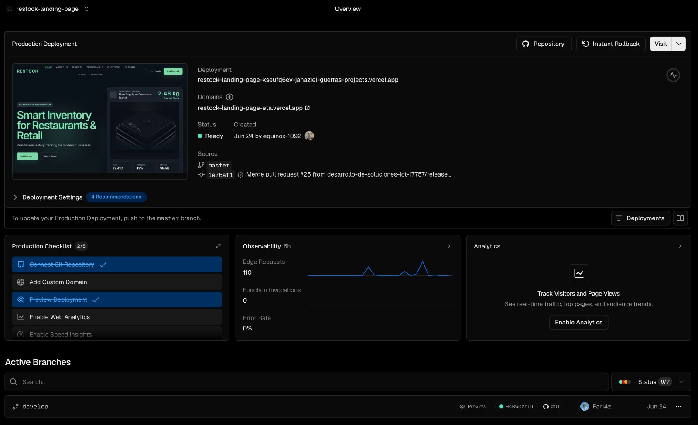
</p>

Se muestra el panel general (Overview) del proyecto `restock-landing-page` en Vercel. Se evidencia el estado "Ready" del despliegue en producción tras la exitosa integración del Pull Request #25 en la rama `master`. Asimismo, se observa la asignación correcta del dominio público y los despliegues de previsualización (Preview) operativos correspondientes a las ramas activas en desarrollo, como la rama `develop`.

#### Despliegue y Actualización de la Web Application (Vercel)

De forma complementaria, el ciclo de vida de la Web Application continuó gestionándose a través del despliegue automático en Vercel. En este sprint, la publicación sirvió para verificar la disponibilidad del frontend administrativo y la exposición correcta de las nuevas funcionalidades desarrolladas, garantizando la integración continua de los nuevos módulos interactivos del ecosistema Restock.

Los pasos seguidos para la actualización de este despliegue fueron los siguientes:

1. Se monitorizó el proceso de compilación de producción (production build) requerido por el framework al recibir los nuevos *commits* y *pull requests* de la iteración.
2. Se revisaron las configuraciones en el panel de Vercel para asegurar la correcta comunicación del frontend con los nuevos servicios expuestos por el backend.
3. Se confirmó la culminación exitosa del pipeline de publicación, asegurando que la plataforma reconstruyera el proyecto en su rama principal (`main`) sin errores de dependencias.
4. Se validó el acceso a la plataforma web mediante el dominio seguro generado por el hosting (`restock-web-application.vercel.app`), confirmando la actualización exitosa de la interfaz en producción.

La siguiente captura evidencia el estado del despliegue ejecutado durante el sprint:

**Dashboard de Producción en Vercel**

<p align="center">
  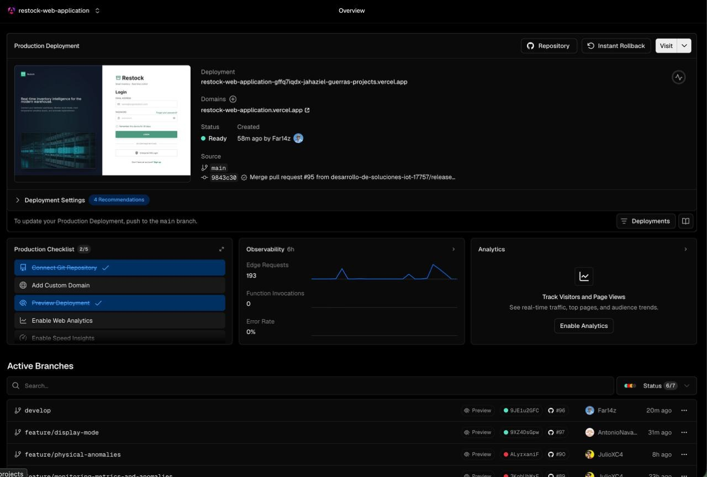
</p>

Se muestra el panel general (Overview) del proyecto `restock-web-application` en Vercel. Se evidencia el estado "Ready" del despliegue en producción tras la exitosa integración del Pull Request #95 en la rama principal. Asimismo, se observan los despliegues de previsualización (Preview) operativos correspondientes a las ramas activas desarrolladas por el equipo durante el sprint (tales como `develop`, `feature/display-mode` y `feature/physical-anomalies`).

#### Despliegue y Actualización de la Mobile Application (Firebase)

Durante este tercer sprint, la Mobile Application del ecosistema, diseñada para el monitoreo y gestión operativa de los inventarios, continuó su ciclo de integración y despliegue utilizando los servicios de Firebase. Específicamente, se empleó Firebase App Distribution para empaquetar y entregar las nuevas versiones estables (con las características desarrolladas en esta iteración) directamente a los dispositivos de los testers y stakeholders del proyecto.

Los pasos seguidos para este despliegue continuo fueron los siguientes:

1. Se verificó el estado de los proyectos registrados para Android e iOS en la consola de Firebase, asegurando que los servicios de analíticas y distribución estuvieran activos para el paquete de la aplicación.
2. Se compilaron los artefactos de la aplicación desde el entorno de desarrollo, generando los archivos instalables optimizados (APK o App Bundle) correspondientes a las nuevas versiones de este sprint.
3. Se subieron los artefactos generados a la plataforma de Firebase App Distribution, adjuntando las notas de la versión (release notes) y notificando automáticamente a los grupos de testers mediante correo electrónico.
4. Se monitoreó el panel de distribución para confirmar la recepción, aceptación y descarga de la aplicación por parte de los usuarios invitados.
5. Se validó el despliegue realizando la instalación directa y ejecución de la aplicación en un dispositivo físico para confirmar la operatividad de los nuevos módulos.

Las siguientes capturas evidencian el flujo de distribución y verificación de la aplicación móvil:

**Registro y Monitoreo en Firebase Console**

<p align="center">
  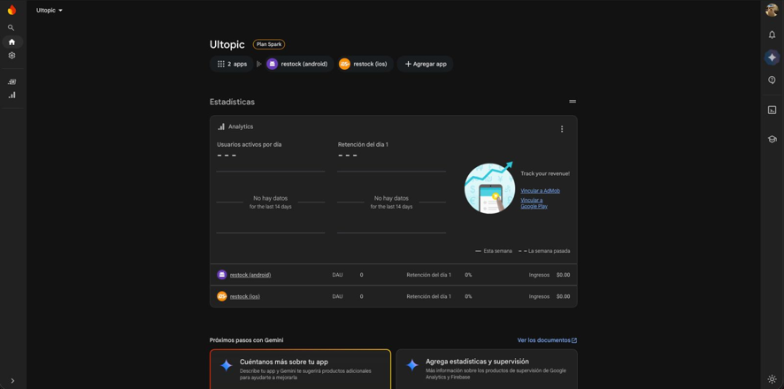
</p>

Panel principal de Firebase mostrando los entornos `restock (android)` y `restock (ios)` debidamente registrados. Esta configuración centralizada asegura que la aplicación esté vinculada a los servicios de la plataforma para su correcta distribución y monitoreo de métricas.

**Distribución de Versiones con Firebase App Distribution**

<p align="center">
  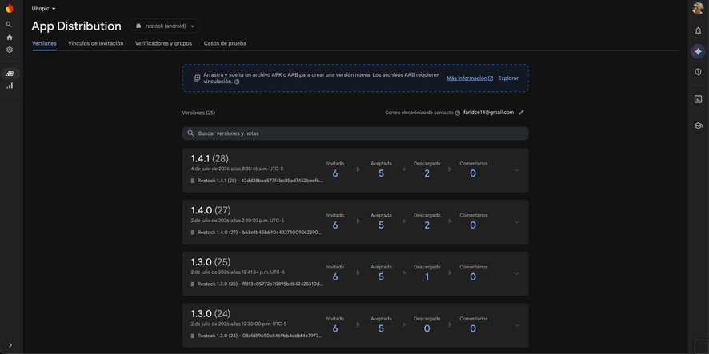
</p>

Panel de App Distribution evidenciando el historial de lanzamientos iterativos de la aplicación móvil correspondientes al sprint. Se observa la distribución exitosa de la versión más reciente (v1.4.1), detallando en tiempo real las métricas de invitaciones enviadas, aceptadas y descargas completadas por los testers.

**Mobile Application Operativa en Dispositivo Físico**

<p align="center">
  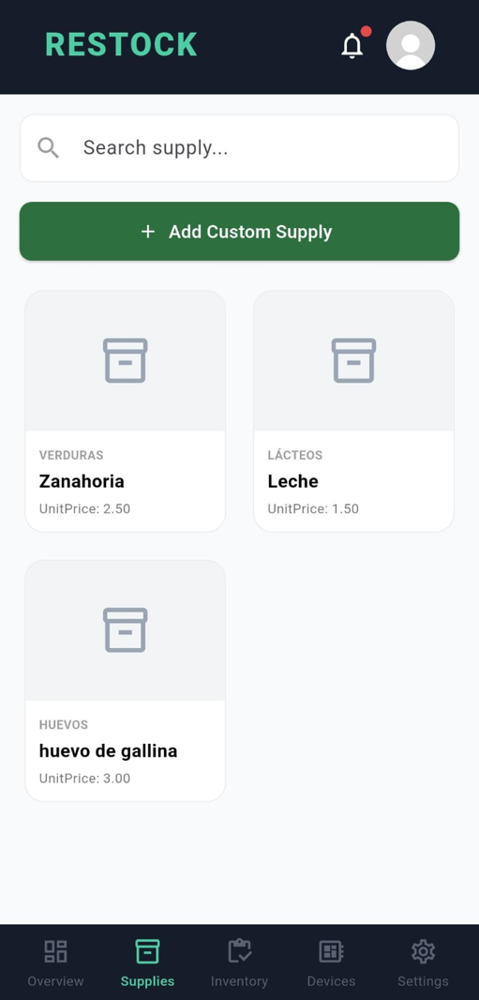
</p>
Captura de pantalla de la aplicación móvil Restock ejecutándose sin incidencias en un dispositivo físico tras su descarga desde App Distribution. Se valida el correcto renderizado de la interfaz de usuario, exponiendo la lista de suministros actualizados y la barra de navegación principal habilitada.

#### Despliegue y Actualización del Web Service (restock-web-services)

Durante este tercer sprint, el Web Service principal mantuvo su operatividad sobre la infraestructura preexistente en Azure App Service (`plan-restock-17757`). El enfoque de esta iteración se centró en la integración continua y el despliegue automático de los nuevos módulos desarrollados, garantizando la estabilidad del entorno de producción y manteniendo la disponibilidad pública a través del dominio `restock-api-17757.azurewebsites.net`.

Los pasos seguidos para la actualización de este despliegue fueron los siguientes:

1. Se validó la salud y el consumo de recursos del Plan de App Service `plan-restock-17757` (ubicado en la región Brazil South, tier Basic B1) para asegurar que soportara adecuadamente la carga de los nuevos controladores y servicios agregados.
2. Se mantuvo activo el modelo de publicación por contenedor, asegurando que la aplicación web extrajera automáticamente la última versión de la imagen Docker generada en cada pase a producción.
3. Se revisaron y actualizaron las variables de entorno en la configuración de la App Service, validando que las credenciales (MONGODB_URI, JWT, Cloudinary, Firebase, y perfiles de Spring) estuvieran correctamente inyectadas para soportar las nuevas integraciones del sistema.
4. El pipeline de Continuous Deployment configurado mediante GitHub Actions (`deploy-azure.yml`) continuó su labor de automatización, encargándose de compilar el proyecto, construir la nueva imagen Docker y publicarla en el GitHub Container Registry tras cada merge aprobado en la rama `main`.
5. Se monitorizó el historial de ejecuciones en GitHub Actions, confirmando que los workflow runs correspondientes a las integraciones de este sprint finalizaron con estado exitoso.
6. Se comprobó la actualización en producción de la documentación interactiva (Swagger UI), verificando que la especificación OpenAPI 3.1 exponga y documente correctamente los nuevos endpoints desarrollados en esta iteración.

Las siguientes capturas evidencian el proceso de actualización continua ejecutado:

<p align="center">
  
</p>

La imagen anterior muestra el Plan de App Service `plan-restock-17757` operativo, confirmando que los recursos asignados en el tier B1 (Linux) siguen soportando el ecosistema del backend de manera estable.

<p align="center">
  
</p>

La captura evidencia la aplicación web `restock-api-17757` en estado "En ejecución", procesando las peticiones entrantes a través de su dominio asignado tras los despliegues de este sprint.

<p align="center">
  
</p>

Se muestra el panel de configuración de la App Service, validando la persistencia y actualización de las variables de entorno críticas para la conexión con bases de datos, almacenamiento y notificaciones.

<p align="center">
  
</p>

La imagen destaca el archivo `deploy-azure.yml`, que se mantiene como el motor de entrega continua para enviar las actualizaciones del código hacia la infraestructura en la nube.

<p align="center">
  
</p>

Se evidencian los workflow runs más recientes completados exitosamente en el repositorio `restock-web-services`, los cuales corresponden a la liberación de las nuevas funcionalidades de esta iteración.

<p align="center">
  
</p>

La captura confirma la actualización de la Restock API en producción. El Swagger UI ahora refleja los nuevos módulos y bounded contexts finalizados por el equipo, listos para ser consumidos por las aplicaciones cliente.

#### Preparación y Contenedorización del Edge Service (Docker Hub para Despliegue Local)

Para asegurar la portabilidad y facilitar el despliegue del sistema Restock Edge Service en la presentación física del proyecto, se optó por una estrategia de contenerización con Docker. Esto elimina la necesidad de configurar manualmente intérpretes de Python o dependencias en las laptops de exposición. Se diseñó un Dockerfile multi-stage optimizado para disminuir el tamaño del artefacto y se habilitó la persistencia de datos de SQLite mediante volúmenes. Finalmente, la imagen se publicó en un registro centralizado (Docker Hub) para posibilitar un despliegue rápido de tipo 'zero-code' utilizando únicamente comandos de consola.

**Construcción de la Imagen (Docker Build)**

<p align="center">
  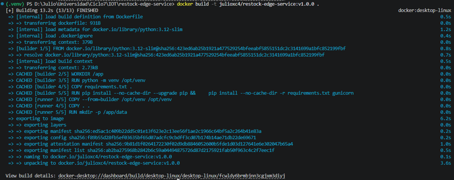
</p>

Proceso de construcción multi-stage de la imagen Docker para el Edge Service. En la captura se observa el aislamiento en la fase de 'builder' para instalar dependencias de Python mediante pip, seguido de la etapa de 'runner' que genera una imagen final ligera.

**Imagen Publicada en Docker Hub**

<p align="center">
  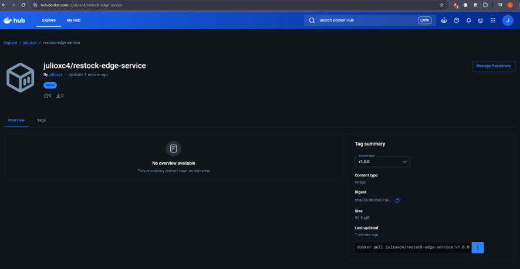
</p>

Repositorio público del Edge Service alojado en Docker Hub. Se muestran los tags garantizando que cualquier nodo de la red pueda descargar la imagen mediante el comando `docker pull` sin requerir acceso al código fuente.

**Contenedor corriendo en Docker Desktop o Terminal**

<p align="center">
  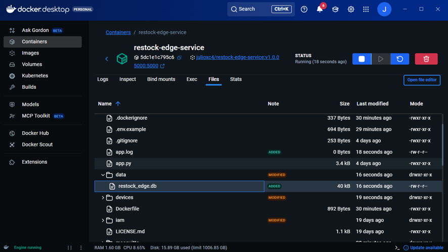
</p>

Estado de ejecución del contenedor en Docker Desktop. El servicio se expone localmente a través del puerto 5000 y cuenta con un volumen montado en el host en la ruta `./data`, permitiendo que la base de datos local SQLite conserve la persistencia de datos.

**Logs de Inicialización del Servicio**

<p align="center">
  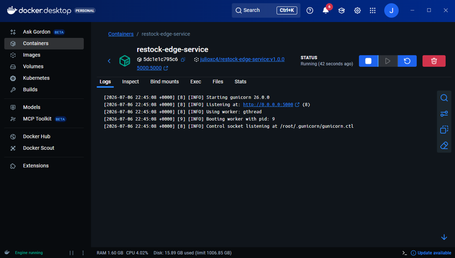
</p>

Logs de inicialización del Edge Service dentro del contenedor Docker. Se evidencia que al arrancar, el servicio ejecuta de forma automatizada los scripts de creación y mapea los modelos de dominio.

**Prueba de API (Evidencia de Funcionamiento)**

<p align="center">
  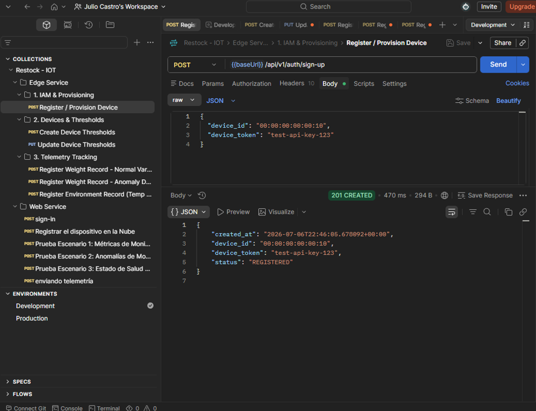
</p>

Prueba de validación del API expuesta por el contenedor del Edge Service. Se observa una solicitud POST que emula un envío de telemetría de peso, obteniendo una respuesta exitosa procesada directamente por el servidor Gunicorn.

#### Carga de Firmware y Evidencia del Dispositivo Embedded (Supplies Keeper)

El componente de hardware del sistema, denominado **Supplies Keeper**, ejecuta el software embebido encargado de realizar la lectura física de los sensores de peso y enviar las métricas de telemetría hacia el ecosistema de Restock. Para mitigar riesgos y asegurar la estabilidad del código en C++, el proceso de desarrollo y despliegue del firmware siguió un enfoque iterativo, comenzando con simulaciones virtuales y culminando en el flasheo directo del microcontrolador ESP32 físico.

Los pasos ejecutados para la validación y carga del firmware fueron los siguientes:

1. Se construyó y validó la lógica base del circuito electrónico mediante la plataforma de simulación **Wokwi**, permitiendo emular el comportamiento del ESP32 y las lecturas de los sensores antes de interactuar con los componentes físicos.
2. Se migró el código fuente validado hacia un entorno de desarrollo local utilizando **Arduino IDE**, garantizando un proceso de compilación, gestión de librerías y revisión de sintaxis eficiente.
3. Se conectó la placa base del dispositivo Supplies Keeper vía conexión serial-USB a la estación de trabajo, ejecutando el comando de subida para compilar y flashear el binario final en la memoria flash del microcontrolador.
4. Se validó la correcta ejecución en el entorno físico mediante el monitor serial y la observación directa del hardware, comprobando la inicialización de los sensores, la conexión a la red, y el envío exitoso de los paquetes de datos.

Las siguientes capturas y fotografías evidencian el flujo de despliegue del componente Embedded:

**Simulación Temprana del Circuito (Wokwi)**

<p align="center">
  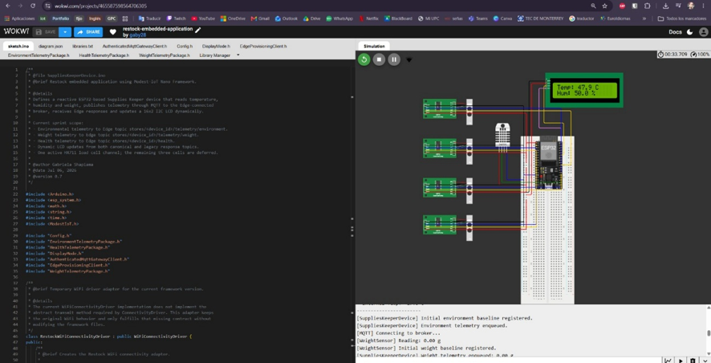
</p>

La imagen muestra el entorno de simulación de Wokwi ejecutando el archivo principal del proyecto. En ella se prototipó la lógica de lectura de los sensores y la conexión de la pantalla LCD de manera virtual, asegurando la viabilidad del código antes del ensamblaje físico.

**Compilación y Verificación en Arduino IDE**

<p align="center">
  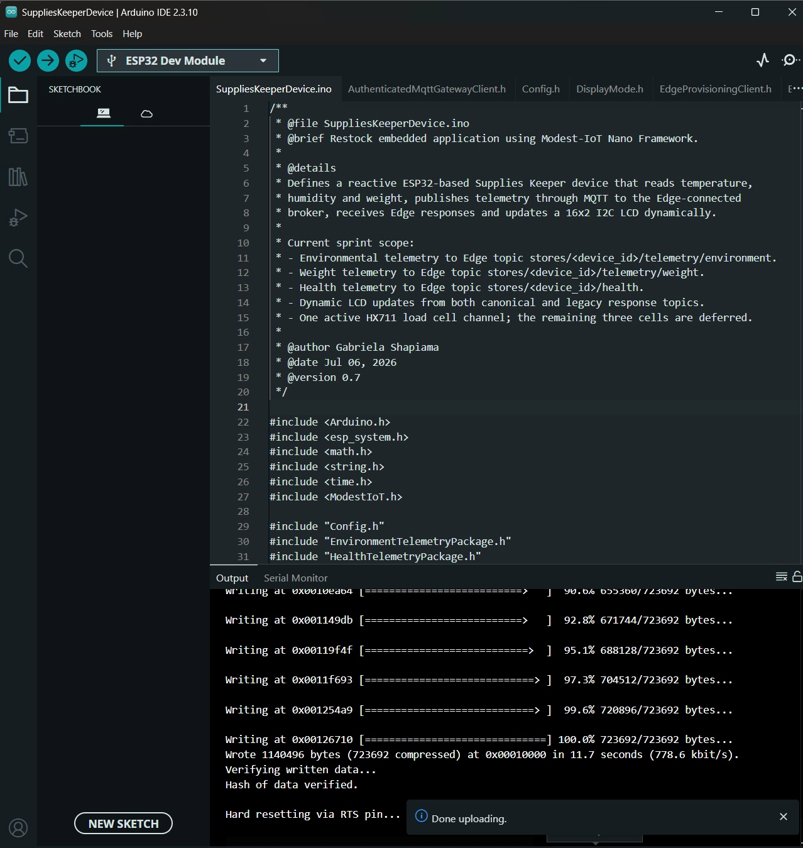
</p>

Se evidencia la salida de la consola durante el uso de Arduino IDE 2.3.10. El log confirma la resolución exitosa de las librerías de dependencias y la compilación del binario sin errores de sintaxis en el código fuente.

**Salida del Monitor Serial**

<p align="center">
  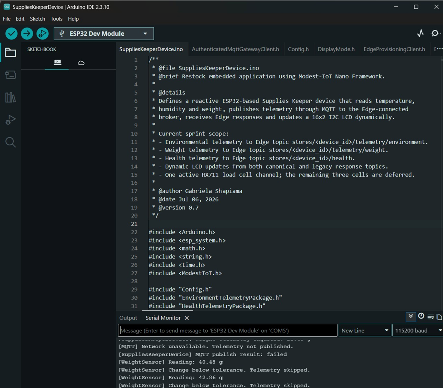
</p>

La captura muestra el log en tiempo real del Monitor Serial. Se observa el proceso de inicialización de los módulos, los intentos de conexión al broker MQTT y las lecturas preliminares de los sensores de peso calibrados.

**Carga del Firmware al Microcontrolador (ESP32)**

<p align="center">
  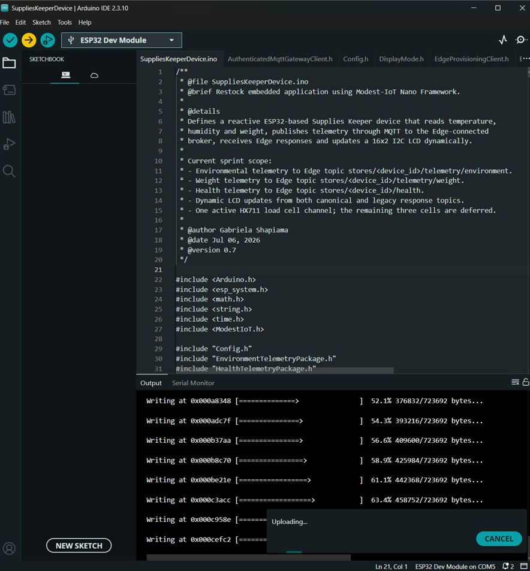
</p>

La imagen documenta el proceso de flasheo del código ("Uploading..."). Se confirma la escritura del binario compilado al 100% de su capacidad en la memoria flash del microcontrolador físico conectado por el puerto serie.

**Pruebas de Hardware en Protoboard**

<p align="center">
  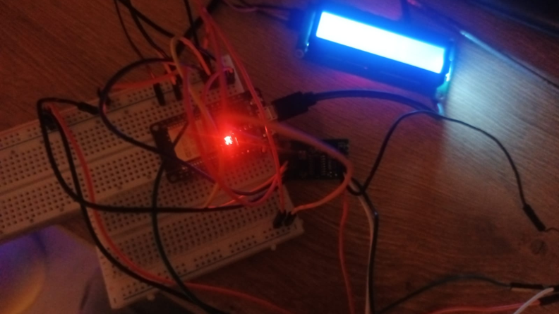
</p>

Fotografía del circuito físico preliminar ensamblado en una placa de pruebas (protoboard). Se evidencia el microcontrolador ESP32 energizado y la pantalla LCD retroiluminada respondiendo a las instrucciones del firmware.

**Prueba de Sensores de Peso (Supplies Keeper Operativo)**

<p align="center">
  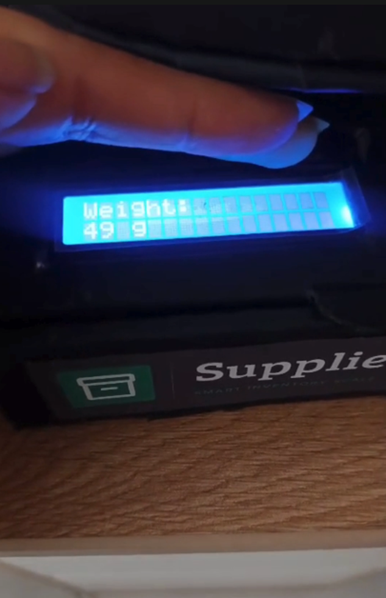
</p>

La fotografía muestra el dispositivo IoT físico finalizado, demostrando su capacidad operativa al reflejar en tiempo real los valores de peso (Weight) capturados por las celdas de carga integradas en la balanza inteligente.

**Prueba de Sensores Ambientales (Temperatura y Humedad)**

<p align="center">
  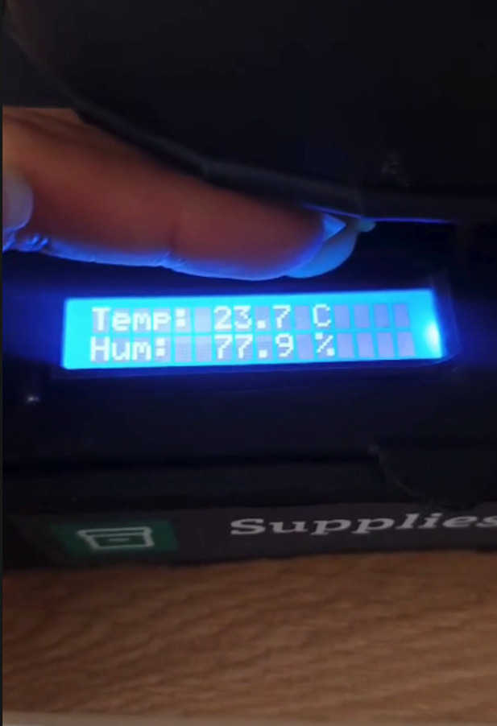
</p>

Se evidencia una segunda prueba sobre el dispositivo Supplies Keeper en funcionamiento, donde la pantalla LCD muestra exitosamente las lecturas de Temperatura y Humedad del entorno, validando la integración completa de los módulos periféricos.

#### 6.2.3.9. Team Collaboration Insights during Sprint

## 6.3. Validation Interviews

### 6.3.1. Diseño de Entrevistas

Para garantizar que la solución cumpla con las necesidades reales de los usuarios finales, se diseñó un proceso de entrevistas de validación centrado en los dos segmentos objetivo de Restock: **administradores de restaurantes** y **administradores de tiendas retail**. Cada sesión de validación incluye la interacción con el **Landing Page, la aplicación web y la aplicación móvil** (versión Android, desplegada y funcional), siguiendo user flows específicos que cubren las funcionalidades core implementadas en el incremento actual. La aplicación web complementa la validación al ofrecer las mismas capacidades de gestión desde el panel administrativo de escritorio, mientras que los flujos principales de cada sesión se demuestran sobre la aplicación móvil.

**Objetivo General**

Validar la usabilidad, comprensión y utilidad de las funcionalidades del sistema a través de sesiones controladas de interacción, aplicando principios de evaluación heurística y recogiendo observaciones cualitativas que retroalimenten futuras iteraciones del producto.

A continuación, se detallan los elementos a validar, los user flows del aplicativo móvil y las actividades a realizar durante cada sesión, organizados por segmento objetivo.

| Segmento                                          | Elementos a validar                                                                                                                                                                                                                                                                                                                                                                                                                                                     | Mobile User Flow                                                                                                                                                                                                                                                                                                                                                                                                                                                                              | Actividades durante la sesión                                                                                                                                                                                                                                                                                                                                                                                                                                                                                                |
|---------------------------------------------------|-------------------------------------------------------------------------------------------------------------------------------------------------------------------------------------------------------------------------------------------------------------------------------------------------------------------------------------------------------------------------------------------------------------------------------------------------------------------------|-----------------------------------------------------------------------------------------------------------------------------------------------------------------------------------------------------------------------------------------------------------------------------------------------------------------------------------------------------------------------------------------------------------------------------------------------------------------------------------------------|------------------------------------------------------------------------------------------------------------------------------------------------------------------------------------------------------------------------------------------------------------------------------------------------------------------------------------------------------------------------------------------------------------------------------------------------------------------------------------------------------------------------------|
| **Segmento 1: Administradores de Restaurantes**   | • Claridad del valor ofrecido en el Landing Page.<br>• Registro e inicio de sesión.<br>• Gestión de sucursales del negocio.<br>• Registro y gestión de insumos.<br>• Visualización y control de inventario.<br>• Registro y configuración de dispositivos (balanzas).<br>• Configuración de límites de stock (mín./máx.).<br>• Transferencia de inventario entre sucursales.<br>• Panel de alertas y notificaciones.<br>• Visualización de datos (dashboard).           | • Registro / inicio de sesión.<br>• Gestión de sucursales (crear, editar, desactivar).<br>• Registro y edición de insumos; filtrado por categoría.<br>• Visualización de inventario por sucursal.<br>• Registro de un dispositivo y asignación de lote.<br>• Configuración de umbrales de stock del dispositivo.<br>• Transferencia de stock entre sucursales.<br>• Revisión del centro de notificaciones.<br>• Visualización del dashboard de datos.<br>• Cambio de idioma de la interfaz.   | • Navegar el Landing Page y explicar lo que entienden del producto.<br>• Registrarse e iniciar sesión.<br>• Registrar y editar un insumo; aplicar un filtro por categoría.<br>• Acceder al inventario y describir lo que entienden.<br>• Registrar un dispositivo, asignarle un lote y configurar sus límites de stock.<br>• Simular una transferencia de inventario entre dos sucursales.<br>• Revisar las notificaciones y describir su utilidad.<br>• Explorar el dashboard de datos.<br>• Cambiar el idioma de la app.   |
| **Segmento 2: Administradores de Tiendas Retail** | • Claridad del valor ofrecido en el Landing Page.<br>• Registro e inicio de sesión.<br>• Gestión de sucursales del negocio.<br>• Registro y gestión de productos/insumos.<br>• Visualización y control de inventario.<br>• Registro y configuración de dispositivos (balanzas).<br>• Configuración de límites de stock (mín./máx.).<br>• Transferencia de inventario entre sucursales.<br>• Panel de alertas y notificaciones.<br>• Visualización de datos (dashboard). | • Registro / inicio de sesión.<br>• Gestión de sucursales (crear, editar, desactivar).<br>• Registro y edición de productos; filtrado por categoría.<br>• Visualización de inventario por sucursal.<br>• Registro de un dispositivo y asignación de lote.<br>• Configuración de umbrales de stock del dispositivo.<br>• Transferencia de stock entre sucursales.<br>• Revisión del centro de notificaciones.<br>• Visualización del dashboard de datos.<br>• Cambio de idioma de la interfaz. | • Navegar el Landing Page y explicar lo que entienden del producto.<br>• Registrarse e iniciar sesión.<br>• Registrar y editar un producto; aplicar un filtro por categoría.<br>• Acceder al inventario y describir lo que entienden.<br>• Registrar un dispositivo, asignarle un lote y configurar sus límites de stock.<br>• Simular una transferencia de inventario entre dos sucursales.<br>• Revisar las notificaciones y describir su utilidad.<br>• Explorar el dashboard de datos.<br>• Cambiar el idioma de la app. |

**Métricas a registrar por sesión**

Durante cada entrevista, el equipo a cargo registrará:

- Nivel de comprensión del producto (autoevaluación del usuario).
- Comentarios cualitativos de usabilidad y experiencia.
- Satisfacción con cada flujo (escala del 1 al 5).
- Puntos de confusión, errores y reacciones espontáneas observadas.

**Flujos a Validar (resumen por User Goal)**

| User Goal | Descripción del Flujo                                                                             | Objetivo de Validación                                                       |
| --------- | -------------------------------------------------------------------------------------------------- | ----------------------------------------------------------------------------- |
| UG 1      | El usuario accede al Landing Page, comprende la propuesta de valor y accede a la aplicación.      | Validar claridad del mensaje y de la propuesta de valor.                      |
| UG 2      | El usuario se registra e inicia sesión con sus datos.                                             | Validar claridad del formulario de registro y facilidad de login.             |
| UG 3      | El usuario crea, edita y desactiva una sucursal de su negocio.                                     | Validar la gestión del ciclo de vida de sucursales.                          |
| UG 4      | El usuario registra, edita y filtra insumos/productos del inventario.                              | Validar la funcionalidad de gestión de insumos y el filtrado por categoría. |
| UG 5      | El usuario accede al inventario y consulta el stock por sucursal.                                  | Validar la claridad y organización de la información de inventario.         |
| UG 6      | El usuario registra un dispositivo (balanza), le asigna un lote y configura sus límites de stock. | Validar el flujo de onboarding y configuración de dispositivos.              |
| UG 7      | El usuario transfiere stock entre dos sucursales.                                                  | Validar la funcionalidad de transferencia de inventario.                      |
| UG 8      | El usuario revisa el centro de notificaciones y alertas.                                           | Validar la utilidad y claridad de las notificaciones.                         |
| UG 9      | El usuario visualiza el dashboard de datos del negocio.                                            | Validar la comprensión de los indicadores presentados.                       |
| UG 10     | El usuario cambia el idioma de la interfaz.                                                        | Validar la accesibilidad y el soporte multi-idioma.                           |

### 6.3.2. Registro de Entrevistas

A continuación, se presenta el registro correspondiente a la entrevista realizada con un representante del segmento de restaurantes, quien participó en la validación de la Landing page, aplicación web y móvil de la plataforma Restock. El objetivo fue evaluar la claridad del mensaje, la propuesta de valor y la percepción de utilidad del sistema desde la perspectiva de un dueño o administrador de restaurante.

### Segmento Administradores de restaurantes

<table>
  <tr>
    <th colspan="2" style="text-align:center;">Entrevista #1</th>
  </tr>
  <tr>
    <td><strong>Nombre completo</strong></td>
    <td>Huiza Adriana</td>
  </tr>
  <tr>
    <td><strong>Edad</strong></td>
    <td>32 años</td>
  </tr>
  <tr>
    <td><strong>Distrito</strong></td>
    <td>Chorrillos</td>
  </tr>
  <tr>
    <td><strong>Rol</strong></td>
    <td>Dueño o administrador de restaurante</td>
  </tr>
  <tr>
    <td><strong>Fecha de entrevista</strong></td>
    <td>20 de junio de 2026</td>
  </tr>
  <tr>
    <td><strong>Evidencia</strong></td>
    <td>
      <div align="center">
        
      </div>
    </td>
  </tr>
  <tr>
    <td><strong>Link</strong></td>
    <td><a href="https://acortar.link/AVJ9RS">https://acortar.link/AVJ9RS</a></td>
  </tr>
  <tr>
    <td><strong>Timing donde inicia la entrevista</strong></td>
    <td>0:05 min</td>
  </tr>
  <tr>
    <td><strong>Duración de la entrevista</strong></td>
    <td>6 minutos y 10 segundos</td>
  </tr>
  <tr>
    <td><strong>Resumen</strong></td>
    <td>
      Durante la sesión, se presentaron los tres componentes principales de la solución Restock a Adriana Huiza para evaluar su percepción sobre la plataforma, la cual está enfocada en apoyar la gestión de inventarios en restaurantes. La entrevista tuvo como objetivo validar la experiencia de usuario, la claridad de la propuesta de valor, la utilidad de las funcionalidades de control de stock y la facilidad de uso de la solución en un contexto operativo real.
      <br><br>
      En la evaluación de la landing page, la entrevistada mostró una percepción positiva respecto a la forma en que se comunica el propósito de Restock. Consideró que la información presentada permite comprender que la plataforma busca optimizar el control de inventarios mediante herramientas digitales y dispositivos de monitoreo. Asimismo, destacó que la propuesta resulta útil para restaurantes que necesitan reducir errores manuales, conocer mejor el estado de sus insumos y tomar decisiones oportunas sobre reposición.
      <br><br>
      Respecto a la aplicación web, Adriana valoró que el sistema permita centralizar procesos relacionados con la gestión del negocio, como el registro de información, la administración de lotes, el control de stock y la visualización de dispositivos. La entrevistada percibió como relevante que la plataforma permita registrar insumos y consultar información operativa desde un panel organizado, ya que esto puede facilitar la supervisión diaria del inventario. Además, consideró importante que los flujos sean claros para que un administrador pueda utilizarlos sin requerir conocimientos técnicos avanzados.
      <br><br>
      La respuesta hacia la aplicación móvil también fue favorable. Adriana destacó que contar con una versión móvil puede ser útil para revisar información del negocio fuera de una computadora, especialmente cuando el administrador necesita supervisar el estado del inventario, revisar discrepancias o consultar información general de manera rápida. Desde su perspectiva, la movilidad de la solución aporta valor porque permite mantener control sobre la operación incluso cuando no se está físicamente en el área administrativa.
      <br><br>
      Finalmente, la entrevista permitió validar que Restock es percibida como una solución útil para restaurantes que buscan mejorar la precisión del inventario y reducir la dependencia de registros manuales. Se confirmó que funcionalidades como el monitoreo de insumos, la gestión de lotes, la visualización de dispositivos y el acceso móvil representan elementos importantes para fortalecer la gestión operativa. Como oportunidad de mejora, se identifica la necesidad de mantener indicadores visuales claros que permitan interpretar rápidamente el estado del stock y las posibles discrepancias detectadas por el sistema.
    </td>
  </tr>
</table>

<table>
  <tr>
    <th colspan="2" style="text-align:center;">Entrevista #2</th>
  </tr>
  <tr>
    <td><strong>Nombre completo</strong></td>
    <td>Angelina Medina</td>
  </tr>
  <tr>
    <td><strong>Edad</strong></td>
    <td>25 años</td>
  </tr>
  <tr>
    <td><strong>Distrito</strong></td>
    <td>Chorrillos</td>
  </tr>
  <tr>
    <td><strong>Rol</strong></td>
    <td>Dueño o administrador de restaurante</td>
  </tr>
  <tr>
    <td><strong>Fecha de entrevista</strong></td>
    <td>20 de junio de 2026</td>
  </tr>
  <tr>
    <td><strong>Evidencia</strong></td>
    <td>
      <div align="center">
        
      </div>
    </td>
  </tr>
  <tr>
    <td><strong>Link</strong></td>
    <td><a href="https://acortar.link/4mGKph">https://acortar.link/4mGKph</a></td>
  </tr>
  <tr>
    <td><strong>Timing donde inicia la entrevista</strong></td>
    <td>6:16 min</td>
  </tr>
  <tr>
    <td><strong>Duración de la entrevista</strong></td>
    <td>6 minutos y 47 segundos</td>
  </tr>
  <tr>
    <td><strong>Resumen</strong></td>
    <td>
      Durante la sesión, se presentaron los tres componentes principales de la solución Restock a Angelina Medina para evaluar su percepción sobre la plataforma desde el segmento de restaurantes. La entrevista tuvo como objetivo validar si la solución comunica adecuadamente su propuesta de valor, si los flujos de la aplicación web resultan comprensibles y si la aplicación móvil aporta utilidad para la supervisión de inventario y operaciones del negocio.
      <br><br>
      En la evaluación de la landing page, la entrevistada pudo identificar que Restock está orientada a resolver problemas relacionados con el control de inventarios, el monitoreo de insumos y la reducción de errores en la gestión manual. Angelina consideró que la explicación general de la plataforma ayuda a comprender el valor del sistema, especialmente porque presenta una solución que combina software con dispositivos de monitoreo para obtener información más confiable sobre el estado de los productos almacenados.
      <br><br>
      Respecto a la aplicación web, Angelina valoró positivamente la posibilidad de gestionar información del negocio desde un entorno centralizado. Durante la revisión de los flujos, se resaltó la utilidad de contar con secciones para configuración del negocio, gestión de lotes, visualización de suministros y administración de dispositivos. La entrevistada consideró que estas funcionalidades pueden ayudar a mantener una mejor organización del inventario, especialmente en restaurantes donde el control de insumos es constante y puede volverse complejo si se realiza de forma manual.
      <br><br>
      La aplicación móvil fue percibida como un complemento importante para la solución. Angelina destacó que una versión móvil facilita la supervisión rápida del negocio, permitiendo revisar información general, indicadores de stock y posibles discrepancias sin depender únicamente de una computadora. Esta característica fue considerada valiosa para administradores que necesitan mantenerse informados sobre el estado del inventario mientras realizan otras actividades operativas dentro o fuera del local.
      <br><br>
      Finalmente, la entrevista permitió validar que Restock responde a necesidades reales del segmento restaurantes, principalmente en relación con la visibilidad del inventario, la actualización de información y la detección oportuna de problemas de stock. Se confirmó que la combinación de aplicación web, aplicación móvil y dispositivos de monitoreo puede aportar valor al reducir el trabajo manual y mejorar la toma de decisiones. Como oportunidad de mejora, se identificó la importancia de reforzar los indicadores visuales dentro del dashboard y las vistas de inventario, para que el usuario pueda interpretar rápidamente si un insumo se encuentra en estado normal, crítico o con discrepancias.
    </td>
  </tr>
</table>

<table>
  <tr>
    <th colspan="2" style="text-align:center;">Entrevista #3</th>
  </tr>
  <tr>
    <td><strong>Nombre completo</strong></td>
    <td>Melany Espinoza</td>
  </tr>
  <tr>
    <td><strong>Edad</strong></td>
    <td>25 años</td>
  </tr>
  <tr>
    <td><strong>Distrito</strong></td>
    <td>Chorrillos</td>
  </tr>
  <tr>
    <td><strong>Rol</strong></td>
    <td>Dueño o administrador de restaurante</td>
  </tr>
  <tr>
    <td><strong>Fecha de entrevista</strong></td>
    <td>20 de junio de 2026</td>
  </tr>
  <tr>
    <td><strong>Evidencia</strong></td>
    <td>
      <div align="center">
        
      </div>
    </td>
  </tr>
  <tr>
    <td><strong>Link</strong></td>
    <td><a href="https://acortar.link/F9EHY7">https://acortar.link/F9EHY7</a></td>
  </tr>
  <tr>
    <td><strong>Timing donde inicia la entrevista</strong></td>
    <td>13:04 min</td>
  </tr>
  <tr>
    <td><strong>Duración de la entrevista</strong></td>
    <td>9 minutos y 11 segundos</td>
  </tr>
  <tr>
    <td><strong>Resumen</strong></td>
    <td>
      Durante la sesión, se presentaron los tres componentes principales de la solución Restock a Melany Espinoza para evaluar su percepción sobre la plataforma, la cual está enfocada en el segmento de administradoras de restaurantes. La entrevista, dirigida por Antonio Navarro, tuvo como objetivo validar la experiencia de usuario, la percepción de valor de las funcionalidades y la facilidad de uso del sistema.
      <br><br>
      En la evaluación de la landing page, la entrevistada mostró una percepción muy positiva respecto al diseño, calificándolo como limpio, completo y organizado. Destacó que la información sobre los beneficios, el uso de dispositivos adicionales (balanza para control de stock, humedad y temperatura) y la sección de preguntas frecuentes comunican claramente la propuesta de valor y generan confianza. Consideró que la estructura facilita el entendimiento inicial de la plataforma para cualquier usuario.
      <br><br>
      Respecto a la aplicación web, Melany valoró la naturaleza intuitiva y dinámica de los flujos de creación de usuarios y gestión de inventarios. Resaltó positivamente la flexibilidad para configurar monedas (soles, dólares, euros) y la capacidad de gestionar configuraciones regionales. No obstante, en el flujo de Kits and Recipes, sugirió incorporar indicadores más visuales sobre la rentabilidad y los platos más vendidos para mejorar la toma de decisiones. Asimismo, recomendó estandarizar las recetas base entre las distintas sucursales (branches) para garantizar la calidad y un control de costos consistente.
      <br><br>
      La respuesta hacia la aplicación móvil fue muy favorable. La entrevistada destacó que contar con una versión móvil es una gran idea, ya que le permite supervisar las operaciones, revisar el inventario y el consumo fuera de la oficina, facilitando una gestión más rápida. Como punto de mejora, propuso incluir indicadores más visuales en el apartado de overview para identificar rápidamente el estado de las discrepancias en los lotes.
      <br><br>
      Finalmente, La entrevista permitió validar que Restock es percibida como una solución completa y altamente funcional para las necesidades administrativas. Se confirmó que la automatización de procesos mediante dispositivos de hardware y la portabilidad de la aplicación móvil son puntos de gran valor estratégico. La incorporación de reportes de rentabilidad y la estandarización entre sucursales se identificaron como las oportunidades principales para fortalecer el sistema y optimizar la toma de decisiones del usuario final.
    </td>
  </tr>
</table>

A continuación, se presenta el registro correspondiente a la entrevista realizada con un representante del segmento de sector retail de consumo masivo, quien participó en la validación de la Landing page, aplicación web y móvil de la plataforma Restock. El objetivo fue evaluar la claridad del mensaje, la propuesta de valor y la percepción de utilidad del sistema desde la perspectiva de un dueño o administrador de tienda retail.

### Segmento Administradores de tiendas retail

<table>
  <tr>
    <th colspan="2" style="text-align:center;">Entrevista #1</th>
  </tr>
  <tr>
    <td><strong>Nombre completo</strong></td>
    <td>Brayner Coronel</td>
  </tr>
  <tr>
    <td><strong>Edad</strong></td>
    <td>29 años</td>
  </tr>
  <tr>
    <td><strong>Distrito</strong></td>
    <td>Villa María del Triunfo, Lima</td>
  </tr>
  <tr>
    <td><strong>Rol</strong></td>
    <td>Dueño o administrador de tienda retail de consumo masivo</td>
  </tr>
  <tr>
    <td><strong>Fecha de entrevista</strong></td>
    <td>20 de junio de 2026</td>
  </tr>
  <tr>
    <td><strong>Evidencia</strong></td>
    <td>
      <div align="center">
        
      </div>
    </td>
  </tr>
  <tr>
    <td><strong>Link</strong></td>
    <td><a href="https://acortar.link/P51YEX">https://acortar.link/P51YEX</a></td>
  </tr>
  <tr>
    <td><strong>Timing donde inicia la entrevista</strong></td>
    <td>22:16 min</td>
  </tr>
  <tr>
    <td><strong>Duración de la entrevista</strong></td>
    <td>9 minutos y 04 segundos</td>
  </tr>
  <tr>
    <td><strong>Resumen</strong></td>
    <td>
      Durante la entrevista, se evaluaron tres componentes principales de la solución Restock: la landing page, la aplicación web y la aplicación móvil. El objetivo fue validar la experiencia de usuario, la percepción de valor de las funcionalidades y la facilidad de uso de la plataforma en el segmento de dueños y administradores de tiendas retail de consumo masivo.
      <br><br>
      En la evaluación de la landing page, Brayner Coronel mostró una percepción positiva respecto al diseño visual, destacando la combinación de colores, la tipografía y la organización de la información. Asimismo, consideró que las secciones de beneficios, testimonios y presentación de funcionalidades transmiten de manera clara la propuesta de valor de Restock. Sin embargo, identificó una dificultad en la sección de selección de planes, ya que la estructura de precios le generó confusión al percibir que un plan con menos funcionalidades presentaba un costo superior al de otro con mayores beneficios. Esta situación afectó la comprensión inicial de la oferta comercial y dio origen al hallazgo heurístico relacionado con la jerarquía de precios.
      <br><br>
      Respecto a la aplicación web, el entrevistado destacó positivamente la consistencia visual con la landing page, valorando que los colores, estilos y componentes mantengan una misma identidad a lo largo de la experiencia. También señaló que los módulos de analíticas y gestión de perfiles resultan útiles y fáciles de comprender. Durante la navegación identificó un problema de usabilidad en el módulo de gestión de lotes (Batches), donde las acciones disponibles para cada registro permanecían ocultas hasta posicionar el cursor sobre una fila específica. Según comentó, esta implementación dificulta que usuarios nuevos descubran rápidamente las opciones de edición y eliminación disponibles.
      <br><br>
      Finalmente, se evaluó la aplicación móvil de Restock, obteniendo una respuesta altamente favorable. El entrevistado indicó que la interfaz resulta intuitiva y cómoda para el uso diario, especialmente considerando que suele gestionar operaciones desde dispositivos móviles. Entre las funcionalidades que más valoró se encuentra la transferencia de lotes entre sucursales, ya que considera que esta característica facilita el control del inventario distribuido y optimiza la gestión de stock entre diferentes puntos de venta. Además, destacó la fluidez de la navegación y la coherencia visual con el resto de la plataforma.
    </td>
  </tr>
</table>

<table>
  <tr>
    <th colspan="2" style="text-align:center;">Entrevista #2</th>
  </tr>
  <tr>
    <td><strong>Nombre completo</strong></td>
    <td>Monica Jaramillo</td>
  </tr>
  <tr>
    <td><strong>Edad</strong></td>
    <td>52 años</td>
  </tr>
  <tr>
    <td><strong>Distrito</strong></td>
    <td>José Gálvez, Lima</td>
  </tr>
  <tr>
    <td><strong>Rol</strong></td>
    <td>Dueño o administrador de tienda retail de consumo masivo</td>
  </tr>
  <tr>
    <td><strong>Fecha de entrevista</strong></td>
    <td>20 de junio de 2026</td>
  </tr>
  <tr>
    <td><strong>Evidencia</strong></td>
    <td>
      <div align="center">
        
      </div>
    </td>
  </tr>
  <tr>
    <td><strong>Link</strong></td>
    <td><a href="https://acortar.link/bhXlMy">https://acortar.link/bhXlMy</a></td>
  </tr>
  <tr>
    <td><strong>Timing donde inicia la entrevista</strong></td>
    <td>31:21 min</td>
  </tr>
  <tr>
    <td><strong>Duración de la entrevista</strong></td>
    <td>3 minutos y 46 segundos</td>
  </tr>
  <tr>
    <td><strong>Resumen</strong></td>
    <td>
      Durante la entrevista, se evaluaron tres componentes principales de la solución Restock: la landing page, la aplicación web y la aplicación móvil. El objetivo fue validar la experiencia de usuario, la facilidad de uso de las funcionalidades y la percepción de valor de la plataforma dentro del segmento de dueños y administradores de tiendas retail de consumo masivo.
      <br><br>
      En la evaluación de la landing page, Mónica Jaramillo mostró una percepción muy positiva respecto al diseño y la presentación general del producto. Destacó la combinación de colores, la organización de la información y la claridad con la que se comunican los beneficios de la plataforma. Asimismo, comentó que las secciones de testimonios y características le permitieron comprender rápidamente la propuesta de valor de Restock. También manifestó agrado por los elementos visuales e ilustraciones presentes en la página, considerando que contribuyen a una experiencia más atractiva y amigable para el usuario. Durante esta evaluación no identificó inconvenientes ni dificultades de navegación.
      <br><br>
      Respecto a la aplicación web, la entrevistada valoró positivamente la consistencia visual con la landing page y la organización de los diferentes módulos. Sin embargo, al interactuar con la gestión de lotes (Batches), encontró la misma dificultad observada en otras entrevistas, relacionada con la visibilidad de las acciones disponibles para cada registro. Indicó que inicialmente no logró identificar cómo editar o eliminar elementos de la lista debido a que estas opciones solo aparecen al posicionar el cursor sobre una fila específica, lo que afecta la facilidad de descubrimiento de dichas funcionalidades.
      <br><br>
      Finalmente, se evaluó la aplicación móvil de Restock, obteniendo una respuesta altamente favorable. La entrevistada señaló que utiliza con frecuencia dispositivos móviles para gestionar actividades de su negocio, por lo que valoró especialmente la facilidad de uso de la aplicación. Destacó que la navegación resulta intuitiva y que las interacciones táctiles permiten acceder rápidamente a funcionalidades adicionales. En particular, le agradó la posibilidad de mantener presionados determinados elementos para desplegar nuevas opciones y acciones contextuales, ya que considera que este comportamiento agiliza las tareas diarias sin sobrecargar la interfaz con botones adicionales.
    </td>
  </tr>
</table>

<table>
  <tr>
    <th colspan="2" style="text-align:center;">Entrevista #3</th>
  </tr>
  <tr>
    <td><strong>Nombre completo</strong></td>
    <td>Erick Coronel</td>
  </tr>
  <tr>
    <td><strong>Edad</strong></td>
    <td>52 años</td>
  </tr>
  <tr>
    <td><strong>Distrito</strong></td>
    <td>Villa María del Triunfo, Lima</td>
  </tr>
  <tr>
    <td><strong>Rol</strong></td>
    <td>Dueño o administrador de tienda retail de consumo masivo</td>
  </tr>
  <tr>
    <td><strong>Fecha de entrevista</strong></td>
    <td>20 de junio de 2026</td>
  </tr>
  <tr>
    <td><strong>Evidencia</strong></td>
    <td>
      <div align="center">
        
      </div>
    </td>
  </tr>
  <tr>
    <td><strong>Link</strong></td>
    <td><a href="https://acortar.link/pPsfaS">https://acortar.link/pPsfaS</a></td>
  </tr>
  <tr>
    <td><strong>Timing donde inicia la entrevista</strong></td>
    <td>35:08 min</td>
  </tr>
  <tr>
    <td><strong>Duración de la entrevista</strong></td>
    <td>9 minutos y 50 segundos</td>
  </tr>
  <tr>
    <td><strong>Resumen</strong></td>
    <td>
      Durante la entrevista, se evaluaron tres componentes principales de la solución Restock: la landing page, la aplicación web y la aplicación móvil. El objetivo fue validar la experiencia de usuario, la percepción de valor de las funcionalidades y la facilidad de uso de la plataforma en el segmento de dueños y administradores de tiendas retail de consumo masivo.
      <br><br>
      En la evaluación de la landing page, Erick Coronel mostró una percepción muy positiva respecto al contenido y diseño presentado. Destacó especialmente las secciones de beneficios, ya que le permitieron comprender rápidamente cómo la plataforma puede contribuir a mejorar la gestión de su negocio. Asimismo, valoró los testimonios mostrados, considerándolos útiles para generar confianza en la solución. También mencionó que la sección de preguntas frecuentes le resultó particularmente atractiva, debido a que suele revisar este tipo de información antes de adquirir un producto o servicio, ya que le permite resolver dudas comunes y comprender mejor la propuesta de valor ofrecida.
      <br><br>
      Respecto a la aplicación web, el entrevistado destacó la consistencia visual de la plataforma y la calidad de su diseño. Comentó que los colores utilizados resultan agradables y transmiten una identidad profesional y moderna. Asimismo, valoró positivamente la organización de las tablas utilizadas para la gestión de lotes y el formato de las tarjetas empleadas para visualizar información de productos, indicando que ambos elementos facilitan la lectura y comprensión de los datos. En general, consideró que la navegación es clara y que las funcionalidades presentadas responden adecuadamente a las necesidades de gestión de una tienda retail.
      <br><br>
      Finalmente, se evaluó la aplicación móvil de Restock. Durante esta prueba, el entrevistado identificó una oportunidad de mejora relacionada con la funcionalidad de transferencia de lotes entre sucursales. Específicamente, observó que el botón principal para confirmar la transferencia permanecía visualmente activo incluso cuando los campos obligatorios del formulario no habían sido completados, lo que generó incertidumbre respecto al estado de validación del proceso. Esta situación dio origen al hallazgo heurístico relacionado con la prevención de errores. No obstante, fuera de este aspecto, manifestó una percepción positiva de la aplicación, destacando especialmente los módulos de analíticas y notificaciones, así como la facilidad de navegación entre las diferentes secciones.
    </td>
  </tr>
</table>


### 6.3.3. Evaluaciones según heurísticas

Evaluaciones según heurísticas

Esta sección contiene el proceso de evaluación de las sesiones de validación basado en heurísticas, considerando heurísticas de usabilidad, arquitectura de información e inclusive design de la experiencia propuesta.

**UX Heuristics & Principles Evaluation**
**Usability – Inclusive Design – Information Architecture**

|                      |                                                                                                   |
| -------------------- |---------------------------------------------------------------------------------------------------|
| **CARRERA**    | Ingeniería de Software                                                                            |
| **CURSO**      | Desarrollo de Soluciones IoT                                                                      |
| **SECCIÓN**   | 17757                                                                                             |
| **PROFESORES** | Todos                                                                                             |
| **AUDITOR**    | UI-Topic                                                                                          |
| **CLIENTE(S)** | Huiza Adriana, Angelina Medina, Melany Espinoza, Brayner Coronel, Monica Jaramillo, Erick Coronel |

---

**SITE o APP A EVALUAR:** Restock — Landing Page, Aplicación Web y Aplicación Móvil

---

**TAREAS A EVALUAR:**

El alcance de esta evaluación incluye la revisión de la usabilidad de las siguientes tareas:

1. Registro e inicio de sesión de un usuario nuevo.
2. Configuración del perfil de usuario y datos del negocio.
3. Registro y configuración de un dispositivo IoT.
4. Gestión de inventario: creación y edición de insumos y lotes.
5. Revisión de alertas y notificaciones de stock bajo / eventos críticos.
6. Consulta del panel de analíticas y productos críticos.
7. Gestión de sucursales (alta, baja y actualización de estado).
8. Transferencia de stock entre sucursales.

No están incluidas en esta versión de la evaluación las siguientes tareas:

1. Gestión avanzada de recetas/ingredientes de productos.
2. Configuración de suscripción a notificaciones push.
3. Resolución de tareas de conciliación de stock.

---

**ESCALA DE SEVERIDAD:**

Los errores serán puntuados tomando en cuenta la siguiente escala de severidad:

| Nivel | Descripción                                                                                                                                                                                        |
| ----- | --------------------------------------------------------------------------------------------------------------------------------------------------------------------------------------------------- |
| 1     | Problema superficial: puede ser fácilmente superado por el usuario o ocurre con muy poca frecuencia. No necesita ser arreglado a no ser que exista disponibilidad de tiempo.                       |
| 2     | Problema menor: puede ocurrir un poco más frecuentemente o es un poco más difícil de superar para el usuario. Se le debería asignar una prioridad baja resolverlo de cara al siguiente release. |
| 3     | Problema mayor: ocurre frecuentemente o los usuarios no son capaces de resolverlos. Es importante que sean corregidos y se les debe asignar una prioridad alta.                                     |
| 4     | Problema muy grave: un error de gran impacto que impide al usuario continuar con el uso de la herramienta. Es imperativo que sea corregido antes del lanzamiento.                                   |

---

**TABLA RESUMEN:**

| # | Problema                            | Escala de severidad | Heurística/Principio violada(o)                                                 |
| - | ----------------------------------- | ------------------- | -------------------------------------------------------------------------------- |
| 1 | [Descripción breve del problema 1] | [1-4]               | [Usability / Inclusive Design / Information Architecture: principio específico] |
| 2 | [Descripción breve del problema 2] | [1-4]               | [Usability / Inclusive Design / Information Architecture: principio específico] |
| 3 | [Descripción breve del problema 3] | [1-4]               | [Usability / Inclusive Design / Information Architecture: principio específico] |
| 4 | [Descripción breve del problema 4] | [1-4]               | [Usability / Inclusive Design / Information Architecture: principio específico] |
| 5 | [Descripción breve del problema 5] | [1-4]               | [Usability / Inclusive Design / Information Architecture: principio específico] |

---

**DESCRIPCIÓN DE PROBLEMAS:**

> _Los siguientes hallazgos provienen de la inspección heurística de la aplicación web desplegada. Deben corroborarse y/o ampliarse con las observaciones recogidas en las entrevistas de validación; cada problema incluye el espacio para la captura que lo ilustra._

**PROBLEMA #1:** Jerarquía de precios confusa en la selección de plan

Severidad: 3
Heurística violada: Information Architecture — Is it understandable? (y Usability — Coincidencia con el mundo real)

Problema:

En la pantalla "Choose your Restock Plan", el plan **Basic** (con menos funcionalidades: hasta 10 balanzas) cuesta **S/ 59.99**, mientras que el plan **Pro** (con más funcionalidades: SLA empresarial e integraciones) cuesta **S/ 39.99**. Un precio mayor para el plan con menos beneficios resulta contraintuitivo. La causa —que cada precio corresponde a un ciclo de facturación distinto (mensual, semestral y anual)— se indica en texto pequeño ("Billed every 6 months", "Billed annually") sin suficiente prominencia, por lo que el usuario puede interpretar erróneamente la relación precio-valor.

<p align="center">
  
</p>

Recomendación:

Destacar visualmente el ciclo de facturación de cada plan (por ejemplo, mostrando el precio total y su equivalente mensual) o unificar la comparación a un mismo período. Ordenar los planes de forma coherente con el precio mostrado.

---

**PROBLEMA #2:** Las acciones de cada fila permanecen ocultas hasta el hover

Severidad: 2
Heurística violada: Usability — Reconocer en lugar de recordar (y visibilidad del estado del sistema)

Problema:

En la tabla de inventario (Batches), los íconos de acción (editar/eliminar) de la columna "Actions" solo se muestran en la fila sobre la que se posa el cursor; en las demás filas la columna aparece vacía. Un usuario nuevo no percibe que cada insumo puede editarse o eliminarse directamente desde la lista, reduciendo la descubribilidad de la funcionalidad.

<p align="center">
  
</p>

Recomendación:

Mostrar las acciones de forma persistente en todas las filas (o un indicador de "más opciones" siempre visible), de modo que la funcionalidad sea descubrible sin depender del hover.

---

**PROBLEMA #3:** Campo de confirmación ambiguo al desvincular una balanza

Severidad: 2
Heurística violada: Usability — Prevención de errores

Problema:

En el modal "Unlink Supply Keeper" se solicita "Write the scale name to confirm", pero en ninguna parte del modal se muestra el nombre de la balanza ("scale name"). El único identificador visible es el "DEVICE ID" (6a387300b02a9a2b8a429204), un valor alfanumérico extenso que no corresponde al dato solicitado en el campo de confirmación. Esto impide que el usuario sepa qué texto debe escribir para habilitar la acción destructiva, bloqueando potencialmente la operación o llevando a intentos de prueba y error.

<p align="center">
  
</p>

Recomendación:

Mostrar explícitamente dentro del modal el nombre exacto de la balanza que debe ingresarse (por ejemplo, junto al "DEVICE ID" o en el mensaje de advertencia), y resaltar ese valor para que coincida sin ambigüedad con lo solicitado en el campo "Write the scale name to confirm".

---

**PROBLEMA #4:** Botón de acción primaria activo sin validación de campos obligatorios en el modal "Transfer Batch Stock"

Severidad: 2
Heurística violada: Prevención de errores

Problema:

En el modal "Transfer Batch Stock", el botón "Confirm Transfer" se muestra con el mismo estilo activo (verde sólido, alto contraste) independientemente de si los campos obligatorios — "Destination Zone", "Batch to Transfer" y "Quantity" — han sido completados. En la captura, tanto "Select a branch" como "Select a batch" permanecen sin seleccionar y el campo "Quantity" muestra "0.0" con la misma tipografía oscura y peso que un valor real ingresado por el usuario (no como un placeholder gris diferenciado), lo que genera ambigüedad sobre si ya existe una cantidad válida cargada. El sistema no comunica visualmente que el formulario está incompleto, permitiendo que el usuario intente confirmar una transferencia inválida o de cantidad cero.

<p align="center">
  
</p>

Recomendación:

Deshabilitar visualmente el botón "Confirm Transfer" (color atenuado, cursor not-allowed) hasta que todos los campos obligatorios estén completos y la cantidad sea mayor a cero. Además, diferenciar claramente el estado vacío del campo "Quantity" usando un placeholder real (por ejemplo, "Enter quantity" en gris claro) en vez de un valor numérico "0.0" con apariencia de dato ya ingresado, evitando confusión entre placeholder y valor real.

---

**PROBLEMA #5:** Baja prominencia y jerarquía insuficiente entre acciones en el modal de desactivación de sucursal

Severidad: 2
Heurística violada: Visibilidad del estado del sistema / Prevención de errores

Problema:

En el modal "Deactivate branch?", los botones "Cancel" y "Deactivate" se presentan como texto plano, sin contenedor ni relleno, del mismo tamaño y peso tipográfico, diferenciados únicamente por el color del texto. Esto reduce la prominencia de ambas acciones, ya que ninguna comunica claramente que es interactiva, y al estar ubicadas una junto a la otra con estilos casi idénticos, aumenta el riesgo de que el usuario active por error la acción destructiva ("Deactivate") en lugar de cancelar.

<p align="center">
  
</p>

Recomendación:

Convertir ambos botones en componentes con contenedor sólido (relleno o outline) en lugar de texto plano, asignar a la acción destructiva un fondo de alto contraste que la identifique inequívocamente como irreversible, y mantener el botón "Cancel" con un estilo secundario que refuerce que es la opción segura por defecto, separando ambas acciones lo suficiente para evitar errores de tap.

## 6.4. Video About-the-Product

El video **About-the-Product** ha sido elaborado con el propósito de presentar la propuesta de valor integral de **Restock**, exhibiendo el ecosistema completo de productos desarrollados durante el ciclo. El contenido audiovisual destaca la integración de las siguientes soluciones tecnológicas:

* **Landing Page:** Portal informativo diseñado para la captación de usuarios y presentación de la solución.
* **Aplicación Web Frontend:** Desarrollada con el framework **Angular**, orientada a la gestión administrativa profunda.
* **Aplicaciones Móviles:** Se presenta la coexistencia de dos soluciones móviles, una desarrollada de forma **Nativa** y otra mediante el framework **Flutter**, permitiendo una gestión de inventario versátil y en tiempo real.

La narrativa del video guía al espectador a través del flujo principal de la plataforma, mostrando la resolución de problemas reales en la gestión de insumos mediante el uso de sensores y culminando con testimonios de usuarios recolectados durante las sesiones de validación.

**Información del Video:**

* **Nombre del archivo:** `upc-pre-202610-1asi0572-17757-UI-Topic-about-the-product-sprint-2`
* **Duración:** 00:01:48
* **Formatos y Plataformas:** Subido a Microsoft Stream (entorno institucional), YouTube (para visualización pública e inserción en el Landing Page).

**Evidencia de Publicación:**


*Interfaz de la aplicación Restock presentada en el video institucional.*

**Enlaces de acceso:**

| Plataforma | Enlace de Acceso |
| :--- | :--- |
| **Microsoft Stream** | [https://shorturl.at/XYcrE](https://shorturl.at/XYcrE) |
| **YouTube** | [https://www.youtube.com/watch?v=2pV4h6XbO7Y](https://www.youtube.com/watch?v=2pV4h6XbO7Y) |


<div style="page-break-after: always;"></div>
