# Capítulo VI: Product Implementation, Validation & Deployment

## 6.1. Software Configuration Management

En esta sección el equipo desarrolla y explica la justificación de las herramientas y tecnologías a utilizar que ayudan a desarrollar cada producto de software definido en el alcance del proyecto.

### 6.1.1. Software Development Environment Configuration

A continuación, se define la configuración decidida por el equipo para las diversas áreas que conforman al entorno de desarrollo del producto. Entre los aspectos, se define como se maneja el proyecto, los requisitos, el diseño del producto, el ciclo de vida de desarrollo de software, las pruebas, el despliegue y la documentación.

| Actividad               | Herramienta / Guía                | Propósito                                                                         | Tipo de acceso / Ruta                                                                                                   |
| ----------------------- | ---------------------------------- | ---------------------------------------------------------------------------------- | ----------------------------------------------------------------------------------------------------------------------- |
| Project Management      | Jira                               | Seguimiento de backlog, tareas, sprints y desempeño de los integrantes del grupo. | [https://www.atlassian.com/es/software/jira](https://www.atlassian.com/es/software/jira)                                   |
| Requirements Management | Gherkin Conventions                | Escritura legible de requisitos con formato Given/When/Then.                       | [https://cucumber.io/docs/gherkin/](https://cucumber.io/docs/gherkin/)                                                     |
| Product Design          | Structurizr C4                     | Diseño de la arquitectura del sistema completo y sus aplicaciones.                | [https://playground.structurizr.com/](https://playground.structurizr.com/)                                                 |
| Product Design          | PlantUML                           | Diseño de la arquitectura de bajo nivel incluyendo diagramas de clase.            | [https://plantuml.com/](https://plantuml.com/)                                                                             |
| Product Design          | Figma                              | Prototipos de las aplicaciones web, móvil y el sitio web estático.               | [https://figma.com](https://figma.com)                                                                                     |
| Product Design          | Wokwi                              | Diseño de prototipo del dispositivo IoT.                                          | [https://wokwi.com/](https://wokwi.com/)                                                                                   |
| Software Development    | HTML5, CSS y JavaScript / WebStorm | Desarrollo del sitio web estático.                                                | [https://www.jetbrains.com/es-es/webstorm/](https://www.jetbrains.com/es-es/webstorm/)                                     |
| Software Development    | Flutter y Dart / Android Studio    | Desarrollo de la aplicación móvil.                                               | [https://developer.android.com/studio?hl=es-419](https://developer.android.com/studio?hl=es-419)                           |
| Software Development    | TypeScript y Angular / WebStorm    | Desarrollo de la aplicación web.                                                  | [https://www.jetbrains.com/es-es/webstorm/](https://www.jetbrains.com/es-es/webstorm/)                                     |
| Software Development    | Java y Spring Boot / IntelliJ IDEA | Desarrollo del REST API y lógica de negocio.                                      | [https://www.jetbrains.com/idea/](https://www.jetbrains.com/idea/)                                                         |
| Software Development    | Python y Flask / PyCharm           | Desarrollo de la capa Edge para el entorno IoT.                                    | [https://www.jetbrains.com/es-es/pycharm/download/](https://www.jetbrains.com/es-es/pycharm/download/)                     |
| Software Development    | C++ / Arduino IDE                  | Desarrollo de la aplicación embebida para dispositivos IoT.                       | [https://www.arduino.cc/en/software](https://www.arduino.cc/en/software)                                                   |
| Software Development    | MongoDB / MongoDB Compass          | Uso local de la base de datos para pruebas en entornos de desarrollo.              | [https://www.mongodb.com/products/tools/compass](https://www.mongodb.com/products/tools/compass)                           |
| Software Development    | Git + GitHub                       | Gestión colaborativa del código fuente.                                          | [https://github.com](https://github.com)                                                                                   |
| Software Testing        | jUnit, Mockito                     | Pruebas unitarias y de integración para el REST API.                              | [https://junit.org/](https://junit.org/) / [https://site.mockito.org/](https://site.mockito.org/)                             |
| Software Testing        | pytest                             | Pruebas unitarias para el Edge API.                                                | [https://docs.pytest.org/](https://docs.pytest.org/)                                                                       |
| Software Deployment     | Vercel                             | Despliegue continuo del sitio web estático.                                       | [https://vercel.com/](https://vercel.com/)                                                                                 |
| Software Deployment     | Vercel                             | Despliegue continuo de la aplicación web.                                         | [https://vercel.com/](https://vercel.com/)                                                                                 |
| Software Deployment     | Firebase App Distribution          | Despliegue continuo de la aplicación móvil.                                      | [https://firebase.google.com/docs/app-distribution](https://firebase.google.com/docs/app-distribution)                     |
| Software Deployment     | Azure Websites                     | Despliegue continuo del REST API en nube.                                          | [https://azure.microsoft.com/es-es/products/app-service/web](https://azure.microsoft.com/es-es/products/app-service/web)   |
| Software Deployment     | MongoDB Atlas Cloud                | Despliegue de la base de datos noSQL en la nube.                                   | [https://www.mongodb.com/es/products/platform/atlas-database](https://www.mongodb.com/es/products/platform/atlas-database) |
| Software Documentation  | Swagger                            | Documentación de APIs, funcionalidades y criterios técnicos.                     | [https://swagger.io/](https://swagger.io/)                                                                                 |

### 6.1.2. Source Code Management

El control de versiones del código fuente de los productos de software para el proyecto (sitio web estático, aplicación web, aplicación móvil, REST API, Edge API y aplicación embebida) sigue un esquema definido por el equipo para un trabajo efectivo.
Para ello, se utiliza a GitHub como plataforma para los repositorios de cada producto de software.
Además, se usa Git Flow como flujo de trabajo para el control de versiones y la creación de ramas para el trabajo en paralelo del proyecto.

#### Repositorios de productos de software

| Producto de software | URL del repositorio en Github                                                      |
| -------------------- | ---------------------------------------------------------------------------------- |
| Landing Page         | https://github.com/desarrollo-de-soluciones-iot-17757/restock-landing-page         |
| Web Application      | https://github.com/desarrollo-de-soluciones-iot-17757/restock-web-application      |
| Mobile Application   | https://github.com/desarrollo-de-soluciones-iot-17757/restock-web-application      |
| REST Services API    | https://github.com/desarrollo-de-soluciones-iot-17757/restock-web-services         |
| Edge Services API    | https://github.com/desarrollo-de-soluciones-iot-17757/restock-edge-service         |
| Embedded Application | https://github.com/desarrollo-de-soluciones-iot-17757/restock-embedded-application |

#### Uso de GitFlow

El uso de Git Flow permite la creación de ramas para separar responsabilidades de trabajo y permitir el trabajo paralelo en un mismo producto de software.
A continuación, se explican las ramas que se usan para el desarrollo de los productos de software:

**Rama 'main'**

Es la rama principal del repositorio y donde se almacena la última versión estable del producto.

- No se deben realizar commits directamente a esta rama, a menos que sea el primer commit del repositorio.
- Esta rama solo puede recibir 'merges' desde `release` o alguna rama `hotfix`.

**Rama 'develop'**

Es la rama donde se consolida el progreso del desarrollo de funcionalidades.

- No se deben realizar commits directamente a esta rama.
- Esta rama solo puede recibir 'merges' desde alguna rama `feature` o `bugfix`.

**Rama 'release'**

Es el conjunto de ramas que facilita el versionamiento y lanzamiento de nuevas versiones del producto.

- Se usa SemVer 2.0.0 para el versionamiento de los lanzamientos de las aplicaciones (major.minor.patch).
  - Major: se usa cuando una versión nueva e incompable con la anterior es lanzada.
  - Minor: se usa cuando se lanza un conjunto de funcionalidades nuevas a la aplicación.
  - Patch: se usa cuando un bug o error es resuelto.
- Las ramas de tipo `release` deben nombrase de acuerdo a la versión de la aplicación (ej.: `release/1.0.0`).
- Las ramas de tipo `release` deben ser creadas a partir de la rama `develop`.
- No se deben realizar commits directamente a esta rama, para ello, se crea una rama de tipo `bugfix` y el cambio hecho también debe verse reflejado en `develop`.

**Rama 'feature'**

Es el conjunto de ramas donde cada una contiene las diversas funcionalidades designadas para el producto.

- Estas ramas solo se deben crear a partir de la rama `develop`.
- Se debe nombrar a la rama según la funcionalidad que se desarrolla internamente.
- El nombre de la rama debe estar en minúscula, inglés y separada por guiones.
- Por ejemeplo: `feature/sign-in` o `feature/register-branch`.

**Rama 'hotfix'**

Es el conjunto de ramas donde se resuelven errores críticos de la etapa de producción de una aplicación.

- Estas ramas solo se deben crear a partir de `main`.
- Los cambios hechos en estas ramas debe verse reflejado en `main` y en `develop`.
- Para el nombramiento de estas ramas, debe utilizar el número de versión sobre la cual se están aplicando las correcciones.
- Por ejemplo: `hotfix/1.0.0`.

**Rama 'bugfix'**

Es el conjunto de ramas donde se resuelven bugs menores que no afectan el funcionamiento de la aplicación.

- Estas ramas solo se deben crear desde `develop` o alguna rama de tipo `release`.
- Los cambios hechos en estas ramas deben verse reflejados en la rama desde la cual se creó. Además, los cambios deben verse reflejados en `develop`.
- Para el nombramiento de estas ramas, debe redactar el nombre como si fuese la descripción del bug que se está corrigiendo.
- Por ejemplo: `bugfix/error-password-validation`.

#### Conventional Commits

Los commits son necesarios para dar una descripción breve de alguna modificación o contenido agregado dentro del código de algún producto de software.
Es por ello, que se debe seguir un estándar interno que facilite la lectura de estos.
A continuación, se explica el estándar definido para los commits dentro de la organización:

<div align="center">
  
</div>

- La sección 'type' indica el tipo de commit que se usa para el mensaje. A continuación, se explican los tipos de commits que se usan para el desarrollo del proyecto:
  - `feat`: Indica que se implementa una nueva funcionalidad dentro de alguna rama de tipo `feature/`.
  - `fix`: Indica una corrección de errores de código o de bugs.
  - `docs`: Indica cambios en la documentación (de las aplicaciones, no en la documentación general del proyecto, pues es considerada también un producto de software).
  - `refactor`: Indica una reestructuración sin cambios en el contenido. Por ejemplo, cambios en el nombramiento de variables o funciones o un cambio para mejor legibilidad del código.
  - `chore`: Indica actualizaciones de dependencias o tareas de mantenimiento. Por ejemplo, `chore: initial commit`.
  - `test`: Indica la adición o modificación de pruebas.
- También, se tiene la sección 'scope'. En ella, se debe indicar la sección de la aplicación que está recibiendo las modificaciones o adiciones.
- A continuación, la sección 'description' indica un resumen de lo que se está agregando o modificando al repositorio de la aplicación. El mensaje de la descripción no puede ser extenso ni entrar en detalles y debe ser redactado en modo imperativo, en inglés, en minúsculas y siempre debe llevar un punto final.
- Finalmente, la sección opcional 'body' incluye una descripción más detallada del cambio aplicado al proyecto. Para nuestro caso, esta sección no es obligatoria.
- Un ejemplo aplicando las normas descritas previamente: `feat(sign-in): add user aggregate root class.`.

### 6.1.3. Source Code Style Guide & Conventions

En esta sección se definen las convenciones de estilo de código que el equipo adoptará para el desarrollo de Restock. Estas convenciones tienen como objetivo mantener una base de código uniforme, legible, mantenible y alineada con estándares reconocidos de la industria para cada tecnología utilizada en la solución.

Como regla general, todo el código fuente, identificadores, nombres de variables, funciones, clases, endpoints, ramas y commits deberá escribirse en inglés. Sin embargo, toda la documentación explicativa del proyecto se redactará en español.

#### Convenciones Generales

- **Idioma:** Todos los identificadores del código fuente deben escribirse en inglés.
- **Claridad de nombres:** Los nombres deben ser descriptivos y representar correctamente el dominio de negocio de Restock.
- **Indentación:** Cada tecnología seguirá su estándar oficial de indentación.
  -- **Comentarios y documentación interna:** El equipo documentará clases, métodos, funciones y lógica relevante siguiendo las convenciones propias de cada lenguaje, evitando comentarios redundantes sobre código evidente.
- **Formateo:** El código debe ser formateado antes de realizar commits al repositorio.
- **Convención de commits:** El equipo utilizará Conventional Commits, empleando prefijos como `feat:`, `fix:`, `chore:`, `docs:`, `refactor:` y `test:`.
- **Convención de ramas:** Las ramas seguirán una estructura basada en Gitflow, utilizando nombres como `feature/inventory-management`, `fix/auth-validation` o `chore/deployment-config`.

---

#### Frontend - Landing Page (HTML, CSS y JavaScript)

**Referencias adoptadas:**

- W3Schools HTML Style Guide.
- Google HTML/CSS Style Guide.
- JavaScript Standard Style.

**Convenciones generales:**

- Extensiones utilizadas: `.html`, `.css`, `.js`.
- Indentación de 2 espacios.
- Uso de etiquetas HTML semánticas como `header`, `main`, `section`, `article`, `nav` y `footer`.
- Las imágenes deben incluir atributos `alt` descriptivos.
- Los estilos CSS deben organizarse por secciones o componentes.
- JavaScript debe utilizarse únicamente para lógica de interacción y comportamiento dinámico.

**Convenciones de nomenclatura:**

| Elemento             | Convención      | Ejemplo                |
| -------------------- | ---------------- | ---------------------- |
| IDs HTML             | camelCase        | `mainContent`        |
| Clases CSS           | kebab-case       | `hero-section`       |
| Variables JavaScript | camelCase        | `selectedPlan`       |
| Funciones JavaScript | camelCase        | `handleNavigation()` |
| Constantes           | UPPER_SNAKE_CASE | `MAX_VISIBLE_ITEMS`  |
| Archivos             | kebab-case       | `landing-page.js`    |

---

#### Convenciones de Documentación y Comentarios

Aunque los comentarios no deben reemplazar un código claro y descriptivo, el equipo utilizará comentarios y documentación interna cuando sea necesario explicar reglas de negocio, decisiones técnicas, contratos de métodos o comportamientos complejos. Para ello, se adoptarán convenciones específicas según el lenguaje utilizado.

| Tecnología    | Convención adoptada                      | Uso principal                                                   |
| -------------- | ----------------------------------------- | --------------------------------------------------------------- |
| HTML           | Comentarios HTML                          | Separar secciones relevantes del landing page                   |
| CSS            | Comentarios CSS                           | Agrupar estilos por sección o componente                       |
| JavaScript     | JSDoc                                     | Documentar funciones, parámetros y retornos                    |
| TypeScript     | TSDoc / JSDoc                             | Documentar servicios, interfaces, métodos y componentes        |
| Java           | Javadoc                                   | Documentar clases, métodos públicos, DTOs y servicios         |
| Dart / Flutter | Dart Documentation Comments               | Documentar widgets, BLoC, servicios y modelos                   |
| Python         | Docstring Conventions / PEP 257           | Documentar módulos, clases, funciones y servicios              |
| C++            | Doxygen                                   | Documentar clases, funciones, estructuras y lógica de hardware |
| Gherkin        | Descripciones funcionales en `.feature` | Explicar el comportamiento esperado desde el negocio            |

#### Frontend Web Application (Angular y TypeScript)

**Referencias adoptadas:**

- Angular Coding Style Guide.
- Google TypeScript Style Guide.

**Convenciones generales:**

- Extensiones utilizadas: `.ts`, `.html`, `.css`.
- Indentación de 2 espacios.
- Organización del proyecto basada en módulos y features.
- Los componentes deben encargarse únicamente de la lógica de presentación.
- Los servicios deben centralizar la comunicación con APIs y lógica reutilizable.
- Uso obligatorio de tipado fuerte mediante interfaces y modelos.
- Los imports deben organizarse desde dependencias externas hacia módulos internos.

**Convenciones de nomenclatura:**

| Elemento    | Convención                       | Ejemplo                              |
| ----------- | --------------------------------- | ------------------------------------ |
| Componentes | PascalCase + sufijo `Component` | `InventoryDashboardComponent`      |
| Servicios   | PascalCase + sufijo `Service`   | `InventoryService`                 |
| Interfaces  | PascalCase                        | `InventoryItem`                    |
| Clases      | PascalCase                        | `StockRecord`                      |
| Variables   | camelCase                         | `currentStock`                     |
| Métodos    | camelCase                         | `loadInventory()`                  |
| Constantes  | UPPER_SNAKE_CASE                  | `DEFAULT_PAGE_SIZE`                |
| Archivos    | kebab-case                        | `inventory-dashboard.component.ts` |
| Rutas       | kebab-case                        | `/inventory-dashboard`             |

---

#### Mobile Application (Flutter y Dart)

**Referencias adoptadas:**

- Effective Dart Style.
- Flutter Style Guide.
- Convenciones de Clean Architecture para Flutter.

**Convenciones generales:**

- Extensión utilizada: `.dart`.
- Indentación de 2 espacios.
- Arquitectura organizada por features, separando capas `data`, `domain` y `presentation`.
- Separación clara de eventos, estados y lógica en BLoC.
- Los widgets deben ser reutilizables y cumplir una única responsabilidad.
- Separación entre DTOs y modelos de dominio cuando exista transformación de datos.

**Convenciones de nomenclatura:**

| Elemento     | Convención                       | Ejemplo                  |
| ------------ | --------------------------------- | ------------------------ |
| Clases       | PascalCase                        | `InventoryPage`        |
| Widgets      | PascalCase                        | `StockCard`            |
| Variables    | lowerCamelCase                    | `availableStock`       |
| Métodos     | lowerCamelCase                    | `fetchSupplies()`      |
| Constantes   | lowerCamelCase o UPPER_SNAKE_CASE | `defaultPadding`       |
| Archivos     | snake_case                        | `inventory_page.dart`  |
| Carpetas     | snake_case                        | `asset_management`     |
| Eventos BLoC | PascalCase + sufijo `Event`     | `FetchInventoryEvent`  |
| Estados BLoC | PascalCase + sufijo `State`     | `InventoryLoadedState` |

---

#### Backend Application (Java y Spring Boot)

**Referencias adoptadas:**

- Google Java Style Guide.
- Spring Boot Features and Best Practices.
- Convenciones REST API.

**Convenciones generales:**

- Extensión utilizada: `.java`.
- Indentación de 4 espacios.
- Arquitectura basada en Domain-Driven Design y separación por capas.
- Los controllers únicamente deben exponer endpoints REST.
- La lógica de negocio debe implementarse en servicios o handlers.
- Los repositories deben abstraer el acceso a persistencia.
- Separación entre DTOs y entidades de dominio.
- Validación de entradas mediante anotaciones y reglas de negocio explícitas.

**Convenciones de nomenclatura:**

| Elemento         | Convención                                    | Ejemplo                              |
| ---------------- | ---------------------------------------------- | ------------------------------------ |
| Clases           | PascalCase                                     | `InventoryService`                 |
| Controllers      | PascalCase + sufijo `Controller`             | `InventoryController`              |
| Services         | PascalCase + sufijo `Service`                | `StockMonitoringService`           |
| Repositories     | PascalCase + sufijo `Repository`             | `InventoryRepository`              |
| DTOs             | PascalCase + sufijo `Request` / `Response` | `CreateSupplyRequest`              |
| Command Handlers | PascalCase + sufijo `CommandHandler`         | `RegisterBatchCommandHandler`      |
| Query Handlers   | PascalCase + sufijo `QueryHandler`           | `GetInventoryByBranchQueryHandler` |
| Variables        | camelCase                                      | `stockRecord`                      |
| Métodos         | camelCase                                      | `registerBatch()`                  |
| Constantes       | UPPER_SNAKE_CASE                               | `MAX_LOGIN_ATTEMPTS`               |
| Packages         | lowercase separados por punto                  | `com.restock.inventory.domain`     |
| Endpoints REST   | kebab-case                                     | `/api/v1/stock-records`            |

---

#### Edge Application (Python y Flask)

**Referencias adoptadas:**

- PEP 8 Style Guide for Python Code.
- Flask Best Practices.

**Convenciones generales:**

- Extensión utilizada: `.py`.
- Indentación de 4 espacios.
- Separación entre rutas, servicios, configuración y comunicación con dispositivos.
- Uso de variables de entorno para datos sensibles.
- Las excepciones deben retornar respuestas HTTP consistentes.
- El procesamiento de telemetría debe mantenerse desacoplado de la lógica HTTP.

**Convenciones de nomenclatura:**

| Elemento   | Convención      | Ejemplo                   |
| ---------- | ---------------- | ------------------------- |
| Archivos   | snake_case       | `telemetry_service.py`  |
| Carpetas   | snake_case       | `device_config`         |
| Variables  | snake_case       | `current_weight`        |
| Funciones  | snake_case       | `process_telemetry()`   |
| Clases     | PascalCase       | `TelemetryService`      |
| Constantes | UPPER_SNAKE_CASE | `MAX_RETRY_ATTEMPTS`    |
| Endpoints  | kebab-case       | `/api/v1/device-health` |

---

#### Embedded Application (C++)

**Referencias adoptadas:**

- Google C++ Style Guide.
- Convenciones ESP32.

**Convenciones generales:**

- Extensiones utilizadas: `.cpp`, `.h`.
- Indentación de 2 espacios.
- Separación entre lectura de sensores, calibración y procesamiento de datos.
- Uso de constantes para configuración de hardware y pines.
- Los errores del dispositivo deben manejarse mediante estados claramente definidos.

**Convenciones de nomenclatura:**

| Elemento     | Convención      | Ejemplo                |
| ------------ | ---------------- | ---------------------- |
| Clases       | PascalCase       | `WeightSensor`       |
| Structs      | PascalCase       | `TelemetryPayload`   |
| Variables    | camelCase        | `currentWeight`      |
| Funciones    | camelCase        | `readStableWeight()` |
| Constantes   | UPPER_SNAKE_CASE | `HX711_DATA_PIN`     |
| Header files | snake_case       | `weight_sensor.h`    |
| Source files | snake_case       | `weight_sensor.cpp`  |

---

#### Testing Specifications (Gherkin)

**Referencias adoptadas:**

- Gherkin Conventions for Readable Specifications.
- Buenas prácticas de Behavior-Driven Development (BDD).

**Convenciones generales:**

- Extensión utilizada: `.feature`.
- Los archivos deben utilizar keywords en inglés.
- Cada feature debe representar un comportamiento funcional específico.
- Los escenarios deben enfocarse en una única funcionalidad observable.
- Los steps deben describir comportamiento funcional y no detalles técnicos internos.
- Uso de tags para clasificación funcional o técnica.

**Convenciones de nomenclatura:**

| Elemento          | Convención            | Ejemplo                                   |
| ----------------- | ---------------------- | ----------------------------------------- |
| Feature files     | kebab-case             | `inventory-management.feature`          |
| Títulos Feature  | Descriptivo en inglés | `Feature: Manage inventory stock`       |
| Títulos Scenario | Descriptivo en inglés | `Scenario: Register a new supply batch` |
| Tags              | lowercase kebab-case   | `@inventory`, `@critical-flow`        |
| Step definitions  | camelCase o snake_case | `registerSupplyBatch()`                 |

Estas referencias permitirán mantener consistencia en el desarrollo colaborativo, facilitar la mantenibilidad del sistema y asegurar buenas prácticas de ingeniería de software durante todo el ciclo de vida del proyecto.

### 6.1.4. Software Deployment Configuration.

En esta sección se describen las configuraciones y pasos necesarios para desplegar correctamente los distintos productos digitales que conforman la solución Restock, partiendo desde sus respectivos repositorios de código fuente. Asimismo, se especifican las tecnologías, plataformas y servicios utilizados para la publicación y ejecución de cada componente del sistema.

La solución Restock está compuesta por los siguientes productos digitales:

- Landing Page.
- Frontend Web Application.
- Backend REST API.
- Mobile Application.
- Edge API.
- Embedded Application.

##### 1. Landing Page – HTML, CSS y JavaScript

##### Tecnologías Base

| Elemento    | Tecnología             |
| ----------- | ----------------------- |
| Lenguajes   | HTML5, CSS3, JavaScript |
| Hosting     | Vercel                  |
| Repositorio | GitHub                  |

##### Configuración y Despliegue

La Landing Page institucional de Restock se encuentra desarrollada utilizando HTML, CSS y JavaScript puro. El código fuente se almacena en un repositorio GitHub público, el cual se integra con Vercel para permitir el despliegue automático de la aplicación web.

Para permitir el despliegue correcto mediante Vercel, el archivo `index.html` debe ubicarse en la raíz del proyecto o dentro de la carpeta configurada como directorio principal del proyecto.

##### Pasos de despliegue

1. Clonar el repositorio del proyecto:

```bash
git clone <repository-url>
```

2. Acceder a la plataforma de Vercel.
3. Iniciar sesión con la cuenta de GitHub.
4. Seleccionar la opción `Add New Project`.
5. Importar el repositorio correspondiente al Landing Page de Restock.
6. Configurar los siguientes valores:

| Configuración   | Valor                    |
| ---------------- | ------------------------ |
| Framework Preset | `Other`                |
| Root Directory   | `/`                    |
| Build Command    | No aplica / dejar vacío |
| Output Directory | No aplica / dejar vacío |
| Install Command  | No aplica / dejar vacío |

7. Guardar la configuración e iniciar el despliegue.

Vercel generará automáticamente una URL pública con un formato similar al siguiente:

```text
https://<project-name>.vercel.app/
```

##### Actualizaciones

Cada nuevo commit realizado sobre la rama configurada para producción, generalmente `main`, activará automáticamente un nuevo despliegue en Vercel. De esta manera, la versión publicada del Landing Page se mantiene actualizada sin necesidad de realizar un despliegue manual.

##### 2. Frontend Web Application – Angular

##### Tecnologías Base

| Elemento        | Tecnología |
| --------------- | ----------- |
| Framework       | Angular     |
| Lenguaje        | TypeScript  |
| Build Tool      | Angular CLI |
| Hosting         | Vercel      |
| Package Manager | npm         |

##### Configuración y Despliegue

La aplicación web administrativa de Restock se desarrolla utilizando Angular y TypeScript. El proyecto frontend se despliega en Vercel, una plataforma de hosting orientada a aplicaciones web modernas que permite automatizar el proceso de publicación a partir del repositorio de GitHub.

##### Instalación de dependencias

```bash
npm install
```

##### Ejecución local

```bash
ng serve
```

La aplicación estará disponible en:

```text
http://localhost:4200
```

##### Build de producción

```bash
ng build --configuration production
```

Los archivos generados se almacenan en:

```text
/dist/<project-name>/browser
```

##### Configuración de despliegue en Vercel

Para desplegar la aplicación web en Vercel, se deben seguir los siguientes pasos:

1. Acceder a Vercel.
2. Seleccionar la opción `Add New Project`.
3. Importar el repositorio GitHub correspondiente al frontend.
4. Seleccionar Angular como framework.
5. Configurar el comando de instalación:

```bash
npm install
```

6. Configurar el comando de build:

```bash
npm run build
```

7. Configurar el directorio de salida:

```text
dist/<project-name>/browser
```

8. Configurar variables de entorno.
9. Ejecutar el despliegue.

##### Variables de entorno

La URL base del Backend REST API se configura como variable de entorno dentro de Vercel.

| Variable         | Descripción                                           |
| ---------------- | ------------------------------------------------------ |
| `API_BASE_URL` | URL pública del Backend REST API desplegado en Render |

##### Integración con Backend

El frontend consume la API REST desplegada en Render mediante peticiones HTTP asincrónicas. En producción, la URL base del backend se obtiene desde las variables de entorno configuradas en Vercel.

##### Actualizaciones

Cada push realizado hacia la rama principal genera automáticamente una nueva versión desplegada en Vercel.

##### 3. Backend REST API – Java Spring Boot

##### Tecnologías Base

| Elemento          | Tecnología       |
| ----------------- | ----------------- |
| Framework         | Spring Boot       |
| Lenguaje          | Java 21           |
| Build Tool        | Maven             |
| Contenerización  | Docker            |
| Hosting           | Render            |
| Base de datos     | MongoDB Atlas     |
| API Documentation | OpenAPI / Swagger |

##### Configuración y Despliegue

El backend de Restock expone una API RESTful encargada de la lógica de negocio, autenticación, gestión de inventario, telemetría IoT y comunicación con los demás componentes del sistema.

##### Instalación y ejecución local

```bash
./mvnw spring-boot:run
```

##### Build del proyecto

```bash
./mvnw clean package
```

##### Dockerización

El proyecto incluye un archivo `Dockerfile` para generar la imagen del backend.

##### Construcción de imagen Docker

```bash
docker build -t restock-backend .
```

##### Ejecución del contenedor

```bash
docker run -p 8080:8080 restock-backend
```

##### Variables de entorno

Las credenciales y configuraciones sensibles se administran mediante variables de entorno en Render.

| Variable             | Descripción                   |
| -------------------- | ------------------------------ |
| `MONGODB_URI`      | URI de conexión MongoDB Atlas |
| `JWT_SECRET`       | Clave secreta JWT              |
| `SERVER_PORT`      | Puerto del servidor            |
| `CLOUDINARY_URL`   | Configuración Cloudinary      |
| `ONESIGNAL_APP_ID` | Configuración OneSignal       |

##### Configuración de despliegue en Render

1. Vincular el repositorio GitHub.
2. Detectar automáticamente el `Dockerfile`.
3. Configurar variables de entorno.
4. Configurar puerto de ejecución.
5. Ejecutar despliegue automático.

##### Deploy automático

Cada push realizado a la rama principal genera automáticamente un nuevo despliegue en Render.

##### Exposición de servicios

La API REST se expone públicamente mediante HTTPS y es consumida por:

- Frontend Angular.
- Mobile Application Flutter.
- Edge Application.

##### 4. Mobile Application – Flutter

##### Tecnologías Base

| Elemento        | Tecnología               |
| --------------- | ------------------------- |
| Framework       | Flutter                   |
| Lenguaje        | Dart                      |
| IDE recomendado | Android Studio            |
| Build Tool      | Flutter SDK               |
| Distribución   | Firebase App Distribution |

##### Configuración y Despliegue

La aplicación móvil de Restock está desarrollada utilizando Flutter y Dart. Para su distribución en entornos de prueba, se utiliza Firebase App Distribution, permitiendo compartir versiones APK con testers registrados antes de una publicación formal en una tienda de aplicaciones.

##### Instalación de dependencias

```bash
flutter pub get
```

##### Ejecución local

```bash
flutter run
```

##### Build APK de producción

```bash
flutter build apk --release
```

El archivo generado se ubicará en:

```text
build/app/outputs/flutter-apk/app-release.apk
```

##### Configuración de Firebase App Distribution

Para distribuir la aplicación móvil mediante Firebase App Distribution, se deben seguir los siguientes pasos:

1. Crear o seleccionar un proyecto en Firebase Console.
2. Registrar la aplicación Android dentro del proyecto Firebase.
3. Descargar el archivo de configuración:

```text
google-services.json
```

4. Ubicar el archivo dentro del proyecto Flutter en:

```text
android/app/
```

5. Habilitar Firebase App Distribution.
6. Registrar los correos de los testers autorizados.
7. Subir el archivo APK generado desde Firebase Console o mediante Firebase CLI.

##### Distribución mediante Firebase Console

1. Ingresar a Firebase Console.
2. Seleccionar el proyecto de Restock.
3. Entrar a `App Distribution`.
4. Seleccionar la aplicación Android.
5. Subir el archivo:

```text
app-release.apk
```

6. Agregar testers o grupos de testers.
7. Añadir notas de versión.
8. Publicar la distribución.

##### Distribución mediante Firebase CLI

Para distribuir el APK mediante consola, se puede utilizar Firebase CLI:

```bash
firebase appdistribution:distribute build/app/outputs/flutter-apk/app-release.apk \
  --app <firebase-app-id> \
  --groups "testers" \
  --release-notes "Release version for testing"
```

##### Variables de entorno

Las URLs del backend se configuran mediante archivos internos de configuración según el entorno de ejecución.

| Variable         | Descripción                                           |
| ---------------- | ------------------------------------------------------ |
| `API_BASE_URL` | URL pública del Backend REST API desplegado en Render |

##### Integración con Backend

La aplicación Flutter consume la API REST desplegada en Render utilizando peticiones HTTP asincrónicas. Firebase App Distribution se utiliza únicamente como medio de distribución de versiones de prueba para los usuarios testers.

##### Actualizaciones

Cada nueva versión de prueba requiere generar un nuevo APK release y subirlo a Firebase App Distribution. Los testers registrados reciben una notificación para descargar e instalar la nueva versión.

##### 5. Edge API – Python y Flask

##### Tecnologías Base

| Elemento                  | Tecnología  |
| ------------------------- | ------------ |
| Lenguaje                  | Python       |
| Framework                 | Flask        |
| Comunicación IoT         | MQTT         |
| Runtime                   | Python 3.x   |
| Dispositivo de despliegue | Raspberry Pi |
| Tipo de despliegue        | On-premise   |

##### Configuración y Despliegue

La Edge API actúa como intermediario entre los dispositivos embebidos y la nube. Esta aplicación se despliega de forma local en una Raspberry Pi instalada dentro del establecimiento del cliente, permitiendo recibir telemetría desde los dispositivos IoT, procesar datos cercanos al origen y sincronizar información relevante con el Backend REST API desplegado en la nube.

##### Preparación del entorno en Raspberry Pi

Para ejecutar la Edge API en la Raspberry Pi, se requiere tener instalado Python 3.x y `pip`.

```bash
sudo apt update
sudo apt install python3 python3-pip -y
```

##### Clonación del repositorio

```bash
git clone <edge-api-repository-url>
cd <edge-api-project-folder>
```

##### Instalación de dependencias

```bash
pip install -r requirements.txt
```

##### Ejecución local en Raspberry Pi

```bash
python app.py
```

##### Variables de entorno

| Variable           | Descripción                                           |
| ------------------ | ------------------------------------------------------ |
| `MQTT_BROKER`    | Dirección del broker MQTT local o remoto              |
| `MQTT_PORT`      | Puerto de comunicación MQTT                           |
| `API_BASE_URL`   | URL pública del Backend REST API desplegado en Render |
| `DEVICE_SECRET`  | Token de autenticación para validar dispositivos      |
| `EDGE_DEVICE_ID` | Identificador único de la Raspberry Pi o nodo edge    |

##### Configuración como servicio local

Para mantener la Edge API ejecutándose de forma continua en la Raspberry Pi, se puede configurar como servicio del sistema utilizando `systemd`.

```bash
sudo nano /etc/systemd/system/restock-edge-api.service
```

Luego, se habilita e inicia el servicio:

```bash
sudo systemctl daemon-reload
sudo systemctl enable restock-edge-api
sudo systemctl start restock-edge-api
```

##### Verificación del servicio

```bash
sudo systemctl status restock-edge-api
```

##### Funcionalidades principales

- Recepción de telemetría desde dispositivos IoT.
- Comunicación con dispositivos embebidos mediante MQTT.
- Procesamiento local de datos de peso.
- Cálculo preliminar de stock físico.
- Sincronización de datos con el Backend REST API.
- Ejecución local dentro del establecimiento del cliente.

##### Actualizaciones

Para actualizar la Edge API en la Raspberry Pi, se debe obtener la última versión del repositorio y reiniciar el servicio.

```bash
git pull origin main
pip install -r requirements.txt
sudo systemctl restart restock-edge-api
```

##### 6. Embedded Application – ESP32 y C++

##### Tecnologías Base

| Elemento              | Tecnología         |
| --------------------- | ------------------- |
| Microcontrolador      | ESP32               |
| Lenguaje              | C++                 |
| Entorno de desarrollo | Cirkit Designer IDE |
| Framework             | Arduino Framework   |
| Sensores              | HX711 + Load Cells  |
| Comunicación         | WiFi + MQTT         |

##### Configuración y Carga del Firmware

La Embedded Application corresponde al firmware ejecutado sobre el microcontrolador ESP32. Este componente es responsable de capturar lecturas físicas desde sensores IoT y transmitir la telemetría hacia la Edge API mediante MQTT.

A diferencia de aplicaciones web o cloud, este componente no se despliega en servidores remotos, sino que el firmware se compila y carga directamente en el dispositivo ESP32 mediante conexión USB.

##### Clonación del repositorio

```bash
git clone <embedded-repository-url>
```

##### Preparación del entorno

Para preparar el entorno de desarrollo del firmware se deben realizar los siguientes pasos:

1. Abrir el proyecto en Cirkit Designer IDE.
2. Seleccionar la placa ESP32 correspondiente.
3. Verificar las conexiones de sensores HX711 y Load Cells.
4. Configurar parámetros WiFi y MQTT.
5. Verificar las librerías necesarias.

##### Librerías requeridas

- HX711 Library.
- WiFi Library.
- PubSubClient.
- Preferences Library.

##### Configuración de comunicación

Antes de cargar el firmware, se deben configurar los siguientes parámetros dentro del proyecto:

| Parámetro        | Descripción                   |
| ----------------- | ------------------------------ |
| `WIFI_SSID`     | Nombre de la red WiFi          |
| `WIFI_PASSWORD` | Contraseña de la red          |
| `MQTT_BROKER`   | Dirección del broker MQTT     |
| `MQTT_PORT`     | Puerto MQTT                    |
| `DEVICE_ID`     | Identificador único del ESP32 |
| `DEVICE_SECRET` | Token de autenticación        |

##### Compilación del firmware

El firmware se compila desde Cirkit Designer IDE utilizando Arduino Framework para ESP32.

##### Carga del firmware

1. Conectar el ESP32 mediante cable USB.
2. Seleccionar el puerto serial correspondiente.
3. Compilar el proyecto.
4. Cargar el firmware al microcontrolador.
5. Verificar la salida mediante el monitor serial.

##### Verificación posterior

Luego de cargar el firmware, se debe validar que:

- El ESP32 se conecte correctamente a la red WiFi.
- El dispositivo publique mensajes MQTT.
- Las lecturas de peso sean recibidas por la Edge API.
- El dispositivo mantenga comunicación estable con la infraestructura IoT.

##### Actualizaciones

Las actualizaciones del firmware requieren recompilar el proyecto y volver a cargar manualmente el firmware en el ESP32 desde Cirkit Designer IDE.

##### 7. Software Deployment Diagram (C4 Model)

El Deployment Diagram del modelo C4 representa la distribución física de los distintos contenedores de software de Restock, incluyendo clientes web y móviles, infraestructura cloud, broker MQTT, Edge Application y dispositivos IoT embebidos.

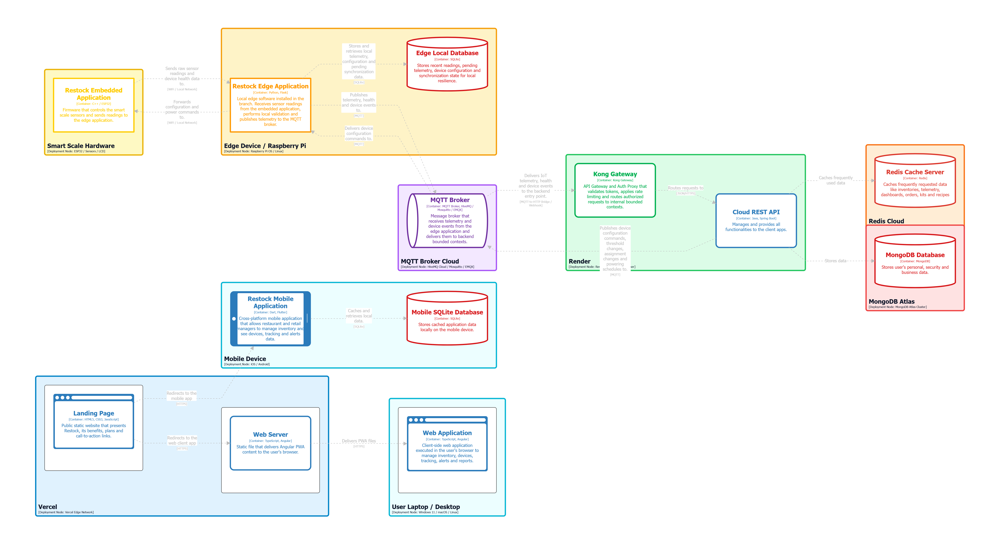

## 6.2. Landing Page, Services & Applications Implementation

Con la preparación previa hecha incluyendo identificación de requisitos, priorización según el negocio, diseño de arquitectura tanto en alto nivel (diagramas de contexto, contenedores y contexto) como en nivel detallado (diagramas de clase y de base de datos), diseño de experiencia de usuario (UX) y el prototipado de la solución, se implementan los productos de software (landing page, aplicación web, aplicación móvil, REST API, edge services y aplicación embebida) pertenecientes al alcance del proyecto.
Además, para este proyecto, el trabajo y la entrega se divide en 3 sprints donde cada uno posee un objetivo que define su alcance y los productos que deben ser desarrollados para cumplir con el alcance.

### 6.2.1. Sprint 1

En esta sección se detalla el proceso de trabajao del equipo durante el primer sprint del proyecto.
Este sprint se centra en el desarrollo de las funcionalidades principales de la plataforma relacionadas al manejo de inventarios, recetas y kits y registro de dispositivos para la aplicación web.
Además, el alcance del sprint llega hasta la implementación de una primera versión del Landing Page con secciones como beneficios, testimonios, descripción de funcionalidades, entre otros.

#### 6.2.1.1. Sprint Planning 1

<table>
  <tr>
    <td>Sprint #</td>
    <td>Sprint 1</td>
  </tr>
  <tr>
    <td colspan="2"><strong>Sprint Planning Background</strong></td>
  </tr>
  <tr>
    <td>Date</td>
    <td>2026-05-05</td>
  </tr>
  <tr>
    <td>Time</td>
    <td>07:00 PM (GMT-5)</td>
  </tr>
  <tr>
    <td>Location</td>
    <td>Modalidad remota mediante la plataforma Discord</td>
  </tr>
  <tr>
    <td>Prepared By</td>
    <td>Shapiama Rivera, Gabriela Nicole</td>
  </tr>
  <tr>
    <td>Attendees (to planning meeting)</td>
    <td>Castro Alejos, Julio Daniel / Juarez Leon, Nicolas Emilio / Guerra Perez, José Jahaziel / Navarro Chinga, Antonio Jhair / Coronel Espinoza, Farid Sebastian / Shapiama Rivera, Gabriela Nicole / Diaz Quispe, Matias Sebastian </td>
  </tr>
  <tr>
    <td colspan="2"><strong>Sprint Goal & User Stories</strong></td>
  </tr>
  <tr>
    <td>Sprint 1 Goal</td>
    <td>
<strong>Nos enfocamos en ofrecer </strong> información clara y detallada a nuevos visitantes sobre la plataforma, así como proveer a los administradores de tiendas retail o retaurantes herramientas para la gestión de inventarios que incluyen soporte multi sucursal, gestión de suministros, notificaciones, gestión de recetas y kits, manejo de ventas, gestión de dispositivos y estadísticas de datos sobre suministros y alertas. <br>
<strong>Creemos que esto proporciona </strong> mayor comprensión del propósito de la solución y confianza a los visitantes y mejora en la eficiencia operativa de inventarios de los negocios de los administradores de restaurantes y retail. <br>
<strong>Esto se confirmará cuando </strong> nuevos visitantes decidan registrarse en la plataforma para gestionar el inventario de sus negocios, y los administradores de tiendas retail y restaurantes utilicen las herramientas para gestión de inventarios de forma rutinaria en las operaciones de sus negocios.
    </td>
  </tr>
  <tr>
    <td>Sprint 1 Velocity</td>
    <td>22</td>
  </tr>
  <tr>
    <td>Sum of Story Points</td>
    <td>32</td>
  </tr>
</table>

#### 6.2.1.2. Aspect Leaders and Collaborators

Durante el Sprint 1, se han definido los pilares estratégicos del sistema basados en una arquitectura de contextos delimitados (Bounded Contexts). Estos abarcan desde la seguridad y acceso hasta la gestión compleja de activos, ventas y monitoreo de servicios para los sectores de retail y restaurantes.

Con el objetivo de asegurar una comunicación clara y un flujo de trabajo eficiente, se ha elaborado la siguiente matriz de liderazgo y colaboración (LACX). En ella se designa un líder responsable (L) para la integridad de cada contexto y colaboradores (C) que aseguran la integración y el cumplimiento de los 32 puntos de historia definidos en la planificación.

| Team Member (Last Name, First Name) |  GitHub Username  |     IAM     |     ARM     | Planning and Planning | Sales Management | Devices Mangement |  Tracking  | Communications | Profiles and Preferences |
| :---------------------------------- | :----------------: | :---------: | :---------: | :-------------------: | :--------------: | :---------------: | :---------: | :------------: | :----------------------: |
| Navarro Chinga, Antonio Jhair       |  AntonioNavarro24  | **L** |            |           C           |                  |                  |      C      |                |                          |
| Guerra Perez, José Jahaziel        |     jahazielgg     |            |            |           C           |        C        |                  |      C      |                |       **L**       |
| Juarez Leon, Nicolas Emilio         |     JuarezLn10     |            |      C      |                      |                  |    **L**    | **L** |                |                          |
| Diaz Quispe, Matias Sebastian       |    equinox-1092    |      C      |            |                      |        C        |                  |            |  **L**  |            C            |
| Castro Alejos, Julio Daniel         |      JulioXC4      |            |      C      |      **L**      |                  |                  |            |       C       |                          |
| Shapiama Rivera, Gabriela Nicole    | GabrielaShapiama28 |            | **L** |                      |                  |         C         |            |       C       |            C            |
| Coronel Espinoza, Farid Sebastian   |       Far14z       |            |      C      |                      |   **L**   |         C         |            |                |                          |

#### 6.2.1.3. Sprint Backlog 1

Como se mencionó previamente en el planeamiento del Sprint 1, el objetivo del mismo es desarrollar y desplegar una primera versión funcional de la Landing Page y la aplicación web frontend. Esto conlleva implementar las funcionalidades clave que permitan a los visitantes conocer el valor de negocio de la plataforma, así como a los administradores de restaurantes y tiendas retail gestionar su perfil, autenticarse, controlar el stock en inventarios, administrar dispositivos IoT y registrar sus ventas desde la interfaz web.
Luego de definir el objetivo del sprint, se identificaron las historias de usuario correspondientes. A continuación, se dividió cada historia de usuario en tareas relacionadas a la implementación y cumplimiento de dicha historia. Para ello, se utilizó la aplicación Jira, que nos ayuda a gestionar el progreso del sprint.

Proyecto en Jira: [https://shorturl.at/JPiiX](https://shorturl.at/JPiiX)

<p align="center">
  
</p>

A continuación, se presenta la tabla con las tareas necesarias para completar satisfactoriamente este primer sprint. Además, se asignó un miembro del equipo a cada tarea a desarrollar y el estado de cada tarea.

| Sprint 1             | Sprint Backlog 1                                    |                          |                                                                    |                                                                                                                                                                                                                                              |                              |                                 |                  |
| -------------------- | --------------------------------------------------- | ------------------------ | ------------------------------------------------------------------ | -------------------------------------------------------------------------------------------------------------------------------------------------------------------------------------------------------------------------------------------- | ---------------------------- | ------------------------------- | ---------------- |
| **User Story** | **Título**                                   | **Work Item/Task** | **Título**                                                  | **Descripción**                                                                                                                                                                                                                       | **Estimation (Hours)** | **Assigned to**           | **Status** |
| UTI-439              | US-11: Gestión de perfil                           | UTI-592                  | Desarrollar la visualización de la información del perfil        | Como usuario de la plataforma, quiero gestionar la información de mi perfil, para asegurar que mi información sea la correcta.                                                                                                             | 0.5                          | José Jahaziel Guerra Perez     | Done             |
|                      |                                                     | UTI-593                  | Implementar la edición de datos básicos                          |                                                                                                                                                                                                                                              |                              | Gabriela Nicole Shapiama Rivera | In-Progress      |
|                      |                                                     | UTI-595                  | Configurar preferencias del sistema                                |                                                                                                                                                                                                                                              |                              | Matias D.                       | Done             |
| UTI-429              | US-01: Conocer el valor de negocio de la plataforma | UTI-526                  | Desarrollar la sección de beneficios                              | Como visitante del sitio web estático, quiero determinar el valor de negocio, para tomar la decisión de convertirme en usuario de la plataforma.                                                                                           | 0.4                          | Julio Castro Alejos             | Done             |
|                      |                                                     | UTI-527                  | Crear y estructurar la sección de preguntas frecuentes            |                                                                                                                                                                                                                                              |                              | Matias D.                       | Done             |
|                      |                                                     | UTI-542                  | Implementar Media Queries en el CSS                                |                                                                                                                                                                                                                                              |                              | Matias D.                       | Done             |
|                      |                                                     | UTI-545                  | Implementar etiquetas ARIA                                         |                                                                                                                                                                                                                                              |                              | Gabriela Nicole Shapiama Rivera | Done             |
|                      |                                                     | UTI-548                  | Permitir el cambio dinámico de idioma                             |                                                                                                                                                                                                                                              |                              | Julio Castro Alejos             | Done             |
| UTI-430              | US-02: Aumento de confianza sobre la plataforma     | UTI-528                  | Implementar la sección de testimonios                             | Como visitante, quiero conocer sobre el producto y quienes fueron los creadores, para aumentar la confianza sobre el uso de la plataforma.                                                                                                   | 0.3                          | Matias D.                       | Done             |
|                      |                                                     | UTI-529                  | Crear la sección de términos y condiciones                       |                                                                                                                                                                                                                                              |                              | Gabriela Nicole Shapiama Rivera | Done             |
|                      |                                                     | UTI-538                  | Crear la sección de políticas de privacidad                      |                                                                                                                                                                                                                                              |                              | Julio Castro Alejos             | Done             |
|                      |                                                     | UTI-543                  | Implementar Media Queries en el CSS                                |                                                                                                                                                                                                                                              |                              | Matias D.                       | Done             |
|                      |                                                     | UTI-546                  | Implementar etiquetas ARIA (Accesibilidad)                         |                                                                                                                                                                                                                                              |                              | Gabriela Nicole Shapiama Rivera | Done             |
|                      |                                                     | UTI-549                  | Permitir el cambio dinámico de idioma                             |                                                                                                                                                                                                                                              |                              | Julio Castro Alejos             | Done             |
| UTI-431              | US-03: Acceso a las aplicaciones                    | UTI-531                  | Implementar el flujo de redirección a la app móvil               | Como visitante, quiero acceder o descargar la aplicación, para empezar a usarla en mis operaciones de negocio.                                                                                                                              | 0.4                          | Julio Castro Alejos             | Done             |
|                      |                                                     | UTI-532                  | Implementar el flujo de acceso a la plataforma web                 |                                                                                                                                                                                                                                              |                              | Gabriela Nicole Shapiama Rivera | Done             |
|                      |                                                     | UTI-533                  | Diseñar la interfaz de selección entre plataformas               |                                                                                                                                                                                                                                              |                              | Matias D.                       | Done             |
|                      |                                                     | UTI-544                  | Implementar Media Queries en el CSS                                |                                                                                                                                                                                                                                              |                              | Matias D.                       | Done             |
|                      |                                                     | UTI-547                  | Implementar etiquetas ARIA (Accesibilidad)                         |                                                                                                                                                                                                                                              |                              | Gabriela Nicole Shapiama Rivera | Done             |
| UTI-432              | US-04: Registro de usuario                          | UTI-534                  | Desarrollar lógica de creación de cuenta                         | Como visitante, quiero registrarme como administrador de una tienda retail, para acceder a las funcionalidades de la aplicación.                                                                                                            | 0.5                          | Matias D.                       | Done             |
|                      |                                                     | UTI-535                  | Integrar verificación de seguridad de contraseña                 |                                                                                                                                                                                                                                              |                              | Antonio Navarro                 | In-Progress      |
|                      |                                                     | UTI-536                  | Redirigir al usuario tras registro exitoso                         |                                                                                                                                                                                                                                              |                              | Matias D.                       | Done             |
|                      |                                                     | UTI-537                  | Desarrollar un registro del negocio del usuario                    |                                                                                                                                                                                                                                              |                              | Antonio Navarro                 | In-Progress      |
| UTI-445              | US-17: Control y ajuste de stock en lotes           | UTI-554                  | Implementar la funcionalidad de registro de ingreso de mercadería | Como administrador del negocio, quiero registrar los movimientos de entrada y salida de suministros, así como definir sus niveles de reserva, para garantizar que el inventario esté siempre actualizado.                                  | 0.3                          | Julio Castro Alejos             | In-Progress      |
|                      |                                                     | UTI-556                  | Implementar validaciones para el registro de movimientos           |                                                                                                                                                                                                                                              |                              | Julio Castro Alejos             | In-Progress      |
|                      |                                                     | UTI-557                  | Registrar historial de movimientos y ajustes de stock              |                                                                                                                                                                                                                                              |                              | Gabriela Nicole Shapiama Rivera | In-Progress      |
| UTI-460              | US-32: Gestionar y consultar las ventas del negocio | UTI-578                  | Implementar la funcionalidad de registro de ventas                 | Como administrador del negocio, quiero registrar y consultar las ventas de productos o combos, para mantener actualizado el inventario y hacer seguimiento al desempeño comercial.                                                          | 0.5                          | Nicolás Juárez                | In-Progress      |
|                      |                                                     | UTI-579                  | Implementar la funcionalidad de consulta de ventas                 |                                                                                                                                                                                                                                              |                              | Farid Coronel                   | Done             |
|                      |                                                     | UTI-580                  | Visualizar el detalle de una venta                                 |                                                                                                                                                                                                                                              |                              | José Jahaziel Guerra Perez     | Done             |
| UTI-466              | US-38: Gestión de dispositivos en sucursales       | UTI-581                  | Desarrollar la visualización del listado de dispositivos          | Como administrador, quiero gestionar dispositivos smart-inventory para el monitoreo de stock, temperatura y humedad en mis sucursales, para mantener el control y configuración de los dispositivos que supervisan mis productos o insumos. | 0.4                          | Nicolás Juárez                | In-Progress      |
|                      |                                                     | UTI-582                  | Implementar el registro de nuevos dispositivos                     |                                                                                                                                                                                                                                              |                              | Gabriela Nicole Shapiama Rivera | In-Progress      |

#### 6.2.1.4. Development Evidence for Sprint Review

En esta sección, se describen los principales avances de implementación realizados en este primer sprint. Se tienen como principales avances la implementación de la primera versión de la Landing Page y el Web Application.

Cada miembro del equipo avanzó progresivamente en las diferentes áreas del proyecto: en la Landing Page, se implementó las secciones de beneficios, integrantes, FAQs, Planes de suscripción y la redirección hacia la aplicación web y las tiendas de descarga de la aplicación móvil. En la aplicación web, se implementó las pantallas de administración para restaurantes y retail de consumo masivo, gestión de sucursales, suministros, dispositivos y configuración de preferencias de usuario.

A continuación, se muestra una tabla que contiene la información sobre los **commits** realizados que contienen las funcionalidades implementadas para completar el primer sprint.

| Repository              | Branch                     | Commit Id                                | Commit Message                                                                                                 | Commited On |
| ----------------------- | -------------------------- | ---------------------------------------- | -------------------------------------------------------------------------------------------------------------- | ----------- |
| restock-landing-page    | master                     | c4d1d91309ecd68035221e82ba0ebf5596db282d | chore: initial commit.                                                                                         | 08/05/26    |
| restock-web-application | main                       | 1ac30de5797ce40dffb7fe42b2703f093d088613 | chore: initial commit.                                                                                         | 08/05/26    |
| restock-landing-page    | feature/hero               | 137c93e1068496a6063d32bac6a2dee75e235eec | feat(hero): add hero section.                                                                                  | 12/05/26    |
| restock-landing-page    | feature/hero               | 137c93e1068496a6063d32bac6a2dee75e235eec | feat(hero): add hero section.                                                                                  | 12/05/26    |
| restock-landing-page    | feature/faq                | 22c208b3aaefcbce8eb0751bdab1489a27462be7 | feat(faq): add faq section.                                                                                    | 12/05/26    |
| restock-landing-page    | feature/download           | c0342fd8cbc565e7b37e7aa9c9189afd1276e4d7 | feat(download): add download section.                                                                          | 12/05/26    |
| restock-landing-page    | feature/testimonials       | 5dfdf9cd19030ff80d8f9c0a618f13c95fb09d21 | feat(testimonials): add testimonials section.                                                                  | 12/05/26    |
| restock-landing-page    | feature/download           | bc973a3ad3186cdc634da99727bd5e7b2e5e6050 | fix(download): update link of play and apple store.                                                            | 14/05/26    |
| restock-web-application | feature/initial-config     | 5402e827034d9529d50f6bb46632cffda0aa6a1f | chore: initialize angular standalone application                                                               | 12/05/26    |
| restock-web-application | fetaure/initial-config     | a211b83dd2a21d17d32faab5f16882ea5f08e531 | feat(top-bar): add top bar component with search and user profile features                                     | 12/05/26    |
| restock-web-application | feature/profiles           | b0fe9090d4c066c2b01282e6afb8590f1c0f7b08 | feat(profiles): implement businesses and profiles api endpoints with assemblers and response interfaces        | 12/05/26    |
| restock-web-application | feature/profiles           | cc23de41e37ddc867ce8522de74a591315d0377a | update profiles api base url to the correct endpoint                                                           | 12/05/26    |
| restock-web-application | feature/inventory          | 5402e827034d9529d50f6bb46632cffda0aa6a1f | feat(resource): add inventory domain models.                                                                   | 12/05/26    |
| restock-web-application | feature/register           | 42fbf570a51f126699a2fee8618a0af860bd1580 | feat(i18n): add i18n to authentication section and sign-up form.                                               | 12/05/26    |
| restock-web-application | feature/intial-config      | 9d10d4c2f00919c6f2b67f679ffe6a66937e43c4 | feat(config): add db json server configuration.                                                                | 13/05/26    |
| restock-web-application | feature/sales-management   | 4df66f6fb80b50c629ad43a0c316dcbb5868ebad | feat(sales): add lazy loading for sales routes and update sales api service for retrieving sales by branch id. | 13/05/26    |
| restock-web-application | feature/sign-up            | 623bdd8e147cd9f3d89af70ac425c5753b2eefbc | fix(sign-up): update endpoint name for sign up.                                                                | 14/05/26    |
| restock-web-application | feature/device-list-screen | f07d2ac2a4afcbfa9bfb61b06bef01cdef7a78a6 | feat(devices-list): add device entity.                                                                         | 14/05/26    |
| restock-web-application | feature/device-list-screen | 16bac5bc14c4592400aad0fb0a416774a6ee5134 | feat(devices-list): add assembler for converting device registration commands, requests and responses.         | 14/05/26    |
| restock-web-application | feature/device-list-screen | 3e7289921180b15fd30d00c13cb164ca823fcb61 | feat(devices): implement device management dashboard UI matching design.                                       | 14/05/26    |

#### 6.2.1.5. Testing Suite Evidence for Sprint Review

Para este Sprint, la Testing Suite automatizada no aplica, debido a que el avance se enfocó en la implementación de funcionalidades de frontend para la Web Application.

No se implementaron ni modificaron Web Services backend durante este Sprint, por lo que las pruebas automatizadas orientadas a servicios no corresponden al alcance del incremento actual.

#### 6.2.1.6. Execution Evidence for Sprint Review

En esta sección, se presenta la evidencia de ejecución de los productos implementados en este primer sprint. Los logros incluyen el desarrollo y despliegue de la primer versión de la Landing Page, la aplicación web.

A continuación, se muestran las capturas de pantalla y enlaces de acceso a cada producto implementado. Estas evidencias reflejan el progreso realizado en el sprint y sirven como comprobante del trabajo completado.

## **Landing Page**

En la presente sección se detalla la evidencia de ejecución alcanzada durante el Sprint 1 para la landing page. El esfuerzo de desarrollo se centró en habilitar secciones clave que permiten a los visitantes comprender el valor de negocio de la plataforma, conocer al equipo detrás del proyecto, acceder a la aplicación web y móvil, así como obtener información sobre beneficios, testimonios y preguntas frecuentes.

El vídeo de demostración evidencia la correcta visualización y navegación a través de los flujos implementados, los cuales abarcan:

* **Acerca de nosotros**: Sección que presenta información sobre la startup UI-Topic, su propuesta de valor y misión enfocada en el manejo inteligente de inventarios para restaurantes y retail.
* **Beneficios**: Sección que presenta los beneficios de la plataforma para cada segmento objetivo.
* **Integrantes**: Sección que muestra al equipo detrás de Restock con fotos y roles.
* **FAQ y testimonios**: Sección que presenta preguntas frecuentes y testimonios de clientes reales.


**Evidencias de la demostración:**
**Vídeo de navegación (Product Navigation):** [https://acortar.link/IoO3Qp](https://acortar.link/IoO3Qp)

#### Sección Hero

Sección principal del sitio web de Restock. Presenta el título "Smart Inventory for Restaurants & Retail" junto a dos botones de acción.


#### Acerca de Restock

Sección informativa sobre la startup UI-Topic. Incluye tres tarjetas con íconos que describen cómo ayudan, su propuesta de valor y su misión y visión, enfocadas en el manejo inteligente de inventarios.


#### Conoce al equipo

Sección que presenta al equipo detrás de Restock con fotos circulares de cada miembro. Se muestran siete integrantes con sus nombres y roles dentro del desarrollo.


#### Dispositivo IoT

Sección que presenta a detalle el dispositivo IoT, destaca tres beneficios clave mediante tarjetas: precisión de la balanza inteligente, protección de cadena de frío y control de calidad ambiental.


#### Beneficios

Sección que divide los beneficios en dos categorías: restaurantes y tiendas retail. Cada categoría tiene cinco funcionalidades representadas con íconos y descripciones cortas sobre control de stock e inventario.


#### Testimonios

Sección de testimonios que muestra tres reseñas con calificación de estrellas de clientes reales.


#### Preguntas frecuentes (FAQ)

Sección de preguntas frecuentes que presenta cinco preguntas en acordeón sobre el funcionamiento de los dispositivos, compatibilidad, sensores y conectividad.


#### ¿Como funciona?

Sección que explica en tres pasos cómo funciona Restock: instalar el dispositivo, conectarlo y asignar inventario, y monitorear el stock en tiempo real desde el dashboard.


#### Planes de suscripción

Sección de planes de suscripción con tres opciones: Basic (S/ 59.99/mes), Premium (S/ 49.99/mes, el más popular) y Pro (S/ 39.99/mes). Cada plan lista sus características principales con un botón para seleccionarlo.


#### Usa la aplicación web

Sección de llamada a la acción que incluye dos botones (Get Started y Watch Demo).


#### Descarga la aplicación

Sección que promociona la app móvil de Restock. Muestra botones de descarga para Google Play y App Store junto a una vista previa del móvil con la pantalla de batches.


#### Footer

Pie de página en fondo negro con el logo de Restock y enlaces organizados en tres columnas: Producto (documentación y tutoriales), Compañía (about, políticas, LinkedIn) y Soporte (centro de ayuda, FAQ, contacto).


#### Versión para dispositivos móviles

Vista general de todas las secciones del sitio adaptadas para dispositivos móviles.


## **Aplicación Web**

En la presente sección se detalla la evidencia de ejecución alcanzada durante el Sprint 1 para la aplicación web. El esfuerzo de desarrollo se centró en habilitar la navegación principal y la interacción gráfica con las entidades operativas del sistema, brindando soporte visual a los modelos de negocio.

El vídeo de demostración evidencia la correcta visualización y navegación a través de los flujos implementados, los cuales abarcan:

* **Panel de administración:** Gestión centralizada orientada a los segmentos de restaurantes y retail de consumo masivo.
* **Assets & Resources:** Vistas operativas para el registro, control y gestión de sucursales y suministros.
* **Device Management:** Pantallas destinadas a la administración, asignación y revisión de estado de los dispositivos IoT en la red.
* **Profiles:** Interfaz para la configuración de preferencias y gestión de la cuenta del usuario.

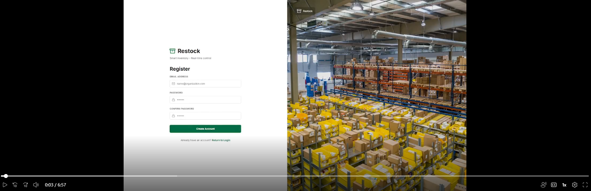

**Evidencias de la demostración:**
**Vídeo de navegación (Product Navigation):** [https://shortlink.uk/1pF66](https://shortlink.uk/1pF66)

#### Gestión de inventario

Vista del módulo de inventario que muestra lotes activos y próximos a vencer. La tabla lista insumos con su categoría, unidad de medida, fecha de vencimiento y stock actual.


#### Gestión de ventas

Pantalla del módulo de ventas sin transacciones registradas aún. Muestra cero en ventas totales del mes y cero transacciones, con un mensaje invitando al usuario a registrar su primera venta para comenzar a visualizar métricas e historial.


Vista del resumen de ventas con varias transacciones registradas junto a su precio total. La tabla muestra cada venta con su ID, fecha, cantidad de ítems, valor total y estado (completed, pending o cancelled), diferenciando visualmente las canceladas en rojo.


Panel lateral con el detalle de una transacción completada que incluye dos ítems correspondientes a esa venta.


#### Gestión de dispositivos

Panel de gestión de dispositivos con cuatro métricas clave: escalas activas, alertas de stock, alertas ambientales y dispositivos offline.


#### Preferencias del usuario

Pantalla de configuración general de la cuenta con opciones de zona horaria, moneda e idioma. A la derecha se muestran preferencias de comunicación.


Sección de perfil personal dentro de la configuración de cuenta, con campos para nombre, apellido, género y teléfono, además de opción para subir foto de perfil.


### 6.2.1.7. Software Deployment Evidence for Sprint Review.

Durante el Sprint 1, el equipo ejecutó las primeras actividades de despliegue asociadas a los productos digitales incluidos en el alcance del proyecto. Estas labores formaron parte del proceso de entrega continua y permitieron validar que las soluciones desarrolladas podían publicarse correctamente en un entorno real, con sincronización automática respecto a los cambios realizados en los repositorios de código fuente.

En esta iteración, el esfuerzo de deployment se centró en dos productos principales: la Landing Page institucional y la Web Application administrativa. Para ambos casos, se verificó la configuración del proveedor de hosting, la vinculación con los repositorios correspondientes, la correcta detección del proyecto y la disponibilidad pública de las versiones desplegadas. De esta manera, el sprint no solo contempló la implementación funcional, sino también la preparación de los entornos necesarios para su publicación y validación.

##### Despliegue de la Landing Page

La Landing Page fue desplegada en Vercel como sitio institucional del proyecto. Esta publicación permitió comprobar que el repositorio estaba correctamente asociado al entorno de producción y que la plataforma podía reconstruir y publicar automáticamente cada actualización realizada por el equipo.

Los pasos seguidos para este despliegue fueron los siguientes:

1. Se vinculó el repositorio correspondiente a la Landing Page con la cuenta de Vercel.
2. Se configuró el proyecto con el directorio raíz como origen de publicación.
3. Se verificó que Vercel detectara automáticamente el tipo de proyecto estático.
4. Se ejecutó el despliegue inicial para generar la URL pública de acceso.
5. Se comprobó que la versión publicada mostrara correctamente el contenido institucional del proyecto.

Como parte de la verificación, se revisó que la página principal quedara disponible públicamente y que su contenido reflejara la propuesta de valor del sistema Restock. La evidencia siguiente muestra el resultado del despliegue realizado durante el sprint:

<p align="center">
  
</p>

La imagen anterior evidencia la instancia publicada de la Landing Page en Vercel. En ella se valida que el sitio institucional quedó accesible en línea y que el flujo de despliegue continuo funcionó de acuerdo con lo planificado para el sprint.

##### Despliegue de la Web Application

De forma complementaria, la Web Application también fue desplegada en Vercel como parte del mismo flujo de integración y publicación continua. En este caso, se verificó la disponibilidad del frontend administrativo y la exposición correcta de las funcionalidades desarrolladas durante la iteración, entre ellas la administración de perfiles, inventarios y otros módulos iniciales del sistema.

Los pasos seguidos para este despliegue fueron los siguientes:

1. Se vinculó el repositorio de la Web Application con la cuenta de Vercel.
2. Se configuraron los comandos de instalación y compilación requeridos por el proyecto Angular.
3. Se definió el directorio de salida generado por el build de producción.
4. Se ejecutó la publicación automática de la rama configurada para producción.
5. Se validó que la URL pública expusiera la interfaz administrativa desarrollada durante el sprint.

Antes de la publicación, se confirmaron los ajustes necesarios en el proyecto frontend para que la compilación y el despliegue se ejecutaran sin incidencias. Luego, se validó la URL pública generada por la plataforma para asegurar que el entorno de producción mostrara la versión aprobada del sprint.

<p align="center">
  
</p>

La captura anterior corresponde a la Web Application desplegada en Vercel. Esta evidencia confirma que el frontend administrativo se encuentra publicado y accesible, lo cual valida la preparación del entorno de deployment y su correcta integración con el repositorio de desarrollo.

En conjunto, estas evidencias demuestran que el equipo no solo desarrolló la primera versión funcional de los productos del sprint, sino que también aseguró su publicación en un entorno real de despliegue. Esto permitió validar la integración entre el desarrollo local y la puesta en línea de las soluciones consideradas dentro del alcance del proyecto, cumpliendo con la necesidad de acompañar cada despliegue con capturas y una explicación clara de los pasos realizados durante el sprint.

### 6.2.1.8. Team Collaboration Insights during Sprint.

##### Landing Page

Durante este primer sprint, se aplicaron prácticas de colaboración en el desarrollo de la Landing Page que facilitaron la entrega de un sitio web público que brinde información útil sobre la plataforma y genere confianza en los visitantes.
A continuación se detallan las prácticas aplicadas:

- Las tareas se distribuyeron por secciones (Hero, Funcionalidades, Beneficios, CTA y Testimonios). Además, cada sección fue asignada a un responsable del equipo del dominio de Communications para acelerar la implementación.
- Se realizaron **commits frecuentes y atómicos** con mensajes descriptivos para facilitar revisiones y trazabilidad.
- Las integraciones se realizaron mediante _pull requests_ hacia `develop` y se exigió una revisión mínima por otro miembro antes de combinar la funcionalidad agregada al conjunto completo del desarrollo del sprint.
- Se emplearon revisiones visuales en distintos tamaños de pantalla y se ordenaron los assets en `src/public/assets/images`

**Analíticos de colaboración — Landing Page**


- Total de commits (Landing Page): **19**
- Total de autores contribuyentes: **2**
- Total de _pull requests_ relacionadas: **14**
- Observación: desarrollo centrado en presentar las secciones de información principal del sitio web estático.

##### Aplicación Web

Por otro lado, el sprint 1 también incluyó el desarrollo de la primera versión de la aplicación web con vistas principales como inventarios, suministros, ventas, dispositivos, kits y recetas, entre otros.

- Ramas `feature/*` por pantalla (resource, recipes, sales) para aislar cambios y facilitar el trabajo paralelo entre el equipo de desarrollo.
- Uso de un Fake API en ausencia de un API para el consumo de datos fijos.
- Uso de Domain-Driven Design para la organización de lógica y vistas en contextos delimitados según su reponsabilidad.
- Commits regulares con mensajes que enlazaban a tareas de la planificación del sprint.

##### **Analíticos de colaboración — Web Application**


- Total de commits (Web): **100**
- Total de autores contribuyentes: **7**
- Total de _pull requests_ relacionadas: **25**
- Observación: desarrollo centrado en presentar la vista preliminar de las pantallas principales de la aplicación web.

### 6.2.2. Sprint 2

#### 6.2.2.1. Sprint Planning 2

<table>
  <tr>
    <td>Sprint #</td>
    <td>Sprint 2</td>
  </tr>
  <tr>
    <td colspan="2"><strong>Sprint Planning Background</strong></td>
  </tr>
  <tr>
    <td>Date</td>
    <td><em>2026-05-23</em></td>
  </tr>
  <tr>
    <td>Time</td>
    <td><em>08:00 AM (GMT-5)</em></td>
  </tr>
  <tr>
    <td>Location</td>
    <td>Modalidad remota mediante la plataforma Discord</td>
  </tr>
  <tr>
    <td>Prepared By</td>
    <td>Shapiama Rivera, Gabriela Nicole</td>
  </tr>
  <tr>
    <td>Attendees (to planning meeting)</td>
    <td>Diaz Quispe, Sebastian Matias / Coronel Espinoza, Farid Sebastian / Castro Alejos, Julio Daniel / Guerra Perez, José Jahaziel / Shapiama Rivera, Gabriela Nicole / Juarez Leon, Nicolas Emilio / Navarro Chinga, Antonio Jhair</td>
  </tr>
  <tr>
    <td>Sprint 1 Review Summary</td>
    <td><em>Durante el Sprint 1 se logró implementar y desplegar la primera versión funcional de la Landing Page y de la aplicación web de Restock. Se completaron satisfactoriamente las principales funcionalidades orientadas a presentar la propuesta de valor de la plataforma a potenciales usuarios, incluyendo las secciones de beneficios, testimonios, preguntas frecuentes, información del equipo, planes de suscripción y accesos a las aplicaciones web y móvil. Asimismo, se desarrollaron las primeras interfaces para la gestión de inventarios, ventas, dispositivos y preferencias de usuario dentro de la aplicación web.</em></td>
  </tr>
  <tr>
    <td>Sprint 1 Retrospective Summary</td>
    <td><em>Durante el Sprint 1, el equipo mantuvo una comunicación constante mediante reuniones remotas y herramientas colaborativas, lo que permitió coordinar el desarrollo de la Landing Page y la aplicación web. Se destacó el uso de buenas prácticas de trabajo, como la creación de ramas por funcionalidad, el uso de pull requests y la colaboración entre los miembros del equipo para integrar los avances realizados. Como aspectos a mejorar, se identificó que algunas historias de usuario requirieron más tiempo del previsto, por lo que algunas tareas quedaron en estado In-Progress al finalizar el sprint. Además, se observó la necesidad de revisar con mayor detalle los requerimientos y las dependencias técnicas antes de iniciar el desarrollo para evitar retrasos durante la ejecución. Para el siguiente sprint, el equipo acordó mejorar la estimación de las tareas, revisar anticipadamente las posibles dependencias entre funcionalidades y realizar un seguimiento más frecuente del avance en Jira para identificar bloqueos a tiempo. Estas acciones permitirán mejorar la organización del trabajo y aumentar la cantidad de tareas completadas en futuras iteraciones.</em></td>
  </tr>
  <tr>
    <td colspan="2"><strong>Sprint Goal & User Stories</strong></td>
  </tr>
  <tr>
    <td>Sprint 2 Goal</td>
    <td>
<strong>Nos enfocamos en</strong> ofrecer información clara en un vídeo sobre la plataforma y una introducción al vídeo sobre el equipo de desarrollo; así como, proveer herramientas que incluyen centro de notificaciones, gestión de recetas y kits, métricas de datos sobre suministros y alertas, y visualización de datos procesados de temperatura, humedad y stock físico; también, implementar funcionalidades principales para dispositivos móviles, que incluyen la gestión de suministros, soporte multisucursal, visualización del centro de notificaciones, gestión de kits y recetas y la visualización de datos procesados de temperatura, humedad y stock físico; además, la implementación de funcionalidades que incluyen la lectura, el procesamiento y validación de datos de los dispositivos IoT; e incrementar las posibilidades de implementar funcionalidades relacionadas al manejo de inventarios, gestión de ventas, gestión de kits y recetas, registro de dispositivos, comparación de stock físico y digital y la generación de alertas ante eventos críticos de inventario.<br><br>
<strong>Creemos que</strong> esto proporciona confianza a los visitantes y potenciales usuarios de la plataforma; mayor rapidez en la toma de decisiones respecto a los inventarios, mayor personalización sobre el uso de suministros para ventas y conocimiento en tiempo real sobre el estado de sus suministros almacenados para los negocios de los administradores de restaurantes y tiendas retail; mejora en la eficiencia operativa de gestión de inventarios desde los dispositivos móviles de los administradores de restaurantes y tiendas retail; la posibilidad de implementar funcionalidades que registran datos en tiempo real sobre los inventarios de los usuarios para el equipo de desarrollo; y, una mayor oportunidad para implementar funcionalidades relacionadas al manejo de inventarios, gestión de ventas, gestión de kits y recetas, registro de dispositivos, comparación de stock físico y digital y la generación de alertas ante eventos críticos de inventario para el equipo de desarrollo.<br><br>
<strong>Esto se confirmará cuando</strong> nuevos visitantes decidan convertirse en usuarios en la plataforma para gestionar el inventario de sus negocios; los administradores de tiendas retail y restaurantes puedan tomar mejores decisiones de mercado para mejorar sus negocios; los administradores de tiendas retail y restaurantes utilicen las herramientas para gestión de inventarios desde sus dispositivos móviles de forma rutinaria en las operaciones de sus negocios; el equipo de desarrollo implemente el sistema de procesamiento y análisis de datos de dispositivos y funcionalidades relacionadas a la gestión de inventarios, gestión de kits y recetas, gestión de ventas de sucursales, registro de dispositivos, comparación entre stock físico y digital y la generación de alertas ante eventos críticos de inventario.
    </td>
  </tr>
  <tr>
    <td>Sprint 2 Velocity</td>
    <td><em>101</em></td>
  </tr>
  <tr>
    <td>Sum of Story Points</td>
    <td><em>158</em></td>
  </tr>
</table>

#### 6.2.2.2. Aspect Leaders and Collaborators

| Team Member (Last Name, First Name) | GitHub Username    | ARM | Devices Mangement | Tracking | Design and Planning | Sales Management | Analytics | Communications | IAM |
| ----------------------------------- | ------------------ | --- | ----------------- | -------- | ------------------- | ---------------- | --------- | -------------- | --- |
| Navarro Chinga, Antonio Jhair       | AntonioNavarro24   | C   | C                 | C        | C                   |                  |           |                | L   |
| Guerra Perez, José Jahaziel        | jahazielgg         | C   | C                 | C        |                     | C                |           | L              |     |
| Juarez Leon, Nicolas Emilio         | JuarezLn10         | C   | L                 | C        |                     |                  | L         | C              |     |
| Diaz Quispe, Matias Sebastian       | equinox-1092       | C   | C                 | C        |                     |                  | C         |                | C   |
| Castro Alejos, Julio Daniel         | JulioXC4           | C   | C                 | C        | L                   | C                |           |                |     |
| Shapiama Rivera, Gabriela Nicole    | GabrielaShapiama28 | L   | C                 | L        |                     |                  | C         | C              |     |
| Coronel Espinoza, Farid Sebastian   | Far14z             | C   | C                 | C        | C                   | L                |           |                |     |

#### 6.2.2.3. Sprint Backlog 2

Sprint Backlog 2

Como se definió en el planeamiento del Sprint 2, el objetivo de la iteración fue consolidar la capa de servicios backend e integrar el ecosistema IoT de Restock, implementar las funcionalidades principales de la aplicación móvil (gestión de suministros, soporte multisucursal, centro de notificaciones, gestión de kits y recetas y visualización de datos procesados de temperatura, humedad y stock físico) y habilitar la lectura, el procesamiento y la validación de datos provenientes de los dispositivos IoT.

Luego de definir el objetivo del sprint, se identificaron las historias de usuario, historias técnicas y maker stories correspondientes, y se dividió cada una en las tareas necesarias para su implementación y cumplimiento. Para la gestión y el seguimiento del progreso se utilizó la aplicación Jira.

Proyecto en Jira: [https://ui-topic.atlassian.net/jira/software/projects/UTI/boards/35/backlog](https://ui-topic.atlassian.net/jira/software/projects/UTI/boards/35/backlog)

<p align="center">
  
</p>

A continuación, se presenta la tabla con las historias y sus tareas necesarias para completar este segundo sprint. Además, se indica el responsable y el estado de cada tarea.

| Sprint 2             | Sprint Backlog 2                                                                           |                            |                                                                                                                                             |                                                                                                                                                                                                                                                                                                  |                              |                                 |                  |
| -------------------- | ------------------------------------------------------------------------------------------ | -------------------------- | ------------------------------------------------------------------------------------------------------------------------------------------- | ------------------------------------------------------------------------------------------------------------------------------------------------------------------------------------------------------------------------------------------------------------------------------------------------ | ---------------------------- | ------------------------------- | ---------------- |
| **User Story** | **Título**                                                                          | **Work Item / Task** | **Título**                                                                                                                           | **Descripción**                                                                                                                                                                                                                                                                           | **Estimation (Hours)** | **Assigned to**           | **Status** |
| UTI-430              | US-02: Aumento de confianza sobre la plataforma                                            | UTI-528                    | Implementar la sección de testimonios de clientes                                                                                          | Como visitante, Quiero conocer sobre el producto y quienes fueron los creadores Para aumentar la confianza sobre el uso de la plataforma                                                                                                                                                         | 1                            | Matias D.                       | Done             |
|                      |                                                                                            | UTI-529                    | Crear la sección de términos y condiciones de servicio (ToS)                                                                              |                                                                                                                                                                                                                                                                                                  |                              | Gabriela Nicole Shapiama Rivera | Done             |
|                      |                                                                                            | UTI-530                    | Desarrollar la sección de funcionamiento de la solución                                                                                   |                                                                                                                                                                                                                                                                                                  |                              | Matias D.                       | Done             |
|                      |                                                                                            | UTI-538                    | Crear la sección de políticas de privacidad                                                                                               |                                                                                                                                                                                                                                                                                                  |                              | Julio Castro Alejos             | Done             |
|                      |                                                                                            | UTI-543                    | Implementar Media Queries en el CSS (móvil, tablet, desktop).                                                                              |                                                                                                                                                                                                                                                                                                  |                              | Matias D.                       | Done             |
|                      |                                                                                            | UTI-546                    | Implementar etiquetas ARIA (Accessible Rich Internet Applications) en elementos interactivos complejos.                                     |                                                                                                                                                                                                                                                                                                  |                              | Gabriela Nicole Shapiama Rivera | Done             |
|                      |                                                                                            | UTI-549                    | Permitir el cambio dinámico de idioma (Español o inglés) basado en la elección del usuario.                                             |                                                                                                                                                                                                                                                                                                  |                              | Julio Castro Alejos             | Done             |
|                      |                                                                                            | UTI-843                    | Incorporar un video de presentación del equipo                                                                                             |                                                                                                                                                                                                                                                                                                  |                              | José Jahaziel Guerra Perez     | To-Do            |
|                      |                                                                                            | UTI-844                    | Producir e integrar un video explicativo del producto                                                                                       |                                                                                                                                                                                                                                                                                                  |                              | Gabriela Nicole Shapiama Rivera | To-Do            |
| UTI-432              | US-04: Registro de usuario                                                                 | UTI-534                    | Desarrollar lógica de creación de cuenta de administrador                                                                                 | Como visitante Quiero registrarme como administrador de una tienda retail Para acceder a las funcionalidades de la aplicación.                                                                                                                                                                  | 1                            | Matias D.                       | Done             |
|                      |                                                                                            | UTI-535                    | Integrar verificación de seguridad de contraseña e                                                                                        |                                                                                                                                                                                                                                                                                                  |                              | Antonio Navarro                 | Done             |
|                      |                                                                                            | UTI-536                    | Redirigir al usuario tras registro exitoso                                                                                                  |                                                                                                                                                                                                                                                                                                  |                              | Matias D.                       | Done             |
|                      |                                                                                            | UTI-537                    | Desarrollar un registro del negocio del usuario en la                                                                                       |                                                                                                                                                                                                                                                                                                  |                              | Antonio Navarro                 | Done             |
|                      |                                                                                            | UTI-596                    | Desarrollo del registro para la aplicación móvil                                                                                          |                                                                                                                                                                                                                                                                                                  |                              | yaku guzman                     | To-Do            |
| UTI-437              | US-09: Inicio de sesión                                                                   | UTI-539                    | Mostrar mensajes de error para credenciales incorrectas                                                                                     | Como usuario no autenticado quiero iniciar sesión para acceder de forma seguro a mi cuenta.                                                                                                                                                                                                     | 1                            | yaku guzman                     | Done             |
|                      |                                                                                            | UTI-540                    | Diseñar la interfaz de inicio de sesión                                                                                                   |                                                                                                                                                                                                                                                                                                  |                              | yaku guzman                     | Done             |
|                      |                                                                                            | UTI-541                    | Redirigir al usuario tras inicio de sesión exitoso                                                                                         |                                                                                                                                                                                                                                                                                                  |                              | Antonio Navarro                 | Done             |
|                      |                                                                                            | UTI-609                    | Implementar la funcionalidad de inicio de sesión en la aplicación móvil                                                                  |                                                                                                                                                                                                                                                                                                  |                              | Antonio Navarro                 | Done             |
|                      |                                                                                            | UTI-610                    | Configurar el almacenamiento seguro del token de autenticación en la app móvil                                                            |                                                                                                                                                                                                                                                                                                  |                              | Matias D.                       | Done             |
|                      |                                                                                            | UTI-611                    | Implementar el almacenamiento seguro del token de autenticación en la app web                                                              |                                                                                                                                                                                                                                                                                                  |                              | Matias D.                       | Done             |
| UTI-473              | TS-01: Autenticación de usuarios                                                          | UTI-678                    | Diseñar el modelo de datos para usuarios y credenciales                                                                                    | Como frontend developer quiero autenticar a los usuarios de forma segura para que se permita el acceso al sistema.                                                                                                                                                                               | 1                            | Antonio Navarro                 | Done             |
|                      |                                                                                            | UTI-679                    | Implementar endpoint de inicio de sesión (sign-in)                                                                                         |                                                                                                                                                                                                                                                                                                  |                              | Matias D.                       | Done             |
|                      |                                                                                            | UTI-681                    | Generar y devolver token de acceso seguro                                                                                                   |                                                                                                                                                                                                                                                                                                  |                              | yaku guzman                     | Done             |
| UTI-474              | TS-02: Registro de usuarios                                                                | UTI-682                    | Implementar endpoint de registro de usuario (sign-up)                                                                                       | Como frontend developer, quiero gestionar el registro de usuarios de forma segura, para permitir la creación de cuentas en el sistema.                                                                                                                                                          | 1                            | Antonio Navarro                 | Done             |
|                      |                                                                                            | UTI-683                    | Encriptar contraseñas antes de almacenar en la base de datos                                                                               |                                                                                                                                                                                                                                                                                                  |                              | Matias D.                       | Done             |
|                      |                                                                                            | UTI-684                    | Gestionar errores por correo duplicado en el registro                                                                                       |                                                                                                                                                                                                                                                                                                  |                              | yaku guzman                     | Done             |
|                      |                                                                                            | UTI-685                    | Gestionar errores por datos incompletos en el registro                                                                                      |                                                                                                                                                                                                                                                                                                  |                              | yaku guzman                     | Done             |
| UTI-435              | US-07: Cierre de sesión                                                                   | UTI-597                    | Implementar la funcionalidad de cierre de sesión en la aplicación web                                                                     | Como usuario Quiero cerrar sesión de mi cuenta en el dispositivo que lo esté usando Para evitar accesos indebidos a mi cuenta.                                                                                                                                                                 | 1                            | Matias D.                       | Done             |
|                      |                                                                                            | UTI-598                    | Implementar la funcionalidad de cierre de sesión en la aplicación móvil                                                                  |                                                                                                                                                                                                                                                                                                  |                              | yaku guzman                     | Done             |
|                      |                                                                                            | UTI-600                    | Configurar el almacenamiento del JWT tras el login en la app web                                                                            |                                                                                                                                                                                                                                                                                                  |                              | Antonio Navarro                 | Done             |
|                      |                                                                                            | UTI-601                    | Configurar el almacenamiento del token tras autenticación en la app móvil                                                                 |                                                                                                                                                                                                                                                                                                  |                              | Matias D.                       | Done             |
| UTI-442              | US-14: Gestión de suministros                                                             | UTI-550                    | Diseñar la interfaz de creación de suministro en la web                                                                                   | Como administrador Quiero gestionar la información de mis suministros Para contar con datos actualizados y confiables que me permitan tomar decisiones operativas sobre las compras y el inventario.                                                                                            | 2                            | José Jahaziel Guerra Perez     | Done             |
|                      |                                                                                            | UTI-551                    | Implementar la funcionalidad de visualización de suministros en la web                                                                     |                                                                                                                                                                                                                                                                                                  |                              | Matias D.                       | Done             |
|                      |                                                                                            | UTI-552                    | Implementar la funcionalidad de modificación de suministros en la web                                                                      |                                                                                                                                                                                                                                                                                                  |                              | José Jahaziel Guerra Perez     | Done             |
|                      |                                                                                            | UTI-553                    | Gestionar validaciones y mensajes de error en la edición y creación de suministros                                                        |                                                                                                                                                                                                                                                                                                  |                              | Farid Coronel                   | Done             |
|                      |                                                                                            | UTI-612                    | Implementar la funcionalidad de visualización de suministros en la app móvil                                                              |                                                                                                                                                                                                                                                                                                  |                              | Farid Coronel                   | Done             |
|                      |                                                                                            | UTI-613                    | Implementar la funcionalidad de creación de suministros en la app móvil                                                                   |                                                                                                                                                                                                                                                                                                  |                              | Nicolás Juárez                | Done             |
|                      |                                                                                            | UTI-614                    | Implementar la funcionalidad de edición de suministros en la app móvil                                                                    |                                                                                                                                                                                                                                                                                                  |                              | Nicolás Juárez                | Done             |
| UTI-480              | TS-08: Gestión de suministros                                                             | UTI-686                    | Implementar endpoint para registro de suministro                                                                                            | Como frontend developer quiero consolidar el registro, edición, consulta, eliminación lógica y gestión de estado de suministros, para asegurar que la información de los productos sea consistente en todo el sistema y evitar discrepancias de datos entre las diferentes sucursales.      | 2                            | José Jahaziel Guerra Perez     | Done             |
|                      |                                                                                            | UTI-687                    | Implementar endpoint para edición de suministro                                                                                            |                                                                                                                                                                                                                                                                                                  |                              | José Jahaziel Guerra Perez     | Done             |
|                      |                                                                                            | UTI-688                    | Implementar endpoint para consulta de suministros                                                                                           |                                                                                                                                                                                                                                                                                                  |                              | Nicolás Juárez                | Done             |
|                      |                                                                                            | UTI-689                    | Implementar endpoint para eliminación lógica y gestión de estado de suministro                                                           |                                                                                                                                                                                                                                                                                                  |                              | Nicolás Juárez                | Done             |
| UTI-445              | US-17: Control y ajuste de stock en lotes                                                  | UTI-554                    | Implementar la funcionalidad de registro de ingreso y egreso de lotes en la app web                                                         | Como administrador del negocio, quiero registrar los movimientos de entrada y salida de suministros, así como definir sus niveles de reserva para garantizar que el inventario esté siempre actualizado.                                                                                       | 3                            | Julio Castro Alejos             | Done             |
|                      |                                                                                            | UTI-555                    | Configurar y almacenar niveles de stock mínimo por sucursal y suministro en la app web                                                     |                                                                                                                                                                                                                                                                                                  |                              | yaku guzman                     | Done             |
|                      |                                                                                            | UTI-557                    | Registrar historial de movimientos y trazabilidad de lotes                                                                                  |                                                                                                                                                                                                                                                                                                  |                              | Julio Castro Alejos             | Done             |
|                      |                                                                                            | UTI-619                    | Implementar la funcionalidad de visualización de inventario en la app móvil                                                               |                                                                                                                                                                                                                                                                                                  |                              | Gabriela Nicole Shapiama Rivera | Done             |
|                      |                                                                                            | UTI-620                    | Implementar la funcionalidad de ajuste de inventario (current stock) en la app móvil                                                       |                                                                                                                                                                                                                                                                                                  |                              | Gabriela Nicole Shapiama Rivera | Done             |
|                      |                                                                                            | UTI-621                    | Implementar la funcionalidad de configuración de stock mínimo en la app móvil                                                            |                                                                                                                                                                                                                                                                                                  |                              | Farid Coronel                   | Done             |
| UTI-446              | US-18: Transferencia de lotes entre sucursales                                             | UTI-622                    | Implementar la funcionalidad de transferencia de stock en la app web                                                                        | Como administrador del negocio Quiero transferir stock entre sucursales Para optimizar la distribución de mis recursos y resolver excedentes o faltantes sin necesidad de realizar nuevas compras.                                                                                              | 3                            | José Jahaziel Guerra Perez     | Done             |
|                      |                                                                                            | UTI-623                    | Actualizar la visualización de stock en la app web tras la transferencia                                                                   |                                                                                                                                                                                                                                                                                                  |                              | José Jahaziel Guerra Perez     | Done             |
|                      |                                                                                            | UTI-624                    | Implementar la funcionalidad de transferencia de stock en la app móvil                                                                     |                                                                                                                                                                                                                                                                                                  |                              | Nicolás Juárez                | Done             |
|                      |                                                                                            | UTI-625                    | Actualizar la visualización de stock en la app móvil tras la transferencia                                                                |                                                                                                                                                                                                                                                                                                  |                              | Nicolás Juárez                | Done             |
| UTI-448              | US-20: Consultar stock de un suministro                                                    | UTI-558                    | Implementar la funcionalidad de consulta de stock total de un suministro en la app web                                                      | Como administrador del negocio Quiero visualizar el stock disponible de un suministro Para las cantidades que tengo                                                                                                                                                                              | 1                            | Antonio Navarro                 | Done             |
|                      |                                                                                            | UTI-559                    | Implementar la funcionalidad de consulta de stock de un lote en la app web                                                                  |                                                                                                                                                                                                                                                                                                  |                              | Antonio Navarro                 | Done             |
|                      |                                                                                            | UTI-848                    | Implementar la funcionalidad de consulta de stock total de un suministro en la app móvil                                                   |                                                                                                                                                                                                                                                                                                  |                              | Farid Coronel                   | Done             |
|                      |                                                                                            | UTI-849                    | Implementar la funcionalidad de consulta de stock de un lote en la app móvil                                                               |                                                                                                                                                                                                                                                                                                  |                              | Farid Coronel                   | Done             |
| UTI-481              | TS-09: Gestión de lotes de suministros                                                    | UTI-690                    | Implementar endpoint para registro de lote de suministro                                                                                    | Como frontend developer Quiero habilitar el seguimiento de lotes asociados a los suministros Para permitir la reposición de inventario con trazabilidad total.                                                                                                                                  | 2                            | Gabriela Nicole Shapiama Rivera | Done             |
|                      |                                                                                            | UTI-691                    | Implementar lógica de retiro de stock por lote                                                                                             |                                                                                                                                                                                                                                                                                                  |                              | Gabriela Nicole Shapiama Rivera | Done             |
|                      |                                                                                            | UTI-693                    | Implementar lógica de ingreso de stock a lotes de suministro                                                                               |                                                                                                                                                                                                                                                                                                  |                              | Gabriela Nicole Shapiama Rivera | Done             |
| UTI-483              | TS-11: Consulta de disponibilidad de Suministros                                           | UTI-699                    | Implementar endpoint GET /api/v1/supplies/{supplyId}/stock para consulta de stock total                                                     | Como frontend developer, quiero habilitar la consulta del stock total y del detalle por lotes de un suministro, para exponer la disponibilidad real del inventario.                                                                                                                              | 2                            | Farid Coronel                   | Done             |
|                      |                                                                                            | UTI-700                    | Implementar endpoint GET /api/v1/supplies/{supplyId}/batches para consulta de stock por lotes                                               |                                                                                                                                                                                                                                                                                                  |                              | Farid Coronel                   | Done             |
| UTI-484              | TS-12: Transferir lotes hacia sucursales                                                   | UTI-701                    | Implementar endpoint POST /api/v1/branches/{branchId}/batch-transfers                                                                       | Como frontend developer, quiero habilitar la transferencia de lotes entre sucursales, para mantener la continuidad operativa y la trazabilidad del stock distribuido.                                                                                                                            | 3                            | Nicolás Juárez                | Done             |
|                      |                                                                                            | UTI-702                    | Implementar lógica de validación de stock y sucursales en transferencia de lotes                                                          |                                                                                                                                                                                                                                                                                                  |                              | Nicolás Juárez                | Done             |
|                      |                                                                                            | UTI-703                    | Actualizar stock en sucursal de origen y crear lote en sucursal destino                                                                     |                                                                                                                                                                                                                                                                                                  |                              | Nicolás Juárez                | Done             |
| UTI-449              | US-21: Administrar dispositivos y sus parámetros de abastecimiento                        | UTI-563                    | Implementar la funcionalidad de baja de dispositivos sin dependencias                                                                       | Como administrador, quiero administrar los dispositivos  y sus limites de reposición, para organizar el stock en tienda y evitar discrepancias de inventario.                                                                                                                                   | 2                            | yaku guzman                     | To-Do            |
|                      |                                                                                            | UTI-565                    | Desarrollar la edición de dispositivos                                                                                                     |                                                                                                                                                                                                                                                                                                  |                              | Matias D.                       | To-Do            |
|                      |                                                                                            | UTI-634                    | Implementar la funcionalidad de edición de dispositivos en la app móvil                                                                   |                                                                                                                                                                                                                                                                                                  |                              | Farid Coronel                   | Done             |
|                      |                                                                                            | UTI-635                    | Implementar la funcionalidad de baja de dispositivos en la app móvil                                                                       |                                                                                                                                                                                                                                                                                                  |                              | Farid Coronel                   | Done             |
| UTI-450              | US-22: Gestionar asignación de suministros a los dispositivos                             | UTI-560                    | Implementar la funcionalidad de asignación de suministro a dispositivo en la app web                                                       | Como administrador Quiero asignar y distribuir los productos del inventario en las disposiciones Para asegurar que el área comercial esté siempre abastecida y mantener un control preciso de la mercadería.                                                                                  | 2                            | Antonio Navarro                 | To-Do            |
|                      |                                                                                            | UTI-561                    | Implementar la funcionalidad de desasignación de suministro de dispositivo en la app web                                                   |                                                                                                                                                                                                                                                                                                  |                              | Antonio Navarro                 | To-Do            |
|                      |                                                                                            | UTI-636                    | Implementar la funcionalidad de asignación y desasignación de suministros a dispositivos en la app móvil                                 |                                                                                                                                                                                                                                                                                                  |                              | Nicolás Juárez                | To-Do            |
|                      |                                                                                            | UTI-637                    | Implementar validaciones y mensajes de error en la gestión de asignación en la app móvil                                                 |                                                                                                                                                                                                                                                                                                  |                              | Nicolás Juárez                | To-Do            |
| UTI-466              | US-38: Gestión de dispositivos en sucursales                                              | UTI-581                    | Desarrollar la visualización del listado de dispositivos registrados por sucursal en la app web                                            | Como administrador, quiero gestionar dispositivos smart-inventory utilizados para el monitoreo de stock, temperatura y humedad en mis sucursales, para mantener el control y configuración de los dispositivos que supervisan mis productos o insumos.                                          | 2                            | Julio Castro Alejos             | Done             |
|                      |                                                                                            | UTI-582                    | Implementar el registro de nuevos dispositivos por sucursal en la app web                                                                   |                                                                                                                                                                                                                                                                                                  |                              | Matias D.                       | Done             |
|                      |                                                                                            | UTI-850                    | Desarrollar la visualización del listado de dispositivos registrados por sucursal en la app móvil                                         |                                                                                                                                                                                                                                                                                                  |                              | Gabriela Nicole Shapiama Rivera | Done             |
|                      |                                                                                            | UTI-851                    | Implementar el registro de nuevos dispositivos por sucursal en la app móvil                                                                |                                                                                                                                                                                                                                                                                                  |                              | Farid Coronel                   | Done             |
| UTI-467              | US-39: Gestión de estados de un dispositivo                                               | UTI-831                    | Implementar la funcionalidad de desactivación de dispositivos en la app web                                                                | Como administrador Quiero gestionar el estado de activación de los dispositivos en mis sucursales Para suspender la recepción de datos de equipos en mantenimiento o desuso.                                                                                                                   | 2                            | yaku guzman                     | Done             |
|                      |                                                                                            | UTI-832                    | Implementar la funcionalidad de reactivación de dispositivos en la app web                                                                 |                                                                                                                                                                                                                                                                                                  |                              | yaku guzman                     | Done             |
|                      |                                                                                            | UTI-834                    | Implementar la funcionalidad de desactivación de dispositivos en la app móvil                                                             |                                                                                                                                                                                                                                                                                                  |                              | Nicolás Juárez                | Done             |
|                      |                                                                                            | UTI-836                    | Implementar la funcionalidad de reactivación de dispositivos en la app móvil                                                              |                                                                                                                                                                                                                                                                                                  |                              | Nicolás Juárez                | Done             |
| UTI-468              | US-40: Configurar límites de stock para dispositivo                                       | UTI-837                    | Implementar validaciones de valores y obligatoriedad en la configuración de límites de stock en la app web                                | Como administrador Quiero establecer límites mínimos y máximos para los productos pesables Para permitir gestionar la reposición a tiempo y evitar el exceso de inventario en mis sucursales.                                                                                                | 2                            | José Jahaziel Guerra Perez     | Done             |
|                      |                                                                                            | UTI-839                    | Implementar validaciones de valores y obligatoriedad en la configuración de límites de stock en la app móvil                             |                                                                                                                                                                                                                                                                                                  |                              | Farid Coronel                   | Done             |
|                      |                                                                                            | UTI-841                    | Desarrollar la funcionalidad móvil para guardar límites de stock por dispositivo pesable                                                  |                                                                                                                                                                                                                                                                                                  |                              | Farid Coronel                   | Done             |
|                      |                                                                                            | UTI-842                    | Desarrollar la funcionalidad web para guardar límites de stock por dispositivo pesable                                                     |                                                                                                                                                                                                                                                                                                  |                              | José Jahaziel Guerra Perez     | Done             |
| UTI-471              | US-41: Visualizar niveles de temperatura y humedad por sucursal                            | UTI-589                    | Implementar la consulta de datos ambientales por sucursal                                                                                   | Como administrador, quiero visualizar los niveles de temperatura y humedad de cada sucursal, para supervisar las condiciones ambientales de los productos o insumos almacenados en cada ubicación.                                                                                              | 2                            | José Jahaziel Guerra Perez     | Done             |
|                      |                                                                                            | UTI-590                    | Implementar la actualización en tiempo real de los datos ambientales                                                                       |                                                                                                                                                                                                                                                                                                  |                              | José Jahaziel Guerra Perez     | Done             |
|                      |                                                                                            | UTI-817                    | Optimizar la experiencia de usuario para la visualización de datos ambientales en la app móvil                                            |                                                                                                                                                                                                                                                                                                  |                              | Gabriela Nicole Shapiama Rivera | To-Do            |
| UTI-472              | US-42: Establecer limites de temperatura y humedad                                         | UTI-810                    | Implementar validaciones de rangos y obligatoriedad en la app web                                                                           | Como administrador, quiero establecer limites de temperatura y humedad para establecer umbrales de las condiciones ambientales de cada dispositivo.                                                                                                                                              | 2                            | Antonio Navarro                 | Done             |
|                      |                                                                                            | UTI-811                    | Desarrollar la funcionalidad web para guardar límites de temperatura y humedad por dispositivo                                             |                                                                                                                                                                                                                                                                                                  |                              | Antonio Navarro                 | Done             |
|                      |                                                                                            | UTI-812                    | Mostrar mensajes de error y confirmación en la configuración de límites en la app web                                                    |                                                                                                                                                                                                                                                                                                  |                              | Antonio Navarro                 | Done             |
|                      |                                                                                            | UTI-814                    | Desarrollar la funcionalidad móvil para guardar límites de temperatura y humedad por dispositivo                                          |                                                                                                                                                                                                                                                                                                  |                              | Nicolás Juárez                | Done             |
|                      |                                                                                            | UTI-815                    | Implementar validaciones de rangos y obligatoriedad en la app móvil                                                                        |                                                                                                                                                                                                                                                                                                  |                              | Nicolás Juárez                | Done             |
|                      |                                                                                            | UTI-816                    | Mostrar mensajes de error y confirmación en la configuración de límites en la app móvil                                                 |                                                                                                                                                                                                                                                                                                  |                              | Nicolás Juárez                | Done             |
| UTI-482              | TS-10: Gestión de dispositivos y stock mínimo por sucursal                               | UTI-696                    | Implementar endpoint para consulta de dispositivos por sucursal                                                                             | Como frontend developer Quiero centralizar la administración de dispositivos y sus umbrales de stock mínimo Para asegurar que la ubicación de los suministros.                                                                                                                                | 2                            | Matias D.                       | Done             |
|                      |                                                                                            | UTI-697                    | Implementar endpoint para edición y desactivación de dispositivo                                                                          |                                                                                                                                                                                                                                                                                                  |                              | Farid Coronel                   | Done             |
|                      |                                                                                            | UTI-698                    | Implementar endpoint para asignación de suministros y stock mínimo a dispositivos                                                         |                                                                                                                                                                                                                                                                                                  |                              | Farid Coronel                   | Done             |
| UTI-503              | TS-31: Definir límites de stock para tracking de dispositivo                              | UTI-792                    | Implementar endpoint POST /api/v1/devices/{deviceId}/stock-limits para asociar límites de stock a un dispositivo                           | Como frontend developer Quiero asociar límites de lectura de stock al device del usuario Para que el device sepa cuando el stock es seguro y cuando necesita reposición.                                                                                                                       | 2                            | Nicolás Juárez                | Done             |
|                      |                                                                                            | UTI-793                    | Validar valores de límites de stock recibidos en la solicitud                                                                              |                                                                                                                                                                                                                                                                                                  |                              | Nicolás Juárez                | Done             |
| UTI-504              | TS-32: Gestión de asignación y desvinculación de productos en dispositivos              | UTI-794                    | Implementar endpoint PATCH /api/v1/devices/{deviceId}/product para asignación y desvinculación de producto                                | Como frontend developer Quiero vincular o remover un producto de una dispositivo específica Para controlar qué suministro está siendo monitoreado y asegurar que el reporte de stock en tiempo real sea preciso.                                                                              | 2                            | Gabriela Nicole Shapiama Rivera | Done             |
|                      |                                                                                            | UTI-795                    | Actualizar lógica de cálculo de stock tras asignación/desvinculación de producto                                                        |                                                                                                                                                                                                                                                                                                  |                              | Gabriela Nicole Shapiama Rivera | Done             |
|                      |                                                                                            | UTI-796                    | Validar existencia y estado de device_id y product_id en la solicitud                                                                       |                                                                                                                                                                                                                                                                                                  |                              | Gabriela Nicole Shapiama Rivera | Done             |
| UTI-505              | TS-33: Registro de dispositivos de pesaje                                                  | UTI-797                    | Implementar endpoint POST /api/v1/devices para registro de dispositivo de pesaje                                                            | Como frontend developer Quiero registrar dispositivo en el sistema Para habilitar la identificación única del hardware y permitir su posterior vinculación con productos y sucursales.                                                                                                        | 2                            | Antonio Navarro                 | Done             |
|                      |                                                                                            | UTI-798                    | Validar unicidad del identificador físico del dispositivo                                                                                  |                                                                                                                                                                                                                                                                                                  |                              | Antonio Navarro                 | Done             |
|                      |                                                                                            | UTI-799                    | Registrar estado inicial 'Pendiente de Vinculación' para nuevos dispositivos                                                               |                                                                                                                                                                                                                                                                                                  |                              | Antonio Navarro                 | Done             |
| UTI-506              | TS-34: Recepción y almacenamiento de métricas y anomalías de monitoreo                  | UTI-800                    | Implementar endpoint POST /api/v1/tracking/metrics para recepción de métricas de monitoreo                                                | Como frontend developer, quiero recibir y almacenar las métricas de monitoreo y eventos anómalos enviados por el edge service, para validar la información, mantener el historial del inventario y visualizar el estado de los productos e insumos en la plataforma.                          | 3                            | Nicolás Juárez                | To-Do            |
|                      |                                                                                            | UTI-801                    | Implementar endpoint POST /api/v1/tracking/anomalies para recepción de eventos anómalos                                                   |                                                                                                                                                                                                                                                                                                  |                              | Farid Coronel                   | To-Do            |
|                      |                                                                                            | UTI-802                    | Implementar endpoint POST /api/v1/devices/status para métricas de estado del dispositivo                                                   |                                                                                                                                                                                                                                                                                                  |                              | Nicolás Juárez                | To-Do            |
|                      |                                                                                            | UTI-803                    | Validar y persistir métricas de estado del dispositivo                                                                                     |                                                                                                                                                                                                                                                                                                  |                              | Nicolás Juárez                | To-Do            |
|                      |                                                                                            | UTI-804                    | Validar y persistir métricas de monitoreo recibidas                                                                                        |                                                                                                                                                                                                                                                                                                  |                              | Nicolás Juárez                | To-Do            |
|                      |                                                                                            | UTI-805                    | Registrar historial de métricas y anomalías asociadas a cada dispositivo                                                                  |                                                                                                                                                                                                                                                                                                  |                              | Farid Coronel                   | Done             |
| UTI-508              | TS-36: Consumo de datos de dispositivos autenticados                                       | UTI-747                    | Diseñar e implementar endpoint POST /api/v1/tracking/weight-records para recepción de telemetría                                         | Como device maker, quiero que cada dispositivo envíe el peso al endpoint de telemetría, para que el servicio valide y registre el stock físico y las condiciones del entorno de forma confiable.                                                                                              | 2                            | Gabriela Nicole Shapiama Rivera | Done             |
|                      |                                                                                            | UTI-748                    | Validar autenticación de dispositivos antes de procesar datos de telemetría                                                               |                                                                                                                                                                                                                                                                                                  |                              | Gabriela Nicole Shapiama Rivera | Done             |
| UTI-509              | TS-37: Autenticación de Dispositivos de Almacén mediante API Key                         | UTI-744                    | Diseñar e implementar middleware de autenticación por API Key y device_id                                                                 | Como device maker, quiero que cada solicitud enviada por los dispositivos sea autenticada con un API KEY y un identificador único para asegurar que solo los dispositivos registrados en el almacén puedan enviar datos al servicio edge.                                                      | 2                            | Farid Coronel                   | Done             |
|                      |                                                                                            | UTI-745                    | Validar credenciales contra base de datos local de dispositivos registrados                                                                 |                                                                                                                                                                                                                                                                                                  |                              | Farid Coronel                   | Done             |
|                      |                                                                                            | UTI-746                    | Gestionar respuestas de error para autenticación fallida                                                                                   |                                                                                                                                                                                                                                                                                                  |                              | Farid Coronel                   | Done             |
| UTI-511              | TS-39: Cálculo de temperatura y humedad del entorno                                       | UTI-737                    | Diseñar lógica para recopilar múltiples lecturas de temperatura y humedad                                                                | Como device maker, quiero que el servicio edge calcule el promedio de temperatura y humedad del entorno a partir de múltiples lecturas, para obtener métricas más representativas del ambiente.                                                                                               | 2                            | Julio Castro Alejos             | Done             |
|                      |                                                                                            | UTI-738                    | Implementar cálculo de promedios de temperatura y humedad                                                                                  |                                                                                                                                                                                                                                                                                                  |                              | Julio Castro Alejos             | Done             |
|                      |                                                                                            | UTI-739                    | Exponer endpoint para recibir lecturas ambientales                                                                                          |                                                                                                                                                                                                                                                                                                  |                              | Julio Castro Alejos             | Done             |
| UTI-512              | TS-40: Timestamp con zona horaria incluida                                                 | UTI-733                    | Implementar normalización de timestamps a UTC en el servicio edge                                                                          | Como device maker quiero que el servicio normalice los timestamps enviados por cada dispositivo a UTC, para que la telemetría almacenada sea consistente entre diferentes zonas horarias.                                                                                                       | 2                            | Julio Castro Alejos             | Done             |
|                      |                                                                                            | UTI-734                    | Manejar registros sin timestamp (created_at) en las solicitudes                                                                             |                                                                                                                                                                                                                                                                                                  |                              | Julio Castro Alejos             | Done             |
|                      |                                                                                            | UTI-735                    | Validar formato de timestamp recibido en las solicitudes                                                                                    |                                                                                                                                                                                                                                                                                                  |                              | Julio Castro Alejos             | Done             |
|                      |                                                                                            | UTI-736                    | Incluir timestamp normalizado en la respuesta de los endpoints                                                                              |                                                                                                                                                                                                                                                                                                  |                              | Julio Castro Alejos             | Done             |
| UTI-513              | TS-41: Persistencia de los datos del dispositivo                                           | UTI-730                    | Diseñar modelo de datos para registros de telemetría (peso, temperatura, humedad)                                                         | Como device maker, quiero quequiero que cada registro de telemetría aceptado sea persistido de forma duradera e identificable, para asegurar un almacenamiento confiable y permitir la trazabilidad de los datos del dispositivo.                                                               | 2                            | Nicolás Juárez                | Done             |
|                      |                                                                                            | UTI-731                    | Implementar repositorios locales para persistencia de registros                                                                             |                                                                                                                                                                                                                                                                                                  |                              | Nicolás Juárez                | Done             |
|                      |                                                                                            | UTI-732                    | Asignar identificadores únicos a registros persistidos                                                                                     |                                                                                                                                                                                                                                                                                                  |                              | Nicolás Juárez                | Done             |
| UTI-514              | TS-42: Inicializar base de datos y registrar dispositivo de prueba en la primera solicitud | UTI-727                    | Diseñar e implementar lógica de inicialización de almacenamiento local                                                                   | Como smart-inventory device maker, quiero que el servicio edge prepare su almacenamiento local en la primera solicitud, para que un dispositivo pueda comenzar a enviar registros sin preparación manual de la base de datos.                                                                   | 2                            | Gabriela Nicole Shapiama Rivera | Done             |
|                      |                                                                                            | UTI-728                    | Crear mecanismo para registrar dispositivo de prueba por defecto                                                                            |                                                                                                                                                                                                                                                                                                  |                              | Gabriela Nicole Shapiama Rivera | Done             |
|                      |                                                                                            | UTI-729                    | Evitar re-inicialización en solicitudes posteriores                                                                                        |                                                                                                                                                                                                                                                                                                  |                              | Gabriela Nicole Shapiama Rivera | Done             |
| UTI-515              | TS-43: Detección de datos anomalos                                                        | UTI-724                    | Implementar lógica de detección de datos anómalos para peso                                                                              | Como device maker, quiero que el servicio edge detecte datos anómalos enviados por los dispositivos, para evitar registrar lecturas incorrectas que afecten el cálculo de stock y el monitoreo ambiental                                                                                       | 3                            | Nicolás Juárez                | Done             |
|                      |                                                                                            | UTI-725                    | Implementar lógica de detección de datos anómalos para temperatura y humedad                                                             |                                                                                                                                                                                                                                                                                                  |                              | Gabriela Nicole Shapiama Rivera | To-Do            |
|                      |                                                                                            | UTI-726                    | Registrar y marcar lecturas anómalas en el sistema local                                                                                   |                                                                                                                                                                                                                                                                                                  |                              | Gabriela Nicole Shapiama Rivera | To-Do            |
| UTI-516              | TS-44: Registro y asociación de dispositivos IoT                                          | UTI-721                    | Persistir asociaciones entre dispositivos, estantes y productos en almacenamiento local                                                     | Como edge developer, quiero registrar los dispositivos y asociarlos a shelves junto con el producto o insumo correspondiente, para monitorear el stock físico y las condiciones ambientales de cada elemento almacenado.                                                                        | 2                            | Farid Coronel                   | Done             |
|                      |                                                                                            | UTI-722                    | Implementar endpoint POST para registro de dispositivos                                                                                     |                                                                                                                                                                                                                                                                                                  |                              | Farid Coronel                   | Done             |
|                      |                                                                                            | UTI-723                    | Implementar endpoint PUT para actualización de asociación de dispositivos                                                                 |                                                                                                                                                                                                                                                                                                  |                              | Farid Coronel                   | Done             |
| UTI-518              | MS-01: Detección de variaciones de peso en el dispositivo                                 | UTI-658                    | Implementar lógica de detección de variaciones de peso                                                                                    | Como device maker, quiero detectar variaciones de peso en el dispositivo, para generar eventos confiables que representen cambios físicos en el stock.                                                                                                                                          | 2                            | Nicolás Juárez                | To-Do            |
|                      |                                                                                            | UTI-659                    | Configurar umbral mínimo de cambio de peso                                                                                                 |                                                                                                                                                                                                                                                                                                  |                              | Nicolás Juárez                | To-Do            |
|                      |                                                                                            | UTI-660                    | Implementar envío periódico de datos de peso al servicio edge                                                                             |                                                                                                                                                                                                                                                                                                  |                              | Gabriela Nicole Shapiama Rivera | To-Do            |
|                      |                                                                                            | UTI-661                    | Generar eventos ante variaciones significativas de peso                                                                                     |                                                                                                                                                                                                                                                                                                  |                              | Gabriela Nicole Shapiama Rivera | To-Do            |
| UTI-519              | MS-02: Detección de variaciones ambientales                                               | UTI-662                    | Implementar lógica de detección de variaciones ambientales                                                                                | Como device maker, quiero integrar un sensor de humedad y temperatura para obtener las condiciones del entorno para monitorear los factores ambientales que puedan afectar a los productos o insumos almacenados                                                                                 | 2                            | Gabriela Nicole Shapiama Rivera | Done             |
|                      |                                                                                            | UTI-663                    | Configurar umbral mínimo de cambio para humedad y temperatura                                                                              |                                                                                                                                                                                                                                                                                                  |                              | Gabriela Nicole Shapiama Rivera | Done             |
|                      |                                                                                            | UTI-664                    | Generar eventos ante variaciones significativas de humedad y temperatura                                                                    |                                                                                                                                                                                                                                                                                                  |                              | Gabriela Nicole Shapiama Rivera | Done             |
|                      |                                                                                            | UTI-665                    | Implementar envío periódico de datos ambientales al servicio edge                                                                         |                                                                                                                                                                                                                                                                                                  |                              | Gabriela Nicole Shapiama Rivera | In-Progress      |
| UTI-520              | MS-03: Mostrar la información mediante un LCD                                             | UTI-666                    | Desarrollar la interfaz de comunicación entre el microcontrolador y el LCD                                                                 | Como device maker, quiero mostrar la información del dispositivo en una pantalla LCD, para visualizar la cantidad actual de stock y las condiciones del entorno en tiempo real.                                                                                                                 | 3                            | Gabriela Nicole Shapiama Rivera | Done             |
|                      |                                                                                            | UTI-667                    | Diseñar el formato de visualización de datos en el LCD                                                                                    |                                                                                                                                                                                                                                                                                                  |                              | Gabriela Nicole Shapiama Rivera | Done             |
|                      |                                                                                            | UTI-668                    | Implementar la actualización dinámica de datos en el LCD                                                                                  |                                                                                                                                                                                                                                                                                                  |                              | Nicolás Juárez                | To-Do            |
|                      |                                                                                            | UTI-669                    | Validar la precisión y legibilidad de la información mostrada                                                                             |                                                                                                                                                                                                                                                                                                  |                              | Nicolás Juárez                | To-Do            |
| UTI-517              | TS-45: Detección y manejo de errores del dispositivo                                      | UTI-718                    | Implementar detección de errores en microcontrolador y sensores                                                                            | Como device maker, quiero detectar, registrar y monitorear errores generados por el microcontrolador y los sensores, para diagnosticar fallos del dispositivo y asegurar el funcionamiento continuo del sistema IoT.                                                                             | 2                            | Gabriela Nicole Shapiama Rivera | To-Do            |
|                      |                                                                                            | UTI-719                    | Monitorear métricas críticas del sistema (CPU, memoria, temperatura, voltaje)                                                             |                                                                                                                                                                                                                                                                                                  |                              | Nicolás Juárez                | To-Do            |
|                      |                                                                                            | UTI-720                    | Enviar estado y eventos de error al backend IoT                                                                                             |                                                                                                                                                                                                                                                                                                  |                              | Nicolás Juárez                | To-Do            |
| UTI-521              | MS-04: Registro de logs y monitoreo                                                        | UTI-670                    | Permitir ajuste dinámico del nivel de logs (debug, info, warning, error)                                                                   | Como device maker Quiero registrar logs estructurados desde el Microcontrolador Para diagnosticar fallos sin depender de depuración en tiempo real.                                                                                                                                             | 2                            | Antonio Navarro                 | To-Do            |
|                      |                                                                                            | UTI-671                    | Implementar registro de logs estructurados en el microcontrolador                                                                           |                                                                                                                                                                                                                                                                                                  |                              | Antonio Navarro                 | To-Do            |
| UTI-522              | MS-05: Revisión de la consola en tiempo real                                              | UTI-672                    | Implementar acceso remoto a la consola del microcontrolador                                                                                 | Como device maker Quiero acceder a la consola remota del microcontrolador Para ejecutar comandos de diagnóstico sin acceso físico                                                                                                                                                              | 2                            | Nicolás Juárez                | To-Do            |
|                      |                                                                                            | UTI-673                    | Mostrar salida de la consola en tiempo real en la interfaz de usuario                                                                       |                                                                                                                                                                                                                                                                                                  |                              | Nicolás Juárez                | To-Do            |
|                      |                                                                                            | UTI-674                    | Permitir envío de comandos personalizados a la consola remota                                                                              |                                                                                                                                                                                                                                                                                                  |                              | Nicolás Juárez                | To-Do            |
| UTI-523              | MS-06: Lectura de métricas clave                                                          | UTI-675                    | Implementar monitoreo de métricas clave (CPU, memoria, voltaje, temperatura) en el microcontrolador                                        | Como device maker Quiero monitorear métricas clave como CPU, memoria, voltaje y temperatura Para detectar condiciones anómalas antes de que causen fallos en el dispositivo.                                                                                                                   | 2                            | Julio Castro Alejos             | To-Do            |
|                      |                                                                                            | UTI-676                    | Implementar generación y envío de alertas ante métricas fuera de umbral                                                                  |                                                                                                                                                                                                                                                                                                  |                              | Julio Castro Alejos             | To-Do            |
|                      |                                                                                            | UTI-677                    | Configurar umbrales de alerta para métricas clave                                                                                          |                                                                                                                                                                                                                                                                                                  |                              | Julio Castro Alejos             | To-Do            |
| UTI-451              | US-23: Gestión de recetas                                                                 | UTI-566                    | Implementar la funcionalidad de vinculación de insumos a recetas                                                                           | Como administrador de restaurante Quiero estructurar las recetas de mis platos vinculando los insumos del inventario Para estandarizar la producción en todas mis sucursales, asegurar que el sabor sea siempre el mismo.                                                                       | 2                            | Julio Castro Alejos             | Done             |
|                      |                                                                                            | UTI-567                    | Gestionar validaciones y mensajes de error en la creación y edición de recetas                                                            |                                                                                                                                                                                                                                                                                                  |                              | Antonio Navarro                 | Done             |
|                      |                                                                                            | UTI-568                    | Implementar la edición y creación de insumos                                                                                              |                                                                                                                                                                                                                                                                                                  |                              | Julio Castro Alejos             | Done             |
|                      |                                                                                            | UTI-569                    | Desarrollar un catálogo de recetas                                                                                                         |                                                                                                                                                                                                                                                                                                  |                              | Antonio Navarro                 | Done             |
| UTI-452              | US-24: Deshabilitar receta                                                                 | UTI-572                    | Implementar la funcionalidad para habilitar una receta inactiva                                                                             | Como Administrador de restaurante, quiero deshabilitar el uso de una receta en mi negocio Para adpatarme a cambios en el menú                                                                                                                                                                   | 2                            | Antonio Navarro                 | Done             |
|                      |                                                                                            | UTI-574                    | Implementar la funcionalidad para deshabilitar una receta inactiva                                                                          |                                                                                                                                                                                                                                                                                                  |                              | Antonio Navarro                 | Done             |
| UTI-453              | US-25: Analizar el costo estimado de una receta                                            | UTI-570                    | Gestionar validaciones y mensajes de error para recetas sin insumos o insumos incompletos                                                   | Como administrador de restaurante, quiero saber el costo estimado de una receta, para evaluar su rentabilidad según los insumos utilizados.                                                                                                                                                     | 2                            | Antonio Navarro                 | Done             |
|                      |                                                                                            | UTI-571                    | Diseñar la interfaz de visualización del costo estimado en el detalle de la receta                                                        |                                                                                                                                                                                                                                                                                                  |                              | Antonio Navarro                 | Done             |
| UTI-485              | TS-13: Recetas de preparación                                                             | UTI-704                    | Implementar endpoint PUT /api/v1/recipes/{recipeId} para actualización de recetas                                                          | Como frontend developer, quiero gestionar la creación, actualización y cambio de estado de recetas, para que el administrador del restaurante pueda definir y estandarizar sus platos.                                                                                                         | 2                            | Farid Coronel                   | Done             |
|                      |                                                                                            | UTI-705                    | Implementar endpoint POST /api/v1/recipes para creación de recetas                                                                         |                                                                                                                                                                                                                                                                                                  |                              | Julio Castro Alejos             | Done             |
|                      |                                                                                            | UTI-706                    | Implementar endpoint PATCH /api/v1/recipes/{recipeId}/status para cambio de estado                                                          |                                                                                                                                                                                                                                                                                                  |                              | Farid Coronel                   | Done             |
| UTI-486              | TS-14: Cálculo dinámico de costo de receta                                               | UTI-707                    | Implementar lógica de actualización automática de costos ante cambios en insumos                                                         | Como frontend developer, quiero calcular en tiempo real el costo de una receta basado en sus insumos, para que el administrador pueda visualizar información financiera precisa de sus platos.                                                                                                  | 2                            | Farid Coronel                   | Done             |
|                      |                                                                                            | UTI-708                    | Implementar endpoint GET /api/v1/recipes/{recipeId}/details para obtener receta y costo total                                               |                                                                                                                                                                                                                                                                                                  |                              | Farid Coronel                   | Done             |
| UTI-455              | US-27: Análisis de las últimas ventas                                                    | UTI-638                    | Implementar la visualización del historial de ventas en la app web                                                                         | Como administrador del negocio Quiero visualizar el historial de las últimas ventas de todas mis sucursales en un panel centralizado Para analizar el desempeño comercial de la organización, identificar tendencias de consumo y comparar la rotación de inventario entre diferentes sedes. | 2                            | Matias D.                       | Done             |
|                      |                                                                                            | UTI-639                    | Agregar filtros y opciones de búsqueda en el análisis de ventas web                                                                       |                                                                                                                                                                                                                                                                                                  |                              | Matias D.                       | Done             |
|                      |                                                                                            | UTI-640                    | Desarrollar gráficos y reportes de tendencias de ventas en la app web                                                                      |                                                                                                                                                                                                                                                                                                  |                              | Matias D.                       | Done             |
|                      |                                                                                            | UTI-641                    | Implementar la visualización del historial de ventas en la app móvil                                                                      |                                                                                                                                                                                                                                                                                                  |                              | Gabriela Nicole Shapiama Rivera | To-Do            |
|                      |                                                                                            | UTI-642                    | Agregar filtros y opciones de búsqueda en el análisis de ventas móvil                                                                    |                                                                                                                                                                                                                                                                                                  |                              | Gabriela Nicole Shapiama Rivera | To-Do            |
|                      |                                                                                            | UTI-643                    | Desarrollar gráficos y reportes de tendencias de ventas en la app móvil                                                                   |                                                                                                                                                                                                                                                                                                  |                              | Gabriela Nicole Shapiama Rivera | To-Do            |
| UTI-458              | US-30: Identificar productos con bajo stock                                                | UTI-654                    | Implementar la visualización de productos con bajo stock en el dashboard web                                                               | Como administrador Quiero iidentificar rápidamente los productos que han alcanzado sus niveles mínimos de stock Para priorizar las órdenes de compra o traslados entre sucursales, garantizando la continuidad operativa y evitando la pérdida de ventas.                                    | 2                            | Gabriela Nicole Shapiama Rivera | Done             |
|                      |                                                                                            | UTI-655                    | Implementar la visualización de productos con bajo stock en la app móvil                                                                  |                                                                                                                                                                                                                                                                                                  |                              | Nicolás Juárez                | To-Do            |
| UTI-487              | TS-15: Visualización de productos con bajo stock                                          | UTI-709                    | Implementar endpoint GET /api/v1/products/critical-products para listar productos con bajo stock                                            | Como frontend developer Quiero visualizar suministros por debajo del limite configurado Para que el administrador visualice en tiempo real qué insumos requieren reposición inmediata y priorice las compras según el nivel de escasez en cada sucursal.                                      | 3                            | Matias D.                       | Done             |
|                      |                                                                                            | UTI-710                    | Gestionar respuesta vacía o mensaje informativo cuando no existan productos críticos                                                      |                                                                                                                                                                                                                                                                                                  |                              | Matias D.                       | Done             |
|                      |                                                                                            | UTI-711                    | Implementar lógica de ordenamiento por nivel de criticidad en la respuesta del endpoint                                                    |                                                                                                                                                                                                                                                                                                  |                              | Matias D.                       | Done             |
| UTI-488              | TS-16: Visualización de discrepancias de inventario                                       | UTI-712                    | Implementar endpoint GET /api/v1/products/:productId/stock-discrepancies para obtener discrepancias de inventario                           | Como frontend developer, quiero identificar discrepancias entre el stock físico y el stock registrado, para que el administrador detecte inconsistencias en el inventario.                                                                                                                      | 3                            | Nicolás Juárez                | Done             |
|                      |                                                                                            | UTI-713                    | Gestionar respuesta para productos sin discrepancias de inventario                                                                          |                                                                                                                                                                                                                                                                                                  |                              | Nicolás Juárez                | Done             |
| UTI-489              | TS-17: Visualización de ventas de productos                                               | UTI-714                    | Implementar endpoint GET /api/v1/sales/recent-sales para listar historial de ventas                                                         | Como frontend developer Quiero consultar el historial de ventas Para que el administrador visualice el desempeño comercial en tiempo real, identifique tendencias de consumo y compare el movimiento de inventario entre todas las sucursales.                                                  | 2                            | Matias D.                       | Done             |
|                      |                                                                                            | UTI-715                    | Incluir identificación de sucursal en la respuesta del historial de ventas                                                                 |                                                                                                                                                                                                                                                                                                  |                              | Matias D.                       | Done             |
|                      |                                                                                            | UTI-716                    | Gestionar respuesta vacía o mensaje informativo cuando no existan ventas en el rango consultado                                            |                                                                                                                                                                                                                                                                                                  |                              | Nicolás Juárez                | Done             |
|                      |                                                                                            | UTI-717                    | Agregar soporte de filtrado por rango de fechas en el endpoint de ventas recientes                                                          |                                                                                                                                                                                                                                                                                                  |                              | Nicolás Juárez                | Done             |
| UTI-454              | US-26: Centro de notificaciones                                                            | UTI-603                    | Implementar la visualización de notificaciones en la app web                                                                               | Como administrador del negocio Quiero acceder a un historial de las últimas notificaciones generadas por el sistema Para tomar medidas según el estado de las notificaciones recibidas.                                                                                                        | 2                            | Antonio Navarro                 | To-Do            |
|                      |                                                                                            | UTI-604                    | Configurar el mensaje de bandeja vacía en la app web                                                                                       |                                                                                                                                                                                                                                                                                                  |                              | Antonio Navarro                 | To-Do            |
|                      |                                                                                            | UTI-605                    | Integrar la sección de notificaciones web con el backend                                                                                   |                                                                                                                                                                                                                                                                                                  |                              | Antonio Navarro                 | To-Do            |
|                      |                                                                                            | UTI-606                    | Implementar la visualización del historial de notificaciones en la app móvil                                                              |                                                                                                                                                                                                                                                                                                  |                              | Nicolás Juárez                | In-Progress      |
|                      |                                                                                            | UTI-607                    | Configurar el mensaje de bandeja vacía en la app móvil                                                                                    |                                                                                                                                                                                                                                                                                                  |                              | Nicolás Juárez                | In-Progress      |
|                      |                                                                                            | UTI-608                    | Integrar la sección de notificaciones móvil con el backend                                                                                |                                                                                                                                                                                                                                                                                                  |                              | Nicolás Juárez                | Done             |
| UTI-456              | US-28: Monitoreo y alertas de integridad de dispositivos                                   | UTI-644                    | Implementar visualización de alertas por pérdida de conexión en la app web                                                               | Como administrador del negocio Quiero ser avisado ante cualquier anomalía técnica en los dispositivos Para intervenir de forma inmediata.                                                                                                                                                      | 2                            | José Jahaziel Guerra Perez     | To-Do            |
|                      |                                                                                            | UTI-645                    | Implementar visualización de alertas por pérdida de conexión en la app móvil                                                            |                                                                                                                                                                                                                                                                                                  |                              | Gabriela Nicole Shapiama Rivera | To-Do            |
|                      |                                                                                            | UTI-646                    | Implementar visualización de alertas por lecturas inconsistentes en la app web                                                             |                                                                                                                                                                                                                                                                                                  |                              | José Jahaziel Guerra Perez     | To-Do            |
|                      |                                                                                            | UTI-647                    | Implementar visualización de alertas por lecturas inconsistentes en la app móvil                                                          |                                                                                                                                                                                                                                                                                                  |                              | Gabriela Nicole Shapiama Rivera | To-Do            |
| UTI-457              | US-29: Recibir alertas por bajo stock                                                      | UTI-648                    | Desarrollar la visualización de alertas de bajo stock en la app web                                                                        | Como administrador del negocio Quiero ser avisado cuando un producto tenga bajo stock Para que puede ser repuesto a tiempo.                                                                                                                                                                      | 2                            | yaku guzman                     | To-Do            |
|                      |                                                                                            | UTI-649                    | Desarrollar la visualización de alertas de bajo stock en la app móvil                                                                     |                                                                                                                                                                                                                                                                                                  |                              | Nicolás Juárez                | In-Progress      |
|                      |                                                                                            | UTI-652                    | Implementar eliminación automática de alertas por normalización de stock en la app web y movil                                           |                                                                                                                                                                                                                                                                                                  |                              | José Jahaziel Guerra Perez     | To-Do            |
| UTI-462              | US-34: Recibir alertas por exceso de stock                                                 | UTI-818                    | Desarrollar la visualización de alertas de exceso de stock en la app web                                                                   | Como administrador del negocio Quiero ser avisado cuando el nivel de un producto supere el límite máximo definido Para evitar el desperdicio de insumos o productos perecederos y ajustar las órdenes de compra futuras.                                                                      | 2                            | José Jahaziel Guerra Perez     | To-Do            |
|                      |                                                                                            | UTI-819                    | Implementar conciliación automática del estado de stock y resolución de alertas en la app web                                            |                                                                                                                                                                                                                                                                                                  |                              | José Jahaziel Guerra Perez     | To-Do            |
|                      |                                                                                            | UTI-820                    | Desarrollar la visualización de alertas de exceso de stock en la app móvil                                                                |                                                                                                                                                                                                                                                                                                  |                              | Gabriela Nicole Shapiama Rivera | To-Do            |
|                      |                                                                                            | UTI-821                    | Implementar generación automática de alertas por exceso de stock en la app móvil                                                         |                                                                                                                                                                                                                                                                                                  |                              | Gabriela Nicole Shapiama Rivera | To-Do            |
|                      |                                                                                            | UTI-822                    | Implementar conciliación automática del estado de stock y resolución de alertas en la app móvil                                         |                                                                                                                                                                                                                                                                                                  |                              | Gabriela Nicole Shapiama Rivera | To-Do            |
|                      |                                                                                            | UTI-823                    | Implementar generación automática de alertas por exceso de stock en la app web                                                            |                                                                                                                                                                                                                                                                                                  |                              | José Jahaziel Guerra Perez     | To-Do            |
| UTI-490              | TS-18: Generación de alertas por exceso de stock                                          | UTI-749                    | Implementar endpoint POST /api/v1/alerts/stock-thresholds/evaluate para evaluar exceso de stock                                             | Como frontend developer, quiero gestionar el monitoreo de sobrestock, para generar alertas cuando un producto supere el límite máximo permitido.                                                                                                                                               | 2                            | Gabriela Nicole Shapiama Rivera | To-Do            |
|                      |                                                                                            | UTI-750                    | Gestionar generación de alertas múltiples para productos con sobrestock                                                                   |                                                                                                                                                                                                                                                                                                  |                              | Gabriela Nicole Shapiama Rivera | To-Do            |
|                      |                                                                                            | UTI-751                    | Implementar lógica de generación de alertas por exceso de stock                                                                           |                                                                                                                                                                                                                                                                                                  |                              | Gabriela Nicole Shapiama Rivera | To-Do            |
|                      |                                                                                            | UTI-752                    | Implementar lógica para desactivar alertas cuando el stock regresa a niveles normales                                                      |                                                                                                                                                                                                                                                                                                  |                              | José Jahaziel Guerra Perez     | To-Do            |
| UTI-491              | TS-19: Generación de alertas por bajo stock                                               | UTI-753                    | Implementar endpoint POST /api/v1/alerts/stock-thresholds/evaluate para evaluar bajo stock                                                  | Como frontend developer, quiero gestionar el monitoreo de stock crítico, para generar alertas cuando un producto alcance un nivel mínimo de existencias.                                                                                                                                       | 2                            | Nicolás Juárez                | Done             |
|                      |                                                                                            | UTI-754                    | Implementar lógica de generación de alertas por bajo stock                                                                                |                                                                                                                                                                                                                                                                                                  |                              | Nicolás Juárez                | Done             |
|                      |                                                                                            | UTI-755                    | Gestionar generación de alertas múltiples para productos con bajo stock                                                                   |                                                                                                                                                                                                                                                                                                  |                              | Nicolás Juárez                | Done             |
|                      |                                                                                            | UTI-756                    | Implementar lógica para desactivar alertas cuando el stock regresa a niveles normales                                                      |                                                                                                                                                                                                                                                                                                  |                              | José Jahaziel Guerra Perez     | To-Do            |
| UTI-492              | TS-20: Generación de alertas por discrepancias de inventario                              | UTI-757                    | Implementar endpoint POST /api/v1/inventory/discrepancies/evaluate para evaluar discrepancias de inventario                                 | Como frontend developer, quiero detectar discrepancias de inventario, para generar alertas cuando exista diferencia entre el stock físico y el stock registrado.                                                                                                                                | 3                            | Nicolás Juárez                | Done             |
|                      |                                                                                            | UTI-758                    | Implementar lógica de detección de discrepancias entre stock físico y digital                                                            |                                                                                                                                                                                                                                                                                                  |                              | Nicolás Juárez                | Done             |
|                      |                                                                                            | UTI-759                    | Generar alertas automáticas al detectar discrepancias de inventario                                                                        |                                                                                                                                                                                                                                                                                                  |                              | Nicolás Juárez                | Done             |
|                      |                                                                                            | UTI-760                    | Clasificar alertas como prioritarias cuando la discrepancia supera el margen permitido                                                      |                                                                                                                                                                                                                                                                                                  |                              | Nicolás Juárez                | Done             |
| UTI-507              | TS-35: Notificaciones ante fallos del dispositivo                                          | UTI-806                    | Implementar lógica de detección de fallos persistentes o desconexión de dispositivos                                                     | Como frontend developer, quiero que el sistema edge envie notificaciones cuando un dispositivo continúe presentando fallos o permanezca desconectado, para asegurar que los administradores sean alertados oportunamente sobre problemas críticos en el monitoreo del inventario.              | 2                            | José Jahaziel Guerra Perez     | To-Do            |
|                      |                                                                                            | UTI-845                    | Implementar lógica de detección de datos anómalos en métricas de dispositivos                                                           |                                                                                                                                                                                                                                                                                                  |                              | Gabriela Nicole Shapiama Rivera | To-Do            |
| UTI-459              | US-31: Disponibilidad operativa de kits en tienda                                          | UTI-656                    | Implementar la consulta de disponibilidad de kits en la app web                                                                             | Como administrador de tienda retail, quiero conocer la disponibilidad operativa de los kits en mi sucursal, para evitar ofrecer combinaciones que no puedan atenderse con el stock real.                                                                                                         | 2                            | Julio Castro Alejos             | To-Do            |
|                      |                                                                                            | UTI-846                    | Validar y probar escenarios de restricción por componente faltante                                                                         |                                                                                                                                                                                                                                                                                                  |                              | Julio Castro Alejos             | Done             |
| UTI-461              | US-33: Configurar kits para el sector retail                                               | UTI-575                    | Implementar la agrupación de productos en kits                                                                                             | Como administrador de tiendas retail, quiero configurar kits que agrupen productos individuales, para ofrecer kits o combos estandarizados.                                                                                                                                                      | 2                            | Antonio Navarro                 | Done             |
|                      |                                                                                            | UTI-576                    | Diseñar la interfaz de usuario para la creación y edición de kits                                                                        |                                                                                                                                                                                                                                                                                                  |                              | Antonio Navarro                 | Done             |
|                      |                                                                                            | UTI-577                    | Desarrollar la pantalla de visualización de kits                                                                                           |                                                                                                                                                                                                                                                                                                  |                              | Julio Castro Alejos             | Done             |
| UTI-493              | TS-21: Gestión de kits (combos)                                                           | UTI-761                    | Implementar endpoint POST /api/v1/account/:id/kits para creación de kits                                                                   | Como frontend developer, quiero crear, editar y eliminar kits (combos), para permitir la configuración del catálogo en la aplicación del administrador retail.                                                                                                                                | 2                            | Farid Coronel                   | Done             |
|                      |                                                                                            | UTI-762                    | Implementar endpoint PATCH/PUT /api/v1/account/{accountId}/kits para edición de kits                                                       |                                                                                                                                                                                                                                                                                                  |                              | Farid Coronel                   | Done             |
|                      |                                                                                            | UTI-763                    | Implementar endpoint DELETE lógico /api/v1/account/{accountId}/kits para eliminación de kits                                              |                                                                                                                                                                                                                                                                                                  |                              | Farid Coronel                   | Done             |
| UTI-494              | TS-22: Cálculo de disponibilidad limitante de kits                                        | UTI-764                    | Implementar endpoint GET /api/v1/accounts/{accountId}/kits/{kitId}/availability para consulta de disponibilidad de kits                     | Como frontend developer, quiero calcular dinámicamente la disponibilidad máxima de un kit en una sucursal específica, para permitir la visualización de stock disponible en la aplicación del administrador retail.                                                                         | 2                            | Julio Castro Alejos             | Done             |
|                      |                                                                                            | UTI-765                    | Gestionar respuesta del endpoint ante insumos insuficientes o inexistentes                                                                  |                                                                                                                                                                                                                                                                                                  |                              | Julio Castro Alejos             | Done             |
|                      |                                                                                            | UTI-766                    | Actualizar disponibilidad de kits ante cambios en inventario de insumos                                                                     |                                                                                                                                                                                                                                                                                                  |                              | Julio Castro Alejos             | Done             |
|                      |                                                                                            | UTI-767                    | Implementar lógica de cálculo dinámico de disponibilidad de kits considerando insumos limitantes                                         |                                                                                                                                                                                                                                                                                                  |                              | Julio Castro Alejos             | Done             |
| UTI-463              | US-35: Visualización de discrepancias detectadas                                          | UTI-824                    | Implementar la visualización del historial de discrepancias en la app web                                                                  | Como administrador del negocio  Quiero visualizar el historial de registros de discrepancias detectadas por el dispositivo Para estar al tanto de las correcciones automáticas realizadas.                                                                                                      | 3                            | Matias D.                       | Done             |
|                      |                                                                                            | UTI-825                    | Implementar filtros por importancia en el historial de discrepancias en la app web                                                          |                                                                                                                                                                                                                                                                                                  |                              | Matias D.                       | Done             |
|                      |                                                                                            | UTI-826                    | Implementar la visualización del historial de discrepancias en la app móvil                                                               |                                                                                                                                                                                                                                                                                                  |                              | Farid Coronel                   | Done             |
|                      |                                                                                            | UTI-827                    | Implementar filtros por importancia en el historial de discrepancias en la app móvil                                                       |                                                                                                                                                                                                                                                                                                  |                              | Farid Coronel                   | Done             |
| UTI-464              | US-36: Clasificación de discrepancias                                                     | UTI-852                    | Implementar la lógica de categorización automática de discrepancias por severidad en la app móvil                                       | Como administrador del negocio Quiero que el ssaber las diferencias entre el stock físico y el registrado según su severidad Para identificar rápidamente las pérdidas críticas basadas en el impacto de la desviación.                                                                    | 2                            | Gabriela Nicole Shapiama Rivera | To-Do            |
|                      |                                                                                            | UTI-853                    | Implementar la visualización de discrepancias críticas en la app web                                                                      |                                                                                                                                                                                                                                                                                                  |                              | Matias D.                       | Done             |
| UTI-495              | TS-23: Registro de movimientos no considerados como error                                  | UTI-768                    | Implementar lógica de clasificación de movimientos según tiempo transcurrido desde el proceso de compra                                  | Como frontend developer Quiero registrar movimientos operativos válidos fuera del punto monitoreado Para evitar interpretarlos como discrepancias.                                                                                                                                              | 2                            | Farid Coronel                   | Done             |
|                      |                                                                                            | UTI-769                    | Implementar endpoint POST /api/v1/movements/register-operational para registrar movimientos operativos válidos fuera del punto monitoreado |                                                                                                                                                                                                                                                                                                  |                              | Farid Coronel                   | Done             |
| UTI-496              | TS-24: Detección de discrepancia entre stock físico y lógico                            | UTI-770                    | Implementar lógica de comparación entre stock físico y lógico                                                                           | Como desarrollador backend, quiero identificar diferencias entre el stock físico estimado y el stock registrado, para detectar posibles errores operativos o pérdidas.                                                                                                                         | 3                            | Nicolás Juárez                | Done             |
|                      |                                                                                            | UTI-771                    | Definir y configurar umbral de discrepancia permitido                                                                                       |                                                                                                                                                                                                                                                                                                  |                              | Nicolás Juárez                | Done             |
|                      |                                                                                            | UTI-772                    | Implementar generación de evento de discrepancia                                                                                           |                                                                                                                                                                                                                                                                                                  |                              | Nicolás Juárez                | Done             |
|                      |                                                                                            | UTI-773                    | Gestionar casos sin discrepancia (dentro del rango permitido)                                                                               |                                                                                                                                                                                                                                                                                                  |                              | Nicolás Juárez                | Done             |
| UTI-497              | TS-25: Gestión de tareas de conciliación                                                 | UTI-774                    | Implementar lógica para generación automática de tareas de conciliación ante discrepancias críticas                                    | Como frontend developer Quiero que se generen tareas de conciliación ante discrepancias relevantes Para asegurar la corrección del inventario.                                                                                                                                                 | 3                            | Gabriela Nicole Shapiama Rivera | Done             |
|                      |                                                                                            | UTI-775                    | Implementar endpoint para consulta de tareas de conciliación                                                                               |                                                                                                                                                                                                                                                                                                  |                              | Gabriela Nicole Shapiama Rivera | Done             |
|                      |                                                                                            | UTI-776                    | Implementar lógica de cierre manual de tareas de conciliación por intervención del administrador                                         |                                                                                                                                                                                                                                                                                                  |                              | Gabriela Nicole Shapiama Rivera | Done             |
| UTI-498              | TS-26: Generación automática de tareas de conciliación                                  | UTI-778                    | Implementar lógica para generación automática de tareas de conciliación ante discrepancias críticas                                    | Como frontend developer, quiero generar tareas de conciliación automáticamente cuando se detecten discrepancias críticas, para su seguimiento.                                                                                                                                                | 3                            | Gabriela Nicole Shapiama Rivera | Done             |
|                      |                                                                                            | UTI-779                    | Implementar lógica de cierre automático de tareas de conciliación                                                                        |                                                                                                                                                                                                                                                                                                  |                              | Gabriela Nicole Shapiama Rivera | Done             |
| UTI-499              | TS-27: Gestión de discrepancias                                                           | UTI-780                    | Implementar endpoint GET /api/v1/discrepancies para consulta de discrepancias                                                               | Como frontend developer, quiero consultar y gestionar discrepancias mediante una API REST, para su análisis y resolución.                                                                                                                                                                      | 2                            | Antonio Navarro                 | To-Do            |
|                      |                                                                                            | UTI-781                    | Implementar filtrado por estado en el endpoint de discrepancias                                                                             |                                                                                                                                                                                                                                                                                                  |                              | Antonio Navarro                 | To-Do            |
|                      |                                                                                            | UTI-782                    | Implementar lógica de gestión y actualización de discrepancias                                                                           |                                                                                                                                                                                                                                                                                                  |                              | Antonio Navarro                 | To-Do            |
| UTI-500              | TS-28: Detección automática de discrepancias                                             | UTI-783                    | Implementar lógica de comparación entre stock físico estimado y stock registrado                                                         | Como frontend developer quiero detectar discrepancias entre el stock físico estimado y el stock registrado, para generar eventos de anomalía.                                                                                                                                                  | 2                            | Nicolás Juárez                | Done             |
|                      |                                                                                            | UTI-784                    | Implementar generación de evento STOCK_ANOMALY_DETECTED                                                                                    |                                                                                                                                                                                                                                                                                                  |                              | Nicolás Juárez                | Done             |
| UTI-510              | TS-38: Cálculo de stock físico a partir del peso                                         | UTI-740                    | Validar y manejar casos de peso menor o igual a tare_weight                                                                                 | Como device maker, quiero recibir que el servicio edge calcule el stock fisico de cada dispositivo para obtener la cantidad estimada de unidades disponibles en tiempo real sin realizar conteos manuales.                                                                                       | 2                            | Gabriela Nicole Shapiama Rivera | Done             |
|                      |                                                                                            | UTI-741                    | Exponer endpoint POST /api/v1/tracking/stock para recepción de datos de peso                                                               |                                                                                                                                                                                                                                                                                                  |                              | Nicolás Juárez                | Done             |
|                      |                                                                                            | UTI-742                    | Implementar cálculo de unidades estimadas a partir del peso                                                                                |                                                                                                                                                                                                                                                                                                  |                              | Nicolás Juárez                | Done             |
|                      |                                                                                            | UTI-743                    | Diseñar lógica para conversión de pesos a gramos                                                                                         |                                                                                                                                                                                                                                                                                                  |                              | Gabriela Nicole Shapiama Rivera | Done             |
| UTI-460              | US-32: Gestionar y consultar las ventas del negocio                                        | UTI-578                    | Implementar la funcionalidad de registro de venta por combo o kit                                                                           | Como administrador del negocio, quiero registrar y consultar las ventas de productos o combos, para mantener actualizado el inventario y hacer seguimiento al desempeño comercial.                                                                                                              | 2                            | Farid Coronel                   | Done             |
|                      |                                                                                            | UTI-579                    | Implementar la funcionalidad de consulta de historial de ventas                                                                             |                                                                                                                                                                                                                                                                                                  |                              | Farid Coronel                   | Done             |
|                      |                                                                                            | UTI-580                    | Visualizar el detalle de una venta                                                                                                          |                                                                                                                                                                                                                                                                                                  |                              | Farid Coronel                   | Done             |
| UTI-501              | TS-29: Gestión de ventas de productos y combos                                            | UTI-785                    | Implementar endpoint POST /api/v1/accounts/{accountId}/sales para registro de venta de producto individual                                  | Como frontend developer quiero consolidar el registro y consulta de ventas de productos y combos, para centralizar el flujo de ingresos y asegurar la trazabilidad de las ventas.                                                                                                                | 2                            | Farid Coronel                   | Done             |
|                      |                                                                                            | UTI-786                    | Implementar endpoint POST /api/v1/accounts/{accountId}/sales/combo para registro de venta mediante combo o kit                              |                                                                                                                                                                                                                                                                                                  |                              | Farid Coronel                   | Done             |
|                      |                                                                                            | UTI-787                    | Implementar endpoint GET /api/v1/accounts/{accountId}/sales para consulta de historial de ventas                                            |                                                                                                                                                                                                                                                                                                  |                              | Julio Castro Alejos             | Done             |
| UTI-465              | US-37: Administrar las sucursales del negocio                                              | UTI-586                    | Implementar la baja de sucursales sin dependencias en la app web                                                                            | Como administrador, quiero administrar las sucursales de mi negocio, para organizar mis operaciones por sede y desactivar aquellas que ya no participen en la operación.                                                                                                                        | 2                            | José Jahaziel Guerra Perez     | To-Do            |
|                      |                                                                                            | UTI-587                    | Implementar la carga y actualización de imagen de sucursal en la app web                                                                   |                                                                                                                                                                                                                                                                                                  |                              | José Jahaziel Guerra Perez     | To-Do            |
|                      |                                                                                            | UTI-588                    | Implementar el registro y edición de sucursal en la app web                                                                                |                                                                                                                                                                                                                                                                                                  |                              | José Jahaziel Guerra Perez     | To-Do            |
|                      |                                                                                            | UTI-854                    | Implementar la visualización de sucursales en la app web                                                                                   |                                                                                                                                                                                                                                                                                                  |                              | José Jahaziel Guerra Perez     | To-Do            |
|                      |                                                                                            | UTI-855                    | Implementar la visualización de sucursales en la app móvil                                                                                |                                                                                                                                                                                                                                                                                                  |                              | yaku guzman                     | Done             |
|                      |                                                                                            | UTI-856                    | Implementar el registro y edición de sucursal en la app móvil                                                                             |                                                                                                                                                                                                                                                                                                  |                              | Farid Coronel                   | Done             |
|                      |                                                                                            | UTI-857                    | Implementar la carga y actualización de imagen de sucursal en la app móvil                                                                |                                                                                                                                                                                                                                                                                                  |                              | Farid Coronel                   | Done             |
|                      |                                                                                            | UTI-859                    | Implementar la baja de sucursales sin dependencias en la app móvil                                                                         |                                                                                                                                                                                                                                                                                                  |                              | yaku guzman                     | Done             |
| UTI-502              | TS-30: Gestión de sucursales de la cuenta                                                 | UTI-788                    | Implementar endpoint POST /api/v1/accounts/{accountId}/branches para registro de sucursal                                                   | Como frontend developer quiero consolidar la creación inicial, registro, edición y eliminación lógica de sucursales de la cuenta, para administrar su ciclo de vida técnico desde un único bloque funcional.                                                                               | 2                            | Matias D.                       | Done             |
|                      |                                                                                            | UTI-789                    | Implementar endpoint PUT /api/v1/accounts/{accountId}/branches/{branchId} para edición de sucursal                                         |                                                                                                                                                                                                                                                                                                  |                              | Farid Coronel                   | Done             |
|                      |                                                                                            | UTI-790                    | Implementar endpoint DELETE lógico /api/v1/accounts/{accountId}/branches/{branchId} para eliminación de sucursal                          |                                                                                                                                                                                                                                                                                                  |                              | Matias D.                       | Done             |
|                      |                                                                                            | UTI-791                    | Implementar validaciones de unicidad y campos obligatorios para sucursales                                                                  |                                                                                                                                                                                                                                                                                                  |                              | Antonio Navarro                 | Done             |
|                      |                                                                                            | UTI-860                    | Implementar endpoint GET /api/v1/accounts/{accountId}/branches para consulta de sucursales                                                  |                                                                                                                                                                                                                                                                                                  |                              | Antonio Navarro                 | Done             |

#### 6.2.2.4. Development Evidence for Sprint Review

En esta sección, se describen los principales avances de implementación realizados en este segundo sprint. Se tienen como principales avances la implementación de la primera versión del Web service y la segunda version del Web application, primera version de Mobile application, segunda version de la landing page, primera version del Edge y Embedded.

Cada miembro del equipo avanzó progresivamente en las diferentes áreas del proyecto: en el Web services, se implementó de Devices ,Tracking, Design and Planning, Sales Management, Analytics, Communications, IAM y Resource. En la aplicación web, se implementó las pantallas de kit, dashboard de analisis, , manejo de discrepancia. Por el lado de la aplicación móvil, se implemento los distintos bounded context Devices ,Tracking, Analytics, Communications, IAM y Resource.

A continuación, se muestra una tabla que contiene la información sobre los commits realizados que contienen las funcionalidades implementadas para completar el primer sprint.

| Repository                   | Branch                                   | Commit Id                                | Commit Message                                                                                                                                                                                                            | Committed On |
| ---------------------------- | ---------------------------------------- | ---------------------------------------- | ------------------------------------------------------------------------------------------------------------------------------------------------------------------------------------------------------------------------- | ------------ |
| restock-edge-service         | feature/route                            | e304c4f077c1c3f3f614476eab1d17b5cbd54e22 | fix: delete usage of str convertor in route.                                                                                                                                                                              | 19/06/26     |
| restock-edge-service         | feature/threshold                        | c9933edff05abbd40fb47f2cd9b65a65a00e7bcd | feat(threshold): add temperature and humidity anomaly threshold to repositories to rest service                                                                                                                           | 19/06/26     |
| restock-edge-service         | feature/threshold                        | 6f082d0d7ab6d4bdb48f5c5e9f1e67c4ad16465e | refactor(threshold): add temperature and humidity anomaly threshold to environment record                                                                                                                                 | 19/06/26     |
| restock-edge-service         | feature/calculate-physical-stock         | 58db61765308762ee052c09f0489b0540fc92a27 | feat(calculate-physical-stock): add repository method to find recent stock values calculated.                                                                                                                             | 19/06/26     |
| restock-edge-service         | feature/tracking                         | 56c7e8e5e797d0bb183194875c36815c9309d854 | feat(tracking): add mqtt client configuration.                                                                                                                                                                            | 19/06/26     |
| restock-edge-service         | feature/calculate-physical-stock         | b0e7334f2dd73d0bd8a5b2ebcabb828d78734c31 | feat(calculate-physical-stock): add application method to calibrate the weight of a custom supply.                                                                                                                        | 19/06/26     |
| restock-edge-service         | feature/calculate-physical-stock         | cebf8b54cdc573347c5bd0101b98d38e51aaddcd | feat(calculate-physical-stock): add application service for weight record.                                                                                                                                                | 07/06/26     |
| restock-edge-service         | feature/calculate-physical-stock         | 106190e58419411cc36fe2543c0510b7ad43134c | feat(calculate-physical-stock): add mqtt interface for handling weight record telemetry messages.                                                                                                                         | 07/06/26     |
| restock-edge-service         | feature/calculate-physical-stock         | c48e3ba8b7fdc9d8a67716add0e51c55339edf69 | feat(calculate-physical-stock): add custom supply weight field in device thresholds.                                                                                                                                      | 07/06/26     |
| restock-edge-service         | feature/devices                          | 4a5cc8949a20cbeee88057c71e9bfb31176b23cb | feat(devices): update device registration logic to use device token and remove custom supply weight.                                                                                                                      | 07/06/26     |
| restock-edge-service         | feature/devices                          | c44b17080ba7634d8b9de3d5c7a2e2a3bf327f8c | feat(devices): update device registration endpoint to /api/v1/auth/sign-up.                                                                                                                                               | 07/06/26     |
| restock-edge-service         | feature/devices                          | 577ee956013c6192b4ad585c4687356e5b6b789a | feat(devices): update device and device threshold models to use device token and remove custom supply weight.                                                                                                             | 07/06/26     |
| restock-edge-service         | feature/devices                          | 570578d1e80c5b0c99b8f9475b1e0ad24bbbd2db | feat(devices): refactor device model and registration logic to use mac address and update status handling.                                                                                                                | 07/06/26     |
| restock-edge-service         | feature/tracking                         | d8c01c7c37bd84c3e3ef844e698b536aa4076263 | feat: implement repository persistence and domain services for tracking telemetry data                                                                                                                                    | 07/06/26     |
| restock-edge-service         | feature/tracking                         | 44a6964864502a16581d582004a7b02f658eb421 | feat: implement tracking bounded context with domain entities, services, and REST API endpoints                                                                                                                           | 07/06/26     |
| restock-edge-service         | feature/calculate-physical-stock         | 5404c5ed6f753b650c5d0b9f1dd815c21285ac6a | feat(calculate-physical-stock): add method to calibrate the weight of a custom supply.                                                                                                                                    | 07/06/26     |
| restock-edge-service         | feature/calculate-physical-stock         | 1e14520a5546c100d38d591e664c52b9d05668f9 | fix: update orm model to use a lambda for generating created at field.                                                                                                                                                    | 07/06/26     |
| restock-mobile-application   | feature/deployment-configuration         | 48e74146007662d0f9bf509977a0141454ee6daa | feat(deployment-configuration): update environment configuration and enhance api base url handling.                                                                                                                       | 19/06/26     |
| restock-mobile-application   | feature/analytics                        | 3b17b65229bc7eb171ea95ea6be525087ead2352 | feat(analytics): add dashboard screen and related components for analytics overview.                                                                                                                                      | 19/06/26     |
| restock-mobile-application   | feature/analytics                        | 824519ca2bc3fa8e5a06e8ba75f37d0a18d4a1ec | feat(analytics): add models and constants for stock discrepancies, recent sales, and critical products.                                                                                                                   | 19/06/26     |
| restock-mobile-application   | feature/sign-in                          | 7285dc441121893855e5621584eee27b040e5ce6 | feat(sign-in): redesign sign-in form with improved ui and input field enhancements.                                                                                                                                       | 19/06/26     |
| restock-mobile-application   | feature/devices                          | c5ac6b0573a78d2e4b35e9731c02fbb40ab5d9ea | feat(devices): add weight calibration functionality and improve device status handling.                                                                                                                                   | 19/06/26     |
| restock-mobile-application   | feature/transfer-batches                 | 3b8b7cdb57252431c0c843989f60b0aec74bcc7a | refactor(transfer-batches): clean up code formatting and improve readability in batch transfer logic.                                                                                                                     | 19/06/26     |
| restock-mobile-application   | feature/batch-management                 | e5ec0acf62a6d79e1459c7a9de450a22ecbb474f | refactor(batch-management): remove unused editing notice from custom supply form.                                                                                                                                         | 07/06/26     |
| restock-mobile-application   | feature/batch-management                 | 4018f7b6fd30570f6b9effbe7c959f7abf49ce4d | refactor(batch-management): simplify stock value display in custom supply content.                                                                                                                                        | 07/06/26     |
| restock-mobile-application   | feature/batch-management                 | 84257c8a639898dc9c94b15e4c4bd5b267f23aac | refactor(batch-management): register batch facade service and batch list bloc in service locator.                                                                                                                         | 07/06/26     |
| restock-mobile-application   | feature/batch-management                 | 285dd883f1b709bfb5777048600e352e8751400d | feat(batch-management): add update batch functionality with command and ui components.                                                                                                                                    | 07/06/26     |
| restock-mobile-application   | feature/batch-management                 | 3bc921ca32a6d60883a13a7439aa86ec8f0c011d | refactor(batch-management): add batch detail screen and related components for displaying batch information.                                                                                                              | 07/06/26     |
| restock-mobile-application   | feature/batch-management                 | 06fce333775ced497412052423fe3e8659eccd7d | feat(batch-management): implement register batch functionality with bloc pattern and ui components.                                                                                                                       | 07/06/26     |
| restock-mobile-application   | feature/branch-selection                 | 117a732850ca3d57942cdbbdf58d7dbfeb9393e1 | feat(branch-selection): enhance branch selection with active branch picker and validation for stock range.                                                                                                                | 07/06/26     |
| restock-mobile-application   | feature/active-branch                    | 83e3ebe6a3e39ea9324593ae79bd8c57e8cfe30b | feat(active-branch): add active branch card widget and branch management methods.                                                                                                                                         | 07/06/26     |
| restock-mobile-application   | feature/app-bar                          | fabe55b3bad32d76fe060e5541c07bd288c96069 | refactor(app-bar): remove redundant 'main branch' text from app bar.                                                                                                                                                      | 07/06/26     |
| restock-mobile-application   | feature/branch-status                    | effa4280055a7b5236bee404331554c315dea972 | feat(branch-status): add branches status summary widget and integrate into settings scaffold.                                                                                                                             | 07/06/26     |
| restock-web-services         | feature/tracking                         | f0856fc348c33879c391a193ac5dff49abab7efb | feat(tracking): add conciliation tasks controller                                                                                                                                                                         | 19/06/26     |
| restock-web-services         | feature/devices                          | ba34e6ead88f1d77d1252b63b4fe6ccdd183ebe1 | feat(devices): change put to patch for device specifications and configurations                                                                                                                                           | 19/06/26     |
| restock-web-services         | feature/resource                         | e61f3f7bb9c64e377ada049d241a2365f4d475b0 | feat(resource): add resource stock snapshot for acl                                                                                                                                                                       | 19/06/26     |
| restock-web-services         | feature/tracking                         | 7b1da8c5dc8957a8f6879c1c9eaf4415a24bba20 | feat(tracking): add conciliation task resources                                                                                                                                                                           | 19/06/26     |
| restock-web-services         | feature/profiles                         | 6134ae53bf3ddc5b4d8695abca33d4114de95426 | feat(profiles): add commands and resources for updating business and user profiles                                                                                                                                        | 19/06/26     |
| restock-web-services         | feature/business                         | 9fd1ea8623d28b5f37fb957936072b034093de11 | feat(business): implement crud operations for business profiles and add rest controller                                                                                                                                   | 19/06/26     |
| restock-web-services         | feature/device-registration              | f02e19d831f636d9a916dbdd47ee660438fe7629 | feat(device-registration): enhance device event publishing and update device configuration handling.                                                                                                                      | 07/06/26     |
| restock-web-services         | feature/push-subscription                | 711f3348e8ea548e3f6234c3b3cbab551f7ab429 | feat(push-subscription): enhance push subscription handling with duplicate deactivation and update converters.                                                                                                            | 07/06/26     |
| restock-web-services         | feature/register-device-for-edge-service | ffd3d0b76c1a6cc57191ecdf3bed49d45f390e63 | feat(register-device-for-edge-service): rename net weight to unit stock weight and update validation logic.                                                                                                               | 07/06/26     |
| restock-web-services         | feature/edge-service                     | 809bfd65103d5893cf68d7dd853cf2f59f4efc35 | feat(edge-service): enhance device registration with configuration and calibration methods.                                                                                                                               | 07/06/26     |
| restock-web-services         | feature/device-registration              | 0092e95f66cacca782c48ffa923c5ceaeedf1b92 | feat(device-registration): add device calibration and registration events with token generation.                                                                                                                          | 07/06/26     |
| restock-web-services         | feature/resources                        | a82470f4f2cca3d991f6d6acef15df6912e0c69c | feat(resources): implement resolveAvailableBatchId in ResourcesContextFacadeImpl                                                                                                                                          | 07/06/26     |
| restock-web-services         | feature/sales-order                      | dd3f34e70d9a3256e582826bd00efe5adb8a2c6e | feat(sales-order): implement infrastructure persistence layer for salesorder                                                                                                                                              | 07/06/26     |
| restock-web-services         | feature/sales-order                      | ef66c6bc2711e63651625e6ab1e25e595aee053a | feat(sales-order): implement application layer services and ACL for sales orders                                                                                                                                          | 07/06/26     |
| restock-web-services         | feature/sales-order                      | 6311c8a57a5c366105b8c54cb971c15986eb6d0a | feat(sales-order): implement domain layer for sales orders                                                                                                                                                                | 07/06/26     |
| restock-web-application      | feature/deployment                       | d062d329527a3b4d9af28170e3ef595216156c5f | feat(deployment): update base url for production environment.                                                                                                                                                             | 19/06/26     |
| restock-web-application      | feature/branches                         | ebb5022d23331a09e05889073ef88b2b66436c30 | feat(branches): implement branch management methods and update resource store structure                                                                                                                                   | 19/06/26     |
| restock-web-application      | feature/profile                          | fe41e974c0f469f43caa61221d5854edab300c39 | feat: enhance profile and business management with image upload functionality                                                                                                                                             | 19/06/26     |
| restock-web-application      | feature/registration                     | 7edb0e7f18d4a14b9fbcbd6a8e302d81698bb4a1 | feat(registration): implement registration branch setup component with form handling                                                                                                                                      | 19/06/26     |
| restock-web-application      | feature/iam                              | 086c27e2e6877e37739c7adfdb15aaa4e6050f16 | feat(iam): add pendingAccountId signal and enhance sign-up flow                                                                                                                                                           | 19/06/26     |
| restock-web-application      | feature/analytics                        | 2c0aa097e24489e410693a19900d9d95305403d0 | feat(analytics): improve dashboard ui and add date filter for recent sales.                                                                                                                                               | 19/06/26     |
| restock-web-application      | feature/devices                          | 2253972a12d4aa7970aabcf5f38b1ea967137153 | feat(devices): add proxy configuration and update routing for device onboarding. feat: implement device onboarding view with forms for batch assignment, hardware specifications, branch assignment, and alert thresholds | 07/06/26     |
| restock-web-application      | feature/resources                        | 387d0005a9f1433c45a91340ce7b4ec6085b49ae | fix(resources): remove unnecessary close buttons                                                                                                                                                                          | 07/06/26     |
| restock-web-application      | feature/resources                        | 06eca98b67c42ca162630550cd932bf6c68ce9ee | feat(resources): add branch id filter to batches section.                                                                                                                                                                 | 07/06/26     |
| restock-web-application      | feature/profiles                         | a2b1e5bea5ba006499a546809c81d4c1ad08527a | feat(profiles): add current branch id to profile for transfer                                                                                                                                                             | 07/06/26     |
| restock-web-application      | feature/resources                        | a61ad55a23ccc0a13e52400eb605cf1419f5c557 | fix(resources): redirect to overview of custom supply after creation                                                                                                                                                      | 07/06/26     |
| restock-web-application      | feature/kits                             | ffb16bf51da86c4fccf8e785e06866c67b3a93b5 | feat(kits): enhance create-kit functionality with sku input and improve kit detail view                                                                                                                                   | 07/06/26     |
| restock-web-application      | feature/kits                             | 76391465462ad67c829e6297d2aa029db653845a | refactor(kits): remove unused infrastructure and routing files                                                                                                                                                            | 07/06/26     |
| restock-web-application      | feature/kits                             | a29d395c9344516c872408eec0342848cebc155e | feat(kits): update kit-card component to handle image errors                                                                                                                                                              | 07/06/26     |
| restock-web-application      | feature/kits                             | 220d3bd7d198caea885574b146e2fa1419623a2c | feat(kits): add add-kit-item and remove-kit-item api endpoints and assemblers                                                                                                                                             | 07/06/26     |
| restock-web-application      | feature/resources                        | 47159a1c84f747604a67306941816c724eb707d3 | refactor(resources): update custom supply response                                                                                                                                                                        | 07/06/26     |
| restock-embedded-application | feature/read-key-metrics                 | a39e9d1881a1c707f2bf703b47331467af6bcbe8 | feat(telemetry): implement device health metrics and threshold alerts                                                                                                                                                     | 07/06/26     |
| restock-embedded-application | feature/calculate-env-averages           | 9cdb0d1d83c1d7aba5fca1c79fca6089cecb4c94 | refactor(device): migrate embedded app to modest iot arduino workflow                                                                                                                                                     | 07/06/26     |
| restock-embedded-application | feature/calculate-env-averages           | 89cd8491c27556d34f7c923e3fb15493d29e9161 | feat(sensors): add environment sensor initial reading.                                                                                                                                                                    | 07/06/26     |
| restock-embedded-application | feature/calculate-env-averages           | d5adbf30fef129bb5a11cf1730b1e45e54f558ce | build(deps): add dht and LCD i2c libraries.                                                                                                                                                                               | 07/06/26     |
| restock-embedded-application | feature/read-key-metrics                 | 53d049d0b419774d5fc1ac8b485ef1e260ed9a94 | feat(sketch): add environment telemetry reading                                                                                                                                                                           | 07/06/26     |
| restock-embedded-application | feature/environment-sensor               | 183b29d4af674d38fb9e963b5fdcbdc228e396ad | feat(device): add environment telemetry reading                                                                                                                                                                           | 07/06/26     |
| restock-embedded-application | feature/environment-sensor               | 67555501a98662de0982ca9b282e434985752e00 | feat(connectivity): add restock configuration variables                                                                                                                                                                   | 07/06/26     |
| restock-embedded-application | feature/calculate-env-averages           | 408fe8ee51f3af745d1f3a05a50d100ea8be3584 | feat(connectivity): add telemetry client for edge connection.                                                                                                                                                             | 07/06/26     |
| restock-embedded-application | feature/environment-sensor               | 311db103b21e636cb9a4660631ead9c42b21bf58 | feat(sensors): add weight sensor base class.                                                                                                                                                                              | 07/06/26     |
| restock-embedded-application | feature/read-key-metrics                 | d4279ee5909c16784c5a79cc276367eb6810f196 | feat(sensors): add environment sensor class.                                                                                                                                                                              | 07/06/26     |
| restock-embedded-application | feature/environment-sensor               | 8e15eaba5a776dee722f1edab4df5161e126f72  | feat(actuators): add display class.                                                                                                                                                                                       | 07/06/26     |
| restock-embedded-application | feature/read-key-metrics                 | 709ca9ced05cfff4714a76624977c32eb3a9120c | feat(design): add environment sensor and display connections.                                                                                                                                                             | 07/06/26     |
| restock-embedded-application | feature/initial-setup                    | 066621f76fd09e490942f2ce6634761bcce83eab | feat(extensions): add extensions to gitignore.                                                                                                                                                                            | 07/06/26     |
| restock-embedded-application | refactor/migrate-to-arduino-cli          | 232f14460b85328fa63e7c1fd85efecc6a818ed5 | refactor(lib): revome lib folder.                                                                                                                                                                                         | 07/06/26     |
| restock-embedded-application | refactor/migrate-to-arduino-cli          | a56d83befec938b0e146b7b6c2fdb0b76ae0a23f | refactor(include): change header files to src folder.                                                                                                                                                                     | 07/06/26     |
| restock-embedded-application | refactor/migrate-to-arduino-cli          | 1f3ef825b940bb278589bf36762b0e58435e0533 | refactor(main): change main file to sketch file.                                                                                                                                                                          | 07/06/26     |
| restock-embedded-application | feature/initial-setup                    | e0fe17da582498f9c9ea5947f3a1828aeb9e03a0 | feat(setup): add modestiot framework initial setup.                                                                                                                                                                       | 07/06/26     |

#### 6.2.2.5. Testing Suite Evidence for Sprint Review

En esta sección se presenta el conjunto de pruebas automatizadas implementadas durante el Sprint para los Services de Restock. Las pruebas se organizaron en Unit Tests, Integration Tests y Acceptance Tests bajo enfoque BDD, tomando como base los User Stories y Technical Stories priorizados para el Sprint.

#### Testing scope and related User Stories

| ID    | User Story / Technical Story                                       | Descripción resumida                                                            | Repositorio relacionado  |
| ----- | ------------------------------------------------------------------ | -------------------------------------------------------------------------------- | ------------------------ |
| TS-01 | Autenticación de usuarios                                         | Validar inicio de sesión seguro y generación de token de acceso.               | `restock-web-services` |
| TS-02 | Registro de usuarios                                               | Validar creación de cuentas, correo duplicado y datos incompletos.              | `restock-web-services` |
| TS-15 | Visualización de productos con bajo stock                         | Consultar productos críticos para reposición inmediata.                        | `restock-web-services` |
| TS-16 | Visualización de discrepancias de inventario                      | Consultar diferencias entre stock físico y stock registrado.                    | `restock-web-services` |
| TS-17 | Visualización de ventas de productos                              | Consultar historial de ventas recientes para análisis operativo.                | `restock-web-services` |
| TS-24 | Detección de discrepancia entre stock físico y lógico           | Identificar diferencias entre stock físico estimado y stock digital registrado. | `restock-web-services` |
| TS-25 | Gestión de tareas de conciliación                                | Generar y gestionar tareas para resolver discrepancias relevantes.               | `restock-web-services` |
| TS-26 | Generación automática de tareas de conciliación                 | Crear tareas automáticamente cuando se detectan discrepancias críticas.        | `restock-web-services` |
| TS-31 | Definir límites de stock para tracking de dispositivo             | Asociar límites de lectura de stock al dispositivo del usuario.                 | `restock-web-services` |
| TS-34 | Recepción y almacenamiento de métricas y anomalías de monitoreo | Recibir métricas de monitoreo y anomalías enviadas por el Edge Service.        | `restock-web-services` |
| TS-36 | Consumo de datos de dispositivos autenticados                      | Permitir que dispositivos envíen peso al endpoint de telemetría.               | `restock-edge-service` |
| TS-37 | Autenticación de dispositivos mediante API Key                    | Validar que solo dispositivos registrados puedan enviar datos al Edge Service.   | `restock-edge-service` |
| TS-38 | Cálculo de stock físico a partir del peso                        | Calcular unidades disponibles a partir del peso recibido.                        | `restock-edge-service` |
| TS-39 | Cálculo de temperatura y humedad del entorno                      | Calcular promedios ambientales a partir de lecturas de sensores.                 | `restock-edge-service` |
| TS-40 | Timestamp con zona horaria incluida                                | Normalizar timestamps enviados por dispositivos a UTC.                           | `restock-edge-service` |
| TS-41 | Persistencia de los datos del dispositivo                          | Persistir registros de telemetría aceptados de forma trazable.                  | `restock-edge-service` |
| TS-43 | Detección de datos anómalos                                      | Detectar valores anómalos de peso, temperatura o humedad.                       | `restock-edge-service` |
| TS-45 | Detección y manejo de errores del dispositivo                     | Recibir y procesar estados de salud del dispositivo.                             | `restock-web-services` |

#### Unit Tests designed

##### Backend Cloud API – `restock-web-services`

| Test ID  | Test class                                 | Related class / component              | Related User Story  | Behavior validated                                                                                                                                                        |
| -------- | ------------------------------------------ | -------------------------------------- | ------------------- | ------------------------------------------------------------------------------------------------------------------------------------------------------------------------- |
| UT-BE-01 | `UserCommandServiceImplTest`             | `UserCommandServiceImpl`             | TS-01, TS-02        | Valida registro exitoso de usuario, rechazo por correo duplicado, rechazo por rol inválido, inicio de sesión exitoso, contraseña incorrecta y correo desconocido.      |
| UT-BE-02 | `MetricCommandServiceImplTest`           | `MetricCommandServiceImpl`           | TS-34               | Valida el registro exitoso de una métrica de inventario, verificando que se persista mediante `MetricRepository.save()` y que se retorne el identificador generado.    |
| UT-BE-03 | `AnalyticsReportingQueryServiceImplTest` | `AnalyticsReportingQueryServiceImpl` | TS-15, TS-16, TS-17 | Valida la consulta de productos críticos, ventas recientes y discrepancias de stock mediante servicios externos ACL.                                                     |
| UT-BE-04 | `TelemetryReadingCommandServiceImplTest` | `TelemetryReadingCommandServiceImpl` | TS-24, TS-25, TS-34 | Valida el procesamiento de lecturas de telemetría, existencia del dispositivo, persistencia de lectura, comparación de stock y publicación de eventos ante anomalías. |
| UT-BE-05 | `DiscrepancyCommandServiceImplTest`      | `DiscrepancyCommandServiceImpl`      | TS-24, TS-25, TS-26 | Valida el registro de discrepancias y la generación de tareas de conciliación cuando el nivel de alerta es crítico.                                                    |
| UT-BE-06 | `TelemetriesControllerTest`              | `TelemetriesController`              | TS-34, TS-45        | Valida que el controlador delegue correctamente el registro de telemetría y procese el estado de salud del dispositivo sin afectar el servicio de lectura.               |

Ejecución de pruebas unitarias para el servicio de métricas en Backend Cloud API:

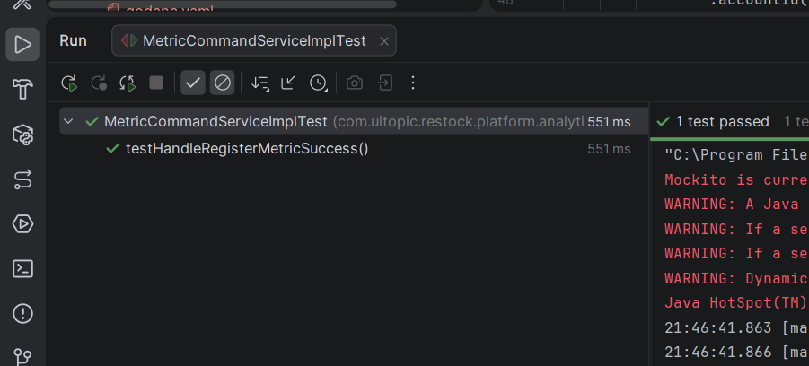

Ejecución de pruebas unitarias para consultas analíticas en Backend Cloud API:

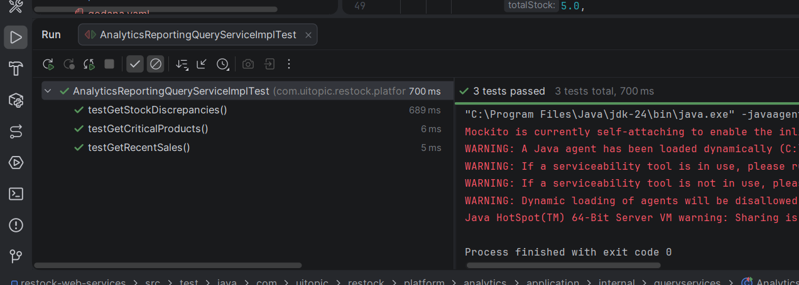

Ejecución de pruebas unitarias para gestión de discrepancias en Backend Cloud API:

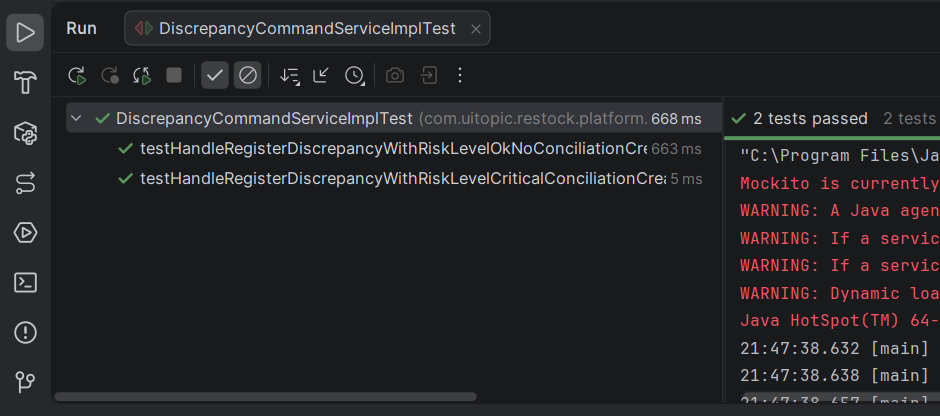

Ejecución de pruebas unitarias para procesamiento de telemetría en Backend Cloud API:

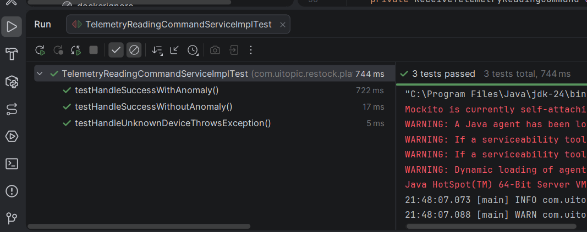

Ejecución de pruebas unitarias del controlador de telemetrías en Backend Cloud API:

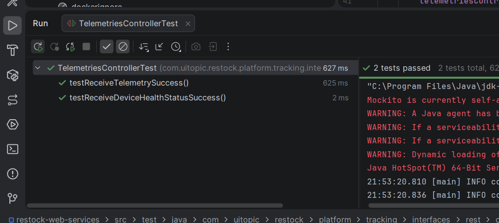

##### Edge API – `restock-edge-service`

| Test ID  | Test class / file                                                  | Related class / component                                         | Related User Story         | Behavior validated                                                                                                                                              |
| -------- | ------------------------------------------------------------------ | ----------------------------------------------------------------- | -------------------------- | --------------------------------------------------------------------------------------------------------------------------------------------------------------- |
| UT-ES-01 | `TestWeightRecordServiceCalculatePhysicalStock`                  | `WeightRecordService.calculate_physical_stock`                  | TS-38, TS-43               | Valida el cálculo de stock físico desde el peso recibido, el redondeo por tolerancia y el rechazo de pesos inválidos.                                        |
| UT-ES-02 | `TestWeightRecordServiceCreateRecord`                            | `WeightRecordService.create_record`                             | TS-36, TS-40, TS-41        | Valida la creación de registros de peso, asignación de timestamp UTC y rechazo de valores inválidos.                                                         |
| UT-ES-03 | `TestWeightRecordServiceCalculateAverages`                       | `WeightRecordService.calculate_averages`                        | TS-38                      | Valida el cálculo del promedio de stock físico y el resultado esperado cuando no existen registros.                                                           |
| UT-ES-04 | `TestEnvironmentRecordServiceCreateRecord`                       | `EnvironmentRecordService.create_record`                        | TS-39, TS-40, TS-41, TS-43 | Valida la creación de registros ambientales, normalización de timestamps, persistencia de flags de anomalía y rechazo de temperatura/humedad fuera de rango. |
| UT-ES-05 | `TestEnvironmentRecordServiceCalculateAverages`                  | `EnvironmentRecordService.calculate_averages`                   | TS-39                      | Valida el cálculo de temperatura y humedad promedio a partir de múltiples lecturas.                                                                           |
| UT-ES-06 | `TestWeightRecordApplicationServiceCreateWeightRecord`           | `WeightRecordApplicationService.create_weight_record`           | TS-36, TS-37, TS-38, TS-41 | Valida que el caso de uso verifique el dispositivo, calcule stock físico, persista el registro y retorne promedios.                                            |
| UT-ES-07 | `TestEnvironmentRecordApplicationServiceCreateEnvironmentRecord` | `EnvironmentRecordApplicationService.create_environment_record` | TS-39, TS-41, TS-43        | Valida que el caso de uso verifique el dispositivo, aplique umbrales ambientales, detecte anomalías, persista la lectura y retorne promedios.                  |

Ejecución de pruebas unitarias del Edge Service:

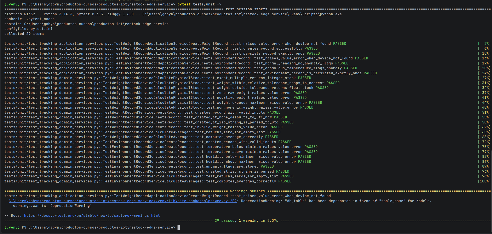

#### Integration Tests designed

##### Backend Cloud API – `restock-web-services`

| Test ID  | Test class                               | Endpoint / component                                            | Related User Story | Behavior validated                                                                                         |
| -------- | ---------------------------------------- | --------------------------------------------------------------- | ------------------ | ---------------------------------------------------------------------------------------------------------- |
| IT-BE-01 | `TelemetriesControllerIntegrationTest` | `POST /api/v1/telemetries`                                    | TS-34              | Valida que el backend reciba una lectura de telemetría y delegue el procesamiento al servicio de comando. |
| IT-BE-02 | `TelemetriesControllerIntegrationTest` | `GET /api/v1/device-thresholds?accountId={accountId}`         | TS-31              | Valida la consulta de umbrales de dispositivo por cuenta.                                                  |
| IT-BE-03 | `TelemetriesControllerIntegrationTest` | `GET /api/v1/devices/{deviceId}`                              | TS-10, TS-33       | Valida la consulta de dispositivo por identificador y el manejo de dispositivo inexistente.                |
| IT-BE-04 | `TelemetriesControllerIntegrationTest` | `GET /api/v1/accounts/{accountId}/critical-products`          | TS-15              | Valida la consulta de productos con bajo stock desde el dashboard analítico.                              |
| IT-BE-05 | `TelemetriesControllerIntegrationTest` | `GET /api/v1/custom-supplies/{productId}/stock-discrepancies` | TS-16              | Valida la consulta de discrepancias de stock asociadas a un producto o suministro.                         |
| ST-BE-01 | `AuthenticationControllerSystemTest`   | `POST /api/v1/auth/sign-up`                                   | TS-02              | Valida registro exitoso, correo duplicado, datos incompletos y rol inválido.                              |
| ST-BE-02 | `AuthenticationControllerSystemTest`   | `POST /api/v1/auth/sign-in`                                   | TS-01              | Valida inicio de sesión exitoso, generación de token JWT, contraseña incorrecta y correo inexistente.   |

Ejecución de pruebas de integración del controlador de telemetrías en Backend Cloud API:

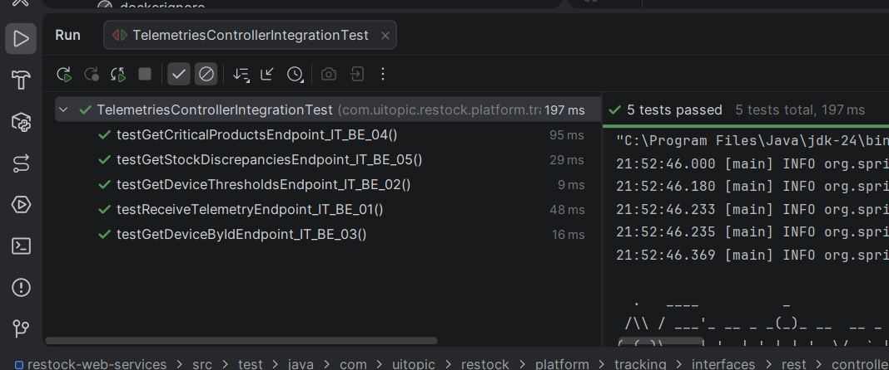

##### Edge API – `restock-edge-service`

| Test ID   | Test class                        | Endpoint / component                          | Related User Story | Behavior validated                                                                               |
| --------- | --------------------------------- | --------------------------------------------- | ------------------ | ------------------------------------------------------------------------------------------------ |
| IT-ES-01a | `TestWeightRecordEndpoint`      | `POST /api/v1/tracking/weight-records`      | TS-36, TS-41       | Valida que un payload de peso válido retorne `201 Created`.                                   |
| IT-ES-01b | `TestWeightRecordEndpoint`      | `POST /api/v1/tracking/weight-records`      | TS-37              | Valida rechazo cuando el dispositivo no existe.                                                  |
| IT-ES-01c | `TestWeightRecordEndpoint`      | `POST /api/v1/tracking/weight-records`      | TS-36              | Valida rechazo por campos obligatorios faltantes.                                                |
| IT-ES-02a | `TestEnvironmentRecordEndpoint` | `POST /api/v1/tracking/environment-records` | TS-39, TS-41       | Valida que un payload ambiental válido retorne `200 OK` con temperatura, humedad y promedios. |
| IT-ES-02b | `TestEnvironmentRecordEndpoint` | `POST /api/v1/tracking/environment-records` | TS-43              | Valida que la respuesta incluya flags de anomalía ambiental.                                    |
| IT-ES-02c | `TestEnvironmentRecordEndpoint` | `POST /api/v1/tracking/environment-records` | TS-37              | Valida rechazo cuando el dispositivo no existe.                                                  |
| IT-ES-02d | `TestEnvironmentRecordEndpoint` | `POST /api/v1/tracking/environment-records` | TS-39              | Valida rechazo por ausencia del campo `humidity`.                                              |

Ejecución de pruebas de integración del Edge Service:

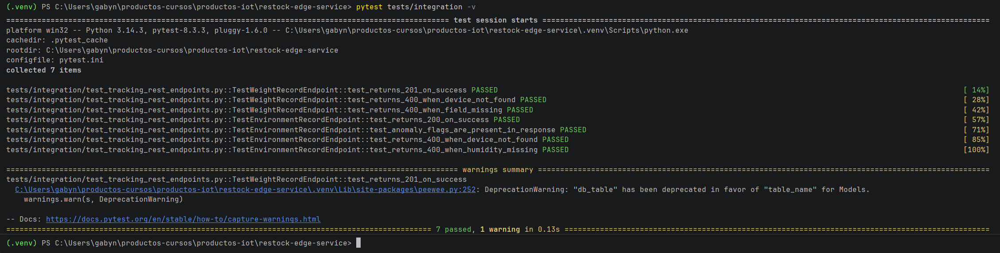

#### Acceptance Tests under BDD approach

Los Acceptance Tests fueron definidos utilizando Gherkin. En el caso del Edge Service, los escenarios se implementaron con Behave y sus Step Definitions en Python. Para el Backend Cloud API, se incluyó un archivo `.feature` para el flujo de creación de tareas de conciliación, relacionado con las historias de discrepancias críticas y conciliación.

##### BDD Acceptance Tests relation

| Acceptance Test ID | Repository               | Feature file                                                     | Steps file                                           | Related User Story         | Business behavior                                                                                                     |
| ------------------ | ------------------------ | ---------------------------------------------------------------- | ---------------------------------------------------- | -------------------------- | --------------------------------------------------------------------------------------------------------------------- |
| AT-BE-01           | `restock-web-services` | `src/test/resources/features/create_conciliation_task.feature` | Cucumber Step Definitions for conciliation task flow | TS-25, TS-26               | Valida la creación de una tarea de conciliación cuando se requiere resolver una discrepancia de inventario.         |
| AT-ES-01           | `restock-edge-service` | `features/weight_record.feature`                               | `features/steps/tracking_steps.py`                 | TS-36, TS-37, TS-38, TS-41 | Valida el registro de telemetría de peso, cálculo de stock físico y rechazo de dispositivo desconocido.            |
| AT-ES-02           | `restock-edge-service` | `features/environment_record.feature`                          | `features/steps/tracking_steps.py`                 | TS-39, TS-41, TS-43        | Valida el registro de temperatura/humedad, detección de anomalías ambientales y rechazo de dispositivo desconocido. |

---

#### BDD Feature Files

##### `create_conciliation_task.feature`

```gherkin
# language: en
# Create Conciliation Task feature

Feature: Create Conciliation Task
  As a system user
  I want to create a conciliation task
  So that inventory discrepancies are resolved

  Scenario: Successful creation of a conciliation task
    Given a device with ID "device-123" exists
    And a batch with ID "batch-123" exists
    When I send a request to create a conciliation task
    Then the task is created successfully
    And the response status is 201
```

Este feature se relaciona con TS-25 y TS-26, ya que valida el comportamiento esperado de generación de tareas de conciliación ante discrepancias relevantes o críticas. Su objetivo es comprobar que el sistema pueda crear una tarea asociada a un dispositivo y lote para permitir el seguimiento de la corrección del inventario.

##### `weight_record.feature`

```gherkin
# language: en
# Feature: Register Weight Telemetry Record
# Related User Story: US-ES-01 – As an IoT device I want to register my weight reading
#                                so that the edge service can compute the physical stock.

Feature: Register weight telemetry record
  As a Restock IoT smart scale device
  I want to register a weight reading to the edge service
  So that the physical stock is calculated and stored

  Scenario: Successful weight record creation with valid device
    Given a registered device with id "device-001"
    And the device has a custom supply weight threshold of 250.0 grams
    When the device sends a weight reading of 500.0 grams
    Then the weight record is created successfully
    And the physical stock is calculated as 2 units
    And the response contains the average physical stock

  Scenario: Weight record rejected for unknown device
    Given no device with id "device-unknown" is registered
    When the device sends a weight reading of 500.0 grams
    Then the request is rejected with a "Device not found" error
```

Este feature se relaciona con TS-36, TS-37, TS-38 y TS-41. El primer escenario valida el registro exitoso de una lectura de peso enviada por un dispositivo registrado, así como el cálculo del stock físico a partir del peso recibido. El segundo escenario valida que el Edge Service rechace lecturas provenientes de dispositivos no registrados, protegiendo la integridad de la telemetría.

##### `environment_record.feature`

```gherkin
# language: en
# Feature: Register Environment Telemetry Record
# Related User Story: US-ES-02 – As an IoT device I want to register temperature and humidity readings
#                                so that the edge service can detect environment anomalies.

Feature: Register environment telemetry record
  As a Restock IoT smart scale device
  I want to register a temperature and humidity reading to the edge service
  So that environment anomalies are detected and the record is stored

  Scenario: Successful environment record with normal readings
    Given a registered device with id "device-001"
    And the device has temperature thresholds between 0.1 and 90.1 Celsius
    And the device has humidity thresholds between 0.1 and 90.1 percent
    When the device sends temperature 25.0 and humidity 60.0
    Then the environment record is created successfully
    And no anomaly is flagged for temperature
    And no anomaly is flagged for humidity
    And the response contains average temperature and average humidity

  Scenario: Environment record flags temperature anomaly
    Given a registered device with id "device-001"
    And the device has temperature thresholds between 0.1 and 30.0 Celsius
    When the device sends temperature 50.0 and humidity 60.0
    Then the environment record is created successfully
    And the response contains temperature_is_anomaly as true

  Scenario: Environment record rejected for unknown device
    Given no device with id "device-unknown" is registered
    When the device sends temperature 25.0 and humidity 60.0
    Then the request is rejected with a "Device not found" error
```

Este feature se relaciona con TS-39, TS-41 y TS-43. Los escenarios validan el registro exitoso de lecturas ambientales, la detección de anomalías cuando la temperatura supera los umbrales configurados y el rechazo de dispositivos desconocidos.

Ejecución de Acceptance Tests BDD del Edge Service con Behave:

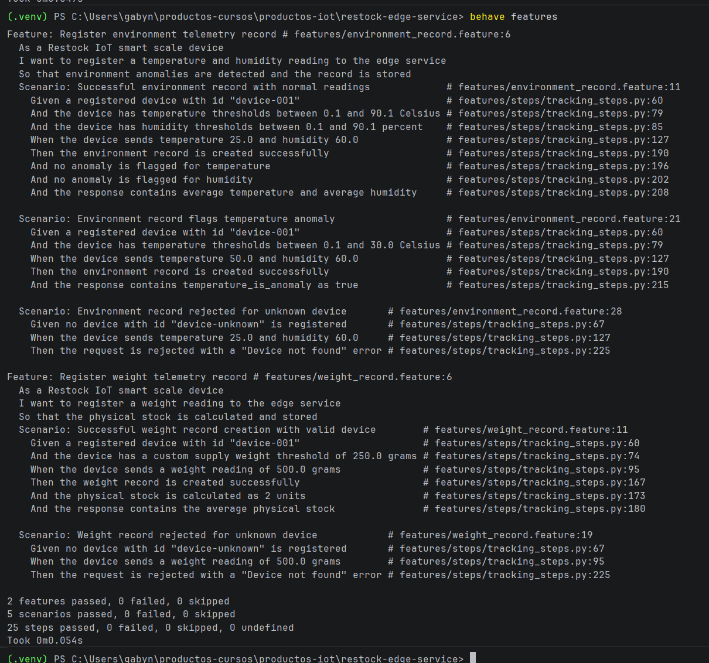

#### Testing commits for Sprint Review

A continuación, se presenta la relación consolidada de commits asociados a las actividades de testing desarrolladas durante el Sprint. Esta tabla incluye los avances realizados en los repositorios `restock-web-services` y `restock-edge-service`, considerando pruebas unitarias, pruebas de integración, configuración de entorno de pruebas y Acceptance Tests bajo enfoque BDD. Cada commit se relaciona con los User Stories o Technical Stories validados durante la implementación de la suite automatizada.

| Repository                                                  | Branch              | Commit Id   | Commit Message                                                 | Commit Message Body                                                                                                                                                                                                            | Committed on (Date) |
| ----------------------------------------------------------- | ------------------- | ----------- | -------------------------------------------------------------- | ------------------------------------------------------------------------------------------------------------------------------------------------------------------------------------------------------------------------------ | ------------------- |
| `desarrollo-de-soluciones-iot-17757/restock-web-services` | `feature/testing` | `4862de0` | `test(iam): update authentication tests`                     | Se actualizan las pruebas de autenticación para validar registro, inicio de sesión, correo duplicado, rol inválido y credenciales incorrectas, relacionadas con TS-01 y TS-02.                                              | 21/06/2026          |
| `desarrollo-de-soluciones-iot-17757/restock-web-services` | `feature/testing` | `f74f340` | `test(iam): add create conciliation task feature`            | Se agrega el archivo BDD `create_conciliation_task.feature`para especificar el flujo de creación de tareas de conciliación, relacionado con TS-25 y TS-26.                                                                 | 21/06/2026          |
| `desarrollo-de-soluciones-iot-17757/restock-web-services` | `feature/testing` | `740d7f5` | `test(iam): add discrepancy command service test`            | Se agregan pruebas unitarias para validar el registro de discrepancias y la creación de tareas de conciliación ante alertas críticas, relacionado con TS-24, TS-25 y TS-26.                                                 | 21/06/2026          |
| `desarrollo-de-soluciones-iot-17757/restock-web-services` | `feature/testing` | `007fe33` | `test(tracking): add telemetry controller test`              | Se agregan pruebas unitarias para validar la delegación del controlador de telemetrías y el procesamiento de estado de salud del dispositivo, relacionado con TS-34 y TS-45.                                                 | 21/06/2026          |
| `desarrollo-de-soluciones-iot-17757/restock-web-services` | `feature/testing` | `5161353` | `test(tracking): add telemetry controller integration test`  | Se agregan pruebas de integración con MockMvc para validar endpoints de telemetría, umbrales, dispositivos, productos críticos y discrepancias de stock, relacionadas con TS-15, TS-16, TS-31 y TS-34.                      | 21/06/2026          |
| `desarrollo-de-soluciones-iot-17757/restock-web-services` | `feature/testing` | `812ecaa` | `test(tracking): add telemetry command service test`         | Se agregan pruebas unitarias para validar procesamiento de telemetría, verificación de dispositivo, persistencia, comparación de stock y publicación de eventos de anomalía, relacionado con TS-24 y TS-34.               | 21/06/2026          |
| `desarrollo-de-soluciones-iot-17757/restock-web-services` | `feature/testing` | `7dc3295` | `test(tracking): add metric command service test`            | Se agrega prueba unitaria para validar el registro de métricas de inventario mediante el servicio de comandos de Analytics, relacionado con TS-34.                                                                            | 21/06/2026          |
| `desarrollo-de-soluciones-iot-17757/restock-web-services` | `feature/testing` | `2134739` | `test(analytics): add analytics query service test`          | Se agregan pruebas unitarias para validar consultas de productos críticos, ventas recientes y discrepancias de inventario, relacionadas con TS-15, TS-16 y TS-17.                                                             | 21/06/2026          |
| `desarrollo-de-soluciones-iot-17757/restock-edge-service` | `feature/testing` | `6dfe341` | `test(tracking): add environment and weight behave features` | Se agregan los archivos BDD `weight_record.feature`y `environment_record.feature`para validar el registro de peso, temperatura y humedad desde dispositivos IoT, relacionado con TS-36, TS-38, TS-39, TS-41 y TS-43.       | 21/06/2026          |
| `desarrollo-de-soluciones-iot-17757/restock-edge-service` | `feature/testing` | `53aaf50` | `test(tracking): add tests config`                           | Se agrega la configuración de pruebas con `pytest.ini`,`conftest.py`y `features/environment.py`para permitir la ejecución automatizada de pruebas unitarias, integrales y BDD.                                         | 21/06/2026          |
| `desarrollo-de-soluciones-iot-17757/restock-edge-service` | `feature/testing` | `ebd368a` | `test(tracking): add tracking steps`                         | Se agregan Step Definitions en Python para ejecutar los escenarios Gherkin de peso y ambiente mediante Behave, relacionados con TS-36, TS-37, TS-39 y TS-43.                                                                   | 21/06/2026          |
| `desarrollo-de-soluciones-iot-17757/restock-edge-service` | `feature/testing` | `29f9866` | `test(tracking): add tracking application services tests`    | Se agregan pruebas unitarias para los servicios de aplicación de Tracking, validando orquestación de repositorios, cálculo de stock, detección de anomalías y persistencia, relacionado con TS-36, TS-39 y TS-41.         | 21/06/2026          |
| `desarrollo-de-soluciones-iot-17757/restock-edge-service` | `feature/testing` | `4faf28e` | `test(tracking): add tracking domain services tests`         | Se agregan pruebas unitarias para servicios de dominio de peso y ambiente, incluyendo cálculo de stock físico, promedios, validación de rangos y normalización de timestamps, relacionado con TS-38, TS-39, TS-40 y TS-43. | 21/06/2026          |
| `desarrollo-de-soluciones-iot-17757/restock-edge-service` | `feature/testing` | `18687cc` | `test(tracking): add tracking endpoints tests`               | Se agregan pruebas de integración para los endpoints REST `/api/v1/tracking/weight-records`y `/api/v1/tracking/environment-records`, relacionado con TS-36, TS-37, TS-39 y TS-41.                                         | 21/06/2026          |

**Testing evidence summary**

Durante el Sprint se incorporaron pruebas automatizadas para validar los principales flujos de Web Services asociados a autenticación, telemetría IoT, tracking, analítica, discrepancias de inventario y tareas de conciliación. En el Backend Cloud API se aplicaron pruebas unitarias con JUnit y Mockito, pruebas de integración con Spring Boot Test y MockMvc, y especificaciones BDD con Cucumber/Gherkin. En el Edge Service se aplicaron pruebas unitarias e integrales con pytest, además de Acceptance Tests BDD con Behave y archivos `.feature` escritos en Gherkin.

Estas pruebas permiten evidenciar que los servicios implementados cumplen con los comportamientos esperados de los User Stories y Technical Stories priorizados, asegurando trazabilidad entre requisitos, código fuente, escenarios BDD y commits de testing registrados en los repositorios del proyecto.

#### 6.2.2.6. Execution Evidence for Sprint Review

En esta sección, se presenta la evidencia de las principales vistas implementadas en este segundo sprint.
A continuación, se muestran las capturas de pantalla y enlaces de acceso a los productos que contiene vistas importantes implementadas en este sprint.
Estas evidencias reflejan el progreso realizado en el sprint y sirven como comprobante del trabajo completado.

## Landing Page

En la presente sección se detalla la evidencia de ejecución alcanzada durante el Sprint 2 para la landing page. El esfuerzo de desarrollo se centró en habilitar secciones clave que permiten a los visitantes construir confianza mediante la vista de información en formato de vídeo sobre el producto desarrollado, el equipo detrás del desarrollo y el proceso de desarrollo.

El vídeo de demostración evidencia la correcta visualización y navegación a través de los flujos implementados, los cuales abarcan:

* **Sección About-the-product**: Sección que presenta un vídeo corto sobre las principales funcionalidades y beneficios que ofrece Restock a los usuarios de los segmentos objetivo.
* **Sección About-the-team**: Sección que presenta un vídeo con información sobre el equipo de desarrollo y el proceso de desarrollo de Restock.


**Evidencias de la demostración:**

**Vídeo de navegación (Product Navigation):** [https://acortar.link/IoO3Qp](https://acortar.link/IoO3Qp)

#### Sección About-the-product

Esta es una sección informativa que incluye un vídeo subido a Youtube sobre el funcionamiento de la aplicación mediante una vista previa de las funcionalidades principales de Restock.


#### Sección About-the-team

Por otra parte, se agregó una sección adicional que contiene un vídeo con información sobre el equipo y el proceso de desarrollo de la plataforma. Esta sección cumple la función de construir confianza con los visitantes del sitio web.


## Aplicación Web

En la presente sección se detalla la evidencia de ejecución alcanzada durante el Sprint 2 para la aplicación web. El esfuerzo de desarrollo se centró en habilitar la navegación principal y la interacción gráfica con las entidades operativas del sistema, brindando soporte visual a los modelos de negocio.

El vídeo de demostración evidencia la correcta visualización y navegación a través de los flujos implementados, los cuales abarcan:

* **Assets & Resources:** Vistas operativas para el registro, control y gestión de sucursales y suministros.
* **Device Management:** Pantallas destinadas a la gestión, registro y configuración de dispositivos en el sistema.
* **Configuración de Sucursales:** Interfaz para la creación y selección de sucursales en el sistema.


**Evidencias de la demostración:**
**Vídeo de navegación (Product Navigation):** [https://acortar.link/CmlyKz](https://acortar.link/CmlyKz)

#### Gestión de inventario

Vista del módulo de inventario donde se visualizan y registran nuevos custom supplies al sistema con el que se pueden registrar, posteriormente, lotes y asignación a dispositivos.


Vista del módulo donde se registran y categorizan los lotes registrados para los custom supplies en el sistema.


Sección de discrepancias y tareas de conciliación registradas por el propio sistema en donde se le informa al usuario alguna discrepancia entre stock físico y del sistema al usuario.


Sección de resumen de información de custom supply donde se muestra la información completa del supply y qué lotes tiene registrado en el sistema.


Formulario para edición de información de un custom supply registrado.


#### Gestión de kits/recetas

Formulario de creación de kits/recetas en el sistema


#### Gestión de dispositivos

Panel de gestión de dispositivos con cuatro métricas clave: escalas activas, alertas de stock, alertas ambientales y dispositivos offline.


Sección de configuración de un dispositivo IoT en el sistema que puede ser usado para editar una configuración o finalizar la configuración de un dispositivo.


#### Configuración del sistema

Sección de sucursales en el sistema donde se visualizan todas las sucursales que contienen tanto ventas como lotes registrados.


Formulario de registro de sucursal en el sistema.


## Aplicación móvil

En la presente sección se detalla la evidencia de ejecución alcanzada durante el Sprint 2 para la aplicación móvil. El esfuerzo de desarrollo se centró en habilitar la navegación principal y la interacción gráfica con las entidades operativas del sistema, brindando soporte visual a los modelos de negocio.

El vídeo de demostración evidencia la correcta visualización y navegación a través de los flujos implementados, los cuales abarcan:

* **Resources:** Vistas operativas para el registro, control y gestión de sucursales, suministros e inventarios.
* **Device Management:** Pantallas destinadas a la gestión, registro y configuración de dispositivos en el sistema.
* **Analytics:** Interfaz para la visualización de métricas clave del sistema, como alertas de stock, alertas ambientales y dispositivos offline.


**Evidencias de la demostración:**
**Vídeo de navegación (Product Navigation):** [https://acortar.link/J1NiTf](https://acortar.link/J1NiTf)

#### Gestión de inventario

Vista del módulo de inventario donde se visualizan y registran nuevos custom supplies al sistema con el que se pueden registrar, posteriormente, lotes y crear sucursales.


#### Métricas del sistema

Vista de métricas del sistema donde se visualizan las alertas de stock o ventas recientes.


#### Gestión de dispositivos

Panel de gestión de dispositivos con cuatro métricas clave: escalas activas, alertas de stock, alertas ambientales y dispositivos offline.


#### 6.2.2.7. Services Documentation Evidence for Sprint Review

Durante el Sprint 2, el equipo implementó y documentó mediante OpenAPI (Swagger) el conjunto completo de endpoints REST que conforman el backend de Restock. Los logros más destacados en materia de documentación de Web Services fueron: la cobertura total de los bounded contexts **IAM**, **Profiles**, **Resources**, **Planning**, **Devices**, **Communications**, **Tracking** y **Analytics**; la especificación de parámetros, cuerpos de solicitud y respuestas de ejemplo para cada operación; y el despliegue de la documentación interactiva en el entorno de producción en Azure, accesible en `https://restock-api-17757.azurewebsites.net/swagger-ui/index.html`.

A continuación se presenta la tabla resumen de los endpoints documentados en este Sprint, agrupados por bounded context:

| Bounded Context | Recurso                         | Verbo HTTP | URL                                                           | Enlace a documentación                                                                                       |
| --------------- | ------------------------------- | ---------- | ------------------------------------------------------------- | ------------------------------------------------------------------------------------------------------------- |
| IAM             | Sign In                         | POST       | `/api/v1/auth/sign-in`                                      | [Swagger – auth](https://restock-api-17757.azurewebsites.net/swagger-ui/index.html#/Authentication)             |
| IAM             | Sign Up                         | POST       | `/api/v1/auth/sign-up`                                      | [Swagger – auth](https://restock-api-17757.azurewebsites.net/swagger-ui/index.html#/Authentication)             |
| Profiles        | Listar perfiles                 | GET        | `/api/v1/profiles`                                          | [Swagger – profiles](https://restock-api-17757.azurewebsites.net/swagger-ui/index.html#/Profiles)               |
| Profiles        | Crear perfil                    | POST       | `/api/v1/profiles`                                          | [Swagger – profiles](https://restock-api-17757.azurewebsites.net/swagger-ui/index.html#/Profiles)               |
| Profiles        | Obtener perfil                  | GET        | `/api/v1/profiles/{profileId}`                              | [Swagger – profiles](https://restock-api-17757.azurewebsites.net/swagger-ui/index.html#/Profiles)               |
| Profiles        | Actualizar perfil               | PATCH      | `/api/v1/profiles/{profileId}`                              | [Swagger – profiles](https://restock-api-17757.azurewebsites.net/swagger-ui/index.html#/Profiles)               |
| Profiles        | Eliminar perfil                 | DELETE     | `/api/v1/profiles/{profileId}`                              | [Swagger – profiles](https://restock-api-17757.azurewebsites.net/swagger-ui/index.html#/Profiles)               |
| Profiles        | Listar negocios                 | GET        | `/api/v1/businesses`                                        | [Swagger – businesses](https://restock-api-17757.azurewebsites.net/swagger-ui/index.html#/Businesses)           |
| Profiles        | Crear negocio                   | POST       | `/api/v1/businesses`                                        | [Swagger – businesses](https://restock-api-17757.azurewebsites.net/swagger-ui/index.html#/Businesses)           |
| Profiles        | Obtener negocio                 | GET        | `/api/v1/businesses/{businessId}`                           | [Swagger – businesses](https://restock-api-17757.azurewebsites.net/swagger-ui/index.html#/Businesses)           |
| Profiles        | Actualizar negocio              | PATCH      | `/api/v1/businesses/{businessId}`                           | [Swagger – businesses](https://restock-api-17757.azurewebsites.net/swagger-ui/index.html#/Businesses)           |
| Profiles        | Eliminar negocio                | DELETE     | `/api/v1/businesses/{businessId}`                           | [Swagger – businesses](https://restock-api-17757.azurewebsites.net/swagger-ui/index.html#/Businesses)           |
| Resources       | Listar sucursales               | GET        | `/api/v1/branches`                                          | [Swagger – branches](https://restock-api-17757.azurewebsites.net/swagger-ui/index.html#/Branches)               |
| Resources       | Crear sucursal                  | POST       | `/api/v1/branches`                                          | [Swagger – branches](https://restock-api-17757.azurewebsites.net/swagger-ui/index.html#/Branches)               |
| Resources       | Obtener sucursal                | GET        | `/api/v1/branches/{branchId}`                               | [Swagger – branches](https://restock-api-17757.azurewebsites.net/swagger-ui/index.html#/Branches)               |
| Resources       | Actualizar sucursal             | PATCH      | `/api/v1/branches/{branchId}`                               | [Swagger – branches](https://restock-api-17757.azurewebsites.net/swagger-ui/index.html#/Branches)               |
| Resources       | Eliminar sucursal               | DELETE     | `/api/v1/branches/{branchId}`                               | [Swagger – branches](https://restock-api-17757.azurewebsites.net/swagger-ui/index.html#/Branches)               |
| Resources       | Actualizar estado sucursal      | PATCH      | `/api/v1/branches/{branchId}/status`                        | [Swagger – branches](https://restock-api-17757.azurewebsites.net/swagger-ui/index.html#/Branches)               |
| Resources       | Listar insumos personalizados   | GET        | `/api/v1/custom-supplies`                                   | [Swagger – custom-supplies](https://restock-api-17757.azurewebsites.net/swagger-ui/index.html#/Custom-Supplies) |
| Resources       | Crear insumo personalizado      | POST       | `/api/v1/custom-supplies`                                   | [Swagger – custom-supplies](https://restock-api-17757.azurewebsites.net/swagger-ui/index.html#/Custom-Supplies) |
| Resources       | Obtener insumo personalizado    | GET        | `/api/v1/custom-supplies/{customSupplyId}`                  | [Swagger – custom-supplies](https://restock-api-17757.azurewebsites.net/swagger-ui/index.html#/Custom-Supplies) |
| Resources       | Actualizar insumo personalizado | PATCH      | `/api/v1/custom-supplies/{customSupplyId}`                  | [Swagger – custom-supplies](https://restock-api-17757.azurewebsites.net/swagger-ui/index.html#/Custom-Supplies) |
| Resources       | Eliminar insumo personalizado   | DELETE     | `/api/v1/custom-supplies/{customSupplyId}`                  | [Swagger – custom-supplies](https://restock-api-17757.azurewebsites.net/swagger-ui/index.html#/Custom-Supplies) |
| Resources       | Listar insumos catálogo        | GET        | `/api/v1/supplies`                                          | [Swagger – supplies](https://restock-api-17757.azurewebsites.net/swagger-ui/index.html#/Supplies)               |
| Resources       | Listar categorías              | GET        | `/api/v1/supplies/categories`                               | [Swagger – supplies](https://restock-api-17757.azurewebsites.net/swagger-ui/index.html#/Supplies)               |
| Resources       | Obtener insumo catálogo        | GET        | `/api/v1/supplies/{id}`                                     | [Swagger – supplies](https://restock-api-17757.azurewebsites.net/swagger-ui/index.html#/Supplies)               |
| Resources       | Listar lotes                    | GET        | `/api/v1/batches`                                           | [Swagger – batches](https://restock-api-17757.azurewebsites.net/swagger-ui/index.html#/Batches)                 |
| Resources       | Crear lote                      | POST       | `/api/v1/batches`                                           | [Swagger – batches](https://restock-api-17757.azurewebsites.net/swagger-ui/index.html#/Batches)                 |
| Resources       | Obtener lote                    | GET        | `/api/v1/batches/{batchId}`                                 | [Swagger – batches](https://restock-api-17757.azurewebsites.net/swagger-ui/index.html#/Batches)                 |
| Resources       | Actualizar lote                 | PATCH      | `/api/v1/batches/{batchId}`                                 | [Swagger – batches](https://restock-api-17757.azurewebsites.net/swagger-ui/index.html#/Batches)                 |
| Resources       | Eliminar lote                   | DELETE     | `/api/v1/batches/{batchId}`                                 | [Swagger – batches](https://restock-api-17757.azurewebsites.net/swagger-ui/index.html#/Batches)                 |
| Resources       | Transferir stock                | POST       | `/api/v1/batches/{batchId}/transfer`                        | [Swagger – batches](https://restock-api-17757.azurewebsites.net/swagger-ui/index.html#/Batches)                 |
| Planning        | Crear producto                  | POST       | `/api/v1/products`                                          | [Swagger – products](https://restock-api-17757.azurewebsites.net/swagger-ui/index.html#/Products)               |
| Planning        | Actualizar producto             | PUT        | `/api/v1/products/{productId}`                              | [Swagger – products](https://restock-api-17757.azurewebsites.net/swagger-ui/index.html#/Products)               |
| Planning        | Eliminar producto               | DELETE     | `/api/v1/products/{productId}`                              | [Swagger – products](https://restock-api-17757.azurewebsites.net/swagger-ui/index.html#/Products)               |
| Planning        | Obtener producto                | GET        | `/api/v1/products/{productId}`                              | [Swagger – products](https://restock-api-17757.azurewebsites.net/swagger-ui/index.html#/Products)               |
| Planning        | Listar productos por cuenta     | GET        | `/api/v1/products`                                          | [Swagger – products](https://restock-api-17757.azurewebsites.net/swagger-ui/index.html#/Products)               |
| Planning        | Disponibilidad de productos     | GET        | `/api/v1/products/availability`                             | [Swagger – products](https://restock-api-17757.azurewebsites.net/swagger-ui/index.html#/Products)               |
| Planning        | Agregar ingrediente             | POST       | `/api/v1/products/{productId}/ingredients`                  | [Swagger – products](https://restock-api-17757.azurewebsites.net/swagger-ui/index.html#/Products)               |
| Planning        | Quitar ingrediente              | DELETE     | `/api/v1/products/{productId}/ingredients/{customSupplyId}` | [Swagger – products](https://restock-api-17757.azurewebsites.net/swagger-ui/index.html#/Products)               |
| Devices         | Listar dispositivos             | GET        | `/api/v1/devices`                                           | [Swagger – devices](https://restock-api-17757.azurewebsites.net/swagger-ui/index.html#/Devices)                 |
| Devices         | Obtener dispositivo             | GET        | `/api/v1/devices/{deviceId}`                                | [Swagger – devices](https://restock-api-17757.azurewebsites.net/swagger-ui/index.html#/Devices)                 |
| Devices         | Registrar dispositivo           | POST       | `/api/v1/devices`                                           | [Swagger – devices](https://restock-api-17757.azurewebsites.net/swagger-ui/index.html#/Devices)                 |
| Devices         | Especificaciones                | PUT        | `/api/v1/devices/{deviceId}/specifications`                 | [Swagger – devices](https://restock-api-17757.azurewebsites.net/swagger-ui/index.html#/Devices)                 |
| Devices         | Asignar sucursal                | PUT        | `/api/v1/devices/{deviceId}/configuration/branch`           | [Swagger – devices](https://restock-api-17757.azurewebsites.net/swagger-ui/index.html#/Devices)                 |
| Devices         | Asignar lote                    | PUT        | `/api/v1/devices/{deviceId}/configuration/batch`            | [Swagger – devices](https://restock-api-17757.azurewebsites.net/swagger-ui/index.html#/Devices)                 |
| Devices         | Asignar umbral                  | PUT        | `/api/v1/devices/{deviceId}/configuration/threshold`        | [Swagger – devices](https://restock-api-17757.azurewebsites.net/swagger-ui/index.html#/Devices)                 |
| Devices         | Configurar medición            | PUT        | `/api/v1/devices/{deviceId}/configuration/measurement`      | [Swagger – devices](https://restock-api-17757.azurewebsites.net/swagger-ui/index.html#/Devices)                 |
| Devices         | Actualizar estado               | PATCH      | `/api/v1/devices/{deviceId}/status`                         | [Swagger – devices](https://restock-api-17757.azurewebsites.net/swagger-ui/index.html#/Devices)                 |
| Devices         | Stock retirado                  | PATCH      | `/api/v1/devices/{deviceId}/withdrawn-stock`                | [Swagger – devices](https://restock-api-17757.azurewebsites.net/swagger-ui/index.html#/Devices)                 |
| Devices         | Listar umbrales                 | GET        | `/api/v1/device-thresholds`                                 | [Swagger – thresholds](https://restock-api-17757.azurewebsites.net/swagger-ui/index.html#/Device-Thresholds)    |
| Devices         | Obtener umbral                  | GET        | `/api/v1/device-thresholds/{thresholdId}`                   | [Swagger – thresholds](https://restock-api-17757.azurewebsites.net/swagger-ui/index.html#/Device-Thresholds)    |
| Devices         | Crear umbral                    | POST       | `/api/v1/device-thresholds`                                 | [Swagger – thresholds](https://restock-api-17757.azurewebsites.net/swagger-ui/index.html#/Device-Thresholds)    |
| Communications  | Listar notificaciones           | GET        | `/api/v1/notifications`                                     | [Swagger – notifications](https://restock-api-17757.azurewebsites.net/swagger-ui/index.html#/Notifications)     |
| Communications  | Obtener notificación           | GET        | `/api/v1/notifications/{notificationId}`                    | [Swagger – notifications](https://restock-api-17757.azurewebsites.net/swagger-ui/index.html#/Notifications)     |
| Communications  | Suscripción push               | POST       | `/api/v1/push-subscriptions`                                | [Swagger – notifications](https://restock-api-17757.azurewebsites.net/swagger-ui/index.html#/Notifications)     |
| Tracking        | Recibir telemetría             | POST       | `/api/v1/telemetries`                                       | [Swagger – tracking](https://restock-api-17757.azurewebsites.net/swagger-ui/index.html#/Tracking)               |
| Tracking        | Listar tareas de conciliación  | GET        | `/api/v1/conciliation-tasks`                                | [Swagger – tracking](https://restock-api-17757.azurewebsites.net/swagger-ui/index.html#/Tracking)               |
| Tracking        | Obtener tarea de conciliación  | GET        | `/api/v1/conciliation-tasks/{conciliationTaskId}`           | [Swagger – tracking](https://restock-api-17757.azurewebsites.net/swagger-ui/index.html#/Tracking)               |
| Tracking        | Resolver tarea                  | POST       | `/api/v1/conciliation-tasks/{conciliationTaskId}/resolve`   | [Swagger – tracking](https://restock-api-17757.azurewebsites.net/swagger-ui/index.html#/Tracking)               |
| Analytics       | Productos críticos             | GET        | `/api/v1/accounts/{accountId}/critical-products`            | [Swagger – analytics](https://restock-api-17757.azurewebsites.net/swagger-ui/index.html#/Analytics)             |
| Analytics       | Discrepancias de stock          | GET        | `/api/v1/custom-supplies/{id}/stock-discrepancies`          | [Swagger – analytics](https://restock-api-17757.azurewebsites.net/swagger-ui/index.html#/Analytics)             |
| Analytics       | Ventas recientes                | GET        | `/api/v1/accounts/{accountId}/recent-sales`                 | [Swagger – analytics](https://restock-api-17757.azurewebsites.net/swagger-ui/index.html#/Analytics)             |

---

A continuación se detalla cada acción implementada con su sintaxis de llamada, parámetros y response de ejemplo.

---

##### IAM — Autenticación

**POST `/api/v1/auth/sign-in`**

Permite a un usuario registrado iniciar sesión en la plataforma. Retorna un token JWT junto con los datos de identificación de la cuenta.

| Campo        | Tipo   | Ubicación  | Requerido | Descripción                    |
| ------------ | ------ | ----------- | --------- | ------------------------------- |
| `email`    | string | body (JSON) | Sí       | Correo electrónico del usuario |
| `password` | string | body (JSON) | Sí       | Contraseña del usuario         |

_Request body:_

```json
{
  "email": "juan@gmail.com",
  "password": "password123"
}
```

_Response (200 OK):_

```json
{
  "id": "123e4567-e89b-12d3-a456-426614174000",
  "email": "juan@gmail.com",
  "role": "RETAIL",
  "token": "eyJhbGciOiJIUzI1NiIsInR5cCI6IkpXVCJ9...",
  "accountId": "456e7890-e89b-12d3-a456-426614174000"
}
```

El campo `token` debe incluirse como `Bearer` en el header `Authorization` de todas las solicitudes autenticadas. El campo `accountId` identifica la cuenta empresarial del usuario.

---

**POST `/api/v1/auth/sign-up`**

Registra un nuevo usuario en la plataforma. El campo `role` determina el tipo de acceso (`RETAIL` para minoristas, `SUPPLIER` para proveedores).

| Campo        | Tipo   | Ubicación  | Requerido | Descripción                              |
| ------------ | ------ | ----------- | --------- | ----------------------------------------- |
| `email`    | string | body (JSON) | Sí       | Correo electrónico del nuevo usuario     |
| `password` | string | body (JSON) | Sí       | Contraseña                               |
| `role`     | string | body (JSON) | Sí       | Rol del usuario:`RETAIL` o `SUPPLIER` |

_Request body:_

```json
{
  "email": "juan@gmail.com",
  "password": "password123",
  "role": "RETAIL"
}
```

_Response (201 Created):_

```json
{
  "id": "123e4567-e89b-12d3-a456-426614174000",
  "email": "juan@gmail.com",
  "role": "RETAIL",
  "accountId": "456e7890-e89b-12d3-a456-426614174000"
}
```

---

##### Profiles — Perfil de usuario

**GET `/api/v1/profiles`**

Retorna la lista de perfiles de usuario. Puede filtrarse opcionalmente por `userId`.

| Parámetro | Tipo | Ubicación | Requerido | Descripción                                       |
| ---------- | ---- | ---------- | --------- | -------------------------------------------------- |
| `userId` | UUID | query      | No        | Filtra el resultado al perfil del usuario indicado |

_Response (200 OK):_

```json
[
  {
    "id": "abc123",
    "userId": "user-456",
    "name": "Juan",
    "lastName": "Pérez",
    "phoneNumber": "+51987654321",
    "avatarUrl": "https://res.cloudinary.com/.../avatar.jpg",
    "avatarPublicId": "restock/avatars/abc123",
    "gender": "MALE",
    "birthDate": "1995-03-15"
  }
]
```

---

**POST `/api/v1/profiles`**

Crea un nuevo perfil de usuario. Acepta `multipart/form-data` para permitir la carga de una imagen de avatar.

| Campo           | Tipo   | Requerido | Descripción                                        |
| --------------- | ------ | --------- | --------------------------------------------------- |
| `userId`      | UUID   | Sí       | ID del usuario al que pertenece el perfil           |
| `name`        | string | Sí       | Nombre del usuario                                  |
| `lastName`    | string | No        | Apellido                                            |
| `phoneNumber` | string | No        | Número de teléfono                                |
| `gender`      | string | No        | Género:`MALE`, `FEMALE`, u otro valor del enum |
| `birthDate`   | date   | No        | Fecha de nacimiento (formato `YYYY-MM-DD`)        |
| `image`       | file   | No        | Imagen de avatar (PNG/JPG)                          |

---

**GET `/api/v1/profiles/{profileId}`**

Obtiene el perfil de un usuario por su identificador único.

| Parámetro    | Tipo | Ubicación | Requerido | Descripción             |
| ------------- | ---- | ---------- | --------- | ------------------------ |
| `profileId` | UUID | path       | Sí       | Identificador del perfil |

_Response (200 OK):_

```json
{
  "id": "abc123",
  "userId": "user-456",
  "name": "Juan",
  "lastName": "Pérez",
  "phoneNumber": "+51987654321",
  "avatarUrl": "https://res.cloudinary.com/.../avatar.jpg",
  "avatarPublicId": "restock/avatars/abc123",
  "gender": "MALE",
  "birthDate": "1995-03-15"
}
```

---

**PATCH `/api/v1/profiles/{profileId}`**

Actualiza parcialmente los datos del perfil indicado. Acepta `multipart/form-data` (campos opcionales + imagen).

| Parámetro    | Tipo | Ubicación | Requerido | Descripción                          |
| ------------- | ---- | ---------- | --------- | ------------------------------------- |
| `profileId` | UUID | path       | Sí       | Identificador del perfil a actualizar |

---

**DELETE `/api/v1/profiles/{profileId}`**

Elimina el perfil de usuario indicado.

| Parámetro    | Tipo | Ubicación | Requerido | Descripción                        |
| ------------- | ---- | ---------- | --------- | ----------------------------------- |
| `profileId` | UUID | path       | Sí       | Identificador del perfil a eliminar |

_Response (204 No Content)_

---

##### Profiles — Business (negocio)

**GET `/api/v1/businesses/{businessId}`**

Obtiene los datos del negocio registrado, incluyendo RUC, nombre comercial, dirección principal e imagen del logo.

| Parámetro     | Tipo | Ubicación | Requerido | Descripción              |
| -------------- | ---- | ---------- | --------- | ------------------------- |
| `businessId` | UUID | path       | Sí       | Identificador del negocio |

_Response (200 OK):_

```json
{
  "id": "biz-789",
  "userId": "user-456",
  "ruc": "20601234567",
  "pictureUrl": "https://res.cloudinary.com/.../logo.jpg",
  "picturePublicId": "restock/businesses/biz-789",
  "companyName": "Distribuidora Norte S.A.C.",
  "mainLocation": "Av. La Marina 1234, Lima"
}
```

Los endpoints de listado (`GET /api/v1/businesses`), creación (`POST`), actualización (`PATCH`) y eliminación (`DELETE`) siguen la misma estructura de parámetros que los endpoints de perfiles de usuario descritos anteriormente.

---

##### Resources — Sucursales (Branches)

**GET `/api/v1/branches`**

Lista todas las sucursales. Puede filtrarse por cuenta.

| Parámetro    | Tipo | Ubicación | Requerido | Descripción                                |
| ------------- | ---- | ---------- | --------- | ------------------------------------------- |
| `accountId` | UUID | query      | No        | Filtra las sucursales de la cuenta indicada |

---

**POST `/api/v1/branches`**

Crea una nueva sucursal. El `accountId` se pasa como query parameter; el cuerpo va en `multipart/form-data`.

| Parámetro    | Tipo | Ubicación | Requerido | Descripción                          |
| ------------- | ---- | ---------- | --------- | ------------------------------------- |
| `accountId` | UUID | query      | Sí       | Cuenta a la que pertenece la sucursal |

---

**PATCH `/api/v1/branches/{branchId}/status`**

Actualiza únicamente el estado operativo de una sucursal (activa/inactiva).

| Parámetro   | Tipo   | Ubicación  | Requerido | Descripción                 |
| ------------ | ------ | ----------- | --------- | ---------------------------- |
| `branchId` | UUID   | path        | Sí       | Identificador de la sucursal |
| `status`   | string | body (JSON) | Sí       | Nuevo estado de la sucursal  |

---

##### Resources — Insumos (Custom Supplies y Supplies)

**GET `/api/v1/custom-supplies`**

Lista los insumos personalizados creados por una cuenta. Admite filtro por `accountId`.

**GET `/api/v1/supplies`** y **GET `/api/v1/supplies/categories`**

Listan los insumos del catálogo global de la plataforma y sus categorías disponibles. No requieren autenticación de cuenta específica.

---

##### Resources — Lotes (Batches)

**GET `/api/v1/batches`**

Lista lotes de insumos. Admite combinación de filtros para acotar resultados.

| Parámetro         | Tipo | Ubicación | Requerido | Descripción                    |
| ------------------ | ---- | ---------- | --------- | ------------------------------- |
| `accountId`      | UUID | query      | No        | Filtra por cuenta               |
| `branchId`       | UUID | query      | No        | Filtra por sucursal             |
| `customSupplyId` | UUID | query      | No        | Filtra por insumo personalizado |

---

**POST `/api/v1/batches/{batchId}/transfer`**

Transfiere stock de un lote hacia otra sucursal o dispositivo.

| Parámetro  | Tipo | Ubicación | Requerido | Descripción                           |
| ----------- | ---- | ---------- | --------- | -------------------------------------- |
| `batchId` | UUID | path       | Sí       | Lote origen de la transferencia        |
| body        | JSON | body       | Sí       | Cantidad y destino de la transferencia |

---

##### Planning — Productos

**GET `/api/v1/products/availability`**

Calcula la disponibilidad de producción de todos los productos de una cuenta en función del stock actual de insumos.

| Parámetro    | Tipo | Ubicación | Requerido | Descripción                                     |
| ------------- | ---- | ---------- | --------- | ------------------------------------------------ |
| `accountId` | UUID | query      | Sí       | Cuenta propietaria de los productos              |
| `branchId`  | UUID | query      | No        | Restringe el cálculo a una sucursal específica |

---

**POST `/api/v1/products/{productId}/ingredients`** y **DELETE `/api/v1/products/{productId}/ingredients/{customSupplyId}`**

Permiten gestionar los ingredientes (insumos personalizados) que componen un producto para efectos del cálculo de disponibilidad.

---

##### Devices — Dispositivos y Umbrales

**POST `/api/v1/devices`**

Registra un nuevo dispositivo IoT en la plataforma.

| Campo            | Tipo   | Requerido | Descripción                             |
| ---------------- | ------ | --------- | ---------------------------------------- |
| `accountId`    | UUID   | Sí       | Cuenta a la que pertenece el dispositivo |
| `serialNumber` | string | Sí       | Número de serie del hardware            |
| `model`        | string | No        | Modelo del dispositivo                   |

Los endpoints de configuración (`PUT .../configuration/branch`, `.../configuration/batch`, `.../configuration/threshold`, `.../configuration/measurement`) permiten asignar progresivamente el contexto operativo de un dispositivo una vez registrado.

**PATCH `/api/v1/devices/{deviceId}/withdrawn-stock`**

Notifica al sistema que se retiró stock físico del contenedor monitoreado por el dispositivo, actualizando el registro de inventario.

---

##### Communications — Notificaciones

**GET `/api/v1/notifications`**

Lista todas las notificaciones de un usuario receptor.

| Parámetro          | Tipo | Ubicación | Requerido | Descripción                           |
| ------------------- | ---- | ---------- | --------- | -------------------------------------- |
| `recipientUserId` | UUID | query      | Sí       | Identificador del usuario destinatario |

---

**POST `/api/v1/push-subscriptions`**

Registra el endpoint de suscripción Web Push del navegador del usuario para habilitar notificaciones en tiempo real.

---

##### Tracking — Telemetría y Conciliación

**POST `/api/v1/telemetries`**

Recibe mediciones de peso (u otra magnitud) enviadas por el firmware del dispositivo IoT.

| Campo         | Tipo     | Requerido | Descripción                          |
| ------------- | -------- | --------- | ------------------------------------- |
| `deviceId`  | UUID     | Sí       | Dispositivo que originó la medición |
| `value`     | number   | Sí       | Valor medido                          |
| `timestamp` | ISO 8601 | Sí       | Fecha y hora de la medición          |

---

**POST `/api/v1/conciliation-tasks/{conciliationTaskId}/resolve`**

Resuelve una tarea de conciliación generada automáticamente cuando el sistema detecta una discrepancia entre el stock esperado y el medido por el dispositivo.

| Parámetro             | Tipo   | Ubicación  | Requerido | Descripción                 |
| ---------------------- | ------ | ----------- | --------- | ---------------------------- |
| `conciliationTaskId` | UUID   | path        | Sí       | Tarea a resolver             |
| `resolution`         | string | body (JSON) | Sí       | Tipo de resolución aplicada |

---

##### Analytics — Análisis

**GET `/api/v1/accounts/{accountId}/critical-products`**

Retorna los productos cuya disponibilidad de producción está por debajo del umbral configurado, priorizados por criticidad.

**GET `/api/v1/custom-supplies/{id}/stock-discrepancies`**

Retorna el historial de discrepancias de stock detectadas para un insumo específico, útil para auditoría e identificación de mermas.

**GET `/api/v1/accounts/{accountId}/recent-sales`**

Retorna el resumen de ventas recientes de la cuenta, con soporte de filtros por rango de fechas.

| Parámetro    | Tipo | Ubicación | Requerido | Descripción                |
| ------------- | ---- | ---------- | --------- | --------------------------- |
| `startDate` | date | query      | No        | Inicio del rango (ISO 8601) |
| `endDate`   | date | query      | No        | Fin del rango (ISO 8601)    |

---

A continuación se presentan capturas de la interacción con la documentación desplegada en Swagger UI:


**Repositorio de Web Services:** [https://github.com/desarrollo-de-soluciones-iot-17757/restock-web-services](https://github.com/desarrollo-de-soluciones-iot-17757/restock-web-services)

**Commits relacionados con la documentación de este Sprint:**

| SHA         | Descripción                                                                                               |
| ----------- | ---------------------------------------------------------------------------------------------------------- |
| `9fd1ea8` | feat(business): implement crud operations for business profiles and add rest controller                    |
| `e0d59e2` | feat(profiles): add commands and resources for business and user profile creation, deletion, and retrieval |
| `8648543` | feat(profiles): implement crud operations for user profiles and enhance profile management features        |
| `6134ae5` | feat(profiles): add commands and resources for updating business and user profiles                         |
| `f02e19d` | feat(device-registration): enhance device event publishing and update device configuration handling        |
| `0092e95` | feat(device-registration): add device calibration and registration events with token generation            |
| `93c5030` | feat(stock-event-alerts): add fields to register the custom supply name for sending the email              |
| `68d76f1` | feat(notification-by-source): add logic for generating notifications by source type                        |
| `a480a03` | feat(analytics): implement complete analytics bounded context                                              |
| `1f8c4ea` | fix(analytics): change endpoint routes and align under system analytics tag                                |
| `2b38185` | feat(planning): add missing files for products availability calculation                                    |
| `f0856fc` | feat(tracking): add conciliation tasks controller                                                          |

#### 6.2.2.8. Software Deployment Evidence for Sprint Review

Durante este Sprint, el equipo ejecutó las actividades de despliegue correspondientes a los dos servicios backend del sistema Restock: la API principal (restock-web-services) y el servicio edge para dispositivos IoT (edge-restock). Ambos despliegues se realizaron sobre infraestructura de Microsoft Azure, con integración continua configurada mediante GitHub Actions, lo que permitió automatizar la publicación de cada cambio fusionado a la rama principal.

##### Despliegue del Backend Principal (restock-web-services)

El backend principal fue desplegado en Azure App Service bajo el plan `plan-restock-17757`, utilizando un contenedor Linux con modelo de publicación basado en Docker. El servicio quedó accesible públicamente a través del dominio `restock-api-17757.azurewebsites.net`.

Los pasos seguidos para este despliegue fueron los siguientes:

1. Se creó el Plan de App Service `plan-restock-17757` en la región Brazil South, bajo el tier Basic B1 con sistema operativo Linux.
2. Se configuró la aplicación web `restock-api-17757` con modelo de publicación por contenedor, utilizando la imagen base `nginx:latest` como punto de partida.
3. Se registraron las variables de entorno necesarias para la ejecución del servicio, incluyendo MONGODB_URI, AUTHORIZATION_JWT_SECRET, AUTHORIZATION_JWT_EXPIRA..., CLOUDINARY_API_KEY, CLOUDINARY_API_SECRET, CLOUDINARY_CLOUD_NAME, FIREBASE_CREDENTIALS_BASE64, FIREBASE_PROJECT_ID, INTEGRATIONS_FCM_ENABLED, RESEND_API_KEY, SPRING_PROFILES_ACTIVE, entre otras, configuradas directamente desde la sección de Variables de entorno del App Service.
4. Se configuró el workflow de GitHub Actions (`deploy-azure.yml`) con el pipeline CD - Deploy Backend to Azure, el cual construye la imagen Docker, la publica en el GitHub Container Registry (ghcr.io) y despliega automáticamente al App Service al detectar cambios en la rama main.
5. Se verificó la ejecución exitosa de los 10 workflow runs registrados en GitHub Actions, todos con estado completado satisfactoriamente.
6. Se validó la disponibilidad pública del Swagger UI en [https://restock-api-17757.azurewebsites.net/swagger-ui/index.html#/](https://restock-api-17757.azurewebsites.net/swagger-ui/index.html#/), confirmando la exposición correcta de los endpoints documentados bajo OpenAPI 3.1.

Las siguientes capturas evidencian el proceso de despliegue ejecutado:

<p align="center">
  
</p>
La imagen anterior muestra el Plan de App Service `plan-restock-17757` en estado Listo, configurado en Brazil South con tier B1 y sistema operativo Linux.

<p align="center">
  
</p>
La captura evidencia la aplicación web `restock-api-17757` en estado En ejecución, con su dominio predeterminado asignado y el plan de hosting vinculado correctamente.

<p align="center">
  
</p>
Se muestra la configuración de las variables de entorno registradas en el App Service, necesarias para la conexión con MongoDB, autenticación JWT, servicios de notificaciones y almacenamiento en nube.

<p align="center">
  
</p>
La imagen muestra el archivo `deploy-azure.yml` con el pipeline de entrega continua configurado para construir y publicar la imagen Docker automáticamente al fusionar cambios en main.

<p align="center">
  
</p>
Se evidencian los 10 workflow runs completados exitosamente en el repositorio `restock-web-services`, correspondientes a los distintos merges realizados durante el sprint.

<p align="center">
  
</p>
La captura confirma la disponibilidad del Swagger UI de la Restock API en producción, con los módulos Custom Supplies, Device Thresholds y demás bounded contexts correctamente expuestos y documentados bajo OAS 3.1.

##### Despliegue del Edge Service (edge-restock)

El servicio edge, responsable del registro y autenticación de dispositivos IoT, fue desplegado como Azure Container App bajo el entorno `env-restock-17757`, en la región Canada Central. Este servicio expone endpoints REST consumidos directamente por los dispositivos físicos del sistema.

Los pasos seguidos para este despliegue fueron los siguientes:

1. Se creó la Container App `edge-restock-17757` dentro del grupo de recursos `rg-restock-17757`, configurada con perfil de carga de trabajo Consumption y modo de revisión Simple.
2. Se vinculó la aplicación al entorno de Container Apps `env-restock-17757` con Log Analytics asociado.
3. Se habilitó el acceso de entrada (ingress) para exponer el servicio públicamente, generando la URL `https://edge-restock-17757.calmflower-393d6737.canadacentral.azurecontainerapps.io`.
4. Se verificó el estado de aprovisionamiento como "Se realizó correctamente" con la revisión activa `edge-restock-17757--0000002`.
5. Se validó el endpoint `POST /api/v1/auth/sign-up` mediante Postman, registrando un dispositivo con `device_id: AA:BB:CC:DD:EE:01` y obteniendo respuesta 201 Created con el cuerpo de confirmación.

Las siguientes capturas evidencian el despliegue y validación del edge service:

<p align="center">
  
</p>
La imagen muestra la Container App `edge-restock-17757` en estado En ejecución dentro del portal de Azure, con el aprovisionamiento completado correctamente y la URL pública generada.

<p align="center">
  
</p>
Se muestra la configuración de headers utilizada en Postman para realizar la petición POST al endpoint de registro de dispositivos, apuntando a la URL pública del edge service en Azure Container Apps.

<p align="center">
  
</p>
La captura evidencia la respuesta 201 Created obtenida al registrar el dispositivo `AA:BB:CC:DD:EE:01`, confirmando que el edge service se encuentra operativo y respondiendo correctamente desde el entorno de producción en Azure.

#### 6.2.2.9. Team Collaboration Insights during Sprint

##### Edge service

El sprint 2 se incluyó el desarrollo de la primera versión del Edge service que actúa como capa intermedia entre los dispositivos IoT de Restock y la plataforma en la nube.

- Manejo de respuestas de error (400 Bad Request, 401 Unauthorized) para payloads inválidos, campos faltantes o credenciales incorrectas.
- Uso de Domain-Driven Design para la organización de lógica y vistas en contextos delimitados según su reponsabilidad.
- Commits regulares con mensajes que enlazaban a tareas de la planificación del sprint.

##### **Analíticos de colaboración — Edge service**


- Total de commits (Edge): **54**
- Total de autores contribuyentes: **4**
- Total de _pull requests_ relacionadas: **14**
- Observación: sin cambios adicionales en archivos respecto a la última comparación registrada en el repositorio.

##### Mobile application

Por otro lado, el sprint 2 también incluyó el desarrollo de la primera versión de la aplicación móvil con vistas principales como inventarios, suministros, ventas, dispositivos, kits y recetas, entre otros.

- Ramas `feature/*` por pantalla (resource, devices, branches) para aislar cambios y facilitar el trabajo paralelo entre el equipo de desarrollo.
- Uso de Domain-Driven Design para la organización de lógica y vistas en contextos delimitados según su reponsabilidad.
- Commits regulares con mensajes que enlazaban a tareas de la planificación del sprint.

##### **Analíticos de colaboración — Mobile application**


- Total de commits (Mobile): **22**
- Total de autores contribuyentes: **2**
- Total de _pull requests_ relacionadas: **10**
- Observación: sin cambios adicionales en archivos respecto a la última comparación registrada en el repositorio.

##### Web services

Tambien para el sprint 2 se incluyó el desarrollo de la segunda versión del web service con nuevas implementaciones para tracking, el manejo de discrepancias, entre otros.

- Ramas `feature/*` por pantalla (resource, recipes, sales) para aislar cambios y facilitar el trabajo paralelo entre el equipo de desarrollo.
- Manejo de respuestas de error (400 Bad Request, 401 Unauthorized) para payloads inválidos, campos faltantes o credenciales incorrectas.
- Uso de Domain-Driven Design para la organización de lógica y vistas en contextos delimitados según su reponsabilidad.
- Commits regulares con mensajes que enlazaban a tareas de la planificación del sprint.

##### **Analíticos de colaboración — Web services**


- Total de commits (Services): **288**
- Total de autores contribuyentes: **7**
- Total de _pull requests_ relacionadas: **70**
- Observación: sin cambios adicionales en archivos respecto a la última comparación registrada en el repositorio.

##### Web application

El siguiente del sprint 2 también incluyó el desarrollo de la primera versión del web service con nuevas pantallas para tracking, el manejo de discrepancias, entre otros.

- Ramas `feature/*` por pantalla (resource, recipes, sales) para aislar cambios y facilitar el trabajo paralelo entre el equipo de desarrollo.
- Manejo de respuestas de error (400 Bad Request, 401 Unauthorized) para payloads inválidos, campos faltantes o credenciales incorrectas.
- Uso de Domain-Driven Design para la organización de lógica y vistas en contextos delimitados según su reponsabilidad.
- Commits regulares con mensajes que enlazaban a tareas de la planificación del sprint.

##### **Analíticos de colaboración — Web application**


- Total de commits (web): **125**
- Total de autores contribuyentes: **6**
- Total de _pull requests_ relacionadas: **40**
- Observación: sin cambios adicionales en archivos respecto a la última comparación registrada en el repositorio.

##### Embedded application

Por ultimo, el sprint 2 también incluyó el desarrollo de la primera versión del embedded application con nuevas pantallas para tracking, el manejo de discrepancias, entre otros.

- Manejo de respuestas de error (400 Bad Request, 401 Unauthorized) para payloads inválidos, campos faltantes o credenciales incorrectas.
- Commits regulares con mensajes que enlazaban a tareas de la planificación del sprint.

##### **Analíticos de colaboración — Embedded application**


- Total de commits (embedded): **21**
- Total de autores contribuyentes: **2**
- Total de _pull requests_ relacionadas: **8**
- Observación: sin cambios adicionales en archivos respecto a la última comparación registrada en el repositorio.

### 6.2.3. Sprint 3

#### 6.2.3.1. Sprint Planning 3

#### 6.2.3.2. Aspect Leaders and Collaborators

#### 6.2.3.3. Sprint Backlog 3

#### 6.2.3.4. Development Evidence for Sprint Review

#### 6.2.3.5. Testing Suite Evidence for Sprint Review

#### 6.2.3.6. Execution Evidence for Sprint Review

#### 6.2.3.7. Services Documentation Evidence for Sprint Review

#### 6.2.3.8. Software Deployment Evidence for Sprint Review

#### 6.2.3.9. Team Collaboration Insights during Sprint

## 6.3. Validation Interviews

### 6.3.1. Diseño de Entrevistas

### 6.3.1. Diseño de Entrevistas

Para garantizar que la solución cumpla con las necesidades reales de los usuarios finales, se diseñó un proceso de entrevistas de validación centrado en los dos segmentos objetivo de Restock: **administradores de restaurantes** y **administradores de tiendas retail**. Cada sesión de validación incluye la interacción con el **Landing Page, la aplicación web y la aplicación móvil** (versión Android, desplegada y funcional), siguiendo user flows específicos que cubren las funcionalidades core implementadas en el incremento actual. La aplicación web complementa la validación al ofrecer las mismas capacidades de gestión desde el panel administrativo de escritorio, mientras que los flujos principales de cada sesión se demuestran sobre la aplicación móvil.

**Objetivo General**

Validar la usabilidad, comprensión y utilidad de las funcionalidades del sistema a través de sesiones controladas de interacción, aplicando principios de evaluación heurística y recogiendo observaciones cualitativas que retroalimenten futuras iteraciones del producto.

A continuación, se detallan los elementos a validar, los user flows del aplicativo móvil y las actividades a realizar durante cada sesión, organizados por segmento objetivo.

| Segmento                                                | Elementos a validar                                                                                                                                                                                                                                                                                                                                                                                                                                                                                                             | Mobile User Flow                                                                                                                                                                                                                                                                                                                                                                                                                                                                                                                                     | Actividades durante la sesión                                                                                                                                                                                                                                                                                                                                                                                                                                                                                                                                           |
| ------------------------------------------------------- | ------------------------------------------------------------------------------------------------------------------------------------------------------------------------------------------------------------------------------------------------------------------------------------------------------------------------------------------------------------------------------------------------------------------------------------------------------------------------------------------------------------------------------- | ---------------------------------------------------------------------------------------------------------------------------------------------------------------------------------------------------------------------------------------------------------------------------------------------------------------------------------------------------------------------------------------------------------------------------------------------------------------------------------------------------------------------------------------------------- | ------------------------------------------------------------------------------------------------------------------------------------------------------------------------------------------------------------------------------------------------------------------------------------------------------------------------------------------------------------------------------------------------------------------------------------------------------------------------------------------------------------------------------------------------------------------------ |
| **Segmento 1: Administradores de Restaurantes**   | • Claridad del valor ofrecido en el Landing Page.`<br>`• Registro e inicio de sesión.`<br>`• Gestión de sucursales del negocio.`<br>`• Registro y gestión de insumos.`<br>`• Visualización y control de inventario.`<br>`• Registro y configuración de dispositivos (balanzas).`<br>`• Configuración de límites de stock (mín./máx.).`<br>`• Transferencia de inventario entre sucursales.`<br>`• Panel de alertas y notificaciones.`<br>`• Visualización de datos (dashboard).           | • Registro / inicio de sesión.`<br>`• Gestión de sucursales (crear, editar, desactivar).`<br>`• Registro y edición de insumos; filtrado por categoría.`<br>`• Visualización de inventario por sucursal.`<br>`• Registro de un dispositivo y asignación de lote.`<br>`• Configuración de umbrales de stock del dispositivo.`<br>`• Transferencia de stock entre sucursales.`<br>`• Revisión del centro de notificaciones.`<br>`• Visualización del dashboard de datos.`<br>`• Cambio de idioma de la interfaz.   | • Navegar el Landing Page y explicar lo que entienden del producto.`<br>`• Registrarse e iniciar sesión.`<br>`• Registrar y editar un insumo; aplicar un filtro por categoría.`<br>`• Acceder al inventario y describir lo que entienden.`<br>`• Registrar un dispositivo, asignarle un lote y configurar sus límites de stock.`<br>`• Simular una transferencia de inventario entre dos sucursales.`<br>`• Revisar las notificaciones y describir su utilidad.`<br>`• Explorar el dashboard de datos.`<br>`• Cambiar el idioma de la app.   |
| **Segmento 2: Administradores de Tiendas Retail** | • Claridad del valor ofrecido en el Landing Page.`<br>`• Registro e inicio de sesión.`<br>`• Gestión de sucursales del negocio.`<br>`• Registro y gestión de productos/insumos.`<br>`• Visualización y control de inventario.`<br>`• Registro y configuración de dispositivos (balanzas).`<br>`• Configuración de límites de stock (mín./máx.).`<br>`• Transferencia de inventario entre sucursales.`<br>`• Panel de alertas y notificaciones.`<br>`• Visualización de datos (dashboard). | • Registro / inicio de sesión.`<br>`• Gestión de sucursales (crear, editar, desactivar).`<br>`• Registro y edición de productos; filtrado por categoría.`<br>`• Visualización de inventario por sucursal.`<br>`• Registro de un dispositivo y asignación de lote.`<br>`• Configuración de umbrales de stock del dispositivo.`<br>`• Transferencia de stock entre sucursales.`<br>`• Revisión del centro de notificaciones.`<br>`• Visualización del dashboard de datos.`<br>`• Cambio de idioma de la interfaz. | • Navegar el Landing Page y explicar lo que entienden del producto.`<br>`• Registrarse e iniciar sesión.`<br>`• Registrar y editar un producto; aplicar un filtro por categoría.`<br>`• Acceder al inventario y describir lo que entienden.`<br>`• Registrar un dispositivo, asignarle un lote y configurar sus límites de stock.`<br>`• Simular una transferencia de inventario entre dos sucursales.`<br>`• Revisar las notificaciones y describir su utilidad.`<br>`• Explorar el dashboard de datos.`<br>`• Cambiar el idioma de la app. |

**Métricas a registrar por sesión**

Durante cada entrevista, el equipo a cargo registrará:

- Nivel de comprensión del producto (autoevaluación del usuario).
- Comentarios cualitativos de usabilidad y experiencia.
- Satisfacción con cada flujo (escala del 1 al 5).
- Puntos de confusión, errores y reacciones espontáneas observadas.

**Flujos a Validar (resumen por User Goal)**

| User Goal | Descripción del Flujo                                                                             | Objetivo de Validación                                                       |
| --------- | -------------------------------------------------------------------------------------------------- | ----------------------------------------------------------------------------- |
| UG 1      | El usuario accede al Landing Page, comprende la propuesta de valor y accede a la aplicación.      | Validar claridad del mensaje y de la propuesta de valor.                      |
| UG 2      | El usuario se registra e inicia sesión con sus datos.                                             | Validar claridad del formulario de registro y facilidad de login.             |
| UG 3      | El usuario crea, edita y desactiva una sucursal de su negocio.                                     | Validar la gestión del ciclo de vida de sucursales.                          |
| UG 4      | El usuario registra, edita y filtra insumos/productos del inventario.                              | Validar la funcionalidad de gestión de insumos y el filtrado por categoría. |
| UG 5      | El usuario accede al inventario y consulta el stock por sucursal.                                  | Validar la claridad y organización de la información de inventario.         |
| UG 6      | El usuario registra un dispositivo (balanza), le asigna un lote y configura sus límites de stock. | Validar el flujo de onboarding y configuración de dispositivos.              |
| UG 7      | El usuario transfiere stock entre dos sucursales.                                                  | Validar la funcionalidad de transferencia de inventario.                      |
| UG 8      | El usuario revisa el centro de notificaciones y alertas.                                           | Validar la utilidad y claridad de las notificaciones.                         |
| UG 9      | El usuario visualiza el dashboard de datos del negocio.                                            | Validar la comprensión de los indicadores presentados.                       |
| UG 10     | El usuario cambia el idioma de la interfaz.                                                        | Validar la accesibilidad y el soporte multi-idioma.                           |

### 6.3.2. Registro de Entrevistas

A continuación, se presenta el registro correspondiente a la entrevista realizada con un representante del segmento de restaurantes, quien participó en la validación de la Landing page, aplicación web y móvil de la plataforma Restock. El objetivo fue evaluar la claridad del mensaje, la propuesta de valor y la percepción de utilidad del sistema desde la perspectiva de un dueño o administrador de restaurante.

### Segmento Administradores de restaurantes

### Entrevista 01 – Huiza Adriana

Datos del entrevistado:

Nombre completo: Huiza Adriana

Edad: 32 años

Distrito: Chorrillos

Segmento: Dueño o administrador de restaurante

Fecha de entrevista: 20 de junio de 2026

Duración: 6 minutos y 10 segundos (0:05 min - 6:15 min)

Registro audiovisual: https://acortar.link/AVJ9RS

Captura de entrevista:

<p align="center">
  
</p>

Resumen descriptivo de la entrevista:

Durante la sesión, se presentaron los tres componentes principales de la solución Restock a Adriana Huiza para evaluar su percepción sobre la plataforma, la cual está enfocada en apoyar la gestión de inventarios en restaurantes. La entrevista tuvo como objetivo validar la experiencia de usuario, la claridad de la propuesta de valor, la utilidad de las funcionalidades de control de stock y la facilidad de uso de la solución en un contexto operativo real.

En la evaluación de la landing page, la entrevistada mostró una percepción positiva respecto a la forma en que se comunica el propósito de Restock. Consideró que la información presentada permite comprender que la plataforma busca optimizar el control de inventarios mediante herramientas digitales y dispositivos de monitoreo. Asimismo, destacó que la propuesta resulta útil para restaurantes que necesitan reducir errores manuales, conocer mejor el estado de sus insumos y tomar decisiones oportunas sobre reposición.

Respecto a la aplicación web, Adriana valoró que el sistema permita centralizar procesos relacionados con la gestión del negocio, como el registro de información, la administración de lotes, el control de stock y la visualización de dispositivos. La entrevistada percibió como relevante que la plataforma permita registrar insumos y consultar información operativa desde un panel organizado, ya que esto puede facilitar la supervisión diaria del inventario. Además, consideró importante que los flujos sean claros para que un administrador pueda utilizarlos sin requerir conocimientos técnicos avanzados.

La respuesta hacia la aplicación móvil también fue favorable. Adriana destacó que contar con una versión móvil puede ser útil para revisar información del negocio fuera de una computadora, especialmente cuando el administrador necesita supervisar el estado del inventario, revisar discrepancias o consultar información general de manera rápida. Desde su perspectiva, la movilidad de la solución aporta valor porque permite mantener control sobre la operación incluso cuando no se está físicamente en el área administrativa.

Finalmente, la entrevista permitió validar que Restock es percibida como una solución útil para restaurantes que buscan mejorar la precisión del inventario y reducir la dependencia de registros manuales. Se confirmó que funcionalidades como el monitoreo de insumos, la gestión de lotes, la visualización de dispositivos y el acceso móvil representan elementos importantes para fortalecer la gestión operativa. Como oportunidad de mejora, se identifica la necesidad de mantener indicadores visuales claros que permitan interpretar rápidamente el estado del stock y las posibles discrepancias detectadas por el sistema.

### Entrevista 02 – Angelina Medina

Datos del entrevistado:

Nombre completo: Angelina Medina

Edad: 25 años

Distrito: Chorrillos

Segmento: Dueño o administrador de restaurante

Fecha de entrevista: 20 de junio de 2026

Duración: 6 minutos y 47 segundos(6:16 min - 13:03 min)

Registro audiovisual: https://acortar.link/4mGKph

Captura de entrevista:

<p align="center">
  
</p>

Resumen descriptivo de la entrevista:

Durante la sesión, se presentaron los tres componentes principales de la solución Restock a Angelina Medina para evaluar su percepción sobre la plataforma desde el segmento de restaurantes. La entrevista tuvo como objetivo validar si la solución comunica adecuadamente su propuesta de valor, si los flujos de la aplicación web resultan comprensibles y si la aplicación móvil aporta utilidad para la supervisión de inventario y operaciones del negocio.

En la evaluación de la landing page, la entrevistada pudo identificar que Restock está orientada a resolver problemas relacionados con el control de inventarios, el monitoreo de insumos y la reducción de errores en la gestión manual. Angelina consideró que la explicación general de la plataforma ayuda a comprender el valor del sistema, especialmente porque presenta una solución que combina software con dispositivos de monitoreo para obtener información más confiable sobre el estado de los productos almacenados.

Respecto a la aplicación web, Angelina valoró positivamente la posibilidad de gestionar información del negocio desde un entorno centralizado. Durante la revisión de los flujos, se resaltó la utilidad de contar con secciones para configuración del negocio, gestión de lotes, visualización de suministros y administración de dispositivos. La entrevistada consideró que estas funcionalidades pueden ayudar a mantener una mejor organización del inventario, especialmente en restaurantes donde el control de insumos es constante y puede volverse complejo si se realiza de forma manual.

La aplicación móvil fue percibida como un complemento importante para la solución. Angelina destacó que una versión móvil facilita la supervisión rápida del negocio, permitiendo revisar información general, indicadores de stock y posibles discrepancias sin depender únicamente de una computadora. Esta característica fue considerada valiosa para administradores que necesitan mantenerse informados sobre el estado del inventario mientras realizan otras actividades operativas dentro o fuera del local.

Finalmente, la entrevista permitió validar que Restock responde a necesidades reales del segmento restaurantes, principalmente en relación con la visibilidad del inventario, la actualización de información y la detección oportuna de problemas de stock. Se confirmó que la combinación de aplicación web, aplicación móvil y dispositivos de monitoreo puede aportar valor al reducir el trabajo manual y mejorar la toma de decisiones. Como oportunidad de mejora, se identificó la importancia de reforzar los indicadores visuales dentro del dashboard y las vistas de inventario, para que el usuario pueda interpretar rápidamente si un insumo se encuentra en estado normal, crítico o con discrepancias.

### Entrevista 03 – Melany Espinoza

Datos del entrevistado:

Nombre completo: Melany Espinoza

Edad: 25 años

Distrito: Chorrillos

Segmento: Dueño o administrador de restaurante

Fecha de entrevista: 20 de junio de 2026

Duración: 9 minutos y 11 segundos (13:04 min - 22:15 min)

Registro audiovisual: https://acortar.link/F9EHY7

Captura de entrevista:

<p align="center">
  
</p>

Resumen descriptivo de la entrevista:

Durante la sesión, se presentaron los tres componentes principales de la solución Restock a Melany Espinoza para evaluar su percepción sobre la plataforma, la cual está enfocada en el segmento de administradoras de restaurantes. La entrevista, dirigida por Antonio Navarro, tuvo como objetivo validar la experiencia de usuario, la percepción de valor de las funcionalidades y la facilidad de uso del sistema.

En la evaluación de la landing page, la entrevistada mostró una percepción muy positiva respecto al diseño, calificándolo como limpio, completo y organizado. Destacó que la información sobre los beneficios, el uso de dispositivos adicionales (balanza para control de stock, humedad y temperatura) y la sección de preguntas frecuentes comunican claramente la propuesta de valor y generan confianza. Consideró que la estructura facilita el entendimiento inicial de la plataforma para cualquier usuario.

Respecto a la aplicación web, Melany valoró la naturaleza intuitiva y dinámica de los flujos de creación de usuarios y gestión de inventarios. Resaltó positivamente la flexibilidad para configurar monedas (soles, dólares, euros) y la capacidad de gestionar configuraciones regionales. No obstante, en el flujo de Kits and Recipes, sugirió incorporar indicadores más visuales sobre la rentabilidad y los platos más vendidos para mejorar la toma de decisiones. Asimismo, recomendó estandarizar las recetas base entre las distintas sucursales (branches) para garantizar la calidad y un control de costos consistente.

La respuesta hacia la aplicación móvil fue muy favorable. La entrevistada destacó que contar con una versión móvil es una gran idea, ya que le permite supervisar las operaciones, revisar el inventario y el consumo fuera de la oficina, facilitando una gestión más rápida. Como punto de mejora, propuso incluir indicadores más visuales en el apartado de overview para identificar rápidamente el estado de las discrepancias en los lotes.

Finalmente, La entrevista permitió validar que Restock es percibida como una solución completa y altamente funcional para las necesidades administrativas. Se confirmó que la automatización de procesos mediante dispositivos de hardware y la portabilidad de la aplicación móvil son puntos de gran valor estratégico. La incorporación de reportes de rentabilidad y la estandarización entre sucursales se identificaron como las oportunidades principales para fortalecer el sistema y optimizar la toma de decisiones del usuario final.

A continuación, se presenta el registro correspondiente a la entrevista realizada con un representante del segmento de sector retail de consumo masivo, quien participó en la validación de la Landing page, aplicación web y móvil de la plataforma Restock. El objetivo fue evaluar la claridad del mensaje, la propuesta de valor y la percepción de utilidad del sistema desde la perspectiva de un dueño o administrador de tienda retail.

### Segmento Administradores de tiendas retail

### Entrevista 01 – Brayner Coronel

Datos del entrevistado:

Nombre completo: Brayner Coronel

Edad: 29 años

Distrito: Villa María del Triunfo, Lima

Segmento: Dueño o administrador de tienda retail de consumo masivo

Fecha de entrevista: 20 de junio de 2026

Duración: 9 minutos y 04 segundos (22:16 min - 31:20 min)

Registro audiovisual: https://acortar.link/P51YEX

Captura de entrevista:

<p align="center">
  
</p>

Resumen descriptivo de la entrevista:

Durante la entrevista, se evaluaron tres componentes principales de la solución Restock: la landing page, la aplicación web y la aplicación móvil. El objetivo fue validar la experiencia de usuario, la percepción de valor de las funcionalidades y la facilidad de uso de la plataforma en el segmento de dueños y administradores de tiendas retail de consumo masivo.

En la evaluación de la landing page, Brayner Coronel mostró una percepción positiva respecto al diseño visual, destacando la combinación de colores, la tipografía y la organización de la información. Asimismo, consideró que las secciones de beneficios, testimonios y presentación de funcionalidades transmiten de manera clara la propuesta de valor de Restock. Sin embargo, identificó una dificultad en la sección de selección de planes, ya que la estructura de precios le generó confusión al percibir que un plan con menos funcionalidades presentaba un costo superior al de otro con mayores beneficios. Esta situación afectó la comprensión inicial de la oferta comercial y dio origen al hallazgo heurístico relacionado con la jerarquía de precios.

Respecto a la aplicación web, el entrevistado destacó positivamente la consistencia visual con la landing page, valorando que los colores, estilos y componentes mantengan una misma identidad a lo largo de la experiencia. También señaló que los módulos de analíticas y gestión de perfiles resultan útiles y fáciles de comprender. Durante la navegación identificó un problema de usabilidad en el módulo de gestión de lotes (Batches), donde las acciones disponibles para cada registro permanecían ocultas hasta posicionar el cursor sobre una fila específica. Según comentó, esta implementación dificulta que usuarios nuevos descubran rápidamente las opciones de edición y eliminación disponibles.

Finalmente, se evaluó la aplicación móvil de Restock, obteniendo una respuesta altamente favorable. El entrevistado indicó que la interfaz resulta intuitiva y cómoda para el uso diario, especialmente considerando que suele gestionar operaciones desde dispositivos móviles. Entre las funcionalidades que más valoró se encuentra la transferencia de lotes entre sucursales, ya que considera que esta característica facilita el control del inventario distribuido y optimiza la gestión de stock entre diferentes puntos de venta. Además, destacó la fluidez de la navegación y la coherencia visual con el resto de la plataforma.

### Entrevista 02 – Monica Jaramillo

Datos del entrevistado:

Nombre completo: Monica Jaramillo

Edad: 52 años

Distrito: José Gálvez, Lima

Segmento: Dueño o administrador de tienda retail de consumo masivo

Fecha de entrevista: 20 de junio de 2026

Duración: 3 minutos y 46 segundos (31:21 min - 35:07 min)

Registro audiovisual: https://acortar.link/bhXlMy

Captura de entrevista:

<p align="center">
  
</p>

Resumen descriptivo de la entrevista:

Durante la entrevista, se evaluaron tres componentes principales de la solución Restock: la landing page, la aplicación web y la aplicación móvil. El objetivo fue validar la experiencia de usuario, la facilidad de uso de las funcionalidades y la percepción de valor de la plataforma dentro del segmento de dueños y administradores de tiendas retail de consumo masivo.

En la evaluación de la landing page, Mónica Jaramillo mostró una percepción muy positiva respecto al diseño y la presentación general del producto. Destacó la combinación de colores, la organización de la información y la claridad con la que se comunican los beneficios de la plataforma. Asimismo, comentó que las secciones de testimonios y características le permitieron comprender rápidamente la propuesta de valor de Restock. También manifestó agrado por los elementos visuales e ilustraciones presentes en la página, considerando que contribuyen a una experiencia más atractiva y amigable para el usuario. Durante esta evaluación no identificó inconvenientes ni dificultades de navegación.

Respecto a la aplicación web, la entrevistada valoró positivamente la consistencia visual con la landing page y la organización de los diferentes módulos. Sin embargo, al interactuar con la gestión de lotes (Batches), encontró la misma dificultad observada en otras entrevistas, relacionada con la visibilidad de las acciones disponibles para cada registro. Indicó que inicialmente no logró identificar cómo editar o eliminar elementos de la lista debido a que estas opciones solo aparecen al posicionar el cursor sobre una fila específica, lo que afecta la facilidad de descubrimiento de dichas funcionalidades.

Finalmente, se evaluó la aplicación móvil de Restock, obteniendo una respuesta altamente favorable. La entrevistada señaló que utiliza con frecuencia dispositivos móviles para gestionar actividades de su negocio, por lo que valoró especialmente la facilidad de uso de la aplicación. Destacó que la navegación resulta intuitiva y que las interacciones táctiles permiten acceder rápidamente a funcionalidades adicionales. En particular, le agradó la posibilidad de mantener presionados determinados elementos para desplegar nuevas opciones y acciones contextuales, ya que considera que este comportamiento agiliza las tareas diarias sin sobrecargar la interfaz con botones adicionales.

### Entrevista 03 – Erick Coronel

Datos del entrevistado:

Nombre completo: Erick Coronel

Edad: 52 años

Distrito: Villa María del Triunfo, Lima

Segmento: Dueño o administrador de tienda retail de consumo masivo

Fecha de entrevista: 20 de junio de 2026

Duración: 9 minutos y 50 segundos (35:08 min - 44:58 min)

Registro audiovisual: https://acortar.link/pPsfaS

Captura de entrevista:

<p align="center">
  
</p>

Resumen descriptivo de la entrevista:

Durante la entrevista, se evaluaron tres componentes principales de la solución Restock: la landing page, la aplicación web y la aplicación móvil. El objetivo fue validar la experiencia de usuario, la percepción de valor de las funcionalidades y la facilidad de uso de la plataforma en el segmento de dueños y administradores de tiendas retail de consumo masivo.

En la evaluación de la landing page, Erick Coronel mostró una percepción muy positiva respecto al contenido y diseño presentado. Destacó especialmente las secciones de beneficios, ya que le permitieron comprender rápidamente cómo la plataforma puede contribuir a mejorar la gestión de su negocio. Asimismo, valoró los testimonios mostrados, considerándolos útiles para generar confianza en la solución. También mencionó que la sección de preguntas frecuentes le resultó particularmente atractiva, debido a que suele revisar este tipo de información antes de adquirir un producto o servicio, ya que le permite resolver dudas comunes y comprender mejor la propuesta de valor ofrecida.

Respecto a la aplicación web, el entrevistado destacó la consistencia visual de la plataforma y la calidad de su diseño. Comentó que los colores utilizados resultan agradables y transmiten una identidad profesional y moderna. Asimismo, valoró positivamente la organización de las tablas utilizadas para la gestión de lotes y el formato de las tarjetas empleadas para visualizar información de productos, indicando que ambos elementos facilitan la lectura y comprensión de los datos. En general, consideró que la navegación es clara y que las funcionalidades presentadas responden adecuadamente a las necesidades de gestión de una tienda retail.

Finalmente, se evaluó la aplicación móvil de Restock. Durante esta prueba, el entrevistado identificó una oportunidad de mejora relacionada con la funcionalidad de transferencia de lotes entre sucursales. Específicamente, observó que el botón principal para confirmar la transferencia permanecía visualmente activo incluso cuando los campos obligatorios del formulario no habían sido completados, lo que generó incertidumbre respecto al estado de validación del proceso. Esta situación dio origen al hallazgo heurístico relacionado con la prevención de errores. No obstante, fuera de este aspecto, manifestó una percepción positiva de la aplicación, destacando especialmente los módulos de analíticas y notificaciones, así como la facilidad de navegación entre las diferentes secciones.

### 6.3.3. Evaluaciones según heurísticas

Evaluaciones según heurísticas

Esta sección contiene el proceso de evaluación de las sesiones de validación basado en heurísticas, considerando heurísticas de usabilidad, arquitectura de información e inclusive design de la experiencia propuesta.

**UX Heuristics & Principles Evaluation**
**Usability – Inclusive Design – Information Architecture**

|                      |                                                                                                   |
| -------------------- |---------------------------------------------------------------------------------------------------|
| **CARRERA**    | Ingeniería de Software                                                                            |
| **CURSO**      | Desarrollo de Soluciones IoT                                                                      |
| **SECCIÓN**   | 17757                                                                                             |
| **PROFESORES** | Todos                                                                                             |
| **AUDITOR**    | UI-Topic                                                                                          |
| **CLIENTE(S)** | Huiza Adriana, Angelina Medina, Melany Espinoza, Brayner Coronel, Monica Jaramillo, Erick Coronel |

---

**SITE o APP A EVALUAR:** Restock — Landing Page, Aplicación Web y Aplicación Móvil

---

**TAREAS A EVALUAR:**

El alcance de esta evaluación incluye la revisión de la usabilidad de las siguientes tareas:

1. Registro e inicio de sesión de un usuario nuevo.
2. Configuración del perfil de usuario y datos del negocio.
3. Registro y configuración de un dispositivo IoT.
4. Gestión de inventario: creación y edición de insumos y lotes.
5. Revisión de alertas y notificaciones de stock bajo / eventos críticos.
6. Consulta del panel de analíticas y productos críticos.
7. Gestión de sucursales (alta, baja y actualización de estado).
8. Transferencia de stock entre sucursales.

No están incluidas en esta versión de la evaluación las siguientes tareas:

1. Gestión avanzada de recetas/ingredientes de productos.
2. Configuración de suscripción a notificaciones push.
3. Resolución de tareas de conciliación de stock.

---

**ESCALA DE SEVERIDAD:**

Los errores serán puntuados tomando en cuenta la siguiente escala de severidad:

| Nivel | Descripción                                                                                                                                                                                        |
| ----- | --------------------------------------------------------------------------------------------------------------------------------------------------------------------------------------------------- |
| 1     | Problema superficial: puede ser fácilmente superado por el usuario o ocurre con muy poca frecuencia. No necesita ser arreglado a no ser que exista disponibilidad de tiempo.                       |
| 2     | Problema menor: puede ocurrir un poco más frecuentemente o es un poco más difícil de superar para el usuario. Se le debería asignar una prioridad baja resolverlo de cara al siguiente release. |
| 3     | Problema mayor: ocurre frecuentemente o los usuarios no son capaces de resolverlos. Es importante que sean corregidos y se les debe asignar una prioridad alta.                                     |
| 4     | Problema muy grave: un error de gran impacto que impide al usuario continuar con el uso de la herramienta. Es imperativo que sea corregido antes del lanzamiento.                                   |

---

**TABLA RESUMEN:**

| # | Problema                            | Escala de severidad | Heurística/Principio violada(o)                                                 |
| - | ----------------------------------- | ------------------- | -------------------------------------------------------------------------------- |
| 1 | [Descripción breve del problema 1] | [1-4]               | [Usability / Inclusive Design / Information Architecture: principio específico] |
| 2 | [Descripción breve del problema 2] | [1-4]               | [Usability / Inclusive Design / Information Architecture: principio específico] |
| 3 | [Descripción breve del problema 3] | [1-4]               | [Usability / Inclusive Design / Information Architecture: principio específico] |
| 4 | [Descripción breve del problema 4] | [1-4]               | [Usability / Inclusive Design / Information Architecture: principio específico] |
| 5 | [Descripción breve del problema 5] | [1-4]               | [Usability / Inclusive Design / Information Architecture: principio específico] |

---

**DESCRIPCIÓN DE PROBLEMAS:**

> _Los siguientes hallazgos provienen de la inspección heurística de la aplicación web desplegada. Deben corroborarse y/o ampliarse con las observaciones recogidas en las entrevistas de validación; cada problema incluye el espacio para la captura que lo ilustra._

**PROBLEMA #1:** Jerarquía de precios confusa en la selección de plan

Severidad: 3
Heurística violada: Information Architecture — Is it understandable? (y Usability — Coincidencia con el mundo real)

Problema:

En la pantalla "Choose your Restock Plan", el plan **Basic** (con menos funcionalidades: hasta 10 balanzas) cuesta **S/ 59.99**, mientras que el plan **Pro** (con más funcionalidades: SLA empresarial e integraciones) cuesta **S/ 39.99**. Un precio mayor para el plan con menos beneficios resulta contraintuitivo. La causa —que cada precio corresponde a un ciclo de facturación distinto (mensual, semestral y anual)— se indica en texto pequeño ("Billed every 6 months", "Billed annually") sin suficiente prominencia, por lo que el usuario puede interpretar erróneamente la relación precio-valor.

<p align="center">
  
</p>

Recomendación:

Destacar visualmente el ciclo de facturación de cada plan (por ejemplo, mostrando el precio total y su equivalente mensual) o unificar la comparación a un mismo período. Ordenar los planes de forma coherente con el precio mostrado.

---

**PROBLEMA #2:** Las acciones de cada fila permanecen ocultas hasta el hover

Severidad: 2
Heurística violada: Usability — Reconocer en lugar de recordar (y visibilidad del estado del sistema)

Problema:

En la tabla de inventario (Batches), los íconos de acción (editar/eliminar) de la columna "Actions" solo se muestran en la fila sobre la que se posa el cursor; en las demás filas la columna aparece vacía. Un usuario nuevo no percibe que cada insumo puede editarse o eliminarse directamente desde la lista, reduciendo la descubribilidad de la funcionalidad.

<p align="center">
  
</p>

Recomendación:

Mostrar las acciones de forma persistente en todas las filas (o un indicador de "más opciones" siempre visible), de modo que la funcionalidad sea descubrible sin depender del hover.

---

**PROBLEMA #3:** Campo de confirmación ambiguo al desvincular una balanza

Severidad: 2
Heurística violada: Usability — Prevención de errores

Problema:

En el modal "Unlink Supply Keeper" se solicita "Write the scale name to confirm", pero en ninguna parte del modal se muestra el nombre de la balanza ("scale name"). El único identificador visible es el "DEVICE ID" (6a387300b02a9a2b8a429204), un valor alfanumérico extenso que no corresponde al dato solicitado en el campo de confirmación. Esto impide que el usuario sepa qué texto debe escribir para habilitar la acción destructiva, bloqueando potencialmente la operación o llevando a intentos de prueba y error.

<p align="center">
  
</p>

Recomendación:

Mostrar explícitamente dentro del modal el nombre exacto de la balanza que debe ingresarse (por ejemplo, junto al "DEVICE ID" o en el mensaje de advertencia), y resaltar ese valor para que coincida sin ambigüedad con lo solicitado en el campo "Write the scale name to confirm".

---

**PROBLEMA #4:** Botón de acción primaria activo sin validación de campos obligatorios en el modal "Transfer Batch Stock"

Severidad: 2
Heurística violada: Prevención de errores

Problema:

En el modal "Transfer Batch Stock", el botón "Confirm Transfer" se muestra con el mismo estilo activo (verde sólido, alto contraste) independientemente de si los campos obligatorios — "Destination Zone", "Batch to Transfer" y "Quantity" — han sido completados. En la captura, tanto "Select a branch" como "Select a batch" permanecen sin seleccionar y el campo "Quantity" muestra "0.0" con la misma tipografía oscura y peso que un valor real ingresado por el usuario (no como un placeholder gris diferenciado), lo que genera ambigüedad sobre si ya existe una cantidad válida cargada. El sistema no comunica visualmente que el formulario está incompleto, permitiendo que el usuario intente confirmar una transferencia inválida o de cantidad cero.

<p align="center">
  
</p>

Recomendación:

Deshabilitar visualmente el botón "Confirm Transfer" (color atenuado, cursor not-allowed) hasta que todos los campos obligatorios estén completos y la cantidad sea mayor a cero. Además, diferenciar claramente el estado vacío del campo "Quantity" usando un placeholder real (por ejemplo, "Enter quantity" en gris claro) en vez de un valor numérico "0.0" con apariencia de dato ya ingresado, evitando confusión entre placeholder y valor real.

---

**PROBLEMA #5:** Baja prominencia y jerarquía insuficiente entre acciones en el modal de desactivación de sucursal

Severidad: 2
Heurística violada: Visibilidad del estado del sistema / Prevención de errores

Problema:

En el modal "Deactivate branch?", los botones "Cancel" y "Deactivate" se presentan como texto plano, sin contenedor ni relleno, del mismo tamaño y peso tipográfico, diferenciados únicamente por el color del texto. Esto reduce la prominencia de ambas acciones, ya que ninguna comunica claramente que es interactiva, y al estar ubicadas una junto a la otra con estilos casi idénticos, aumenta el riesgo de que el usuario active por error la acción destructiva ("Deactivate") en lugar de cancelar.

<p align="center">
  
</p>

Recomendación:

Convertir ambos botones en componentes con contenedor sólido (relleno o outline) en lugar de texto plano, asignar a la acción destructiva un fondo de alto contraste que la identifique inequívocamente como irreversible, y mantener el botón "Cancel" con un estilo secundario que refuerce que es la opción segura por defecto, separando ambas acciones lo suficiente para evitar errores de tap.

## 6.4. Video About-the-Product

El video **About-the-Product** ha sido elaborado con el propósito de presentar la propuesta de valor integral de **Restock**, exhibiendo el ecosistema completo de productos desarrollados durante el ciclo. El contenido audiovisual destaca la integración de las siguientes soluciones tecnológicas:

* **Landing Page:** Portal informativo diseñado para la captación de usuarios y presentación de la solución.
* **Aplicación Web Frontend:** Desarrollada con el framework **Angular**, orientada a la gestión administrativa profunda.
* **Aplicaciones Móviles:** Se presenta la coexistencia de dos soluciones móviles, una desarrollada de forma **Nativa** y otra mediante el framework **Flutter**, permitiendo una gestión de inventario versátil y en tiempo real.

La narrativa del video guía al espectador a través del flujo principal de la plataforma, mostrando la resolución de problemas reales en la gestión de insumos mediante el uso de sensores y culminando con testimonios de usuarios recolectados durante las sesiones de validación.

**Información del Video:**

* **Nombre del archivo:** `upc-pre-202610-1asi0572-17757-UI-Topic-about-the-product-sprint-2`
* **Duración:** 00:01:48
* **Formatos y Plataformas:** Subido a Microsoft Stream (entorno institucional), YouTube (para visualización pública e inserción en el Landing Page).

**Evidencia de Publicación:**

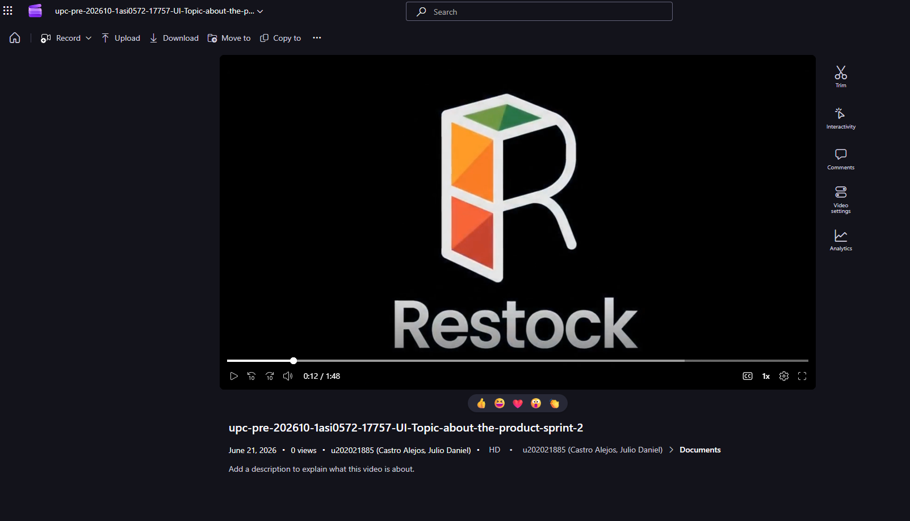
*Interfaz de la aplicación Restock presentada en el video institucional.*

**Enlaces de acceso:**

| Plataforma | Enlace de Acceso |
| :--- | :--- |
| **Microsoft Stream** | [https://shorturl.at/XYcrE](https://shorturl.at/XYcrE) |
| **YouTube** | [https://www.youtube.com/watch?v=2pV4h6XbO7Y](https://www.youtube.com/watch?v=2pV4h6XbO7Y) |