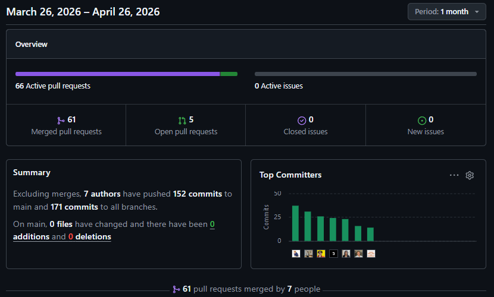
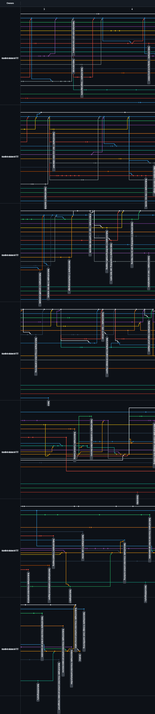

<div id="cover-page" align="center">


&nbsp;

# UNIVERSIDAD PERUANA DE CIENCIAS APLICADAS
## Ingeniería de Software
### Ciclo: 202610
### 1ASI0572 | Desarrollo de Soluciones IoT
### NRC: 17757
### Docente: Angel Augusto Velasquez Nuñez

&nbsp;
&nbsp;

## Informe de Trabajo Final
### Startup: UI-Topic
### Producto: Restock

&nbsp;

### u202021885 - Castro Alejos, Julio Daniel
### u202312508 - Coronel Espinoza, Farid Sebastian
### u202311938 - Diaz Quispe, Matias Sebastian
### u202319831 - Guerra Perez, José Jahaziel
### u202317483 - Juarez Leon, Nicolas Emilio Walter
### u202314101 - Navarro Chinga, Antonio Jhair
### u202319448 - Shapiama Rivera, Gabriela Nicole

&nbsp;
### Abril 2026

</div>

&nbsp;

<div class="page"></div>

## Registro de Versiones

| *Versión* | *Fecha* | *Autor* | *Descripción de modificación* |
| :----------: | :-------: | :-------- | :-------------------------------- |
|     1.2     |          |           |                                   |
|     1.3     |          |           |                                   |
|     1.4     |          |           |                                   |
|     1.5     |          |           |                                   |
|     1.6     |          |           |                                   |
|     1.7     |          |           |                                   |

# Project Report Collaboration Insights

Para el desarrollo del **Project Report**, el equipo utiliza un repositorio dentro de la organización en GitHub. A continuación, se presenta la evidencia de colaboración correspondiente y en coherencia con el registro de versiones del informe.

**Repositorio del informe del proyecto:** [https://shortlink.uk/1oqQ5](https://shortlink.uk/1oqQ5)

**Total de commits:** X

**Autores contribuyentes:**

| Integrante | Usuario de GitHub |
|---|---|
| Julio Castro Alejos | `JulioXC4` |
| Farid Sebastian Coronel Espinoza | `Far14z` |
| Matias Sebastian Diaz Quispe | `equinox-1092` |
| José Jahaziel Guerra Perez | `jahazielgg` |
| Nicolas Emilio Walter Juarez Leon | `JuarezLn10` |
| Antonio Jhair Navarro Chinga | `AntonioNavarro24` |
| Gabriela Nicole Shapiama Rivera | `GabrielaShapiama28` |

El equipo adoptó una estrategia de ramas basada en **feature branches** (`feature/<sección>`), donde cada integrante trabajó de forma aislada sobre la sección asignada y luego integró sus cambios a `main` mediante *pull requests* con revisión cruzada. Los mensajes de commit siguen la convención **Conventional Commits**, usando prefijos como `feat:`, `fix:` y `chore:` para mantener un historial claro y trazable.

---

## AV1 – Sprint Review – Semana 4

Durante esta fase, el equipo elaboró el **informe inicial**, abarcando los siguientes entregables:

- **Informe del proyecto** con carátula, registro de versiones y tabla de contenidos.
- **Capítulos I al IV**, cubriendo introducción, elicitación de requisitos, especificación de requisitos y diseño de la solución de software.
- **Student Outcomes**, conclusiones preliminares, bibliografía y anexos.
- **Keynote de exposición** y video de sustentación del avance.

Cada sección fue desarrollada en su propia rama `feature/<sección>` (por ejemplo, `feature/chapter-01`, `feature/chapter-02`) y los commits siguieron la convención establecida, como se muestra a continuación:

```text
feat(chapter-01): add startup profile and problem statement
chore(annexes): add supplementary files and bibliography
fix(chapter-02): correct user persona descriptions
```

**Analíticos de colaboración – GitHub Insights:**


*Figura: Contribuciones por integrante durante el AV1*


*Figura: Historial de commits del repositorio – AV1*

# Contenido

## Tabla de contenidos

- [Student Outcome](README.md#student-outcome)
- [Capítulo I: Introducción](01-chap1-introduction.md)

  - [1.1. Startup Profile](01-chap1-introduction.md#11-startup-profile)
    - [1.1.1. Descripción de la Startup](01-chap1-introduction.md#111-descripción-de-la-startup)
    - [1.1.2. Perfiles de integrantes del equipo](01-chap1-introduction.md#112-perfiles-de-integrantes-del-equipo)
  - [1.2. Solution Profile](01-chap1-introduction.md#12-solution-profile)
    - [1.2.1. Antecedentes y problemática](01-chap1-introduction.md#121-antecedentes-y-problemática)
    - [1.2.2. Lean UX Process](01-chap1-introduction.md#122-lean-ux-process)
      - [1.2.2.1. Lean UX Problem Statements](01-chap1-introduction.md#1221-lean-ux-problem-statements)
      - [1.2.2.2. Lean UX Assumptions](01-chap1-introduction.md#1222-lean-ux-assumptions)
      - [1.2.2.3. Lean UX Hypothesis Statements](01-chap1-introduction.md#1223-lean-ux-hypothesis-statements)
      - [1.2.2.4. Lean UX Canvas](01-chap1-introduction.md#1224-lean-ux-canvas)
  - [1.3. Segmentos objetivo](01-chap1-introduction.md#13-segmentos-objetivo)
- [Capítulo II: Requirements Elicitation &amp; Analysis](02-chap2-requirements-elicitation-and-analysis.md)

  - [2.1. Competidores](02-chap2-requirements-elicitation-and-analysis.md#21-competidores)
    - [2.1.1. Análisis competitivo](02-chap2-requirements-elicitation-and-analysis.md#211-análisis-competitivo)
    - [2.1.2. Estrategias y tácticas frente a competidores](02-chap2-requirements-elicitation-and-analysis.md#212-estrategias-y-tácticas-frente-a-competidores)
  - [2.2. Entrevistas](02-chap2-requirements-elicitation-and-analysis.md#22-entrevistas)
    - [2.2.1. Diseño de entrevistas](02-chap2-requirements-elicitation-and-analysis.md#221-diseño-de-entrevistas)
    - [2.2.2. Registro de entrevistas](02-chap2-requirements-elicitation-and-analysis.md#222-registro-de-entrevistas)
    - [2.2.3. Análisis de entrevistas](02-chap2-requirements-elicitation-and-analysis.md#223-análisis-de-entrevistas)
  - [2.3. Needfinding](02-chap2-requirements-elicitation-and-analysis.md#23-needfinding)
    - [2.3.1. User Personas](02-chap2-requirements-elicitation-and-analysis.md#231-user-personas)
    - [2.3.2. User Task Matrix](02-chap2-requirements-elicitation-and-analysis.md#232-user-task-matrix)
    - [2.3.3. User Journey Mapping](02-chap2-requirements-elicitation-and-analysis.md#233-user-journey-mapping)
    - [2.3.4. Empathy Mapping](02-chap2-requirements-elicitation-and-analysis.md#234-empathy-mapping)
  - [2.4. Big Picture EventStorming](02-chap2-requirements-elicitation-and-analysis.md#24-big-picture-eventstorming)
  - [2.5. Ubiquitous Language](02-chap2-requirements-elicitation-and-analysis.md#25-ubiquitous-language)
- [Capítulo III: Requirements Specification](03-chap3-requirements-specification.md)

  - [3.1. User Stories](03-chap3-requirements-specification.md#31-user-stories)
  - [3.2. Impact Mapping](03-chap3-requirements-specification.md#32-impact-mapping)
  - [3.3. Product Backlog](03-chap3-requirements-specification.md#33-product-backlog)
- [Capítulo IV: Solution Software Design](04-chap4-solution-software-design.md)

  - [4.1. Strategic-Level Domain-Driven Design](04-chap4-solution-software-design.md#41-strategic-level-domain-driven-design)

    - [4.1.1. Design-Level EventStorming](04-chap4-solution-software-design.md#411-design-level-eventstorming)
      - [4.1.1.1. Candidate Context Discovery](04-chap4-solution-software-design.md#4111-candidate-context-discovery)
      - [4.1.1.2. Domain Message Flows Modeling](04-chap4-solution-software-design.md#4112-domain-message-flows-modeling)
      - [4.1.1.3. Bounded Context Canvases](04-chap4-solution-software-design.md#4113-bounded-context-canvases)
    - [4.1.2. Context Mapping](04-chap4-solution-software-design.md#412-context-mapping)
    - [4.1.3. Software Architecture](04-chap4-solution-software-design.md#413-software-architecture)
      - [4.1.3.1. System Landscape Diagram](04-chap4-solution-software-design.md#4131-system-landscape-diagram)
      - [4.1.3.2. Context Level Diagrams](04-chap4-solution-software-design.md#4132-context-level-diagrams)
      - [4.1.3.3. Container Level Diagrams](04-chap4-solution-software-design.md#4133-container-level-diagrams)
      - [4.1.3.4. Deployment Diagrams](04-chap4-solution-software-design.md#4134-deployment-diagrams)
  - [4.2. Tactical-Level Domain-Driven Design](04-chap4-solution-software-design.md#42-tactical-level-domain-driven-design)
- [Capítulo V: Solution UI/UX Design](05-chap5-solution-ui-ux-design.md)

  - [5.1. Style Guidelines](05-chap5-solution-ui-ux-design.md#51-style-guidelines)
  - [5.2. Information Architecture](05-chap5-solution-ui-ux-design.md#52-information-architecture)
  - [5.3. Landing Page UI Design](05-chap5-solution-ui-ux-design.md#53-landing-page-ui-design)
  - [5.4. Applications UX/UI Design](05-chap5-solution-ui-ux-design.md#54-applications-uxui-design)
  - [5.5. Applications Prototyping](05-chap5-solution-ui-ux-design.md#55-applications-prototyping)
  - [5.6. IoT Device Design](05-chap5-solution-ui-ux-design.md#56-iot-device-design)
- [Capítulo VI: Product Implementation, Validation &amp; Deployment](06-chap6-product-implementation-validation-and-deployment.md)

  - [6.1. Software Configuration Management](06-chap6-product-implementation-validation-and-deployment.md#61-software-configuration-management)
  - [6.2. Implementation (Sprints)](06-chap6-product-implementation-validation-and-deployment.md#62-implementation-sprints)
  - [6.3. Validation Interviews](06-chap6-product-implementation-validation-and-deployment.md#63-validation-interviews)
  - [6.4. Video About-the-Product](06-chap6-product-implementation-validation-and-deployment.md#64-video-about-the-product)
- [Conclusiones](07-conclusions.md)
- [Bibliografía](08-bibliography.md)
- [Anexos](09-annexes.md)

# Student Outcome

**ABET – EAC - Student Outcome 5**

**Criterio:** Trabaja efectivamente en un equipo cuyos
miembros juntos proporcionan liderazgo; crea
un entorno colaborativo e inclusivo y establece
metas, planifica tareas y cumple objetivos

En el siguiente cuadro se describe las acciones realizadas y enunciados de conclusiones por parte del grupo, que permiten sustentar el haber alcanzado el logro del ABET – EAC - Student Outcome 5.

| Criterio específico                                                                                      | Acciones realizadas                                                                                                                                                                                                                                                                                                                                                                                                                                                                                                                                                                                                                                                                                                                                                                                                                                                                                                                                                                                                                                                                                                                                                                                                                                                                                                                                                                                                                                                                                                                                                                                                                                                                                                                                                                                                                                                                                                                                                                                                                                                                                                                                                                                                                                                                                                                                                                                                                                                                                                                                                                                                                                                                                                                                                                                                                                                                                                                                                                                                                                                                                                                                                                                                                                         | Conclusiones                                                                                                                                                                                                                                                                                                                                                                                                                                                                                                                                                                                                                                                      |
|----------------------------------------------------------------------------------------------------------|-------------------------------------------------------------------------------------------------------------------------------------------------------------------------------------------------------------------------------------------------------------------------------------------------------------------------------------------------------------------------------------------------------------------------------------------------------------------------------------------------------------------------------------------------------------------------------------------------------------------------------------------------------------------------------------------------------------------------------------------------------------------------------------------------------------------------------------------------------------------------------------------------------------------------------------------------------------------------------------------------------------------------------------------------------------------------------------------------------------------------------------------------------------------------------------------------------------------------------------------------------------------------------------------------------------------------------------------------------------------------------------------------------------------------------------------------------------------------------------------------------------------------------------------------------------------------------------------------------------------------------------------------------------------------------------------------------------------------------------------------------------------------------------------------------------------------------------------------------------------------------------------------------------------------------------------------------------------------------------------------------------------------------------------------------------------------------------------------------------------------------------------------------------------------------------------------------------------------------------------------------------------------------------------------------------------------------------------------------------------------------------------------------------------------------------------------------------------------------------------------------------------------------------------------------------------------------------------------------------------------------------------------------------------------------------------------------------------------------------------------------------------------------------------------------------------------------------------------------------------------------------------------------------------------------------------------------------------------------------------------------------------------------------------------------------------------------------------------------------------------------------------------------------------------------------------------------------------------------------------------------------|-------------------------------------------------------------------------------------------------------------------------------------------------------------------------------------------------------------------------------------------------------------------------------------------------------------------------------------------------------------------------------------------------------------------------------------------------------------------------------------------------------------------------------------------------------------------------------------------------------------------------------------------------------------------|
| **5.c.1 Trabaja en equipo para proporcionar liderazgo en forma conjunta**                                | **Castro Alejos, Julio Daniel** <br> TB1 <br> Evidenció liderazgo en la definición de requisitos al diseñar las entrevistas para los segmentos objetivo, guiando la obtención de información clave del usuario que sirvió como base para el análisis de requisitos y la posterior identificación de necesidades del usuario. <br> <br> **Coronel Espinoza, Farid Sebastian** <br> TB1 <br> Evidenció liderazgo al proponer la estructura del negocio mediante la identificación de bounded contexts y el diseño del diagrama de contenedores, definiendo cómo interactúan cada aplicación dentro de la arquitectura de la solución IoT y asegurando la coherencia entre el resto de las aplicaciones. <br> <br> **Diaz Quispe, Matias Sebastian** <br> TB1 <br> Evidenció liderazgo en el análisis de usuarios al elaborar los user personas, aportando una visión clara de los perfiles del sistema para orientar las decisiones de diseño. Asimismo, durante el proceso de Context Mapping, participó activamente proponiendo ideas y alternativas sobre la organización y relación entre bounded contexts, contribuyendo a la evaluación de diferentes escenarios. <br> <br> **Guerra Perez, José Jahaziel** <br> TB1 <br> Evidenció liderazgo en la estructuración del dominio mediante la elaboración del Lean UX Canvas y el lenguaje ubicuo, estableciendo una base común para la comprensión del sistema y facilitando la alineación del equipo respecto al dominio del negocio. <br> <br> **Juarez Leon, Nicolas Emilio Walter** <br> TB1 <br> Evidenció liderazgo en el análisis del dominio al procesar entrevistas y participar en los procesos de Big Picture Event Storming e EventStorming, identificando eventos de negocio y procesos clave del sistema. Además, propuso criterios de comunicación entre bounded contexts dentro de cada contenedor, fortaleciendo la coherencia del diseño arquitectónico. <br> <br> **Navarro Chinga, Antonio Jhair** <br> TB1 <br> Evidenció liderazgo en el modelado de requerimientos al desarrollar el Impact Mapping, User Task Matrix y hypothesis statements, alineando objetivos del negocio con necesidades del usuario y permitiendo estructurar de forma clara el alcance de la solución. <br> <br> **Shapiama Rivera, Gabriela Nicole** <br> TB1 <br> Evidenció liderazgo al proponer y organizar reuniones de trabajo que fomentaron la participación activa de todos los miembros del equipo, facilitando la coordinación en el levantamiento de información del dominio. Asimismo, se involucró en el proceso de EventStorming, contribuyendo a la identificación de eventos clave y a la comprensión global del flujo del negocio dentro de la solución. <br> <br>                                                                                                                                                                                                                                                                                                                                                                                                                                                                                                                       | TB1 <br> El equipo evidenció un trabajo colaborativo orientado al liderazgo distribuido, donde cada integrante asumió responsabilidades específicas dentro del análisis del problema y el modelado de la solución. Las contribuciones abarcaron desde la definición de usuarios y levantamiento de requisitos hasta la estructuración del dominio mediante técnicas de Context Mapping, EventStorming y arquitectura de sfotware. Este enfoque permitió consolidar una comprensión común del sistema, fortalecer la toma de decisiones en el diseño de la solución IoT y asegurar la coherencia entre los distintos artefactos durante la etapa de análisis. <br> |
| **5.c.2 Crea un entorno colaborativo e inclusivo, establece metas, planifica tareas y cumple objetivos** | **Castro Alejos, Julio Daniel** <br> TB1 <br> Se involucró en la organización del trabajo del equipo apoyando la definición de objetivos para el levantamiento de información. Desarrolló el diseño de entrevistas orientadas a los segmentos objetivo, lo que facilitó la obtención de requisitos del sistema y el análisis de necesidades mediante empathy mapping, aportando información clave para la propuesta de solución. <br> <br> **Coronel Espinoza, Farid Sebastian** <br> TB1 <br> Participó en la coordinación de actividades del equipo alineando tareas con los objetivos del proyecto mediante el levantamiento y análisis de requisitos, así como la priorización del product backlog. Además, junto al equipo, contribuyó a la identificación de bounded contexts y elaboró el diagrama de contenedores, definiendo la interacción entre los componentes de la arquitectura de la solución. <br> <br> **Diaz Quispe, Matias Sebastian** <br> TB1 <br> Colaboró en la estructuración del trabajo del equipo mediante la definición de perfiles de usuario, contribuyendo a la elaboración de user personas para el sistema. Asimismo, participó en la identificación conjunta de posibles bounded contexts, apoyando la organización inicial del dominio y el cumplimiento de los objetivos del análisis del proyecto. <br> <br> **Guerra Perez, José Jahaziel** <br> TB1 <br> Se integró a la planificación del equipo aportando a la definición de metas para el análisis de la solución. Elaboró el Lean UX Canvas, organizando supuestos, problemas e hipótesis del proyecto; además, construyó el lenguaje ubicuo para estandarizar la comunicación del dominio. También colaboró en el diseño de los diagramas de despliegue de contenedores, asegurando la representación adecuada de la arquitectura. <br> <br> **Juarez Leon, Nicolas Emilio Walter** <br> TB1 <br> Contribuyó a la organización del equipo participando en la planificación de actividades orientadas al análisis del sistema. Realizó el análisis de entrevistas de los segmentos definidos, permitiendo extraer hallazgos relevantes para los requerimientos. Asimismo, desarrolló el diagrama de componentes por contenedor y participó en el Big Picture EventStorming, apoyando la modelación de procesos del negocio. <br> <br> **Navarro Chinga, Antonio Jhair** <br> TB1 <br> Apoyó la coordinación del equipo en el establecimiento de metas relacionadas al análisis de la solución. Elaboró el Impact Mapping alineando objetivos del negocio con necesidades del usuario, además de construir la User Task Matrix para estructurar actividades del usuario. También definió hypothesis statements dentro del proceso Lean UX, contribuyendo a la validación de supuestos del proyecto. <br> <br> **Shapiama Rivera, Gabriela Nicole** <br> TB1 <br> Formó parte de la organización del equipo apoyando la planificación del levantamiento de información. Realizó entrevistas al segmento de administradores de restaurantes, obteniendo información relevante para el análisis del sistema. Además, diseñó el system landscape diagram y participó en EventStorming, contribuyendo a la identificación de eventos y procesos del dominio. <br> <br> | TB1 <br> En esta primera entrega se logró consolidar el análisis del problema y la base de la solución IoT mediante un trabajo colaborativo. Se aplicaron procesos de Lean UX, entrevistas y técnicas de needfinding para identificar necesidades de los usuarios y definir artefactos como user personas, user stories y product backlog. Además, se establecieron elementos iniciales de la arquitectura como bounded contexts y el diagrama de contenedores, permitiendo organizar la solución de forma estructurada. Esto evidencia la coordinación del equipo en la planificación y cumplimiento de objetivos para el desarrollo del proyecto. <br>          |
            

